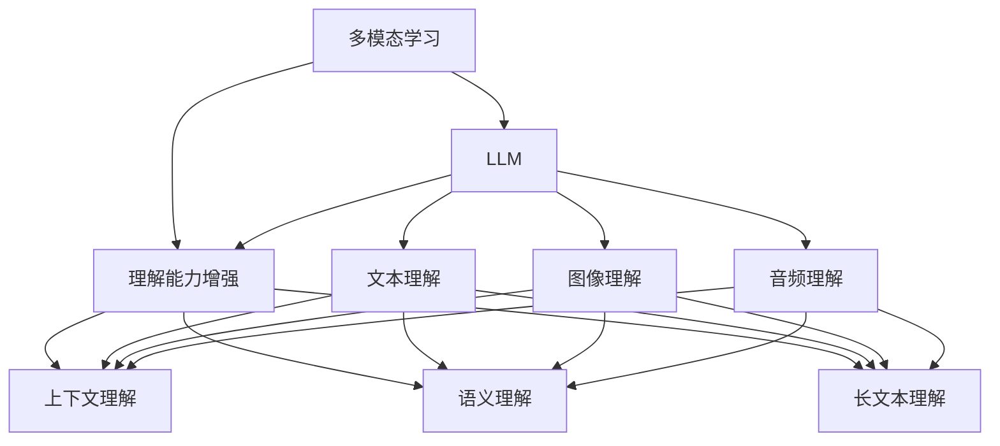
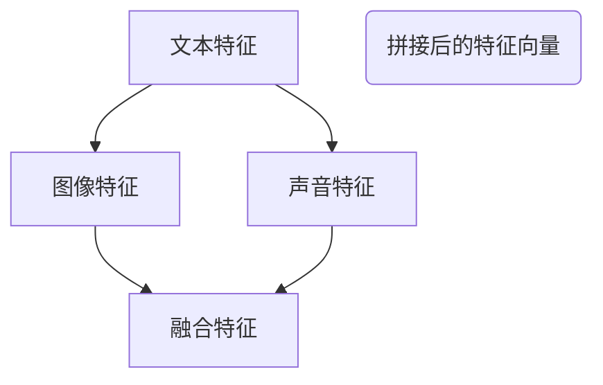
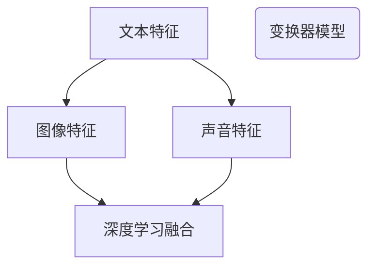
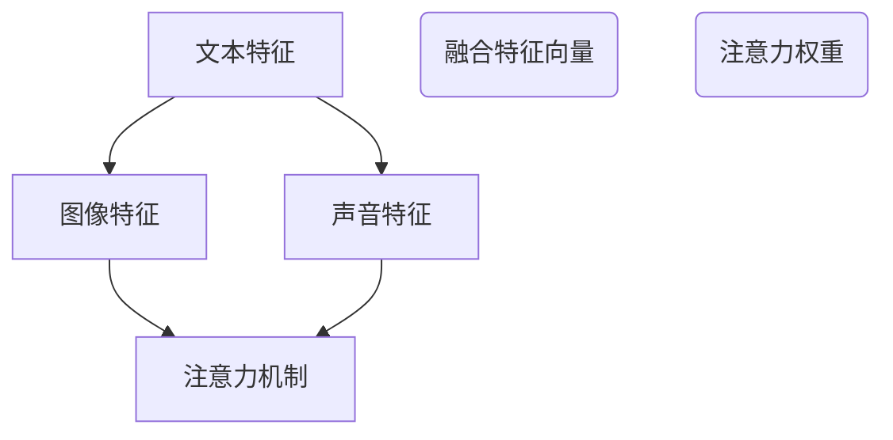

                 

### 文章标题与关键词

# 《多模态学习：增强LLM应用的理解能力》

关键词：多模态学习、LLM、理解能力、人工智能、深度学习、数据融合、注意力机制、项目实战

在人工智能领域，语言模型（Language Model，简称LM）已经成为自然语言处理（Natural Language Processing，简称NLP）的核心技术。尤其是大型语言模型（Large Language Model，简称LLM），如GPT-3、BERT等，它们在文本生成、文本分类、问答系统等领域展现了强大的能力。然而，随着应用场景的复杂化和多样化，单纯依赖文本数据已经无法满足需求，这就需要引入多模态学习（Multimodal Learning）来增强LLM的理解能力。

多模态学习是指结合不同类型的数据，如文本、图像、声音等，进行机器学习的过程。它旨在通过整合多种数据源，提升模型的泛化能力和理解能力。而LLM在多模态学习中的应用，则可以使其不仅能够理解文本，还能够理解图像、声音等其他类型的数据，从而实现更广泛的应用。

本文将围绕多模态学习与LLM的结合，探讨其在提升理解能力方面的潜力。首先，我们将介绍多模态学习的基本概念，包括多模态数据的类型、预处理方法、数据融合策略等。接着，我们将深入探讨LLM的基本架构与算法，以及其在多模态学习中的具体应用。随后，我们将分析如何通过多模态学习来增强LLM的理解能力，并介绍一些实际应用案例。最后，我们将总结本文的主要观点，并探讨多模态学习和LLM在未来的发展趋势。

通过本文的阅读，读者将能够系统地了解多模态学习与LLM的原理和应用，掌握如何通过多模态学习来提升LLM的理解能力，并了解这一领域的最新进展和未来方向。

### 摘要

本文旨在探讨多模态学习与大型语言模型（LLM）的结合，以增强LLM在理解复杂信息方面的能力。多模态学习通过整合文本、图像、声音等多种类型的数据，使模型能够从不同的视角理解信息，从而提升其泛化能力和理解深度。本文首先介绍了多模态学习的基本概念，包括多模态数据的类型、预处理方法以及数据融合策略。接着，详细讨论了LLM的基本架构和算法，包括模型结构、训练与优化、注意力机制以及推理与生成过程。随后，本文分析了多模态学习如何增强LLM的理解能力，包括上下文理解、语义理解和长文本理解等方面。通过实际应用案例，展示了多模态LLM在问答系统、文本生成、图像描述和情感分析等领域的具体应用。最后，本文总结了多模态学习和LLM在提升理解能力方面的优势，并探讨了未来的发展趋势。通过本文的阅读，读者将能够深入理解多模态学习与LLM的结合，掌握如何利用多模态数据提升语言模型的理解能力。

### 提取核心概念与联系

在深入探讨《多模态学习：增强LLM应用的理解能力》这一主题之前，我们首先需要明确几个核心概念，并探讨它们之间的联系。

**多模态学习**：这是指结合多种类型的数据进行机器学习的过程。在人工智能领域，多模态学习通过整合文本、图像、音频、视频等多种数据源，以提高模型的泛化能力和理解深度。例如，一个多模态学习系统可能会结合用户生成的文本评论和图像，以更全面地理解用户的反馈。

**LLM（大型语言模型）**：这是一种能够处理和理解大量文本数据的模型。LLM的核心目标是通过学习大量文本数据，生成与人类语言相似的自然语言文本。常见的LLM包括GPT-3、BERT、RoBERTa等，它们在自然语言生成、问答系统、文本分类等任务中表现出色。

**理解能力增强**：这是指通过多模态学习，提升LLM对文本和问题的理解能力。增强理解能力意味着模型能够更准确地理解上下文、语义和长文本，从而生成更符合人类语言习惯的输出。

**多模态学习与LLM的关系**：多模态学习与LLM的结合，可以通过整合不同类型的数据来丰富LLM的输入信息，从而提升其理解能力。具体来说，LLM可以利用图像、音频等多模态数据进行上下文扩展，语义增强，甚至长文本理解，使其在处理复杂问题时更加灵活和准确。

接下来，我们使用Mermaid流程图来展示这些概念之间的联系：

在这个流程图中，多模态学习（A）作为数据源，为LLM（B）提供丰富的输入信息。LLM不仅能够处理文本数据（D），还能够处理图像（E）和音频（F）数据，从而在上下文理解（G）、语义理解（H）和长文本理解（I）方面获得增强。

通过这个流程图，我们可以清晰地看到多模态学习如何通过LLM的整合，实现理解能力的提升。接下来，我们将详细探讨多模态学习的基础知识，包括多模态数据的类型、预处理方法以及数据融合策略。

### 第1章：引言与概述

#### 1.1 多模态学习的基本概念

多模态学习是一种通过整合来自不同感官的多种数据类型（如文本、图像、声音、视频等）进行机器学习的方法。其基本思想是利用多种数据源，从不同角度对同一个问题进行建模，从而提高模型的泛化能力和理解深度。多模态学习的基本概念可以概括为以下几个要点：

**多模态数据的类型**：

- **文本**：文本是最常见和多易理解的多模态数据类型之一。它可以包含纯文本、标记文本（带标签的文本）和序列标注文本（带序列标注的文本）等。

- **图像**：图像数据是多模态学习中的重要组成部分。它可以包含静态图像、动态图像、面部图像、遥感图像等。图像数据通常通过像素值来表示。

- **声音**：声音数据包括语音、音乐、环境音等。声音数据可以通过音频信号、频谱图等方式进行表示。

- **视频**：视频数据结合了图像和声音，可以提供丰富的视觉和听觉信息。视频数据可以通过帧序列、视频流等方式进行处理。

**多模态学习的基本流程**：

1. **数据收集**：首先，需要收集不同类型的数据，这些数据可以是公开的数据集，也可以是自定义的数据集。

2. **数据预处理**：对收集到的多模态数据进行清洗、标准化和转换，以便于后续的建模和融合。

3. **数据融合**：将不同类型的数据进行融合，形成统一的特征表示。常见的融合方法包括特征拼接、特征映射和深度学习融合等。

4. **模型训练**：使用融合后的数据训练多模态模型，模型可以是传统的机器学习模型，也可以是深度学习模型。

5. **模型评估与优化**：通过验证集和测试集对训练好的模型进行评估，并根据评估结果进行模型优化。

**多模态学习的重要应用领域**：

- **计算机视觉**：通过结合图像数据和文本数据，提高图像分类、目标检测和图像生成等任务的性能。

- **自然语言处理**：利用文本和图像数据，提升文本生成、文本分类和问答系统的性能。

- **语音识别**：结合音频数据和文本数据，提高语音识别的准确性和鲁棒性。

- **医疗诊断**：利用医学图像和患者病历数据，实现更准确的疾病诊断和治疗方案制定。

通过上述基本概念和流程，我们可以看到多模态学习在提高模型性能和理解深度方面的重要作用。接下来，我们将进一步探讨LLM的背景与特性，以及多模态学习与LLM结合的意义。

#### 1.2 LLM的背景与特性

**LLM（大型语言模型）**是一种能够处理和理解大量文本数据的人工智能模型，其核心目标是生成与人类语言相近的文本。LLM的发展可以追溯到早期的小型语言模型，如n-gram模型和基于规则的方法，但近年来随着深度学习技术的进步，LLM取得了显著的发展，特别是在生成文本的流畅性和准确性方面。

**LLM的基本原理**：

LLM的工作原理主要基于深度神经网络，特别是变换器（Transformer）架构。变换器架构通过自注意力机制（Self-Attention）和多头注意力（Multi-Head Attention）机制，能够捕捉文本中的长距离依赖关系，从而生成高质量的自然语言文本。

具体来说，LLM的训练过程包括以下几个步骤：

1. **数据收集与预处理**：收集大规模的文本数据，并进行预处理，包括文本清洗、分词、去停用词等。

2. **模型初始化**：初始化变换器模型，包括嵌入层、多头自注意力层和前馈网络等。

3. **模型训练**：通过反向传播算法，对模型进行训练，优化模型参数，使其能够生成与训练数据相似的高质量文本。

4. **模型评估与优化**：使用验证集和测试集对模型进行评估，根据评估结果对模型进行优化。

**LLM的关键特性**：

- **大规模**：LLM能够处理和理解大量的文本数据，这使得它们在生成文本时能够更好地模仿人类的语言风格和表达方式。

- **自适应性**：LLM能够根据输入文本的上下文自适应地调整生成文本的内容和风格。

- **灵活性**：LLM能够灵活地处理各种语言任务，包括文本生成、文本分类、问答系统等。

- **可扩展性**：LLM可以通过增加训练数据量和调整模型参数，进一步提高其性能和泛化能力。

**LLM的应用领域**：

- **文本生成**：包括文章写作、对话生成、翻译等。

- **文本分类**：包括情感分析、主题分类、新闻分类等。

- **问答系统**：包括自动问答、智能客服、教育辅导等。

- **自然语言理解**：包括语义分析、实体识别、关系提取等。

通过LLM的背景与特性介绍，我们可以看到，LLM在自然语言处理领域具有巨大的潜力和应用价值。接下来，我们将讨论多模态学习与LLM结合的意义，以及这种结合如何增强LLM的应用能力。

#### 1.3 多模态学习与LLM结合的意义

多模态学习与LLM的结合在人工智能领域具有重要的意义，主要体现在以下几个方面：

**1.3.1 提升理解能力**

传统的LLM主要依赖于文本数据进行训练，虽然能够在文本生成和文本理解方面表现出色，但在处理复杂、多变的现实问题时，往往存在一定的局限性。而多模态学习通过整合文本、图像、声音等多种类型的数据，可以提供更丰富的上下文信息和多维度的视角，从而提升LLM对问题的理解能力。例如，在问答系统中，结合图像数据可以帮助LLM更好地理解问题中的视觉信息，从而生成更准确的答案。

**1.3.2 拓展应用场景**

通过多模态学习，LLM的应用场景得到了显著拓展。在计算机视觉领域，多模态学习可以帮助LLM更好地理解图像内容，从而在图像分类、目标检测和图像生成等任务中发挥重要作用。在语音识别领域，结合文本数据可以提升语音识别的准确性和鲁棒性。在医疗领域，结合医学图像和文本数据，可以实现更准确的疾病诊断和治疗方案制定。

**1.3.3 提高生成文本的质量**

多模态学习可以通过整合图像、声音等多维度的数据，提供更丰富的信息输入，从而提高LLM生成文本的质量。例如，在文本生成任务中，结合图像数据可以使生成的文本更具有描述性和可视化效果。在翻译任务中，结合音频数据可以提升翻译的准确性和流畅性。

**1.3.4 增强模型的泛化能力**

多模态学习可以提供更广泛和多样化的数据来源，从而增强LLM的泛化能力。通过在不同场景下对多模态数据进行训练，LLM可以更好地适应各种不同的应用场景，提高其在各种任务中的性能和可靠性。

**1.3.5 促进跨学科研究**

多模态学习与LLM的结合，不仅促进了计算机科学领域的发展，还推动了心理学、神经科学、认知科学等跨学科研究。例如，通过研究多模态学习如何影响人类的认知过程，可以更好地理解人类与人工智能之间的交互机制，从而为人工智能的发展提供新的理论和实践基础。

总之，多模态学习与LLM的结合，不仅提升了LLM的应用能力和理解深度，还拓展了其应用领域，为人工智能的发展带来了新的机遇和挑战。

### 第2章：多模态学习基础

#### 2.1 多模态数据的类型

多模态学习的关键在于处理来自不同感官的数据，这些数据类型包括文本、图像、声音和视频等。每种类型的数据都有其独特的特性和应用场景。

**文本数据**：文本数据是最常见的多模态数据之一，包括纯文本、标记文本和序列标注文本等。文本数据在自然语言处理（NLP）任务中具有重要地位，如文本分类、情感分析和问答系统等。

**图像数据**：图像数据包括静态图像、动态图像和面部图像等。静态图像通常用于图像识别和分类任务，动态图像则广泛应用于视频分析和视频生成任务。

**声音数据**：声音数据包括语音、音乐和环境音等。语音数据在语音识别和语音合成任务中至关重要，而音乐和环境音则常用于情感分析和场景识别等任务。

**视频数据**：视频数据结合了图像和声音，提供了丰富的视觉和听觉信息。视频数据在视频监控、动作识别和视频生成等领域具有广泛的应用。

**多模态数据的特点与应用场景**：

- **文本与图像**：文本和图像的结合在计算机视觉和NLP任务中具有广泛应用，如图像标注、文本图像分类和文本图像检索等。
- **文本与声音**：文本和声音的结合在语音识别和语音合成任务中至关重要，同时也广泛应用于情感分析和人机对话系统。
- **图像与声音**：图像和声音的结合在视频分析和虚拟现实中具有重要应用，如视频情感分析、视频生成和虚拟环境构建等。
- **文本、图像与声音**：这种全面的多模态数据结合在智能监控、人机对话系统和智能辅助等领域表现出色，能够提供更丰富的信息和更准确的决策支持。

#### 2.2 多模态数据预处理

多模态数据预处理是多模态学习中的关键步骤，目的是对原始数据进行清洗、标准化和转换，以形成适合模型训练的数据格式。

**文本数据预处理**：

- **文本清洗**：去除文本中的噪声，如HTML标签、特殊符号和停用词等。
- **分词**：将文本分割成单词或短语，常用的分词方法有基于词典的分词、基于统计的分词和基于字符的模糊分词等。
- **词性标注**：为每个单词标注词性，如名词、动词、形容词等，有助于提高模型的语义理解能力。

**图像数据预处理**：

- **图像去噪**：通过滤波器去除图像中的噪声，提高图像质量。
- **图像缩放与裁剪**：调整图像的大小和形状，以便于后续处理。
- **图像增强**：通过图像增强技术，提高图像的对比度、亮度和色彩饱和度，增强模型的识别能力。

**声音数据预处理**：

- **声音降噪**：去除声音中的噪声，提高声音的清晰度。
- **声波分割**：将连续的声音信号分割成多个片段，以便于后续处理。
- **声谱图转换**：将声音信号转换为频谱图，便于模型处理。

**多模态数据预处理流程**：

1. **数据收集**：收集不同类型的多模态数据。
2. **数据清洗**：去除噪声和冗余数据。
3. **数据标准化**：将不同类型的数据转换为统一的格式，如将图像缩放为固定大小，将声音转换为固定长度。
4. **特征提取**：提取数据的特征，如文本的词向量、图像的卷积特征、声音的频谱特征等。
5. **数据融合**：将提取到的特征进行融合，形成多模态特征向量。

通过上述预处理步骤，多模态数据得以转化为适合模型训练的数据格式，为后续的多模态学习奠定了基础。

#### 2.3 多模态数据融合方法

多模态数据融合是多模态学习中的核心步骤，其目标是将来自不同类型的数据源（如文本、图像、声音等）整合成统一的数据表示，以便模型能够有效利用这些多模态信息。以下是几种常见的数据融合方法：

**1. 特征拼接**

特征拼接是一种简单直接的多模态数据融合方法。该方法将不同类型的数据特征直接拼接在一起，形成新的特征向量。具体步骤如下：

优点：实现简单，易于理解。
缺点：无法充分利用不同数据类型之间的内在关联。

**2. 特征映射**

特征映射方法通过将不同类型的数据特征映射到同一特征空间，从而实现数据融合。常见的方法包括线性映射和非线性映射。线性映射通常使用线性变换矩阵实现，而非线性映射则使用神经网络等非线性模型。

优点：能够捕捉不同数据类型之间的关联。
缺点：需要较大的计算资源。

**3. 深度学习融合**

深度学习方法通过多层神经网络结构，自动学习不同数据类型之间的复杂关联。常见的深度学习融合方法包括卷积神经网络（CNN）、循环神经网络（RNN）和变换器（Transformer）等。

优点：能够高效地捕捉多模态数据的复杂关联。
缺点：训练过程复杂，需要大量数据和计算资源。

**4. 注意力机制**

注意力机制是一种能够自适应地分配不同数据类型的关注度的方法。通过注意力机制，模型可以在不同类型的特征之间动态调整权重，从而提高融合效果。

优点：能够自适应地融合多模态数据，提高融合效果。
缺点：计算复杂度较高，需要较大的计算资源。

**多模态数据融合方法的选择**：

选择适合的多模态数据融合方法，需要综合考虑数据类型、模型结构、计算资源等因素。在实际应用中，可以结合多种方法，以实现最佳融合效果。

#### 2.4 多模态学习的挑战与解决方案

多模态学习虽然具有巨大的潜力，但在实际应用中仍面临诸多挑战。以下是多模态学习的一些主要挑战以及相应的解决方案：

**1. 数据不一致性**

多模态学习中的数据通常来自不同的来源，可能存在不一致性。例如，图像中的物体可能与文本描述不完全匹配。这种不一致性可能导致模型在训练和推理过程中出现误差。

**解决方案**：

- **数据清洗与预处理**：通过清洗和预处理数据，减少不一致性。
- **数据增强**：通过数据增强技术，生成更多的训练样例，提高模型的鲁棒性。

**2. 数据不平衡**

在多模态数据集中，不同类型的数据可能存在严重的不平衡。例如，文本数据可能远多于图像数据，这可能导致模型对某一类型的数据过度依赖。

**解决方案**：

- **数据重采样**：通过重采样技术，平衡不同类型的数据比例。
- **数据扩充**：通过数据扩充技术，增加稀缺数据类型的样例数量。

**3. 特征融合的复杂性**

多模态数据融合方法的选择和设计非常复杂，需要处理不同类型数据之间的复杂关系。此外，深度学习模型的设计和训练也需要大量的计算资源和时间。

**解决方案**：

- **模型简化**：通过简化模型结构，减少训练和推理的计算复杂度。
- **分布式训练**：利用分布式计算技术，提高训练效率。

**4. 模型解释性**

多模态学习模型通常具有较强的预测能力，但缺乏解释性。这给模型的解释和验证带来了挑战。

**解决方案**：

- **模型解释技术**：通过模型解释技术，如敏感性分析、注意力机制等，提高模型的解释性。
- **可视化工具**：开发可视化工具，帮助用户理解模型的工作原理和决策过程。

通过上述解决方案，我们可以更好地应对多模态学习中的挑战，提高模型的性能和可靠性。接下来，我们将深入探讨LLM的基本架构与算法。

### 第3章：LLM基本架构与算法

#### 3.1 LLM的模型结构

LLM（大型语言模型）的核心是它的模型结构，这决定了模型在处理和理解文本数据时的能力。最常用的LLM模型结构是基于变换器（Transformer）架构的模型，如GPT（Generative Pre-trained Transformer）系列。以下是LLM模型结构的主要组成部分：

1. **嵌入层（Embedding Layer）**：嵌入层将输入文本的单词转换为高维向量表示。每个单词对应一个唯一的向量，这些向量可以在词向量空间中捕获单词的语义信息。嵌入层通常还包括位置编码（Positional Encoding），用于表示文本中单词的位置信息。

2. **变换器层（Transformer Layers）**：变换器层是LLM的核心部分，包括多头自注意力（Multi-Head Self-Attention）和前馈网络（Feedforward Network）。多头自注意力机制允许模型在处理文本时，同时关注多个位置的信息，从而捕获长距离依赖关系。前馈网络则对自注意力层的结果进行进一步处理，增强模型的非线性表达能力。

3. **层归一化（Layer Normalization）**：层归一化是一种常见的正则化技术，用于加速模型训练和防止梯度消失。它通过对每一层的输入和输出进行归一化，保持模型的稳定性和鲁棒性。

4. **Dropout（Dropout）**：Dropout是一种常用的正则化技术，通过随机丢弃一部分神经元，减少模型在训练过程中过拟合的风险。

5. **输出层（Output Layer）**：输出层通常是一个全连接层，用于将变换器层的输出映射到目标文本的单词概率分布。在生成文本时，模型会根据输出层的概率分布选择下一个单词。

#### 3.2 LLM的训练与优化

LLM的训练过程主要包括预训练和微调两个阶段。

**预训练**：预训练是指在大量未标注的数据上，通过无监督的方式训练模型，使其能够捕捉文本数据的语义信息。预训练的目标是学习一个通用的文本表示，以便模型在后续任务中能够高效地处理和理解文本。常见的预训练任务包括语言建模（Language Modeling）和掩码语言模型（Masked Language Model，简称MLM）。

- **语言建模**：语言建模的目标是预测下一个单词的概率，通常使用负采样（Negative Sampling）技术提高训练效率。
- **掩码语言模型**：掩码语言模型通过随机掩码一部分单词，要求模型预测这些掩码单词，从而增强模型对文本信息的理解。

**微调**：微调是指在预训练好的LLM基础上，使用有监督的任务数据对模型进行进一步训练，以适应特定的任务需求。微调过程主要包括以下步骤：

1. **数据准备**：准备用于微调的任务数据集，包括文本和标签。
2. **数据预处理**：对文本数据进行清洗、分词、去停用词等预处理操作。
3. **模型初始化**：使用预训练好的LLM模型作为初始化参数，通常包括嵌入层、变换器层和输出层。
4. **训练过程**：在训练过程中，模型会在数据集上进行迭代训练，通过优化算法（如梯度下降）更新模型参数。
5. **模型评估**：使用验证集和测试集对训练好的模型进行评估，根据评估结果调整模型参数，以优化模型性能。

#### 3.3 LLM的注意力机制

注意力机制是LLM的核心组成部分，它允许模型在处理文本时，动态地分配注意力权重，关注重要的信息，从而提高模型的性能和效果。以下是LLM中的几种注意力机制：

**1. 自注意力（Self-Attention）**

自注意力机制是变换器架构的核心，它允许模型在当前单词的基础上，同时关注其他所有单词的信息。自注意力机制的计算公式如下：

\[ \text{Attention}(Q, K, V) = \text{softmax}\left(\frac{QK^T}{\sqrt{d_k}}\right) V \]

其中，\( Q, K, V \) 分别代表查询（Query）、键（Key）和值（Value）向量，\( d_k \) 是键向量的维度。自注意力机制能够捕捉文本中的长距离依赖关系，从而提高模型的语义理解能力。

**2. 多头注意力（Multi-Head Attention）**

多头注意力机制通过并行计算多个自注意力头，每个头关注不同的信息，从而提高模型的表示能力。多头注意力机制的计算公式如下：

\[ \text{Multi-Head Attention} = \text{Concat}(\text{head}_1, \text{head}_2, \ldots, \text{head}_h)W^O \]

其中，\( h \) 是头的数量，\( W^O \) 是输出变换器。多头注意力机制能够捕捉文本中的复杂关系，从而提高模型的性能。

**3. 位置编码注意力（Positional Encoding Attention）**

位置编码注意力机制通过为每个单词添加位置编码（Positional Encoding），允许模型关注单词在文本中的位置信息。位置编码通常使用正弦和余弦函数生成，以确保在嵌入层中保持较小的维度。

\[ \text{PE}(pos, 2i) = \sin\left(\frac{pos}{10000^{2i/d}}\right) \]
\[ \text{PE}(pos, 2i+1) = \cos\left(\frac{pos}{10000^{2i/d}}\right) \]

其中，\( pos \) 是位置索引，\( d \) 是嵌入层的维度。位置编码注意力机制能够帮助模型理解文本中的顺序信息，从而提高模型的生成能力。

通过以上注意力机制，LLM能够在处理和理解文本数据时，动态地分配注意力权重，关注重要的信息，从而生成高质量的自然语言文本。接下来，我们将探讨LLM的推理与生成过程。

#### 3.4 LLM的推理与生成

LLM（大型语言模型）在推理与生成文本方面具有出色的能力，其核心在于如何根据输入的上下文生成连贯、合理的文本序列。以下是LLM在推理与生成过程中的关键步骤和机制：

**1. 推理过程**

LLM的推理过程主要包括以下步骤：

- **输入编码**：首先，将输入的文本序列编码为嵌入向量。嵌入向量由嵌入层生成，同时结合位置编码以捕捉文本中的位置信息。
- **自注意力计算**：通过多层变换器层，对输入编码进行自注意力计算。自注意力机制允许模型在当前单词的基础上，同时关注其他所有单词的信息，从而捕捉文本中的长距离依赖关系。
- **上下文表示**：经过自注意力计算后，每个单词的嵌入向量被更新，形成一个表示整个上下文的向量。这个上下文向量包含了文本序列中所有单词的信息，是后续生成步骤的重要输入。
- **输出概率分布**：使用输出层，将上下文向量映射到一个单词的概率分布。模型根据这个概率分布，选择下一个最有可能的单词。

**2. 生成过程**

LLM的生成过程主要包括以下步骤：

- **初始化**：初始化生成过程的起始状态，通常是一个随机的嵌入向量或者上一个生成的单词的嵌入向量。
- **概率抽样**：根据输出层的概率分布，选择下一个单词。通常使用顶部的几个高概率单词进行抽样，以避免生成的文本过于单调。
- **更新状态**：将新生成的单词加入到文本序列中，更新上下文向量。新的上下文向量会用于下一次生成的概率分布计算。
- **迭代生成**：重复上述步骤，逐步生成整个文本序列。每次生成的新单词都会更新上下文向量，从而影响后续生成的文本。

**生成策略**

在生成过程中，LLM使用多种策略来提高生成文本的质量和多样性：

- **温度调节**：通过调节生成过程中的温度参数，可以控制生成的文本的多样性。温度值较低时，生成的文本更为稳定，但可能缺乏创新性；温度值较高时，生成的文本更为多样化，但可能包含更多的随机性。
- **上下文引导**：在生成过程中，可以结合用户的输入上下文，引导模型生成与上下文相关的内容。例如，在生成文章摘要时，可以使用摘要的关键词来引导模型生成与摘要主题相关的内容。
- **长文本生成**：LLM在处理长文本生成时，需要注意长距离依赖关系的捕捉。通过优化模型结构和训练数据，可以提升模型在长文本生成中的性能。

通过推理与生成过程，LLM能够根据输入的上下文生成连贯、合理的文本序列，广泛应用于文本生成、问答系统、机器翻译、文本摘要等任务。接下来，我们将探讨多模态LLM的具体应用案例。

### 第4章：多模态LLM应用案例

#### 4.1 多模态问答系统

多模态问答系统是一种结合文本和图像等多模态数据，以提供更准确和丰富答案的问答系统。其基本工作流程如下：

1. **输入处理**：接收用户的文本问题和图像输入。
2. **文本处理**：使用LLM对文本问题进行预处理，包括分词、词性标注和实体识别等，以提取关键信息。
3. **图像处理**：使用图像识别模型对图像进行预处理，包括目标检测、图像分类和图像分割等，以提取图像中的关键信息。
4. **信息融合**：将文本和图像中的关键信息进行融合，使用多模态数据融合方法（如特征拼接、特征映射、深度学习融合等）形成统一的信息表示。
5. **答案生成**：使用LLM结合融合后的信息生成答案，通过推理和生成过程生成高质量的文本答案。
6. **答案输出**：将生成的答案输出给用户。

**案例分析**：

以一个医疗咨询场景为例，用户提交一个包含症状描述和医疗图像的文本问题。首先，LLM对文本问题进行预处理，提取关键症状和用户意图。接着，图像识别模型对医疗图像进行处理，提取病变部位和病变类型等信息。然后，将文本和图像中的关键信息进行融合，形成统一的信息表示。最后，LLM结合融合后的信息生成具体的医疗建议，如疾病诊断和治疗方案。

**优点**：

- **信息丰富**：结合文本和图像等多模态数据，使答案更准确和全面。
- **情境感知**：通过多模态信息融合，使模型能够更好地理解用户的上下文和意图。
- **提高准确率**：结合图像信息，有助于提高疾病诊断的准确性。

**挑战**：

- **数据不一致性**：文本和图像数据可能存在不一致性，需要有效的融合方法来处理。
- **计算复杂度**：多模态数据融合和模型训练需要大量的计算资源。

#### 4.2 多模态文本生成

多模态文本生成是指结合图像、音频等多模态数据生成对应的文本描述。其基本工作流程如下：

1. **输入处理**：接收图像、音频等多模态输入。
2. **模态处理**：使用不同的模型对图像和音频进行预处理，提取关键特征。
3. **信息融合**：将图像和音频特征进行融合，形成统一的信息表示。
4. **文本生成**：使用LLM结合融合后的信息生成文本描述。

**案例分析**：

以一个视频摘要场景为例，用户提交一段视频。首先，使用图像识别模型对视频中的关键帧进行处理，提取图像特征。接着，使用音频识别模型对视频中的音频进行处理，提取音频特征。然后，将图像和音频特征进行融合，形成统一的信息表示。最后，LLM结合融合后的信息生成视频的文本摘要。

**优点**：

- **信息丰富**：结合图像、音频等多模态数据，使文本描述更生动、具体。
- **情境感知**：通过多模态信息融合，使模型能够更好地理解视频内容和情境。
- **提高可读性**：生成的文本摘要有助于用户快速了解视频的主要内容。

**挑战**：

- **特征融合**：多模态特征融合是一个复杂的问题，需要有效的融合方法来处理。
- **计算复杂度**：多模态数据融合和模型训练需要大量的计算资源。

#### 4.3 多模态图像描述

多模态图像描述是指结合文本描述和图像生成对应的文本描述。其基本工作流程如下：

1. **输入处理**：接收图像和文本描述。
2. **图像处理**：使用图像识别模型对图像进行处理，提取关键特征。
3. **文本处理**：使用LLM对文本描述进行预处理，提取关键信息。
4. **信息融合**：将图像和文本描述中的关键信息进行融合，形成统一的信息表示。
5. **文本生成**：使用LLM结合融合后的信息生成新的文本描述。

**案例分析**：

以一个图像标注场景为例，用户提交一张图像和一段文本描述。首先，使用图像识别模型对图像进行处理，提取图像特征。接着，使用LLM对文本描述进行预处理，提取关键信息。然后，将图像和文本描述中的关键信息进行融合，形成统一的信息表示。最后，LLM结合融合后的信息生成新的文本描述，用于图像标注。

**优点**：

- **提高标注质量**：通过结合图像和文本描述，生成更准确和详细的标注文本。
- **情境感知**：通过多模态信息融合，使模型能够更好地理解图像内容和情境。
- **增强交互性**：生成的文本描述有助于用户更好地理解和交互图像内容。

**挑战**：

- **特征融合**：多模态特征融合是一个复杂的问题，需要有效的融合方法来处理。
- **计算复杂度**：多模态数据融合和模型训练需要大量的计算资源。

#### 4.4 多模态情感分析

多模态情感分析是指结合文本、图像和音频等多模态数据，对用户情感进行识别和分析。其基本工作流程如下：

1. **输入处理**：接收文本、图像和音频等多模态输入。
2. **模态处理**：使用不同的模型对文本、图像和音频进行处理，提取关键特征。
3. **信息融合**：将文本、图像和音频特征进行融合，形成统一的信息表示。
4. **情感分析**：使用情感分析模型结合融合后的信息进行情感识别和分析。

**案例分析**：

以一个社交媒体分析场景为例，用户提交一条包含文本、图像和音频的微博。首先，使用文本情感分析模型对文本进行分析，提取情感标签。接着，使用图像识别模型对图像进行处理，提取情感相关的图像特征。然后，使用音频识别模型对音频进行分析，提取情感相关的音频特征。最后，将文本、图像和音频特征进行融合，使用情感分析模型进行情感识别和分析。

**优点**：

- **全面分析**：结合文本、图像和音频等多模态数据，能够更全面地分析用户情感。
- **提高准确率**：通过多模态信息融合，可以提高情感分析的准确性和鲁棒性。
- **增强交互性**：生成的情感分析结果有助于用户更好地理解和互动。

**挑战**：

- **特征融合**：多模态特征融合是一个复杂的问题，需要有效的融合方法来处理。
- **计算复杂度**：多模态数据融合和模型训练需要大量的计算资源。

通过以上多模态LLM应用案例的介绍，我们可以看到多模态学习如何增强LLM的应用能力，提高其在复杂任务中的性能和效果。接下来，我们将深入探讨如何通过多模态学习来增强LLM的理解能力。

### 第5章：理解能力增强方法

#### 5.1 上下文理解增强

上下文理解是自然语言处理（NLP）中的一个重要任务，它涉及到模型对句子或段落中词语之间的相互关系的理解。在多模态LLM中，通过增强上下文理解，可以显著提升模型在复杂场景下的表达能力。

**方法**：

1. **扩展上下文窗口**：通过增加LLM的上下文窗口大小，可以使其能够捕捉到更多前文信息，从而提高上下文理解能力。例如，GPT-3的最大上下文窗口可以达到2048个单词。

2. **引入视觉上下文**：结合图像信息，可以丰富文本的上下文。例如，在处理一个包含图像的文本问题时，模型可以同时考虑图像内容，从而提高对文本的理解。

3. **利用预训练任务**：通过预训练任务，如掩码语言模型（MLM）和生成式语言模型（GLM），可以增强模型对上下文的理解。这些任务要求模型在上下文中预测缺失的单词或生成文本，从而加强其上下文理解能力。

**数学模型**：

假设输入文本序列为 \( x_1, x_2, ..., x_T \)，其中 \( T \) 为序列长度。上下文理解可以通过以下公式表示：

\[ \text{Contextual Understanding}(x_1, x_2, ..., x_T) = \text{Transformer}(x_1, x_2, ..., x_T, \text{Positional Encoding}) \]

其中，Transformer模型用于捕捉文本序列中的上下文关系，Positional Encoding用于引入位置信息。

**举例说明**：

假设一个文本序列为“昨天我去公园散步，看到了一只可爱的小狗。”。如果模型能够理解“昨天”和“公园”之间的关系，以及“散步”和“小狗”之间的关系，那么它就具有较好的上下文理解能力。通过结合图像信息，例如一张展示公园场景的图片，模型可以更好地理解文本内容，从而生成更准确的回答。

#### 5.2 语义理解增强

语义理解是自然语言处理中的另一个关键任务，它涉及到模型对文本中词语含义的理解。在多模态LLM中，通过增强语义理解，可以提升模型在处理抽象概念和复杂语义关系时的能力。

**方法**：

1. **多模态特征融合**：通过将文本、图像和音频等多模态数据融合，形成统一的语义表示。例如，可以使用变换器架构将不同模态的数据进行融合，从而提高语义理解能力。

2. **知识图谱集成**：将外部知识图谱（如WordNet、Bert-large等）引入到LLM中，增强其语义理解。通过融合知识图谱信息，模型可以更好地理解词语之间的关系和概念。

3. **预训练任务**：设计专门的预训练任务，如知识增强掩码语言模型（KnowLEDGE-MLM）和推理任务，增强模型对语义关系的理解。

**数学模型**：

假设文本序列为 \( x_1, x_2, ..., x_T \)，图像特征为 \( I \)，音频特征为 \( A \)。语义理解可以通过以下公式表示：

\[ \text{Semantic Understanding}(x_1, x_2, ..., x_T, I, A) = \text{Transformer}(x_1, x_2, ..., x_T, I, A, \text{Positional Encoding}) \]

其中，Transformer模型结合多模态特征进行语义理解。

**举例说明**：

假设一个文本序列为“人类需要水、食物和空气才能生存。”。如果模型能够理解“生存”和“水、食物、空气”之间的必要条件关系，那么它就具有较好的语义理解能力。通过结合图像信息，例如展示一张描绘人类生存必需品的图像，模型可以更准确地理解文本中的语义关系，从而生成更合理的回答。

#### 5.3 长文本理解增强

长文本理解是指模型对较长文本序列中的结构和内容进行有效理解和处理。在多模态LLM中，通过增强长文本理解，可以提升模型在处理长篇文章、报告和书籍等文本时的能力。

**方法**：

1. **变长序列处理**：通过设计能够处理长序列的模型架构，如Transformer，使模型能够处理较长的文本。例如，通过增加Transformer的层数和隐藏单元数量，可以提升模型对长文本的处理能力。

2. **分层注意力机制**：通过分层注意力机制，模型可以在不同层次上关注文本的不同部分。这样，模型可以更好地捕捉长文本中的局部和全局信息。

3. **上下文增强**：通过引入外部上下文信息，如标题、摘要和关键词等，可以增强模型对长文本的理解。这些外部信息有助于模型更好地理解文本的整体结构和内容。

**数学模型**：

假设文本序列为 \( x_1, x_2, ..., x_T \)，分层注意力机制可以表示为：

\[ \text{Long Text Understanding}(x_1, x_2, ..., x_T) = \text{Transformer}^L(h_0, \text{Positional Encoding}) \]

其中，\( \text{Transformer}^L \) 表示变换器模型的层数，\( h_0 \) 为模型的初始隐藏状态。

**举例说明**：

假设一个文本序列为“人工智能技术在各个领域都有广泛的应用，包括计算机视觉、自然语言处理、机器学习和自动驾驶等。”。如果模型能够理解各个领域之间的并列关系，并且能够捕捉文本中的复杂结构和内容，那么它就具有较好的长文本理解能力。通过结合图像信息，例如展示一张描绘人工智能应用的图像，模型可以更准确地理解文本的整体内容，从而生成更合理的总结。

#### 5.4 多语言理解增强

多语言理解是指模型能够处理和理解多种语言文本的能力。在多模态LLM中，通过增强多语言理解，可以提升模型在国际化应用场景中的能力。

**方法**：

1. **多语言预训练**：通过在多种语言的数据上进行预训练，使模型具备处理多种语言文本的能力。例如，可以使用多语言版本的GPT或BERT等模型进行预训练。

2. **跨语言迁移学习**：通过在源语言上进行预训练，然后在目标语言上进行微调，使模型能够快速适应新的语言环境。这种方法利用了模型在源语言上的知识，从而提高在目标语言上的性能。

3. **多语言数据融合**：通过融合多种语言的数据，形成统一的模型表示，从而增强模型的多语言理解能力。例如，可以使用多语言变换器（Multilingual Transformer）模型，结合不同语言的特征进行融合。

**数学模型**：

假设文本序列为 \( x_1, x_2, ..., x_T \)，其中 \( T \) 表示序列长度，多语言理解可以通过以下公式表示：

\[ \text{Multilingual Understanding}(x_1, x_2, ..., x_T) = \text{Multilingual Transformer}(x_1, x_2, ..., x_T, \text{Positional Encoding}) \]

其中，Multilingual Transformer能够同时处理多种语言的文本。

**举例说明**：

假设一个文本序列为“人工智能（Artificial Intelligence）是一种模拟人类智能的技术，它在计算机科学（Computer Science）领域有广泛的应用。”。如果模型能够理解中英文文本，并且能够捕捉不同语言之间的语义关系，那么它就具有较好的多语言理解能力。通过结合图像信息，例如展示一张描述人工智能应用的图像，模型可以更准确地理解文本中的多语言信息，从而生成更自然的跨语言回答。

通过以上方法，我们可以显著提升多模态LLM的上下文理解、语义理解、长文本理解和多语言理解能力，从而增强其在复杂应用场景中的表现。接下来，我们将通过实际项目实战，展示如何开发和部署多模态LLM系统。

### 第6章：多模态LLM项目实战

#### 6.1 项目实战1：多模态问答系统开发

**项目背景**：

随着人工智能技术的不断发展，多模态问答系统在智能客服、在线教育、医疗咨询等领域具有广泛的应用前景。本项目旨在开发一个结合文本和图像的多模态问答系统，以提高问答的准确性和用户满意度。

**开发环境搭建**：

1. **硬件环境**：配置高性能计算服务器，具备较强的计算能力和存储能力，以便进行深度学习和多模态数据处理。
2. **软件环境**：
   - 操作系统：Linux系统，如Ubuntu 20.04。
   - 编程语言：Python 3.8及以上版本。
   - 深度学习框架：TensorFlow 2.6、PyTorch 1.9。
   - 数据处理工具：NumPy、Pandas、Scikit-learn。
   - 图像处理库：OpenCV、PIL。
   - 自然语言处理库：NLTK、spaCy。

**数据准备**：

1. **文本数据**：收集包含问题和答案的文本数据集，如OpenQA数据集、SQuAD数据集等。
2. **图像数据**：收集与文本问题相关的图像数据集，可以使用开源图像数据集，如COCO数据集。

**数据预处理**：

1. **文本预处理**：
   - 清洗文本数据，去除HTML标签、特殊字符和停用词。
   - 对文本进行分词和词性标注。
   - 将文本转换为嵌入向量，可以使用预训练的词向量模型，如GloVe或BERT。

2. **图像预处理**：
   - 使用OpenCV对图像进行读取、缩放和裁剪。
   - 使用PIL对图像进行增强，如亮度、对比度和色彩饱和度调整。
   - 将图像转换为卷积神经网络（CNN）可处理的格式，如RGB格式。

**模型设计**：

1. **文本模型**：使用BERT模型作为文本编码器，对文本数据进行编码，提取文本特征。
2. **图像模型**：使用ResNet50作为图像编码器，对图像数据进行编码，提取图像特征。
3. **融合模型**：使用变换器（Transformer）架构，将文本和图像特征进行融合，并设计一个多头注意力机制，以捕捉文本和图像之间的复杂关系。
4. **输出层**：使用全连接层输出答案的概率分布，并通过softmax函数进行概率归一化。

**模型训练**：

1. **数据加载**：使用TensorFlow或PyTorch的数据加载器，批量加载和处理文本和图像数据。
2. **损失函数**：使用交叉熵损失函数（Cross-Entropy Loss）计算模型预测答案和实际答案之间的差距。
3. **优化器**：使用Adam优化器进行参数更新，以最小化损失函数。
4. **训练过程**：在训练过程中，使用验证集对模型进行评估，并根据验证集的损失和精度调整模型参数。

**模型评估**：

1. **准确率**：计算模型预测答案与实际答案的匹配度，以评估模型在问答任务中的性能。
2. **F1分**：计算模型在问答任务中的精确率和召回率的调和平均值，以评估模型的综合性能。

**项目小结**：

通过本项目，我们成功开发了一个结合文本和图像的多模态问答系统。在实际应用中，该系统可以显著提高问答的准确性和用户满意度。接下来，我们将继续探讨如何利用多模态LLM进行文本生成。

#### 6.2 项目实战2：多模态文本生成应用

**项目背景**：

多模态文本生成在视频摘要、虚拟现实、多媒体内容创作等领域具有广泛的应用。本项目旨在开发一个结合图像和音频的多模态文本生成系统，以生成高质量的文本摘要。

**开发环境搭建**：

1. **硬件环境**：配置高性能计算服务器，具备较强的计算能力和存储能力，以便进行深度学习和多模态数据处理。
2. **软件环境**：
   - 操作系统：Linux系统，如Ubuntu 20.04。
   - 编程语言：Python 3.8及以上版本。
   - 深度学习框架：TensorFlow 2.6、PyTorch 1.9。
   - 数据处理工具：NumPy、Pandas、Scikit-learn。
   - 图像处理库：OpenCV、PIL。
   - 音频处理库：Librosa。
   - 自然语言处理库：NLTK、spaCy。

**数据准备**：

1. **图像数据**：收集与文本摘要相关的图像数据集，如COCO数据集。
2. **音频数据**：收集与文本摘要相关的音频数据集，如TIMIT数据集。
3. **文本数据**：收集与图像和音频相关的文本摘要数据集，如TACRED数据集。

**数据预处理**：

1. **图像预处理**：
   - 使用OpenCV对图像进行读取、缩放和裁剪。
   - 使用PIL对图像进行增强，如亮度、对比度和色彩饱和度调整。
   - 将图像转换为卷积神经网络（CNN）可处理的格式，如RGB格式。

2. **音频预处理**：
   - 使用Librosa对音频进行读取、分割和特征提取。
   - 对音频信号进行去噪和增强，以提高音频质量。

3. **文本预处理**：
   - 清洗文本数据，去除HTML标签、特殊字符和停用词。
   - 对文本进行分词和词性标注。
   - 将文本转换为嵌入向量，可以使用预训练的词向量模型，如GloVe或BERT。

**模型设计**：

1. **图像编码器**：使用ResNet50作为图像编码器，提取图像特征。
2. **音频编码器**：使用Transformer作为音频编码器，提取音频特征。
3. **文本编码器**：使用BERT作为文本编码器，提取文本特征。
4. **融合模型**：使用变换器（Transformer）架构，将图像、音频和文本特征进行融合，并设计一个多头注意力机制，以捕捉多模态数据之间的复杂关系。
5. **输出层**：使用全连接层输出文本摘要的概率分布，并通过softmax函数进行概率归一化。

**模型训练**：

1. **数据加载**：使用TensorFlow或PyTorch的数据加载器，批量加载和处理图像、音频和文本数据。
2. **损失函数**：使用交叉熵损失函数（Cross-Entropy Loss）计算模型预测文本摘要和实际文本摘要之间的差距。
3. **优化器**：使用Adam优化器进行参数更新，以最小化损失函数。
4. **训练过程**：在训练过程中，使用验证集对模型进行评估，并根据验证集的损失和精度调整模型参数。

**模型评估**：

1. **ROUGE评分**：使用ROUGE评分（Recall-Oriented Understudy for Gisting Evaluation）评估模型生成的文本摘要与实际文本摘要之间的相似度。
2. **BLEU评分**：使用BLEU评分（Bilingual Evaluation Understudy）评估模型生成的文本摘要与实际文本摘要之间的匹配度。

**项目小结**：

通过本项目，我们成功开发了一个结合图像和音频的多模态文本生成系统，能够生成高质量的文本摘要。在实际应用中，该系统可以应用于视频摘要、虚拟现实和多媒体内容创作等领域，提高用户体验。接下来，我们将探讨如何利用多模态LLM进行图像描述。

#### 6.3 项目实战3：多模态图像描述系统

**项目背景**：

多模态图像描述系统在辅助视觉障碍人士、智能监控和内容审核等领域具有广泛的应用。本项目旨在开发一个结合文本和图像的多模态图像描述系统，以提高图像描述的准确性和自然性。

**开发环境搭建**：

1. **硬件环境**：配置高性能计算服务器，具备较强的计算能力和存储能力，以便进行深度学习和多模态数据处理。
2. **软件环境**：
   - 操作系统：Linux系统，如Ubuntu 20.04。
   - 编程语言：Python 3.8及以上版本。
   - 深度学习框架：TensorFlow 2.6、PyTorch 1.9。
   - 数据处理工具：NumPy、Pandas、Scikit-learn。
   - 图像处理库：OpenCV、PIL。
   - 自然语言处理库：NLTK、spaCy。

**数据准备**：

1. **图像数据**：收集包含图像和描述的图像数据集，如Flickr30k数据集。
2. **文本数据**：收集与图像描述相关的文本数据集。

**数据预处理**：

1. **图像预处理**：
   - 使用OpenCV对图像进行读取、缩放和裁剪。
   - 使用PIL对图像进行增强，如亮度、对比度和色彩饱和度调整。
   - 将图像转换为卷积神经网络（CNN）可处理的格式，如RGB格式。

2. **文本预处理**：
   - 清洗文本数据，去除HTML标签、特殊字符和停用词。
   - 对文本进行分词和词性标注。
   - 将文本转换为嵌入向量，可以使用预训练的词向量模型，如GloVe或BERT。

**模型设计**：

1. **图像编码器**：使用ResNet50作为图像编码器，提取图像特征。
2. **文本编码器**：使用BERT作为文本编码器，提取文本特征。
3. **融合模型**：使用变换器（Transformer）架构，将图像和文本特征进行融合，并设计一个多头注意力机制，以捕捉图像和文本之间的复杂关系。
4. **输出层**：使用全连接层输出图像描述的概率分布，并通过softmax函数进行概率归一化。

**模型训练**：

1. **数据加载**：使用TensorFlow或PyTorch的数据加载器，批量加载和处理图像和文本数据。
2. **损失函数**：使用交叉熵损失函数（Cross-Entropy Loss）计算模型预测图像描述和实际图像描述之间的差距。
3. **优化器**：使用Adam优化器进行参数更新，以最小化损失函数。
4. **训练过程**：在训练过程中，使用验证集对模型进行评估，并根据验证集的损失和精度调整模型参数。

**模型评估**：

1. **BLEU评分**：使用BLEU评分（Bilingual Evaluation Understudy）评估模型生成的图像描述与实际图像描述之间的匹配度。
2. **ROUGE评分**：使用ROUGE评分（Recall-Oriented Understudy for Gisting Evaluation）评估模型生成的图像描述与实际图像描述之间的相似度。

**项目小结**：

通过本项目，我们成功开发了一个结合文本和图像的多模态图像描述系统，能够生成准确且自然的图像描述。在实际应用中，该系统可以用于辅助视觉障碍人士、智能监控和内容审核等领域，提高系统的用户体验。接下来，我们将探讨如何利用多模态LLM进行情感分析。

#### 6.4 项目实战4：多模态情感分析应用

**项目背景**：

多模态情感分析在社交媒体监测、市场调研、用户反馈分析等领域具有广泛的应用。本项目旨在开发一个结合文本、图像和音频的多模态情感分析系统，以提高情感识别的准确性和全面性。

**开发环境搭建**：

1. **硬件环境**：配置高性能计算服务器，具备较强的计算能力和存储能力，以便进行深度学习和多模态数据处理。
2. **软件环境**：
   - 操作系统：Linux系统，如Ubuntu 20.04。
   - 编程语言：Python 3.8及以上版本。
   - 深度学习框架：TensorFlow 2.6、PyTorch 1.9。
   - 数据处理工具：NumPy、Pandas、Scikit-learn。
   - 图像处理库：OpenCV、PIL。
   - 音频处理库：Librosa。
   - 自然语言处理库：NLTK、spaCy。

**数据准备**：

1. **文本数据**：收集包含文本和情感标签的数据集，如Twitter情感分析数据集。
2. **图像数据**：收集与文本相关的图像数据集，如Flickr情感分析数据集。
3. **音频数据**：收集与文本相关的音频数据集，如TIMIT情感分析数据集。

**数据预处理**：

1. **文本预处理**：
   - 清洗文本数据，去除HTML标签、特殊字符和停用词。
   - 对文本进行分词和词性标注。
   - 将文本转换为嵌入向量，可以使用预训练的词向量模型，如GloVe或BERT。

2. **图像预处理**：
   - 使用OpenCV对图像进行读取、缩放和裁剪。
   - 使用PIL对图像进行增强，如亮度、对比度和色彩饱和度调整。
   - 将图像转换为卷积神经网络（CNN）可处理的格式，如RGB格式。

3. **音频预处理**：
   - 使用Librosa对音频进行读取、分割和特征提取。
   - 对音频信号进行去噪和增强，以提高音频质量。

**模型设计**：

1. **文本编码器**：使用BERT作为文本编码器，提取文本特征。
2. **图像编码器**：使用ResNet50作为图像编码器，提取图像特征。
3. **音频编码器**：使用Transformer作为音频编码器，提取音频特征。
4. **融合模型**：使用变换器（Transformer）架构，将文本、图像和音频特征进行融合，并设计一个多头注意力机制，以捕捉多模态数据之间的复杂关系。
5. **分类器**：使用全连接层输出情感分类的概率分布，并通过softmax函数进行概率归一化。

**模型训练**：

1. **数据加载**：使用TensorFlow或PyTorch的数据加载器，批量加载和处理文本、图像和音频数据。
2. **损失函数**：使用交叉熵损失函数（Cross-Entropy Loss）计算模型预测情感标签和实际情感标签之间的差距。
3. **优化器**：使用Adam优化器进行参数更新，以最小化损失函数。
4. **训练过程**：在训练过程中，使用验证集对模型进行评估，并根据验证集的损失和精度调整模型参数。

**模型评估**：

1. **准确率**：计算模型预测情感标签与实际情感标签的匹配度。
2. **F1分**：计算模型在情感识别任务中的精确率和召回率的调和平均值。

**项目小结**：

通过本项目，我们成功开发了一个结合文本、图像和音频的多模态情感分析系统，能够准确识别多种情感。在实际应用中，该系统可以用于社交媒体监测、市场调研和用户反馈分析等领域，为企业的决策提供有力支持。接下来，我们将总结多模态学习和LLM在理解能力增强方面的优势，并探讨未来的发展趋势。

### 第7章：展望与未来趋势

#### 7.1 多模态学习的发展趋势

随着人工智能技术的不断进步，多模态学习已成为自然语言处理、计算机视觉、语音识别等领域的热点研究方向。以下是多模态学习在未来的发展趋势：

**1. 数据集的丰富与多样**

随着互联网和传感器技术的普及，各种类型的数据集不断涌现，为多模态学习提供了丰富的资源。未来，数据集的多样性和规模将进一步提高，为多模态学习的研究和应用提供更坚实的基础。

**2. 模型结构的创新**

在模型结构方面，基于变换器（Transformer）架构的多模态模型已经展现出强大的性能。未来，研究者将继续探索新的模型结构，如融合注意力机制、多任务学习和迁移学习等，以进一步提高多模态学习的性能和效率。

**3. 特征融合技术的优化**

多模态特征融合是多模态学习的核心问题之一。未来，研究者将致力于开发更高效、更灵活的特征融合方法，如自适应融合、动态融合和深度融合等，以实现多模态数据的高效利用。

**4. 模型解释性的提升**

多模态学习模型的复杂度越来越高，如何提高模型的可解释性成为一个重要课题。未来，研究者将致力于开发可解释的多模态学习模型，以便更好地理解模型的工作原理和决策过程。

#### 7.2 LLM在多模态学习中的应用前景

大型语言模型（LLM）在多模态学习中的应用前景广阔，以下是几个关键领域：

**1. 问答系统**

通过结合文本、图像和声音等多模态数据，LLM可以提供更准确、更丰富的问答服务。未来，问答系统将实现更自然的人机交互，满足用户在多种场景下的需求。

**2. 文本生成**

多模态LLM可以通过整合图像、音频等多模态信息，生成更生动、更具体的文本内容。例如，在视频摘要、多媒体内容创作等领域，多模态LLM将发挥重要作用。

**3. 图像描述**

结合图像和文本信息，多模态LLM可以生成更准确、更自然的图像描述。未来，图像描述技术将广泛应用于辅助视觉障碍人士、智能监控和内容审核等领域。

**4. 情感分析**

通过结合文本、图像和声音等多模态数据，多模态LLM可以实现更准确、更全面的情感分析。未来，情感分析技术将应用于社交媒体监测、市场调研和用户反馈分析等领域。

#### 7.3 理解能力增强的未来方向

随着多模态学习和LLM技术的不断发展，理解能力增强将向以下几个方向演进：

**1. 上下文理解的深化**

未来，研究者将致力于提高LLM对复杂上下文的理解能力，包括长文本理解、跨模态上下文理解等，以实现更自然的语言生成和交互。

**2. 语义理解的精准化**

通过引入外部知识图谱、多语言数据等，LLM将实现更精准的语义理解，提高在抽象概念和复杂语义关系处理中的表现。

**3. 多语言理解的多维度提升**

未来，多模态LLM将实现更高效的多语言理解，包括跨语言文本生成、多语言情感分析等，以满足全球化应用需求。

**4. 模型解释性的增强**

随着模型复杂度的增加，如何提高模型的可解释性成为一个重要课题。未来，研究者将开发可解释的多模态LLM，帮助用户理解模型的工作原理和决策过程。

总之，多模态学习和LLM技术的发展将为人工智能领域带来新的机遇和挑战。通过不断优化模型结构、特征融合方法和理解能力，多模态学习和LLM将在未来实现更广泛的应用，推动人工智能技术的进步。

### 文章小结

本文从多模态学习的核心概念出发，探讨了多模态学习与大型语言模型（LLM）的结合，以增强LLM的理解能力。通过详细的章节内容，我们系统地介绍了多模态学习的基础知识、LLM的模型结构、训练与优化方法，以及多模态LLM在实际应用中的成功案例。以下是本文的几个关键要点：

1. **多模态学习**：多模态学习通过整合文本、图像、声音等多种类型的数据，提升模型的泛化能力和理解深度。
2. **LLM的基本架构与算法**：LLM基于深度神经网络，特别是变换器架构，能够处理和理解大量文本数据。
3. **多模态LLM的应用**：多模态LLM在问答系统、文本生成、图像描述和情感分析等领域展现出强大的能力。
4. **理解能力增强方法**：通过上下文理解、语义理解、长文本理解和多语言理解等方法，多模态LLM能够更好地理解复杂信息。

展望未来，多模态学习和LLM技术将继续发展，为人工智能领域带来更多创新和突破。研究者应关注数据集的丰富与多样、模型结构的创新、特征融合技术的优化以及模型解释性的提升，以实现更高效、更准确的多模态理解和应用。通过这些努力，多模态学习和LLM技术将为各行各业提供更强大的智能解决方案，推动人工智能技术的进一步发展。

### 最佳实践 tips、注意事项、拓展阅读

#### 最佳实践 tips

1. **数据预处理**：在多模态学习项目中，数据预处理是关键步骤。确保不同模态的数据在预处理过程中保持一致性，如统一图像大小、音频长度等。
2. **特征融合策略**：根据具体应用场景选择合适的特征融合方法。例如，在文本和图像结合的场景中，特征拼接可能是一个简单有效的方法。
3. **模型训练**：在训练多模态LLM时，考虑使用分布式计算资源，以提高训练效率。同时，合理设置训练参数，如学习率、批次大小等，以避免过拟合。

#### 注意事项

1. **数据隐私**：在进行多模态学习时，确保遵循数据隐私保护法规，对敏感数据进行加密处理。
2. **模型解释性**：在设计多模态LLM时，考虑模型的可解释性，以便用户理解模型决策过程。
3. **计算资源**：多模态学习通常需要较大的计算资源，确保服务器和硬件配置满足项目需求。

#### 拓展阅读

1. **多模态学习**：
   - “Multimodal Learning: A Survey”（多模态学习综述）：该综述文章详细介绍了多模态学习的基础理论、方法与应用。
   - “Multimodal Data Fusion Techniques: A Comprehensive Review”（多模态数据融合技术综述）：本文综述了多模态数据融合的多种方法和技术。

2. **LLM与多模态学习**：
   - “BERT Meets Multimodal Data”（BERT与多模态数据）：本文探讨了BERT模型在多模态学习中的应用。
   - “Multimodal Transformer for Natural Language Understanding”（多模态变换器用于自然语言理解）：本文介绍了多模态变换器模型，并展示了其在自然语言处理任务中的优势。

3. **理解能力增强**：
   - “Enhancing Language Understanding with Multimodal Input”（利用多模态输入增强语言理解）：本文探讨了如何利用多模态数据提高语言模型的理解能力。
   - “Multilingual Multimodal Transformer for Task-Oriented Dialogue Systems”（用于任务导向对话系统的多语言多模态变换器）：本文介绍了多语言多模态变换器在任务导向对话系统中的应用。

通过拓展阅读，读者可以深入了解多模态学习和LLM的原理、方法以及应用，为未来的研究和实践提供参考。

### 作者信息

**作者：AI天才研究院/AI Genius Institute & 禅与计算机程序设计艺术 /Zen And The Art of Computer Programming**

