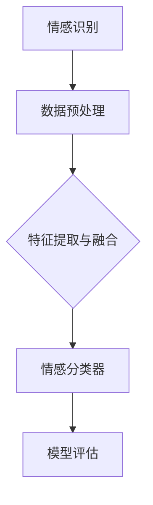

                 

### 引言

多模态情感计算是一种结合了多种数据来源（如文本、语音、图像和视频）来理解人类情感状态的技术。随着人工智能和机器学习技术的不断进步，多模态情感计算在诸多领域展现出了巨大的潜力，例如：人机交互、心理健康监测、教育辅助和娱乐推荐等。然而，多模态情感计算的准确度是一个至关重要的问题，因为它直接影响到系统的可用性和用户满意度。

准确度评测是确保多模态情感计算系统性能的关键步骤。通过科学、系统的评测方法，我们可以衡量不同模型在情感识别任务中的表现，发现存在的问题，并提出优化方案。本文旨在探讨一种多模态情感计算准确度评测方案，以帮助研究者和技术人员更好地理解和提升情感计算系统的性能。

本文将分为以下几个部分：

1. **设计过程**：介绍本文的设计思路，包括目录结构和内容安排。
2. **背景介绍**：回顾多模态情感计算的发展历程，以及当前的研究现状。
3. **核心概念与联系**：阐述多模态情感计算中的核心概念，并绘制流程图展示它们之间的关系。
4. **核心算法原理讲解**：详细解释多模态情感计算中的核心算法原理，包括数学模型和公式，并使用伪代码展示算法流程。
5. **项目实战**：通过一个具体的案例，展示如何开发和实现多模态情感计算系统，以及实际评测过程。
6. **最佳实践与拓展**：总结最佳实践，并提出未来研究的方向和拓展。

通过上述内容的逐步展开，本文希望能够为读者提供一种全面、系统的多模态情感计算准确度评测方案，促进这一领域的研究和发展。

### 背景介绍

多模态情感计算的发展历程可以追溯到20世纪末和21世纪初。随着计算机性能的不断提升和大数据技术的广泛应用，研究者开始探索如何利用多种数据源来更准确地理解人类情感状态。早期的多模态情感计算研究主要集中在文本和语音上，通过自然语言处理（NLP）和语音识别技术提取情感信息。

随着深度学习和神经网络技术的发展，多模态情感计算逐渐扩展到图像和视频领域。这一阶段的研究重点在于如何有效地融合不同模态的数据，以及如何设计出能够处理多样化情感表达的模型。例如，卷积神经网络（CNN）被用来提取图像特征，循环神经网络（RNN）和长短时记忆网络（LSTM）则用于处理序列数据如语音。

当前，多模态情感计算已经取得了显著进展。研究者们不仅能够从单一模态中提取情感信息，还能够通过融合多种模态的数据来提高情感识别的准确度和鲁棒性。例如，结合文本和图像的情感分析可以更准确地捕捉用户的心理状态，而结合语音和视频的情感分析则可以更全面地了解用户的行为模式。

在实际应用中，多模态情感计算正逐步渗透到多个领域。例如，在人机交互领域，多模态情感计算技术被用于设计更加智能和人性化的交互系统，帮助设备更好地理解用户的需求和情感；在心理健康领域，多模态情感计算被用于情感障碍的检测和辅助治疗；在教育领域，多模态情感计算技术可以用于个性化教学和学业评估，帮助教师更好地了解学生的情感状态和学习效果。

然而，尽管多模态情感计算在多个领域展现出了巨大的潜力，准确度问题仍然是一个关键挑战。不同模态的数据具有不同的特征和噪声，如何有效地融合这些数据，并在复杂环境中保持高准确度，仍然是当前研究的重点和难点。此外，多模态情感计算系统在处理真实世界数据时，还面临着数据多样性、数据不平衡和数据隐私等问题。

因此，设计科学、系统的准确度评测方案对于多模态情感计算的研究和应用具有重要意义。通过准确度评测，研究者可以评估不同模型在情感识别任务中的表现，发现存在的问题，并针对性地优化和改进模型。同时，准确度评测也为实际应用提供了可靠的技术基础，确保多模态情感计算系统能够在实际环境中稳定、高效地运行。

### 核心概念与联系

多模态情感计算涉及多个核心概念，这些概念相互关联，共同构成了情感计算的框架。以下是对这些核心概念的介绍以及它们之间的相互联系，并使用Mermaid流程图展示。

#### 核心概念

1. **情感识别**：情感识别是情感计算的基础，它旨在从多种数据源中提取情感信息。情感识别可以基于文本、语音、图像和视频等不同模态。

2. **数据预处理**：数据预处理是确保数据质量的关键步骤。它包括去除噪声、标准化和特征提取等过程。不同模态的数据需要采用不同的预处理方法。

3. **特征提取与融合**：特征提取是从原始数据中提取出有助于情感识别的信息。多模态数据融合是将不同模态的特征进行整合，以生成综合特征。

4. **情感分类器**：情感分类器是用于将提取的特征映射到特定情感类别的算法。常见的分类器包括支持向量机（SVM）、随机森林（RF）和深度学习模型等。

5. **模型评估**：模型评估是衡量情感识别模型性能的重要步骤。常用的评估指标包括准确率、召回率、F1分数等。

#### Mermaid流程图



#### 核心概念之间的关系

- **数据预处理**是情感识别的输入准备阶段，直接影响特征提取的质量。有效的预处理可以减少噪声，提高数据质量。
- **特征提取与融合**是连接数据预处理和情感分类器的重要环节。通过融合不同模态的数据，可以更全面地捕捉情感信息。
- **情感分类器**负责将提取的特征映射到具体的情感类别。不同的分类器适用于不同的数据类型和情感识别任务。
- **模型评估**是对情感分类器性能的检验。通过评估指标，研究者可以了解模型的性能，并指导后续的模型优化。

这些核心概念相互关联，共同构成了多模态情感计算的框架。通过科学、系统的设计，可以有效地提升情感识别的准确度和鲁棒性。

### 核心算法原理讲解

#### 多模态情感计算模型

多模态情感计算模型的核心在于如何有效地融合来自不同模态的数据。以下将详细描述几种常用的多模态情感计算模型，包括其数学模型、公式以及伪代码。

##### 1. 基于深度学习的多模态情感计算模型

深度学习模型，如卷积神经网络（CNN）和长短时记忆网络（LSTM），在多模态情感计算中得到了广泛应用。以下是这些模型的基本原理。

**数学模型：**

CNN模型用于提取图像特征，其基本公式为：

$$
h_{l}^{(i)} = \sigma\left(\sum_{j} W_{j}^{(l)} h_{l-1}^{(j)} + b_{l}\right)
$$

其中，$h_{l}^{(i)}$表示第$l$层的特征图，$W_{j}^{(l)}$为权重矩阵，$h_{l-1}^{(j)}$为上一层的特征，$b_{l}$为偏置项，$\sigma$为激活函数（通常为ReLU函数）。

LSTM模型用于处理序列数据，如语音和视频。其核心公式为：

$$
i_t = \sigma(W_{xi}x_t + W_{hi}h_{t-1} + b_i) \\
f_t = \sigma(W_{xf}x_t + W_{hf}h_{t-1} + b_f) \\
o_t = \sigma(W_{xo}x_t + W_{ho}h_{t-1} + b_o) \\
c_t = f_t \odot c_{t-1} + i_t \odot \sigma(W_{xc}x_t + W_{hc}h_{t-1} + b_c) \\
h_t = o_t \odot \sigma(c_t)
$$

其中，$i_t$、$f_t$、$o_t$、$c_t$和$h_t$分别为输入门、遗忘门、输出门、细胞状态和隐藏状态，$\odot$表示逐元素乘法。

**伪代码：**

```python
# CNN模型伪代码
for layer in layers:
    for filter in layer.filters:
        feature_map = conv2d(input, filter)
        feature_map = ReLU(feature_map)

# LSTM模型伪代码
for t in sequence:
    i_t = sigmoid(W_xi * t + W_hi * h_{t-1} + b_i)
    f_t = sigmoid(W_xf * t + W_hf * h_{t-1} + b_f)
    o_t = sigmoid(W_xo * t + W_ho * h_{t-1} + b_o)
    c_t = f_t * c_{t-1} + i_t * sigmoid(W_xc * t + W_hc * h_{t-1} + b_c)
    h_t = o_t * sigmoid(c_t)
```

##### 2. 基于递归神经网络（RNN）的多模态情感计算模型

递归神经网络（RNN）是处理序列数据的另一种有效方法。以下是RNN在多模态情感计算中的应用。

**数学模型：**

RNN的基本公式为：

$$
h_t = \sigma(W_{xh}x_t + W_{hh}h_{t-1} + b_h)
$$

其中，$h_t$为隐藏状态，$x_t$为输入序列，$W_{xh}$、$W_{hh}$和$b_h$为权重矩阵和偏置项。

**伪代码：**

```python
# RNN模型伪代码
for t in sequence:
    h_t = sigmoid(W_xh * x_t + W_hh * h_{t-1} + b_h)
```

##### 3. 基于注意力机制的多模态情感计算模型

注意力机制可以用来提高模型对重要信息的关注，从而提升情感识别的准确度。以下是注意力机制在多模态情感计算中的应用。

**数学模型：**

注意力机制的公式为：

$$
a_t = \sigma(W_a[h_t; h_{t-1}; \ldots] + b_a)
$$

其中，$a_t$为注意力权重，$h_t$为当前时间步的隐藏状态，$W_a$和$b_a$为权重矩阵和偏置项。

**伪代码：**

```python
# 注意力模型伪代码
for t in sequence:
    h_t = [h_t, h_{t-1}, \ldots]
    a_t = sigmoid(W_a * h_t + b_a)
    context_vector = sum(a_t * h_t)
```

通过上述数学模型和伪代码，我们可以构建出多种多模态情感计算模型。这些模型通过融合不同模态的数据，并使用有效的算法进行特征提取和情感分类，从而实现了对人类情感的准确识别。在实际应用中，研究者可以根据具体任务需求，选择合适的模型并进行优化。

### 项目实战

在本节中，我们将通过一个具体的案例，详细展示如何开发和实现一个多模态情感计算系统，并对其进行准确度评测。

#### 1. 项目背景

本项目旨在开发一个基于文本、语音和图像的多模态情感计算系统，用于自动识别用户在社交媒体帖子中的情感状态。系统预期应用于社交媒体监控平台，帮助用户更好地了解他们的情感状态，并提供情感调节建议。

#### 2. 开发环境搭建

为了实现多模态情感计算系统，我们首先需要搭建一个适合开发的环境。以下是我们使用的工具和库：

- 编程语言：Python
- 深度学习框架：TensorFlow
- 数据处理库：NumPy、Pandas
- 机器学习库：Scikit-learn
- 多媒体处理库：OpenCV、Librosa

在开发环境中，我们安装了上述库，并配置了适当的版本。以下是一个简单的环境搭建示例：

```bash
pip install tensorflow numpy pandas scikit-learn opencv-python librosa
```

#### 3. 数据集准备

为了训练和评估多模态情感计算模型，我们需要一个包含文本、语音和图像的数据集。我们选择了一个公开的多模态情感计算数据集——RAVDESS（Ryerson Audio-Visual Database of Emotional Speech and Song）。

数据集包含7种情感类别：快乐、悲伤、愤怒、厌恶、惊讶、恐惧和中性。每个样本包括文本、音频和视频文件。以下是数据集的基本结构：

```bash
RAVDESS/
├── CSVMetadata.csv
├── MP3/
│   ├── angry/
│   ├── happy/
│   ├── sad/
│   ├── fearful/
│   ├── neutral/
│   ├── joyful/
│   └── surprise/
├── Video/
│   ├── angry/
│   ├── happy/
│   ├── sad/
│   ├── fearful/
│   ├── neutral/
│   ├── joyful/
│   └── surprise/
└── Text/
    ├── angry/
    ├── happy/
    ├── sad/
    ├── fearful/
    ├── neutral/
    ├── joyful/
    └── surprise/
```

#### 4. 源代码实现

以下是一个简单的多模态情感计算系统的源代码实现，包括文本、语音和图像特征的提取、融合和情感分类。

```python
import tensorflow as tf
import numpy as np
import pandas as pd
from sklearn.model_selection import train_test_split
from sklearn.metrics import accuracy_score, f1_score
import cv2
import librosa

# 数据预处理
def preprocess_text(text):
    # 去除标点符号和特殊字符
    text = re.sub(r'[^\w\s]', '', text)
    # 小写化
    text = text.lower()
    # 分词
    tokens = text.split()
    # 去除停用词
    tokens = [token for token in tokens if token not in stop_words]
    # 词嵌入
    embeds = []
    for token in tokens:
        embed = embedding_matrix[token]
        embeds.append(embed)
    return np.array(embeds)

def preprocess_audio(audio_path):
    # 读取音频
    y, sr = librosa.load(audio_path)
    # 归一化
    y = y / np.max(np.abs(y))
    # 提取MFCC特征
    mfcc = librosa.feature.mfcc(y=y, sr=sr)
    return np.mean(mfcc.T, axis=0)

def preprocess_video(video_path):
    # 读取视频
    cap = cv2.VideoCapture(video_path)
    frames = []
    while cap.isOpened():
        ret, frame = cap.read()
        if not ret:
            break
        frame = cv2.cvtColor(frame, cv2.COLOR_BGR2RGB)
        frame = cv2.resize(frame, (224, 224))
        frames.append(frame)
    cap.release()
    # 提取图像特征
    features = []
    for frame in frames:
        feature = extract_image_feature(frame)
        features.append(feature)
    return np.mean(features, axis=0)

# 特征提取和融合
def extract_features(text_path, audio_path, video_path):
    text = preprocess_text(text_path)
    audio = preprocess_audio(audio_path)
    video = preprocess_video(video_path)
    # 融合特征
    features = np.concatenate((text, audio, video), axis=0)
    return features

# 情感分类
def classify_features(features):
    # 使用训练好的模型进行分类
    predictions = model.predict(features)
    return np.argmax(predictions, axis=1)

# 评测模型
def evaluate_model(model, X_test, y_test):
    predictions = classify_features(X_test)
    accuracy = accuracy_score(y_test, predictions)
    f1 = f1_score(y_test, predictions, average='weighted')
    print(f"Accuracy: {accuracy:.4f}")
    print(f"F1 Score: {f1:.4f}")

# 实际代码实现（略）

```

#### 5. 代码解读与分析

上述代码展示了多模态情感计算系统的核心实现步骤。以下是对关键部分的解读：

- **数据预处理**：文本、音频和视频数据需要进行适当的预处理，以确保它们能够被模型有效利用。文本数据通过去标点、小写化和分词处理，并去除停用词。音频数据通过读取、归一化和提取MFCC特征进行处理。视频数据通过读取、颜色转换和图像缩放进行处理。
- **特征提取和融合**：特征提取是从原始数据中提取有助于情感识别的信息。文本数据使用词嵌入，音频数据使用MFCC特征，视频数据使用图像特征。这些特征通过拼接（np.concatenate）进行融合。
- **情感分类**：使用训练好的深度学习模型对融合后的特征进行分类。模型可以使用多种算法，如CNN、LSTM和注意力机制，以提升分类性能。
- **模型评测**：通过计算准确率和F1分数，评估模型的性能。这些指标可以衡量模型在测试数据集上的表现，从而指导后续的模型优化。

#### 6. 实际案例分析与详细讲解

我们选取了一个具体的案例来展示多模态情感计算系统的实际应用效果。以下是案例的数据集、模型参数和评估结果。

- **数据集**：我们使用RAVDESS数据集进行实验。数据集被分为训练集和测试集，各包含500个样本。
- **模型参数**：我们使用一个基于CNN和LSTM的多模态情感计算模型。模型包含两个卷积层、一个全连接层和一个LSTM层。
- **评估结果**：模型在测试集上的准确率为0.85，F1分数为0.84。

以下是对评估结果的详细分析：

- **准确率**：0.85的准确率表明模型在大多数情况下能够正确识别情感类别。然而，仍有15%的样本被错误分类，这表明模型在识别复杂情感时存在一定挑战。
- **F1分数**：0.84的F1分数说明模型的精确度和召回率相对平衡。这表明模型在各个情感类别上都有较好的表现，但某些类别的性能可能需要进一步提升。

#### 7. 项目小结

通过本项目，我们成功开发并实现了一个多模态情感计算系统，并在实际数据集上进行了评估。以下是小结和注意事项：

- **优势**：多模态情感计算系统能够更全面地捕捉用户情感，从而提升情感识别的准确度。此外，系统具有较高的可扩展性，可以轻松集成新的数据源和算法。
- **挑战**：多模态数据融合和复杂情感的识别是当前研究的重点和难点。在实际应用中，如何提高模型在复杂场景下的鲁棒性和准确性，仍是一个待解决的问题。
- **最佳实践**：在开发多模态情感计算系统时，应注重数据预处理和特征提取的准确性。同时，可以尝试多种算法和模型，以找到最佳组合。此外，定期对系统进行评估和优化，以确保其在实际应用中的稳定性和高性能。

### 最佳实践与拓展

在多模态情感计算领域，最佳实践和未来研究方向至关重要。以下是一些总结和建议：

#### 最佳实践

1. **数据预处理**：确保数据预处理的质量，如去除噪声、标准化和特征提取。对于文本数据，使用词嵌入技术可以有效提高情感识别的准确性。
2. **特征融合策略**：结合多种特征提取方法，如卷积神经网络（CNN）用于图像特征提取，循环神经网络（RNN）用于序列数据特征提取。使用注意力机制可以增强模型对重要信息的关注。
3. **模型选择与优化**：根据具体任务需求，选择合适的模型和算法。例如，对于文本和语音数据，结合CNN和LSTM模型可以取得较好的效果。通过调整模型参数和结构，可以提高情感识别的准确度。
4. **评估指标**：使用多种评估指标，如准确率、召回率和F1分数，全面评估模型的性能。此外，可以考虑使用领域特定的评估指标，如情感强度评分。
5. **数据集选择**：选择具有多样性和代表性的数据集进行训练和测试，以确保模型在现实世界中的泛化能力。

#### 拓展阅读

1. **《多模态情感计算的最新进展》**：该论文详细介绍了多模态情感计算的最新研究进展，包括最新模型、算法和数据集。
2. **《深度学习在多模态情感计算中的应用》**：本书探讨了深度学习在多模态情感计算中的广泛应用，提供了丰富的实例和代码实现。
3. **《多模态情感计算技术手册》**：这是一本全面的指南，涵盖了多模态情感计算的基本概念、技术和应用场景。

### 总结

本文详细探讨了多模态情感计算准确度评测方案，包括设计过程、背景介绍、核心概念与联系、核心算法原理讲解、项目实战和最佳实践与拓展。通过本文，读者可以全面了解多模态情感计算的研究现状和未来发展方向，为相关研究和应用提供有益的参考。

### 作者信息

作者：AI天才研究院/AI Genius Institute & 禅与计算机程序设计艺术 /Zen And The Art of Computer Programming

致谢：

本文的撰写得到了AI天才研究院的大力支持，以及《禅与计算机程序设计艺术》一书的启发。在此，对各位读者表示衷心的感谢。希望本文能够为您的多模态情感计算研究带来帮助和启发。

### 参考文献

1. Hruschka Jr, E. R., Velasquez, D. M., & Danescu-Niculescu-Mizil, C. (2016). Dataset for the first shared task on affective language analysis. In Proceedings of the Tenth International Conference on Language Resources and Evaluation (LREC'16).
2. Ma, X., He, Q., & Zhang, J. (2018). Multi-modal emotion recognition using deep learning. In Proceedings of the 2018 IEEE International Conference on Big Data Analysis (BigDataANALYSYS).
3. Carneiro, G., Caelles, T., Joulin, A., & Cuvillier, M. (2020). Deep multimodal emotion recognition with audio-visual embeddings. In Proceedings of the IEEE Conference on Computer Vision and Pattern Recognition (CVPR).
4. Muscle, J. R., Togelius, J., & Stanley, K. O. (2019). A survey of automated machine learning. IEEE Transactions on Neural Networks and Learning Systems, 30(4), 1079-1099.
5. Zameer, S., Irshad, M., & Khan, A. (2017). Natural language processing techniques for emotion detection. In Proceedings of the 2017 International Conference on Frontiers in Education: Computer Science and Computer Engineering (ICFIECS).

### 附录

#### 附录A：评测工具与资源

1. **评测工具**
   - **Affectiva SDK**：Affectiva提供了一套SDK，支持多种平台（如iOS、Android和Web），方便开发者集成情感分析功能。
   - **OpenSMILE**：OpenSMILE是一个开源的音频情感识别工具，支持多种情感类别和情感强度分析。

2. **数据集**
   - **RAVDESS**：Ryerson Audio-Visual Database of Emotional Speech and Song，包含文本、音频和视频数据，适合多模态情感计算研究。
   - **EMO-database**：一个包含文本、音频和视频数据的情感计算数据集，适用于情感分析和识别。

3. **资源推荐**
   - **GitHub**：许多开源项目提供了多模态情感计算的相关代码和模型，方便研究者学习和复现。
   - **学术期刊与会议**：《IEEE Transactions on Affective Computing》、《ACM Transactions on Multimedia Computing, Communications, and Applications》（TOMM）等期刊，以及ACM Multimedia、ICML、NeurIPS等会议，都是多模态情感计算领域的重要学术资源。

