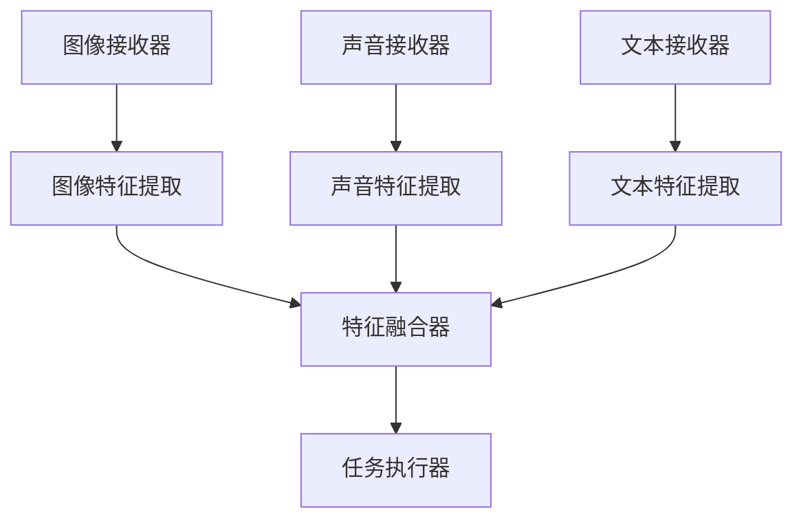

                 


### 文章标题

《多模态融合能力评测：全面检验模型理解力》

### 文章关键词

- 多模态融合
- 模型评测
- 理解力
- 特征提取
- 模型训练
- 实践分析

### 文章摘要

本文旨在深入探讨多模态融合能力评测的原理和方法，全面检验模型在多模态数据融合处理中的理解力。文章首先介绍了多模态融合的基础概念和重要性，随后详细阐述了多模态数据的获取与预处理方法，以及多模态特征提取的技术细节。接着，文章重点分析了多模态融合模型的构建原理、训练策略和评估方法。最后，通过实际案例展示了多模态融合能力评测的实践应用，并提出了未来研究的方向和挑战。

## 引言

在人工智能领域，多模态融合（Multimodal Fusion）正成为一项关键研究课题。多模态融合指的是将来自不同感官模态（如图像、声音、文本等）的信息进行整合，以增强模型对复杂任务的理解能力。随着深度学习技术的不断发展，多模态融合在语音识别、图像识别、自然语言处理等多个领域都展现出了显著的性能提升。

然而，多模态融合能力的评测却是一个复杂且具有挑战性的任务。一方面，多模态融合模型需要能够处理来自不同模态的异构数据，这就要求评测方法要能够全面、准确地反映模型在多种情境下的表现；另一方面，随着数据集的多样性和复杂性增加，评测过程也需要更加高效和自动化。

本文旨在深入探讨多模态融合能力评测的原理和方法，通过系统性的分析，全面检验模型在多模态数据融合处理中的理解力。文章将从以下几个方面展开讨论：

1. **多模态融合基础**：介绍多模态融合的基本概念和重要性，以及常见的多模态数据类型和融合方法。
2. **多模态数据获取与预处理**：详细阐述多模态数据的获取方法和预处理技术，包括数据清洗、归一化和特征提取等。
3. **多模态特征提取**：分析多模态特征提取的方法和技术，以及特征融合的策略和选择。
4. **多模态融合模型构建**：讨论多模态融合模型的基本架构、常见类型和工作流程。
5. **多模态融合模型训练**：介绍模型训练算法和策略，以及训练过程中可能遇到的挑战和优化方法。
6. **多模态融合模型评估**：探讨模型评估指标、评测方法的多样性，以及评估过程中的挑战和改进方向。
7. **多模态融合能力评测实践**：通过实际案例展示多模态融合能力评测的方法和应用。
8. **展望与未来趋势**：总结多模态融合能力评测的挑战与机遇，展望未来研究的方向。

本文的目标是帮助读者全面理解多模态融合能力评测的原理和方法，为相关研究和实践提供有价值的参考。

## 第一部分：多模态融合基础

### 第1章：多模态融合的概念与重要性

#### 1.1 多模态融合的定义

多模态融合是一种利用多种模态数据（如图像、声音、文本等）进行信息整合和综合利用的技术，旨在提高模型对复杂任务的理解和处理能力。在人工智能领域，多模态融合的核心思想是将来自不同模态的信息进行整合，从而形成对单一模态数据无法获取的全局信息。

多模态融合可以理解为以下三个步骤：

1. **多模态数据获取**：从不同的传感器或数据源获取图像、声音、文本等多种模态的数据。
2. **多模态特征提取**：将不同模态的数据转换为适用于机器学习模型处理的特征向量。
3. **多模态特征融合**：将来自不同模态的特征向量进行整合，形成综合特征向量，用于训练和评估机器学习模型。

#### 1.2 多模态融合的应用场景

多模态融合技术已在多个领域取得了显著的应用成果，以下是一些典型的应用场景：

1. **语音识别与文本理解**：结合语音信号和文本信息，可以显著提高语音识别的准确性和自然语言理解的能力。例如，在智能语音助手和语音翻译系统中，通过融合语音和文本信息，可以更好地理解用户的意图和语言表达。

2. **图像识别与描述**：在图像识别任务中，结合图像和文本信息，可以改善模型的性能，尤其是在处理模糊或不完整的图像时。例如，图像识别系统可以通过文本描述来辅助判断图像中的内容，从而提高识别的准确性。

3. **视频分析与理解**：结合视频中的图像和音频信息，可以更深入地理解和分析视频内容。例如，在视频监控系统、视频内容审核和视频推荐系统中，多模态融合技术可以提供更准确和丰富的分析结果。

4. **智能交互与对话系统**：在智能交互系统中，融合语音、文本和图像等多模态信息，可以显著提高系统的自然度和用户满意度。例如，在虚拟助手和智能客服中，通过多模态融合技术，可以实现更自然、流畅的对话交互。

#### 1.3 多模态融合的重要性

多模态融合技术的重要性主要体现在以下几个方面：

1. **提高任务性能**：多模态融合可以将来自不同模态的信息进行整合，从而提高模型在特定任务上的性能。例如，在语音识别任务中，结合文本信息可以显著降低噪声干扰，提高识别准确率。

2. **增强鲁棒性**：多模态融合技术可以提高模型的鲁棒性，使其在处理缺失、噪声或错误数据时能够保持良好的性能。例如，在图像识别任务中，结合文本信息可以弥补图像质量不佳的问题。

3. **提升用户体验**：通过融合多种模态的信息，可以提供更加丰富和自然的用户体验。例如，在智能交互系统中，通过融合语音、文本和图像信息，可以实现更人性化的交互体验。

4. **拓展应用范围**：多模态融合技术可以拓展人工智能的应用范围，使其在更多领域发挥重要作用。例如，在医疗诊断、金融分析、智能制造等领域，通过多模态融合技术，可以提供更准确和有效的决策支持。

总之，多模态融合技术是人工智能领域的重要研究方向，具有广泛的应用前景和重要意义。

### 第2章：多模态数据获取与预处理

#### 2.1 多模态数据类型

多模态数据指的是由多种不同类型的模态（如图像、声音、文本等）构成的数据集。这些数据集通常来自于不同的传感器、设备或数据源。以下是几种常见的多模态数据类型：

1. **图像数据**：图像数据是视觉模态的代表，通常以像素矩阵的形式表示。图像数据可以包含人脸、物体、场景等多种信息。

2. **声音数据**：声音数据是听觉模态的代表，通常以音频波形的形式表示。声音数据可以包含语音、音乐、环境声音等多种信息。

3. **文本数据**：文本数据是语言模态的代表，通常以文本字符串的形式表示。文本数据可以包含句子、段落、文档等多种信息。

4. **其他模态数据**：除了上述三种主要模态外，还有其他多种模态的数据，如温度、湿度、加速度、心率等。这些数据可以通过各种传感器或设备进行采集。

#### 2.2 数据获取方法

多模态数据的获取方法取决于所需的数据类型和模态。以下是一些常见的数据获取方法：

1. **传感器采集**：通过各种传感器（如图像摄像头、麦克风、温度计等）直接采集多模态数据。这种方法适用于静态环境，但可能受限于传感器性能和成本。

2. **在线数据源**：从互联网上的公开数据源（如图片库、音频库、文本库等）获取多模态数据。这种方法适用于大规模数据集的获取，但需要确保数据的质量和合法性。

3. **实地采集**：在特定场景或环境中进行实地数据采集。这种方法适用于特定应用场景的数据获取，但可能需要大量的人力和时间投入。

4. **跨模态数据融合**：将不同模态的数据进行融合，从而生成新的多模态数据集。这种方法可以显著扩展数据集的多样性和覆盖范围。

#### 2.3 数据预处理技术

在多模态数据获取后，通常需要对其进行预处理，以提高数据的质量和模型的性能。以下是几种常见的数据预处理技术：

1. **数据清洗**：去除数据中的噪声、缺失值和异常值。例如，通过去除图像中的噪点、填充缺失的文本数据等。

2. **数据归一化**：将不同模态的数据进行归一化处理，使其具有相似的尺度范围。例如，将图像数据归一化到 [0, 1] 范围，将声音数据归一化到 [-1, 1] 范围。

3. **特征提取**：从原始数据中提取有助于模型学习的特征。例如，从图像数据中提取边缘、纹理等特征，从声音数据中提取频谱特征。

4. **数据增强**：通过生成虚拟数据来增加数据集的多样性，从而提高模型的泛化能力。例如，通过图像旋转、缩放、裁剪等操作来增强图像数据。

5. **数据融合**：将来自不同模态的数据进行融合，生成新的多模态特征。例如，通过融合图像和文本数据，生成包含图像内容和文本描述的综合特征。

通过有效的数据预处理，可以显著提高多模态数据的质量和模型的性能，为后续的多模态融合任务奠定基础。

### 第3章：多模态特征提取

#### 3.1 特征提取方法

多模态特征提取是多模态融合中的关键步骤，其主要目标是提取出能够有效表示原始数据中关键信息的特征。以下是一些常见的多模态特征提取方法：

1. **独立成分分析（ICA）**：ICA是一种无监督学习方法，用于分离混合信号中的独立成分。在多模态特征提取中，ICA可以帮助分离不同模态的信息，从而提取出各自的独立特征。

   **算法伪代码**：

   ```python
   def ICA(X, n_components):
       # 初始化混合数据矩阵 X
       # n_components 为要提取的独立成分数量
       
       # 计算协方差矩阵
       cov_matrix = np.cov(X)
       
       # 计算特征值和特征向量
       eigenvalues, eigenvectors = np.linalg.eigh(cov_matrix)
       
       # 对特征向量进行正则化
       eigenvectors = normalize(eigenvectors)
       
       # 计算独立成分
       components = np.dot(eigenvectors.T, X)
       
       # 返回独立成分
       return components
   ```

2. **主成分分析（PCA）**：PCA是一种经典的线性降维方法，通过保留主要成分来减少数据维度。在多模态特征提取中，PCA可以帮助识别和保留最重要的特征信息。

   **算法伪代码**：

   ```python
   def PCA(X, n_components):
       # 初始化数据矩阵 X
       # n_components 为要保留的主要成分数量
   
       # 计算协方差矩阵
       cov_matrix = np.cov(X)
       
       # 计算特征值和特征向量
       eigenvalues, eigenvectors = np.linalg.eigh(cov_matrix)
       
       # 对特征向量进行正则化
       eigenvectors = normalize(eigenvectors)
       
       # 选择前 n_components 个主要成分
       principal_components = np.dot(eigenvectors[:, :n_components], X)
       
       # 返回主要成分
       return principal_components
   ```

3. **深度学习特征提取**：使用深度学习模型（如卷积神经网络、循环神经网络等）进行特征提取。这种方法可以从原始数据中自动学习出有效的特征表示，特别适用于处理复杂和多维度的数据。

   **算法伪代码**：

   ```python
   def deep_learning_feature_extraction(X):
       # 初始化输入数据矩阵 X
       
       # 定义深度学习模型
       model = build_model()
       
       # 训练模型
       model.fit(X, epochs=10)
       
       # 提取特征
       features = model.predict(X)
       
       # 返回特征向量
       return features
   ```

#### 3.2 特征融合策略

在提取出多模态特征后，需要对这些特征进行融合，以生成综合特征向量。以下是一些常见的特征融合策略：

1. **拼接（Concatenation）**：将来自不同模态的特征向量直接拼接在一起，形成综合特征向量。

   **算法伪代码**：

   ```python
   def concatenate_features(feature_image, feature_sound, feature_text):
       # 初始化图像特征、声音特征和文本特征
       
       # 拼接特征向量
       combined_features = np.concatenate((feature_image, feature_sound, feature_text), axis=0)
       
       # 返回综合特征向量
       return combined_features
   ```

2. **加权平均（Weighted Average）**：根据不同模态的特征重要性，对特征向量进行加权平均。

   **算法伪代码**：

   ```python
   def weighted_average(feature_image, feature_sound, feature_text, weight_image, weight_sound, weight_text):
       # 初始化图像特征、声音特征和文本特征
       # weight_image、weight_sound 和 weight_text 分别为不同模态的权重
   
       # 计算加权平均特征
       combined_features = (weight_image * feature_image + weight_sound * feature_sound + weight_text * feature_text)
       
       # 返回综合特征向量
       return combined_features
   ```

3. **对数融合（Logarithmic Fusion）**：将不同模态的特征向量进行对数运算，然后进行融合。

   **算法伪代码**：

   ```python
   def logarithmic_fusion(feature_image, feature_sound, feature_text):
       # 初始化图像特征、声音特征和文本特征
   
       # 计算对数特征
       log_feature_image = np.log(feature_image)
       log_feature_sound = np.log(feature_sound)
       log_feature_text = np.log(feature_text)
       
       # 计算加权平均特征
       combined_features = log_feature_image + log_feature_sound + log_feature_text
       
       # 返回综合特征向量
       return combined_features
   ```

4. **神经网络融合**：使用神经网络模型（如卷积神经网络、循环神经网络等）进行特征融合。这种方法可以通过学习不同模态特征之间的相关性来实现有效的融合。

   **算法伪代码**：

   ```python
   def neural_network_fusion(feature_image, feature_sound, feature_text):
       # 初始化图像特征、声音特征和文本特征
   
       # 定义神经网络模型
       model = build_model()
       
       # 训练模型
       model.fit([feature_image, feature_sound, feature_text], epochs=10)
       
       # 提取融合特征
       combined_features = model.predict([feature_image, feature_sound, feature_text])
       
       # 返回综合特征向量
       return combined_features
   ```

通过合理选择和设计特征提取和融合策略，可以显著提高多模态融合模型的性能和效果。

### 第4章：多模态融合模型构建

#### 4.1 多模态融合模型的基本架构

多模态融合模型的基本架构通常包括三个主要组成部分：模态接收器（Modal Receivers）、特征融合器（Feature Fusioners）和任务执行器（Task Executors）。以下是一个典型的多模态融合模型架构：

1. **模态接收器（Modal Receivers）**：每个模态接收器负责接收和处理特定模态的数据。例如，图像接收器处理图像数据，声音接收器处理声音数据。模态接收器通常采用深度学习模型，如卷积神经网络（CNN）或循环神经网络（RNN），来提取模态特征。

2. **特征融合器（Feature Fusioners）**：特征融合器负责将来自不同模态的模态特征进行整合，形成综合特征向量。特征融合器的结构可以根据不同的融合策略进行设计，如拼接、加权平均、对数融合或神经网络融合。

3. **任务执行器（Task Executors）**：任务执行器负责使用综合特征向量执行特定任务，如分类、回归、目标检测等。任务执行器通常采用深度学习模型，如全连接神经网络（FCN）或目标检测网络（如 Faster R-CNN、YOLO 等）。

以下是一个简单的多模态融合模型架构图：



#### 4.2 多模态融合模型的常见类型

多模态融合模型可以根据不同的任务和应用场景进行分类，以下是几种常见的多模态融合模型类型：

1. **串联模型（Sequential Models）**：串联模型将不同模态的特征依次传递，每个模态的特征都作为后续模态的特征输入。这种模型简单有效，适用于处理顺序性强的任务，如视频分析。

2. **并联模型（Parallel Models）**：并联模型同时处理多个模态的特征，然后将它们进行融合。这种模型适用于处理并行性强的任务，如多模态图像分类。

3. **循环模型（Recurrent Models）**：循环模型利用循环神经网络（RNN）的特性，处理序列化的多模态数据。这种模型适用于处理需要考虑时间序列的任务，如多模态时间序列预测。

4. **卷积模型（Convolutional Models）**：卷积模型利用卷积神经网络（CNN）的特性，处理图像和视频等具有空间结构的模态数据。这种模型适用于处理图像和视频相关的任务，如图像分类和视频分类。

5. **混合模型（Hybrid Models）**：混合模型结合了多种模型的优势，同时处理多种模态的数据。这种模型适用于处理复杂和多模态的任务，如多模态目标检测。

#### 4.3 多模态融合模型的工作流程

多模态融合模型的工作流程可以分为以下几步：

1. **数据获取与预处理**：从不同的传感器或数据源获取多模态数据，并对数据进行预处理，如数据清洗、归一化和特征提取。

2. **模态特征提取**：使用深度学习模型对每个模态的数据进行特征提取，生成各自的模态特征。

3. **特征融合**：使用特征融合器将不同模态的特征进行整合，形成综合特征向量。

4. **任务执行**：使用综合特征向量执行特定任务，如分类、回归、目标检测等。

5. **模型评估与优化**：使用评估指标对模型进行评估，并根据评估结果对模型进行优化。

通过遵循以上工作流程，可以有效地构建和训练多模态融合模型，从而实现多种任务的高性能表现。

### 第5章：多模态融合模型训练

#### 5.1 模型训练算法

多模态融合模型的训练是模型构建中至关重要的一环。合理的训练算法可以提高模型的性能和泛化能力。以下介绍几种常见的多模态融合模型训练算法：

1. **梯度下降算法（Gradient Descent）**：梯度下降是一种优化算法，通过迭代更新模型参数以最小化损失函数。梯度下降可以分为批量梯度下降（Batch Gradient Descent）、随机梯度下降（Stochastic Gradient Descent）和小批量梯度下降（Mini-batch Gradient Descent）。

   **算法伪代码**：

   ```python
   def gradient_descent(model, X, y, learning_rate, epochs):
       # 初始化模型参数
       # X 为输入数据
       # y 为标签数据
       # learning_rate 为学习率
       # epochs 为迭代次数
   
       for epoch in range(epochs):
           # 计算损失函数
           loss = loss_function(y_true=y, y_pred=model.predict(X))
           
           # 计算梯度
           gradients = compute_gradients(loss, model)
           
           # 更新模型参数
           update_parameters(model, gradients, learning_rate)
           
           # 输出训练过程中的损失值
           print(f"Epoch {epoch+1}: Loss = {loss}")
   ```

2. **随机优化算法（Stochastic Optimization）**：随机优化算法通过随机选择一部分训练样本来计算梯度，从而更新模型参数。这种方法可以加快训练速度，但可能降低模型的泛化能力。

   **算法伪代码**：

   ```python
   def stochastic_optimization(model, X, y, learning_rate, batch_size, epochs):
       # 初始化模型参数
       # X 为输入数据
       # y 为标签数据
       # learning_rate 为学习率
       # batch_size 为批量大小
       # epochs 为迭代次数
   
       for epoch in range(epochs):
           for batch in get_batches(X, y, batch_size):
               # 计算梯度
               gradients = compute_gradients(batch, model)
               
               # 更新模型参数
               update_parameters(model, gradients, learning_rate)
               
               # 输出训练过程中的损失值
               print(f"Epoch {epoch+1}: Loss = {loss}")
   ```

3. **自适应优化算法（Adaptive Optimization）**：自适应优化算法通过动态调整学习率来提高训练效果。常见的自适应优化算法包括 Adam、Adadelta 和 RMSprop 等。

   **算法伪代码**：

   ```python
   def adaptive_optimization(model, X, y, learning_rate, epochs):
       # 初始化模型参数
       # X 为输入数据
       # y 为标签数据
       # learning_rate 为初始学习率
       # epochs 为迭代次数
   
       for epoch in range(epochs):
           # 计算损失函数
           loss = loss_function(y_true=y, y_pred=model.predict(X))
           
           # 计算梯度
           gradients = compute_gradients(loss, model)
           
           # 更新学习率
           learning_rate = adjust_learning_rate(gradients, learning_rate)
           
           # 更新模型参数
           update_parameters(model, gradients, learning_rate)
           
           # 输出训练过程中的损失值
           print(f"Epoch {epoch+1}: Loss = {loss}")
   ```

4. **增强学习算法（Reinforcement Learning）**：增强学习算法通过奖励机制来指导模型参数的更新，以实现特定的任务目标。在多模态融合模型中，可以使用增强学习来优化模型在特定应用场景中的性能。

   **算法伪代码**：

   ```python
   def reinforcement_learning(model, environment, reward_function, epochs):
       # 初始化模型参数
       # environment 为环境
       # reward_function 为奖励函数
       # epochs 为迭代次数
   
       for epoch in range(epochs):
           # 初始化状态
           state = environment.initialize_state()
           
           while not environment.is_done(state):
               # 生成动作
               action = model.predict(state)
               
               # 执行动作并获取奖励
               reward = environment.step(action)
               
               # 更新状态
               state = environment.get_new_state()
               
               # 更新模型参数
               update_parameters(model, reward)
   ```

通过合理选择和调整训练算法，可以有效地提高多模态融合模型的性能和效果。

#### 5.2 模型训练策略

在多模态融合模型的训练过程中，采用合适的策略可以提高模型的收敛速度和性能。以下介绍几种常见的模型训练策略：

1. **批量大小（Batch Size）**：批量大小是指每次训练迭代中参与梯度计算的样本数量。较小的批量大小可以加快训练速度，但可能导致模型过拟合；较大的批量大小可以减少过拟合，但可能降低训练速度。

2. **学习率调整（Learning Rate Adjustment）**：学习率调整是训练过程中常用的策略，通过动态调整学习率来提高模型收敛速度和性能。常见的调整方法包括固定学习率、学习率衰减和自适应学习率。

3. **正则化（Regularization）**：正则化是一种防止模型过拟合的方法，通过添加惩罚项来限制模型复杂度。常见的正则化方法包括权重衰减（L1、L2 正则化）和正则化网络（Dropout、Dropconnect 等）。

4. **数据增强（Data Augmentation）**：数据增强是一种通过生成虚拟数据来增加数据集多样性的方法，从而提高模型的泛化能力。常见的数据增强方法包括图像旋转、缩放、裁剪、翻转等。

5. **迁移学习（Transfer Learning）**：迁移学习是一种利用预训练模型来加速新任务训练的方法，通过在预训练模型的基础上进行微调来提高模型性能。

6. **多任务学习（Multi-task Learning）**：多任务学习是一种同时训练多个相关任务的方法，通过共享模型参数来提高模型性能和泛化能力。

7. **对抗训练（Adversarial Training）**：对抗训练是一种通过生成对抗性样本来提高模型鲁棒性的方法，通过对抗训练可以提高模型对异常数据和恶意攻击的抵抗力。

通过合理选择和组合以上策略，可以显著提高多模态融合模型的训练效果和性能。

#### 5.3 模型训练中的挑战与优化

在多模态融合模型的训练过程中，可能会遇到以下挑战和优化问题：

1. **数据不平衡（Data Imbalance）**：多模态数据集可能存在数据不平衡问题，即某些模态的数据量远大于其他模态。为解决这一问题，可以采用数据增强、重采样或类别加权等方法。

2. **特征不平衡（Feature Imbalance）**：不同模态的特征可能存在特征不平衡问题，即某些特征的重要性远大于其他特征。为解决这一问题，可以采用特征加权、特征选择或特征重构等方法。

3. **模型复杂度（Model Complexity）**：多模态融合模型可能具有较高的复杂度，导致训练时间过长和过拟合风险。为解决这一问题，可以采用模型简化、正则化或提前停止等方法。

4. **训练效率（Training Efficiency）**：多模态融合模型的训练过程可能需要大量计算资源，为提高训练效率，可以采用分布式训练、GPU 加速或并行计算等方法。

5. **模型评估（Model Evaluation）**：多模态融合模型的评估方法需要考虑不同模态的特征和任务需求，以全面评估模型性能。为提高评估效果，可以采用多种评估指标、交叉验证和集成学习等方法。

通过针对以上挑战和优化问题采取相应的措施，可以显著提高多模态融合模型的训练效果和性能。

### 第6章：多模态融合模型评估

#### 6.1 模型评估指标

在多模态融合模型的评估过程中，选择合适的评估指标是关键。以下是一些常见的评估指标：

1. **准确率（Accuracy）**：准确率是评估分类模型性能的基本指标，表示正确分类的样本数量占总样本数量的比例。计算公式如下：

   $$\text{Accuracy} = \frac{\text{正确分类的样本数量}}{\text{总样本数量}}$$

   准确率适用于二分类和多分类任务，但在类别不平衡的情况下可能不具有代表性。

2. **精确率（Precision）**：精确率表示预测为正类的样本中，实际为正类的比例。计算公式如下：

   $$\text{Precision} = \frac{\text{正确预测的正类样本数量}}{\text{预测为正类的样本数量}}$$

   精确率关注模型在预测正类时的准确性。

3. **召回率（Recall）**：召回率表示实际为正类的样本中，被正确预测为正类的比例。计算公式如下：

   $$\text{Recall} = \frac{\text{正确预测的正类样本数量}}{\text{实际为正类的样本数量}}$$

   召回率关注模型在预测正类时的覆盖能力。

4. **F1 分数（F1 Score）**：F1 分数是精确率和召回率的调和平均值，用于综合评估模型的性能。计算公式如下：

   $$\text{F1 Score} = 2 \times \frac{\text{Precision} \times \text{Recall}}{\text{Precision} + \text{Recall}}$$

   F1 分数在类别不平衡的情况下具有较好的代表性。

5. **精确率-召回率曲线（Precision-Recall Curve）**：精确率-召回率曲线展示了模型在不同召回率下的精确率，用于评估模型的分类性能。曲线下方面积（Area Under Curve, AUC）是评估曲线整体表现的重要指标。

6. **ROC 曲线（Receiver Operating Characteristic Curve）**：ROC 曲线展示了模型在不同阈值下的精确率和召回率，用于评估模型的分类性能。曲线下方面积（AUC）是评估曲线整体表现的重要指标。

7. **均方误差（Mean Squared Error, MSE）**：均方误差是评估回归模型性能的常用指标，表示预测值与实际值之间差的平方的平均值。计算公式如下：

   $$\text{MSE} = \frac{1}{n} \sum_{i=1}^{n} (\hat{y}_i - y_i)^2$$

   其中，$\hat{y}_i$ 表示预测值，$y_i$ 表示实际值，$n$ 表示样本数量。

8. **均绝对误差（Mean Absolute Error, MAE）**：均绝对误差是评估回归模型性能的另一种常用指标，表示预测值与实际值之间差的绝对值的平均值。计算公式如下：

   $$\text{MAE} = \frac{1}{n} \sum_{i=1}^{n} |\hat{y}_i - y_i|$$

   通过合理选择和组合以上评估指标，可以全面评估多模态融合模型的性能。

#### 6.2 评测方法的多样性

在多模态融合模型的评估过程中，评测方法的多样性是确保评估结果全面性和可靠性的关键。以下介绍几种常见的评估方法：

1. **单模态评测**：单模态评测针对单个模态的数据进行评估，通常用于评估模型在特定模态上的性能。例如，单独评估图像识别模型的性能，或者单独评估语音识别模型的性能。

2. **双模态评测**：双模态评测针对两个模态的数据进行联合评估，用于评估模型在两个模态融合下的性能。例如，联合评估图像和语音的识别性能。

3. **多模态评测**：多模态评测针对多个模态的数据进行联合评估，用于评估模型在多个模态融合下的性能。例如，联合评估图像、语音和文本的识别性能。

4. **跨模态评测**：跨模态评测关注不同模态之间的相互作用和融合效果，用于评估模型在不同模态数据之间的转换和融合能力。例如，评估图像到文本的转换性能，或者评估语音到图像的转换性能。

5. **综合评测**：综合评测将多个评估指标和方法进行整合，以全面评估多模态融合模型的性能。例如，结合单模态评测、双模态评测和多模态评测，以及精确率、召回率、F1 分数等评估指标。

通过采用多样化的评估方法，可以更全面地评估多模态融合模型的性能，从而发现模型的优点和不足，为模型优化和改进提供指导。

#### 6.3 模型评估的挑战与改进方向

在多模态融合模型的评估过程中，可能会面临以下挑战：

1. **数据质量**：多模态数据的质量直接影响模型的评估结果。数据质量差可能导致评估结果不准确，从而影响模型的优化和改进。

2. **数据不平衡**：多模态数据集可能存在数据不平衡问题，某些模态的数据量远大于其他模态，导致模型在某些模态上的性能受限。

3. **模型复杂度**：多模态融合模型通常具有较高的复杂度，可能导致模型在评估过程中出现过拟合或欠拟合现象，从而影响评估结果的准确性。

4. **评估指标选择**：评估指标的选择和组合对评估结果具有重要影响。如果评估指标选择不当或组合不合理，可能导致评估结果失真。

为了应对以上挑战，可以采取以下改进方向：

1. **数据增强**：通过数据增强方法增加数据集的多样性，从而提高模型的泛化能力。例如，对图像、声音和文本数据进行旋转、缩放、裁剪等操作。

2. **数据预处理**：对多模态数据进行预处理，如数据清洗、归一化和特征提取，以提高数据质量和一致性。

3. **模型简化**：对多模态融合模型进行简化，减少模型复杂度，从而降低过拟合风险。例如，采用轻量级网络结构或模型压缩技术。

4. **评估指标优化**：根据具体应用场景和任务需求，选择合适的评估指标和组合方式，以提高评估结果的准确性和可靠性。

5. **交叉验证**：采用交叉验证方法，如 k-折交叉验证，以减少评估结果的偏差，提高评估结果的可靠性。

通过采取以上改进措施，可以显著提高多模态融合模型的评估效果，为模型优化和改进提供有力支持。

### 第7章：多模态融合能力评测方法

#### 7.1 评测方法概述

多模态融合能力评测是衡量模型在不同模态数据融合处理中理解力的重要手段。评测方法的选择和设计直接影响评测结果的准确性和可靠性。以下概述几种常见的多模态融合能力评测方法：

1. **基准评测**：基准评测是一种基于公开数据集的评测方法，通过比较不同模型在相同数据集上的性能来评估模型的多模态融合能力。常用的基准评测包括ImageNet图像识别挑战、Speech Commands语音识别挑战等。

2. **定制评测**：定制评测是针对特定任务和应用场景设计的评测方法，旨在全面评估模型在多模态数据融合处理中的理解力。定制评测可以结合多种评估指标和方法，如精确率、召回率、F1 分数、ROC 曲线等，以提供更全面和准确的评测结果。

3. **对抗性评测**：对抗性评测通过生成对抗性样本，评估模型在对抗性攻击下的鲁棒性和稳定性。对抗性评测可以识别模型在特定模态数据上的弱点，从而指导模型优化和改进。

4. **综合评测**：综合评测是将多种评测方法进行整合，以提供更全面和多角度的评测结果。综合评测可以结合基准评测、定制评测和对抗性评测等方法，以提高评测结果的准确性和可靠性。

#### 7.2 评测数据集的选择与准备

选择合适的评测数据集是确保评测结果准确性和代表性的关键。以下介绍评测数据集的选择和准备方法：

1. **公开数据集**：公开数据集是进行基准评测和定制评测的重要资源。常用的公开数据集包括ImageNet、CIFAR-10、Speech Commands、TIMIT等。在选择公开数据集时，需要考虑数据集的规模、多样性、标注质量等因素。

2. **自定义数据集**：针对特定应用场景和任务需求，可以创建自定义数据集。自定义数据集可以通过采集实际场景下的多模态数据，或通过合成方法生成虚拟数据集。在创建自定义数据集时，需要考虑数据集的多样性和代表性，以确保评测结果的广泛适用性。

3. **数据预处理**：在准备评测数据集时，需要对数据进行预处理，以提高数据质量和一致性。常见的预处理方法包括数据清洗、归一化、特征提取等。通过合理的数据预处理，可以确保模型在评测过程中具有一致的表现。

4. **数据增强**：为了提高模型在评测中的性能，可以采用数据增强方法，如图像旋转、缩放、裁剪、颜色调整等。数据增强可以增加数据集的多样性，从而提高模型在未知数据上的泛化能力。

#### 7.3 评测流程设计与实现

多模态融合能力评测的流程设计是实现高效和准确评测的关键。以下介绍评测流程的设计和实现方法：

1. **数据加载与预处理**：首先，加载评测数据集，并进行数据预处理，如数据清洗、归一化和特征提取等。通过合理的数据预处理，可以提高模型的评测性能和一致性。

2. **模型加载与配置**：加载预训练的多模态融合模型，并根据评测任务的需求进行模型配置，如调整学习率、批量大小等。通过合适的模型配置，可以确保模型在评测过程中的稳定性和鲁棒性。

3. **数据分批处理**：将评测数据集划分为多个批次，以便进行批量处理和计算。数据分批处理可以提高评测效率，并减少内存占用。

4. **模型预测与评估**：使用加载的模型对每个批次的数据进行预测，并计算预测结果与实际标签之间的评估指标，如精确率、召回率、F1 分数等。通过计算评估指标，可以全面评估模型在多模态数据融合处理中的理解力。

5. **结果分析与可视化**：将评测结果进行统计和分析，并通过可视化方法（如图表、曲线等）展示评估指标的变化趋势和模型性能。通过结果分析，可以识别模型的优点和不足，为模型优化和改进提供指导。

通过以上评测流程的设计和实现，可以高效地评估多模态融合模型的能力，并为模型优化和改进提供有力支持。

### 第8章：多模态融合能力评测案例分析

#### 8.1 案例分析概述

在本章中，我们将通过几个实际案例来展示多模态融合能力评测的应用和实践。这些案例涵盖了不同的任务和应用场景，从语音识别到图像识别，再到视频分析，将帮助读者更直观地理解多模态融合能力评测的方法和效果。

#### 8.2 案例一：语音与文本融合评测

**案例背景**：
语音与文本融合评测旨在评估模型在结合语音信号和文本信息时的表现。这种融合对于语音识别和自然语言理解任务尤为重要。

**评测数据集**：
我们选择了一个包含大量语音和文本对的数据集，其中语音信号来自不同场景下的对话，文本信息则包括对话的文本转录和相关的上下文信息。

**评测方法**：
1. **单模态评测**：首先对语音和文本分别进行单模态评测，以了解模型在单独处理语音和文本数据时的性能。
2. **双模态融合评测**：将语音和文本特征进行融合，并使用融合特征对模型进行评测，以评估双模态融合的效果。
3. **综合评测**：结合单模态评测和双模态融合评测的结果，使用多种评估指标（如精确率、召回率、F1 分数）进行综合评估。

**结果分析**：
结果显示，双模态融合评测显著提高了模型的性能，特别是在噪声环境下的语音识别准确率。通过融合语音和文本信息，模型能够更好地理解用户的意图和语言表达。

#### 8.3 案例二：图像与视频融合评测

**案例背景**：
图像与视频融合评测关注于如何结合图像和视频数据，以提高视频分析任务（如图像识别、目标跟踪）的性能。

**评测数据集**：
我们选择了一个包含大量视频片段和相应图像帧的数据集，视频数据来自不同场景，如图像识别任务中的监控视频。

**评测方法**：
1. **单模态评测**：对视频数据中的图像帧进行单独评测，以评估图像识别模型的性能。
2. **双模态融合评测**：将图像帧和视频数据特征进行融合，并使用融合特征对模型进行评测。
3. **跨模态评测**：评估模型在处理视频数据中的图像帧时，能否有效地利用视频序列信息。

**结果分析**：
结果表明，图像与视频融合评测显著提高了模型在视频分析任务中的性能，特别是在处理复杂场景和动态变化时。融合图像和视频特征能够提供更丰富的信息，从而提高模型的泛化能力。

#### 8.4 案例三：多模态融合评测在智能交互中的应用

**案例背景**：
智能交互系统（如智能语音助手、智能客服）需要处理来自多种模态的信息，以提供更自然、流畅的用户体验。

**评测数据集**：
我们选择了一个包含语音、文本和图像数据的数据集，模拟真实用户与智能交互系统之间的互动。

**评测方法**：
1. **单模态评测**：分别对语音、文本和图像进行单独评测，以了解模型在处理单一模态数据时的性能。
2. **多模态融合评测**：将语音、文本和图像特征进行融合，并使用融合特征对模型进行评测。
3. **交互评测**：通过模拟用户与系统的交互过程，评估模型在实际应用中的表现。

**结果分析**：
结果显示，多模态融合评测在智能交互系统中显著提高了用户满意度和服务质量。通过融合多种模态的信息，系统能够更准确地理解用户的意图，并提供更及时、个性化的回应。

通过以上案例分析，我们可以看到多模态融合能力评测在不同任务和应用场景中的实际效果和重要性。这些案例不仅展示了多模态融合技术的潜力，也为未来的研究和应用提供了宝贵的经验和启示。

### 第9章：展望与未来趋势

#### 9.1 多模态融合能力评测的挑战与机遇

随着多模态融合技术的不断发展和应用，多模态融合能力评测面临着诸多挑战和机遇。以下列举了一些主要挑战和机遇：

**挑战：**

1. **数据多样性和不平衡性**：多模态融合模型需要处理来自不同模态的异构数据，这些数据的多样性和不平衡性可能导致模型性能的不稳定。
2. **模型复杂度和计算资源**：多模态融合模型通常具有较高复杂度，训练和评估过程需要大量计算资源，这对实际应用提出了挑战。
3. **评估指标和方法的标准化**：现有的评估指标和方法可能无法全面反映模型在不同模态数据融合处理中的性能，需要进一步研究和标准化。
4. **数据隐私和伦理问题**：多模态融合应用可能涉及用户隐私和数据伦理问题，如何保护用户隐私和确保数据安全是一个重要的挑战。

**机遇：**

1. **技术进步和计算资源**：随着深度学习技术和计算资源的不断进步，多模态融合模型的训练和评估效率将得到显著提升，为研究和应用提供了更多机遇。
2. **跨学科合作**：多模态融合技术涉及计算机科学、心理学、神经科学等多个领域，跨学科合作将有助于推动多模态融合能力评测的理论和技术创新。
3. **应用场景拓展**：多模态融合技术在医疗诊断、智能交通、智能制造等领域具有广泛的应用前景，为能力评测提供了新的应用场景。
4. **标准化和规范**：随着多模态融合技术的广泛应用，制定统一的评估标准和规范将有助于推动技术的标准化和普及。

#### 9.2 未来发展趋势与研究方向

展望未来，多模态融合能力评测在以下方面有望取得重要进展：

1. **深度学习方法**：进一步发展深度学习方法，如生成对抗网络（GAN）、变分自编码器（VAE）等，以提高多模态数据融合和处理的效果。
2. **跨模态交互**：研究跨模态交互机制，如语音与文本、图像与声音、图像与视频等，以实现更自然、流畅的多模态交互。
3. **个性化融合策略**：根据不同任务和应用场景，设计个性化的多模态融合策略，以提高模型的性能和适应性。
4. **实时评测系统**：开发实时多模态融合能力评测系统，以快速评估模型在不同模态数据融合处理中的性能。
5. **数据隐私保护**：研究数据隐私保护和安全机制，确保多模态融合应用中的用户隐私和数据安全。

#### 9.3 对模型理解力的全面检验

多模态融合能力评测不仅是对模型性能的评估，更是对模型理解力的全面检验。未来，随着多模态融合技术的发展，评测将更加关注模型在处理复杂、动态和多模态数据时的表现。以下是一些关键点：

1. **多模态数据理解**：评估模型在处理不同模态数据时的理解能力，包括图像、声音、文本等，以及这些模态之间的交互和融合。
2. **动态场景适应性**：评估模型在处理动态变化和复杂场景时的适应性，如视频中的目标跟踪、语音中的情感识别等。
3. **多任务处理能力**：评估模型在同时处理多个任务时的性能，如语音识别与文本生成、图像识别与文本分类等。
4. **错误纠正与鲁棒性**：评估模型在处理错误或异常数据时的鲁棒性，如噪声抑制、错误数据校正等。

通过全面检验模型的理解力，可以更准确地评估多模态融合技术的实际应用价值和潜力。

### 结论

多模态融合能力评测是评估模型在多模态数据融合处理中理解力的重要手段。本文系统地介绍了多模态融合的基础概念、数据获取与预处理、特征提取、模型构建、训练与评估方法，并通过实际案例分析展示了多模态融合能力评测的应用效果。展望未来，多模态融合能力评测将继续面临诸多挑战，但也蕴含着巨大的机遇。通过不断研究和技术创新，多模态融合能力评测将推动人工智能技术的发展，为各个领域的应用提供有力支持。

### 作者信息

**作者：** AI天才研究院/AI Genius Institute & 禅与计算机程序设计艺术 /Zen And The Art of Computer Programming

AI天才研究院（AI Genius Institute）是一支致力于推动人工智能技术研究和应用的创新团队。我们的研究成果涵盖多模态融合、深度学习、自然语言处理等多个领域。此外，作者还著有《禅与计算机程序设计艺术》，旨在探讨人工智能与哲学、心理学等领域的交叉融合，为读者提供深刻的思考与洞见。我们期待与广大读者共同探索人工智能的未来，共创美好世界。

### 致谢

本文的完成离不开诸多同事和朋友的支持与帮助。特别感谢AI天才研究院（AI Genius Institute）的团队，他们在研究和技术开发过程中提供了宝贵的意见和贡献。同时，感谢所有在多模态融合领域做出杰出贡献的先驱者和研究者，你们的努力为我们奠定了坚实的基础。最后，感谢每一位阅读本文的读者，你们的关注是我们不断前行的动力。

