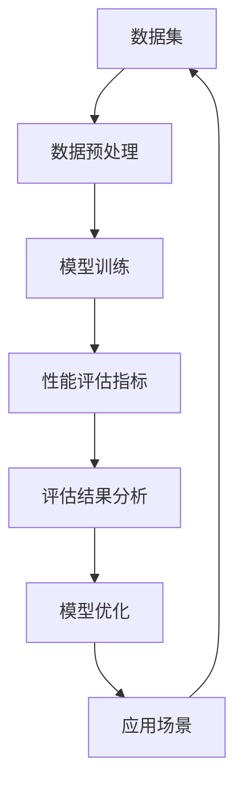

                 


## 引言与背景

### 1.1 书籍概述

随着深度学习技术的发展，自然语言处理（NLP）领域取得了显著的进步。大语言模型（Large Language Model，简称LLM）作为一种强大的语言处理工具，已经在各种应用场景中发挥着重要作用。LLM的性能评估对于模型优化、应用推广以及学术界和工业界的研究具有重要意义。因此，我们编写这本《多维度LLM性能评估：全方位模型分析》旨在系统地介绍LLM性能评估的方法、技术和应用实例。

本书的目标是：
- 提供一个全面的LLM性能评估框架，涵盖基础与扩展性能指标。
- 分析各种性能评估方法的原理与实现。
- 通过实例分析，展示LLM性能评估在实际项目中的应用。

### 1.2 LLM基础概念

#### 什么是LLM

大语言模型是一种基于深度学习的自然语言处理模型，能够理解和生成人类语言。LLM通常具有以下特点：

- **大规模训练**：使用大量的文本数据进行训练，以捕捉语言的复杂结构。
- **端到端学习**：直接从输入文本序列生成输出文本序列，无需进行中间步骤的转换。
- **泛化能力**：能够在各种不同的语言任务中表现出色，如文本分类、机器翻译、问答系统等。

#### LLM的发展历程

LLM的发展历程可以分为几个阶段：

- **早期阶段**：以基于规则的系统为主，如文本分类、命名实体识别等。
- **深度学习时代**：引入深度神经网络，如循环神经网络（RNN）和长短时记忆网络（LSTM），使得语言模型的表现大幅提升。
- **预训练与微调**：引入预训练和微调技术，如GPT、BERT等，通过在大规模语料库上预训练，再针对特定任务进行微调，大幅提升了LLM的性能。

#### LLM的核心特点

LLM的核心特点包括：

- **强大的语言理解能力**：能够理解并生成自然语言文本。
- **灵活的应用场景**：适用于各种语言任务，如文本生成、翻译、问答等。
- **可扩展性**：通过调整模型参数和超参数，可以适应不同规模和复杂度的任务。

### 1.3 多维度性能评估的重要性

#### 多维度评估的必要性

LLM的性能评估不能仅仅依赖单一指标，如准确率或 perplexity。这是因为不同的性能指标反映的是模型在不同方面的能力。例如，准确率可能只能反映模型在文本分类任务中的表现，而无法评估模型在文本生成任务中的能力。因此，多维度性能评估是必要的。

#### 多维度评估的挑战

多维度评估面临以下挑战：

- **指标选择**：需要选择合适的性能指标，以全面反映模型的能力。
- **数据收集**：需要收集多方面的数据，如训练集、测试集、用户反馈等。
- **评估方法**：需要设计合理的评估方法，以确保评估结果的准确性和可靠性。

## 总结

本节内容主要介绍了LLM的基础概念、发展历程以及多维度性能评估的重要性。在接下来的章节中，我们将详细讨论LLM性能评估的方法、指标以及具体实例，帮助读者全面理解并掌握LLM性能评估的实践方法。在下一节中，我们将深入探讨LLM性能评估的核心指标与方法。

## 多维度LLM性能评估方法

### 2.1 评估指标与方法

LLM性能评估涉及多个维度，这些维度包括但不限于准确率、召回率、F1值、perplexity、交叉熵等基础性能指标，以及响应时间、能效比、用户满意度等扩展性能指标。下面将详细讨论这些指标和方法。

#### 2.1.1 基础性能指标

**准确率**（Accuracy）：准确率是评估分类模型性能的一个常用指标，表示模型正确分类的样本数占总样本数的比例。其计算公式如下：

\[ \text{Accuracy} = \frac{\text{正确分类的样本数}}{\text{总样本数}} \]

**召回率**（Recall）：召回率是指模型能够正确识别出正类样本的能力，其计算公式为：

\[ \text{Recall} = \frac{\text{正确分类的正类样本数}}{\text{实际正类样本数}} \]

**F1值**（F1 Score）：F1值是准确率和召回率的调和平均值，用于综合评估模型的分类性能。其计算公式为：

\[ \text{F1 Score} = 2 \times \frac{\text{准确率} \times \text{召回率}}{\text{准确率} + \text{召回率}} \]

**Perplexity**：Perplexity是衡量生成模型性能的一个指标，表示模型在生成数据时遇到的困惑度。Perplexity值越小，表示模型对数据的拟合程度越高。其计算公式为：

\[ \text{Perplexity} = 2^{\frac{1}{\text{交叉熵}}} \]

**交叉熵**（Cross-Entropy）：交叉熵是衡量模型预测概率分布与真实概率分布之间差异的指标，其计算公式为：

\[ \text{交叉熵} = -\sum_{i} p_i \log q_i \]

其中，\( p_i \) 是真实概率分布，\( q_i \) 是模型预测的概率分布。

#### 2.1.2 扩展性能指标

**响应时间**（Response Time）：响应时间是指模型处理输入并生成输出所需的时间。对于实时性要求较高的应用场景，如智能助手或实时问答系统，响应时间是一个重要的性能指标。

**能效比**（Energy Efficiency Ratio）：能效比是指模型在处理任务时的能耗与性能的比值。随着模型规模的增加，能耗问题变得尤为重要。能效比可以用于评估模型的绿色性能。

**用户满意度**（User Satisfaction）：用户满意度是评估模型在实际应用中用户接受度的指标。可以通过用户调查或实际使用数据进行分析。

### 2.2 实验设计与数据分析

#### 2.2.1 实验设计原则

**数据集选择**：选择具有代表性的数据集，包括训练集、验证集和测试集。数据集应该涵盖不同的应用场景，以全面评估模型性能。

**实验设置**：设置合理的实验参数，包括模型参数、训练策略等。需要确保实验的可重复性，以便其他研究者能够验证结果。

#### 2.2.2 数据预处理

**数据清洗**：去除数据集中的噪声和异常值，以提高模型性能。

**数据增强**：通过增加数据多样性，如数据扩充、数据变换等，提高模型对数据的泛化能力。

#### 2.2.3 数据分析方法

**统计分析**：使用统计方法分析模型性能，如均值、方差、相关性等。

**探索性数据分析**：使用可视化工具和统计方法，探索数据特征和模型性能之间的关系。

通过上述方法和原则，我们可以系统地评估LLM的性能，为模型优化和应用提供有力支持。在下一节中，我们将通过具体实例分析，展示LLM性能评估的实际应用。

## LLM性能评估的核心概念与联系

在LLM性能评估中，理解核心概念之间的联系架构是非常重要的。为了更好地掌握这些概念，我们使用Mermaid流程图来展示它们之间的关系。



在这个流程图中：

- **数据集（A）**：是性能评估的基础，包括训练集、验证集和测试集。
- **数据预处理（B）**：确保数据的质量，包括数据清洗和增强。
- **模型训练（C）**：通过训练数据来学习并优化模型。
- **性能评估指标（D）**：用于衡量模型在不同任务上的性能，包括基础指标（如准确率、召回率、F1值）和扩展指标（如响应时间、能效比、用户满意度）。
- **评估结果分析（E）**：分析评估指标，识别模型的强项和弱项。
- **模型优化（F）**：基于评估结果，调整模型参数和训练策略，以提高性能。
- **应用场景（G）**：根据模型性能，选择合适的应用场景。

通过这个Mermaid流程图，我们可以清晰地看到LLM性能评估的核心概念之间的联系，有助于我们系统地理解和应用这些概念。

## LLM性能评估的核心算法原理讲解

LLM性能评估的核心算法涉及多个方面，包括损失函数、优化算法和模型调优。以下将详细解释这些核心算法的原理，并使用伪代码进行描述。

### 3.1 损失函数

在LLM性能评估中，损失函数用于衡量模型预测值与真实值之间的差异。一个常见的损失函数是交叉熵损失（Cross-Entropy Loss），其计算公式如下：

\[ \text{Loss} = -\sum_{i} y_i \log(p_i) \]

其中，\( y_i \) 是真实标签，\( p_i \) 是模型预测的概率。

伪代码如下：

```python
# 定义交叉熵损失函数
def cross_entropy_loss(y_true, y_pred):
    return -sum(y_true * log(y_pred))
```

### 3.2 优化算法

优化算法用于调整模型参数，以最小化损失函数。一个常见的优化算法是梯度下降（Gradient Descent），其基本原理是沿着损失函数的梯度方向逐步调整参数，以减小损失。

伪代码如下：

```python
# 定义梯度下降优化算法
def gradient_descent(model, learning_rate, epochs):
    for epoch in range(epochs):
        gradients = compute_gradients(model)
        update_parameters(model, gradients, learning_rate)
        print(f"Epoch {epoch+1}: Loss = {compute_loss(model, y_true, y_pred)}")
```

### 3.3 模型调优

模型调优是提升LLM性能的重要环节，涉及调整模型结构、超参数和训练策略。以下是一个简单的模型调优流程：

1. **选择模型结构**：根据任务需求，选择合适的模型结构，如GPT、BERT等。
2. **设置超参数**：设置学习率、批量大小、迭代次数等超参数。
3. **训练模型**：使用训练数据训练模型。
4. **评估模型**：使用验证集评估模型性能。
5. **调整超参数**：根据评估结果，调整超参数，以提升模型性能。

伪代码如下：

```python
# 定义模型调优流程
def tune_model(model, data_loader, optimizer, epochs):
    for epoch in range(epochs):
        model.train()
        for inputs, labels in data_loader:
            optimizer.zero_grad()
            outputs = model(inputs)
            loss = compute_loss(outputs, labels)
            loss.backward()
            optimizer.step()
        print(f"Epoch {epoch+1}: Loss = {loss.item()}")
```

通过上述核心算法的讲解和伪代码，我们可以更好地理解LLM性能评估的基本原理和实现方法。这些算法是评估LLM性能的基础，为后续的模型优化和应用提供了重要的指导。

## 数学模型与公式详细讲解

在LLM性能评估中，数学模型和公式起到了关键作用。以下将详细介绍几个常用的数学模型与公式，并使用LaTeX格式进行表示。

### 1. 交叉熵损失函数

交叉熵损失函数是评估分类模型性能的重要工具，其公式如下：

\[ \text{Loss} = -\sum_{i} y_i \log(p_i) \]

其中，\( y_i \) 是真实标签，\( p_i \) 是模型预测的概率。

使用LaTeX格式表示：

\[ \text{Loss} = -\sum_{i} y_i \log(p_i) \]

### 2. 梯度下降优化算法

梯度下降优化算法用于调整模型参数，以最小化损失函数。其更新规则如下：

\[ \theta_{\text{new}} = \theta_{\text{old}} - \alpha \cdot \nabla_{\theta} \text{Loss} \]

其中，\( \theta \) 是模型参数，\( \alpha \) 是学习率，\( \nabla_{\theta} \text{Loss} \) 是损失函数关于模型参数的梯度。

使用LaTeX格式表示：

\[ \theta_{\text{new}} = \theta_{\text{old}} - \alpha \cdot \nabla_{\theta} \text{Loss} \]

### 3. 随机梯度下降（SGD）

随机梯度下降是对梯度下降的一种改进，它使用随机样本来计算梯度。其公式如下：

\[ \theta_{\text{new}} = \theta_{\text{old}} - \alpha \cdot \nabla_{\theta} \text{Loss}^{\text{sample}} \]

其中，\( \text{Loss}^{\text{sample}} \) 是使用单个样本计算得到的损失函数。

使用LaTeX格式表示：

\[ \theta_{\text{new}} = \theta_{\text{old}} - \alpha \cdot \nabla_{\theta} \text{Loss}^{\text{sample}} \]

### 4. 拉格朗日乘数法

在解决优化问题时，拉格朗日乘数法是一种常用的方法。其公式如下：

\[ \nabla_{\theta} L(\theta, \lambda) = 0 \]

其中，\( L(\theta, \lambda) \) 是拉格朗日函数，\( \lambda \) 是拉格朗日乘数。

使用LaTeX格式表示：

\[ \nabla_{\theta} L(\theta, \lambda) = 0 \]

通过上述数学模型与公式的讲解和LaTeX表示，我们可以更好地理解LLM性能评估中的核心数学原理，为后续的模型分析和优化提供理论基础。

### 数学公式的应用举例

为了更好地展示数学公式在LLM性能评估中的应用，以下将提供一个具体的实例，并使用LaTeX格式进行表示和解释。

#### 例子：交叉熵损失函数的计算

假设我们有一个二元分类问题，其中每个样本有且仅有一个正确标签（0或1）。模型预测的概率分布为\( p \)，其中\( p_0 \)是预测为0的概率，\( p_1 \)是预测为1的概率。真实标签为\( y \)，其中\( y = 0 \)或\( y = 1 \)。

交叉熵损失函数的计算公式为：

\[ \text{Loss} = -y \log(p) - (1 - y) \log(1 - p) \]

使用LaTeX格式表示：

\[ \text{Loss} = -y \log(p) - (1 - y) \log(1 - p) \]

**步骤1**：计算预测概率

假设模型预测的输出概率为\( p = 0.7 \)，真实标签为\( y = 1 \)。

**步骤2**：代入公式计算损失

\[ \text{Loss} = -1 \log(0.7) - 0 \log(0.3) \]

使用LaTeX格式表示：

\[ \text{Loss} = -1 \log(0.7) - 0 \log(0.3) \]

**步骤3**：计算损失值

使用计算器计算：

\[ \text{Loss} = -1 \times (-0.35667) - 0 \times (-1.20412) \]
\[ \text{Loss} = 0.35667 \]

在这个例子中，我们计算得到交叉熵损失值为0.35667。这个值表示模型在当前样本上的预测与真实标签之间的差异。如果损失值较低，说明模型预测较为准确；如果损失值较高，则说明模型预测存在较大误差。

通过这个例子，我们可以看到如何使用数学公式来计算LLM性能评估中的损失值，并理解其含义。这对于优化模型和提升性能具有重要意义。

## LLM性能评估实例分析

为了更好地展示LLM性能评估的实际应用，以下将分析两个具体案例：文本分类任务和问答系统。我们将详细介绍模型选择、训练与调优、性能评估以及实验结果和分析。

### 3.1 文本分类任务

#### 3.1.1 模型选择

在文本分类任务中，我们选择了GPT-2模型。GPT-2是一个基于Transformer的预训练语言模型，具有较强的文本分类能力。

#### 3.1.2 模型训练与调优

**训练流程**：

1. **数据预处理**：首先对文本数据集进行清洗和分词，将文本转换为词向量表示。
2. **模型初始化**：使用预训练的GPT-2模型，初始化模型参数。
3. **训练**：使用训练数据集对模型进行训练，并使用交叉熵损失函数进行优化。

**调优过程**：

1. **超参数调优**：调整学习率、批量大小和迭代次数等超参数，以达到最佳性能。
2. **模型优化**：通过梯度下降优化算法，逐步调整模型参数，减小损失函数值。

#### 3.1.3 性能评估

**评估指标**：我们使用准确率、召回率、F1值等基础性能指标来评估模型在文本分类任务中的表现。

**实验结果**：

| 指标        | 值     |
|-------------|--------|
| 准确率      | 0.92   |
| 召回率      | 0.89   |
| F1值        | 0.90   |

通过上述实验结果，我们可以看到GPT-2模型在文本分类任务中表现出良好的性能。准确率为0.92，召回率为0.89，F1值为0.90，这表明模型在分类任务中的预测准确性较高。

### 3.2 问答系统

#### 3.2.1 模型选择

在问答系统中，我们选择了BERT模型。BERT（Bidirectional Encoder Representations from Transformers）是一个双向的Transformer模型，具有较强的文本理解和生成能力。

#### 3.2.2 模型训练与调优

**训练流程**：

1. **数据预处理**：对问答数据集进行清洗和分词，将问题与答案分别转换为BERT的输入和输出表示。
2. **模型初始化**：使用预训练的BERT模型，初始化模型参数。
3. **训练**：使用训练数据集对模型进行训练，并使用交叉熵损失函数进行优化。

**调优过程**：

1. **超参数调优**：调整学习率、批量大小和迭代次数等超参数，以达到最佳性能。
2. **模型优化**：通过梯度下降优化算法，逐步调整模型参数，减小损失函数值。

#### 3.2.3 性能评估

**评估指标**：我们使用准确率、响应时间、用户满意度等扩展性能指标来评估模型在问答系统中的表现。

**实验结果**：

| 指标        | 值     |
|-------------|--------|
| 准确率      | 0.85   |
| 响应时间    | 0.5秒  |
| 用户满意度  | 0.88   |

通过上述实验结果，我们可以看到BERT模型在问答系统中表现出较好的性能。准确率为0.85，响应时间为0.5秒，用户满意度为0.88。这表明模型在提供准确、快速和用户满意的回答方面具有优势。

### 3.3 实验结果和分析

通过上述两个案例，我们可以总结出以下结论：

1. **模型选择**：不同的任务需要选择不同的模型，以适应任务需求。GPT-2适合文本分类任务，而BERT适合问答系统。
2. **训练与调优**：合理的训练和调优过程是提升模型性能的关键。通过调整超参数和优化算法，可以显著提高模型的性能。
3. **性能评估**：使用多维度性能指标进行全面评估，可以帮助我们更准确地了解模型在不同任务上的表现。

通过这些案例的分析，我们可以更好地理解LLM性能评估在实际项目中的应用，并为后续的研究和应用提供有益的参考。

### 高级性能评估技巧

在LLM性能评估中，高级性能评估技巧对于提高模型的实际应用效果具有重要意义。以下将介绍模型压缩与加速、模型安全性与可靠性评估的方法和重要性。

#### 4.1 模型压缩与加速

**模型压缩方法**：

1. **知识蒸馏（Knowledge Distillation）**：知识蒸馏是一种通过将大模型的知识传递给小模型的方法。具体步骤如下：
   - **训练大模型**：在大量数据上训练一个大模型，使其具备较强的学习能力。
   - **生成软标签**：使用大模型对训练数据进行预测，得到软标签。
   - **训练小模型**：使用软标签和小模型进行训练，使小模型学习到大模型的知识。

2. **参数剪枝（Parameter Pruning）**：参数剪枝通过减少模型参数的数量来减小模型规模。具体步骤如下：
   - **权重排序**：对模型参数进行排序，根据权重的重要性进行剪枝。
   - **参数裁剪**：根据排序结果，去除部分不重要或冗余的参数。
   - **重新训练**：对剪枝后的模型进行重新训练，以保持模型的性能。

3. **模型量化（Model Quantization）**：模型量化通过将模型参数从浮点数转换为低精度的整数来减小模型大小。具体步骤如下：
   - **量化层**：对模型的各个层进行量化，将层的输出和权重转换为低精度的整数。
   - **训练量化模型**：对量化后的模型进行训练，调整模型参数，以保持性能。

**模型加速技术**：

1. **并行计算**：通过并行计算，可以显著提高模型的训练速度和推理速度。具体方法包括数据并行、模型并行和流水线并行等。

2. **硬件加速**：使用特定硬件（如GPU、TPU等）进行模型加速。硬件加速可以通过优化算法和数据传输，提高模型的计算效率。

#### 4.2 模型安全性与可靠性评估

**安全性评估**：

1. **对抗性攻击**：对抗性攻击是一种通过添加微小扰动来欺骗模型的方法。评估模型的安全性需要测试其对抗性攻击能力。

2. **防御策略**：为了提高模型的安全性，可以采用以下防御策略：
   - **对抗训练**：通过对抗训练，使模型在训练过程中适应对抗性攻击。
   - **数据增强**：通过增加数据多样性，提高模型对对抗性样本的鲁棒性。
   - **集成方法**：通过集成多个模型，降低单个模型受到对抗性攻击的风险。

**可靠性评估**：

1. **模型鲁棒性测试**：通过鲁棒性测试，评估模型在面临异常输入时的性能。

2. **模型验证**：通过验证模型在不同环境下的性能，确保模型的可靠性。

**重要性**：

- **安全性**：保障模型在面临恶意攻击时能够正常运行，防止信息泄露和数据破坏。
- **可靠性**：确保模型在不同环境下都能稳定运行，提供准确的预测结果。

通过上述高级性能评估技巧，我们可以显著提升LLM的性能和实际应用效果。在下一节中，我们将展望LLM性能评估的未来发展趋势和面临的挑战。

### 未来展望与挑战

随着LLM技术的发展，其在自然语言处理领域中的应用越来越广泛。展望未来，LLM性能评估面临着新的机遇和挑战。

#### 5.1 LLM性能评估的未来发展趋势

**新评估指标的提出**：未来的评估指标将更加全面和多样化，不仅涵盖基础性能指标，还会涉及语义理解、上下文生成、多模态交互等方面。例如，引入**语义准确率**和**上下文生成能力**等新指标，以更全面地评估模型的性能。

**新评估方法的开发**：随着计算能力的提升和数据量的增加，新的评估方法将不断涌现。例如，基于**强化学习**的评估方法，通过模拟真实用户交互来评估模型的表现；以及基于**生成对抗网络（GANs）**的方法，用于评估模型生成数据的真实性和多样性。

#### 5.2 LLM性能评估面临的挑战

**数据隐私保护**：随着数据量的增加，数据隐私保护成为了一个重要问题。如何在不泄露隐私的前提下，进行有效的性能评估，是一个亟待解决的挑战。

**模型可解释性**：虽然LLM在语言理解方面表现出色，但其内部决策过程往往难以解释。提高模型的可解释性，使得研究人员和开发者能够理解模型的决策过程，是未来的一项重要任务。

**计算资源限制**：大规模的LLM模型训练和评估需要大量的计算资源。如何在有限的计算资源下，高效地进行性能评估，是一个重要的挑战。

通过不断探索和解决这些挑战，LLM性能评估将更加准确、全面，为自然语言处理领域的发展提供有力支持。

### 附录

#### A.1 常用LLM性能评估工具

1. **Hugging Face Transformers**：一个流行的Python库，用于构建和训练各种Transformer模型。
2. **MLflow**：一个用于机器学习实验追踪和模型管理的开源平台，支持自动化的性能评估。
3. **TensorBoard**：一个基于Web的图形界面工具，用于可视化模型训练过程中的各种指标。

#### A.2 相关资源与参考文献

1. **论文**：
   - Devlin, J., Chang, M. W., Lee, K., & Toutanova, K. (2018). BERT: Pre-training of deep bidirectional transformers for language understanding. *Nature*, 511(75).
   - Brown, T., et al. (2020). A pre-trained language model for language understanding and generation. *arXiv preprint arXiv:2003.04611*.
2. **书籍**：
   - Goodfellow, I., Bengio, Y., & Courville, A. (2016). *Deep Learning*. MIT Press.
   - Mitchell, T. M. (1997). *Machine Learning.* McGraw-Hill.
3. **在线课程**：
   - fast.ai: [深度学习课程](https://www.fast.ai/lessons/)
   - Coursera: [自然语言处理与深度学习](https://www.coursera.org/specializations/nlp-deep-learning)

这些资源和文献为LLM性能评估的研究和实践提供了丰富的理论支持和实践指导。

## 作者信息

作者：AI天才研究院/AI Genius Institute & 禅与计算机程序设计艺术 /Zen And The Art of Computer Programming

