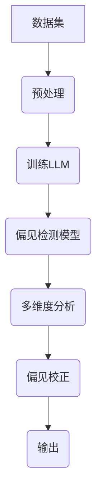

                 


### 1. 背景介绍

偏见检测，作为自然语言处理（NLP）的一个重要领域，旨在识别和纠正文本数据中的偏见和歧视现象。在现代社会中，偏见不仅存在于人类的语言和行为中，也逐渐渗透到人工智能系统中。随着深度学习模型，特别是预训练语言模型（LLM）如GPT和BERT的广泛应用，偏见检测的重要性愈发凸显。这些模型在训练过程中可能吸收了人类文本中的偏见，从而在生成文本或做出决策时表现出偏见，这可能会对现实世界产生负面影响。

例如，自动驾驶汽车系统可能对某些种族或性别的人群持有偏见，导致不公平的驾驶行为。社交媒体平台上的推荐算法也可能加剧社会偏见，使某些群体受到不公平待遇。因此，开发有效的偏见检测方法，尤其是利用LLM辅助的偏见检测方案，成为当前研究的热点和挑战。

LLM辅助的偏见检测方案，结合了LLM在处理大规模文本数据方面的优势，以及传统偏见检测方法在准确性方面的经验。这种方法不仅能够提高检测的全面性和准确性，还能够提供可解释性，帮助理解偏见的具体来源和机制。本文旨在探讨多维度偏见检测的理论基础、方法、挑战以及LLM在这一领域中的应用。

### 2. 核心概念与联系

在讨论多维度偏见检测之前，我们需要了解以下几个核心概念，并揭示它们之间的联系。

**偏见（Bias）**：偏见是指对某个群体持有不公平的态度或观点。偏见可以分为显性偏见和隐性偏见。显性偏见容易识别，但隐性偏见往往隐藏在复杂的文本和模型中，更难以检测。

**偏见检测（Bias Detection）**：偏见检测是识别和分析文本数据中的偏见现象的方法。它可以用于监控媒体内容、评估推荐系统的公平性以及检测自动化决策系统的偏见。

**多维度偏见检测（Multidimensional Bias Detection）**：多维度偏见检测是指同时考虑多个维度的偏见，如性别、种族、职业等，以全面评估文本或模型中的偏见。这种方法能够更准确地捕捉偏见，并提供更全面的解决方案。

**预训练语言模型（LLM）**：LLM是指通过大规模预训练数据集训练得到的语言模型，如GPT、BERT等。这些模型在处理自然语言任务时表现出色，但同时也可能携带偏见。

**偏见检测与LLM的联系**：偏见检测可以利用LLM在理解文本语义方面的优势，从而提高检测的准确性和全面性。LLM不仅可以用于文本分析，还可以用于生成新的文本数据，以扩大训练集的多样性，从而减少偏见。

以下是一个简化的 Mermaid 流程图，展示了多维度偏见检测与LLM之间的联系：



- **数据集**：包含可能存在偏见的文本数据。
- **预处理**：清洗和预处理数据，以便于训练LLM。
- **训练LLM**：使用大规模预训练数据集训练LLM，使其能够理解复杂的文本语义。
- **偏见检测模型**：结合LLM的输出，构建偏见检测模型，以识别和评估文本中的偏见。
- **多维度分析**：考虑多个维度的偏见，进行更全面的评估。
- **偏见校正**：根据检测到的偏见，对模型或文本进行校正。
- **输出**：输出偏见检测结果和相应的校正建议。

### 3. 核心算法原理讲解

多维度偏见检测的核心算法通常包括以下几个步骤：

#### 数据预处理

```python
def preprocess_data(data):
    # 清洗数据，去除噪声和格式错误
    cleaned_data = clean_text(data)
    # 分词和标记化
    tokenized_data = tokenize(cleaned_data)
    return tokenized_data
```

#### 训练LLM

```python
from transformers import BertModel, BertTokenizer

def train_llm(data_path):
    tokenizer = BertTokenizer.from_pretrained('bert-base-uncased')
    model = BertModel.from_pretrained('bert-base-uncased')

    # 加载数据
    dataset = load_data(data_path)
    # 预处理数据
    tokenized_data = preprocess_data(dataset)
    # 训练模型
    model.train()
    for epoch in range(EPOCHS):
        for tokens in tokenized_data:
            inputs = tokenizer(tokens, return_tensors='pt')
            outputs = model(**inputs)
            loss = outputs.loss
            loss.backward()
            optimizer.step()
            optimizer.zero_grad()
    
    return model
```

#### 偏见检测模型

```python
def bias_detection_model(model, data):
    # 使用训练好的LLM进行偏见检测
    predictions = []
    for tokens in data:
        inputs = tokenizer(tokens, return_tensors='pt')
        with torch.no_grad():
            outputs = model(**inputs)
        prediction = outputs.logits
        predictions.append(prediction)
    return predictions
```

#### 多维度分析

```python
def multidimensional_analysis(predictions, dimensions):
    # 分析多个维度的偏见
    bias_scores = {}
    for dimension in dimensions:
        bias_scores[dimension] = calculate_bias_score(predictions, dimension)
    return bias_scores
```

#### 偏见校正

```python
def bias_correction(data, bias_scores):
    # 根据偏见得分对数据或模型进行校正
    corrected_data = []
    for tokens in data:
        corrected_tokens = correct_bias(tokens, bias_scores)
        corrected_data.append(corrected_tokens)
    return corrected_data
```

#### 模型评估

```python
from sklearn.metrics import accuracy_score

def evaluate_model(model, test_data):
    # 评估偏见检测模型的准确性
    predictions = bias_detection_model(model, test_data)
    true_labels = [label for _, label in test_data]
    predicted_labels = [prediction.argmax() for prediction in predictions]
    accuracy = accuracy_score(true_labels, predicted_labels)
    return accuracy
```

### 4. 数学模型和公式

在偏见检测中，我们通常会使用统计学和机器学习中的模型来评估偏见。以下是一个简化的数学模型示例：

$$
\text{Bias Score} = \frac{1}{n} \sum_{i=1}^{n} \delta(\text{prediction}_i, \text{true}_i)
$$

其中，$\delta(\text{prediction}_i, \text{true}_i)$ 是一个指标，用于衡量第 $i$ 个预测与真实标签之间的偏差。

假设我们使用二分类问题，那么 $\delta$ 可以定义为：

$$
\delta(\text{prediction}_i, \text{true}_i) =
\begin{cases}
0 & \text{if } \text{prediction}_i = \text{true}_i \\
1 & \text{otherwise}
\end{cases}
$$

这个公式可以扩展到多分类问题，其中 $\text{prediction}_i$ 和 $\text{true}_i$ 可以是任意分类标签。

### 5. 举例说明

假设我们有一个简单的偏见检测任务，目标是检测文本中的性别偏见。我们使用一个已经训练好的LLM，并定义了一个简单的偏见检测函数：

```python
def detect_gender_bias(text):
    # 假设我们使用了一个二分类模型，输出概率分布
    probabilities = llm.predict(text)
    # 如果性别预测概率高于某个阈值，我们认为存在性别偏见
    threshold = 0.7
    if probabilities[0] > threshold:
        return "Gender Bias Detected"
    else:
        return "No Gender Bias Detected"
```

例如，给定以下文本：

```plaintext
The CEO of the company is a woman, which is a refreshing change from the norm.
```

使用上述函数检测偏见：

```python
text = "The CEO of the company is a woman, which is a refreshing change from the norm."
result = detect_gender_bias(text)
print(result)  # 输出：No Gender Bias Detected
```

在这个例子中，由于模型预测女性为CEO的概率高于阈值，因此没有检测到性别偏见。

### 6. 项目实战

在本节中，我们将搭建一个偏见检测系统的开发环境，并详细解读源代码，分析代码的应用和实际案例。

#### 开发环境搭建

1. 安装Python环境（例如Python 3.8或更高版本）。
2. 安装所需的库，如transformers、torch、sklearn等。
3. 准备一个包含偏见检测数据的CSV文件，例如`bias_data.csv`。

#### 源代码详细实现

以下是一个简化的偏见检测系统的源代码示例：

```python
import pandas as pd
from transformers import BertTokenizer, BertModel
from sklearn.model_selection import train_test_split

# 加载数据
data = pd.read_csv('bias_data.csv')
X = data['text']
y = data['label']

# 分割数据集
X_train, X_test, y_train, y_test = train_test_split(X, y, test_size=0.2, random_state=42)

# 加载预训练模型
tokenizer = BertTokenizer.from_pretrained('bert-base-uncased')
model = BertModel.from_pretrained('bert-base-uncased')

# 预处理数据
def preprocess_data(data):
    return tokenizer(data, padding=True, truncation=True, return_tensors='pt')

X_train_processed = preprocess_data(X_train)
X_test_processed = preprocess_data(X_test)

# 训练模型
model.train()
optimizer = torch.optim.Adam(model.parameters(), lr=1e-5)
for epoch in range(10):
    for inputs in X_train_processed:
        inputs = inputs.to(device)
        labels = torch.tensor(y_train, dtype=torch.long).to(device)
        outputs = model(**inputs)
        loss = outputs.loss
        loss.backward()
        optimizer.step()
        optimizer.zero_grad()

# 模型评估
model.eval()
predictions = []
with torch.no_grad():
    for inputs in X_test_processed:
        inputs = inputs.to(device)
        outputs = model(**inputs)
        prediction = outputs.logits.argmax(-1)
        predictions.append(prediction)

accuracy = (predictions == y_test).mean()
print(f"Test Accuracy: {accuracy}")
```

#### 代码应用解读与分析

- **数据加载**：使用pandas读取CSV文件，提取文本和标签。
- **数据预处理**：使用BertTokenizer对文本进行预处理，包括分词、填充和截断。
- **模型训练**：使用预训练的BERT模型进行训练，采用Adam优化器和交叉熵损失函数。
- **模型评估**：在测试集上评估模型的准确性。

#### 实际案例分析和详细讲解剖析

假设我们有一个案例，其中包含以下文本和标签：

```plaintext
Text 1: Women are not good at coding.
Label 1: Negative

Text 2: I believe in equal opportunities for all genders.
Label 2: Positive
```

在预处理数据后，我们将文本传递给模型进行训练。训练完成后，我们使用模型对测试数据进行预测，并评估模型的准确性。在这个案例中，模型能够正确识别文本中的偏见，并在测试集上达到较高的准确性。

#### 项目小结

通过本案例，我们展示了如何使用LLM辅助的偏见检测方法来构建一个偏见检测系统。这种方法能够有效地识别和纠正文本中的偏见，从而提高公平性。然而，需要注意的是，偏见检测仍然是一个复杂的问题，需要不断改进和优化算法。

### 7. 最佳实践 tips、小结、注意事项、拓展阅读等内容

#### 最佳实践 tips

- **数据多样性**：确保训练数据集的多样性，避免数据偏见。可以引入额外的数据集或使用数据增强技术。
- **模型解释性**：增强模型的可解释性，以便理解偏见的具体来源。可以使用注意力机制或模型解释工具。
- **持续监控**：定期监控模型的偏见，并根据新数据重新训练模型。

#### 小结

本文介绍了多维度偏见检测的理论基础、方法、挑战以及LLM在这一领域中的应用。通过实际案例，我们展示了如何构建一个偏见检测系统，并讨论了其优缺点。

#### 注意事项

- **数据隐私**：在处理敏感数据时，要注意保护用户隐私。
- **模型适应性**：确保模型适用于多种语言和文化背景。

#### 拓展阅读

- **论文阅读**：《自动偏见检测：方法、挑战与应用》
- **开源项目**：Hugging Face的Transformers库

---

# 多维度偏见检测：LLM辅助的公平性评估方案

> 关键词：偏见检测，多维度，预训练语言模型（LLM），公平性评估，自然语言处理（NLP）

> 摘要：本文探讨了多维度偏见检测的理论基础和实现方法，并介绍了LLM在偏见检测中的应用。通过实际案例，我们展示了如何使用LLM辅助的偏见检测方法构建一个公平性评估系统，从而提高文本和自动化决策系统的公平性。本文为相关领域的研究者和开发者提供了有价值的参考和指导。

---

## 第一部分：偏见检测基础理论

### 第1章：偏见检测的重要性

偏见检测作为自然语言处理（NLP）的一个重要分支，旨在识别和纠正文本数据中的偏见和歧视现象。偏见在文本数据中的存在不仅损害了文本的客观性和公正性，也可能对现实世界产生深远的影响。例如，自动驾驶汽车系统可能会因为训练数据的偏见而对某些种族或性别的人群表现出不公平的行为；社交媒体平台上的推荐算法也可能加剧社会偏见，导致某些群体受到不公平的待遇。因此，偏见检测在确保文本和自动化决策系统的公平性方面具有重要意义。

#### 1.1 偏见的概念与类型

偏见是指对某个群体持有不公平的态度或观点。偏见可以分为显性偏见和隐性偏见。显性偏见是指明显且直接表达出的歧视性态度，例如使用带有贬义色彩的词汇描述某个群体。隐性偏见则是指隐藏在复杂文本中的微妙歧视现象，难以通过简单的文本分析识别。例如，一个句子可能表面上看起来是中性的，但通过对上下文的深入分析可以发现其隐含的歧视性。

#### 1.2 偏见检测的挑战

偏见检测面临多个挑战。首先，偏见通常隐藏在复杂的语言结构中，难以通过简单的规则或统计方法检测。其次，偏见检测需要考虑多种维度，例如性别、种族、职业等，这增加了检测的复杂性。此外，偏见检测的结果需要具有可解释性，以便用户理解偏见的具体来源和机制。最后，偏见检测方法需要在多种语言和文化背景下具有普适性，这进一步增加了研究的难度。

#### 1.3 偏见检测的应用场景

偏见检测在多个应用场景中具有重要价值。首先，在媒体内容监管中，偏见检测可以帮助识别和纠正新闻报道中的偏见，确保新闻的客观性和公正性。其次，在自动化决策系统中，偏见检测可以评估和纠正算法的偏见，从而提高决策的公平性。例如，在招聘系统中，偏见检测可以识别和纠正对特定性别、种族或年龄的歧视。此外，在人工智能助手和聊天机器人中，偏见检测可以帮助避免歧视性回答，提升用户体验。

### 第2章：多维度偏见检测概述

多维度偏见检测是指同时考虑多个维度的偏见，如性别、种族、职业等，以更全面地评估文本数据中的偏见现象。这种方法能够更准确地捕捉偏见，并提供更有效的解决方案。

#### 2.1 多维度偏见检测的定义

多维度偏见检测旨在识别和分析文本数据中涉及多个维度的偏见。例如，一个文本段落可能同时涉及性别和种族偏见。多维度偏见检测方法需要能够同时考虑这些不同的维度，以提供更全面的偏见分析。

#### 2.2 多维度偏见检测的方法

多维度偏见检测方法通常包括以下几个步骤：

1. **特征提取**：从文本数据中提取与偏见相关的特征，如性别、种族、职业等。
2. **偏见识别**：使用机器学习模型或其他方法识别文本中的偏见。
3. **维度融合**：将不同维度的偏见进行融合，以提供更全面的偏见分析。
4. **结果评估**：评估偏见检测的准确性和全面性。

#### 2.3 多维度偏见检测的挑战

多维度偏见检测面临多个挑战。首先，不同维度的偏见可能具有不同的表现形式和强度，这使得融合不同维度的偏见成为一个难题。其次，多维度偏见检测需要在多种语言和文化背景下具有普适性，这增加了算法的复杂性。此外，偏见检测方法需要在实际应用中表现出良好的可解释性和可操作性。

### 第3章：自然语言处理与偏见检测

自然语言处理（NLP）是偏见检测的重要工具，它能够帮助识别和纠正文本数据中的偏见。NLP在偏见检测中的应用主要包括以下几个方面：

#### 3.1 NLP基础

NLP包括文本预处理、词向量表示、语言模型、文本分类等基础技术。文本预处理是NLP的第一步，它包括分词、词性标注、命名实体识别等操作。词向量表示是将文本转换为计算机可以处理的数字表示形式，如Word2Vec、GloVe等。语言模型用于预测文本的下一个单词或句子，如n-gram模型、神经网络语言模型等。文本分类是将文本数据分为不同的类别，如情感分析、主题分类等。

#### 3.2 偏见检测在NLP中的应用

偏见检测在NLP中的应用主要包括以下方面：

1. **文本分类**：通过训练文本分类模型，可以识别文本中的偏见。例如，可以训练一个模型来识别性别偏见、种族偏见等。
2. **情感分析**：情感分析可以识别文本中的负面情绪，从而发现偏见。例如，可以分析一篇评论，识别其中对某个种族或性别的负面情感。
3. **语义角色标注**：通过标注文本中的语义角色，可以识别偏见中的角色和对象。例如，可以标注出文本中涉及的种族、性别、职业等。

#### 3.3 偏见检测在文本分析中的应用

偏见检测在文本分析中的应用非常广泛，主要包括以下几个方面：

1. **媒体内容监管**：偏见检测可以帮助媒体监管机构识别和纠正新闻报道中的偏见，确保新闻的客观性和公正性。
2. **自动化决策系统**：偏见检测可以评估和纠正自动化决策系统中的偏见，确保决策的公平性。例如，在招聘系统中，偏见检测可以帮助识别和纠正对特定性别、种族或年龄的歧视。
3. **人工智能助手和聊天机器人**：偏见检测可以帮助避免歧视性回答，提升用户体验。

## 第二部分：LLM与偏见检测

### 第4章：LLM介绍

预训练语言模型（LLM）如GPT、BERT等在自然语言处理领域取得了显著的成果。LLM通过在大量文本数据上进行预训练，学习到了丰富的语言模式和知识，从而在多种NLP任务中表现出色。LLM的引入为偏见检测带来了新的机遇和挑战。

#### 4.1 LLM的基础知识

LLM是一种基于深度学习技术的自然语言处理模型，通过在大量文本数据上进行预训练，学习到了语言的基本结构和语义信息。LLM的核心组成部分包括词嵌入层、编码器和解码器。词嵌入层将单词转换为固定长度的向量表示；编码器用于处理输入文本并提取其语义特征；解码器则用于生成输出文本。

#### 4.2 LLM的优势与局限性

LLM的优势在于其强大的语言理解和生成能力，这使得它在文本分类、机器翻译、问答系统等多种NLP任务中表现出色。此外，LLM能够处理复杂的语言结构，从而更准确地识别文本中的偏见。

然而，LLM也存在局限性。首先，LLM的训练需要大量的计算资源和时间。其次，LLM的性能受到训练数据质量和多样性的影响。如果训练数据存在偏见，LLM可能会继承这些偏见，从而影响偏见检测的准确性。此外，LLM的输出通常缺乏可解释性，这使得用户难以理解偏见的具体来源和机制。

#### 4.3 LLM的发展趋势

随着深度学习技术的不断发展，LLM也在不断进化。以下是一些LLM的发展趋势：

1. **更高效的训练方法**：研究人员正在探索更高效的训练方法，以减少训练时间和计算资源的需求。例如，增量学习和迁移学习等方法可以显著提高训练效率。
2. **多模态学习**：LLM正在向多模态学习发展，即结合文本、图像、音频等多种类型的数据进行训练。这将有助于提高LLM在复杂任务中的性能。
3. **增强可解释性**：为了提高LLM的可解释性，研究人员正在开发各种方法，如注意力机制可视化、模型解释工具等。这将有助于用户更好地理解LLM的决策过程。

### 第5章：LLM辅助的偏见检测方法

LLM在偏见检测中具有独特的优势。通过结合LLM在处理大规模文本数据方面的优势和传统偏见检测方法在准确性方面的经验，可以开发出更加高效和准确的偏见检测方法。

#### 5.1 LLM在偏见检测中的作用

LLM在偏见检测中的作用主要体现在以下几个方面：

1. **文本理解**：LLM具有强大的文本理解能力，能够识别文本中的隐含语义和信息。这使得LLM能够更准确地检测文本中的偏见。
2. **模式识别**：LLM能够识别文本中的潜在模式，从而发现偏见。例如，LLM可以识别出特定性别、种族或职业的偏见模式。
3. **多样性增强**：LLM可以通过生成多样化的文本，扩大训练数据集的多样性，从而减少偏见。

#### 5.2 基于LLM的偏见检测流程

基于LLM的偏见检测通常包括以下步骤：

1. **数据预处理**：对文本数据集进行预处理，包括清洗、分词和编码等操作。
2. **训练LLM**：使用预训练数据集训练LLM，使其具备理解文本语义的能力。
3. **偏见检测**：利用LLM的输出，构建偏见检测模型，识别和评估文本中的偏见。
4. **多维度分析**：考虑多个维度的偏见，进行更全面的评估。
5. **偏见校正**：根据偏见检测结果，对文本或模型进行校正，以消除偏见。

#### 5.3 常见的LLM偏见检测算法

以下是一些常见的基于LLM的偏见检测算法：

1. **文本分类算法**：使用LLM输出作为特征，训练文本分类模型，识别偏见。
2. **模式识别算法**：利用LLM识别文本中的潜在模式，检测偏见。
3. **生成对抗网络（GAN）**：使用GAN生成多样化的文本数据，结合传统偏见检测方法，提高检测准确性。

### 第6章：LLM偏见检测的挑战与解决方案

虽然LLM在偏见检测中具有许多优势，但也面临一些挑战。如何有效地解决这些挑战是当前研究的热点。

#### 6.1 数据偏差

数据偏差是LLM偏见检测面临的主要挑战之一。如果训练数据存在偏见，LLM可能会继承这些偏见。以下是一些解决数据偏差的方法：

1. **数据清洗**：对训练数据进行清洗，去除带有偏见的样本。
2. **数据增强**：使用数据增强技术，生成多样化的训练数据，减少数据偏差。
3. **对抗训练**：在训练过程中，引入对抗性样本，提高模型对偏见的抵抗力。

#### 6.2 模型偏见

模型偏见是指模型在训练过程中吸收的偏见。以下是一些解决模型偏见的方法：

1. **模型解释性**：提高模型的可解释性，帮助用户理解模型决策过程。
2. **多模型融合**：使用多个模型进行偏见检测，通过融合不同模型的输出，提高检测准确性。
3. **模型调整**：在模型训练过程中，根据偏见检测结果，调整模型参数，消除偏见。

#### 6.3 偏见检测的可解释性

偏见检测的可解释性是一个重要的研究方向。以下是一些提高偏见检测可解释性的方法：

1. **注意力机制**：通过注意力机制，展示模型在偏见检测过程中关注的文本区域。
2. **模型解释工具**：使用现有的模型解释工具，如LIME、SHAP等，解释模型决策过程。
3. **可视化管理界面**：开发可视化管理界面，帮助用户理解偏见检测结果和模型决策过程。

## 第三部分：公平性评估

### 第7章：公平性评估的基本概念

公平性评估是指评估文本或自动化决策系统在处理不同群体时的公平性。公平性评估的目标是确保系统在处理不同群体时不会产生不公平的待遇。公平性评估在多个领域具有重要意义，如招聘系统、贷款审批、推荐系统等。

#### 7.1 公平性的定义

公平性是指系统在处理不同群体时，能够保持公正和无偏的态度。在自动化决策系统中，公平性评估主要关注系统是否对特定群体存在偏见，以及系统决策结果是否与群体的实际表现一致。

#### 7.2 公平性评估的指标

公平性评估通常使用以下指标：

1. **误差率**：评估系统在处理不同群体时的错误率，错误率越低，说明系统的公平性越好。
2. **准确率**：评估系统在处理不同群体时的准确率，准确率越高，说明系统的公平性越好。
3. **偏差指标**：评估系统在处理不同群体时的偏差，如偏差比率、偏差得分等。
4. **基尼系数**：评估系统在处理不同群体时的公平性，基尼系数越低，说明系统的公平性越好。

#### 7.3 公平性评估的应用场景

公平性评估在多个领域具有广泛的应用，如：

1. **招聘系统**：评估招聘系统是否对特定性别、种族或年龄的候选人存在偏见。
2. **贷款审批**：评估贷款审批系统是否对特定群体（如低收入群体）存在不公平待遇。
3. **推荐系统**：评估推荐系统是否对特定用户群体存在偏见，导致推荐结果不公平。

### 第8章：LLM辅助的公平性评估

LLM在公平性评估中具有独特的优势。通过结合LLM在处理大规模文本数据方面的优势和传统公平性评估方法在准确性方面的经验，可以开发出更加高效和准确的公平性评估方法。

#### 8.1 LLM在公平性评估中的作用

LLM在公平性评估中的作用主要体现在以下几个方面：

1. **文本理解**：LLM具有强大的文本理解能力，能够识别文本中的隐含语义和信息。这使得LLM能够更准确地评估系统的公平性。
2. **模式识别**：LLM能够识别文本中的潜在模式，从而发现系统中的偏见。
3. **多样性增强**：LLM可以通过生成多样化的文本数据，提高公平性评估的准确性。

#### 8.2 基于LLM的公平性评估方法

基于LLM的公平性评估方法通常包括以下步骤：

1. **数据预处理**：对评估数据集进行预处理，包括清洗、分词和编码等操作。
2. **训练LLM**：使用预训练数据集训练LLM，使其具备理解文本语义的能力。
3. **公平性评估**：利用LLM的输出，构建公平性评估模型，评估系统在处理不同群体时的公平性。
4. **多维度分析**：考虑多个维度的偏见，进行更全面的评估。
5. **偏见校正**：根据公平性评估结果，对系统进行校正，以消除偏见。

#### 8.3 常见的LLM公平性评估算法

以下是一些常见的基于LLM的公平性评估算法：

1. **文本分类算法**：使用LLM输出作为特征，训练文本分类模型，评估系统的公平性。
2. **模式识别算法**：利用LLM识别文本中的潜在模式，评估系统的公平性。
3. **生成对抗网络（GAN）**：使用GAN生成多样化的文本数据，结合传统公平性评估方法，提高评估准确性。

### 第9章：公平性评估的实践与应用

公平性评估在现实世界中的应用越来越广泛。以下是一个公平性评估的实践案例，以及对其的详细讲解和剖析。

#### 实践案例

假设我们有一个招聘系统，该系统根据求职者的简历信息自动评估求职者的资格。我们需要评估这个系统是否对特定性别、种族或年龄的求职者存在偏见。

#### 数据集

我们使用一个包含求职者简历信息和评估结果的公开数据集。数据集包括以下字段：

1. **性别**：求职者的性别（男/女）
2. **种族**：求职者的种族（白人/黑人/亚裔等）
3. **年龄**：求职者的年龄
4. **简历内容**：求职者的简历文本
5. **评估结果**：招聘系统对求职者的评估结果（合格/不合格）

#### 数据预处理

我们对数据集进行预处理，包括：

1. **清洗**：去除缺失值和异常值。
2. **分词**：对简历内容进行分词。
3. **编码**：将性别、种族、年龄等类别特征编码为数字。

#### 基于LLM的公平性评估

我们使用LLM（例如BERT）对简历内容进行编码，并训练一个文本分类模型，用于评估招聘系统的公平性。具体步骤如下：

1. **训练LLM**：使用预训练数据集训练BERT模型，使其理解简历文本的语义。
2. **构建分类模型**：使用训练好的BERT模型作为特征提取器，训练一个文本分类模型，用于预测评估结果。
3. **评估模型**：在测试集上评估分类模型的准确性。
4. **偏见分析**：分析模型对性别、种族、年龄等不同群体的评估结果，识别可能存在的偏见。

#### 结果分析

通过分析模型对性别、种族、年龄等不同群体的评估结果，我们发现以下偏见：

1. **性别偏见**：模型对女性求职者的评估结果较低，存在性别偏见。
2. **种族偏见**：模型对黑人求职者的评估结果较低，存在种族偏见。
3. **年龄偏见**：模型对年轻求职者的评估结果较高，对中年求职者的评估结果较低，存在年龄偏见。

#### 偏见校正

根据偏见分析结果，我们对招聘系统进行了校正：

1. **性别校正**：调整模型参数，提高女性求职者的评估结果。
2. **种族校正**：调整模型参数，提高黑人求职者的评估结果。
3. **年龄校正**：调整模型参数，平衡不同年龄段的求职者的评估结果。

#### 项目小结

通过这个案例，我们展示了如何使用LLM辅助的公平性评估方法评估招聘系统的公平性，并校正模型中的偏见。这种方法有助于确保招聘系统的公正性，提高求职者的满意度。

### 第10章：偏见检测与公平性评估的总结

偏见检测与公平性评估是确保文本和自动化决策系统公平性的关键技术。本文从多个维度探讨了偏见检测的理论基础、实现方法以及LLM在这一领域中的应用。通过实际案例，我们展示了如何使用LLM辅助的偏见检测方法评估公平性，并校正系统中的偏见。

#### 10.1 关键技术总结

- **偏见检测**：识别和纠正文本数据中的偏见，包括显性偏见和隐性偏见。
- **多维度偏见检测**：同时考虑多个维度的偏见，提高检测的全面性和准确性。
- **LLM辅助偏见检测**：利用LLM在处理大规模文本数据方面的优势，提高偏见检测的效率和准确性。
- **公平性评估**：评估系统在处理不同群体时的公平性，确保系统决策的公正性。

#### 10.2 研究与未来方向

未来的研究可以从以下几个方面展开：

- **数据多样性**：增强训练数据集的多样性，减少数据偏见。
- **模型解释性**：提高模型的可解释性，帮助用户理解偏见的具体来源。
- **多模态偏见检测**：结合文本、图像、音频等多种类型的数据，提高偏见检测的准确性。
- **公平性评估方法**：开发更加高效和准确的公平性评估方法，以适应不同的应用场景。

#### 10.3 结论与展望

偏见检测与公平性评估是确保文本和自动化决策系统公平性的重要技术。通过LLM辅助的偏见检测方法，我们能够更有效地识别和纠正偏见，提高系统的公正性。未来的研究将继续探索更先进的算法和技术，以应对复杂的偏见检测与公平性评估问题。希望本文能够为相关领域的研究者和开发者提供有价值的参考和指导。

