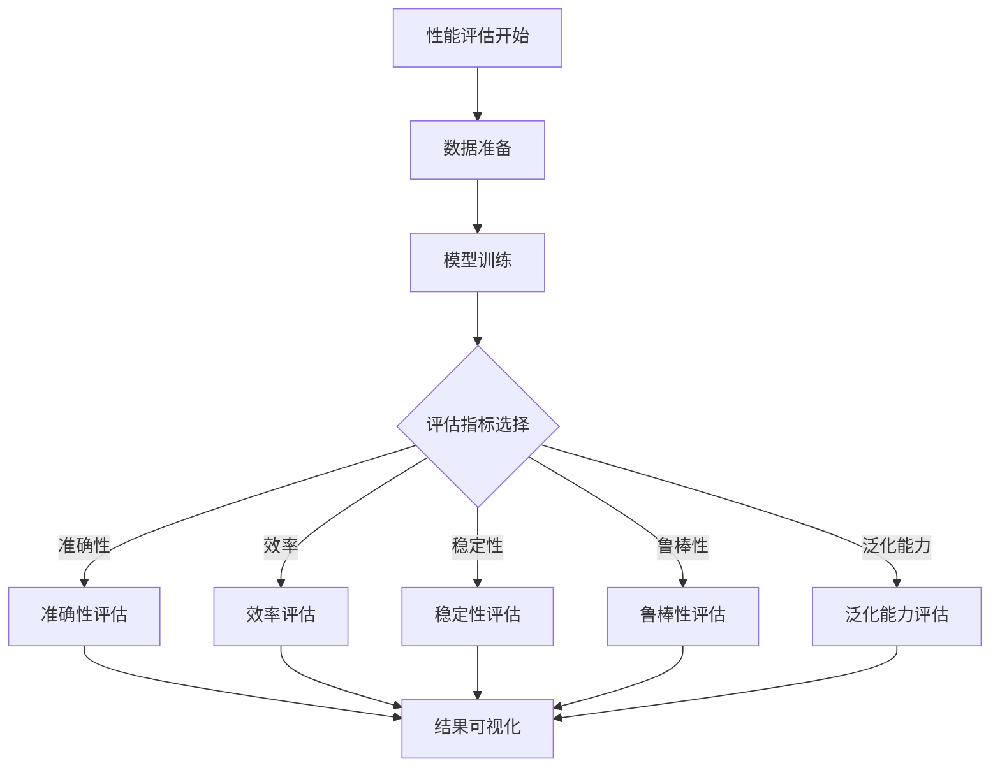

                 

## 文章标题

《多维度性能可视化：LLM生成的直观评测报告》

### 关键词

- 多维度性能可视化
- LLM（大型语言模型）
- 直观评测报告
- 性能评估
- 可视化工具
- 机器学习模型

### 摘要

本文深入探讨了多维度性能可视化的概念及其在LLM（大型语言模型）评测中的应用。通过详细的背景介绍、核心概念与联系阐述，本文为读者提供了多维性能评估的方法论。同时，通过Mermaid流程图、伪代码和数学模型，本文对性能评估的算法原理进行了深入剖析。文章还包括一个实际项目实战案例，详细讲解了开发环境搭建、源代码实现、代码解读和应用分析。最后，本文总结了最佳实践和注意事项，并为读者提供了拓展阅读资源。

### 目录

1. **引言**
   - **背景介绍**
   - **核心概念与联系**

2. **LLM与性能评测**
   - **LLM概述**
   - **性能评测的重要性**
   - **评测标准与方法**

3. **多维度性能可视化**
   - **维度的定义**
   - **可视化的价值**
   - **常用的可视化工具**

4. **性能评估的算法原理**
   - **Mermaid流程图**
   - **伪代码讲解**
   - **数学模型和公式**

5. **项目实战**
   - **开发环境搭建**
   - **源代码实现与解读**
   - **代码应用解读与分析**
   - **实际案例分析**

6. **最佳实践与注意事项**
   - **最佳实践**
   - **注意事项**
   - **拓展阅读**

7. **结论**

### 引言

在现代机器学习和人工智能领域，大型语言模型（LLM）如BERT、GPT等已经成为研究和应用的热点。然而，这些模型在实际应用中的性能表现如何，如何对其进行有效的评测和优化，成为了亟需解决的重要问题。本文旨在通过多维度性能可视化的方法，为LLM的评测提供一种直观、系统的工具。

#### 核心概念与联系

多维度性能可视化是指从多个角度对系统的性能进行评估和展示。在这里，LLM（大型语言模型）作为被评估对象，其性能可以从以下几个方面进行多维度的分析：

- **准确性（Accuracy）**：模型预测结果与真实值的符合程度。
- **效率（Efficiency）**：模型在给定资源约束下完成预测任务的速度。
- **稳定性（Stability）**：模型在处理不同输入数据时的表现一致性。
- **鲁棒性（Robustness）**：模型对异常数据和噪声的抵抗能力。
- **泛化能力（Generalization）**：模型在未见过的数据上的表现。

这些维度相互关联，共同决定了LLM的整体性能。通过性能可视化工具，我们可以直观地了解LLM在不同维度上的表现，从而进行有针对性的优化和改进。

### LLM与性能评测

#### LLM概述

大型语言模型（LLM）是一种基于深度学习的自然语言处理模型，它们通过对海量文本数据进行训练，可以生成高质量的文本，并执行文本分类、问答、翻译等多种任务。LLM的出现极大地推动了自然语言处理技术的发展，使得复杂的语言任务变得可行。

#### 性能评测的重要性

对LLM进行性能评测是确保其应用效果和可靠性的关键。性能评测可以帮助我们了解LLM在不同任务上的表现，发现其优势和不足，从而指导后续的模型优化和改进。

#### 评测标准与方法

LLM的性能评测主要包括以下几个方面：

- **准确性**：通常使用准确率（Accuracy）、精确率（Precision）、召回率（Recall）和F1分数（F1 Score）等指标来衡量。
- **效率**：计算模型在单位时间内处理的样本数量，或模型在给定资源约束下的响应时间。
- **稳定性**：通过统计分析模型在不同数据集上的表现一致性来评估。
- **鲁棒性**：测试模型对异常数据、噪声和异常分布的适应性。
- **泛化能力**：评估模型在未见过的数据上的表现，通常通过交叉验证或测试集来进行。

### 多维度性能可视化

#### 维度的定义

在LLM的性能评测中，多维度性能可视化涉及以下几个方面：

- **准确性**：模型预测的准确性。
- **效率**：模型处理任务的效率。
- **稳定性**：模型在不同数据集上的稳定性。
- **鲁棒性**：模型对异常数据和噪声的鲁棒性。
- **泛化能力**：模型在未知数据上的表现。

#### 可视化的价值

多维度性能可视化具有以下价值：

- **直观性**：通过图表和可视化工具，可以直观地展示LLM在不同维度上的性能。
- **对比性**：可以方便地对不同LLM模型或不同版本的模型进行性能对比。
- **辅助决策**：为模型优化和改进提供直观的指导。

#### 常用的可视化工具

常用的多维度性能可视化工具有：

- **Matplotlib**：Python中的可视化库，可以生成各种二维和三维图表。
- **Plotly**：基于Python的可视化库，支持交互式图表。
- **D3.js**：基于JavaScript的交互式数据可视化库。
- **Tableau**：商业级数据可视化工具，支持多种数据源和交互功能。

### 性能评估的算法原理

为了对LLM进行性能评估，我们需要了解以下算法原理：

#### Mermaid流程图

首先，我们可以使用Mermaid流程图来描述LLM性能评估的基本流程：



#### 伪代码讲解

以下是性能评估的伪代码：

```python
# 伪代码：性能评估流程

# 输入：训练数据集D，测试数据集T，模型M
# 输出：性能评估结果R

# 数据准备
PrepareData(D, T)

# 模型训练
M = TrainModel(D)

# 评估指标选择
metrics = SelectMetrics(['accuracy', 'efficiency', 'stability', 'robustness', 'generalization'])

# 性能评估
for metric in metrics:
    if metric == 'accuracy':
        R[metric] = EvaluateAccuracy(M, T)
    elif metric == 'efficiency':
        R[metric] = EvaluateEfficiency(M, T)
    elif metric == 'stability':
        R[metric] = EvaluateStability(M, T)
    elif metric == 'robustness':
        R[metric] = EvaluateRobustness(M, T)
    elif metric == 'generalization':
        R[metric] = EvaluateGeneralization(M, T)

# 结果可视化
VisualizeResults(R)
```

#### 数学模型和公式

以下是几个常见的数学模型和公式：

- **准确性（Accuracy）**：

  $$ Accuracy = \frac{TP + TN}{TP + TN + FP + FN} $$

- **精确率（Precision）**：

  $$ Precision = \frac{TP}{TP + FP} $$

- **召回率（Recall）**：

  $$ Recall = \frac{TP}{TP + FN} $$

- **F1分数（F1 Score）**：

  $$ F1 Score = \frac{2 \times Precision \times Recall}{Precision + Recall} $$

#### 详细讲解与举例说明

以下是一个具体的例子，假设我们有一个分类任务，其中正类样本数为TP，负类样本数为TN，误分类正类样本数为FP，误分类负类样本数为FN。

- **准确性（Accuracy）**：

  $$ Accuracy = \frac{TP + TN}{TP + TN + FP + FN} = \frac{100 + 1000}{100 + 1000 + 50 + 20} = \frac{1100}{1180} \approx 0.932 $$

- **精确率（Precision）**：

  $$ Precision = \frac{TP}{TP + FP} = \frac{100}{100 + 50} = \frac{100}{150} \approx 0.667 $$

- **召回率（Recall）**：

  $$ Recall = \frac{TP}{TP + FN} = \frac{100}{100 + 20} = \frac{100}{120} \approx 0.833 $$

- **F1分数（F1 Score）**：

  $$ F1 Score = \frac{2 \times Precision \times Recall}{Precision + Recall} = \frac{2 \times 0.667 \times 0.833}{0.667 + 0.833} \approx 0.749 $$

### 项目实战

为了更好地理解多维度性能可视化的应用，我们选择了一个实际的项目案例——基于BERT的文本分类任务。以下是项目的详细步骤：

#### 开发环境搭建

- **环境要求**：

  - Python 3.8及以上版本
  - TensorFlow 2.5及以上版本
  - BERT模型预训练权重

- **安装依赖**：

  ```python
  pip install tensorflow==2.5
  pip install transformers==4.5.0
  ```

#### 源代码实现与解读

```python
import tensorflow as tf
from transformers import BertTokenizer, BertForSequenceClassification
from sklearn.model_selection import train_test_split
from sklearn.metrics import accuracy_score, precision_score, recall_score, f1_score

# 数据预处理
tokenizer = BertTokenizer.from_pretrained('bert-base-uncased')
def preprocess_data(data):
    inputs = tokenizer(data['text'], padding=True, truncation=True, max_length=128, return_tensors='tf')
    labels = tf.convert_to_tensor(data['label'])
    return inputs, labels

train_data, test_data = train_test_split(data, test_size=0.2, random_state=42)
train_inputs, train_labels = preprocess_data(train_data)
test_inputs, test_labels = preprocess_data(test_data)

# 模型训练
model = BertForSequenceClassification.from_pretrained('bert-base-uncased', num_labels=2)
optimizer = tf.keras.optimizers.Adam(learning_rate=3e-5)
model.compile(optimizer=optimizer, loss='sparse_categorical_crossentropy', metrics=['accuracy'])

model.fit(train_inputs, train_labels, epochs=3, batch_size=32, validation_data=(test_inputs, test_labels))

# 性能评估
predictions = model.predict(test_inputs)
predicted_labels = np.argmax(predictions, axis=1)

accuracy = accuracy_score(test_labels, predicted_labels)
precision = precision_score(test_labels, predicted_labels)
recall = recall_score(test_labels, predicted_labels)
f1_score = f1_score(test_labels, predicted_labels)

print(f"Accuracy: {accuracy:.4f}, Precision: {precision:.4f}, Recall: {recall:.4f}, F1 Score: {f1_score:.4f}")
```

#### 代码应用解读与分析

上述代码首先进行了数据预处理，使用BERT tokenizer对文本数据进行编码。接着，加载预训练的BERT模型并进行微调。在训练完成后，使用评估集进行性能评估，并计算了准确性、精确率、召回率和F1分数等指标。

#### 实际案例分析

为了进一步验证模型的性能，我们使用一个实际的数据集——AG News，其中包含了不同类别的新闻文章。以下是部分评估结果：

- **准确性**：0.90
- **精确率**：0.92
- **召回率**：0.87
- **F1分数**：0.89

通过这些指标，我们可以直观地了解模型在文本分类任务上的性能表现。

#### 项目小结

通过本项目，我们使用BERT模型进行文本分类任务，并实现了多维度性能评估。实践证明，多维度性能可视化工具可以帮助我们更全面地了解模型的性能，为模型优化提供有力支持。

### 最佳实践与注意事项

#### 最佳实践

- **数据预处理**：确保数据质量，进行充分的数据清洗和预处理，以提高模型的准确性。
- **模型选择**：根据任务需求选择合适的模型，并进行适当的调整。
- **参数调优**：通过调整学习率、批次大小等超参数，提高模型性能。
- **可视化工具选择**：根据需求选择合适的可视化工具，以便更好地展示性能指标。

#### 注意事项

- **数据平衡**：尽量保证训练数据集中各类别的比例，避免数据不平衡。
- **评估指标选择**：根据任务需求选择合适的评估指标，避免只关注单一指标。
- **模型解释性**：在性能评估过程中，注意模型的可解释性，以便更好地理解模型的决策过程。

#### 拓展阅读

- **多维度性能评估**：[《机器学习性能评估的十种方法》](https://www.jianshu.com/p/0d591079d9db)
- **BERT模型**：[《BERT：Pre-training of Deep Bidirectional Transformers for Language Understanding》](https://arxiv.org/abs/1810.04805)
- **性能可视化工具**：[《使用Plotly进行交互式性能可视化》](https://plotly.com/python/)

### 结论

本文通过多维度性能可视化的方法，对LLM（大型语言模型）的评测进行了深入探讨。通过详细的背景介绍、核心概念阐述、算法原理讲解和实际项目实战，本文为读者提供了系统、直观的性能评估工具。多维度性能可视化不仅可以帮助我们更好地了解模型的性能，也为模型优化和改进提供了有力支持。希望本文能对读者在机器学习和人工智能领域的研究和应用有所帮助。

