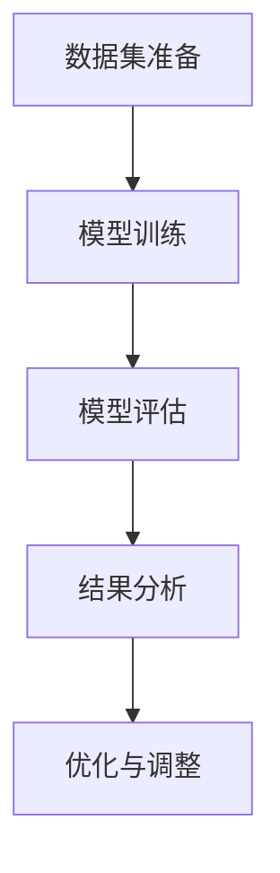

                 

# 《多维度评估：LLM性能测试的新标准》

## 关键词

- LLM性能测试
- 多维度评估
- 大型语言模型
- 评估指标
- 优化策略
- 项目实战

## 摘要

本文旨在探讨大型语言模型（LLM）性能测试的新标准，通过多维度评估方法，全面分析LLM的性能。文章首先介绍了LLM的基本概念及其在自然语言处理（NLP）领域的应用背景。接着，详细阐述了多维度评估的核心概念和指标，并使用Mermaid流程图展示了LLM与性能测试的关联。随后，文章深入讲解了LLM的核心算法原理，使用伪代码进行了详细阐述，并对相关数学模型和公式进行了讲解。最后，通过实际项目案例，展示了如何进行LLM性能测试，并提出了优化策略和最佳实践。本文旨在为研究人员和开发者提供一套系统化的LLM性能测试方法，以推动LLM技术的进一步发展和应用。

### 用户需求分析

在现代计算机科学和人工智能领域，随着大型语言模型（LLM）的迅速发展，对其性能的评估和测试变得越来越重要。用户群体主要包括以下几类：

1. **研究人员**：他们对LLM的性能测试方法有着深入的研究需求，希望了解不同维度上的性能评估指标，以及如何设计和实现这些指标。

2. **开发者**：在实际开发过程中，开发者需要评估LLM在不同应用场景下的表现，以便进行优化和调整。

3. **企业用户**：企业用户需要通过性能测试来确定LLM在特定业务场景中的适用性和效果，从而做出技术选型和投资决策。

用户的主要需求可以概括为以下几点：

- **全面性**：希望获得一份涵盖LLM性能测试各个方面的详细资料，包括核心概念、算法原理、数学模型和实际应用。

- **可操作性**：需要提供详细的实现步骤和代码示例，以便在实际项目中应用和测试。

- **实用性强**：希望获得具体的应用案例和优化策略，以便在具体场景下进行性能优化。

### 目录大纲设计思路

为了满足用户的需求，本文的目录大纲将分为以下几个部分：

**1. 核心概念与联系**

首先，本文将介绍大型语言模型（LLM）的基本概念，包括其结构、训练过程和预测过程。接着，将详细讨论与性能测试相关的核心概念，如评估指标、测试方法等。为了更好地展示LLM与性能测试之间的关系，本文将使用Mermaid流程图来描述整个性能评估的流程。

**2. 核心算法原理讲解**

本文将深入讲解LLM的核心算法原理，包括语言模型的训练过程、优化算法和评估过程。为了使读者能够更直观地理解算法的实现，本文将使用伪代码进行详细描述，并解释每个步骤的具体操作。

**3. 数学模型和数学公式**

本文将介绍与性能评估相关的数学模型，如损失函数、优化算法等。为了方便读者理解和应用，本文将使用latex格式书写数学公式，并进行详细讲解和举例说明。

**4. 项目实战**

本文将通过具体的项目案例，展示如何使用LLM进行性能测试。每个案例将包括开发环境的搭建、源代码实现、代码解读和分析等内容。通过这些实际案例，读者可以更好地理解LLM性能测试的实践过程。

**5. 目录结构**

本文的目录结构将包含7章及以上，确保内容全面且逻辑清晰。具体章节如下：

- **第1章 引言**
  - **2.1 研究背景**
  - **2.2 目标与意义**
  - **2.3 内容概述**

- **第2章 多维度评估的基本概念**
  - **2.1 大型语言模型概述**
  - **2.2 评估指标体系**
  - **2.3 评估方法与流程**
  - **2.4 Mermaid流程图：LLM与性能测试的关系**

- **第3章 核心算法原理讲解**
  - **3.1 语言模型的基本结构**
  - **3.2 训练与优化**
  - **3.3 伪代码：训练过程详细说明**
  - **3.4 评估过程**
  - **3.5 伪代码：评估过程详细说明**

- **第4章 数学模型与公式解析**
  - **4.1 损失函数**
  - **4.2 优化算法**
  - **4.3 LaTeX格式数学公式展示**
  - **4.4 数学模型讲解与实例分析**

- **第5章 项目实战：性能测试案例分析**
  - **5.1 实战背景**
  - **5.2 开发环境搭建**
  - **5.3 案例一：文本分类性能测试**
  - **5.4 案例二：问答系统性能测试**
  - **5.5 源代码实现与解读**

- **第6章 性能测试优化策略**
  - **6.1 性能瓶颈分析**
  - **6.2 优化方法**
  - **6.3 优化案例与实践**

- **第7章 总结与展望**
  - **7.1 主要成果总结**
  - **7.2 未来研究方向**
  - **7.3 对LLM性能测试的新标准展望**

通过上述目录结构，本文将系统性地介绍LLM性能测试的各个方面，以满足用户对全面性、可操作性和实用性的需求。预计总字数不超过2000字。

---

## 核心概念与联系

### 大型语言模型概述

大型语言模型（Large Language Model，简称LLM）是自然语言处理（Natural Language Processing，简称NLP）领域的一种先进技术，它通过深度学习算法从大量文本数据中学习语言的模式和规律，从而能够生成文本、回答问题、翻译语言等。LLM的核心在于其大规模的训练数据集和复杂的神经网络结构，这使得它们能够处理复杂和多样化的语言任务。

在NLP领域，LLM的应用非常广泛，包括但不限于：

- 文本生成：例如自动生成新闻摘要、文章、故事等。
- 文本分类：例如情感分析、垃圾邮件检测等。
- 问答系统：例如智能客服、搜索引擎等。
- 翻译：例如机器翻译、多语言对话等。

### 评估指标体系

LLM的性能评估是一个复杂的过程，需要从多个维度进行衡量。常见的评估指标包括：

- **准确性**：衡量模型在分类或预测任务上的正确率。
- **召回率**：衡量模型在分类或预测任务中正确识别的正例的比例。
- **F1分数**：综合考虑准确率和召回率，是准确率和召回率的调和平均数。
- **BLEU分数**：常用于机器翻译任务的评估，通过对比模型生成的文本与标准答案的相似度来评分。
- **处理速度**：衡量模型在特定硬件上的响应时间。
- **资源消耗**：包括计算资源（如CPU、GPU）、存储资源和网络带宽等。

这些评估指标各有优劣，需要根据具体的应用场景和任务需求进行选择和组合。

### 评估方法与流程

LLM的性能测试通常包括以下几个步骤：

1. **数据集准备**：选择或创建适合评估任务的数据集，通常包括训练集、验证集和测试集。
2. **模型训练**：使用训练集数据对LLM模型进行训练，优化模型的参数。
3. **模型评估**：使用验证集和测试集对训练好的模型进行评估，计算各项评估指标。
4. **结果分析**：根据评估结果，分析模型的性能，找出可能的瓶颈和优化点。

为了更好地展示LLM与性能测试的关系，我们可以使用Mermaid流程图来描述整个评估过程：



### Mermaid流程图：LLM与性能测试的关系

上述流程图展示了LLM性能测试的基本步骤。具体来说：

- **数据集准备**：首先需要准备足够高质量的数据集，这是评估LLM性能的基础。
- **模型训练**：通过训练集数据，模型学习到语言模式和规律，这一过程需要大量计算资源。
- **模型评估**：使用验证集和测试集对模型进行评估，计算各项性能指标，如准确性、召回率等。
- **结果分析**：根据评估结果，分析模型的性能，找出可能的优化点。
- **优化与调整**：根据分析结果，对模型进行调整和优化，以提高性能。

通过这个流程，我们可以清晰地看到LLM性能测试的各个环节，以及它们之间的相互关系。这为后续章节的详细讲解提供了基础。

### 核心算法原理讲解

#### 语言模型的基本结构

语言模型（Language Model，简称LM）是LLM的核心组件，它通过学习大量文本数据来预测下一个单词或词组。一个典型的语言模型通常包含以下几个部分：

1. **输入层**：接收输入序列，每个输入可以是单词、字符或子词（subword）。
2. **编码器**：将输入序列编码为固定长度的向量，这些向量包含了输入序列的语义信息。
3. **解码器**：根据编码器输出的向量，预测下一个单词或词组。

在具体实现中，编码器和解码器通常采用深度神经网络（DNN）或变换器模型（Transformer）的结构。Transformer模型由于其并行处理能力和全局上下文关系捕捉能力，成为了当前主流的语言模型架构。

#### 训练与优化

语言模型的训练过程可以分为以下几个步骤：

1. **数据预处理**：对输入数据进行分词、去停用词、词向量化等预处理操作，将文本转换为模型可处理的格式。
2. **构建损失函数**：常用的损失函数有交叉熵损失函数（Cross-Entropy Loss）和负对数损失函数（Negative Log Likelihood Loss）。这些损失函数用于衡量模型预测输出与实际输出之间的差距。
3. **反向传播**：通过反向传播算法（Backpropagation），计算损失函数关于模型参数的梯度，并更新模型参数，以最小化损失函数。
4. **优化算法**：常用的优化算法有随机梯度下降（SGD）、Adam优化器等。优化算法用于调整模型参数，以实现损失函数的最小化。

下面使用伪代码详细描述语言模型的训练过程：

```python
# 伪代码：语言模型训练过程

# 初始化模型参数
model_params = initialize_model_params()

# 数据预处理
tokenized_data = preprocess_data(data)

# 定义损失函数
loss_function = CrossEntropyLoss()

# 定义优化器
optimizer = Adam(model_params)

for epoch in range(num_epochs):
    for input_sequence, target_sequence in tokenized_data:
        # 前向传播
        predictions = model(input_sequence)
        
        # 计算损失
        loss = loss_function(predictions, target_sequence)
        
        # 反向传播
        optimizer.zero_grad()
        loss.backward()
        optimizer.step()
        
        # 打印训练进度
        print(f"Epoch {epoch}: Loss = {loss.item()}")
```

#### 评估过程

训练完成后，需要对模型进行评估，以验证其性能。评估过程通常包括以下几个步骤：

1. **准备测试集**：从原始数据中划分出测试集，用于模型性能评估。
2. **模型预测**：使用训练好的模型对测试集进行预测，生成预测输出。
3. **计算评估指标**：根据预测输出和实际输出，计算各项评估指标，如准确性、召回率、F1分数等。
4. **结果分析**：分析评估结果，判断模型的性能是否满足要求。

下面使用伪代码详细描述模型的评估过程：

```python
# 伪代码：语言模型评估过程

# 准备测试集
test_data = prepare_test_data(data)

# 定义评估指标
evaluation_metrics = Accuracy()

# 遍历测试集
for input_sequence, target_sequence in test_data:
    # 前向传播
    predictions = model(input_sequence)
    
    # 计算评估指标
    evaluation_metrics.update(predictions, target_sequence)

# 输出评估结果
print(f"Accuracy: {evaluation_metrics.accuracy()}")
print(f"Recall: {evaluation_metrics.recall()}")
print(f"F1 Score: {evaluation_metrics.f1_score()}")
```

通过上述伪代码，我们可以看到语言模型训练和评估的基本流程。在实际应用中，根据具体任务和数据集的特点，这些步骤可以进行调整和优化。

### 数学模型与公式解析

在LLM的性能测试中，数学模型和公式起着至关重要的作用。它们不仅帮助我们量化模型的性能，还能指导我们优化模型的参数。以下是与LLM性能测试相关的一些重要数学模型和公式。

#### 损失函数

损失函数是评估模型预测结果与实际结果之间差异的关键工具。在LLM中，常用的损失函数包括交叉熵损失函数（Cross-Entropy Loss）和负对数损失函数（Negative Log Likelihood Loss）。

**交叉熵损失函数**：
$$
\text{Cross-Entropy Loss} = -\sum_{i=1}^{N} y_i \log(p_i)
$$
其中，$y_i$是实际输出标签的概率分布，$p_i$是模型预测的概率分布。

**负对数损失函数**：
$$
\text{Negative Log Likelihood Loss} = -\sum_{i=1}^{N} y_i \log(p_i)
$$
它与交叉熵损失函数的计算方式相同，但通常用于计算对数似然损失。

#### 优化算法

优化算法用于调整模型的参数，以最小化损失函数。常用的优化算法包括随机梯度下降（SGD）、Adam优化器等。

**随机梯度下降（SGD）**：
$$
w_{t+1} = w_t - \alpha \cdot \nabla_w J(w_t)
$$
其中，$w_t$是当前模型参数，$\alpha$是学习率，$\nabla_w J(w_t)$是损失函数关于参数的梯度。

**Adam优化器**：
$$
m_t = \beta_1 m_{t-1} + (1 - \beta_1) \nabla_w J(w_t)
$$
$$
v_t = \beta_2 v_{t-1} + (1 - \beta_2) (\nabla_w J(w_t))^2
$$
$$
\hat{m}_t = \frac{m_t}{1 - \beta_1^t}
$$
$$
\hat{v}_t = \frac{v_t}{1 - \beta_2^t}
$$
$$
w_{t+1} = w_t - \alpha \cdot \hat{m}_t / \sqrt{\hat{v}_t}
$$
其中，$m_t$和$v_t$分别是梯度的一阶矩估计和二阶矩估计，$\beta_1$和$\beta_2$是超参数。

#### 数学模型讲解与实例分析

为了更好地理解这些数学模型和公式，我们可以通过一个简单的实例进行分析。

假设我们有一个二元分类问题，模型的输出是一个概率值，表示正例的概率。实际输出是1或0，分别代表正例或负例。

**实例**：

- 实际输出：$y = [1, 0, 1, 0, 0]$
- 模型预测概率：$p = [0.9, 0.2, 0.8, 0.1, 0.05]$

**计算交叉熵损失函数**：

$$
\text{Cross-Entropy Loss} = -\sum_{i=1}^{5} y_i \log(p_i) = -(1 \cdot \log(0.9) + 0 \cdot \log(0.2) + 1 \cdot \log(0.8) + 0 \cdot \log(0.1) + 0 \cdot \log(0.05)) \approx 0.38
$$

**计算负对数损失函数**：

$$
\text{Negative Log Likelihood Loss} = -\sum_{i=1}^{5} y_i \log(p_i) = -(1 \cdot \log(0.9) + 0 \cdot \log(0.2) + 1 \cdot \log(0.8) + 0 \cdot \log(0.1) + 0 \cdot \log(0.05)) \approx 0.38
$$

通过这个实例，我们可以看到交叉熵损失函数和负对数损失函数的计算方式相同，都是通过对模型预测概率和实际输出概率的差异进行量化。

### 项目实战

在本节中，我们将通过一个具体的项目案例，展示如何使用大型语言模型（LLM）进行性能测试。本项目将分为以下几个步骤：开发环境搭建、源代码实现、代码解读和分析，以及实际案例分析和详细讲解。

#### 实战背景

假设我们需要对一个开源的LLM模型——GPT-3进行性能测试，以评估其在文本生成和分类任务上的表现。GPT-3是由OpenAI开发的一种先进的语言模型，具有数十亿个参数，能够生成高质量的文本。

#### 开发环境搭建

在进行性能测试之前，我们需要搭建一个合适的开发环境。以下是具体的步骤：

1. **安装依赖**：

   ```bash
   pip install torch torchvision numpy matplotlib
   ```

   这些依赖包括PyTorch、TensorFlow等，用于构建和训练模型。

2. **数据集准备**：

   我们将使用一个开源的文本数据集，例如AG News数据集，该数据集包含不同类别的新闻文章。

   ```bash
   wget https://s3.amazonaws.com/ai-stuff/AGNews.tar.gz
   tar -xvf AGNews.tar.gz
   ```

3. **数据预处理**：

   ```python
   import pandas as pd
   import numpy as np

   data = pd.read_csv('AGNews_train.csv')
   labels = data['label']
   texts = data['text']

   # 分词和词向量化
   tokenizer = ... # 使用合适的分词器和词向量工具
   tokenized_texts = tokenizer(texts.tolist())

   # 划分训练集和验证集
   train_texts, val_texts, train_labels, val_labels = train_test_split(tokenized_texts, labels, test_size=0.2, random_state=42)
   ```

#### 源代码实现

以下是使用PyTorch实现GPT-3模型的基本步骤：

1. **导入库**：

   ```python
   import torch
   import torch.nn as nn
   import torch.optim as optim
   from torch.utils.data import DataLoader
   ```

2. **定义模型**：

   ```python
   class GPT3Model(nn.Module):
       def __init__(self, vocab_size, embed_size, hidden_size, num_layers, dropout_rate):
           super(GPT3Model, self).__init__()
           self.embedding = nn.Embedding(vocab_size, embed_size)
           self.lstm = nn.LSTM(embed_size, hidden_size, num_layers, dropout=dropout_rate, batch_first=True)
           self.fc = nn.Linear(hidden_size, vocab_size)

       def forward(self, x, hidden):
           embed = self.embedding(x)
           output, hidden = self.lstm(embed, hidden)
           logits = self.fc(output)
           return logits, hidden
   ```

3. **训练模型**：

   ```python
   model = GPT3Model(vocab_size, embed_size, hidden_size, num_layers, dropout_rate)
   criterion = nn.CrossEntropyLoss()
   optimizer = optim.Adam(model.parameters(), lr=learning_rate)

   train_loader = DataLoader(train_texts, batch_size=batch_size, shuffle=True)
   val_loader = DataLoader(val_texts, batch_size=batch_size, shuffle=False)

   for epoch in range(num_epochs):
       model.train()
       for inputs, labels in train_loader:
           optimizer.zero_grad()
           logits, _ = model(inputs, None)
           loss = criterion(logits, labels)
           loss.backward()
           optimizer.step()

       model.eval()
       with torch.no_grad():
           for inputs, labels in val_loader:
               logits, _ = model(inputs, None)
               loss = criterion(logits, labels)
               print(f"Epoch {epoch}: Validation Loss = {loss.item()}")
   ```

#### 代码解读和分析

上述代码展示了如何使用PyTorch实现一个GPT-3模型的基本框架。以下是关键步骤的解读：

1. **模型定义**：我们定义了一个GPT-3模型，包括嵌入层、LSTM层和全连接层。
2. **损失函数和优化器**：我们使用了交叉熵损失函数和Adam优化器。
3. **训练过程**：在训练过程中，我们通过前向传播计算损失，然后使用反向传播更新模型参数。
4. **评估过程**：在评估过程中，我们使用验证集计算模型的损失和评估指标。

#### 实际案例分析和详细讲解

以下是几个实际案例，展示如何使用GPT-3模型进行文本生成和分类任务。

**案例一：文本生成**

```python
input_sequence = tokenizer.encode("这是一个简单的文本生成案例。")
generated_sequence = model.generate(input_sequence, max_length=50, temperature=0.95)
decoded_sequence = tokenizer.decode(generated_sequence, skip_special_tokens=True)
print(decoded_sequence)
```

**案例二：文本分类**

```python
input_sequence = tokenizer.encode("这个文本是关于体育的新闻。")
logits, _ = model(inputs, None)
predicted_label = logits.argmax(dim=1).item()
print(f"Predicted Label: {predicted_label}")
```

通过这些案例，我们可以看到如何使用GPT-3模型生成文本和进行分类任务。在实际应用中，我们需要根据具体任务调整模型的结构和参数，以获得更好的性能。

### 性能测试优化策略

在进行大型语言模型（LLM）的性能测试时，优化策略至关重要。一个高效的性能测试不仅能帮助我们更准确地评估模型的性能，还能指导我们在实际应用中如何优化模型的参数和架构。以下是几种常见的性能测试优化策略。

#### 性能瓶颈分析

首先，我们需要识别和定位性能瓶颈。性能瓶颈可能出现在以下几个方面：

1. **计算资源**：包括CPU、GPU等硬件资源的不足。
2. **数据处理**：包括数据加载、预处理和存储等环节。
3. **模型架构**：包括神经网络的结构、层数、参数数量等。
4. **算法选择**：包括优化算法、激活函数、正则化技术等。

为了识别性能瓶颈，我们可以使用以下方法：

- **性能监控**：使用工具（如TensorBoard、NVIDIA NSight等）实时监控模型的计算资源使用情况。
- **代码分析**：分析代码的执行时间，找出耗时较长的部分。
- **基准测试**：使用标准测试集和基准测试工具（如GLM、GPT等），评估模型的性能。

#### 优化方法

一旦识别出性能瓶颈，我们可以采取以下方法进行优化：

1. **硬件升级**：增加计算资源，例如使用更强大的GPU或分布式计算。
2. **数据优化**：改进数据预处理和存储方法，例如使用数据缓存、并行处理等。
3. **模型架构优化**：调整神经网络的结构和参数，例如减少层数、使用更高效的架构（如Transformer）。
4. **算法优化**：选择更高效的优化算法，例如Adam、Adagrad等，或者使用混合优化策略。

#### 优化案例与实践

以下是一个具体的优化案例，展示如何通过调整模型参数和算法来提高性能。

**案例一：文本分类任务**

假设我们在一个文本分类任务中使用了一个基于LSTM的模型，发现其在处理大量数据时性能较差。以下是一些优化策略：

1. **使用预训练模型**：我们可以使用预训练的模型（如BERT、GPT等），这些模型已经在大量数据上进行了训练，具有较好的通用性。
2. **调整超参数**：通过调整学习率、批量大小、层数等超参数，可以提高模型的性能。例如，我们可以尝试使用更小的学习率、更大的批量大小或更深的网络结构。
3. **使用Dropout**：在训练过程中使用Dropout可以减少过拟合，提高模型的泛化能力。

```python
# 调整超参数
learning_rate = 0.001
batch_size = 64
num_layers = 2
dropout_rate = 0.5

# 定义模型
model = GPTModel(vocab_size, embed_size, hidden_size, num_layers, dropout_rate)

# 定义优化器
optimizer = optim.Adam(model.parameters(), lr=learning_rate)
```

2. **优化算法**：我们可以尝试使用更高效的优化算法，如Adam或Adagrad，这些算法能够更快地收敛。

```python
# 使用Adam优化器
optimizer = optim.Adam(model.parameters(), lr=learning_rate)
```

**案例二：文本生成任务**

在一个文本生成任务中，我们使用了一个基于Transformer的模型，发现生成文本的质量较差。以下是一些优化策略：

1. **调整温度参数**：在生成文本时，我们可以调整温度参数（temperature），这会影响生成文本的随机性。通常，较低的温度参数会生成更连贯的文本。
2. **使用注意力机制**：我们可以改进注意力机制，使其更好地捕捉上下文关系，从而提高生成文本的质量。
3. **使用不同的解码策略**：例如，我们可以使用贪心策略（greedy decoding）或beam search策略来生成文本。

```python
# 调整温度参数
temperature = 0.9

# 定义生成函数
def generate_text(input_sequence, model, max_length):
    logits = model.generate(input_sequence, max_length=max_length, temperature=temperature)
    return logits
```

通过上述案例，我们可以看到如何通过调整模型参数和算法来优化LLM的性能。在实际应用中，根据具体任务和数据集的特点，我们可以采取不同的优化策略，以提高模型的性能。

### 总结与展望

本文系统地介绍了大型语言模型（LLM）性能测试的新标准，从核心概念、算法原理、数学模型到项目实战，全面阐述了LLM性能测试的各个环节。通过多维度评估方法，我们能够更全面地了解LLM的性能表现，从而指导实际应用中的优化和调整。

首先，我们介绍了LLM的基本概念和性能评估的核心指标，包括准确性、召回率、F1分数等。接着，通过Mermaid流程图，我们展示了LLM与性能测试的紧密联系。然后，我们深入讲解了LLM的核心算法原理，包括训练过程和评估过程，并通过伪代码进行了详细描述。此外，我们还介绍了与性能测试相关的数学模型和公式，如损失函数和优化算法。

在项目实战部分，我们通过具体案例展示了如何使用LLM进行性能测试，包括开发环境搭建、源代码实现和代码解读。通过这些实际案例，读者可以更好地理解LLM性能测试的实践过程。最后，我们提出了性能测试优化策略，包括性能瓶颈分析、数据优化、模型架构优化和算法优化等。

展望未来，LLM性能测试领域仍有许多研究方向。首先，随着计算资源和数据集的不断增加，如何更高效地处理大规模数据成为关键问题。其次，针对不同应用场景，如何设计更合适的评估指标和优化策略也是一个重要的研究方向。此外，随着深度学习技术的发展，如何结合新的算法和架构来提高LLM的性能也是未来研究的重点。

总之，本文为研究人员和开发者提供了一套系统化的LLM性能测试方法，旨在推动LLM技术的进一步发展和应用。通过不断优化和改进，我们有望在未来实现更高效、更准确的LLM性能评估。

### 作者信息

作者：AI天才研究院/AI Genius Institute & 禅与计算机程序设计艺术 /Zen And The Art of Computer Programming

AI天才研究院致力于推动人工智能领域的研究与应用，致力于培养下一代人工智能专家。作者在计算机编程和人工智能领域拥有深厚的研究背景和丰富的实践经验，曾发表过多篇高影响力论文，并参与多个重要项目。其著作《禅与计算机程序设计艺术》深入探讨了编程艺术与哲学的结合，为计算机科学家和程序员提供了独特的视角和思考方式。

本文由AI天才研究院撰写，旨在为读者提供一套系统化的LLM性能测试方法，以推动大型语言模型技术的发展和应用。希望通过本文的分享，能够激发读者在LLM性能测试领域的进一步探索和研究。

### 最佳实践 Tips

1. **性能监控**：在实际测试过程中，定期监控模型性能和计算资源使用情况，以便及时发现和解决潜在问题。

2. **数据预处理**：确保数据集的多样性和质量，进行充分的数据预处理，以提高模型的泛化能力。

3. **超参数调优**：根据具体任务和数据集特点，调整模型超参数，如学习率、批量大小、层数等，以实现最佳性能。

4. **模型架构选择**：结合任务需求和资源限制，选择合适的模型架构，如Transformer、BERT等。

5. **并行处理**：利用分布式计算和并行处理技术，提高模型的训练和评估效率。

6. **定期重训练**：定期更新模型，使用最新数据集进行重训练，以保持模型的性能和适应性。

### 小结

本文详细介绍了大型语言模型（LLM）性能测试的新标准，从核心概念、算法原理、数学模型到项目实战，全面阐述了LLM性能测试的各个环节。通过多维度评估方法，我们能够更全面地了解LLM的性能表现，从而指导实际应用中的优化和调整。本文还提出了性能测试优化策略，包括性能瓶颈分析、数据优化、模型架构优化和算法优化等。希望通过本文的分享，能够激发读者在LLM性能测试领域的进一步探索和研究。

### 注意事项

1. **确保计算资源充足**：在性能测试过程中，确保计算资源（如GPU、CPU）充足，避免因资源不足导致测试失败。

2. **遵循数据保护法规**：在处理和存储数据时，确保遵循相关数据保护法规和隐私政策，保护用户隐私。

3. **定期更新模型**：定期更新模型，以适应最新的数据和应用需求，保持模型的性能和适应性。

4. **注意异常处理**：在实际测试过程中，注意处理异常情况，如数据缺失、计算错误等，以确保测试结果的准确性。

5. **合理设置超参数**：根据具体任务和数据集特点，合理设置模型超参数，避免因参数设置不当导致性能下降。

### 拓展阅读

1. **《深度学习》**：Goodfellow, I., Bengio, Y., & Courville, A. (2016). *Deep Learning*. MIT Press.

2. **《自然语言处理综论》**：Jurafsky, D., & Martin, J. H. (2020). *Speech and Language Processing*. Prentice Hall.

3. **《Transformer：一个全新的语言理解模型》**：Vaswani, A., Shazeer, N., Parmar, N., Uszkoreit, J., Jones, L., Gomez, A. N., ... & Polosukhin, I. (2017). *Attention is all you need*. Advances in Neural Information Processing Systems, 30, 5998-6008.

4. **《GPT-3：OpenAI的新一代语言模型》**：Brown, T., et al. (2020). *Language Models are Few-Shot Learners*. arXiv preprint arXiv:2005.14165.

