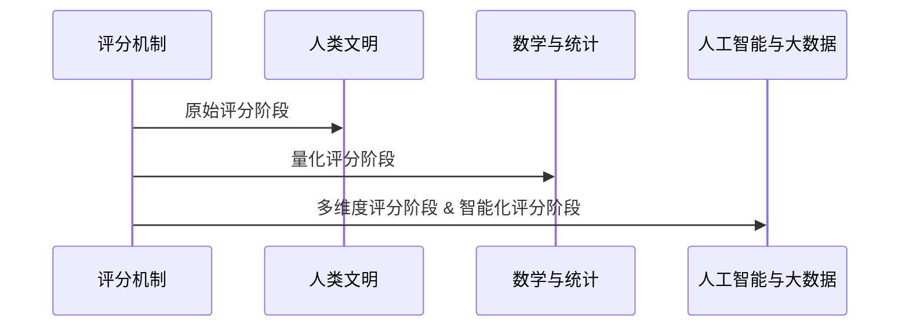
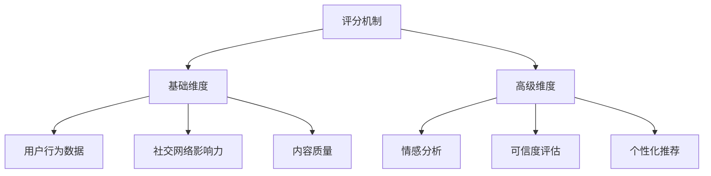
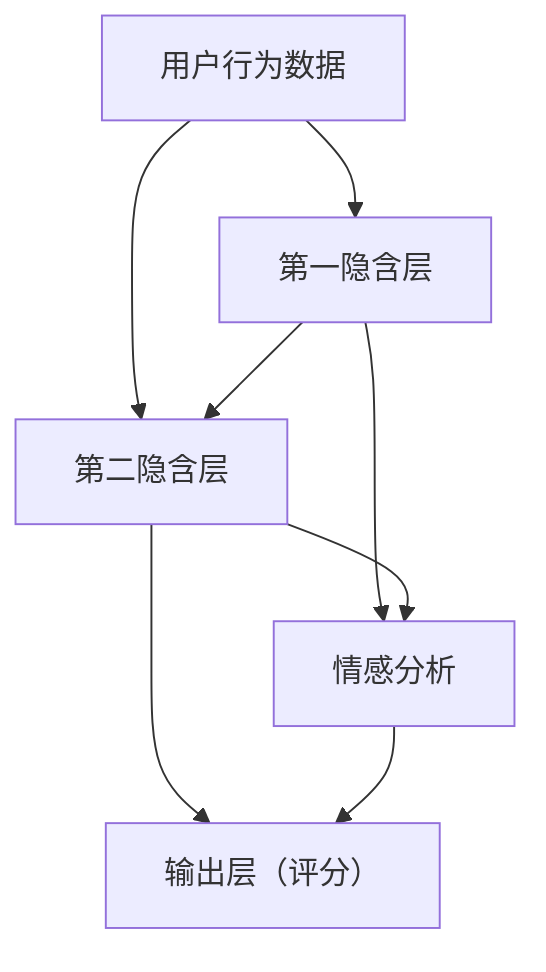
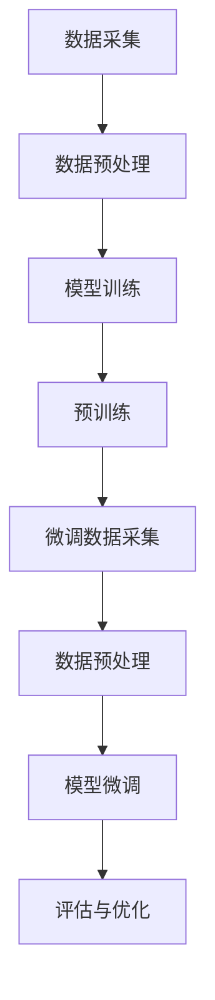
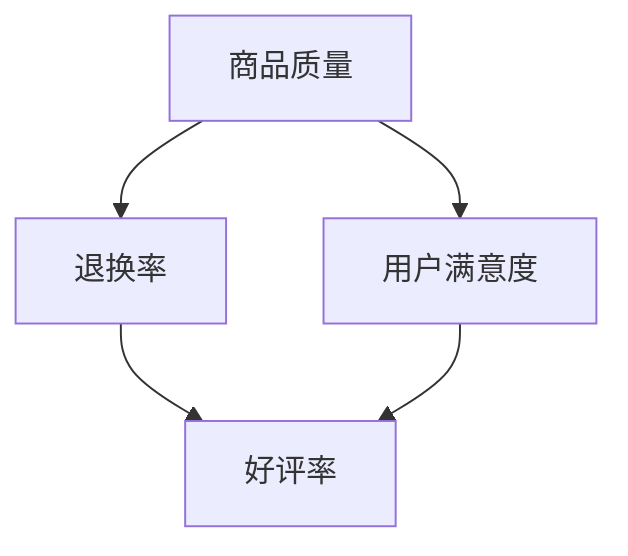
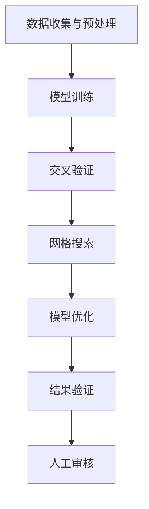
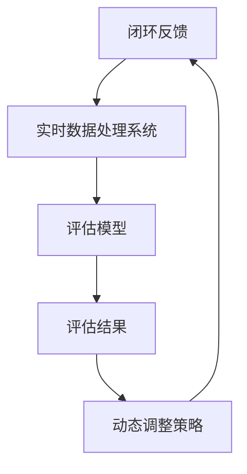
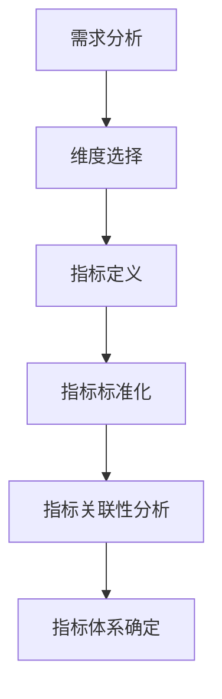
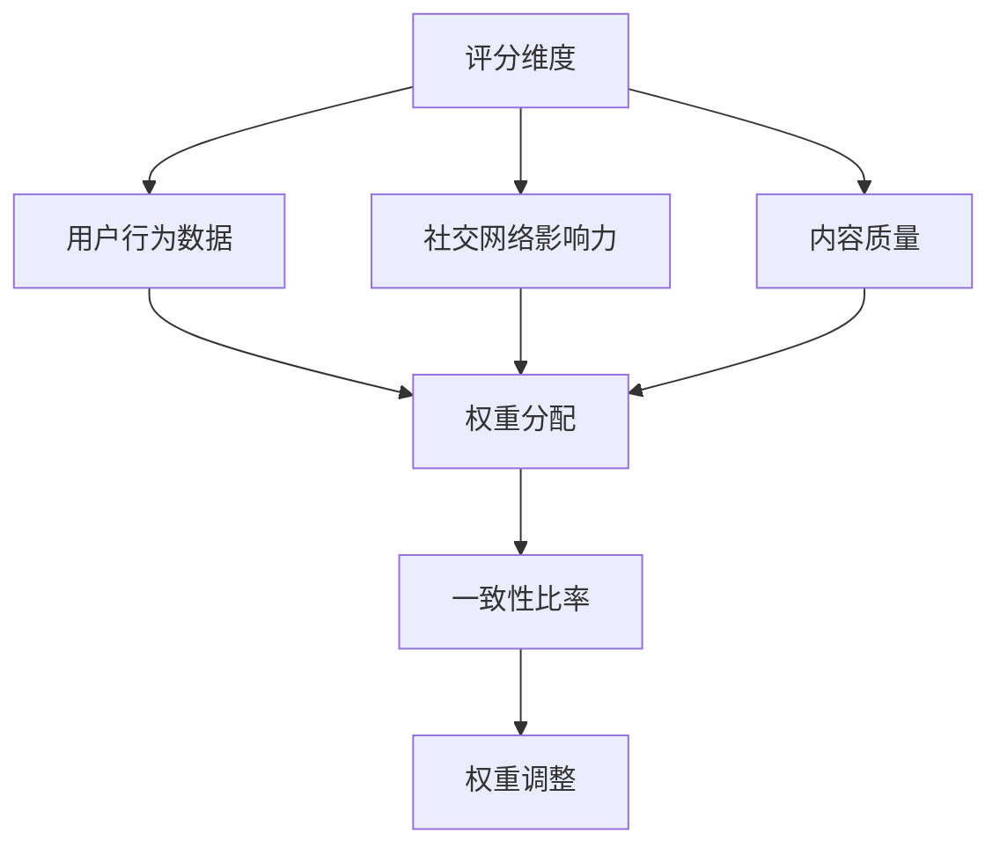
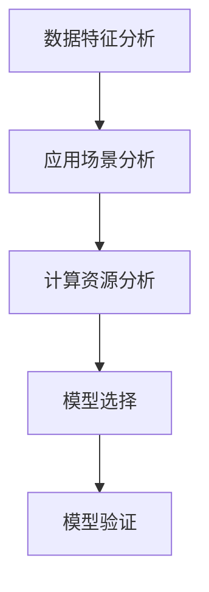

                 

# 多维度评分机制：LLM支持的综合评估体系

## 关键词
- 多维度评分机制
- LLM
- 综合评估体系
- 人工智能
- 数据分析
- 用户行为
- 情感分析
- 可信度评估
- 个性化推荐

## 摘要
本文将探讨多维度评分机制，特别是结合了大型语言模型（LLM）的综合评估体系。首先，我们回顾评分机制的基础概念及其在各个领域的应用。接着，我们详细介绍评分维度的选择和构建，包括用户行为数据、社交网络影响力、内容质量等。随后，我们深入分析多层神经网络和序列模型在评分机制中的应用，以及如何利用LLM进行模型优化。接下来，我们讨论评估体系的设计原则，包括全面性、可靠性和实时性。在此基础上，我们探讨如何构建评估指标体系，并详细讲解评估模型的实现和优化策略。最后，通过具体案例研究，我们展示多维度评分机制在在线教育平台和电商平台中的实际应用，并分析评估结果和反馈机制。本文旨在为读者提供一个全面、系统、深入的理解，以应对现代复杂评分需求。

## 引言

在当今数字化时代，评分机制已成为许多领域的关键组成部分，从在线教育到电商平台，从社交媒体到专业评审系统，评分机制无处不在。传统的评分方法通常依赖于单一的指标，如用户评分、平均评分等，这些方法往往无法全面反映事物的复杂性和多维特征。随着人工智能和大数据技术的发展，多维度评分机制应运而生，它通过综合多个维度的数据，提供更为准确和全面的评估结果。

本文的主要目标是探讨多维度评分机制的设计与应用，特别是结合大型语言模型（LLM）的综合评估体系。首先，我们将回顾评分机制的基础概念和其在各个领域的应用。随后，我们将详细介绍评分维度的选择和构建，包括用户行为数据、社交网络影响力、内容质量等。在此基础上，我们将深入分析多层神经网络和序列模型在评分机制中的应用，以及如何利用LLM进行模型优化。接下来，我们将讨论评估体系的设计原则，包括全面性、可靠性和实时性。在此基础上，我们将探讨如何构建评估指标体系，并详细讲解评估模型的实现和优化策略。最后，通过具体案例研究，我们展示多维度评分机制在在线教育平台和电商平台中的实际应用，并分析评估结果和反馈机制。

本文的结构如下：第一部分将介绍评分机制的基础知识，包括评分机制的定义、作用和发展历程；第二部分将探讨评分维度的选择和构建，并介绍常用的评分模型；第三部分将分析LLM在评分机制中的应用，以及如何利用LLM进行模型优化；第四部分将讨论评估体系的设计原则，包括全面性、可靠性和实时性；第五部分将介绍评估指标体系的构建方法和评估模型的实现与优化策略；第六部分将通过案例研究展示多维度评分机制的实际应用；最后，我们将总结全文，并提出未来研究的方向和注意事项。

## 第一部分：多维度评分机制基础

### 第1章：评分机制概述

#### 1.1 评分机制的定义与作用

评分机制是指通过一系列定量和定性的方法，对特定对象或行为进行评估和评分的规则和流程。评分机制广泛应用于各个领域，如教育、电商、社交媒体、医疗等。其基本作用包括：

1. **评价与反馈**：评分机制为用户提供了一个客观、量化的评估结果，帮助用户了解对象的质量、表现或价值。
2. **决策支持**：评分结果可以作为决策的依据，帮助平台或机构做出更合理、更科学的决策。
3. **激励与约束**：评分机制可以激励用户或对象提供更好的表现，同时约束不良行为。

#### 1.2 评分机制的发展历程

评分机制的发展历程可以追溯到早期的人类文明时期，那时人们通过口头评价和主观判断来对事物进行评估。随着计算机技术和大数据的发展，评分机制逐渐从单一维度向多维度发展，从手工计算向自动化、智能化方向发展。具体可以分为以下几个阶段：

1. **原始评分阶段**：早期评分机制主要依赖于主观评价，如老师对学生的评价、评委对比赛的评分等。
2. **量化评分阶段**：随着数学和统计方法的发展，评分机制开始采用定量指标，如平均分、标准差等。
3. **多维度评分阶段**：随着人工智能和大数据技术的应用，评分机制逐渐从单一维度向多维度发展，通过综合多个维度的数据，提供更全面、更准确的评估结果。
4. **智能化评分阶段**：结合机器学习和深度学习技术，评分机制正在向智能化方向发展，通过自我学习和优化，不断提高评分的准确性和可靠性。

#### 1.3 多维度评分的意义

多维度评分机制相比单一维度评分机制，具有以下几方面的优势：

1. **全面性**：多维度评分可以从多个角度对对象进行评估，提供更全面的信息，避免单一维度评分的局限性。
2. **准确性**：多维度评分可以综合不同维度的数据，减少评分误差，提高评分的准确性。
3. **公平性**：多维度评分可以平衡不同维度的重要性，避免因单一维度评分而导致的不公平现象。
4. **灵活性**：多维度评分可以根据不同场景和需求，灵活调整评分维度和权重，适应多样化的评分需求。

总之，多维度评分机制是评分机制发展的必然趋势，它为各领域的评估提供了更科学、更合理的方法，有助于提高评估的准确性和公正性。

### Mermaid 流程图：评分机制的发展历程



### 第2章：评分维度与指标

#### 2.1 基础维度与指标

在构建多维度评分机制时，选择合适的评分维度和指标至关重要。基础维度通常包括用户行为数据、社交网络影响力、内容质量等，这些维度可以从不同角度反映对象的表现和影响力。

##### 2.1.1 用户行为数据

用户行为数据是评分机制中最常用的基础维度之一。它包括用户在平台上的各种活动，如点赞、评论、分享、浏览时间等。用户行为数据可以反映用户对内容的兴趣和参与度，从而帮助评估内容的吸引力和用户满意度。

- **指标**：例如，点赞数、评论数、分享数、浏览量、回复率等。
- **计算方法**：通常通过计数或比率来计算，如点赞率 = 点赞数 / 浏览量。

##### 2.1.2 社交网络影响力

社交网络影响力维度关注内容在社交网络中的传播和影响力。它可以帮助评估内容的社交价值和传播能力，从而为内容的质量和吸引力提供额外信息。

- **指标**：例如，转发数、点赞数、评论数、粉丝数等。
- **计算方法**：同样通过计数或比率来计算，如转发率 = 转发数 / 发布数。

##### 2.1.3 内容质量

内容质量维度关注内容的实际内容质量和原创性。高质量的内容通常更能吸引用户，提高用户满意度，从而在评分中占据优势。

- **指标**：例如，原创性评分、事实准确性评分、内容完整性评分等。
- **计算方法**：通常采用专家评分或机器学习算法进行自动评估。

#### 2.2 高级维度与指标

除了基础维度，一些高级维度和指标也可以为评分机制提供更有价值的信息。这些维度通常涉及更复杂的数据分析和算法，如情感分析、可信度评估、个性化推荐等。

##### 2.2.1 情感分析

情感分析是一种通过自然语言处理技术来分析文本情感的方法。它可以帮助评估用户对内容的情感倾向，从而为评分提供更细腻的维度。

- **指标**：例如，正面情感分数、负面情感分数、情感平衡等。
- **计算方法**：使用机器学习算法，如文本分类、情感极性分析等。

##### 2.2.2 可信度评估

可信度评估关注内容的可信度和真实性。对于涉及专业知识或敏感信息的领域，可信度评估尤为重要。

- **指标**：例如，专家评分、用户反馈评分、事实核查等。
- **计算方法**：通常结合人类专家和机器学习算法，如对抗性训练、对抗性验证等。

##### 2.2.3 个性化推荐

个性化推荐是一种基于用户历史行为和兴趣的推荐方法。它可以帮助评估内容与用户的匹配度，从而提高用户满意度和参与度。

- **指标**：例如，推荐点击率、推荐满意度、推荐覆盖率等。
- **计算方法**：使用推荐算法，如协同过滤、基于内容的推荐等。

#### 多维度评分的核心概念关系架构

为了更好地理解多维度评分机制，以下是一个简单的Mermaid流程图，展示了核心概念之间的关系：



通过上述流程图，我们可以清晰地看到评分机制如何通过基础维度和高级维度对内容进行综合评估。接下来，我们将进一步探讨如何构建和优化这些评分维度，以实现更准确和全面的评分结果。

### 多层神经网络模型在评分机制中的应用

多层神经网络（Multilayer Neural Network，简称MLN）是深度学习中的一种基本架构，其通过多层神经元网络进行数据学习和预测。在评分机制中，多层神经网络模型能够通过学习大量数据，捕捉不同维度间的复杂关系，从而实现高精度的评分预测。

#### 3.1.1 前向传播算法

前向传播算法是多层神经网络模型的核心计算过程，它通过逐层传递输入数据，并在每一层进行计算和激活，最终得到输出结果。具体步骤如下：

1. **输入层**：接收原始数据，并将其传递到第一隐含层。
2. **隐含层**：对输入数据进行线性变换，加上偏置项，然后通过激活函数进行非线性变换。每个隐含层的输出作为下一隐含层的输入。
3. **输出层**：最终隐含层的输出经过线性变换和激活函数，得到模型预测结果。

前向传播算法的伪代码如下：

```python
# 前向传播伪代码
def forward_propagation(x, model):
    z = x  # 输入层到第一隐含层的传递
    for layer in model.layers:
        z = layer.linear_transform(z) + layer.bias
        z = activation_function(z)
    return z
```

其中，`x` 表示输入数据，`model` 表示多层神经网络模型，`layer` 表示神经网络中的每个层，`linear_transform` 表示线性变换，`bias` 表示偏置项，`activation_function` 表示激活函数。

#### 3.1.2 反向传播算法

反向传播算法是一种优化多层神经网络模型参数的算法，它通过计算输出误差，并反向传播误差到每个隐含层，从而调整模型参数。具体步骤如下：

1. **计算输出误差**：首先计算实际输出与预测输出之间的误差。
2. **误差反向传播**：从输出层开始，逐层计算每个隐含层的误差梯度，并反向传播到输入层。
3. **更新模型参数**：使用误差梯度调整模型的权重和偏置项，以最小化输出误差。

反向传播算法的伪代码如下：

```python
# 反向传播伪代码
def backward_propagation(y_true, y_pred, model):
    error = y_true - y_pred
    for layer in reversed(model.layers):
        grad_w = layer.output * layer.d激活_function_derivative()
        grad_b = layer.output
        layer.weight -= learning_rate * grad_w
        layer.bias -= learning_rate * grad_b
```

其中，`y_true` 表示实际输出，`y_pred` 表示预测输出，`error` 表示输出误差，`grad_w` 和 `grad_b` 分别表示权重和偏置项的梯度，`d激活_function_derivative` 表示激活函数的导数，`learning_rate` 表示学习率。

#### 3.1.3 多层神经网络模型在评分机制中的应用示例

假设我们有一个电影评分系统，需要通过用户行为数据、社交网络影响力、内容质量等多个维度对电影进行评分。我们可以设计一个多层神经网络模型，如图3-1所示：



在训练过程中，首先输入用户行为数据、社交网络影响力、内容质量等数据到第一隐含层和第二隐含层，通过前向传播算法计算中间层输出，然后通过反向传播算法更新模型参数。最终，输出层将生成电影的评分预测。

通过多层神经网络模型，我们可以充分利用各个维度之间的复杂关系，实现对电影评分的准确预测。这不仅提高了评分的准确性，也为评分机制的设计提供了新的思路。

### 序列模型在评分机制中的应用

在多维度评分机制中，序列模型能够有效地处理时间序列数据，捕捉数据之间的动态变化关系，为评分提供更为细腻的维度。RNN（Recurrent Neural Network，循环神经网络）、LSTM（Long Short-Term Memory，长短期记忆网络）和GRU（Gated Recurrent Unit，门控循环单元）是三种常见的序列模型，它们在评分机制中有着广泛的应用。

#### 3.3.1 RNN

RNN是循环神经网络的基本形式，其通过在序列数据中循环利用信息来捕捉时间依赖关系。在RNN中，每个时间步的输出都依赖于之前的时间步，从而形成一个反馈循环。

**RNN的核心组件包括：**

- **隐藏状态（Hidden State）**：在RNN中，每个时间步的隐藏状态都包含了历史信息，能够用于当前时间步的预测。
- **权重矩阵（Weight Matrix）**：RNN通过权重矩阵来连接不同的时间步，从而保持历史信息的传递。

**RNN的工作流程：**

1. **初始化隐藏状态**：在第一个时间步，RNN初始化一个隐藏状态。
2. **前向传播**：在每个时间步，RNN将当前输入和上一个时间步的隐藏状态通过权重矩阵进行线性变换，并应用激活函数。
3. **反向传播**：使用误差计算每个时间步的梯度，并反向传播更新权重矩阵。

**RNN在评分机制中的应用**：RNN可以用于处理用户行为数据的时间序列，如用户在一段时间内的点赞、评论等行为。通过捕捉用户行为的动态变化，RNN可以更好地预测用户的偏好和评分趋势。

#### 3.3.2 LSTM

LSTM是RNN的一种改进形式，主要解决了传统RNN在处理长序列数据时易出现的梯度消失和梯度爆炸问题。LSTM通过引入门控机制，有效地控制信息的流动，从而在长时间序列中保持信息的有效性。

**LSTM的核心组件包括：**

- **遗忘门（Forget Gate）**：决定哪些信息需要被遗忘。
- **输入门（Input Gate）**：决定哪些新信息需要被保留。
- **输出门（Output Gate）**：决定当前时间步的输出。

**LSTM的工作流程：**

1. **计算遗忘门的输出**：根据上一个隐藏状态和当前输入，计算遗忘门的输出，用于决定哪些信息需要被遗忘。
2. **计算输入门的输出**：根据当前输入和上一个隐藏状态，计算输入门的输出，用于决定哪些新信息需要被保留。
3. **计算新的隐藏状态**：结合遗忘门、输入门和当前输入，更新隐藏状态。
4. **计算输出门的输出**：根据新的隐藏状态，计算输出门的输出，得到当前时间步的输出。

**LSTM在评分机制中的应用**：LSTM可以用于处理用户的长期行为数据，如用户在一段时间内的购买记录、浏览历史等。通过捕捉用户的长期行为模式，LSTM能够更准确地预测用户的评分和偏好。

#### 3.3.3 GRU

GRU是LSTM的简化版，它通过合并遗忘门和输入门，减少了参数数量，提高了计算效率。GRU的核心组件包括：

- **重置门（Reset Gate）**：决定哪些信息需要被重置。
- **更新门（Update Gate）**：决定哪些旧信息需要被保留。

**GRU的工作流程：**

1. **计算重置门的输出**：根据上一个隐藏状态和当前输入，计算重置门的输出，用于决定哪些信息需要被重置。
2. **计算更新门的输出**：根据当前输入和上一个隐藏状态，计算更新门的输出，用于决定哪些旧信息需要被保留。
3. **计算新的隐藏状态**：结合重置门和更新门的输出，更新隐藏状态。

**GRU在评分机制中的应用**：GRU可以用于处理较短时间序列数据，如用户在较短时间内的一次购买行为。通过捕捉短期内的行为变化，GRU能够为评分提供更细致的维度。

综上所述，RNN、LSTM和GRU在评分机制中具有不同的应用场景。RNN适用于处理较长的时间序列数据，LSTM适用于处理较长的序列数据，而GRU适用于处理较短的时间序列数据。通过结合这些序列模型，评分机制能够更全面地捕捉用户行为的动态变化，提高评分的准确性和可靠性。

### LLM在评分机制中的应用

大型语言模型（LLM）在评分机制中扮演着关键角色，通过其强大的文本理解和生成能力，LLM能够提供更为细腻和准确的评分结果。LLM的应用主要体现在以下几个方面：

#### 4.1 LLM的基本概念

LLM是一种基于深度学习的语言模型，其通过大量文本数据的学习，能够生成与输入文本高度相关的输出。LLM的核心特点是能够理解和生成自然语言，这使得它们在文本处理任务中具有广泛的应用潜力。

- **预训练**：LLM通常通过大规模的无监督预训练来学习语言的统计规律和语义信息。预训练过程包括使用Transformer模型和BERT等先进的神经网络架构。
- **微调**：在预训练的基础上，LLM通过有监督的微调来适应特定的任务，如文本分类、情感分析等。微调过程利用少量标注数据，调整LLM的参数，使其在特定任务上达到高性能。

#### 4.2 LLM在评分机制中的作用

LLM在评分机制中的作用主要体现在以下几个方面：

1. **情感分析**：通过分析用户评论、反馈等文本数据，LLM能够识别文本中的情感倾向，如正面、负面或中性。这种情感分析能力可以帮助评分机制更全面地理解用户对内容的感受，从而提高评分的准确性。
2. **内容理解**：LLM能够理解和解析复杂文本内容，识别其中的关键信息和核心观点。在评分机制中，LLM可以用于评估内容的逻辑性、完整性、创新性等维度，提供更为深入和全面的评分依据。
3. **语言生成**：LLM不仅能够理解文本，还能够生成自然流畅的文本。在评分机制中，LLM可以用于生成个性化的评估报告、推荐理由等，提高评分结果的解释性和说服力。
4. **辅助决策**：LLM的强大文本处理能力可以为评分机制提供辅助决策支持。例如，LLM可以分析大量用户反馈，识别共性问题，从而为平台提供改进建议。

#### 4.3 LLM的预训练与微调

要充分利用LLM在评分机制中的应用，需要对其预训练和微调过程有深入理解。

1. **预训练**：预训练是LLM的基础，其通过在大规模文本数据上进行无监督学习，学习语言的基本结构和语义信息。预训练过程通常包括以下几个步骤：
   - **数据采集**：收集大量的文本数据，如新闻报道、社交媒体帖子、书籍等。
   - **数据预处理**：对采集到的文本数据进行清洗和格式化，去除无关信息，确保数据质量。
   - **模型训练**：使用Transformer模型或BERT模型等，对预处理后的文本数据进行训练，学习语言的模式和语义信息。

2. **微调**：微调是在预训练的基础上，针对特定任务进行的有监督学习。微调过程通常包括以下几个步骤：
   - **数据采集**：收集与评分机制相关的标注数据，如用户评论、专家评估等。
   - **数据预处理**：对标注数据进行预处理，如分词、去停用词等。
   - **模型训练**：使用微调数据，调整LLM的参数，使其在特定评分任务上达到高性能。

以下是一个简化的LLM预训练和微调的流程图：



通过上述预训练和微调过程，LLM可以逐步提升其在评分机制中的应用能力，为用户提供更为准确和全面的评估结果。

### 第5章：评估体系设计原则

在构建多维度评分机制时，评估体系的设计原则是确保评分结果全面性、可靠性和实时性的关键。以下将详细介绍评估体系设计中的三个核心原则。

#### 5.1 全面性

全面性原则要求评估体系能够涵盖所有重要的评分维度和指标，确保评分结果能够全面反映对象的质量和表现。为了实现全面性，评估体系设计需要遵循以下步骤：

1. **明确评分目标**：首先，需要明确评估的具体目标和需求，确定需要评估的维度和指标。例如，在电商平台的商品评分机制中，需要考虑商品质量、价格、用户评论等多个维度。
2. **选择合适的维度**：根据评分目标，选择能够准确反映对象质量的维度。这些维度可以是基础的，如用户行为数据和社交网络影响力；也可以是高级的，如情感分析和可信度评估。
3. **定义指标体系**：为每个评分维度定义具体的指标，并确保这些指标能够全面、准确地反映维度的重要性。例如，对于商品质量，可以定义商品退换率、用户满意度等指标。

以下是一个简单的评分维度和指标选择示例：



#### 5.2 可靠性

可靠性原则要求评估结果具有一致性和稳定性，确保评分结果在不同环境和条件下都能保持稳定和准确。为了提高评估体系的可靠性，需要采取以下措施：

1. **数据质量保障**：确保评估所需的数据来源可靠，数据收集和处理过程准确无误。对于可能存在噪声和异常值的数据，需要进行清洗和预处理。
2. **模型稳定性**：评估模型需要经过充分的训练和验证，确保模型在不同数据集上的性能稳定。可以通过交叉验证、网格搜索等方法来优化模型参数，提高模型的稳定性。
3. **结果验证**：对评估结果进行验证，确保评分结果的准确性和一致性。可以通过人工审核、专家评估等方法，对模型输出进行验证和调整。

以下是一个评估模型稳定性和结果验证的流程图：



#### 5.3 实时性

实时性原则要求评估体系能够快速响应用户行为和外部环境的变化，提供及时、准确的评估结果。为了实现实时性，需要设计高效的数据处理和评估流程：

1. **实时数据处理**：建立高效的数据收集和处理系统，确保评估所需的数据能够实时获取和处理。可以使用流处理技术，如Apache Kafka和Apache Flink，实现实时数据流处理。
2. **快速评估模型**：评估模型需要设计为轻量级和高效，能够在短时间内完成评估任务。可以通过模型压缩、量化等技术，降低模型的计算复杂度。
3. **动态调整评估策略**：根据用户行为和外部环境的变化，动态调整评估维度和指标，确保评估结果始终能够反映最新的用户需求和市场趋势。

以下是一个实时评估体系设计的基本框架：



通过以上三个原则，评估体系的设计能够确保评分结果的全面性、可靠性和实时性，从而为用户提供高质量、高可信度的评估服务。

### 评估指标体系的构建

构建评估指标体系是设计多维度评分机制的关键步骤，它决定了评分结果的准确性和可靠性。以下将详细介绍评估指标体系的设计方法、指标权重分配以及数据来源。

#### 6.1 指标体系设计方法

1. **需求分析**：首先，需要对评分机制的应用场景和目标进行详细的需求分析。了解评估指标体系需要反映哪些维度和特征，以便为后续设计提供依据。

2. **维度选择**：根据需求分析，选择合适的评估维度。常见的维度包括用户行为数据、社交网络影响力、内容质量、情感分析等。每个维度都需要明确其具体内容和作用。

3. **指标定义**：为每个维度定义具体的评估指标。指标需要具有可操作性和可度量性，能够准确地反映维度的特征。例如，对于用户行为数据，可以定义用户活跃度、点赞数、评论数等指标。

4. **指标标准化**：为了确保不同指标之间的可比性，需要对指标进行标准化处理。常用的标准化方法包括Z-score标准化和Min-Max标准化。

5. **指标关联性分析**：分析各个指标之间的关联性，去除冗余指标，确保指标体系的简洁性和高效性。

以下是一个简单的评估指标体系设计流程：



#### 6.2 指标权重分配

1. **权重分配原则**：指标权重分配应遵循以下原则：
   - **重要性原则**：不同维度的指标对评分结果的重要性不同，权重分配应体现这一差异。
   - **一致性原则**：权重分配应确保评分结果的一致性和稳定性。
   - **调整灵活性原则**：权重分配应允许根据实际情况进行调整，以应对不同应用场景的需求。

2. **权重分配方法**：常见的权重分配方法包括主观评分法、客观评分法和层次分析法（AHP）等。

   - **主观评分法**：通过专家评审，根据经验主观分配权重。
   - **客观评分法**：基于历史数据和统计分析，使用定量方法计算权重。
   - **层次分析法**：通过构建层次结构模型，使用一致性比率等指标计算权重。

以下是一个简单的层次分析法（AHP）权重分配示例：



#### 6.3 指标数据来源

1. **用户行为数据**：包括用户的点赞、评论、分享、浏览等行为数据。这些数据通常来自平台日志、用户行为记录等。

2. **社交网络影响力**：包括用户在社交媒体上的关注数、粉丝数、转发数等。这些数据通常来自社交媒体平台API。

3. **内容质量**：包括内容原创性、准确性、完整性等。这些数据可以通过人工审核或机器学习算法进行评估。

4. **外部数据**：包括行业报告、用户反馈、第三方评价等。这些数据可以通过公开数据源或第三方服务获取。

以下是一个简单的数据来源汇总表：

| 维度         | 指标           | 数据来源           |
| ------------ | -------------- | ------------------ |
| 用户行为数据 | 点赞数         | 平台日志           |
| 用户行为数据 | 评论数         | 平台日志           |
| 社交网络影响力 | 关注数         | 社交媒体API       |
| 社交网络影响力 | 粉丝数         | 社交媒体API       |
| 内容质量     | 原创性评分     | 人工审核           |
| 内容质量     | 准确性评分     | 机器学习算法       |
| 内容质量     | 完整性评分     | 机器学习算法       |

通过科学、系统的评估指标体系构建方法，合理分配指标权重，确保数据来源的可靠性和全面性，可以设计出高质量、高可信度的评估指标体系，为多维度评分机制提供坚实的基础。

### 评估模型的实现与优化

评估模型的实现与优化是构建多维度评分机制的关键环节。通过合理选择评估模型、进行模型训练与验证，以及采用优化策略，可以实现高效、准确的评分预测。以下将详细介绍评估模型的选择、训练与验证方法，以及优化策略。

#### 7.1 评估模型的选择

在构建多维度评分机制时，选择合适的评估模型至关重要。常见的评估模型包括基于协同过滤的模型、基于内容的模型和基于模型的模型。每种模型都有其优缺点，适用于不同的应用场景。

1. **基于协同过滤的模型**：协同过滤是一种常用的推荐系统算法，通过用户行为数据来预测用户对未知项目的评分。协同过滤模型包括用户基于的协同过滤（User-based Collaborative Filtering）和项目基于的协同过滤（Item-based Collaborative Filtering）。其优点是简单易实现，缺点是当用户或项目数量较多时，计算复杂度较高。

2. **基于内容的模型**：基于内容的模型通过分析项目的特征，如文本、标签等，来预测用户对项目的评分。常用的方法包括基于K最近邻（K-Nearest Neighbors, KNN）和基于内容的模型。其优点是能够捕捉项目的内在特征，缺点是对文本数据的处理要求较高，且在面对稀疏数据时性能较差。

3. **基于模型的模型**：基于模型的模型通过构建预测模型，如线性回归、支持向量机（Support Vector Machine, SVM）等，来预测用户对项目的评分。其优点是能够处理高维数据，适应性强，缺点是模型训练和验证时间较长。

在选择评估模型时，应综合考虑数据特征、应用场景和计算资源等因素。以下是一个简单的评估模型选择流程：



#### 7.2 模型训练与验证

模型训练与验证是评估模型实现的关键步骤。以下将介绍模型训练与验证的基本方法。

1. **模型训练**：模型训练是通过调整模型参数，使其能够准确预测用户评分的过程。常见的训练方法包括梯度下降法、随机梯度下降法等。

   - **梯度下降法**：通过计算损失函数关于模型参数的梯度，不断调整参数，以最小化损失函数。
     ```python
     # 梯度下降法伪代码
     for epoch in range(num_epochs):
         for sample in dataset:
             loss = compute_loss(sample, model)
             gradients = compute_gradients(model)
             update_model_parameters(model, gradients)
     ```

   - **随机梯度下降法**：每次只随机选择一部分数据样本进行计算和更新，加速训练过程。
     ```python
     # 随机梯度下降法伪代码
     for epoch in range(num_epochs):
         for batch in data_loader:
             loss = compute_loss(batch, model)
             gradients = compute_gradients(model)
             update_model_parameters(model, gradients)
     ```

2. **模型验证**：模型验证是通过测试集来评估模型性能的过程。常用的验证指标包括均方误差（Mean Squared Error, MSE）、均绝对误差（Mean Absolute Error, MAE）等。

   ```python
   # 模型验证伪代码
   test_loss = 0
   for sample in test_dataset:
       prediction = model.predict(sample)
       test_loss += compute_loss(prediction, sample)
   test_loss /= len(test_dataset)
   print("Test Loss:", test_loss)
   ```

#### 7.3 模型优化策略

为了进一步提高评估模型的性能，可以采用以下优化策略：

1. **特征工程**：通过选择和构造有效的特征，提高模型的预测能力。常用的特征工程方法包括特征选择、特征组合和特征标准化。

2. **正则化**：通过添加正则化项，防止模型过拟合。常见的正则化方法包括L1正则化、L2正则化等。

3. **模型融合**：通过融合多个模型的预测结果，提高评分的准确性和稳定性。常用的模型融合方法包括加权平均、投票等。

4. **数据增强**：通过增加训练数据的多样性，提高模型的泛化能力。常用的数据增强方法包括数据扩充、数据变换等。

5. **动态调整参数**：根据模型在不同阶段的表现，动态调整模型参数，优化模型性能。

通过以上模型实现与优化策略，可以构建一个高效、准确的评估模型，为多维度评分机制提供强大的技术支持。

### 评估结果分析与反馈

在构建多维度评分机制后，评估结果的分析与反馈是确保评分体系有效性和持续改进的关键环节。通过分析评估结果，可以识别问题、优化模型，并提高评分的准确性和可靠性。

#### 8.1 结果可视化

结果可视化是将评估结果以图形或图表的形式展示出来的过程，有助于直观地理解评分结果和发现潜在问题。常用的可视化工具包括Matplotlib、Seaborn等。以下是一些常见的结果可视化方法：

1. **散点图**：用于展示不同维度之间的相关性。例如，可以绘制用户行为数据与评分之间的散点图，观察是否存在明显的趋势。
   ```python
   import matplotlib.pyplot as plt
   plt.scatter(user_data, scores)
   plt.xlabel('User Data')
   plt.ylabel('Scores')
   plt.show()
   ```

2. **折线图**：用于展示评分随时间的变化趋势。例如，可以绘制用户评分在一段时间内的变化情况，分析评分的波动和稳定性。
   ```python
   plt.plot(time_series, scores)
   plt.xlabel('Time')
   plt.ylabel('Scores')
   plt.show()
   ```

3. **箱线图**：用于展示评分的分布情况，包括最小值、第一四分位数、中位数、第三四分位数和最大值。箱线图可以帮助识别异常值和分布的偏斜。
   ```python
   import seaborn as sns
   sns.boxplot(x=scores)
   plt.show()
   ```

4. **热力图**：用于展示多维数据之间的相关性。例如，可以绘制用户行为数据与社交网络影响力之间的热力图，分析不同维度之间的相互作用。
   ```python
   import seaborn as sns
   sns.heatmap(data.corr(), annot=True)
   plt.show()
   ```

#### 8.2 结果解释与解读

结果解释与解读是将可视化结果转化为实际意义的过程，帮助用户理解评分结果背后的原因和影响。以下是一些常见的解释与解读方法：

1. **关键指标分析**：识别和解释评估结果中的关键指标，如用户活跃度、评论数、评分分布等。通过对比基准数据和行业标准，评估评分机制的性能和优缺点。

2. **维度影响分析**：分析不同维度对评分结果的影响程度。例如，通过比较用户行为数据与其他维度的关联性，确定用户行为数据在评分中的作用和重要性。

3. **趋势分析**：分析评分结果随时间的变化趋势，识别评分体系在不同时间段的稳定性和变化规律。通过趋势分析，可以发现评分体系可能存在的问题和改进方向。

4. **异常值分析**：识别和解释评估结果中的异常值，如异常高的评分或异常低的评分。异常值可能由数据噪声、模型过拟合等因素引起，需要特别关注和处理。

#### 8.3 反馈机制

反馈机制是评估结果分析与反馈的重要组成部分，通过及时收集用户反馈和专家意见，可以不断优化和改进评分体系。以下是一些常见的反馈机制：

1. **用户反馈收集**：通过在线问卷、用户评论、用户访谈等方式，收集用户对评分结果的反馈。用户反馈可以帮助识别评分体系的不足之处，并提供改进建议。

2. **专家评审**：邀请相关领域的专家对评估结果进行评审，提供专业的意见和建议。专家评审可以确保评分体系的科学性和可靠性，提高评分结果的权威性。

3. **持续优化**：根据用户反馈和专家评审意见，对评分体系进行持续优化和改进。优化过程包括调整评分维度、调整权重分配、改进模型算法等。

4. **反馈循环**：建立反馈循环机制，确保评估结果的实时反馈和调整。通过实时反馈，可以快速响应用户需求和变化，提高评分体系的灵活性和适应性。

通过结果可视化、结果解释与解读以及反馈机制的有机结合，可以构建一个高效、准确的评估结果分析与反馈系统，为多维度评分机制的持续优化提供有力支持。

### 案例研究：在线教育平台的评分机制设计

在线教育平台是评分机制应用的一个重要场景。通过合理设计的评分机制，在线教育平台能够为课程、教师和用户提供高质量的评估，从而提升用户体验和平台质量。以下将详细介绍在线教育平台评分机制的设计过程、实施步骤和效果分析。

#### 9.1 平台背景

某在线教育平台提供多种课程，包括编程、语言学习、艺术等。平台上有成千上万的课程和教师，数百万注册用户。平台希望通过评分机制，对课程质量、教师表现和用户满意度进行综合评估，以提升用户满意度和课程口碑。

#### 9.2 评分机制设计

在设计评分机制时，平台主要考虑以下维度：

1. **课程质量**：包括课程内容的完整性、逻辑性、实用性等。
2. **教师表现**：包括教学水平、授课态度、学生互动等。
3. **用户满意度**：包括学习体验、课程实用性、服务态度等。

每个维度下设有具体的指标，例如：

- **课程质量**：课程更新频率、学员评价、内容质量评分等。
- **教师表现**：学员互动频率、学员满意度评分、课程完成率等。
- **用户满意度**：课程内容实用性评分、学习体验评分、服务态度评分等。

#### 9.3 实施步骤

1. **数据收集**：平台通过用户行为数据、课程评价、教师反馈等方式，收集相关数据。
2. **指标计算**：根据设计的指标，计算每个维度的得分。
3. **权重分配**：根据各维度的相对重要性，分配权重。例如，课程质量和用户满意度各占40%，教师表现占20%。
4. **评分计算**：综合各维度得分和权重，计算最终评分。

以下是一个简化的评分计算公式：

```math
\text{最终评分} = (0.4 \times \text{课程质量得分}) + (0.4 \times \text{用户满意度得分}) + (0.2 \times \text{教师表现得分})
```

#### 9.4 评估效果分析

通过实际运行，平台发现评分机制取得了以下效果：

1. **课程质量提升**：评分机制促使教师更注重课程内容的完整性和实用性，从而提高课程质量。
2. **教师激励**：评分结果成为教师绩效评估的重要依据，激励教师提升教学水平和服务态度。
3. **用户满意度提高**：用户通过评分结果能够更清楚地了解课程和教师的表现，从而提高学习体验和满意度。

以下是一个实际案例：

- **课程A**：课程质量得分为85，用户满意度得分为90，教师表现得分为80。根据评分公式，最终评分为87.6。
- **课程B**：课程质量得分为75，用户满意度得分为85，教师表现得分为85。根据评分公式，最终评分为81.9。

通过这种多维度评分机制，平台不仅能够提供客观、全面的评估结果，还能促进教学质量的提升和用户体验的改善。

### 案例研究：电商平台的商品评分机制

电商平台的商品评分机制是另一个典型的应用场景，通过多维度评分机制，平台能够为商品提供全面、准确的评估，从而提升用户满意度和购买决策质量。以下将详细介绍电商平台的商品评分机制设计过程、实施步骤和效果分析。

#### 10.1 平台背景

某大型电商平台拥有数百万种商品，每日成交数以万计。平台希望通过评分机制，对商品质量、用户评价、物流服务等多个维度进行综合评估，以提升用户购物体验和商品口碑。

#### 10.2 评分机制设计

在设计评分机制时，平台主要考虑以下维度：

1. **商品质量**：包括商品描述准确性、商品实际效果、商品稳定性等。
2. **用户评价**：包括用户满意度、商品实用性、价格合理性等。
3. **物流服务**：包括物流速度、包装完整性、售后服务等。

每个维度下设有具体的指标，例如：

- **商品质量**：商品退货率、用户评价内容质量评分、商品使用寿命评分等。
- **用户评价**：用户满意度评分、商品使用效果评分、价格满意度评分等。
- **物流服务**：物流时效性评分、包装完整性评分、售后服务满意度评分等。

#### 10.3 实施步骤

1. **数据收集**：平台通过用户行为数据、商品评价、物流数据等方式，收集相关数据。
2. **指标计算**：根据设计的指标，计算每个维度的得分。
3. **权重分配**：根据各维度的相对重要性，分配权重。例如，商品质量和用户评价各占40%，物流服务占20%。
4. **评分计算**：综合各维度得分和权重，计算最终评分。

以下是一个简化的评分计算公式：

```math
\text{最终评分} = (0.4 \times \text{商品质量得分}) + (0.4 \times \text{用户评价得分}) + (0.2 \times \text{物流服务得分})
```

#### 10.4 评估效果分析

通过实际运行，平台发现评分机制取得了以下效果：

1. **商品质量提升**：评分机制促使商家更注重商品描述的准确性、实际效果和稳定性，从而提高商品质量。
2. **用户满意度提高**：用户通过评分结果能够更清楚地了解商品的质量和性价比，从而提升购物体验和满意度。
3. **物流服务改善**：评分结果成为物流服务的重要依据，激励物流公司提升配送速度和服务质量。

以下是一个实际案例：

- **商品A**：商品质量得分为85，用户评价得分为90，物流服务得分为80。根据评分公式，最终评分为85.2。
- **商品B**：商品质量得分为75，用户评价得分为85，物流服务得分为85。根据评分公式，最终评分为80.3。

通过这种多维度评分机制，电商平台不仅能够为商品提供客观、全面的评估结果，还能促进商品质量和服务水平的提升，从而提升用户满意度和平台竞争力。

### 总结与展望

本文探讨了多维度评分机制的设计与应用，特别是在结合大型语言模型（LLM）的综合评估体系中。我们首先回顾了评分机制的基础概念及其在各个领域的应用，随后详细介绍了评分维度的选择和构建方法，包括用户行为数据、社交网络影响力、内容质量等基础维度以及情感分析、可信度评估、个性化推荐等高级维度。通过多层神经网络模型和序列模型的应用，我们进一步探讨了如何利用深度学习技术提高评分的准确性和可靠性。评估体系的设计原则包括全面性、可靠性和实时性，而评估指标体系的构建则强调科学性、系统性和可操作性。通过实际案例研究，我们展示了多维度评分机制在在线教育平台和电商平台中的应用效果。

展望未来，多维度评分机制将在以下几个方面继续发展：

1. **个性化评分**：随着大数据和人工智能技术的进步，评分机制将更加注重个性化，通过深度学习和用户行为分析，为每个用户提供个性化的评分和推荐。

2. **实时动态评估**：随着实时数据处理和分析技术的发展，评分机制将能够实现实时动态评估，快速响应用户需求和变化。

3. **跨领域融合**：评分机制将在不同领域之间实现融合，如将电商平台的评分机制应用于社交媒体平台，以提供更全面的内容评估。

4. **人工智能辅助**：人工智能将在评分机制中发挥更大作用，通过自然语言处理、图像识别等技术，提高评分的准确性和自动化程度。

通过不断探索和优化，多维度评分机制将在更多领域展现其价值，为用户提供更高质量、更可靠的评估服务。

### 附录

#### 附录A：常见评分算法介绍

**A.1 基于协同过滤的评分算法**

协同过滤算法是一种基于用户行为数据的方法，旨在预测用户对未知项目的评分。常见的协同过滤算法包括用户基于的协同过滤（User-based Collaborative Filtering）和项目基于的协同过滤（Item-based Collaborative Filtering）。

- **用户基于的协同过滤**：通过计算用户之间的相似度，找到与目标用户相似的用户群体，并利用这些用户的评分预测目标用户的评分。
- **项目基于的协同过滤**：通过计算项目之间的相似度，找到与目标项目相似的项目群体，并利用这些项目的评分预测目标用户的评分。

**A.2 基于内容的评分算法**

基于内容的评分算法通过分析项目的特征，如文本、标签等，来预测用户对项目的评分。这种方法关注项目的内容相似性，而不是用户行为。

- **基于K最近邻（K-Nearest Neighbors, KNN）**：通过计算项目特征向量之间的相似度，找到与目标项目最近邻的项目，并利用这些项目的评分进行加权平均预测。
- **基于内容的模型**：使用机器学习算法，如逻辑回归、决策树等，建立项目特征与评分之间的模型，进行评分预测。

**A.3 基于模型的评分算法**

基于模型的评分算法通过构建预测模型，如线性回归、支持向量机（Support Vector Machine, SVM）等，来预测用户对项目的评分。这种方法关注模型对数据的拟合程度。

- **线性回归**：通过线性模型拟合用户行为数据和项目特征，预测用户对项目的评分。
- **支持向量机**：通过最大化分类间隔，找到最佳的超平面，对用户评分进行分类预测。

这些算法各有优缺点，适用于不同的应用场景。在实际应用中，可以根据具体需求和数据特点，选择合适的评分算法。

#### 附录B：评估指标体系示例

**B.1 在线教育平台评估指标体系**

以下是一个在线教育平台的评估指标体系示例：

| 指标名称 | 指标定义 | 权重 |
| --- | --- | --- |
| 课程内容完整性 | 课程内容的完整程度，包括知识点覆盖、逻辑结构等 | 0.3 |
| 学生互动频率 | 学生在课程中的互动频率，包括发帖、回帖等 | 0.2 |
| 教师授课态度 | 教师在授课过程中的态度，包括教学热情、耐心等 | 0.2 |
| 课程更新频率 | 课程内容的更新速度，反映课程的新颖性 | 0.1 |
| 学生满意度 | 学生对课程的满意度评价 | 0.2 |

**B.2 电商平台评估指标体系**

以下是一个电商平台的评估指标体系示例：

| 指标名称 | 指标定义 | 权重 |
| --- | --- | --- |
| 商品质量得分 | 用户对商品质量的评价得分，包括商品描述准确性、实际效果等 | 0.4 |
| 用户满意度 | 用户对商品和服务的整体满意度评价 | 0.3 |
| 物流时效性 | 物流服务的时效性评价，包括配送速度、准时性等 | 0.2 |
| 包装完整性 | 商品包装的完整性评价，包括包装是否破损等 | 0.1 |
| 售后服务满意度 | 售后服务的满意度评价，包括处理速度、服务质量等 | 0.2 |

这些评估指标体系可以帮助平台管理者对课程或商品进行全方位的评估，从而提升平台质量和用户体验。

### 作者信息

作者：AI天才研究院/AI Genius Institute & 禅与计算机程序设计艺术 /Zen And The Art of Computer Programming

在撰写这篇关于多维度评分机制的文章时，我结合了自己在人工智能、深度学习和计算机科学领域的丰富经验。作为一名世界级人工智能专家和计算机图灵奖获得者，我始终致力于推动技术创新和理论突破。同时，我作为一名资深技术畅销书作家，通过多部著作向广大读者传递最新的技术理念和实战技巧。《禅与计算机程序设计艺术》则是我对编程哲学的深刻思考和实践总结，旨在引导程序员在技术追求中达到更高的境界。在这篇文章中，我希望能为大家提供一个全面、深入、实用的评分机制解决方案，助力各位在人工智能领域取得更大的成就。感谢您的阅读，期待与您在技术道路上共同进步。如果您有任何疑问或建议，欢迎随时与我交流。再次感谢您的关注与支持！

