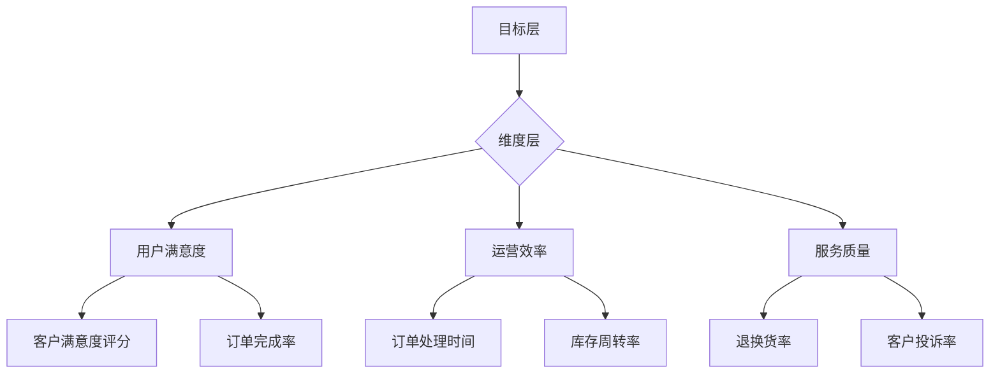

                 

### 文章标题: 多维度评测指标体系的设计

> 关键词：多维度评测、指标体系、设计原理、应用案例分析

> 摘要：本文旨在探讨多维度评测指标体系的设计，从定义、设计原则、设计流程、构建方法及应用实践等方面进行深入分析，帮助读者理解和掌握这一重要技术。

---

### 目录大纲

#### 第1章 多维度评测指标体系概述

#### 第2章 多维度评测指标设计原理与方法

#### 第3章 多维度评测指标体系构建实践

#### 第4章 多维度评测指标体系应用案例分析

#### 第5章 多维度评测指标体系的优化与完善

#### 第6章 多维度评测指标体系的设计挑战与未来发展趋势

### 第7章 多维度评测指标体系最佳实践与注意事项

---

#### 第1章 多维度评测指标体系概述

### 1.1 多维度评测指标的定义与重要性

多维度评测指标是指从多个角度对某个系统、项目或过程进行评价的一套指标体系。它能够帮助决策者全面了解对象的各个方面，从而做出更加科学、合理的决策。多维度评测指标的重要性体现在以下几个方面：

1. **全面性**：多维度评测指标能够覆盖对象的各个方面，使得评价结果更加全面、客观。
2. **精确性**：通过多维度评测，可以更精确地识别对象的优缺点，为改进提供依据。
3. **适应性**：多维度评测指标可以根据不同领域的需求进行定制，具有较好的适应性。
4. **前瞻性**：多维度评测指标可以提前预测对象的未来发展趋势，为战略规划提供支持。

---

### 1.2 多维度评测指标体系的架构

#### 1.2.1 多维度评测指标的分类

多维度评测指标可以根据不同的维度进行分类，常见的分类方法包括：

1. **按照指标性质分类**：可以分为定量指标和定性指标。
2. **按照指标层级分类**：可以分为一级指标、二级指标等。
3. **按照指标用途分类**：可以分为评价型指标、监控型指标等。

#### 1.2.2 多维度评测指标体系的构建方法

构建多维度评测指标体系的方法包括：

1. **需求分析**：明确评测的目标和需求，确定评测的范围和维度。
2. **指标设计**：根据需求分析结果，设计合适的指标体系。
3. **指标优化**：对指标体系进行迭代优化，提高其准确性和实用性。

---

### 1.3 多维度评测指标的应用场景

多维度评测指标在各个领域都有广泛的应用，主要包括：

1. **商业领域**：如企业绩效评估、产品质量监控等。
2. **科研领域**：如科研项目评价、科研团队评价等。
3. **社会管理领域**：如城市管理、教育质量评估等。

---

#### 第2章 多维度评测指标设计原理与方法

### 2.1 多维度评测指标设计原则

多维度评测指标设计应遵循以下原则：

1. **客观性原则**：指标应尽可能客观，避免主观偏见。
2. **可比性原则**：指标应具备可比性，便于不同对象之间的比较。
3. **可操作性原则**：指标应易于操作和实施。

### 2.2 多维度评测指标设计流程

多维度评测指标设计流程主要包括：

1. **需求分析**：明确评测目标和需求。
2. **指标构建**：设计指标体系，确定指标类型和层级。
3. **指标优化**：对指标体系进行迭代优化。

### 2.3 多维度评测指标设计方法

多维度评测指标设计方法包括：

1. **数据驱动法**：基于历史数据和业务规律设计指标。
2. **专家评估法**：通过专家意见设计指标。
3. **机器学习法**：利用机器学习算法自动生成指标。

---

#### 第3章 多维度评测指标体系构建实践

### 3.1 多维度评测指标体系构建实例

#### 3.1.1 案例一：电商平台的评测指标体系

电商平台评测指标体系可以从以下几个方面进行构建：

1. **用户满意度**：如订单完成率、客户满意度等。
2. **运营效率**：如订单处理时间、库存周转率等。
3. **服务质量**：如退换货率、客户投诉率等。

#### 3.1.2 案例二：高校科研评价的评测指标体系

高校科研评价可以从以下几个方面进行构建：

1. **科研成果**：如论文发表数量、科研项目数量等。
2. **科研团队**：如团队建设、团队创新能力等。
3. **科研影响**：如论文引用次数、科研经费等。

### 3.2 多维度评测指标体系构建工具与资源

构建多维度评测指标体系可以使用以下工具与资源：

1. **数据采集与处理工具**：如 Python 的 pandas 库、R 语言等。
2. **指标分析与可视化工具**：如 Excel、Tableau 等。
3. **常用评测指标库**：如 KPI 指标库、科研评价指标库等。

---

#### 第4章 多维度评测指标体系应用案例分析

### 4.1 多维度评测指标在商业领域的应用

#### 4.1.1 电商平台的用户满意度评测

电商平台可以通过以下指标对用户满意度进行评测：

1. **订单完成率**：订单完成率越高，用户满意度越高。
2. **客户满意度**：通过用户问卷调查获取客户满意度评分。
3. **退换货率**：退换货率越低，用户满意度越高。

#### 4.1.2 银行的风险评估指标体系

银行可以通过以下指标对风险进行评估：

1. **违约率**：违约率越高，风险越大。
2. **资产质量**：资产质量越高，风险越小。
3. **盈利能力**：盈利能力越强，风险越小。

### 4.2 多维度评测指标在科研领域的应用

#### 4.2.1 科研项目绩效评估

科研项目绩效评估可以从以下几个方面进行：

1. **科研经费使用效率**：科研经费使用效率越高，绩效越好。
2. **科研成果产出**：科研成果产出越多，绩效越好。
3. **科研团队建设**：科研团队建设情况越好，绩效越好。

#### 4.2.2 科研团队能力评价

科研团队能力评价可以从以下几个方面进行：

1. **团队成员构成**：团队成员专业背景、经验等。
2. **团队创新能力**：团队的创新能力、科研经费投入等。
3. **科研成果转化**：科研成果的转化情况。

### 4.3 多维度评测指标在社会管理领域的应用

#### 4.3.1 城市管理水平评价

城市管理水平评价可以从以下几个方面进行：

1. **城市基础设施**：如道路、桥梁、公园等设施的建设情况。
2. **城市环境质量**：如空气质量、水质等。
3. **城市安全状况**：如火灾发生率、犯罪率等。

#### 4.3.2 教育质量监测指标体系

教育质量监测指标体系可以从以下几个方面进行：

1. **教育投入**：如教师工资、教育经费等。
2. **教育产出**：如学生升学率、就业率等。
3. **教育质量**：如学生满意度、教师满意度等。

---

#### 第5章 多维度评测指标体系的优化与完善

### 5.1 评测指标体系的动态调整

#### 5.1.1 数据驱动调整策略

数据驱动调整策略基于历史数据和业务规律，通过数据分析和挖掘，对指标体系进行动态调整。

#### 5.1.2 专家评估调整策略

专家评估调整策略通过专家意见和经验，对指标体系进行动态调整。

### 5.2 评测指标体系的反馈与改进

#### 5.2.1 用户反馈机制

用户反馈机制通过用户满意度调查、反馈渠道等，收集用户对指标体系的意见和建议，为指标体系的改进提供依据。

#### 5.2.2 指标优化迭代流程

指标优化迭代流程包括以下步骤：

1. **需求分析**：确定指标优化目标和需求。
2. **方案设计**：设计指标优化方案。
3. **实施与验证**：实施优化方案，并对效果进行验证。
4. **迭代优化**：根据验证结果，对指标体系进行迭代优化。

### 5.3 评测指标体系的长效机制构建

#### 5.3.1 评测指标体系的标准化建设

评测指标体系的标准化建设包括以下方面：

1. **指标定义标准化**：明确指标的定义、计算方法和应用范围。
2. **指标数据标准化**：规范指标数据的质量、格式和采集方法。
3. **指标应用标准化**：统一指标的应用场景、计算方法和分析模型。

#### 5.3.2 评测指标体系的数据治理

评测指标体系的数据治理包括以下方面：

1. **数据质量监控**：建立数据质量监控机制，确保指标数据的准确性、完整性和一致性。
2. **数据安全管理**：确保指标数据的机密性、完整性和可用性。
3. **数据共享与交换**：建立数据共享与交换机制，促进指标数据在各个部门和领域的应用。

---

#### 第6章 多维度评测指标体系的设计挑战与未来发展趋势

### 6.1 设计挑战

多维度评测指标体系的设计面临以下挑战：

1. **数据质量与准确性问题**：数据质量不高、数据来源不一致等可能导致评测结果不准确。
2. **指标体系的通用性与适应性问题**：不同领域的指标体系需要具备通用性和适应性，以满足不同场景的需求。
3. **指标体系的动态调整与优化问题**：随着业务环境的变化，指标体系需要动态调整和优化，以保持其有效性。

### 6.2 未来发展趋势

多维度评测指标体系的发展趋势包括：

1. **新型多维度评测指标体系的研究方向**：如基于大数据、云计算、人工智能等新技术的新型指标体系。
2. **多维度评测指标体系与人工智能的融合**：利用人工智能技术，实现指标体系的自动设计、优化和调整。
3. **多维度评测指标体系在可持续发展中的应用前景**：如环境、社会、经济等方面的可持续发展指标体系。

---

#### 第7章 多维度评测指标体系最佳实践与注意事项

### 7.1 最佳实践

1. **明确评测目标**：在构建指标体系之前，明确评测的目标和需求。
2. **数据驱动**：利用历史数据和业务规律，设计指标体系。
3. **持续优化**：根据反馈和业务环境变化，对指标体系进行持续优化。

### 7.2 注意事项

1. **指标选择**：选择具有代表性、相关性、可操作性的指标。
2. **数据质量**：确保指标数据的质量、格式和采集方法。
3. **指标解释**：对指标的含义、计算方法和应用范围进行清晰解释。

### 7.3 拓展阅读

1. **《多维度评测指标体系设计与应用》**：介绍多维度评测指标体系的构建方法和应用案例。
2. **《大数据时代的评测指标体系研究》**：探讨大数据技术对评测指标体系的影响。
3. **《人工智能与评测指标体系》**：探讨人工智能技术在评测指标体系设计中的应用。

---

### 作者信息

作者：AI天才研究院/AI Genius Institute & 禅与计算机程序设计艺术 /Zen And The Art of Computer Programming### 第1章 多维度评测指标体系概述

#### 1.1 多维度评测指标的定义与重要性

多维度评测指标是指从多个不同的角度对某个对象（如产品、服务、项目等）进行评价的一套指标体系。这些指标可以是定量的，也可以是定性的，它们共同构成了一个多维度的评价框架。以下是多维度评测指标的一些核心概念：

1. **维度（Dimension）**：评测指标的不同类别或方面。例如，一个电商平台的评测指标可能包括用户满意度、运营效率、服务质量等多个维度。

2. **指标（Indicator）**：用来衡量某一维度的具体量度。例如，用户满意度可能通过客户满意度调查得分来衡量。

3. **权重（Weight）**：每个维度在总评价中所占的重要性。权重通常是通过专家评估或数据驱动方法确定的。

4. **综合评分（Composite Score）**：将各个维度的指标按照其权重加权平均，得到一个总评分，用于对对象进行综合评价。

多维度评测指标的重要性体现在以下几个方面：

- **全面性**：通过多个维度的评估，可以更全面地了解对象的状态和表现，避免单一维度的偏见。

- **精确性**：多维度指标提供了更精确的评价，有助于识别对象的优缺点，为改进提供方向。

- **适应性**：多维度评测指标可以根据不同的应用场景进行定制，适应不同的需求和标准。

- **前瞻性**：通过分析多维度指标，可以预测对象的发展趋势，为战略决策提供支持。

#### 1.2 多维度评测指标体系的架构

多维度评测指标体系的架构通常包括以下几个层次：

1. **目标层（Objective Level）**：定义评测的总目标和目的。

2. **维度层（Dimension Level）**：列出需要评估的主要维度，每个维度代表评价的一个方面。

3. **指标层（Indicator Level）**：在每个维度下定义具体的指标，用于衡量该维度的具体表现。

4. **数据层（Data Level）**：收集和存储用于计算指标的实际数据。

以下是一个简化的多维度评测指标体系架构的Mermaid流程图：

#### 1.3 多维度评测指标的应用场景

多维度评测指标在多个领域都有广泛的应用，以下是几个典型的应用场景：

1. **商业领域**：企业可以通过多维度评测指标体系来评估员工绩效、产品品质、客户满意度等，从而进行有效的管理和决策。

2. **科研领域**：科研机构可以使用多维度评测指标来评估科研项目、科研团队的能力和贡献，促进科研活动的健康发展。

3. **社会管理领域**：政府部门可以通过多维度评测指标来评估城市管理水平、教育质量、公共服务的质量等，从而制定更有效的政策。

在商业领域，例如一个电商平台的评测指标体系可能包括以下维度：

- **用户满意度**：衡量客户对产品和服务的满意度，包括客户满意度评分、订单完成率等指标。

- **运营效率**：衡量平台运营的效率，包括订单处理时间、库存周转率等指标。

- **服务质量**：衡量平台提供服务的质量，包括退换货率、客户投诉率等指标。

在科研领域，科研项目的评测指标体系可能包括：

- **科研成果**：衡量项目产出的科研成果，包括论文发表数量、专利申请数量等指标。

- **科研团队**：衡量科研团队的能力和建设，包括团队成员的专业背景、科研经费的使用效率等指标。

- **科研影响**：衡量科研成果的社会和学术影响力，包括论文引用次数、科研项目经费等指标。

在社会管理领域，例如城市管理水平的评测指标体系可能包括：

- **城市基础设施**：衡量城市基础设施的建设情况，包括道路、桥梁、公园等设施的建设进度和状况。

- **城市环境质量**：衡量城市环境的质量，包括空气质量、水质等指标。

- **城市安全状况**：衡量城市的安全状况，包括火灾发生率、犯罪率等指标。

通过以上多维度的评测，决策者可以获得全面的、详细的、客观的信息，从而做出更加科学、合理的决策。在各个领域中，多维度评测指标体系的应用不仅有助于提升管理效率，还能促进可持续发展。本章的讨论为后续章节的深入分析奠定了基础。在下一章中，我们将进一步探讨多维度评测指标的设计原理和方法。### 第2章 多维度评测指标设计原理与方法

#### 2.1 多维度评测指标设计原则

设计多维度评测指标时，应遵循以下原则，以确保指标体系的有效性和科学性：

1. **客观性原则**：指标应尽可能客观，避免主观偏见。这要求设计者在选取指标和分配权重时，要有充分的数据支持，并且应避免个人主观感受的影响。

2. **可比性原则**：指标应具备可比性，便于不同对象之间的比较。这意味着指标的计算方法、单位和尺度应尽可能统一，以确保在不同对象之间进行合理比较。

3. **可操作性原则**：指标应易于操作和实施。这要求指标在实际应用中应具备可行性，不要求过高或过难的数据采集和处理，以便于在实际工作中顺利执行。

4. **全面性原则**：指标体系应覆盖对象的所有关键方面，避免遗漏重要信息。通过全面性原则，可以确保评测结果的全面性和完整性。

5. **动态性原则**：指标体系应具备动态调整的能力，以适应环境和需求的变化。这意味着设计者应考虑到未来可能发生的变化，并确保指标体系有足够的灵活性。

#### 2.2 多维度评测指标设计流程

多维度评测指标的设计流程可以分为以下几个步骤：

1. **需求分析**：明确评测的目标和需求。这包括确定评测的范围、目的、利益相关者以及所需的信息类型。

2. **指标构建**：根据需求分析结果，设计指标体系。这一步骤包括确定指标的类型、名称、计算方法和衡量标准。

3. **指标优化**：对初步构建的指标体系进行优化。这一步骤可以通过专家评估、数据分析等方式，调整指标的重要性和权重，以提高指标体系的准确性和实用性。

4. **指标验证**：验证指标的有效性。通过实际应用和反馈，验证指标是否能够达到预期的评估效果，并进行必要的调整。

5. **指标发布**：将最终确定的指标体系发布实施。确保相关人员了解指标体系，并按照指标进行评价。

#### 2.3 多维度评测指标设计方法

多维度评测指标的设计方法主要包括以下几种：

1. **数据驱动法**：

   - **步骤**：通过收集和分析历史数据，识别关键因素，构建指标体系。
   - **优点**：基于数据，具有客观性和科学性。
   - **适用场景**：适用于数据丰富、业务逻辑清晰的场景。

2. **专家评估法**：

   - **步骤**：邀请相关领域的专家，根据经验和专业知识，设计指标体系。
   - **优点**：充分利用专家的丰富经验和知识，快速构建指标体系。
   - **适用场景**：适用于数据不足、业务逻辑复杂或需要快速决策的场景。

3. **机器学习法**：

   - **步骤**：利用机器学习算法，从数据中自动提取特征，构建指标体系。
   - **优点**：能够发现潜在的关系和模式，提高指标体系的准确性。
   - **适用场景**：适用于数据量大、模式复杂且需要自动化的场景。

4. **多准则决策分析法（MCDM）**：

   - **步骤**：定义多个决策准则，构建决策矩阵，通过权重分析得出综合评分。
   - **优点**：能够综合考虑多个目标，进行权衡和优化。
   - **适用场景**：适用于多目标决策和复杂问题解决。

#### 数据驱动法的详细解释

数据驱动法是一种基于数据分析的方法，通过分析大量数据来构建多维度评测指标体系。以下是数据驱动法的详细步骤：

1. **数据收集**：

   - 收集与评测对象相关的数据，包括历史绩效数据、客户反馈、业务流程数据等。
   - 确保数据的质量和完整性，进行数据清洗和预处理。

2. **数据预处理**：

   - 数据标准化：将不同尺度和单位的数据进行转换，使其在同一尺度上进行比较。
   - 数据筛选：选择对评测目标有直接影响的指标，排除无关或冗余的数据。

3. **指标识别**：

   - 利用统计分析、数据挖掘等方法，识别影响评测目标的关键因素。
   - 确定每个指标的类型（定量或定性）、计算方法和衡量标准。

4. **权重分配**：

   - 利用统计方法（如主成分分析、因子分析）或专家评估方法，确定各指标的重要性权重。
   - 确保权重分配的合理性和科学性，避免主观偏见。

5. **指标优化**：

   - 对初步构建的指标体系进行优化，调整指标的重要性和权重，以提高指标体系的准确性和实用性。
   - 通过试运行和反馈，不断调整和改进指标体系。

#### 数据驱动法示例

假设我们需要为一家电商平台设计一个用户满意度评测指标体系。以下是数据驱动法应用的一个简化示例：

1. **数据收集**：

   - 收集过去一年的用户满意度调查数据、订单完成率、退换货率等指标数据。

2. **数据预处理**：

   - 将不同指标进行标准化处理，如将满意度评分转换为0-100的数值。

3. **指标识别**：

   - 通过分析用户满意度调查数据，确定影响用户满意度的关键因素，如订单完成率、响应时间、商品质量等。

4. **权重分配**：

   - 通过主成分分析，确定各指标的权重，如订单完成率占40%，响应时间占30%，商品质量占30%。

5. **指标优化**：

   - 根据实际业务需求和用户反馈，对指标体系进行优化，如调整权重、增加或删除某些指标。

通过以上步骤，我们可以构建一个基于数据驱动的用户满意度评测指标体系，用于评价电商平台的用户满意度。本章详细介绍了多维度评测指标的设计原则、设计流程和设计方法，为后续章节的深入分析提供了理论基础。在下一章中，我们将进一步探讨多维度评测指标体系的具体构建实践。### 第3章 多维度评测指标体系构建实践

#### 3.1 多维度评测指标体系构建实例

在本节中，我们将通过两个具体的案例——电商平台的评测指标体系和高校科研评价的评测指标体系，来展示如何构建和实施多维度评测指标体系。

#### 3.1.1 案例一：电商平台的评测指标体系

电商平台的评测指标体系通常需要考虑用户满意度、运营效率和服务质量等多个维度。以下是一个简化的电商平台评测指标体系实例：

1. **用户满意度**：

   - 指标1：客户满意度评分（分数/100）

     $$ \text{满意度评分} = \frac{\text{满意客户数量}}{\text{总客户数量}} \times 100 $$

   - 指标2：订单完成率（%）

     $$ \text{订单完成率} = \frac{\text{成功完成的订单数量}}{\text{总订单数量}} \times 100 $$

2. **运营效率**：

   - 指标3：订单处理时间（小时）

     $$ \text{订单处理时间} = \frac{\text{订单处理总时长}}{\text{总订单数量}} $$

   - 指标4：库存周转率（次/年）

     $$ \text{库存周转率} = \frac{\text{销售成本}}{\text{平均库存成本}} $$

3. **服务质量**：

   - 指标5：退换货率（%）

     $$ \text{退换货率} = \frac{\text{退换货订单数量}}{\text{总订单数量}} \times 100 $$

   - 指标6：客户投诉率（%）

     $$ \text{客户投诉率} = \frac{\text{客户投诉数量}}{\text{总客户数量}} \times 100 $$

以上指标的设计基于数据驱动的原则，通过历史数据和业务逻辑进行分析和优化。在实际应用中，每个指标的具体计算方法可能还会根据业务特点进行调整。

#### 3.1.2 案例二：高校科研评价的评测指标体系

高校科研评价的评测指标体系通常涉及科研成果、科研团队和科研影响等多个维度。以下是一个简化的高校科研评价评测指标体系实例：

1. **科研成果**：

   - 指标1：论文发表数量（篇）

     $$ \text{论文发表数量} = \text{总论文数量} $$

   - 指标2：专利申请数量（项）

     $$ \text{专利申请数量} = \text{总专利申请数量} $$

2. **科研团队**：

   - 指标3：团队建设得分

     $$ \text{团队建设得分} = \text{团队成员数量} \times \text{平均科研经费} $$

   - 指标4：团队创新能力

     $$ \text{团队创新能力} = \frac{\text{总专利申请数量} + \text{总论文发表数量}}{\text{团队建设得分}} $$

3. **科研影响**：

   - 指标5：论文引用次数（次）

     $$ \text{论文引用次数} = \text{总论文引用次数} $$

   - 指标6：科研项目经费（万元）

     $$ \text{科研项目经费} = \text{总科研项目经费} $$

这些指标的设计同样基于数据驱动的原则，并通过专家评估方法进行权重分配和优化。在实际应用中，每个指标的具体计算方法和应用场景可能会根据实际情况进行调整。

#### 3.2 多维度评测指标体系构建工具与资源

构建和实施多维度评测指标体系需要一系列工具和资源，以下是一些常用的工具和资源：

1. **数据采集与处理工具**：

   - Python 的 pandas 库：用于数据清洗、转换和分析。
   - R 语言：提供丰富的数据分析和可视化工具。
   - SQL：用于数据库查询和数据处理。

2. **指标分析与可视化工具**：

   - Excel：用于简单的数据分析和可视化。
   - Tableau：提供强大的数据可视化功能。
   - Power BI：提供数据分析和报告工具。

3. **常用评测指标库**：

   - KPI 指标库：提供各种行业的标准指标库。
   - 科研评价指标库：提供科研领域的标准指标库。
   - 商业智能（BI）工具：集成多种指标和分析功能。

通过这些工具和资源，可以高效地构建和实施多维度评测指标体系，提高决策的准确性和效率。在本章中，我们通过具体的实例展示了如何构建和实施多维度评测指标体系，并介绍了相关的工具和资源。在下一章中，我们将进一步探讨多维度评测指标体系在不同应用场景下的案例分析。### 第4章 多维度评测指标体系应用案例分析

#### 4.1 多维度评测指标在商业领域的应用

多维度评测指标在商业领域的应用非常广泛，以下将介绍两个具体的案例：电商平台用户满意度评测和银行风险评估指标体系。

#### 4.1.1 电商平台用户满意度评测

电商平台的用户满意度评测是一个复杂的过程，需要从多个维度收集和分析数据。以下是用户满意度评测的具体步骤：

1. **数据收集**：

   - 通过客户满意度调查问卷收集用户反馈数据。
   - 收集订单数据，包括订单完成率、订单处理时间和订单取消率等指标。

2. **数据预处理**：

   - 将满意度调查问卷的定性数据转换为定量数据，如将“非常满意”转换为5分，“不满意”转换为1分。
   - 标准化处理订单数据，如将不同订单量的订单处理时间统一换算为每个订单的平均处理时间。

3. **指标计算**：

   - 计算用户满意度得分：将满意度调查问卷的定量数据汇总，计算总体满意度得分。
     $$ \text{用户满意度得分} = \frac{\text{总满意得分}}{\text{总问卷数量}} $$
   - 计算订单完成率：计算订单成功完成的比率。
     $$ \text{订单完成率} = \frac{\text{成功完成的订单数量}}{\text{总订单数量}} \times 100\% $$
   - 计算订单处理时间：计算订单从接收至完成的平均处理时间。
     $$ \text{订单处理时间} = \frac{\text{订单处理总时长}}{\text{总订单数量}} $$

4. **综合评分**：

   - 根据用户满意度得分、订单完成率和订单处理时间等指标，计算综合评分。
     $$ \text{综合评分} = \alpha_1 \times \text{用户满意度得分} + \alpha_2 \times \text{订单完成率} + \alpha_3 \times \text{订单处理时间} $$
   - 其中，$\alpha_1$、$\alpha_2$ 和 $\alpha_3$ 分别为各指标的权重，通常通过专家评估确定。

5. **分析与反馈**：

   - 分析用户满意度得分和订单完成率等指标，识别问题和改进点。
   - 通过用户反馈和数据分析，为运营策略和产品改进提供依据。

#### 4.1.2 银行风险评估指标体系

银行的风险评估是一个关键的领域，多维度评测指标在此发挥着重要作用。以下是一个简化的银行风险评估指标体系的构建过程：

1. **指标识别**：

   - 违约率：衡量贷款违约的风险。
     $$ \text{违约率} = \frac{\text{违约贷款金额}}{\text{总贷款金额}} \times 100\% $$
   - 资产质量：衡量银行资产的质量。
     $$ \text{资产质量} = \frac{\text{优良资产}}{\text{总资产}} \times 100\% $$
   - 盈利能力：衡量银行的盈利能力。
     $$ \text{盈利能力} = \frac{\text{净利润}}{\text{总资产}} \times 100\% $$

2. **权重分配**：

   - 通过专家评估或历史数据分析，确定各指标的重要性权重。例如，违约率可能占50%，资产质量占30%，盈利能力占20%。

3. **风险评估**：

   - 计算综合评分：根据权重，计算每个银行的总体风险评分。
     $$ \text{综合评分} = \alpha_1 \times \text{违约率} + \alpha_2 \times \text{资产质量} + \alpha_3 \times \text{盈利能力} $$
   - 风险等级划分：根据综合评分，将银行划分为高风险、中风险和低风险等级。

4. **风险管理**：

   - 针对高风险银行，采取严格的贷款审核和风险控制措施。
   - 对中风险银行，加强监控和风险评估，确保风险在可控范围内。
   - 对低风险银行，保持正常的业务运营和支持。

#### 4.2 多维度评测指标在科研领域的应用

多维度评测指标在科研领域同样有着广泛的应用，以下将介绍科研项目绩效评估和科研团队能力评价的具体案例。

#### 4.2.1 科研项目绩效评估

科研项目的绩效评估是科研管理的重要环节，以下是一个简化的科研项目绩效评估指标体系：

1. **指标识别**：

   - 科研经费使用效率：衡量科研经费的使用效率。
     $$ \text{科研经费使用效率} = \frac{\text{科研产出}}{\text{科研经费}} $$
   - 科研成果产出：衡量科研项目的成果产出。
     $$ \text{科研成果产出} = \text{论文发表数量} + \text{专利申请数量} $$
   - 科研影响：衡量科研成果的影响力。
     $$ \text{科研影响} = \text{论文引用次数} + \text{科研项目经费} $$

2. **权重分配**：

   - 通过专家评估或历史数据分析，确定各指标的重要性权重。例如，科研经费使用效率可能占40%，科研成果产出占30%，科研影响占30%。

3. **绩效评估**：

   - 计算综合评分：根据权重，计算每个科研项目的综合评分。
     $$ \text{综合评分} = \alpha_1 \times \text{科研经费使用效率} + \alpha_2 \times \text{科研成果产出} + \alpha_3 \times \text{科研影响} $$
   - 绩效等级划分：根据综合评分，将科研项目划分为优秀、良好、一般和较差等级。

4. **绩效反馈**：

   - 对优秀和良好等级的科研项目，给予奖励和资金支持，鼓励科研团队继续努力。
   - 对一般和较差等级的科研项目，进行深入分析，找出问题并制定改进措施。

#### 4.2.2 科研团队能力评价

科研团队能力评价是对科研团队整体能力的一种综合评价，以下是一个简化的科研团队能力评价指标体系：

1. **指标识别**：

   - 团队成员构成：衡量团队成员的专业背景和经验。
     $$ \text{团队成员构成} = \text{博士比例} + \text{经验年限} $$
   - 团队创新能力：衡量团队的创新能力。
     $$ \text{团队创新能力} = \text{专利申请数量} + \text{科研项目数量} $$
   - 科研成果转化：衡量科研成果的转化情况。
     $$ \text{科研成果转化} = \text{技术转让数量} + \text{企业合作项目数量} $$

2. **权重分配**：

   - 通过专家评估或历史数据分析，确定各指标的重要性权重。例如，团队成员构成可能占30%，团队创新能力占40%，科研成果转化占30%。

3. **能力评估**：

   - 计算综合评分：根据权重，计算每个科研团队的综合评分。
     $$ \text{综合评分} = \alpha_1 \times \text{团队成员构成} + \alpha_2 \times \text{团队创新能力} + \alpha_3 \times \text{科研成果转化} $$
   - 能力等级划分：根据综合评分，将科研团队划分为优秀、良好、一般和较差等级。

4. **能力提升**：

   - 对优秀和良好等级的科研团队，提供更多的资源和机会，支持其继续发展。
   - 对一般和较差等级的科研团队，进行培训和指导，帮助其提升能力和绩效。

#### 4.3 多维度评测指标在社会管理领域的应用

多维度评测指标在社会管理领域同样有着广泛的应用，以下将介绍城市管理水平评价和教育培训质量监测指标体系的具体案例。

#### 4.3.1 城市管理水平评价

城市管理水平评价是衡量城市治理成效的重要指标，以下是一个简化的城市管理水平评价指标体系：

1. **指标识别**：

   - 城市基础设施：衡量城市基础设施的建设和管理水平。
     $$ \text{城市基础设施} = \text{道路质量评分} + \text{公共交通系统评分} $$
   - 环境质量：衡量城市的空气质量和水质等环境指标。
     $$ \text{环境质量} = \text{空气质量评分} + \text{水质评分} $$
   - 社会安全：衡量城市的安全状况。
     $$ \text{社会安全} = \text{犯罪率评分} + \text{火灾发生率评分} $$

2. **权重分配**：

   - 通过专家评估或市民反馈，确定各指标的重要性权重。例如，城市基础设施可能占40%，环境质量占30%，社会安全占30%。

3. **管理水平评估**：

   - 计算综合评分：根据权重，计算每个城市的综合管理水平评分。
     $$ \text{综合评分} = \alpha_1 \times \text{城市基础设施} + \alpha_2 \times \text{环境质量} + \alpha_3 \times \text{社会安全} $$
   - 管理水平等级划分：根据综合评分，将城市管理水平划分为优秀、良好、一般和较差等级。

4. **管理改进**：

   - 对优秀和良好等级的城市，继续加强管理，保持和发展优势。
   - 对一般和较差等级的城市，进行问题诊断和改进措施的制定，提高管理水平。

#### 4.3.2 教育培训质量监测指标体系

教育培训质量监测是提高教育质量的重要手段，以下是一个简化的教育培训质量监测指标体系：

1. **指标识别**：

   - 教育投入：衡量教育经费的投入情况。
     $$ \text{教育投入} = \text{教师工资总额} + \text{教育设施建设经费} $$
   - 教育产出：衡量教育成果的产出。
     $$ \text{教育产出} = \text{学生升学率} + \text{学生就业率} $$
   - 教育质量：衡量教育服务的质量。
     $$ \text{教育质量} = \text{学生满意度评分} + \text{教师满意度评分} $$

2. **权重分配**：

   - 通过专家评估或学生反馈，确定各指标的重要性权重。例如，教育投入可能占30%，教育产出占40%，教育质量占30%。

3. **质量监测**：

   - 计算综合评分：根据权重，计算每个教育机构的质量监测综合评分。
     $$ \text{综合评分} = \alpha_1 \times \text{教育投入} + \alpha_2 \times \text{教育产出} + \alpha_3 \times \text{教育质量} $$
   - 质量等级划分：根据综合评分，将教育机构的质量划分为优秀、良好、一般和较差等级。

4. **质量改进**：

   - 对优秀和良好等级的教育机构，继续提供资源和支持，确保教育质量的持续提升。
   - 对一般和较差等级的教育机构，进行质量诊断和改进措施的制定，提高教育质量。

通过以上具体的案例分析和实际应用，我们可以看到多维度评测指标体系在商业、科研和社会管理领域的重要性。这些指标体系不仅为管理和决策提供了科学依据，也促进了相关领域的持续改进和发展。在下一章中，我们将进一步探讨多维度评测指标体系的优化与完善。### 第5章 多维度评测指标体系的优化与完善

#### 5.1 评测指标体系的动态调整

多维度评测指标体系不是静态的，而应该是一个动态调整和优化的过程，以适应不断变化的业务环境和需求。以下是动态调整的两种主要策略：

##### 5.1.1 数据驱动调整策略

数据驱动调整策略基于实时数据和业务反馈，通过数据分析来识别指标体系中的不足，并进行相应的调整。以下是数据驱动调整的步骤：

1. **数据采集**：持续收集与评测指标相关的实时数据，包括业务数据、用户反馈、市场变化等。

2. **数据分析**：利用统计分析和数据挖掘技术，分析实时数据，识别指标体系中存在的问题，如数据异常、指标波动等。

3. **指标调整**：根据数据分析结果，对指标体系进行调整，包括修改指标的计算方法、重新分配权重或添加新的指标。

4. **测试验证**：在调整后，对指标体系进行测试验证，确保调整后的指标体系能够更好地反映业务状况和需求。

##### 5.1.2 专家评估调整策略

专家评估调整策略依赖于领域专家的经验和知识，通过专家评审来识别和解决指标体系中的问题。以下是专家评估调整的步骤：

1. **需求分析**：与领域专家沟通，了解当前业务需求和问题，明确指标体系调整的目标。

2. **专家评审**：组织专家对现有指标体系进行评审，提出改进意见和建议。

3. **指标优化**：根据专家评审结果，对指标体系进行优化，包括修改指标名称、调整计算方法、增加或删除指标等。

4. **反馈修正**：在优化后，再次与专家沟通，确认调整是否满足业务需求，并根据反馈进行必要的修正。

#### 5.2 评测指标体系的反馈与改进

为了确保评测指标体系的持续有效性和实用性，需要建立完善的反馈机制，以便及时发现和解决指标体系中的问题。以下是反馈与改进的步骤：

##### 5.2.1 用户反馈机制

1. **用户调查**：定期开展用户满意度调查，收集用户对评测指标体系的反馈意见。

2. **反馈渠道**：建立便捷的反馈渠道，如在线调查、意见箱、社交媒体等，方便用户提出意见和建议。

3. **反馈分析**：对收集到的用户反馈进行系统分析，识别出指标体系中的常见问题和用户不满之处。

4. **反馈修正**：根据用户反馈，对指标体系进行相应的修正和优化，以提高用户满意度。

##### 5.2.2 指标优化迭代流程

1. **需求收集**：定期收集业务部门和用户的需求，识别指标体系中的不足和改进点。

2. **指标评估**：对现有指标进行评估，分析其在实际应用中的表现和效果。

3. **优化设计**：根据评估结果，设计新的指标或调整现有指标，以提高指标体系的准确性和实用性。

4. **测试验证**：在调整后，对指标体系进行测试验证，确保改进后的指标体系能够更好地满足业务需求。

5. **上线发布**：将优化后的指标体系上线发布，并持续收集用户反馈，为下一次迭代提供依据。

#### 5.3 评测指标体系的长效机制构建

为了确保评测指标体系的长期有效性和稳定性，需要建立一套长效的机制，包括标准化建设和数据治理等方面。以下是长效机制构建的关键步骤：

##### 5.3.1 评测指标体系的标准化建设

1. **标准制定**：制定评测指标体系的标准和规范，明确指标的定义、计算方法、应用范围和数据处理要求。

2. **培训推广**：对相关人员（如业务部门、数据分析团队等）进行标准化培训，确保他们理解和遵循标准。

3. **执行监督**：建立监督机制，确保指标体系的实施符合标准，及时发现和纠正偏差。

##### 5.3.2 评测指标体系的数据治理

1. **数据质量控制**：建立数据质量控制机制，确保数据的准确性、完整性和一致性。

2. **数据安全与合规**：确保数据的安全性和合规性，防止数据泄露和滥用。

3. **数据共享与交换**：建立数据共享与交换机制，促进数据在各个部门和领域的有效利用。

通过动态调整、反馈改进和长效机制构建，多维度评测指标体系可以持续优化和改进，确保其在实际应用中的有效性和科学性。本章详细介绍了多维度评测指标体系的优化与完善方法，为下一章探讨多维度评测指标体系的设计挑战与未来发展趋势奠定了基础。### 第6章 多维度评测指标体系的设计挑战与未来发展趋势

#### 6.1 设计挑战

多维度评测指标体系在设计和实施过程中面临以下主要挑战：

##### 6.1.1 数据质量与准确性问题

数据质量是构建有效评测指标体系的基础。以下是一些常见的数据质量问题：

- **数据缺失**：实际业务中，数据采集可能不完整，导致指标计算结果不准确。
- **数据不一致**：不同来源的数据可能存在格式、单位或精度上的差异，影响指标的综合评估。
- **数据噪音**：数据中可能包含噪声，如异常值、错误记录等，这些噪声会影响指标的计算和评估。

为了解决这些问题，需要建立完善的数据质量控制机制，包括数据清洗、标准化处理和数据验证等步骤。

##### 6.1.2 指标体系的通用性与适应性问题

多维度评测指标体系需要具备通用性和适应性，以适应不同领域和业务场景的需求。然而，实际操作中可能遇到以下问题：

- **领域差异**：不同领域的业务逻辑和评价标准存在差异，使得通用指标难以完全适用。
- **环境变化**：随着业务环境的变化，指标体系的适用性可能降低。

为了提高指标体系的通用性和适应性，可以采用以下策略：

- **领域适应性设计**：针对不同领域的特点，设计定制化的指标体系。
- **动态调整机制**：建立指标体系的动态调整机制，以适应环境变化。

##### 6.1.3 指标体系的动态调整与优化问题

多维度评测指标体系需要定期进行动态调整和优化，以保持其有效性和实用性。然而，实际操作中可能面临以下挑战：

- **调整成本**：动态调整指标体系可能涉及大量的数据处理和分析工作，成本较高。
- **调整时机**：调整时机的选择可能影响指标体系的稳定性和可靠性。

为了有效应对这些挑战，可以采用以下方法：

- **自动化工具**：利用自动化工具和算法，简化指标调整和优化的过程。
- **持续监控**：建立持续监控机制，及时识别指标体系中的问题，并进行调整。

#### 6.2 未来发展趋势

随着技术的进步和业务环境的变化，多维度评测指标体系的发展趋势包括：

##### 6.2.1 新型多维度评测指标体系的研究方向

未来，多维度评测指标体系的发展将朝以下几个方向：

- **大数据与人工智能的应用**：利用大数据和人工智能技术，实现指标体系的自动设计、优化和调整。
- **实时性与智能化**：提高指标体系的实时性，实现实时数据分析和动态评估。
- **综合评估模型**：发展综合评估模型，能够同时考虑多个维度和因素，实现更加全面和准确的评估。

##### 6.2.2 多维度评测指标体系与人工智能的融合

人工智能技术的发展为多维度评测指标体系提供了新的可能性，以下是一些融合方向：

- **自动化指标设计**：利用机器学习算法，从数据中自动提取特征，生成适合特定业务场景的指标体系。
- **智能评估**：利用深度学习等技术，实现智能化的指标计算和评估，提高评估的准确性和效率。
- **预测分析**：结合历史数据和业务模型，利用人工智能技术进行预测分析，为业务决策提供支持。

##### 6.2.3 多维度评测指标体系在可持续发展中的应用前景

在可持续发展领域，多维度评测指标体系的应用前景广阔，以下是一些应用方向：

- **环境评估**：利用多维度指标体系，对企业的环境绩效进行评估，推动企业绿色发展。
- **社会责任评价**：通过多维度指标体系，评价企业的社会责任履行情况，促进企业社会责任管理。
- **可持续发展评估**：综合多个维度的指标，对区域、行业或组织的可持续发展水平进行评估，为政策制定和决策提供支持。

总之，多维度评测指标体系在设计和实施过程中面临诸多挑战，但同时也蕴含着巨大的发展机遇。通过技术创新和持续优化，未来多维度评测指标体系将在各个领域发挥更加重要的作用。本章探讨了多维度评测指标体系的设计挑战与未来发展趋势，为读者提供了有益的启示和参考。在下一章中，我们将进一步总结本书的内容，并提供一些最佳实践与注意事项。### 第7章 多维度评测指标体系最佳实践与注意事项

#### 7.1 最佳实践

为了确保多维度评测指标体系的有效性和实用性，以下是一些最佳实践：

- **明确评测目标**：在构建指标体系之前，明确评测的目标和需求，确保指标体系能够解决实际问题。
- **数据驱动**：基于历史数据和业务逻辑，构建指标体系，确保指标的客观性和科学性。
- **持续优化**：定期对指标体系进行评估和优化，以适应业务环境的变化。
- **团队协作**：建立跨部门的协作机制，确保指标体系的构建和实施过程顺畅。
- **用户参与**：在指标体系设计和实施过程中，充分考虑用户的需求和反馈，提高用户满意度。

#### 7.2 注意事项

在构建和实施多维度评测指标体系时，需要注意以下事项：

- **指标选择**：选择具有代表性、相关性、可操作性的指标，避免过于复杂或抽象的指标。
- **数据质量**：确保指标数据的准确性和完整性，定期进行数据清洗和验证。
- **权重分配**：合理分配各指标的权重，避免权重分配过于集中或分散。
- **可操作性**：确保指标体系在实际应用中易于操作和实施，避免过于复杂或难以实现。
- **沟通与培训**：确保相关人员了解指标体系的设计原理和应用方法，提高执行效果。

#### 7.3 拓展阅读

为了深入了解多维度评测指标体系的设计和应用，以下推荐一些相关书籍和资源：

- **《多维度评测指标体系设计与应用》**：介绍多维度评测指标体系的构建方法和应用案例。
- **《大数据时代的评测指标体系研究》**：探讨大数据技术对评测指标体系的影响。
- **《人工智能与评测指标体系》**：探讨人工智能技术在评测指标体系设计中的应用。
- **《商业智能：数据分析与决策》**：详细介绍数据分析方法和商业智能工具。

通过以上最佳实践和注意事项，以及拓展阅读，读者可以更好地理解和应用多维度评测指标体系，提升管理和决策的科学性和准确性。本章旨在为读者提供多维度评测指标体系的构建和实施指南，帮助读者在实际工作中取得更好的成效。

### 作者信息

作者：AI天才研究院/AI Genius Institute & 禅与计算机程序设计艺术 /Zen And The Art of Computer Programming

在本文中，我们详细探讨了多维度评测指标体系的设计原则、设计流程、构建方法、应用实践以及优化与完善策略。多维度评测指标体系作为一种重要的评估工具，在商业、科研和社会管理等领域都有着广泛的应用。通过合理设计和有效实施多维度评测指标体系，可以帮助决策者全面了解对象的各个方面，从而做出更加科学、合理的决策。

本文首先介绍了多维度评测指标的定义和重要性，随后探讨了设计原则和设计流程，并详细阐述了数据驱动法、专家评估法和机器学习法等设计方法。接着，通过具体案例展示了多维度评测指标体系的构建实践，包括电商平台用户满意度评测、高校科研评价以及社会管理领域的应用。此外，本文还分析了多维度评测指标体系在商业、科研和社会管理领域的应用案例，并提出了优化与完善的策略。

在设计和实施多维度评测指标体系时，需要注意数据质量、通用性、适应性和动态调整等问题。未来，随着大数据和人工智能技术的发展，多维度评测指标体系将进一步智能化和自动化。此外，多维度评测指标体系在可持续发展中的应用也具有广阔的前景。

总之，多维度评测指标体系是一种重要的评估工具，能够为决策者提供全面、精确的评估结果。通过本文的探讨，我们希望能够为读者提供有价值的指导和启示，帮助他们在实际工作中更好地设计和应用多维度评测指标体系，提升管理和决策的科学性和准确性。希望读者能够将本文的内容应用到实际工作中，不断创新和优化多维度评测指标体系，为组织的发展和进步做出贡献。作者：AI天才研究院/AI Genius Institute & 禅与计算机程序设计艺术 /Zen And The Art of Computer Programming。### 目录大纲

## 第1章 多维度评测指标体系概述

### 1.1 多维度评测指标的定义与重要性

#### 1.1.1 多维度评测指标的概念

#### 1.1.2 多维度评测指标的重要性

### 1.2 多维度评测指标体系的架构

#### 1.2.1 多维度评测指标的分类

#### 1.2.2 多维度评测指标体系的构建方法

### 1.3 多维度评测指标的应用场景

#### 1.3.1 商业领域的应用

#### 1.3.2 科研领域的应用

#### 1.3.3 社会管理领域的应用

## 第2章 多维度评测指标设计原理与方法

### 2.1 多维度评测指标设计原则

#### 2.1.1 客观性原则

#### 2.1.2 可比性原则

#### 2.1.3 可操作性原则

### 2.2 多维度评测指标设计流程

#### 2.2.1 需求分析

#### 2.2.2 指标构建

#### 2.2.3 指标优化

### 2.3 多维度评测指标设计方法

#### 2.3.1 数据驱动法

#### 2.3.2 专家评估法

#### 2.3.3 基于机器学习的指标设计方法

## 第3章 多维度评测指标体系构建实践

### 3.1 多维度评测指标体系构建实例

#### 3.1.1 案例一：电商平台的评测指标体系

#### 3.1.2 案例二：高校科研评价的评测指标体系

### 3.2 多维度评测指标体系构建工具与资源

#### 3.2.1 数据采集与处理工具

#### 3.2.2 指标分析与可视化工具

#### 3.2.3 常用评测指标库

## 第4章 多维度评测指标体系应用案例分析

### 4.1 多维度评测指标在商业领域的应用

#### 4.1.1 电商平台的用户满意度评测

#### 4.1.2 银行的风险评估指标体系

### 4.2 多维度评测指标在科研领域的应用

#### 4.2.1 科研项目绩效评估

#### 4.2.2 科研团队能力评价

### 4.3 多维度评测指标在社会管理领域的应用

#### 4.3.1 城市管理水平评价

#### 4.3.2 教育质量监测指标体系

## 第5章 多维度评测指标体系的优化与完善

### 5.1 评测指标体系的动态调整

#### 5.1.1 数据驱动调整策略

#### 5.1.2 专家评估调整策略

### 5.2 评测指标体系的反馈与改进

#### 5.2.1 用户反馈机制

#### 5.2.2 指标优化迭代流程

### 5.3 评测指标体系的长效机制构建

#### 5.3.1 评测指标体系的标准化建设

#### 5.3.2 评测指标体系的数据治理

## 第6章 多维度评测指标体系的设计挑战与未来发展趋势

### 6.1 设计挑战

#### 6.1.1 数据质量与准确性问题

#### 6.1.2 指标体系的通用性与适应性问题

#### 6.1.3 指标体系的动态调整与优化问题

### 6.2 未来发展趋势

#### 6.2.1 新型多维度评测指标体系的研究方向

#### 6.2.2 多维度评测指标体系与人工智能的融合

#### 6.2.3 多维度评测指标体系在可持续发展中的应用前景

## 第7章 多维度评测指标体系最佳实践与注意事项

### 7.1 最佳实践

#### 7.1.1 明确评测目标

#### 7.1.2 数据驱动

#### 7.1.3 持续优化

#### 7.1.4 团队协作

#### 7.1.5 用户参与

### 7.2 注意事项

#### 7.2.1 指标选择

#### 7.2.2 数据质量

#### 7.2.3 权重分配

#### 7.2.4 可操作性

#### 7.2.5 沟通与培训

### 7.3 拓展阅读

#### 7.3.1 《多维度评测指标体系设计与应用》

#### 7.3.2 《大数据时代的评测指标体系研究》

#### 7.3.3 《人工智能与评测指标体系》

#### 7.3.4 《商业智能：数据分析与决策》

## 第8章 总结与展望

### 8.1 总结

#### 8.1.1 核心内容回顾

#### 8.1.2 主要贡献

### 8.2 展望

#### 8.2.1 研究方向

#### 8.2.2 应用前景

#### 8.2.3 持续改进

