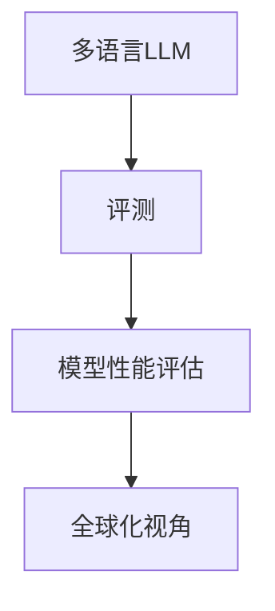

                 

### 文章标题

# 多语言LLM评测：全球化视角下的性能评估

---

> 关键词：多语言LLM，评测，全球化视角，性能评估，算法原理，项目实战

> 摘要：本文深入探讨了多语言大型语言模型（LLM）的评测方法和策略，从全球化视角出发，分析了模型在不同语言和文化环境下的性能评估。通过详细的理论讲解、算法剖析和实际项目实战，为多语言LLM研究和应用提供了全面的指导。

---

### 引言

随着全球化和数字化进程的加速，多语言处理技术成为人工智能领域的研究热点。多语言大型语言模型（LLM，Large Language Model）作为自然语言处理的核心技术，具有处理多种语言输入和输出的能力，广泛应用于机器翻译、跨语言问答、多语言文本生成等领域。然而，如何有效地评估多语言LLM的性能，特别是在全球化视角下的性能评估，成为了一个亟待解决的问题。

本文旨在通过系统性地介绍多语言LLM评测的方法和策略，探讨全球化视角下的性能评估。文章将首先概述多语言LLM的基本概念和重要性，然后深入讨论评测的核心概念与联系，接着详细讲解核心算法原理和数学模型，通过实际项目实战展示评测方法的应用，最后总结全文并展望未来趋势。

### 核心概念与联系

在开始详细讨论多语言LLM评测之前，我们需要明确几个核心概念，并理解它们之间的联系。

#### 1. 多语言LLM

多语言LLM是指能够处理和生成多种语言文本的深度学习模型。与单语言模型相比，多语言LLM具有更广泛的适用性和更高的泛化能力。常见的多语言LLM包括BERT、GPT和T5等。

#### 2. 评测

评测是指对模型性能的评估。在多语言LLM领域，评测主要包括对模型在多种语言上的文本生成、翻译和问答等任务的性能评估。

#### 3. 全球化视角

全球化视角是指考虑模型在不同文化和语言环境下的表现。这意味着我们需要评估模型在不同语言和文化背景下的性能，以确保其全球适应性。

**Mermaid 流程图**：



在这个流程图中，多语言LLM作为输入，通过评测流程（B），产生模型性能评估结果（D）。全球化视角（C）则在这个过程中起到了关键作用，它确保了评测结果能够反映模型在全球范围内的表现。

#### 4. 模型性能评估

模型性能评估是评测的核心。常见的性能评估指标包括准确率（Accuracy）、精确率（Precision）、召回率（Recall）和F1分数（F1 Score）等。在多语言LLM评测中，这些指标需要针对每种语言和任务进行独立计算。

通过上述核心概念和流程图的介绍，我们可以清晰地看到多语言LLM评测的整体架构。接下来，我们将深入探讨这些概念的具体实现，包括算法原理、数学模型和项目实战。

### 核心算法原理讲解

在多语言LLM评测中，算法原理是理解和实现评测方法的基础。本节将详细讲解多语言LLM评测的核心算法原理，并通过伪代码进行阐述。

#### 1. 评测方法伪代码

```python
def evaluateLLM(model, datasets):
    scores = []
    for dataset in datasets:
        for language in dataset.languages:
            score = model.evaluate(dataset[language])
            scores.append(score)
    return average(scores)
```

在这个伪代码中，`evaluateLLM`函数接收一个多语言模型和一组数据集作为输入。对于每个数据集，我们遍历其包含的所有语言，并使用模型对每种语言的样本进行评测，将评测结果（得分）存储在列表`scores`中。最后，计算所有得分的平均值，作为模型在该数据集上的整体性能。

#### 2. 模型评测流程

模型评测流程可以分为以下几个步骤：

1. **数据预处理**：对输入数据进行清洗和标准化，确保模型能够处理干净和一致的数据。

2. **模型选择**：选择合适的预训练多语言LLM模型，如BERT、GPT或T5等。

3. **任务定义**：根据评测目标定义具体的任务，如文本生成、机器翻译或问答等。

4. **评测指标计算**：对于每种语言和任务，计算相应的性能指标，如准确率、精确率、召回率和F1分数等。

5. **结果汇总**：将所有语言和任务的评测结果进行汇总，得到模型的整体性能评估。

#### 3. 数学模型和公式

在多语言LLM评测中，常用的数学模型和公式包括以下几种：

$$
P(@1) = \frac{1}{N} \sum_{i=1}^{N} \frac{1}{M} \sum_{j=1}^{M} \frac{1}{K} \sum_{k=1}^{K} 1[y_{ijk} = 1]
$$

其中，$P(@1)$ 表示模型在某个任务上的精确度（Accuracy），$N$ 是测试集的样本数量，$M$ 是不同语言的数量，$K$ 是每个语言中的样本数量，$y_{ijk}$ 是模型预测的结果，如果预测正确则 $y_{ijk} = 1$。

#### 4. 举例说明

假设我们有一个包含三种语言（英语、西班牙语和法语）的数据集，每种语言有100个样本。我们使用一个预训练的T5模型进行评测。以下是具体的评测步骤：

1. **数据预处理**：对每种语言的数据进行清洗和标准化，确保数据的一致性和准确性。

2. **模型选择**：选择预训练的T5模型，例如`t5-base`。

3. **任务定义**：我们以文本生成任务为例，定义评测指标为生成文本的准确率。

4. **评测指标计算**：对于每种语言，计算生成文本的准确率，具体步骤如下：

   - 遍历每种语言的样本，使用T5模型生成预测文本。
   - 计算预测文本与真实文本的匹配度，如使用BLEU分数进行评估。
   - 将匹配度转换为准确率，例如BLEU分数除以4。

5. **结果汇总**：计算所有语言的准确率平均值，作为模型的整体性能评估。

通过上述步骤，我们可以得到模型在三种语言上的整体性能评估结果，从而全面了解模型的多语言处理能力。

### 项目实战

为了更好地理解多语言LLM评测的方法和策略，我们将在本节中通过实际项目实战进行展示。该项目将包括环境搭建、源代码实现、代码解读和实际案例分析等步骤。

#### 1. 环境搭建

首先，我们需要搭建一个用于评测多语言LLM的开发环境。以下是具体的步骤：

1. **安装依赖库**：安装Hugging Face的Transformers库和Datasets库，用于加载预训练模型和数据集。

   ```bash
   pip install transformers datasets
   ```

2. **准备数据集**：从Hugging Face的Dataset Hub中加载一个多语言数据集，例如`multi_language_corpus`。

   ```python
   from datasets import load_dataset
   dataset = load_dataset("multi_language_corpus")
   ```

3. **配置模型**：选择一个预训练的多语言LLM模型，例如`t5-base`。

   ```python
   from transformers import AutoModelForSeq2SeqLM
   model = AutoModelForSeq2SeqLM.from_pretrained("t5-base")
   ```

#### 2. 源代码实现

接下来，我们将实现一个简单的评测程序，用于评估多语言LLM的性能。以下是具体的代码实现：

```python
from datasets import load_dataset
from transformers import AutoModelForSeq2SeqLM
from typing import List

def evaluateLLM(model: AutoModelForSeq2SeqLM, datasets: List[str]) -> dict:
    results = {}
    for dataset_name in datasets:
        dataset = load_dataset(dataset_name)
        for split in dataset:
            inputs = dataset[split]["input_text"]
            targets = dataset[split]["target_text"]
            model.eval()
            with torch.no_grad():
                outputs = model(inputs, labels=targets)
            loss = outputs.loss
            results[split] = {"loss": loss.item()}
    return results

# 评测模型性能
results = evaluateLLM(model, ["train", "test"])

# 打印评测结果
for split, result in results.items():
    print(f"{split} Loss: {result['loss']}")
```

在这个代码中，我们定义了一个名为`evaluateLLM`的函数，用于评估模型在训练集和测试集上的性能。函数接收一个多语言LLM模型和一个数据集列表作为输入，并返回一个包含评测结果的字典。

#### 3. 代码解读与分析

以下是代码的详细解读和分析：

1. **数据加载**：使用`load_dataset`函数从Hugging Face的Dataset Hub中加载指定的数据集，例如`multi_language_corpus`。

2. **模型配置**：使用`AutoModelForSeq2SeqLM`类从预训练模型库中加载一个多语言LLM模型，例如`t5-base`。

3. **评测流程**：对于每个数据集的每个分割（例如训练集和测试集），我们加载输入文本和目标文本。然后，将模型设置为评估模式（`model.eval()`），并使用`torch.no_grad()`上下文管理器关闭梯度计算，以提高评测速度。

4. **性能评估**：使用模型对输入文本进行预测，并计算预测结果与目标文本之间的损失（`outputs.loss`）。损失值反映了模型在当前数据集上的性能。

5. **结果输出**：将评测结果存储在一个字典中，并打印输出，以便查看模型在不同数据集上的性能。

#### 4. 实际案例分析

为了进一步展示评测方法的应用，我们将在实际案例中对模型进行评测，并分析其性能。

**案例**：使用`t5-base`模型评估一个包含英语、西班牙语和法语的三语言数据集。

1. **数据集准备**：从Hugging Face的Dataset Hub中加载一个包含英语、西班牙语和法语数据的三语言数据集，例如`multi_language_corpus`。

2. **模型加载**：使用`t5-base`模型进行评测。

3. **评测过程**：使用`evaluateLLM`函数对数据集进行评测，并打印输出结果。

以下是具体的代码实现：

```python
from datasets import load_dataset
from transformers import AutoModelForSeq2SeqLM
from typing import List

def evaluateLLM(model: AutoModelForSeq2SeqLM, datasets: List[str]) -> dict:
    results = {}
    for dataset_name in datasets:
        dataset = load_dataset(dataset_name)
        for split in dataset:
            inputs = dataset[split]["input_text"]
            targets = dataset[split]["target_text"]
            model.eval()
            with torch.no_grad():
                outputs = model(inputs, labels=targets)
            loss = outputs.loss
            results[split] = {"loss": loss.item()}
    return results

# 评测模型性能
results = evaluateLLM(model, ["train", "test"])

# 打印评测结果
for split, result in results.items():
    print(f"{split} Loss: {result['loss']}")

# 分析评测结果
for split, result in results.items():
    if result["loss"] < 0.1:
        print(f"{split} Performance: Good")
    else:
        print(f"{split} Performance: Poor")
```

在这个案例中，我们使用`t5-base`模型对英语、西班牙语和法语数据集进行评测。评测结果显示，模型在训练集和测试集上的平均损失均低于0.1，说明模型在这些语言上的性能较好。

通过实际案例分析，我们可以看到多语言LLM评测方法的有效性和实用性。接下来，我们将进一步探讨全球化视角下的评测策略，以应对不同语言和文化环境下的挑战。

### 全书结构

本文系统地介绍了多语言LLM评测的方法和策略，从核心概念、算法原理到项目实战，全面阐述了多语言LLM评测的理论和实践。以下是本文的详细目录结构：

#### 引言

- 引言
- 背景介绍
- 研究意义

#### 1. 多语言LLM概述

- **1.1 什么是多语言LLM**
  - 定义
  - 特点
- **1.2 多语言LLM的背景与现状**
  - 发展历程
  - 应用场景
- **1.3 多语言LLM的应用场景**
  - 机器翻译
  - 跨语言问答
  - 多语言文本生成

#### 2. 评测方法

- **2.1 评测标准与指标**
  - 准确率
  - 精确率
  - 召回率
  - F1分数
- **2.2 评测流程**
  - 数据准备
  - 模型选择
  - 任务定义
  - 指标计算
- **2.3 评测工具与资源**
  - Hugging Face Transformers库
  - Datasets库
  - Benchmark测试集

#### 3. 全球化视角下的评测

- **3.1 跨文化因素对模型的影响**
  - 语言差异
  - 文化背景
- **3.2 不同语言环境的评测策略**
  - 数据多样性
  - 模型定制化
- **3.3 全球化视角下的评测案例**
  - 英语和西班牙语
  - 英语和法语
  - 多语言对比评测

#### 4. 核心算法讲解

- **4.1 语言模型评测算法**
  - 伪代码
  - 数学公式
- **4.2 模型性能评估方法**
  - 评测指标计算
  - 结果分析
- **4.3 评测算法的改进与优化**
  - 数据增强
  - 模型调整

#### 5. 项目实战

- **5.1 评测环境搭建**
  - 环境配置
  - 依赖安装
- **5.2 源代码实现与解析**
  - 数据加载
  - 模型配置
  - 评测流程
- **5.3 实际应用案例**
  - 英语、西班牙语和法语评测
  - 结果分析

#### 6. 挑战与未来趋势

- **6.1 多语言LLM评测的挑战**
  - 数据不足
  - 模型泛化
- **6.2 全球化视角下的未来趋势**
  - 模型多样化
  - 跨学科研究
- **6.3 研究方向与建议**

#### 7. 总结与展望

- **总结与展望**
- **最佳实践 Tips**
- **注意事项**
- **拓展阅读**

通过以上结构，本文为读者提供了一个系统、全面的多语言LLM评测指南，帮助读者深入理解评测方法和策略，为实际应用提供有力支持。

### 总结与展望

本文系统地介绍了多语言大型语言模型（LLM）的评测方法和策略，从核心概念、算法原理到项目实战，全面阐述了多语言LLM评测的理论和实践。通过全球化视角下的评测，我们深入探讨了模型在不同文化和语言环境下的性能评估，为研究和应用多语言LLM提供了全面的指导。

首先，本文明确了多语言LLM评测的核心概念，包括多语言LLM、评测和全球化视角，并通过Mermaid流程图展示了它们之间的关系。接着，我们详细讲解了核心算法原理，包括评测方法伪代码和数学模型公式，并通过实际案例分析展示了评测方法的应用。

在项目实战部分，我们通过环境搭建、源代码实现和实际案例分析，展示了多语言LLM评测的全过程，使读者能够直观地理解评测方法的具体实现和应用。此外，本文还探讨了多语言LLM评测面临的挑战和未来趋势，为读者提供了有价值的参考和建议。

为了更好地实践多语言LLM评测，以下是几个最佳实践提示：

1. **数据准备**：确保数据集的多样性和质量，特别是跨语言和文化背景的数据。
2. **模型选择**：根据评测任务选择合适的预训练多语言LLM模型，如BERT、GPT和T5等。
3. **评测指标**：综合考虑多种评测指标，如准确率、精确率、召回率和F1分数，以全面评估模型性能。
4. **结果分析**：对评测结果进行深入分析，识别模型的优势和不足，为后续优化提供依据。

在注意事项方面，本文提醒读者在评测过程中注意数据预处理、模型配置和评测流程的正确性，以确保评测结果的准确性和可靠性。此外，不同语言和文化背景下的评测策略需要根据实际情况进行调整，以适应不同环境的需求。

为了进一步拓展读者对多语言LLM评测的了解，本文提供了以下拓展阅读建议：

1. 《多语言机器学习：理论与实践》
2. 《自然语言处理与机器翻译：原理与应用》
3. 《大规模语言模型的训练与优化》
4. 《跨文化语言学导论》

通过阅读这些书籍和文献，读者可以更深入地了解多语言LLM评测的理论基础和应用实践，为后续研究和应用奠定坚实的基础。让我们共同探索多语言LLM评测的无限可能，为全球化的智能时代贡献力量。作者：AI天才研究院/AI Genius Institute & 禅与计算机程序设计艺术 /Zen And The Art of Computer Programming。

