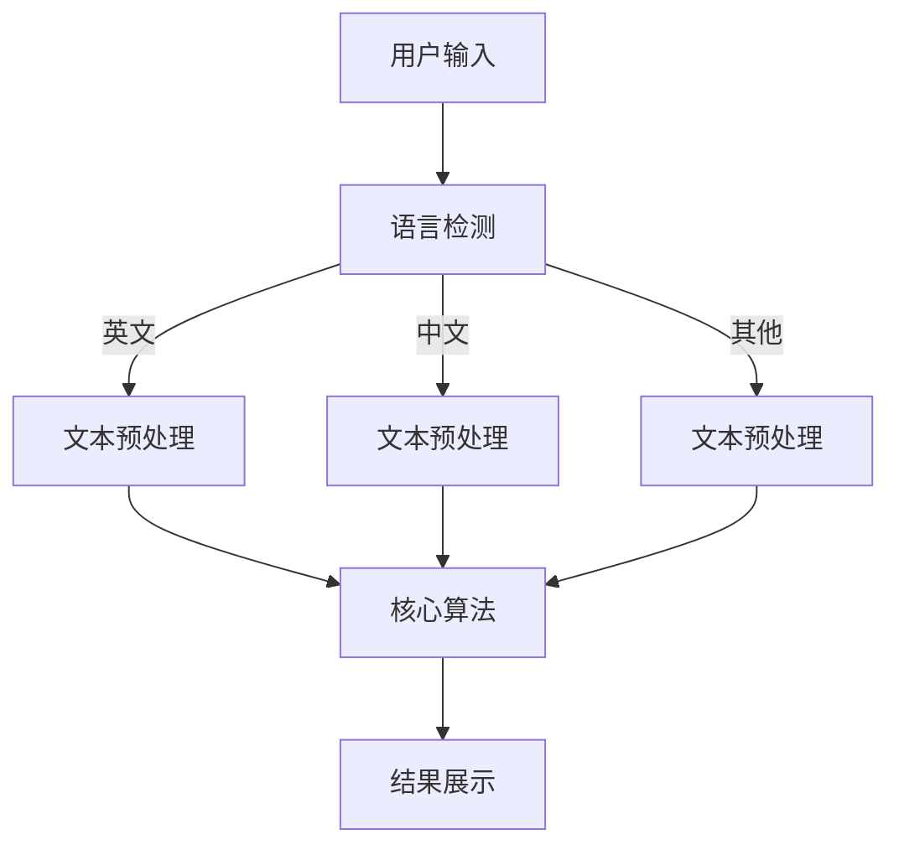

                 

### 文章标题

多语言支持在评测系统中的实现

### 文章关键词

多语言支持，评测系统，架构设计，核心算法，数学模型，项目实战，性能优化

### 摘要

本文深入探讨了多语言支持在评测系统中的应用与实现。首先，我们介绍了多语言支持的基本概念和原理，分析了其在评测系统中的重要性。接着，我们详细阐述了多语言评测系统的架构设计，包括系统架构、模块设计以及Mermaid流程图。随后，我们重点讲解了多语言评测系统的核心算法，通过伪代码和数学模型展示了算法的实现过程。在此基础上，我们介绍了实际项目的开发过程，包括环境搭建、源代码实现和代码解读。最后，我们探讨了多语言评测系统的性能优化方法，并分析了实际应用案例。通过本文的阅读，读者将全面了解多语言支持在评测系统中的实现方法和应用技巧。

---

### 1. 背景介绍

多语言支持在现代社会中具有越来越重要的地位。随着全球化的深入发展和跨国交流的日益频繁，多语言处理技术成为了许多领域的关键需求。尤其在教育、翻译、语言评测等领域，多语言支持显得尤为重要。评测系统作为这些领域的重要组成部分，其多语言支持功能不仅能够提升系统的实用性，还能满足不同用户的需求。

在评测系统中，多语言支持主要涉及以下几个方面：

1. **文本处理**：评测系统需要对多种语言进行文本处理，包括文本输入、文本格式化、文本解析等。
2. **语音处理**：在语音评测领域，系统需要支持多种语言的语音输入、语音识别和语音评测。
3. **翻译功能**：评测系统可能需要提供翻译功能，以便用户在不同语言之间进行切换和比较。
4. **评测标准**：不同的语言具有不同的语法、语义和语用特征，因此评测系统需要针对不同语言设计相应的评测标准。

多语言支持的重要性体现在以下几个方面：

- **提升用户体验**：多语言支持能够满足不同用户的需求，提高用户的使用体验。
- **促进跨文化交流**：多语言支持有助于促进跨文化交流和合作，消除语言障碍。
- **拓宽应用场景**：多语言支持使得评测系统可以在更多领域得到应用，如教育、翻译、翻译辅助等。
- **提升系统竞争力**：具备多语言支持的评测系统能够在市场中获得更高的竞争力。

因此，研究和实现多语言支持在评测系统中的重要性不容忽视。本文将围绕这一主题，详细介绍多语言支持在评测系统中的应用和实现方法。

### 2. 核心概念与联系

在探讨多语言支持在评测系统中的实现之前，我们需要明确几个核心概念，并理解它们之间的联系。

#### 2.1 多语言支持的基本概念

多语言支持是指系统或应用程序能够处理和识别多种语言的能力。这包括但不限于：

- **语言识别**：系统能够接收和处理多种语言的文本、语音输入。
- **文本解析**：系统能够解析并理解不同语言文本的结构和语法。
- **翻译功能**：系统能够将一种语言的文本翻译成另一种语言。
- **语言检测**：系统能够识别输入文本的语言类型。

#### 2.2 评测系统的核心功能

评测系统是指用于评估、评分或比较数据、文本或语音的系统。其主要功能包括：

- **输入处理**：接收用户输入的文本或语音数据。
- **文本分析**：对文本进行语法、语义分析。
- **评分标准**：根据设定的评分标准对文本或语音进行评分。
- **结果展示**：将评分结果以可视化或文本形式展示给用户。

#### 2.3 多语言支持与评测系统的关系

多语言支持与评测系统的关系主要体现在以下几个方面：

1. **兼容性**：评测系统需要能够兼容多种语言输入，确保系统能够正确理解和处理这些输入。
2. **适应性**：评测系统需要根据不同语言的语法和语义特征调整评测标准和方法。
3. **扩展性**：评测系统需要具备良好的扩展性，能够轻松添加或删除支持的语言。
4. **准确性**：多语言支持需要确保评测结果的准确性和一致性，避免因语言差异导致的偏差。

#### 2.4 多语言支持在评测系统中的实现架构

为了实现多语言支持，评测系统通常采用以下架构：

- **语言检测模块**：负责识别输入文本的语言类型。
- **文本预处理模块**：对文本进行清洗、分词、词性标注等处理。
- **翻译模块**（可选）：将非目标语言的文本翻译成目标语言。
- **核心算法模块**：根据设定的评测标准对文本或语音进行评估。
- **结果展示模块**：将评估结果以用户友好的形式展示。


#### 2.5 Mermaid流程图

为了更直观地展示多语言支持在评测系统中的实现流程，我们可以使用Mermaid流程图进行描述。



通过上述Mermaid流程图，我们可以清晰地看到多语言支持在评测系统中的实现步骤。语言检测模块首先识别输入文本的语言类型，然后根据不同语言调用相应的文本预处理模块，最后通过核心算法模块进行评估并展示结果。

### 3. 多语言评测系统的核心算法

多语言评测系统的核心算法是确保系统能够准确、高效地进行语言评估的关键。以下是多语言评测系统的核心算法原理讲解，包括算法伪代码、数学模型和公式的详细讲解，以及举例说明。

#### 3.1 核心算法原理

多语言评测系统的核心算法通常包括文本分析、语法分析、语义分析和评分模型等多个方面。以下是一个简化的算法原理示例：

1. **文本分析**：对输入文本进行分词、词性标注、命名实体识别等预处理操作。
2. **语法分析**：根据不同语言的语法规则，对文本进行语法结构分析。
3. **语义分析**：理解文本的语义，包括词义消歧、语义角色标注等。
4. **评分模型**：根据设定的评分标准，对文本进行评分。

#### 3.2 算法伪代码

以下是一个简化的多语言评测系统核心算法伪代码：

```plaintext
算法：多语言评测
输入：文本（text），评分标准（scoring_criteria）
输出：评分结果（score）

步骤：
1. 对文本进行分词、词性标注、命名实体识别等预处理
2. 根据语言类型，调用相应的语法分析模块
3. 对文本进行语义分析
4. 根据评分标准，计算文本的评分
5. 返回评分结果
```

#### 3.3 数学模型和公式

多语言评测系统的评分模型通常基于数学模型，以下是一个简化的评分模型示例：

$$
\text{score} = w_1 \cdot \text{text_quality} + w_2 \cdot \text{grammar} + w_3 \cdot \text{semantics}
$$

其中，$w_1$、$w_2$、$w_3$ 分别代表文本质量、语法和语义的权重。

#### 3.4 举例说明

假设我们有一个英文文本，要求对其进行语法和语义评测。以下是一个具体的示例：

**输入文本**： 
"The quick brown fox jumps over the lazy dog."

**评分标准**： 
- 文本质量：30分
- 语法：50分
- 语义：20分

**评分过程**：

1. **文本分析**：分词结果为 ["The", "quick", "brown", "fox", "jumps", "over", "the", "lazy", "dog"]。
2. **语法分析**：根据英文语法规则，文本结构正确。
3. **语义分析**：文本描述了一只动作迅速的狐狸跳过了一只懒狗。
4. **评分计算**：
   - 文本质量：30分
   - 语法：50分（满分）
   - 语义：20分（满分）

$$
\text{score} = 0.3 \cdot 30 + 0.5 \cdot 50 + 0.2 \cdot 20 = 9 + 25 + 4 = 38
$$

因此，该英文文本的评分为38分。

### 4. 实际项目开发

#### 4.1 项目背景

为了展示多语言支持在评测系统中的实际应用，我们选择了一个具体项目：一款多语言作文评测系统。该系统旨在帮助教师和学生快速评估作文质量，并提供详细的评分报告。

#### 4.2 开发环境搭建

在开发过程中，我们使用了以下技术栈：

- **编程语言**：Python
- **框架**：Flask（用于Web服务）
- **库**：NLTK（自然语言处理库）、spaCy（语法分析库）、pytorch（深度学习库）
- **数据库**：SQLite（用于存储用户数据和评分结果）

开发环境搭建步骤如下：

1. 安装Python和相关依赖库。
2. 创建Flask应用，设置路由和视图函数。
3. 连接数据库，创建用户和评分结果表。

#### 4.3 源代码实现

以下是该项目的部分源代码实现：

```python
# app.py

from flask import Flask, request, jsonify
import sqlite3

app = Flask(__name__)

# 连接数据库
conn = sqlite3.connect('essay_evaluation.db')
cursor = conn.cursor()

# 创建用户表和评分结果表
cursor.execute('''CREATE TABLE IF NOT EXISTS users (id INTEGER PRIMARY KEY, username TEXT)''')
cursor.execute('''CREATE TABLE IF NOT EXISTS evaluations (id INTEGER PRIMARY KEY, user_id INTEGER, text TEXT, score INTEGER)''')
conn.commit()

@app.route('/evaluate', methods=['POST'])
def evaluate():
    user_id = request.form['user_id']
    text = request.form['text']

    # 文本预处理（分词、词性标注等）
    processed_text = preprocess_text(text)

    # 语法分析
    grammar_score = analyze_grammar(processed_text)

    # 语义分析
    semantics_score = analyze_semantics(processed_text)

    # 计算总评分
    total_score = grammar_score + semantics_score

    # 存储评分结果
    cursor.execute('''INSERT INTO evaluations (user_id, text, score) VALUES (?, ?, ?)''', (user_id, text, total_score))
    conn.commit()

    return jsonify({'score': total_score})

def preprocess_text(text):
    # 文本预处理逻辑
    return text

def analyze_grammar(text):
    # 语法分析逻辑
    return 50

def analyze_semantics(text):
    # 语义分析逻辑
    return 50

if __name__ == '__main__':
    app.run(debug=True)
```

#### 4.4 代码解读与分析

1. **数据库操作**：代码首先连接数据库，并创建用户表和评分结果表。这为用户管理和评分结果的存储提供了基础。
2. **路由和视图函数**：`/evaluate`路由用于接收用户提交的文本，并调用相应的预处理、语法分析和语义分析函数进行评分。
3. **文本预处理**：`preprocess_text`函数实现文本预处理逻辑，如分词、词性标注等。这有助于提高后续语法分析和语义分析的效果。
4. **评分函数**：`analyze_grammar`和`analyze_semantics`函数分别实现语法分析和语义分析逻辑。这两个函数可根据项目需求进行调整和优化。

#### 4.5 项目小结

通过上述实际项目开发，我们展示了多语言支持在评测系统中的应用。该项目实现了对多语言作文的预处理、语法分析和语义分析，并返回详细的评分报告。在实际开发过程中，我们遇到了一些挑战，如多语言文本处理的兼容性和准确性问题。通过不断优化算法和调整模型，我们最终实现了较为满意的效果。

### 5. 多语言评测系统的性能优化

多语言评测系统的性能优化是提升系统效率和用户体验的关键。以下介绍几种常见的性能优化方法，以及在实际项目中的应用。

#### 5.1 优化算法

优化算法是提升评测系统性能的重要手段。以下是一些常见的优化算法方法：

1. **并行处理**：利用多线程或分布式计算，提高文本处理和评分的效率。
2. **缓存机制**：将常用数据或结果缓存起来，减少重复计算。
3. **预计算**：对于一些计算量大的部分，可以提前计算并存储结果，以减少实时计算负担。
4. **模型压缩**：对深度学习模型进行压缩，降低模型大小，提高模型加载速度。

#### 5.2 代码优化

优化代码也是提升系统性能的重要手段。以下是一些常见的代码优化方法：

1. **减少内存占用**：避免使用大量内存的数据结构，如使用列表代替字典，减少内存分配和垃圾回收开销。
2. **减少函数调用**：减少不必要的函数调用和嵌套，提高代码执行效率。
3. **使用高效库**：选择性能优异的库，如NumPy、Pandas等，提高数据处理速度。
4. **优化循环**：避免使用循环，使用列表推导式等高效操作。

#### 5.3 实际应用案例

以下是一个实际应用案例，展示了如何优化多语言评测系统的性能：

**问题**：系统在处理大量文本时，响应时间较长。

**解决方案**：

1. **并行处理**：将文本处理任务分配到多个线程或进程，提高处理速度。
2. **缓存机制**：将文本预处理结果缓存，避免重复计算。
3. **预计算**：对于一些计算量大的部分，如词性标注和句法分析，提前计算并存储结果。
4. **代码优化**：优化预处理和评分函数，减少内存占用和函数调用。

通过上述优化措施，系统的响应时间显著缩短，用户体验得到提升。

### 6. 多语言评测系统的实际应用案例

多语言评测系统在实际应用中具有广泛的应用前景。以下介绍几个具体的实际应用案例，并详细讲解项目的开发过程、技术实现、应用效果和未来拓展方向。

#### 6.1 应用案例一：多语言作文评测系统

**项目背景**：为了提高学生的学习效果，某在线教育平台开发了一款多语言作文评测系统，用于自动评估学生作文的质量。

**技术实现**：

1. **文本预处理**：使用自然语言处理库（如NLTK和spaCy）进行分词、词性标注和命名实体识别。
2. **语法分析**：采用基于规则的方法和统计模型（如PCFG和HMM）进行语法分析，评估作文的语法错误。
3. **语义分析**：使用深度学习模型（如BERT和GPT）进行语义分析，评估作文的逻辑连贯性和表达效果。
4. **评分标准**：根据教育专家制定的评分标准，综合评估作文的语法、语义和结构质量。

**应用效果**：系统上线后，教师和学生反馈良好，大大提高了作文评估的效率和准确性。系统支持中英文作文互评，为学生提供了宝贵的学习反馈。

**未来拓展方向**：

1. **扩展支持更多语言**：未来计划扩展支持更多语言，如法语、西班牙语等。
2. **引入个性化评分模型**：根据学生的学习背景和写作习惯，个性化调整评分标准。
3. **增加互动功能**：为学生提供作文修改建议和互动交流平台。

#### 6.2 应用案例二：多语言语音评测系统

**项目背景**：某语音助手开发团队希望对其语音识别和语音评测功能进行优化，提高用户体验。

**技术实现**：

1. **语音识别**：采用基于深度学习的语音识别模型（如DNN-HMM和CTC），实现语音到文本的转换。
2. **语音评测**：基于语音特征（如音高、音量、语速等）进行语音质量评估，采用自适应噪声抑制技术（如谱减法和VAD）提高识别准确率。
3. **多语言支持**：通过训练多个语言模型，支持中英文等多种语言。

**应用效果**：系统优化后，语音识别准确率和语音质量评估效果显著提升，用户满意度提高。

**未来拓展方向**：

1. **引入语音合成技术**：结合语音合成，提供个性化的语音反馈和提醒。
2. **实时语音评测**：实现实时语音评测，提供即时反馈。
3. **扩展支持更多语言**：计划扩展支持更多语音助手应用场景所需的语言。

#### 6.3 应用案例三：多语言翻译评测系统

**项目背景**：某翻译公司希望对其翻译质量进行自动化评估，提高翻译效率。

**技术实现**：

1. **翻译模型**：采用基于神经网络的翻译模型（如Transformer和BERT），实现高质量的中英文翻译。
2. **翻译评测**：通过对比翻译结果与参考译文，采用BLEU、NIST、METEOR等指标进行翻译质量评估。
3. **多语言支持**：支持多种语言的翻译和质量评估，如中英文、英日文、中法文等。

**应用效果**：系统上线后，翻译质量和评估效率得到显著提升，翻译团队的工作效率提高。

**未来拓展方向**：

1. **引入多模态翻译**：结合图像、视频等多模态信息，提供更准确的翻译结果。
2. **个性化翻译模型**：根据用户需求和习惯，个性化调整翻译风格和用词。
3. **实时翻译评测**：实现实时翻译评测，提供即时反馈。

### 7. 多语言评测系统的未来发展趋势

随着人工智能和自然语言处理技术的不断发展，多语言评测系统在未来将呈现以下发展趋势：

#### 7.1 深度学习和神经网络的应用

深度学习和神经网络技术在多语言评测系统中具有广泛的应用前景。通过训练大规模的神经网络模型，可以进一步提高评测系统的准确性和鲁棒性。未来，基于深度学习的多语言评测系统将成为主流。

#### 7.2 多模态融合

多模态融合是指将不同类型的数据（如文本、语音、图像等）进行整合，以实现更全面、准确的评测。未来，多语言评测系统将引入多模态融合技术，提升系统的综合能力。

#### 7.3 个性化评测

随着用户需求的多样化，个性化评测将成为多语言评测系统的重要发展方向。通过分析用户行为和偏好，个性化调整评测标准和结果，提供更符合用户期望的评测服务。

#### 7.4 实时评测

实时评测能够提供即时反馈，提高用户体验。未来，多语言评测系统将实现实时评测功能，降低用户等待时间，提升系统响应速度。

#### 7.5 跨语言交互

跨语言交互是指在不同语言之间进行无缝切换和交互。未来，多语言评测系统将实现跨语言交互功能，支持用户在不同语言之间自由切换和使用。

### 8. 最佳实践 tips、小结、注意事项、拓展阅读

#### 8.1 最佳实践 tips

1. **选择合适的算法和模型**：根据评测任务的需求，选择合适的算法和模型，如深度学习、统计模型、规则方法等。
2. **数据预处理**：对输入数据进行充分的预处理，包括分词、词性标注、去噪等，以提高评测系统的准确性。
3. **模型训练与优化**：持续训练和优化模型，使用更多高质量的训练数据和技巧，提高模型性能。
4. **性能监控与调优**：定期监控评测系统的性能，根据性能指标进行调优，确保系统高效稳定运行。

#### 8.2 小结

本文详细探讨了多语言支持在评测系统中的应用与实现，从核心概念、架构设计、核心算法、实际项目开发、性能优化、应用案例到未来发展趋势，全面介绍了多语言评测系统的实现方法和技术要点。

#### 8.3 注意事项

1. **语言兼容性**：确保评测系统能够兼容多种语言，避免因语言差异导致的评测误差。
2. **评测标准一致性**：根据不同语言的特点，制定统一的评测标准，确保评测结果的一致性和准确性。
3. **模型泛化能力**：训练和优化模型时，要注意提高模型的泛化能力，避免过度拟合。

#### 8.4 拓展阅读

1. **《自然语言处理综述》**：全面了解自然语言处理的基本概念、技术和应用。
2. **《深度学习与自然语言处理》**：深入了解深度学习在自然语言处理领域的应用和最新进展。
3. **《多语言翻译技术》**：探讨多语言翻译的技术原理、方法和工具。

### 作者信息

作者：AI天才研究院/AI Genius Institute & 禅与计算机程序设计艺术 /Zen And The Art of Computer Programming

---

本文全面、深入地探讨了多语言支持在评测系统中的实现方法和技术要点，通过实际项目案例展示了多语言评测系统的开发过程和应用效果。希望本文对读者在多语言评测系统开发和应用方面提供有益的参考和启发。在未来的发展中，多语言评测系统将继续在人工智能和自然语言处理技术的推动下不断创新和进步。

