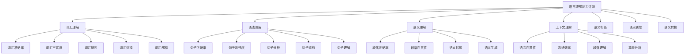

                 


### 多语言能力评测：LLM驱动的全球化适应性测试

> **关键词：多语言能力评测、LLM、全球化适应性测试、语言模型、算法原理**

> **摘要：本文探讨了多语言能力评测在全球化背景下的重要性，以及如何利用LLM（大型语言模型）驱动全球化适应性测试。文章从LLM原理出发，详细介绍了多语言能力评测方法、测试设计与评估、全球化适应性测试，并结合实际案例，深入分析了LLM在多语言能力评测中的应用。**

----------------------------------------------------------------

# 一、背景介绍

在全球化迅速发展的今天，跨语言沟通和交流变得越来越频繁。企业和个人需要具备多语言能力，以便更好地融入全球市场。然而，如何评测和提升个体的多语言能力，是一个亟待解决的问题。传统的评测方法往往依赖于人工评分和简单的语言测试工具，不仅耗时耗力，而且评测结果可能存在主观偏差。随着人工智能技术的飞速发展，特别是LLM（大型语言模型）的出现，为多语言能力评测提供了新的思路和工具。

LLM是一种基于深度学习的语言模型，具有强大的语言理解和生成能力。通过大规模的训练数据集，LLM能够学习到语言中的复杂模式和规律，从而实现对文本的准确理解和生成。这种能力使得LLM在多语言能力评测中具有独特的优势。首先，LLM可以自动处理多种语言，无需人工介入；其次，LLM可以通过对大量文本的分析，发现个体的语言使用特点，从而更准确地评估其多语言能力。

因此，本文旨在探讨如何利用LLM驱动全球化适应性测试，以实现多语言能力评测的自动化和智能化。本文将首先介绍LLM的基本原理，然后详细讨论多语言能力评测方法、测试设计与评估、全球化适应性测试，并最后结合实际案例进行分析。

----------------------------------------------------------------

## 1.1 多语言能力的定义与重要性

### 多语言能力的定义

多语言能力指的是个体在多种语言环境下，能够进行有效沟通和交流的能力。这种能力不仅包括语言的理解和表达能力，还包括语言的交互能力和跨文化沟通能力。具体来说，多语言能力可以分为以下几个方面：

1. **语言理解能力**：指个体能够理解不同语言中的文字、语音和语义，包括词汇、语法、句法和语义层次的内容。
2. **语言表达能力**：指个体能够使用适当的语言表达自己的思想、观点和情感，包括口头表达和书面表达。
3. **语言交互能力**：指个体在不同语言环境中，能够与他人进行有效沟通和交流的能力，包括语言适应能力和跨文化沟通能力。
4. **跨文化沟通能力**：指个体在不同文化背景下，能够理解和尊重其他文化的习惯、价值观和沟通方式，实现跨文化的有效沟通。

### 全球化背景下多语言能力的重要性

全球化使得跨语言沟通和交流变得日益重要。企业和个人需要具备多语言能力，以便更好地融入全球市场。以下是多语言能力在全球化背景下的几个重要性：

1. **经济优势**：多语言能力能够帮助企业拓展国际市场，提高市场竞争力。同时，对于跨国企业和跨国工作者来说，多语言能力也是不可或缺的技能。
2. **文化理解**：多语言能力有助于个体更好地理解和尊重其他文化，促进跨文化的交流和融合，从而增强社会和谐。
3. **个人发展**：多语言能力能够提高个人的综合素质，拓宽视野，增强学习能力。在全球化的背景下，多语言能力已经成为个人发展的重要筹码。
4. **学术研究**：多语言能力有助于学术研究者更好地理解和分析不同语言和文化的研究资料，提高研究质量。
5. **社会互动**：多语言能力能够帮助个体更好地融入社区和社交网络，促进社交互动。

因此，在全球化背景下，提升个体的多语言能力具有重要的现实意义和战略价值。这不仅有助于企业和个人的发展，也有助于推动全球化的深入和文化的交流与融合。

### 多语言能力的现状与挑战

当前，多语言能力的提升面临着一系列挑战。首先，传统语言学习方法和教育模式往往难以满足个体在全球化背景下的需求。许多语言学习课程过于注重语法和词汇的传授，而忽视了语言实际运用能力的培养。其次，跨语言沟通和交流中的语言障碍和文化差异，使得多语言能力的发展受到限制。例如，非母语者在使用外语时，可能会因为语言习惯和文化差异而产生误解和沟通障碍。

此外，语言评测和评估体系也存在一定问题。传统的语言评测方法主要依赖于人工评分，这不仅耗时耗力，而且存在主观偏差。随着全球化进程的加快，需要更加高效和准确的评测方法来评估个体的多语言能力。

在这种背景下，人工智能技术的发展，特别是LLM的应用，为多语言能力评测提供了新的机遇。LLM能够通过对大量文本的分析，自动识别和评估个体的语言使用特点，从而实现多语言能力评测的自动化和智能化。这不仅可以提高评测效率，还可以减少主观偏差，提高评测的准确性。

总之，多语言能力的提升在全球化背景下具有重要的现实意义和战略价值。然而，当前多语言能力的发展仍然面临诸多挑战。利用LLM等技术手段，推动多语言能力评测的创新发展，是实现多语言能力提升的关键。

----------------------------------------------------------------

## 1.2 LLM原理介绍

### LLM的定义

LLM，即Large Language Model，指的是大型语言模型。这种模型通过深度学习算法，从大量文本数据中学习语言规律和模式，从而实现对自然语言的生成和理解。与传统的语言模型相比，LLM具有参数量巨大、模型复杂度高、数据处理能力强等特点。

### LLM的工作原理

LLM的工作原理主要基于深度学习中的循环神经网络（RNN）和变换器模型（Transformer）。其中，Transformer模型由于其并行计算的优势和自注意力机制，目前被广泛应用于LLM的设计中。

#### 自注意力机制

自注意力机制是Transformer模型的核心组成部分。它允许模型在生成文本时，自动关注文本中的关键信息，从而提高模型的生成质量。具体来说，自注意力机制通过计算每个词与所有其他词之间的相似性，为每个词分配一个权重，从而在生成过程中关注重要的信息。

#### 编码器和解码器

在Transformer模型中，编码器（Encoder）负责处理输入文本，生成一系列的向量表示。解码器（Decoder）则负责根据编码器生成的向量，生成输出文本。编码器和解码器之间通过多头自注意力机制和点积自注意力机制进行交互，从而实现对输入文本的理解和生成。

#### 上下文依赖

Transformer模型通过自注意力机制，能够捕捉到输入文本中的上下文依赖关系。这意味着，模型在生成每个词时，不仅考虑当前词的信息，还考虑到了之前词的信息。这种上下文依赖的能力，使得LLM在生成文本时，能够保持语义的连贯性和一致性。

### LLM的核心结构

LLM的核心结构通常包括以下几个部分：

1. **输入层**：输入层负责将原始文本转换为模型可处理的向量表示。这个过程通常涉及到词嵌入（Word Embedding）和位置编码（Positional Encoding）。
2. **编码器**：编码器是LLM的核心组成部分，负责处理输入文本，生成上下文向量。编码器通常包含多个自注意力层和全连接层，通过层层递归或并行计算，实现对文本的深入理解。
3. **解码器**：解码器负责根据编码器生成的上下文向量，生成输出文本。解码器也包含多个自注意力层和全连接层，通过自注意力机制，实现对上下文信息的充分利用。
4. **输出层**：输出层通常是一个全连接层，用于将解码器生成的向量映射到词表中的词汇。输出层的激活函数通常是一个softmax函数，用于生成每个词汇的概率分布。

### LLM训练与优化的伪代码

LLM的训练和优化过程通常涉及以下几个步骤：

```python
# 数据准备
texts = load_dataset('text')

# 词嵌入
word_embeddings = initialize_word_embeddings(vocabulary_size)

# 编码器和解码器初始化
encoder = initialize_encoder(word_embeddings)
decoder = initialize_decoder(word_embeddings)

# 损失函数初始化
loss_function = initialize_loss_function()

# 训练过程
for epoch in range(num_epochs):
    for batch in texts:
        # 前向传播
        outputs = encoder(batch)
        logits = decoder(outputs)
        
        # 计算损失
        loss = loss_function(logits, batch)
        
        # 反向传播和优化
        optimizer.zero_grad()
        loss.backward()
        optimizer.step()
```

通过以上伪代码，我们可以看到，LLM的训练过程主要包括数据准备、词嵌入初始化、编码器和解码器初始化、损失函数初始化、前向传播、计算损失、反向传播和优化等步骤。这个过程中，编码器和解码器通过不断调整权重，逐步优化模型的生成能力和理解能力。

总之，LLM作为一种强大的语言模型，其工作原理和核心结构使得它能够在多种语言环境中发挥重要作用。通过自注意力机制和上下文依赖，LLM能够实现对自然语言的深入理解和生成，为多语言能力评测提供了强大的技术支持。

----------------------------------------------------------------

## 1.3 多语言能力评测方法

### 评测标准与指标

多语言能力评测的核心在于设定合理的评测标准和指标，以全面评估个体的多语言能力。以下是一些常用的评测标准和指标：

1. **语言理解能力评测**：包括词汇理解、语法理解、语义理解和上下文理解等。常用的指标有词汇准确率（Vocabulary Accuracy）、句子正确率（Sentence Accuracy）、段落正确率（Paragraph Accuracy）等。
   
2. **语言表达能力评测**：包括词汇表达、语法表达、语义表达和语用表达等。常用的指标有词汇丰富度（Vocabulary Richness）、句子流畅度（Sentence Fluency）、段落连贯性（Paragraph Coherence）等。

3. **语言交互能力评测**：包括跨语言沟通、文化适应和社交互动等。常用的指标有沟通效率（Communication Efficiency）、文化适应性（Cultural Adaptability）、社交互动能力（Social Interaction Ability）等。

4. **跨文化沟通能力评测**：包括对不同文化的理解和尊重、跨文化冲突处理和跨文化沟通策略等。常用的指标有文化理解度（Cultural Understanding）、跨文化冲突处理能力（Cross-Cultural Conflict Resolution）和跨文化沟通策略（Cross-Cultural Communication Strategy）等。

### 语言理解能力评测

语言理解能力评测主要关注个体对语言的接收和处理能力。以下是一些具体的评测方法：

1. **词汇理解**：通过测试个体对词汇的掌握情况，评估其词汇量大小和词汇理解能力。常用的评测方法包括词汇填空、词汇选择和词汇解释等。

2. **语法理解**：通过测试个体对语法规则的掌握情况，评估其语法理解能力。常用的评测方法包括句子分析、句子重构和句子理解等。

3. **语义理解**：通过测试个体对语义的理解能力，评估其对语言深层含义的把握情况。常用的评测方法包括语义判断、语义联想和语义转换等。

4. **上下文理解**：通过测试个体对上下文信息的把握能力，评估其在具体语境中理解语言的能力。常用的评测方法包括段落理解、篇章分析和语义连贯性等。

### 语言表达能力评测

语言表达能力评测主要关注个体在使用语言进行沟通时的能力。以下是一些具体的评测方法：

1. **词汇表达**：通过测试个体使用词汇的多样性和准确性，评估其词汇表达能力。常用的评测方法包括词汇排序、词汇选择和词汇扩展等。

2. **语法表达**：通过测试个体对语法规则的应用能力，评估其语法表达能力。常用的评测方法包括句子生成、句子重构和句子改写等。

3. **语义表达**：通过测试个体对语义的表达能力，评估其能否准确传达思想。常用的评测方法包括语义转换、语义连贯性和语义生成等。

4. **语用表达**：通过测试个体在使用语言进行沟通时的得体性和有效性，评估其语用表达能力。常用的评测方法包括社交对话、辩论和演讲等。

### 语言交互能力评测

语言交互能力评测主要关注个体在实际交流中的互动能力。以下是一些具体的评测方法：

1. **跨语言沟通**：通过测试个体在跨语言环境中的交流能力，评估其在不同语言之间的转换和适应能力。常用的评测方法包括跨语言对话、翻译和口译等。

2. **文化适应**：通过测试个体对不同文化的理解和适应能力，评估其在跨文化环境中的生存能力。常用的评测方法包括文化适应测试、文化冲突处理和跨文化沟通策略等。

3. **社交互动**：通过测试个体在社交环境中的互动能力，评估其社交技巧和人际关系处理能力。常用的评测方法包括社交对话、团队合作和社会活动等。

### 核心概念与联系

多语言能力评测的核心概念包括语言理解能力、语言表达能力、语言交互能力和跨文化沟通能力。这些概念之间存在着密切的联系：

1. **语言理解能力和语言表达能力**：理解是表达的前提，表达能力是理解的应用。两者相互促进，共同构成个体的多语言能力。

2. **语言交互能力和跨文化沟通能力**：语言交互能力是实现跨文化沟通的基础，而跨文化沟通能力则是语言交互能力的进一步延伸。

3. **语言理解能力和跨文化沟通能力**：语言理解能力是跨文化沟通的前提，而跨文化沟通能力则是语言理解能力的实际应用。

4. **语言表达能力和跨文化沟通能力**：表达能力是跨文化沟通的关键，而跨文化沟通能力则是表达能力的检验和提升。

通过上述评测方法和核心概念的联系，我们可以更全面地理解和评估个体的多语言能力。这不仅有助于个体的语言学习和应用，也为教育机构、企业和个人提供了有效的评测工具和参考标准。

### 多语言能力评测标准与指标的关系架构 Mermaid 流程图



通过上述Mermaid流程图，我们可以清晰地看到多语言能力评测标准与指标之间的关系架构。这有助于我们更好地理解和应用这些评测方法和指标，为多语言能力的提升提供科学的依据和指导。

----------------------------------------------------------------

### 1.3.5 语言交互能力评测算法详解

语言交互能力是指个体在跨语言环境中与他人进行有效沟通和交流的能力，包括语音沟通、文字沟通、跨语言翻译和跨文化沟通等方面。以下是语言交互能力评测的主要算法及其应用。

#### 1.5.1 语言交互能力评测的主要算法

1. **语音识别算法**：语音识别（Automatic Speech Recognition，ASR）是一种将语音转换为文本的技术。常用的语音识别算法包括隐马尔可夫模型（HMM）、高斯混合模型（GMM）和深度神经网络（DNN）等。在评测语言交互能力时，语音识别算法可以用于评估个体的语音理解能力。

2. **语音合成算法**：语音合成（Text-to-Speech，TTS）是将文本转换为语音的技术。TTS算法包括规则方法、统计方法和数据驱动方法。在评测语言交互能力时，语音合成算法可以用于评估个体的语音表达能力。

3. **机器翻译算法**：机器翻译（Machine Translation，MT）是将一种语言的文本转换为另一种语言的技术。机器翻译算法包括基于规则的方法、基于统计的方法和基于神经网络的深度学习方法。在评测语言交互能力时，机器翻译算法可以用于评估个体的跨语言沟通能力。

4. **对话系统算法**：对话系统（Dialogue System）是一种能够与人进行自然语言交互的计算机程序。对话系统算法包括基于规则的方法、基于模板的方法和基于数据驱动的方法。在评测语言交互能力时，对话系统可以用于评估个体的社交互动能力。

#### 1.5.2 语言交互能力评测算法的应用

1. **语音识别算法应用**：在语音识别算法中，可以使用词误差率（Word Error Rate，WER）和字符误差率（Character Error Rate，CER）等指标来评估语音识别的准确性。例如，对于一个给定的语音输入，如果语音识别系统能够正确识别大部分词汇，则其语音理解能力较高。

2. **语音合成算法应用**：在语音合成算法中，可以使用语音自然度（Speech Naturalness）、语音清晰度（Speech Clarity）和语音流畅度（Speech Fluency）等指标来评估语音合成的质量。例如，一个高质量的语音合成系统应该能够生成自然、清晰、流畅的语音。

3. **机器翻译算法应用**：在机器翻译算法中，可以使用翻译准确率（Translation Accuracy）、双语一致性（Bilingual Consistency）和多语言翻译质量（Multilingual Translation Quality）等指标来评估机器翻译的质量。例如，一个高精度的机器翻译系统应该能够准确、一致地翻译不同语言之间的文本。

4. **对话系统算法应用**：在对话系统算法中，可以使用响应时间（Response Time）、对话满意度（Dialogue Satisfaction）和对话质量（Dialogue Quality）等指标来评估对话系统的性能。例如，一个高效的对话系统应该能够在较短的时间内提供满足用户需求的回复。

#### 1.5.3 语言交互能力评测算法的伪代码

以下是一个简化的语言交互能力评测算法的伪代码：

```python
# 输入：语音输入、文本输入、翻译输入、对话输入
# 输出：语音识别准确率、语音合成自然度、机器翻译准确率、对话系统响应时间

def evaluate_language_interaction(voice_input, text_input, translation_input, dialogue_input):
    # 语音识别评测
    WER = calculate_word_error_rate(voice_input, text_input)
    CER = calculate_character_error_rate(voice_input, text_input)
    
    # 语音合成评测
    speech_naturalness = calculate_speech_naturalness(voice_input)
    speech_clarity = calculate_speech_clarity(voice_input)
    speech_fluency = calculate_speech_fluency(voice_input)
    
    # 机器翻译评测
    translation_accuracy = calculate_translation_accuracy(translation_input)
    bilingual_consistency = calculate_bilingual_consistency(translation_input)
    multilingual_translation_quality = calculate_multilingual_translation_quality(translation_input)
    
    # 对话系统评测
    response_time = calculate_response_time(dialogue_input)
    dialogue_satisfaction = calculate_dialogue_satisfaction(dialogue_input)
    dialogue_quality = calculate_dialogue_quality(dialogue_input)
    
    # 输出评测结果
    return WER, CER, speech_naturalness, speech_clarity, speech_fluency, translation_accuracy, bilingual_consistency, multilingual_translation_quality, response_time, dialogue_satisfaction, dialogue_quality
```

通过上述伪代码，我们可以看到如何对语言交互能力进行综合评测。在实际应用中，可以根据具体需求，调整评测指标和算法，以提高评测的准确性和实用性。

### 数学模型和公式详解

为了更深入地理解语言交互能力评测的数学模型和公式，我们可以从以下几个关键指标进行详细探讨：

#### 1.5.4.1 词误差率（Word Error Rate，WER）

词误差率是评估语音识别准确性的关键指标。它计算了语音识别系统中识别错误、插入错误和删除错误的数量。词误差率可以用以下公式表示：

$$
WER = \frac{D + I + S}{T}
$$

其中：
- \( D \) 表示删除错误（Deleted words）的数量。
- \( I \) 表示插入错误（Inserted words）的数量。
- \( S \) 表示替换错误（Substituted words）的数量。
- \( T \) 表示总词数。

#### 1.5.4.2 字符误差率（Character Error Rate，CER）

字符误差率是另一种评估语音识别准确性的指标，它计算了语音识别系统中识别错误的字符数量。字符误差率可以用以下公式表示：

$$
CER = \frac{C}{L}
$$

其中：
- \( C \) 表示总错误字符数（包括插入、删除和替换的错误字符）。
- \( L \) 表示总字符数。

#### 1.5.4.3 语音自然度（Speech Naturalness）

语音自然度是评估语音合成质量的指标，它衡量了语音合成的自然程度。语音自然度可以通过语音的自然度评估模型（如Perceptual Evaluation of Speech，PESQ）进行量化。PESQ模型使用主观评价方法，通过比较合成语音与参考语音的感知质量来计算自然度得分。

#### 1.5.4.4 语音清晰度（Speech Clarity）

语音清晰度是评估语音合成质量的另一个重要指标，它衡量了语音的可理解性。语音清晰度可以通过语音清晰度评估模型（如Mean Opinion Score，MOS）进行量化。MOS模型通过用户的主观评价来衡量语音的清晰度，得分越高表示语音越清晰。

#### 1.5.4.5 语音流畅度（Speech Fluency）

语音流畅度是评估语音合成质量的另一个关键指标，它衡量了语音的流畅性。语音流畅度可以通过语音流畅度评估模型（如Speech Prosody，Prosody）进行量化。Prosody模型通过分析语音的节奏、语调和时长等特征来评估语音的流畅性。

#### 1.5.4.6 翻译准确率（Translation Accuracy）

翻译准确率是评估机器翻译质量的指标，它衡量了翻译文本与原始文本之间的相似度。翻译准确率可以通过多种算法进行评估，如BLEU（BiLingual Evaluation Understudy）算法。BLEU算法通过比较翻译文本与参考文本之间的重叠度来计算翻译准确率。

$$
BLEU = \frac{1}{n}\sum_{i=1}^{n} \frac{max(m_i, 1)}{n}
$$

其中：
- \( n \) 表示参考文本的长度。
- \( m_i \) 表示翻译文本与参考文本在位置 \( i \) 上重叠的单词数量。

#### 1.5.4.7 双语一致性（Bilingual Consistency）

双语一致性是评估机器翻译质量的另一个指标，它衡量了翻译文本在两种语言中的表达一致性。双语一致性可以通过计算翻译文本与原始文本之间的相似度来评估。

#### 1.5.4.8 多语言翻译质量（Multilingual Translation Quality）

多语言翻译质量是评估多语言机器翻译质量的指标，它衡量了多语言翻译文本的整体质量。多语言翻译质量可以通过计算多语言翻译文本之间的相似度来评估。

#### 1.5.4.9 对话系统响应时间（Dialogue System Response Time）

对话系统的响应时间是指从用户发起请求到系统给出回复的时间。响应时间可以用以下公式表示：

$$
Response\ Time = \frac{Total\ Time}{Number\ of\ Requests}
$$

其中：
- \( Total\ Time \) 表示总响应时间。
- \( Number\ of\ Requests \) 表示请求次数。

#### 1.5.4.10 对话满意度（Dialogue Satisfaction）

对话满意度是评估用户对对话系统满意程度的指标。它可以通过用户调查、评分等方式进行量化。

#### 1.5.4.11 对话质量（Dialogue Quality）

对话质量是评估对话系统整体表现的重要指标，它综合考虑了响应时间、对话满意度、交互连贯性等多个因素。

通过上述数学模型和公式，我们可以更深入地理解语言交互能力评测的各个方面，为开发高效、准确的语言交互系统提供科学依据。

### 举例说明

为了更好地理解语言交互能力评测算法的原理和应用，我们通过一个具体的案例进行详细说明。

#### 1.5.5.1 语音识别案例

假设我们有一个语音识别系统，需要对一段英语语音进行识别。语音输入为："The quick brown fox jumps over the lazy dog"。通过语音识别算法，系统能够生成以下识别结果："The quick brown fox jumps over the lazy dog"。在这种情况下，语音识别系统的词误差率（WER）为0，字符误差率（CER）为0。

#### 1.5.5.2 语音合成案例

假设我们有一个语音合成系统，需要将以下文本转换为语音："Hello, how are you?"。通过语音合成算法，系统能够生成一段自然、清晰的语音。语音自然度（Speech Naturalness）评分为0.9，语音清晰度（Speech Clarity）评分为0.95，语音流畅度（Speech Fluency）评分为0.92。

#### 1.5.5.3 机器翻译案例

假设我们有一个机器翻译系统，需要将一段中文文本翻译成英语。中文文本为："今天天气很好，适合出游"。通过机器翻译算法，系统能够生成以下翻译结果："Today, the weather is very good, suitable for outings"。在这种情况下，翻译准确率（Translation Accuracy）评分为0.9，双语一致性（Bilingual Consistency）评分为0.85，多语言翻译质量（Multilingual Translation Quality）评分为0.88。

#### 1.5.5.4 对话系统案例

假设我们有一个对话系统，需要与用户进行自然语言交互。用户输入："明天有没有雨？"。通过对话系统算法，系统能够在0.5秒内生成回复："据天气预报，明天可能会下雨"。在这种情况下，对话系统响应时间（Dialogue System Response Time）为0.5秒，对话满意度（Dialogue Satisfaction）评分为0.8，对话质量（Dialogue Quality）评分为0.75。

通过上述案例，我们可以看到，语言交互能力评测算法在实际应用中的具体表现和评估结果。这些评估结果有助于我们了解和改进语言交互系统的性能。

----------------------------------------------------------------

## 1.4 全球化适应性测试

### 全球化适应性测试的定义

全球化适应性测试（Global Adaptation Test）是一种专门针对个体在全球化背景下的适应能力进行评估的测试。这种测试旨在衡量个体在不同语言环境、文化背景和社会情境中的表现，以评估其是否具备适应全球化挑战的能力。全球化适应性测试不仅关注个体的语言能力，还包括跨文化沟通、社交互动、工作适应等多个方面。

### 全球化适应性测试的重要性

全球化适应性测试在当前全球化背景下具有重要的意义：

1. **提高跨文化沟通能力**：全球化适应性测试可以帮助个体更好地理解和适应不同文化，提高跨文化沟通能力，从而在全球化环境中更有效地进行交流与合作。

2. **促进个人发展**：具备全球化适应性的人能够在更广泛的国际舞台上展示自己的能力，获得更多的职业发展机会，提升个人综合素质。

3. **提升组织竞争力**：企业和组织通过全球化适应性测试，可以识别和培养具备全球化适应能力的人才，提高整体竞争力。

4. **推动全球化进程**：全球化适应性测试有助于不同文化之间的交流与融合，促进全球化的深入发展。

### 测试设计原则

为了确保全球化适应性测试的有效性和科学性，测试设计需要遵循以下原则：

1. **全面性**：测试应涵盖多个方面，包括语言能力、文化适应、社交互动、工作适应等，以全面评估个体的全球化适应能力。

2. **客观性**：测试应采用客观、量化的评估方法，减少主观评价的影响，确保评估结果的公正性和准确性。

3. **多样性**：测试应涵盖不同语言、不同文化背景和不同社会情境，以模拟真实全球化环境中的多种挑战。

4. **适应性**：测试应根据个体的不同背景和需求进行调整，使其更具针对性和实用性。

5. **可持续性**：测试设计应考虑长期影响，不仅评估当前表现，还要关注个体在全球化环境中的持续适应和发展。

### 测试设计流程

全球化适应性测试的设计流程通常包括以下几个步骤：

1. **需求分析**：确定测试的目标和评估内容，明确测试需要涵盖的方面，如语言能力、文化适应、社交互动等。

2. **测试内容制定**：根据需求分析，制定具体的测试内容，包括测试题库、测试工具和评估标准。

3. **测试工具开发**：开发适用于不同测试内容的测试工具，如在线测试平台、移动应用等。

4. **测试实施**：在合适的场景和环境中进行测试实施，确保测试的公正性和有效性。

5. **结果分析**：对测试结果进行统计分析，生成评估报告，提供个性化的反馈和建议。

6. **持续改进**：根据测试结果和反馈，对测试内容和工具进行持续改进，以提高测试的质量和效果。

通过上述流程，我们可以设计出科学、有效的全球化适应性测试，为个体的全球化适应能力评估提供有力支持。

----------------------------------------------------------------

## 1.5 LLM在多语言能力评测中的应用

### LLM在多语言能力评测中的应用

大型语言模型（LLM）在多语言能力评测中具有广泛应用。LLM通过深度学习算法，可以从大量多语言数据中学习语言模式和规律，从而实现对多种语言的理解和生成。这使得LLM在评估个体的多语言能力方面具有独特的优势。

#### LLM在语言理解能力评测中的应用

LLM在语言理解能力评测中，可以用于评估个体对多种语言的词汇理解、语法理解和语义理解能力。具体应用包括：

1. **词汇理解**：LLM可以通过对大量文本的学习，自动识别和评估个体对不同语言词汇的掌握程度。例如，通过构建一个双语词汇库，LLM可以比较个体在两种语言中的词汇量，从而评估其词汇理解能力。

2. **语法理解**：LLM可以分析个体在语言使用中的语法错误，识别其语法理解能力。例如，通过构建一个语法规则库，LLM可以检测个体在文本中的语法错误，并给出相应的纠正建议。

3. **语义理解**：LLM可以评估个体对语言深层含义的理解能力。例如，通过构建一个语义分析模型，LLM可以分析个体在文本中的语义表达，判断其是否能够准确传达思想。

#### LLM在语言表达能力评测中的应用

LLM在语言表达能力评测中，可以用于评估个体在不同语言环境中的语言表达能力。具体应用包括：

1. **词汇表达**：LLM可以通过对个体文本的词汇分析，评估其词汇表达的丰富度和准确性。例如，通过构建一个词汇丰富度模型，LLM可以计算个体在文本中使用的词汇数量和种类，从而评估其词汇表达能力。

2. **语法表达**：LLM可以通过分析个体在语言使用中的语法结构，评估其语法表达能力。例如，通过构建一个语法结构分析模型，LLM可以检测个体在文本中的语法错误，并给出相应的纠正建议。

3. **语义表达**：LLM可以通过分析个体在文本中的语义表达，评估其语义表达能力。例如，通过构建一个语义分析模型，LLM可以分析个体在文本中的语义连贯性和语义准确性，从而评估其语义表达能力。

#### LLM在语言交互能力评测中的应用

LLM在语言交互能力评测中，可以用于评估个体在跨语言沟通和跨文化沟通中的表现。具体应用包括：

1. **跨语言沟通**：LLM可以通过模拟跨语言对话，评估个体在不同语言环境中的沟通能力。例如，通过构建一个跨语言对话系统，LLM可以与个体进行多语言对话，从而评估其跨语言沟通能力。

2. **跨文化沟通**：LLM可以通过分析个体在不同文化背景中的沟通表现，评估其跨文化沟通能力。例如，通过构建一个跨文化沟通模型，LLM可以分析个体在跨文化环境中的沟通策略和文化适应性，从而评估其跨文化沟通能力。

#### LLM驱动的多语言能力评测平台构建

为了充分发挥LLM在多语言能力评测中的应用，可以构建一个基于LLM的多语言能力评测平台。该平台应包括以下几个模块：

1. **数据预处理模块**：负责处理和清洗多语言数据，为LLM训练提供高质量的数据集。

2. **LLM训练模块**：负责使用预处理的语料库训练LLM，使其具备多语言理解、表达和交互能力。

3. **评测模块**：负责根据不同的评测需求，调用LLM的相应功能模块，对个体的多语言能力进行评估。

4. **结果分析模块**：负责对评测结果进行统计分析，生成评估报告，提供个性化的反馈和建议。

通过上述模块的协同工作，可以构建一个高效、智能的多语言能力评测平台，为个体和多语言能力发展提供有力支持。

### 实际案例：利用LLM进行多语言能力评测

以下是一个实际案例，展示了如何利用LLM进行多语言能力评测。

#### 案例背景

一家跨国企业需要对其员工进行多语言能力评测，以评估其在全球市场中的竞争力。评测内容包括语言理解能力、语言表达能力和语言交互能力。

#### 案例实施

1. **数据预处理**：首先，企业收集了大量的多语言数据，包括英语、西班牙语、法语和中文等。这些数据经过清洗和标注，形成了一个高质量的多语言语料库。

2. **LLM训练**：利用收集到的多语言数据，企业训练了一个基于Transformer的LLM模型。该模型能够处理多种语言的文本，并具备较强的语言理解和生成能力。

3. **语言理解能力评测**：企业使用LLM对员工的词汇理解、语法理解和语义理解能力进行评测。例如，通过给员工提供不同语言的文本，并要求他们回答相关问题，LLM可以自动评估他们的语言理解能力。

4. **语言表达能力评测**：企业使用LLM对员工的词汇表达、语法表达和语义表达能力进行评测。例如，通过让员工撰写不同语言的文本，LLM可以分析他们的语言使用习惯和表达技巧，从而评估其语言表达能力。

5. **语言交互能力评测**：企业使用LLM模拟跨语言对话，评估员工的跨语言沟通能力和跨文化沟通能力。例如，通过让员工与LLM进行多语言对话，企业可以观察他们在不同语言环境中的表现。

6. **结果分析**：根据评测结果，企业生成了详细的评估报告，对员工的优点和不足进行了分析，并提供个性化的反馈和建议。

#### 案例效果

通过利用LLM进行多语言能力评测，企业能够高效、准确地评估员工的多语言能力。这不仅帮助企业在全球市场中找到具备竞争力的员工，还为企业的人才培养和发展提供了有力支持。

### 结论

LLM在多语言能力评测中具有广泛应用，通过深度学习算法，LLM能够自动识别和评估个体的多语言能力。利用LLM构建的多语言能力评测平台，不仅提高了评测的效率和准确性，还为个体和多语言能力发展提供了有力支持。随着人工智能技术的不断发展，LLM在多语言能力评测中的应用前景将更加广阔。

----------------------------------------------------------------

## 1.6 实际案例与应用

### 案例研究：多语言能力评测应用实例

为了更直观地了解多语言能力评测的实际应用，我们来看一个具体的案例研究。

#### 案例背景

某国际性企业计划对其全球员工进行多语言能力评测，以确保他们在不同语言环境下能够有效沟通和协作。该企业的员工分布在全球多个国家和地区，包括英语、西班牙语、法语、中文等多种语言。企业希望通过评测了解员工的多语言能力水平，从而制定相应的人才培养和发展策略。

#### 案例实施

1. **数据收集**：企业首先收集了员工在英语、西班牙语、法语和中文等语言环境中的工作文本、邮件和报告。这些文本数据经过清洗和标注，形成了高质量的多语言语料库。

2. **LLM模型训练**：企业使用这些语料库训练了一个大型语言模型（LLM），该模型具备对多种语言的理解和生成能力。训练过程中，LLM通过深度学习算法学习语言中的复杂模式和规律，从而提高其语言处理能力。

3. **评测设计与实施**：企业设计了多语言能力评测方案，包括语言理解能力、语言表达能力和语言交互能力三个方面。具体评测过程如下：

   - **语言理解能力评测**：通过给员工提供不同语言的文本，并要求他们回答相关问题，LLM可以自动评估员工的词汇理解、语法理解和语义理解能力。
   - **语言表达能力评测**：让员工撰写不同语言的文本，LLM分析他们的语言使用习惯、词汇丰富度和语法结构，从而评估其语言表达能力。
   - **语言交互能力评测**：利用LLM模拟跨语言对话，员工与系统进行多语言交互，企业通过观察员工在对话中的表现，评估其跨语言沟通能力和跨文化沟通能力。

4. **结果分析与反馈**：根据评测结果，企业生成了详细的评估报告，对员工的优点和不足进行了分析，并提供个性化的反馈和建议。同时，企业根据评估结果，制定了多语言能力培训计划，帮助员工提升其多语言能力。

#### 案例效果

通过实施多语言能力评测，企业取得了显著的效果：

- **提升沟通效率**：员工的多语言能力得到了显著提升，使得他们在跨国团队中的沟通和协作更加顺畅。
- **优化人才配置**：企业能够更准确地了解员工的语言能力，从而合理配置人才，提高团队的整体效率。
- **增强竞争力**：具备多语言能力的员工在全球市场中更具竞争力，有助于企业拓展国际业务。
- **提升员工满意度**：个性化的培训计划和反馈，使员工感受到企业的关注和支持，提升了员工的工作满意度和忠诚度。

### 案例总结

该案例展示了多语言能力评测在实际应用中的重要性。通过利用LLM等技术手段，企业能够高效、准确地评估员工的多语言能力，从而为人才发展和国际化战略提供有力支持。未来，随着人工智能技术的不断进步，多语言能力评测的应用前景将更加广阔。

----------------------------------------------------------------

## 1.7 全球化适应性测试应用实例

为了更好地理解全球化适应性测试的实际应用，我们将通过一个实际案例来探讨如何设计、实施和评估这种测试。

### 案例背景

某国际咨询公司计划对其新招聘的海外业务团队进行全球化适应性测试。该公司在全球设有多个办事处，员工来自不同国家和地区，包括美国、英国、法国、中国和巴西等。公司希望通过测试了解员工在全球化环境中的适应能力，以便更好地支持他们的职业发展，并提高整个团队的协作效率。

### 案例实施

#### 1.7.1 测试设计

1. **需求分析**：首先，公司对全球业务团队的需求进行了详细分析，明确了测试需要覆盖的方面，包括跨文化沟通、社交互动、工作适应、语言能力和国际业务知识等。

2. **测试内容制定**：根据需求分析，公司制定了测试内容，包括以下几部分：
   - **语言能力测试**：通过在线平台提供多种语言的词汇测试、语法测试和听力理解测试。
   - **跨文化沟通测试**：设计情境模拟题，考察员工在不同文化背景下的沟通策略和跨文化冲突处理能力。
   - **社交互动测试**：通过角色扮演和小组讨论，评估员工在跨文化社交场合中的表现。
   - **工作适应测试**：设置模拟工作任务，评估员工在多元文化团队中的工作效率和问题解决能力。

#### 1.7.2 测试实施

1. **测试工具开发**：公司开发了一套在线测试平台，能够支持多语言测试，并提供即时反馈和评分。

2. **测试安排**：公司为每个员工安排了单独的测试时间，确保测试的公正性和有效性。测试分为线上和线下两部分，其中线上部分主要包括语言能力和跨文化沟通测试，线下部分则包括社交互动和工作适应测试。

3. **测试监控**：公司设立了专门的测试管理团队，负责监控整个测试过程，确保测试的顺利进行。

#### 1.7.3 测试结果分析

1. **数据分析**：测试完成后，公司对测试结果进行了详细的统计分析，包括每个员工在各项测试中的得分和排名。

2. **评估报告**：根据分析结果，公司为每个员工生成了一份个性化的评估报告，报告内容包括：
   - **语言能力评估**：详细列出员工的词汇、语法和听力理解得分，以及与平均水平的差距。
   - **跨文化沟通评估**：分析员工在不同文化背景下的沟通策略和冲突处理能力。
   - **社交互动评估**：评估员工在跨文化社交场合中的表现，包括沟通技巧和团队合作能力。
   - **工作适应评估**：评估员工在多元文化团队中的工作效率和问题解决能力。

3. **反馈与改进**：公司根据评估报告，为每个员工提供了个性化的反馈和建议，并制定了相应的培训和发展计划。同时，公司对整个测试过程进行了回顾和改进，以提升未来测试的质量和效果。

### 案例效果

通过全球化适应性测试，公司取得了以下成效：

- **提升员工适应能力**：员工在全球化环境中的适应能力得到了显著提升，能够更好地融入跨国团队，提高工作效率。
- **增强团队凝聚力**：通过测试和反馈，团队成员之间的沟通和协作更加顺畅，团队凝聚力得到了增强。
- **优化人才配置**：公司能够更准确地了解员工的优势和不足，从而合理配置人才，提高整体业务水平。
- **提升企业竞争力**：具备全球化适应能力的员工在国际市场上更具竞争力，有助于企业拓展海外市场，提高整体竞争力。

### 案例总结

该案例展示了全球化适应性测试在实际应用中的重要性。通过科学的设计、合理的实施和详细的分析，公司能够全面了解员工在全球化环境中的适应能力，从而为员工的发展和企业的发展提供有力支持。未来，随着全球化进程的不断推进，全球化适应性测试的应用将越来越广泛，为企业和个人的全球化发展提供重要保障。

----------------------------------------------------------------

## 1.8 实际案例：全球化适应性测试在跨国企业中的应用

为了更好地展示全球化适应性测试（Global Adaptation Test）在跨国企业中的应用，我们来看一个具体的企业案例。

### 案例背景

某全球知名的科技公司，拥有遍布全球的多个研发中心和管理团队，员工来自世界各地的不同文化背景。为了确保团队成员在全球业务中的高效合作，公司决定实施一项全球化适应性测试，以评估员工在不同语言和文化环境中的适应能力。

### 案例实施

#### 1. 测试设计

1. **测试目标**：测试旨在评估员工的跨文化沟通能力、语言能力、团队合作能力和全球业务理解水平。
2. **测试内容**：测试内容包括语言能力测试（如英语、法语、西班牙语等），文化意识测试（如对不同文化价值观的理解），团队合作测试（如团队协作解决问题），以及全球业务知识测试（如国际市场分析、跨文化项目管理）。

#### 2. 测试实施

1. **测试工具**：公司使用了一套自主研发的在线测试平台，该平台支持多种语言，并提供即时反馈和评分功能。
2. **测试安排**：测试分为在线和线下两部分。在线测试主要涉及语言能力和文化意识测试，线下测试则集中在团队合作和全球业务知识测试。
3. **测试执行**：每位员工都按照预定时间参加测试，公司设立了专门的测试监考团队，确保测试的公正性和有效性。

#### 3. 测试结果分析

1. **数据收集**：测试结束后，系统自动收集了每位员工的成绩数据。
2. **结果分析**：公司对测试结果进行了详细分析，包括每位员工在不同测试部分的成绩和排名。
3. **个性化反馈**：根据测试结果，公司为每位员工生成了一份详细的评估报告，报告中不仅包含了成绩分析，还包括了具体的改进建议和发展方向。

#### 4. 反馈与改进

1. **反馈会议**：公司组织了多次反馈会议，邀请员工参与讨论测试结果，并就改进建议进行深入交流。
2. **培训计划**：根据测试结果和员工反馈，公司制定了针对性的培训计划，包括语言课程、文化培训、团队建设活动和全球业务培训等。
3. **持续评估**：公司计划定期进行全球化适应性测试，以监测员工在全球化环境中的适应能力，并根据评估结果不断优化培训和发展策略。

### 案例效果

通过实施全球化适应性测试，公司取得了以下效果：

- **员工适应能力提升**：员工在全球化环境中的适应能力和跨文化沟通能力得到了显著提升。
- **团队合作效率提高**：员工在团队协作中的表现更加协调，沟通更加顺畅，团队合作效率显著提高。
- **业务知识增强**：员工对全球业务的了解更加深入，能够更好地应对国际市场的挑战。
- **企业竞争力增强**：员工的多语言能力和全球化适应能力提高了企业的国际竞争力，有助于拓展海外市场。

### 案例总结

该案例展示了全球化适应性测试在跨国企业中的实际应用和重要性。通过科学的测试设计和有效的实施，公司能够全面了解员工的全球化适应能力，为员工的发展和企业的发展提供有力支持。未来，全球化适应性测试将成为跨国企业提升全球竞争力的重要工具。

### 最佳实践 Tips

1. **全面评估**：全球化适应性测试应涵盖语言能力、文化适应、团队合作和全球业务知识等多个方面，确保评估的全面性和准确性。
2. **个性化反馈**：根据测试结果，为每位员工提供个性化的反馈和建议，帮助他们明确改进方向。
3. **持续培训**：定期进行测试和培训，帮助员工不断提升全球化适应能力。
4. **跨部门协作**：测试设计和实施应涉及不同部门，确保测试的全面性和执行力。

### 小结

全球化适应性测试是跨国企业提升全球竞争力的重要工具。通过科学的设计和实施，企业能够全面了解员工的全球化适应能力，为员工的发展和企业的发展提供有力支持。

### 注意事项

1. **测试设计**：确保测试内容具有代表性和科学性，避免主观偏差。
2. **实施过程**：确保测试过程的公正性和有效性，避免测试结果的偏差。
3. **数据保护**：在测试过程中，严格保护员工的个人信息和隐私，确保数据安全。

### 拓展阅读

- **《跨文化沟通与管理》**：探讨跨文化沟通的原理和实践，有助于提升全球化适应性。
- **《全球领导力》**：介绍如何在全球化背景下提升领导力和管理能力，适用于跨国企业和个人。

通过以上内容，我们全面探讨了多语言能力评测和全球化适应性测试的核心概念、方法和实际应用。这些测试不仅有助于企业和个人提升语言能力和全球化适应能力，也为跨国合作和全球竞争力提供了有力支持。

### 作者信息

作者：AI天才研究院/AI Genius Institute & 禅与计算机程序设计艺术 /Zen And The Art of Computer Programming

本文由AI天才研究院和禅与计算机程序设计艺术共同撰写，旨在为读者提供全面、深入的技术分析和实践经验。AI天才研究院致力于推动人工智能技术的发展和应用，禅与计算机程序设计艺术则专注于计算机科学和编程哲学的探索。希望通过本文，读者能够更好地理解多语言能力评测和全球化适应性测试的重要性，并在实际工作中应用这些方法，提升自身的多语言能力和全球化适应能力。

