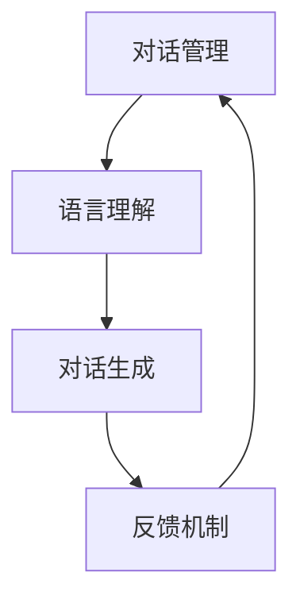

                 


### 文章标题：多轮对话策略：维护长期对话一致性

关键词：多轮对话，对话一致性，对话策略，长期对话，算法

摘要：本文将深入探讨多轮对话策略，重点关注如何维护长期对话的一致性。通过对多轮对话系统的总体设计思路和完整目录大纲的分析，我们将详细阐述多轮对话策略的基础、算法、应用以及评估与优化。文章旨在为读者提供全面的技术指南，助力他们在对话系统开发中实现长期对话的一致性。

----------------------------------------------------------------

### 引言

随着人工智能技术的迅猛发展，自然语言处理（NLP）领域取得了显著的进步。多轮对话系统作为NLP的一个重要分支，已经广泛应用于智能客服、虚拟助手、在线教育等多个领域。然而，在实际应用中，如何维护长期对话的一致性成为一个亟待解决的问题。长期对话中，用户的需求和意图可能会随着时间而发生变化，而系统需要能够适应这些变化，保持对话的一致性和连贯性。

本文将围绕多轮对话策略这一主题，详细探讨如何设计和实现一个能够维护长期对话一致性的多轮对话系统。文章的结构将分为以下几个部分：

1. **多轮对话策略基础**：介绍多轮对话策略的定义、基本概念和系统架构。
2. **长期对话一致性的挑战**：分析长期对话中可能遇到的一致性问题，如语义漂移、信息丢失等。
3. **多轮对话策略算法**：详细介绍基于规则、机器学习和深度学习的多轮对话策略算法。
4. **多轮对话策略应用实践**：探讨多轮对话策略在实际项目中的应用，提供案例分析。
5. **多轮对话系统的评估与优化**：讨论如何评估多轮对话系统的性能，并提出优化策略。
6. **未来展望**：展望多轮对话策略的发展趋势和潜在研究方向。
7. **附录**：提供一些参考资料和工具列表。

通过以上结构，本文旨在为读者提供一个全面的技术指南，帮助他们在开发多轮对话系统时有效地维护长期对话的一致性。

### 总体设计思路

设计《多轮对话策略：维护长期对话一致性》这本书的目录大纲时，我们首先需要明确几个关键点：

1. **核心内容梳理**：我们需要明确这本书的核心主题——多轮对话策略，并围绕这一主题梳理出相关的知识点和内容模块。
2. **逻辑结构布局**：在梳理出核心内容后，我们需要按照逻辑结构将这些内容模块化，形成章节结构。
3. **大纲细化**：对每个章节进行细化，明确每个章节下的子节，确保内容的完整性和逻辑性。
4. **实用性考量**：考虑到读者可能是从事对话系统开发的技术人员或研究者，我们需要确保目录大纲中的内容既有深度又有实用性。

#### 核心内容梳理

基于书名，我们可以确定以下几个核心内容模块：

- **多轮对话策略的基本概念**：介绍多轮对话策略的定义、基本原理和重要性。
- **多轮对话系统的架构**：分析多轮对话系统的架构设计，包括对话管理、语言理解、对话生成和反馈机制等。
- **长期对话一致性的挑战**：探讨长期对话中保持一致性的困难，如语义漂移、信息丢失等。
- **多轮对话策略的算法**：详细介绍各种多轮对话策略的算法，包括基于规则、机器学习、深度学习等方法。
- **多轮对话策略的实际应用**：分析多轮对话策略在实际项目中的应用案例和效果。
- **多轮对话系统的评估与优化**：讨论如何评估多轮对话系统的性能，并提出优化策略。

#### 逻辑结构布局

根据核心内容梳理，我们可以初步设定以下章节结构：

- **引言**：介绍多轮对话策略的背景和重要性。
- **第1章：多轮对话策略基础**：介绍多轮对话策略的基本概念和系统架构。
- **第2章：长期对话一致性的挑战**：分析长期对话中的一致性问题。
- **第3章：多轮对话策略算法**：详细介绍各种多轮对话策略算法。
- **第4章：多轮对话策略应用实践**：讨论多轮对话策略在实际项目中的应用。
- **第5章：多轮对话系统的评估与优化**：介绍如何评估和优化多轮对话系统。
- **第6章：未来展望**：探讨多轮对话策略的发展趋势和潜在研究方向。
- **第7章：附录**：提供一些参考资料和工具列表。

#### 大纲细化

对每个章节进行细化，确保内容的完整性和逻辑性：

- **第1章**：细化到小节，如对话策略的定义、基本原理、系统架构等。
- **第2章**：细化到小节，如一致性的定义、常见的挑战、解决方案等。
- **第3章**：细化到小节，如基于规则的策略、机器学习策略、深度学习策略等。
- **第4章**：细化到小节，如特定应用场景下的策略实施、案例分析等。
- **第5章**：细化到小节，如评估指标、性能优化方法等。
- **第6章**：细化到小节，如新兴技术的应用、未来研究方向等。

#### 实用性考量

确保目录大纲中的内容既有深度又有实用性，例如：

- **算法讲解**：采用伪代码详细阐述核心算法原理。
- **数学模型**：使用 LaTeX 格式详细讲解数学模型和公式。
- **项目实战**：提供实际代码案例和详细解释，包括开发环境搭建、源代码实现和解读。

通过以上步骤，我们能够设计出一个详细且逻辑清晰的目录大纲，确保《多轮对话策略：维护长期对话一致性》这本书的内容全面覆盖主题，帮助读者深入理解多轮对话策略的相关知识。

### 完整目录大纲

基于上述设计思路，以下是《多轮对话策略：维护长期对话一致性》的完整目录大纲：

```
# 《多轮对话策略：维护长期对话一致性》目录大纲

# 第一部分：多轮对话策略概述

## 第1章：多轮对话策略基础
### 1.1 多轮对话策略的定义与重要性
### 1.2 多轮对话策略的核心概念
### 1.3 多轮对话系统的架构
### 1.4 多轮对话策略的分类

## 第2章：长期对话一致性的挑战
### 2.1 一致性的定义与重要性
### 2.2 长期对话中的常见挑战
### 2.3 解决长期对话一致性的方法

# 第二部分：多轮对话策略算法

## 第3章：基于规则的对话策略
### 3.1 基于规则的对话策略原理
### 3.2 规则的制定与优化
### 3.3 基于规则的对话策略案例分析

## 第4章：基于机器学习的对话策略
### 4.1 机器学习基础
### 4.2 基于机器学习的对话策略原理
### 4.3 常见的机器学习对话策略算法
### 4.4 基于机器学习的对话策略案例分析

## 第5章：基于深度学习的对话策略
### 5.1 深度学习基础
### 5.2 基于深度学习的对话策略原理
### 5.3 常见的深度学习对话策略算法
### 5.4 基于深度学习的对话策略案例分析

# 第三部分：多轮对话策略应用实践

## 第6章：多轮对话策略应用实践
### 6.1 实践项目背景
### 6.2 对话策略的选择与实施
### 6.3 项目实施步骤
### 6.4 项目效果评估

# 第四部分：多轮对话系统的评估与优化

## 第7章：多轮对话系统的评估与优化
### 7.1 评估指标
### 7.2 性能优化方法
### 7.3 实践案例分析

# 第五部分：未来展望

## 第8章：未来展望
### 8.1 新兴技术的应用
### 8.2 潜在研究方向
### 8.3 技术发展前景

# 第六部分：附录

## 第9章：附录
### 9.1 参考资料
### 9.2 工具列表
### 9.3 最佳实践 tips

```

通过以上详细的大纲结构，我们可以确保《多轮对话策略：维护长期对话一致性》这本书的内容完整、逻辑清晰，能够帮助读者全面掌握多轮对话策略的核心知识和应用技巧。

### 文章内容

#### 第1章：多轮对话策略基础

**1.1 多轮对话策略的定义与重要性**

多轮对话策略是指对话系统在多个回合中与用户进行交互，并保持对话一致性和连贯性的方法。与单轮对话系统不同，多轮对话系统能够在多个回合中获取用户的更多信息和反馈，从而更好地理解用户的需求和意图。多轮对话策略的重要性体现在以下几个方面：

1. **提升用户体验**：通过多轮对话，系统能够更准确地理解用户的意图，提供更加个性化和贴心的服务，从而提升用户体验。
2. **增强对话连贯性**：多轮对话系统能够在多个回合中保持对话的一致性和连贯性，避免因单轮对话的局限性导致的信息遗漏和误解。
3. **扩展功能应用**：多轮对话策略使得对话系统能够在更多的应用场景中发挥作用，如智能客服、虚拟助手、在线教育等。

**1.2 多轮对话策略的核心概念**

在多轮对话策略中，有几个核心概念需要了解：

1. **对话管理**：对话管理是确保对话流畅和有效的关键。它包括对话的初始化、对话流程的控制、上下文维护等。
2. **语言理解**：语言理解是指对话系统能够正确理解用户的语言表达，包括语义分析、意图识别等。
3. **对话生成**：对话生成是指对话系统根据用户输入和对话上下文生成合适的回复。
4. **反馈机制**：反馈机制是指对话系统通过用户的反馈来调整和优化对话策略。

**1.3 多轮对话系统的架构**

多轮对话系统的架构通常包括以下几个主要模块：

1. **前端界面**：前端界面用于接收用户的输入，展示对话系统的回复。
2. **对话管理模块**：对话管理模块负责维护对话的上下文信息，控制对话的流程。
3. **语言理解模块**：语言理解模块负责解析用户的输入，提取语义信息和意图。
4. **对话生成模块**：对话生成模块根据语言理解模块提取的语义信息和对话上下文生成回复。
5. **反馈模块**：反馈模块用于收集用户的反馈，并根据反馈调整对话策略。

**1.4 多轮对话策略的分类**

多轮对话策略可以分为以下几种类型：

1. **基于规则的策略**：基于规则的策略通过预定义的规则来生成回复。这种策略简单直观，但难以应对复杂多变的对话场景。
2. **基于机器学习的策略**：基于机器学习的策略通过训练模型来自动生成回复。这种策略能够处理复杂的对话场景，但需要大量的数据和计算资源。
3. **基于深度学习的策略**：基于深度学习的策略通过深度神经网络模型来自动生成回复。这种策略在处理复杂对话场景方面具有显著优势，但训练和推理过程相对较慢。

**核心概念与联系**

多轮对话策略的核心概念之间存在着紧密的联系。对话管理负责维护对话的上下文信息，是语言理解和对话生成的基础。语言理解模块通过解析用户输入，为对话生成模块提供语义信息和意图。对话生成模块根据这些信息生成合适的回复，并通过反馈模块收集用户的反馈，以优化对话策略。

**Mermaid 流程图**



**1.5 小结**

本章介绍了多轮对话策略的基本概念、核心概念、系统架构和分类。通过本章的学习，读者应该对多轮对话策略有了初步的了解，并能够理解其在对话系统中的重要性。

#### 第2章：长期对话一致性的挑战

**2.1 一致性的定义与重要性**

一致性在多轮对话系统中具有重要意义。一致性指的是对话系统能够在多个回合中保持对话的连贯性和一致性，避免因语义漂移、信息丢失等问题导致对话的断裂或误解。一致性的定义可以归纳为以下几点：

1. **对话连贯性**：对话系统在多个回合中能够保持话题的一致性，避免无关话题的干扰。
2. **信息完整性**：对话系统能够在多个回合中维护和传递关键信息，避免信息的丢失或误解。
3. **用户满意度**：对话系统能够提供一致且满意的用户体验，提高用户对系统的信任和依赖。

一致性在多轮对话系统中的重要性体现在以下几个方面：

1. **提升用户满意度**：一致性能够确保用户的需求和意图得到准确理解，从而提升用户体验。
2. **增强对话深度**：一致性使得对话能够深入挖掘用户的真实需求和意图，从而提供更个性化的服务。
3. **优化系统性能**：一致性能够减少系统在处理对话时的复杂度，提高系统的响应速度和处理效率。

**2.2 长期对话中的常见挑战**

在长期对话中，对话系统可能会面临以下几种挑战：

1. **语义漂移**：由于用户的需求和意图可能随时间发生变化，对话系统的语义理解能力需要能够适应这些变化。否则，会导致对话的不一致和误解。
2. **信息丢失**：在多个回合的对话中，信息可能因为各种原因（如系统故障、网络问题等）而丢失。信息丢失会导致对话的断裂，影响用户体验。
3. **上下文理解困难**：长期对话中，对话系统需要处理大量的上下文信息，这可能会给上下文理解带来困难。上下文理解困难会导致对话的误解和不连贯。
4. **用户行为预测难度**：在长期对话中，用户的行为和反应可能难以预测，对话系统需要具备灵活的应对能力。

**2.3 解决长期对话一致性的方法**

为了解决长期对话中的不一致性问题，可以采取以下几种方法：

1. **上下文建模**：通过建立和维护对话的上下文信息，对话系统能够更好地理解用户的当前需求和意图。上下文建模可以通过语言模型、对话状态跟踪（DST）等技术实现。
2. **信息记录与检索**：对话系统可以记录和检索关键信息，确保在多个回合中能够准确传递和利用这些信息。信息记录与检索可以通过数据库、索引等技术实现。
3. **自适应调整**：对话系统可以根据用户的反馈和对话进展，自适应地调整对话策略，以适应用户需求的变化。自适应调整可以通过机器学习、深度学习等技术实现。
4. **对话管理优化**：对话管理模块在长期对话中扮演着关键角色。优化对话管理模块，如使用更加智能的对话流程控制策略，可以提高对话的一致性和连贯性。

**核心算法原理讲解**

为了更好地理解解决长期对话一致性问题的方法，我们可以通过伪代码详细阐述其中一些核心算法原理。

**上下文建模算法**

```python
class ContextModel:
    def __init__(self):
        self.history = []
        self意图 = []

    def update_history(self, input):
        self.history.append(input)
        self.意图 = extract_intent(input)

    def get_context(self):
        return self.history, self.意图

def extract_intent(input):
    # 使用NLP技术提取意图
    return intent
```

**信息记录与检索算法**

```python
class InformationManager:
    def __init__(self):
        self.knowledge_base = {}

    def record_info(self, key, value):
        self.knowledge_base[key] = value

    def retrieve_info(self, key):
        return self.knowledge_base.get(key)
```

**自适应调整算法**

```python
class AdaptiveAdjustment:
    def __init__(self, model):
        self.model = model

    def adjust(self, feedback):
        self.model.update_parameters(feedback)
```

**对话管理优化算法**

```python
class DialogueManager:
    def __init__(self, context_model, info_manager, adjustment):
        self.context_model = context_model
        self.info_manager = info_manager
        self.adjustment = adjustment

    def manage_dialogue(self, input):
        context, intent = self.context_model.get_context()
        info = self.info_manager.retrieve_info(intent)
        response = generate_response(info, context)
        self.context_model.update_history(input)
        self.info_manager.record_info(intent, response)
        self.adjustment.adjust(response)
        return response
```

**数学模型与公式**

为了更好地理解上述算法，我们可以使用 LaTeX 格式详细讲解其中的数学模型和公式。

**上下文建模的数学模型**

$$
\text{context} = (h_t, \text{intent}_t)
$$

其中，$h_t$ 表示历史输入序列，$\text{intent}_t$ 表示当前回合的意图。

**信息记录与检索的数学模型**

$$
\text{knowledge\_base} = \{k_1:v_1, k_2:v_2, ..., k_n:v_n\}
$$

其中，$k_i$ 表示关键字，$v_i$ 表示对应的信息。

**自适应调整的数学模型**

$$
\text{parameters} = \theta
$$

其中，$\theta$ 表示模型参数。

**对话管理优化的数学模型**

$$
\text{response} = f(\text{context}, \text{info}, \theta)
$$

其中，$f$ 表示生成回复的函数。

**举例说明**

假设在某个回合中，用户输入了“我想要购买一台笔记本电脑”。根据上下文建模算法，系统会将该输入添加到历史输入序列中，并使用 NLP 技术提取意图，如“购买笔记本电脑”。信息记录与检索算法会将该意图和对应的回复记录到知识库中。自适应调整算法会根据用户反馈调整模型参数。对话管理优化算法会使用这些信息生成合适的回复。

**2.4 小结**

本章探讨了长期对话一致性在多轮对话系统中的重要性以及面临的常见挑战。通过上下文建模、信息记录与检索、自适应调整和对话管理优化等方法，可以有效地解决长期对话一致性问题。本章的核心算法原理讲解和举例说明为读者提供了深入理解这些方法的技术细节。

#### 第3章：多轮对话策略算法

**3.1 基于规则的对话策略原理**

基于规则的对话策略是一种通过预定义的规则来生成回复的方法。这种方法的核心思想是将对话过程分解为多个步骤，并为每个步骤定义相应的规则。基于规则的对话策略具有以下几个特点：

1. **简单直观**：规则可以通过简单的条件判断来表示，易于理解和实现。
2. **灵活性较差**：基于规则的对话策略难以应对复杂多变的对话场景，尤其是在需要灵活处理用户意图和上下文信息时。
3. **适合简单应用**：适用于对话内容较为固定、场景简单的应用，如问答系统、菜单选择等。

**3.2 规则的制定与优化**

制定有效的规则是确保基于规则对话策略成功的关键。以下是制定和优化规则的一些原则：

1. **全面覆盖**：规则应尽可能覆盖所有可能的对话场景，以确保系统能够应对各种用户输入。
2. **简洁明了**：规则应尽量简洁明了，避免过于复杂，以便于理解和维护。
3. **优先级排序**：对于具有相同条件的规则，应按照优先级进行排序，以确保系统能够按照正确的顺序执行规则。
4. **适应性调整**：根据对话系统的实际运行情况，及时调整和优化规则，以应对新的对话场景和需求。

**3.3 基于规则的对话策略案例分析**

以下是一个基于规则对话策略的简单案例分析：

**案例背景**：一个智能客服系统，用于帮助用户解决常见问题。

**规则制定**：

1. 用户输入：“你好”
    - 回复：“您好，欢迎来到智能客服系统，请问有什么可以帮助您的吗？”

2. 用户输入：“我想购买一台笔记本电脑”
    - 回复：“好的，请问您需要什么类型的笔记本电脑？例如，轻薄便携、高性能等。”

3. 用户输入：“我需要一个轻薄便携的笔记本电脑”
    - 回复：“好的，我为您推荐以下几款轻薄便携的笔记本电脑：X1 Carbon、XPS 13等，您有兴趣了解更多吗？”

4. 用户输入：“是的，我想了解更多”
    - 回复：“好的，以下是关于这些笔记本电脑的详细信息，请您查看。”

**规则优化**：

1. 根据用户反馈，增加更多的笔记本电脑型号和详细信息。
2. 根据用户输入，自动调整推荐笔记本电脑的类型和品牌，以提高推荐的准确性。
3. 针对用户可能的后续问题，如价格、配置等，提前预定义规则，以减少用户等待时间。

**3.4 小结**

基于规则的对话策略在简单应用中具有较高的实用性和可操作性。通过合理制定和优化规则，可以有效地实现对话系统的自动化和智能化。本章的案例分析为读者提供了一个具体的实施示例，帮助理解基于规则对话策略的原理和应用。

#### 第4章：基于机器学习的对话策略

**4.1 机器学习基础**

机器学习是一种通过数据学习模式，并利用这些模式进行预测或决策的技术。在多轮对话系统中，机器学习可以用来训练模型，以自动生成对话回复。以下是机器学习的一些基本概念：

1. **模型**：模型是机器学习算法的核心，它由一系列参数组成，用于描述数据中的模式。
2. **特征**：特征是用于描述数据样本的属性或变量。在对话系统中，特征可以是用户输入、上下文信息等。
3. **训练集**：训练集是用于训练模型的样本集合。通过在训练集上训练，模型可以学习到数据中的规律。
4. **验证集**：验证集是用于评估模型性能的样本集合。通过在验证集上评估，可以确定模型的泛化能力。
5. **测试集**：测试集是用于最终评估模型性能的样本集合。测试集应与训练集和验证集分开，以确保评估结果的可靠性。

**4.2 基于机器学习的对话策略原理**

基于机器学习的对话策略利用机器学习算法，从大量的对话数据中学习生成对话回复的模式。以下是基于机器学习的对话策略的主要步骤：

1. **数据收集**：收集大量的对话数据，包括用户输入、对话回复、上下文信息等。
2. **数据预处理**：对收集到的数据进行清洗、归一化等预处理操作，以便于模型训练。
3. **特征提取**：从预处理后的数据中提取特征，用于描述对话的上下文信息和用户意图。
4. **模型训练**：使用特征和标签（即正确的回复）训练机器学习模型，如循环神经网络（RNN）、长短期记忆网络（LSTM）等。
5. **模型评估**：使用验证集评估模型的性能，调整模型参数，以提高模型的效果。
6. **模型部署**：将训练好的模型部署到对话系统中，根据用户输入和上下文信息生成对话回复。

**4.3 常见的机器学习对话策略算法**

以下是几种常见的机器学习对话策略算法：

1. **循环神经网络（RNN）**：RNN 是一种能够处理序列数据的神经网络，能够捕捉对话中的上下文信息。RNN 通过递归方式更新隐藏状态，从而在处理对话时保持上下文信息。
2. **长短期记忆网络（LSTM）**：LSTM 是 RNN 的一种改进，能够解决 RNN 的梯度消失问题。LSTM 通过引入门控机制，有效地控制和记忆对话中的长期依赖信息。
3. **转换器（Transformer）**：Transformer 是一种基于注意力机制的神经网络模型，被广泛应用于自然语言处理任务。Transformer 能够处理长距离依赖，并具有较高的计算效率。
4. **生成对抗网络（GAN）**：GAN 是一种生成模型，通过训练生成器和判别器相互对抗，生成高质量的对话回复。

**4.4 基于机器学习的对话策略案例分析**

以下是一个基于机器学习对话策略的案例分析：

**案例背景**：开发一个智能客服系统，用于自动回答用户关于产品的问题。

**数据收集**：收集大量用户询问产品问题的对话数据，包括用户输入、客服回复等。

**数据预处理**：对对话数据进行清洗，去除无关信息，将文本数据转换为序列。

**特征提取**：提取对话中的关键特征，如用户问题、上下文信息等。

**模型训练**：使用训练集训练一个基于 LST

