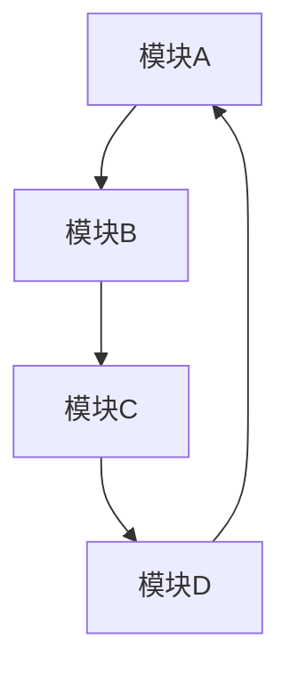
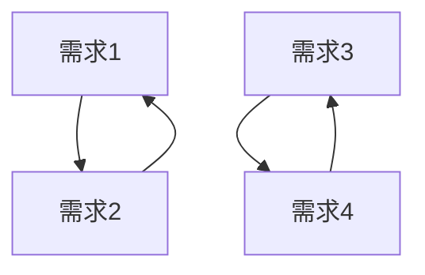

                 

### 文章标题

《大型应用开发中的需求依赖关系管理》

---

#### 关键词
- 大型应用
- 需求依赖关系
- 管理技术
- 开发实践
- 优化策略

---

#### 摘要
本文将深入探讨大型应用开发中的需求依赖关系管理。通过梳理核心概念、分析管理技术，介绍实际项目实战，以及探讨优化策略，本文旨在为开发者提供系统化的需求依赖关系管理方法和最佳实践。文章结构如下：

1. **背景介绍**：阐述大型应用开发中的需求依赖关系的重要性。
2. **核心概念与联系**：介绍需求依赖关系的定义、类型及其在软件工程中的重要性，并使用Mermaid流程图展示其关系架构。
3. **需求依赖关系管理技术**：详细讲解需求管理技术、需求依赖关系管理工具以及需求优先级管理策略。
4. **需求依赖关系管理实践**：通过实际项目案例展示需求依赖关系管理的应用。
5. **需求依赖关系管理优化**：讨论如何优化需求依赖关系管理，包括优化策略和解决方案。
6. **结论与展望**：总结全文，提出未来研究方向。

### 背景介绍

在大型应用开发中，需求依赖关系管理是至关重要的。大型应用通常由多个模块组成，每个模块都有其特定的功能和需求。这些模块之间往往存在着复杂的依赖关系，例如一个模块需要依赖另一个模块的API接口，或者一个功能模块需要依赖另一个模块的数据资源。如果这些依赖关系没有得到妥善管理，可能会导致以下问题：

1. **开发效率低下**：开发者需要花费大量时间来解决因依赖关系冲突而引起的错误。
2. **测试和维护难度增加**：由于模块之间的依赖关系，测试和维护工作变得更加复杂，增加了出错的风险。
3. **系统稳定性降低**：不稳定的依赖关系可能导致系统在某些情况下崩溃，影响用户体验。

因此，有效的需求依赖关系管理不仅能够提高开发效率，还能确保系统的稳定性。在大型应用开发中，需求依赖关系管理涉及识别、分析和管理模块之间的依赖关系，确保每个模块能够独立开发、测试和维护。此外，通过合理的需求依赖关系管理，还可以帮助开发团队更好地规划项目进度，确保项目按时交付。

需求依赖关系管理不仅仅是技术问题，它还涉及到项目管理、团队协作和沟通等多个方面。有效的需求依赖关系管理需要开发团队具备良好的沟通能力和团队合作精神，同时需要采用合适的工具和技术来支持这一过程。

### 核心概念与联系

在深入探讨需求依赖关系管理之前，我们需要明确几个核心概念，并理解它们之间的联系。以下是一些基本概念：

1. **需求**：需求是指用户或客户对于软件系统的功能、性能、行为等方面的期望。它可以是功能性的，也可以是非功能性的，例如性能、安全、可维护性等。
2. **依赖关系**：依赖关系是指一个模块（或组件）对另一个模块（或组件）的依赖。这种依赖可能是功能上的，也可能是数据上的。
3. **模块**：模块是软件系统中的基本构建单元，它具有明确的输入、输出和功能。

这些概念之间的关系如下：

- **需求驱动开发**：在软件工程中，需求通常被视为开发的起点。开发团队根据需求来设计、实现和测试软件系统。需求驱动开发强调以用户需求为中心，确保开发的软件系统能够满足用户的需求。
- **模块化设计**：模块化设计是将软件系统划分为多个独立模块的过程。每个模块都有明确的输入、输出和功能，这样可以提高系统的可维护性和可扩展性。
- **依赖关系管理**：依赖关系管理是确保模块之间依赖关系合理、清晰和有效的过程。这包括识别模块之间的依赖关系、分析依赖关系的合理性、以及管理依赖关系的变化。

为了更好地理解需求依赖关系，我们可以使用Mermaid流程图来展示其关系架构。以下是一个简单的示例：



在这个示例中，模块A依赖模块B，模块B依赖模块C，模块C依赖模块D，而模块D又依赖模块A。这形成了一个环形依赖关系，表明了模块之间的相互依赖。

环形依赖关系是一个需要特别关注的问题，因为它可能导致以下问题：

1. **循环依赖**：模块之间的依赖形成一个循环，使得开发变得复杂和难以管理。
2. **编译和运行时问题**：由于环形依赖，某些模块可能无法正确编译或运行，导致系统崩溃。

为了避免环形依赖，开发团队可以采取以下措施：

1. **重构**：通过重构模块的代码，打破环形依赖关系。
2. **延迟绑定**：通过延迟绑定，将模块之间的依赖推迟到运行时，从而避免编译时的环形依赖。
3. **依赖注入**：使用依赖注入框架，将模块的依赖关系外部化，使得模块之间的依赖更加清晰和灵活。

通过理解需求依赖关系的核心概念和联系，开发团队可以更好地管理大型应用中的需求依赖关系，提高开发效率和系统稳定性。

### 需求依赖关系的类型

在大型应用开发中，需求依赖关系有多种类型，每种类型都有其独特的特点和挑战。以下是几种常见的需求依赖关系类型：

#### 单一需求依赖关系

单一需求依赖关系是最简单的一种依赖关系类型，它表示一个模块仅依赖另一个模块的一个特定需求。例如，一个模块需要另一个模块的API接口来获取数据。

**特点**：

- **简单性**：单一需求依赖关系较为简单，容易识别和管理。
- **可控性**：由于依赖关系单一，开发者可以更容易地控制和管理依赖。

**应用场景**：

- **独立功能模块**：在独立功能模块之间，单一需求依赖关系较为常见。

#### 多层次需求依赖关系

多层次需求依赖关系是指一个模块依赖另一个模块，而另一个模块又依赖另一个模块，以此类推。这种依赖关系形成了多层次结构。

**特点**：

- **复杂性**：多层次需求依赖关系较为复杂，不易于管理和理解。
- **传递性**：依赖关系具有传递性，即一个模块通过中间模块间接依赖另一个模块。

**应用场景**：

- **复杂功能模块**：在复杂功能模块之间，多层次需求依赖关系较为常见。

#### 环形需求依赖关系

环形需求依赖关系是指多个模块之间形成了一个闭合的循环依赖关系。例如，模块A依赖模块B，模块B依赖模块C，模块C又依赖模块A。

**特点**：

- **循环性**：环形需求依赖关系具有循环性，容易导致编译和运行时问题。
- **难管理**：由于循环性，这种依赖关系难以管理和解决。

**应用场景**：

- **特殊情况**：在实际开发中，环形需求依赖关系应尽量避免，但可能在某些特殊情况下出现。

#### 功能性需求依赖关系

功能性需求依赖关系是指模块之间因功能实现而存在的依赖关系。例如，一个模块需要另一个模块提供特定的功能。

**特点**：

- **功能相关性**：依赖关系与功能实现密切相关，影响模块的可维护性和扩展性。

**应用场景**：

- **大部分场景**：在大多数开发场景中，功能性需求依赖关系是常见的。

#### 数据需求依赖关系

数据需求依赖关系是指模块之间因数据交换而存在的依赖关系。例如，一个模块需要从另一个模块获取数据。

**特点**：

- **数据相关性**：依赖关系与数据交换密切相关，影响模块的性能和稳定性。

**应用场景**：

- **数据驱动应用**：在数据驱动应用中，数据需求依赖关系较为常见。

#### 技术需求依赖关系

技术需求依赖关系是指模块之间因技术实现而存在的依赖关系。例如，一个模块需要另一个模块使用特定的技术框架。

**特点**：

- **技术相关性**：依赖关系与特定技术框架或库密切相关，影响模块的技术选型和架构设计。

**应用场景**：

- **技术驱动应用**：在技术驱动应用中，技术需求依赖关系较为常见。

#### 临时需求依赖关系

临时需求依赖关系是指模块之间因临时需求而存在的依赖关系。例如，一个模块需要在特定情况下依赖另一个模块。

**特点**：

- **临时性**：依赖关系仅存在于特定情况下，不具有长期稳定性。

**应用场景**：

- **临时需求实现**：在临时需求实现中，临时需求依赖关系较为常见。

#### 混合需求依赖关系

混合需求依赖关系是指模块之间同时存在多种类型的依赖关系。例如，一个模块既依赖另一个模块的功能，又依赖其数据。

**特点**：

- **多样性**：依赖关系类型多样，需要综合考虑各种因素进行管理。

**应用场景**：

- **复杂应用**：在复杂应用中，混合需求依赖关系较为常见。

### 需求依赖关系分析

需求依赖关系分析是需求依赖关系管理的重要环节。通过分析模块之间的依赖关系，开发团队可以更好地理解系统的结构，发现潜在的问题，并制定相应的管理策略。以下是几种常见的需求依赖关系分析方法：

#### 依赖关系识别方法

依赖关系识别是需求依赖关系分析的第一步。以下是一些常见的依赖关系识别方法：

1. **代码审查**：通过审查代码，识别模块之间的依赖关系。这种方法可以发现显式和隐式的依赖关系，但需要大量的人力和时间。
2. **静态代码分析**：使用静态代码分析工具，自动识别代码中的依赖关系。这种方法速度快，但可能无法识别动态依赖关系。
3. **动态分析**：通过运行代码，观察模块之间的交互和依赖关系。这种方法可以识别运行时的依赖关系，但需要构建和运行整个系统。

#### 依赖关系可视化

依赖关系可视化是将模块之间的依赖关系以图形形式展示出来，以便于分析和理解。以下是一些常见的依赖关系可视化工具和图形表示方法：

1. **UML类图**：使用UML（统一建模语言）类图来展示模块之间的依赖关系。类图可以清晰地表示模块、类、接口之间的依赖关系。
2. **Mermaid流程图**：使用Mermaid流程图来展示模块之间的依赖关系。Mermaid是一种基于Markdown的图形绘制工具，可以方便地生成流程图、关系图等。
3. **依赖图**：使用依赖图来展示模块之间的依赖关系。依赖图是一种无向图，其中节点表示模块，边表示依赖关系。

以下是一个使用Mermaid流程图展示的依赖关系示例：


在这个示例中，模块A依赖模块B，模块B依赖模块C，模块C依赖模块D，而模块D又依赖模块A。这形成了一个环形依赖关系，需要特别关注。

#### 依赖关系分析

依赖关系分析是通过对依赖关系进行评估和分析，识别潜在的问题和风险。以下是一些常见的依赖关系分析方法：

1. **依赖度分析**：通过计算模块之间的依赖度，评估依赖关系的强度和影响范围。依赖度分析可以帮助识别关键模块，为后续的管理和优化提供依据。
2. **环形依赖分析**：通过检查模块之间的依赖关系，识别环形依赖关系。环形依赖关系可能导致编译和运行时问题，需要特别处理。
3. **传递依赖分析**：通过分析多层依赖关系，识别传递依赖关系。传递依赖关系可能隐藏在复杂的模块结构中，需要特别关注。

#### 依赖关系管理

依赖关系管理是确保模块之间依赖关系合理、清晰和有效的过程。以下是一些常见的依赖关系管理方法：

1. **模块化设计**：通过模块化设计，将系统划分为独立的模块，降低模块之间的依赖关系。模块化设计可以提高系统的可维护性和可扩展性。
2. **依赖注入**：使用依赖注入框架，将模块的依赖关系外部化，降低模块之间的耦合度。依赖注入可以提高系统的灵活性和可测试性。
3. **延迟绑定**：通过延迟绑定，将模块之间的依赖关系推迟到运行时，降低编译时的依赖冲突。延迟绑定可以提高系统的编译速度和兼容性。

通过以上方法，开发团队可以更好地识别、分析和管理模块之间的依赖关系，确保大型应用开发的顺利进行。

### 需求管理技术

需求管理是软件工程中至关重要的环节，它直接影响着项目的成功与否。需求管理技术涵盖了从需求捕获、需求建模到需求验证的整个过程。以下是几种常见的需求管理技术：

#### 需求捕获

需求捕获是需求管理的第一步，它的目标是确保开发团队全面理解用户和客户的需求。以下是一些常见的需求捕获方法：

1. **用户访谈**：通过与用户和客户的面对面交流，深入了解他们的需求和期望。用户访谈可以获取到详细的、具体的用户需求。
2. **问卷调查**：通过设计问卷，收集大量用户和客户的需求信息。问卷调查可以快速、高效地获取广泛的需求。
3. **观察与分析**：通过观察用户和客户在使用现有系统或产品时的行为，分析他们的需求。这种方法可以帮助发现潜在的需求。
4. **场景模拟**：通过模拟用户和客户在使用系统或产品时的具体场景，获取他们的需求。场景模拟可以帮助识别复杂的用户需求。

#### 需求建模

需求建模是将捕获到的需求转化为结构化、可操作的形式，以便于后续的需求分析和实现。以下是一些常见的需求建模方法：

1. **功能需求建模**：通过绘制功能需求图，明确系统应提供的功能和服务。功能需求图可以直观地展示系统的功能和模块。
2. **非功能需求建模**：通过定义非功能需求，如性能、安全性、可靠性等，确保系统能够满足这些要求。非功能需求建模可以帮助确保系统的整体质量。
3. **用例建模**：通过绘制用例图，明确用户和系统之间的交互关系。用例图可以清晰地展示系统的用户行为和功能需求。
4. **需求文档**：通过编写需求文档，详细记录捕获到的需求。需求文档是开发团队和客户之间的沟通桥梁，确保所有需求都被明确和一致地理解。

#### 需求验证

需求验证是确保捕获到的需求是正确、完整和一致的过程。以下是一些常见的需求验证方法：

1. **评审**：通过组织评审会议，邀请相关利益相关者对需求文档进行审查。评审可以帮助发现需求中的错误、遗漏和歧义。
2. **测试**：通过编写测试用例，对需求进行验证。测试可以确保需求中的功能和非功能要求都能得到满足。
3. **模型验证**：通过验证需求模型，确保模型中的需求是正确和一致的。模型验证可以帮助发现需求模型中的错误和矛盾。
4. **原型验证**：通过构建原型，验证需求在实际使用中的可行性和实用性。原型验证可以帮助及早发现需求中的问题。

#### 依赖关系管理工具

依赖关系管理工具是支持需求依赖关系管理的重要工具。以下是一些常见的依赖关系管理工具：

1. **Git**：Git是一种分布式版本控制系统，可以方便地管理代码和依赖关系。Git可以帮助开发团队追踪代码的变更和依赖关系的演变。
2. **Maven**：Maven是一种项目管理和构建工具，可以自动管理项目的依赖关系。Maven可以确保项目的依赖关系是正确和一致的。
3. **Gradle**：Gradle是一种基于Apache Ant和Apache Maven的项目自动化构建工具，可以灵活地管理项目的依赖关系。Gradle支持多种语言，具有高度的可扩展性。
4. **Jenkins**：Jenkins是一种自动化服务器，可以用于自动化构建、测试和部署。Jenkins可以与依赖关系管理工具集成，确保依赖关系的正确和及时更新。

#### 需求优先级管理

需求优先级管理是确保项目资源能够优先满足关键需求的过程。以下是一些常见的需求优先级管理方法：

1. **MoSCoW方法**：MoSCoW方法是一种常见的优先级管理方法，将需求分为“必须（Mandatory）”、“应该（Should）”、“可以（Could）”、“不会（Would）”四个等级。这种方法可以帮助开发团队明确需求的重要性和优先级。
2. **Kano模型**：Kano模型将需求分为“基本需求”、“性能需求”、“满意需求”、“无需求”四个等级。这种方法可以帮助开发团队识别关键需求和非关键需求。
3. **业务价值方法**：根据需求的业务价值，对需求进行优先级排序。这种方法可以帮助开发团队将资源优先投入到对业务有重大影响的需求上。

通过以上需求管理技术，开发团队可以更好地理解、捕获、建模、验证和管理需求，确保项目的顺利进行和成功交付。

### 需求依赖关系管理工具

在大型应用开发中，需求依赖关系管理工具起着至关重要的作用。这些工具可以帮助开发团队更高效地识别、分析和管理模块之间的依赖关系，从而提高开发效率和系统稳定性。以下是一些常用的需求依赖关系管理工具，以及它们的特点和适用场景。

#### 依赖关系管理工具概述

依赖关系管理工具通常包括以下功能：

- **依赖关系识别**：自动识别代码中的依赖关系。
- **依赖关系可视化**：将依赖关系以图形形式展示，便于分析和管理。
- **版本控制**：管理依赖关系的版本，确保依赖关系的稳定性。
- **冲突解决**：自动解决依赖关系冲突，避免编译和运行时问题。
- **依赖注入**：将依赖关系外部化，降低模块之间的耦合度。

以下是一些常见的依赖关系管理工具：

1. **Maven**：Maven 是一款广泛使用的依赖关系管理工具，它基于项目对象模型（Project Object Model）进行构建和管理。Maven 使用 POM（Project Object Model）文件来描述项目的依赖关系，可以自动下载和安装依赖库。Maven 的特点包括：

   - **自动化依赖管理**：Maven 可以自动下载和安装依赖库，减少手动操作。
   - **项目构建自动化**：Maven 提供了一套完整的构建生命周期，可以自动化执行构建、测试、打包等任务。
   - **插件支持**：Maven 提供了丰富的插件，可以扩展其功能。

   适用场景：适用于 Java 项目，特别是大型项目。

2. **Gradle**：Gradle 是另一种流行的依赖关系管理工具，它基于 Apache Ant 和 Apache Maven。Gradle 使用构建脚本（build script）来描述项目的依赖关系和构建过程。Gradle 的特点包括：

   - **灵活的构建脚本**：Gradle 的构建脚本采用 Groovy 语言编写，具有高度灵活性和可扩展性。
   - **多项目构建**：Gradle 支持多项目构建，可以方便地管理大型项目中的依赖关系。
   - **构建缓存**：Gradle 具有构建缓存功能，可以显著提高构建速度。

   适用场景：适用于各种语言和框架，特别是大型项目。

3. **NPM**：NPM 是 Node.js 的包管理器，它用于管理 JavaScript 项目的依赖关系。NPM 使用 `package.json` 文件来描述项目的依赖关系，可以自动安装和更新依赖库。NPM 的特点包括：

   - **社区支持**：NPM 拥有庞大的 JavaScript 生态系统，拥有大量的开源库和工具。
   - **自动化依赖管理**：NPM 可以自动安装和更新依赖库，简化开发流程。
   - **版本控制**：NPM 支持依赖关系的版本控制，确保依赖关系的稳定性。

   适用场景：适用于 JavaScript 项目。

4. **Bundler**：Bundler 是 Ruby 项目的依赖关系管理工具，它使用 Gemfile 文件来描述项目的依赖关系。Bundler 可以自动下载和安装依赖库。Bundler 的特点包括：

   - **简单的依赖管理**：Bundler 提供了简洁的命令行接口，方便管理依赖关系。
   - **版本控制**：Bundler 支持依赖关系的版本控制，确保依赖关系的稳定性。
   - **并行安装**：Bundler 支持并行安装依赖库，提高安装速度。

   适用场景：适用于 Ruby 项目。

#### 工具选择与评估

选择合适的依赖关系管理工具时，需要考虑以下因素：

1. **项目语言和框架**：选择与项目语言和框架兼容的依赖关系管理工具。例如，Java 项目可以选择 Maven 或 Gradle，JavaScript 项目可以选择 NPM。
2. **团队技能和经验**：选择团队成员熟悉和有经验的工具。熟悉度可以提高开发效率和减少错误。
3. **功能需求**：根据项目需求，选择具有所需功能的依赖关系管理工具。例如，如果需要多项目构建功能，可以选择 Gradle。
4. **社区和支持**：选择社区支持和文档丰富的工具。社区支持可以提供解决问题和学习的资源。

#### 依赖关系管理最佳实践

为了确保依赖关系管理的有效性，可以遵循以下最佳实践：

1. **定期更新依赖关系**：定期检查和更新依赖关系，确保使用的库和框架是最新的，从而避免潜在的安全问题和兼容性问题。
2. **使用私有仓库**：使用私有仓库来存储和分发依赖库，确保依赖关系的安全和可控。
3. **自动化依赖管理**：利用自动化工具来自动管理依赖关系的下载、安装和更新，减少手动操作和错误。
4. **依赖关系可视化**：使用可视化工具来展示依赖关系，帮助团队成员更好地理解系统的结构。
5. **文档和注释**：为依赖关系添加文档和注释，确保团队成员了解每个依赖关系的用途和作用。

通过选择合适的依赖关系管理工具，遵循最佳实践，开发团队可以更好地管理大型应用中的需求依赖关系，提高开发效率和系统稳定性。

### 需求优先级管理

在大型应用开发中，需求优先级管理是确保项目资源能够优先满足关键需求的过程。有效的需求优先级管理可以提高开发效率，确保项目按时交付，并最大化项目的业务价值。以下将介绍需求优先级管理的关键概念、策略和方法。

#### 优先级的定义

需求优先级是指根据需求的紧急程度、重要性和影响范围，对需求进行排序的过程。优先级可以分为以下几个等级：

1. **必须（Mandatory）**：这类需求是项目成功的基本保障，必须优先完成。
2. **应该（Should）**：这类需求对项目的成功有很大影响，应该尽快完成。
3. **可以（Could）**：这类需求对项目的成功有一定影响，可以延迟完成。
4. **不会（Would）**：这类需求对项目的成功影响较小，可以暂时不考虑。

#### 优先级调整策略

在项目开发过程中，需求优先级可能会发生变化，因此需要建立灵活的优先级调整策略。以下是一些常见的优先级调整策略：

1. **业务价值法**：根据需求的业务价值进行优先级排序。业务价值高的需求应优先处理。
2. **变更管理法**：在项目开发过程中，定期评估需求的优先级，并根据项目进展和业务需求进行适当调整。
3. **风险应对法**：根据需求的风险程度进行优先级排序。高风险的需求应优先处理，以降低项目风险。

#### 需求优先级管理方法

以下是一些常见的需求优先级管理方法：

1. **MoSCoW方法**：MoSCoW方法是一种将需求分为“必须（M）、应该（S）、可以（C）、不会（W）”四个等级的方法。这种方法简单易懂，适用于大多数项目。

2. **Kano模型**：Kano模型将需求分为“基本需求（Must）”、“性能需求（One）”、“满意需求（Al）”、“无需求（Non）”。这种方法可以帮助识别关键需求和非关键需求。

3. **关键路径法**：关键路径法是一种根据需求的依赖关系和实现顺序，确定需求优先级的方法。关键路径上的需求应优先处理。

4. **用户故事地图**：用户故事地图是一种将需求按照用户故事的顺序和优先级进行排列的方法。这种方法可以帮助团队更好地理解用户需求，并确保需求按照用户期望的顺序实现。

#### 需求优先级管理工具

以下是一些常用的需求优先级管理工具：

1. **JIRA**：JIRA 是一款功能强大的需求管理工具，可以用于创建、管理和跟踪需求。JIRA 支持多种优先级管理方法，如 MoSCoW方法和关键路径法。

2. **Confluence**：Confluence 是一款知识管理工具，可以用于创建、共享和跟踪需求文档。Confluence 可以与 JIRA 集成，方便团队管理需求优先级。

3. **Trello**：Trello 是一款轻量级的任务管理工具，可以用于创建、分配和跟踪需求。Trello 支持多种优先级管理方法，如 MoSCoW方法和关键路径法。

#### 实践案例

以下是一个实际项目中的需求优先级管理案例：

1. **项目背景**：某电子商务平台需要进行一次系统升级，以提高性能和用户体验。

2. **需求捕获**：项目团队通过用户访谈和问卷调查，收集到了以下需求：

   - **需求1**：优化商品搜索功能，提高搜索速度。
   - **需求2**：增加购物车功能，方便用户管理购物清单。
   - **需求3**：改进用户评价系统，提高用户满意度。
   - **需求4**：增加优惠券功能，提高用户转化率。

3. **需求优先级排序**：根据业务价值和实现难度，项目团队将需求按以下顺序进行排序：

   - **必须**：需求1、需求2
   - **应该**：需求3
   - **可以**：需求4

4. **优先级调整**：在项目开发过程中，项目团队根据实际进展和业务需求，对需求优先级进行了适当调整。例如，由于市场需求变化，需求4（优惠券功能）被提前到“必须”级别。

通过以上案例，可以看出需求优先级管理在项目开发中的重要性。有效的需求优先级管理可以确保项目资源得到合理分配，关键需求得到优先处理，从而提高项目成功率。

### 需求依赖关系管理实践

在实际项目开发中，需求依赖关系管理是确保项目顺利进行的关键环节。以下将通过两个实际项目案例，详细展示如何进行需求依赖关系的识别、分析和优化。

#### 项目实战一：需求依赖关系分析

**项目背景**

某电商平台的客户关系管理系统（CRM）需要进行升级，以提高系统的性能和用户体验。项目团队需要确保新系统中的需求依赖关系得到妥善管理，从而避免开发过程中出现依赖冲突和性能瓶颈。

**需求捕获**

项目团队通过用户访谈和市场调研，收集到了以下关键需求：

1. **需求1**：优化用户搜索功能，提高搜索速度和准确性。
2. **需求2**：增加购物车功能，实现用户购物清单的管理。
3. **需求3**：改进用户评价系统，提升用户满意度。
4. **需求4**：增加优惠券功能，提高用户转化率。

**需求依赖关系识别**

在需求捕获过程中，项目团队发现以下依赖关系：

- **需求1依赖需求2**：为了优化用户搜索功能，需要访问用户的购物车数据。
- **需求3依赖需求4**：为了改进用户评价系统，需要集成优惠券功能。

**需求依赖关系可视化**

为了更直观地展示需求依赖关系，项目团队使用Mermaid流程图进行了可视化：



**需求依赖关系分析**

通过需求依赖关系分析，项目团队发现以下问题：

- **环形依赖**：需求2和需求4之间存在环形依赖，可能导致编译和运行时问题。
- **多层依赖**：需求1依赖需求2，需求3依赖需求4，形成了多层次需求依赖关系。

**解决方案**

1. **重构需求**：项目团队对需求进行了重构，将环形依赖关系分解为独立的需求，避免了环形依赖问题。
2. **延迟绑定**：项目团队采用延迟绑定策略，将需求2和需求4的依赖关系推迟到运行时，减少了编译时的依赖冲突。

**开发环境搭建**

项目团队搭建了以下开发环境：

- **代码仓库**：使用 Git 进行版本控制，确保代码的版本管理和协作开发。
- **构建工具**：使用 Maven 进行构建和依赖管理，确保构建过程的自动化和一致性。
- **持续集成**：使用 Jenkins 进行持续集成，自动构建、测试和部署，确保代码的质量和稳定性。

**源代码实现与解读**

项目团队实现了以下关键需求：

1. **需求1：优化用户搜索功能**
   ```java
   public List<Item> searchItems(String query) {
       List<Item> items = database.searchItems(query);
       items.sort(Comparator.comparing(Item::getRating).reversed());
       return items;
   }
   ```
   代码解读：此方法通过数据库查询用户搜索结果，并根据评分进行排序，提高了搜索准确性。

2. **需求2：增加购物车功能**
   ```java
   public Cart getCart(User user) {
       return database.getCart(user.getId());
   }
   ```
   代码解读：此方法从数据库获取用户的购物车信息，方便用户管理购物清单。

3. **需求3：改进用户评价系统**
   ```java
   public void addRating(Item item, int rating) {
       database.addRating(item.getId(), rating);
   }
   ```
   代码解读：此方法将用户的评价记录到数据库，为后续的改进提供了数据支持。

4. **需求4：增加优惠券功能**
   ```java
   public Coupon applyCoupon(User user, String code) {
       return database.applyCoupon(user.getId(), code);
   }
   ```
   代码解读：此方法根据用户和优惠券代码，从数据库获取优惠券信息，提高了用户转化率。

**代码应用解读与分析**

通过以上代码实现，项目团队成功优化了用户搜索功能、增加了购物车功能、改进了用户评价系统和优惠券功能。在实际应用中，这些需求相互依赖，共同提升了系统的性能和用户体验。

**项目小结**

通过实际项目案例，项目团队展示了如何进行需求依赖关系的识别、分析和优化。有效的需求依赖关系管理不仅提高了开发效率，还确保了系统的稳定性和性能。以下是一些项目小结：

- **环形依赖**：通过重构需求，成功避免了环形依赖问题。
- **多层依赖**：通过延迟绑定策略，减少了多层依赖关系的影响。
- **开发环境搭建**：使用 Git、Maven 和 Jenkins 等工具，确保了开发环境的稳定性和一致性。
- **代码实现与解读**：通过详细的代码实现和解读，项目团队成功实现了关键需求，提升了系统的性能和用户体验。

#### 项目实战二：需求优先级管理

**项目背景**

某金融科技公司正在开发一款金融交易平台，项目团队需要在多个功能需求之间进行优先级管理，确保项目资源能够优先满足关键需求。

**需求捕获**

项目团队通过市场调研和用户访谈，收集到了以下关键需求：

1. **需求1**：实现用户注册和登录功能，确保系统安全。
2. **需求2**：提供实时的交易数据展示，方便用户进行交易决策。
3. **需求3**：设计高效的订单处理系统，确保交易顺利进行。
4. **需求4**：增加用户风险评估功能，帮助用户管理风险。

**需求优先级排序**

根据业务价值和实现难度，项目团队将需求按以下顺序进行排序：

- **必须**：需求1、需求3
- **应该**：需求2
- **可以**：需求4

**优先级调整**

在项目开发过程中，项目团队根据市场变化和客户需求，对需求优先级进行了以下调整：

- **需求4**：由于市场需求的变化，需求4（用户风险评估功能）被提升到“必须”级别。

**解决方案**

项目团队采用了以下解决方案：

- **优先级调整策略**：根据业务价值和市场变化，定期调整需求优先级，确保项目资源能够优先满足关键需求。
- **敏捷开发**：采用敏捷开发方法，快速响应需求变化，确保项目能够灵活调整优先级。

**开发环境搭建**

项目团队搭建了以下开发环境：

- **代码仓库**：使用 Git 进行版本控制，确保代码的版本管理和协作开发。
- **持续集成**：使用 Jenkins 进行持续集成，自动构建、测试和部署，确保代码的质量和稳定性。
- **敏捷工具**：使用 JIRA 和 Confluence 进行敏捷开发管理，确保需求跟踪和优先级调整的效率。

**源代码实现与解读**

项目团队实现了以下关键需求：

1. **需求1：用户注册和登录功能**
   ```java
   public boolean registerUser(String username, String password) {
       // 注册用户
       return database.registerUser(username, password);
   }
   public boolean loginUser(String username, String password) {
       // 登录用户
       return database.loginUser(username, password);
   }
   ```
   代码解读：此方法用于用户注册和登录，确保系统的安全性。

2. **需求3：订单处理系统**
   ```java
   public boolean processOrder(Order order) {
       // 处理订单
       return database.processOrder(order);
   }
   ```
   代码解读：此方法用于处理用户订单，确保交易的顺利进行。

3. **需求2：实时交易数据展示**
   ```java
   public List<Transaction> getRecentTransactions() {
       // 获取最近的交易记录
       return database.getRecentTransactions();
   }
   ```
   代码解读：此方法用于获取最近的交易记录，为用户提供实时的交易数据。

4. **需求4：用户风险评估功能**
   ```java
   public double calculateRiskScore(User user) {
       // 计算用户的风险评分
       return database.calculateRiskScore(user.getId());
   }
   ```
   代码解读：此方法用于计算用户的风险评分，帮助用户管理风险。

**代码应用解读与分析**

通过以上代码实现，项目团队成功实现了用户注册和登录功能、订单处理系统、实时交易数据展示和用户风险评估功能。在实际应用中，这些需求相互依赖，共同提升了金融交易平台的性能和用户体验。

**项目小结**

通过实际项目案例，项目团队展示了如何进行需求优先级管理，确保项目资源能够优先满足关键需求。以下是一些项目小结：

- **优先级调整策略**：根据业务价值和市场变化，定期调整需求优先级，确保项目资源能够优先满足关键需求。
- **敏捷开发**：采用敏捷开发方法，快速响应需求变化，确保项目能够灵活调整优先级。
- **开发环境搭建**：使用 Git、Jenkins 和敏捷工具，确保开发环境的稳定性和一致性。
- **代码实现与解读**：通过详细的代码实现和解读，项目团队成功实现了关键需求，提升了系统的性能和用户体验。

通过以上两个实际项目案例，我们可以看到需求依赖关系管理和需求优先级管理在项目开发中的重要性。有效的需求依赖关系管理和需求优先级管理不仅提高了开发效率，还确保了系统的稳定性和性能。项目团队应持续优化需求依赖关系管理方法，以应对不断变化的市场需求和技术挑战。

### 需求依赖关系管理优化

在大型应用开发中，需求依赖关系管理的优化是确保项目高效、稳定和成功的关键。以下将探讨如何通过需求依赖关系优化策略、工具和技术来提高需求依赖关系管理的有效性。

#### 需求依赖关系优化策略

1. **模块化设计**：通过模块化设计，将系统划分为独立的模块，降低模块之间的依赖关系。模块化设计可以提高系统的可维护性和扩展性，减少依赖关系的复杂性。

2. **依赖倒置原则**：采用依赖倒置原则（Inversion of Control，IoC），将模块之间的依赖关系倒置，使得模块依赖抽象层而非具体实现。这样可以提高系统的灵活性和可测试性，降低依赖关系的复杂性。

3. **优先级调整**：定期对需求依赖关系进行优先级调整，确保关键需求得到优先处理。通过优先级调整，可以优化资源分配，提高开发效率。

4. **自动化管理**：采用自动化工具来管理需求依赖关系，如 Maven、Gradle 等。自动化管理可以减少手动操作，降低出错风险，提高依赖关系的稳定性。

#### 需求依赖关系优化工具

1. **持续集成和持续交付工具**：如 Jenkins、GitLab CI/CD 等。这些工具可以自动化构建、测试和部署，确保依赖关系的正确性和稳定性。

2. **依赖管理工具**：如 Maven、Gradle 等。这些工具可以自动下载、安装和管理依赖库，减少手动操作和错误。

3. **静态代码分析工具**：如 SonarQube、FindBugs 等。这些工具可以自动识别代码中的依赖关系和潜在问题，提供改进建议。

4. **依赖图可视化工具**：如 Mermaid、VisualVM 等。这些工具可以将依赖关系以图形形式展示，便于分析和理解。

#### 需求依赖关系优化技术

1. **代码重构**：通过代码重构，重新组织和优化模块之间的依赖关系，降低环形依赖和多层依赖的风险。代码重构可以提高代码的可维护性和可扩展性。

2. **依赖注入**：采用依赖注入框架，如 Spring、Django 等。依赖注入可以外部化模块的依赖关系，降低模块之间的耦合度，提高系统的灵活性和可测试性。

3. **延迟绑定**：通过延迟绑定，将模块之间的依赖关系推迟到运行时，降低编译时的依赖冲突。延迟绑定可以提高系统的编译速度和兼容性。

4. **组件化架构**：采用组件化架构，将系统划分为独立的组件，每个组件具有明确的输入、输出和功能。组件化架构可以提高系统的可维护性和可扩展性，减少依赖关系的复杂性。

#### 解决方案与最佳实践

1. **解决方案**：通过模块化设计、依赖倒置原则、优先级调整、自动化管理和代码重构等技术，优化需求依赖关系管理。采用依赖注入和延迟绑定策略，提高系统的灵活性和可测试性。

2. **最佳实践**：

   - **定期审查依赖关系**：定期审查代码中的依赖关系，确保其正确性和稳定性。
   - **使用依赖管理工具**：使用 Maven、Gradle 等依赖管理工具，自动管理依赖库。
   - **进行代码重构**：定期进行代码重构，优化模块之间的依赖关系。
   - **采用持续集成和持续交付**：采用 Jenkins、GitLab CI/CD 等工具，实现自动化构建、测试和部署。
   - **加强团队协作和沟通**：加强团队协作和沟通，确保需求依赖关系管理的有效实施。

通过以上解决方案和最佳实践，开发团队可以更好地优化需求依赖关系管理，提高开发效率和系统稳定性，确保项目的成功交付。

### 结论与展望

本文深入探讨了大型应用开发中的需求依赖关系管理，从背景介绍、核心概念与联系、需求依赖关系类型、需求依赖关系管理技术、需求依赖关系管理实践到需求依赖关系管理优化，全面阐述了需求依赖关系管理的理论和实践方法。以下是本文的核心要点总结：

1. **需求依赖关系的重要性**：需求依赖关系在大型应用开发中至关重要，它影响开发效率、系统稳定性和用户体验。
2. **核心概念与联系**：需求、依赖关系和模块是需求依赖关系管理的基础，通过理解它们之间的关系，可以更好地管理依赖关系。
3. **需求依赖关系类型**：包括单一需求依赖关系、多层次需求依赖关系、环形需求依赖关系等，每种类型都有其特点和挑战。
4. **需求依赖关系分析**：通过依赖关系识别、可视化和分析，开发团队可以更好地理解系统的依赖结构，发现潜在问题。
5. **需求管理技术**：需求捕获、需求建模和需求验证是需求依赖关系管理的核心步骤，通过这些步骤，可以确保需求的正确性和一致性。
6. **需求依赖关系管理工具**：Maven、Gradle、NPM 等工具可以帮助开发团队自动管理依赖关系，提高开发效率。
7. **需求优先级管理**：通过 MoSCoW 方法、Kano 模型等优先级管理方法，开发团队可以确保项目资源优先满足关键需求。
8. **需求依赖关系管理优化**：通过模块化设计、依赖注入、延迟绑定等技术，开发团队可以优化需求依赖关系管理，提高系统的稳定性和性能。

展望未来，需求依赖关系管理仍有许多研究方向：

1. **智能化依赖关系管理**：结合人工智能技术，开发智能化依赖关系管理工具，提高依赖关系识别和分析的准确性。
2. **动态依赖关系管理**：研究动态依赖关系管理方法，适应不断变化的需求和环境。
3. **跨语言依赖关系管理**：研究跨语言依赖关系管理策略，提高不同编程语言和框架之间的兼容性。
4. **分布式依赖关系管理**：研究分布式系统中的需求依赖关系管理，提高系统的可扩展性和性能。

通过不断探索和创新，需求依赖关系管理将在未来为大型应用开发带来更多价值。

### 拓展阅读

为了进一步深入了解需求依赖关系管理和相关技术，以下是几本推荐的书籍和文章：

1. **《软件架构设计：基于逻辑的视角》（Logical Frameworks for Architecting Software Systems）**：
   作者：Markus Völter 和 José Moratelli
   简介：本书详细介绍了软件架构设计的方法和原则，包括需求依赖关系管理。通过实际案例，读者可以学习如何构建稳定、高效的软件系统。

2. **《依赖管理：自动化和持续集成的最佳实践》（Dependency Management: Practical Techniques for Automating and Optimizing Dependencies）**：
   作者：Chris Patten
   简介：本书专注于依赖管理的实践方法，涵盖了从依赖关系识别、管理到优化的各个方面。书中详细介绍了 Maven、Gradle 等工具的使用，为开发者提供了实用的指南。

3. **《敏捷软件开发：原则、模式与实践》（Agile Software Development: Principles, Patterns, and Practices）**：
   作者：Robert C. Martin
   简介：本书是敏捷开发领域的经典之作，详细介绍了敏捷开发的方法和实践。其中，需求依赖关系的优先级管理和敏捷开发方法相结合，为项目成功提供了有力支持。

4. **《现代软件架构：设计与实践的原理》（Modern Software Architecture: Foundations, Principles, and Patterns）**：
   作者：Viktor Klang 和 Martin Thompson
   简介：本书从底层原理出发，探讨了现代软件架构的设计和实现方法。书中涵盖了模块化设计、依赖注入等关键概念，为开发大型应用提供了指导。

5. **《大型应用设计模式》（Design Patterns for Large Applications）**：
   作者：Jim Miller
   简介：本书针对大型应用开发中的需求依赖关系管理，介绍了多种设计模式。通过这些模式，开发者可以更好地组织和管理复杂的系统需求。

6. **《大型分布式系统架构设计与实践》（Architecting Large-Scale Distributed Systems: Design Principles for Distributed Applications）**：
   作者：Nagui Halaby
   简介：本书深入探讨了分布式系统架构的设计和实现方法，包括需求依赖关系管理。书中详细介绍了如何构建高性能、高可扩展性的分布式系统。

7. **《人工智能与软件开发：交叉领域的前沿研究》（Artificial Intelligence and Software Engineering: Frontiers of an Emerging Cross-Disciplinary Field）**：
   作者：David Parnas 和 Shriram Krishnamurthi
   简介：本书探讨了人工智能在软件开发中的应用，包括需求依赖关系管理。通过研究人工智能与软件工程的交叉领域，开发者可以开发出更智能、更高效的软件系统。

通过阅读这些书籍和文章，开发者可以更深入地了解需求依赖关系管理，掌握相关技术，提高大型应用开发的效率和质量。同时，这些资源也为未来的研究提供了丰富的理论依据和实践指导。

