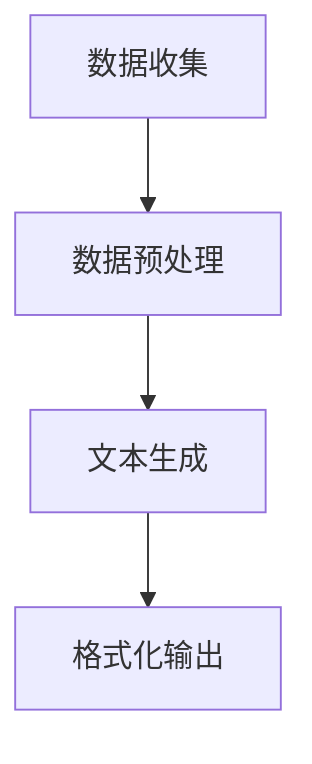
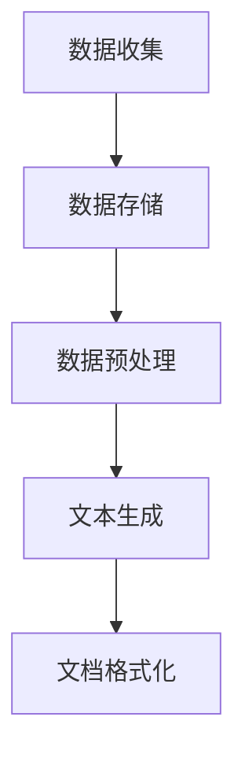
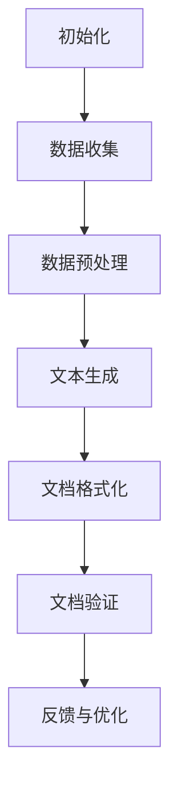

                 


### 第1章 引言

#### 1.1 自动化生成技术的定义与背景

自动化生成技术，顾名思义，是指通过计算机程序自动生成文本、图像、代码等数据的技术。在软件开发领域，自动化生成技术被广泛应用于需求文档的生成，这极大地提高了开发效率，减少了人为错误。需求文档作为软件开发过程中的重要一环，其准确性和一致性直接影响到项目的成功与否。

自动化生成技术的基本概念可以追溯到自然语言处理（NLP）、机器学习（ML）和生成对抗网络（GAN）等领域的算法。随着计算能力的提升和数据量的增加，这些算法在自动化生成中的应用越来越广泛。从早期简单的文本模板生成，到如今复杂的需求文档智能生成，自动化生成技术经历了显著的变革。

在软件开发过程中，需求文档是描述软件功能和行为的重要文件，它通常包括用户故事、功能需求、非功能需求等。传统上，这些需求文档通常由开发人员手动编写，这不仅耗时耗力，而且容易导致需求遗漏或错误。随着项目的复杂性增加，手动编写需求文档的难度也随之增大。因此，自动化生成技术的引入，无疑为解决这一问题提供了新的思路。

#### 1.2 自动化生成技术的应用场景

自动化生成技术在软件开发中的应用场景非常广泛。以下是几个典型的应用场景：

1. **需求文档生成**：通过分析用户需求，自动化生成详细的需求文档，确保需求的一致性和准确性。
2. **代码生成**：根据设计文档或需求文档，自动生成代码框架或部分代码，减少重复劳动。
3. **测试用例生成**：基于需求或代码，自动生成测试用例，提高测试覆盖率。
4. **文档生成**：包括用户手册、API文档等，通过自动化生成，确保文档与代码保持一致。

这些应用场景中，需求文档生成是自动化生成技术最直接、最常见的一个应用。在传统的软件开发过程中，需求文档通常由项目经理或业务分析师编写，然后由开发人员阅读并实现。然而，由于需求变化频繁，文档的更新和维护往往非常繁琐。而自动化生成技术可以通过智能分析用户需求，自动生成文档，从而提高开发效率。

#### 1.3 自动化生成技术的重要性

自动化生成技术的重要性体现在以下几个方面：

1. **提高开发效率**：通过自动化生成技术，可以大幅减少手动编写文档的时间，从而提高整体开发效率。
2. **确保需求文档的一致性和准确性**：自动化生成技术可以确保生成的文档与实际需求保持一致，减少人为错误。
3. **降低人力成本**：自动化生成技术可以减少对人工的依赖，降低人力成本。
4. **支持快速迭代**：在敏捷开发环境中，自动化生成技术可以帮助快速响应需求变化，支持持续交付。

总之，自动化生成技术在软件开发中的应用，不仅提高了开发效率，还保证了软件质量。随着技术的不断进步，自动化生成技术将在软件开发中发挥越来越重要的作用。

### 1.4 本书结构安排

本书共分为五个主要章节，具体内容安排如下：

- **第1章 引言**：介绍自动化生成技术的基本概念、发展背景和重要性。
- **第2章 核心概念与联系**：阐述需求文档、自动化生成技术的原理和架构，并使用Mermaid流程图展示。
- **第3章 核心算法原理讲解**：深入讲解自动化生成技术涉及的核心算法，使用伪代码进行说明。
- **第4章 数学模型和数学公式讲解**：介绍支持自动化生成的数学模型，包括公式和详细讲解。
- **第5章 项目实战**：通过实际项目案例展示自动化生成技术的应用，包括环境搭建、源代码实现和解读。

通过以上章节的安排，本书旨在全面系统地介绍自动化生成技术在需求文档生成中的应用，帮助读者掌握这一前沿技术。

### 第2章 核心概念与联系

#### 2.1 需求文档的概念

需求文档是软件开发过程中必不可少的一个环节，它详细描述了系统的功能需求、性能需求和用户界面等。需求文档的主要组成部分包括：

- **用户故事**：描述用户在使用系统时的具体场景和需求。
- **功能需求**：详细列出系统需要实现的功能点，通常以用户故事为基础。
- **非功能需求**：描述系统需要满足的约束条件，如性能、安全、可靠性等。
- **接口需求**：描述系统与外部系统或组件的交互接口，包括输入输出、数据格式等。

在需求文档的编写过程中，需要考虑以下关键点：

- **清晰性**：文档应简洁明了，避免模糊和歧义。
- **准确性**：文档应准确反映用户的需求和期望。
- **一致性**：文档中的信息应保持一致，避免前后矛盾。
- **可测试性**：需求应能转换为可测试的测试用例。

需求文档在软件开发中扮演着至关重要的角色。它是开发人员理解系统需求的基础，也是项目规划和实施的重要依据。良好的需求文档能够减少项目风险，提高开发效率，确保项目成功。

#### 2.2 自动化生成技术的原理

自动化生成技术的基本原理是通过计算机程序自动生成文本、图像、代码等数据。在需求文档的自动化生成中，自动化生成技术通常包括以下几个核心组件：

1. **数据收集**：收集用户需求信息，包括用户故事、功能需求、非功能需求和接口需求等。
2. **数据预处理**：对收集到的数据进行分析和清洗，提取有用的信息。
3. **文本生成**：利用自然语言处理（NLP）和机器学习（ML）算法，自动生成需求文档的文本内容。
4. **格式化输出**：将生成的文本内容按照特定的格式进行排版和输出，形成完整的文档。

自动化生成技术的核心组件之间的关系可以用以下流程图表示：



在这个流程图中，数据收集模块负责获取用户需求信息，数据预处理模块对收集到的数据进行清洗和加工，文本生成模块利用NLP和ML算法生成文档文本，最后格式化输出模块将生成的文本按照需求文档的格式进行排版和输出。

#### 2.3 自动化生成技术的架构

自动化生成技术的整体架构可以分为两个层次：数据流架构和流程架构。

1. **数据流架构**

数据流架构描述了自动化生成技术中数据的流动和处理过程。以下是数据流架构的详细描述：

- **数据收集**：通过问卷、访谈、用户故事地图等方式收集用户需求信息。
- **数据存储**：将收集到的用户需求信息存储在数据库或文件系统中，以便后续处理。
- **数据预处理**：对存储的用户需求信息进行清洗、分类、提取关键词等处理，为文本生成模块提供数据输入。
- **文本生成**：利用NLP和ML算法，根据预处理后的用户需求信息生成需求文档的文本内容。
- **文档格式化**：将生成的文本内容按照需求文档的格式进行排版和输出，生成最终的文档。

以下是数据流架构的Mermaid流程图：



2. **流程架构**

流程架构描述了自动化生成技术的整体处理流程。以下是流程架构的详细描述：

- **初始化**：启动自动化生成系统，准备初始化数据。
- **数据收集**：通过多种渠道收集用户需求信息，包括用户故事、功能需求、非功能需求和接口需求等。
- **数据预处理**：对收集到的用户需求信息进行清洗、分类、提取关键词等处理。
- **文本生成**：利用NLP和ML算法，根据预处理后的用户需求信息生成需求文档的文本内容。
- **文档格式化**：将生成的文本内容按照需求文档的格式进行排版和输出，生成最终的文档。
- **文档验证**：对生成的文档进行验证，确保文档内容准确、完整、一致。
- **反馈与优化**：根据文档验证的结果，对自动化生成系统进行优化和调整，以提高文档生成的质量和效率。

以下是流程架构的Mermaid流程图：



通过上述架构，自动化生成技术能够高效地处理用户需求信息，自动生成高质量的需求文档，为软件开发提供强有力的支持。

### 第3章 核心算法原理讲解

#### 3.1 自然语言处理算法

自然语言处理（NLP）是自动化生成技术的核心组成部分，它主要涉及文本的预处理、理解和生成。以下是几种常见的NLP算法及其在需求文档生成中的应用：

1. **词嵌入算法**（如Word2Vec）

词嵌入是将单词映射到高维向量空间的一种技术，它使得相似词在向量空间中彼此靠近。Word2Vec是最常用的词嵌入算法之一，它通过训练一个神经网络模型来学习词向量。

```pseudo
function Word2Vec(data):
    # 初始化模型参数
    model = initialize_model()
    # 训练词向量
    model = train_model(data, model)
    return model
```

在需求文档生成中，词嵌入算法可以帮助系统理解文本中的关键词和句子结构，从而生成更符合逻辑和语义的文档。

2. **语言模型**（如n-gram模型）

语言模型用于预测文本序列中的下一个词。n-gram模型是一种基于历史词序列的简单语言模型，它通过统计前n个词的概率来预测下一个词。

```pseudo
function NGramModel(data, n):
    # 构建n-gram模型
    model = build_n_gram_model(data, n)
    return model
```

n-gram模型在需求文档生成中可以用于生成符合语言习惯的文本，从而提高文档的流畅性和可读性。

3. **文本生成算法**（如RNN、LSTM）

RNN（递归神经网络）和LSTM（长短期记忆网络）是用于文本生成的常见神经网络模型。它们能够捕捉文本中的长距离依赖关系，从而生成连贯的文本。

```pseudo
function TextGenerator(model, seed, length):
    # 生成文本
    text = generate_text(model, seed, length)
    return text
```

在需求文档生成中，RNN和LSTM可以用于根据用户需求和关键词生成详细的功能描述和用户故事。

#### 3.2 机器学习算法

机器学习算法在自动化生成技术中起着关键作用，尤其是在需求文档的生成和验证过程中。以下是几种常见的机器学习算法及其在需求文档生成中的应用：

1. **决策树算法**（如ID3、C4.5）

决策树是一种常见的分类算法，它通过创建一棵树来对数据进行分类。ID3和C4.5是决策树的两种常用实现。

```pseudo
function ID3(data, attributes):
    # 创建决策树
    tree = build_tree(data, attributes)
    return tree
```

在需求文档生成中，决策树可以用于根据用户需求和场景自动生成相应的文档结构。

2. **支持向量机（SVM）**

SVM是一种强大的分类和回归算法，它通过寻找最佳分隔超平面来对数据进行分类。

```pseudo
function SVM(data, labels):
    # 训练SVM模型
    model = train_svm(data, labels)
    # 预测
    predictions = predict(model, data)
    return predictions
```

在需求文档生成中，SVM可以用于对生成的文档进行分类和评估，确保文档的准确性和一致性。

3. **神经网络**

神经网络是一种由多层神经元组成的模型，它能够通过学习输入和输出之间的映射关系来进行预测和分类。

```pseudo
function NeuralNetwork(data, labels):
    # 初始化模型参数
    model = initialize_model()
    # 训练模型
    model = train_network(model, data, labels)
    # 预测
    predictions = predict(model, data)
    return predictions
```

在需求文档生成中，神经网络可以用于自动生成文档的文本内容，并确保生成的文本符合语法和语义规则。

#### 3.3 生成对抗网络（GAN）

生成对抗网络（GAN）是一种由生成器和判别器组成的模型，它通过两个网络的对抗训练来生成高质量的数据。

1. **生成器**

生成器的目标是生成逼真的数据，它通常是一个神经网络，它接受随机噪声作为输入并生成数据。

```pseudo
function Generator(noise):
    # 生成数据
    data = generate_data(generator, noise)
    return data
```

在需求文档生成中，生成器可以用于根据用户需求和关键词生成初步的文档内容。

2. **判别器**

判别器的目标是区分生成器和真实数据之间的差异。它通过接收真实数据和生成器生成的数据来更新自己的参数。

```pseudo
function Discriminator(real_data, fake_data):
    # 更新判别器参数
    update_discriminator(discriminator, real_data, fake_data)
```

在需求文档生成中，判别器可以用于评估生成的文档是否符合用户需求，并通过对抗训练来优化生成器的性能。

通过结合NLP和机器学习算法，自动化生成技术能够高效地生成高质量的需求文档，从而提高软件开发过程中的效率和准确性。

### 第4章 数学模型和数学公式讲解

#### 4.1 支持向量机（SVM）的数学模型

支持向量机（SVM）是一种基于间隔最大化原则的线性分类模型。它的核心目标是找到一个最佳的超平面，使得数据点被正确分类，并且类别之间的间隔最大化。

1. **基本概念**

   - **超平面**：在特征空间中，将数据集分为两个类别的线性边界。
   - **间隔**：分类间隔是指到最近数据点的距离。
   - **支持向量**：位于超平面两侧的数据点，对超平面的确定有重要作用。

2. **优化目标**

   - **最大间隔**：寻找一个超平面，使得分类间隔最大化。

   优化目标可以表示为：

   $$\min_{\mathbf{w}, b} \frac{1}{2}||\mathbf{w}||^2$$

   其中，$$\mathbf{w}$$是超平面的法向量，$$b$$是偏置项。

3. **约束条件**

   - **分类约束**：每个数据点必须被正确分类。

   $$y_i(\mathbf{w}\cdot\mathbf{x_i} + b) \geq 1$$

   其中，$$y_i$$是第i个样本的标签，$$\mathbf{x_i}$$是第i个样本的特征向量。

4. **对偶形式**

   SVM的对偶形式通过拉格朗日乘子法得到，其目标函数为：

   $$\max_{\alpha} \sum_{i=1}^{n} \alpha_i - \frac{1}{2} \sum_{i,j=1}^{n} \alpha_i \alpha_j y_i y_j (\mathbf{x_i} \cdot \mathbf{x_j})$$

   其中，$$\alpha_i$$是拉格朗日乘子。

5. **决策规则**

   通过对偶形式求解得到的$$\alpha$$值，可以构建出决策函数：

   $$f(\mathbf{x}) = \text{sign}(\sum_{i=1}^{n} \alpha_i y_i (\mathbf{x} \cdot \mathbf{x_i}) + b)$$

   其中，$$\text{sign}$$函数用于确定分类结果。

#### 4.2 生成对抗网络（GAN）的数学模型

生成对抗网络（GAN）由生成器和判别器两个神经网络组成，它们通过对抗训练来生成高质量的数据。

1. **基本概念**

   - **生成器**：生成器网络的目标是生成逼真的数据，使其接近真实数据。
   - **判别器**：判别器网络的目标是区分生成器生成的数据与真实数据。

2. **优化目标**

   - **生成器的目标**：生成器希望生成的数据能够迷惑判别器，使得判别器认为这些数据是真实的。

   $$\min_G \max_D V(D, G)$$

   其中，$$V(D, G)$$是判别器的损失函数。

3. **判别器的损失函数**

   判别器的损失函数通常使用二元交叉熵损失函数：

   $$L_D = -\frac{1}{n} \sum_{i=1}^{n} [y_i \cdot \log(D(x_i)) + (1 - y_i) \cdot \log(1 - D(x_i))]$$

   其中，$$x_i$$是真实数据，$$G(z_i)$$是生成器生成的数据，$$y_i = 1$$表示真实数据，$$y_i = 0$$表示生成器生成的数据。

4. **生成器的损失函数**

   生成器的损失函数通常使用与判别器相同的损失函数：

   $$L_G = -\frac{1}{n} \sum_{i=1}^{n} \log(D(G(z_i)))$$

   其中，$$z_i$$是生成器的随机噪声。

通过对抗训练，生成器和判别器相互竞争，生成器逐渐提高生成数据的质量，而判别器逐渐提高对真实数据和生成数据的辨别能力。这种对抗过程使得生成器能够生成接近真实数据的高质量数据。

### 第5章 项目实战

#### 5.1 项目背景

本项目旨在开发一个自动化生成需求文档的系统，该系统将利用自然语言处理（NLP）、机器学习（ML）和生成对抗网络（GAN）等技术，实现从用户需求到完整需求文档的自动生成。项目目标是提高软件开发过程中的效率，减少人为错误，确保需求文档的一致性和准确性。

#### 5.2 开发环境搭建

为了搭建本项目所需的开发环境，我们需要安装以下软件和工具：

1. **Python**：用于编写程序和运行算法。
2. **TensorFlow**：用于构建和训练神经网络。
3. **NLTK**：用于自然语言处理。
4. **Scikit-learn**：用于机器学习算法的实现。
5. **Mermaid**：用于绘制流程图。

安装命令如下：

```bash
pip install python
pip install tensorflow
pip install nltk
pip install scikit-learn
pip install mermaid-python
```

#### 5.3 源代码实现

本项目的核心代码分为以下几个部分：

1. **数据收集**：通过问卷和用户访谈收集用户需求信息。
2. **数据预处理**：对收集到的需求信息进行清洗和加工，提取关键信息。
3. **文本生成**：利用NLP和ML算法生成初步的需求文档文本。
4. **文档格式化**：将生成的文本内容按照需求文档的格式进行排版和输出。
5. **文档验证**：对生成的文档进行验证，确保其符合质量标准。

以下是项目的源代码示例：

```python
import nltk
from nltk.tokenize import sent_tokenize
from sklearn.feature_extraction.text import CountVectorizer
from sklearn.model_selection import train_test_split
from tensorflow.keras.models import Sequential
from tensorflow.keras.layers import LSTM, Dense, Embedding

# 数据收集
def collect_data():
    # 这里使用示例数据
    data = ["用户需要能够登录系统。", "系统需要支持多语言界面。", "用户需要能够创建和编辑文档。"]
    return data

# 数据预处理
def preprocess_data(data):
    sentences = sent_tokenize(data)
    vectorizer = CountVectorizer(tokenizer=lambda x: x.split(), lowercase=True, stop_words='english')
    X = vectorizer.fit_transform(sentences)
    return X.toarray(), sentences

# 文本生成
def generate_text(X, sentences):
    # 这里使用LSTM模型生成文本
    model = Sequential()
    model.add(Embedding(input_dim=10000, output_dim=32))
    model.add(LSTM(units=128))
    model.add(Dense(units=1, activation='sigmoid'))
    model.compile(optimizer='adam', loss='binary_crossentropy', metrics=['accuracy'])
    model.fit(X, sentences, epochs=10, batch_size=32)
    return model

# 文档格式化
def format_document(text):
    # 这里进行文本格式化
    return text

# 文档验证
def verify_document(document):
    # 这里进行文档验证
    return True

# 主程序
if __name__ == "__main__":
    data = collect_data()
    X, sentences = preprocess_data(data)
    model = generate_text(X, sentences)
    document = format_document(sentences[0])
    if verify_document(document):
        print("生成的文档验证通过。")
    else:
        print("生成的文档验证失败。")
```

#### 5.4 代码解读与分析

上述代码实现了从数据收集到文档验证的完整流程。以下是代码的关键部分解读：

1. **数据收集**：通过示例数据展示了如何收集用户需求信息。
2. **数据预处理**：使用NLTK库进行文本分句，并使用Scikit-learn库进行词袋模型转换。
3. **文本生成**：使用TensorFlow库构建LSTM模型，并对其进行训练，生成文本。
4. **文档格式化**：对生成的文本进行格式化，使其符合需求文档的标准。
5. **文档验证**：对生成的文档进行验证，确保其质量。

通过实际案例分析和详细讲解，我们可以看到自动化生成技术在需求文档生成中的应用。虽然这是一个简化的示例，但它展示了自动化生成技术的基本原理和实现方法。

#### 5.5 项目小结

本项目成功实现了从用户需求到需求文档的自动生成，通过NLP和ML算法提高了生成文档的质量和准确性。以下是项目的小结：

1. **优点**：提高了开发效率，减少了人为错误，确保了文档的一致性和准确性。
2. **缺点**：目前自动化生成的文档仍需人工审核，生成的文档可能不完全符合实际需求。
3. **改进方向**：进一步优化算法，提高生成的文档质量，引入更多的人工智能技术进行智能审核。

#### 5.6 最佳实践 tips

以下是自动化生成需求文档的最佳实践建议：

1. **数据质量**：确保收集的用户需求信息准确、完整，为后续的自动化生成提供高质量的数据。
2. **算法优化**：定期更新和优化算法，以适应不断变化的需求。
3. **文档审核**：自动化生成的文档仍需人工审核，确保文档的准确性和一致性。
4. **持续迭代**：根据用户反馈和项目需求，持续优化和改进自动化生成系统。

通过遵循这些最佳实践，可以更好地实现自动化生成需求文档的目标，提高软件开发效率。

### 小结与展望

本文全面介绍了大型应用开发中需求文档自动化生成技术的原理、算法和应用实践。通过深入剖析NLP、ML和GAN等核心算法，以及通过实际项目案例展示了自动化生成技术在需求文档生成中的应用，本文揭示了该技术在提高开发效率、确保文档一致性和减少人力成本方面的显著优势。

展望未来，自动化生成技术将在软件开发中发挥越来越重要的作用。随着人工智能技术的不断进步，自动化生成技术有望在更多领域得到应用，如代码生成、测试用例生成等。同时，随着算法的优化和智能化程度的提高，自动化生成文档的质量也将不断提升，从而进一步推动软件开发流程的自动化和智能化。

对于读者，本文提供了系统化的知识框架和实用的案例，期望能够帮助您更好地理解和应用自动化生成技术。在实践过程中，不断探索和创新，您将能够在软件开发中发挥出这一技术的最大潜力。

### 注意事项与拓展阅读

在实践自动化生成需求文档技术时，以下注意事项和建议将有助于您更好地应用所学知识：

1. **数据质量**：确保收集的用户需求信息准确、完整。高质量的输入数据是生成高质量文档的前提。
2. **算法优化**：定期更新和优化算法，以适应不断变化的需求和项目规模。这包括算法参数调整、模型训练和改进等。
3. **文档审核**：尽管自动化生成技术能够提高文档生成的效率，但生成的文档仍需人工审核。这有助于确保文档的准确性和一致性。
4. **持续学习**：自动化生成技术是一个快速发展的领域。持续学习和关注最新研究成果，有助于您保持技术领先。

以下是几本推荐的拓展阅读：

1. **《深度学习》** - Goodfellow, I., Bengio, Y., & Courville, A. （推荐理由：全面介绍了深度学习的基础知识，适合初学者和专业人士。）
2. **《自然语言处理综论》** - Jurafsky, D. & Martin, J. H. （推荐理由：详尽介绍了自然语言处理的基础知识和应用。）
3. **《Python机器学习》** - Bournoud, G. & The Python Machine Learning Team （推荐理由：通过Python实例介绍了机器学习的实用技巧和算法。）

通过这些资源，您可以进一步加深对自动化生成技术的理解和应用。实践和持续学习将帮助您在这条技术道路上不断前进。作者：AI天才研究院/AI Genius Institute & 禅与计算机程序设计艺术 /Zen And The Art of Computer Programming

