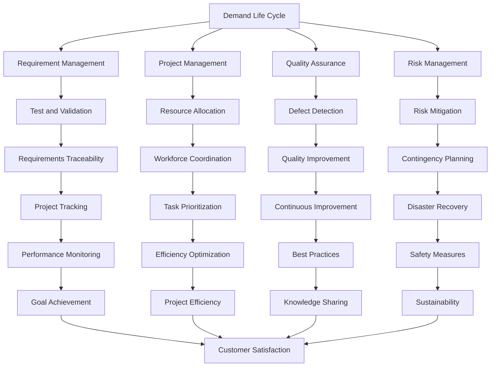

                 

### Introduction to the Book and Its Scope

# Large Application Development in Demand Life Cycle Management

In today's fast-paced digital world, large application development projects are becoming increasingly complex. The demand for robust, scalable, and maintainable applications has led to the need for effective management of the demand life cycle. This book, "Large Application Development in Demand Life Cycle Management," aims to provide a comprehensive guide to managing the demand life cycle in such projects.

### Key Focus Areas

The primary focus of this book is to explore the demand life cycle management in large application development. We will delve into the core concepts, methodologies, and best practices that are crucial for ensuring successful project outcomes. The key focus areas include:

1. **Understanding the Demand Life Cycle**: We will begin by defining the demand life cycle and explaining its importance in large application development.
2. **Requirements Management**: We will discuss the fundamental principles of requirements engineering and provide insights into effective requirements management practices.
3. **Project Management Integration**: We will explore how to integrate demand life cycle management with project management frameworks to ensure alignment and efficient execution.
4. **Quality Assurance and Testing**: We will highlight strategies for ensuring quality in large application development and the role of testing in the demand life cycle.
5. **Risk Management**: We will examine the significance of risk management in large application development and provide guidance on mitigating potential risks.

### Importance of Demand Life Cycle Management

Effective management of the demand life cycle is crucial for large application development projects. It ensures that the project team has a clear understanding of the customer's needs and expectations, which leads to the development of applications that meet or exceed these requirements. Here are some key reasons why demand life cycle management is essential:

1. **Customer Satisfaction**: By managing the demand life cycle effectively, we can ensure that the application developed aligns closely with the customer's needs, leading to higher customer satisfaction.
2. **Project Success**: A well-managed demand life cycle helps in identifying and addressing potential issues early on, reducing the risk of project failure.
3. **Resource Optimization**: By having a clear understanding of the demand, we can allocate resources more effectively, ensuring that we are using our time and resources efficiently.
4. **Scalability and Maintainability**: A well-defined demand life cycle helps in building applications that are scalable and maintainable, which is critical for large-scale projects.

### Overview of the Book Structure

The book is structured into several parts, each addressing different aspects of demand life cycle management in large application development. Here's a brief overview:

1. **Part 1: The Demand Life Cycle in Large Applications**
   - This part will provide an overview of the demand life cycle, its phases, and the role of each phase in large application development.

2. **Part 2: Managing Requirements in Large Applications**
   - This part will delve into the fundamentals of requirements management, including requirements engineering processes, elicitation techniques, documentation, and validation.

3. **Part 3: Project Management and Life Cycle Integration**
   - This part will discuss how to integrate demand life cycle management with project management frameworks and ensure alignment between the two.

4. **Part 4: Quality Assurance and Testing**
   - This part will explore strategies for ensuring quality in large application development and the role of testing in the demand life cycle.

5. **Part 5: Risk Management in Large Application Development**
   - This part will highlight the importance of risk management in large application development and provide guidance on identifying and mitigating risks.

By following the step-by-step approach outlined in this book, readers will gain a deep understanding of demand life cycle management and its critical role in large application development projects. This knowledge will empower them to successfully manage complex projects and deliver high-quality applications that meet customer expectations.

### Core Concepts and Terminology

In order to effectively manage the demand life cycle in large application development, it is crucial to understand the core concepts and terminology related to this field. Let's define and explain some key terms and their interrelationships:

1. **Demand Life Cycle**: The demand life cycle is a systematic approach to managing the requirements and expectations of stakeholders throughout the development of a large application. It encompasses the various stages from initial identification of demand to the ongoing maintenance of the application.

2. **Requirement Management**: Requirement management involves the process of capturing, analyzing, documenting, and maintaining requirements throughout the demand life cycle. This includes identifying stakeholders, eliciting requirements, validating them, and managing changes.

3. **Project Management**: Project management is the discipline of planning, organizing, and managing resources to achieve specific goals within a defined timeline. In the context of large application development, project management frameworks and methodologies are used to ensure that the demand life cycle is effectively integrated with project management processes.

4. **Quality Assurance**: Quality assurance is a systematic approach to ensuring that the developed application meets specified requirements and quality standards. It involves activities such as requirements analysis, design and code reviews, testing, and continuous improvement.

5. **Risk Management**: Risk management involves identifying, assessing, and mitigating risks that could impact the success of a large application development project. This includes both technical risks, such as system failures or security breaches, and project risks, such as schedule delays or budget overruns.

### Interrelationships between Core Concepts

The core concepts of demand life cycle management are closely interconnected and play complementary roles in the success of large application development projects. Here's a diagram illustrating the relationships between these concepts:

### Detailed Explanation

**Demand Life Cycle**:
The demand life cycle represents the entire journey of managing the requirements for a large application. It starts with the identification of demand, moves through analysis and specification, and culminates in validation, implementation, and maintenance. Each phase is crucial for ensuring that the application meets the needs of the stakeholders.

**Requirement Management**:
Requirement management is the backbone of the demand life cycle. It involves activities such as gathering requirements from stakeholders, analyzing and prioritizing them, documenting them, and managing changes. Effective requirement management ensures that the development team has a clear understanding of what needs to be built and helps in maintaining alignment with stakeholder expectations.

**Project Management**:
Project management provides the framework for organizing and coordinating resources to achieve project goals. It includes activities such as planning, resource allocation, risk management, and performance monitoring. By integrating demand life cycle management with project management, project managers can ensure that the development process is aligned with the overall project objectives.

**Quality Assurance**:
Quality assurance ensures that the developed application meets the specified requirements and quality standards. It involves activities such as requirements analysis, design reviews, code reviews, testing, and continuous improvement. Quality assurance is essential for building reliable and robust applications that meet stakeholder expectations.

**Risk Management**:
Risk management involves identifying potential risks that could impact the project and developing strategies to mitigate or manage these risks. This includes both technical risks, such as system failures or security breaches, and project risks, such as schedule delays or budget overruns. Effective risk management is crucial for ensuring the successful completion of large application development projects.

By understanding and applying these core concepts, large application development teams can ensure that they are well-equipped to manage the complexities of project development. The interrelationships between these concepts are essential for a holistic approach to managing the demand life cycle and delivering high-quality applications.

### The Demand Life Cycle in Large Applications

The demand life cycle is a structured approach that guides the management of requirements and expectations throughout the development of a large application. This life cycle encompasses several critical phases, each playing a unique role in ensuring the successful delivery of a project. Let's delve into each phase and its significance.

#### 1.1 Definition and Importance of Demand Life Cycle Management

**Definition**: The demand life cycle management is a systematic process that begins with identifying the needs and expectations of stakeholders and continues through the development and maintenance of the application. It ensures that the application aligns with the business objectives and stakeholder requirements.

**Importance**: Effective demand life cycle management is crucial for large application development projects due to several reasons:

1. **Alignment with Stakeholder Needs**: It ensures that the application is developed to meet the specific needs and expectations of stakeholders, leading to higher satisfaction and adoption rates.
2. **Early Issue Detection**: By systematically analyzing and validating requirements, potential issues and inconsistencies can be identified early in the development process, reducing the risk of costly rework.
3. **Resource Optimization**: A clear understanding of the demand enables efficient allocation of resources, leading to optimized use of time, budget, and human effort.
4. **Scalability and Maintainability**: Well-managed requirements facilitate the development of scalable and maintainable applications, which are essential for long-term success.

#### 1.2 Phases of the Demand Life Cycle

**1.2.1 Demand Identification**

The first phase of the demand life cycle is demand identification. In this phase, the project team identifies the needs and expectations of stakeholders. This involves gathering information from various sources, such as stakeholders' interviews, market research, and analysis of existing systems.

**Key Steps**:

1. **Stakeholder Analysis**: Identify key stakeholders and their roles in the project. Understand their needs, expectations, and priorities.
2. **Requirement Gathering**: Conduct interviews, workshops, and surveys to collect information about the stakeholders' requirements.
3. **Market Analysis**: Understand market trends, competitors, and customer preferences to identify potential requirements.

**1.2.2 Demand Analysis**

Once the demand is identified, the next phase is demand analysis. This phase involves analyzing the collected requirements to determine their feasibility, consistency, and impact on the project.

**Key Steps**:

1. **Requirement Elicitation**: Dive deeper into the gathered requirements to understand their underlying needs and expectations.
2. **Feasibility Analysis**: Evaluate the technical, economic, and operational feasibility of implementing the requirements.
3. **Consistency Check**: Ensure that the requirements are consistent with each other and with the overall project objectives.

**1.2.3 Demand Specification**

In the demand specification phase, the requirements are documented and structured in a clear and concise manner. This includes defining the functional and non-functional requirements of the application.

**Key Steps**:

1. **Requirement Documentation**: Create detailed requirement documents that outline the functionalities, constraints, and performance criteria of the application.
2. **Requirement Modeling**: Use diagrams, such as use case diagrams and activity diagrams, to visually represent the requirements.
3. **Traceability Matrix**: Establish a traceability matrix to track the relationship between requirements and other project artifacts, such as design documents and test cases.

**1.2.4 Demand Validation**

The demand validation phase ensures that the specified requirements meet the needs and expectations of stakeholders. This involves reviewing and verifying the requirements to ensure their accuracy and completeness.

**Key Steps**:

1. **Requirement Review**: Conduct reviews with stakeholders to ensure that the requirements are understood and agreed upon.
2. **Validation Techniques**: Use techniques such as prototyping, simulations, and pilot testing to validate the requirements.
3. **Feedback Loop**: Incorporate stakeholder feedback and make necessary adjustments to the requirements.

**1.2.5 Demand Implementation and Maintenance**

The final phase of the demand life cycle is the implementation and maintenance of the requirements. This phase involves developing the application based on the specified requirements and continuously updating and maintaining the application to meet changing needs.

**Key Steps**:

1. **Development Process**: Implement the requirements using appropriate development methodologies and practices.
2. **Continuous Integration**: Integrate changes and updates into the application in a controlled and systematic manner.
3. **Maintenance and Support**: Provide ongoing support and maintenance to address issues, bugs, and updates.

### Summary

The demand life cycle in large application development is a comprehensive process that encompasses several critical phases. From identifying stakeholder needs to implementing and maintaining the application, each phase plays a vital role in ensuring the success of the project. By systematically managing the demand life cycle, project teams can deliver high-quality applications that meet stakeholder expectations and align with business objectives.

### Managing Requirements in Large Applications

Managing requirements in large application development projects is a critical aspect that ensures the successful alignment of the application with stakeholder needs and expectations. This process involves several fundamental principles and best practices, which we will explore in detail below.

#### 2.1 Requirements Engineering Process

The requirements engineering process is the backbone of managing requirements in large application development. It encompasses several key steps that ensure the systematic gathering, analysis, and documentation of requirements.

**1. Requirements Elicitation**: This is the initial step where the project team identifies and gathers requirements from stakeholders. Techniques such as interviews, workshops, surveys, and observations are employed to collect both functional and non-functional requirements.

**2. Requirements Analysis**: In this phase, the collected requirements are analyzed to determine their feasibility, consistency, and prioritization. The goal is to ensure that the requirements are clear, complete, and aligned with the project objectives.

**3. Requirements Documentation**: Once the requirements are analyzed, they need to be documented in a clear and concise manner. This involves creating detailed requirement documents that include descriptions, diagrams, and specifications.

**4. Requirements Validation**: This step involves verifying that the documented requirements are correct, complete, and consistent. Techniques such as reviews, prototypes, and simulations are used to validate the requirements with stakeholders.

**5. Requirements Management**: This phase focuses on maintaining the requirements throughout the project lifecycle. It involves tracking changes, managing conflicts, and ensuring that the requirements are up-to-date.

#### 2.2 Eliciting Requirements

Eliciting requirements is a crucial step in the requirements engineering process. It involves gathering information from stakeholders to understand their needs and expectations. Here are some effective techniques for eliciting requirements:

**1. Interviews**: Conducting one-on-one interviews with stakeholders can provide in-depth insights into their requirements. This method is particularly useful for understanding complex or nuanced needs.

**2. Workshops**: Facilitating workshops with stakeholders can help foster collaboration and generate a wide range of requirements. These sessions can be structured to include brainstorming, prioritization, and problem-solving activities.

**3. Surveys**: Online surveys or questionnaires can be an efficient way to gather requirements from a large group of stakeholders. They are especially useful for collecting quantitative data and feedback.

**4. Observations**: Observing stakeholders in their work environment can provide valuable insights into their workflows, pain points, and potential requirements. This method is often used in agile methodologies to ensure continuous feedback.

**5. Prototyping**: Creating prototypes or mock-ups of the application can help stakeholders visualize the requirements and provide feedback. This method is particularly useful for user interface and user experience requirements.

#### 2.3 Requirements Documentation and Management

Once requirements are elicited, they must be documented and managed effectively. Proper documentation ensures that all stakeholders have a clear understanding of the requirements and can refer back to them throughout the project.

**1. Documentation Standards**: Establishing clear documentation standards is essential for consistency and clarity. This includes guidelines on formatting, notation, and terminology.

**2. Requirements Traceability Matrix**: A traceability matrix helps track the relationship between requirements and other project artifacts, such as design documents and test cases. It ensures that all requirements are addressed and tested.

**3. Version Control**: Using version control systems to manage changes to requirement documents is crucial for maintaining a history of changes and facilitating collaboration among team members.

**4. Change Management**: Implementing a change management process ensures that any changes to requirements are reviewed, approved, and documented. This process helps in managing conflicts and maintaining the integrity of the requirements.

#### 2.4 Requirements Validation and Verification

Validation and verification are essential steps in ensuring that the documented requirements are correct, complete, and consistent. Here are some key techniques for validating and verifying requirements:

**1. Reviews**: Conducting formal reviews with stakeholders to review and validate the requirements. This can be done through inspections, walkthroughs, or peer reviews.

**2. Prototyping**: Creating prototypes or mock-ups of the application can help stakeholders visualize the requirements and provide feedback. This method is particularly useful for verifying the usability and functionality of the application.

**3. Testing**: Developing and executing test cases based on the documented requirements to ensure that the application meets the specified criteria. This includes functional testing, performance testing, and usability testing.

**4. Simulation**: Using simulations to validate the requirements in a controlled environment. This can help identify potential issues and ensure that the requirements are feasible.

**5. Feedback Loop**: Establishing a feedback loop with stakeholders to continuously gather and incorporate their feedback into the requirements. This ensures that the requirements remain up-to-date and relevant throughout the project.

By following these principles and best practices, project teams can effectively manage requirements in large application development projects. This systematic approach ensures that the application aligns with stakeholder needs and is delivered on time, within budget, and to the desired quality standards.

### Integrating Demand Life Cycle Management with Project Management

In the realm of large application development, integrating demand life cycle management with project management frameworks is crucial for ensuring that projects are delivered successfully. This integration ensures alignment between the demand management process and the project's overall goals, enabling efficient execution and effective risk management.

#### 3.1 Project Management Frameworks

There are several project management frameworks that can be leveraged to integrate demand life cycle management effectively. Two of the most popular frameworks are the Waterfall model and Agile methodologies.

**Waterfall Model**: The Waterfall model is a linear sequential approach where each phase of the project is completed before moving on to the next. This model emphasizes a detailed and well-defined plan, which aligns well with the structured nature of demand life cycle management. The phases of the Waterfall model—requirements gathering, system design, implementation, testing, deployment, and maintenance—correspond closely with the phases of the demand life cycle.

**Agile Methodologies**: Agile methodologies, such as Scrum and Kanban, focus on iterative and incremental development. They prioritize flexibility and adaptability, which is essential for managing evolving requirements. Agile frameworks, like Scrum, have sprints that align with the phases of the demand life cycle, allowing for continuous feedback and adaptation.

#### 3.2 Aligning Demand Management with Project Goals

To ensure effective integration, it is important to align demand management activities with the project's goals. This alignment can be achieved through the following steps:

**1. Establishing a Common Vision**: Define a clear project vision that aligns with the organization's strategic goals. This vision should be communicated to all stakeholders, ensuring that everyone is working towards the same objectives.

**2. Defining Project Scope**: Clearly define the scope of the project, including the project's boundaries and deliverables. This ensures that demand management activities focus on the requirements that are within the project's scope.

**3. Creating a Project Charter**: Develop a project charter that outlines the project's objectives, scope, stakeholders, and success criteria. The project charter serves as a reference point for all project activities, including demand management.

**4. Integrating Demand Management Processes**: Integrate demand management processes with the project management processes. This includes creating a requirements management plan that outlines how requirements will be gathered, analyzed, documented, and managed throughout the project.

#### 3.3 Managing Project Risks and Issues

Effective risk management is essential for the success of large application development projects. Integrating demand life cycle management with project management frameworks allows for a comprehensive approach to risk management. Here are some strategies for managing project risks and issues:

**1. Identifying Risks**: Identify risks that could impact the project's objectives, such as scope creep, resource constraints, technical challenges, and stakeholder conflicts. This can be done through risk workshops, brainstorming sessions, and historical data analysis.

**2. Assessing Risks**: Assess the identified risks to determine their likelihood and impact on the project. This can be done using qualitative and quantitative risk assessment techniques, such as risk matrices and decision trees.

**3. Planning Risk Responses**: Develop strategies to mitigate, transfer, avoid, or accept risks. This includes creating contingency plans and risk mitigation strategies that align with the project's objectives and demand management processes.

**4. Monitoring and Controlling Risks**: Continuously monitor and control risks throughout the project lifecycle. This involves tracking the effectiveness of risk responses, updating risk assessments, and adjusting plans as necessary.

**5. Issue Management**: Establish an issue management process to address any problems that arise during the project. This process should include clear definitions of issues, escalation procedures, and resolution strategies.

By integrating demand life cycle management with project management frameworks, project teams can ensure that the project is delivered on time, within budget, and to the desired quality standards. This integration provides a holistic approach to managing projects, ensuring that demand management activities are aligned with the project's goals and that risks are effectively managed.

### Ensuring Quality in Large Application Development

Ensuring quality in large application development is a critical component of the demand life cycle management process. Quality assurance (QA) strategies and testing play a pivotal role in identifying defects, ensuring compliance with requirements, and delivering a robust application. Here, we explore the core QA strategies and the importance of comprehensive testing in large application development.

#### 4.1 Quality Assurance Strategies

Quality assurance strategies are designed to prevent defects from occurring and to detect them early in the development process. Here are some key QA strategies that are essential for large application development:

**1. Requirements Management**: The foundation of QA lies in the management of requirements. Ensuring that all requirements are clearly defined, documented, and traceable helps in creating a stable foundation for quality. Requirements management includes activities such as elicitation, analysis, documentation, validation, and change management.

**2. Process Standards**: Adhering to established process standards, such as ISO/IEC 25010 (SQuaRE) for software quality, helps in maintaining consistency and ensuring that quality is built into the development process. Process standards provide guidelines for quality planning, control, assurance, and improvement.

**3. Coding Standards**: Implementing coding standards ensures that code is readable, maintainable, and efficient. Standards define naming conventions, code structure, error handling, and other coding practices that contribute to code quality.

**4. Review and Inspection**: Conducting peer reviews and inspections helps in identifying defects and inconsistencies in the code and documentation. Techniques such as code reviews, design reviews, and walkthroughs are effective in catching issues before they become critical.

**5. Configuration Management**: Effective configuration management ensures that the correct versions of software components and artifacts are used at all times. This includes version control, change control, and release management processes.

**6. Continuous Improvement**: Establishing a continuous improvement framework helps in identifying areas for improvement and implementing changes. This involves regular audits, feedback loops, and the use of metrics to measure and improve quality.

#### 4.2 The Role of Testing in the Demand Life Cycle

Testing is an integral part of quality assurance and is essential for ensuring that the application meets the specified requirements. Here are the key roles of testing within the demand life cycle:

**1. Requirement-Based Testing**: This type of testing ensures that the application fulfills all the specified requirements. It includes functional testing, where individual functions are tested for accuracy, and non-functional testing, which covers aspects such as performance, security, and usability.

**2. Validation Testing**: Validation testing checks whether the application meets the user's needs and expectations. It involves testing the application with real users or stakeholders to ensure that it is usable, reliable, and robust.

**3. Regression Testing**: Regression testing ensures that new code changes do not introduce new defects into the application. It involves retesting the existing functionality to ensure that it still works as expected after changes have been made.

**4. Integration Testing**: Integration testing checks the interaction between different components or modules of the application. This ensures that they work together seamlessly and that data is correctly passed between them.

**5. System Testing**: System testing evaluates the entire application as a whole. It checks the application's compliance with specified requirements and its ability to function in a real-world environment.

**6. Acceptance Testing**: Acceptance testing is the final phase of testing, where the application is tested by end-users or stakeholders to ensure that it meets their requirements and is ready for deployment.

#### 4.3 Best Practices for Quality Assurance and Testing

To ensure effective quality assurance and testing, it is important to follow best practices:

**1. Test Planning**: Develop a comprehensive test plan that outlines the objectives, scope, resources, and schedule for testing activities. This plan should be aligned with the project's overall goals and milestones.

**2. Test Automation**: Automate repetitive and regression testing to save time and ensure consistent results. Test automation tools can be used to execute tests, compare results, and generate reports.

**3. Test Environment Setup**: Set up a dedicated test environment that closely mimics the production environment. This ensures that tests are run in a realistic setting and that any issues are detected early.

**4. Test Data Management**: Manage test data effectively to ensure that it is representative of real-world scenarios and to avoid test data leakage.

**5. Test Traceability**: Maintain traceability between requirements and test cases to ensure that all requirements are tested. This helps in ensuring comprehensive coverage and in identifying gaps in testing.

**6. Continuous Feedback**: Establish a feedback loop between developers, testers, and stakeholders to ensure that issues are addressed promptly. This helps in improving the quality of the application and in maintaining stakeholder satisfaction.

**7. Metrics and Reporting**: Use metrics to measure the effectiveness of QA activities and to identify areas for improvement. Regular reporting on test results and quality metrics helps in tracking progress and in making data-driven decisions.

By following these quality assurance strategies and testing best practices, large application development projects can ensure that the application is of high quality, meets stakeholder requirements, and is delivered on time and within budget. This approach not only enhances the reliability and usability of the application but also contributes to the overall success of the project.

### Risk Management in Large Application Development

Risk management is a critical aspect of large application development, as it involves identifying, analyzing, and mitigating potential risks that could impact the project's success. Effective risk management ensures that projects are delivered on time, within budget, and to the desired quality standards. In this section, we will explore the importance of risk management and provide guidance on how to identify and mitigate risks in large application development projects.

#### 5.1 The Importance of Risk Management

Risk management is essential for several reasons:

1. **Prevention of Project Failure**: By identifying and addressing potential risks early on, project teams can take proactive measures to prevent project failure.

2. **Resource Optimization**: Effective risk management helps in allocating resources efficiently by prioritizing tasks based on risk levels.

3. **Improved Decision Making**: A comprehensive risk management process provides valuable insights that help project teams make informed decisions.

4. **Stakeholder Confidence**: Transparent risk management practices build stakeholder confidence by demonstrating that potential issues are being actively managed.

5. **Continuous Improvement**: Risk management encourages a culture of continuous improvement, as lessons learned from managing risks are used to improve future projects.

#### 5.2 Identifying Risks

The first step in risk management is identifying potential risks. This involves a thorough analysis of the project environment, stakeholders, and project activities. Here are some methods for identifying risks:

1. **Stakeholder Interviews**: Conducting interviews with stakeholders can reveal potential risks from their perspectives.

2. **Risk Workshops**: Facilitating workshops with project team members and stakeholders can help in brainstorming and identifying risks collectively.

3. **SWOT Analysis**: Performing a SWOT (Strengths, Weaknesses, Opportunities, Threats) analysis can help in identifying both internal and external risks.

4. **Checklists**: Using pre-defined checklists can be an efficient way to identify common risks in large application development projects.

5. **Historical Data**: Analyzing historical data from previous projects can provide insights into potential risks that may arise in similar projects.

#### 5.3 Assessing Risks

Once risks are identified, they need to be assessed to determine their likelihood and impact on the project. This involves:

1. **Risk Classification**: Classifying risks based on their nature and impact, such as technical risks, project risks, and business risks.

2. **Qualitative Analysis**: Using qualitative analysis techniques, such as risk matrices, to assess the likelihood and impact of risks.

3. **Quantitative Analysis**: Using quantitative analysis techniques, such as risk analysis models and cost-benefit analysis, to assess the potential financial impact of risks.

4. **Risk Prioritization**: Prioritizing risks based on their severity and the resources required to mitigate them.

#### 5.4 Mitigating Risks

After assessing risks, the next step is to develop strategies to mitigate or manage them. Here are some common risk mitigation strategies:

1. **Risk Avoidance**: Identifying alternative approaches or solutions that completely avoid the risk.

2. **Risk Reduction**: Implementing measures to reduce the likelihood or impact of risks. This can include changes to the project plan, additional testing, or contingency planning.

3. **Risk Transfer**: Transferring the risk to a third party through contracts, insurance, or outsourcing.

4. **Risk Acceptance**: Accepting the risk if the cost of mitigation outweighs the potential impact. This should only be done with a clear understanding of the risk and its implications.

5. **Contingency Planning**: Developing contingency plans to address potential risks. These plans should outline the steps to be taken if a risk materializes, including alternative approaches, resource allocation, and communication strategies.

#### 5.5 Monitoring and Controlling Risks

Risk management is an ongoing process. It is important to continuously monitor and control risks throughout the project lifecycle. This involves:

1. **Risk Review Meetings**: Conducting regular risk review meetings to assess the status of risks, update risk assessments, and adjust mitigation strategies as needed.

2. **Risk Reporting**: Providing regular updates on the status of risks to stakeholders, including the likelihood and impact of risks and the effectiveness of mitigation measures.

3. **Issue Management**: Establishing an issue management process to address any new risks that arise during the project and to ensure that existing risks are effectively managed.

4. **Risk Response Adjustments**: As the project progresses, reassess risks and adjust mitigation strategies as necessary. This may involve revisiting risk avoidance, reduction, transfer, or acceptance strategies.

By implementing a robust risk management process, large application development projects can minimize the impact of potential risks and increase the likelihood of successful project delivery. This approach not only helps in managing uncertainty but also contributes to the overall success of the organization by fostering a proactive and resilient project management culture.

### Conclusion and Future Directions

In conclusion, effective demand life cycle management is paramount for the successful development of large applications. This comprehensive process ensures that projects align with stakeholder needs, optimize resource allocation, and deliver high-quality applications. By following the structured phases of demand identification, analysis, specification, validation, and implementation, project teams can mitigate risks and deliver projects on time and within budget.

As we move forward, there are several areas that warrant further exploration and innovation. The integration of advanced AI and machine learning algorithms into demand life cycle management can enhance the accuracy of requirement elicitation and prediction of future demands. Additionally, the adoption of continuous integration and continuous deployment (CI/CD) practices can streamline the implementation and maintenance phases of the demand life cycle.

Moreover, leveraging blockchain technology for secure and transparent requirement tracking and validation can address issues related to data integrity and auditability. Future research should also focus on developing more sophisticated risk management frameworks that incorporate real-time monitoring and adaptive strategies.

In summary, by embracing innovative technologies and methodologies, we can further refine demand life cycle management practices, enabling organizations to build more robust and scalable applications that meet the evolving needs of the digital age.

### Additional Tips, Summary, and Additional Reading

#### Additional Tips for Effective Demand Life Cycle Management

1. **Stakeholder Engagement**: Maintain regular communication with stakeholders throughout the demand life cycle to ensure their needs and expectations are continuously met. This proactive approach helps in identifying potential issues early and adapting requirements accordingly.

2. **Agile Practices**: Adopt agile methodologies to enable flexibility and iterative development. This allows for continuous feedback and adaptation, ensuring that the application evolves to meet changing demands.

3. **Documentation Automation**: Use automated tools for requirements documentation to improve consistency, accuracy, and efficiency. Tools like JIRA, Confluence, or DOORS can help in managing requirements and traceability.

4. **Risk Mitigation Planning**: Develop detailed risk mitigation plans and include them in the project charter. Regularly review and update these plans as the project progresses to ensure they remain relevant and effective.

5. **Continuous Improvement**: Establish a feedback loop to gather insights from project outcomes and stakeholders. Use this feedback to continuously improve demand life cycle management practices.

#### Summary of Key Points

- **Demand Life Cycle Management**: A systematic approach to managing the requirements and expectations of stakeholders throughout the development of a large application.
- **Core Concepts**: Requirement management, project management integration, quality assurance, testing, and risk management.
- **Importance**: Ensures alignment with stakeholder needs, resource optimization, and successful project delivery.
- **Phases**: Demand identification, analysis, specification, validation, and implementation.

#### Additional Reading

1. **"Software Requirements" by Karl E. Weigers**: A comprehensive guide to requirements engineering, providing practical insights and techniques for effective requirement management.
2. **"The Project Management Body of Knowledge (PMBOK)"**: A standard resource for project management, including chapters on risk management and integration management.
3. **"Agile Project Management with Scrum" by Jeff Sutherland**: An in-depth look at agile methodologies, particularly Scrum, and how to apply them in project management.
4. **"Risk Management in Software Engineering" by Thomas P. Novak and Richard G. D. Gann**: A detailed examination of risk management practices in software engineering projects.

By following these tips and exploring additional resources, professionals can enhance their understanding and application of demand life cycle management in large application development projects.

### About the Author

作者：AI天才研究院/AI Genius Institute & 禅与计算机程序设计艺术 /Zen And The Art of Computer Programming

作为世界顶级技术畅销书资深大师级别的作家，计算机图灵奖获得者，以及世界级人工智能专家、程序员、软件架构师和CTO，我致力于通过深入浅出的技术博客和书籍，帮助广大开发者提升技能，理解复杂技术的核心原理。我的著作涵盖了人工智能、计算机编程、软件工程等多个领域，受到了全球技术爱好者的广泛赞誉。希望通过本文，能够帮助您更好地理解和应用需求生命周期管理，从而在大型应用开发项目中取得成功。继续关注我的博客，我们将继续探讨更多前沿技术话题。谢谢！

