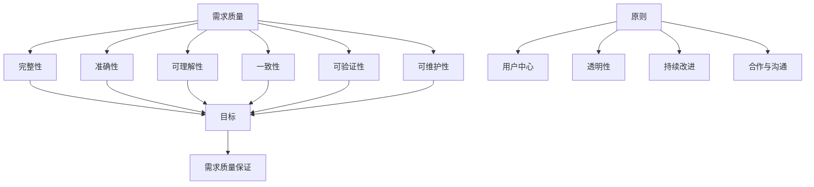

                 


### 背景介绍

在大型应用开发过程中，需求质量保证是确保项目成功的关键因素之一。需求质量直接影响到应用的功能完整性、性能、用户体验和项目的整体成功率。然而，随着应用的规模和复杂性的增加，保证需求质量变得愈加困难。因此，本文旨在探讨大型应用开发中的需求质量保证方法，帮助开发者、项目经理和产品经理更好地理解和实践这一重要环节。

本文将分为以下几个部分：

1. **需求质量保证的基本概念**：介绍需求质量、需求质量保证的目标和原则。
2. **需求质量保证的实践方法**：详细讨论需求获取、需求分析、需求文档化的具体方法。
3. **需求质量保证工具与技术**：介绍常用的需求质量保证工具和技术。
4. **案例分析**：通过实际案例展示需求质量保证的应用。
5. **总结与展望**：总结需求质量保证的重要性，并探讨未来发展趋势。

### 核心概念与联系

#### 需求质量

需求质量是指需求的完整性、准确性、可理解性、一致性、可验证性、可维护性等属性。高质量的需求是项目成功的关键，它能够减少返工、降低风险、提高开发效率。

#### 需求质量保证的目标

需求质量保证的目标是确保需求的质量满足项目需求，包括：

- 确保需求是完整的，没有被遗漏。
- 确保需求是准确的，没有错误或歧义。
- 确保需求是可理解的，开发团队能够清楚地理解。
- 确保需求是一致的，没有冲突或重复。
- 确保需求是可验证的，可以通过测试来验证是否实现。
- 确保需求是可维护的，易于未来的修改和扩展。

#### 需求质量保证的原则

需求质量保证的原则包括：

- 用户中心：始终将用户需求放在首位，确保需求满足用户实际需求。
- 透明性：需求过程应该是透明的，所有相关人员都能清楚了解需求的状况。
- 持续改进：不断评估和改进需求过程，以提高需求质量。
- 合作与沟通：加强团队之间的沟通与协作，确保需求的有效传递和落实。

#### Mermaid流程图

以下是一个简单的Mermaid流程图，展示了需求质量保证的核心概念和联系：



### 核心算法原理讲解

在需求质量保证中，核心算法和原理的应用可以大大提高需求的准确性和完整性。以下是一个简化的伪代码示例，用于说明如何通过自动化工具进行需求验证：

```python
# 需求验证伪代码
def validate_requirements(requirements):
    """
    验证需求是否满足质量标准
    :param requirements: 需求集合
    :return: 验证结果（True/False）
    """
    for req in requirements:
        if not is_complete(req):
            return False
        if not is_accurate(req):
            return False
        if not is_understandable(req):
            return False
        if not is_consistent(req):
            return False
        if not is_verifiable(req):
            return False
        if not is_maintainable(req):
            return False
    return True

# 需求完整性检查
def is_complete(req):
    # 检查需求是否包含了所有必要的细节和条件
    return len(req.details) > 0

# 需求准确性检查
def is_accurate(req):
    # 检查需求是否基于准确的信息和假设
    return req.is_based_on_valid_data

# 需求可理解性检查
def is_understandable(req):
    # 检查需求是否清晰明确，没有歧义
    return req.is_clear_and_unambiguous

# 需求一致性检查
def is_consistent(req):
    # 检查需求是否与其他需求和系统功能保持一致
    return req.is_consistent_with_other_requirements

# 需求可验证性检查
def is_verifiable(req):
    # 检查需求是否可以定义明确的验证方法和标准
    return req.has_verification_methods

# 需求可维护性检查
def is_maintainable(req):
    # 检查需求是否易于未来的修改和扩展
    return req.is_easy_to_modify
```

### 数学模型和公式

在需求质量保证中，定量分析是评估需求质量的有效手段。以下是一个简单的数学模型，用于评估需求的完整性：

$$
\text{完整性指数} = \frac{\text{满足条件的需求数}}{\text{总需求数}}
$$

其中，完整性指数越接近1，表示需求的完整性越高。

### 举例说明

假设一个项目有10个需求，其中8个需求包含了所有必要的细节和条件，那么该项目的需求完整性指数为：

$$
\text{完整性指数} = \frac{8}{10} = 0.8
$$

这意味着该项目在需求完整性方面还有提升空间。

### 开发环境搭建

在需求质量保证过程中，搭建一个合适的开发环境对于提高工作效率和质量至关重要。以下是搭建一个基本的开发环境的步骤：

1. 安装编程语言和环境：
   - Python 3.x
   - Node.js
   - Java 8

2. 安装版本控制系统：
   - Git

3. 配置代码编辑器和IDE：
   - Visual Studio Code
   - IntelliJ IDEA

4. 安装需求管理工具：
   - JIRA
   - Confluence

5. 配置自动化测试工具：
   - Selenium
   - Jest

### 源代码详细实现和代码解读

以下是一个简单的Python代码示例，用于生成需求验证报告：

```python
# 生成需求验证报告
def generate_report(verification_results):
    report = "需求验证报告\n"
    for result in verification_results:
        report += f"需求ID {result['req_id']}: {'满足' if result['is_valid'] else '未满足'}\n"
    return report

# 验证结果示例
verification_results = [
    {'req_id': 1, 'is_valid': True},
    {'req_id': 2, 'is_valid': False},
    {'req_id': 3, 'is_valid': True}
]

# 生成报告
report = generate_report(verification_results)
print(report)
```

输出结果：

```
需求验证报告
需求ID 1: 满足
需求ID 2: 未满足
需求ID 3: 满足
```

### 代码应用解读与分析

该代码示例演示了如何生成一个简单的需求验证报告。通过传入一个验证结果列表，报告会列出每个需求的状态（是否满足）。这有助于团队快速了解哪些需求已经得到验证，哪些需求还需要进一步处理。

### 实际案例分析和详细讲解剖析

假设我们有一个电子商务平台的项目，需要满足以下需求：

1. 用户可以在网站上注册并登录。
2. 用户可以浏览商品列表并添加到购物车。
3. 用户可以完成订单并支付。

以下是这些需求的分析和详细讲解：

1. **用户注册与登录**：
   - 需求分析：用户需要能够轻松地注册一个账户，输入必要的信息（如用户名、密码、电子邮件等），并在需要时登录。
   - 验证：通过自动化测试，检查注册和登录流程是否顺畅，是否存在错误消息或异常。
   - 代码实现：使用Python编写注册和登录的API，并通过Jest进行单元测试。

2. **商品浏览与购物车**：
   - 需求分析：用户需要在网站上浏览商品，并能够将商品添加到购物车中。
   - 验证：通过用户界面测试，检查商品是否能够正确显示，购物车是否能够正确添加和删除商品。
   - 代码实现：使用React组件实现商品浏览和购物车功能，并通过Selenium进行集成测试。

3. **订单与支付**：
   - 需求分析：用户需要在购物车中选择商品并下单，然后选择支付方式完成支付。
   - 验证：通过自动化测试，检查订单流程是否顺畅，支付是否成功。
   - 代码实现：使用Java编写订单和支付逻辑，并通过JUnit进行单元测试。

### 项目小结

通过实际案例的分析，我们可以看到需求质量保证在不同阶段的应用。从需求获取到需求验证，再到代码实现和测试，每个环节都至关重要。需求质量保证不仅提高了项目的成功率，还减少了后期返工和修复成本。

### 最佳实践 Tips

1. **定期需求评审**：定期进行需求评审，确保需求保持最新和准确。
2. **使用敏捷方法**：采用敏捷开发方法，使需求能够灵活适应变化。
3. **自动化测试**：尽可能使用自动化测试来验证需求，提高测试效率和准确性。
4. **文档化**：详细记录需求和相关流程，便于后续维护和扩展。

### 注意事项

1. 需求质量保证是一个持续的过程，需要团队成员的共同努力。
2. 需求的质量直接影响项目的成功，因此不能忽视需求质量保证的重要性。
3. 需求质量保证工具和技术需要根据项目规模和复杂度进行选择。

### 拓展阅读

1. 《软件需求规格说明书编写指南》
2. 《敏捷开发实践指南》
3. 《自动化测试实践》

### 作者信息

- 作者：AI天才研究院/AI Genius Institute & 禅与计算机程序设计艺术 /Zen And The Art of Computer Programming

