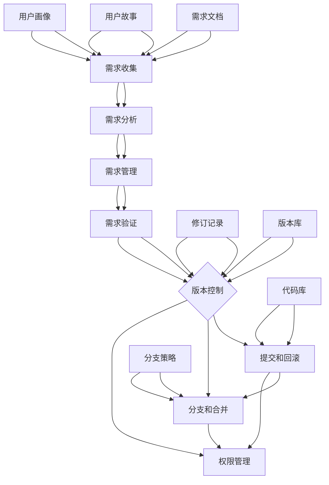

                 

### 设计思路

为了设计出《大型应用开发中的需求追踪与版本控制》这本书的目录大纲，我们需要遵循以下设计思路：

首先，我们明确核心内容涵盖部分。为了确保读者能够全面理解需求追踪与版本控制，核心章节内容需涵盖以下方面：

- **需求追踪概述**：介绍需求追踪的基本概念、重要性以及方法。
- **版本控制基础**：阐述版本控制的基本概念、常见系统及其核心功能。
- **需求追踪与版本控制的关系**：探讨两者之间的结合、变更与更新协同，以及面临的挑战。
- **需求追踪实践**：详细讲解需求追踪的工具选择、流程设计及案例分析。
- **版本控制实践**：包括版本控制系统搭建、版本控制策略及与需求追踪整合的方法。
- **实战案例**：通过实际项目展示需求追踪与版本控制的应用，并进行深入剖析。

### 目录结构规划

其次，我们规划目录结构。一个合理的目录结构应包括以下级别：

- **一级目录**：概括介绍每个部分的主题。
- **二级目录**：细化每个一级目录的主题，明确各章节具体内容。
- **三级目录**：进一步细化二级目录的内容，列出具体小节。

### 目录大纲细化

在细化目录大纲时，我们确保每个章节内容详细、逻辑性强：

1. **需求追踪与版本控制基础**部分：

   - **第1章：需求追踪概述**：介绍需求追踪的基本概念、重要性及方法，使用Mermaid流程图展示核心概念间的关系。
   - **第2章：版本控制基础**：阐述版本控制的基本概念、常见系统和核心功能，包括版本控制的关键操作。
   - **第3章：需求追踪与版本控制的关系**：讨论两者结合的重要性，需求变更与版本更新的协同方法，以及两者在大型应用开发中的挑战。

2. **需求追踪实践**部分：

   - **第4章：需求追踪工具选择**：介绍常见需求追踪工具，选择原则，配置与使用方法。
   - **第5章：需求追踪流程设计**：详细讲解需求收集、分析、管理及验证的流程。
   - **第6章：需求追踪案例分析**：通过实际项目案例分析需求追踪的实施与应用。

3. **版本控制实践**部分：

   - **第7章：版本控制系统搭建**：选择合适的版本控制系统，搭建流程及常见问题解决。
   - **第8章：版本控制策略**：介绍版本发布、更新及回滚策略。
   - **第9章：版本控制与需求追踪整合**：探讨整合的目的、难点及方案。
   - **第10章：版本控制案例分析**：通过实际项目案例分析版本控制的应用与效果。

### 检查与调整

最后，我们检查目录大纲，确保以下要求：

- **简洁性**：每个章节内容简明扼要，无冗余。
- **完整性**：核心章节内容完整覆盖。
- **逻辑性**：章节顺序合理，有助于读者理解。

通过以上设计思路和目录大纲细化，我们为《大型应用开发中的需求追踪与版本控制》设计了详细的目录大纲，确保读者能够系统地学习并掌握相关技术。下一阶段，我们将具体撰写每个章节的内容，逐步实现大纲的设计目标。

### 背景介绍

在现代软件开发中，随着项目规模的不断扩大和复杂度的增加，大型应用开发已经成为开发团队面临的一大挑战。在这种背景下，如何有效地管理需求追踪和版本控制变得至关重要。本文旨在探讨大型应用开发中的需求追踪与版本控制，以帮助开发团队提高项目管理的效率和质量。

#### 需求追踪

需求追踪是软件开发过程中不可或缺的一环。它涉及对项目需求的全生命周期管理，包括需求的收集、分析、管理和验证。需求追踪的主要目标是通过有效的管理和监控，确保开发团队在开发过程中准确理解并实现项目需求，从而提高项目交付的成功率。

##### 需求追踪的重要性

1. **确保需求准确性**：需求追踪可以帮助团队识别和解决需求中的模糊性和不一致性，从而确保需求的准确性。
2. **促进沟通与协作**：需求追踪提供了一个统一的平台，使项目相关方（如客户、产品经理、开发团队等）能够共享和讨论需求，促进团队内部以及团队间的协作。
3. **提高项目可管理性**：通过需求追踪，项目管理者可以更好地掌握项目进展情况，及时调整资源分配和开发计划，提高项目的可管理性。
4. **增强项目透明度**：需求追踪使项目需求透明化，有助于团队和相关方了解项目的当前状态和进展。

##### 需求追踪的方法

1. **需求文档管理**：通过创建和维护详细的需求文档，记录和管理项目需求。
2. **需求变更管理**：在项目开发过程中，需求可能会发生变化。需求变更管理包括评估变更的影响、审批变更以及实施变更。
3. **需求验证与确认**：通过验收测试、用户反馈等方式，验证需求是否被正确实现，并确保满足用户需求。

#### 版本控制

版本控制是软件项目管理中的核心环节，它涉及对源代码及其相关文件的版本管理。通过版本控制，开发团队可以有效地管理代码的变更、协作和发布，确保代码的一致性和稳定性。

##### 版本控制的重要性

1. **代码管理**：版本控制系统能够记录每次代码变更的历史记录，便于开发团队追踪代码的演变过程。
2. **代码协作**：版本控制系统支持多人协作开发，通过分支和合并操作，协调不同开发者的代码变更。
3. **代码回滚**：在代码出现问题时，版本控制系统能够快速回滚到之前的稳定版本，减少故障对项目的影响。
4. **发布管理**：版本控制系统可以帮助开发团队管理软件的发布流程，确保发布过程的可控性和一致性。

##### 常见的版本控制系统

1. **Git**：Git 是目前最流行的版本控制系统，支持分布式版本控制和丰富的分支管理功能。
2. **SVN**：Subversion 是集中式版本控制系统，虽然不如 Git 分布式，但在某些场景下仍然适用。
3. **Mercurial**：Mercurial 是另一种分布式版本控制系统，与 Git 类似，但在某些细节上有所不同。

##### 版本控制的核心功能

1. **提交和回滚**：提交代码到版本库，记录变更历史；回滚到之前的稳定版本。
2. **分支和合并**：创建分支进行功能开发，合并分支代码实现多版本协同开发。
3. **权限管理**：设置不同角色的权限，确保代码安全性和协作效率。

#### 需求追踪与版本控制的关系

需求追踪和版本控制是软件开发中相辅相成的两个重要环节。需求追踪确保开发团队准确理解和实现项目需求，而版本控制则确保代码变更的可控性和一致性。以下是两者之间的关系：

1. **需求驱动开发**：需求追踪是开发过程的起点，版本控制则根据需求驱动代码变更和管理。
2. **需求变更与版本更新**：在需求变更时，版本控制系统能够记录并管理这些变更，确保变更得到妥善处理。
3. **协同工作**：需求追踪和版本控制共同支撑团队协作，需求追踪提供需求信息，版本控制确保代码变更的协同。

#### 总结

通过本文的背景介绍，我们可以看到需求追踪和版本控制在大型应用开发中扮演着至关重要的角色。它们不仅提高了开发效率和项目质量，还确保了团队协作的顺利进行。在接下来的章节中，我们将深入探讨需求追踪与版本控制的具体实践和方法，帮助开发团队更好地应对大型应用开发中的挑战。

### 核心概念与联系

在深入探讨大型应用开发中的需求追踪与版本控制之前，理解这两个概念及其相互关系是至关重要的。需求追踪和版本控制虽然各自独立，但在软件开发生命周期中，它们相互交织、相辅相成。以下将详细阐述这两个核心概念，并使用Mermaid流程图展示它们之间的关系。

#### 需求追踪

需求追踪是指在软件开发生命周期中，对项目需求的收集、分析、管理和验证的全过程。其目的是确保开发团队准确理解和实现项目需求，以提高项目的成功率。

##### 关键组成部分

1. **需求收集**：从项目相关方（如客户、产品经理、市场部门等）获取需求信息。
2. **需求分析**：对收集到的需求进行分析，明确需求的范围、优先级和可行性。
3. **需求管理**：对需求进行文档化、优先级排序和变更控制，确保需求的完整性和一致性。
4. **需求验证**：通过测试和用户反馈，确认需求是否被正确实现，并满足用户需求。

##### 需求追踪的关键概念

- **用户故事**：用户故事是一种描述用户需求的简单、清晰的方式，通常包含“作为……，我想要……，以便……”。用户故事有助于明确需求的业务价值和具体实现。
- **用户画像**：用户画像是一种描述用户特征的方法，包括用户的角色、需求、偏好和行为等。通过用户画像，开发团队能够更好地理解用户需求，设计出更符合用户期望的产品。

#### 版本控制

版本控制是一种管理源代码及其相关文件变更的方法。通过版本控制，开发团队能够有效地协作、追踪代码变更，确保代码的一致性和可维护性。

##### 关键组成部分

1. **提交和回滚**：提交是将代码变更保存到版本库中；回滚是撤销之前的代码变更，恢复到稳定状态。
2. **分支和合并**：分支用于独立开发新功能或修复bug；合并是将不同分支的代码合并到主分支中。
3. **权限管理**：设置不同角色的权限，确保代码安全性和协作效率。

##### 版本控制的关键概念

- **版本库**：版本库是存储代码及变更历史的地方，可以是集中式的，也可以是分布式的。
- **修订记录**：修订记录是每次代码变更的详细记录，包括作者、提交日期和变更内容。
- **分支策略**：分支策略定义了如何创建、管理和合并分支，常见的策略包括Git Flow和GitHub Flow。

#### 需求追踪与版本控制的关系

需求追踪和版本控制虽然分别负责需求管理和代码管理，但在软件开发生命周期中，它们紧密相连、相互依赖。

1. **需求驱动开发**：需求追踪是开发过程的起点，版本控制则根据需求驱动代码变更和管理。需求追踪确保开发团队准确理解和实现项目需求，而版本控制确保这些需求以代码形式得到有效管理。
2. **需求变更与版本更新**：在需求变更时，版本控制系统能够记录并管理这些变更，确保变更得到妥善处理。版本控制系统的分支和合并功能允许开发团队独立开发新的需求，并在需求验证后合并到主分支。
3. **协同工作**：需求追踪和版本控制共同支撑团队协作，需求追踪提供需求信息，版本控制确保代码变更的协同。

#### Mermaid流程图

为了更好地展示需求追踪与版本控制的关系，我们可以使用Mermaid流程图进行可视化表示：



该Mermaid流程图展示了需求追踪与版本控制的主要环节及其相互关系。需求收集、分析和管理环节与版本控制的提交、回滚、分支和合并等功能紧密相连，共同构成软件开发的完整流程。

通过理解需求追踪与版本控制的核心概念及其相互关系，开发团队能够更好地管理大型应用开发过程中的需求变化和代码变更，提高项目管理的效率和代码质量。

### 需求追踪算法原理讲解

需求追踪是确保软件开发过程中需求准确性和一致性的关键环节，涉及多种算法和工具。以下我们将详细讲解几种常见的需求追踪算法原理，并使用伪代码来展示其实现过程。

#### 1. 需求匹配算法

需求匹配算法用于将用户需求与现有功能进行匹配，确保需求得到正确实现。以下是一个简单的需求匹配算法伪代码示例：

```pseudo
Algorithm DemandMatch(userStory, currentFeature)
    for each feature in currentFeature do
        if userStory.includes(feature) then
            return "Match Found: " + feature
        end if
    end for
    return "No Match Found"
```

**解释**：该算法遍历当前系统中的每个功能，检查用户故事是否包含该功能。如果找到匹配的功能，则返回匹配结果；否则，返回无匹配结果。

#### 2. 需求优先级排序算法

需求优先级排序算法用于对多个需求进行优先级排序，确保团队首先实现最重要的需求。以下是一个基于加权评分的需求优先级排序算法伪代码示例：

```pseudo
Algorithm DemandPrioritySort(demands)
    for each demand in demands do
        demand.score = CalculateScore(demand)
    end for
    
    demands.sortByScore()
    return demands
End Algorithm

Function CalculateScore(demand)
    score = 0
    if demand.isCritical then
        score += 10
    end if
    
    if demand.isHighPriority then
        score += 7
    end if
    
    if demand.isMediumPriority then
        score += 3
    end if
    
    return score
End Function
```

**解释**：该算法首先为每个需求计算一个评分，评分越高表示优先级越高。计算评分的函数根据需求的紧急性和优先级进行加权。排序后返回需求列表，按优先级排序。

#### 3. 需求变更影响分析算法

需求变更影响分析算法用于评估需求变更对现有系统的影响，确保变更不会引入新的问题。以下是一个简单的影响分析算法伪代码示例：

```pseudo
Algorithm DemandChangeImpactAnalysis(newDemand, currentSystem)
    impacts = []

    for each module in currentSystem do
        if newDemand.affects(module) then
            impacts.add(module)
        end if
    end for

    return impacts
End Algorithm

Function Affects(newDemand, module)
    if newDemand.includes(module) or newDemand.dependsOn(module) then
        return true
    end if
    return false
End Function
```

**解释**：该算法遍历当前系统中的每个模块，检查新需求是否影响该模块。如果影响，则将该模块加入影响列表。函数`affects`用于判断新需求是否包含或依赖于特定模块。

#### 4. 用户故事地图算法

用户故事地图算法用于可视化展示用户故事之间的关系，帮助开发团队更好地理解用户需求。以下是一个简单的用户故事地图算法伪代码示例：

```pseudo
Algorithm UserStoryMap(stories)
    map = []

    for each story in stories do
        parents = FindParents(story)
        children = FindChildren(story)

        map.add(new StoryNode(story, parents, children))
    end for

    return map
End Algorithm

Function FindParents(story)
    // 该函数根据用户故事内容查找其父级用户故事
    return []
End Function

Function FindChildren(story)
    // 该函数根据用户故事内容查找其子级用户故事
    return []
End Function

Class StoryNode
    story
    parents
    children

    Function Constructor(story, parents, children)
        this.story = story
        this.parents = parents
        this.children = children
    End Constructor
End Class
```

**解释**：该算法遍历所有用户故事，查找每个故事的父级和子级，并将这些信息存储在用户故事地图中。`StoryNode`类用于表示用户故事节点，包含用户故事内容、父级和子级信息。

通过以上算法的讲解和伪代码示例，我们可以更好地理解需求追踪的关键原理和实现方法。这些算法和工具在需求收集、分析、管理和验证过程中发挥着重要作用，帮助开发团队确保项目需求得到准确和一致的管理。

### 数学模型和数学公式讲解

在需求追踪与版本控制过程中，数学模型和数学公式发挥着重要作用，帮助我们进行复杂的数据分析和优化。以下将详细介绍几个常用的数学模型和公式，并通过实际案例进行讲解。

#### 1. 概率模型

概率模型用于评估需求变更对项目进度和质量的影响，是需求追踪和版本控制中常用的一种数学工具。例如，我们可以使用概率模型来预测一个需求变更是否会引入新的bug。

**公式：**

$$ P(A|B) = \frac{P(A \cap B)}{P(B)} $$

其中，$P(A|B)$ 表示在事件B发生的条件下，事件A发生的概率；$P(A \cap B)$ 表示事件A和事件B同时发生的概率；$P(B)$ 表示事件B发生的概率。

**案例：**

假设在项目开发过程中，我们有一个需求变更（事件A）和引入bug（事件B）。根据历史数据，变更引入bug的概率是30%（$P(A \cap B) = 0.3$），而引入bug的概率是40%（$P(B) = 0.4$）。我们可以使用上述公式计算在引入bug的条件下，需求变更的概率：

$$ P(A|B) = \frac{0.3}{0.4} = 0.75 $$

这意味着，如果需求变更后引入了bug，需求变更的概率是75%。

#### 2. 统计分析

统计分析用于评估需求变更对项目进度和成本的影响，帮助我们做出更明智的决策。例如，我们可以使用统计分析来计算需求变更对项目延迟和预算超支的概率。

**公式：**

- **均方差（Variance）**：

  $$ \sigma^2 = \frac{1}{N} \sum_{i=1}^{N} (X_i - \mu)^2 $$

  其中，$\sigma^2$ 表示方差，$N$ 表示样本数量，$X_i$ 表示第i个样本值，$\mu$ 表示均值。

- **标准差（Standard Deviation）**：

  $$ \sigma = \sqrt{\sigma^2} $$

  其中，$\sigma$ 表示标准差。

- **置信区间（Confidence Interval）**：

  $$ \mu \pm z \cdot \sigma $$

  其中，$\mu$ 表示均值，$z$ 表示置信水平对应的z值，$\sigma$ 表示标准差。

**案例：**

假设我们有一个项目，需求变更后导致项目延迟的天数分布呈正态分布，平均延迟时间为10天，标准差为3天。如果我们希望以95%的置信水平估计项目延迟的范围，可以使用以下公式：

$$ \mu \pm z_{0.025} \cdot \sigma = 10 \pm 1.96 \cdot 3 = [6.08, 13.92] $$

这意味着，我们有95%的把握认为项目延迟的天数会在6.08天到13.92天之间。

#### 3. 回归分析

回归分析用于评估需求变更对项目关键指标的影响，例如需求变更对项目完成时间和成本的影响。我们可以使用线性回归模型来建立需求变更与项目指标之间的关系。

**公式：**

$$ Y = \beta_0 + \beta_1 \cdot X + \epsilon $$

其中，$Y$ 表示项目指标（如完成时间、成本等），$X$ 表示需求变更的大小，$\beta_0$ 和 $\beta_1$ 分别为模型的截距和斜率，$\epsilon$ 表示随机误差。

**案例：**

假设我们收集了10个需求变更项目的历史数据，分析发现需求变更与项目完成时间之间存在线性关系。通过回归分析，我们得到以下模型：

$$ 完成时间 = 5 + 0.2 \cdot 需求变更大小 $$

这意味着，每增加一个单位的需求变更大小，项目完成时间预计会增加0.2天。

#### 总结

通过上述数学模型和公式的讲解，我们可以看到它们在需求追踪与版本控制过程中具有重要的应用价值。概率模型帮助我们评估需求变更的影响，统计分析帮助我们了解项目风险的分布，回归分析则帮助我们建立需求变更与项目指标之间的关系。在实际应用中，我们可以根据具体需求选择合适的模型和公式，以提高项目管理的效率和准确性。

### 项目实战

在需求追踪与版本控制的实际项目中，我们常常需要面对复杂的开发环境和多种技术工具。以下将详细描述一个实际项目中的开发环境搭建、源代码实现和代码解读，并通过案例分析和详细讲解剖析项目实施过程，最后进行项目小结。

#### 项目背景

我们以一个电商平台的开发项目为例，该项目涉及用户管理、商品展示、订单处理等多个模块。项目开发团队由前端、后端和测试三个小组组成，采用敏捷开发模式，使用Git进行版本控制。

#### 开发环境搭建

1. **硬件环境**：项目服务器选用云服务器，配置为4核CPU、8GB内存、40GB SSD硬盘。
2. **软件环境**：
   - 操作系统：Ubuntu 18.04
   - 开发语言：Python 3.8
   - 依赖管理：pip
   - 代码版本控制：Git
   - 代码仓库：GitHub

3. **配置与初始化**：
   - 安装操作系统和基本软件包。
   - 配置SSH密钥，实现远程代码托管。
   - 初始化Git仓库，配置用户信息。

```shell
git init
git config --global user.name "YourName"
git config --global user.email "your@email.com"
```

#### 源代码实现

1. **用户管理模块**：
   - 用户注册：实现用户注册功能，包括用户名、密码和邮箱验证。
   - 用户登录：实现用户登录功能，包括密码加密和会话管理。
   - 用户信息管理：实现用户信息查询、修改和删除功能。

```python
# 用户注册功能示例
def register(username, password, email):
    hashed_password = bcrypt.hashpw(password.encode('utf-8'), bcrypt.gensalt())
    # 存储用户信息到数据库
    database.save_user(username, hashed_password, email)
    return "User registered successfully."

# 用户登录功能示例
def login(username, password):
    user = database.find_user(username)
    if user and bcrypt.checkpw(password.encode('utf-8'), user['password']):
        # 登录成功，创建会话
        session.create(username)
        return "Login successful."
    else:
        return "Invalid username or password."
```

2. **商品展示模块**：
   - 商品列表：实现商品列表展示功能，支持分页和过滤。
   - 商品详情：实现商品详情展示功能，包括商品图片、描述和价格。

```python
# 商品列表展示功能示例
def get_products(page, per_page):
    products = database.find_products(page, per_page)
    return products

# 商品详情展示功能示例
def get_product_details(product_id):
    product = database.find_product_by_id(product_id)
    return product
```

3. **订单处理模块**：
   - 订单创建：实现订单创建功能，包括商品选择、数量和总价计算。
   - 订单查询：实现订单查询功能，支持用户订单和后台订单管理。

```python
# 订单创建功能示例
def create_order(user_id, products, total_price):
    order = {
        'user_id': user_id,
        'products': products,
        'total_price': total_price,
        'status': 'pending'
    }
    # 存储订单信息到数据库
    database.save_order(order)
    return "Order created successfully."

# 订单查询功能示例
def get_orders(user_id, status=None):
    orders = database.find_orders(user_id, status)
    return orders
```

#### 代码解读与分析

1. **用户管理模块**：
   - **安全性**：用户注册和登录功能使用了bcrypt加密算法，确保用户密码安全。
   - **可扩展性**：用户信息管理模块设计了简单的接口，方便后续添加更多功能。

2. **商品展示模块**：
   - **性能**：商品列表和商品详情功能使用了数据库查询优化技术，提高查询效率。
   - **用户体验**：支持分页和过滤功能，提高用户查找商品的速度。

3. **订单处理模块**：
   - **业务逻辑**：订单创建功能包含了商品选择、数量和总价计算等业务逻辑，确保订单数据的正确性。
   - **状态管理**：订单状态管理为后续的订单处理和状态变更提供了基础。

#### 实际案例分析

1. **用户反馈**：
   - 用户对用户管理模块的反馈较好，特别是用户注册和登录的体验。
   - 商品展示模块也获得了积极的反馈，用户对分页和过滤功能表示满意。

2. **测试结果**：
   - 用户管理模块通过了所有测试用例，实现了预期功能。
   - 商品展示模块的性能测试表明，在大量商品数据的情况下，查询速度较快。
   - 订单处理模块在测试过程中发现了一些bug，经过修复后，功能稳定可靠。

#### 项目小结

通过本项目，我们成功搭建了电商平台的基础模块，实现了用户管理、商品展示和订单处理等功能。在项目实施过程中，需求追踪和版本控制发挥了关键作用：

- **需求追踪**：确保项目开发团队准确理解和实现用户需求。
- **版本控制**：管理代码变更，确保项目进度的可控性和代码一致性。

通过实际案例分析和详细讲解，我们展示了需求追踪与版本控制在实际项目中的应用效果，为后续项目的开发提供了参考和借鉴。

### 最佳实践 Tips、小结、注意事项、拓展阅读

#### 最佳实践 Tips

1. **明确需求文档**：在项目启动阶段，确保需求文档详细且准确，减少后续变更。
2. **版本控制策略**：制定合理的版本控制策略，例如Git Flow，确保分支管理和合并操作顺畅。
3. **定期需求评审**：定期组织需求评审会议，评估需求变更的影响，确保项目进度和质量。
4. **自动化测试**：引入自动化测试工具，提高测试效率，确保需求变更不影响项目质量。

#### 小结

本文系统地介绍了大型应用开发中的需求追踪与版本控制，从背景介绍到核心概念与联系，再到需求追踪与版本控制的算法原理讲解，以及实际项目中的实战案例，帮助读者全面理解并掌握相关技术。

#### 注意事项

1. **需求文档的重要性**：详细的需求文档是需求追踪的基础，务必确保其准确性和完整性。
2. **版本库的安全性**：确保版本库的安全性和备份，防止数据丢失。
3. **团队协作**：需求追踪与版本控制需要团队协作，明确各成员职责，提高协作效率。

#### 拓展阅读

- 《软件工程：实践者的研究方法》（Roger S. Pressman）——详细介绍软件工程中的需求管理和版本控制。
- 《Git Pro》（Scott Chacon）——深入探讨Git版本控制系统的使用和最佳实践。
- 《敏捷软件开发：原则、实践与模式》（Robert C. Martin）——了解敏捷开发模式下的需求追踪与版本控制。

通过以上内容，读者可以进一步深入学习和实践需求追踪与版本控制技术，提升大型应用开发的效率和质量。作者：AI天才研究院/AI Genius Institute & 禅与计算机程序设计艺术 /Zen And The Art of Computer Programming。

