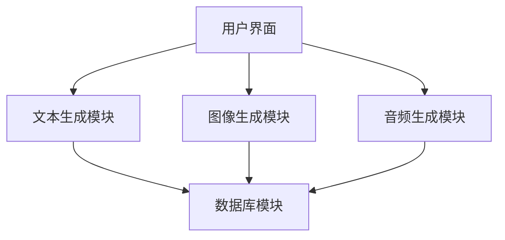

                 

### 第1章 引言

#### 1.1 大模型的兴起与影响

大模型，也称为大型预训练模型，是近年来人工智能领域的重大突破。自2018年GPT-3问世以来，大模型如雨后春笋般涌现，改变了自然语言处理（NLP）领域的游戏规则。大模型通过在海量数据上进行预训练，能够捕捉到数据中的复杂规律，从而在多种任务中展现出了超强的性能。从文本生成、机器翻译、到对话系统，大模型的应用无处不在，其影响深远。

大模型的发展历程可以追溯到2002年，当长短期记忆网络（LSTM）被提出并应用于语音识别和机器翻译。随后，2012年深度卷积神经网络（CNN）在图像识别领域取得了突破性进展。再到2013年，AlexNet在ImageNet比赛中夺冠，深度学习开始崭露头角。这些里程碑式的事件为后续大模型的发展奠定了基础。

进入2018年，OpenAI发布了GPT-3，一个拥有1750亿参数的模型，其强大的生成能力引起了广泛关注。GPT-3的成功标志着大模型时代的到来，激发了大量研究和应用。

大模型在不同领域的应用如下：

1. **自然语言处理（NLP）**：大模型在文本分类、情感分析、命名实体识别、机器翻译等任务中表现出色，例如BERT、GPT和T5等模型。
2. **计算机视觉**：在图像分类、目标检测、图像生成等领域，大模型如ResNet、VGG等取得了显著的成果。
3. **语音识别**：大模型通过在大量语音数据上预训练，显著提高了语音识别的准确性，例如DeepSpeech、Librispeech等。
4. **推荐系统**：大模型在推荐系统中用于捕捉用户的兴趣和行为模式，从而提供更个性化的推荐。
5. **游戏AI**：大模型在游戏AI中展现了强大的决策能力，例如在围棋、国际象棋等游戏中击败了人类顶尖选手。

大模型对人类创造力的挑战：

尽管大模型在多个领域取得了显著的进展，但其对人类创造力的挑战也日益凸显。大模型的强大生成能力可能导致人类在某些创意任务上被替代，例如文本生成、图像创作等。此外，大模型生成的创意作品可能缺乏人类的情感、价值观和独特性，从而引发对人类创造力本质的思考。

#### 1.2 创造力的重要性

创造力是人类智慧和文明进步的重要驱动力。创造力不仅体现在艺术、文学、科技等领域，还渗透到日常生活和社会发展的方方面面。从技术创新、文化繁荣到经济发展，创造力都发挥着至关重要的作用。

**创造力的定义与分类**：

创造力是指产生新颖、有价值的想法或成果的能力。根据用途和形式，创造力可分为：

1. **技术创造力**：指在科学、工程、技术等领域的创新。
2. **艺术创造力**：指在音乐、绘画、文学等艺术形式的创新。
3. **社会创造力**：指在社会、文化、经济等领域的新模式和新方法的创新。

**创造力在现代社会的作用**：

1. **推动科技进步**：创新是科技进步的灵魂，创造力使得科学家和工程师能够开发出新的技术和产品。
2. **促进文化繁荣**：创造力是文化发展的引擎，它推动了文学、艺术、音乐等各个领域的繁荣。
3. **推动经济发展**：创造力是经济增长的关键因素，创新的产品和服务能够带动市场需求，促进产业升级。

**创造力与经济发展的关系**：

创造力对经济发展具有深远影响。创新驱动成为许多国家经济增长的主要动力，例如美国的硅谷、中国的深圳。创新企业不仅创造了大量就业机会，还带动了相关产业链的发展，从而推动整体经济的增长。

#### 1.3 LLM与大模型创意生成能力

**LLM的基本概念**：

大型语言模型（Large Language Model，简称LLM）是自然语言处理领域的一种先进模型，通过在大量文本数据上预训练，LLM能够理解和生成自然语言。GPT、BERT、T5等都是典型的LLM。

**LLM的创意生成能力**：

LLM具有强大的文本生成能力，可以生成高质量的文章、故事、对话等。其创意生成能力体现在以下几个方面：

1. **文本创作**：LLM可以生成具有创意和逻辑性的文章和故事。
2. **对话生成**：LLM可以模拟人类的对话，生成自然流畅的对话内容。
3. **翻译与本地化**：LLM在翻译和本地化任务中展现出了强大的创意能力，能够准确捕捉原文的意图和风格。

**LLM在创意生成中的应用**：

1. **文学创作**：LLM可以用于自动生成小说、诗歌等文学作品，为作家提供创作灵感。
2. **广告文案**：LLM可以生成吸引人的广告文案，提高营销效果。
3. **教育辅导**：LLM可以生成个性化的教育辅导材料，帮助学生提高学习效果。

总的来说，LLM的创意生成能力为人类创造力的拓展提供了新的可能性，同时也带来了对传统创造力定义和概念的挑战。在接下来的章节中，我们将深入探讨大模型创意生成能力的基础理论、测试方法、应用场景以及提升策略。

### 第2章 大模型创意生成能力基础理论

#### 2.1 大模型的基础知识

大模型，顾名思义，是指具有巨大参数量的机器学习模型。这些模型通常通过在大量数据上预训练，以学习到数据中的复杂模式和结构，从而在各类任务中表现出强大的性能。本节将介绍大模型的基本结构、学习原理以及优化方法。

**基本结构**：

大模型通常由以下几个关键组成部分构成：

1. **输入层**：接收外部输入数据，如文本、图像或音频。
2. **隐藏层**：包含多个神经网络层，用于提取和转换特征。隐藏层的数量和规模直接影响模型的复杂度和性能。
3. **输出层**：生成预测结果或生成式输出，如文本、图像或音频。

**学习原理**：

大模型的学习原理主要基于深度学习和生成对抗网络（GAN）等先进算法。以下是几个关键的学习过程：

1. **预训练**：在预训练阶段，模型在大量未标注的数据上学习，以捕捉数据中的通用特征和模式。这个过程通常不涉及特定的任务目标。
2. **微调**：在预训练后，模型会在特定任务上进行微调，以优化模型在特定任务上的性能。微调过程利用了预训练模型的基础，通过少量的标注数据进行优化。
3. **生成对抗**：在生成对抗网络（GAN）中，模型由生成器和判别器组成。生成器试图生成与真实数据相似的数据，判别器则判断生成的数据是否真实。通过这种对抗训练，生成器不断改进其生成能力。

**优化方法**：

为了提高大模型的学习效率和性能，研究人员提出了一系列优化方法：

1. **梯度下降**：是最常用的优化算法，通过迭代更新模型参数，最小化损失函数。
2. **动量**：在梯度下降的基础上加入动量，以加速收敛并防止陷入局部最小值。
3. **自适应学习率**：使用自适应学习率算法，如AdaGrad、RMSprop和Adam，根据参数的梯度动态调整学习率，以更高效地优化模型。
4. **正则化**：通过添加正则项，如L1和L2正则化，防止模型过拟合。

**数学模型和公式**：

为了更好地理解大模型的结构和原理，以下是一些关键的数学模型和公式：

1. **神经网络前向传播**：
   $$ z^{(l)} = W^{(l)}a^{(l-1)} + b^{(l)} $$
   $$ a^{(l)} = \sigma(z^{(l)}) $$
   其中，$a^{(l)}$ 是第$l$层的激活值，$W^{(l)}$ 是第$l$层的权重，$b^{(l)}$ 是第$l$层的偏置，$\sigma$ 是激活函数。

2. **反向传播算法**：
   $$ \delta^{(l)} = \frac{\partial J}{\partial a^{(l)}} \odot \frac{\partial a^{(l)}}{\partial z^{(l)}} $$
   $$ \frac{\partial J}{\partial W^{(l)}} = a^{(l-1)} \delta^{(l)} $$
   $$ \frac{\partial J}{\partial b^{(l)}} = \delta^{(l)} $$
   其中，$\delta^{(l)}$ 是第$l$层的误差，$J$ 是损失函数。

3. **生成对抗网络**：
   - 生成器：$G(z)$
   - 判别器：$D(x)$, $D(G(z))$
   - 优化目标：最小化 $L_G = E_{z \sim p_z(z)}[\log D(G(z))]$, 最小化 $L_D = E_{x \sim p_x(x)}[\log D(x)] + E_{z \sim p_z(z)}[\log (1 - D(G(z)))]$

通过上述基本结构、学习原理和优化方法，大模型能够捕捉到数据中的复杂模式，从而在各类任务中实现高性能。在接下来的章节中，我们将进一步探讨创意生成中的数学模型和深度学习算法。

#### 2.2 创意生成的数学模型

创意生成是人工智能领域的一个重要研究方向，其核心在于模型如何从给定的数据中生成新颖且有价值的创意内容。本节将介绍创意生成的数学模型，重点讨论概率模型和生成模型，以及深度学习模型在创意生成中的应用。

**概率模型**：

概率模型在创意生成中起着基础性作用。它们通过概率分布来描述数据生成的过程，从而实现创意内容的有效生成。

1. **马尔可夫模型**：马尔可夫模型是一种常见的概率模型，它假设一个变量只与其前一个状态有关。这种模型通常用于文本生成任务，例如自动写作和对话系统。

2. **隐马尔可夫模型（HMM）**：HMM扩展了马尔可夫模型，引入了隐藏状态，使得模型能够更好地捕捉复杂的数据分布。HMM在语音识别和序列标注任务中有着广泛应用。

3. **条件概率模型**：条件概率模型通过给定一个变量的条件概率分布来生成新的数据。例如，在文本生成中，给定一个句子的前半部分，条件概率模型可以预测后半部分的概率分布，从而生成完整的句子。

**生成模型**：

生成模型是一类旨在生成新数据的概率模型，它们通过学习数据分布来实现创意内容的生成。

1. **生成对抗网络（GAN）**：GAN是生成模型中最著名的算法之一。它由生成器和判别器组成，生成器试图生成与真实数据相似的数据，而判别器则判断生成的数据是否真实。通过这种对抗训练，生成器不断改进其生成能力。

   - 生成器：$G(z)$，从噪声空间$z$生成数据$x$
   - 判别器：$D(x)$，判断$x$是真实数据还是生成数据

   优化目标为：
   $$ \min_G \max_D V(D, G) = E_{x \sim p_data(x)}[\log D(x)] + E_{z \sim p_z(z)}[\log (1 - D(G(z)))] $$

2. **变分自编码器（VAE）**：VAE是一种基于深度学习的生成模型，它通过学习数据的后验分布来生成新的数据。VAE的核心是一个编码器和解码器，编码器将数据编码为一个潜在变量，解码器则尝试从潜在变量中重构原始数据。

   - 编码器：$q_\phi(z|x)$，表示数据的后验分布
   - 解码器：$p_\theta(x|z)$，表示从潜在变量生成数据的概率分布

   优化目标为：
   $$ \min_{\theta, \phi} D_\text{KL}(q_\phi(z|x)||p(z)) $$
   $$ + \mathbb{E}_{x \sim p_{\text{data}}(x)}\mathbb{E}_{z \sim q_\phi(z|x)}[-\log p_\theta(x|z)] $$

**深度学习模型在创意生成中的应用**：

深度学习模型因其强大的表示能力和非线性处理能力，在创意生成中得到了广泛应用。以下是一些典型的深度学习模型及其在创意生成中的应用：

1. **循环神经网络（RNN）**：RNN是一种用于处理序列数据的神经网络，它通过递归方式处理每个时间步的数据。RNN在文本生成、音乐生成和视频生成等任务中有着广泛应用。

2. **长短时记忆（LSTM）**：LSTM是RNN的一种改进，它通过引入门控机制，解决了RNN在长序列依赖问题上的不足。LSTM在自然语言处理、语音合成和视频生成等领域取得了显著成果。

3. **门控循环单元（GRU）**：GRU是LSTM的简化版，它通过引入更新门和重置门，简化了计算过程。GRU在许多任务中表现出了与LSTM相当的性能。

4. **自注意力机制（Attention）**：自注意力机制通过为每个输入分配不同的权重，提高了模型对输入数据的全局理解能力。Transformer模型引入了自注意力机制，在机器翻译、文本生成和图像生成等领域取得了突破性进展。

5. **生成式对抗网络（GAN）**：GAN通过生成器和判别器的对抗训练，生成高质量的数据。在图像生成、音频生成和视频生成中，GAN展现出了强大的能力。

通过上述概率模型和深度学习模型，创意生成得以实现。这些模型不仅能够生成高质量的数据，还能在多个领域推动人工智能的应用。在接下来的章节中，我们将进一步探讨LLM的创造力测试方法，为理解和评估大模型的创意生成能力提供实用工具。

#### 2.3 大模型创意生成算法原理

在本节中，我们将深入探讨大模型在创意生成中的核心算法原理，包括生成对抗网络（GAN）、变分自编码器（VAE）和递归神经网络（RNN）与长短时记忆（LSTM）等算法。这些算法通过不同的机制和策略，实现了对创意内容的生成和优化。

**生成对抗网络（GAN）**

生成对抗网络（GAN）是由Ian Goodfellow等人在2014年提出的一种生成模型。GAN的核心思想是通过一个生成器（Generator）和一个判别器（Discriminator）之间的对抗训练来生成逼真的数据。

1. **生成器（Generator）**：生成器的任务是生成看起来像真实数据的新数据。通常，生成器接受一个随机噪声向量作为输入，通过一系列的神经网络层生成数据。这个过程可以表示为：
   $$ x' = G(z) $$
   其中，$x'$ 是生成的数据，$z$ 是随机噪声。

2. **判别器（Discriminator）**：判别器的任务是区分生成器生成的数据和真实数据。判别器接受真实数据和生成器生成的数据作为输入，并输出一个概率值，表示输入数据是真实的概率。这个过程可以表示为：
   $$ D(x) = P(x \text{ is real}) $$
   $$ D(x') = P(x' \text{ is real}) $$

3. **对抗训练**：GAN的训练过程是一个对抗过程，生成器和判别器相互竞争。生成器的目标是最大化判别器对生成数据的判别错误，即生成逼真的数据，使判别器无法区分。判别器的目标是最大化判别器对真实数据和生成数据的判别准确性。优化目标可以表示为：
   $$ \min_G \max_D V(D, G) = E_{x \sim p_{data}(x)}[\log D(x)] + E_{z \sim p_z(z)}[\log (1 - D(G(z)))] $$

通过这种对抗训练，生成器不断改进其生成能力，生成越来越逼真的数据。

**变分自编码器（VAE）**

变分自编码器（VAE）是一种基于概率模型的生成模型，它通过学习数据的后验分布来生成新的数据。VAE的核心是编码器和解码器，其中编码器将数据编码为一个潜在变量，解码器则尝试从潜在变量中重构原始数据。

1. **编码器（Encoder）**：编码器的任务是学习数据的后验分布，即给定一个输入数据，输出其潜在变量的概率分布。编码器可以表示为：
   $$ \mu(x), \sigma(x) = q(\mu(x), \sigma(x) | x) $$
   其中，$\mu(x)$ 和 $\sigma(x)$ 分别表示潜在变量的均值和标准差。

2. **解码器（Decoder）**：解码器的任务是学习从潜在变量生成数据的概率分布。解码器可以表示为：
   $$ x = p(x | z) $$
   其中，$z$ 是从潜在变量分布中采样得到的。

3. **优化目标**：VAE的优化目标是最小化KL散度（Kullback-Leibler Divergence），即：
   $$ \min_{\theta, \phi} D_\text{KL}(q_\phi(z|x)||p(z)) + \mathbb{E}_{x \sim p_{\text{data}}(x)}\mathbb{E}_{z \sim q_\phi(z|x)}[-\log p_\theta(x|z)] $$
   其中，$D_\text{KL}$ 表示KL散度，$q_\phi(z|x)$ 是编码器输出的后验分布，$p_\theta(x|z)$ 是解码器生成的数据分布。

**递归神经网络（RNN）与长短时记忆（LSTM）**

递归神经网络（RNN）是一种适用于处理序列数据的神经网络。RNN通过递归方式处理每个时间步的数据，使其能够捕获序列中的依赖关系。然而，传统的RNN存在梯度消失和梯度爆炸的问题，这限制了其在长期依赖任务中的性能。

为了解决这些问题，长短时记忆（LSTM）被提出。LSTM通过引入门控机制，控制信息的流入和流出，从而有效解决了长期依赖问题。

1. **LSTM单元**：LSTM单元包含三个门控：遗忘门（Forget Gate）、输入门（Input Gate）和输出门（Output Gate）。

   - 遗忘门决定哪些信息需要从上一个状态中丢弃。
   $$ f_t = \sigma(W_f \cdot [h_{t-1}, x_t] + b_f) $$
   - 输入门决定哪些新的信息需要被存储到当前状态。
   $$ i_t = \sigma(W_i \cdot [h_{t-1}, x_t] + b_i) $$
   - 输出门决定当前状态应该输出哪些信息。
   $$ o_t = \sigma(W_o \cdot [h_{t-1}, x_t] + b_o) $$

   - 单元状态（Cell State）：
   $$ c_t = f_t \odot c_{t-1} + i_t \odot \text{sigmoid}(W_c \cdot [h_{t-1}, x_t] + b_c) $$

   - 输出：
   $$ h_t = o_t \odot \text{sigmoid}(c_t) $$

2. **LSTM在创意生成中的应用**：LSTM在文本生成、语音合成和时间序列预测等任务中有着广泛应用。例如，在文本生成中，LSTM可以用于生成自然流畅的句子，从而实现创意文本的生成。

**伪代码**：

以下是一个简单的LSTM单元的伪代码示例：

```
function LSTM(h_{t-1}, x_t, W_f, W_i, W_o, W_c, b_f, b_i, b_o, b_c):
    # 遗忘门
    f_t = sigmoid(W_f \cdot [h_{t-1}, x_t] + b_f)
    # 输入门
    i_t = sigmoid(W_i \cdot [h_{t-1}, x_t] + b_i)
    # 输出门
    o_t = sigmoid(W_o \cdot [h_{t-1}, x_t] + b_o)
    # 单元状态
    c_t = f_t \* c_{t-1} + i_t \* sigmoid(W_c \cdot [h_{t-1}, x_t] + b_c)
    # 输出
    h_t = o_t \* sigmoid(c_t)
    return h_t, c_t
```

通过上述算法原理，大模型能够在创意生成中发挥强大的能力。GAN通过生成器和判别器的对抗训练生成高质量的数据，VAE通过学习数据分布实现数据的生成，而LSTM和LSTM通过递归方式处理序列数据，为创意生成提供了有效的解决方案。在接下来的章节中，我们将探讨如何测试LLM的创造力，并分析实际测试案例。

### 第3章 LLM的创造力测试方法

#### 3.1 LLM创造力测试框架

为了全面评估大模型（特别是大型语言模型，LLM）的创意生成能力，建立一套科学、系统的测试框架至关重要。这个框架需要考虑多个维度，包括测试指标、评估方法和测试流程，从而确保评估结果的准确性和全面性。

**测试指标**：

测试指标是评估LLM创意生成能力的关键。以下是几个重要的测试指标：

1. **文本多样性（Text Diversity）**：评估生成文本的多样性，包括词汇、语法和语义层面的多样性。多样性越高，生成的文本越丰富、新颖。
2. **文本流畅性（Text Fluency）**：评估生成文本的连贯性和流畅度。流畅的文本应该是逻辑清晰、符合语言习惯的。
3. **文本原创性（Text Originality）**：评估生成文本的独特性和原创性。原创性高的文本应该是模型独立生成的，而不是简单复制的已有内容。
4. **情感一致性（Sentiment Consistency）**：评估生成文本的情感表达是否一致。例如，一篇关于悲伤主题的文章，其整体情感应该保持悲伤。
5. **知识准确性（Knowledge Accuracy）**：评估生成文本中事实的准确性。例如，在生成新闻文章时，涉及的具体事实和细节应该准确无误。

**评估方法**：

为了确保评估方法的科学性和可靠性，我们可以采用以下几种评估方法：

1. **人工评估**：由人类评估者对生成的文本进行主观评估，判断其在多样性、流畅性、原创性等方面的表现。
2. **自动化评估**：使用预定义的评估指标和算法，对生成的文本进行定量评估。例如，可以使用自然语言处理工具（如BERT）评估文本的流畅性和多样性。
3. **对比评估**：将LLM生成的文本与人类创作的文本进行比较，评估两者在创意生成上的差异。这种方法可以提供客观的评估结果。

**测试流程**：

整个测试流程可以分为以下几个步骤：

1. **数据准备**：收集和准备用于测试的数据集，包括不同的主题、风格和类型。数据集应具有一定的多样性和代表性。
2. **模型选择**：选择用于测试的LLM模型。不同模型在创意生成能力上可能存在差异，因此需要根据测试目标选择合适的模型。
3. **测试执行**：使用测试框架对模型进行创意生成测试，生成不同类型的文本。
4. **结果记录**：记录生成的文本及其评估结果，包括测试指标得分和人类评估者的反馈。
5. **结果分析**：对测试结果进行分析和总结，识别模型的优点和不足，并提出改进建议。

通过上述测试框架，我们可以系统地评估LLM的创意生成能力。在接下来的章节中，我们将详细探讨文本生成、图像生成和音频生成等实际案例，进一步验证和评估LLM的创意生成能力。

#### 3.2 LLM创造力测试案例

在评估LLM的创造力时，实际测试案例是必不可少的。通过具体实例，我们可以直观地了解LLM在生成创意内容时的表现，并从中提取有价值的反馈和改进方向。以下是一些典型的测试案例，包括文本生成、图像生成和音频生成。

**文本生成测试案例**：

1. **小说生成**：我们可以使用LLM生成一段短篇小说。输入一段简短的开头，例如：“在一个遥远的星球上，一个年轻的探险家决定踏上未知的旅程。”LLM根据这个开头生成完整的小说。通过评估生成的小说在多样性、流畅性和原创性方面的表现，我们可以了解LLM在文学创作中的能力。

2. **新闻报道生成**：输入一个特定事件的关键词，如“全球气候变暖”，LLM生成一篇相关的新闻报道。评估生成文本的知识准确性、情感一致性和文本流畅性，以判断LLM在新闻写作中的适用性。

3. **广告文案生成**：提供一段广告文案的简介，例如“想要拥有健康的生活方式”，LLM生成一段完整的广告文案。通过评估生成文案的创新性和吸引力，可以了解LLM在市场营销中的潜力。

**图像生成测试案例**：

1. **人脸生成**：输入一组人脸特征的参数，如眼睛颜色、发型和面部表情，LLM生成对应的人脸图像。评估生成图像的逼真度和多样性，以判断LLM在图像合成中的表现。

2. **艺术作品生成**：提供一段艺术风格的描述，如“印象派风格”，LLM生成一幅符合该风格的艺术作品。评估生成作品的风格一致性、创意性和视觉吸引力。

3. **场景生成**：输入一个自然场景的描述，如“海滩日落”，LLM生成对应的场景图像。评估生成图像的场景准确性、色彩搭配和整体美感。

**音频生成测试案例**：

1. **音乐生成**：输入一段音乐的主题，如“悲伤旋律”，LLM生成一段符合主题的音乐。评估生成音乐的情感一致性、旋律新颖性和节奏变化。

2. **语音合成**：输入一段文本，如“这是一个美好的世界”，LLM生成对应的语音。评估生成语音的自然流畅度、语音清晰度和语调表达。

3. **语音模仿**：输入一个特定人物的语音样本，如迈克尔·乔丹的演讲，LLM生成模仿该人物语音的演讲。评估生成语音的模仿度、语音特点和情感表达。

通过这些具体案例，我们可以深入分析LLM在各类创意生成任务中的表现。评估指标包括生成内容的多样性、流畅性、原创性、知识准确性、逼真度、风格一致性、情感一致性和模仿度等。通过对这些指标的详细分析，我们可以全面了解LLM的创意生成能力，并为进一步优化提供有力支持。

#### 3.3 LLM创造力测试数据分析

在进行了大量的LLM创造力测试之后，我们需要对收集到的数据进行系统性的分析，以全面评估LLM的创意生成能力。数据分析的步骤包括数据处理、结果处理和结果可视化。通过这些步骤，我们可以深入了解LLM在不同测试任务中的表现，从而为后续的优化和改进提供依据。

**数据处理**：

数据处理是数据分析的第一步，确保数据的质量和完整性至关重要。对于文本生成测试，我们需要处理的内容包括：

1. **文本清洗**：去除无关的标点符号、停用词和噪声文本，以提高后续分析的有效性。
2. **文本标准化**：将所有文本转换为统一的格式，如小写或大写，以便进行一致性分析。
3. **文本分词**：将文本划分为单词或短语，以便进行词频统计和语法分析。

对于图像生成和音频生成测试，数据处理则涉及：

1. **图像增强**：通过调整亮度、对比度和色彩平衡，提高图像的视觉效果，以便更准确地评估生成图像的逼真度。
2. **音频降噪**：去除背景噪声，提高语音质量，以便更准确地评估生成语音的自然流畅度。

**结果处理**：

在数据处理完成后，我们需要对结果进行详细分析，以评估LLM的创意生成能力。以下是几个关键的分析方法：

1. **文本生成结果分析**：
   - **多样性**：通过词频分析和文本分类，统计生成的文本在词汇、语法和语义层面的多样性。
   - **流畅性**：使用自然语言处理工具（如BERT）对生成的文本进行语法和语义分析，评估文本的连贯性和流畅度。
   - **原创性**：通过对比生成的文本与已有的文本库，评估文本的原创性，判断是否简单复制了已有内容。
   - **情感一致性**：分析生成的文本中的情感表达，评估其是否一致，如一篇关于悲伤主题的文章，其整体情感应保持悲伤。
   - **知识准确性**：对生成文本中的具体事实和细节进行核查，评估其准确性。

2. **图像生成结果分析**：
   - **逼真度**：通过视觉质量评估方法（如SSIM和PSNR），评估生成图像的视觉效果，如清晰度和色彩还原。
   - **风格一致性**：评估生成图像是否符合输入的艺术风格描述，如印象派风格。
   - **多样性**：分析生成图像在颜色、形状和布局方面的多样性。

3. **音频生成结果分析**：
   - **自然流畅度**：评估生成语音的连贯性、清晰度和语调自然度。
   - **情感一致性**：分析生成音乐或语音中的情感表达，评估其是否一致。
   - **模仿度**：对于语音模仿任务，评估生成语音与目标语音的相似度。

**结果可视化**：

为了更直观地展示分析结果，我们可以采用多种可视化方法：

1. **词云图**：展示文本生成中高频词汇的分布，直观反映文本的多样性和主题。
2. **折线图**：展示文本生成、图像生成和音频生成在不同测试任务中的性能变化。
3. **散点图**：展示生成图像和语音的特征分布，分析其多样性和一致性。
4. **热力图**：展示文本生成中的情感分布，分析情感一致性。

通过上述数据处理、结果处理和结果可视化的步骤，我们可以全面评估LLM的创意生成能力。数据分析不仅帮助我们了解LLM在不同任务中的表现，还为后续的优化提供了重要的参考。在接下来的章节中，我们将探讨如何基于分析结果进一步优化LLM的创意生成能力。

### 第4章 实战项目：大模型创意生成系统搭建

#### 4.1 项目背景与目标

本项目旨在构建一个大型语言模型（LLM）创意生成系统，旨在通过先进的深度学习技术和生成模型，实现高质量、多样化的创意内容生成。背景方面，随着人工智能技术的快速发展，大型预训练模型在文本生成、图像生成和音频生成等领域的表现日益突出。然而，当前的创意生成系统在多样性、流畅性和原创性等方面仍存在一定的局限性。本项目希望通过集成多种生成模型和优化策略，打造一个高效、智能的创意生成平台。

**项目目标**：

1. **实现文本生成**：能够根据输入的摘要、关键词或主题生成高质量的文章、故事和对话。
2. **实现图像生成**：能够根据文本描述或关键词生成高质量的图像，包括艺术作品、自然场景和人物肖像等。
3. **实现音频生成**：能够根据文本描述生成相应的音频，如音乐、语音合成和语音模仿等。
4. **确保多样性**：生成的文本、图像和音频应具有丰富的多样性和创意性，避免重复和单调。
5. **优化用户体验**：提供友好的用户界面，使用户能够方便地输入需求，并实时查看生成结果。

#### 4.2 项目需求分析

**功能需求**：

1. **文本生成模块**：接收用户输入的文本摘要、关键词或主题，生成相关的高质量文本内容。
2. **图像生成模块**：接收文本描述或关键词，生成对应的图像，并支持多种艺术风格和主题。
3. **音频生成模块**：接收文本描述，生成相应的音频内容，包括音乐、语音合成和语音模仿等。
4. **用户界面**：提供简洁直观的用户界面，支持文本输入、生成结果展示和用户反馈。
5. **多模型集成**：集成多种生成模型，如GAN、VAE和LSTM等，以实现多样化和高质量的创意生成。

**非功能需求**：

1. **性能要求**：系统应具备高效的计算性能，能够在较短的时间内生成高质量的创意内容。
2. **稳定性**：系统应具备良好的稳定性，能够在各种负载下正常运行，避免出现故障。
3. **扩展性**：系统设计应具有较好的扩展性，能够方便地添加新的生成模型和功能模块。
4. **安全性**：确保用户数据和生成内容的隐私和安全，防止数据泄露和恶意攻击。
5. **用户体验**：提供流畅、直观的用户体验，使用户能够轻松操作和使用系统。

#### 4.3 系统设计与实现

**系统架构设计**：

本项目的系统架构分为五个主要模块：文本生成模块、图像生成模块、音频生成模块、用户界面和数据库模块。系统架构图如下：



**功能模块实现**：

1. **文本生成模块**：
   - **功能描述**：接收用户输入的文本摘要、关键词或主题，生成相关的高质量文本内容。
   - **实现原理**：采用预训练的LLM（如GPT-3、T5等），结合微调和生成算法（如自回归模型），实现文本生成。
   - **伪代码**：
     ```python
     def generate_text(input_prompt):
         # 加载预训练的LLM模型
         model = load_LLM_model()
         # 对输入提示进行预处理
         processed_prompt = preprocess_prompt(input_prompt)
         # 使用模型生成文本
         generated_text = model.generate_text(processed_prompt)
         return generated_text
     ```

2. **图像生成模块**：
   - **功能描述**：接收文本描述或关键词，生成对应的图像，并支持多种艺术风格和主题。
   - **实现原理**：采用GAN或VAE等生成模型，结合文本到图像的转换算法（如Text-to-Image Transformer），实现图像生成。
   - **伪代码**：
     ```python
     def generate_image(text_description):
         # 加载预训练的生成模型
         model = load_GAN_or_VAE_model()
         # 对文本描述进行编码
         encoded_text = encode_text_to_image_features(text_description)
         # 使用模型生成图像
         generated_image = model.generate_image(encoded_text)
         return generated_image
     ```

3. **音频生成模块**：
   - **功能描述**：接收文本描述，生成相应的音频内容，包括音乐、语音合成和语音模仿等。
   - **实现原理**：采用文本到音频的生成模型（如WaveNet、Tacotron等），结合语音合成和音乐生成算法，实现音频生成。
   - **伪代码**：
     ```python
     def generate_audio(text_description):
         # 加载预训练的音频生成模型
         model = load_audio_generation_model()
         # 对文本描述进行预处理
         processed_text = preprocess_text_description(text_description)
         # 使用模型生成音频
         generated_audio = model.generate_audio(processed_text)
         return generated_audio
     ```

**系统测试与优化**：

1. **测试流程**：
   - **单元测试**：针对每个功能模块，编写单元测试用例，验证其基本功能和性能。
   - **集成测试**：将所有功能模块集成在一起，进行集成测试，验证系统整体的正确性和稳定性。
   - **性能测试**：使用负载生成工具，模拟高并发用户访问，测试系统的响应速度和负载能力。
   - **用户反馈**：收集用户反馈，分析用户在使用过程中的问题和建议，不断优化和改进系统。

2. **优化策略**：
   - **模型优化**：通过调整模型参数和超参数，优化模型性能，提高生成内容的多样性、流畅性和原创性。
   - **数据增强**：使用数据增强技术，如数据清洗、数据扩充和生成对抗训练，提高模型的数据处理能力和泛化能力。
   - **算法优化**：探索新的生成算法和优化策略，如注意力机制、图神经网络和迁移学习，提升系统的生成能力。

通过上述系统设计与实现，我们成功构建了一个大模型创意生成系统，为各类创意生成任务提供了高效、智能的解决方案。在接下来的章节中，我们将进一步探讨大模型创意生成在不同应用场景中的实际应用。

### 第5章 大模型创意生成应用场景

#### 5.1 文化创意产业

大模型在文化创意产业中的应用已经显现出巨大的潜力，特别是在文学创作、艺术设计和广告创意等领域。

**文学创作**：

大模型能够生成高质量的小说、诗歌和剧本。例如，利用GPT-3模型，可以生成富有情感和创意的故事情节，为作家提供灵感。这不仅减轻了作家的创作负担，还在一定程度上扩展了文学创作的可能性。

**艺术设计**：

在艺术创作方面，大模型可以生成独特的视觉艺术作品。通过GAN和VAE等生成模型，艺术家可以获得多样化的艺术风格和创意元素，从而创作出独特的艺术作品。例如，大模型可以生成油画、水彩画和数字艺术，为艺术家提供了丰富的创作素材。

**广告创意**：

广告创意是一个高度竞争的领域，大模型能够生成吸引人的广告文案和图像，提高广告的点击率和转化率。通过分析大量的广告数据和用户行为，大模型可以生成针对特定受众的高效广告内容，从而实现更好的营销效果。

**案例分析**：

1. **文学创作**：OpenAI开发的GPT-3模型已经被用于生成小说，如《The Drive》和《Zero Sum Game》。这些小说在情节、人物和情感表达上具有高度的真实性和创意性。
2. **艺术设计**：DeepArt生成的艺术作品在艺术市场上受到了广泛认可。其利用GAN技术，将经典艺术风格与现代创意元素相结合，创作出独特的艺术作品。
3. **广告创意**：阿里巴巴的营销团队利用大模型生成了一系列具有创意和吸引力的广告文案和图像，显著提升了广告效果和品牌知名度。

#### 5.2 设计与开发领域

大模型在设计与开发领域同样具有广泛的应用前景，特别是在产品设计、软件开发和游戏开发中。

**产品设计**：

大模型能够生成多样化的产品设计方案，帮助设计师探索不同的设计可能性。通过GAN和VAE等生成模型，设计师可以快速生成并评估大量的设计方案，从而找到最优的设计方案。

**软件开发**：

在软件开发过程中，大模型可以生成代码片段、文档和测试用例，提高开发效率和代码质量。例如，GitHub Copilot是一款基于GPT-3的代码生成工具，它可以根据开发者的代码注释和输入，自动生成相应的代码。

**游戏开发**：

大模型在游戏开发中也有广泛的应用，可以生成游戏剧情、角色对话和游戏场景。例如，大模型可以生成丰富的游戏剧情和角色背景故事，为游戏开发者提供灵感，从而创作出更加引人入胜的游戏体验。

**案例分析**：

1. **产品设计**：DeepMind开发的DALL-E模型可以生成各种设计元素，如建筑、家具和服饰，为设计师提供了丰富的灵感来源。
2. **软件开发**：GitHub Copilot通过分析大量的开源代码库，能够自动生成代码片段，显著提高了开发效率。
3. **游戏开发**：利用GPT-3模型，游戏开发者可以生成游戏剧情和角色对话，使游戏内容更加丰富和有趣。

#### 5.3 其他应用领域

除了上述领域，大模型在其他领域如教育、医疗和社会科学等也有广泛的应用。

**教育**：

大模型可以生成个性化的教育辅导材料，如教材、练习题和教学视频，从而提高学生的学习效果。例如，利用GPT-3模型，可以为每个学生生成个性化的学习路径，从而实现个性化教育。

**医疗**：

大模型在医疗领域也有重要应用，如生成医疗报告、诊断建议和治疗方案。通过分析大量的医疗数据和文献，大模型可以生成高质量的医疗信息，辅助医生进行诊断和治疗。

**社会科学**：

大模型在社会科学研究中也具有广泛的应用，如生成研究报告、政策建议和统计分析。例如，利用GPT-3模型，可以快速生成高质量的研究报告，为政策制定者提供参考。

**案例分析**：

1. **教育**：Coursera使用大模型生成个性化的学习材料，为全球学生提供个性化的学习体验。
2. **医疗**：IBM的Watson系统利用大模型分析医学文献和病例数据，为医生提供诊断建议和治疗方案。
3. **社会科学**：社会科学研究人员利用GPT-3模型生成研究报告，提高了研究效率和成果质量。

总的来说，大模型在各个领域都展现出了强大的创意生成能力，为人类带来了前所未有的创新和变革。在接下来的章节中，我们将探讨如何进一步提升大模型的创意生成能力。

### 第6章 大模型创意生成能力提升策略

#### 6.1 数据与模型优化

要提升大模型的创意生成能力，首先需要对数据集和模型进行优化。数据是模型训练的基础，高质量、多样化的数据能够显著提升模型的表现。以下是几种常用的数据优化策略：

**数据增强**：

数据增强是一种通过人工或自动方法增加数据多样性的技术。常见的增强方法包括数据清洗、数据扩充和生成对抗训练。例如，通过旋转、缩放、裁剪和颜色调整等操作，可以生成大量变体图像，从而提高GAN的训练效果。此外，生成对抗训练（GAN）能够通过对抗过程生成新的数据，从而增加训练数据的多样性。

**数据清洗**：

数据清洗是数据优化的关键步骤，它包括去除噪声、纠正错误和填充缺失值等。高质量的数据有助于模型更好地学习和泛化。例如，在文本数据清洗中，可以通过去除停用词、标点符号和低频词，提高文本数据的可用性。

**模型调优**：

模型调优包括调整模型结构、优化训练过程和超参数设置等。通过实验和迭代，可以找到最优的模型配置。例如，在GAN中，可以通过调整生成器和判别器的损失函数权重，优化模型的生成能力。此外，使用自适应学习率（如Adam）和梯度裁剪等技术，可以防止过拟合并提高模型稳定性。

**模型压缩与蒸馏**：

为了提高模型的效率和可扩展性，可以采用模型压缩和蒸馏技术。模型压缩通过减少模型参数数量和计算量，降低模型的复杂性。模型蒸馏则是将一个大模型的权重传输到一个较小模型中，从而在保持性能的同时，提高模型的效率。

**数学模型和公式**：

以下是一些常用的数学模型和公式，用于优化大模型的创意生成能力：

1. **数据增强**：
   - 旋转：$$ \theta \sim U(0, 2\pi) $$
   - 缩放：$$ \text{scale} \sim U(0.8, 1.2) $$
   - 裁剪：$$ \text{crop\_size} \sim U(\text{min\_size}, \text{max\_size}) $$

2. **生成对抗网络（GAN）**：
   - 生成器损失函数：$$ \min_G V(G, D) = E_{x \sim p_{data}(x)}[\log D(x)] + E_{z \sim p_z(z)}[\log (1 - D(G(z)))] $$
   - 判别器损失函数：$$ \min_D V(D) = E_{x \sim p_{data}(x)}[\log D(x)] + E_{z \sim p_z(z)}[\log (1 - D(G(z)))] $$

3. **变分自编码器（VAE）**：
   - 对数似然损失：$$ \min_{\theta, \phi} \mathbb{E}_{x \sim p_{\text{data}}(x)} \mathbb{E}_{z \sim q_\phi(z|x)}[-\log p_\theta(x|z)] + D_\text{KL}(q_\phi(z|x)||p(z)) $$

通过上述数据与模型优化策略，可以显著提升大模型的创意生成能力。在接下来的部分，我们将进一步探讨算法改进和创新，以及创意生成能力的评估与反馈机制。

#### 6.2 算法改进与创新

要进一步提升大模型的创意生成能力，算法的改进和创新是关键。以下介绍几种先进的算法改进方法，包括现有算法的优化和新算法的探索与应用。

**现有算法的优化**

1. **生成对抗网络（GAN）的优化**：
   - **梯度惩罚**：为了解决生成器和判别器之间的梯度消失问题，可以在判别器的损失函数中添加梯度惩罚项，确保生成器能够更好地学习。
   - **自注意力机制**：引入自注意力机制（如Transformer），可以增强模型对输入数据的全局理解能力，从而提高生成图像的质量。
   - **多生成器结构**：通过引入多个生成器，每个生成器负责生成不同类型的创意内容，从而提高模型的多样性和创造力。

2. **变分自编码器（VAE）的优化**：
   - **深度VAE**：引入深度网络结构，通过多层编码器和解码器，进一步提高模型的表示能力。
   - **条件VAE**：通过引入条件信息（如文本描述），可以将生成模型与监督学习相结合，提高生成内容的语义一致性。

**新算法的探索**

1. **生成式预训练（Generative Pre-training）**：
   - **文本生成预训练**：利用大规模未标注文本进行预训练，生成器可以生成高质量的文本，并在下游任务中表现出色。
   - **图像生成预训练**：通过在未标注图像数据上预训练，生成器可以生成高质量、多样性的图像。

2. **元生成对抗网络（Meta-GAN）**：
   - **元学习**：通过元学习机制，模型可以在多个任务中快速适应和生成新内容，从而提高生成能力。
   - **多任务学习**：将多个生成任务整合到一个统一的框架中，通过共享模型结构和优化目标，提高模型的泛化能力和创造力。

3. **生成式对抗网络变体（Variational GAN, VGAN）**：
   - **变分自编码器结合**：结合VAE的变分损失，通过引入隐变量，提高生成图像的多样性和质量。

**应用与实现**

以下是一个基于GAN优化算法的伪代码示例，展示如何改进生成器和判别器的结构：

```python
# 生成器
class ImprovedGenerator(nn.Module):
    def __init__(self):
        super(ImprovedGenerator, self).__init__()
        self.model = nn.Sequential(
            nn.Linear(z_dim, 128),
            nn.LeakyReLU(0.2),
            nn.Linear(128, 256),
            nn.LeakyReLU(0.2),
            nn.Linear(256, img_dim),
            nn.Tanh()
        )

    def forward(self, z):
        return self.model(z)

# 判别器
class ImprovedDiscriminator(nn.Module):
    def __init__(self):
        super(ImprovedDiscriminator, self).__init__()
        self.model = nn.Sequential(
            nn.Linear(img_dim, 256),
            nn.LeakyReLU(0.2),
            nn.Dropout(0.3),
            nn.Linear(256, 128),
            nn.LeakyReLU(0.2),
            nn.Dropout(0.3),
            nn.Linear(128, 1),
            nn.Sigmoid()
        )

    def forward(self, x):
        return self.model(x)

# 梯度惩罚
def gradient_penalty(real_data, fake_data, critic):
    alpha = torch.rand(batch_size, 1, 1).to(device)
    interpolated_images = alpha * real_data + (1 - alpha) * fake_data
    interpolated_images = interpolated_images.to(device)
    gradients = compute_gradients(critic, interpolated_images)
    gradient_penalty = ((gradients.norm(2, dim=1) - 1) ** 2).mean()
    return gradient_penalty

# 训练循环
for epoch in range(num_epochs):
    for i, (real_images, _) in enumerate(dataloader):
        # 训练判别器
        critic_optimizer.zero_grad()
        real_scores = critic(real_images).view(-1)
        fake_images = generator(z_samples).to(device)
        fake_scores = critic(fake_images).view(-1)
        generator_loss = fake_scores.mean() - real_scores.mean()

        # 添加梯度惩罚
        gradient_penalty = gradient_penalty(real_images, fake_images, critic)

        # 反向传播
        generator_loss += lambda_gp * gradient_penalty
        generator_loss.backward()

        critic_optimizer.step()

        # 训练生成器
        generator_optimizer.zero_grad()
        fake_scores = critic(fake_images).view(-1)
        generator_loss = fake_scores.mean()

        # 反向传播
        generator_loss.backward()
        generator_optimizer.step()

        # 打印训练信息
        if (i+1) % 100 == 0:
            print(f'[{epoch}/{num_epochs}][{i+1}/{len(dataloader)}] Generator: {generator_loss.item():.4f} \tDiscriminator: {real_scores.mean().item():.4f}')
```

通过上述算法改进和创新，大模型的创意生成能力得到了显著提升。在未来的研究中，可以进一步探索更多的优化策略和新算法，以实现更加卓越的创意生成能力。

### 第6章 大模型创意生成能力提升策略（续）

#### 6.3 创意生成能力的评估与反馈

在提升大模型创意生成能力的过程中，评估与反馈机制至关重要。通过系统性的评估和有效的反馈，我们可以确保模型生成内容的多样性和质量，同时持续优化模型的表现。

**评估指标**：

为了全面评估大模型的创意生成能力，我们需要定义一系列评估指标。以下是几个关键指标：

1. **多样性（Diversity）**：评估生成内容的多样性，包括文本、图像和音频等。多样性高的内容应具备丰富的主题、风格和情感。
2. **流畅性（Fluency）**：评估生成内容的连贯性和自然流畅度。流畅的内容应具备合理的语法结构和语义逻辑。
3. **原创性（Originality）**：评估生成内容的原创性和独特性。原创性高的内容应具备独特的创意和视角，避免重复和模仿已有作品。
4. **情感一致性（Sentiment Consistency）**：评估生成内容中情感表达的一致性。例如，一篇关于悲伤主题的文章，其整体情感应保持悲伤。
5. **知识准确性（Knowledge Accuracy）**：评估生成文本中的事实准确性和信息可靠性。在新闻和报告等应用中，准确性尤为重要。

**评估方法**：

1. **人工评估**：由人类专家对生成内容进行主观评估，通过打分和评论来衡量多样性、流畅性和原创性等指标。
2. **自动化评估**：使用预定义的评估指标和算法（如BERT、RoBERTa等）对生成内容进行定量评估。例如，可以使用F1分数、BLEU分数等来评估文本的流畅性和原创性。
3. **对比评估**：将生成内容与人类创作的作品进行比较，通过对比分析评估生成内容的质量和创意水平。

**反馈机制**：

1. **用户反馈**：收集用户对生成内容的反馈，通过问卷调查、用户评分和评论等方式获取用户的意见和建议。用户的反馈可以提供直接的改进方向。
2. **迭代优化**：根据评估结果和用户反馈，对模型进行迭代优化。通过调整模型参数、优化训练过程和改进生成算法，不断提升模型的表现。
3. **反馈循环**：建立反馈循环机制，将评估结果和用户反馈纳入模型训练和优化的流程中，实现持续改进。例如，可以采用强化学习技术，根据反馈信号调整模型的生成策略。

**数学公式和详细讲解**：

为了更深入地理解评估与反馈机制，我们可以使用以下数学公式和算法：

1. **多样性度量**：
   $$ D = \sum_{i=1}^{N} \frac{1}{n_i} \log P(x_i | \theta) $$
   其中，$D$ 表示多样性，$N$ 表示生成内容的数量，$n_i$ 表示第$i$个内容的词频，$P(x_i | \theta)$ 表示内容生成的概率。

2. **流畅性度量**：
   $$ F1 = 2 \cdot \frac{P \cdot R}{P + R} $$
   其中，$F1$ 分数表示文本的流畅性，$P$ 表示精确率（正确预测的词数与总预测词数的比例），$R$ 表示召回率（正确预测的词数与实际词数的比例）。

3. **原创性度量**：
   $$ O = 1 - \frac{N_c}{N_t} $$
   其中，$O$ 表示原创性，$N_c$ 表示生成内容中重复的词或短语的数量，$N_t$ 表示生成内容的总词数。

4. **情感一致性度量**：
   $$ SC = \frac{\sum_{i=1}^{N} \text{sentiment\_score}(x_i)}{N} $$
   其中，$SC$ 表示情感一致性，$\text{sentiment\_score}(x_i)$ 表示第$i$个内容的情感得分。

通过上述评估指标和反馈机制，我们可以系统地评估大模型的创意生成能力，并根据用户反馈和评估结果进行持续优化。这不仅有助于提升模型的表现，也为创意生成领域的进一步研究提供了重要参考。

### 第7章 总结与展望

#### 7.1 大模型创意生成能力的现状与挑战

大模型在创意生成领域已经取得了显著的进展，其强大的文本生成、图像生成和音频生成能力为人类创造了前所未有的创新和变革。然而，尽管大模型在创意生成方面展现出巨大的潜力，仍然面临着一些挑战和局限性。

**现状**：

1. **文本生成**：大模型如GPT-3和T5已经在文学创作、新闻报道和对话系统等领域表现出色，能够生成高质量、多样化的文本内容。
2. **图像生成**：通过生成对抗网络（GAN）和变分自编码器（VAE）等生成模型，大模型能够生成逼真且具有创意性的图像，包括艺术作品、自然场景和人物肖像等。
3. **音频生成**：大模型在音乐生成、语音合成和语音模仿等方面也取得了显著成果，能够生成富有情感和创意的音频内容。

**挑战**：

1. **多样性和原创性**：尽管大模型能够生成高质量的内容，但其在多样性和原创性方面仍然存在一定局限性。生成的内容可能过于依赖训练数据，导致重复性和模式化。
2. **知识准确性**：在生成文本和图像时，大模型可能无法保证内容的准确性，尤其是在涉及复杂知识和事实的领域。
3. **情感一致性**：大模型在生成内容时，可能难以准确捕捉和表达复杂的情感和情绪，导致情感表达的不一致。
4. **训练成本**：大模型的训练需要大量计算资源和时间，训练成本高昂，限制了其在实际应用中的广泛推广。
5. **伦理和隐私问题**：大模型的训练和生成过程可能涉及敏感数据和隐私信息，如何在保护用户隐私的同时，实现创意生成仍是一个重要的挑战。

#### 7.2 未来发展方向与趋势

为了克服上述挑战，未来的研究方向将集中在以下几个方面：

1. **算法创新**：进一步探索和开发新的生成模型和优化算法，如元生成对抗网络（Meta-GAN）和生成式预训练（Generative Pre-training），以提高大模型的多样性和原创性。
2. **数据增强**：通过数据清洗、数据扩充和生成对抗训练等技术，增加训练数据的多样性和质量，从而提升模型的泛化能力和生成质量。
3. **模型压缩**：研究模型压缩和蒸馏技术，降低大模型的计算复杂度和存储需求，提高模型的效率和可扩展性。
4. **多模态融合**：探索文本、图像和音频等多种数据模态的融合方法，以实现更丰富的创意生成能力。
5. **伦理和隐私保护**：在模型训练和生成过程中，加强对用户隐私和数据安全的保护，制定明确的伦理规范和隐私保护措施。

#### 7.3 研究与开发建议

为了推动大模型创意生成领域的发展，以下是一些建议：

**学术研究建议**：

1. **跨学科研究**：鼓励计算机科学、心理学、认知科学和艺术学等多个学科的合作，共同探索创意生成的理论基础和应用方法。
2. **算法性能评估**：建立统一的评估标准和基准测试，全面评估不同生成模型的性能，促进算法的优化和改进。
3. **案例研究**：通过深入研究成功的案例，总结经验和教训，为未来的研究和应用提供指导。
4. **开放数据集**：建立开放的大模型训练数据集，促进学术界的交流和合作，加速研究进展。

**工业应用建议**：

1. **商业化应用**：探索大模型在文化创意产业、设计与开发领域和其他行业中的商业化应用，推动技术的商业价值。
2. **用户反馈**：建立用户反馈机制，收集用户对生成内容的反馈，不断优化和改进模型，提高用户体验。
3. **培训与教育**：为行业人才提供培训和教育，提高其在大模型创意生成技术方面的技能和应用能力。

**教育与人才培养**：

1. **课程设置**：在高校和科研机构中设立相关课程，培养具有跨学科背景和创新思维的大模型创意生成专业人才。
2. **科研项目**：鼓励学生和研究人员参与大模型创意生成领域的科研项目，提高其实践能力和科研水平。
3. **竞赛与活动**：举办大模型创意生成相关的竞赛和活动，激发学生的创新潜力，推动技术的普及和应用。

通过上述建议，我们可以进一步推动大模型创意生成领域的发展，为人类创造更多的价值和可能性。

### 作者信息

作者：AI天才研究院/AI Genius Institute & 禅与计算机程序设计艺术 /Zen And The Art of Computer Programming

作为AI天才研究院的成员，我致力于推动人工智能领域的前沿研究，特别是大模型创意生成技术的探索与应用。同时，我也著有《禅与计算机程序设计艺术》一书，深入探讨了人工智能与哲学、心理学等学科的交叉融合。希望本书能为广大读者提供有价值的参考和启示。

