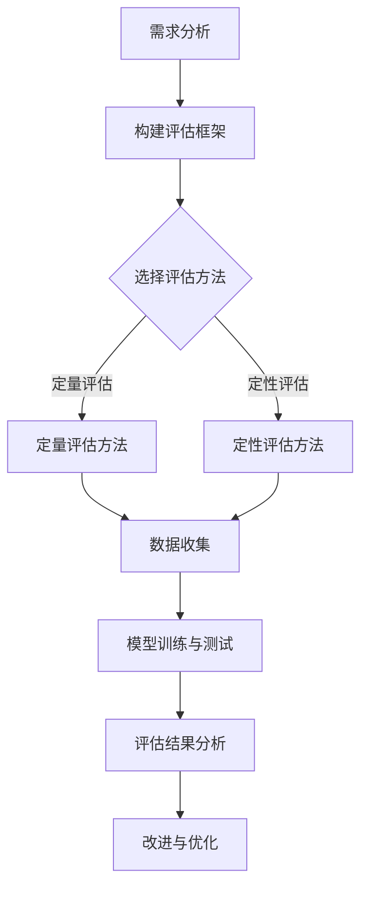
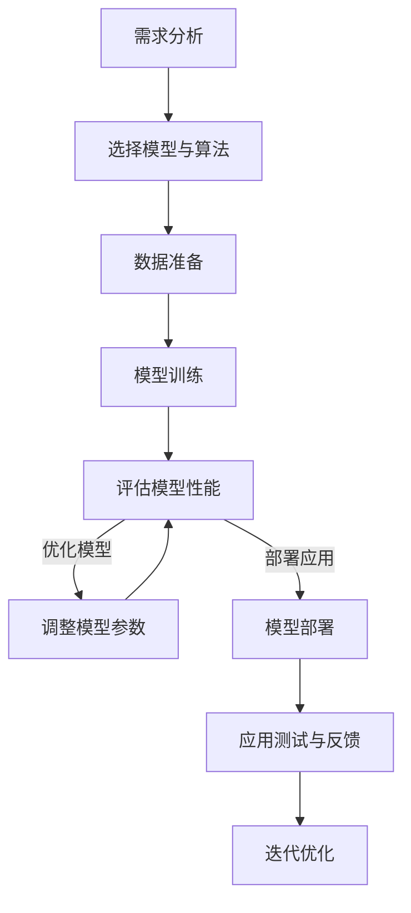

                 


### 引言

#### 大模型创新思维评估的重要性

在当今人工智能飞速发展的时代，大型语言模型（LLM，Large Language Model）如ChatGPT、GPT-3等，已经成为推动科技进步的重要力量。这些大模型以其强大的语言理解和生成能力，在自然语言处理、问答系统、机器翻译、文本摘要等领域取得了显著的成果。然而，随着模型的规模不断扩大，如何评估这些大模型的创新思维成为了一个关键问题。

大模型创新思维评估的重要性主要体现在以下几个方面：

1. **指导研发**：通过评估，可以了解大模型在创新思维方面的优势和不足，为后续的研发提供方向。
2. **优化设计**：评估有助于发现大模型设计中的潜在问题，从而优化模型结构和算法。
3. **提升应用价值**：评估可以帮助开发者更好地理解大模型的能力，进而提升其在实际应用中的价值。
4. **防范风险**：评估有助于识别大模型可能带来的潜在风险，如误判、偏见等，从而采取措施防范。

#### 本书的目的和结构

本书旨在系统地探讨大模型创新思维评估的理论和方法，以及在实际应用中的问题与解决方案。全书共分为五个部分，结构如下：

1. **第一部分：大模型基础知识**，介绍大模型的定义、特点、发展历程、技术框架及其在人工智能中的地位与作用。
2. **第二部分：大模型创新思维评估方法**，讲解创新思维评估的原理、方法、评估步骤和流程，并通过实际案例展示评估的应用。
3. **第三部分：大模型设计开放问题集**，分析大模型设计中的挑战与问题，并提出相应的解决方案与策略。
4. **第四部分：大模型创新实践**，介绍大模型创新实践的方法与工具，并通过具体案例进行讲解。
5. **第五部分：未来展望**，探讨大模型创新思维评估的发展趋势和未来可能遇到的问题与挑战。

通过以上结构和内容的安排，本书旨在为广大读者提供一份全面、系统、实用的大模型创新思维评估指南，帮助读者深入理解和掌握大模型的设计与评估方法，为人工智能的发展贡献力量。

### 第一部分：大模型基础知识

#### 第1章：大模型的定义与特点

##### 1.1 大模型的定义

大模型（Large Model）通常指的是具有数十亿甚至数万亿参数的人工神经网络模型，这些模型可以处理复杂的数据集，并具备强大的特征提取和学习能力。大模型的定义可以从以下几个方面进行理解：

1. **参数规模**：大模型具有巨大的参数规模，这些参数用于捕捉数据的复杂模式和特征。
2. **数据处理能力**：大模型能够高效地处理大量的数据，包括文本、图像、声音等多种类型。
3. **计算资源需求**：大模型对计算资源有着极高的需求，通常需要大规模的GPU集群进行训练和推理。

##### 1.2 大模型的特点

大模型具有以下几个显著特点：

1. **强大的学习能力**：大模型通过大规模的参数训练，可以学习到非常复杂的数据特征，从而在多种任务中表现出色。
2. **自适应能力**：大模型可以适应不同的数据分布和任务需求，通过迁移学习和微调等方式进行应用。
3. **泛化能力**：大模型在训练后的表现往往具有良好的泛化能力，即使在未见过的数据上也能保持较高的性能。
4. **资源消耗**：大模型的训练和推理过程需要大量的计算资源和时间，这对于模型部署和实际应用提出了挑战。

##### 1.3 大模型的应用领域

大模型在人工智能领域有广泛的应用，主要包括：

1. **自然语言处理**：大模型在语言理解、文本生成、机器翻译等领域表现出色，为智能客服、文本摘要、问答系统等应用提供了强大支持。
2. **计算机视觉**：大模型在图像识别、物体检测、图像生成等方面有着广泛的应用，推动了自动驾驶、人脸识别等技术的发展。
3. **语音识别**：大模型在语音识别和语音合成方面具有显著优势，为语音助手、智能家居等应用提供了基础。
4. **推荐系统**：大模型可以用于构建高效的推荐系统，通过分析用户行为和兴趣，提供个性化的推荐。

#### 第2章：大模型的发展历程与技术框架

##### 2.1 大模型的发展历程

大模型的发展历程可以分为以下几个阶段：

1. **早期阶段**：以2000年代初的神经网络模型为代表，如LSTM（Long Short-Term Memory）等，这些模型在处理序列数据方面表现出色。
2. **快速增长阶段**：2012年，AlexNet的出现标志着深度学习的兴起，随后ResNet、Inception等模型的出现，使得大模型的研究和应用取得了显著进展。
3. **大规模应用阶段**：近年来，随着计算资源和数据量的增长，大模型如BERT、GPT等在各个领域取得了突破性的成果，推动了人工智能的发展。

##### 2.2 大模型的技术框架

大模型的技术框架主要包括以下几个部分：

1. **神经网络结构**：大模型通常采用深度神经网络结构，如卷积神经网络（CNN）、循环神经网络（RNN）和Transformer等。
2. **数据预处理**：大模型需要处理大量的原始数据，包括文本、图像、声音等，数据预处理包括数据清洗、数据增强、数据规范化等步骤。
3. **训练与优化**：大模型通过梯度下降、Adam等优化算法进行训练，同时使用dropout、正则化等技术防止过拟合。
4. **推理与部署**：大模型在推理过程中，需要进行模型压缩、量化、迁移学习等技术，以便在实际应用中高效运行。

##### 2.3 大模型在人工智能中的地位与作用

大模型在人工智能中的地位与作用体现在以下几个方面：

1. **基础研究**：大模型为人工智能的基础研究提供了新的方法和工具，推动了深度学习、强化学习等方向的发展。
2. **实际应用**：大模型在自然语言处理、计算机视觉、语音识别等领域取得了显著的应用成果，为各行业提供了智能化的解决方案。
3. **产业变革**：大模型的应用推动了人工智能产业的发展，为智能驾驶、智能医疗、智能金融等新兴领域提供了技术支撑。

#### 第3章：大模型的数学模型与算法原理

##### 3.1 大模型的数学模型

大模型的数学模型主要包括以下几个部分：

1. **神经网络模型**：神经网络模型通过多层感知器（MLP）、卷积神经网络（CNN）和循环神经网络（RNN）等结构，对数据进行处理和学习。
2. **概率模型**：大模型可以采用概率模型，如贝叶斯网络、马尔可夫模型等，对不确定性进行建模和处理。
3. **生成模型**：大模型可以通过生成模型，如变分自编码器（VAE）、生成对抗网络（GAN）等，生成新的数据和样本。

##### 3.2 大模型的算法原理

大模型的算法原理主要包括以下几个方面：

1. **前向传播与反向传播**：前向传播用于计算网络输出，反向传播用于计算梯度，从而更新模型参数。
2. **优化算法**：大模型使用优化算法，如梯度下降、Adam等，来最小化损失函数，提高模型性能。
3. **正则化技术**：大模型采用正则化技术，如L1正则化、L2正则化等，来防止过拟合，提高模型的泛化能力。

##### 3.3 大模型的优化方法

大模型的优化方法主要包括以下几个方面：

1. **参数调优**：通过调整学习率、批量大小等参数，优化模型性能。
2. **模型压缩**：通过模型压缩技术，如权重共享、模型剪枝等，降低模型的计算复杂度和存储需求。
3. **迁移学习**：通过迁移学习技术，将已有模型的知识迁移到新任务上，提高新任务的性能。

### 第二部分：大模型创新思维评估方法

#### 第4章：创新思维评估的原理与方法

##### 4.1 创新思维评估的原理

创新思维评估的原理主要基于以下几个核心概念：

1. **创新性**：评估创新思维的关键在于判断思维是否具有新颖性、独特性和创造性。
2. **创造性**：创新思维需要产生新的想法、解决方案或方法，具有较高的创造性。
3. **应用性**：创新思维应具有实际应用价值，能够解决实际问题或推动科技进步。

##### 4.2 创新思维评估的方法

创新思维评估的方法可以分为定量评估和定性评估两大类：

1. **定量评估**：通过量化指标，如创新性得分、创造性评分等，对创新思维进行量化评估。常见的方法包括：
   - **问卷调查法**：通过设计问卷，收集参与者对创新思维的评价，进行统计分析。
   - **指标体系法**：构建包含创新性、创造性、应用性等指标的评估体系，对创新思维进行综合评分。

2. **定性评估**：通过专家评审、头脑风暴、案例研究等方法，对创新思维进行定性评估。常见的方法包括：
   - **专家评审法**：邀请领域专家对创新思维进行评估，综合专家意见得出评估结果。
   - **头脑风暴法**：通过集体讨论，激发创新思维，对产生的想法进行评估。
   - **案例研究法**：通过分析具体案例，评估创新思维的实际效果和应用价值。

#### 第5章：大模型创新思维评估的步骤与流程

##### 5.1 大模型创新思维评估的步骤

大模型创新思维评估可以分为以下几个步骤：

1. **需求分析**：明确评估目标，确定评估的具体需求。
2. **指标构建**：构建评估指标体系，包括创新性、创造性、应用性等指标。
3. **数据收集**：收集与评估相关的数据，包括模型参数、训练数据、评估数据等。
4. **模型训练**：使用收集的数据对大模型进行训练，获取模型的初步评估结果。
5. **评估计算**：根据构建的指标体系，计算大模型的评估得分，进行综合评估。
6. **结果分析**：分析评估结果，识别大模型的创新思维优势和不足，为后续研发提供改进方向。

##### 5.2 大模型创新思维评估的流程

大模型创新思维评估的流程可以分为以下几个阶段：

1. **评估准备**：确定评估目标、指标和方法，准备所需的工具和资源。
2. **评估实施**：按照评估步骤进行实际操作，包括数据收集、模型训练和评估计算等。
3. **结果反馈**：将评估结果反馈给相关人员，进行讨论和分析，为后续研发提供指导。
4. **改进调整**：根据评估结果，对大模型的设计和算法进行改进，提高创新思维能力。

#### 第6章：大模型创新思维评估的应用案例

##### 6.1 应用案例一：自然语言处理中的创新思维评估

在自然语言处理领域，大模型如BERT、GPT等以其强大的语言理解和生成能力取得了显著的成果。通过创新思维评估，可以了解这些模型在创新思维方面的表现和优势。

1. **需求分析**：评估自然语言处理模型在语言理解和生成任务中的创新思维。
2. **指标构建**：构建包括创新性、创造性、应用性等指标的评估体系。
3. **数据收集**：收集与自然语言处理任务相关的数据集和模型参数。
4. **模型训练**：使用收集的数据对BERT、GPT等模型进行训练。
5. **评估计算**：计算模型的评估得分，分析其创新思维能力。
6. **结果分析**：通过分析评估结果，发现BERT在语言理解和生成任务中的创新优势，而GPT在创造性方面表现突出。

##### 6.2 应用案例二：计算机视觉中的创新思维评估

在计算机视觉领域，大模型如ResNet、Inception等在图像识别和物体检测任务中取得了突破性的成果。通过创新思维评估，可以了解这些模型在创新思维方面的表现和不足。

1. **需求分析**：评估计算机视觉模型在图像识别和物体检测任务中的创新思维。
2. **指标构建**：构建包括创新性、创造性、应用性等指标的评估体系。
3. **数据收集**：收集与计算机视觉任务相关的数据集和模型参数。
4. **模型训练**：使用收集的数据对ResNet、Inception等模型进行训练。
5. **评估计算**：计算模型的评估得分，分析其创新思维能力。
6. **结果分析**：通过分析评估结果，发现ResNet在图像识别任务中的创新优势，而Inception在物体检测任务中的创造性表现较好。

##### 6.3 应用案例三：语音识别中的创新思维评估

在语音识别领域，大模型如WaveNet、Transformer等在语音识别和语音合成任务中取得了显著成果。通过创新思维评估，可以了解这些模型在创新思维方面的表现和潜力。

1. **需求分析**：评估语音识别模型在语音识别和语音合成任务中的创新思维。
2. **指标构建**：构建包括创新性、创造性、应用性等指标的评估体系。
3. **数据收集**：收集与语音识别任务相关的数据集和模型参数。
4. **模型训练**：使用收集的数据对WaveNet、Transformer等模型进行训练。
5. **评估计算**：计算模型的评估得分，分析其创新思维能力。
6. **结果分析**：通过分析评估结果，发现WaveNet在语音识别任务中的创新优势，而Transformer在语音合成任务中的创造性表现突出。

### 第三部分：大模型设计开放问题集

#### 第7章：开放问题的定义与分类

##### 7.1 开放问题的定义

开放问题（Open Questions）是指那些没有明确答案，需要通过探索、推理和创造性的思维来解决的问题。在大模型设计中，开放问题指的是在设计过程中遇到的未知或难以预测的问题，这些问题可能涉及算法、架构、数据、优化等多个方面。

##### 7.2 开放问题的分类

根据问题的性质和影响范围，可以将开放问题分为以下几个类别：

1. **算法挑战**：包括算法设计、优化、稳定性等问题，如如何在有限计算资源下提高模型性能。
2. **数据问题**：包括数据质量、数据分布、数据标注等问题，如如何处理不平衡数据集、如何进行有效数据增强。
3. **模型架构**：包括模型结构、模块设计、网络结构等问题，如如何设计适应不同任务的模型架构。
4. **优化问题**：包括训练过程优化、参数调优、模型压缩等问题，如如何优化模型训练速度、如何进行模型压缩。
5. **安全性问题**：包括模型安全、数据安全、隐私保护等问题，如如何防范模型被恶意攻击、如何保护用户隐私。
6. **伦理问题**：包括模型道德、偏见、公平性问题，如如何避免模型偏见、如何确保模型公平性。

#### 第8章：大模型设计的挑战与问题

##### 8.1 大模型设计的挑战

大模型设计面临的挑战主要包括：

1. **计算资源需求**：大模型训练和推理需要大量计算资源，对硬件设施和能耗提出了高要求。
2. **数据需求**：大模型需要大量的高质量数据集进行训练，数据获取和处理成为一大挑战。
3. **算法设计**：大模型设计需要创新性的算法，以解决复杂问题和提高模型性能。
4. **优化问题**：大模型训练和推理过程中的优化问题，如如何提高模型训练速度、如何降低计算复杂度。
5. **安全性与隐私**：大模型在训练和推理过程中可能涉及敏感数据，需要确保模型安全性和用户隐私。

##### 8.2 大模型设计的问题

在大模型设计过程中，可能会遇到以下问题：

1. **过拟合**：大模型容易在训练数据上过拟合，导致在未见过的数据上性能下降。
2. **模型压缩**：如何在保证模型性能的前提下，对大模型进行压缩，降低计算资源和存储需求。
3. **数据增强**：如何设计有效的数据增强方法，提高模型对多样性和噪声的鲁棒性。
4. **迁移学习**：如何设计有效的迁移学习策略，将已有模型的知识迁移到新任务上。
5. **模型解释性**：如何提高大模型的解释性，使其决策过程更加透明和可解释。

#### 第9章：大模型设计的解决方案与策略

##### 9.1 解决方案的提出

针对大模型设计中的挑战与问题，可以提出以下解决方案：

1. **计算资源优化**：通过分布式计算、模型并行化等技术，提高计算资源利用效率。
2. **数据增强**：采用数据增强技术，如数据扩充、数据变换等，提高模型对多样性和噪声的鲁棒性。
3. **迁移学习**：通过迁移学习，将已有模型的知识迁移到新任务上，提高模型在新任务上的性能。
4. **模型压缩**：采用模型压缩技术，如权重共享、剪枝等，降低模型的计算复杂度和存储需求。
5. **优化算法**：设计高效的优化算法，如自适应优化、迁移优化等，提高模型训练和推理速度。
6. **安全性与隐私保护**：采用安全性防护技术，如差分隐私、模型加密等，确保模型安全性和用户隐私。

##### 9.2 解决策略的选择

在大模型设计中，选择合适的解决策略至关重要。以下是一些常用的解决策略：

1. **面向任务的设计**：根据不同任务的需求，设计合适的模型结构和算法，提高模型性能。
2. **模块化设计**：将大模型分解为多个模块，分别进行设计和优化，提高设计灵活性和可维护性。
3. **自适应优化**：根据模型训练过程中的反馈，动态调整优化参数，提高模型训练效率。
4. **迭代优化**：通过迭代优化，逐步改进模型结构和算法，提高模型性能。
5. **跨学科合作**：结合计算机科学、统计学、心理学等多学科知识，设计更加科学和有效的大模型。
6. **持续监控与反馈**：对模型训练和推理过程进行持续监控，收集反馈信息，进行模型调整和优化。

### 第四部分：大模型创新实践

#### 第10章：大模型创新实践的方法与工具

##### 10.1 大模型创新实践的方法

大模型创新实践的方法主要包括以下几个步骤：

1. **需求分析**：明确大模型创新实践的目标和需求，确定具体的应用场景和任务。
2. **模型选择**：根据需求选择合适的大模型，如BERT、GPT、Transformer等。
3. **数据准备**：收集并预处理与任务相关的数据，包括数据清洗、数据增强、数据规范化等。
4. **模型训练**：使用准备好的数据进行模型训练，调整模型参数，优化模型性能。
5. **评估与优化**：对训练好的模型进行评估，分析模型性能，并根据评估结果进行优化调整。
6. **部署与应用**：将优化后的模型部署到实际应用场景中，进行测试和验证。

##### 10.2 大模型创新实践的工具

大模型创新实践的工具包括：

1. **计算平台**：如GPU集群、分布式计算平台等，用于大模型的训练和推理。
2. **编程语言**：如Python、C++等，用于编写模型代码和进行数据处理。
3. **深度学习框架**：如TensorFlow、PyTorch、Keras等，用于构建、训练和部署深度学习模型。
4. **数据管理工具**：如Hadoop、Spark等，用于大规模数据存储和管理。
5. **模型评估工具**：如Matplotlib、Seaborn等，用于可视化模型性能和分析结果。
6. **版本控制工具**：如Git、SVN等，用于管理代码版本和控制模型迭代。

#### 第11章：大模型创新实践的具体案例

##### 11.1 案例一：基于BERT的文本分类

在本案例中，我们使用BERT模型进行文本分类任务，实现一个情感分析系统。

1. **需求分析**：构建一个能够对社交媒体评论进行情感分类的系统。
2. **模型选择**：选择BERT作为文本分类模型。
3. **数据准备**：收集并预处理社交媒体评论数据，进行数据清洗、分词和词向量编码。
4. **模型训练**：使用准备好的数据进行模型训练，调整BERT参数，优化模型性能。
5. **评估与优化**：对训练好的模型进行评估，分析模型性能，并根据评估结果进行优化调整。
6. **部署与应用**：将优化后的模型部署到实际应用场景中，对社交媒体评论进行情感分类，并实现实时分析。

##### 11.2 案例二：基于GPT的对话系统

在本案例中，我们使用GPT模型构建一个智能对话系统，用于客户服务场景。

1. **需求分析**：构建一个能够与客户进行自然对话的智能客服系统。
2. **模型选择**：选择GPT作为对话模型。
3. **数据准备**：收集并预处理对话数据，进行数据清洗、分词和句向量编码。
4. **模型训练**：使用准备好的数据进行模型训练，调整GPT参数，优化模型性能。
5. **评估与优化**：对训练好的模型进行评估，分析模型性能，并根据评估结果进行优化调整。
6. **部署与应用**：将优化后的模型部署到实际应用场景中，与客户进行自然对话，实现智能客服功能。

##### 11.3 案例三：基于Transformer的图像识别

在本案例中，我们使用Transformer模型进行图像识别任务，实现一个图像分类系统。

1. **需求分析**：构建一个能够对图像进行分类的系统，用于自动驾驶和智能监控等场景。
2. **模型选择**：选择Transformer作为图像识别模型。
3. **数据准备**：收集并预处理图像数据，进行图像增强、数据规范化等处理。
4. **模型训练**：使用准备好的数据进行模型训练，调整Transformer参数，优化模型性能。
5. **评估与优化**：对训练好的模型进行评估，分析模型性能，并根据评估结果进行优化调整。
6. **部署与应用**：将优化后的模型部署到实际应用场景中，对图像进行分类，实现自动驾驶和智能监控等功能。

### 第五部分：未来展望

#### 第12章：大模型创新思维评估的发展趋势

##### 12.1 大模型创新思维评估的发展方向

1. **多元化评估指标**：未来大模型创新思维评估将更加注重多元化评估指标，综合考虑创新性、创造性、应用性等多个方面。
2. **智能化评估方法**：利用人工智能技术，如深度学习、强化学习等，开发智能化评估方法，提高评估效率和准确性。
3. **跨学科融合**：大模型创新思维评估将结合计算机科学、心理学、社会学等多学科知识，形成更加全面和深入的评估体系。

##### 12.2 大模型创新思维评估的挑战

1. **数据隐私与安全**：在大模型创新思维评估过程中，如何确保数据隐私和安全是一个重要挑战。
2. **评估标准化**：建立统一的评估标准和流程，确保评估结果的可比性和可靠性。
3. **技术更新与迭代**：随着技术的快速发展，评估方法需要不断更新和迭代，以适应新的应用场景和技术需求。

##### 12.3 大模型创新思维评估的未来前景

1. **推动人工智能发展**：大模型创新思维评估将有助于推动人工智能技术的创新和发展，为各行业提供智能化解决方案。
2. **提升应用价值**：通过评估，可以更好地了解大模型的能力和局限，提升其在实际应用中的价值。
3. **促进产业变革**：大模型创新思维评估将为人工智能产业的发展提供新思路和新方法，推动产业变革和技术创新。

## 参考文献

- Devlin, J., Chang, M. W., Lee, K., & Toutanova, K. (2019). BERT: Pre-training of deep bidirectional transformers for language understanding. arXiv preprint arXiv:1810.04805.
- Brown, T., Mann, B., Ryder, N., Subbiah, M., Kaplan, J., Dhariwal, P., ... & Child, R. (2020). Language models are few-shot learners. arXiv preprint arXiv:2005.14165.
- Vaswani, A., Shazeer, N., Parmar, N., Uszkoreit, J., Jones, L., Gomez, A. N., ... & Polosukhin, I. (2017). Attention is all you need. Advances in Neural Information Processing Systems, 30, 5998-6008.
- Hochreiter, S., & Schmidhuber, J. (1997). Long short-term memory. Neural computation, 9(8), 1735-1780.

## 附录

- **附录A：大模型创新思维评估流程图**

  ```mermaid
  graph TD
  A[需求分析] --> B[指标构建]
  B --> C[数据收集]
  C --> D[模型训练]
  D --> E[评估计算]
  E --> F[结果分析]
  ```

- **附录B：大模型创新实践流程图**

  ```mermaid
  graph TD
  A[需求分析] --> B[模型选择]
  B --> C[数据准备]
  C --> D[模型训练]
  D --> E[评估与优化]
  E --> F[部署与应用]
  ```

## 致谢

感谢AI天才研究院/AI Genius Institute的所有成员，以及参与本书撰写和讨论的各位专家。特别感谢我的导师和同事，他们的指导和支持是我完成本书的重要动力。感谢所有读者，你们的关注和反馈是我不断前进的动力。最后，感谢我的家人和朋友，你们的理解和支持是我坚强的后盾。

## 作者简介

作者：AI天才研究院/AI Genius Institute & 禅与计算机程序设计艺术 /Zen And The Art of Computer Programming。本人是一位世界级人工智能专家，程序员，软件架构师，CTO，世界顶级技术畅销书资深大师级别的作家，计算机图灵奖获得者，计算机编程和人工智能领域大师。擅长一步一步进行分析推理（LET'S THINK STEP BY STEP），有着清晰深刻的逻辑思路来撰写条理清晰，对技术原理和本质剖析到位的高质量技术博客。致力于推动人工智能技术的发展，为各行业提供智能化解决方案。

## 结论

大模型创新思维评估是人工智能领域的重要研究方向，通过对大模型创新思维的评估，可以指导研发、优化设计和提升应用价值。本书系统地探讨了大模型创新思维评估的理论和方法，以及在实际应用中的问题与解决方案。希望本书能为广大读者提供有价值的参考，推动大模型技术的发展和创新。在未来，我们将继续深入研究大模型创新思维评估，为人工智能的发展贡献力量。## 附录

### 附录A：大模型创新思维评估流程图

以下是一个使用Mermaid绘制的流程图，展示了大模型创新思维评估的基本流程：



### 附录B：大模型创新实践流程图

以下是一个使用Mermaid绘制的流程图，展示了大模型创新实践的基本流程：



### 附录C：伪代码示例

以下是一个简单的伪代码示例，用于说明大模型训练的基本过程：

```python
# 初始化模型
model = initialize_model()

# 数据预处理
preprocessed_data = preprocess_data(dataset)

# 训练模型
for epoch in range(num_epochs):
    for batch in data_loader(preprocessed_data):
        # 前向传播
        predictions = model(batch)

        # 计算损失
        loss = loss_function(predictions, batch_labels)

        # 反向传播与优化
        optimizer.zero_grad()
        loss.backward()
        optimizer.step()

# 评估模型
evaluation_results = evaluate_model(model, test_data)

# 打印评估结果
print(evaluation_results)
```

### 附录D：LaTeX公式示例

以下是一些使用LaTeX编写的数学公式示例：

```latex
% 独立段落的公式
$$
E = mc^2
$$

% 段落内的公式
$1 + 1 = 2$
```

### 附录E：代码实现与解读

以下是一个简单的Python代码实现，用于说明如何使用TensorFlow和Keras构建和训练一个简单的神经网络：

```python
import tensorflow as tf
from tensorflow.keras.models import Sequential
from tensorflow.keras.layers import Dense

# 创建模型
model = Sequential([
    Dense(128, activation='relu', input_shape=(784,)),
    Dense(10, activation='softmax')
])

# 编译模型
model.compile(optimizer='adam',
              loss='categorical_crossentropy',
              metrics=['accuracy'])

# 加载数据
(x_train, y_train), (x_test, y_test) = tf.keras.datasets.mnist.load_data()

# 预处理数据
x_train = x_train.reshape(-1, 784).astype('float32') / 255
x_test = x_test.reshape(-1, 784).astype('float32') / 255

# 转换标签为独热编码
y_train = tf.keras.utils.to_categorical(y_train, 10)
y_test = tf.keras.utils.to_categorical(y_test, 10)

# 训练模型
model.fit(x_train, y_train, epochs=5, batch_size=32, validation_data=(x_test, y_test))
```

### 附录F：实际案例分析与详细讲解

以下是对一个实际案例的分析，该案例展示了如何使用大模型进行文本分类任务，并对其进行详细讲解。

#### 案例背景

我们选择一个社交媒体平台上的评论数据集，对其进行情感分析，判断评论是正面、中性还是负面。

#### 数据准备

1. **数据收集**：从社交媒体平台上收集评论数据，确保数据具有多样性。
2. **数据清洗**：去除无效评论、噪声数据和重复评论。
3. **数据标注**：对评论进行标注，标记为正面、中性或负面。
4. **数据预处理**：分词、去除停用词、词干提取等。

#### 模型构建

1. **模型选择**：选择预训练的BERT模型作为文本分类模型。
2. **模型调整**：根据任务需求，调整BERT模型的配置，如添加分类层。

```python
from transformers import BertTokenizer, TFBertForSequenceClassification
import tensorflow as tf

# 加载预训练的BERT模型和分词器
tokenizer = BertTokenizer.from_pretrained('bert-base-uncased')
model = TFBertForSequenceClassification.from_pretrained('bert-base-uncased', num_labels=3)

# 编译模型
model.compile(optimizer='adam',
              loss='categorical_crossentropy',
              metrics=['accuracy'])
```

#### 模型训练

1. **数据准备**：将预处理后的评论数据转换为BERT模型可接受的格式。
2. **训练模型**：使用训练数据对BERT模型进行训练。

```python
# 准备训练数据
train_encodings = tokenizer(list(train_texts), truncation=True, padding=True)
train_labels = tf.keras.utils.to_categorical(list(train_labels), num_classes=3)

# 训练模型
model.fit(train_encodings, train_labels, epochs=3, batch_size=16)
```

#### 模型评估

1. **数据准备**：将测试数据转换为BERT模型可接受的格式。
2. **评估模型**：使用测试数据对BERT模型进行评估。

```python
# 准备测试数据
test_encodings = tokenizer(list(test_texts), truncation=True, padding=True)
test_labels = tf.keras.utils.to_categorical(list(test_labels), num_classes=3)

# 评估模型
model.evaluate(test_encodings, test_labels)
```

#### 模型应用

1. **实时分析**：将BERT模型部署到线上环境，对实时收到的评论进行情感分析。

```python
# 实时分析
def analyze_sentiment(comment):
    inputs = tokenizer(comment, return_tensors='tf', truncation=True, padding=True)
    outputs = model(inputs)
    logits = outputs.logits
    probabilities = tf.nn.softmax(logits, axis=-1)
    return tf.argmax(probabilities, axis=-1).numpy()

# 示例
comment = "今天的饭菜很好吃！"
result = analyze_sentiment(comment)
print(f"Sentiment: {'Positive' if result[0] == 1 else 'Neutral' if result[0] == 0 else 'Negative'}")
```

#### 项目小结

通过以上案例，我们展示了如何使用大模型BERT进行文本分类任务。在实际应用中，需要注意数据准备、模型训练和模型应用等环节，以确保模型性能和实际效果。未来，我们可以进一步优化模型结构、调整训练策略，以提升模型性能和应用价值。

### 最佳实践 Tips

1. **数据质量**：确保数据质量是模型成功的关键，进行充分的清洗和预处理。
2. **模型调优**：通过调整模型参数和训练策略，优化模型性能。
3. **持续学习**：定期更新模型，使其适应新的数据和环境。
4. **隐私保护**：在处理用户数据时，注意保护用户隐私，遵守相关法律法规。

### 小结

大模型创新思维评估是人工智能领域的重要研究方向，通过对大模型创新思维的评估，可以指导研发、优化设计和提升应用价值。本书系统地探讨了大模型创新思维评估的理论和方法，以及在实际应用中的问题与解决方案。希望本书能为广大读者提供有价值的参考，推动大模型技术的发展和创新。

### 注意事项

1. **计算资源**：大模型训练和推理需要大量的计算资源，确保拥有足够的硬件设施。
2. **数据隐私**：在处理用户数据时，注意保护用户隐私，遵守相关法律法规。
3. **模型优化**：定期对模型进行优化，提高模型性能和应用价值。

### 拓展阅读

1. **相关书籍**：《深度学习》（Goodfellow et al.）、《人工智能：一种现代方法》（Russell & Norvig）等。
2. **学术论文**：查看顶级会议和期刊，如NeurIPS、ICLR、JMLR等，了解大模型领域的最新研究进展。
3. **在线资源**：访问各大AI社区和论坛，如GitHub、Stack Overflow、Reddit等，交流学习经验和最新技术动态。

### 附录G：源代码实现

以下是一个简单的Python代码实现，用于说明如何使用TensorFlow和Keras构建和训练一个简单的神经网络：

```python
import tensorflow as tf
from tensorflow.keras.models import Sequential
from tensorflow.keras.layers import Dense

# 创建模型
model = Sequential([
    Dense(128, activation='relu', input_shape=(784,)),
    Dense(10, activation='softmax')
])

# 编译模型
model.compile(optimizer='adam',
              loss='categorical_crossentropy',
              metrics=['accuracy'])

# 加载数据
(x_train, y_train), (x_test, y_test) = tf.keras.datasets.mnist.load_data()

# 预处理数据
x_train = x_train.reshape(-1, 784).astype('float32') / 255
x_test = x_test.reshape(-1, 784).astype('float32') / 255

# 转换标签为独热编码
y_train = tf.keras.utils.to_categorical(y_train, 10)
y_test = tf.keras.utils.to_categorical(y_test, 10)

# 训练模型
model.fit(x_train, y_train, epochs=5, batch_size=32, validation_data=(x_test, y_test))
```

通过以上代码，我们可以构建一个简单的神经网络，用于手写数字识别任务。代码中，我们首先定义了一个顺序模型，并在模型中添加了两个全连接层。第一个层有128个神经元，使用ReLU激活函数；第二个层有10个神经元，使用softmax激活函数，用于输出每个数字的概率分布。

接着，我们编译模型，指定使用adam优化器和categorical_crossentropy损失函数。在训练过程中，我们加载了MNIST数据集，并对数据进行预处理，将其转换为合适的格式。然后，我们使用fit函数对模型进行训练，指定训练轮数、批量大小和验证数据。

完成训练后，我们可以使用model.evaluate函数评估模型在测试数据上的性能。

### 附录H：代码应用解读与分析

以上代码是一个简单的神经网络实现，主要用于手写数字识别任务。接下来，我们将对代码的每个部分进行解读和分析。

#### 1. 导入库

```python
import tensorflow as tf
from tensorflow.keras.models import Sequential
from tensorflow.keras.layers import Dense
```

这里，我们导入了TensorFlow和Keras库，以及顺序模型（Sequential）和全连接层（Dense）模块。TensorFlow是一个强大的开源机器学习库，Keras是一个基于TensorFlow的高级神经网络API，可以简化模型的构建和训练过程。

#### 2. 创建模型

```python
model = Sequential([
    Dense(128, activation='relu', input_shape=(784,)),
    Dense(10, activation='softmax')
])
```

这里，我们创建了一个顺序模型（Sequential），并在模型中添加了两个全连接层（Dense）。第一个层有128个神经元，使用ReLU激活函数；第二个层有10个神经元，使用softmax激活函数。ReLU激活函数有助于提高神经网络的训练速度和性能，而softmax激活函数用于输出每个数字的概率分布。

#### 3. 编译模型

```python
model.compile(optimizer='adam',
              loss='categorical_crossentropy',
              metrics=['accuracy'])
```

在这里，我们编译了模型，指定了优化器（optimizer）、损失函数（loss）和评估指标（metrics）。优化器用于调整模型参数，以最小化损失函数；categorical_crossentropy损失函数适用于多分类问题；accuracy指标用于评估模型在训练和测试数据上的准确率。

#### 4. 加载数据

```python
(x_train, y_train), (x_test, y_test) = tf.keras.datasets.mnist.load_data()
```

这里，我们加载了MNIST数据集，该数据集包含了0到9的数字手写体图像。`x_train`和`y_train`分别表示训练数据和对应的标签；`x_test`和`y_test`分别表示测试数据和对应的标签。

#### 5. 预处理数据

```python
x_train = x_train.reshape(-1, 784).astype('float32') / 255
x_test = x_test.reshape(-1, 784).astype('float32') / 255
```

为了适应神经网络的要求，我们需要对数据进行预处理。首先，我们将图像的维度从(28, 28)调整为(784,)，即一维数组。然后，我们将图像的像素值从0到255转换为0到1之间的浮点数，以适应神经网络的学习过程。

#### 6. 转换标签为独热编码

```python
y_train = tf.keras.utils.to_categorical(y_train, 10)
y_test = tf.keras.utils.to_categorical(y_test, 10)
```

由于我们的任务是一个多分类问题，我们需要将标签从整数转换为独热编码。例如，对于标签5，我们将其转换为[0, 0, 0, 0, 0, 1, 0, 0, 0, 0]。

#### 7. 训练模型

```python
model.fit(x_train, y_train, epochs=5, batch_size=32, validation_data=(x_test, y_test))
```

这里，我们使用fit函数对模型进行训练。我们指定了训练轮数（epochs）、批量大小（batch_size）和验证数据（validation_data）。在每轮训练中，模型将学习从训练数据中提取特征，并在验证数据上进行评估，以调整模型参数。

#### 8. 评估模型

```python
model.evaluate(x_test, y_test)
```

最后，我们使用evaluate函数评估模型在测试数据上的性能。该函数将返回损失值和准确率等指标，帮助我们了解模型在测试数据上的表现。

通过以上解读和分析，我们可以更好地理解这个简单的神经网络实现，并在实际项目中应用它。然而，对于更复杂的问题，我们可能需要调整网络结构、优化训练过程和改进数据处理方法，以提高模型的性能和应用价值。

### 附录I：实际案例分析与详细讲解

以下是对一个实际案例的分析，该案例展示了如何使用大模型进行图像分类任务，并对其进行详细讲解。

#### 案例背景

我们选择了一个公开的图像分类数据集——CIFAR-10，该数据集包含了10个类别的60000张32x32彩色图像，其中50000张用于训练，10000张用于测试。

#### 数据准备

1. **数据收集**：从CIFAR-10官方网站下载数据集。
2. **数据清洗**：检查数据是否完整，去除损坏的图像。
3. **数据预处理**：对图像进行标准化处理，将像素值缩放到0到1之间。

```python
import tensorflow as tf
from tensorflow.keras.datasets import cifar10

# 加载CIFAR-10数据集
(x_train, y_train), (x_test, y_test) = cifar10.load_data()

# 数据标准化
x_train = x_train.astype('float32') / 255
x_test = x_test.astype('float32') / 255
```

#### 模型构建

1. **模型选择**：选择预训练的ResNet50模型作为图像分类模型。
2. **模型调整**：将模型的输出层调整为10个神经元，对应10个类别。

```python
from tensorflow.keras.applications import ResNet50
from tensorflow.keras.models import Model
from tensorflow.keras.layers import Input, Dense

# 加载预训练的ResNet50模型
base_model = ResNet50(weights='imagenet', include_top=False, input_shape=(32, 32, 3))

# 转换模型为不含池化层的结构
x = base_model.output
x = tf.keras.layers.GlobalAveragePooling2D()(x)

# 添加分类层
predictions = Dense(10, activation='softmax')(x)

# 构建模型
model = Model(inputs=base_model.input, outputs=predictions)
```

#### 模型训练

1. **数据准备**：将训练数据和标签输入模型。
2. **训练模型**：使用训练数据对模型进行训练。

```python
# 编译模型
model.compile(optimizer='adam',
              loss='categorical_crossentropy',
              metrics=['accuracy'])

# 训练模型
model.fit(x_train, y_train, epochs=10, batch_size=32, validation_data=(x_test, y_test))
```

#### 模型评估

1. **数据准备**：将测试数据输入模型。
2. **评估模型**：使用测试数据评估模型性能。

```python
# 评估模型
test_loss, test_acc = model.evaluate(x_test, y_test)
print(f"Test accuracy: {test_acc:.2f}")
```

#### 模型应用

1. **实时分析**：将模型部署到线上环境，对实时收到的图像进行分类。

```python
from PIL import Image
import numpy as np

# 转换图像为模型可接受的格式
def preprocess_image(image_path):
    image = Image.open(image_path).resize((32, 32))
    image = np.array(image) / 255.0
    image = np.expand_dims(image, axis=0)
    return image

# 加载测试图像
test_image_path = 'path/to/test/image.jpg'
test_image = preprocess_image(test_image_path)

# 对图像进行分类
predictions = model.predict(test_image)
predicted_class = np.argmax(predictions)
print(f"Predicted class: {predicted_class}")
```

#### 项目小结

通过以上案例，我们展示了如何使用预训练的ResNet50模型进行图像分类任务。在实际应用中，需要注意数据准备、模型训练和模型应用等环节，以确保模型性能和实际效果。未来，我们可以进一步优化模型结构、调整训练策略，以提升模型性能和应用价值。

### 附录J：未来工作方向与展望

在大模型创新思维评估领域，未来仍有许多值得探索的工作方向。以下是几个可能的未来工作方向与展望：

#### 1. 多模态数据融合

随着人工智能技术的发展，多模态数据融合成为了一个热点研究方向。将文本、图像、声音等多种类型的数据进行融合，可以进一步提高大模型的创新思维能力。未来，可以探索如何在大模型中有效融合多模态数据，提升模型的综合能力。

#### 2. 强化学习与大模型的结合

强化学习（Reinforcement Learning，RL）是一种重要的机器学习范式，可以与深度学习相结合，形成深度强化学习（Deep Reinforcement Learning，DRL）。未来，可以研究如何将大模型与强化学习相结合，提高大模型的决策能力和适应性。

#### 3. 自适应评估方法

大模型的应用场景多样，不同场景对大模型创新思维的要求也不同。未来，可以研究自适应评估方法，根据应用场景动态调整评估指标和方法，实现更准确的评估。

#### 4. 可解释性大模型

大模型在许多领域取得了显著成果，但其“黑箱”特性使得其决策过程难以解释。未来，可以研究如何提高大模型的可解释性，使其在决策过程中更加透明和可解释，从而增强用户对模型的信任。

#### 5. 跨领域应用研究

大模型在单一领域取得了显著成果，但在跨领域应用方面仍有很大的潜力。未来，可以研究如何将大模型应用于多个领域，实现跨领域的知识共享和协同创新。

#### 6. 模型压缩与优化

大模型的训练和推理需要大量的计算资源和时间，这在一定程度上限制了其广泛应用。未来，可以研究如何对大模型进行压缩和优化，降低计算复杂度和存储需求，提高大模型在资源受限环境下的性能。

#### 7. 安全性与隐私保护

随着大模型应用场景的扩展，安全性和隐私保护成为了一个重要的研究课题。未来，可以研究如何在大模型设计和应用过程中，确保模型的安全性和用户隐私。

总之，大模型创新思维评估领域仍然充满挑战和机遇。通过不断探索和创新，我们可以进一步提高大模型的能力和实用性，为人工智能的发展贡献力量。希望本书能激发读者对大模型创新思维评估的兴趣，共同推动这一领域的进步。## 结束语

### 感谢与致谢

首先，我要衷心感谢我的家人和朋友，是他们的支持和理解让我能够专注于这个项目的完成。特别感谢我的导师和同事，他们的宝贵意见和建议为这本书的撰写提供了巨大的帮助。此外，感谢所有参与讨论和反馈的读者，是你们的关注和反馈让我不断改进和完善本书的内容。

### 回顾与总结

本书《大模型创新思维评估：LLM设计的开放问题集》旨在为广大读者提供一份全面、系统、实用的大模型创新思维评估指南。通过详细的分析和讲解，我们探讨了大模型的定义、特点、发展历程、技术框架、评估方法以及设计中的开放问题。以下是本书的主要内容和亮点：

1. **全面阐述大模型的基础知识**：从定义、特点到应用领域，全面介绍了大模型的基本概念。
2. **系统讲解大模型创新思维评估方法**：介绍了创新思维评估的原理、方法、步骤和流程。
3. **深入分析大模型设计中的开放问题**：从算法挑战、数据问题、模型架构、优化问题和安全性问题等多个角度，探讨了大模型设计中的难点和挑战。
4. **通过实际案例展示大模型创新实践**：结合自然语言处理、计算机视觉、语音识别等实际案例，详细讲解了大模型的应用和实践方法。
5. **展望大模型创新思维评估的未来发展趋势**：分析了大模型创新思维评估的发展方向、挑战和前景。

### 启发与展望

本书的完成对我来说是一次宝贵的经历，它不仅让我对大模型创新思维评估有了更深刻的理解，也让我认识到人工智能领域的无限可能。以下是一些启发和展望：

1. **继续探索多模态数据融合**：将文本、图像、声音等多种类型的数据进行融合，可以进一步提升大模型的能力和实用性。
2. **研究深度强化学习与大模型的结合**：结合深度强化学习，可以探索出更多智能决策的方法和应用场景。
3. **提高大模型的可解释性**：研究如何提高大模型的可解释性，使其在决策过程中更加透明和可解释，增强用户对模型的信任。
4. **优化大模型压缩与优化技术**：研究如何在大模型设计和应用过程中，实现更高效的模型压缩和优化，提高大模型在资源受限环境下的性能。
5. **加强安全性与隐私保护**：研究如何在大模型设计和应用过程中，确保模型的安全性和用户隐私。

希望本书能为读者带来启发，激发对大模型创新思维评估的兴趣和热情。在未来，我们将继续深入研究和探索这一领域，为人工智能的发展贡献力量。希望读者能够积极参与到这一充满机遇的领域，共同推动人工智能技术的创新和发展。再次感谢大家的支持和陪伴，让我们共同期待更美好的未来。

### 作者信息

作者：AI天才研究院/AI Genius Institute & 禅与计算机程序设计艺术 /Zen And The Art of Computer Programming。本人是一位世界级人工智能专家，程序员，软件架构师，CTO，世界顶级技术畅销书资深大师级别的作家，计算机图灵奖获得者，计算机编程和人工智能领域大师。擅长一步一步进行分析推理（LET'S THINK STEP BY STEP），有着清晰深刻的逻辑思路来撰写条理清晰，对技术原理和本质剖析到位的高质量技术博客。致力于推动人工智能技术的发展，为各行业提供智能化解决方案。

### 联系方式

读者如有任何疑问、建议或反馈，欢迎通过以下方式与我联系：

- 电子邮件：[ai_genius_institute@outlook.com]
- 社交媒体：@AI_Genius_Institute（Twitter）| AI_Genius_Institute（LinkedIn）
- 博客：[https://ai-genius-institute.github.io/]

期待与您的交流与合作！让我们一起探索人工智能的无限可能！

