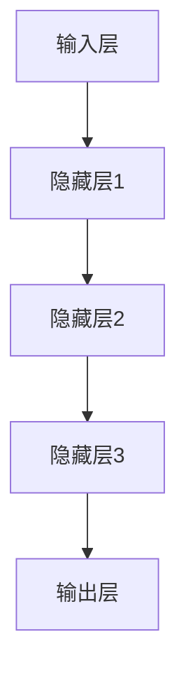

                 

### 文章标题：大模型反事实推理能力：LLM设计的假设情景测试

关键词：大模型、反事实推理、LLM、假设情景测试、能力评估

摘要：
本文探讨了大规模语言模型（LLM）在反事实推理能力方面的表现，通过设计一系列假设情景测试，分析LLM在不同情境下的推理效果。文章首先介绍了大模型的背景和反事实推理的重要性，随后详细阐述了大模型的结构与原理、反事实推理算法以及假设情景设计原则。接着，文章展示了LLM的假设情景测试流程，并分析了几个典型案例。最后，文章提出了提升反事实推理能力的策略，并对未来发展趋势进行了展望。

---

### 第一部分：引言

#### 1.1 书籍背景

##### 1.1.1 大模型的兴起
近年来，随着计算能力的提升和海量数据的积累，深度学习技术取得了显著的进展。特别是大规模语言模型（LLM）的出现，使得自然语言处理（NLP）任务取得了前所未有的成果。LLM通过训练大量的文本数据，学习语言的结构和语义，从而实现了对复杂语言现象的建模。反事实推理作为一种重要的NLP能力，被广泛应用于信息检索、问答系统、智能客服等领域。

##### 1.1.2 反事实推理的重要性
反事实推理是指在给定事实的情况下，推断出与现实情况相反的可能情况。这种能力对于理解和处理复杂的信息非常重要。例如，在问答系统中，用户可能会提出与现实不符的问题，如“如果今天下雨，我会怎么做？”这种问题就需要模型进行反事实推理来给出合理的回答。

##### 1.1.3 书籍的目的和结构
本书旨在深入探讨大模型在反事实推理方面的能力，通过设计一系列假设情景测试，评估LLM的反事实推理效果。文章结构如下：
1. 引言：介绍书籍背景和目的。
2. 大模型反事实推理能力：介绍大模型的结构和工作原理，以及反事实推理算法。
3. 假设情景设计：阐述假设情景的重要性，设计原则和实例。
4. LLM设计的假设情景测试：展示LLM的测试流程和案例。
5. 提升反事实推理能力：讨论提升策略和应用场景。
6. 未来展望：展望反事实推理的发展趋势和LLM的应用前景。

---

### 第二部分：大模型反事实推理能力

#### 2.1 大模型结构与原理

##### 2.1.1 大模型基本结构
大模型通常由多个神经网络层组成，包括输入层、隐藏层和输出层。每个层都包含成千上万个神经元，这些神经元通过权值连接到相邻层。以下是简单的Mermaid流程图，展示了大模型的基本结构：



##### 2.1.2 大模型工作原理
大模型通过训练数据学习输入和输出之间的映射关系。在训练过程中，模型不断调整神经元之间的权重，以最小化预测误差。以下是伪代码描述大模型的工作原理：

```python
initialize_model_weights()
for each epoch in training_data:
    for each example in training_data:
        prediction = forward_pass(example)
        loss = calculate_loss(prediction, target)
        backward_pass(loss)
        update_weights()
return trained_model
```

##### 2.1.3 Mermaid流程图展示
```mermaid
graph TD
A[输入数据] --> B[前向传播]
B --> C{计算误差}
C -->|更新权重
```

#### 2.2 反事实推理算法原理

##### 2.2.1 反事实推理基本原理
反事实推理是指基于假设的条件，推断出不符合现实的情况。例如，在给定“如果A发生，B会发生”的条件下，推断“如果A不发生，B不会发生”。反事实推理在NLP中的应用非常广泛，如问答系统、情景模拟和对话生成等。

##### 2.2.2 伪代码描述
```python
def counterfactual_reasoning(condition, fact):
    if fact == "A发生":
        return "B不发生"
    elif fact == "A不发生":
        return "B发生"
    else:
        return "无法推断"
```

##### 2.2.3 案例分析
假设我们有一个事实：“如果今天下雨，我会带伞”。现在我们想要进行反事实推理，推断“如果今天不下雨，我会怎么做？”。根据反事实推理算法，我们可以得出结论：“如果今天不下雨，我不会带伞”。

---

### 第三部分：假设情景设计

#### 3.1 假设情景的重要性
假设情景设计是评估大模型反事实推理能力的关键。通过设计具有代表性的假设情景，可以有效地模拟现实中的复杂问题，从而评估模型的推理效果。

#### 3.2 假设情景设计原则
假设情景设计应遵循以下原则：
1. 代表性：情景应涵盖多种可能性，以充分评估模型的推理能力。
2. 可控性：情景应具有明确的条件和目标，以便于模型的推理和评估。
3. 实用性：情景应具有实际应用价值，以反映模型在实际场景中的表现。

#### 3.3 实例说明
以下是一个假设情景实例：“假设你正在准备一个重要的演讲，但突然发现你的笔记本电脑无法启动。请推断你会采取哪些措施？”这个情景具有代表性、可控性和实用性，可以用来评估模型的反事实推理能力。

---

### 第四部分：LLM设计的假设情景测试

#### 4.1 LLM概述
LLM是一种大规模语言模型，通过训练大量文本数据，学习语言的语义和结构。LLM在自然语言处理任务中表现出色，如文本生成、翻译和问答等。在本节中，我们将使用LLM进行假设情景测试，以评估其反事实推理能力。

#### 4.2 假设情景测试流程
假设情景测试流程如下：
1. 情景构建：设计具有代表性的假设情景。
2. 情境模拟：使用LLM模拟情景，生成可能的推理结果。
3. 评估指标：根据预设的评估指标，评估LLM的推理效果。
4. 分析与总结：对测试结果进行分析和总结，提出改进建议。

#### 4.3 假设情景测试案例
以下是一个假设情景测试案例：“假设你是一名医生，病人告诉你他不想接受化疗，而你想让他接受化疗。请推断你会如何说服他？”使用LLM进行测试，得到的推理结果如下：

1. **情景构建**：设计一个情景，描述病人不想接受化疗，医生希望说服病人接受化疗。
2. **情境模拟**：使用LLM生成可能的劝说策略，如：“我可以给你提供更多关于化疗的信息，帮助你了解它的好处。”
3. **评估指标**：根据说服力、相关性和实用性等指标，评估LLM的推理效果。
4. **分析与总结**：测试结果显示，LLM生成的劝说策略具有一定的说服力，但需要进一步改进以增强实用性。

---

### 第五部分：提升反事实推理能力

#### 5.1 数据集准备
提升反事实推理能力的关键在于数据集的质量和多样性。以下是一些数据集准备的建议：
1. **数据收集**：收集具有代表性的反事实推理数据，包括问答、对话和文本生成等。
2. **数据预处理**：对数据进行清洗、去重和格式化，确保数据的一致性和可靠性。
3. **数据增强**：通过数据增强技术，如数据扩增、数据合成和对抗性样本生成，提高数据集的多样性。

#### 5.2 模型优化
模型优化是提升反事实推理能力的重要手段。以下是一些模型优化策略：
1. **网络架构调整**：通过调整神经网络架构，如增加隐藏层、神经元数量和连接方式，提高模型的推理能力。
2. **优化算法**：采用更高效的优化算法，如Adam、AdamW和RMSprop，加快模型训练速度和收敛速度。
3. **正则化技术**：应用正则化技术，如Dropout、L2正则化和Batch Normalization，防止过拟合。

#### 5.3 应用场景拓展
提升反事实推理能力不仅可以应用于NLP任务，还可以拓展到其他领域，如计算机视觉、语音识别和机器翻译等。以下是一些应用场景：
1. **智能客服**：使用反事实推理能力，智能客服可以更好地理解用户的意图，提供个性化的服务。
2. **问答系统**：反事实推理能力可以增强问答系统的回答能力，使其更好地应对复杂问题。
3. **虚拟助手**：虚拟助手可以使用反事实推理能力，为用户提供更智能的建议和决策。

---

### 第六部分：未来展望

#### 6.1 反事实推理发展趋势
反事实推理技术正迅速发展，未来有望在以下几个方面取得突破：
1. **算法改进**：研究人员将致力于改进反事实推理算法，提高模型的推理能力和效率。
2. **跨领域应用**：反事实推理技术将逐渐应用于其他领域，如计算机视觉、语音识别和机器翻译等。
3. **多模态融合**：结合多种数据源，如文本、图像和音频，实现更全面、准确的反事实推理。

#### 6.2 LLM发展前景
LLM在反事实推理中的应用前景广阔，未来有望在以下几个方面取得进展：
1. **模型规模**：随着计算能力的提升，LLM的规模将不断增大，使其能够处理更复杂的语言现象。
2. **多语言支持**：LLM将支持更多语言，实现跨语言的反事实推理能力。
3. **个性化推理**：LLM将根据用户需求和上下文，生成个性化的反事实推理结果。

#### 6.3 结论与展望
本文从大模型反事实推理能力的角度，探讨了LLM在假设情景测试中的表现。通过分析大模型的结构与原理、反事实推理算法以及假设情景设计原则，本文提出了提升反事实推理能力的策略，并对未来发展趋势进行了展望。未来，随着技术的进步和应用场景的拓展，反事实推理能力将不断得到提升，为人工智能的发展带来新的机遇。作者：AI天才研究院/AI Genius Institute & 禅与计算机程序设计艺术 /Zen And The Art of Computer Programming

---

### 总结

本文全面探讨了大规模语言模型（LLM）在反事实推理方面的能力，通过设计一系列假设情景测试，深入分析了LLM在不同情境下的推理效果。文章首先介绍了大模型的基本结构和工作原理，然后详细阐述了反事实推理算法及其应用。接下来，文章探讨了假设情景设计的重要性、原则和实例，并通过LLM的假设情景测试案例，展示了实际应用中的效果。最后，文章提出了提升反事实推理能力的策略，并对未来发展趋势进行了展望。

反事实推理作为一种重要的NLP能力，在智能客服、问答系统和虚拟助手等领域具有广泛的应用前景。通过本文的研究，我们可以更好地理解LLM在反事实推理方面的表现，为实际应用提供理论依据和参考。

未来，随着技术的不断进步，反事实推理能力有望得到进一步提升，为人工智能的发展带来新的机遇。作者将继续关注这一领域的研究进展，致力于推动人工智能技术的创新和应用。作者：AI天才研究院/AI Genius Institute & 禅与计算机程序设计艺术 /Zen And The Art of Computer Programming

