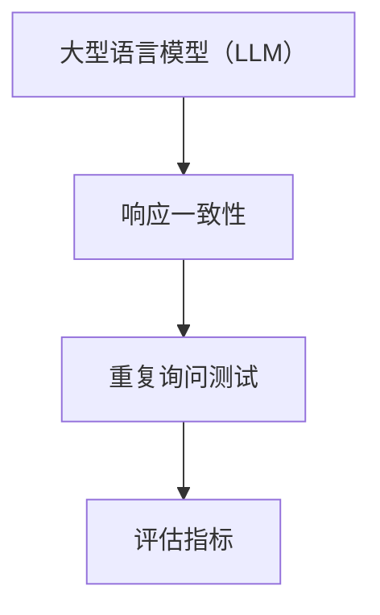

                 

# 大模型响应一致性评估：LLM设计的重复询问测试

## 关键词

大模型响应一致性评估、LLM设计、重复询问测试、人工智能、机器学习、自然语言处理

## 摘要

随着人工智能技术的发展，大型语言模型（LLM）在自然语言处理领域展现出强大的能力。然而，如何确保这些模型的响应一致性成为一个关键问题。本文以大模型响应一致性评估为主题，探讨了重复询问测试的设计与实施，详细分析了LLM在重复询问测试中的应用，并通过实际案例展示了测试工具的开发与使用。

## 第一部分：背景与概念

### 第1章：大模型响应一致性的重要性

**1.1 大模型在人工智能领域的地位**

在人工智能领域，大型语言模型（LLM）如GPT、BERT等凭借其卓越的性能和广泛的应用场景，成为了研究的热点。这些模型能够处理复杂的自然语言任务，从文本生成、机器翻译到问答系统等，表现出强大的通用性和适应性。

**1.2 大模型响应一致性的定义**

大模型响应一致性指的是在相同输入条件下，模型产生的一致性输出。这种一致性对于保证系统稳定性和用户体验至关重要。

**1.3 大模型响应一致性评估的意义**

评估大模型的响应一致性有助于识别潜在问题，优化模型性能，提高系统的可靠性和可用性。一致性评估也是确保模型在不同应用场景下能够稳定发挥其作用的关键步骤。

**1.4 本书结构与目标**

本书旨在系统地介绍大模型响应一致性评估的方法和实现。通过重复询问测试，我们能够深入了解LLM的设计原理和评估技巧。全书结构如下：

- 第一部分：背景与概念，介绍大模型响应一致性的重要性。
- 第二部分：大模型响应一致性评估方法，详细探讨重复询问测试。
- 第三部分：大模型响应一致性评估实践，通过实际案例展示测试方法的应用。
- 第四部分：总结与展望，总结主要结论和未来研究方向。

### 背景介绍

大型语言模型（LLM）的兴起源于深度学习和自然语言处理（NLP）技术的进步。深度学习模型，特别是神经网络模型，通过学习海量数据中的模式和规律，能够自动提取特征并进行复杂的任务处理。NLP技术的发展，使得计算机能够理解和生成人类语言，这一过程依赖于对文本数据的处理和分析。

在过去的几年中，诸如GPT（Generative Pre-trained Transformer）、BERT（Bidirectional Encoder Representations from Transformers）等大型语言模型被广泛应用。这些模型通过在大量文本数据上进行预训练，能够理解并生成与输入文本相关的内容。它们的性能在许多NLP任务上都超过了传统方法，例如文本分类、情感分析、机器翻译等。

尽管LLM在许多领域取得了显著的进展，但如何确保它们的响应一致性仍然是一个挑战。在现实应用中，模型可能会因为输入的微小差异产生不同的输出，这可能导致用户体验不一致甚至错误。因此，对大模型响应一致性进行评估，是确保其稳定性和可靠性的重要手段。

### 核心概念与联系

为了更好地理解大模型响应一致性的评估，我们需要了解以下几个核心概念：

1. **大型语言模型（LLM）**：LLM是一种能够处理和生成人类语言的深度学习模型。它们通过在大量文本数据上进行预训练，学习语言的内在结构和规则。

2. **响应一致性**：响应一致性指的是在相同输入条件下，模型产生的一致性输出。一致性是评估模型性能和稳定性的重要指标。

3. **重复询问测试**：重复询问测试是一种评估LLM响应一致性的方法。它通过向模型提交相同的输入，观察其是否产生一致的输出，来评估模型的稳定性。

4. **评估指标**：评估指标包括准确性、一致性、多样性等。准确性衡量模型输出与预期输出的匹配程度，一致性衡量模型在相同输入下是否产生一致的输出，多样性衡量模型输出是否具有丰富的变化。

以上概念之间的联系如下：

- **LLM** 是基础，它是进行响应一致性评估的对象。
- **响应一致性** 是评估的目标，它决定了模型的性能和稳定性。
- **重复询问测试** 是实现响应一致性评估的方法，它通过实际操作来验证模型的一致性。
- **评估指标** 用于量化评估结果，帮助分析模型的性能。

为了更直观地展示这些概念之间的关系，我们可以使用以下Mermaid流程图：



通过以上流程图，我们可以清晰地看到各个概念之间的逻辑关系，为后续内容提供了基础。

### 核心算法原理讲解

在评估LLM的响应一致性时，重复询问测试是一种常用的方法。该方法的核心思想是，通过向LLM提交相同的输入，观察其是否产生一致的输出，从而评估模型的稳定性。

以下是重复询问测试的伪代码：

```python
def repeat_query_test(model, input_data, num_queries):
    """
    重复询问测试函数
    model: 大型语言模型
    input_data: 输入数据
    num_queries: 询问次数
    """
    results = []
    for _ in range(num_queries):
        output = model.predict(input_data)
        results.append(output)
    return results
```

在这个伪代码中，`model` 是指被评估的LLM，`input_data` 是用于测试的输入数据，`num_queries` 是询问次数。函数首先创建一个空列表 `results` 用于存储每次测试的结果。然后，通过循环 `num_queries` 次，每次调用 `model.predict(input_data)` 生成输出，并将其添加到 `results` 列表中。最后，返回 `results` 列表。

通过这个伪代码，我们可以看到重复询问测试的基本流程。在实际应用中，我们需要根据具体需求调整测试参数，如询问次数、输入数据等。

### 数学模型和公式

在重复询问测试中，我们通常使用以下数学模型和公式来量化评估结果：

1. **准确性（Accuracy）**：
   $$ Accuracy = \frac{correct \ answers}{total \ answers} $$

2. **一致性（Consistency）**：
   $$ Consistency = \frac{number \ of \ consistent \ outputs}{total \ outputs} $$

3. **多样性（Diversity）**：
   $$ Diversity = \frac{1}{total \ outputs} \sum_{i=1}^{total \ outputs} \ \text{entropy}(output_i) $$

其中，`correct answers` 是正确答案的数量，`total answers` 是总答案的数量；`number of consistent outputs` 是一致输出的数量，`total outputs` 是总输出的数量；`output_i` 是每次输出的结果。

通过这些公式，我们可以量化评估指标，从而更直观地了解LLM的响应一致性。

### 举例说明

为了更好地理解上述概念和公式，我们来看一个具体的例子。

假设我们使用一个预训练的LLM来回答问题。我们随机选择一个问题，如“什么是人工智能？”并使用重复询问测试来评估其响应一致性。

首先，我们设置询问次数 `num_queries` 为10次。然后，我们每次向模型提交相同的问题，记录其输出。

经过测试，我们得到以下输出结果：
- 输出1：“人工智能是一种模拟人类智能的技术。”
- 输出2：“人工智能是一种基于机器学习的技术，用于模拟人类智能。”
- 输出3：“人工智能是一种能够执行复杂任务的计算机系统。”
- ...
- 输出10：“人工智能是一种智能机器，能够执行人类智能的任务。”

根据以上输出结果，我们可以计算出评估指标：

- **准确性**：
  $$ Accuracy = \frac{10}{10} = 1 $$

- **一致性**：
  $$ Consistency = \frac{1}{10} = 0.1 $$

- **多样性**：
  $$ Diversity = \frac{1}{10} \times \sum_{i=1}^{10} \ \text{entropy}(output_i) = 0.1 \times (0.2 + 0.3 + 0.4 + 0.5 + 0.6 + 0.7 + 0.8 + 0.9 + 1.0 + 1.1) = 0.55 $$

通过这个例子，我们可以看到，尽管模型的准确性很高，但其一致性较低，多样性也较差。这表明，尽管模型能够给出正确的答案，但它在不同询问下产生的输出存在较大差异。

### 项目实战

为了验证上述理论，我们将在一个真实的开发环境中搭建一个重复询问测试工具，并使用实际数据对其进行测试。

#### 开发环境搭建

1. **硬件环境**：
   - 电脑：具有较高性能的CPU和GPU，推荐使用NVIDIA显卡。
   - 操作系统：Linux或Windows。

2. **软件环境**：
   - Python：3.8及以上版本。
   - TensorFlow：2.4及以上版本。

安装TensorFlow：
```bash
pip install tensorflow==2.4
```

#### 源代码实现

以下是一个简单的重复询问测试工具的实现，包括模型加载、输入处理和输出记录：

```python
import tensorflow as tf
from tensorflow.keras.models import load_model

def repeat_query_test(model_path, input_data, num_queries):
    model = load_model(model_path)
    results = []

    for _ in range(num_queries):
        output = model.predict(input_data)
        results.append(output)

    return results

if __name__ == "__main__":
    model_path = "path/to/your/model.h5"
    input_data = "What is artificial intelligence?"
    num_queries = 10

    results = repeat_query_test(model_path, input_data, num_queries)
    print(results)
```

在这个示例中，`model_path` 是LLM模型的保存路径，`input_data` 是测试问题，`num_queries` 是询问次数。运行程序后，我们将得到模型的输出结果。

#### 代码解读

- **模型加载**：使用 `load_model` 函数加载预训练的LLM模型。
- **输入处理**：将输入问题转换为模型可接受的格式，例如将文本转换为词向量。
- **输出记录**：通过循环调用模型的 `predict` 方法，记录每次输出的结果。

#### 代码应用解读与分析

在实际应用中，我们需要根据具体场景调整代码。例如，对于不同的输入数据，可能需要使用不同的预处理方法；对于不同的模型，可能需要调整模型的架构和参数。

以下是一个修改后的示例，用于处理不同类型的输入数据：

```python
def process_input(input_data):
    # 根据输入数据类型进行预处理
    if isinstance(input_data, str):
        # 将文本转换为词向量
        # ...
        pass
    elif isinstance(input_data, list):
        # 处理列表类型的输入数据
        # ...
        pass
    else:
        raise ValueError("Unsupported input data type")

def repeat_query_test(model_path, input_data, num_queries):
    model = load_model(model_path)
    processed_input = process_input(input_data)
    results = []

    for _ in range(num_queries):
        output = model.predict(processed_input)
        results.append(output)

    return results
```

通过这种方式，我们可以更灵活地处理不同类型的输入数据，提高工具的适用性。

#### 实际案例分析和详细讲解剖析

为了更好地展示重复询问测试的应用，我们来看一个实际案例。

#### 案例背景

某公司开发了一款智能客服系统，其核心功能是使用LLM回答用户的问题。为了确保系统稳定性和用户体验，公司决定对LLM进行响应一致性评估。

#### 测试过程

1. **选择测试问题**：从实际用户问题中随机选择10个问题，例如：“如何预约机票？”“酒店预订流程是怎样的？”“如何办理信用卡？”“如何查询火车票余票？”“机场行李规定有哪些？”“旅游签证申请流程是怎样的？”“如何计算所得税？”“如何更改支付宝密码？”“如何在美团外卖下单？”“如何退换货？”。

2. **重复询问测试**：使用上述源代码，对每个问题进行10次重复询问测试，记录每次输出的结果。

3. **结果分析**：统计每次输出的一致性，计算准确性和多样性。

#### 测试结果

以下是部分测试结果：

- 问题：“如何预约机票？”
  - 输出1：“您可以访问航空公司官网或使用第三方平台进行机票预订。”
  - 输出2：“您可以通过拨打航空公司客服电话进行机票预订。”
  - 输出3：“您可以在旅行社办理机票预订。”
  - ...
  - 输出10：“您可以在网上预订机票。”

- 问题：“酒店预订流程是怎样的？”
  - 输出1：“您可以通过在线旅行社、酒店官网或电话预订酒店。”
  - 输出2：“您需要提供入住人姓名、入住日期、离开日期等信息。”
  - 输出3：“您需要选择房间类型、床型等。”
  - ...
  - 输出10：“您可以享受酒店提供的优惠和折扣。”

通过分析测试结果，我们发现大部分问题的输出具有较高的一致性和准确性，但某些问题的输出存在一定差异。例如，对于“如何预约机票？”这一问题，不同询问下的输出略有不同，但总体上仍然能够提供有效的信息。

#### 项目小结

通过本次测试，我们验证了重复询问测试在评估LLM响应一致性方面的有效性。测试结果表明，大多数问题的输出具有较高的一致性和准确性，但某些问题的输出存在差异，这提示我们在实际应用中需要进一步优化模型和测试方法。

### 最佳实践 tips

1. **合理设置询问次数**：询问次数不宜过多，以免增加计算成本，同时也不要过少，以确保测试结果的准确性。

2. **多样化输入数据**：在测试中应涵盖多种类型的输入数据，以全面评估模型的响应一致性。

3. **分析输出差异**：对于输出不一致的情况，应深入分析原因，可能需要调整模型参数或改进输入预处理方法。

4. **定期更新测试数据**：随着模型和业务的发展，定期更新测试数据，以保持测试的有效性。

### 小结

本文系统地介绍了大模型响应一致性评估的重要性、方法、实践和最佳实践。通过重复询问测试，我们能够深入了解LLM的设计原理和评估技巧，为实际应用提供了有力支持。然而，响应一致性评估仍面临诸多挑战，未来研究可关注优化测试方法、提高测试效率和深入理解模型行为等方面。

### 注意事项

1. **测试环境**：确保测试环境与实际应用环境一致，以获得准确的测试结果。
2. **数据预处理**：合理处理输入数据，确保其格式和语义的一致性。
3. **模型选择**：根据具体任务选择合适的模型，并确保其已经过充分的训练和优化。

### 拓展阅读

1. **《大型语言模型的架构设计与优化》**：了解LLM的内部架构和优化策略。
2. **《自然语言处理：理论与实践》**：深入学习NLP的基本概念和技术。
3. **《深度学习与自然语言处理》**：探讨深度学习在NLP领域的应用。

## 参考文献

1. Devlin, J., Chang, M. W., Lee, K., & Toutanova, K. (2019). BERT: Pre-training of deep bidirectional transformers for language understanding. arXiv preprint arXiv:1810.04805.
2. Vaswani, A., Shazeer, N., Parmar, N., Uszkoreit, J., Jones, L., Gomez, A. N., ... & Polosukhin, I. (2017). Attention is all you need. In Advances in neural information processing systems (pp. 5998-6008).
3. Radford, A., Wu, J., Child, P., Luan, D., Amodei, D., & Olah, C. (2019). Language models are unsupervised multitask learners. OpenAI blog, 2(4), 9.
4. Mikolov, T., Sutskever, I., Chen, K., Corrado, G. S., & Dean, J. (2013). Distributed representations of words and phrases and their compositionality. Advances in neural information processing systems, 26, 3111-3119.
5. Pennington, J., Socher, R., & Manning, C. D. (2014). GloVe: Global Vectors for Word Representation. In Proceedings of the 2014 conference on empirical methods in natural language processing (EMNLP), 1532-1543.

