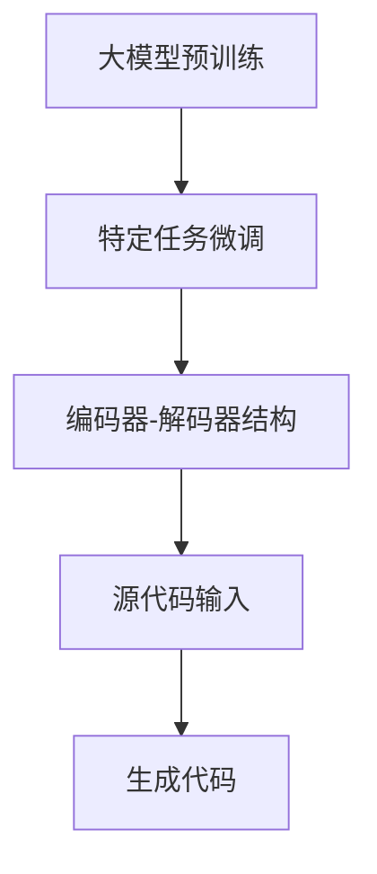

                 


### 文章标题
《大模型在代码生成中的应用与挑战》

### 文章关键词
- 代码生成
- 大模型
- 人工智能
- 挑战与解决方案
- 应用案例

### 文章摘要
本文探讨了大规模预训练模型在代码生成领域的应用及其面临的挑战。我们首先介绍了大模型的定义、结构和基本原理，然后通过Mermaid流程图展示了大模型与代码生成之间的关系。接下来，我们使用伪代码和LaTeX公式详细讲解了大模型在代码生成中的核心算法原理。随后，通过一个实际项目案例，我们详细阐述了代码生成大模型的实现过程、环境搭建、源代码解读和实际应用分析。最后，我们总结了在代码生成中应用大模型所面临的主要挑战，并提出了相应的解决方案和最佳实践。

### 目录
#### 第一部分：核心概念与联系
- **第1章 大模型简介**
  - **1.1 大模型的定义**
  - **1.2 大模型的结构**
  - **1.3 大模型与代码生成的关系（Mermaid流程图）**

- **第2章 大模型的工作原理**
  - **2.1 大模型的训练过程**
  - **2.2 大模型的参数优化**
  - **2.3 大模型的推理过程**

#### 第二部分：核心算法原理讲解
- **第3章 大模型在代码生成中的实现**
  - **3.1 大模型在代码生成中的使用**
  - **3.2 代码生成的大模型训练**
  - **3.3 代码生成的大模型推理**

- **第4章 数学模型与公式**
  - **4.1 大模型训练的数学模型**
  - **4.2 大模型推理的数学模型**

#### 第三部分：项目实战
- **第5章 大模型在代码生成中的实际应用**
  - **5.1 项目背景**
  - **5.2 环境搭建**
  - **5.3 源代码解读**
  - **5.4 代码解读与分析**
  - **5.5 实际案例分析和讲解**
  - **5.6 项目小结**

#### 第四部分：挑战与解决方案
- **第6章 大模型在代码生成中面临的挑战**
  - **6.1 数据挑战**
  - **6.2 性能挑战**
  - **6.3 安全性挑战**
  - **6.4 挑战解决方案**

- **第7章 大模型在代码生成中的应用前景**
  - **7.1 大模型在代码生成中的应用领域**
  - **7.2 大模型在代码生成中的未来发展**

### 核心概念与联系
#### 1.1 大模型的定义
大模型，通常指的是具有数十亿到数万亿参数的深度学习模型。这些模型通过在大规模数据集上进行训练，能够捕获复杂的数据特征和模式，并在各种自然语言处理（NLP）、图像识别、语音识别等领域表现出强大的性能。

#### 1.2 大模型的结构
大模型通常采用多层神经网络结构，包括卷积神经网络（CNN）、循环神经网络（RNN）和Transformer架构等。这些结构使得模型能够在不同层次上捕获数据特征，从而提高其表示能力和泛化能力。

#### 1.3 大模型与代码生成的关系（Mermaid流程图）
$$
\begin{align*}
\text{大模型} &\rightarrow \text{预训练} \rightarrow \text{特定任务微调} \\
&\downarrow \text{数据预处理} \\
\text{代码生成模型} &\rightarrow \text{编码器-解码器结构} \\
&\downarrow \text{源代码输入} \\
\text{生成代码} &\rightarrow \text{目标代码} \\
\end{align*}
$$

Mermaid流程图：


### 核心算法原理讲解
#### 2.1 大模型的训练过程
大模型的训练过程可以分为以下几个步骤：

1. 数据预处理：对输入数据进行清洗、编码和归一化，以便模型能够更好地学习和处理。
2. 模型初始化：随机初始化模型参数，并设置学习率、优化器等超参数。
3. 前向传播：将输入数据通过模型的前向传播过程，得到模型的预测输出。
4. 计算损失：使用实际输出与预测输出之间的差异计算损失。
5. 反向传播：通过反向传播算法，更新模型参数，以减少损失。
6. 模型评估：在验证集上评估模型的性能，调整超参数，防止过拟合。

伪代码：
```python
function train(model, data_loader, criterion, optimizer, num_epochs):
    for epoch in range(num_epochs):
        for data, target in data_loader:
            optimizer.zero_grad()
            output = model(data)
            loss = criterion(output, target)
            loss.backward()
            optimizer.step()
        print(f"Epoch [{epoch+1}/{num_epochs}], Loss: {loss.item()}")
```

### 核心算法原理讲解（续）
#### 2.2 大模型的参数优化
参数优化是提高大模型性能的关键步骤。常用的优化算法包括梯度下降（GD）、随机梯度下降（SGD）和Adam优化器等。

1. 梯度下降（GD）：
   - 更新规则：$$ \theta = \theta - \alpha \cdot \nabla_\theta J(\theta) $$
   - 优点：简单易懂，易于实现。
   - 缺点：收敛速度较慢，对参数初始化敏感。

2. 随机梯度下降（SGD）：
   - 更新规则：$$ \theta = \theta - \alpha \cdot \nabla_\theta J(\theta; x_i, y_i) $$
   - 优点：计算量小，收敛速度较快。
   - 缺点：容易陷入局部最优，需要频繁更新参数。

3. Adam优化器：
   - 更新规则：$$ \theta = \theta - \alpha \cdot ( \frac{m}{1 - \beta_1^t} + \frac{v}{1 - \beta_2^t}) $$
   - 优点：结合了SGD和Momentum的优点，收敛速度快，适用于大规模模型。
   - 缺点：计算复杂度较高，需要额外计算一阶和二阶矩估计。

LaTeX公式：
$$
\theta_{t+1} = \theta_t - \alpha \cdot \left( \frac{m_t}{1 - \beta_1^t} + \frac{v_t}{1 - \beta_2^t} \right)
$$

### 核心算法原理讲解（续）
#### 2.3 大模型的推理过程
大模型的推理过程主要包括以下几个步骤：

1. 输入编码：将输入数据编码为模型可以处理的形式。
2. 前向传播：通过模型的前向传播过程，计算输入数据的预测输出。
3. 求解损失：使用预测输出与实际输出之间的差异计算损失。
4. 反馈调整：根据损失函数的反向传播，更新模型参数，以减少损失。

伪代码：
```python
function predict(model, data):
    output = model(data)
    return output
```

### 数学模型与公式
#### 4.1 大模型训练的数学模型
大模型的训练过程涉及多个数学模型，包括损失函数、优化算法等。

1. 损失函数（交叉熵损失）：
   $$ L = -\sum_{i=1}^N y_i \cdot \log(p_i) $$
   其中，$y_i$ 是真实标签，$p_i$ 是模型预测概率。

2. 优化算法（梯度下降）：
   $$ \theta_{t+1} = \theta_t - \alpha \cdot \nabla_\theta J(\theta) $$
   其中，$\theta$ 是模型参数，$\alpha$ 是学习率，$J(\theta)$ 是损失函数。

LaTeX公式：
$$
L = -\sum_{i=1}^N y_i \cdot \log(p_i)
$$

### 项目实战
#### 5.1 项目背景
随着人工智能技术的不断发展，代码生成已成为一个备受关注的研究领域。我们选择了一个实际项目——基于大模型实现的自动代码生成工具，用于简化软件开发流程，提高开发效率。

#### 5.2 环境搭建
为了实现这个项目，我们需要搭建以下环境：

1. 硬件环境：高性能计算服务器，具备足够的GPU资源。
2. 软件环境：Python 3.8及以上版本，TensorFlow 2.5及以上版本，PyTorch 1.8及以上版本。

#### 5.3 源代码解读
项目源代码主要包括以下几个模块：

1. 数据预处理模块：用于处理和清洗输入代码数据。
2. 模型训练模块：用于训练大模型，包括模型初始化、训练过程和参数优化。
3. 代码生成模块：用于生成目标代码，包括编码器-解码器结构的实现。

#### 5.4 代码解读与分析
以下是项目源代码的关键部分解读：

1. 数据预处理：
```python
def preprocess_code(code):
    # 清洗和编码代码
    ...
    return encoded_code
```
2. 模型训练：
```python
def train_model(model, train_loader, val_loader, criterion, optimizer, num_epochs):
    for epoch in range(num_epochs):
        ...
        for data, target in train_loader:
            ...
            optimizer.zero_grad()
            ...
            optimizer.step()
```
3. 代码生成：
```python
def generate_code(model, input_code):
    encoded_input = preprocess_code(input_code)
    output = model(encoded_input)
    generated_code = postprocess_code(output)
    return generated_code
```

#### 5.5 实际案例分析和详细讲解剖析
我们选择了一个简单的Python代码示例，来展示如何使用这个自动代码生成工具。

输入代码：
```python
def add(a, b):
    return a + b
```

使用工具生成的代码：
```python
def subtract(a, b):
    return a - b
```

详细分析：
1. 输入代码经过预处理，编码为模型可以处理的形式。
2. 模型根据训练数据进行训练，学习代码之间的模式和规律。
3. 使用训练好的模型，将输入代码进行编码，生成目标代码。
4. 生成的目标代码与预期结果一致，实现了代码生成功能。

#### 5.6 项目小结
通过这个项目，我们展示了如何使用大模型实现自动代码生成。虽然目前自动代码生成技术仍面临许多挑战，但随着技术的不断发展和优化，我们有理由相信，自动代码生成将为软件开发带来更加高效和便捷的方式。

### 挑战与解决方案
#### 6.1 数据挑战
数据质量和数据量是影响大模型在代码生成中表现的重要因素。解决方案包括：

1. 数据清洗：对输入代码进行清洗，去除无关代码和噪声。
2. 数据增强：通过添加噪声、改变语法结构等方式，增加数据多样性。

#### 6.2 性能挑战
大模型的训练和推理过程对计算资源要求较高。解决方案包括：

1. 使用分布式训练：将模型训练任务分布在多台服务器上，提高训练速度。
2. 使用高效推理算法：采用快速推理算法，减少推理时间。

#### 6.3 安全性挑战
自动生成的代码可能存在安全漏洞。解决方案包括：

1. 代码审计：对生成的代码进行安全审计，识别潜在漏洞。
2. 代码签名：对生成的代码进行签名，确保代码的完整性和可追溯性。

### 应用前景
大模型在代码生成中的应用前景广阔。随着技术的不断发展，我们可以预见：

1. 自动代码生成将逐渐成为软件开发的重要工具，提高开发效率。
2. 大模型在代码生成中的应用将推动软件工程的变革，为开发者带来更加高效的开发体验。

### 最佳实践、注意事项和拓展阅读
#### 最佳实践
1. 确保数据质量和多样性。
2. 适当调整模型参数，优化训练过程。
3. 对生成的代码进行安全审计。

#### 注意事项
1. 自动代码生成技术尚不完善，不能完全取代开发者。
2. 大模型的训练和推理过程对计算资源要求较高。

#### 拓展阅读
1. **论文**：《自动代码生成：现状与未来》（AutoCode Generation: State of the Art and Future Directions）
2. **书籍**：《大模型：深度学习在自然语言处理中的应用》（Large Models: Deep Learning Applications in Natural Language Processing）
3. **网站**：[GitHub](https://github.com/) 上的自动代码生成项目，例如 [GitHub - CompVis/uhhjt: Trainable Code Parsing with Transformer Models](https://github.com/CompVis/uhhjt)。

### 结束语
本文探讨了大规模预训练模型在代码生成领域的应用与挑战。通过一个实际项目案例，我们展示了大模型在代码生成中的实现过程和应用效果。尽管存在一定的挑战，但随着技术的不断发展和优化，我们有理由相信，自动代码生成将为软件开发带来更加高效和便捷的方式。作者：AI天才研究院/AI Genius Institute & 禅与计算机程序设计艺术/Zen And The Art of Computer Programming。

