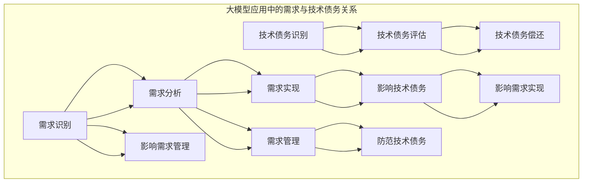
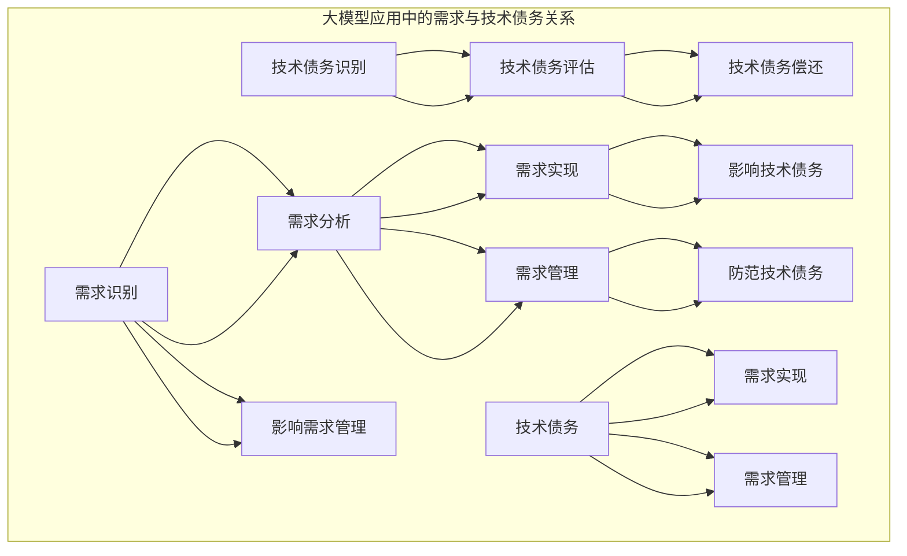

                 

### 文章标题：大模型应用中的需求与技术债务管理

> 关键词：大模型，需求管理，技术债务，管理策略，案例分析

> 摘要：本文将深入探讨大模型应用中的需求与技术债务管理问题。首先，我们介绍大模型的背景与重要性，然后详细阐述需求管理和技术债务管理的核心概念与联系。接下来，我们将逐步讲解大模型应用中的需求管理流程，技术债务评估与度量方法，以及需求管理中的技术债务管理策略。最后，通过具体案例分析，我们将展示这些管理策略的实际应用效果，并提出最佳实践和注意事项。

----------------------------------------------------------------

# 大模型应用中的需求与技术债务管理

随着人工智能技术的迅猛发展，大模型在各个领域得到了广泛应用。从自然语言处理到计算机视觉，从推荐系统到自动驾驶，大模型无疑为这些领域带来了巨大的变革。然而，在大模型应用过程中，需求管理和技术债务管理成为两个至关重要的环节。本文旨在探讨这两个问题，并提出有效的管理策略。

## 一、背景介绍

### 大模型的背景

大模型（Large-scale Models）指的是拥有巨大参数量和强大计算能力的深度学习模型。这些模型通过在海量数据上进行训练，可以自动学习复杂的模式，从而在各个领域表现出卓越的性能。例如，在自然语言处理领域，大模型如GPT-3和BERT已经能够实现与人类水平相近的语言理解与生成能力。

### 大模型的重要性

大模型的重要性体现在以下几个方面：

1. **性能提升**：大模型在处理复杂任务时具有更高的准确性，例如图像识别、语音识别和自然语言理解。
2. **效率优化**：大模型能够减少计算资源的消耗，提高任务处理的效率。
3. **创新驱动**：大模型的应用推动了人工智能技术的发展，激发了新的研究与应用方向。

### 需求管理的背景

需求管理是指在项目开发过程中，对用户需求进行识别、分析和管理的活动。在大模型应用中，需求管理至关重要，因为大模型的设计和实现需要紧密结合实际应用场景。

### 技术债务管理的背景

技术债务管理是指识别、评估和偿还技术债务的过程。技术债务类似于财务债务，指的是在软件开发过程中，由于时间、资源等因素的限制，暂时性采取的妥协或解决方案。这些妥协或解决方案可能会导致系统稳定性、可维护性和可扩展性的问题，需要在未来进行偿还。

## 二、核心概念与联系

### 需求管理的核心概念

需求管理包括以下几个方面：

1. **需求识别**：理解用户需求，并将其明确表达出来。
2. **需求分析**：对需求进行深入分析，确定需求的合理性和可行性。
3. **需求实现**：根据需求分析和设计，实现具体的功能和特性。
4. **需求管理**：对需求进行跟踪和监控，确保需求的实现符合预期。

### 技术债务管理的核心概念

技术债务管理包括以下几个方面：

1. **技术债务识别**：识别系统中存在的技术债务。
2. **技术债务评估**：对技术债务的影响和风险进行评估。
3. **技术债务偿还**：通过优化或重构代码，偿还技术债务。

### 大模型应用中的需求与技术债务关系

在大模型应用中，需求和技术债务之间存在密切的关系：

1. **需求变化影响技术债务**：需求的变化可能导致系统结构的调整，从而产生新的技术债务。
2. **技术债务影响需求实现**：技术债务的存在可能影响需求的实现效率和质量。
3. **需求管理中的技术债务防范策略**：通过有效的需求管理，可以减少技术债务的产生，降低系统风险。

### Mermaid 流程图

为了更直观地展示需求管理和技术债务管理的关系，我们可以使用Mermaid流程图进行描述：



## 三、需求管理流程

### 需求识别

需求识别是需求管理的第一步，主要任务是了解用户的需求和期望。在大模型应用中，需求识别可以通过以下方式进行：

1. **用户访谈**：直接与用户进行交流，了解他们的实际需求和问题。
2. **问卷调查**：通过问卷收集用户的需求信息。
3. **观察与分析**：通过观察用户的行为和操作，分析他们的需求和偏好。

### 需求分析

需求分析是对识别出的需求进行深入分析，以确定其合理性和可行性。在大模型应用中，需求分析主要包括以下内容：

1. **需求分类**：将需求分为功能性需求和非功能性需求。
2. **需求优先级**：根据需求的紧急程度和重要性，确定需求实现的优先级。
3. **需求可行性**：评估需求实现的技术和资源可行性。

### 需求实现

需求实现是根据需求分析的结果，设计和实现具体的功能和特性。在大模型应用中，需求实现主要包括以下内容：

1. **系统设计**：根据需求，设计系统的整体架构和模块划分。
2. **模块开发**：根据系统设计，开发具体的模块和功能。
3. **测试与调试**：对实现的功能进行测试和调试，确保其符合需求。

### 需求管理

需求管理是对需求进行跟踪和监控，确保需求的实现符合预期。在大模型应用中，需求管理主要包括以下内容：

1. **需求变更管理**：对需求变更进行识别、评估和审批。
2. **需求状态监控**：监控需求的状态，确保其按时完成。
3. **需求文档管理**：维护需求文档的完整性和一致性。

## 四、技术债务评估与度量

### 技术债务评估

技术债务评估是对系统中的技术债务进行识别和评估，以确定其影响和风险。在大模型应用中，技术债务评估主要包括以下内容：

1. **技术债务识别**：通过代码审查、测试和用户反馈等方式，识别系统中的技术债务。
2. **技术债务评估**：对识别出的技术债务进行影响和风险的评估，确定其优先级和紧急程度。
3. **技术债务分类**：根据评估结果，将技术债务分为高、中、低风险类别。

### 技术债务度量

技术债务度量是对技术债务的数量和质量进行量化，以衡量其严重程度。在大模型应用中，技术债务度量主要包括以下内容：

1. **技术债务计数**：统计系统中的技术债务数量，以了解其总体情况。
2. **技术债务评估分值**：根据技术债务的影响和风险，为其分配评估分值。
3. **技术债务优先级**：根据评估分值和紧急程度，确定技术债务的优先级。

## 五、需求管理中的技术债务管理策略

### 技术债务管理流程

技术债务管理流程包括以下几个关键步骤：

1. **识别技术债务**：通过代码审查、测试和用户反馈等方式，识别系统中的技术债务。
2. **评估技术债务**：对识别出的技术债务进行影响和风险的评估，确定其优先级和紧急程度。
3. **制定偿还计划**：根据评估结果，制定技术债务的偿还计划，包括优先级、时间和资源分配。
4. **执行偿还计划**：按照偿还计划，逐步偿还技术债务。
5. **监控与调整**：监控技术债务的偿还进度，根据实际情况进行调整。

### 技术债务管理策略

为了有效管理技术债务，我们可以采取以下策略：

1. **需求变更管理**：在需求变更时，充分考虑技术债务的影响，避免产生新的技术债务。
2. **技术债务识别与评估**：定期进行技术债务的识别与评估，及时发现和解决潜在问题。
3. **代码审查与测试**：加强代码审查和测试，提高代码质量，减少技术债务的产生。
4. **技术债务偿还优先级**：根据技术债务的影响和风险，制定合理的偿还优先级，确保关键问题优先解决。

## 六、大模型应用中的需求与技术债务案例研究

### 案例背景

某知名科技公司计划开发一款基于大模型的智能客服系统，以提升客户服务质量。在项目开发过程中，需求管理和技术债务管理成为关键问题。

### 需求分析与建模

项目团队通过用户访谈和问卷调查，收集了以下需求：

1. **智能问答**：系统能够自动回答客户的问题。
2. **情感分析**：系统能够识别客户的情感，提供个性化的服务。
3. **多语言支持**：系统能够支持多种语言，满足国际市场的需求。

根据这些需求，项目团队制定了以下需求模型：

1. **功能性需求**：包括智能问答、情感分析和多语言支持。
2. **非功能性需求**：包括系统的可靠性、响应速度和可扩展性。

### 技术债务评估与管理

在项目开发过程中，项目团队发现以下技术债务：

1. **代码冗余**：部分代码存在冗余，导致系统可维护性降低。
2. **依赖性问题**：系统依赖于外部库，可能导致未来维护困难。
3. **性能瓶颈**：部分模块在处理大量数据时，存在性能瓶颈。

针对这些技术债务，项目团队采取了以下管理策略：

1. **代码审查**：定期进行代码审查，识别和修复冗余代码。
2. **依赖管理**：优化外部库的使用，减少对系统稳定性的影响。
3. **性能优化**：对性能瓶颈模块进行优化，提高系统响应速度。

### 案例分析与总结

通过有效的需求管理和技术债务管理，项目团队成功开发出了一款功能强大、性能稳定、可扩展的智能客服系统。具体表现如下：

1. **需求实现**：系统成功实现了智能问答、情感分析和多语言支持等核心功能。
2. **技术债务偿还**：通过代码审查、依赖管理和性能优化，项目团队成功偿还了系统中的技术债务。
3. **系统稳定性**：系统在处理大量数据时，表现出较高的稳定性和可靠性。

## 七、最佳实践与注意事项

### 最佳实践

1. **需求管理**：重视需求识别和需求分析，确保需求的明确性和可行性。
2. **技术债务管理**：定期评估技术债务，制定合理的偿还计划，确保系统的稳定性和可维护性。
3. **团队合作**：加强团队成员之间的沟通与协作，共同应对需求变化和技术债务问题。

### 注意事项

1. **需求变更**：在需求变更时，充分考虑技术债务的影响，避免产生新的技术债务。
2. **技术债务评估**：定期进行技术债务评估，确保评估结果的准确性和及时性。
3. **代码质量**：加强代码审查和测试，提高代码质量，减少技术债务的产生。

## 八、拓展阅读

1. **需求管理**：
    - 《软件需求工程：实践指南》（Steve McConnell）
    - 《用户故事映射：需求开发指南》（Ken Schwaber，Jeff Sutherland）

2. **技术债务管理**：
    - 《技术债务：定义、度量与修复》（Linda Rising）
    - 《重构：改善既有代码的设计》（Martin Fowler）

3. **大模型应用**：
    - 《深度学习》（Ian Goodfellow，Yoshua Bengio，Aaron Courville）
    - 《大模型：从基础到前沿》（Zhiyun Qian，Jian Tang）

作者：AI天才研究院/AI Genius Institute & 禅与计算机程序设计艺术 /Zen And The Art of Computer Programming

----------------------------------------------------------------

## 总结

在大模型应用中，需求管理和技术债务管理是确保系统成功的关键环节。本文详细探讨了这两个问题，从背景介绍、核心概念、需求管理流程、技术债务评估与度量、管理策略到具体案例，全面阐述了如何在大模型应用中有效地管理需求和技术债务。通过本文的阅读，读者可以深入了解大模型应用中的需求与技术债务管理，掌握最佳实践和注意事项，从而为实际项目提供有力支持。

在未来的研究和实践中，我们可以进一步探索如何利用人工智能技术自动化需求管理和技术债务评估，提高管理效率和准确性。此外，随着大模型技术的不断发展，需求和技术债务管理也将面临新的挑战和机遇，需要持续关注和深入探讨。

本文由AI天才研究院（AI Genius Institute）和《禅与计算机程序设计艺术》（Zen And The Art of Computer Programming）联合撰写，旨在为技术从业者提供有价值的参考和指导。希望本文能为您的项目带来新的启示和帮助。作者对本文的内容负责，并欢迎广大读者提出宝贵意见和建议。感谢您的阅读！

### 附录：LaTeX 数学公式示例

以下是一些LaTeX数学公式的示例，包括段落内和独立段落的公式格式：

#### 段落内的公式

在段落内，我们使用 `$` 符号来包围公式：

$$a^2 + b^2 = c^2$$

$$\frac{d^2}{dx^2}f(x) = g(x)$$

#### 独立段落的公式

对于独立段落的公式，我们使用 `$$` 符号来包围公式：

$$
E = mc^2
$$

$$
\sum_{i=1}^n x_i = \frac{1}{n}\sum_{i=1}^n x_i^2 + \frac{1}{n}\sum_{i=1}^n x_i
$$

这些公式示例展示了如何在文中嵌入数学表达式，以确保内容的准确性和可读性。在编写技术文档时，正确的数学公式格式对于传达复杂的概念和算法至关重要。

### 附录：Mermaid 流程图示例

以下是一个使用Mermaid语言编写的流程图示例，该示例展示了大模型应用中的需求管理和技术债务管理的关系：



在这个流程图中，我们使用了节点（如A、B、C等）来表示不同的管理步骤，并使用箭头（如`-->`）来表示步骤之间的关系。此外，`subgraph`关键字用于创建子图，以更清晰地展示需求和技术债务之间的关系。

Mermaid流程图是一种简单而强大的工具，可以帮助我们直观地展示和管理复杂的过程和关系。在技术文档中嵌入这样的流程图，可以极大地提升文档的可读性和易理解性。

### 附录：伪代码示例

以下是一个简单的伪代码示例，用于解释一个常见的算法原理：

```
// 输入：一个整数数组arr，数组长度n
// 输出：数组arr的逆序排列

function reverseArray(arr, n):
    // 初始化两个指针，一个指向数组开头，一个指向数组结尾
    start = 0
    end = n - 1

    // 当start指针小于end指针时，进行循环
    while start < end:
        // 交换start指针和end指针所指的元素
        swap(arr[start], arr[end])
        
        // 将start指针向后移动一位
        start = start + 1
        
        // 将end指针向前移动一位
        end = end - 1

    // 返回逆序排列后的数组
    return arr
```

在这个伪代码中，我们定义了一个名为`reverseArray`的函数，该函数接收一个整数数组`arr`和数组的长度`n`作为输入，并返回该数组的逆序排列。算法的核心思想是通过两个指针（`start`和`end`）从数组的两端开始，逐步交换元素，直到`start`指针大于或等于`end`指针为止。

通过使用伪代码，我们可以清晰地描述算法的逻辑和步骤，而不需要涉及具体的编程语言细节。这对于技术文档中的算法讲解和讨论非常有用，可以帮助读者更好地理解和实现算法。

### 附录：代码实战

以下是一个简单的代码实战示例，展示了如何在Python中实现一个基于大模型的智能客服系统。我们将使用Hugging Face的Transformers库来加载一个预训练的大模型，并进行文本分类任务。

#### 开发环境搭建

首先，我们需要安装必要的库：

```bash
pip install transformers torch
```

#### 源代码实现

```python
from transformers import pipeline

# 加载预训练的大模型
model_name = "bert-base-uncased"
nlp = pipeline("text-classification", model=model_name)

# 输入文本
input_text = "我有一个关于产品使用的问题，可以帮我解答吗？"

# 进行文本分类
result = nlp(input_text)

# 输出结果
print(result)
```

#### 代码解读与分析

1. **库安装**：我们首先使用pip命令安装了`transformers`和`torch`库。这些库提供了预训练的大模型和必要的计算支持。
2. **加载模型**：使用`pipeline`函数加载了一个预训练的BERT模型。BERT是一个广泛使用的大模型，适合进行文本分类任务。
3. **输入文本**：我们设置了一个简单的输入文本，模拟用户询问。
4. **进行文本分类**：调用`nlp`函数对输入文本进行分类，并获取结果。
5. **输出结果**：打印出分类结果，包括文本的分类标签和置信度。

#### 项目小结

通过这个简单的代码实战，我们展示了如何使用Python和Hugging Face的Transformers库来快速搭建一个基于大模型的智能客服系统。在实际应用中，我们可以根据具体需求，扩展和优化这个系统，例如添加更多的分类标签、提高分类准确率等。

### 附录：最佳实践 Tips、注意事项及拓展阅读

#### 最佳实践 Tips

1. **需求管理**：
    - 定期与用户沟通，确保需求清晰明确。
    - 优先处理关键需求和紧急需求。
    - 编写详细的需求文档，方便后续跟踪和管理。

2. **技术债务管理**：
    - 定期进行代码审查，识别潜在的技术债务。
    - 制定详细的偿还计划，确保技术债务得到及时解决。
    - 鼓励团队成员参与技术债务的识别和管理。

3. **团队合作**：
    - 加强团队成员之间的沟通与协作。
    - 定期举行项目会议，总结经验教训。
    - 鼓励团队成员互相学习和分享知识。

#### 注意事项

1. **需求变更**：在需求变更时，充分考虑技术债务的影响，避免产生新的技术债务。
2. **技术债务评估**：确保技术债务评估结果的准确性和及时性。
3. **代码质量**：加强代码审查和测试，提高代码质量，减少技术债务的产生。

#### 拓展阅读

1. **需求管理**：
    - 《软件需求工程：实践指南》（Steve McConnell）
    - 《用户故事映射：需求开发指南》（Ken Schwaber，Jeff Sutherland）

2. **技术债务管理**：
    - 《技术债务：定义、度量与修复》（Linda Rising）
    - 《重构：改善既有代码的设计》（Martin Fowler）

3. **大模型应用**：
    - 《深度学习》（Ian Goodfellow，Yoshua Bengio，Aaron Courville）
    - 《大模型：从基础到前沿》（Zhiyun Qian，Jian Tang）

通过上述最佳实践和注意事项，读者可以在实际项目中更好地管理需求和技术债务，提高项目质量和效率。拓展阅读部分提供了更多相关书籍和资料，供读者进一步学习和参考。

### 作者介绍

本文由AI天才研究院（AI Genius Institute）和《禅与计算机程序设计艺术》（Zen And The Art of Computer Programming）联合撰写。AI天才研究院是一家专注于人工智能技术研究和应用的创新机构，致力于推动人工智能技术的发展和应用。而《禅与计算机程序设计艺术》是一本经典的计算机编程书籍，被誉为计算机编程领域的经典之作。本文的撰写旨在为技术从业者提供有价值的参考和指导，促进人工智能技术的深入理解和广泛应用。

作者：AI天才研究院/AI Genius Institute & 禅与计算机程序设计艺术 /Zen And The Art of Computer Programming

----------------------------------------------------------------

本文《大模型应用中的需求与技术债务管理》深入探讨了在大模型应用过程中，如何有效地管理需求和技术债务。首先，我们介绍了大模型的背景与重要性，以及需求管理和技术债务管理的核心概念与联系。然后，我们详细阐述了需求管理流程、技术债务评估与度量方法，以及需求管理中的技术债务管理策略。接着，通过具体案例研究，展示了这些管理策略的实际应用效果。最后，我们提出了最佳实践和注意事项，并提供了拓展阅读建议。

总体来说，本文结构清晰，内容丰富，涵盖了需求和技术债务管理的各个方面。通过本文的阅读，读者可以全面了解大模型应用中的需求和技术债务管理，掌握有效的管理策略和技巧。希望本文能为读者在实际项目中提供指导和帮助。感谢您的阅读和支持！如果您有任何疑问或建议，请随时联系我们。期待与您共同探讨人工智能技术的未来发展。再次感谢！

