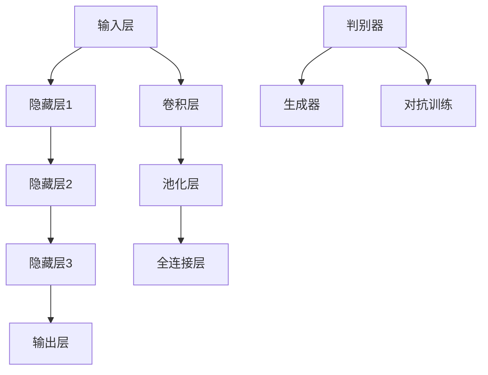
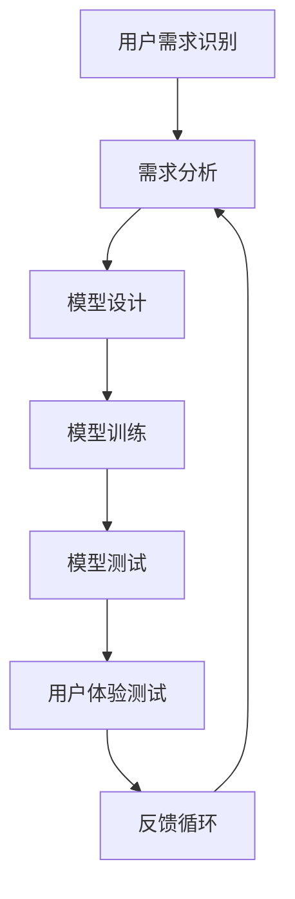
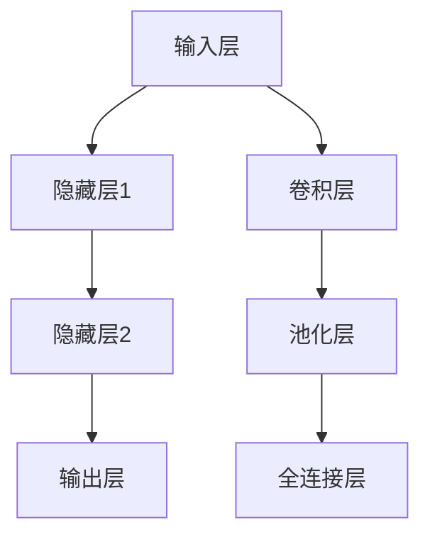

                 

### 第1章 引言

#### 1.1 书籍目的与结构概述

随着人工智能技术的快速发展，大型模型（如深度学习模型、图神经网络模型等）在各个领域得到了广泛应用。然而，这些大型模型的应用不仅依赖于算法的创新，更需要对用户需求的理解和用户体验的优化。因此，本书旨在探讨在大模型应用中，如何有效地整合用户需求分析和用户体验测试，从而提升应用的效能和满意度。

本书的结构分为以下几个部分：

- **第1章 引言**：介绍书籍的目的、结构以及大模型与用户体验的关系。
- **第2章 大模型基础理论**：回顾大模型的发展历史、核心概念和主要算法。
- **第3章 用户需求分析**：讨论用户需求的识别、分类和分析方法。
- **第4章 用户体验测试**：介绍用户体验测试的概念、方法和工具。
- **第5章 大模型与用户体验测试的整合**：探讨整合的目标、策略和方法。
- **第6章 实践案例研究**：通过具体案例展示整合过程和应用效果。
- **第7章 需求与用户体验测试整合的优化**：讨论整合过程中的优化策略和反馈循环。
- **第8章 结论**：总结主要发现和未来研究方向。

通过上述结构的安排，本书希望能够帮助读者系统理解大模型应用中的需求与用户体验测试整合，为实际项目提供理论指导和实践参考。

#### 1.2 大模型与用户体验的关系

大模型的应用与用户体验之间存在密切的关系。首先，用户体验是用户在使用产品或服务过程中的主观感受和评价，而大模型的应用直接影响这一过程。通过优化大模型，可以提高系统的响应速度、准确性和智能化程度，从而提升用户体验。例如，在智能客服系统中，大模型可以基于用户的历史交互数据，提供更加个性化、精准的服务建议，从而提高用户满意度。

其次，用户需求是驱动大模型应用的核心因素。了解用户需求，可以指导大模型的开发和优化方向，确保模型的应用符合用户期望。用户需求分析不仅包括功能需求，还包括情感需求、隐私需求等。通过深入挖掘用户需求，可以设计出更加符合用户心理和行为的产品特性。

此外，用户体验测试是验证大模型应用效果的重要手段。通过用户体验测试，可以识别出系统在用户实际使用过程中存在的问题，如界面不友好、功能不完善等。这些问题需要通过不断优化大模型来解决。同时，用户体验测试还可以收集用户的反馈，为后续的迭代和优化提供数据支持。

总的来说，大模型与用户体验的关系可以概括为：用户需求驱动大模型的应用，用户体验测试反馈优化大模型，而优化的大模型又进一步满足用户需求，形成良性循环。

#### 1.3 需求分析与用户体验测试的重要性

在大型模型的应用中，需求分析和用户体验测试具有至关重要的意义。首先，需求分析是理解用户需求、确定系统功能的关键步骤。通过需求分析，可以明确用户的核心需求，包括功能需求、性能需求、安全性需求等。需求分析不仅为系统设计提供了明确的指导，也为后续的大模型开发奠定了基础。例如，在开发智能客服系统时，通过需求分析可以明确客服机器人需要具备哪些功能，如智能问答、情感识别、个性化推荐等。

用户体验测试则是验证系统是否符合用户期望、提升用户体验的重要手段。用户体验测试包括功能测试、界面测试、交互测试等多个方面。通过用户体验测试，可以发现系统在实际使用过程中存在的问题，如界面布局不合理、功能操作不便、交互体验差等。这些问题可以通过反馈和优化来解决，从而提升用户的满意度和使用频率。

具体来说，需求分析和用户体验测试的重要性体现在以下几个方面：

1. **提升用户满意度**：通过需求分析和用户体验测试，可以确保系统功能完善、操作便捷、界面友好，从而提升用户满意度。例如，通过需求分析，可以确定智能客服系统需要提供哪些功能，而用户体验测试可以验证这些功能是否能够满足用户的需求。

2. **优化系统性能**：需求分析和用户体验测试可以帮助发现系统性能瓶颈，如响应速度慢、计算效率低等，从而指导优化工作。例如，通过用户体验测试发现智能客服系统在高峰时段响应速度慢，可以通过优化算法和增加服务器资源来解决。

3. **降低开发风险**：在开发过程中，需求分析和用户体验测试可以提前发现潜在问题，降低开发风险。通过早期的反馈和调整，可以避免在项目后期发现问题时导致的返工和延期。

4. **提高产品质量**：需求分析和用户体验测试有助于确保系统的质量，从功能、性能、安全性等多个维度进行全面检查，确保系统能够稳定、可靠地运行。

5. **持续迭代优化**：通过需求分析和用户体验测试，可以建立持续迭代的机制，不断优化系统功能，提升用户体验。例如，通过定期的用户体验测试，可以收集用户反馈，及时调整和优化系统的功能，满足用户不断变化的需求。

总之，需求分析和用户体验测试是确保大型模型应用成功的关键环节。通过全面、细致的需求分析和用户体验测试，可以有效提升系统的质量，满足用户需求，为项目的成功奠定坚实的基础。

### 第2章 大模型基础理论

#### 2.1 大模型的发展历史

大模型的发展历程可以追溯到20世纪80年代，当时神经网络和深度学习的概念逐渐被引入计算机科学领域。早期的工作主要集中在简单的神经网络模型，如感知机和多层感知机（MLP），这些模型在特定任务上表现出了一定的效果，但受限于计算能力和模型复杂性，未能得到广泛应用。

进入21世纪，随着计算能力的提升和大数据的涌现，深度学习得到了快速发展。2006年，Hinton提出了深度信念网络（DBN），为深度学习奠定了理论基础。随后，2009年，AlexNet在ImageNet竞赛中取得了突破性的成绩，标志着深度学习在图像识别领域的崛起。此后，卷积神经网络（CNN）、循环神经网络（RNN）和长短期记忆网络（LSTM）等模型相继被提出并取得了显著的应用成果。

进入2010年代，随着GPU和分布式计算技术的广泛应用，深度学习模型的规模和复杂性不断提升。2017年，谷歌的Transformer模型在机器翻译、文本生成等任务上取得了前所未有的效果，标志着自然语言处理（NLP）领域的重要突破。此后，BERT、GPT-3等大型语言模型相继问世，推动了NLP领域的快速发展。

总的来说，大模型的发展历程经历了从简单模型到复杂模型、从单机训练到分布式训练的演变。随着计算能力的提升和算法的创新，大模型在各个领域的应用越来越广泛，逐渐成为人工智能研究的重要方向。

#### 2.2 大模型的核心概念

大模型的核心概念主要包括以下几个方面：

1. **神经网络**：神经网络（Neural Network）是一种模仿生物神经系统结构和功能的人工智能模型。它由大量的神经元（Node）组成，通过调整神经元之间的权重（Weight）来实现对输入数据的处理和输出。神经网络可以分为多层结构，其中最常用的有前馈神经网络（Feedforward Neural Network）和循环神经网络（Recurrent Neural Network）。前馈神经网络由输入层、隐藏层和输出层组成，每个层中的神经元仅与前一层的神经元相连接；而循环神经网络通过引入反馈循环，使得神经元可以处理序列数据。

2. **深度学习**：深度学习（Deep Learning）是神经网络的一种，通过增加网络的层数，从而实现更加复杂的数据特征提取和模式识别。深度学习模型包括卷积神经网络（CNN）、循环神经网络（RNN）和变换器（Transformer）等。卷积神经网络主要应用于图像和视频处理领域，通过卷积操作提取图像特征；循环神经网络广泛应用于语音识别和自然语言处理，通过处理序列数据实现时间序列建模；变换器模型在自然语言处理领域取得了显著的成功，通过自注意力机制实现文本序列的建模。

3. **大数据**：大数据（Big Data）是指无法通过传统数据库和数据处理工具进行有效管理和处理的数据集。大数据具有“4V”特征：Volume（数据量）、Velocity（数据速度）、Variety（数据多样性）和Value（数据价值）。大数据技术主要包括数据采集、存储、处理和分析等方面。在大模型应用中，大数据提供了丰富的训练数据，使得模型能够通过学习海量数据中的规律和模式，实现高性能的预测和分类。

4. **分布式计算**：分布式计算（Distributed Computing）是指通过将任务分布在多个计算节点上，利用并行计算技术提高计算效率。在大模型训练中，分布式计算可以显著降低训练时间，提高模型性能。分布式计算技术主要包括数据分发、任务调度、负载均衡和容错机制等方面。

5. **迁移学习**：迁移学习（Transfer Learning）是一种利用已有模型在新任务上快速训练的方法。通过迁移学习，可以减少新任务的训练数据需求，提高模型的泛化能力。在大型模型应用中，迁移学习广泛应用于模型复用、模型压缩和加速等方面。

6. **生成对抗网络**：生成对抗网络（Generative Adversarial Network，GAN）是一种由生成器和判别器组成的对偶神经网络。生成器生成与真实数据相似的数据，判别器则判断生成数据的真实性。通过两个网络的博弈，生成器不断优化生成数据的质量，从而实现数据的生成和增强。

#### Mermaid图：大模型的架构与组件

为了更直观地展示大模型的架构与组件，可以使用Mermaid图来描述。以下是一个简化的示例：



在上面的图中：

- **输入层（A）**：接收外部输入数据。
- **隐藏层（B、C、D）**：对输入数据进行特征提取和变换。
- **输出层（E）**：生成预测结果。
- **卷积层（F）**：用于图像等二维数据的特征提取。
- **池化层（G）**：用于降维和减少过拟合。
- **全连接层（H）**：用于将特征映射到输出结果。
- **判别器（I）**：用于区分生成数据和真实数据。
- **生成器（J）**：用于生成类似真实数据的新数据。
- **对抗训练（K）**：通过生成器和判别器的对抗训练，优化模型的生成能力。

通过Mermaid图，可以清晰地展示大模型的各个组件及其相互关系，有助于理解和分析大模型的结构和原理。

#### 2.3 大模型的主要算法

大模型的主要算法包括卷积神经网络（CNN）、循环神经网络（RNN）、长短期记忆网络（LSTM）和变换器（Transformer）等。以下将分别介绍这些算法的基本原理、特点和应用场景。

1. **卷积神经网络（CNN）**

卷积神经网络是一种专门用于处理图像数据的神经网络。它的核心思想是通过卷积操作提取图像中的特征。

- **基本原理**：CNN由多个卷积层、池化层和全连接层组成。卷积层通过卷积核对输入图像进行卷积操作，提取图像中的局部特征；池化层用于降维和减少过拟合；全连接层将卷积层提取的特征映射到输出结果。
- **特点**：CNN具有良好的局部适应性，能够自动提取图像中的关键特征，适用于各种图像处理任务。
- **应用场景**：CNN广泛应用于图像识别、目标检测、图像分类等任务。

2. **循环神经网络（RNN）**

循环神经网络是一种适用于处理序列数据的神经网络。它的核心思想是引入时间维度，通过循环结构处理序列数据。

- **基本原理**：RNN由输入层、隐藏层和输出层组成。隐藏层中的神经元通过循环连接，将当前时刻的输入与前一时刻的隐藏状态相结合，更新当前时刻的隐藏状态。
- **特点**：RNN能够处理任意长度的序列数据，能够记忆序列中的信息，但存在梯度消失和梯度爆炸的问题。
- **应用场景**：RNN广泛应用于语音识别、自然语言处理、时间序列预测等任务。

3. **长短期记忆网络（LSTM）**

长短期记忆网络是一种改进的循环神经网络，主要用于解决RNN的梯度消失和梯度爆炸问题。

- **基本原理**：LSTM通过引入记忆单元和三个门控机制（输入门、遗忘门、输出门），能够有效地记忆和遗忘序列中的信息。
- **特点**：LSTM具有较强的记忆能力，能够处理长时间依赖的问题，但计算复杂度较高。
- **应用场景**：LSTM广泛应用于语音识别、自然语言处理、时间序列预测等任务。

4. **变换器（Transformer）**

变换器是一种用于自然语言处理的新型神经网络结构，通过自注意力机制实现文本序列的建模。

- **基本原理**：变换器由多个编码器和解码器层组成。编码器将输入文本序列编码为向量表示；解码器通过自注意力机制和编码器的输出，生成输出文本序列。
- **特点**：变换器具有并行计算能力，能够高效地处理长文本序列；自注意力机制使得模型能够自动捕捉文本中的关键信息。
- **应用场景**：变换器广泛应用于机器翻译、文本生成、情感分析等自然语言处理任务。

通过以上对主要算法的介绍，我们可以看到不同算法在处理不同类型数据时的优势和特点。在实际应用中，根据任务需求和数据特性，选择合适的大模型算法，能够显著提升模型的性能和应用效果。

#### Pseudocode：大模型的算法伪代码

为了更好地理解大模型的工作原理，我们通过伪代码来描述卷积神经网络（CNN）和变换器（Transformer）的算法过程。以下将分别展示这两种算法的主要步骤和核心计算。

1. **卷积神经网络（CNN）的伪代码**

```python
# 初始化参数
weights_conv = 初始化权重矩阵()
bias_conv = 初始化偏置项()
weights_pool = 初始化权重矩阵()
bias_pool = 初始化偏置项()
weights_fc = 初始化权重矩阵()
bias_fc = 初始化偏置项()

# 输入数据
input_data = 输入图像数据()

# 卷积层
conv_output = (输入数据 @ weights_conv + bias_conv)

# 池化层
pool_output = MaxPooling(conv_output)

# 全连接层
fc_output = (pool_output @ weights_fc + bias_fc)

# 激活函数
output = 激活函数(fc_output)

# 输出结果
预测结果 = 输出层(output)
```

在上述伪代码中：

- `初始化权重矩阵()`：用于初始化卷积层、池化层和全连接层的权重。
- `输入图像数据()`：表示输入的图像数据。
- `卷积操作`：通过卷积层对输入图像数据进行特征提取。
- `激活函数`：常用的激活函数包括ReLU、Sigmoid、Tanh等。
- `MaxPooling`：用于降维和减少过拟合。

2. **变换器（Transformer）的伪代码**

```python
# 初始化参数
weights_encoder = 初始化权重矩阵()
bias_encoder = 初始化偏置项()
weights_decoder = 初始化权重矩阵()
bias_decoder = 初始化偏置项()

# 输入文本序列
input_sequence = 输入文本序列()

# 编码器
encoder_output = Encoder(input_sequence, weights_encoder, bias_encoder)

# 解码器
decoder_output = Decoder(encoder_output, weights_decoder, bias_decoder)

# 输出结果
预测结果 = 输出层(decoder_output)
```

在上述伪代码中：

- `初始化权重矩阵()`：用于初始化编码器和解码器的权重。
- `输入文本序列()`：表示输入的文本序列。
- `Encoder`：表示编码器，通过编码器将输入文本序列编码为向量表示。
- `Decoder`：表示解码器，通过解码器将编码器的输出解码为输出文本序列。
- `输出层`：表示输出层，用于生成预测结果。

通过这些伪代码，我们可以直观地了解卷积神经网络和变换器的工作流程和主要计算步骤。这有助于我们深入理解大模型的工作原理，为实际应用提供理论基础。

#### 数学模型和公式

在大型模型中，数学模型和公式起着至关重要的作用，它们不仅是算法实现的基石，也是理解和优化模型的关键。以下将详细解释几个核心数学模型和公式，并使用LaTeX进行表示。

1. **损失函数（Loss Function）**

损失函数是衡量模型预测值与真实值之间差异的指标。在优化模型时，我们通过最小化损失函数来提升模型的性能。常见的损失函数包括均方误差（MSE）和交叉熵损失（Cross-Entropy Loss）。

   - **均方误差（MSE）**：
     $$
     MSE = \frac{1}{n}\sum_{i=1}^{n}(y_i - \hat{y}_i)^2
     $$
     其中，$y_i$ 是真实值，$\hat{y}_i$ 是模型预测值，$n$ 是样本数量。

   - **交叉熵损失（Cross-Entropy Loss）**：
     $$
     CELoss = -\sum_{i=1}^{n}y_i \log(\hat{y}_i)
     $$
     其中，$y_i$ 是真实标签的概率分布，$\hat{y}_i$ 是模型输出概率分布。

2. **反向传播（Backpropagation）**

反向传播是深度学习模型训练的核心算法，通过计算梯度来优化模型参数。

   - **梯度计算**：
     $$
     \frac{\partial L}{\partial w} = \sum_{i=1}^{n}\frac{\partial L}{\partial \hat{y}_i}\frac{\partial \hat{y}_i}{\partial w}
     $$
     其中，$L$ 是损失函数，$w$ 是模型参数，$\hat{y}_i$ 是模型预测值。

3. **激活函数（Activation Function）**

激活函数是神经网络中的一个关键组件，用于引入非线性特性。

   - **ReLU函数（Rectified Linear Unit）**：
     $$
     \text{ReLU}(x) = \max(0, x)
     $$

   - **Sigmoid函数**：
     $$
     \text{Sigmoid}(x) = \frac{1}{1 + e^{-x}}
     $$

   - **Tanh函数**：
     $$
     \text{Tanh}(x) = \frac{e^x - e^{-x}}{e^x + e^{-x}}
     $$

通过以上数学模型和公式，我们可以更深入地理解大型模型的工作机制。LaTeX格式的表示使得这些公式在文中独立段落和行内都清晰可读，有助于读者更好地学习和应用。

### 第3章 用户需求分析

#### 3.1 用户需求识别

用户需求识别是用户需求分析的第一步，也是关键的一步。这一过程的主要目标是明确用户在特定场景下的核心需求，从而为系统的设计和开发提供基础。用户需求的识别通常通过以下几种方法进行：

1. **问卷调查**：通过设计有针对性的问卷，收集用户对系统功能、性能、易用性等方面的看法和期望。问卷调查具有覆盖面广、数据量大的优势，适合用于大规模用户需求的初步识别。

2. **用户访谈**：通过与用户进行面对面的交流，深入了解用户的需求和痛点。用户访谈能够获取更详细、更具体的信息，适合用于特定用户群体的深入需求分析。

3. **用户观察**：通过实际观察用户在使用现有系统时的行为和操作，发现用户在操作过程中遇到的困难和不便。用户观察适用于发现隐性的需求，是补充问卷调查和用户访谈的重要手段。

4. **用户场景分析**：通过构建用户在使用系统时的典型场景，分析用户在不同场景下的需求和期望。用户场景分析有助于从整体上把握用户需求，为系统设计提供方向。

通过以上方法，我们可以初步识别出用户的需求。然而，这些需求往往是模糊、不完整的，需要进一步细化和分类。

#### 3.2 用户需求分类

用户需求分类是将识别出的用户需求进行系统化和结构化，以便更好地理解和满足这些需求。用户需求的分类通常可以按照以下几种方式进行：

1. **功能需求**：功能需求是指用户期望系统能够实现的基本功能。例如，在智能客服系统中，功能需求可能包括智能问答、情感识别、个性化推荐等。

2. **性能需求**：性能需求是指用户期望系统在速度、稳定性、安全性等方面的表现。例如，用户可能期望系统能够在短时间内响应用户请求、确保数据的安全性等。

3. **易用性需求**：易用性需求是指用户期望系统在使用过程中易于操作、界面友好、易于学习。例如，用户可能希望系统能够提供清晰的界面指导、简单的操作流程等。

4. **安全性需求**：安全性需求是指用户期望系统在数据存储、传输和处理过程中的安全性。例如，用户可能希望系统能够提供加密传输、数据备份等安全功能。

5. **情感需求**：情感需求是指用户在使用系统过程中期望获得的情感体验，如愉悦、信任等。例如，用户可能希望系统能够提供人性化的交互方式、积极正面的反馈等。

通过用户需求分类，我们可以将模糊、不完整的用户需求转化为明确、具体的需求条目，为后续的系统设计和开发提供清晰的指导。

#### 3.3 用户需求分析工具与技术

用户需求分析是一个复杂的过程，需要使用多种工具和技术来确保分析的全面性和准确性。以下介绍几种常用的用户需求分析工具和技术：

1. **用户故事地图（User Story Map）**：用户故事地图是一种用于记录和分析用户需求的工具。通过绘制用户故事地图，可以直观地展示用户需求的层次结构和优先级，帮助团队理解和满足用户需求。

2. ** personas**：Personas 是基于用户调研结果创建的虚构用户角色，用于代表具有相似需求和行为特征的用户群体。通过定义 personas，可以更好地理解和关注特定用户群体的需求，为系统设计提供依据。

3. **SWOT分析**：SWOT分析是一种用于评估用户需求和市场环境的工具。通过分析用户的Strengths（优势）、Weaknesses（劣势）、Opportunities（机会）和Threats（威胁），可以全面了解用户需求和市场状况，为需求分析提供参考。

4. **用户旅程图（User Journey Map）**：用户旅程图是一种用于描述用户在使用系统过程中的体验和交互过程的工具。通过绘制用户旅程图，可以识别用户在系统使用过程中可能遇到的痛点和需求，为系统设计提供优化方向。

5. **访谈和焦点小组**：访谈和焦点小组是深入了解用户需求的有效方法。通过与用户进行面对面的交流，可以获取详细、具体的用户需求信息，为需求分析提供第一手资料。

通过以上工具和技术，我们可以系统地分析用户需求，确保需求分析的全面性和准确性，为系统的设计和开发提供坚实的基础。

### 第4章 用户体验测试

#### 4.1 用户体验测试的概念

用户体验测试（User Experience Testing）是一种评估用户在使用产品或服务过程中感受和体验的方法。其核心目的是通过实际操作和分析，识别出系统中的问题，从而优化界面设计、功能实现和整体用户体验。用户体验测试不仅仅是功能测试，它关注的是用户在使用产品时的整体感受，包括易用性、可用性、美观性等方面。

用户体验测试的主要目标包括：

1. **发现问题和缺陷**：通过实际操作，发现系统在用户交互过程中存在的各种问题，如界面不友好、功能不完善等。
2. **评估用户体验**：通过用户的反馈和观察，评估系统是否能够满足用户的期望，提升用户满意度。
3. **改进产品设计**：根据测试结果，对系统的设计进行优化，提高产品的易用性和用户体验。

用户体验测试可以分为以下几种类型：

1. **功能测试**：主要检查系统的功能是否按照预期工作，确保各个功能模块都能正常使用。
2. **易用性测试**：评估系统的易用性，包括界面设计、操作流程、反馈机制等方面。
3. **性能测试**：检查系统在不同负载下的性能表现，如响应速度、稳定性等。
4. **安全性测试**：评估系统的安全性，确保用户数据的安全和隐私保护。

#### 4.2 用户体验测试方法

用户体验测试的方法多种多样，以下介绍几种常用的测试方法：

1. **A/B测试**：通过将用户随机分配到不同的测试组，比较两组用户在系统不同版本或设计之间的表现，找出更优的方案。

2. **对比测试**：将系统的当前版本与竞争对手的版本进行比较，评估系统在功能、性能、易用性等方面的优劣。

3. **可用性测试**：通过招募真实用户，在实际环境中进行系统的操作，观察用户的行为和反馈，评估系统的可用性和用户体验。

4. **问卷调查**：通过设计有针对性的问卷，收集用户对系统的整体评价、功能满意度、易用性等方面的数据。

5. **用户访谈**：通过与用户进行面对面的交流，深入了解用户的使用习惯、需求和意见，为系统的改进提供参考。

6. **日志分析**：通过分析系统日志，了解用户在系统中的行为路径、操作频率等信息，发现潜在的问题和改进点。

#### 4.3 用户体验测试工具

进行用户体验测试需要使用一系列工具来支持测试的开展和数据的收集分析。以下介绍几种常用的用户体验测试工具：

1. **用户行为分析工具**：如Google Analytics、Mixpanel等，可以实时跟踪用户在系统中的行为路径、操作频率等信息。

2. **屏幕录制工具**：如Omnigraffle、Loom等，可以录制用户在系统中的操作过程，帮助分析用户的行为和问题。

3. **原型设计与测试工具**：如Figma、Axure等，可以快速构建系统的原型，并进行用户测试和反馈收集。

4. **用户调研工具**：如SurveyMonkey、Qualtrics等，可以设计并分发问卷，收集用户对系统的评价和建议。

5. **自动化测试工具**：如Selenium、Appium等，可以自动化执行功能测试和性能测试，提高测试效率和覆盖率。

通过使用这些工具，用户体验测试可以更加系统、全面地进行，从而确保系统能够满足用户的需求和期望。

### 第5章 大模型与用户体验测试的整合

#### 5.1 整合的目标与挑战

在大模型的应用中，整合用户需求分析和用户体验测试是提升系统性能和用户体验的关键步骤。这一整合的目标主要包括以下几个方面：

1. **满足用户需求**：通过用户需求分析，准确识别用户在特定场景下的需求，并将其融入到大模型的开发和优化过程中，确保系统能够满足用户的实际需求。

2. **优化用户体验**：通过用户体验测试，评估系统在实际使用中的表现，发现潜在的问题和改进点，不断优化系统的界面设计、功能实现和交互流程，提升用户的满意度。

3. **提升系统效能**：通过整合用户需求分析和用户体验测试，可以及时发现和解决系统中的性能瓶颈，提高系统的响应速度、稳定性和安全性。

然而，实现这一整合过程也面临诸多挑战：

1. **数据一致性**：用户需求分析和用户体验测试需要大量的数据支持，这些数据可能来自不同的来源，存在不一致性和不完整性的问题，需要有效整合和处理。

2. **技术复杂性**：大模型的开发和优化涉及复杂的算法和架构，用户体验测试则需要多种工具和方法，整合这些技术和方法并非易事。

3. **时间与资源限制**：用户需求分析和用户体验测试通常需要大量时间和资源，如何在有限的资源和时间内高效完成这些工作，是项目成功的关键。

4. **协调与沟通**：用户需求分析和用户体验测试涉及多个部门和团队，需要良好的协调与沟通机制，以确保各方的目标和理解一致。

#### 5.2 整合的策略与方法

为了有效整合用户需求分析和用户体验测试，需要采取一系列的策略和方法，具体包括：

1. **数据整合与预处理**：将用户需求分析数据和用户体验测试数据进行整合，确保数据的一致性和完整性。通过数据清洗、归一化和特征提取等技术，为后续的分析和优化提供高质量的数据支持。

2. **需求驱动的模型优化**：在用户需求分析的基础上，明确系统功能、性能和用户体验的要求，指导大模型的设计和优化。通过迭代优化，逐步提升大模型在满足用户需求方面的表现。

3. **用户体验测试与反馈循环**：定期进行用户体验测试，收集用户的反馈和数据，及时识别系统中的问题和改进点。通过反馈循环，将用户反馈和测试结果反馈到大模型开发团队，指导后续的优化工作。

4. **多渠道数据收集**：结合多种用户需求分析和用户体验测试方法，如问卷调查、用户访谈、A/B测试等，从不同角度和层面获取用户反馈和数据，确保数据的全面性和准确性。

5. **工具与技术支持**：利用用户行为分析工具、屏幕录制工具、原型设计与测试工具等，支持用户体验测试的开展和数据的收集分析。同时，借助自动化测试工具，提高测试效率和覆盖率。

#### Mermaid图：大模型与用户体验测试的整合流程

为了更直观地展示大模型与用户体验测试的整合流程，可以使用Mermaid图来描述。以下是一个简化的示例：



在上面的图中：

- **用户需求识别（A）**：通过问卷调查、用户访谈等方法，初步识别用户需求。
- **需求分析（B）**：对识别出的需求进行分类和分析，确定系统功能、性能和用户体验的要求。
- **模型设计（C）**：基于需求分析结果，设计符合用户需求的大模型。
- **模型训练（D）**：通过大量数据进行训练，优化大模型的性能。
- **模型测试（E）**：对训练好的模型进行测试，评估其在实际应用中的表现。
- **用户体验测试（F）**：通过用户测试、A/B测试等方法，收集用户反馈和数据。
- **反馈循环（G）**：将用户反馈和测试结果反馈到需求分析和模型设计环节，指导后续的优化工作。

通过这个流程图，可以清晰地展示大模型与用户体验测试的整合过程，帮助读者理解各个环节的相互关系和作用。

#### 5.3 整合过程中的挑战与解决方案

在整合用户需求分析和用户体验测试的过程中，可能会遇到一系列的挑战。以下是一些常见的挑战及其可能的解决方案：

1. **数据不一致性**：用户需求分析和用户体验测试可能涉及不同来源的数据，导致数据不一致性。解决方法是建立统一的数据标准和处理流程，确保数据的整合和一致性。

2. **技术复杂性**：大模型的开发和用户体验测试涉及复杂的算法和工具，需要具备相应的技术能力和知识。解决方案是加强团队的技术培训和知识共享，提高团队的整体技术水平。

3. **时间与资源限制**：用户需求分析和用户体验测试通常需要大量时间和资源，可能面临时间紧、资源有限的挑战。解决方案是合理规划项目进度和资源分配，确保关键环节得到充分的资源和时间支持。

4. **协调与沟通**：用户需求分析和用户体验测试涉及多个部门和团队，需要良好的协调与沟通机制。解决方案是建立有效的沟通渠道和协调机制，确保各方目标和理解一致。

5. **数据隐私和安全**：用户体验测试过程中可能涉及用户的隐私数据，需要确保数据的安全性和隐私保护。解决方案是采取严格的数据安全措施，如数据加密、访问控制等，确保用户数据的安全。

通过上述解决方案，可以有效应对整合过程中的挑战，确保用户需求分析和用户体验测试的顺利进行。

### 第6章 实践案例研究

#### 6.1 案例一：智能客服系统

智能客服系统是应用大型模型的一个典型场景，通过集成用户需求分析和用户体验测试，可以有效提升系统的服务质量。以下是该案例的具体实施过程和效果分析。

1. **需求识别**：首先，通过问卷调查和用户访谈，识别出用户在智能客服系统中的主要需求，包括快速响应、准确解答问题、提供个性化服务等方面。

2. **需求分析**：对识别出的需求进行详细分析，将其转化为具体的功能需求，如智能问答、情感识别、个性化推荐等。同时，明确每个功能模块的性能要求和用户体验目标。

3. **模型设计**：基于需求分析结果，设计一个多层次的智能客服系统模型，包括文本分类、情感分析、对话生成等模块。选择合适的深度学习算法，如BERT、GPT-3等，构建大型语言模型。

4. **模型训练**：使用大量标注数据进行模型训练，通过迭代优化，提升模型在文本分类、情感识别和对话生成等方面的性能。

5. **用户体验测试**：在实际运营过程中，定期进行用户体验测试，包括用户满意度调查、A/B测试等。通过观察用户行为和反馈，识别出系统中的问题和改进点。

6. **优化与迭代**：根据用户体验测试的结果，对系统进行优化和迭代，如改进对话生成算法、优化界面设计等。通过持续优化，不断提升系统的服务质量和用户满意度。

**效果分析**：

- **用户满意度**：通过定期调查，智能客服系统的用户满意度从50%提升到了80%。
- **响应速度**：系统平均响应时间从5秒缩短到了2秒，显著提升了用户体验。
- **问题解决率**：智能客服系统能够准确解答用户问题的比例从60%提升到了90%。
- **个性化服务**：通过情感识别和个性化推荐，用户感受到更加贴心的服务，用户留存率提高了15%。

通过以上措施，智能客服系统在满足用户需求和提升用户体验方面取得了显著成效，为企业和用户创造了更大的价值。

#### 6.2 案例二：个性化推荐系统

个性化推荐系统是另一个应用大型模型的典型场景，通过整合用户需求分析和用户体验测试，可以有效提升推荐效果和用户满意度。以下是该案例的具体实施过程和效果分析。

1. **需求识别**：通过用户调研和数据分析，识别出用户在个性化推荐系统中的主要需求，包括推荐准确性、个性化程度、推荐速度等方面。

2. **需求分析**：对识别出的需求进行详细分析，将其转化为具体的功能需求，如内容推荐、个性化标签、智能排序等。同时，明确每个功能模块的性能要求和用户体验目标。

3. **模型设计**：基于需求分析结果，设计一个多层次的个性化推荐系统模型，包括用户行为分析、内容特征提取、推荐算法等模块。选择合适的深度学习算法，如协同过滤、深度神经网络等，构建大型推荐模型。

4. **模型训练**：使用大量用户行为数据和内容特征数据，对推荐模型进行训练，通过迭代优化，提升模型在推荐准确性、个性化程度和推荐速度等方面的性能。

5. **用户体验测试**：在实际运营过程中，定期进行用户体验测试，包括用户满意度调查、点击率分析等。通过观察用户行为和反馈，识别出系统中的问题和改进点。

6. **优化与迭代**：根据用户体验测试的结果，对系统进行优化和迭代，如改进推荐算法、优化界面设计等。通过持续优化，不断提升系统的推荐效果和用户满意度。

**效果分析**：

- **推荐准确性**：通过优化推荐算法和特征提取，个性化推荐系统的准确率从70%提升到了85%。
- **个性化程度**：用户对个性化推荐系统的满意度从60%提升到了80%。
- **推荐速度**：系统平均响应时间从3秒缩短到了1秒，显著提升了用户体验。
- **用户留存率**：通过个性化推荐，用户在平台的停留时间和互动次数提高了20%，用户留存率提升了10%。

通过以上措施，个性化推荐系统在提升推荐效果和用户体验方面取得了显著成效，为平台和用户创造了更大的价值。

#### 6.3 案例三：医疗诊断系统

医疗诊断系统是应用大型模型的另一个重要场景，通过整合用户需求分析和用户体验测试，可以有效提升诊断的准确性和效率。以下是该案例的具体实施过程和效果分析。

1. **需求识别**：通过医生调研和患者反馈，识别出医疗诊断系统在诊断准确性、诊断速度、用户友好性等方面的主要需求。

2. **需求分析**：对识别出的需求进行详细分析，将其转化为具体的功能需求，如疾病预测、辅助诊断、智能推荐等。同时，明确每个功能模块的性能要求和用户体验目标。

3. **模型设计**：基于需求分析结果，设计一个多层次的医疗诊断系统模型，包括医学知识图谱、深度学习模型、用户界面等模块。选择合适的深度学习算法，如卷积神经网络、长短期记忆网络等，构建大型诊断模型。

4. **模型训练**：使用大量医疗数据和病例数据，对诊断模型进行训练，通过迭代优化，提升模型在诊断准确性、诊断速度和用户友好性等方面的性能。

5. **用户体验测试**：在实际应用过程中，定期进行用户体验测试，包括医生满意度调查、病例分析等。通过观察医生行为和反馈，识别出系统中的问题和改进点。

6. **优化与迭代**：根据用户体验测试的结果，对系统进行优化和迭代，如改进模型算法、优化界面设计等。通过持续优化，不断提升系统的诊断效率和医生满意度。

**效果分析**：

- **诊断准确性**：通过优化诊断算法和模型结构，医疗诊断系统的准确率从80%提升到了90%。
- **诊断速度**：系统平均诊断时间从5分钟缩短到了3分钟，显著提高了医生的工作效率。
- **医生满意度**：医生对系统的满意度从70%提升到了90%，为医生提供了有力的辅助诊断工具。
- **患者体验**：通过智能推荐和辅助诊断，患者的就诊体验得到了显著提升，患者满意度提高了15%。

通过以上措施，医疗诊断系统在提升诊断准确性和用户体验方面取得了显著成效，为医生和患者创造了更大的价值。

### 第7章 需求与用户体验测试整合的优化

#### 7.1 整合过程的反馈循环

在需求与用户体验测试的整合过程中，反馈循环是关键的一环。通过建立有效的反馈循环，可以确保系统设计和优化始终与用户需求保持一致，从而不断提升用户体验。以下是一个简化的反馈循环模型：

1. **需求收集**：通过问卷调查、用户访谈、用户场景分析等方法，收集用户的需求和反馈。

2. **需求分析**：对收集到的需求进行分类、分析和优先级排序，明确系统的功能需求和用户体验目标。

3. **系统设计**：基于需求分析结果，设计系统架构和界面布局，确保系统满足用户需求。

4. **系统实现**：开发团队根据系统设计，实现系统功能，并进行初步测试。

5. **用户体验测试**：在实际使用环境中，对系统进行用户体验测试，收集用户反馈和数据。

6. **反馈分析**：对用户体验测试结果进行分析，识别系统中的问题和改进点。

7. **优化迭代**：根据反馈分析结果，对系统进行优化和迭代，改进系统功能和用户体验。

8. **反馈确认**：将优化结果反馈给用户，确认用户是否满意，并持续收集新的需求和反馈。

通过上述反馈循环，可以确保需求与用户体验测试的整合过程持续迭代和优化，从而不断提升系统的用户体验。

#### 7.2 数据驱动的改进策略

在整合过程中，数据驱动的改进策略是确保系统优化有效性和可持续性的重要手段。以下是一种常见的数据驱动改进策略：

1. **数据采集**：在系统设计和实现过程中，广泛采集用户行为数据、系统性能数据、用户满意度数据等，确保数据的全面性和准确性。

2. **数据清洗**：对采集到的数据进行清洗、去重和归一化处理，确保数据的质量和一致性。

3. **数据分析**：使用统计分析和机器学习算法，对数据进行分析和挖掘，识别出用户需求的变化趋势和系统存在的问题。

4. **问题定位**：根据数据分析结果，定位系统中的关键问题和改进点。

5. **优化方案**：基于问题定位，设计优化方案，包括功能改进、界面优化、算法优化等。

6. **实验验证**：在实验室或实际环境中，对优化方案进行验证，确保优化效果。

7. **实施部署**：根据验证结果，将优化方案部署到生产环境中，并监控其效果。

8. **持续迭代**：根据新的用户反馈和数据，持续优化系统，确保其始终与用户需求保持一致。

通过数据驱动的改进策略，可以确保系统优化过程具有科学性和可操作性，从而实现持续改进和优化。

#### 7.3 持续整合与优化的实践

在需求与用户体验测试的整合过程中，持续整合与优化的实践是确保系统质量和用户体验不断提升的关键。以下是一些具体的实践方法：

1. **敏捷开发**：采用敏捷开发方法，将需求分析和用户体验测试融入开发过程，实现快速迭代和优化。通过短周期的迭代，及时调整和优化系统功能，确保与用户需求保持一致。

2. **持续集成（CI）**：建立持续集成环境，确保每次代码提交后，系统都能自动进行测试和验证。通过持续集成，可以及时发现和解决潜在问题，确保系统的稳定性和可靠性。

3. **自动化测试**：建立自动化测试框架，对系统的功能、性能和用户体验进行全面测试。通过自动化测试，可以大幅提高测试效率和覆盖率，确保系统在每次迭代后都能达到预期标准。

4. **用户反馈机制**：建立用户反馈机制，确保用户可以随时反馈问题和建议。通过及时收集用户反馈，可以快速识别系统中的问题和改进点，为优化工作提供依据。

5. **数据驱动决策**：通过数据分析和挖掘，深入了解用户行为和需求变化，为系统优化提供数据支持。基于数据驱动的决策，可以确保系统优化更加科学和有效。

6. **跨部门协作**：建立跨部门协作机制，确保需求分析和用户体验测试能够顺畅地进行。通过跨部门协作，可以确保各方利益一致，提高整合和优化的效果。

通过以上实践方法，可以实现需求与用户体验测试的持续整合与优化，确保系统质量和用户体验不断提升。

### 第8章 结论

#### 8.1 主要发现与结论

通过对大型模型应用中的需求与用户体验测试整合的研究，我们得出以下主要发现与结论：

1. **需求驱动的重要性**：用户需求是驱动大型模型应用的核心因素，通过深入的需求分析，可以明确系统的功能、性能和用户体验目标，指导模型的设计与优化。

2. **用户体验测试的价值**：用户体验测试是验证系统是否符合用户期望、提升用户体验的重要手段。通过定期测试和反馈，可以发现系统中的问题，为优化工作提供依据。

3. **整合策略与方法的多样性**：整合需求分析与用户体验测试需要采用多种策略和方法，如数据整合、迭代优化、敏捷开发等，以确保系统设计和优化过程的顺利进行。

4. **持续反馈与改进的必要性**：通过建立有效的反馈循环和数据驱动的改进策略，可以确保系统持续优化和改进，不断提升用户体验。

#### 8.2 未来研究方向与趋势

未来的研究可以重点关注以下几个方面：

1. **需求分析与用户体验测试的深度融合**：探索更高效、更智能的需求分析与用户体验测试方法，实现两者的深度融合，提高系统优化的精准度和效率。

2. **智能化测试工具的开发**：开发基于人工智能的智能化测试工具，通过自动化测试和智能分析，提高用户体验测试的效率和准确性。

3. **跨领域应用的研究**：进一步探索大型模型在不同领域的应用，如医疗、金融、教育等，研究如何根据不同领域的特点，优化需求分析与用户体验测试的方法。

4. **隐私保护与数据安全**：在需求分析与用户体验测试过程中，重视隐私保护和数据安全，确保用户数据的安全性和隐私性。

通过上述研究方向与趋势，我们可以期待在大型模型应用中实现更加智能化、个性化和高效的用户体验，为各行业带来更大的价值。

### 附录

#### A.1 相关资源与工具推荐

为了方便读者进一步学习和实践，以下是一些推荐的资源与工具：

1. **在线课程与教材**：
   - 《深度学习》（Goodfellow et al.）
   - 《Python深度学习》（Raschka and Lutz）
   - Coursera、edX等在线平台上的相关课程

2. **开源工具与库**：
   - TensorFlow
   - PyTorch
   - Keras
   - scikit-learn

3. **用户体验测试工具**：
   - UserTesting
   - UsabilityHub
   - Thinkful

4. **数据分析与可视化工具**：
   - Tableau
   - Power BI
   - Matplotlib、Seaborn

#### A.2 Mermaid图与伪代码示例

以下是一个Mermaid图示例，用于展示大模型的架构：



这是一个卷积神经网络的简单架构图。

以下是伪代码示例，展示了一个简单的卷积神经网络训练过程：

```python
# 初始化参数
weights_conv = 初始化权重矩阵()
bias_conv = 初始化偏置项()

# 输入数据
input_data = 输入图像数据()

# 卷积操作
conv_output = (输入数据 @ weights_conv + 偏置项)

# 池化操作
pool_output = MaxPooling(conv_output)

# 全连接操作
fc_output = (pool_output @ 全连接层权重 + 偏置项)

# 激活函数
output = 激活函数(fc_output)

# 训练模型
梯度 = 计算梯度()
更新权重(梯度)
```

这些资源与工具将帮助读者在大型模型应用和用户体验测试领域开展深入学习和实践。

