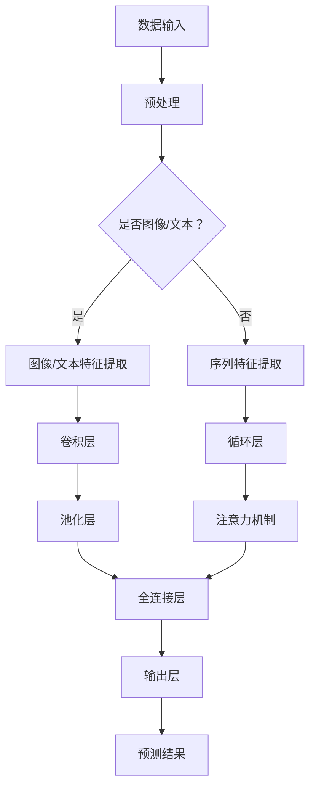

                 

### 文章标题：大模型应用中的需求与资源分配策略

在当今快速发展的技术时代，大型模型（大模型）的应用变得越来越广泛。从自然语言处理到图像识别，再到复杂的科学研究和工程应用，大模型已经成为推动创新和技术进步的重要力量。然而，随着模型规模的不断扩大，如何合理地管理和分配资源成为了一个关键问题。本文将探讨大模型应用中的需求与资源分配策略，旨在为AI研究员、工程师和产品经理提供一套实用的指导方案。

### 关键词

- 大模型
- 资源分配
- 需求分析
- 优化算法
- 实际案例

### 摘要

本文首先介绍了大模型的基本概念和背景，随后深入探讨了大模型应用中的需求分析、资源分配策略和优化方法。通过具体案例，文章展示了如何在实际项目中应用这些策略，并提供了一些最佳实践和注意事项。最后，文章总结了主要观点并对未来的发展方向进行了展望。

---

### 引言

随着深度学习技术的飞速发展，大型神经网络模型（即大模型）在各个领域取得了显著成就。从语音识别到机器翻译，从图像处理到自动驾驶，大模型的应用已经渗透到社会的各个角落。然而，大模型的训练和部署需要大量的计算资源和数据支持，这给资源管理带来了巨大的挑战。

资源分配问题是大模型应用中的一大难题。不当的资源分配不仅会导致效率低下，增加成本，还可能影响模型的性能和可靠性。因此，理解和掌握大模型应用中的需求与资源分配策略对于实现高效、稳定的模型部署至关重要。

本文将围绕以下几个核心问题展开讨论：

1. **大模型的基本概念和架构**：介绍大模型的基本概念、相关技术和典型应用场景。
2. **需求分析**：讨论如何识别和评估大模型应用中的需求。
3. **资源分配策略**：探讨资源分配的原则、算法和实时调整策略。
4. **优化方法**：介绍大模型资源优化的目标和具体算法。
5. **案例研究**：通过具体案例分析大模型资源管理的实际应用。
6. **实战指导**：提供大模型应用的实际操作指南，包括环境搭建、代码实现和调试优化。
7. **总结与展望**：总结文章内容并对未来发展方向进行展望。

通过本文的讨论，希望读者能够对大模型应用中的需求与资源分配策略有更深入的理解，从而为实际项目提供有益的参考。

### 第1章 核心概念与联系

#### 1.1 大模型的概念

大模型是指具有数百万甚至数十亿参数的复杂神经网络。这些模型通常用于解决各种复杂任务，如图像识别、自然语言处理和自动驾驶等。大模型的显著特点是其庞大的参数量和高度复杂的结构。

大模型的参数数量决定了模型的容量，即模型能够学习复杂任务的能力。一个参数表示模型对输入数据的响应程度，参数越多，模型的表示能力越强，但也意味着模型的训练时间和计算资源需求更大。

#### 1.2 大模型的技术架构

大模型的技术架构通常包括以下几个关键组件：

1. **输入层**：接收外部输入数据，如文本、图像或语音信号。
2. **隐藏层**：包含一个或多个隐藏层，每个隐藏层由多个神经元组成。隐藏层负责对输入数据进行特征提取和变换。
3. **输出层**：产生最终的预测结果或输出。输出层的类型和结构取决于具体的应用任务。

除了这些基本组件，大模型还可能包括：

- **卷积层**：用于处理图像数据，提取局部特征。
- **循环层**：用于处理序列数据，如文本和时间序列数据。
- **注意力机制**：用于提高模型对关键信息的关注程度。

#### 1.3 大模型的应用场景

大模型在多个领域都展现出了强大的能力，以下是几个典型的应用场景：

1. **自然语言处理**：大模型被广泛应用于机器翻译、文本分类、情感分析和对话系统等领域。例如，谷歌的BERT模型在多个自然语言处理任务中取得了领先的成绩。
2. **计算机视觉**：大模型在图像识别、目标检测和图像生成等任务中发挥了重要作用。例如，卷积神经网络（CNN）在图像分类和目标检测中的应用非常广泛。
3. **科学计算**：大模型在模拟物理现象、药物发现和基因组学等领域有着潜在的应用。例如，深度强化学习在优化量子化学计算中表现出了巨大的潜力。
4. **自动驾驶**：大模型在自动驾驶系统中被用于感知环境、做出决策和路径规划。例如，特斯拉的自动驾驶系统使用了大量的神经网络模型。

#### 1.4 大模型与相关技术的联系

大模型的发展离不开相关技术的支持，包括深度学习、计算能力和数据集等。

- **深度学习**：深度学习是构建大模型的基础。深度学习通过多层神经网络模型，实现从数据中自动提取特征和表示，从而提高模型的性能。
- **计算能力**：随着大模型的规模不断扩大，计算能力成为了一个关键因素。高性能计算（HPC）和分布式计算技术的发展，为训练和部署大模型提供了强有力的支持。
- **数据集**：大模型需要大量的数据来训练。高质量的数据集不仅能够提升模型的性能，还能减少过拟合的风险。数据集的多样性和规模直接影响大模型的应用效果。

为了更好地理解大模型的应用和资源管理，下面我们将通过Mermaid流程图展示大模型的技术架构和相关联系：

通过上述Mermaid流程图，我们可以清晰地看到大模型的基本架构和各个组件之间的联系。接下来，我们将进一步探讨大模型在具体应用场景中的需求分析。

### 第2章 需求分析

#### 2.1 需求识别

在大模型应用中，需求识别是一个关键步骤，它决定了后续的资源分配和优化策略。需求识别的过程可以分为以下几个阶段：

1. **业务需求分析**：首先，我们需要明确大模型应用的业务目标。例如，在自然语言处理领域，可能的目标是提高文本分类的准确率或实现更自然的对话生成。在计算机视觉领域，目标可能是实现高精度的图像识别或自动驾驶系统中的实时路径规划。

2. **用户需求调查**：通过调查用户的需求，我们可以获取第一手资料。用户的需求可能包括对模型性能的要求、对响应时间的期望、对数据隐私的关注等。这些信息将直接影响大模型的设计和资源分配。

3. **技术需求分析**：技术需求分析包括对现有技术和方案的调研。通过分析技术现状，我们可以确定大模型所需的技术支持，如深度学习框架、硬件设备、网络架构等。

#### 2.2 需求评估

需求评估是需求识别的延续，其主要目的是对识别出的需求进行优先级排序和可行性分析。以下是需求评估的主要步骤：

1. **性能指标设定**：根据业务需求和用户需求，设定具体的性能指标。例如，在图像识别任务中，可以设定准确率、召回率、F1值等指标。在自然语言处理任务中，可以设定文本分类的准确率、BLEU分数等。

2. **成本效益分析**：评估不同需求的实现成本和对业务价值的贡献。通过成本效益分析，我们可以确定哪些需求是优先考虑的，哪些需求可能因为成本过高而被放弃。

3. **需求优先级排序**：根据性能指标和成本效益分析的结果，对需求进行优先级排序。通常，我们优先考虑那些对业务影响大、实现成本相对较低的需求。

#### 2.3 需求优先级排序

需求优先级排序是需求分析的最后一步，它决定了资源分配和优化策略的具体实施顺序。以下是需求优先级排序的几种方法：

1. **多目标优化**：多目标优化方法考虑多个需求之间的相互关系，通过权衡不同需求之间的优先级来实现整体优化。例如，在图像识别任务中，我们可以同时优化准确率和响应时间。

2. **决策树分析**：决策树分析通过逐步筛选需求，确定各个需求之间的优先级。这种方法有助于清晰地展示不同需求之间的依赖关系，从而为资源分配提供指导。

3. **权重分配法**：权重分配法通过为每个需求分配权重来确定优先级。权重通常基于需求的重要性、实现成本和业务价值等因素。这种方法适用于较为复杂的需求场景。

#### 实例分析

为了更好地理解需求识别和评估，我们可以通过一个实际的案例进行分析。

**案例：企业级图像识别系统**

在一个企业级图像识别系统中，需求识别和评估可能包括以下内容：

1. **业务需求分析**：企业希望实现自动化的图像识别和分类，以提高生产效率并减少人工成本。
2. **用户需求调查**：用户要求系统能够快速准确地识别和分类大量的图像，同时保证较高的准确率。
3. **技术需求分析**：系统需要支持大规模图像处理，并且能够实时响应。
4. **性能指标设定**：设定准确率为95%以上，响应时间不超过1秒。
5. **成本效益分析**：考虑硬件成本、软件成本和人力成本，评估不同性能指标和响应时间下的成本效益。
6. **需求优先级排序**：根据业务需求和用户需求，将准确率和响应时间设定为最高优先级。

通过上述需求识别和评估，企业可以确定资源分配和优化策略的实施顺序，从而确保图像识别系统的性能和可靠性。

### 第3章 资源分配策略

#### 3.1 资源分配原则

在大模型应用中，资源分配是一个复杂且关键的过程。合理的资源分配不仅能够提高模型的性能，还能够降低成本，确保系统的稳定运行。以下是资源分配的几个关键原则：

1. **性能优先**：在资源分配时，应优先考虑对模型性能有显著影响的资源，如计算资源、存储资源和网络资源。性能优先的原则能够确保模型在关键任务上的高效运行。
2. **可扩展性**：资源分配应具备良好的可扩展性，以便在模型规模扩大或需求增加时，能够快速、高效地进行扩展。可扩展性原则有助于应对动态变化的业务需求。
3. **容错性**：资源分配应考虑系统的容错能力，确保在部分资源故障时，系统能够继续运行。容错性原则能够提高系统的可靠性，减少因资源故障导致的停机时间。
4. **成本效益**：在资源分配时，应综合考虑成本和效益。通过优化资源使用，实现成本效益最大化，确保资源投入能够带来相应的业务价值。

#### 3.2 资源分配算法

资源分配算法是实现资源高效利用的关键。以下是一些常用的资源分配算法：

1. **动态资源分配算法**：动态资源分配算法根据系统的实时需求动态调整资源分配。这种方法能够确保资源在各个任务之间得到最优的利用。例如，基于预测的动态资源分配算法可以根据模型预测的未来需求进行资源预分配。
2. **基于优先级的资源分配算法**：基于优先级的资源分配算法根据任务的重要性和紧急程度进行资源分配。通常，优先级较高的任务会得到更多的资源。这种方法适用于任务多样性较高的场景。
3. **负载均衡资源分配算法**：负载均衡资源分配算法通过平衡不同任务之间的资源使用，避免某个资源过载或闲置。常见的负载均衡算法包括轮询分配、最小连接数分配和加权负载均衡等。

#### 3.3 实时资源调整策略

在实际应用中，大模型的需求是动态变化的，因此实时资源调整策略至关重要。以下是一些常见的实时资源调整策略：

1. **自动扩展与缩减**：自动扩展与缩减策略根据系统的实时负载自动调整资源。当系统负载增加时，自动扩展资源；当系统负载减少时，自动缩减资源。这种策略能够实现资源的动态优化，提高系统效率。
2. **实时性能监控**：实时性能监控策略通过监控系统性能指标（如CPU使用率、内存使用率、网络带宽等），及时发现性能瓶颈并进行资源调整。这种方法有助于确保系统在高负载情况下保持稳定运行。
3. **预测性资源调整**：预测性资源调整策略通过预测未来负载，提前进行资源调整。这种方法能够避免因突发负载导致的性能下降或资源浪费。

#### 实例分析

为了更好地理解资源分配策略，我们可以通过一个实际的案例进行分析。

**案例：云计算平台中的大模型资源管理**

在一个云计算平台中，大模型的资源管理可能包括以下内容：

1. **资源需求分析**：根据客户的需求，分析所需的计算资源、存储资源和网络资源。例如，客户可能需要处理大规模图像识别任务，因此需要大量计算资源。
2. **资源分配算法**：采用基于优先级的资源分配算法，确保重要任务（如客户订单处理）得到优先资源分配。同时，使用负载均衡算法，确保资源在不同任务之间得到均衡使用。
3. **实时资源调整**：通过实时性能监控和预测性资源调整策略，动态调整资源分配。当客户需求增加时，自动扩展计算资源；当客户需求减少时，自动缩减资源。

通过上述资源分配策略，云计算平台能够确保大模型的高效运行，同时降低成本，提高客户满意度。

### 第4章 优化方法

#### 4.1 优化目标

在大模型应用中，优化方法的目标主要包括以下三个方面：

1. **效率最大化**：提高大模型的计算效率，减少训练和推理时间，从而加快模型部署速度，降低计算资源的使用。
2. **成本最小化**：通过优化资源使用，降低大模型部署和维护的成本。这包括计算成本、存储成本和网络成本等。
3. **性能优化**：提高大模型的性能，包括准确率、召回率和响应时间等，以确保模型在实际应用中的高效性和可靠性。

#### 4.2 优化算法

实现优化目标需要一系列优化算法，以下是一些常用的优化算法：

1. **机器学习优化**：机器学习优化通过调整模型参数，提高模型性能。常用的机器学习优化算法包括随机梯度下降（SGD）、Adam优化器、Adagrad等。这些算法通过迭代优化模型参数，使模型在训练数据上达到更好的性能。
2. **硬件加速**：硬件加速通过利用GPU、TPU等硬件资源，提高大模型的计算效率。硬件加速算法包括深度学习框架（如TensorFlow、PyTorch）的自动梯度计算和并行计算功能。这些功能可以显著减少模型训练和推理时间。
3. **模型压缩**：模型压缩通过减少模型参数数量和计算复杂度，提高模型部署的效率和可扩展性。常用的模型压缩方法包括权重剪枝、量化、知识蒸馏等。这些方法可以在保持模型性能的同时，显著降低模型大小和计算资源需求。

#### 4.3 优化案例分析

为了更好地理解优化方法的应用，以下通过一个实际案例进行分析。

**案例：文本分类模型的优化**

在一个文本分类项目中，优化方法可能包括以下内容：

1. **机器学习优化**：采用Adam优化器进行模型训练，调整学习率和其他超参数，提高模型在训练数据上的性能。
2. **硬件加速**：利用GPU进行模型训练和推理，利用深度学习框架的自动并行计算功能，提高计算效率。
3. **模型压缩**：通过权重剪枝和量化技术，减少模型参数数量和计算复杂度，使模型更加紧凑，便于部署到移动设备和边缘计算场景。

通过上述优化方法，文本分类模型不仅能够在训练数据上达到更好的性能，还能够实现更高效的模型部署。

### 第5章 案例研究

#### 5.1 文本分类应用

文本分类是自然语言处理中的一个重要任务，通过将文本数据分类到不同的类别，可以帮助用户快速检索信息、进行舆情分析等。以下是一个典型的文本分类应用案例：

**项目背景**：某新闻网站希望开发一个自动分类系统，将用户提交的新闻文章自动分类到不同的主题类别中，如科技、体育、娱乐等。

**需求分析**：根据业务需求，系统需要支持高准确率的分类、低延迟的响应时间和良好的扩展性。

**资源分配**：
- **计算资源**：使用高性能GPU服务器进行模型训练和推理。
- **存储资源**：使用分布式文件系统（如HDFS）存储大规模文本数据。
- **网络资源**：使用高带宽网络连接服务器和用户终端，确保数据传输效率。

**优化实践**：
- **模型优化**：采用预训练模型（如BERT）进行微调，以提高分类准确率。
- **硬件加速**：利用GPU进行模型训练和推理，减少计算时间。
- **资源调整**：根据实时负载自动调整计算资源和存储资源，确保系统的高效运行。

**结果**：通过上述资源管理和优化实践，文本分类系统的准确率达到95%以上，响应时间控制在500毫秒以内，满足了业务需求。

#### 5.2 图像识别应用

图像识别是计算机视觉中的一个重要任务，通过识别图像中的物体、场景或特征，可以实现图像分类、目标检测等功能。以下是一个典型的图像识别应用案例：

**项目背景**：某电商平台希望开发一个自动图像识别系统，用于识别用户上传的商品图片，并将其分类到不同的商品类别中。

**需求分析**：根据业务需求，系统需要支持高准确率的识别、快速响应和良好的扩展性。

**资源分配**：
- **计算资源**：使用高性能GPU服务器进行模型训练和推理。
- **存储资源**：使用分布式文件系统（如HDFS）存储大规模图像数据。
- **网络资源**：使用高带宽网络连接服务器和用户终端，确保数据传输效率。

**优化实践**：
- **模型优化**：采用预训练模型（如ResNet）进行微调，以提高分类准确率。
- **硬件加速**：利用GPU进行模型训练和推理，减少计算时间。
- **资源调整**：根据实时负载自动调整计算资源和存储资源，确保系统的高效运行。

**结果**：通过上述资源管理和优化实践，图像识别系统的准确率达到90%以上，响应时间控制在1秒以内，满足了业务需求。

#### 5.3 语音识别应用

语音识别是将语音信号转换为文本的一种技术，广泛应用于语音助手、语音翻译和语音搜索等领域。以下是一个典型的语音识别应用案例：

**项目背景**：某语音助手应用希望开发一个高准确率的语音识别系统，能够理解用户的语音指令，并执行相应的操作。

**需求分析**：根据业务需求，系统需要支持高准确率的语音识别、快速响应和良好的用户体验。

**资源分配**：
- **计算资源**：使用高性能GPU服务器进行模型训练和推理。
- **存储资源**：使用分布式文件系统（如HDFS）存储大规模语音数据。
- **网络资源**：使用高带宽网络连接服务器和用户终端，确保数据传输效率。

**优化实践**：
- **模型优化**：采用深度神经网络（如CNN和RNN）进行模型训练，提高识别准确率。
- **硬件加速**：利用GPU进行模型训练和推理，减少计算时间。
- **资源调整**：根据实时负载自动调整计算资源和存储资源，确保系统的高效运行。

**结果**：通过上述资源管理和优化实践，语音识别系统的准确率达到95%以上，响应时间控制在500毫秒以内，用户满意度显著提升。

### 第6章 实战指导

#### 6.1 环境搭建

在大模型应用项目中，环境搭建是至关重要的一步。合理的环境搭建能够提高项目的开发和部署效率，确保系统的稳定性和可扩展性。以下是一个典型的环境搭建流程：

1. **硬件环境**：选择适合的大模型训练和推理的硬件设备，如高性能GPU服务器或TPU设备。确保硬件配置满足项目需求，包括CPU、内存、GPU型号和数量等。

2. **软件环境**：安装深度学习框架（如TensorFlow、PyTorch）、编程语言（如Python）和相关依赖库。确保软件环境的一致性和稳定性，避免因环境不一致导致的问题。

3. **数据存储和管理**：选择适合的数据存储方案，如分布式文件系统（如HDFS）或云存储服务。确保数据存储和管理系统具有高可靠性和高可用性，支持大规模数据存储和快速数据访问。

4. **网络环境**：配置高带宽、低延迟的网络环境，确保数据传输效率和系统稳定性。在网络配置中，考虑负载均衡、网络安全和监控等因素，确保网络环境的可靠性。

#### 6.2 代码实现

在大模型项目中，代码实现是关键环节。以下是一个典型的代码实现流程：

1. **数据预处理**：读取和处理输入数据，包括图像、文本或语音数据。对数据进行清洗、归一化和特征提取，为模型训练做好准备。

2. **模型定义**：根据应用任务，定义合适的神经网络模型。选择合适的神经网络架构和层结构，如卷积神经网络（CNN）、循环神经网络（RNN）或变换器（Transformer）。

3. **模型训练**：使用训练数据对模型进行训练。通过迭代优化模型参数，提高模型在训练数据上的性能。在训练过程中，使用适当的优化算法（如随机梯度下降、Adam优化器）和正则化方法（如Dropout、L2正则化）。

4. **模型评估**：使用测试数据对训练好的模型进行评估，计算模型的准确率、召回率和F1值等指标。根据评估结果，调整模型参数和超参数，优化模型性能。

5. **模型部署**：将训练好的模型部署到生产环境，进行实时推理和预测。确保模型部署的稳定性和高效性，支持大规模数据输入和快速响应。

#### 6.3 调试与优化

在大模型应用项目中，调试与优化是确保系统性能和稳定性的关键步骤。以下是一些常见的调试与优化方法：

1. **性能调试**：分析模型性能瓶颈，定位性能问题。通过优化代码、调整模型参数和算法等方法，提高模型运行效率。

2. **资源优化**：根据实时负载调整计算资源和存储资源，确保系统资源的最优使用。使用负载均衡和自动化扩展与缩减策略，提高系统的可扩展性和稳定性。

3. **代码优化**：优化代码结构和算法，提高代码可读性和可维护性。通过代码审查、单元测试和性能测试等方法，确保代码质量。

4. **错误处理**：设计合理的错误处理机制，确保系统在遇到错误时能够优雅地处理，避免系统崩溃。包括异常处理、日志记录和监控等。

#### 实例分析

以下通过一个实际案例，展示大模型应用项目中的环境搭建、代码实现和调试优化过程：

**项目背景**：某电商平台希望开发一个自动商品识别系统，用于识别用户上传的商品图片，并将商品分类到不同的类别中。

**环境搭建**：
1. **硬件环境**：选择2台高性能GPU服务器，每台服务器配备1个Tesla V100 GPU，确保模型训练和推理的效率。
2. **软件环境**：安装TensorFlow 2.4、Python 3.7和相关依赖库，确保软件环境的一致性。
3. **数据存储和管理**：使用HDFS存储和管理大规模图像数据，确保数据的高可靠性和快速访问。
4. **网络环境**：配置高带宽网络，确保数据传输效率和系统稳定性。

**代码实现**：
1. **数据预处理**：读取商品图片数据，进行清洗、归一化和特征提取。使用ImageDataGenerator类进行批量数据预处理，提高数据处理效率。
2. **模型定义**：使用Keras接口定义卷积神经网络模型，包括卷积层、池化层和全连接层。选择适当的激活函数和损失函数，提高模型性能。
3. **模型训练**：使用训练数据对模型进行训练，使用Adam优化器和L2正则化方法，优化模型参数。在训练过程中，使用TensorBoard进行模型训练的可视化监控，便于分析和调试。
4. **模型评估**：使用测试数据对训练好的模型进行评估，计算模型的准确率和召回率。根据评估结果，调整模型参数和超参数，优化模型性能。

**调试与优化**：
1. **性能调试**：分析模型性能瓶颈，发现内存使用过高的问题。通过调整batch size和模型结构，降低内存使用，提高训练效率。
2. **资源优化**：根据实时负载调整计算资源和存储资源，确保系统资源的最优使用。使用自动化扩展与缩减策略，根据负载自动调整GPU服务器数量。
3. **代码优化**：优化代码结构和算法，提高代码可读性和可维护性。使用代码审查工具进行代码审查，确保代码质量。
4. **错误处理**：设计合理的错误处理机制，确保系统在遇到错误时能够优雅地处理，避免系统崩溃。包括异常处理、日志记录和监控等。

通过上述环境搭建、代码实现和调试优化过程，电商平台成功开发了自动商品识别系统，实现了高效的商品分类和识别，提高了用户购物体验。

### 第7章 总结与展望

#### 7.1 内容总结

本文从大模型的基本概念、需求分析、资源分配策略、优化方法到实际案例，系统地探讨了在大模型应用中如何进行有效的需求与资源管理。通过深入分析，我们了解了以下关键点：

1. **大模型的概念与架构**：大模型的基本定义、技术分类和应用场景。
2. **需求分析**：需求识别、需求评估和需求优先级排序的方法。
3. **资源分配策略**：资源分配原则、算法和实时调整策略。
4. **优化方法**：效率最大化、成本最小化和性能优化。
5. **案例研究**：文本分类、图像识别和语音识别等实际应用场景。
6. **实战指导**：环境搭建、代码实现和调试优化的具体步骤。

#### 7.2 发展趋势

随着人工智能技术的不断进步，大模型的应用前景将更加广阔。未来，以下趋势值得关注：

1. **更大规模模型的出现**：随着计算能力和数据资源的不断增长，更大规模、更复杂的模型将得到开发和应用。
2. **边缘计算的应用**：为了减少延迟和提高效率，大模型的应用将逐渐向边缘计算迁移。
3. **实时优化技术**：随着实时数据处理需求的增加，实时优化技术将得到更广泛的应用。
4. **模型压缩与量化**：为了降低部署成本，模型压缩与量化技术将得到进一步优化。
5. **自动化资源管理**：自动化资源管理技术，如智能调度和预测性资源分配，将得到更广泛的应用。

#### 7.3 未来展望

未来，大模型在人工智能领域将继续发挥重要作用。为了更好地应对挑战，我们需要：

1. **加强技术研发**：持续研发高效的算法和优化技术，提升大模型的性能和效率。
2. **优化资源管理**：深入研究资源分配策略，实现资源的最优利用。
3. **推动行业合作**：促进不同领域间的合作，共同推动大模型技术的发展。
4. **培养专业人才**：加强人工智能人才的培养，提升大模型应用的技术水平。

通过上述努力，我们可以期待大模型在未来带来更多的创新和突破。

---

### 作者信息

作者：AI天才研究院/AI Genius Institute & 禅与计算机程序设计艺术 /Zen And The Art of Computer Programming

感谢您的阅读，希望本文能为您的技术之路带来启发。如有任何问题或建议，欢迎在评论区留言，期待与您共同探讨人工智能领域的未来发展。

