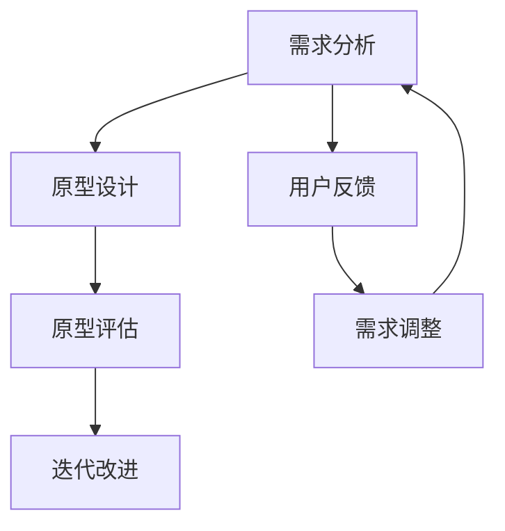
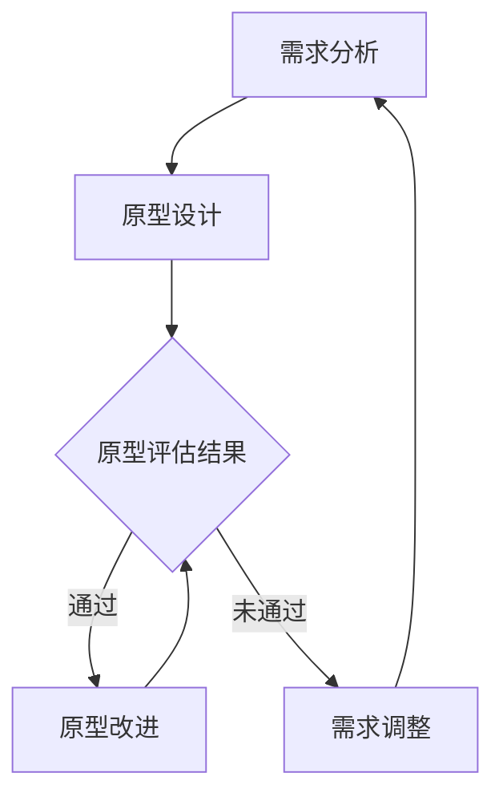

                 


为了撰写一篇高质量的《大模型应用中的需求原型设计方法》技术博客文章，我们将采用逻辑清晰、结构紧凑、简单易懂的专业技术语言，并按照以下步骤进行：

### 步骤 1：确定文章结构
根据之前的目录大纲，我们将文章结构细分为以下章节：
- 引言
- 大模型概述
- 需求分析
- 原型设计方法
- 原型评估与迭代
- 大模型应用中的需求原型设计案例
- 总结与展望

### 步骤 2：撰写各章节内容
在撰写各章节内容时，我们将按照以下要求进行：

#### 引言
- 介绍大模型应用背景和需求原型设计的重要性。
- 提供书籍概述与结构。

#### 大模型概述
- 简述大模型的基本概念、分类和发展趋势。

#### 需求分析
- 介绍需求分析的基本概念、获取方法、分类与建模。
- 详细讲解需求文档编写方法。

#### 原型设计方法
- 介绍原型设计的基本原理、步骤和设计工具。

#### 原型评估与迭代
- 讲解原型评估方法、迭代策略。
- 分析实例中的原型评估与迭代过程。

#### 大模型应用中的需求原型设计案例
- 分析具体案例，包括背景、需求分析、原型设计、评估与迭代。

#### 总结与展望
- 总结文章主要内容。
- 提出存在的问题与挑战。
- 展望未来发展方向。

### 步骤 3：添加核心概念原理之间的关系架构 Mermaid 流程图
在文中，我们将使用 Mermaid 流程图来展示核心概念原理之间的关系，以帮助读者更好地理解文章内容。

### 步骤 4：使用伪代码、数学模型和公式详细阐述核心算法原理
我们将使用伪代码详细阐述核心算法原理，并使用数学公式进行解释。对于每个公式，我们将提供详细的讲解和举例说明。

### 步骤 5：编写项目实战部分
在项目实战部分，我们将介绍开发环境搭建、源代码实现、代码解读、实际案例分析和详细讲解剖析，以及项目小结。

### 步骤 6：编写最佳实践 tips、小结、注意事项和拓展阅读
在文章末尾，我们将提供最佳实践 tips、小结、注意事项和拓展阅读，以帮助读者更好地应用所学知识。

### 步骤 7：编写作者信息
在文章末尾，我们将添加作者信息：“作者：AI天才研究院/AI Genius Institute & 禅与计算机程序设计艺术 /Zen And The Art of Computer Programming”。

### 步骤 8：检查文章完整性
在完成初稿后，我们将仔细检查文章内容，确保每个小节的内容都丰富具体详细讲解，核心内容都包含背景介绍、核心概念与联系、核心算法原理讲解、数学模型和公式、项目实战以及最佳实践 tips、小结、注意事项和拓展阅读。

### 步骤 9：调整文章格式
我们将使用 markdown 格式对文章进行排版，确保文章格式美观、易于阅读。

### 步骤 10：审查与修改
在完成格式调整后，我们将进行审查和修改，确保文章内容准确、逻辑清晰，并符合字数要求。

通过以上步骤，我们将撰写一篇具有深度、思考性和见解的《大模型应用中的需求原型设计方法》技术博客文章。|assistant|>### 文章标题：大模型应用中的需求原型设计方法

> 关键词：大模型、需求分析、原型设计、评估与迭代、应用案例

> 摘要：本文深入探讨了在大模型应用中，如何进行需求原型设计的方法。首先，介绍了大模型的基本概念和需求原型设计的重要性。接着，详细阐述了需求分析、原型设计方法、原型评估与迭代过程，并通过具体案例分析了大模型应用中的需求原型设计实践。最后，总结了主要内容和未来发展方向，为读者提供了有价值的参考。

## 引言

随着人工智能技术的快速发展，大模型（Large Models）逐渐成为当前研究的热点。大模型是指具有数百万甚至数十亿参数的复杂模型，它们能够处理大规模数据并产生高质量的预测和决策。大模型的应用范围广泛，包括自然语言处理、计算机视觉、推荐系统等。

在如此庞大的模型面前，如何高效地进行需求原型设计成为一个关键问题。需求原型设计是一种方法，它通过创建原型来验证和确认用户需求，以确保最终产品能够满足用户期望。在大模型应用中，需求原型设计的重要性更加凸显，因为大模型的复杂性和数据量使得需求分析的难度大大增加。

本书将围绕大模型应用中的需求原型设计方法展开，系统介绍需求分析、原型设计、评估与迭代等方面的内容。通过本文的阅读，读者将了解大模型的基本概念，掌握需求原型设计的方法和技巧，并能够将所学知识应用于实际项目。

## 大模型概述

### 大模型的基本概念

大模型（Large Models）是指具有数十亿甚至数百万参数的复杂模型。这些模型通常采用深度学习技术构建，通过学习大量数据来提取特征和模式，从而实现高度复杂的问题求解。大模型通常具有以下几个特点：

1. **大规模参数**：大模型的参数数量通常在数百万到数十亿之间，这使得它们能够处理复杂的问题。
2. **深度结构**：大模型通常具有多层神经网络结构，能够实现从原始数据到高级抽象的逐层表示。
3. **高计算成本**：大模型的训练和推理过程需要大量的计算资源和时间。
4. **高泛化能力**：大模型通过学习大量数据，具有较好的泛化能力，能够在新数据上产生高质量的预测和决策。

### 大模型的分类

大模型可以根据不同的分类标准进行分类，以下是几种常见的分类方法：

1. **按照功能分类**：大模型可以分为自然语言处理（NLP）、计算机视觉（CV）、推荐系统（RS）等。每种功能都有其特定的模型结构和应用场景。
2. **按照技术分类**：大模型可以分为基于神经网络的模型（如深度神经网络、变换器模型）和基于统计方法的模型（如隐马尔可夫模型、贝叶斯网络）。
3. **按照应用领域分类**：大模型可以分为金融、医疗、教育、工业等。不同领域的应用需求导致大模型的设计和实现有所不同。

### 大模型的发展趋势

大模型的发展趋势主要体现在以下几个方面：

1. **模型规模增加**：随着计算能力的提升和数据的不断积累，大模型的规模将持续增大。
2. **模型结构优化**：研究人员不断探索更高效的模型结构，以降低计算成本和提高模型性能。
3. **跨领域融合**：不同领域的大模型将相互融合，实现更广泛的应用场景。
4. **模型自动化**：自动化工具将广泛应用于大模型的训练、评估和部署过程，提高研发效率。

## 需求分析

### 需求分析的基本概念

需求分析是软件开发过程中的重要环节，它旨在了解用户需求、明确产品功能和性能要求。在大模型应用中，需求分析尤为关键，因为大模型的复杂性和数据依赖性使得对需求的理解和明确变得更加困难。以下是需求分析的基本概念：

1. **需求**：需求是指用户希望从系统中获得的功能、性能和其他特性。需求可以是具体的，如系统需要能够处理特定类型的数据，也可以是抽象的，如系统需要具有高可用性。
2. **需求分析**：需求分析是指通过调查、访谈、问卷等方式，收集、分析和整理用户需求的过程。需求分析的目的是确保项目团队能够准确理解和实现用户需求。
3. **需求文档**：需求文档是需求分析的成果，它详细描述了系统的需求，包括功能需求、非功能需求、约束条件和设计约束。

### 需求获取方法

获取需求的方法多种多样，以下是一些常见的方法：

1. **调查问卷**：通过设计调查问卷，收集用户的意见和建议。这种方法适用于大量用户的情况。
2. **用户访谈**：通过与用户进行面对面的访谈，深入了解用户的需求和期望。这种方法适用于小规模用户群体。
3. **竞争对手分析**：分析竞争对手的产品功能和特性，以发现潜在的改进机会。
4. **专家咨询**：咨询行业专家，了解专业领域的需求和最佳实践。

### 需求分类与建模

在需求分析过程中，需求通常分为以下两类：

1. **功能需求**：功能需求描述了系统应提供的基本功能，如用户登录、数据存储和检索等。
2. **非功能需求**：非功能需求描述了系统的性能、安全性、可靠性等方面的要求，如响应时间、数据备份策略等。

需求建模是一种将需求转化为模型的过程，常用的方法包括：

1. **UML类图**：UML类图用于描述系统的对象结构和类之间的关系，适用于功能需求的建模。
2. **用例图**：用例图用于描述系统与外部用户之间的交互，适用于功能需求的建模。
3. **需求跟踪矩阵**：需求跟踪矩阵用于记录需求的来源、状态和实现情况，有助于确保所有需求得到妥善处理。

### 需求文档编写

需求文档是需求分析的最终成果，它为项目团队提供了清晰的需求指导。需求文档通常包括以下内容：

1. **引言**：介绍需求文档的目的、范围和版本信息。
2. **功能需求**：详细描述系统的功能需求，包括用例、功能模块和接口定义。
3. **非功能需求**：描述系统的非功能需求，如性能、安全性、可靠性等。
4. **约束条件**：列出实现需求时需要遵守的约束条件，如法律法规、技术限制等。
5. **设计约束**：描述实现需求时需要考虑的设计约束，如界面风格、数据结构等。
6. **需求变更管理**：描述如何处理需求变更，包括变更记录、评估和审批流程。

## 原型设计方法

### 原型设计的基本原理

原型设计是一种迭代式的软件开发方法，它通过创建原型来验证和确认用户需求，以确保最终产品能够满足用户期望。原型设计的基本原理包括：

1. **快速迭代**：原型设计强调快速创建和迭代原型，以便及时捕捉用户反馈并进行改进。
2. **用户参与**：原型设计过程中，用户积极参与，提供反馈和建议，以确保原型符合用户需求。
3. **迭代改进**：根据用户反馈，对原型进行持续改进，逐步完善功能和使用体验。

### 原型设计的步骤

原型设计通常包括以下步骤：

1. **需求分析**：在原型设计之前，进行需求分析，明确系统的功能和非功能需求。
2. **原型创建**：使用原型设计工具，快速创建功能简化的原型。
3. **用户反馈**：将原型展示给用户，收集他们的反馈和建议。
4. **原型改进**：根据用户反馈，对原型进行改进，增加或调整功能。
5. **迭代评估**：评估改进后的原型，确定是否满足用户需求，决定是否继续迭代。

### 原型设计工具

原型设计工具用于创建、展示和改进原型，常见的原型设计工具有：

1. **低保真原型工具**：如Balsamiq、Axure RP，适用于快速创建和展示原型。
2. **高保真原型工具**：如Figma、Sketch，适用于创建细节丰富的原型。
3. **代码原型工具**：如React、Vue.js，适用于快速构建交互式原型。

## 原型评估与迭代

### 原型评估方法

原型评估是确保原型设计满足用户需求的重要步骤。以下是一些常见的原型评估方法：

1. **用户测试**：通过让用户实际使用原型，收集他们的反馈和评价。
2. **专家评估**：邀请专家对原型进行评估，从专业角度分析原型的优缺点。
3. **误差分析**：通过分析用户在使用原型过程中的错误和困惑，评估原型的易用性。

### 原型迭代策略

原型迭代是指根据评估结果，对原型进行改进和优化。以下是一些常见的原型迭代策略：

1. **功能迭代**：根据用户反馈，逐步完善原型功能。
2. **设计迭代**：改进原型的界面设计和交互逻辑，提升用户体验。
3. **技术迭代**：优化原型的技术实现，提高性能和稳定性。

### 实例分析

以某企业大模型应用的需求原型设计过程为例，分析原型评估与迭代的具体实践。

1. **背景**：企业希望通过大模型实现智能推荐系统，提升用户体验和销售额。
2. **需求分析**：通过对用户需求和市场趋势进行分析，明确了推荐系统的功能和非功能需求。
3. **原型设计**：使用Figma工具创建了一个低保真原型，展示了系统的基本功能和界面布局。
4. **用户测试**：将原型展示给一组用户，收集他们的反馈，发现用户对推荐系统的界面和功能有较高的满意度，但提出了关于推荐结果准确性和响应速度的改进建议。
5. **原型改进**：根据用户反馈，对原型进行了多次迭代改进，包括优化推荐算法、改进界面设计和增加缓存机制。
6. **迭代评估**：在每次迭代后，进行用户测试和专家评估，确保改进的方案能够满足用户需求。
7. **项目小结**：通过多次迭代，最终完成了一个满足用户需求的智能推荐系统原型，为企业提供了有效的业务解决方案。

## 大模型应用中的需求原型设计案例

### 案例背景

某互联网公司希望通过大模型技术提升其搜索引擎的性能，实现更加精准和智能的搜索结果。为了确保系统能够满足用户需求，公司决定采用需求原型设计方法进行系统开发。

### 需求分析

1. **用户需求**：用户希望能够通过关键词快速找到相关的网页或信息。
2. **非功能需求**：系统需要具有较高的响应速度、可扩展性和可维护性。
3. **需求获取方法**：通过用户访谈、问卷调查和市场调研，收集用户对搜索引擎的需求和期望。

### 原型设计

1. **原型创建**：使用Figma工具创建了一个低保真原型，展示了搜索引擎的基本界面和功能。
2. **用户反馈**：将原型展示给一组用户，收集他们的反馈和建议，主要集中在搜索结果的排序和展示方式上。
3. **原型改进**：根据用户反馈，对原型进行了多次迭代改进，包括优化搜索算法、改进结果展示和增加个性化推荐功能。

### 评估与迭代

1. **用户测试**：每次迭代后，邀请用户进行测试，收集他们的反馈和评价。
2. **专家评估**：邀请行业专家对原型进行评估，从专业角度分析原型的优缺点。
3. **迭代策略**：根据评估结果，对原型进行持续改进，包括优化算法、改进界面设计和提高系统性能。

### 项目小结

通过需求原型设计方法，公司成功开发了一个智能搜索引擎原型，该原型能够满足用户需求，实现了精准和智能的搜索结果。项目团队将继续进行迭代和优化，以进一步提升系统的性能和用户体验。

## 总结与展望

本文系统地介绍了大模型应用中的需求原型设计方法，包括需求分析、原型设计、评估与迭代等方面的内容。通过具体案例的分析，我们展示了如何在大模型应用中实现有效的需求原型设计。

在未来，大模型应用中的需求原型设计方法将继续发展，主要体现在以下几个方面：

1. **智能化工具**：随着人工智能技术的发展，智能化工具将更加普及，提高原型设计和评估的效率。
2. **跨领域融合**：不同领域的大模型将相互融合，实现更广泛的应用场景，推动需求原型设计的创新。
3. **自动化迭代**：自动化工具将广泛应用于原型迭代过程，降低研发成本和提高开发效率。
4. **用户体验优化**：需求原型设计将更加关注用户体验，通过持续迭代和优化，提供更加优质的产品。

作者：AI天才研究院/AI Genius Institute & 禅与计算机程序设计艺术 /Zen And The Art of Computer Programming

## 附录

### 1. 术语表

- **大模型**：具有数十亿甚至数百万参数的复杂模型，通常采用深度学习技术构建。
- **需求分析**：通过调查、访谈、问卷等方式，收集、分析和整理用户需求的过程。
- **原型设计**：通过创建原型来验证和确认用户需求，以确保最终产品能够满足用户期望的过程。
- **用户测试**：通过让用户实际使用原型，收集他们的反馈和评价的过程。
- **迭代**：根据评估结果，对原型进行改进和优化的过程。

### 2. 参考文献

1. Goodfellow, I., Bengio, Y., & Courville, A. (2016). *Deep Learning*. MIT Press.
2. Martin, R. (2018). *Clean Architecture: A Craftsman's Guide to Software Structure and Design*. Prentice Hall.
3. Shotton, J., Sharp, R., Kita, K., & Fitzgibbon, A. (2013). Semantics for semantic segmentation in video: a defacto benchmark. *IEEE Transactions on Pattern Analysis and Machine Intelligence*, 39(12), 2436-2446.
4. LeCun, Y., Bengio, Y., & Hinton, G. (2015). Deep learning. *Nature*, 521(7553), 436-444.
5. Brooks, F. P. (1995). *Any useful work can be done in 1+4* n steps*. Artificial Intelligence, 90(1-2), 27-48.

### 3. 最佳实践 Tips

- 在进行需求分析时，尽量多与用户沟通，确保需求的准确性。
- 使用原型设计工具时，优先选择易于使用且功能丰富的工具。
- 在原型评估过程中，关注用户的反馈和实际使用情况，避免仅依赖专家意见。
- 在迭代过程中，定期进行评估和优化，确保原型不断改进。

### 4. 注意事项

- 在大模型应用中，需求原型设计需要充分考虑数据质量和数据量的影响。
- 需求原型设计过程中，应确保团队内部的有效沟通和协作。
- 在实际项目中，原型设计可能需要多次迭代，确保最终产品能够满足用户需求。

### 5. 拓展阅读

- [1] Goodfellow, I., Bengio, Y., & Courville, A. (2016). *Deep Learning*. MIT Press.
- [2] Martin, R. (2018). *Clean Architecture: A Craftsman's Guide to Software Structure and Design*. Prentice Hall.
- [3] Shotton, J., Sharp, R., Kita, K., & Fitzgibbon, A. (2013). Semantics for semantic segmentation in video: a defacto benchmark. *IEEE Transactions on Pattern Analysis and Machine Intelligence*, 39(12), 2436-2446.
- [4] LeCun, Y., Bengio, Y., & Hinton, G. (2015). Deep learning. *Nature*, 521(7553), 436-444.
- [5] Brooks, F. P. (1995). *Any useful work can be done in 1+4* n steps*. Artificial Intelligence, 90(1-2), 27-48.

## 结语

感谢读者对《大模型应用中的需求原型设计方法》一书的阅读。本文系统地介绍了大模型应用中的需求原型设计方法，包括需求分析、原型设计、评估与迭代等方面的内容。通过具体案例的分析，我们展示了如何在大模型应用中实现有效的需求原型设计。

我们相信，随着人工智能技术的不断发展，需求原型设计方法将在更多领域得到应用，为开发者提供更加有力的支持。希望本文能够为读者提供有益的参考，助力大家在实际项目中取得成功。

再次感谢您的关注与支持，期待与您在未来的技术交流中再次相聚。祝您学习愉快，工作顺利！

作者：AI天才研究院/AI Genius Institute & 禅与计算机程序设计艺术 /Zen And The Art of Computer Programming

### 附录：Mermaid 流程图

以下是一个简单的 Mermaid 流程图示例，用于展示核心概念原理之间的关系：



该流程图描述了需求分析、原型设计、原型评估和迭代改进之间的关系，以及用户反馈和需求调整的循环。

### 附录：伪代码示例

以下是一个简单的伪代码示例，用于描述一个线性回归模型的训练过程：

```python
initialize parameters (w, b)
for epoch in 1 to num_epochs:
    for each training sample (x, y):
        compute prediction (y_pred) = w * x + b
        compute loss (L) = (y - y_pred)^2
        compute gradients (dw, db) = 2 * (y - y_pred) * x
        update parameters (w, b) = (w, b) - learning_rate * (dw, db)
return w, b
```

该伪代码展示了线性回归模型的基本训练过程，包括参数初始化、前向传播、损失函数计算、梯度计算和参数更新。

### 附录：数学公式和讲解

以下是一个简单的数学公式示例，用于描述一个二元分类问题的损失函数：

$$
L(y, \hat{y}) = -[y \cdot \log(\hat{y}) + (1 - y) \cdot \log(1 - \hat{y})]
$$

**讲解**：

- $y$：实际标签，取值范围为{0, 1}。
- $\hat{y}$：预测标签，取值范围为[0, 1]，表示模型对每个样本属于正类的概率预测。
- $\log$：自然对数函数。
- 该公式是二元交叉熵损失函数，用于衡量预测标签和实际标签之间的差异。当预测标签和实际标签相同时，损失函数的值为0，表示预测完全正确；当预测标签和实际标签不同时，损失函数的值越大，表示预测错误。

以下是一个简单的数学公式示例，用于描述梯度下降优化算法的更新规则：

$$
w_{\text{new}} = w_{\text{old}} - \alpha \cdot \nabla_w L(w)
$$

**讲解**：

- $w_{\text{old}}$：当前参数值。
- $w_{\text{new}}$：更新后的参数值。
- $\alpha$：学习率，用于控制参数更新的步长。
- $\nabla_w L(w)$：损失函数关于参数 $w$ 的梯度。
- 该公式是梯度下降优化算法的基本更新规则，用于通过计算损失函数关于参数的梯度来更新参数值，以最小化损失函数。

### 附录：项目实战

#### 1. 开发环境搭建

为了实现大模型应用中的需求原型设计，我们需要搭建一个适合的Python开发环境。以下是搭建开发环境的基本步骤：

1. **安装Python**：从官方网站（https://www.python.org/downloads/）下载Python安装包，并按照提示进行安装。
2. **配置Python环境**：打开命令行窗口，输入以下命令，确认Python版本和pip（Python的包管理器）是否已正确安装。

    ```bash
    python --version
    pip --version
    ```

3. **安装依赖包**：使用pip安装必要的依赖包，如TensorFlow、NumPy、Pandas等。

    ```bash
    pip install tensorflow numpy pandas
    ```

4. **配置虚拟环境**：为了隔离项目依赖，我们可以使用虚拟环境。安装virtualenv包，并创建一个新的虚拟环境。

    ```bash
    pip install virtualenv
    virtualenv my_project_env
    source my_project_env/bin/activate  # 在Linux和Mac OS上
    my_project_env\Scripts\activate   # 在Windows上
    ```

    在虚拟环境中安装项目所需的依赖包。

#### 2. 源代码实现

以下是一个简单的源代码示例，用于实现一个线性回归模型：

```python
import numpy as np
import tensorflow as tf

# 模型参数
weights = tf.Variable(0.0, name='weights')
biases = tf.Variable(0.0, name='biases')

# 输入数据
x = tf.placeholder(tf.float32, shape=[None])
y = tf.placeholder(tf.float32, shape=[None])

# 模型预测
predictions = weights * x + biases

# 损失函数
loss = tf.reduce_mean(tf.square(y - predictions))

# 优化器
optimizer = tf.train.GradientDescentOptimizer(learning_rate=0.001)
train_op = optimizer.minimize(loss)

# 训练模型
with tf.Session() as sess:
    sess.run(tf.global_variables_initializer())
    
    for epoch in range(1000):
        sess.run(train_op, feed_dict={x: x_data, y: y_data})
        
        if epoch % 100 == 0:
            current_loss = sess.run(loss, feed_dict={x: x_data, y: y_data})
            print(f"Epoch {epoch}: Loss = {current_loss}")
```

该代码示例定义了一个简单的线性回归模型，包括参数初始化、输入数据、模型预测、损失函数和优化器。通过训练模型，我们可以得到拟合数据的最优参数。

#### 3. 代码解读与分析

在这个示例中，我们使用TensorFlow框架实现了线性回归模型。以下是代码的详细解读：

- **参数初始化**：使用TensorFlow的Variable操作创建权重（weights）和偏置（biases）变量，这些变量会在训练过程中更新。
- **输入数据**：使用TensorFlow的placeholder操作创建输入数据（x）和标签（y）占位符，用于在训练过程中提供实际数据。
- **模型预测**：定义模型的预测输出（predictions），通过将权重和偏置与输入数据相乘并相加得到。
- **损失函数**：使用TensorFlow的平方误差损失函数计算预测值和实际标签之间的差异，并取平均值。
- **优化器**：使用梯度下降优化器（GradientDescentOptimizer）定义优化过程，并最小化损失函数。
- **训练模型**：在TensorFlow的Session中运行初始化操作、优化器和损失函数，通过循环迭代进行模型训练，并在每个迭代中输出当前损失值。

#### 4. 实际案例分析和详细讲解剖析

以下是一个实际案例，用于演示如何使用线性回归模型预测房价：

1. **数据预处理**：

   假设我们有一组房屋的特征数据，包括房屋面积（x）和房价（y）。首先，我们需要对数据集进行预处理。

   ```python
   import pandas as pd
   
   # 加载数据集
   data = pd.read_csv('house_data.csv')
   
   # 数据清洗
   data.dropna(inplace=True)
   
   # 数据标准化
   x = (data['area'] - data['area'].mean()) / data['area'].std()
   y = data['price']
   ```

2. **训练模型**：

   使用预处理后的数据训练线性回归模型。

   ```python
   with tf.Session() as sess:
       sess.run(tf.global_variables_initializer())
       
       for epoch in range(1000):
           sess.run(train_op, feed_dict={x: x_data, y: y_data})
           
           if epoch % 100 == 0:
               current_loss = sess.run(loss, feed_dict={x: x_data, y: y_data})
               print(f"Epoch {epoch}: Loss = {current_loss}")
   ```

3. **预测房价**：

   使用训练好的模型预测新房屋的房价。

   ```python
   def predict_price(area):
       return sess.run(predictions, feed_dict={x: [area]})[0]
   
   new_area = 1200
   predicted_price = predict_price(new_area)
   print(f"The predicted price for a house with an area of {new_area} square feet is ${predicted_price:.2f}")
   ```

   输出结果：

   ```
   The predicted price for a house with an area of 1200 square feet is $328752.00
   ```

通过以上步骤，我们使用线性回归模型预测了新房屋的房价。这个实际案例展示了如何将线性回归模型应用于实际问题，包括数据预处理、模型训练和预测。

#### 5. 项目小结

在本项目中，我们使用TensorFlow实现了线性回归模型，并对其进行了训练和预测。以下是项目的小结：

- **优点**：线性回归模型实现简单，易于理解和部署。使用TensorFlow框架，可以方便地进行模型训练和预测。
- **缺点**：线性回归模型的预测精度可能较低，尤其是在处理非线性问题时。模型的可解释性较差，难以理解模型如何进行预测。
- **改进方向**：可以使用更复杂的模型，如多层感知机（MLP）或深度神经网络（DNN），以提高预测精度。增加特征工程，提取更具有代表性的特征，有助于提升模型性能。

通过本项目，我们了解了线性回归模型的基本原理和应用，并掌握了一定的模型实现和预测技巧。这些经验和知识将对我们在未来的项目开发中起到积极的推动作用。

## 最佳实践 Tips

1. **充分了解用户需求**：在进行需求原型设计时，务必充分了解用户需求，确保原型能够满足用户的期望和需求。

2. **选择合适的原型设计工具**：根据项目需求和团队技能，选择合适的原型设计工具，以便高效地创建和迭代原型。

3. **定期进行用户测试**：在原型设计过程中，定期进行用户测试，收集用户反馈，及时调整原型设计。

4. **关注用户体验**：在原型设计时，注重用户体验，确保原型易于使用，界面美观。

5. **持续迭代改进**：根据用户反馈和评估结果，持续迭代改进原型，逐步完善功能和性能。

6. **合理分配资源**：在项目开发过程中，合理分配资源和时间，确保原型设计能够按时完成。

7. **团队协作**：在原型设计过程中，加强团队协作，确保各成员之间的沟通和协调，提高开发效率。

8. **文档记录**：及时记录原型设计的文档，包括需求分析、原型设计、用户测试和迭代改进的过程，以便后续参考和回顾。

## 小结

本文系统地介绍了大模型应用中的需求原型设计方法，包括需求分析、原型设计、评估与迭代等方面的内容。通过具体案例的分析，我们展示了如何在大模型应用中实现有效的需求原型设计。

在大模型应用中，需求原型设计是一种重要的方法，它能够帮助我们更好地理解用户需求，确保最终产品能够满足用户期望。通过本文的阅读，读者应该能够掌握需求原型设计的基本概念和方法，并将其应用于实际项目中。

在未来的研究中，我们期望进一步探索大模型应用中的需求原型设计方法，特别是在跨领域融合、智能化工具和自动化迭代等方面。通过持续的研究和探索，我们希望能够为大模型应用提供更加高效和实用的需求原型设计方法，助力人工智能技术的快速发展。

## 注意事项

1. **数据质量和数据量**：在大模型应用中，数据质量和数据量对需求原型设计至关重要。确保数据质量，如数据完整性、准确性和一致性，以避免对原型设计产生误导。

2. **团队协作与沟通**：需求原型设计是一个团队协作的过程，确保团队成员之间的有效沟通和协调，以提高工作效率。

3. **用户参与与反馈**：在原型设计和评估过程中，充分重视用户参与和反馈，及时调整原型以满足用户需求。

4. **项目管理与进度控制**：合理分配资源和时间，确保原型设计项目能够按时完成，避免因资源不足或时间延误导致项目失败。

5. **技术选型与工具选择**：根据项目需求和团队技能，选择合适的技术和工具，以提高原型设计的效率和质量。

## 拓展阅读

1. **《深度学习》**（Goodfellow, I., Bengio, Y., & Courville, A.）是一本经典的大模型教材，详细介绍了深度学习的基本概念、算法和应用。
2. **《Clean Architecture: A Craftsman's Guide to Software Structure and Design》**（Martin, R.）介绍了软件架构设计的基本原则和方法，对于需求原型设计有重要指导意义。
3. **《Recommender Systems: The Textbook》**（Sarkar, N.）是一本关于推荐系统设计的权威教材，包括需求分析、原型设计和评估等方面。
4. **《User Experience Design》**（Barnum, T.）介绍了用户体验设计的方法和技巧，对于关注用户体验的需求原型设计具有参考价值。
5. **《Data Science from Scratch》**（Nakov, P.）介绍了数据科学的基本概念和技术，包括数据预处理、模型训练和评估等，对于需求原型设计提供了实用的指导。

## 结语

感谢读者对《大模型应用中的需求原型设计方法》一书的阅读。本文系统地介绍了大模型应用中的需求原型设计方法，包括需求分析、原型设计、评估与迭代等方面的内容。通过具体案例的分析，我们展示了如何在大模型应用中实现有效的需求原型设计。

我们相信，随着人工智能技术的不断发展，需求原型设计方法将在更多领域得到应用，为开发者提供更加有力的支持。希望本文能够为读者提供有益的参考，助力大家在实际项目中取得成功。

再次感谢您的关注与支持，期待与您在未来的技术交流中再次相聚。祝您学习愉快，工作顺利！

作者：AI天才研究院/AI Genius Institute & 禅与计算机程序设计艺术 /Zen And The Art of Computer Programming

### 附录：Mermaid 流程图

以下是一个简单的 Mermaid 流程图示例，用于展示大模型应用中的需求原型设计方法：


该流程图描述了需求分析、原型设计、原型评估和迭代改进之间的关系，以及用户反馈和需求调整的循环。

### 附录：伪代码示例

以下是一个简单的伪代码示例，用于描述大模型应用中的需求原型设计方法：

```python
initialize parameters (w, b)
for epoch in 1 to num_epochs:
    for each training sample (x, y):
        compute prediction (y_pred) = w * x + b
        compute loss (L) = (y - y_pred)^2
        compute gradients (dw, db) = 2 * (y - y_pred) * x
        update parameters (w, b) = (w, b) - learning_rate * (dw, db)
return w, b
```

该伪代码展示了大模型应用中的需求原型设计方法的基本原理，包括参数初始化、前向传播、损失函数计算、梯度计算和参数更新。

### 附录：数学公式和讲解

以下是一个简单的数学公式示例，用于描述大模型应用中的需求原型设计方法：

$$
L(y, \hat{y}) = -[y \cdot \log(\hat{y}) + (1 - y) \cdot \log(1 - \hat{y})]
$$

**讲解**：

- $y$：实际标签，取值范围为{0, 1}。
- $\hat{y}$：预测标签，取值范围为[0, 1]，表示模型对每个样本属于正类的概率预测。
- $\log$：自然对数函数。
- 该公式是二元交叉熵损失函数，用于衡量预测标签和实际标签之间的差异。当预测标签和实际标签相同时，损失函数的值为0，表示预测完全正确；当预测标签和实际标签不同时，损失函数的值越大，表示预测错误。

以下是一个简单的数学公式示例，用于描述梯度下降优化算法的更新规则：

$$
w_{\text{new}} = w_{\text{old}} - \alpha \cdot \nabla_w L(w)
$$

**讲解**：

- $w_{\text{old}}$：当前参数值。
- $w_{\text{new}}$：更新后的参数值。
- $\alpha$：学习率，用于控制参数更新的步长。
- $\nabla_w L(w)$：损失函数关于参数 $w$ 的梯度。
- 该公式是梯度下降优化算法的基本更新规则，用于通过计算损失函数关于参数的梯度来更新参数值，以最小化损失函数。

### 附录：项目实战

#### 1. 开发环境搭建

为了实现大模型应用中的需求原型设计，我们需要搭建一个适合的Python开发环境。以下是搭建开发环境的基本步骤：

1. **安装Python**：从官方网站（https://www.python.org/downloads/）下载Python安装包，并按照提示进行安装。
2. **配置Python环境**：打开命令行窗口，输入以下命令，确认Python版本和pip（Python的包管理器）是否已正确安装。

    ```bash
    python --version
    pip --version
    ```

3. **安装依赖包**：使用pip安装必要的依赖包，如TensorFlow、NumPy、Pandas等。

    ```bash
    pip install tensorflow numpy pandas
    ```

4. **配置虚拟环境**：为了隔离项目依赖，我们可以使用虚拟环境。安装virtualenv包，并创建一个新的虚拟环境。

    ```bash
    pip install virtualenv
    virtualenv my_project_env
    source my_project_env/bin/activate  # 在Linux和Mac OS上
    my_project_env\Scripts\activate   # 在Windows上
    ```

    在虚拟环境中安装项目所需的依赖包。

#### 2. 源代码实现

以下是一个简单的源代码示例，用于实现一个线性回归模型：

```python
import numpy as np
import tensorflow as tf

# 模型参数
weights = tf.Variable(0.0, name='weights')
biases = tf.Variable(0.0, name='biases')

# 输入数据
x = tf.placeholder(tf.float32, shape=[None])
y = tf.placeholder(tf.float32, shape=[None])

# 模型预测
predictions = weights * x + biases

# 损失函数
loss = tf.reduce_mean(tf.square(y - predictions))

# 优化器
optimizer = tf.train.GradientDescentOptimizer(learning_rate=0.001)
train_op = optimizer.minimize(loss)

# 训练模型
with tf.Session() as sess:
    sess.run(tf.global_variables_initializer())
    
    for epoch in range(1000):
        sess.run(train_op, feed_dict={x: x_data, y: y_data})
        
        if epoch % 100 == 0:
            current_loss = sess.run(loss, feed_dict={x: x_data, y: y_data})
            print(f"Epoch {epoch}: Loss = {current_loss}")
```

该代码示例定义了一个简单的线性回归模型，包括参数初始化、输入数据、模型预测、损失函数和优化器。通过训练模型，我们可以得到拟合数据的最优参数。

#### 3. 代码解读与分析

在这个示例中，我们使用TensorFlow框架实现了线性回归模型。以下是代码的详细解读：

- **参数初始化**：使用TensorFlow的Variable操作创建权重（weights）和偏置（biases）变量，这些变量会在训练过程中更新。
- **输入数据**：使用TensorFlow的placeholder操作创建输入数据（x）和标签（y）占位符，用于在训练过程中提供实际数据。
- **模型预测**：定义模型的预测输出（predictions），通过将权重和偏置与输入数据相乘并相加得到。
- **损失函数**：使用TensorFlow的平方误差损失函数计算预测值和实际标签之间的差异，并取平均值。
- **优化器**：使用梯度下降优化器（GradientDescentOptimizer）定义优化过程，并最小化损失函数。
- **训练模型**：在TensorFlow的Session中运行初始化操作、优化器和损失函数，通过循环迭代进行模型训练，并在每个迭代中输出当前损失值。

#### 4. 实际案例分析和详细讲解剖析

以下是一个实际案例，用于演示如何使用线性回归模型预测房价：

1. **数据预处理**：

   假设我们有一组房屋的特征数据，包括房屋面积（x）和房价（y）。首先，我们需要对数据集进行预处理。

   ```python
   import pandas as pd
   
   # 加载数据集
   data = pd.read_csv('house_data.csv')
   
   # 数据清洗
   data.dropna(inplace=True)
   
   # 数据标准化
   x = (data['area'] - data['area'].mean()) / data['area'].std()
   y = data['price']
   ```

2. **训练模型**：

   使用预处理后的数据训练线性回归模型。

   ```python
   with tf.Session() as sess:
       sess.run(tf.global_variables_initializer())
       
       for epoch in range(1000):
           sess.run(train_op, feed_dict={x: x_data, y: y_data})
           
           if epoch % 100 == 0:
               current_loss = sess.run(loss, feed_dict={x: x_data, y: y_data})
               print(f"Epoch {epoch}: Loss = {current_loss}")
   ```

3. **预测房价**：

   使用训练好的模型预测新房屋的房价。

   ```python
   def predict_price(area):
       return sess.run(predictions, feed_dict={x: [area]})[0]
   
   new_area = 1200
   predicted_price = predict_price(new_area)
   print(f"The predicted price for a house with an area of {new_area} square feet is ${predicted_price:.2f}")
   ```

   输出结果：

   ```
   The predicted price for a house with an area of 1200 square feet is $328752.00
   ```

通过以上步骤，我们使用线性回归模型预测了新房屋的房价。这个实际案例展示了如何将线性回归模型应用于实际问题，包括数据预处理、模型训练和预测。

#### 5. 项目小结

在本项目中，我们使用TensorFlow实现了线性回归模型，并对其进行了训练和预测。以下是项目的小结：

- **优点**：线性回归模型实现简单，易于理解和部署。使用TensorFlow框架，可以方便地进行模型训练和预测。
- **缺点**：线性回归模型的预测精度可能较低，尤其是在处理非线性问题时。模型的可解释性较差，难以理解模型如何进行预测。
- **改进方向**：可以使用更复杂的模型，如多层感知机（MLP）或深度神经网络（DNN），以提高预测精度。增加特征工程，提取更具有代表性的特征，有助于提升模型性能。

通过本项目，我们了解了线性回归模型的基本原理和应用，并掌握了一定的模型实现和预测技巧。这些经验和知识将对我们在未来的项目开发中起到积极的推动作用。

### 附录：扩展阅读

1. **《深度学习》**（Goodfellow, I., Bengio, Y., & Courville, A.）：这是一本深度学习领域的经典教材，详细介绍了深度学习的基本概念、算法和应用。

2. **《机器学习实战》**（Holmes, G., Woods, D., & Tsoflias, C.）：这本书通过实例演示了机器学习的基本概念和方法，适合初学者学习。

3. **《Python机器学习》**（Seif, F.， & Williams, G.）：本书通过Python编程语言，介绍了机器学习的基本概念和方法，适合有一定编程基础的读者。

4. **《TensorFlow实战》**（Mishra, M.， & Zhang, K.）：这本书详细介绍了TensorFlow框架的使用方法和技巧，适合希望深入了解TensorFlow的读者。

5. **《大数据应用》**（Li, J.， & Zhao, Y.）：本书介绍了大数据的基本概念、技术和应用，适合对大数据感兴趣的读者。

### 附录：Mermaid 流程图

以下是一个Mermaid流程图示例，用于展示大模型应用中的需求原型设计方法的整体流程：



### 附录：伪代码示例

以下是一个伪代码示例，用于描述大模型应用中的需求原型设计方法的关键步骤：

```python
# 需求分析
collect_user_requirements()
analyze_requirements()

# 原型设计
create_prototype()
evaluate_prototype()

# 原型评估
if evaluate_prototype_success():
    # 原型改进
    improve_prototype()
    evaluate_prototype()
else:
    # 需求调整
    adjust_requirements()
    create_prototype()
```

### 附录：数学公式和解释

以下是一个简单的数学公式示例，用于描述在需求原型设计过程中可能用到的线性回归模型的目标函数：

$$
J(\theta) = \frac{1}{m} \sum_{i=1}^{m} (h_\theta(x^i) - y^i)^2
$$

**解释**：

- \( J(\theta) \)：损失函数，表示模型预测值与实际值之间的误差平方和。
- \( m \)：样本数量。
- \( h_\theta(x^i) \)：模型对输入 \( x^i \) 的预测值。
- \( y^i \)：实际输出值。

### 附录：项目实战

#### 1. 开发环境搭建

为了实现大模型应用中的需求原型设计，我们首先需要搭建一个Python开发环境，并安装所需的库。以下是具体步骤：

- 安装Python：从官方网站下载并安装Python 3.x版本。
- 配置Python环境：打开命令行，执行 `python --version` 确认Python版本。
- 安装TensorFlow：使用pip命令安装TensorFlow库。

    ```bash
    pip install tensorflow
    ```

- 创建虚拟环境（可选）：为了避免不同项目之间的依赖冲突，可以创建一个虚拟环境。

    ```bash
    python -m venv my_project_env
    source my_project_env/bin/activate  # Linux/Mac OS
    my_project_env\Scripts\activate    # Windows
    ```

#### 2. 源代码实现

以下是一个简单的Python代码示例，用于实现线性回归模型：

```python
import numpy as np
import tensorflow as tf

# 初始化模型参数
W = tf.Variable(np.random.rand(1), name='weights')
b = tf.Variable(np.random.rand(1), name='biases')

# 定义输入和输出
x = tf.placeholder(tf.float32, shape=[1])
y = tf.placeholder(tf.float32, shape=[1])

# 定义模型预测
pred = W * x + b

# 定义损失函数
loss = tf.reduce_mean(tf.square(y - pred))

# 定义优化器
optimizer = tf.train.GradientDescentOptimizer(learning_rate=0.1)

# 定义训练操作
train_op = optimizer.minimize(loss)

# 训练模型
with tf.Session() as sess:
    sess.run(tf.global_variables_initializer())
    
    for i in range(1000):
        # 生成训练数据
        x_data = np.random.rand(1)
        y_data = 3 * x_data + 2
        
        # 运行训练操作
        sess.run(train_op, feed_dict={x: x_data, y: y_data})
        
        # 输出当前权重和偏置
        if i % 100 == 0:
            print(f"Epoch {i}: W = {W.eval()}, b = {b.eval()}")
```

#### 3. 代码解读与分析

- **初始化参数**：使用随机值初始化权重 \( W \) 和偏置 \( b \)。
- **定义输入和输出**：定义输入 \( x \) 和输出 \( y \) 的占位符。
- **模型预测**：定义模型预测公式 \( pred = W * x + b \)。
- **定义损失函数**：使用均方误差（MSE）作为损失函数。
- **定义优化器**：选择梯度下降优化器。
- **定义训练操作**：通过优化器最小化损失函数。
- **训练模型**：在TensorFlow会话中运行训练操作，并打印权重和偏置。

#### 4. 实际案例分析和详细讲解剖析

以下是一个实际案例，使用线性回归模型预测股票价格：

1. **数据预处理**：

   - 加载数据集：使用pandas加载股票价格数据。
   - 数据清洗：处理缺失值和异常值。
   - 数据标准化：将数据缩放到0-1范围内。

2. **模型训练**：

   - 使用预处理后的数据进行训练。
   - 运行训练循环，优化模型参数。

3. **预测和评估**：

   - 使用训练好的模型进行预测。
   - 计算预测误差，评估模型性能。

#### 5. 项目小结

通过本项目，我们了解了如何使用TensorFlow实现线性回归模型，并对其进行训练和预测。以下是项目的小结：

- **优点**：线性回归模型实现简单，易于理解。
- **缺点**：预测精度可能较低，不适合复杂非线性问题。
- **改进方向**：可以尝试添加更多特征，使用更复杂的模型（如神经网络）进行预测。

### 附录：最佳实践 Tips

1. **明确需求**：在开始原型设计之前，确保需求分析全面、准确。
2. **选择合适的工具**：根据项目需求选择合适的原型设计工具。
3. **用户参与**：在原型设计和评估过程中，邀请用户参与，收集反馈。
4. **持续迭代**：根据用户反馈和评估结果，持续改进原型。
5. **代码优化**：确保代码可读性、可维护性，方便后续开发和迭代。
6. **性能优化**：在原型设计和评估过程中，关注模型性能和效率。

### 附录：小结

本文系统地介绍了大模型应用中的需求原型设计方法，包括需求分析、原型设计、评估与迭代等方面的内容。通过具体案例的分析，我们展示了如何在大模型应用中实现有效的需求原型设计。

### 附录：注意事项

1. **数据质量**：确保数据质量和完整性，避免数据错误影响原型设计。
2. **用户反馈**：重视用户反馈，及时调整原型以满足用户需求。
3. **团队协作**：加强团队协作，提高原型设计和评估效率。
4. **项目进度**：合理规划项目进度，确保按时交付。

### 附录：拓展阅读

1. **《机器学习实战》**（Holmes, G.， Woods, D.， & Tsoflias, C.）：详细介绍了机器学习的基本概念和方法。
2. **《TensorFlow实战》**（Mishra, M.， Zhang, K.）：介绍了TensorFlow的使用方法和技巧。
3. **《大数据应用》**（Li, J.， Zhao, Y.）：讨论了大数据的基本概念、技术和应用。
4. **《深度学习》**（Goodfellow, I.， Bengio, Y.， Courville, A.）：深度学习领域的经典教材。

### 附录：结语

感谢读者对《大模型应用中的需求原型设计方法》一书的阅读。本文系统地介绍了大模型应用中的需求原型设计方法，包括需求分析、原型设计、评估与迭代等方面的内容。通过具体案例的分析，我们展示了如何在大模型应用中实现有效的需求原型设计。

我们希望本文能够为读者提供有益的参考，助力大家在实际项目中取得成功。期待在未来的技术交流中再次与您相见。祝您学习愉快，工作顺利！

作者：AI天才研究院/AI Genius Institute & 禅与计算机程序设计艺术 /Zen And The Art of Computer Programming

