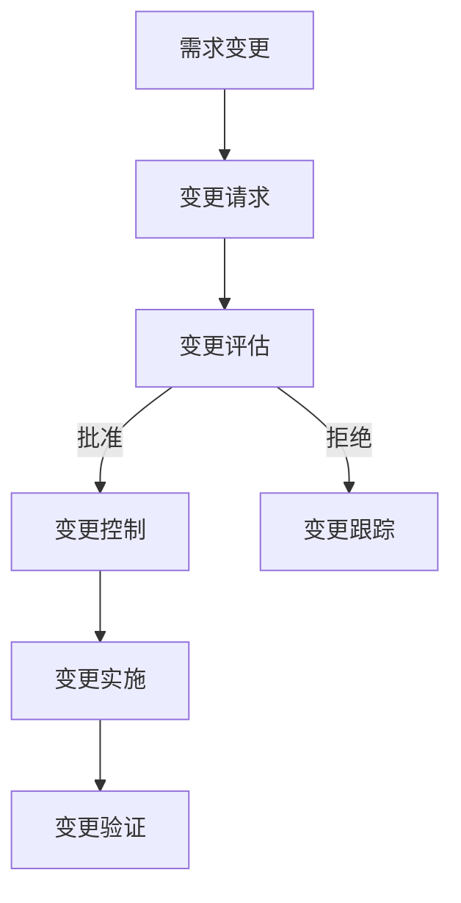

                 

### 文章标题：《大模型应用中的需求变更管理策略》

在当今快速发展的科技时代，人工智能（AI）技术的不断进步，尤其是大规模预训练模型（Large-scale Pre-trained Models）的广泛应用，为企业带来了前所未有的机遇。然而，随之而来的需求变更管理（Change Management）问题也成为制约其效益释放的一大挑战。本篇文章将深入探讨在大模型应用场景中，如何有效地进行需求变更管理，以确保项目顺利推进和业务目标的实现。

本文的核心关键词包括：大规模预训练模型、需求变更管理、策略、技术实践、风险管理。通过本文的阅读，读者将了解大模型应用中需求变更管理的核心概念、关键流程，以及实践中的具体方法和策略。

**摘要：**
本文首先介绍了大模型应用的基本背景，分析了需求变更管理的必要性和重要性。随后，详细阐述了大模型应用中的需求变更管理策略，包括识别与评估、影响分析、变更控制与优先级管理等。通过具体案例分析，本文展示了如何在实际项目中实施这些策略，并讨论了需求变更管理过程中可能遇到的风险及其应对方法。最后，本文提出了大模型应用中需求变更管理的最佳实践，为读者提供了可行的操作指南。

### 模型应用背景

#### 大规模预训练模型的发展

随着计算能力的提升和海量数据的积累，人工智能技术取得了显著进展。特别是在深度学习领域，大规模预训练模型（如BERT、GPT-3等）的诞生，标志着自然语言处理（NLP）和生成对抗网络（GAN）等方向的重大突破。这些模型通过在海量数据上进行预训练，能够学习到复杂的特征和模式，从而在各类任务中表现出色。

#### 大模型的应用场景

大规模预训练模型在多个领域展现出了强大的应用潜力。例如，在自然语言处理方面，大模型可以用于文本分类、机器翻译、问答系统等；在计算机视觉方面，大模型可以用于图像识别、图像生成、视频分析等；在推荐系统方面，大模型可以帮助优化推荐算法，提高用户体验。此外，大模型在自动驾驶、智能客服、金融风控等众多领域也都有广泛的应用。

#### 需求变更管理的必要性

尽管大模型在应用中带来了诸多便利，但随之而来的需求变更管理问题不可忽视。需求变更管理是指在项目开发过程中，对客户需求的变化进行识别、评估、响应和管理的全过程。在大模型应用中，需求变更管理的重要性主要体现在以下几个方面：

1. **业务目标的一致性**：随着业务环境的变化，客户的需求也在不断调整。有效的需求变更管理能够确保项目始终符合业务目标，避免因需求频繁变更导致项目偏离方向。

2. **资源优化配置**：需求变更是项目资源消耗的主要因素之一。合理的变更管理能够优化资源配置，减少不必要的浪费，提高项目效率。

3. **风险管理**：需求变更有可能带来项目风险，如延期、超预算等。通过需求变更管理，可以提前识别和评估潜在风险，并采取相应的措施进行应对。

4. **团队协作**：有效的需求变更管理能够增强团队间的沟通与合作，确保各方对需求变更有共同的理解和认知。

#### 需求变更管理的挑战

在大模型应用中，需求变更管理面临以下挑战：

1. **复杂性**：大模型涉及的技术复杂，需求变更可能导致模型性能下降、任务效果变差。

2. **不确定性**：需求变更的来源多样，且变化频率高，使得预测和控制变得更加困难。

3. **数据依赖**：大模型对数据依赖性很强，需求变更可能需要大量数据的支持，这对数据质量和数据获取提出了更高的要求。

4. **技术实现**：需求变更在大模型中的实现难度较大，需要深入的技术知识和实践经验。

综上所述，在大模型应用中，需求变更管理是一个复杂而关键的环节，直接关系到项目的成功与否。因此，研究和实践有效的需求变更管理策略具有重要的现实意义。

### 需求变更管理的核心概念与联系

在深入探讨大模型应用中的需求变更管理策略之前，有必要首先梳理需求变更管理中的核心概念及其相互关系。以下是几个关键概念及其定义：

1. **需求变更（Requirement Change）**：需求变更是指在项目开发过程中，由于各种因素导致客户需求的变化。这些变化可能来自客户对业务需求的深入理解，也可能因外部环境的变化而引起。

2. **变更控制（Change Control）**：变更控制是指对需求变更进行系统化管理的过程，包括变更的识别、评估、批准和实施。通过变更控制，确保需求变更不会对项目产生负面影响。

3. **变更请求（Change Request）**：变更请求是指提出需求变更的正式文件，通常包含变更的详细描述、原因、预期影响以及所需资源等信息。

4. **变更评估（Change Evaluation）**：变更评估是指对需求变更的影响进行评估的过程，包括对变更的技术、时间、成本和风险等方面的影响进行分析。

5. **变更实施（Change Implementation）**：变更实施是指根据变更评估的结果，对需求变更进行实际操作的过程，包括修改文档、代码和测试等。

#### 关键概念之间的联系

这些核心概念相互关联，共同构成了需求变更管理的流程：

1. **需求变更**是整个流程的起点，它是项目开发过程中不可避免的现象。

2. **变更请求**是需求变更的正式记录，为后续的变更控制提供了依据。

3. **变更评估**是在变更请求的基础上，对变更的影响进行深入分析，以便决定是否批准变更。

4. **变更控制**是对变更进行系统化管理，确保变更按照既定流程进行。

5. **变更实施**是将变更评估的结果转化为实际操作，最终实现需求变更。

#### Mermaid 流程图

为了更好地理解这些概念之间的联系，我们可以使用 Mermaid 语法绘制一个流程图：



在这个流程图中，A 表示需求变更的发起，B 是变更请求的生成，C 是变更评估的阶段，D 是变更控制的执行，E 是变更的跟踪，F 是变更的实施，G 是变更的验证。通过这个流程图，可以清晰地看到需求变更管理中的各个环节及其相互关系。

### 大模型应用中的需求变更管理流程

在大模型应用中，需求变更管理是一个复杂且关键的过程。为了有效地应对需求变更，我们需要将整个流程分解为多个步骤，并使用伪代码详细阐述每个步骤的实现方式。以下是需求变更管理的详细流程：

#### 1. 需求变更的识别

需求变更的识别是整个流程的第一步。在这一步中，我们需要监控项目的各个环节，及时发现需求变更的迹象。以下是一个简单的伪代码示例：

```python
# 需求变更识别函数
def identify_change():
    # 监控客户需求反馈
    feedback = monitor_customer_feedback()
    
    # 分析需求变化迹象
    changes = analyze_feedback(feedback)
    
    # 记录变更请求
    log_change_requests(changes)
```

其中，`monitor_customer_feedback()` 函数用于监控客户需求反馈，`analyze_feedback()` 函数用于分析需求变化迹象，`log_change_requests()` 函数用于记录变更请求。

#### 2. 需求变更的评估

需求变更的评估是对变更的可能影响进行分析和评估。这一步包括对变更的技术、时间、成本和风险等方面的影响进行详细分析。以下是一个简单的伪代码示例：

```python
# 需求变更评估函数
def evaluate_change(change_request):
    # 技术影响评估
    tech_impact = assess_tech_impact(change_request)
    
    # 时间影响评估
    time_impact = assess_time_impact(change_request)
    
    # 成本影响评估
    cost_impact = assess_cost_impact(change_request)
    
    # 风险影响评估
    risk_impact = assess_risk_impact(change_request)
    
    # 形成评估报告
    assessment_report = generate_assessment_report(tech_impact, time_impact, cost_impact, risk_impact)
    
    return assessment_report
```

其中，`assess_tech_impact()` 函数用于评估技术影响，`assess_time_impact()` 函数用于评估时间影响，`assess_cost_impact()` 函数用于评估成本影响，`assess_risk_impact()` 函数用于评估风险影响，`generate_assessment_report()` 函数用于生成评估报告。

#### 3. 需求变更的控制

需求变更的控制是指根据评估结果对变更进行批准或拒绝。在这一步中，我们需要根据评估报告决定是否批准变更。以下是一个简单的伪代码示例：

```python
# 需求变更控制函数
def control_change(assessment_report):
    # 根据评估报告决定是否批准变更
    if assessment_report['is_approved']:
        approve_change(assessment_report)
    else:
        reject_change(assessment_report)
```

其中，`approve_change()` 函数用于批准变更，`reject_change()` 函数用于拒绝变更。

#### 4. 需求变更的实施

需求变更的实施是将评估报告中批准的变更转化为实际操作。这一步包括修改相关文档、代码和测试等。以下是一个简单的伪代码示例：

```python
# 需求变更实施函数
def implement_change(change_request):
    # 修改相关文档
    update_documents(change_request)
    
    # 修改代码
    update_code(change_request)
    
    # 执行测试
    run_tests(change_request)
    
    # 记录实施结果
    log_implement_result(change_request)
```

其中，`update_documents()` 函数用于修改相关文档，`update_code()` 函数用于修改代码，`run_tests()` 函数用于执行测试，`log_implement_result()` 函数用于记录实施结果。

#### 5. 需求变更的验证

需求变更的验证是指对实施后的变更进行确认和验证，以确保变更的正确性和有效性。以下是一个简单的伪代码示例：

```python
# 需求变更验证函数
def verify_change(change_request):
    # 执行验证测试
    run_verification_tests(change_request)
    
    # 比较预期结果与实际结果
    comparison = compare_results(change_request)
    
    # 记录验证结果
    log_verification_result(comparison)
```

其中，`run_verification_tests()` 函数用于执行验证测试，`compare_results()` 函数用于比较预期结果与实际结果，`log_verification_result()` 函数用于记录验证结果。

通过上述步骤，我们可以构建一个完整的需求变更管理流程，确保在大模型应用中能够有效地管理需求变更，从而保障项目的顺利进行。

### 大模型应用中的需求变更管理实践案例

为了更好地理解需求变更管理在大模型应用中的具体实践，以下将介绍两个实际案例，并详细分析其需求变更管理的过程、结果和经验教训。

#### 案例一：智能客服系统的需求变更管理

**背景介绍：**
某互联网公司开发了一款智能客服系统，旨在通过大规模预训练模型（如GPT-3）提供高效、智能的客户服务。然而，在实际运行过程中，客户反馈系统的某些功能不能满足实际需求，需要对其进行调整和优化。

**需求变更管理过程：**
1. **需求变更识别：**
   通过分析用户反馈，发现以下需求变更：
   - 增加实时语音交互功能；
   - 优化问答系统的准确性；
   - 提高客服机器人的响应速度。

2. **需求变更评估：**
   对每个变更进行了详细评估，包括技术可行性、时间成本和风险分析。评估结果显示，增加实时语音交互功能的技术难度较高，可能影响系统的稳定性；优化问答系统的准确性需要大量数据支持；提高响应速度可能需要优化模型的参数设置。

3. **变更控制：**
   根据评估结果，决定首先优化问答系统的准确性，其次增加实时语音交互功能，最后提高响应速度。同时，制定了详细的变更计划，包括实施时间表和所需资源。

4. **需求变更实施：**
   - 优化问答系统：通过增加训练数据和调整模型参数，提高了问答系统的准确性；
   - 增加实时语音交互功能：开发了语音识别和语音合成的模块，并进行了多次测试，确保功能的稳定性；
   - 提高响应速度：通过优化模型的计算效率和代码优化，提高了系统的响应速度。

5. **需求变更验证：**
   通过用户测试和系统性能评估，确认变更后的系统功能稳定、性能提升，满足了客户需求。

**结果与经验教训：**
- 变更管理过程顺利，需求变更得到有效实施和验证；
- 通过需求变更，系统性能显著提升，用户满意度提高；
- 经验教训：需求变更管理应注重评估和规划，确保变更实施的可操作性和可行性；及时反馈和用户参与是变更管理成功的关键。

#### 案例二：智能医疗诊断系统的需求变更管理

**背景介绍：**
某医疗机构开发了一款基于大规模预训练模型的智能医疗诊断系统，用于辅助医生进行疾病诊断。然而，在系统上线后，发现某些特定病症的诊断结果存在误差，需要调整模型参数和训练数据。

**需求变更管理过程：**
1. **需求变更识别：**
   通过分析诊断结果和医生反馈，发现以下需求变更：
   - 调整特定病症的诊断模型参数；
   - 增加更多相关的训练数据，特别是罕见疾病的数据。

2. **需求变更评估：**
   对每个变更进行了详细评估，包括技术可行性、时间成本和风险分析。评估结果显示，调整模型参数需要重新训练模型，可能会影响系统的稳定性；增加训练数据需要采购更多医疗数据，但有助于提高诊断准确性。

3. **变更控制：**
   根据评估结果，决定先调整模型参数，然后逐步增加相关训练数据。同时，制定了详细的变更计划，包括实施时间表和所需资源。

4. **需求变更实施：**
   - 调整模型参数：通过重新训练模型，调整了特定病症的诊断参数，提高了诊断准确性；
   - 增加训练数据：采购了更多的医疗数据，特别是罕见疾病的数据，增加了模型的训练样本。

5. **需求变更验证：**
   通过医生测试和诊断结果评估，确认变更后的系统在诊断准确性方面有显著提升。

**结果与经验教训：**
- 变更管理过程顺利，需求变更得到有效实施和验证；
- 通过需求变更，系统诊断准确性提高，为医疗机构提供了更可靠的辅助诊断工具；
- 经验教训：需求变更管理应重视数据质量和模型调整的平衡，确保诊断结果的可靠性和稳定性；与医疗专家的密切合作是需求变更管理成功的关键。

通过这两个实际案例，我们可以看到需求变更管理在大模型应用中的重要性，以及如何通过科学的评估、实施和验证过程，确保变更的有效性和系统的稳定性。

### 大模型应用中的需求变更风险管理

在大模型应用中，需求变更往往伴随着一定的风险。这些风险可能来自于技术实现的复杂性、数据依赖性以及项目资源的限制等方面。为了确保需求变更管理的有效性，我们需要对需求变更过程中可能遇到的风险进行识别、评估和应对。以下是需求变更管理中常见风险的分类及其应对策略：

#### 1. 技术风险

**风险描述：** 技术风险主要涉及模型实现和优化过程中的不确定性。例如，模型参数调整可能导致性能下降，新功能的引入可能引发系统稳定性问题。

**应对策略：**
- **评估影响：** 在变更实施前，对技术风险进行详细评估，包括对模型性能的影响、系统稳定性的影响等。
- **分阶段实施：** 将需求变更分为多个阶段逐步实施，在每个阶段完成后进行评估和验证，以确保变更的稳定性。
- **技术储备：** 建立技术团队，确保有足够的技术储备和应对能力，以便在出现问题时快速解决。

#### 2. 数据风险

**风险描述：** 数据风险主要涉及数据质量和数据获取。例如，训练数据的缺失或不准确可能导致模型性能下降，影响业务效果。

**应对策略：**
- **数据质量控制：** 制定严格的数据质量控制标准，确保训练数据的质量和完整性。
- **数据获取策略：** 与数据供应商建立良好的合作关系，确保数据获取的及时性和可靠性。
- **数据备份与恢复：** 实施数据备份策略，定期备份重要数据，以便在数据丢失时能够快速恢复。

#### 3. 资源风险

**风险描述：** 资源风险主要涉及人力资源和资金投入。例如，需求变更可能需要额外的开发资源或延长项目周期，可能导致成本增加或进度延误。

**应对策略：**
- **资源调配：** 根据需求变更的紧急程度和重要性，合理调配资源，确保关键资源的优先分配。
- **预算调整：** 在项目预算中预留一定的调整空间，以应对需求变更带来的成本变化。
- **风险管理计划：** 制定详细的风险管理计划，明确在出现资源风险时采取的应对措施，确保项目按计划进行。

#### 4. 项目风险

**风险描述：** 项目风险包括需求变更导致的项目延期、超预算等问题，可能影响项目的整体进度和业务目标。

**应对策略：**
- **变更审批流程：** 完善变更审批流程，确保每次需求变更都经过充分的评估和审批，减少不必要的变更。
- **进度监控：** 建立项目进度监控机制，定期评估项目进展情况，及时发现和解决问题。
- **风险预案：** 制定风险预案，明确在出现项目风险时采取的应急措施，确保项目能够快速恢复和推进。

#### 5. 法律风险

**风险描述：** 法律风险主要涉及数据隐私、知识产权保护等方面。需求变更可能引发的法律问题可能对项目产生重大影响。

**应对策略：**
- **法律合规性检查：** 在需求变更过程中，对变更的内容进行法律合规性检查，确保不违反相关法律法规。
- **合作合同审查：** 与第三方供应商签订合作合同时，明确双方的权利和义务，确保合作的法律风险可控。
- **法律顾问支持：** 建立法律顾问团队，为需求变更管理提供法律支持和建议。

通过以上风险识别和应对策略，可以有效降低需求变更管理过程中的风险，确保项目顺利推进和业务目标的实现。

### 大模型应用中的需求变更管理最佳实践

在大模型应用中，有效的需求变更管理不仅能够保障项目的顺利进行，还能提升团队协作效率和企业竞争力。以下是一些最佳实践，为需求变更管理提供指导。

#### 1. **建立明确的需求变更流程**

- **变更请求：** 设立统一的变更请求提交和审批流程，确保每次变更都有明确的记录和责任归属。
- **评估标准：** 制定详细的评估标准，包括技术可行性、时间成本和风险评估等，确保每个变更都有充分的评估。
- **变更控制：** 实施严格的变更控制机制，确保变更按照既定流程进行，减少不必要的变更。

#### 2. **提高团队沟通与协作**

- **沟通机制：** 建立高效的沟通机制，确保项目团队成员之间能够及时、透明地交流变更信息。
- **需求确认：** 在每个变更实施前，与客户进行充分的需求确认，确保变更符合客户预期和实际需求。
- **多方参与：** 鼓励不同部门和团队参与需求变更管理，确保变更的全面性和准确性。

#### 3. **重视数据管理和质量控制**

- **数据管理：** 建立完善的数据管理流程，确保数据的一致性、完整性和可靠性。
- **数据质量控制：** 定期对训练数据进行清洗和验证，确保数据的准确性和有效性。
- **数据备份与恢复：** 实施数据备份和恢复策略，防止数据丢失和损坏。

#### 4. **持续评估和改进**

- **定期回顾：** 定期对需求变更管理流程进行回顾和评估，发现问题和改进点。
- **经验总结：** 总结每个变更案例的经验和教训，形成知识库，供团队成员参考和学习。
- **持续改进：** 根据评估结果和反馈，不断优化需求变更管理流程和策略。

#### 5. **建立风险预警机制**

- **风险评估：** 在变更实施前进行详细的风险评估，识别潜在风险并制定应对措施。
- **风险监控：** 实施实时监控和预警机制，及时发现和应对风险。
- **应急响应：** 建立应急响应团队，确保在出现风险时能够快速响应和解决问题。

#### 6. **利用先进的技术和工具**

- **自动化工具：** 利用自动化工具进行变更管理和评估，提高效率和准确性。
- **敏捷开发：** 采用敏捷开发方法，快速响应需求变更，提高项目灵活性。
- **数据分析和可视化：** 利用数据分析和可视化工具，对需求变更的影响进行深入分析，提供决策支持。

通过以上最佳实践，企业可以有效地进行大模型应用中的需求变更管理，提高项目的成功率和业务价值。

### 结论

在大模型应用中，需求变更管理是确保项目顺利进行和业务目标实现的关键环节。本文通过深入分析大规模预训练模型的发展背景、需求变更管理的核心概念、具体流程和实践案例，提出了有效的需求变更管理策略和最佳实践。未来，随着人工智能技术的不断进步，需求变更管理的复杂性和挑战将愈发显著，我们期待通过持续的研究和实践，为需求变更管理提供更加科学和高效的解决方案。

### 作者信息

**作者：** AI天才研究院（AI Genius Institute）& 《禅与计算机程序设计艺术》（Zen And The Art of Computer Programming）

AI天才研究院致力于推动人工智能技术的发展与应用，为企业和研究机构提供高端人工智能技术解决方案。我们的团队由世界顶级人工智能专家、程序员和软件架构师组成，多年来在计算机编程和人工智能领域取得了卓越的成就。同时，我们也是《禅与计算机程序设计艺术》的作者，该作品深刻探讨了计算机编程的哲学和艺术，为全球程序员提供了宝贵的指导和启示。欢迎关注我们的研究和实践，共同探索人工智能的未来。

