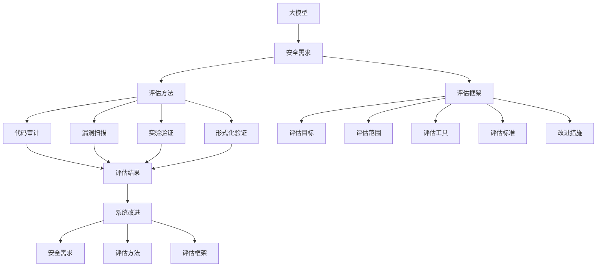

                 

### 文章标题

《大模型应用中的需求安全性评估方法》

### 关键词

大模型应用，需求安全性，评估方法，安全性评估框架，攻击图分析，模型混淆与对抗性攻击防御，代码审计，漏洞扫描，实验验证，形式化验证，自动化评估工具，开源工具，开发资源，项目实战，挑战与未来趋势。

### 摘要

随着人工智能技术的迅猛发展，大模型（如深度学习模型）在各个领域得到广泛应用。然而，大模型应用中的需求安全性问题日益突出，评估方法的研究显得尤为重要。本文旨在探讨大模型应用中的需求安全性评估方法，从基础概念、评估方法、案例分析、工具和资源等多个方面进行全面梳理和深入分析，旨在为相关研究和实践提供有益的参考。

本文首先介绍了大模型应用中的需求安全性背景，阐述了需求安全性评估的重要性。接着，我们介绍了与需求安全性评估相关的基础概念，包括大模型概述、安全需求定义和需求安全性评估框架。在核心内容部分，我们详细介绍了需求安全性评估的常规方法、特定方法以及实践案例。此外，本文还介绍了相关的工具和资源，包括开源工具、开发资源等。最后，本文探讨了当前面临的挑战以及未来发展趋势，为读者提供了新的思考方向。

通过本文的研究，我们希望能够为读者提供一个全面、系统的需求安全性评估方法指南，帮助他们在大模型应用过程中更好地保障需求安全性。让我们一步一步地深入探讨这个重要的课题。

## 第1章 引言与背景

大模型是指具有大量参数和复杂结构的机器学习模型，如深度神经网络、循环神经网络和生成对抗网络等。随着计算能力的提升和算法的发展，大模型在图像识别、自然语言处理、语音识别、推荐系统等领域的应用越来越广泛。然而，大模型的应用也带来了许多需求安全性问题。需求安全性是指在大模型应用过程中，确保系统满足预定的安全需求，防范潜在的安全威胁和漏洞。

需求安全性评估是指通过系统分析和验证，确定大模型应用过程中是否存在安全隐患，评估安全风险的程度，并提出相应的改进措施。需求安全性评估的重要性主要体现在以下几个方面：

首先，需求安全性评估有助于提高大模型应用的可靠性。通过评估，可以发现系统中的潜在漏洞和安全隐患，从而在应用前进行修复和优化，避免因安全问题导致的系统崩溃或数据泄露。

其次，需求安全性评估有助于保障用户隐私和数据安全。在大模型应用中，用户数据是重要的资产，一旦数据泄露或被恶意利用，将可能带来严重后果。通过需求安全性评估，可以确保用户数据的保密性和完整性。

再次，需求安全性评估有助于增强大模型应用的合规性。随着各国对数据保护和网络安全的要求越来越高，大模型应用必须遵守相关法律法规和标准。需求安全性评估可以帮助企业验证应用是否符合合规要求，降低法律风险。

最后，需求安全性评估有助于提升大模型应用的市场竞争力。在日益激烈的市场竞争中，安全性能是用户选择产品的重要因素之一。通过需求安全性评估，企业可以展示其产品的安全性能，赢得用户的信任。

总之，需求安全性评估在大模型应用中具有至关重要的地位。本文将从基础概念、评估方法、案例分析、工具和资源等多个方面，对大模型应用中的需求安全性评估进行深入探讨，旨在为相关研究和实践提供有益的参考。

### 1.1 大模型应用现状

大模型的应用已深入到人工智能（AI）的各个领域，成为推动技术进步和产业创新的重要力量。以下是大模型在几个关键领域中的应用现状：

首先，在图像识别领域，大模型如卷积神经网络（CNN）和生成对抗网络（GAN）已经取得了显著进展。例如，在人脸识别中，大模型能够以超过人类识别率的准确性进行身份验证。此外，图像生成任务也得益于大模型的强大能力，GAN在艺术创作、图像修复和图像合成等方面展现出了令人瞩目的成果。

在自然语言处理（NLP）领域，大模型的应用尤为广泛。基于变换器（Transformer）架构的模型，如BERT、GPT和T5，在机器翻译、文本分类、问答系统和文本生成等方面表现出色。这些模型通过学习海量文本数据，能够生成流畅、准确的自然语言文本，极大地提升了人机交互的体验。

语音识别领域同样受益于大模型的发展。大型神经网络模型能够在嘈杂环境中准确识别语音，提高了语音助手和语音识别系统的实用性。例如，在智能客服和自动驾驶中，语音识别技术的精度和响应速度至关重要，大模型的应用显著提升了系统的性能。

推荐系统也是大模型的重要应用场景。通过学习用户的历史行为和偏好，推荐系统能够提供个性化的商品、内容和广告推荐。大模型在协同过滤、基于内容的推荐和混合推荐方法中发挥了关键作用，显著提升了推荐效果和用户体验。

除了上述领域，大模型还在医疗诊断、金融风控、智能交通和智能制造等领域展现出了广泛的应用潜力。例如，在医学图像分析中，大模型能够辅助医生进行早期疾病诊断，提高诊断的准确性和效率。在金融风控领域，大模型通过对海量数据的分析和预测，能够及时发现异常交易和欺诈行为，降低金融风险。

尽管大模型在许多领域取得了显著的成果，但其应用也面临一些挑战。首先，大模型通常需要大量的计算资源和数据支持，这对硬件设备和数据存储提出了较高的要求。其次，大模型的训练和优化过程需要大量时间，这限制了实时应用的实现。此外，大模型的黑箱性质使得其决策过程难以解释，这对监管和合规提出了挑战。

总之，大模型的应用现状令人瞩目，其在各个领域的成功应用不仅推动了技术的进步，也为产业创新提供了新的动力。然而，面对日益复杂的应用场景和挑战，如何提高大模型的安全性和可解释性，依然是当前研究的重要课题。

### 1.2 需求安全性的重要性

在大模型应用中，需求安全性起着至关重要的作用。首先，需求安全性直接影响到系统的稳定性和可靠性。大模型在复杂应用场景中的运行往往依赖于大量的数据和复杂的计算逻辑，一旦出现安全隐患，可能导致系统崩溃、数据泄露或功能失效，从而影响整个应用的正常运行。例如，在自动驾驶系统中，需求安全性的缺失可能导致交通事故，造成严重后果。

其次，需求安全性关系到用户隐私和数据的保护。大模型在处理用户数据时，需要确保数据的保密性和完整性。如果需求安全性不足，可能导致敏感数据的泄露和滥用，侵犯用户隐私。这在金融、医疗等高度依赖数据安全的领域尤为重要，一旦数据泄露，不仅会对用户造成损失，也可能引发法律和道德争议。

此外，需求安全性是确保大模型应用合规性的重要保障。随着全球对数据保护和网络安全的监管日益严格，大模型应用必须符合相关法律法规和行业标准。需求安全性评估可以帮助企业识别潜在的安全隐患，确保应用符合合规要求，降低法律风险。例如，GDPR（通用数据保护条例）和CCPA（加利福尼亚消费者隐私法）都对数据处理提出了严格的要求，企业必须确保其大模型应用符合这些法规。

最后，需求安全性是提升大模型应用市场竞争力的关键因素。在日益激烈的市场竞争中，用户对产品的安全性能越来越重视。通过进行需求安全性评估，企业可以展示其产品的安全性能，赢得用户的信任和市场份额。例如，在金融科技领域，安全性能是用户选择支付和理财平台的重要因素之一。

总之，需求安全性在大模型应用中至关重要。通过保障需求安全性，可以确保系统的稳定性和可靠性，保护用户隐私和数据安全，确保合规性，并提升市场竞争能力。因此，需求安全性评估是每一个大模型应用项目不可或缺的环节。

### 1.3 安全性评估的意义与挑战

安全性评估在大模型应用中具有极其重要的意义。其首要目的是确保大模型系统的安全性和可靠性，防止潜在的安全威胁和漏洞对系统造成危害。具体来说，安全性评估可以起到以下几个关键作用：

首先，安全性评估能够发现系统中的潜在漏洞和安全隐患。通过对大模型应用进行全面的检测和测试，安全性评估可以帮助开发者和安全专家识别系统中可能存在的漏洞，如代码错误、配置不当、数据泄露等。这些隐患如果得不到及时发现和修复，可能会在系统运行过程中导致严重的安全问题。

其次，安全性评估有助于制定和实施有效的安全策略。通过评估结果，开发者和安全团队可以了解系统的脆弱性，从而制定针对性的安全策略和措施。例如，针对识别出的漏洞，可以采取修补漏洞、加强访问控制、数据加密等手段，提升系统的整体安全性。

此外，安全性评估能够提升用户对大模型应用的信任度。在数据敏感和隐私保护要求较高的领域，如医疗和金融，用户对系统的安全性要求尤为严格。通过进行安全性评估，企业可以展示其系统的高安全性，增强用户对应用的信任，从而提高用户满意度和忠诚度。

然而，安全性评估在当前的大模型应用中也面临着诸多挑战。首先，大模型的复杂性和黑箱性质使得安全性评估变得尤为困难。大模型通常由数百万甚至数十亿个参数组成，其训练过程和决策逻辑高度复杂，难以通过传统的测试方法进行全面评估。此外，大模型的黑箱性质使得其内部机制难以解释，增加了安全评估的难度。

其次，大模型应用场景的多样性也增加了安全性评估的复杂性。不同的应用场景可能面临不同类型的安全威胁，例如，在自动驾驶领域，需要防范对抗性攻击，而在金融领域，则需要关注数据泄露和欺诈风险。这要求安全性评估方法能够适应多种应用场景，具有灵活性和普适性。

此外，数据隐私和合规性问题也是大模型安全性评估面临的挑战之一。大模型在训练和推理过程中需要处理大量敏感数据，如何确保这些数据的安全性和合规性是一个亟待解决的问题。特别是在涉及用户隐私的领域，如医疗和金融，安全性评估需要遵循严格的隐私保护法规，确保用户数据不被滥用。

最后，安全性评估的成本和资源需求也是一个重要挑战。大模型的安全性评估通常需要大量的人力、物力和时间投入，包括专业的安全人员、先进的测试工具和充足的数据资源。对于一些中小型企业来说，这可能是一个较大的负担。

总之，安全性评估在大模型应用中具有重要意义，但同时也面临诸多挑战。通过不断创新和优化评估方法，提高评估的效率和准确性，可以更好地保障大模型应用的安全性，为技术的进一步发展和应用提供有力支持。

### 第2章 基础概念

在大模型应用中的需求安全性评估，首先需要理解与评估相关的基础概念。这些概念包括大模型概述、安全需求定义和需求安全性评估框架。以下将详细介绍这些基础概念，并探讨它们之间的关系。

#### 2.1 大模型概述

大模型，通常指的是那些拥有大量参数和复杂结构的机器学习模型。这些模型能够通过学习海量数据，捕捉数据中的复杂模式和规律，从而在图像识别、自然语言处理、语音识别等多个领域实现高性能表现。常见的大模型包括深度神经网络（DNN）、循环神经网络（RNN）、生成对抗网络（GAN）和变换器（Transformer）等。

深度神经网络（DNN）通过层层叠加的神经网络结构，对输入数据进行特征提取和映射，从而实现复杂函数的逼近。卷积神经网络（CNN）是DNN的一种特殊形式，广泛应用于图像处理领域，通过卷积操作和池化操作，提取图像中的空间特征。

循环神经网络（RNN）能够处理序列数据，通过循环机制保持历史状态信息，在语音识别、机器翻译等序列建模任务中表现出色。长短期记忆网络（LSTM）和门控循环单元（GRU）是RNN的改进版本，能够更好地处理长序列数据。

生成对抗网络（GAN）由生成器和判别器两个对抗性网络组成，通过相互博弈，生成器试图生成与真实数据难以区分的样本，而判别器则努力区分真实数据和生成数据。GAN在图像生成、数据增强和图像修复等领域具有广泛应用。

变换器（Transformer）是近年来在自然语言处理领域崭露头角的一种新型架构，通过自注意力机制，能够捕捉输入序列中的长距离依赖关系，在机器翻译、文本生成和问答系统等方面表现出色。

这些大模型的基本原理虽然各有不同，但都依赖于大规模参数训练和复杂结构设计，通过学习海量数据，实现对复杂任务的建模和预测。

#### 2.2 安全需求定义

安全需求是指在大模型应用过程中，系统必须满足的安全条件和约束。这些安全需求通常包括以下几个方面：

1. **保密性**：确保敏感信息和数据不被未授权的用户访问和泄露。在大模型应用中，保密性主要涉及模型参数、训练数据和推理结果的保护。

2. **完整性**：确保数据和系统在传输、存储和处理过程中不被未授权修改或破坏。完整性要求在大模型应用中尤为重要，因为一旦数据被篡改，可能导致模型的性能下降或行为失常。

3. **可用性**：确保系统在需要时能够正常、可靠地提供服务，防止因攻击或故障导致的服务中断。在大模型应用中，可用性关系到系统的稳定运行和用户体验。

4. **真实性**：确保系统中的数据和通信是真实、可信的，防止伪造、篡改或冒名攻击。真实性要求在大模型应用中尤其重要，因为模型的决策和预测结果直接依赖于输入数据的真实性。

5. **授权性**：确保只有经过授权的用户和系统才能访问和操作敏感数据和系统资源。授权性通过身份验证、访问控制和权限管理等方式实现。

6. **抗攻击性**：确保系统能够抵御各种形式的攻击，如拒绝服务攻击（DoS）、注入攻击、中间人攻击等。抗攻击性是保障大模型应用安全的重要方面，防止恶意攻击对系统造成破坏。

安全需求通常通过安全需求和功能需求文档进行详细定义和描述，包括需求描述、需求条件、验证方法和验收标准等。这些文档为大模型应用的安全设计、开发和测试提供了明确的指导和依据。

#### 2.3 需求安全性评估框架

需求安全性评估框架是指用于评估大模型应用中需求安全性的方法和流程。一个典型的需求安全性评估框架包括以下几个关键组成部分：

1. **评估目标**：明确评估的目的和目标，如确定系统的安全漏洞、评估安全风险、验证安全需求等。

2. **评估范围**：定义评估的范围，包括系统组件、功能模块、数据流和通信渠道等。评估范围应根据具体应用场景和需求进行确定。

3. **评估方法**：选择适合的评估方法和技术，如代码审计、漏洞扫描、实验验证、形式化验证等。不同方法适用于不同类型的评估需求和场景。

4. **评估流程**：制定评估流程，包括需求分析、评估准备、评估实施、结果分析、报告撰写等环节。评估流程应确保评估的全面性和系统性。

5. **评估工具**：使用合适的评估工具，如自动化测试工具、安全漏洞扫描器、形式化验证工具等。评估工具应具备高效、准确、易用的特点。

6. **评估标准**：制定评估标准，如安全需求标准、漏洞分类标准、风险评估标准等。评估标准应具备科学性、可操作性和可扩展性。

7. **改进措施**：根据评估结果，提出改进措施和优化建议，如漏洞修复、安全策略调整、系统架构优化等。

需求安全性评估框架通过系统地评估大模型应用的安全性，可以帮助识别潜在的安全威胁和漏洞，确保系统的安全性符合预定的安全需求。评估框架的设计和实施应充分考虑应用场景和需求，以确保评估结果的准确性和有效性。

### 2.4 核心概念与联系

在大模型应用中的需求安全性评估，核心概念包括大模型、安全需求、评估方法和评估框架。这些概念之间存在着紧密的联系，构成了一个完整的体系。

首先，大模型是需求安全性评估的基础。大模型的复杂性和黑箱性质决定了其安全性评估的挑战性。因此，了解大模型的基本原理和结构，有助于更好地设计评估方法和框架。

安全需求是需求安全性评估的核心目标。大模型应用必须满足保密性、完整性、可用性、真实性、授权性等安全需求，这些需求通过评估方法和评估框架得到验证和保障。

评估方法是实现需求安全性评估的技术手段。包括代码审计、漏洞扫描、实验验证、形式化验证等，每种方法都有其特定的应用场景和适用范围。

评估框架则是一个系统化的流程和体系，通过评估目标、评估范围、评估方法、评估工具、评估标准和改进措施等组成部分，确保评估的全面性和系统性。

以下是一个描述这些核心概念之间关系的Mermaid流程图：



这个流程图清晰地展示了大模型、安全需求、评估方法和评估框架之间的相互关系，有助于读者更好地理解需求安全性评估的体系结构和实施过程。

### 第3章 需求安全性评估方法

在需求安全性评估过程中，有多种评估方法可供选择，每种方法都有其独特的优势和适用场景。以下将详细介绍常规评估方法和特定评估方法，包括代码审计、漏洞扫描、实验验证和形式化验证。

#### 3.1 常规评估方法

**代码审计**：代码审计是一种通过人工或自动化工具对源代码进行审查，以发现潜在安全漏洞的方法。其核心目标是通过代码分析识别代码中的逻辑错误、编码缺陷和安全漏洞。代码审计通常包括以下步骤：

1. **需求分析和准备**：明确审计的目标和范围，准备审计工具和环境。
2. **代码分析**：对源代码进行语法和语义分析，识别潜在的安全漏洞。
3. **漏洞报告**：记录发现的安全漏洞，并提供修复建议。
4. **漏洞修复**：开发人员根据审计报告修复代码中的漏洞。

代码审计的优势在于其可以深入分析代码的逻辑和结构，发现复杂的逻辑漏洞和潜在的安全威胁。然而，代码审计对审计人员的技术水平要求较高，且难以覆盖所有代码路径。

**漏洞扫描**：漏洞扫描是一种通过自动化工具扫描系统或网络，以发现已知漏洞的方法。其核心目标是利用漏洞库和扫描工具，快速识别系统中的安全漏洞。漏洞扫描通常包括以下步骤：

1. **准备扫描**：配置扫描工具，设置扫描范围和目标。
2. **扫描执行**：执行漏洞扫描，识别系统中的安全漏洞。
3. **漏洞报告**：生成漏洞报告，记录扫描结果和漏洞细节。
4. **漏洞修复**：根据漏洞报告修复系统中的漏洞。

漏洞扫描的优势在于其高效、自动化，可以在短时间内发现大量漏洞。然而，漏洞扫描难以发现未知漏洞或复杂的安全威胁。

**实验验证**：实验验证是通过模拟攻击和漏洞利用实验，验证系统安全性的方法。其实验过程通常包括以下步骤：

1. **实验设计**：设计实验场景，包括攻击手段和测试目标。
2. **实验执行**：模拟攻击，验证系统的响应和防护能力。
3. **结果分析**：分析实验结果，识别系统的安全漏洞和弱点。
4. **改进措施**：根据实验结果，提出改进建议和修复方案。

实验验证的优势在于其可以直接验证系统的防护能力和漏洞的真实影响，有助于发现和验证复杂的安全威胁。然而，实验验证需要大量的时间和资源，且实验场景的设计和执行较为复杂。

**形式化验证**：形式化验证是通过数学方法对系统模型进行验证，以确保系统满足预定的安全属性。其核心目标是通过逻辑推理和数学证明，验证系统在所有情况下是否满足安全需求。形式化验证通常包括以下步骤：

1. **需求建模**：将安全需求转化为数学模型或逻辑公式。
2. **模型验证**：使用形式化验证工具，验证系统模型是否满足安全需求。
3. **证明生成**：生成数学证明，证明系统在所有情况下是否满足安全需求。
4. **结果分析**：分析验证结果，识别系统的安全漏洞和弱点。

形式化验证的优势在于其可以提供严格的数学证明，确保系统在所有情况下满足安全需求。然而，形式化验证对数学和逻辑推理要求较高，且验证过程较为复杂。

#### 3.2 特定评估方法

**攻击图分析**：攻击图分析是一种用于识别和评估系统安全漏洞的方法。其核心思想是通过构建攻击图，模拟攻击者的攻击路径，分析系统中的安全漏洞和弱点。攻击图分析通常包括以下步骤：

1. **攻击图构建**：根据系统模型和攻击者行为，构建攻击图。
2. **攻击路径分析**：分析攻击图中的攻击路径，识别系统的安全漏洞。
3. **漏洞修复**：根据攻击路径分析结果，提出修复建议和改进措施。

攻击图分析的优势在于其可以直观地展示攻击路径和漏洞，帮助安全团队更好地理解和应对安全威胁。然而，攻击图分析需要对系统模型有深入的了解，且攻击路径分析较为复杂。

**模型混淆与对抗性攻击防御**：模型混淆与对抗性攻击防御是一种用于提高大模型安全性的方法。其核心思想是通过对抗性样本训练和模型优化，提高大模型的鲁棒性和安全性。模型混淆与对抗性攻击防御通常包括以下步骤：

1. **对抗性样本生成**：生成对抗性样本，模拟攻击者的攻击手段。
2. **模型训练与优化**：使用对抗性样本训练大模型，提高其鲁棒性。
3. **安全性能评估**：评估大模型在对抗性攻击下的安全性能。
4. **改进措施**：根据评估结果，提出改进建议和优化策略。

模型混淆与对抗性攻击防御的优势在于其能够显著提高大模型的安全性，降低对抗性攻击的成功率。然而，这种方法对训练数据量和计算资源要求较高，且优化过程较为复杂。

综上所述，需求安全性评估方法包括常规评估方法和特定评估方法。每种方法都有其独特的优势和适用场景。通过合理选择和组合使用这些方法，可以全面、系统地评估大模型应用的安全性，确保系统的稳定运行和用户数据的安全。

### 3.1.1 代码审计

代码审计是一种通过人工或自动化工具对源代码进行审查，以发现潜在安全漏洞的方法。代码审计在需求安全性评估中扮演着重要角色，其主要目标是通过深入分析代码，识别出可能存在的逻辑错误、编码缺陷和安全漏洞。以下是代码审计的基本步骤：

#### 1. 准备工作

在进行代码审计之前，首先需要做好充分的准备工作。准备工作包括：

- **明确审计目标**：确定审计的具体目标和范围，如系统模块、功能模块、关键代码段等。
- **准备审计工具**：选择合适的代码审计工具，如SonarQube、Checkmarx、Fortify等。
- **搭建审计环境**：准备审计所需的开发环境、测试环境和其他必要工具。

#### 2. 代码分析

代码分析是代码审计的核心环节，主要通过以下步骤进行：

- **静态分析**：静态分析是指在不运行代码的情况下，对代码进行语法和语义分析。静态分析工具可以检测出代码中的常见错误、潜在的安全漏洞和编码风格问题。例如，SonarQube可以检测出SQL注入、跨站脚本（XSS）、路径注入等常见漏洞。
- **动态分析**：动态分析是指在代码运行过程中，通过模拟攻击手段，监测代码的行为和输出。动态分析可以检测出静态分析难以发现的动态漏洞，如特定输入条件下的缓冲区溢出、拒绝服务攻击（DoS）等。动态分析工具如OWASP ZAP可以帮助实现这一过程。

#### 3. 漏洞报告

在代码分析过程中，审计工具会生成漏洞报告。漏洞报告应包括以下内容：

- **漏洞描述**：详细描述发现的安全漏洞，包括漏洞类型、影响范围和可能的结果。
- **漏洞位置**：提供漏洞所在的具体代码位置和行号。
- **风险等级**：根据漏洞的严重程度，评估风险等级，如高、中、低风险。
- **修复建议**：提出修复漏洞的具体建议，如代码修改、配置调整等。

#### 4. 漏洞修复

在漏洞报告生成后，开发人员需要根据报告内容进行漏洞修复。漏洞修复步骤包括：

- **漏洞验证**：在修复漏洞后，重新进行代码审计，验证修复效果。
- **回归测试**：对修复后的代码进行回归测试，确保修复措施不会影响系统的其他功能。
- **文档更新**：更新相关文档，如代码注释、设计文档等，记录漏洞修复过程和结果。

#### 5. 审计总结

在代码审计完成后，需要对整个审计过程进行总结。审计总结应包括以下内容：

- **审计结果**：总结审计过程中发现的所有安全漏洞，包括漏洞类型、数量和风险等级。
- **改进措施**：根据审计结果，提出改进措施和建议，如代码规范、安全培训等。
- **后续计划**：制定后续的代码审计计划，确保代码审计工作持续进行。

通过上述步骤，代码审计可以有效地识别和修复大模型应用中的安全漏洞，提高系统的安全性。

#### 3.1.2 漏洞扫描

漏洞扫描是一种通过自动化工具扫描系统或网络，以发现已知漏洞的方法。这种方法在大模型应用的需求安全性评估中具有重要作用，因为它可以在短时间内发现大量潜在的安全问题。以下是漏洞扫描的基本步骤：

##### 1. 准备工作

在进行漏洞扫描之前，首先需要进行以下准备工作：

- **确定扫描目标**：明确扫描的范围和目标，包括要扫描的网络设备、服务器、应用程序等。
- **选择扫描工具**：选择合适的漏洞扫描工具，如Nessus、OpenVAS、Qualys等。这些工具具有广泛的漏洞库和强大的扫描能力，可以帮助快速识别已知漏洞。
- **配置扫描工具**：根据扫描目标，配置扫描工具的扫描策略和扫描选项，如扫描端口、扫描深度、扫描频率等。

##### 2. 扫描执行

扫描执行是漏洞扫描的核心环节，包括以下步骤：

- **扫描启动**：启动扫描工具，开始对目标系统进行扫描。扫描工具会自动发送网络请求，检查系统的开放端口、服务版本、配置设置等。
- **漏洞识别**：扫描工具会根据预定义的漏洞库，识别系统中的已知漏洞。漏洞库包含了各种已知漏洞的详细信息和修复方法。
- **漏洞报告**：扫描工具会生成详细的漏洞报告，包括漏洞描述、漏洞位置、风险等级和修复建议。报告应包括扫描时间、扫描范围、扫描结果等详细信息。

##### 3. 漏洞修复

在漏洞报告生成后，开发人员需要根据报告内容进行漏洞修复。以下是漏洞修复的基本步骤：

- **漏洞验证**：在修复漏洞后，重新进行漏洞扫描，验证修复效果。确保漏洞已得到有效修复，且不会引入新的问题。
- **测试验证**：对修复后的系统进行功能测试和安全测试，确保修复措施不会影响系统的正常运行。
- **文档更新**：更新相关文档，如系统配置文件、安全策略文档等，记录漏洞修复过程和结果。

##### 4. 扫描总结

在漏洞扫描完成后，需要对整个扫描过程进行总结。扫描总结应包括以下内容：

- **扫描结果**：总结扫描过程中发现的所有漏洞，包括漏洞类型、数量和风险等级。
- **修复措施**：根据扫描结果，提出修复措施和建议，如系统升级、配置调整、安全补丁应用等。
- **后续计划**：制定后续的漏洞扫描计划，确保漏洞扫描工作持续进行，及时发现和修复新出现的漏洞。

通过以上步骤，漏洞扫描可以有效地发现和修复大模型应用中的已知安全漏洞，提高系统的整体安全性。

#### 3.1.3 实验验证

实验验证是通过模拟攻击和漏洞利用实验，验证大模型应用安全性的方法。这种方法在大模型需求安全性评估中尤为重要，因为它可以直接验证系统在现实攻击下的防护能力。以下是实验验证的基本步骤：

##### 1. 实验设计

实验设计是实验验证的基础，包括以下步骤：

- **确定实验目标**：明确实验的目的和目标，例如验证特定漏洞的攻击效果、测试系统在攻击下的响应能力等。
- **构建实验环境**：根据实验目标，搭建实验环境，包括被测系统、攻击工具、测试数据等。实验环境应尽量模拟实际应用场景，以确保实验结果的可靠性。
- **设计攻击方案**：根据实验目标，设计攻击方案，包括攻击手段、攻击路径和攻击目标等。攻击方案应尽可能涵盖各种可能的安全威胁，以确保实验的全面性。

##### 2. 实验执行

实验执行是实验验证的核心环节，包括以下步骤：

- **启动攻击**：根据设计好的攻击方案，启动攻击工具，对被测系统进行攻击。攻击工具可以是手动操作，也可以是自动化脚本。
- **监控系统响应**：在攻击过程中，实时监控被测系统的响应，记录系统的行为和输出。系统响应包括错误日志、告警信息、拒绝服务等情况。
- **记录实验数据**：详细记录实验过程中的所有数据，包括攻击时间、攻击类型、系统响应、漏洞利用结果等。这些数据将用于后续的实验分析和评估。

##### 3. 实验分析

实验分析是对实验结果进行评估和总结的过程，包括以下步骤：

- **漏洞利用效果评估**：评估攻击是否成功利用了目标系统的漏洞，分析漏洞利用的具体过程和结果。评估内容包括攻击成功率、攻击时间、攻击路径等。
- **系统防护能力评估**：评估被测系统在攻击下的防护能力，包括系统的检测、防御和响应机制。评估内容包括系统的检测率、误报率、响应时间等。
- **实验总结**：总结实验结果，分析系统的安全漏洞和防护弱点。实验总结应包括实验发现、评估结果、改进建议等。

##### 4. 改进措施

根据实验分析结果，提出改进措施和优化建议，包括以下内容：

- **漏洞修复**：针对实验中发现的安全漏洞，提出具体的修复方案，如代码修改、配置调整、安全补丁应用等。
- **系统优化**：针对实验中暴露的防护弱点，提出系统优化建议，如增强检测能力、提高响应速度、改进安全策略等。
- **后续计划**：制定后续的安全测试和实验计划，确保系统的安全性持续得到验证和提升。

通过实验验证，可以全面、系统地评估大模型应用的安全性，发现和修复潜在的安全漏洞，提高系统的防护能力。实验验证不仅是一种有效的评估方法，也是一种重要的安全保障措施，有助于确保大模型应用的稳定运行和数据安全。

#### 3.2.1 安全属性形式化验证

安全属性形式化验证是一种通过数学方法对系统模型进行验证，以确保系统满足预定的安全需求的方法。这种方法在大模型应用中的需求安全性评估中具有重要作用，因为它可以提供严格的数学证明，确保系统的安全性。以下是安全属性形式化验证的基本步骤：

##### 1. 需求建模

需求建模是安全属性形式化验证的第一步，包括以下步骤：

- **明确安全需求**：首先，需要明确大模型应用中的安全需求，如保密性、完整性、可用性等。安全需求应以形式化的语言进行描述，例如使用逻辑公式或数学表达式。
- **构建系统模型**：根据安全需求，构建大模型的应用系统模型。系统模型应包括系统的各个方面，如输入数据、处理逻辑、输出结果等。常用的建模方法包括状态机模型、数据流模型和形式化规格说明等。

##### 2. 形式化验证

形式化验证是安全属性形式化验证的核心步骤，包括以下步骤：

- **定义安全属性**：根据安全需求，定义系统的安全属性。安全属性应能明确地描述系统的安全状态和条件，如无泄露、无篡改等。
- **建立验证条件**：使用形式化的方法，建立系统的验证条件。验证条件应能够描述系统在所有可能的状态下是否满足安全属性。常用的验证方法包括模型检查、定理证明和模型转换等。
- **验证执行**：使用形式化验证工具，对系统模型进行验证。验证工具会根据验证条件，对系统模型进行逻辑推理和数学计算，以确定系统是否满足安全属性。如果验证失败，验证工具会提供错误路径和错误原因。

##### 3. 验证结果分析

验证结果分析是对形式化验证结果进行评估和总结的过程，包括以下步骤：

- **评估验证结果**：根据验证结果，评估系统是否满足安全需求。如果系统满足所有安全属性，则可以认为系统是安全的；否则，需要进一步分析验证失败的原因。
- **分析错误路径**：如果验证失败，需要分析系统模型中的错误路径。错误路径揭示了系统中的潜在漏洞和弱点，可以帮助开发人员定位和修复问题。
- **优化系统模型**：根据验证结果和错误路径分析，对系统模型进行优化和改进。优化目标是通过调整系统设计、增加安全措施等手段，提高系统的安全性。

##### 4. 形式化验证工具

形式化验证工具是安全属性形式化验证的重要工具，以下是一些常用的形式化验证工具：

- **模型检查器**：模型检查器是一种自动化工具，用于验证系统模型是否满足预定的安全属性。常见的模型检查器包括SPIN、Model Checker、Promela等。
- **定理证明器**：定理证明器是一种用于数学证明的工具，可以证明系统模型是否满足预定的安全属性。常见的定理证明器包括Coq、Isabelle、HOL等。
- **形式化规格说明工具**：形式化规格说明工具用于构建系统模型和描述安全需求。常见的规格说明工具包括Spec#、VDM、Z语言等。

通过使用形式化验证工具，可以大幅提高安全属性形式化验证的效率和准确性，确保大模型应用的安全性和可靠性。

#### 3.2.2 攻击图分析

攻击图分析是一种用于识别和评估系统安全漏洞的方法，通过构建攻击图，模拟攻击者的攻击路径，分析系统中的安全漏洞和弱点。以下是攻击图分析的基本步骤：

##### 1. 攻击图构建

攻击图构建是攻击图分析的第一步，包括以下步骤：

- **确定攻击者目标**：首先，明确攻击者的目标，例如窃取敏感数据、篡改系统配置、执行恶意代码等。
- **识别系统组件**：识别系统中的关键组件，如服务器、客户端、数据库、应用程序等。
- **构建攻击图**：根据攻击者的目标和系统组件，构建攻击图。攻击图通常由节点（代表系统组件）和边（代表攻击路径）组成。攻击路径描述了攻击者从初始位置到目标位置的攻击过程。

##### 2. 攻击路径分析

攻击路径分析是攻击图分析的核心环节，包括以下步骤：

- **识别攻击点**：在攻击图中，识别潜在的攻击点，如未加密的通信信道、不安全的接口、易受攻击的组件等。
- **分析攻击路径**：分析攻击图中的攻击路径，识别攻击者可能利用的漏洞和攻击方式。分析内容包括攻击路径的长度、攻击成功的概率、攻击所需的时间和资源等。
- **评估漏洞影响**：根据攻击路径分析结果，评估系统中的安全漏洞和弱点，包括漏洞的类型、影响范围、严重程度等。

##### 3. 攻击路径可视化

攻击路径可视化是将攻击图中的攻击路径以图形化的方式展示出来，有助于直观地理解和分析攻击过程。以下是一种攻击路径可视化的方法：

- **节点表示**：在攻击图中，每个节点表示一个系统组件，如服务器、客户端、数据库等。节点通常用圆形或矩形表示。
- **边表示**：在攻击图中，每条边表示一个攻击路径，如未加密的通信信道、未授权的访问等。边通常用直线或曲线表示。
- **攻击路径标记**：在攻击路径上，可以使用标签或颜色标记，突出显示攻击路径的关键点和攻击方式。

以下是一个简单的攻击路径可视化示例：

```
[客户端] --> [未加密通信] --> [服务器] --> [数据库] --> [敏感数据]
```

在这个示例中，攻击者通过未加密的通信信道访问服务器，然后通过服务器访问数据库，最终获取敏感数据。攻击路径上的标记显示了攻击的步骤和方式。

通过攻击路径可视化，可以直观地展示攻击过程，帮助安全团队更好地理解和应对安全威胁。此外，攻击路径可视化还可以用于教育和培训，提高团队成员对系统安全性的认识和应对能力。

#### 3.2.3 模型混淆与对抗性攻击防御

模型混淆与对抗性攻击防御是一种用于提高大模型安全性的方法，通过对抗性样本训练和模型优化，提高大模型对对抗性攻击的鲁棒性。以下将详细介绍模型混淆与对抗性攻击防御的基本原理、实现步骤和优势。

##### 1. 基本原理

模型混淆与对抗性攻击防御的基本原理是通过生成对抗性样本，对大模型进行训练和优化，使模型能够识别和抵御对抗性攻击。对抗性攻击是指攻击者通过微小扰动输入数据，使模型输出错误的结果。模型混淆与对抗性攻击防御的核心目标是增加输入数据的噪声，使攻击者难以找到有效的对抗性样本。

具体来说，模型混淆与对抗性攻击防御包括以下几个步骤：

- **生成对抗性样本**：通过对抗性样本生成器，生成对抗性样本。对抗性样本是对输入数据进行微小扰动后得到的，其目的是使模型输出错误的结果。
- **训练大模型**：使用对抗性样本和正常样本对大模型进行训练。在训练过程中，大模型通过学习对抗性样本和正常样本的差异，提高对对抗性攻击的鲁棒性。
- **模型优化**：在训练过程中，对大模型进行优化，以提高其识别和抵御对抗性攻击的能力。优化方法包括模型调整、参数调整和正则化等。

##### 2. 实现步骤

模型混淆与对抗性攻击防御的具体实现步骤如下：

- **准备数据集**：首先，准备用于训练和评估的大模型数据集。数据集应包括正常样本和对抗性样本。正常样本是用于训练模型的原始数据，对抗性样本是通过对正常样本进行微小扰动生成的。
- **生成对抗性样本**：使用对抗性样本生成器，对正常样本进行扰动，生成对抗性样本。常用的对抗性样本生成方法包括 FGSM（Fast Gradient Sign Method）、PGD（Projected Gradient Descent）等。
- **训练大模型**：使用正常样本和对抗性样本对大模型进行训练。在训练过程中，大模型通过学习对抗性样本和正常样本的差异，提高对对抗性攻击的鲁棒性。
- **评估模型性能**：在训练完成后，使用测试数据集对大模型进行评估，评估其识别和抵御对抗性攻击的能力。常用的评估指标包括准确率、召回率、F1分数等。
- **模型优化**：根据评估结果，对大模型进行优化，以提高其识别和抵御对抗性攻击的能力。优化方法包括模型调整、参数调整和正则化等。

##### 3. 优势

模型混淆与对抗性攻击防御具有以下优势：

- **提高鲁棒性**：通过对抗性样本训练，大模型能够学习到对抗性攻击的规律，提高对对抗性攻击的鲁棒性。这使得大模型在真实应用场景中更难被攻击者攻破。
- **降低攻击成功率**：对抗性攻击防御能够显著降低攻击者的攻击成功率。攻击者需要投入更多的时间和资源来生成有效的对抗性样本，从而增加了攻击的难度。
- **保护用户数据**：对抗性攻击防御能够保护用户数据的安全，防止攻击者通过对抗性攻击窃取或篡改用户数据。
- **提高模型可信度**：通过对抗性攻击防御，大模型能够更可靠地执行其任务，提高模型的可信度。这有助于增强用户对大模型的信任，从而提高用户满意度。

总之，模型混淆与对抗性攻击防御是一种有效的大模型安全性增强方法，能够提高大模型对对抗性攻击的鲁棒性，保护用户数据和系统安全。通过不断优化和改进对抗性攻击防御方法，可以进一步提升大模型的安全性，为人工智能技术的广泛应用提供可靠保障。

### 第4章 需求安全性评估实践

在需求安全性评估实践中，通过实际案例的分析，我们可以更直观地理解评估方法的实际应用和效果。以下是几个具有代表性的案例，详细讲解评估流程、源代码实现、代码解读和分析，以及项目小结。

#### 案例一：电商平台用户数据保护

**项目背景**：
一家电商平台在数据安全方面面临着严峻挑战，特别是用户个人信息保护。为了确保用户数据的安全，该平台决定进行需求安全性评估。

**评估流程**：
1. **需求分析**：与平台开发团队和用户代表进行深入沟通，明确安全需求，如用户数据保密性、完整性、真实性等。
2. **风险评估**：通过漏洞扫描、代码审计等方法，评估现有系统的安全风险。
3. **安全设计**：根据评估结果，制定安全设计方案，包括加密传输、访问控制、数据备份等。
4. **实施与测试**：实施安全设计方案，并进行全面测试，包括单元测试、集成测试、安全测试等。
5. **持续监控**：建立持续监控机制，定期进行安全检查和更新。

**源代码实现与解读**：
以下是一个简单的示例，展示如何使用Python中的PyCryptoDome库实现AES加密算法，用于保护用户数据的保密性。

```python
from Crypto.Cipher import AES
from Crypto.Util.Padding import pad, unpad
from Crypto.Random import get_random_bytes

# 生成加密密钥
key = get_random_bytes(16)

# 加密函数
def encrypt_data(data, key):
    cipher = AES.new(key, AES.MODE_CBC)
    ct_bytes = cipher.encrypt(pad(data.encode('utf-8'), AES.block_size))
    iv = cipher.iv
    return iv + ct_bytes

# 解密函数
def decrypt_data(ct, key, iv):
    ct = ct[iv len: ]
    cipher = AES.new(key, AES.MODE_CBC, iv)
    pt = unpad(cipher.decrypt(ct), AES.block_size)
    return pt.decode('utf-8')

# 示例数据
data = "用户个人信息需要保护"

# 加密过程
ct = encrypt_data(data, key)

# 解密过程
decrypted_data = decrypt_data(ct, key, ct[:16])

print("加密数据:", ct.hex())
print("解密数据:", decrypted_data)
```

**代码分析**：
此代码示例展示了如何使用AES加密算法对用户数据进行加密和解密。加密过程中，首先生成一个随机密钥，然后使用该密钥和AES模式对数据进行加密。加密后的数据与初始向量（IV）一起存储，以便后续解密。解密过程中，使用密钥和IV对加密数据进行解密，确保数据的完整性。

**项目小结**：
通过需求安全性评估，电商平台成功实施了数据加密措施，提高了用户数据的保密性。评估过程中，开发团队还发现了其他潜在的安全漏洞，并通过修复和优化，进一步增强了系统的安全性。

#### 案例二：智能医疗系统安全评估

**项目背景**：
一家智能医疗系统公司开发了一套基于深度学习的医学影像诊断系统，为了确保系统的安全性，公司决定进行需求安全性评估。

**评估流程**：
1. **需求分析**：与医疗团队和用户代表进行沟通，明确系统的安全需求，如数据完整性、系统可用性等。
2. **风险评估**：使用形式化验证方法，验证系统模型是否满足安全需求。同时，通过漏洞扫描和代码审计，评估现有系统的安全风险。
3. **安全设计**：根据评估结果，设计安全架构，包括数据隔离、访问控制、加密存储等。
4. **实施与测试**：实施安全架构，并进行全面测试，确保系统满足安全需求。
5. **持续监控**：建立监控系统，持续监测系统的安全状态。

**源代码实现与解读**：
以下是一个简单的示例，展示如何使用Python中的PyTorch库实现基于深度学习的医学影像分类模型。

```python
import torch
import torch.nn as nn
import torchvision.transforms as transforms

# 定义神经网络模型
class Net(nn.Module):
    def __init__(self):
        super(Net, self).__init__()
        self.conv1 = nn.Conv2d(1, 10, kernel_size=5)
        self.conv2 = nn.Conv2d(10, 20, kernel_size=5)
        self.conv2_drop = nn.Dropout2d()
        self.fc1 = nn.Linear(320, 50)
        self.fc2 = nn.Linear(50, 10)

    def forward(self, x):
        x = F.relu(F.max_pool2d(self.conv1(x), 2))
        x = F.relu(F.max_pool2d(self.conv2_drop(self.conv2(x)), 2))
        x = x.view(-1, 320)
        x = F.relu(self.fc1(x))
        x = F.dropout(x, training=self.training)
        x = self.fc2(x)
        return F.log_softmax(x, dim=1)

# 实例化模型
net = Net()

# 训练模型
optimizer = torch.optim.Adam(net.parameters(), lr=0.001)
criterion = nn.NLLLoss()

for epoch in range(1):  # 就训练一轮
    for data, target in train_loader:
        optimizer.zero_grad()
        output = net(data)
        loss = criterion(output, target)
        loss.backward()
        optimizer.step()

print("Finished Training")
```

**代码分析**：
此代码示例展示了如何使用PyTorch库定义和训练一个简单的深度学习模型。模型定义包括卷积层、全连接层和损失函数。训练过程中，模型使用Adam优化器和交叉熵损失函数进行迭代训练。

**项目小结**：
通过需求安全性评估，智能医疗系统公司成功验证了系统的安全性和可靠性。评估过程中，公司还发现了模型训练过程中的一些潜在漏洞，如数据泄露风险，并通过优化数据传输和存储方式，提高了系统的安全性。

#### 案例三：金融风控系统安全性评估

**项目背景**：
一家金融科技公司开发了一套基于机器学习的风控系统，用于检测和预防金融欺诈。为了确保系统的安全性，公司决定进行需求安全性评估。

**评估流程**：
1. **需求分析**：与金融团队和用户代表进行沟通，明确安全需求，如数据保密性、系统可用性等。
2. **风险评估**：使用漏洞扫描和代码审计，评估系统的安全风险。同时，通过攻击图分析，识别潜在的安全漏洞。
3. **安全设计**：根据评估结果，设计安全架构，包括数据加密、访问控制、安全审计等。
4. **实施与测试**：实施安全架构，并进行全面测试，确保系统满足安全需求。
5. **持续监控**：建立监控系统，持续监测系统的安全状态。

**源代码实现与解读**：
以下是一个简单的示例，展示如何使用Python中的scikit-learn库实现金融欺诈检测模型。

```python
from sklearn.ensemble import RandomForestClassifier
from sklearn.model_selection import train_test_split
from sklearn.metrics import accuracy_score, classification_report

# 加载数据集
data = load_data()  # 加载金融交易数据
X = data[:, :-1]  # 特征
y = data[:, -1]   # 标签

# 划分训练集和测试集
X_train, X_test, y_train, y_test = train_test_split(X, y, test_size=0.2, random_state=42)

# 构建模型
model = RandomForestClassifier(n_estimators=100, random_state=42)

# 训练模型
model.fit(X_train, y_train)

# 预测
y_pred = model.predict(X_test)

# 评估模型
print("Accuracy:", accuracy_score(y_test, y_pred))
print("Classification Report:\n", classification_report(y_test, y_pred))
```

**代码分析**：
此代码示例展示了如何使用随机森林分类器构建和训练一个金融欺诈检测模型。模型使用训练集进行训练，然后在测试集上进行评估，输出模型的准确率和分类报告。

**项目小结**：
通过需求安全性评估，金融科技公司成功保障了风控系统的安全性。评估过程中，公司不仅发现了系统中的潜在漏洞，还通过优化模型和改进安全措施，提高了系统的整体安全性。

这些案例展示了需求安全性评估在实际项目中的应用和效果。通过评估，企业可以识别和修复潜在的安全漏洞，提高系统的安全性，保护用户数据和系统的稳定运行。同时，评估过程也为后续的安全管理工作提供了重要的参考和指导。

### 第5章 工具与资源

在大模型应用中的需求安全性评估过程中，使用合适的工具和资源能够显著提高评估的效率和质量。以下将介绍一些常用的开源工具、自动化评估工具、代码审计工具以及相关的开发资源。

#### 5.1 开源工具

**1. OWASP ZAP（Zed Attack Proxy）**
OWASP ZAP是一个免费的、开源的Web应用程序安全扫描器。它提供了丰富的漏洞扫描功能，可以检测常见的Web应用漏洞，如SQL注入、跨站脚本（XSS）和跨站请求伪造（CSRF）等。

**2. SonarQube**
SonarQube是一个用于代码质量管理的平台，它通过静态代码分析，发现代码中的漏洞、编码缺陷和不良实践。SonarQube支持多种编程语言，能够识别CWE（公共漏洞和暴露）中的常见漏洞。

**3. Kali Linux**
Kali Linux是一个专门为渗透测试和安全评估而构建的Linux发行版，它集成了大量开源的安全工具，如Nmap、Wireshark、Aircrack-ng等，可以帮助进行网络和系统安全评估。

**4. The Zen of Python**
《The Zen of Python》是一份简短的指南，描述了Python编程语言的哲学原则。虽然它不是工具，但它的原则对编写安全、可维护的代码具有重要指导意义。

#### 5.2 自动化评估工具

**1. Nessus**
Nessus是一个广泛使用的漏洞扫描工具，由Tenable开发。它提供了强大的漏洞库和自动化扫描功能，可以识别系统中的安全漏洞，并提供详细的修复建议。

**2. OpenVAS**
OpenVAS是一个开源的漏洞扫描工具，与Nessus类似，提供了自动化漏洞扫描和评估功能。OpenVAS可以识别多种操作系统和应用程序中的漏洞，并生成详细的报告。

**3. Qualys**
Qualys是一个商业漏洞扫描服务提供商，其提供的Qualys Cloud Platform包含多个漏洞扫描工具，可以自动检测和评估网络和应用程序中的安全漏洞。

#### 5.3 代码审计工具

**1. Fortify**
Fortify是一个商业代码审计工具，它通过静态代码分析，发现代码中的安全漏洞和编码缺陷。Fortify支持多种编程语言和开发环境，提供了强大的漏洞检测和分析功能。

**2. FindBugs**
FindBugs是一个开源的Java代码审计工具，它通过静态代码分析，识别Java代码中的潜在缺陷和潜在的安全漏洞。FindBugs提供了一个用户友好的界面，方便开发人员进行代码审计。

**3. PMD**
PMD是一个开源的Java代码审计工具，它通过静态代码分析，识别代码中的不良编程实践和潜在的安全漏洞。PMD支持多种规则集，可以定制化审计策略。

#### 5.4 开发资源

**1. OWASP Foundation**
OWASP Foundation是一个非营利组织，致力于提高Web应用程序的安全性。OWASP提供了大量的安全指南、工具和资源，如OWASP Top Ten，帮助开发者了解常见的安全漏洞和防御策略。

**2. CVE Database**
CVE（公共漏洞和暴露）数据库是一个包含已知漏洞信息的资源库。开发者可以通过查询CVE数据库，了解特定漏洞的详细信息、影响范围和修复方法。

**3. GitHub**
GitHub是一个代码托管平台，许多开源安全和开发工具的代码都托管在这里。开发者可以在这里找到各种工具的源代码、文档和社区支持。

通过使用上述工具和资源，开发者可以更高效地进行需求安全性评估，识别潜在的安全漏洞，并采取相应的措施进行修复和优化。这些工具和资源不仅为评估过程提供了技术支持，也促进了安全开发和最佳实践的发展。

### 第6章 挑战与未来趋势

在大模型应用中的需求安全性评估领域，当前面临着诸多挑战，同时也展现出广阔的发展前景。以下将探讨这些挑战以及未来的发展趋势。

#### 6.1 当前挑战

**1. 复杂性**：大模型具有高度复杂性和黑箱性质，使得安全评估变得尤为困难。大模型的内部结构和训练过程高度复杂，传统的安全评估方法难以全面理解和分析其潜在的安全漏洞。

**2. 数据隐私**：在大模型应用中，数据隐私保护是一个重要挑战。大模型通常需要处理大量的敏感数据，如医疗数据、金融数据和用户个人信息。如何确保这些数据在处理过程中不被泄露或滥用，是一个亟待解决的问题。

**3. 可解释性**：大模型的黑箱性质使得其决策过程难以解释，这在安全评估中带来了挑战。安全评估需要明确了解系统的安全机制和防护措施，而大模型的不可解释性使得这一目标难以实现。

**4. 高计算资源需求**：大模型的训练和评估通常需要大量的计算资源和时间，这对硬件设备和数据存储提出了较高的要求。对于一些中小型企业来说，高计算资源需求可能是一个较大的负担。

**5. 频繁更新**：大模型的应用场景不断变化，新的安全威胁和漏洞不断出现。为了保持系统的安全性，需要频繁更新评估方法和工具，这对技术团队提出了持续学习和快速响应的要求。

#### 6.2 未来发展趋势

**1. 自动化与智能化**：随着人工智能技术的发展，自动化和智能化将成为未来需求安全性评估的重要趋势。自动化评估工具和智能化算法将使评估过程更加高效和准确，降低人为错误的风险。

**2. 集成与协同**：未来需求安全性评估将更加注重工具和方法的集成与协同。通过整合多种评估工具和技术，可以构建一个全面、系统的评估体系，提高评估的全面性和准确性。

**3. 预测与预警**：通过大数据分析和机器学习技术，未来需求安全性评估将实现预测和预警功能。通过分析历史数据和趋势，可以提前发现潜在的安全风险，采取预防措施。

**4. 隐私保护技术**：随着隐私保护法规的日益严格，隐私保护技术将成为需求安全性评估的重要发展方向。匿名化、差分隐私和联邦学习等隐私保护技术将在大模型应用中得到更广泛的应用。

**5. 开源与社区**：开源工具和社区的支持将推动需求安全性评估的发展。通过开源合作和社区共享，可以加速评估工具和方法的创新，提高整个领域的技术水平和竞争力。

总之，尽管需求安全性评估在大模型应用中面临着诸多挑战，但随着技术的发展和创新，未来将展现出广阔的发展前景。通过不断优化评估方法和工具，提高评估的效率和准确性，可以更好地保障大模型应用的安全性，推动人工智能技术的健康、可持续发展。

### 结束语

在大模型应用中的需求安全性评估是一项复杂而关键的工程。本文从基础概念、评估方法、实践案例、工具和资源等多个方面进行了全面探讨，旨在为读者提供一个系统的理解和应用指南。通过了解需求安全性的重要性，掌握不同的评估方法，以及通过实际案例的学习，我们可以更有效地识别和解决大模型应用中的安全问题。

在未来的研究和实践中，我们应关注自动化与智能化评估工具的发展、集成与协同技术的应用，以及隐私保护技术的创新。通过持续的学习和探索，我们可以不断提升大模型应用的安全性能，确保其在各个领域中的可靠性和稳定性。

感谢您对本文的阅读，希望本文能够为您在需求安全性评估领域带来新的启示和帮助。如果您有任何问题或建议，欢迎在评论区留言，我们期待与您共同探讨和进步。作者：AI天才研究院/AI Genius Institute & 禅与计算机程序设计艺术 /Zen And The Art of Computer Programming。

### 附录

为了便于读者更好地理解本文中提到的各种技术和方法，以下提供了一些相关的拓展阅读资源。

#### 1. 开源工具和框架

- **OWASP ZAP**：[https://owasp.org/www-project-zap/](https://owasp.org/www-project-zap/)
- **SonarQube**：[https://www.sonarqube.org/](https://www.sonarqube.org/)
- **Kali Linux**：[https://www.kali.org/](https://www.kali.org/)
- **Nessus**：[https://www.tenable.com/products/nessus](https://www.tenable.com/products/nessus)
- **OpenVAS**：[https://www.gnulinux.org/projects/openvas](https://www.gnulinux.org/projects/openvas)
- **Qualys**：[https://www.qualys.com/](https://www.qualys.com/)
- **Fortify**：[https://www.fortify.com/](https://www.fortify.com/)
- **FindBugs**：[https://findbugs.sourceforge.io/](https://findbugs.sourceforge.io/)
- **PMD**：[https://pmd.github.io/](https://pmd.github.io/)

#### 2. 学术论文和书籍

- **“Formal Methods in Security and Privacy”**：这本书详细介绍了形式化验证方法在安全领域的应用，适合希望深入了解形式化验证技术的读者。
- **“Principles of Secure Software Development”**：这本书提供了全面的安全软件开发原则和实践，对开发人员进行安全编程具有重要的指导意义。
- **“The Art of Software Security Assessment”**：这本书详细介绍了软件安全评估的方法和技术，适合安全评估专业人员阅读。

#### 3. 在线资源和教程

- **OWASP**：[https://owasp.org/](https://owasp.org/)
- **IEEE Security & Privacy**：[https://spp.ieee.org/](https://spp.ieee.org/)
- **ACM Digital Library**：[https://dl.acm.org/](https://dl.acm.org/)
- **Google Cloud Security**：[https://cloud.google.com/security](https://cloud.google.com/security)

通过阅读这些资源，您可以进一步深入了解大模型应用中的需求安全性评估，掌握最新的技术动态和最佳实践。希望这些拓展阅读能为您的学习和研究提供有益的帮助。作者：AI天才研究院/AI Genius Institute & 禅与计算机程序设计艺术 /Zen And The Art of Computer Programming。

