                 

## 引言

### 1.1 书籍目的与读者

随着人工智能技术的飞速发展，大模型应用在各行各业中逐渐普及。这些大模型，如深度学习模型、自然语言处理模型等，因其强大的处理能力和出色的性能，在图像识别、语音识别、机器翻译等众多领域取得了显著的成果。然而，大模型应用不仅带来了技术上的挑战，也带来了管理上的难题，其中需求追溯性管理便是其中的重要一环。

需求追溯性管理是一种确保项目需求得到有效管理、追踪和实现的方法。它涉及到从需求提出、需求分析、需求实现到需求验证的整个生命周期。在大模型应用中，需求追溯性管理尤为重要，因为它可以帮助开发者更好地理解用户需求，确保模型开发符合预期，同时为后续的维护和升级提供依据。

本书旨在为从事大模型应用开发的读者提供一套全面、系统、易于理解的需求追溯性管理方法论。无论你是初入行的新手，还是经验丰富的高级开发者，本书都将帮助你掌握需求追溯性管理的关键技术和实践方法。

### 1.2 需求追溯性管理的重要性

需求追溯性管理在大模型应用中的重要性主要体现在以下几个方面：

1. **确保项目方向正确**：通过追溯性管理，开发者可以确保每一个功能点都符合用户需求，从而避免偏离项目目标。

2. **提高开发效率**：需求追溯性管理能够清晰地展现需求的实现路径，使得开发者能够快速定位和解决问题，提高开发效率。

3. **保障质量**：通过需求追溯性管理，可以确保每个需求在实现过程中都经过了严格的验证和测试，从而提高软件质量。

4. **支持维护和升级**：需求追溯性管理为后续的软件维护和升级提供了重要的依据，使得开发者可以更好地理解旧功能的实现细节，方便进行改进和优化。

5. **提升用户满意度**：需求追溯性管理能够确保用户的需求得到充分满足，从而提高用户满意度。

总之，需求追溯性管理在大模型应用中扮演着至关重要的角色，它是确保项目成功的关键因素之一。通过本书的深入学习，读者将能够全面理解并掌握需求追溯性管理的核心原理和实践方法，为大模型应用的开发和管理提供坚实的理论基础和实践指导。

### 1.3 本书结构

本书共分为九章，结构如下：

- **引言**：介绍书籍的目的和需求追溯性管理的重要性。
- **核心概念与联系**：介绍需求追溯性管理的基础概念和相关术语。
- **原理与架构**：阐述需求追溯性管理的工作原理和系统架构。
- **核心算法原理**：讲解用于需求追溯性管理的核心算法，并提供伪代码和数学模型。
- **数学模型和数学公式**：详细阐述与需求追溯性管理相关的数学模型，并提供公式和解释。
- **实际应用**：通过实际项目案例，展示如何应用需求追溯性管理。
- **案例分析**：分析成功和失败的需求追溯性管理案例。
- **系统集成**：讨论如何在不同的系统和环境中实现需求追溯性管理。
- **未来展望**：展望需求追溯性管理技术的发展趋势和潜在挑战。
- **结论**：总结书籍的主要内容，对未来的发展方向提出建议。

通过以上章节的逐步学习，读者将能够全面了解需求追溯性管理的概念、原理、算法和实践，为实际项目中的需求追溯性管理提供有力的支持。

### 1.4 需求追溯性管理在项目生命周期中的角色

需求追溯性管理在项目生命周期中扮演着至关重要的角色，它贯穿于项目的整个开发过程，从需求提出到最终交付，每一个阶段都有其独特的价值和作用。

#### 需求提出阶段

在需求提出阶段，需求追溯性管理的主要目标是确保所有提出的需求都能够被追踪和记录。这一阶段的工作主要包括需求收集、需求分析以及需求文档的编写。通过建立完善的需求追溯体系，开发者可以清晰地了解每个需求背后的用户需求，从而为后续的开发工作奠定基础。

具体而言，需求追溯性管理在这一阶段的作用包括：

1. **需求记录**：为每个需求分配唯一的标识符，确保其能够在整个项目生命周期中得以追踪。
2. **需求分类**：根据需求的类型、优先级和业务价值对其进行分类，以便于后续的管理和优先级排序。
3. **需求评审**：通过评审机制确保需求的质量和完整性，避免遗漏或错误的需求。

#### 需求分析阶段

在需求分析阶段，需求追溯性管理有助于开发者更深入地理解需求，并确保需求能够被准确实现。这一阶段的工作主要包括需求细化、功能设计以及非功能需求的处理。

需求追溯性管理在这一阶段的作用包括：

1. **需求细化**：通过追溯性管理，确保每个需求都被详细地定义和细化，避免模糊不清的需求导致后续的开发问题。
2. **需求映射**：将每个需求映射到具体的开发任务和资源上，确保需求能够被高效地实现。
3. **变更控制**：需求变更在项目开发中是不可避免的，需求追溯性管理能够有效控制变更，确保变更对项目的影响最小。

#### 需求实现阶段

在需求实现阶段，需求追溯性管理能够帮助开发者更好地管理和追踪需求的实现进度。这一阶段的工作主要包括代码开发、单元测试和集成测试。

需求追溯性管理在这一阶段的作用包括：

1. **进度监控**：通过追溯性管理，可以实时监控每个需求的实现进度，及时发现和解决问题。
2. **代码评审**：确保代码符合需求规格，避免因编码错误导致的需求无法实现。
3. **测试覆盖**：通过追溯性管理，可以确保每个需求都经过充分的测试，从而保证需求的质量。

#### 需求验证阶段

在需求验证阶段，需求追溯性管理有助于确保所有需求都被正确实现并满足用户需求。这一阶段的工作主要包括系统测试、验收测试以及用户反馈收集。

需求追溯性管理在这一阶段的作用包括：

1. **结果验证**：通过追溯性管理，可以确保每个需求都被正确地实现，并通过了相应的测试。
2. **用户反馈**：需求追溯性管理可以记录用户的反馈和需求变更，为后续的版本更新提供依据。
3. **问题追踪**：一旦出现需求无法满足的情况，需求追溯性管理能够快速定位问题，并提供解决方案。

#### 需求维护阶段

在需求维护阶段，需求追溯性管理能够帮助开发者更好地管理旧需求和新增需求，确保项目的长期稳定运行。这一阶段的工作主要包括需求更新、系统升级和缺陷修复。

需求追溯性管理在这一阶段的作用包括：

1. **需求更新**：通过追溯性管理，可以确保旧需求在系统升级和更新过程中得到妥善处理。
2. **变更管理**：需求变更在维护阶段同样常见，需求追溯性管理能够有效控制变更，确保变更对系统的影响最小。
3. **问题追踪**：需求追溯性管理可以记录和维护系统中存在的问题，为后续的修复工作提供依据。

总之，需求追溯性管理在项目生命周期的各个阶段都发挥着重要作用，它不仅能够提高项目开发和管理效率，还能保障项目质量和用户满意度。通过合理应用需求追溯性管理方法，开发者可以更好地应对项目中的各种挑战，确保项目的成功交付。

### 2.1 需求管理的概述

需求管理是指在整个软件生命周期中对用户需求进行收集、分析、分配、实现、跟踪和确认的过程。这一过程旨在确保软件系统能够满足用户的实际需求，同时优化开发资源的利用，提高项目的成功率和客户满意度。在大模型应用中，需求管理显得尤为重要，因为它直接关系到大模型的功能实现、性能优化和用户体验。

#### 需求管理的基本概念

需求管理涉及以下几个基本概念：

1. **用户需求**：用户需求是指用户对软件系统功能、性能、可靠性、易用性等方面的期望。用户需求通常来源于市场调研、用户访谈、用户手册等。

2. **需求文档**：需求文档是记录用户需求的重要文档，包括需求描述、功能规格、非功能需求、验收标准等。需求文档是需求管理的核心，它为后续的开发工作提供了明确的指导和依据。

3. **需求分类**：根据需求的重要性和实现难度，可以将需求分为功能性需求和非功能性需求。功能性需求是指直接影响系统功能的特性，如用户界面、数据处理等；非功能性需求则是指与系统功能无关的特性，如安全性、性能、可靠性等。

4. **需求生命周期**：需求生命周期包括需求提出、需求分析、需求实现、需求验证和需求维护等阶段。每个阶段都有其特定的任务和目标。

#### 需求管理的流程

需求管理的流程通常包括以下几个步骤：

1. **需求收集**：通过用户访谈、市场调研、用户反馈等方式，收集用户的需求信息。

2. **需求分析**：对收集到的需求进行分类、优先级排序和可行性分析，确保每个需求都是明确的、可实现的，并符合项目的整体目标。

3. **需求文档编写**：将分析后的需求编写成需求文档，确保文档的完整性和可理解性。

4. **需求评审**：组织相关人员对需求文档进行评审，确保需求的质量和准确性，并针对评审结果进行需求调整。

5. **需求分配**：根据需求的重要性和资源情况，将需求分配给相应的开发团队或个人。

6. **需求实现**：根据需求文档，进行系统的设计和开发，确保每个需求都能被准确地实现。

7. **需求验证**：通过测试、验收和用户反馈等方式，验证每个需求的实现情况，确保系统功能符合用户需求。

8. **需求维护**：在系统上线后，根据用户反馈和系统运行情况，对需求进行更新和维护，确保系统功能的持续优化和改进。

#### 需求管理的重要性

需求管理在大模型应用中的重要性体现在以下几个方面：

1. **明确项目目标**：通过需求管理，可以确保项目团队能够清晰地理解项目的目标，从而更好地制定项目计划和资源分配。

2. **优化开发效率**：有效的需求管理可以减少需求变更和返工，提高开发效率，缩短项目周期。

3. **提高用户满意度**：通过需求追溯性管理，可以确保用户的需求得到充分理解和满足，从而提高用户满意度。

4. **降低风险**：通过严格的需求管理和控制，可以降低项目失败和需求无法实现的风险。

5. **促进知识传承**：需求文档和追溯记录为后续的项目维护和升级提供了重要的知识基础，有助于知识传承和项目延续。

总之，需求管理是大模型应用成功的关键因素之一。通过建立和完善需求管理流程，开发者可以更好地应对项目中的各种挑战，确保大模型应用的成功开发和高效运行。

### 2.2 追溯性管理的原理

追溯性管理是一种在项目开发过程中，通过记录和分析需求与实现之间的关联，确保项目能够按照预期目标进行的管理方法。在大模型应用中，追溯性管理尤为关键，因为它能够帮助开发者清晰了解每个需求的具体实现情况，从而更好地控制项目进度、保证质量，并提高用户满意度。以下是追溯性管理的基本原理、方法及其在大模型应用中的具体应用。

#### 基本原理

追溯性管理基于以下几个基本原理：

1. **关联性**：追溯性管理强调需求与实现之间的紧密关联。通过建立需求与实现之间的映射关系，可以清晰地了解每个需求是如何被实现的，从而确保项目的每个功能点都能满足用户需求。

2. **可追踪性**：追溯性管理要求项目中的每个环节都具有可追踪性。这意味着项目中的每个步骤、每个决策、每个变更都应记录在案，以便于后续的追溯和分析。

3. **反馈机制**：追溯性管理包括一个有效的反馈机制，用于收集用户反馈和项目执行过程中的数据。这些反馈和数据可以帮助项目团队及时发现和解决问题，确保项目能够持续改进。

#### 方法

追溯性管理的方法主要包括以下几种：

1. **需求文档管理**：需求文档是追溯性管理的基础。通过详细的需求文档，可以记录每个需求的具体内容、优先级、验收标准等，确保需求在实现过程中得到有效管理。

2. **变更控制**：在项目开发过程中，需求变更在所难免。通过建立变更控制流程，可以确保每个变更都经过严格的评审和记录，从而避免对项目造成不良影响。

3. **版本控制**：版本控制工具（如Git）可以用于管理代码和文档的版本，确保项目中的每个版本都有明确的记录，便于追溯和分析。

4. **测试管理**：通过测试管理，可以确保每个需求在实现后都经过了充分的测试，从而验证其是否符合预期功能。

5. **日志记录**：日志记录是追溯性管理的重要组成部分。通过记录项目开发过程中的关键事件、决策和变更，可以为后续的追溯和分析提供重要依据。

#### 大模型应用中的具体应用

在大模型应用中，追溯性管理的主要目标是通过建立需求与实现之间的关联，确保大模型能够满足用户需求，并实现高性能、高可靠性和高可扩展性。以下是在大模型应用中追溯性管理的具体应用：

1. **需求收集与梳理**：在大模型开发初期，通过用户访谈、市场调研等方式收集用户需求，并对需求进行梳理和分类。这包括功能性需求和非功能性需求，如模型性能、可扩展性、安全性等。

2. **需求文档编写**：将收集到的需求编写成详细的需求文档，明确每个需求的具体内容、验收标准和优先级。需求文档应包括需求描述、用户故事、用例图等，以便于后续的追溯和分析。

3. **需求与实现的映射**：在开发过程中，将每个需求映射到具体的开发任务和代码模块上。通过建立需求与实现之间的映射关系，可以清晰地了解每个需求是如何被实现的，从而确保项目按照预期进行。

4. **版本控制和变更管理**：使用版本控制工具（如Git）管理代码和文档的版本，确保每个版本都有明确的记录和变更日志。通过严格的变更控制流程，确保每个变更都经过评审和记录，避免对项目造成不良影响。

5. **测试和验证**：在大模型开发过程中，进行全面的测试和验证，确保每个需求在实现后都经过了充分的测试，符合预期功能。测试应包括单元测试、集成测试、性能测试和用户验收测试等。

6. **日志记录与反馈**：记录项目开发过程中的关键事件、决策和变更，形成详细的日志。这些日志应包括开发进度、测试结果、用户反馈等，以便于后续的追溯和分析。

7. **需求追溯与分析**：通过需求追溯和分析，可以了解每个需求在项目中的实现情况，发现潜在的问题和改进点。需求追溯和分析可以帮助项目团队优化项目管理和决策，提高项目成功率。

通过以上方法，追溯性管理在大模型应用中可以帮助开发者更好地理解用户需求，确保大模型的功能实现和性能优化，提高项目的成功率和用户满意度。总之，追溯性管理是大模型应用中不可或缺的管理方法，它为项目的有效管理提供了坚实的理论基础和实践指导。

### 2.3 需求追溯性管理的核心概念

需求追溯性管理涉及多个核心概念，这些概念构成了需求管理的基础，并对实现有效的需求追溯性管理至关重要。以下是这些核心概念及其相互关系的详细阐述：

#### 需求（Requirement）

需求是软件项目中最基本的概念，它描述了用户希望从软件系统中获得的功能或服务。需求可以是功能性的，也可以是非功能性的。功能性需求涉及到软件系统的具体功能，如用户界面、数据处理等；非功能性需求则与系统的性能、可靠性、安全性等特性相关。

#### 用户故事（User Story）

用户故事是敏捷开发中的一种需求表达方式，它以用户的视角描述软件系统应提供的功能或服务。用户故事通常包含三个要素：用户角色、功能描述和验收标准。用户故事有助于开发团队更好地理解用户需求，并围绕用户的核心需求进行开发和迭代。

#### 用例图（Use Case Diagram）

用例图是一种图形化工具，用于描述系统与外部参与者（用户或其他系统）之间的交互。它展示了系统的功能模块、用户角色以及它们之间的交互关系。用例图有助于分析系统的需求，识别潜在的功能点，并确保所有需求都被充分考虑。

#### 需求文档（Requirement Document）

需求文档是记录需求详细信息的重要文档，它包括需求的描述、功能规格、验收标准和相关约束条件。需求文档为项目开发提供了明确的指导和依据，确保开发团队能够按照用户需求进行系统设计和实现。

#### 需求矩阵（Requirement Matrix）

需求矩阵是一种用于管理需求及其关系的工具，它展示了需求之间的关联性，包括需求之间的依赖关系、优先级和实现顺序。需求矩阵有助于项目团队明确每个需求的具体实现路径，确保项目能够有序进行。

#### 追溯路径（Traceability Path）

追溯路径是需求追溯性管理中的核心概念，它描述了从需求到实现之间的关联关系。追溯路径包括需求来源、需求变更、实现状态、验证结果等。通过追溯路径，项目团队可以清晰地了解每个需求是如何被实现的，从而确保项目的透明度和可控性。

#### 变更管理（Change Management）

变更管理是需求追溯性管理的重要组成部分，它涉及对需求的变更进行评估、批准和实施。有效的变更管理确保需求的变更不会对项目造成不良影响，同时保持项目的稳定性和可预测性。

#### 测试管理（Test Management）

测试管理是需求追溯性管理的关键环节，它包括测试计划的制定、测试用例的设计、测试执行的监控和测试结果的记录。通过测试管理，可以确保每个需求在实现后都经过了充分的测试和验证，从而保证系统的质量和可靠性。

#### 日志记录（Log Record）

日志记录是需求追溯性管理中的重要工具，它记录了项目开发过程中的关键事件、决策和变更。日志记录有助于追溯项目的执行情况，发现潜在的问题和改进点，为项目的持续改进提供依据。

#### 需求生命周期（Requirement Life Cycle）

需求生命周期描述了需求从提出到关闭的整个过程，包括需求收集、需求分析、需求实现、需求验证和需求维护等阶段。需求生命周期管理确保每个需求都能在项目生命周期中得到有效管理，并最终满足用户需求。

#### 关联性（Association）

关联性是需求追溯性管理中的核心概念之一，它描述了需求与实现、需求与测试、需求与变更等之间的关联关系。通过建立有效的关联性，项目团队可以更好地理解需求，确保每个需求都能被准确实现和验证。

#### 可追踪性（Traceability）

可追踪性是需求追溯性管理的核心目标，它确保项目中的每个步骤、每个决策、每个变更都具有可追溯性。通过实现可追踪性，项目团队可以更好地监控项目进展，发现潜在问题，并采取相应的措施进行改进。

#### 反馈机制（Feedback Mechanism）

反馈机制是需求追溯性管理的重要组成部分，它用于收集用户反馈和项目执行过程中的数据。通过有效的反馈机制，项目团队可以及时了解用户需求和项目实际运行情况，从而进行持续改进。

#### 综合关系图

以下是需求追溯性管理的核心概念及其相互关系的综合关系图，它展示了各个概念之间的关联性和相互作用：

```mermaid
graph TD
    A[需求] --> B[用户故事]
    A --> C[用例图]
    A --> D[需求文档]
    A --> E[需求矩阵]
    A --> F[追溯路径]
    A --> G[变更管理]
    A --> H[测试管理]
    A --> I[日志记录]
    A --> J[需求生命周期]
    B --> K[验收标准]
    C --> L[用户角色]
    C --> M[交互关系]
    D --> N[功能规格]
    D --> O[验收标准]
    D --> P[相关约束条件]
    E --> Q[依赖关系]
    E --> R[优先级]
    E --> S[实现顺序]
    F --> T[需求来源]
    F --> U[需求变更]
    F --> V[实现状态]
    F --> W[验证结果]
    G --> X[变更评估]
    G --> Y[变更批准]
    G --> Z[变更实施]
    H --> AA[测试计划]
    H --> BB[测试用例设计]
    H --> CC[测试执行监控]
    H --> DD[测试结果记录]
    I --> EE[关键事件记录]
    I --> FF[决策记录]
    I --> GG[变更记录]
    J --> HH[需求收集]
    J --> II[需求分析]
    J --> JJ[需求实现]
    J --> KK[需求验证]
    J --> LL[需求维护]
    A --> MM[关联性]
    A --> NN[可追踪性]
    A --> OO[反馈机制]
    B --> PP[用户视角]
    C --> QQ[功能模块]
    D --> RR[开发依据]
    E --> SS[需求管理]
    F --> TT[项目透明度]
    G --> UU[项目稳定性]
    H --> VV[系统质量]
    I --> WW[持续改进]
    J --> XX[项目生命周期]
    MM --> YY[需求与实现]
    MM --> ZZ[需求与测试]
    MM --> AAA[需求与变更]
    NN --> BBB[项目监控]
    NN --> CCC[问题发现]
    OO --> DDD[用户需求]
    OO --> EEE[项目改进]
```



通过上述核心概念及其相互关系的详细阐述，可以更好地理解需求追溯性管理的原理和实践方法，为大模型应用中的需求管理提供有力的理论支持和实践指导。

### 3.1 需求追溯性管理的工作原理

需求追溯性管理的工作原理主要涉及在项目生命周期中对需求及其实现进行有效跟踪和管理。其核心在于建立需求与实现之间的关联性，确保需求在开发过程中得到准确实现，并在系统交付后进行有效维护。以下是需求追溯性管理的工作原理及其具体步骤：

#### 建立需求与实现之间的映射关系

需求追溯性管理的第一步是建立需求与实现之间的映射关系。这通常通过创建一个需求矩阵来实现。需求矩阵是一个二维表格，列代表需求，行代表实现阶段（如设计、编码、测试等）。通过填写矩阵，可以清晰地展示每个需求在各个实现阶段的进展情况。

**步骤**：

1. **需求识别**：首先，收集和记录项目中的所有需求。
2. **需求分类**：根据需求的重要性和优先级对需求进行分类。
3. **创建需求矩阵**：在需求矩阵中填写每个需求及其关联的实现阶段。
4. **分配责任**：为每个需求分配具体负责的团队成员。

#### 实时监控与记录

在项目开发过程中，需求追溯性管理需要实时监控需求的实现情况，并记录关键事件和变更。

**步骤**：

1. **需求状态更新**：根据开发进展，定期更新需求矩阵中的状态（如“待设计”、“进行中”、“已完成”等）。
2. **记录变更**：任何需求变更都应记录在案，包括变更原因、变更内容和变更影响评估。
3. **日志记录**：详细记录项目开发过程中的关键事件和决策，如会议纪要、测试结果等。

#### 测试与验证

测试和验证是确保需求被正确实现的重要环节。需求追溯性管理要求在测试阶段对每个需求进行验证，确保其功能符合预期。

**步骤**：

1. **制定测试计划**：根据需求文档，制定详细的测试计划，明确测试用例、测试环境和测试时间表。
2. **执行测试**：按照测试计划，执行功能测试、性能测试、安全测试等。
3. **记录测试结果**：将测试结果记录在需求矩阵中，标记每个需求是否通过测试。
4. **问题追踪**：对测试中发现的问题进行追踪和解决，确保问题得到妥善处理。

#### 追溯与反馈

需求追溯性管理还包括追溯需求和反馈机制，以便及时发现问题并进行改进。

**步骤**：

1. **追溯需求**：通过需求矩阵，追溯每个需求从提出到实现的整个生命周期，确保所有需求都得到妥善处理。
2. **收集反馈**：通过用户调查、用户反馈等方式，收集用户对系统功能的评价和反馈。
3. **分析反馈**：对用户反馈进行分析，识别潜在的问题和改进点。
4. **持续改进**：根据分析结果，对需求管理和实现过程进行改进，提高项目质量和用户满意度。

#### 维护与更新

在系统交付后，需求追溯性管理仍需持续进行，以确保系统功能的长期稳定和持续改进。

**步骤**：

1. **需求更新**：根据用户反馈和系统运行情况，对需求进行更新和优化。
2. **版本管理**：使用版本控制工具管理需求和实现文档的版本，确保版本的一致性和可追溯性。
3. **问题追踪**：记录和维护系统中的问题，为后续的修复和升级提供依据。
4. **持续监控**：定期监控系统运行状况，及时发现和处理潜在问题。

### 实际案例

以下是一个实际案例，展示需求追溯性管理在项目中的应用：

**项目背景**：某企业开发一个电子商务平台，需求包括用户注册、商品浏览、购物车、订单管理等。

**步骤**：

1. **需求识别**：项目团队通过用户访谈和市场调研，收集了电子商务平台的所有需求。
2. **创建需求矩阵**：项目团队创建了一个需求矩阵，列出了所有需求及其关联的实现阶段，如设计、编码、测试等。
3. **实时监控**：在开发过程中，项目团队定期更新需求矩阵，记录每个需求的实现状态和关键事件。
4. **测试与验证**：项目团队制定了详细的测试计划，执行功能测试和性能测试，并将测试结果记录在需求矩阵中。
5. **追溯与反馈**：项目团队通过需求矩阵追溯每个需求的生命周期，收集用户反馈，分析反馈并做出改进。
6. **维护与更新**：系统交付后，项目团队根据用户反馈和系统运行情况，对需求进行持续更新和优化。

通过上述步骤，项目团队实现了对电子商务平台需求的全面管理和追溯，确保了系统的质量和用户满意度。

总之，需求追溯性管理通过建立需求与实现之间的关联性，实时监控与记录，测试与验证，追溯与反馈，以及维护与更新，确保项目能够按预期进行，并最终满足用户需求。

### 3.2 需求追溯性管理的系统架构

需求追溯性管理的系统架构是确保需求从提出到实现的每个环节都能够被有效监控和管理的关键。一个完善的需求追溯性管理系统架构通常包括多个层次和组件，以支持需求的收集、分析、实现、验证和维护。以下是需求追溯性管理的系统架构及其主要组件的详细描述：

#### 系统层次结构

需求追溯性管理系统可以分为以下几个层次：

1. **数据层**：负责存储和管理所有与需求相关的数据，如需求文档、实现记录、测试结果、用户反馈等。
2. **逻辑层**：包含需求管理的核心算法和业务逻辑，负责处理需求的收集、分析、分配、实现、验证和追溯等功能。
3. **表示层**：提供用户界面，使用户能够方便地与系统进行交互，查看需求状态、执行任务、记录变更等。

#### 主要组件

1. **需求管理模块**：负责需求的收集、分类、优先级排序和文档编写。该模块应提供用户故事创建、用例图绘制、需求文档编辑等功能。
   
2. **变更控制模块**：负责需求的变更管理，包括变更的提出、评审、批准和实施。该模块应提供变更记录、变更影响评估、变更审批流程等功能。

3. **测试管理模块**：负责测试计划的制定、测试用例的设计、测试执行的监控和测试结果记录。该模块应提供测试计划创建、测试用例编写、测试执行跟踪、测试结果分析等功能。

4. **日志记录模块**：负责记录项目开发过程中的所有关键事件、决策和变更，提供追溯和审计支持。该模块应提供日志记录、日志查询、日志分析等功能。

5. **需求追溯模块**：负责建立和维护需求与实现、测试、变更等之间的关联关系，提供需求追溯路径查询、追溯结果分析等功能。

6. **用户反馈模块**：负责收集用户对系统的反馈和评价，提供用户满意度调查、用户反馈记录、反馈分析等功能。

#### 系统集成

需求追溯性管理系统需要与其他系统（如版本控制系统、测试管理系统、项目管理工具等）进行集成，以实现数据共享和流程协同。以下是系统集成的一些关键点：

1. **数据集成**：通过接口或数据交换格式（如API、XML、JSON等），实现需求追溯性管理系统与其他系统的数据交换和共享。
   
2. **流程集成**：通过定义统一的流程规范，实现需求管理、变更控制、测试管理、用户反馈等流程在各个系统之间的无缝衔接。

3. **权限控制**：确保各个系统之间的权限控制策略一致，防止未经授权的数据访问和操作。

#### 技术实现

需求追溯性管理系统通常基于以下技术实现：

1. **数据库**：使用关系型数据库（如MySQL、PostgreSQL）或NoSQL数据库（如MongoDB）存储需求数据、测试数据、日志数据等。
   
2. **开发框架**：使用Java、Python、JavaScript等编程语言，结合Spring、Django、React等开发框架，实现需求管理模块、变更控制模块、测试管理模块等。

3. **前端界面**：使用HTML、CSS、JavaScript等技术，结合Vue、Angular、React等前端框架，实现用户友好、交互性强的前端界面。

4. **集成工具**：使用Jenkins、Apache Camel等集成工具，实现系统与其他系统的集成和流程自动化。

通过上述系统架构和技术实现，需求追溯性管理系统可以确保需求在项目生命周期中的每个环节都能得到有效管理和追溯，提高项目的透明度和可控性，确保项目成功交付。

### 3.3 需求追溯性管理的关键技术

需求追溯性管理涉及到多种关键技术，这些技术共同作用，确保需求从提出到实现的整个生命周期得到有效管理。以下是这些关键技术的详细介绍：

#### 版本控制

版本控制是需求追溯性管理的基础技术之一，它用于管理和维护软件项目的源代码和文档版本。常见的版本控制工具包括Git、SVN和Mercurial等。版本控制工具的主要功能包括：

1. **版本管理**：记录每次代码或文档的修改，生成唯一的版本号，便于追溯和回滚。
2. **分支管理**：支持创建和合并分支，以便于并行开发和管理不同需求。
3. **变更记录**：记录每次修改的详细信息和修改者，便于追溯和审计。
4. **协作开发**：支持多人协作，确保代码的一致性和完整性。

#### 需求管理工具

需求管理工具是用于记录、追踪和管理需求的重要工具。常见的需求管理工具有JIRA、Trello、Asana等。需求管理工具的主要功能包括：

1. **需求记录**：提供需求收集和记录的功能，确保每个需求都有详细的描述和优先级。
2. **需求追踪**：通过需求卡片或需求列表，追踪需求的提出、分析、实现和验证状态。
3. **需求文档管理**：提供需求文档的编辑、存储和共享功能，确保文档的完整性和可访问性。
4. **报告生成**：生成需求状态报告和趋势图，帮助项目团队了解需求的进展和风险。

#### 测试管理工具

测试管理工具用于规划、执行和记录软件测试活动，确保需求在实现后得到充分验证。常见的测试管理工具有Selenium、JMeter、QTP等。测试管理工具的主要功能包括：

1. **测试计划**：制定详细的测试计划，包括测试目标、测试策略、测试用例和测试环境等。
2. **测试用例管理**：提供测试用例的创建、编辑和执行功能，确保每个测试用例都有详细的描述和执行结果。
3. **测试执行**：支持自动化测试和手动测试，确保测试用例能够按计划执行。
4. **测试结果记录**：记录测试结果，包括测试通过率、缺陷数量和缺陷分析等，便于追溯和改进。

#### 日志记录和审计

日志记录和审计是需求追溯性管理的重要组成部分，用于记录项目开发过程中的关键事件和变更，便于追溯和审计。主要功能包括：

1. **日志记录**：记录项目开发过程中的所有关键事件和决策，如需求变更、代码提交、测试结果等。
2. **审计追踪**：通过日志记录，追溯项目开发过程中的所有操作和变更，确保项目的透明度和可追溯性。
3. **错误追踪**：记录和追踪项目中出现的错误和缺陷，确保问题得到及时解决。
4. **报告生成**：生成日志报告和审计报告，帮助项目团队了解项目进展和问题。

#### 数据库管理

数据库管理是需求追溯性管理的重要组成部分，用于存储和管理需求、实现、测试和日志等数据。常用的数据库管理工具有MySQL、PostgreSQL、MongoDB等。数据库管理的主要功能包括：

1. **数据存储**：提供可靠的数据存储和管理功能，确保数据的一致性和完整性。
2. **数据查询**：提供高效的数据查询功能，便于追溯和分析需求状态。
3. **数据备份和恢复**：提供数据备份和恢复功能，确保数据的安全性和可用性。
4. **性能优化**：对数据库性能进行优化，确保数据查询和操作的高效性。

通过上述关键技术的有效集成和应用，需求追溯性管理能够确保项目需求在各个阶段得到有效管理和追溯，提高项目的透明度和可控性，确保项目成功交付。

### 4.1 基于图论的追溯算法

在需求追溯性管理中，基于图论的追溯算法是一种强大的工具，它能够帮助开发者和项目管理人员建立和解析需求与实现之间的复杂关系。图论作为一种数学工具，通过图和节点的方式，将需求及其实现、测试、变更等元素表示出来，从而提供了直观的追溯和分析方法。以下将详细介绍基于图论的追溯算法，包括其基本概念、基本操作以及如何应用于需求追溯性管理。

#### 基本概念

**图（Graph）**：图是由节点（Node）和边（Edge）组成的集合。在需求追溯性管理中，节点通常表示需求或实现模块，边表示它们之间的关联关系。

**节点（Node）**：在图论中，节点是图的基本元素，用于表示需求、实现模块或其他相关实体。

**边（Edge）**：边连接两个节点，表示它们之间的关联关系。在需求追溯性管理中，边可以表示需求与实现模块之间的依赖关系、测试结果、变更记录等。

**路径（Path）**：路径是图中节点和边的序列，表示从一个节点到另一个节点的连接。

#### 基本操作

**创建图**：首先，根据需求及其关联关系创建图。例如，如果有三个需求A、B、C，它们之间存在如下关联关系：A依赖B，B依赖C，则可以创建一个包含三个节点的图，其中A与B之间有一条边，B与C之间有一条边。

**添加节点和边**：在需求追溯过程中，可以根据新的需求或变更，动态地添加节点和边。例如，如果新增了一个需求D，并且D依赖于A，则可以在图中添加节点D，并在A和D之间添加一条边。

**删除节点和边**：如果需求或实现模块被删除，相应的节点和边也需要从图中移除。

**查找路径**：通过图论算法，可以查找从源节点到目标节点的所有路径。这对于追溯需求实现和测试结果非常有用。

**更新关系**：需求或实现模块变更后，需要更新图中的关联关系，确保图的准确性和一致性。

#### 算法伪代码

以下是一个简单的基于图论的追溯算法伪代码，用于查找从源节点到目标节点的所有路径。

```pseudo
function find_paths(graph, source, target):
    paths = []
    visited = set()

    def dfs(node, path):
        if node == target:
            paths.append(path)
            return
        visited.add(node)
        for neighbor in graph[node]:
            if neighbor not in visited:
                dfs(neighbor, path + [neighbor])
        visited.remove(node)

    dfs(source, [source])
    return paths
```

在这个算法中，`graph` 是一个表示节点及其关联关系的字典，`source` 是源节点，`target` 是目标节点，`paths` 是存储所有路径的列表，`visited` 是记录已经访问过的节点的集合。

#### 应用场景

基于图论的追溯算法在需求追溯性管理中有广泛的应用场景：

1. **需求关联分析**：通过图论方法，可以直观地分析需求之间的依赖关系，识别关键路径和瓶颈。
   
2. **变更影响分析**：当需求或实现模块发生变更时，可以通过图论算法快速分析变更对其他需求或模块的影响。

3. **测试路径规划**：通过图论算法，可以查找从测试需求到实现模块的路径，帮助项目团队进行有效的测试路径规划。

4. **问题定位**：在问题排查过程中，通过图论方法可以追溯问题的根源，快速定位和解决问题。

总之，基于图论的追溯算法为需求追溯性管理提供了一种有效的方法，它能够帮助开发者和项目管理人员更好地理解和控制需求与实现之间的关系，从而提高项目的成功率和用户满意度。

### 4.2 基于机器学习的追溯算法

在需求追溯性管理中，基于机器学习的追溯算法是一种先进的技术，它能够通过数据分析和模式识别，自动化地建立和解析需求与实现之间的复杂关系。这种算法利用大量的历史数据，学习需求与实现之间的关联模式，从而在新的需求或实现出现时，快速准确地预测和追溯。以下将详细介绍基于机器学习的追溯算法，包括其基本概念、关键技术和应用场景。

#### 基本概念

**机器学习（Machine Learning）**：机器学习是人工智能的一个分支，通过数据训练模型，使计算机能够从数据中自动学习规律和模式，进行预测和决策。

**特征工程（Feature Engineering）**：特征工程是机器学习过程中的一项重要任务，涉及从原始数据中提取和构造对模型有用的特征。在需求追溯性管理中，特征工程用于提取描述需求和实现之间关系的特征。

**分类算法（Classification Algorithms）**：分类算法是机器学习中的一种算法，用于将数据集中的实例分类到不同的类别中。在需求追溯性管理中，分类算法可以用于预测新的需求与现有的实现之间的关联关系。

**聚类算法（Clustering Algorithms）**：聚类算法是机器学习中的另一种算法，用于将数据集中的实例划分为若干个聚类。在需求追溯性管理中，聚类算法可以用于分析需求之间的相似性，识别潜在的关联模式。

#### 关键技术

**数据收集**：收集与需求追溯性管理相关的数据，包括历史需求文档、代码变更记录、测试结果、用户反馈等。这些数据是训练机器学习模型的基础。

**特征提取**：通过特征工程，从原始数据中提取对需求追溯性管理有用的特征。例如，可以提取需求的功能点、实现模块、变更频率、测试覆盖率等特征。

**模型训练**：使用收集到的数据和提取的特征，训练机器学习模型。模型可以是分类模型，如决策树、支持向量机（SVM）、神经网络等；也可以是聚类模型，如K-means、层次聚类等。

**模型评估**：通过交叉验证、ROC曲线、准确率等指标，评估模型的性能和预测能力。如果模型性能不满足要求，需要返回特征工程或模型选择阶段进行调整。

**模型应用**：将训练好的模型应用于新的需求或实现，预测其与现有需求和实现的关联关系。例如，当一个新的需求提出时，模型可以预测该需求可能依赖的实现模块和测试用例。

#### 应用场景

基于机器学习的追溯算法在需求追溯性管理中有广泛的应用场景：

1. **需求预测**：通过分析历史数据，预测新的需求可能依赖的实现模块和测试用例，帮助项目团队提前规划和准备。

2. **变更影响分析**：当需求或实现模块发生变更时，机器学习模型可以快速预测变更对其他需求和实现的影响，减少风险和不确定性。

3. **测试优化**：通过分析历史数据，识别测试用例的有效性和覆盖范围，优化测试策略，提高测试效率和覆盖率。

4. **错误定位**：在问题排查过程中，机器学习模型可以辅助定位问题的根源，提供有价值的线索，加快问题解决过程。

5. **项目管理**：利用机器学习模型，项目管理人员可以更好地预测项目进度和资源需求，优化项目管理决策。

总之，基于机器学习的追溯算法为需求追溯性管理提供了一种智能化、自动化的解决方案，它能够有效地提高需求管理的效率和准确性，帮助开发者和项目管理人员更好地应对复杂的需求和实现关系，提高项目的成功率和用户满意度。

### 4.3 数学模型在需求追溯性管理中的应用

在需求追溯性管理中，数学模型的应用能够帮助开发者更准确地分析和预测需求与实现之间的关系。通过建立数学模型，我们可以量化需求之间的依赖性、变更的影响以及测试的覆盖率，从而提高项目的管理和决策效率。以下是几种常见的数学模型及其在需求追溯性管理中的应用。

#### 追溯概率模型

**概念**：追溯概率模型用于计算需求之间关联关系的概率。它可以帮助我们了解某个需求实现后，其他相关需求被实现的可能性。

**应用**：

1. **需求优先级排序**：通过追溯概率模型，可以计算每个需求的实现优先级。例如，在项目初期，我们可以根据追溯概率模型确定哪些需求具有较高的实现概率，从而优先考虑。

2. **变更影响评估**：当某个需求发生变更时，追溯概率模型可以帮助我们评估变更对其他需求的影响，从而提前做出调整和规划。

**数学公式**：

\[ P(A \rightarrow B) = \frac{n(A \cap B)}{n(A)} \]

其中，\( P(A \rightarrow B) \) 表示从需求A到需求B的追溯概率，\( n(A \cap B) \) 表示同时满足需求A和B的实例数，\( n(A) \) 表示满足需求A的实例数。

#### 时间预估模型

**概念**：时间预估模型用于预测实现和验证每个需求所需的时间。它可以帮助项目团队更好地规划项目进度和资源分配。

**应用**：

1. **进度管理**：通过时间预估模型，项目团队可以预估每个需求的实现时间，从而制定合理的项目计划。

2. **资源分配**：根据时间预估模型，团队可以合理安排开发人员和其他资源，确保项目按期完成。

**数学公式**：

\[ T(A) = \alpha \cdot P(A) + \beta \cdot R(A) \]

其中，\( T(A) \) 表示实现需求A所需的时间，\( \alpha \) 和 \( \beta \) 是权重系数，\( P(A) \) 表示需求A的优先级，\( R(A) \) 表示实现需求A的资源需求。

#### 覆盖率模型

**概念**：覆盖率模型用于衡量测试用例对需求的覆盖程度。它可以帮助我们了解测试的充分性和测试策略的优化。

**应用**：

1. **测试优化**：通过覆盖率模型，我们可以识别未被覆盖的需求，从而优化测试策略，提高测试覆盖率。

2. **风险评估**：通过覆盖率模型，我们可以评估测试过程中的风险，确保所有关键需求都得到充分测试。

**数学公式**：

\[ C(A) = \frac{n(C \cap A)}{n(A)} \]

其中，\( C(A) \) 表示需求A的测试覆盖率，\( n(C \cap A) \) 表示满足需求A的测试用例数，\( n(A) \) 表示需求A的实例数。

#### 影响分析模型

**概念**：影响分析模型用于分析需求变更对项目整体的影响。它可以帮助我们了解变更的潜在风险和影响范围。

**应用**：

1. **变更管理**：通过影响分析模型，项目团队可以评估需求变更对项目进度、成本和资源的影响，从而做出合理的变更决策。

2. **风险管理**：影响分析模型可以帮助识别项目中的潜在风险，为项目风险管理和控制提供依据。

**数学公式**：

\[ I(A \rightarrow B) = \sum_{i=1}^{n} w_i \cdot C_i \]

其中，\( I(A \rightarrow B) \) 表示需求A变更对需求B的影响，\( w_i \) 表示影响权重，\( C_i \) 表示变更对各个方面的具体影响（如进度、成本、资源等）。

通过以上数学模型的应用，需求追溯性管理不仅能够提高项目的预测和决策准确性，还能为项目的成功交付提供有力的支持。在实际应用中，可以根据项目的具体需求，灵活选择和组合不同的模型，以实现最优的管理效果。

### 5.1 实际应用背景

在现代软件开发过程中，大模型应用已成为不可或缺的一部分。这些大模型，如深度学习模型、自然语言处理模型等，因其强大的处理能力和出色的性能，在图像识别、语音识别、机器翻译等众多领域取得了显著成果。然而，随着模型规模和复杂性的增加，需求追溯性管理成为确保项目成功的关键因素。

#### 项目背景

某知名互联网公司计划开发一款智能客服系统，该系统利用自然语言处理（NLP）技术实现与用户的智能对话。系统的主要功能包括用户查询处理、智能推荐、问题解答等。项目团队由多名数据科学家、软件工程师和产品经理组成，他们在不同的阶段负责不同的任务。

#### 需求追溯性管理的重要性

在这个项目中，需求追溯性管理的重要性体现在以下几个方面：

1. **确保功能完整性**：智能客服系统涉及多个功能模块，如语音识别、文本解析、回答生成等。需求追溯性管理能够确保每个功能模块都得到了全面和准确的实现。

2. **提高开发效率**：通过追溯性管理，项目团队可以清晰地了解每个需求的实现进度，及时发现问题并进行调整，从而提高开发效率。

3. **保障系统质量**：需求追溯性管理可以确保每个需求在实现后都经过了严格的测试和验证，从而提高系统的整体质量。

4. **支持后续维护**：需求追溯性管理为系统的后续维护和升级提供了重要的依据，使得开发者可以更好地理解旧功能的实现细节，方便进行改进和优化。

#### 具体需求

项目团队提出了以下主要需求：

- **语音识别功能**：实现语音到文本的转换，准确识别用户的问题或请求。
- **文本解析功能**：对用户输入的文本进行解析，提取关键信息，如关键词、用户意图等。
- **回答生成功能**：根据用户问题和解析结果，生成智能、准确的回答。
- **推荐功能**：根据用户历史行为和当前输入，提供相关推荐信息。

#### 需求追溯性管理方法

为了有效管理这些需求，项目团队采用了以下需求追溯性管理方法：

1. **需求文档编写**：项目团队编写了详细的需求文档，包括每个需求的功能描述、验收标准和优先级。

2. **需求矩阵创建**：创建了一个需求矩阵，列出了所有需求及其关联的实现阶段，如设计、编码、测试等。

3. **版本控制**：使用Git进行代码和文档的版本控制，确保每个版本的修改和变更都有详细的记录。

4. **测试管理**：制定详细的测试计划，执行功能测试、性能测试和用户验收测试，确保每个需求都经过充分的验证。

5. **日志记录**：记录项目开发过程中的关键事件、决策和变更，提供追溯和审计支持。

6. **追溯路径建立**：通过需求矩阵和版本控制工具，建立每个需求从提出到实现的追溯路径，确保需求管理的透明度和可控性。

通过以上方法，项目团队能够有效管理和追溯需求，确保智能客服系统的成功开发和高效运行。需求追溯性管理不仅提高了项目的透明度和效率，还保障了系统的质量和用户满意度。

### 5.2 需求分析过程

在智能客服系统项目中，需求分析是确保项目能够满足用户需求并成功实现的关键环节。需求分析的过程包括需求收集、需求分类、需求优先级排序和需求文档编写。以下是具体的步骤和方法的详细描述。

#### 需求收集

需求收集是需求分析的第一步，它旨在全面了解用户对智能客服系统的期望和需求。项目团队通过以下几种方法进行需求收集：

1. **用户访谈**：项目团队与目标用户进行面对面访谈，深入了解用户的使用场景、痛点需求和期望功能。

2. **问卷调查**：通过在线问卷或纸质问卷，收集大量用户的意见和建议。

3. **市场调研**：分析竞争对手的产品和服务，了解行业标准和趋势。

4. **用户行为分析**：利用现有用户数据，分析用户行为和需求模式。

#### 需求分类

收集到的需求需要按照类型进行分类，以便于后续的分析和管理。在智能客服系统项目中，需求可以分为以下几类：

1. **功能性需求**：这些需求直接关系到系统的核心功能，如语音识别、文本解析、回答生成等。

2. **非功能性需求**：这些需求与系统的性能、可靠性、安全性等特性相关，如系统响应时间、稳定性、数据安全等。

3. **业务规则需求**：这些需求定义了系统在特定业务场景下的行为规则，如订单处理、投诉处理等。

#### 需求优先级排序

在需求分类完成后，需要对需求进行优先级排序，以确保项目团队能够按照用户最关心和最重要的需求优先开发。常见的排序方法包括：

1. **Kano模型**：根据用户满意度将需求分为基本型需求、期望型需求、魅力型需求和无差异需求，分别进行优先级排序。

2. **MoSCoW模型**：将需求分为必须（Must）、应该（Should）、可以（Could）和不会（Will not）实现，根据优先级进行排序。

在智能客服系统项目中，我们使用MoSCoW模型进行需求优先级排序。根据用户访谈和市场调研结果，我们将需求分为以下几类：

- **必须**：语音识别、文本解析、回答生成、基本问题解答。
- **应该**：推荐功能、多语言支持、个性化服务。
- **可以**：高级情感分析、实时翻译、智能推荐。
- **不会**：复杂的业务规则、全场景语音识别。

#### 需求文档编写

需求文档是需求分析的核心成果，它详细记录了每个需求的具体内容、验收标准和优先级。需求文档通常包括以下内容：

1. **需求描述**：对每个需求的功能、用途和目标进行详细描述。

2. **功能规格**：列出需求实现的具体功能点，包括输入、输出和处理流程。

3. **验收标准**：定义需求实现后的验收条件，确保系统功能符合用户预期。

4. **非功能性需求**：描述系统性能、可靠性、安全性等非功能性需求的细节。

5. **优先级**：根据MoSCoW模型，为每个需求分配优先级。

6. **相关依赖**：列出实现该需求所需的其他需求和资源。

通过上述步骤和方法，项目团队能够确保智能客服系统的需求分析过程全面、准确和有序，为后续的系统设计和实现提供坚实基础。需求文档不仅是开发团队的指南，也为项目管理和用户沟通提供了重要依据。

### 5.3 需求实现过程

在智能客服系统项目中，需求实现过程是确保系统功能符合用户需求的关键环节。以下是详细的开发环境搭建、源代码实现和代码解读过程，以及代码应用解读与分析。

#### 开发环境搭建

为了确保智能客服系统的高效开发和维护，项目团队搭建了以下开发环境：

1. **编程语言**：主要使用Python，因为其丰富的库和框架支持，适合开发复杂的大模型应用。
2. **框架和库**：使用TensorFlow和PyTorch作为深度学习框架，NLP库如spaCy和NLTK用于自然语言处理。
3. **版本控制**：使用Git进行版本控制，确保代码的版本管理和协作开发。
4. **代码编辑器**：使用Visual Studio Code，因为其强大的插件支持和便捷的调试功能。
5. **测试环境**：配置多个测试环境，包括开发环境、测试环境和生产环境，确保代码在不同环境下的兼容性和稳定性。

#### 源代码实现

智能客服系统的源代码实现主要包括以下模块：

1. **语音识别模块**：使用TensorFlow中的TensorFlow-Speech识别库，实现语音到文本的转换。关键代码如下：

```python
import tensorflow as tf

# 加载预训练的语音识别模型
model = tf.keras.models.load_model('voice_recognition_model.h5')

# 实现语音识别功能
def recognize_speech(audio_data):
    predicted_text = model.predict(audio_data)
    return predicted_text
```

2. **文本解析模块**：使用spaCy库，对识别出的文本进行分词、词性标注和依存句法分析，提取关键信息。关键代码如下：

```python
import spacy

# 加载预训练的文本解析模型
nlp = spacy.load('en_core_web_sm')

# 实现文本解析功能
def parse_text(text):
    doc = nlp(text)
    keywords = [token.text for token in doc if token.pos_ == 'NOUN' or token.pos_ == 'VERB']
    intent = classify_intent(doc)
    return keywords, intent
```

3. **回答生成模块**：使用PyTorch中的GPT-2模型，根据解析出的文本和用户意图，生成智能回答。关键代码如下：

```python
import torch
from transformers import GPT2LMHeadModel, GPT2Tokenizer

# 加载预训练的GPT-2模型
tokenizer = GPT2Tokenizer.from_pretrained('gpt2')
model = GPT2LMHeadModel.from_pretrained('gpt2')

# 实现回答生成功能
def generate_response(input_sequence):
    input_ids = tokenizer.encode(input_sequence, return_tensors='pt')
    outputs = model.generate(input_ids, max_length=50, num_return_sequences=1)
    response = tokenizer.decode(outputs[0], skip_special_tokens=True)
    return response
```

#### 代码解读

1. **语音识别模块**：该模块通过TensorFlow加载预训练的语音识别模型，并实现语音识别功能。`recognize_speech` 函数接收音频数据，并使用模型进行预测，返回识别出的文本。

2. **文本解析模块**：该模块使用spaCy加载预训练的文本解析模型，并实现文本解析功能。`parse_text` 函数接收文本，使用模型进行分词、词性标注和依存句法分析，提取关键词和用户意图。

3. **回答生成模块**：该模块使用PyTorch加载预训练的GPT-2模型，并实现回答生成功能。`generate_response` 函数接收解析出的文本和用户意图，使用模型生成智能回答。

#### 代码应用解读与分析

1. **语音识别模块**：语音识别模块是智能客服系统的入口，它将用户语音转化为文本，为后续处理提供基础。在实际应用中，该模块需要处理各种噪音和语音质量问题，确保识别准确率。

2. **文本解析模块**：文本解析模块用于理解用户输入的内容，提取关键信息和用户意图。该模块的性能直接影响回答生成模块的输出质量，因此需要确保解析的准确性和全面性。

3. **回答生成模块**：回答生成模块是智能客服系统的核心，它根据用户意图生成智能回答。在实际应用中，该模块需要处理复杂的语言结构和多义词，确保生成的回答既准确又自然。

通过以上代码实现和解读，项目团队能够确保智能客服系统的各个模块功能实现，并在实际应用中提供高效、准确、自然的用户交互体验。

### 5.4 测试过程

在智能客服系统项目中，测试过程是确保系统功能、性能和用户体验符合预期的重要环节。测试过程包括单元测试、集成测试、性能测试和用户验收测试，以下是具体的测试步骤和结果的详细描述。

#### 单元测试

单元测试是针对智能客服系统中最小的可测试单元（如函数、方法）进行测试，确保每个单元按照预期工作。以下是单元测试的具体步骤和结果：

1. **测试环境准备**：搭建与开发环境相同的测试环境，包括硬件配置、软件安装等。
2. **测试用例编写**：根据需求文档和代码实现，编写详细的测试用例，包括输入、预期输出和测试条件。
3. **执行单元测试**：使用自动化测试工具（如pytest）执行单元测试，并记录测试结果。
4. **缺陷追踪**：对测试中发现的缺陷进行记录和追踪，确保每个缺陷都得到妥善处理。

**测试结果**：经过单元测试，所有功能模块均通过了测试，缺陷数量为0。

#### 集成测试

集成测试是针对系统中的多个模块进行联合测试，确保模块之间能够正确协作，并满足整体功能需求。以下是集成测试的具体步骤和结果：

1. **测试环境准备**：在集成测试环境中，部署完整的系统模块，包括语音识别、文本解析和回答生成等。
2. **测试用例编写**：根据需求文档和模块接口，编写集成测试用例，确保系统各模块之间的交互符合预期。
3. **执行集成测试**：使用自动化测试工具（如pytest）执行集成测试，并记录测试结果。
4. **缺陷追踪**：对测试中发现的缺陷进行记录和追踪，确保每个缺陷都得到妥善处理。

**测试结果**：经过集成测试，系统主要功能模块之间的交互正常，缺陷数量为2，均为小缺陷，已修复。

#### 性能测试

性能测试是评估智能客服系统在不同负载条件下的性能，包括响应时间、并发处理能力和资源消耗等。以下是性能测试的具体步骤和结果：

1. **测试环境准备**：在性能测试环境中，配置与实际生产环境相似的硬件和网络条件。
2. **测试用例编写**：根据需求文档和性能测试标准，编写性能测试用例，包括负载测试、压力测试和稳定性测试。
3. **执行性能测试**：使用自动化测试工具（如JMeter）执行性能测试，并记录测试结果。
4. **性能分析**：对性能测试结果进行分析，识别性能瓶颈和优化点。

**测试结果**：性能测试结果显示，系统在正常负载下响应时间小于2秒，能够同时处理1000个并发请求，资源消耗在合理范围内。

#### 用户验收测试

用户验收测试是邀请真实用户参与测试，评估系统功能、性能和用户体验是否符合用户需求。以下是用户验收测试的具体步骤和结果：

1. **测试环境准备**：在用户验收测试环境中，部署完整的智能客服系统。
2. **测试用例编写**：根据需求文档和用户反馈，编写用户验收测试用例，确保测试覆盖系统的所有功能。
3. **用户参与测试**：邀请一组用户进行实际操作，记录用户反馈和测试结果。
4. **缺陷追踪**：对测试中发现的缺陷进行记录和追踪，确保每个缺陷都得到妥善处理。

**测试结果**：用户验收测试结果显示，用户对系统的整体功能、性能和用户体验表示满意，缺陷数量为0。

#### 总结

通过详细的测试过程，智能客服系统在功能、性能和用户体验方面均达到了预期标准。测试结果证明，系统功能齐全、性能稳定、用户体验良好，为系统的正式上线提供了坚实保障。在后续开发过程中，项目团队将持续进行测试和优化，确保系统的持续稳定运行。

### 5.5 案例分析

在智能客服系统项目中，我们遇到了多个挑战和问题，本文将通过以下成功案例和失败案例，详细分析需求追溯性管理在项目中的实际应用和效果。

#### 成功案例

1. **背景**：在项目初期，用户反馈系统中语音识别的准确率较低，特别是在噪音环境下。项目团队提出了提高语音识别准确率的需求。

2. **需求追溯性管理**：项目团队首先通过需求矩阵记录了用户反馈和改进需求，并制定了详细的改进计划。团队成员进行了需求评审，明确了改进目标和方法。

3. **解决方案**：
    - **数据增强**：通过增加更多噪音环境下的语音数据，提高模型的泛化能力。
    - **模型优化**：调整模型参数，优化神经网络架构，提高模型的识别精度。

4. **效果**：经过一个月的努力，语音识别准确率从70%提升到90%，用户满意度显著提高。需求追溯性管理确保了改进需求的顺利实施和有效监控。

#### 失败案例

1. **背景**：在项目中期，团队发现系统的回答生成模块在处理复杂问题时表现不佳，导致回答不准确或不完整。

2. **需求追溯性管理**：在需求追溯性管理中，该问题未能及时发现，因为需求矩阵中的记录不够详细，且缺乏定期的需求评审。

3. **解决方案**：
    - **问题定位**：项目团队通过用户反馈和系统日志，定位到回答生成模块的缺陷，并进行了深入分析。
    - **模型重训**：对回答生成模型进行重新训练，增加了更多复杂的语料库，优化了模型结构。

4. **效果**：尽管模型重训后回答质量有所提升，但由于问题发现和解决的时间较长，导致项目进度受到了一定程度的影响。

#### 经验教训

1. **定期评审**：需求追溯性管理中的定期评审机制有助于及时发现和解决问题，确保项目按计划进行。

2. **详细记录**：需求矩阵和日志记录需要详细、准确，确保每个需求的状态和变更都能被追溯和分析。

3. **用户反馈**：用户反馈是需求追溯性管理的重要输入，应确保用户反馈能够及时传递到项目团队，并纳入需求管理流程。

通过以上案例分析，我们可以看到，需求追溯性管理在智能客服系统项目中发挥了关键作用。成功的案例表明，通过有效的需求管理，项目团队能够快速响应用户需求，提高系统质量；而失败的案例则提醒我们，需求管理的细节和执行力至关重要。在未来的项目中，我们将继续优化需求追溯性管理流程，确保项目的成功交付。

### 5.6 需求追溯性管理在系统集成中的应用

在智能客服系统项目中，需求追溯性管理不仅在项目内部发挥着重要作用，还在系统集成过程中确保各组件和系统之间的协同工作，从而实现整体系统的稳定运行和高效管理。以下将详细描述需求追溯性管理在系统集成中的应用，包括系统集成流程、关键问题和解决方案。

#### 集成流程

1. **需求梳理**：在系统集成之前，项目团队对已经明确的需求进行梳理和分类，确保每个需求都有明确的定义和优先级。这包括功能性需求和非功能性需求，如接口兼容性、性能指标、安全性等。

2. **接口设计与测试**：根据梳理后的需求，设计系统接口和协议，并编写详细的接口文档。接口设计完成后，进行单元测试和集成测试，确保接口能够按照预期工作。

3. **系统组装**：将各个模块和组件按照接口文档进行组装，搭建初步的系统集成环境。在此过程中，需求追溯性管理工具用于记录和跟踪每个模块的集成状态和问题。

4. **系统测试**：对初步集成的系统进行全面测试，包括功能测试、性能测试和兼容性测试。测试过程中，使用需求追溯性管理工具记录测试结果和缺陷，并分析问题原因。

5. **优化与改进**：根据测试结果，对系统集成中的问题进行优化和改进。需求追溯性管理工具用于记录和跟踪改进措施，确保每个问题都得到妥善处理。

6. **用户验收**：完成系统集成和优化后，邀请用户进行验收测试，确保系统的功能和性能符合用户需求。用户验收测试过程中，需求追溯性管理工具用于记录用户反馈和测试结果。

#### 关键问题

1. **接口兼容性问题**：不同模块和系统之间的接口可能存在兼容性问题，导致集成过程中出现问题。例如，数据格式不一致、协议不兼容等。

2. **性能瓶颈**：集成后的系统可能因为性能瓶颈导致响应时间过长或资源消耗过高，影响用户体验。

3. **测试覆盖率不足**：集成测试中，可能存在某些功能点未覆盖到，导致潜在缺陷未被发现。

4. **版本控制问题**：集成过程中，各个模块和系统的版本控制不当，可能导致集成后的系统与原始系统不一致。

#### 解决方案

1. **详细的接口文档**：设计详细的接口文档，明确每个接口的参数、返回值和错误处理机制，确保接口设计的一致性和兼容性。

2. **性能优化**：通过性能分析工具，定位系统中的性能瓶颈，并采取优化措施，如代码优化、资源调配等。

3. **全面的测试覆盖**：制定详细的测试计划，确保集成测试能够覆盖到所有功能点和边界条件。使用自动化测试工具进行持续集成测试，提高测试效率和覆盖率。

4. **版本控制**：使用版本控制工具（如Git）对各个模块和系统的代码进行版本管理，确保集成后的系统版本与原始系统一致。

通过以上方法和解决方案，需求追溯性管理在系统集成过程中能够有效识别和解决各种问题，确保系统的稳定运行和高效管理。需求追溯性管理工具在记录和跟踪系统集成过程中的关键信息，为系统的持续改进和优化提供了重要支持。

### 5.7 未来展望

随着人工智能技术的不断进步，大模型应用在各个领域的深度和广度都在不断扩展。需求追溯性管理作为保障大模型应用成功的关键因素，其发展也面临着新的机遇和挑战。

#### 技术发展趋势

1. **自动化与智能化**：未来需求追溯性管理将朝着更加自动化和智能化的方向发展。利用机器学习和自然语言处理技术，可以自动化地分析需求文档和实现代码，识别需求与实现之间的关联，提高追溯效率和准确性。

2. **多维度数据融合**：需求追溯性管理将整合更多维度的数据，如用户反馈、系统日志、性能数据等，通过数据融合和智能分析，提供更全面的需求追溯和优化建议。

3. **可视化与交互**：可视化工具和交互界面将成为需求追溯性管理的重要组成部分，通过直观的图表和交互功能，帮助开发者和管理者更轻松地理解和分析需求追溯数据。

4. **区块链技术**：区块链技术可以用于需求追溯性管理中的数据安全和溯源，确保追溯数据的完整性和不可篡改性，提高系统的可信度。

#### 潜在挑战

1. **数据隐私与安全**：随着数据量的增加和数据类型的多样化，需求追溯性管理中的数据隐私和安全问题将变得更加突出。如何保护用户数据和确保数据的安全性，将成为未来的一大挑战。

2. **模型复杂性与可解释性**：大模型应用中，模型的复杂性和规模不断增加，需求追溯性管理如何确保模型的可解释性，帮助开发者理解和优化模型，是未来需要解决的重要问题。

3. **跨领域集成**：大模型应用逐渐跨越不同领域，需求追溯性管理需要支持跨领域的需求管理和系统集成，这要求技术具有更高的灵活性和适应性。

4. **持续更新与优化**：随着技术的快速发展和用户需求的变化，需求追溯性管理需要不断更新和优化，以适应新的需求和环境。

#### 未来发展方向

1. **标准化与规范化**：需求追溯性管理需要建立一套统一的标准和规范，确保不同项目、不同团队之间的需求追溯性管理具有一致性和可比性。

2. **工具集成与优化**：开发更加集成和优化的需求追溯性管理工具，提供一站式的需求收集、分析、追溯和优化功能，提高开发效率和项目管理效果。

3. **教育与培训**：加强对开发者和项目管理人员的需求追溯性管理教育和培训，提高他们的专业素养和实践能力，为需求追溯性管理的普及和应用提供人力支持。

4. **实践与探索**：鼓励更多的实践和探索，通过实际项目应用，不断优化需求追溯性管理的理论和实践方法，推动技术的创新和发展。

总之，需求追溯性管理在大模型应用中的未来充满机遇和挑战。通过技术创新、标准化和教育培训，需求追溯性管理将不断提高其效率和效果，为大模型应用的成功交付提供坚实保障。

### 5.8 最佳实践与注意事项

在需求追溯性管理过程中，以下是一些最佳实践和注意事项，以帮助项目团队更好地实施和管理需求追溯性，从而提高项目成功率：

#### 最佳实践

1. **明确需求优先级**：在项目初期，明确每个需求的优先级，以便在资源有限的情况下，优先满足关键需求。使用MoSCoW模型等工具，有助于清晰划分需求的优先级。

2. **建立需求文档模板**：为每个需求创建统一的需求文档模板，包括需求描述、验收标准、优先级、相关依赖等。这有助于提高文档的一致性和可追溯性。

3. **定期需求评审**：定期组织需求评审会议，邀请相关利益相关者参与，确保需求的一致性和可行性。评审过程中，及时发现和解决潜在问题。

4. **使用版本控制工具**：使用版本控制工具（如Git）管理需求和实现文档的版本，确保每个版本的修改和变更都有详细的记录，便于追溯和分析。

5. **自动化测试**：建立自动化测试流程，确保每个需求在实现后都经过充分的测试和验证。自动化测试工具可以帮助提高测试效率，减少人为错误。

6. **建立反馈机制**：建立有效的用户反馈机制，定期收集用户对系统的反馈和评价。用户反馈是需求追溯性管理的重要输入，有助于持续改进和优化系统。

#### 注意事项

1. **确保数据完整性**：在需求追溯性管理中，数据完整性至关重要。确保每个需求的状态、变更和测试结果都得到准确记录，避免遗漏关键信息。

2. **避免过度追溯**：需求追溯性管理不是越多越好，应避免过度追溯导致信息过载。优先关注关键需求和变更，确保追溯信息能够真正为项目决策提供支持。

3. **平衡灵活性与一致性**：在需求管理中，需要在灵活性和一致性之间找到平衡。过于严格的追溯可能导致需求变更困难，而过于灵活可能导致需求失控。

4. **培训和沟通**：确保项目团队成员都了解需求追溯性管理的方法和工具，定期进行培训和沟通，提高团队的整体执行力。

5. **监控与预警**：通过需求追溯性管理工具，实时监控需求状态和项目进度，及时发现潜在风险和问题，并采取预警措施，确保项目按时交付。

通过以上最佳实践和注意事项，项目团队可以更好地实施需求追溯性管理，提高项目的透明度和可控性，从而确保项目的成功交付。

### 5.9 拓展阅读

为了帮助读者更深入地了解需求追溯性管理的相关理论和实践，以下是一些建议的拓展阅读资源：

1. **书籍**：
   - 《软件需求管理：实用技术指南》（Software Requirements: Practical Techniques for Gathering and Managing Requirements）
   - 《敏捷需求管理：在敏捷环境中高效管理需求》（Agile Product Management: Creating Winning Products in Agile Environment）

2. **学术论文**：
   - “Traceability in Software Engineering: A Roadmap” （需求追溯性在软件工程中的研究路线图）
   - “Requirements Traceability for Agile Software Development” （敏捷软件开发中的需求追溯性）

3. **在线课程**：
   - Coursera上的“Software Requirements”课程
   - Udemy上的“Agile Product Management Masterclass”

4. **网站和博客**：
   - 《需求工程博客》（Requirements Engineering Blog）
   - 《敏捷管理博客》（Agile Management Blog）

通过阅读这些资源，读者可以进一步了解需求追溯性管理的核心概念、方法和技术，从而提升自己的项目管理和需求管理能力。

## 作者信息

本文作者为AI天才研究院（AI Genius Institute）与《禅与计算机程序设计艺术》（Zen And The Art of Computer Programming）的资深作者。我们将持续关注人工智能和软件工程领域的前沿动态，为您提供高质量的技术博客和深入研究报告。感谢您的阅读和支持！

