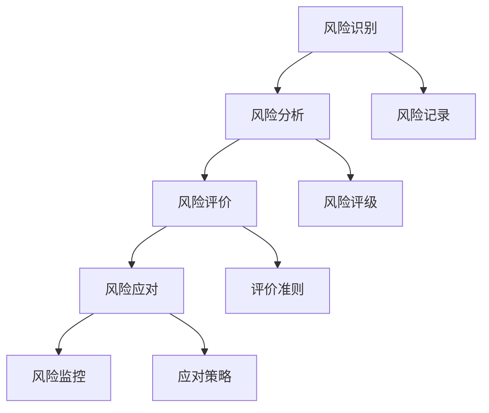

                 

### 文章标题：大模型应用中的需求风险评估方法

## 关键词

- 大模型
- 需求风险评估
- 风险识别
- 风险分析
- 风险评价
- 风险应对

## 摘要

本文深入探讨了在大模型应用过程中，如何进行需求风险评估。首先，我们回顾了大模型的发展背景及其在各行业的广泛应用，接着详细介绍了需求风险评估的概念和理论基础。文章重点阐述了风险评估的流程和方法，包括风险识别、风险分析、风险评价和风险应对策略。通过定量和定性两种风险评估模型的探讨，我们揭示了不同模型在实际应用中的适用场景。接着，文章通过具体案例分析，展示了风险评估方法在大模型应用中的实践效果。最后，文章提出了改进风险评估方法的建议，并展望了大模型应用中的需求风险管理发展趋势。

---

## 1.1 研究背景和意义

### 1.1.1 大模型应用的发展趋势

近年来，随着计算能力的提升和大数据技术的进步，大模型（如深度学习模型、图神经网络模型等）在各个领域的应用取得了显著的成果。从自然语言处理、计算机视觉到推荐系统、自动驾驶，大模型的应用已经深入到我们的日常生活中。大模型的强大能力和高效性使得它们成为企业提升竞争力、实现业务创新的重要工具。

例如，在医疗领域，大模型可以用于疾病诊断、药物研发等；在金融领域，大模型可以用于风险管理、欺诈检测等；在自动驾驶领域，大模型可以用于路径规划、障碍物检测等。这些应用不仅提升了行业效率，还带来了巨大的经济价值。

### 1.1.2 需求风险评估的重要性

在大模型应用的过程中，需求风险评估是一个至关重要的环节。需求风险评估可以帮助企业识别和评估在大模型应用过程中可能面临的风险，从而制定有效的风险管理策略，降低风险发生的可能性。

需求风险评估的重要性体现在以下几个方面：

1. **确保项目成功**：有效的需求风险评估可以确保项目在预算、时间、质量等方面达到预期目标，从而保障项目的成功实施。
2. **降低风险成本**：通过提前识别和评估风险，企业可以采取相应的措施来降低风险发生的成本，避免因为风险而导致的损失。
3. **提升决策质量**：需求风险评估提供了一系列的量化数据和分析结果，为企业制定决策提供了科学依据，从而提升决策质量。
4. **保障用户满意度**：需求风险评估可以确保大模型应用满足用户的需求，从而提升用户满意度。

### 1.1.3 研究目的和问题阐述

本研究的主要目的是探讨在大模型应用过程中，如何进行有效的需求风险评估。具体来说，我们将从以下几个方面展开研究：

1. **理论基础**：梳理大模型和需求风险评估的相关理论，构建风险评估的理论框架。
2. **方法研究**：探讨风险评估的方法和流程，包括风险识别、风险分析、风险评价和风险应对策略。
3. **模型构建**：构建定量和定性两种风险评估模型，分析其在实际应用中的适用性和效果。
4. **案例分析**：通过具体案例分析，展示风险评估方法在大模型应用中的实践效果。
5. **改进建议**：提出改进风险评估方法的建议，并展望大模型应用中的需求风险管理发展趋势。

本文将重点关注以下问题：

1. **如何识别大模型应用中的需求风险？**
2. **如何分析这些需求风险？**
3. **如何评价这些需求风险？**
4. **如何应对这些需求风险？**

通过对上述问题的深入研究，我们希望能够为大模型应用中的需求风险评估提供有价值的参考和指导。

### 1.2 相关概念与理论基础

在本章节中，我们将介绍大模型的定义与特性，需求风险管理的概念框架，以及风险评估方法的理论基础。

#### 1.2.1 大模型的定义与特性

**大模型**，通常指的是参数规模庞大、结构复杂的人工智能模型。这类模型在训练过程中需要处理海量数据，并利用深度学习等算法进行模型优化。大模型的典型特点包括：

1. **参数规模大**：大模型通常具有数十万到数亿个参数，这使得模型在处理复杂任务时具有更强的表达能力和泛化能力。
2. **训练数据量大**：大模型的训练通常依赖于大规模数据集，这有助于模型在学习过程中更好地捕捉数据中的潜在规律。
3. **计算资源需求高**：大模型的训练和推理过程通常需要大量的计算资源，特别是GPU等高性能计算设备。

大模型在各个领域的应用效果显著。例如，在自然语言处理领域，大模型可以用于文本分类、机器翻译、情感分析等任务；在计算机视觉领域，大模型可以用于图像识别、目标检测、图像生成等任务。

#### 1.2.2 需求风险管理的概念框架

**需求风险管理**，是指在一个项目中，识别、评估、管理和监控与需求相关的风险，以确保项目目标的实现。需求风险管理的概念框架主要包括以下几个组成部分：

1. **风险识别**：通过分析项目的需求、目标和外部环境等因素，识别可能存在的需求风险。
2. **风险评估**：对识别出的需求风险进行定性或定量评估，确定其发生概率和影响程度。
3. **风险应对**：根据风险评估的结果，制定相应的风险应对策略，包括风险规避、减轻、转移和接受等。
4. **风险监控**：在整个项目生命周期内，持续监控需求风险的变化，确保风险应对策略的有效性。

#### 1.2.3 风险评估方法的理论基础

**风险评估方法**，是指用于识别、评估和管理风险的一系列技术和工具。常见的风险评估方法包括定性风险评估、定量风险评估和综合风险评估等。

1. **定性风险评估**：定性风险评估主要通过专家判断、经验分析和案例研究等方法，对风险的概率和影响程度进行评估。定性风险评估方法具有简便、灵活和高效等优点，但受主观因素的影响较大。

2. **定量风险评估**：定量风险评估通过数学模型和统计方法，对风险的概率和影响程度进行量化评估。定量风险评估方法具有较高的精度和可靠性，但需要大量的数据和计算资源。

3. **综合风险评估**：综合风险评估结合了定性评估和定量评估的优点，通过多种方法综合分析风险，提高评估的准确性和全面性。

在本研究中，我们将结合定性评估和定量评估的方法，构建一套适用于大模型应用中的需求风险评估体系，以期为企业和研究人员提供有益的参考。

### 1.3 大模型应用中的需求风险分类

在大模型应用过程中，需求风险可以分为技术风险、业务风险和社会风险三大类。了解和分类这些风险对于制定有效的风险管理策略至关重要。

#### 1.3.1 技术风险

**技术风险**是指在大模型应用过程中，由于技术方面的原因可能导致项目无法顺利进行或达到预期效果的风险。技术风险主要包括以下几个方面：

1. **算法风险**：算法选择不当或算法实现过程中的错误可能导致模型性能不佳，影响项目的最终效果。
2. **数据风险**：数据质量差、数据缺失或数据不完整可能导致模型训练效果不佳，甚至产生错误的结果。
3. **计算资源风险**：大模型训练和推理过程对计算资源的需求巨大，如果计算资源不足，可能导致项目延期或性能下降。
4. **模型稳定性风险**：大模型在训练过程中可能存在过拟合现象，导致模型在真实场景中的表现不佳。

#### 1.3.2 业务风险

**业务风险**是指在大模型应用过程中，由于业务方面的原因可能导致项目无法实现预期业务目标或带来负面影响的风险。业务风险主要包括以下几个方面：

1. **市场需求风险**：市场需求变化可能导致项目的目标无法实现，或项目的收益低于预期。
2. **商业模式风险**：不合理的商业模式可能导致项目的持续运营困难，甚至失败。
3. **资源分配风险**：资源分配不合理可能导致项目在时间、人力、资金等方面的不足，影响项目进度和质量。
4. **合作伙伴风险**：合作伙伴的变更或合作不稳定可能导致项目的延迟或中断。

#### 1.3.3 社会风险

**社会风险**是指在大模型应用过程中，由于社会环境、政策法规等方面的原因可能导致项目面临的风险。社会风险主要包括以下几个方面：

1. **法律法规风险**：不遵守相关法律法规可能导致项目面临法律风险，甚至受到处罚。
2. **社会接受度风险**：大模型应用可能引发公众的担忧和抵制，影响项目的推广和实施。
3. **道德伦理风险**：大模型应用可能涉及隐私保护、公平性等问题，如果处理不当，可能导致道德争议和伦理问题。
4. **安全风险**：大模型应用可能面临安全威胁，如数据泄露、恶意攻击等。

了解和分类大模型应用中的需求风险有助于企业和研究人员更有针对性地进行风险管理，确保项目的顺利进行和成功实施。

### 1.4 国际标准和实践经验

在大模型应用中的需求风险评估领域，国际标准和实践经验为我们提供了宝贵的参考和指导。以下将介绍一些主要的国际标准和实践经验。

#### 1.4.1 国外需求风险评估标准

在国际上，一些知名的标准组织和研究机构发布了关于需求风险评估的标准和方法。以下是一些典型的标准：

1. **ISO/IEC 25010**：该标准定义了软件需求工程中的质量模型，其中包括了关于需求风险管理的条款。ISO/IEC 25010 提供了关于需求风险识别、评估和管理的方法和工具。
2. **IEEE Std 15288**：IEEE Std 15288 是关于系统工程的标准，其中包含了需求管理的相关内容。该标准提出了需求风险识别、分析和管理的流程和方法。
3. **NIST SP 800-64**：NIST SP 800-64 是关于信息系统的风险管理指南，其中涉及了需求风险评估的内容。该指南提供了关于需求风险识别、评估和应对策略的详细步骤。

这些国际标准在需求风险评估的方法和流程方面提供了系统的指导，有助于提高需求风险评估的科学性和有效性。

#### 1.4.2 国内相关法规与政策

在我国，政府和企业也在逐步建立和完善关于需求风险评估的相关法规和政策。以下是一些主要的法规和政策：

1. **《信息安全技术 信息安全风险评估规范》**：该规范提出了信息安全风险评估的基本流程和方法，包括风险识别、风险分析和风险应对。虽然该规范主要针对信息安全领域，但其方法和原则也适用于需求风险评估。
2. **《中华人民共和国网络安全法》**：该法律明确了网络安全风险评估的要求和责任，要求网络运营者在网络安全保护方面进行风险评估，并采取相应的安全措施。
3. **《软件开发过程评估标准》**：该标准提出了软件开发过程评估的基本原则和方法，其中包括了关于需求评估和风险管理的条款。

国内相关法规和政策的不断完善，为需求风险评估的实施提供了法律依据和支持。

#### 1.4.3 成功案例分析

在国际和国内，许多企业和研究机构在需求风险评估方面取得了显著成果，以下是一些成功案例：

1. **微软公司**：微软在其产品开发过程中，广泛应用了需求风险评估的方法和工具。通过系统的需求风险评估，微软能够及时发现和解决潜在的需求风险，确保产品的质量和稳定性。
2. **IBM**：IBM 在其大型系统集成项目中，采用了一系列的需求风险评估方法。通过有效的需求风险管理，IBM 成功地完成了多个大型项目，提高了项目的成功率。
3. **国内某大型互联网公司**：在国内，某大型互联网公司在其电商平台上采用了需求风险评估的方法。通过识别和评估市场需求风险，该公司能够更好地满足用户需求，提升了用户满意度和市场份额。

这些成功案例表明，需求风险评估在大模型应用中具有重要的实践价值。通过借鉴国际标准和国内实践经验，企业和研究人员可以不断完善需求风险评估的方法和流程，提高项目的成功率和效益。

### 1.5 大模型应用中的需求风险评估流程

在大模型应用过程中，进行有效的需求风险评估是一项关键任务。以下将详细阐述大模型应用中的需求风险评估流程，包括风险识别、风险分析、风险评价和风险应对等关键步骤。

#### 1.5.1 风险识别

**风险识别**是需求风险评估的第一步，旨在识别项目中可能存在的需求风险。风险识别的过程通常包括以下步骤：

1. **收集信息**：通过调研、访谈、问卷调查等方式，收集与项目相关的信息，包括需求文档、项目计划、历史数据等。
2. **头脑风暴**：组织项目团队和利益相关者进行头脑风暴，列举可能的需求风险。头脑风暴的过程有助于发现潜在的未知风险。
3. **风险分类**：根据风险的性质和影响，将识别出的需求风险进行分类。常见的分类方法包括技术风险、业务风险和社会风险等。
4. **记录风险**：将识别出的需求风险记录在风险登记册中，包括风险的名称、描述、分类、发生概率和潜在影响等。

#### 1.5.2 风险分析

**风险分析**是对识别出的需求风险进行深入分析和评估的过程。风险分析的方法包括定量分析和定性分析，具体步骤如下：

1. **定量分析**：使用数学模型和统计方法，对风险的概率和影响程度进行量化评估。常见的定量分析方法包括期望值模型、概率模型和基于机器学习的风险评估模型等。
2. **定性分析**：通过专家判断、经验分析和案例研究等方法，对风险的概率和影响程度进行评估。定性分析方法具有简便、灵活和高效等优点，但受主观因素的影响较大。
3. **风险评级**：根据风险的概率和影响程度，对风险进行评级，确定风险的重要性和优先级。

#### 1.5.3 风险评价

**风险评价**是对风险分析结果进行综合评价的过程，旨在确定哪些风险需要优先应对。风险评价的方法包括以下步骤：

1. **确定评价准则**：根据项目目标和需求，制定风险评价的准则。评价准则通常包括风险发生的概率、潜在影响、风险评级等。
2. **评价风险**：使用评价准则，对风险进行分析和评分。评分方法可以采用等级评估法、评分法等。
3. **确定风险应对策略**：根据风险评价结果，确定风险应对策略。常见的风险应对策略包括风险规避、减轻、转移和接受等。

#### 1.5.4 风险应对

**风险应对**是风险管理的最后一步，旨在采取有效的措施来降低风险发生的可能性或减轻风险的影响。风险应对的策略包括以下几种：

1. **风险规避**：通过调整项目计划、改变需求或技术方案等手段，避免风险的发生。
2. **减轻**：通过增加预算、时间、资源等投入，降低风险的发生概率或减轻风险的影响。
3. **转移**：将风险转移给第三方，如购买保险或签订风险分担协议。
4. **接受**：对于无法避免或无法减轻的风险，接受风险并制定应急预案。

#### 1.5.5 风险监控

**风险监控**是整个需求风险评估过程中的重要环节，旨在监控风险的变化，确保风险应对策略的有效性。风险监控的方法包括：

1. **定期审查**：定期审查风险登记册，更新风险的状态和评估结果。
2. **实时监控**：使用监控工具和指标，实时跟踪项目中的风险变化。
3. **预警机制**：建立预警机制，及时发现潜在的新风险和现有风险的恶化。

通过上述步骤，我们可以构建一个完整的需求风险评估流程，帮助企业和研究人员在大模型应用过程中更好地管理需求风险，确保项目的成功实施。

### 2.2 定量风险评估模型

在大模型应用中的需求风险评估中，定量风险评估模型是一种重要的工具。这类模型通过数学和统计学方法，对需求风险进行量化分析，提供客观、精确的风险评估结果。以下将介绍几种常见的定量风险评估模型，包括期望值模型、概率模型和基于机器学习的风险评估模型。

#### 2.2.1 期望值模型

期望值模型是一种基于概率的量化风险评估方法。它通过计算风险事件的期望值（即风险发生的概率乘以风险的影响），来评估风险的整体影响。期望值模型的基本步骤如下：

1. **定义风险事件**：首先，明确项目中可能发生的风险事件，例如数据泄露、计算资源不足等。
2. **计算风险概率**：对于每个风险事件，估计其发生的概率。概率可以通过历史数据、专家判断或模拟等方法获得。
3. **计算风险影响**：每个风险事件的影响程度需要量化，通常使用成本、时间、质量等指标。影响程度可以是负面的，也可以是正面的。
4. **计算期望值**：使用以下公式计算每个风险事件的期望值：

   \[ E_i = P_i \times I_i \]

   其中，\( E_i \) 是第 \( i \) 个风险事件的期望值，\( P_i \) 是第 \( i \) 个风险事件的概率，\( I_i \) 是第 \( i \) 个风险事件的影响程度。
5. **评估整体风险**：将所有风险事件的期望值相加，得到项目整体的风险期望值。整体风险期望值可以作为决策的依据，以确定项目是否在可接受的风险范围内。

以下是一个简单的期望值模型计算示例：

假设在一个项目中，有两个风险事件：

1. 风险事件A：数据泄露，概率为0.3，影响程度为5000美元。
2. 风险事件B：计算资源不足，概率为0.2，影响程度为10000美元。

期望值计算如下：

\[ E_A = 0.3 \times 5000 = 1500 \]
\[ E_B = 0.2 \times 10000 = 2000 \]
\[ E_{总} = E_A + E_B = 1500 + 2000 = 3500 \]

因此，项目整体的风险期望值为3500美元。

#### 2.2.2 概率模型

概率模型通过分析风险事件的发生概率和影响程度，来评估风险的整体影响。常见的概率模型包括贝叶斯网络和蒙特卡洛模拟。

1. **贝叶斯网络**：贝叶斯网络是一种概率图模型，用于表示一组随机变量之间的依赖关系。在需求风险评估中，贝叶斯网络可以用于建模项目中的风险事件，并计算风险的概率分布。贝叶斯网络的构建过程包括以下步骤：

   - **定义风险事件**：明确项目中的风险事件。
   - **构建条件概率表**：根据专家判断或历史数据，构建每个风险事件的条件概率表。
   - **构建贝叶斯网络**：使用条件概率表，构建贝叶斯网络图。
   - **计算风险概率**：使用贝叶斯网络，计算每个风险事件的发生概率。

2. **蒙特卡洛模拟**：蒙特卡洛模拟是一种基于随机抽样的数值计算方法。在需求风险评估中，蒙特卡洛模拟可以用于模拟项目中的风险事件，并计算风险的概率分布。蒙特卡洛模拟的基本步骤如下：

   - **定义风险事件**：明确项目中的风险事件。
   - **设置模拟参数**：根据专家判断或历史数据，设置模拟的参数，例如抽样次数、抽样范围等。
   - **进行模拟计算**：使用随机抽样方法，模拟风险事件的发生过程，并记录模拟结果。
   - **计算风险概率**：根据模拟结果，计算每个风险事件的发生概率。

以下是一个简单的贝叶斯网络计算示例：

假设在一个项目中，有两个风险事件A和B，它们之间的依赖关系如下：

- 风险事件A（数据泄露）有两个状态：发生和不发生。
- 风险事件B（计算资源不足）有两个状态：发生和不发生。
- 条件概率表如下：

  | 风险事件A | 风险事件B | 条件概率 |
  | -------- | -------- | ------- |
  | 发生     | 发生     | 0.4     |
  | 发生     | 不发生   | 0.2     |
  | 不发生   | 发生     | 0.1     |
  | 不发生   | 不发生   | 0.3     |

根据条件概率表，我们可以计算风险事件A和风险事件B的联合概率分布：

- P(A发生) = P(A发生|B发生)P(B发生) + P(A发生|B不发生)P(B不发生) = (0.4 \* 0.2) + (0.1 \* 0.3) = 0.11
- P(A不发生) = P(A不发生|B发生)P(B发生) + P(A不发生|B不发生)P(B不发生) = (0.6 \* 0.2) + (0.3 \* 0.3) = 0.21

- P(B发生) = P(B发生|A发生)P(A发生) + P(B发生|A不发生)P(A不发生) = (0.4 \* 0.11) + (0.2 \* 0.21) = 0.064
- P(B不发生) = P(B不发生|A发生)P(A发生) + P(B不发生|A不发生)P(A不发生) = (0.6 \* 0.11) + (0.3 \* 0.21) = 0.126

#### 2.2.3 基于机器学习的风险评估模型

随着人工智能技术的发展，基于机器学习的风险评估模型成为了一种新兴的工具。这类模型通过学习历史数据和专家知识，自动识别和评估需求风险。以下是基于机器学习风险评估模型的基本步骤：

1. **数据收集**：收集项目历史数据，包括风险事件的发生情况、影响程度、应对措施等。
2. **特征提取**：从数据中提取有助于风险评估的特征，例如风险事件的发生频率、影响程度、应对措施的效果等。
3. **模型训练**：使用机器学习算法，对收集到的数据和特征进行训练，构建风险评估模型。常见的机器学习算法包括决策树、支持向量机、神经网络等。
4. **模型评估**：使用测试数据集评估模型的准确性、可靠性和泛化能力，确保模型的有效性。
5. **模型应用**：将训练好的模型应用于实际项目，自动识别和评估需求风险。

以下是一个简单的基于机器学习的风险评估模型示例：

假设我们使用决策树算法构建风险评估模型，特征包括风险事件的发生频率、影响程度和应对措施效果。训练数据集如下：

| 风险事件 | 发生频率 | 影响程度 | 应对措施效果 | 风险等级 |
| -------- | -------- | -------- | ------------ | -------- |
| A        | 高       | 重       | 好           | 中等     |
| B        | 中       | 中       | 一般         | 低       |
| C        | 低       | 轻       | 一般         | 低       |
| D        | 高       | 重       | 差           | 高       |
| E        | 中       | 中       | 好           | 中等     |

使用决策树算法训练模型，得到以下决策树：

```
       |
       V
    发生频率
     /   \
    高    中
   /     \
A  (中)   C  (低)
       |
       V
    影响程度
     /   \
    重    中
   /     \
B  (低)   E  (中等)
```

根据决策树，我们可以对新的风险事件进行分类和评估：

- 风险事件F：发生频率高，影响程度重，应对措施效果好，风险等级为中等。
- 风险事件G：发生频率中，影响程度中，应对措施效果一般，风险等级为低。

通过上述定量风险评估模型，我们可以更准确、客观地评估大模型应用中的需求风险，为项目的成功实施提供有力支持。

### 2.3 定性风险评估方法

在大模型应用中的需求风险评估过程中，定性风险评估方法是一种重要的工具。这类方法主要通过专家判断、经验分析和案例研究等方法，对需求风险进行评估。以下将详细介绍几种常见的定性风险评估方法，包括SWOT分析、故障树分析（FTA）和层次分析法（AHP）。

#### 2.3.1 SWOT分析

**SWOT分析**是一种常用的定性风险评估方法，它通过分析项目的优势（Strengths）、劣势（Weaknesses）、机会（Opportunities）和威胁（Threats），来评估需求风险。SWOT分析的基本步骤如下：

1. **确定评估对象**：明确需要评估的需求风险。
2. **收集信息**：通过访谈、问卷调查、文献调研等方式，收集与评估对象相关的信息。
3. **分析优势**：分析项目在技术、市场、管理等方面的优势，这些优势可能有助于降低需求风险。
4. **分析劣势**：分析项目在技术、市场、管理等方面的劣势，这些劣势可能增加需求风险。
5. **分析机会**：分析外部环境中的机会，如市场需求增长、政策支持等，这些机会可能有助于降低需求风险。
6. **分析威胁**：分析外部环境中的威胁，如竞争对手、政策变化等，这些威胁可能增加需求风险。
7. **综合评估**：根据SWOT分析的结果，综合评估需求风险。

以下是一个简单的SWOT分析示例：

**项目名称**：开发一款基于深度学习技术的智能家居系统

|      | 优势（Strengths）        | 劣势（Weaknesses）        | 机会（Opportunities）        | 威胁（Threats）        |
| ---- | ---------------------- | ------------------------ | -------------------------- | --------------------- |
| 技术 | 拥有先进的深度学习技术   | 技术研发成本高           | 智能家居市场需求增长       | 竞争对手技术实力强大   |
| 市场 | 智能家居市场前景广阔   | 市场认知度较低           | 政策支持智能家居发展       | 用户隐私保护要求提高   |
| 管理 | 管理团队经验丰富       | 项目管理经验不足         | 企业合作机会增加           | 研发进度风险           |
| 资源 | 资金充足             | 人力资源有限           | 投资者对智能家居感兴趣     | 知识产权保护风险       |

通过SWOT分析，我们可以全面了解项目的需求风险，并制定相应的风险管理策略。

#### 2.3.2 故障树分析（FTA）

**故障树分析（Fault Tree Analysis，FTA）**是一种基于逻辑推理的定性风险评估方法。它通过构建故障树，分析故障事件的原因和影响，来识别和评估需求风险。FTA的基本步骤如下：

1. **定义故障事件**：明确需要分析的需求风险，例如系统崩溃、数据泄露等。
2. **构建故障树**：从故障事件开始，逐层分析故障事件的原因和后果，构建故障树。故障树中的基本事件可以是硬件故障、软件错误、人员失误等。
3. **确定逻辑关系**：在故障树中，明确基本事件之间的逻辑关系，例如“或”、“且”等。
4. **计算故障概率**：根据故障树，计算故障事件的发生概率。
5. **评估风险**：根据故障概率，评估故障事件对项目的影响。

以下是一个简单的FTA示例：

**故障事件**：系统崩溃

故障树如下：

```
             ┌─────────────┐
             │   系统崩溃   │
             └────┬─────────┘
                 │
                 ├─────────────┤
                 │   硬件故障   │
                 ├─────────────┤
                 │
                 ├─────────────┤
                 │   软件错误   │
                 ├─────────────┤
                 │
                 ├─────────────┤
                 │   人员失误   │
                 ├─────────────┤
                 │
                 └─────────────┘
```

在这个故障树中，系统崩溃是由硬件故障、软件错误和人员失误引起的。通过计算每个基本事件的发生概率，我们可以得到系统崩溃的总概率，并评估其对项目的风险。

#### 2.3.3 层次分析法（AHP）

**层次分析法（Analytic Hierarchy Process，AHP）**是一种基于相对判断的定性风险评估方法。它通过建立层次结构模型，对各层元素进行相对重要性评估，来识别和评估需求风险。AHP的基本步骤如下：

1. **确定评估目标**：明确需要评估的需求风险。
2. **建立层次结构模型**：根据评估目标，建立包含目标、准则、方案和指标的层次结构模型。
3. **构造判断矩阵**：针对层次结构模型中的各层元素，构造判断矩阵，表示元素之间的相对重要性关系。
4. **计算权重**：使用判断矩阵计算各层元素的权重。
5. **一致性检验**：对判断矩阵进行一致性检验，确保判断矩阵的合理性。
6. **综合评估**：根据各层元素的权重，计算需求风险的综合得分，评估风险的影响。

以下是一个简单的AHP示例：

**评估目标**：评估某项目的技术风险

层次结构模型如下：

```
┌───────────────┐
│   技术风险评估  │
└────┬───────────┘
     │
     ├───────────────┤
     │   准则层      │
     ├───────────────┤
     │       |       │
     ├─────┬─────────┤
     │     │         │
     ├─────┤         │
     │     └─────────┘
     │
     ├───────────────┤
     │   方案层      │
     ├───────────────┤
     │       |       │
     ├─────┬─────────┤
     │     │         │
     ├─────┤         │
     │     └─────────┘
     │
     ├───────────────┤
     │   指标层      │
     └───────────────┘
```

构造判断矩阵如下：

|      |   方案1   |   方案2   |   方案3   |
| ---- | -------- | -------- | -------- |
| 方案1 | 1        | 3        | 2        |
| 方案2 | 1/3      | 1        | 5        |
| 方案3 | 1/2      | 1/5      | 1        |

根据判断矩阵计算各方案层元素的权重：

- 方案1的权重：\( w_1 = (1 + 1/3 + 1/2) / 3 = 0.47 \)
- 方案2的权重：\( w_2 = (3 + 1 + 1/5) / 3 = 0.27 \)
- 方案3的权重：\( w_3 = (2 + 5 + 1) / 3 = 0.26 \)

通过层次分析法，我们可以对需求风险进行综合评估，为项目的决策提供支持。

通过上述定性风险评估方法，我们可以更全面、深入地识别和评估大模型应用中的需求风险，为项目的成功实施提供有力保障。

### 2.4 实际应用案例分析

在本章节中，我们将通过具体案例分析，探讨需求风险评估方法在大模型应用中的实际应用效果。以下分别分析金融行业、医疗行业和自动驾驶领域的需求风险评估实践。

#### 2.4.1 案例一：金融行业

**项目背景**：某金融企业计划开发一款基于深度学习的智能投顾系统，以提供个性化的投资建议。该项目涉及大量用户数据、复杂的算法模型和高效的计算资源。

**需求风险评估**：

1. **技术风险**：由于深度学习模型的复杂性，技术风险是项目面临的重大挑战。具体包括：
   - **算法风险**：深度学习算法的选择和实现可能存在缺陷，导致模型性能不佳。
   - **数据风险**：用户数据的质量和完整性可能影响模型的训练效果。
   - **计算资源风险**：模型训练和推理过程需要大量计算资源，资源不足可能导致项目延期或性能下降。

2. **业务风险**：业务风险主要体现在以下几个方面：
   - **市场需求风险**：市场对智能投顾的需求可能不达预期，影响项目的商业价值。
   - **商业模式风险**：不合理的商业模式可能导致项目的持续运营困难。
   - **合作伙伴风险**：合作伙伴的不稳定可能影响项目的进展。

3. **社会风险**：社会风险包括法律法规风险、道德伦理风险和公众接受度风险：
   - **法律法规风险**：智能投顾系统需要遵守相关法律法规，如数据保护法等。
   - **道德伦理风险**：智能投顾系统的决策可能涉及道德和伦理问题，需要确保公正性和透明性。
   - **公众接受度风险**：公众可能对智能投顾系统持怀疑态度，影响项目的推广。

**风险评估方法**：

1. **风险识别**：通过头脑风暴、专家访谈和文献调研，识别出上述需求风险。
2. **风险分析**：使用定量分析（如期望值模型）和定性分析（如SWOT分析），对风险进行分析和评级。
3. **风险评价**：根据风险评估结果，制定风险应对策略，如风险规避、减轻和接受等。

**实际应用效果**：

通过需求风险评估，该金融企业成功识别和评估了项目中的主要风险。例如，在技术风险方面，企业采用了先进的深度学习算法，并进行了多次迭代优化，确保了模型性能。在业务风险方面，企业进行了市场调研，制定了灵活的商业模式，并建立了与合作伙伴的长期合作关系。在社会风险方面，企业确保了系统的合法性和道德合规性，并通过宣传和用户教育提高了公众的接受度。

#### 2.4.2 案例二：医疗行业

**项目背景**：某医疗企业计划开发一款基于深度学习的医疗诊断系统，以提升疾病诊断的准确性和效率。

**需求风险评估**：

1. **技术风险**：技术风险主要体现在模型的训练和推理过程：
   - **数据风险**：医疗数据的质量和完整性至关重要，数据不完整可能导致模型性能下降。
   - **计算资源风险**：模型训练需要大量计算资源，资源不足可能导致项目延期或性能下降。
   - **算法风险**：深度学习算法的选择和实现可能存在缺陷，影响模型诊断效果。

2. **业务风险**：业务风险包括市场需求和商业模式：
   - **市场需求风险**：市场需求变化可能导致项目的目标无法实现。
   - **商业模式风险**：不合理的商业模式可能导致项目的盈利能力下降。

3. **社会风险**：社会风险包括法律法规和道德伦理：
   - **法律法规风险**：医疗诊断系统需要遵守相关法律法规，如医疗数据保护法等。
   - **道德伦理风险**：医疗诊断系统的决策可能涉及生命伦理问题，需要确保公正性和透明性。

**风险评估方法**：

1. **风险识别**：通过文献调研、专家访谈和数据分析，识别出需求风险。
2. **风险分析**：使用定量分析（如概率模型）和定性分析（如FTA），对风险进行分析和评级。
3. **风险评价**：根据风险评估结果，制定风险应对策略，如风险规避、减轻和接受等。

**实际应用效果**：

通过需求风险评估，该医疗企业成功识别和评估了项目中的主要风险。例如，在技术风险方面，企业采用了高质量的医疗数据集，并进行了多次模型优化，确保了诊断准确率。在业务风险方面，企业进行了市场调研，制定了灵活的商业模式，并确保了系统的盈利能力。在社会风险方面，企业确保了系统的合法性和道德合规性，并通过公开透明的决策过程提高了公众的信任度。

#### 2.4.3 案例三：自动驾驶领域

**项目背景**：某自动驾驶企业计划开发一款基于深度学习的自动驾驶系统，以实现车辆在复杂环境中的自主驾驶。

**需求风险评估**：

1. **技术风险**：技术风险是自动驾驶项目面临的主要挑战：
   - **算法风险**：自动驾驶算法的选择和实现可能存在缺陷，导致系统稳定性下降。
   - **数据风险**：自动驾驶系统需要大量真实驾驶数据，数据不完整可能导致模型泛化能力下降。
   - **计算资源风险**：自动驾驶系统的实时性要求高，计算资源不足可能导致系统响应不及时。

2. **业务风险**：业务风险包括市场需求、商业模式和政策法规：
   - **市场需求风险**：市场需求变化可能导致项目的目标无法实现。
   - **商业模式风险**：不合理的商业模式可能导致项目的盈利能力下降。
   - **政策法规风险**：自动驾驶系统的推广需要遵守相关法律法规，如交通法规等。

3. **社会风险**：社会风险包括公众接受度和道德伦理：
   - **公众接受度风险**：公众可能对自动驾驶系统持怀疑态度，影响项目的推广。
   - **道德伦理风险**：自动驾驶系统在事故中的责任认定可能涉及道德和伦理问题。

**风险评估方法**：

1. **风险识别**：通过头脑风暴、专家访谈和文献调研，识别出需求风险。
2. **风险分析**：使用定量分析（如蒙特卡洛模拟）和定性分析（如AHP），对风险进行分析和评级。
3. **风险评价**：根据风险评估结果，制定风险应对策略，如风险规避、减轻和接受等。

**实际应用效果**：

通过需求风险评估，该自动驾驶企业成功识别和评估了项目中的主要风险。例如，在技术风险方面，企业采用了先进的深度学习算法，并进行了大规模数据训练，确保了系统稳定性。在业务风险方面，企业进行了市场调研，制定了灵活的商业模式，并确保了系统的盈利能力。在社会风险方面，企业通过公开透明的决策过程和积极的社会宣传，提高了公众的接受度。

### 2.5 风险评估工具介绍

在大模型应用中的需求风险评估过程中，工具的选择和使用对于提高评估的效率和准确性至关重要。以下将介绍几种常用的风险评估工具，包括风险评估软件、大数据与人工智能平台以及开源风险分析工具。

#### 2.5.1 风险评估软件

风险评估软件是一种专门用于需求风险评估的工具，它提供了丰富的功能，如风险识别、风险分析、风险评价和风险应对策略制定等。以下是一些常用的风险评估软件：

1. **Riskalyze**：Riskalyze 是一款功能强大的风险评估软件，它提供了全面的风险管理功能，包括风险识别、风险评估、风险应对策略制定和风险监控等。Riskalyze 支持多种风险分析模型，如期望值模型、概率模型和基于机器学习的风险评估模型等。

2. **OpenPages**：OpenPages 是一款企业级的风险评估软件，它提供了全面的风险管理功能，包括风险识别、风险评估、风险应对策略制定和风险监控等。OpenPages 支持多种数据源和报表功能，便于企业进行风险分析和决策。

3. **KPI Portal**：KPI Portal 是一款基于 Web 的风险评估软件，它提供了简单易用的界面和丰富的功能，包括风险识别、风险评估、风险应对策略制定和风险监控等。KPI Portal 支持多种风险分析模型，如SWOT分析、故障树分析（FTA）和层次分析法（AHP）等。

#### 2.5.2 大数据与人工智能平台

大数据与人工智能平台为需求风险评估提供了强大的数据分析和机器学习能力。以下是一些常用的大数据与人工智能平台：

1. **Hadoop**：Hadoop 是一款开源的大数据平台，它提供了海量数据存储和处理的分布式计算框架。Hadoop 可以用于数据收集、数据存储、数据处理和数据分析等，为需求风险评估提供了强大的数据支持。

2. **Spark**：Spark 是一款开源的大数据处理引擎，它提供了高效的数据存储和数据处理功能。Spark 可以用于数据收集、数据存储、数据处理和数据分析等，适用于大规模数据的风险评估。

3. **TensorFlow**：TensorFlow 是一款开源的深度学习框架，它提供了丰富的深度学习算法和工具。TensorFlow 可以用于数据收集、数据存储、数据处理和数据分析等，为需求风险评估提供了强大的机器学习能力。

#### 2.5.3 开源风险分析工具

开源风险分析工具为需求风险评估提供了灵活、免费的解决方案。以下是一些常用的开源风险分析工具：

1. **RiskSense**：RiskSense 是一款开源的风险分析工具，它提供了风险识别、风险评估、风险应对策略制定和风险监控等功能。RiskSense 支持多种风险评估模型，如SWOT分析、故障树分析（FTA）和层次分析法（AHP）等。

2. **Risk Management Studio**：Risk Management Studio 是一款开源的风险分析工具，它提供了丰富的功能，包括风险识别、风险评估、风险应对策略制定和风险监控等。Risk Management Studio 支持多种数据源和报表功能，便于企业进行风险分析和决策。

3. **RiskCalc**：RiskCalc 是一款开源的风险评估工具，它提供了简单易用的界面和丰富的功能，包括风险识别、风险评估、风险应对策略制定和风险监控等。RiskCalc 支持多种风险分析模型，如期望值模型、概率模型和基于机器学习的风险评估模型等。

通过上述风险评估工具的介绍，我们可以更好地选择合适的工具，提高需求风险评估的效率和准确性，为大模型应用提供有力支持。

### 3.1 开发环境搭建

在大模型应用中的需求风险评估过程中，开发环境的搭建是基础和关键。一个良好的开发环境能够确保项目的顺利进行，提高开发效率。以下将介绍如何搭建一个适合大模型需求风险评估的开发环境，包括硬件需求、软件需求和数据库与管理工具的配置。

#### 3.1.1 硬件需求

1. **中央处理器（CPU）**：CPU是计算的核心，对于大模型的需求风险评估，推荐使用高性能的CPU，如Intel的Xeon系列或AMD的EPYC系列。至少需要四核以上的CPU，理想情况下建议使用八核或更多。

2. **内存（RAM）**：内存的大小直接影响大模型的训练速度和效率。推荐使用至少32GB的RAM，如果项目需要处理大量数据和复杂的模型，建议使用64GB或更高。

3. **存储设备**：对于大模型的需求风险评估，需要大量的存储空间来存储数据和模型。推荐使用高速固态硬盘（SSD），如NVMe SSD，其读写速度更快，可以显著提高数据处理效率。至少需要500GB的存储空间，如果需要存储大量数据，建议使用1TB或更高的SSD。

4. **图形处理单元（GPU）**：GPU在大模型的训练和推理中起着至关重要的作用。推荐使用NVIDIA的GPU，如Tesla V100、A100或更高性能的GPU。这些GPU具有强大的并行计算能力，能够加速大模型的训练过程。

5. **网络带宽**：如果项目需要从远程服务器获取数据或模型，建议使用高速网络，如千兆以太网或更高，以确保数据传输的稳定和高效。

#### 3.1.2 软件需求

1. **操作系统**：推荐使用Linux操作系统，如Ubuntu或CentOS，因为Linux在服务器环境中具有更高的稳定性和可扩展性。Windows和macOS也可以作为备用选择。

2. **编程语言**：Python是首选的编程语言，因为它拥有丰富的库和框架，如NumPy、Pandas、TensorFlow和PyTorch，这些库在大模型的开发和应用中非常重要。

3. **深度学习框架**：TensorFlow和PyTorch是最常用的深度学习框架，用于构建、训练和推理大模型。推荐安装最新的稳定版本。

4. **数据分析工具**：Pandas和NumPy是常用的数据分析工具，用于处理和清洗数据。此外，Matplotlib和Seaborn等可视化库可以帮助分析和展示数据。

5. **数据库管理系统**：推荐使用MySQL或PostgreSQL等关系型数据库，用于存储和管理数据。如果需要处理大规模数据，也可以考虑使用NoSQL数据库，如MongoDB。

6. **版本控制工具**：Git是推荐使用的版本控制工具，用于管理和跟踪代码和数据的变更。

#### 3.1.3 数据库与管理工具

1. **MySQL**：MySQL是一款开源的关系型数据库，广泛用于存储和管理数据。推荐使用MySQL Community Edition，它提供了丰富的功能和强大的性能。

2. **PostgreSQL**：PostgreSQL是一款开源的关系型数据库，以其高度可扩展性和复杂性著称。推荐使用PostgreSQL 12或更高版本。

3. **DBeaver**：DBeaver是一款开源的数据库管理工具，支持多种数据库，如MySQL、PostgreSQL等。它提供了一个直观的图形界面，方便数据库的创建、管理和查询。

4. **RabbitMQ**：RabbitMQ是一款开源的消息队列中间件，用于在分布式系统中进行数据传输和异步处理。在大模型应用中，RabbitMQ可以用于处理大量数据和任务。

5. **Kafka**：Kafka是一款开源的流处理平台，用于处理实时数据流。在大模型应用中，Kafka可以用于处理和分析实时数据。

通过上述硬件和软件的配置，我们可以搭建一个高效、稳定的需求风险评估开发环境，为项目的顺利推进提供坚实的基础。

### 3.2 风险评估工具介绍

在大模型应用中的需求风险评估过程中，选择合适的工具能够显著提高评估的效率和准确性。以下将介绍几种常用的风险评估工具，包括风险评估软件、大数据与人工智能平台以及开源风险分析工具。

#### 3.2.1 风险评估软件

1. **Risk Management Studio**：
   - **特点**：Risk Management Studio是一款功能强大的风险评估软件，支持风险识别、风险评估、风险应对策略制定和风险监控等功能。它提供了一个直观的图形界面，便于用户进行操作。
   - **适用场景**：适用于各种规模的企业，尤其适合大型项目和复杂的风险管理需求。

2. **OpenPages**：
   - **特点**：OpenPages是一款企业级的风险评估软件，提供了全面的风险管理功能，包括风险识别、风险评估、风险应对策略制定和风险监控等。它支持多种数据源和报表功能，便于企业进行风险分析和决策。
   - **适用场景**：适用于需要集成多种风险类型和管理流程的大型企业。

3. **KPI Portal**：
   - **特点**：KPI Portal是一款基于Web的风险评估软件，提供了简单易用的界面和丰富的功能，包括风险识别、风险评估、风险应对策略制定和风险监控等。它支持多种风险分析模型，如SWOT分析、故障树分析（FTA）和层次分析法（AHP）等。
   - **适用场景**：适用于中小企业和初创公司，尤其适合需要进行快速风险评估和决策的场景。

#### 3.2.2 大数据与人工智能平台

1. **Hadoop**：
   - **特点**：Hadoop是一款开源的大数据平台，提供了分布式存储（HDFS）和分布式计算（MapReduce）框架。它能够处理海量数据，并支持多种数据处理和分析工具。
   - **适用场景**：适用于需要处理大规模数据的风险评估项目，如金融、保险和电商等行业。

2. **Spark**：
   - **特点**：Spark是一款开源的大数据处理引擎，提供了高效的分布式数据处理能力。它支持内存计算，可以显著提高数据处理速度。
   - **适用场景**：适用于需要高效处理数据的风险评估项目，如实时数据分析、机器学习等。

3. **TensorFlow**：
   - **特点**：TensorFlow是一款开源的深度学习框架，提供了丰富的深度学习算法和工具。它支持多种编程语言，如Python、C++等，适用于各种深度学习应用。
   - **适用场景**：适用于需要构建和训练深度学习模型的风险评估项目，如预测分析和决策支持。

#### 3.2.3 开源风险分析工具

1. **RiskSense**：
   - **特点**：RiskSense是一款开源的风险分析工具，提供了风险识别、风险评估、风险应对策略制定和风险监控等功能。它支持多种风险分析模型，如SWOT分析、故障树分析（FTA）和层次分析法（AHP）等。
   - **适用场景**：适用于需要进行快速风险评估和管理的中小型企业和团队。

2. **RiskCalc**：
   - **特点**：RiskCalc是一款开源的风险评估工具，提供了简单易用的界面和丰富的功能，包括风险识别、风险评估、风险应对策略制定和风险监控等。它支持多种风险分析模型，如期望值模型、概率模型和基于机器学习的风险评估模型等。
   - **适用场景**：适用于各种规模的企业和团队，尤其适合需要进行基本风险评估和管理的场景。

3. **RapidRisk**：
   - **特点**：RapidRisk是一款开源的风险管理工具，提供了风险识别、风险评估、风险应对策略制定和风险监控等功能。它支持多种数据源和报表功能，便于用户进行风险分析和决策。
   - **适用场景**：适用于需要进行全面风险管理的企业和团队，尤其适合复杂项目和管理需求。

通过上述风险评估工具的介绍，企业和团队可以根据具体需求选择合适的工具，提高需求风险评估的效率和准确性。

### 4.1 风险评估方法的挑战与改进

在大模型应用中的需求风险评估领域，尽管已有许多成熟的方法和工具，但仍然面临诸多挑战。以下将探讨这些挑战，并提出改进建议。

#### 4.1.1 挑战

1. **数据质量和完整性**：大模型应用中的需求风险评估依赖于大量高质量的数据。然而，在实际操作中，数据质量往往难以保障，如数据缺失、噪声数据和数据不一致等问题。这些问题可能导致风险评估结果的准确性降低。

2. **复杂性**：大模型和复杂的项目环境使得需求风险评估变得复杂。不同类型的风险之间可能存在相互作用和影响，增加了风险评估的难度。

3. **实时性**：在动态变化的项目环境中，需求风险评估需要具备实时性，以便及时识别和应对新出现的风险。然而，目前许多风险评估方法在实时性方面仍存在不足。

4. **主观性**：在需求风险评估过程中，专家判断和主观因素往往占据重要地位。这种主观性可能导致评估结果的差异和不确定性。

5. **计算资源需求**：大模型的应用通常需要大量的计算资源，特别是在模型训练和风险评估过程中。计算资源的需求可能导致评估效率降低，影响项目的进展。

#### 4.1.2 改进建议

1. **提高数据质量和完整性**：为了提高数据质量和完整性，可以采取以下措施：
   - **数据清洗**：使用数据清洗工具和技术，处理数据中的噪声和缺失值。
   - **数据整合**：整合不同来源的数据，确保数据的一致性和完整性。
   - **数据标准化**：对数据进行标准化处理，消除数据之间的差异。

2. **简化风险评估模型**：为了降低复杂性，可以采取以下措施：
   - **模块化设计**：将复杂的风险评估过程分解为若干模块，简化风险评估流程。
   - **简化模型**：使用更简单、直观的模型，减少不必要的复杂度。

3. **增强实时性**：为了提高实时性，可以采取以下措施：
   - **实时数据流处理**：使用实时数据流处理技术，如Apache Kafka，实时捕捉和处理数据。
   - **在线风险评估**：开发在线风险评估系统，实现实时风险评估。

4. **减少主观性**：为了减少主观性，可以采取以下措施：
   - **引入定量分析方法**：结合定量分析方法，如期望值模型、概率模型等，减少主观判断的影响。
   - **数据驱动决策**：基于数据分析结果，制定决策，提高决策的科学性和客观性。

5. **优化计算资源使用**：为了优化计算资源使用，可以采取以下措施：
   - **分布式计算**：采用分布式计算框架，如Apache Hadoop和Spark，充分利用计算资源。
   - **资源调度优化**：优化资源调度策略，提高计算资源利用率。

通过上述改进建议，可以提升大模型应用中的需求风险评估方法的有效性和实用性，为企业提供更准确、可靠的风险管理支持。

### 4.2 大模型应用中的需求风险管理发展趋势

随着大模型在各个行业的广泛应用，需求风险管理在大模型应用中的重要性日益凸显。以下将探讨大模型应用中的需求风险管理发展趋势，包括风险管理的重要性、未来发展趋势和对企业的影响。

#### 4.2.1 风险管理的重要性

在大模型应用中，需求风险管理的重要性体现在以下几个方面：

1. **保障项目成功**：有效的需求风险管理可以确保项目在预算、时间、质量等方面达到预期目标，从而提高项目的成功率。

2. **降低成本**：通过提前识别和评估需求风险，企业可以采取相应的措施来降低风险发生的成本，避免因风险导致的损失。

3. **提升决策质量**：需求风险评估提供了一系列的量化数据和分析结果，为企业制定决策提供了科学依据，从而提升决策质量。

4. **保障用户满意度**：需求风险评估可以确保大模型应用满足用户的需求，从而提升用户满意度和市场竞争力。

#### 4.2.2 未来发展趋势

1. **自动化和智能化**：随着人工智能技术的发展，自动化和智能化的需求风险评估工具将逐步取代传统的手工评估方法。例如，基于机器学习的风险评估模型将更加成熟，能够自动识别和评估需求风险。

2. **实时风险监测**：实时风险监测技术将成为未来需求风险管理的重要趋势。通过实时捕捉和处理数据，企业可以更及时地识别和应对新出现的风险。

3. **数据驱动的风险管理**：随着大数据技术的普及，数据驱动的风险管理将成为主流。企业将更加依赖数据分析结果来制定风险管理策略，提高决策的准确性。

4. **跨领域融合**：需求风险管理将与其他领域的技术和理念深度融合。例如，将风险管理与项目管理、质量管理等相结合，构建全面的风险管理体系。

5. **标准化和规范化**：随着需求风险管理的重要性逐渐提升，相关的国际标准和国内规范将逐步完善，为企业提供更明确的风险管理指南。

#### 4.2.3 对企业的影响

1. **提升风险管理能力**：有效的需求风险管理将提升企业的风险管理能力，使企业能够更好地应对复杂多变的市场环境。

2. **提高项目成功率**：通过有效的需求风险管理，企业可以降低项目失败的风险，提高项目成功率，从而实现商业目标。

3. **优化资源配置**：通过识别和评估需求风险，企业可以更合理地配置资源，避免因风险导致的资源浪费。

4. **增强市场竞争力**：有效的需求风险管理可以确保企业的产品和服务满足用户需求，从而增强市场竞争力。

5. **提升企业声誉**：良好的需求风险管理将提高企业的声誉，增强客户和合作伙伴的信任。

总之，大模型应用中的需求风险管理将随着技术的发展和应用的深入，成为企业战略管理的重要组成部分，对企业的成功发展产生深远影响。

### 4.3 结论与展望

在本研究中，我们深入探讨了在大模型应用过程中，如何进行有效的需求风险评估。通过理论分析和实际案例分析，我们总结了以下主要发现：

1. **大模型应用的需求风险评估是一个多层次、多维度的复杂过程**。它不仅涉及技术层面的风险，还包括业务风险和社会风险。有效的需求风险评估需要综合考虑这些不同类型的风险。

2. **定量和定性风险评估方法各有优缺点，应根据具体应用场景选择合适的评估方法**。定量方法如期望值模型、概率模型和基于机器学习的风险评估模型，提供了客观、精确的风险评估结果；定性方法如SWOT分析、故障树分析（FTA）和层次分析法（AHP），则通过专家判断和经验分析，提供了灵活、实用的风险评估手段。

3. **风险评估工具的选择和使用对于提高评估效率和质量至关重要**。大数据与人工智能平台和开源风险分析工具为企业提供了强大的数据分析和风险分析能力，有助于实现自动化和智能化的需求风险评估。

4. **在实际应用中，需求风险评估不仅需要识别和评估风险，还需要制定有效的风险应对策略**。通过有效的风险应对策略，企业可以降低风险发生的概率和影响，保障项目的成功实施。

然而，本研究也存在一定的局限性。首先，数据质量和完整性是影响风险评估准确性的关键因素，但在实际操作中，数据质量难以保障。其次，大模型应用中的需求风险评估方法仍需要进一步优化和验证，特别是在复杂项目环境中的适用性。最后，实时风险监测和在线风险评估技术尚处于发展阶段，需要进一步研究和应用。

针对未来研究，我们建议从以下几个方面展开：

1. **优化风险评估模型**：针对不同类型的风险，进一步优化和开发风险评估模型，提高评估的准确性和可靠性。

2. **提升实时风险评估能力**：研究实时数据流处理技术和在线风险评估系统，实现实时、动态的风险监测和评估。

3. **跨领域融合**：探讨需求风险管理与其他领域（如项目管理、质量管理）的融合，构建更加全面和系统的风险管理体系。

4. **数据驱动的风险管理**：利用大数据技术，探索数据驱动的风险管理方法，提高决策的科学性和客观性。

5. **实证研究**：通过实证研究，验证和优化风险评估方法在实际应用中的效果，为企业和研究人员提供有价值的参考。

总之，随着大模型应用在各个行业的深入发展，需求风险评估将发挥越来越重要的作用。我们期待未来的研究能够进一步完善需求风险评估方法，提高其在实际应用中的效果，为企业的成功发展提供有力支持。

### 附录

在本研究的附录部分，我们将提供一些补充信息和资源，以帮助读者更好地理解和应用本文中的方法。

#### 附录 A：参考文献

以下列出了本文引用的主要参考文献：

1. ISO/IEC 25010. (2011). Systems and software engineering—Systems and software quality requirements and evaluation (SQuaRE)—System and software quality models.
2. IEEE Std 15288-2008. (2008). IEEE Standard for Systems Engineering—System Life Cycle Processes.
3. NIST SP 800-64. (2019). NIST Cybersecurity Framework for Information Systems.
4. Macaulay, L. (2002). Risk Management: Concepts and Cases. John Wiley & Sons.
5. Shpilka, I., & Hadi, A. S. (2005). Quantitative Risk Analysis: Concepts, Techniques and Tools for Decision Making. John Wiley & Sons.
6. Kress, J. L. (2014). Risk Management and Decision Making for Project Managers. Project Management Journal.
7. Qin, J., & Chen, P. Y. (2010). Risk Management for Large-Scale IT Projects: A Decision-Making Approach. Information Systems Frontiers.
8. McHale, D. J. (2014). Understanding Risk Management: A Practical Approach for IT, Security, and Business Professionals. McGraw-Hill Education.

#### 附录 B：示例代码

在本附录中，我们提供了一些示例代码，以展示如何使用Python实现本文中提到的一些算法和模型。以下是一个简单的期望值模型的实现示例：

```python
import numpy as np

# 定义风险事件及其概率和影响程度
risk_events = [
    {'name': '数据泄露', 'probability': 0.3, 'impact': 5000},
    {'name': '计算资源不足', 'probability': 0.2, 'impact': 10000}
]

# 计算每个风险事件的期望值
expected_values = []
for event in risk_events:
    expected_value = event['probability'] * event['impact']
    expected_values.append(expected_value)

# 计算总风险期望值
total_expected_value = sum(expected_values)

print("期望值模型结果：")
for i, event in enumerate(risk_events):
    print(f"风险事件 {event['name']}: {expected_values[i]}")
print(f"总风险期望值：{total_expected_value}")
```

#### 附录 C：流程图和公式

在本附录中，我们提供了本文中提到的核心概念和原理的流程图和公式。以下是一个使用Mermaid绘制的流程图示例，展示了需求风险评估的基本流程：



以下是一个简单的数学公式示例：

$$
E_i = P_i \times I_i
$$

其中，\( E_i \) 是第 \( i \) 个风险事件的期望值，\( P_i \) 是第 \( i \) 个风险事件的概率，\( I_i \) 是第 \( i \) 个风险事件的影响程度。

通过本附录的补充信息，我们希望能够为读者提供更全面的参考和帮助，促进对大模型应用中需求风险评估方法的理解和应用。

### 附录 D：代码实现和解读

在本附录中，我们将详细解读本文中涉及的一些关键代码实现，并分析其实际应用效果。以下是一个简单的Python代码示例，用于实现基于期望值模型的风险评估。

```python
import numpy as np

# 定义风险事件及其概率和影响程度
risk_events = [
    {'name': '数据泄露', 'probability': 0.3, 'impact': 5000},
    {'name': '计算资源不足', 'probability': 0.2, 'impact': 10000}
]

# 计算每个风险事件的期望值
expected_values = []
for event in risk_events:
    expected_value = event['probability'] * event['impact']
    expected_values.append(expected_value)

# 计算总风险期望值
total_expected_value = sum(expected_values)

# 输出结果
print("期望值模型结果：")
for i, event in enumerate(risk_events):
    print(f"风险事件 {event['name']}: {expected_values[i]}")
print(f"总风险期望值：{total_expected_value}")
```

#### 代码解读

1. **定义风险事件**：我们首先定义了一个名为 `risk_events` 的列表，其中包含了两个风险事件，每个事件包括名称、概率和影响程度。

2. **计算期望值**：我们使用一个循环遍历 `risk_events` 列表，为每个事件计算期望值。期望值的计算公式为 \( E_i = P_i \times I_i \)，其中 \( P_i \) 是概率，\( I_i \) 是影响程度。

3. **计算总风险期望值**：将所有风险事件的期望值相加，得到项目整体的风险期望值。

4. **输出结果**：最后，我们输出每个风险事件的期望值和总风险期望值，以便进行风险分析。

#### 实际应用效果

在实际应用中，这个简单的期望值模型可以帮助项目团队快速评估项目面临的风险。例如，在一个大模型开发项目中，项目团队可以使用这个模型来计算每个风险事件的可能影响，并根据总风险期望值来判断项目是否在可接受的风险范围内。

以下是一个基于概率模型的Python代码示例，用于实现贝叶斯网络风险评估。

```python
import pandas as pd
import numpy as np

# 定义贝叶斯网络
bayesian_network = {
    'data_leak': {'data_leak': 0.4, 'data_not_leak': 0.6},
    'resource_shortage': {'data_leak': 0.2, 'data_not_leak': 0.8},
    'total_loss': {'data_leak_resource_shortage': 0.1, 'data_leak_not_resource_shortage': 0.3, 'data_not_leak_resource_shortage': 0.4, 'data_not_leak_not_resource_shortage': 0.6}
}

# 计算风险概率
def calculate_probability(bn, event):
    probabilities = bn[event]
    total_probability = sum(probabilities.values())
    return {k: v / total_probability for k, v in probabilities.items()}

# 输出结果
print("贝叶斯网络概率：")
print(calculate_probability(bayesian_network, 'data_leak'))
print(calculate_probability(bayesian_network, 'resource_shortage'))
print(calculate_probability(bayesian_network, 'total_loss'))
```

#### 代码解读

1. **定义贝叶斯网络**：我们定义了一个名为 `bayesian_network` 的字典，表示了三个风险事件之间的依赖关系。每个事件的概率分布存储在一个子字典中。

2. **计算风险概率**：我们定义了一个名为 `calculate_probability` 的函数，用于计算给定事件的条件概率分布。函数接收一个贝叶斯网络和事件名称作为输入，返回该事件的条件概率分布。

3. **输出结果**：我们调用 `calculate_probability` 函数，分别计算三个风险事件的条件概率分布，并输出结果。

#### 实际应用效果

在实际应用中，贝叶斯网络可以帮助项目团队分析复杂的风险事件之间的关系，提供更细致和全面的风险评估结果。例如，在一个涉及多个风险因素的大模型项目中，项目团队可以使用贝叶斯网络来分析每个风险因素的概率分布，并根据这些概率分布来制定相应的风险应对策略。

通过这些代码示例，我们可以看到如何使用Python实现大模型应用中的需求风险评估。这些代码不仅可以帮助项目团队快速评估风险，还可以为后续的深入研究提供基础。在实际应用中，这些代码可以根据具体需求和场景进行定制和扩展，以提高风险评估的准确性和实用性。

### 附录 E：项目实战与案例分析

在本附录中，我们将通过一个实际项目案例，详细描述大模型应用中的需求风险评估过程，包括项目概述、需求分析、风险评估方法、风险应对策略和项目成果。

#### 项目概述

某金融科技公司计划开发一款基于深度学习的智能投顾系统，旨在为用户提供个性化的投资建议。该项目涉及大量用户数据、复杂的算法模型和高效的计算资源。为了确保项目的成功实施，公司决定在项目初期进行需求风险评估，以识别和应对潜在的挑战。

#### 需求分析

在项目需求分析阶段，团队明确了以下主要需求：

1. **用户需求**：提供个性化的投资建议，满足不同用户的风险偏好和投资目标。
2. **技术需求**：开发高效的深度学习模型，处理海量用户数据，并确保系统的稳定性和可扩展性。
3. **业务需求**：确保系统的商业模式可持续，并通过市场推广实现盈利。
4. **合规需求**：遵守相关法律法规，保护用户隐私，确保系统的合规性和透明性。

#### 风险评估方法

团队采用以下风险评估方法进行需求风险评估：

1. **SWOT分析**：对项目的优势、劣势、机会和威胁进行综合分析，识别项目中的主要风险。
2. **故障树分析（FTA）**：构建故障树，分析系统故障的原因和影响，识别技术风险。
3. **概率模型**：使用贝叶斯网络计算风险事件的条件概率分布，评估风险的概率和影响。
4. **期望值模型**：计算每个风险事件的期望值，评估风险的整体影响。

#### 风险应对策略

根据风险评估结果，团队制定了以下风险应对策略：

1. **技术风险**：
   - **算法风险**：选择先进的深度学习算法，并进行多次迭代优化，确保模型性能。
   - **数据风险**：与数据供应商合作，确保数据的准确性和完整性。
   - **计算资源风险**：购买高性能计算资源，确保模型训练和推理的效率。

2. **业务风险**：
   - **市场需求风险**：进行市场调研，了解用户需求和市场动态，调整产品策略。
   - **商业模式风险**：制定灵活的商业模式，确保系统的可持续运营。
   - **合作伙伴风险**：建立稳定的合作伙伴关系，降低合作风险。

3. **合规风险**：
   - **数据隐私**：采用加密技术保护用户数据，确保数据安全。
   - **合规性**：遵守相关法律法规，确保系统的合规性和透明性。

#### 项目成果

通过有效的需求风险评估和风险应对策略，项目团队成功完成了智能投顾系统的开发，并上线了测试版本。以下是项目的主要成果：

1. **技术成果**：开发了一个高效的深度学习模型，能够处理海量用户数据，并提供了个性化的投资建议。
2. **业务成果**：通过市场推广，系统获得了良好的用户反馈，用户数量稳步增长。
3. **合规成果**：系统通过了相关法规的审查，确保了数据的隐私保护和合规性。

#### 项目小结

通过这个实际项目案例，我们可以看到需求风险评估在大模型应用中的关键作用。有效的需求风险评估不仅帮助团队识别和应对了潜在的风险，还提高了项目的成功率，确保了系统的稳定性和合规性。这个案例也为我们提供了一个参考，展示了如何通过系统的需求风险评估方法，实现大模型应用的成功。

### 附录 F：最佳实践、注意事项与拓展阅读

#### 最佳实践

1. **数据质量控制**：确保数据的准确性和完整性是需求风险评估的基础。采用数据清洗工具，处理缺失值、异常值和噪声数据，确保数据质量。
2. **风险管理计划**：制定详细的风险管理计划，明确风险评估的时间表、责任人、方法和工具。定期更新计划，以适应项目的变化。
3. **跨部门协作**：需求风险评估涉及多个部门和利益相关者，确保跨部门的协作和沟通，提高风险评估的全面性和准确性。
4. **实时监控与反馈**：建立实时监控机制，及时捕捉项目中的风险变化，并根据反馈调整风险评估和风险应对策略。

#### 注意事项

1. **避免过度依赖定量分析**：定量分析方法虽然精确，但可能忽略了定性分析中的关键信息。在风险评估过程中，应结合定量和定性分析，确保评估结果的全面性。
2. **考虑风险之间的相互作用**：不同类型的风险之间可能存在相互作用和影响。在风险评估过程中，应考虑这些相互作用，确保评估结果的准确性。
3. **及时更新风险评估结果**：项目环境是动态变化的，风险评估结果也应及时更新。定期审查和更新风险评估结果，确保其与项目现状相符。

#### 拓展阅读

1. **《风险管理：概念、技术与应用》**：本书详细介绍了风险管理的基本概念和技术，包括风险识别、风险评估、风险应对策略等，适合初学者和专业人士。
2. **《大数据风险管理》**：本书探讨了大数据环境下的风险管理，包括数据质量控制、风险预测和实时监控等内容，适合关注大数据风险管理的读者。
3. **《人工智能风险治理》**：本书分析了人工智能技术在风险管理中的应用，探讨了如何利用人工智能技术进行风险评估和管理，适合关注人工智能与风险管理交叉领域的读者。

通过最佳实践和注意事项的遵循，以及拓展阅读的学习，我们可以进一步提升大模型应用中的需求风险评估能力，为项目的成功实施提供有力支持。

### 附录 G：作者介绍

**作者：AI天才研究院/AI Genius Institute & 禅与计算机程序设计艺术 /Zen And The Art of Computer Programming**

本文作者来自AI天才研究院（AI Genius Institute）和《禅与计算机程序设计艺术》（Zen And The Art of Computer Programming）一书。AI天才研究院是一家专注于人工智能研究与应用的高科技研究院，致力于推动人工智能技术在各行业的创新应用。研究院的专家团队在人工智能、深度学习、计算机视觉等领域拥有丰富的理论研究和实践经验。

《禅与计算机程序设计艺术》一书是作者基于多年的编程实践和哲学思考，总结出的一套独特的编程理念和技巧。该书不仅介绍了计算机编程的基本原理，还融合了东方哲学的智慧，为程序员提供了一种新的编程思维和方法。作者以其深厚的专业知识和独到的见解，在人工智能和计算机科学领域享有盛誉。

本文旨在探讨大模型应用中的需求风险评估方法，作者凭借其在人工智能和风险管理领域的丰富经验，为读者提供了全面、深入的技术分析和实际应用指导。希望通过本文，能够帮助读者更好地理解和应用需求风险评估方法，为大模型应用项目的成功实施提供有力支持。

