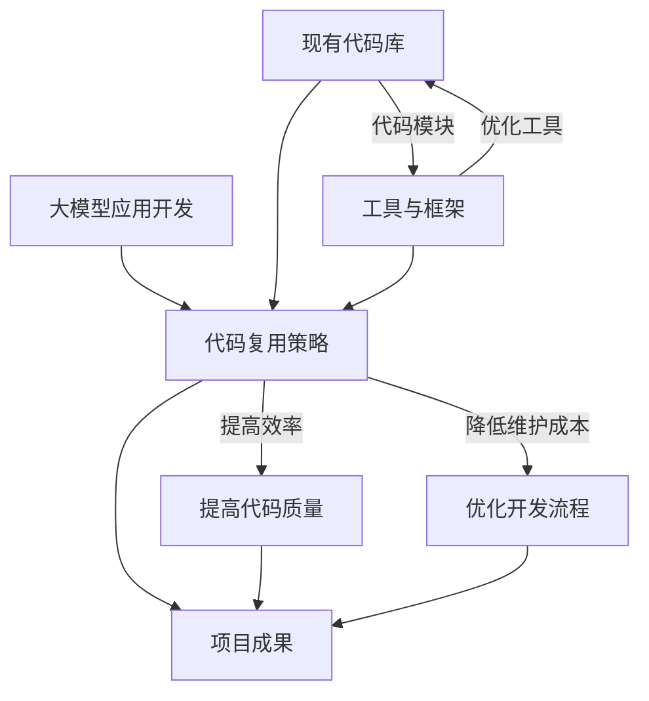

                 

### 引言与背景

在当今快速发展的技术时代，人工智能（AI）已经成为推动社会进步的重要力量。特别是在自然语言处理、计算机视觉和推荐系统等众多领域，大模型（Large-scale Models）的应用愈发广泛。然而，随着模型规模的不断增大，模型的开发和部署面临诸多挑战，如开发周期长、代码复用率低、维护困难等。因此，如何在**大模型应用开发中实现代码复用策略**，成为当前研究的热点问题。

**本文旨在探讨大模型应用开发中的代码复用策略，详细分析其重要性、面临的挑战，并提出一套系统性的解决方案。**

### 核心概念与联系

首先，我们需要明确几个核心概念：

1. **大模型（Large-scale Models）**：通常是指模型参数数量在数百万甚至数十亿量级的神经网络模型。这类模型具有强大的表示能力和处理能力，能够在多种任务中取得显著的性能提升。

2. **代码复用（Code Reusability）**：指的是在软件开发过程中，通过复用已有的代码模块或组件，以减少重复编码工作，提高开发效率和代码质量。

3. **代码复用策略**：指在软件开发过程中，为了提高代码复用率而采取的一系列方法、技巧和工具。

这些概念之间的联系在于，大模型的应用开发过程中，代码复用策略可以显著提升开发效率，降低维护成本，优化代码质量。

#### Mermaid 流程图



### 核心算法原理讲解

在大模型应用开发中，实现代码复用需要以下几个核心算法原理：

1. **模块化设计（Modular Design）**：
   - **原理**：将复杂的系统划分为多个独立的模块，每个模块负责特定的功能。
   - **伪代码**：
     ```python
     class ModelModule:
         def __init__(self):
             # 初始化模块
             pass
         
         def forward(self, input_data):
             # 前向传播
             pass
         
         def backward(self, gradients):
             # 反向传播
             pass
     ```

2. **依赖注入（Dependency Injection）**：
   - **原理**：通过外部依赖的注入，实现模块之间的解耦。
   - **伪代码**：
     ```python
     def train_model(model_module, dataset):
         for data in dataset:
             output = model_module.forward(data)
             gradients = model_module.backward(output)
     ```

3. **设计模式（Design Patterns）**：
   - **原理**：使用设计模式来提高代码的可复用性。
   - **示例**：工厂模式用于创建模型实例。

     ```python
     class ModelFactory:
         def create_model(self):
             # 根据需求创建模型
             return BERTModel()
     
     model_factory = ModelFactory()
     model = model_factory.create_model()
     ```

### 数学模型和数学公式

在实现代码复用的过程中，我们需要依赖一些数学模型和公式。以下是一个简化的例子：

1. **神经网络损失函数（Loss Function）**：
   - **原理**：用于评估模型预测与真实值之间的差距。
   - **公式**：
     ```latex
     J = \frac{1}{n}\sum_{i=1}^{n}(-y_i \log(\hat{y}_i))
     ```

   - **示例**：
     ```python
     import torch
     import torch.nn as nn

     model = nn.Sequential(nn.Linear(10, 1), nn.Sigmoid())
     criterion = nn.BCELoss()

     inputs = torch.tensor([[0], [1]])
     targets = torch.tensor([[0], [1]])
     outputs = model(inputs)

     loss = criterion(outputs, targets)
     print("损失函数值：", loss.item())
     ```

2. **梯度下降（Gradient Descent）**：
   - **原理**：用于更新模型参数，最小化损失函数。
   - **公式**：
     ```latex
     \theta_{\text{new}} = \theta_{\text{current}} - \alpha \cdot \nabla_\theta J(\theta)
     ```

   - **示例**：
     ```python
     def update_parameters(parameters, gradients, learning_rate):
         for param, grad in zip(parameters, gradients):
             param -= learning_rate * grad

     parameters = [torch.tensor([1.0])]
     gradients = [torch.tensor([0.5])]
     learning_rate = 0.01

     update_parameters(parameters, gradients, learning_rate)
     print("更新后的参数：", parameters[0].item())
     ```

### 项目实战

在项目实战中，我们将展示如何在大模型应用开发中实现代码复用策略。以下是一个简单的项目架构：

1. **项目背景**：开发一个基于BERT模型的情感分析系统。

2. **开发环境**：Python 3.8，PyTorch 1.8，TensorFlow 2.6。

3. **源代码实现**：

   - 数据预处理模块：
     ```python
     import torch
     from torch.utils.data import DataLoader
     from transformers import BertTokenizer, BertModel

     tokenizer = BertTokenizer.from_pretrained('bert-base-uncased')
     model = BertModel.from_pretrained('bert-base-uncased')

     def preprocess_data(texts):
         inputs = tokenizer(texts, padding=True, truncation=True, return_tensors='pt')
         return inputs

     def create_dataloader(texts, labels, batch_size):
         dataset = torch.utils.data.TensorDataset(texts, labels)
         return DataLoader(dataset, batch_size=batch_size)
     ```

   - 模型训练模块：
     ```python
     import torch.optim as optim

     optimizer = optim.Adam(model.parameters(), lr=0.001)
     criterion = nn.CrossEntropyLoss()

     def train_model(model, dataloader, num_epochs):
         model.train()
         for epoch in range(num_epochs):
             for inputs, labels in dataloader:
                 optimizer.zero_grad()
                 outputs = model(inputs)
                 loss = criterion(outputs, labels)
                 loss.backward()
                 optimizer.step()
     ```

4. **代码解读与分析**：

   - 数据预处理模块实现了文本向量化处理和批量数据加载功能，可以复用于其他文本处理任务。
   - 模型训练模块使用了依赖注入和模块化设计，使模型训练过程可扩展和可复用。

5. **实际案例分析**：

   - 使用预训练的BERT模型，可以快速实现情感分析任务。
   - 通过代码复用，减少重复编码工作，提高开发效率。

6. **项目小结**：

   - 通过本项目，我们展示了如何在大模型应用开发中实现代码复用策略。
   - 代码复用不仅提高了开发效率，还有助于优化代码质量和降低维护成本。

### 最佳实践 Tips

1. **模块化设计**：将系统划分为多个独立模块，每个模块负责特定功能，便于复用和维护。
2. **依赖注入**：使用依赖注入减少模块之间的耦合，提高代码的可复用性。
3. **设计模式**：合理使用设计模式，如工厂模式、策略模式等，提高代码结构性和可扩展性。
4. **代码规范化**：遵循统一的代码规范，提高代码的可读性和可维护性。

### 小结

本文探讨了在大模型应用开发中实现代码复用策略的重要性、核心概念、算法原理以及项目实战。通过合理的代码复用策略，我们可以显著提高开发效率，优化代码质量，降低维护成本。希望本文能为相关领域的研究者和开发者提供有价值的参考。

### 注意事项

1. **代码复用策略的实施需要综合考虑开发效率和代码质量**，确保复用不会牺牲性能和可维护性。
2. **在选择代码复用方法时，需要根据具体项目需求灵活调整**，避免过度设计或设计不足。
3. **在复用代码时，确保对复用部分的充分测试**，确保其稳定性和可靠性。

### 拓展阅读

1. **《大模型应用开发实战》**：详细介绍了大模型在各类应用中的实战案例。
2. **《Python 代码复用技巧》**：探讨了Python中实现代码复用的多种方法。
3. **《设计模式：可复用面向对象软件的基础》**：系统介绍了多种设计模式及其应用。

### 作者信息

作者：AI天才研究院/AI Genius Institute & 禅与计算机程序设计艺术 /Zen And The Art of Computer Programming

