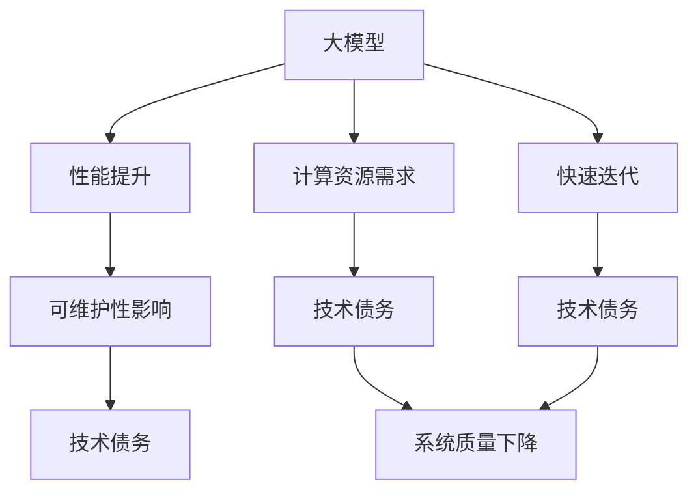

                 

。

**背景介绍**

随着大模型技术的迅猛发展，其在各个领域的应用越来越广泛。无论是自然语言处理、计算机视觉、推荐系统还是其他复杂的应用场景，大模型都展现出了强大的能力。然而，在开发和使用这些大模型的过程中，一个不可忽视的问题是技术债务的管理。技术债务不仅是开发中的一个普遍现象，而且在快速迭代和追求创新的大模型应用开发中，其影响显得尤为突出。

首先，我们需要理解大模型技术是如何影响软件开发的。大模型通常涉及海量的数据、复杂的训练过程和高性能的计算资源。为了快速开发和部署这些模型，开发团队往往需要采取一些短期有效的技术手段，如快速原型开发、妥协的解决方案等。这些手段虽然能够满足当前的需求，但可能会在未来产生隐患，如代码质量下降、系统可维护性降低等，这些隐患就是技术债务。

其次，技术债务在快速迭代和追求创新的大模型应用开发中尤为重要。由于大模型开发周期较长，涉及的技术复杂度较高，开发团队在追求速度和创新的过程中，可能会忽略一些长期的问题。这些问题在短期内可能不会显现，但长期积累会带来严重的后果，如系统性能下降、安全隐患增加等。因此，如何有效地管理技术债务，成为大模型应用开发中的一个关键问题。

**核心概念与联系**

为了更好地理解大模型应用开发中的技术债务，我们需要探讨几个核心概念，并分析它们之间的联系。

1. **大模型与性能**：大模型通常拥有数百万甚至数十亿个参数，能够处理复杂的数据和任务。其核心优势在于性能的提升，但这也意味着更高的计算资源和存储需求。

2. **快速迭代与可维护性**：快速迭代是现代软件开发的重要特点，但在追求速度的同时，开发团队需要平衡可维护性。如果为了快速交付而牺牲代码质量和系统设计，就会积累技术债务。

3. **技术债务与系统质量**：技术债务不仅影响系统的当前性能，还会影响其长期的可维护性和可靠性。有效管理技术债务，可以确保系统的持续改进和稳定运行。

**核心概念原理之间的关系架构 Mermaid 流程图**

在这个流程图中，我们可以看到大模型的性能提升、计算资源需求、快速迭代与可维护性影响之间如何相互作用，进而影响技术债务的积累和系统质量的下降。

通过上述分析，我们可以看出，大模型应用开发中的技术债务管理是一个复杂但至关重要的问题。在接下来的章节中，我们将进一步探讨大模型开发中的常见技术债务，以及如何进行有效的技术债务管理。我们将结合具体案例，详细分析技术债务的评估、解决和管理策略，帮助读者更好地理解和应对这一挑战。

### 1.3 技术债务管理的重要性

技术债务管理在大模型应用开发中扮演着至关重要的角色。首先，我们需要明确技术债务对项目的影响。技术债务如果得不到有效管理，会导致系统性能下降、维护成本增加、安全漏洞频发等一系列问题。这些隐患可能会在短期内难以察觉，但长期积累会严重影响项目的稳定性和可持续发展。

**技术债务对项目的影响**

1. **系统性能下降**：技术债务可能会导致代码质量不佳，系统设计不合理。这些因素会直接影响系统的性能，导致响应时间延长、资源占用增加，最终影响用户体验。

2. **维护成本增加**：技术债务会带来额外的维护成本。为了修复早期引入的缺陷和隐患，开发团队可能需要投入更多的时间和资源。这不仅增加了项目的预算成本，还会延长项目的开发周期。

3. **安全漏洞频发**：在快速迭代和追求速度的过程中，一些安全性和隐私保护方面的技术债务可能被忽视。这些漏洞可能会被恶意攻击者利用，导致严重的后果。

4. **项目延期和质量下降**：技术债务会导致项目进度失控，延期交付。同时，为了应对技术债务带来的问题，开发团队可能需要调整项目计划，这会影响项目的整体质量。

**技术债务管理的目标**

技术债务管理的核心目标是确保项目在快速迭代和追求创新的同时，保持系统的高性能、高可靠性和高安全性。具体目标包括：

1. **识别和评估**：及时发现和评估项目中的技术债务，明确其严重程度和影响范围。

2. **规划和优化**：制定合理的债务偿还计划，优化技术架构和系统设计，减少未来的债务积累。

3. **监控和反馈**：建立技术债务监控机制，实时跟踪债务的变化情况，及时调整管理策略。

4. **培训和教育**：提高团队成员对技术债务的认识和管理能力，形成良好的技术债务管理文化。

**技术债务管理在项目中的实施**

1. **定期评估**：定期对项目中的技术债务进行评估，包括代码质量、系统设计、安全性和性能等方面。

2. **优先级管理**：根据技术债务的严重程度和影响范围，确定债务的优先级，优先解决高风险和影响较大的债务。

3. **计划制定**：制定详细的债务偿还计划，明确解决方案、负责人员和完成时间。

4. **持续改进**：在项目开发过程中，不断优化技术架构和系统设计，避免新的技术债务的产生。

5. **团队协作**：建立跨部门的协作机制，确保技术债务管理得到全面支持和有效执行。

通过上述措施，技术债务管理可以有效降低项目风险，提高系统质量，确保项目的可持续发展。在大模型应用开发中，有效管理技术债务是保证项目成功的关键之一。

### 第2章 大模型开发中的常见技术债务

在深入探讨大模型应用开发中的技术债务之前，我们需要了解这些技术债务的来源和具体表现。大模型开发过程中涉及多个技术环节，包括数据管理、模型训练与优化、模型评估与监控、安全性与隐私保护等。每一个环节都可能出现技术债务，下面我们将逐一分析这些常见的技术债务类型。

#### 2.1 数据管理方面的技术债务

数据管理是大模型开发的基础，但在实际操作中，数据管理方面往往会出现一些技术债务。

**数据质量与数据隐私**

- **数据质量**：大模型训练依赖于大量的高质量数据，如果数据存在缺失、错误或不一致，会导致模型性能下降。例如，使用含有噪声或错误的图像数据训练计算机视觉模型，可能会影响模型的准确性。

- **数据隐私**：在大模型训练过程中，数据隐私保护是一个重要问题。如果数据泄露，可能会对个人隐私造成严重威胁。此外，某些数据（如医疗数据、金融数据等）具有高度敏感性，需要采取严格的数据保护措施。

**数据存储与处理技术**

- **数据存储**：大模型通常需要存储和处理海量数据，对存储系统提出了高要求。如果存储系统设计不合理或性能不足，可能会影响模型的训练和部署效率。

- **数据处理**：数据预处理和特征提取是模型训练的重要环节。如果预处理流程过于复杂或不合理，会增加计算成本，延长模型训练时间。

#### 2.2 模型训练与优化方面的技术债务

模型训练与优化是大模型开发的核心环节，其中也潜藏了许多技术债务。

**模型训练算法与优化策略**

- **算法选择**：不同的模型训练算法适用于不同的任务和数据类型。如果选择了不适合的算法，可能会导致训练效果不佳。

- **优化策略**：模型训练过程中需要调整多个参数，如学习率、批量大小等。如果不合理调整这些参数，可能会影响训练效果和计算效率。

**模型压缩与高效部署**

- **模型压缩**：为了减少模型的大小和计算资源需求，通常会采用模型压缩技术。如果压缩方法选择不当，可能会影响模型的性能和准确性。

- **高效部署**：大模型部署需要考虑计算资源和网络带宽等因素。如果部署策略不合理，可能会影响模型的响应速度和用户体验。

#### 2.3 模型评估与监控方面的技术债务

模型评估与监控是确保大模型性能和可靠性的关键，但在实际操作中也会出现一些技术债务。

**模型评估指标与方法**

- **评估指标**：不同的任务需要不同的评估指标。如果选择了不合适的评估指标，可能会误导模型的优化方向。

- **评估方法**：模型评估过程中需要考虑数据分布、样本量等因素。如果评估方法不合理，可能会影响评估结果的准确性。

**模型监控与故障检测**

- **监控策略**：模型部署后需要实时监控其性能和稳定性。如果监控策略不完善，可能会导致故障无法及时检测和处理。

- **故障检测方法**：故障检测方法需要具有较高的准确性和实时性。如果方法选择不当，可能会产生误报或漏报。

#### 2.4 安全性与隐私保护方面的技术债务

安全性与隐私保护在大模型应用中至关重要，但在实际开发中也会存在一些技术债务。

**模型安全性与隐私保护的重要性**

- **模型安全性**：大模型可能会受到恶意攻击，如对抗性攻击、数据泄露等。如果模型安全性不足，可能会对业务造成严重损失。

- **隐私保护**：大模型训练和处理的数据通常涉及个人隐私。如果隐私保护不足，可能会违反法律法规，导致法律风险。

**常见的安全性与隐私保护技术**

- **加密技术**：加密技术可以保护数据在传输和存储过程中的安全性。

- **隐私保护算法**：如差分隐私、同态加密等，可以确保数据在处理过程中的隐私性。

- **访问控制**：通过严格的访问控制策略，可以限制对敏感数据的访问权限。

通过上述分析，我们可以看到大模型应用开发中的技术债务种类繁多，涉及到多个技术环节。有效管理这些技术债务，对于确保项目成功至关重要。在接下来的章节中，我们将进一步探讨如何评估、解决和管理这些技术债务。

#### 2.1 数据管理方面的技术债务

数据管理是大模型应用开发的基础，因此在数据管理方面出现的技术债务尤为关键。这些债务主要源于数据质量、数据隐私以及数据存储与处理技术的不当选择，下面将详细探讨这些方面的技术债务问题。

**数据质量与数据隐私**

1. **数据质量**：数据质量是影响大模型性能的重要因素。低质量的数据可能导致模型学习效果不佳，甚至导致模型失效。具体表现为：

   - **数据缺失**：数据集中存在缺失值，可能导致模型训练不完整，影响模型的泛化能力。
   - **数据错误**：数据集中存在错误或异常值，这些值可能会误导模型，导致模型在真实场景中表现不佳。
   - **数据不一致**：不同来源或不同时间点的数据可能存在不一致的情况，这会影响模型的整体性能。

   **案例**：在训练计算机视觉模型时，如果数据集中包含了大量的噪声图像或错误标注，模型可能无法正确识别图像中的物体，导致性能下降。

2. **数据隐私**：数据隐私保护在大模型应用中至关重要，尤其是在涉及个人敏感信息的数据处理过程中。具体问题包括：

   - **数据泄露**：未经授权的数据访问和泄露可能导致个人隐私的严重泄露，违反法律法规。
   - **隐私侵犯**：在某些情况下，即使数据本身未被泄露，但其匿名化处理不当也可能导致隐私侵犯。

   **案例**：在医疗数据的应用中，如果患者的敏感医疗信息未经妥善处理，被第三方获取，可能导致严重的隐私泄露问题。

**数据存储与处理技术**

1. **数据存储**：大模型通常需要处理和存储海量数据，对数据存储技术提出了高要求。常见的技术债务包括：

   - **存储容量不足**：随着数据量的不断增长，如果存储系统容量不足，可能导致存储空间耗尽，影响模型的训练和部署。
   - **存储性能瓶颈**：如果存储系统性能不足，可能导致数据读写速度缓慢，影响模型的训练效率。

   **案例**：在训练一个大规模语言模型时，如果数据存储系统性能不足，可能需要花费数天甚至数周的时间来加载和预处理数据，显著延长模型训练周期。

2. **数据处理**：数据处理技术在大模型应用中也起到关键作用，常见的技术债务包括：

   - **数据处理流程复杂**：数据处理流程过于复杂，可能导致数据处理时间过长，影响模型的训练效率。
   - **数据处理错误**：数据处理过程中可能引入错误或异常值，影响模型训练效果。

   **案例**：在自然语言处理任务中，如果数据处理流程复杂，可能导致输入文本中的关键信息丢失或被错误处理，影响模型对文本的理解和生成效果。

**解决与优化方法**

1. **数据质量管理**：

   - **数据清洗**：对数据进行清洗，识别和填充缺失值，删除错误或异常值，提高数据质量。
   - **数据标准化**：对数据进行标准化处理，确保数据在不同来源或时间点之间的一致性。

2. **数据隐私保护**：

   - **数据加密**：采用数据加密技术，确保数据在存储和传输过程中的安全性。
   - **隐私保护算法**：采用差分隐私、同态加密等技术，保护数据的隐私性。

3. **数据存储与处理优化**：

   - **分布式存储**：采用分布式存储系统，提高存储容量和性能。
   - **数据处理流水线**：优化数据处理流程，减少数据处理时间，提高模型训练效率。

通过上述方法，可以有效解决大模型应用开发中数据管理方面的技术债务问题，提高数据质量和系统性能，确保大模型的可靠性和有效性。

#### 2.2 模型训练与优化方面的技术债务

模型训练与优化是大模型应用开发的核心环节，涉及多种技术选择和策略。不当的技术选择或优化策略可能导致技术债务，影响模型的性能和训练效率。以下将详细讨论大模型训练与优化方面常见的几种技术债务。

**模型训练算法与优化策略**

1. **算法选择**：不同的模型训练算法适用于不同的任务和数据类型。如果选择了不适合的算法，可能会导致训练效果不佳。常见的问题包括：

   - **算法不适配**：某些算法（如深度神经网络）在特定类型的数据上（如稀疏数据）可能表现不佳，导致训练时间过长或效果不佳。
   - **算法过时**：随着技术的进步，一些传统的训练算法可能逐渐被更高效的算法所取代。如果继续使用过时的算法，可能会影响模型的训练效率。

   **案例**：在处理大规模文本数据时，传统的朴素贝叶斯分类器可能无法有效处理高维特征，而更先进的深度学习算法（如BERT）则能够取得更好的效果。

2. **优化策略**：模型训练过程中需要调整多个参数，如学习率、批量大小等。不合理的参数设置可能导致训练效率低下，甚至导致训练失败。常见问题包括：

   - **参数设置不当**：如果学习率设置过高，可能导致模型在训练初期过拟合；如果设置过低，可能导致训练时间过长。
   - **优化器选择不当**：不同的优化器（如SGD、Adam）适用于不同的训练任务和数据类型。选择不当的优化器可能无法有效加速训练过程。

   **案例**：在训练一个图像识别模型时，如果使用了Adam优化器而非更适合的SGD优化器，可能会因为学习率调整不当导致训练过程耗时过长。

**模型压缩与高效部署**

1. **模型压缩**：为了降低模型的计算复杂度和存储需求，通常会采用模型压缩技术。但不当的压缩方法可能影响模型的性能和准确性。常见问题包括：

   - **压缩过度**：过度的模型压缩可能导致模型性能显著下降，影响其在实际应用中的效果。
   - **压缩方法不适配**：某些压缩方法（如剪枝、量化）在某些任务上可能表现不佳，导致模型精度降低。

   **案例**：在移动设备上部署一个图像识别模型时，如果采用了过度的剪枝和量化，可能会显著降低模型的识别精度，影响用户体验。

2. **高效部署**：大模型的部署需要考虑计算资源和网络带宽等因素。不当的部署策略可能导致模型响应时间过长，影响用户体验。常见问题包括：

   - **部署环境不当**：如果部署环境（如CPU、GPU）配置不足，可能导致模型运行缓慢，影响部署效率。
   - **网络带宽限制**：在远程部署模型时，如果网络带宽不足，可能导致数据传输缓慢，影响模型响应时间。

   **案例**：在云端部署一个实时语音识别系统时，如果网络带宽不足，可能会导致语音数据传输延迟，影响系统的实时性和准确性。

**解决与优化方法**

1. **算法选择与优化**：

   - **算法适配性测试**：在训练之前，对不同的算法进行适配性测试，选择最适合当前任务和数据类型的算法。
   - **参数调优**：通过实验和交叉验证，找到最优的参数设置，提高训练效率和效果。

2. **模型压缩与高效部署**：

   - **模型压缩策略优化**：根据任务和数据特点，选择适合的模型压缩方法，避免压缩过度。
   - **部署环境优化**：确保部署环境具有足够的计算资源和网络带宽，提高模型部署效率。

通过上述方法，可以有效解决大模型训练与优化方面的技术债务问题，提高模型的训练效率和性能，确保其在实际应用中的可靠性和有效性。

#### 2.3 模型评估与监控方面的技术债务

模型评估与监控在大模型应用开发中至关重要，它不仅有助于评估模型的性能，还能及时发现潜在问题。然而，这一环节也容易产生技术债务，影响模型的可靠性和可用性。

**模型评估指标与方法**

1. **评估指标不全面**：评估指标的选择直接影响模型的性能评价。如果评估指标不全面，可能导致模型在特定指标上表现优异，但在实际应用中却效果不佳。

   - **案例**：在自然语言处理任务中，仅使用准确率作为评估指标，可能忽略模型的生成质量和多样性。例如，一个文本生成模型可能在生成文本的准确性方面表现优异，但在文本的连贯性和创造性方面较差。

2. **评估方法不合理**：评估方法的选择和使用也影响模型性能的评估结果。如果评估方法不合理，可能导致评估结果失真。

   - **案例**：在图像识别任务中，如果使用测试集较小或数据分布不均的评估方法，可能导致模型在测试集上表现良好，但在实际应用中无法适应更广泛的数据分布。

**模型监控与故障检测**

1. **监控策略不完善**：模型部署后，需要实时监控其性能和稳定性。如果监控策略不完善，可能导致故障无法及时检测和处理。

   - **案例**：在实时语音识别系统中，如果没有实现对输入语音数据的实时检测和反馈，可能导致系统在处理特定语音输入时出现错误，影响用户体验。

2. **故障检测方法不准确**：故障检测方法需要具有较高的准确性和实时性。如果方法选择不当，可能导致误报或漏报。

   - **案例**：在自动驾驶系统中，如果故障检测方法不准确，可能导致系统无法及时检测到潜在的安全问题，增加事故风险。

**解决与优化方法**

1. **评估指标与方法优化**：

   - **多指标评估**：选择多个评估指标，从不同角度全面评估模型性能。例如，在文本生成任务中，除了准确率，还可以考虑生成文本的流畅性、多样性等。
   - **数据增强与多样性**：使用数据增强技术，增加测试集的多样性，避免评估结果偏颇。

2. **模型监控与故障检测优化**：

   - **实时监控**：建立实时监控系统，及时检测模型的性能变化和异常情况，确保系统稳定运行。
   - **智能故障检测**：采用机器学习算法，如异常检测模型，提高故障检测的准确性和实时性。

通过上述方法，可以有效解决模型评估与监控方面出现的技术债务问题，提高模型的可靠性和可用性，确保其在实际应用中的稳定性和有效性。

#### 2.4 安全性与隐私保护方面的技术债务

在当前的大模型应用场景中，安全性与隐私保护是至关重要的考量因素。然而，由于技术的快速发展和应用需求的不断增加，安全性与隐私保护方面常常会出现技术债务，这些债务不仅威胁到系统的正常运行，还可能对用户隐私造成严重侵害。

**模型安全性与隐私保护的重要性**

1. **模型安全性**：大模型可能成为攻击者的目标，例如通过对抗性攻击来干扰模型的输出。如果模型安全性不足，可能会导致以下问题：

   - **对抗性攻击**：攻击者通过微小但关键的数据修改，可以导致模型输出发生重大变化，从而影响系统的决策。例如，在图像识别任务中，通过在图像中添加细微的噪声，可以误导模型做出错误的判断。
   - **数据泄露**：如果模型在训练或部署过程中未能妥善处理数据，可能导致敏感数据被泄露，给用户隐私和业务安全带来风险。

   **案例**：某金融机构使用的信贷评分模型，由于未进行有效的安全防护，被黑客通过伪造数据成功篡改了评分结果，导致大量用户信用受损。

2. **隐私保护**：大模型处理的数据往往涉及用户敏感信息，如个人身份信息、医疗记录等。如果隐私保护不足，可能导致以下问题：

   - **隐私侵犯**：通过数据分析，攻击者可能推断出用户的个人信息，甚至进行身份验证。
   - **法律风险**：在许多国家和地区，隐私保护是法律规定的基本要求。如果企业未能妥善保护用户隐私，可能会面临法律诉讼和高额罚款。

   **案例**：某知名社交媒体公司因未对用户数据进行有效隐私保护，导致数百万用户信息泄露，公司被罚款数千万美元，并面临用户信任危机。

**常见的安全性与隐私保护技术**

1. **加密技术**：加密技术是保护数据传输和存储安全的重要手段。常见的加密技术包括：

   - **对称加密**：如AES，适用于数据传输和存储，但需要确保密钥的安全。
   - **非对称加密**：如RSA，适用于数据传输和存储，但计算成本较高。

2. **隐私保护算法**：差分隐私（Differential Privacy）是近年来发展迅速的一种隐私保护技术，通过在数据处理过程中添加噪声，确保数据的隐私性。常见的差分隐私算法包括拉格朗日机制和指数机制。

3. **访问控制**：通过严格的访问控制策略，限制对敏感数据的访问权限。常见的访问控制方法包括基于角色的访问控制（RBAC）和基于属性的访问控制（ABAC）。

4. **数据脱敏**：通过数据脱敏技术，将敏感数据转换为无法直接识别的形式，保护用户隐私。常见的数据脱敏方法包括字符替换、掩码、随机化等。

**解决与优化方法**

1. **安全性评估**：

   - **定期安全审计**：定期进行安全审计，发现并修复潜在的安全漏洞。
   - **安全培训**：对开发人员进行安全知识培训，提高其安全意识。

2. **隐私保护策略**：

   - **差分隐私**：在数据处理过程中应用差分隐私算法，确保数据的隐私性。
   - **数据脱敏**：在数据存储和传输过程中，对敏感数据进行脱敏处理。

3. **访问控制优化**：

   - **最小权限原则**：确保用户和系统组件仅拥有完成任务所需的最低权限。
   - **多因素认证**：采用多因素认证（MFA）机制，提高账户安全性。

通过上述方法，可以有效解决大模型应用开发中的安全性与隐私保护方面的技术债务，确保系统的安全运行和用户隐私的保护。

### 第3章 技术债务管理策略

技术债务管理策略的核心在于有效识别、评估、解决和管理技术债务，以确保项目能够持续、稳定地发展。本章节将详细探讨技术债务评估与分类、技术债务解决方法以及技术债务管理工具与平台。

#### 3.1 技术债务评估与分类

技术债务评估是管理技术债务的第一步，它有助于识别项目中的技术债务，并确定其优先级和影响范围。以下是技术债务评估和分类的方法：

**技术债务评估方法**

1. **定性评估**：通过专家评审、讨论和经验判断，对技术债务进行初步评估。这种方法适用于快速识别潜在的技术债务。

2. **定量评估**：通过量化的方法，如技术债务评分系统、技术债务度量模型，对技术债务进行定量评估。例如，可以使用代码复杂度、缺陷密度、维护成本等指标来衡量技术债务的严重程度。

3. **风险评估**：结合项目的具体情况，评估技术债务可能带来的风险和影响。例如，考虑技术债务对项目进度、性能、安全性和可靠性的影响。

**技术债务分类与优先级确定**

1. **分类**：根据技术债务的性质和影响，可以将技术债务分为以下几类：

   - **性能债务**：与系统性能相关的债务，如代码优化不足、资源利用率不高等。
   - **安全性债务**：与系统安全性相关的债务，如漏洞、权限管理不足等。
   - **可维护性债务**：与系统可维护性相关的债务，如代码质量差、文档缺失等。
   - **扩展性债务**：与系统扩展性相关的债务，如架构设计不合理、接口不统一等。

2. **优先级确定**：根据技术债务的严重程度和影响范围，确定其优先级。一般而言，应优先解决高优先级的技术债务，如安全性债务和性能债务。

#### 3.2 技术债务解决方法

技术债务解决方法是管理技术债务的关键环节。以下是一些常见的技术债务解决方法：

**技术债务偿还策略**

1. **逐步偿还**：根据技术债务的优先级和项目进度，逐步偿还技术债务。这种方法适用于项目周期较长的情况，确保项目能够持续进行。

2. **集中偿还**：在特定阶段（如项目阶段性验收或迭代结束时）集中解决技术债务。这种方法适用于项目周期较短且技术债务较多的情况，确保项目能够按时完成。

3. **自动化偿还**：通过自动化工具和流程，自动修复或优化技术债务。例如，使用代码审查工具自动修复代码中的低质量代码，使用性能优化工具自动优化系统性能。

**技术债务转移策略**

1. **技术债务转移**：将部分技术债务转移到外部团队或供应商。这种方法适用于技术债务涉及的技术领域超出了项目团队的能力范围。

2. **技术债务外包**：将技术债务相关的开发工作外包给专业团队，通过合作解决技术债务。这种方法适用于项目时间紧迫且技术债务较多的情况。

3. **技术债务共享**：与其他项目或团队共享技术债务，通过协作共同解决。这种方法适用于多个项目或团队之间存在技术债务共享的情况。

**技术债务解决实例**

1. **性能债务解决**：通过代码优化、硬件升级或分布式计算等技术手段，提高系统性能。例如，优化数据库查询语句、使用更高效的算法或增加服务器资源。

2. **安全性债务解决**：通过安全审计、漏洞修复和安全测试等技术手段，提高系统安全性。例如，修复已知漏洞、更新安全策略或实施安全加固措施。

3. **可维护性债务解决**：通过重构代码、编写文档或改进开发流程等技术手段，提高系统可维护性。例如，重构复杂代码、编写详细的注释文档或采用敏捷开发方法。

#### 3.3 技术债务管理工具与平台

技术债务管理需要有效的工具和平台来支持。以下是一些常用的技术债务管理工具和平台：

**技术债务管理工具**

1. **代码审查工具**：如SonarQube、Checkstyle等，用于自动检测代码中的技术债务，如代码质量、安全性问题等。

2. **性能优化工具**：如New Relic、AppDynamics等，用于监测系统性能，识别性能债务。

3. **漏洞扫描工具**：如Nessus、OpenVAS等，用于扫描系统中的安全漏洞，识别安全性债务。

**技术债务管理平台**

1. **债务管理平台**：如JIRA、GitLab等，用于记录、跟踪和解决技术债务。

2. **自动化平台**：如Jenkins、Travis CI等，用于自动化执行代码审查、性能优化和漏洞扫描等任务。

3. **持续集成/持续部署（CI/CD）平台**：如GitLab CI、Jenkins等，通过自动化流程确保技术债务得到及时解决。

通过上述技术债务管理策略、工具和平台，开发团队可以更加有效地识别、评估、解决和管理技术债务，确保项目的持续、稳定发展。

### 第4章 大模型应用案例中的技术债务管理

在本章中，我们将通过几个具体的大模型应用案例，详细探讨技术债务管理的过程和策略。这些案例涵盖了自然语言处理（NLP）、计算机视觉（CV）和推荐系统等不同的领域，通过具体实践，展示如何识别、解决和管理技术债务。

#### 4.1 案例一：自然语言处理

**应用背景**

自然语言处理（NLP）是人工智能的一个重要分支，广泛应用于机器翻译、情感分析、问答系统等领域。随着预训练模型（如BERT、GPT）的出现，NLP任务的效果得到了显著提升。然而，大规模的模型训练和部署也带来了复杂的技术债务问题。

**技术债务问题分析**

1. **数据管理方面的债务**：
   - **数据质量**：训练数据集的质量直接影响模型的性能。如果数据集中存在大量噪音、错误或标注不一致，模型的表现可能会受到影响。
   - **数据隐私**：NLP模型处理的数据通常涉及用户的敏感信息，如个人对话记录、社交媒体内容等，需要确保数据的隐私性。

2. **模型训练与优化方面的债务**：
   - **训练算法选择**：不同的任务可能需要不同的训练算法，如果选择了不适合的算法，可能会影响模型的训练效率。
   - **模型优化策略**：模型参数的选择和优化策略对于训练效果至关重要，不合理的参数设置可能会导致模型训练时间过长或效果不佳。

3. **模型评估与监控方面的债务**：
   - **评估指标选择**：NLP任务中，评估指标的选择直接影响模型的优化方向。如果评估指标不全面，可能会导致模型在特定指标上表现优异，但在实际应用中效果不佳。
   - **模型监控**：在模型部署后，需要对其进行实时监控，以确保其性能和稳定性。如果监控机制不完善，可能导致故障无法及时发现和处理。

**技术债务管理实践**

1. **数据管理**：
   - **数据清洗**：使用数据清洗工具，如OpenRefine，对训练数据进行清洗，识别和修复数据中的错误和异常值。
   - **数据隐私保护**：采用差分隐私算法，对敏感数据进行处理，确保用户隐私。

2. **模型训练与优化**：
   - **算法选择**：根据任务的特点选择合适的训练算法，如BERT适用于文本分类任务。
   - **参数调优**：通过实验和交叉验证，选择最优的参数设置，提高模型的训练效率和效果。

3. **模型评估与监控**：
   - **多指标评估**：选择多个评估指标，如准确率、F1分数、BLEU分数等，全面评估模型性能。
   - **实时监控**：使用监控工具，如TensorBoard，实时监控模型训练过程中的性能和资源使用情况。

#### 4.2 案例二：计算机视觉

**应用背景**

计算机视觉（CV）技术在图像识别、目标检测、人脸识别等领域具有广泛的应用。随着深度学习技术的发展，CV模型的性能得到了显著提升。然而，CV模型的训练和部署也面临着复杂的技术债务问题。

**技术债务问题分析**

1. **数据管理方面的债务**：
   - **数据质量**：CV模型的训练依赖于大量的高质量图像数据。如果数据集中存在错误或异常值，可能会导致模型训练效果不佳。
   - **数据存储**：CV模型通常需要存储和处理海量图像数据，对存储系统提出了高要求。

2. **模型训练与优化方面的债务**：
   - **计算资源**：CV模型训练通常需要大量的计算资源，如果计算资源不足，可能会导致训练时间过长或模型效果不佳。
   - **模型压缩与部署**：为了降低模型的大小和计算需求，需要进行模型压缩和优化，以适应实际部署环境。

3. **模型评估与监控方面的债务**：
   - **评估指标**：CV模型的评估指标需要考虑多种因素，如准确率、召回率、F1分数等。如果评估指标选择不当，可能会误导模型的优化方向。
   - **故障检测**：在模型部署后，需要对其性能和稳定性进行实时监控，以确保其正常运行。

**技术债务管理实践**

1. **数据管理**：
   - **数据增强**：使用数据增强技术，如随机裁剪、旋转、缩放等，增加训练数据的多样性。
   - **分布式存储**：使用分布式存储系统，如HDFS，提高数据存储和读取的效率。

2. **模型训练与优化**：
   - **计算资源优化**：使用云计算平台，如AWS、Google Cloud，根据需求动态调整计算资源。
   - **模型压缩与部署**：使用模型压缩技术，如剪枝、量化，降低模型大小和计算需求。

3. **模型评估与监控**：
   - **多指标评估**：结合不同评估指标，全面评估模型性能。
   - **实时监控**：使用监控工具，如Prometheus，实时监控模型性能和资源使用情况。

#### 4.3 案例三：推荐系统

**应用背景**

推荐系统是电子商务、社交媒体等领域的重要应用，通过个性化推荐提高用户体验和业务收益。随着推荐系统技术的不断发展，推荐模型的复杂度和规模也在不断增加，带来了复杂的技术债务问题。

**技术债务问题分析**

1. **数据管理方面的债务**：
   - **数据质量**：推荐系统依赖于用户行为数据和历史交易数据，如果数据存在缺失或错误，可能会导致推荐效果不佳。
   - **数据隐私**：推荐系统处理的数据通常涉及用户隐私信息，如浏览记录、购买行为等，需要确保数据的隐私性。

2. **模型训练与优化方面的债务**：
   - **模型选择**：不同的推荐任务可能需要不同的模型，如果选择了不适合的模型，可能会影响推荐效果。
   - **模型优化策略**：推荐模型需要不断优化，以适应不断变化的数据和环境。

3. **模型评估与监控方面的债务**：
   - **评估指标**：推荐系统的评估指标需要考虑多个因素，如点击率、转化率、用户满意度等。如果评估指标选择不当，可能会误导模型的优化方向。
   - **实时监控**：推荐系统需要实时监控其性能和稳定性，以确保其正常运行。

**技术债务管理实践**

1. **数据管理**：
   - **数据清洗**：使用数据清洗工具，如Pandas，对数据进行清洗和预处理，识别和修复数据中的错误和异常值。
   - **数据隐私保护**：采用差分隐私技术，对敏感数据进行处理，确保用户隐私。

2. **模型训练与优化**：
   - **模型选择**：根据任务的特点选择合适的推荐模型，如矩阵分解、协同过滤等。
   - **模型调优**：通过实验和交叉验证，选择最优的模型参数，提高推荐效果。

3. **模型评估与监控**：
   - **多指标评估**：结合不同评估指标，全面评估模型性能。
   - **实时监控**：使用监控工具，如Grafana，实时监控推荐系统的性能和资源使用情况。

通过上述案例分析，我们可以看到，在大模型应用开发中，技术债务管理是一个复杂但关键的过程。通过有效的技术债务管理策略，开发团队能够识别和解决潜在的技术债务，确保模型的性能、可靠性和安全性。这些实践不仅有助于项目的成功，也为未来的大模型应用开发提供了宝贵的经验。

### 5.1 技术债务管理的挑战

在大模型应用开发中，技术债务管理面临着诸多挑战，这些挑战不仅影响项目的进展，还可能对最终的系统性能和稳定性产生负面影响。以下将详细探讨技术债务管理中常见的几个挑战。

**技术更新与债务累积**

1. **技术更新速度**：随着人工智能技术的快速发展，新的算法、工具和平台不断涌现。然而，技术更新的速度往往超过项目团队能够消化和适应的能力，导致新债务的累积。

   - **挑战**：开发团队需要在短时间内学习和掌握新技术，这可能导致对现有系统的更新不足或引入新的技术债务。

   **解决方案**：定期评估技术栈的更新需求，制定技术更新计划。同时，加强团队成员的培训，提高其对新技术的适应能力。

2. **债务累积**：随着项目的推进，未解决的技术债务可能会不断累积，形成“债务堆叠”效应。

   - **挑战**：债务累积可能导致系统复杂度增加，维护成本上升，进而影响项目的进度和稳定性。

   **解决方案**：建立有效的技术债务跟踪和管理机制，定期评估和解决累积的债务。通过自动化工具和流程，减少新债务的产生。

**债务管理的复杂性**

1. **债务识别与分类**：技术债务的识别和分类是一个复杂的过程，需要综合考虑多个因素，如代码质量、性能、安全性和可维护性。

   - **挑战**：债务的识别和分类可能依赖于主观判断和经验，导致准确性不足。

   **解决方案**：采用量化指标和自动化工具，如代码审查工具和性能监测工具，提高债务识别的准确性和效率。

2. **优先级排序**：在多个技术债务中，确定优先级是管理复杂性的关键。

   - **挑战**：不同债务的影响范围和严重程度可能不同，如何合理排序是一个难题。

   **解决方案**：结合项目目标和实际需求，制定科学的优先级排序策略，确保关键债务得到优先解决。

**跨团队协作与沟通**

1. **跨团队协作**：技术债务管理通常涉及多个团队，如开发、测试、运维等。跨团队协作的复杂性增加了债务管理的难度。

   - **挑战**：不同团队之间的沟通不畅、职责分工不清，可能导致债务管理效率低下。

   **解决方案**：建立跨团队协作机制，明确各团队的职责和任务，通过定期的会议和文档共享，促进信息传递和协作。

2. **沟通障碍**：技术债务的描述和传达可能存在障碍，导致其他团队成员难以理解和处理。

   - **挑战**：技术债务的描述过于专业或复杂，非技术人员难以理解和参与管理。

   **解决方案**：使用简明易懂的语言描述技术债务，提供详细的文档和案例，帮助团队成员更好地理解和参与管理。

通过上述解决方案，开发团队可以更好地应对技术债务管理中的挑战，提高债务管理的效率和质量，确保项目的顺利推进和系统的稳定性。

### 5.2 技术债务管理的未来趋势

在技术不断进步和复杂应用场景日益增多的背景下，技术债务管理也迎来了新的趋势。这些趋势不仅反映了未来技术的发展方向，也为技术债务管理提供了新的思路和工具。

**自动化与智能化管理**

1. **自动化工具的普及**：随着自动化工具的发展，许多技术债务管理任务可以通过自动化完成。例如，自动化代码审查工具可以识别潜在的技术债务，自动化性能测试工具可以监测系统性能变化。这些工具不仅提高了债务管理的效率，还减少了人为错误的可能性。

2. **智能化管理的兴起**：人工智能和机器学习技术的应用，使得技术债务管理更加智能化。通过大数据分析和机器学习算法，可以更精准地识别和评估技术债务，提供个性化的债务管理建议。

**新兴技术的影响**

1. **云计算与分布式计算**：云计算和分布式计算技术的发展，为大规模数据处理和模型训练提供了强大的支持。通过云平台，开发团队可以灵活调整计算资源，有效缓解技术债务带来的计算资源压力。

2. **区块链技术**：区块链技术在数据安全和隐私保护方面具有独特的优势。通过区块链技术，可以实现数据的不可篡改性和隐私保护，有效减少数据管理方面的技术债务。

**最佳实践与借鉴**

1. **行业最佳实践的推广**：随着技术债务管理的实践不断积累，许多行业已经形成了最佳实践。这些实践包括债务评估方法、解决方案以及管理流程，为其他项目提供了宝贵的借鉴。

2. **跨领域借鉴**：不同领域的项目在技术债务管理方面可能存在共通之处。通过跨领域借鉴，项目团队可以吸取其他领域的成功经验，优化自身的债务管理策略。

**持续优化与迭代**

1. **持续集成与持续部署（CI/CD）**：CI/CD流程的引入，使得技术债务的管理更加持续和自动化。通过持续集成和部署，可以及时发现和解决债务问题，确保系统的稳定性和性能。

2. **迭代开发与敏捷实践**：采用敏捷开发方法，项目团队可以更灵活地应对技术债务。通过迭代开发和快速反馈，可以不断优化债务管理策略，确保项目能够持续进步。

通过上述趋势，我们可以看到技术债务管理正朝着自动化、智能化和最佳实践的方向发展。未来，随着新兴技术的不断引入和应用，技术债务管理将变得更加高效和精准，为项目的成功提供强有力的保障。

### 5.3 大模型应用开发的最佳实践

在大模型应用开发中，遵循最佳实践是确保项目成功的关键。以下总结了在大模型应用开发中的一些关键最佳实践，包括项目规划、团队协作、持续集成和持续部署等方面，旨在帮助团队有效管理技术债务，提高开发效率和质量。

**1. 项目规划**

- **需求分析**：在项目启动阶段，进行详细的需求分析，明确项目的目标和功能需求。这有助于识别潜在的技术债务，确保项目目标与实际需求一致。
- **技术选型**：选择合适的技术栈和工具，考虑现有技术的稳定性和兼容性。避免盲目追求最新技术，确保技术方案具备可持续性和可维护性。
- **资源规划**：合理分配人力资源和计算资源，确保项目有足够的资源支持。在资源紧张的情况下，优先解决关键的技术债务问题。

**2. 团队协作**

- **跨职能团队**：组建跨职能团队，包括开发、测试、运维等角色，确保项目在各个阶段都有专业人员的参与。跨职能团队可以更好地协调工作，快速响应技术债务问题。
- **知识共享**：建立知识共享机制，鼓励团队成员分享经验和最佳实践。这有助于提高团队的整体技术水平，减少因缺乏经验而产生的技术债务。
- **定期会议**：定期召开项目会议，讨论项目进展、存在的问题和解决方案。通过会议，可以及时发现和解决技术债务问题，确保项目顺利进行。

**3. 持续集成和持续部署（CI/CD）**

- **自动化测试**：采用自动化测试工具，如Selenium、JUnit等，对代码进行持续集成测试。自动化测试可以快速发现和修复技术债务，确保代码质量。
- **持续集成**：通过持续集成（CI）工具，如Jenkins、GitLab CI，实现代码的自动构建和测试。CI流程可以确保每次代码提交都能经过全面测试，减少技术债务的积累。
- **持续部署**：采用持续部署（CD）工具，如Kubernetes、Docker，实现代码的自动部署和上线。CD流程可以提高部署效率，减少因手动操作导致的技术债务。

**4. 技术债务管理**

- **技术债务评估**：定期对项目中的技术债务进行评估，识别和分类技术债务。评估过程中，可以采用量化指标和自动化工具，提高评估的准确性。
- **优先级管理**：根据技术债务的严重程度和影响范围，确定优先级，优先解决高风险和影响较大的技术债务。合理分配资源和时间，确保关键债务得到及时解决。
- **自动化偿还**：利用自动化工具，如自动化代码优化工具、性能优化工具等，自动偿还技术债务。自动化偿还可以减少人为错误，提高债务管理的效率。

**5. 最佳实践总结与借鉴**

- **文档记录**：在项目开发过程中，及时记录最佳实践和解决方案，形成知识库。这有助于团队在新项目中借鉴经验，减少重复劳动。
- **持续学习与培训**：鼓励团队成员持续学习和参加培训，提高其技术水平。通过不断学习和实践，团队可以更好地应对技术债务管理的挑战。

通过遵循上述最佳实践，开发团队能够有效管理技术债务，确保项目的顺利进行和系统的稳定性。这些实践不仅提高了项目的成功率，也为团队的技术成长和持续改进提供了坚实的基础。

### 结尾

通过本文的探讨，我们系统地介绍了大模型应用开发中的技术债务管理。从大模型的发展背景到技术债务的定义，再到常见的技术债务类型及其管理策略，我们详细分析了大模型应用开发中可能遇到的各种技术债务，并提出了有效的解决方法。

**核心要点总结**：

1. **大模型应用的重要性**：大模型在自然语言处理、计算机视觉、推荐系统等领域发挥着核心作用，其性能的提升和创新加速了AI技术的进步。
2. **技术债务的定义**：技术债务是指在开发过程中采取的短期有效但长期有隐患的解决方案。技术债务管理的关键在于及时发现和解决这些隐患。
3. **技术债务的常见类型**：包括数据管理、模型训练与优化、模型评估与监控、安全性与隐私保护等方面的技术债务。
4. **技术债务管理的策略**：评估与分类、解决方法、管理工具和平台，确保技术债务得到有效管理。
5. **实际案例**：通过自然语言处理、计算机视觉和推荐系统等实际案例，展示了技术债务管理的具体实践。

**展望未来**：

随着AI技术的不断进步，大模型应用开发中的技术债务管理将面临更多的挑战和机遇。自动化与智能化管理、新兴技术的应用、跨领域最佳实践的借鉴等趋势，将为技术债务管理带来新的思路和方法。开发团队需要不断学习、适应和优化，确保大模型应用开发能够持续、稳定地发展。

**总结**：

大模型应用开发中的技术债务管理是一个复杂而关键的过程。通过有效的管理策略和实践，开发团队能够提高项目的成功率，确保系统的性能和可靠性。未来，随着技术的不断进步，技术债务管理将变得更加自动化和智能化，为人工智能领域的创新提供坚实保障。

**致谢**：

感谢AI天才研究院和《禅与计算机程序设计艺术》的作者，他们的研究成果和智慧为本篇文章提供了宝贵的参考。同时，感谢所有参与本文讨论和审稿的团队成员，他们的辛勤工作和贡献使得本文得以完成。

作者：AI天才研究院/AI Genius Institute & 禅与计算机程序设计艺术 /Zen And The Art of Computer Programming

[返回文章目录](#文章目录)

