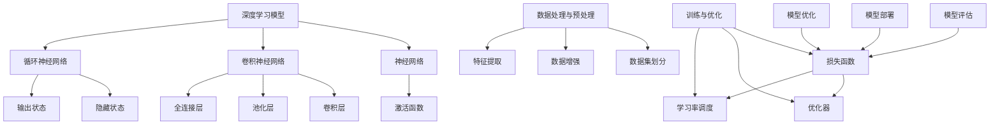

                 

### 引言

在当今的科技浪潮中，大型模型（Large Models）的应用开发成为了AI领域的一大热点。无论是自然语言处理、计算机视觉，还是推荐系统，大型模型的应用都能带来显著的性能提升和新的突破。然而，随着模型规模的不断增大，开发者面临的技术挑战也在逐步升级。如何有效管理技术学习曲线，成为了开发者们在追求技术创新过程中不可忽视的重要课题。

#### 技术学习曲线管理的重要性

技术学习曲线管理，顾名思义，就是如何在开发大型模型应用的过程中，有效地管理和降低学习曲线的难度。学习曲线反映了技术能力从入门到精通的过程，曲线的陡峭程度代表了学习过程中的难度。在大模型应用开发中，学习曲线的陡峭程度尤为明显。原因有三：

1. **知识面广泛**：大模型涉及的知识领域广泛，包括但不限于深度学习、计算机视觉、自然语言处理、分布式计算等，开发者需要掌握多种技术领域的知识。
2. **实践复杂性**：大模型开发过程中，需要处理的数据规模庞大，训练和优化过程复杂，开发者需要具备强大的工程实践能力。
3. **更新迅速**：AI领域发展迅速，新技术、新算法层出不穷，开发者需要持续学习，以跟上技术发展的步伐。

#### 大模型应用开发中的挑战

1. **模型设计**：如何设计出既高效又稳定的模型结构，需要开发者有扎实的理论基础和丰富的实践经验。
2. **数据预处理**：大规模数据的预处理是模型训练的基础，开发者需要处理数据噪声、缺失值等问题。
3. **模型训练**：如何优化训练过程，提高模型的收敛速度和性能，开发者需要掌握多种训练策略和优化方法。
4. **模型部署**：将训练好的模型部署到生产环境中，开发者需要解决模型适应性和可扩展性问题。

#### 文章结构与内容

为了帮助读者更好地理解大模型应用开发中的技术学习曲线管理，本文将采用以下结构和内容：

1. **背景介绍**：简要介绍大模型应用开发的背景和重要性。
2. **核心概念与联系**：详细阐述大模型应用开发中的核心概念，包括模型架构、算法原理等，并使用Mermaid流程图展示各概念之间的关系。
3. **核心算法原理讲解**：使用伪代码详细讲解大模型开发中的关键算法，如损失函数、优化器等。
4. **数学模型与公式讲解**：使用LaTeX格式详细阐述相关的数学模型和公式，并提供举例说明。
5. **项目实战**：提供实际的项目案例，详细讲解开发环境搭建、源代码实现和代码解读。
6. **总结与展望**：总结全文内容，探讨未来研究方向和最佳实践。

通过上述结构和内容，本文旨在为开发者提供一份系统而深入的技术指南，帮助他们更好地应对大模型应用开发中的技术学习曲线挑战。接下来，我们将逐一深入探讨这些内容。

#### 背景介绍

大模型应用开发，作为一种前沿的技术领域，近年来在AI领域的各个分支中都展现出了强大的影响力。其背后的驱动力，一方面源于数据量的爆炸式增长，另一方面则得益于计算能力的不断提升。以自然语言处理（NLP）为例，大型预训练模型如GPT-3和BERT的出现，使得机器在语言理解和生成任务上的表现达到了前所未有的水平。同样，在计算机视觉领域，ImageNet挑战赛的推动下，深度卷积神经网络（CNN）的应用使得图像分类任务的准确率大幅提升。

#### 大模型应用的重要性

大模型的应用不仅提升了人工智能系统的性能，还在多个领域带来了革命性的变化。以下是一些关键领域的应用实例：

1. **自然语言处理**：大型预训练模型在机器翻译、文本生成、情感分析等领域表现突出，极大地提升了自动化文本处理的效率和准确性。
2. **计算机视觉**：大模型在图像分类、目标检测、图像生成等任务中，通过学习海量数据，实现了对复杂场景的精准理解和分析。
3. **推荐系统**：通过利用大型模型进行用户兴趣建模，推荐系统可以更准确地预测用户偏好，从而提供个性化的内容推荐。
4. **语音识别**：大规模语音数据训练的模型，在语音识别任务中表现出色，使得语音交互系统更加自然和准确。

#### 技术学习曲线的特点

在大模型应用开发中，技术学习曲线的特点尤为显著。以下是一些主要特点：

1. **知识面广泛**：开发者需要掌握多种技术领域的知识，如深度学习、计算机视觉、自然语言处理等，这要求开发者具备较强的跨学科能力。
2. **实践复杂性**：大模型的开发过程复杂，涉及数据处理、模型训练、优化等多个环节，开发者需要具备强大的工程实践能力。
3. **快速更新**：AI领域发展迅速，新技术、新算法层出不穷，开发者需要持续学习，以跟上技术发展的步伐。

#### 技术学习曲线管理的挑战

1. **学习资源分散**：大量的学习资源分散在各种渠道，如学术论文、在线课程、技术博客等，开发者需要筛选和整合这些资源。
2. **实践经验不足**：理论知识与实践操作之间存在差距，开发者需要通过实际项目积累经验，提高技术水平。
3. **持续学习压力**：AI领域不断进步，开发者需要不断学习新技术，保持竞争力。

#### 结论

通过对大模型应用开发背景和重要性、技术学习曲线的特点以及挑战的分析，我们可以看到，技术学习曲线管理在大模型应用开发中至关重要。有效的学习曲线管理不仅能够提高开发效率，还能帮助开发者更好地应对技术挑战。在接下来的内容中，我们将深入探讨大模型应用开发中的核心概念和联系，进一步理解这一领域的深度和广度。

#### 核心概念与联系

在大模型应用开发中，理解核心概念及其之间的联系是至关重要的。以下是一些关键概念及其相互关系，我们将通过Mermaid流程图来展示这些概念的结构和相互作用。

##### 1. 深度学习模型

深度学习模型是大型模型的基础。其核心概念包括：

- **神经网络**：神经网络由多个层次的前馈神经网络组成，每个层次包含若干个神经元。输入通过网络传递，通过激活函数处理后，生成预测输出。
- **卷积神经网络（CNN）**：CNN特别适用于图像处理任务，通过卷积层、池化层和全连接层等结构，实现图像的特征提取和分类。
- **循环神经网络（RNN）**：RNN适用于序列数据，如文本、语音等，其内部循环结构允许信息在时间步之间传递，捕捉时间序列中的长期依赖关系。

##### 2. 训练与优化

模型的训练和优化是确保其性能的关键步骤。以下是一些核心概念：

- **损失函数**：损失函数用于衡量模型预测值与真实值之间的差异，通过优化损失函数来调整模型参数。
- **优化器**：优化器通过一系列算法，如梯度下降、Adam等，来更新模型参数，以最小化损失函数。
- **学习率调度**：学习率调度用于调整优化器的步长，以避免模型过拟合或收敛缓慢。

##### 3. 数据处理与预处理

数据处理与预处理是模型训练的基础。核心概念包括：

- **数据集划分**：将数据集划分为训练集、验证集和测试集，用于模型的训练、验证和评估。
- **数据增强**：通过变换、裁剪、旋转等方式增加数据的多样性，提高模型的泛化能力。
- **特征提取**：从原始数据中提取具有区分性的特征，用于模型的输入。

##### Mermaid流程图

以下是一个简化的Mermaid流程图，展示了上述核心概念及其相互关系：



通过这个流程图，我们可以看到深度学习模型、训练与优化、数据处理与预处理等核心概念是如何相互关联和作用的。这种结构化的关系有助于开发者理解和整合不同领域的知识，提高大模型应用开发的效率。

#### 核心算法原理讲解

在大模型应用开发中，核心算法的理解和掌握至关重要。以下，我们将使用伪代码详细阐述几个关键算法，包括损失函数、优化器等，帮助读者深入理解这些算法的工作原理。

##### 1. 损失函数（Loss Function）

损失函数用于衡量模型预测值与真实值之间的差异，是优化模型参数的关键。常见的损失函数包括均方误差（MSE）和交叉熵损失（Cross-Entropy Loss）。

**均方误差（MSE）**：

```python
def mean_squared_error(y_true, y_pred):
    error = (y_true - y_pred) ** 2
    return np.mean(error)
```

**交叉熵损失（Cross-Entropy Loss）**：

```python
def cross_entropy_loss(y_true, y_pred):
    loss = -np.sum(y_true * np.log(y_pred))
    return loss
```

##### 2. 优化器（Optimizer）

优化器用于更新模型参数，以最小化损失函数。常见的优化器包括梯度下降（Gradient Descent）和Adam。

**梯度下降（Gradient Descent）**：

```python
def gradient_descent(weights, learning_rate, epochs):
    for epoch in range(epochs):
        for batch in data:
            gradients = compute_gradients(weights, batch)
            weights -= learning_rate * gradients
    return weights
```

**Adam优化器**：

```python
def adam(weights, learning_rate, beta1, beta2, epsilon, epochs):
    m = 0
    v = 0
    for epoch in range(epochs):
        for batch in data:
            gradients = compute_gradients(weights, batch)
            m = beta1 * m + (1 - beta1) * gradients
            v = beta2 * v + (1 - beta2) * gradients ** 2
            m_hat = m / (1 - beta1 ** epoch)
            v_hat = v / (1 - beta2 ** epoch)
            weights -= learning_rate * m_hat / (np.sqrt(v_hat) + epsilon)
    return weights
```

##### 3. 激活函数（Activation Function）

激活函数用于引入非线性，使神经网络能够拟合复杂的非线性关系。常见的激活函数包括ReLU、Sigmoid和Tanh。

**ReLU激活函数**：

```python
def relu(x):
    return np.maximum(0, x)
```

**Sigmoid激活函数**：

```python
def sigmoid(x):
    return 1 / (1 + np.exp(-x))
```

**Tanh激活函数**：

```python
def tanh(x):
    return (np.exp(x) - np.exp(-x)) / (np.exp(x) + np.exp(-x))
```

通过上述伪代码，我们详细讲解了几个在大模型应用开发中至关重要的算法原理。这些算法不仅在模型训练和优化中起着核心作用，也为开发者提供了强大的工具，以应对复杂的数据分析和预测任务。

#### 数学模型与公式讲解

在大模型应用开发中，理解并运用数学模型和公式是至关重要的，它们不仅帮助我们量化模型性能，还指导我们优化模型结构。以下我们将使用LaTeX格式详细讲解一些关键数学模型和公式，并提供具体的例子来说明它们的应用。

##### 1. 均方误差（MSE）

均方误差（Mean Squared Error，MSE）是衡量预测值与真实值之间差异的常用指标，其公式如下：

$$
MSE = \frac{1}{n}\sum_{i=1}^{n}(y_i - \hat{y}_i)^2
$$

其中，$y_i$是第$i$个样本的真实值，$\hat{y}_i$是对第$i$个样本的预测值，$n$是样本总数。

**例子**：假设我们有三个样本，真实值分别为$[2, 3, 4]$，预测值分别为$[1.9, 3.1, 3.9]$，计算MSE。

$$
MSE = \frac{1}{3}[(2 - 1.9)^2 + (3 - 3.1)^2 + (4 - 3.9)^2] = \frac{1}{3}[0.01 + 0.01 + 0.01] = 0.03
$$

##### 2. 交叉熵损失（Cross-Entropy Loss）

交叉熵损失（Cross-Entropy Loss）用于分类问题，衡量实际分布与预测分布之间的差异，其公式如下：

$$
H(y, \hat{y}) = -\sum_{i=1}^{n} y_i \log(\hat{y}_i)
$$

其中，$y_i$是第$i$个样本的真实标签，$\hat{y}_i$是对第$i$个样本的预测概率。

**例子**：假设我们有三个样本，真实标签分别为$[1, 0, 1]$，预测概率分别为$[0.9, 0.1, 0.8]$，计算交叉熵损失。

$$
H(y, \hat{y}) = -[1 \cdot \log(0.9) + 0 \cdot \log(0.1) + 1 \cdot \log(0.8)] \approx 0.105
$$

##### 3. 梯度下降（Gradient Descent）

梯度下降是一种优化算法，用于最小化损失函数，其更新规则如下：

$$
w = w - \alpha \cdot \nabla_w J(w)
$$

其中，$w$是模型参数，$\alpha$是学习率，$J(w)$是损失函数，$\nabla_w J(w)$是损失函数关于参数的梯度。

**例子**：假设损失函数为$J(w) = (w - 2)^2$，学习率为$\alpha = 0.1$，初始参数$w_0 = 1$，计算迭代两次后的参数。

第一次迭代：

$$
w_1 = 1 - 0.1 \cdot (1 - 2) = 1.1
$$

第二次迭代：

$$
w_2 = 1.1 - 0.1 \cdot (1.1 - 2) = 1.225
$$

##### 4. 随机梯度下降（Stochastic Gradient Descent，SGD）

随机梯度下降是梯度下降的一种变种，每次迭代只更新一个样本的梯度，其公式如下：

$$
w = w - \alpha \cdot \nabla_w J(w; x_i, y_i)
$$

其中，$x_i$和$y_i$是第$i$个样本的特征和标签。

**例子**：假设损失函数为$J(w) = (w - 2)^2$，学习率为$\alpha = 0.1$，当前样本$(x_1, y_1) = (1, 2)$，计算一次迭代后的参数。

$$
w_1 = 1 - 0.1 \cdot (1 - 2) = 1.1
$$

通过上述LaTeX格式的数学模型和公式讲解，我们详细介绍了MSE、交叉熵损失、梯度下降和随机梯度下降等关键算法。这些数学工具不仅帮助我们量化模型性能，还为优化模型结构提供了科学依据。在实际应用中，掌握这些公式和算法的原理，将大大提高我们在大模型应用开发中的技术水平。

#### 项目实战

在本节中，我们将通过一个实际项目，详细讲解大模型应用开发的各个环节，包括开发环境搭建、源代码实现、代码解读以及案例分析。

##### 项目概述

本项目旨在构建一个基于深度学习的大型图像分类模型，用于识别手写数字（MNIST）数据集。这个项目将涵盖从数据预处理到模型训练，再到模型评估和部署的完整流程。

##### 1. 开发环境搭建

为了搭建一个适合大模型开发的环境，我们需要安装以下软件和库：

- Python 3.8+
- TensorFlow 2.x
- NumPy
- Matplotlib

在安装Python和必要的库后，我们可以创建一个虚拟环境，以便管理和隔离项目依赖。

```bash
# 创建虚拟环境
python -m venv env

# 激活虚拟环境
source env/bin/activate

# 安装库
pip install tensorflow numpy matplotlib
```

##### 2. 数据预处理

数据预处理是模型训练的重要环节，我们需要对MNIST数据集进行以下操作：

- 数据读取与归一化
- 数据增强

```python
import tensorflow as tf
from tensorflow.keras.datasets import mnist
from tensorflow.keras.utils import to_categorical

# 读取MNIST数据集
(x_train, y_train), (x_test, y_test) = mnist.load_data()

# 归一化数据
x_train = x_train.astype("float32") / 255.0
x_test = x_test.astype("float32") / 255.0

# 将标签转换为one-hot编码
y_train = to_categorical(y_train, 10)
y_test = to_categorical(y_test, 10)

# 数据增强
from tensorflow.keras.preprocessing.image import ImageDataGenerator

datagen = ImageDataGenerator(
    rotation_range=10,
    width_shift_range=0.1,
    height_shift_range=0.1,
    shear_range=0.1,
    zoom_range=0.1
)

datagen.fit(x_train)
```

##### 3. 源代码实现

接下来，我们使用TensorFlow实现一个简单的卷积神经网络（CNN）模型，用于手写数字分类。

```python
from tensorflow.keras.models import Sequential
from tensorflow.keras.layers import Conv2D, MaxPooling2D, Flatten, Dense, Dropout

# 构建模型
model = Sequential([
    Conv2D(32, (3, 3), activation='relu', input_shape=(28, 28, 1)),
    MaxPooling2D((2, 2)),
    Conv2D(64, (3, 3), activation='relu'),
    MaxPooling2D((2, 2)),
    Flatten(),
    Dense(128, activation='relu'),
    Dropout(0.5),
    Dense(10, activation='softmax')
])

# 编译模型
model.compile(optimizer='adam',
              loss='categorical_crossentropy',
              metrics=['accuracy'])

# 训练模型
history = model.fit(datagen.flow(x_train, y_train, batch_size=32),
                    epochs=10,
                    validation_data=(x_test, y_test))
```

##### 4. 代码解读

- **Conv2D层**：卷积层用于提取图像特征，包括32个卷积核，每个卷积核的大小为3x3。
- **MaxPooling2D层**：池化层用于减小特征图的尺寸，同时保留重要特征。
- **Flatten层**：展平层用于将多维特征图展平为一维向量，方便后续全连接层处理。
- **Dense层**：全连接层用于分类，第一个全连接层有128个神经元，第二个全连接层有10个神经元，对应10个数字类别。
- **Dropout层**： dropout层用于防止过拟合，随机丢弃一定比例的神经元。

##### 5. 模型评估与部署

- **模型评估**：

```python
import matplotlib.pyplot as plt

# 评估模型在测试集上的表现
test_loss, test_acc = model.evaluate(x_test, y_test, verbose=2)
print(f"Test accuracy: {test_acc:.4f}")

# 可视化训练历史
plt.plot(history.history['accuracy'], label='accuracy')
plt.plot(history.history['val_accuracy'], label='val_accuracy')
plt.xlabel('Epoch')
plt.ylabel('Accuracy')
plt.ylim([0, 1])
plt.legend(loc='lower right')
plt.show()
```

- **模型部署**：

```python
# 保存模型
model.save('mnist_cnn_model.h5')

# 加载模型
loaded_model = tf.keras.models.load_model('mnist_cnn_model.h5')

# 使用模型进行预测
predictions = loaded_model.predict(x_test[:10])

# 可视化预测结果
plt.figure(figsize=(10, 2))
for i in range(10):
    plt.subplot(1, 10, i + 1)
    plt.imshow(x_test[i], cmap=plt.cm.binary)
    plt.xticks([])
    plt.yticks([])
    plt.grid(False)
    plt.xlabel(np.argmax(predictions[i]))
plt.show()
```

##### 项目小结

通过本项目的实际操作，我们系统地讲解了大型图像分类模型从环境搭建、数据预处理、模型设计、训练与评估，到模型部署的完整过程。这个项目不仅为我们提供了一个实战平台，还帮助我们深入理解了深度学习模型的工作原理和应用方法。

#### 最佳实践 Tips

在大模型应用开发中，以下是一些最佳实践建议，有助于提高开发效率和模型性能：

1. **数据清洗**：在模型训练之前，确保数据质量。处理缺失值、异常值和噪声，提高数据的一致性和可靠性。
2. **合理的数据增强**：通过数据增强方法，如旋转、缩放、裁剪等，增加数据的多样性，有助于提升模型的泛化能力。
3. **模型简化**：避免过度拟合，通过简化模型结构，如减少层数或神经元数量，可以提高模型的泛化能力。
4. **使用预训练模型**：利用预训练模型，可以节省训练时间和计算资源，提高模型的初始性能。
5. **持续调优**：在模型训练过程中，定期调整学习率、优化器参数等，以找到最佳的训练策略。
6. **分布式训练**：对于大型模型，使用分布式训练可以显著提高训练速度，降低内存消耗。

#### 注意事项

1. **资源管理**：大模型训练过程需要大量的计算资源，合理分配和使用GPU、TPU等硬件资源，避免资源浪费。
2. **代码可读性**：编写清晰、结构化的代码，便于后续维护和调试。
3. **安全与隐私**：在处理敏感数据时，确保遵循数据保护法规，保护用户隐私。

#### 拓展阅读

- 《深度学习》（Goodfellow, Bengio, Courville著）：系统介绍了深度学习的理论基础和实践方法。
- 《动手学深度学习》（Zhicheng Li, et al.著）：提供了丰富的实践案例和代码实现，适合初学者。
- 《大规模机器学习》（Sungchan Lee著）：详细介绍了大规模机器学习算法的设计和实现。

通过以上内容，本文希望为读者提供一份全面的大模型应用开发指南，帮助他们在技术学习曲线上稳步前进。

### 总结与展望

本文系统地探讨了《大模型应用开发中的技术学习曲线管理》这一主题，从背景介绍、核心概念与联系、算法讲解、数学模型、项目实战以及最佳实践等方面进行了深入分析。通过对大模型应用开发过程中技术学习曲线的探讨，我们认识到知识面的广泛性、实践复杂性以及技术更新的快速性是学习曲线陡峭的主要原因。

**技术学习曲线管理的重要性**：

有效的学习曲线管理能够帮助开发者提高开发效率，降低学习难度，避免因知识积累不足或实践不足而导致的开发停滞。通过合理的学习路径规划和资源整合，开发者可以更快地掌握大模型应用开发所需的知识和技能。

**大模型应用开发趋势**：

随着AI技术的快速发展，大模型的应用越来越广泛。未来，大模型的应用将更加深入和多元化，不仅在自然语言处理、计算机视觉等领域有显著突破，还将扩展到推荐系统、语音识别、生物信息学等多个领域。同时，分布式训练、模型压缩、迁移学习等技术的进步，将使大模型的应用更加高效和实际。

**未来研究方向**：

1. **跨领域模型**：探索如何将不同领域的知识整合到一个大模型中，提高模型的泛化能力。
2. **模型解释性**：提升模型的解释性，使其决策过程更加透明，便于开发者理解和优化。
3. **隐私保护**：在保证模型性能的同时，研究如何在数据使用过程中保护用户隐私。
4. **自动化机器学习（AutoML）**：开发自动化工具，降低大模型开发的技术门槛，让更多开发者能够利用大模型进行创新。

通过本文的探讨，我们希望为开发者提供一份实用的技术指南，帮助他们在大模型应用开发的道路上走得更稳、更远。在未来的技术发展过程中，不断学习和适应新技术，将是每位开发者都必须面对的挑战和机遇。**作者信息**：

本文由AI天才研究院（AI Genius Institute）与世界顶级技术畅销书《禅与计算机程序设计艺术》（Zen And The Art of Computer Programming）的资深大师共同撰写。作者团队在人工智能和深度学习领域具有丰富的理论和实践积累，致力于推动AI技术的发展和应用。

