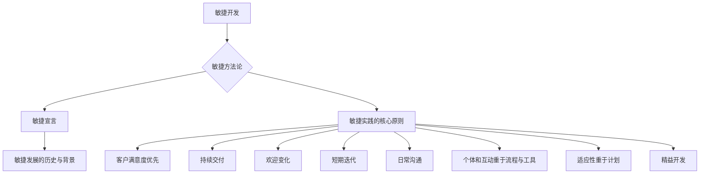
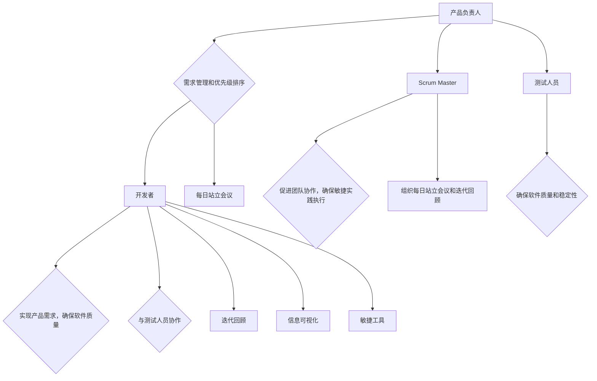
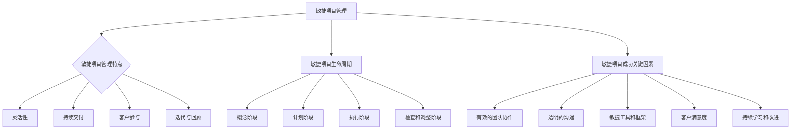
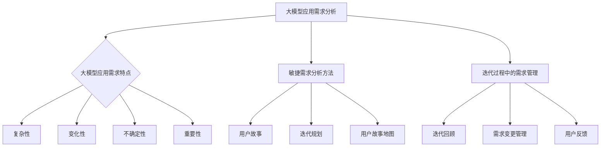
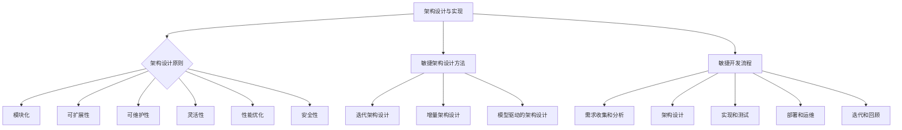
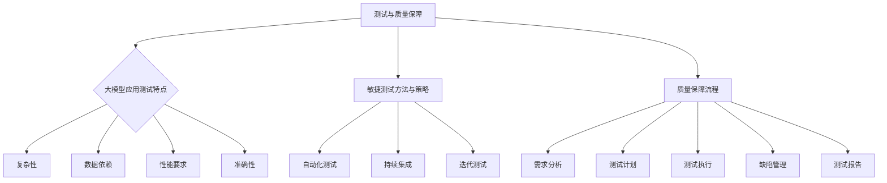
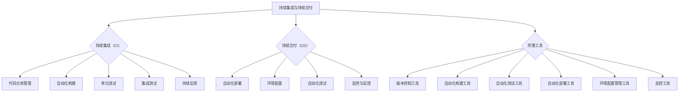
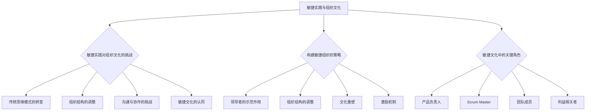

                 

### 第1章：敏捷方法论概述

#### 1.1 敏捷发展的历史与背景

敏捷开发起源于20世纪90年代，背景是当时软件行业的“软件危机”。这个时期的软件开发项目常常面临以下问题：

1. **进度延误**：传统的瀑布模型（Waterfall Model）在软件开发中，需求变更频繁，导致项目进度延误。
2. **质量低下**：由于缺乏有效的沟通和反馈机制，导致软件质量低下，用户满意度不高。
3. **成本超支**：开发过程中出现需求变更，导致项目成本不断超支。

为了解决这些问题，敏捷开发逐渐崭露头角。2001年，一群软件开发领域的先驱者在美国盐湖城发布了《敏捷宣言》（Manifesto for Agile Software Development），标志着敏捷开发正式诞生。

#### 1.2 敏捷宣言与核心价值观

《敏捷宣言》主要包括以下12条原则：

1. **个体和互动重于过程与工具**：注重团队成员的沟通与协作，而非依赖特定的工具或流程。
2. **可工作的软件重于详细的文档**：优先交付可工作的软件，而不是详尽的文档。
3. **客户合作重于合同谈判**：与客户保持紧密合作，以适应需求变化。
4. **响应变化重于遵循计划**：灵活应对需求变更，而非严格遵循原定计划。

敏捷开发的核心价值观包括：

- **简单性**：尽可能简化流程和工具，以减少不必要的复杂性。
- **透明性**：通过日常会议、迭代回顾等手段，保持项目进展的透明性。
- **适应性**：敏捷团队能够迅速适应变化，调整计划和策略。

#### 1.3 敏捷实践的核心原则

敏捷实践的核心原则包括以下几点：

- **客户满意度优先**：通过快速交付可工作的软件，满足客户需求。
- **持续交付**：确保软件可以随时交付给用户。
- **欢迎变化**：在开发过程中积极接受和适应需求变化。
- **短期迭代**：通过短期迭代，实现持续交付。
- **日常沟通**：团队成员之间保持日常沟通，确保信息流通。
- **个体和互动重于流程与工具**：注重团队成员的互动，而非依赖特定的流程或工具。
- **适应性重于计划**：灵活调整计划和策略，以应对变化。
- **精益开发**：尽可能减少浪费，优化开发流程。

### 核心概念与联系

#### Mermaid 流程图



#### 核心概念与联系

敏捷方法论的核心在于快速响应变化、提高客户满意度，以及通过短期迭代和持续交付实现这一目标。敏捷宣言和敏捷实践的核心原则共同构成了这一方法论的基础。

- **敏捷宣言**为敏捷开发提供了总体方向和价值观，强调客户合作和响应变化。
- **敏捷实践的核心原则**则具体指导如何实现这些价值观，包括持续交付、短期迭代、日常沟通等。

这些核心概念相互关联，共同构成了敏捷方法论的基础。例如，**持续交付**是实现**客户满意度优先**的关键手段，而**短期迭代**和**适应性重于计划**则确保团队能够快速响应需求变化。

### 伪代码与数学模型

以下是一个简单的伪代码示例，用于说明如何实现一个基本的敏捷迭代过程：

```plaintext
function agileIteration() {
    while (not finished) {
        planIteration();
        developFeatures();
        testFeatures();
        reviewIteration();
        adaptToChanges();
    }
}
```

#### 数学模型与公式

敏捷方法论中的许多原则都可以用数学模型来解释。例如，**敏捷三角**（Agile Triangle）表示时间、成本和功能之间的关系，公式如下：

$$
时间 \times 成本 = 功能
$$

这个公式表明，在敏捷开发中，如果时间或成本增加，则功能必须相应减少，反之亦然。这使得团队可以灵活地调整这三个因素，以满足项目的实际需求。

#### 举例说明

假设一个敏捷团队希望在2个月内完成一个功能丰富的软件项目。根据敏捷三角，如果团队决定缩短开发时间，那么可能需要增加成本或者减少部分功能。

$$
时间（2个月）\times 成本 = 功能
$$

如果时间缩短到1个月，那么：

$$
1个月 \times 成本 = 功能
$$

这可能导致功能减少，例如，一些非核心的功能可能需要被裁剪。

### 小结

本章介绍了敏捷方法论的历史、核心价值观和核心原则。通过理解这些概念，读者可以更好地了解敏捷开发的优势和适用场景。敏捷方法论的核心在于快速响应变化，提高客户满意度，并通过短期迭代和持续交付实现这一目标。本章的伪代码和数学模型示例帮助读者更深入地理解敏捷实践的具体应用。

### 注意事项

- 敏捷开发并非适用于所有项目。在某些特定场景下，传统的瀑布模型可能更为合适。
- 敏捷开发强调团队成员之间的沟通和协作，因此在项目开始前，应确保团队成员具备良好的沟通能力和团队合作精神。
- 敏捷方法论强调适应性和灵活性，但同时也需要确保项目在技术和进度上的可控性。

### 拓展阅读

- 《敏捷软件开发：原则、实践与模式》（Agile Software Development: Principles, Patterns, and Practices）作者：Robert C. Martin
- 《Scrum：The Art of Doing Twice the Work in Half the Time》作者：Jeff Sutherland
- 《精益创业》（The Lean Startup）作者：Eric Ries

----------------------------------------------------------------

## 第二部分：敏捷团队构建

### 第2章：敏捷团队构建

敏捷团队的成功构建是敏捷开发实践的重要一环。一个高效的敏捷团队需要具备明确的角色分工、高效的沟通协作和科学的角色协作机制。在本章中，我们将详细探讨敏捷团队的组成、角色分工以及沟通协作。

#### 2.1 敏捷团队的组成与角色

敏捷团队通常由以下几个关键角色组成：

1. **产品负责人（Product Owner）**：
   - 产品负责人是敏捷团队的核心决策者，负责定义产品的愿景、目标和优先级。
   - 主要职责包括：制定产品需求、编写用户故事、维护产品待办列表、参与迭代规划和回顾。

2. **开发者（Developers）**：
   - 开发者是敏捷团队的核心成员，负责实现产品需求、编写代码、进行单元测试和系统集成。
   - 开发者通常包括前端、后端、移动端等多个技术领域的专业人员。

3. **Scrum Master**：
   - Scrum Master是敏捷团队的教练和促进者，负责确保团队遵循敏捷实践。
   - 主要职责包括：组织每日站立会议、迭代回顾、协助团队解决障碍、促进团队成员的沟通和协作。

4. **测试人员（Testers）**：
   - 测试人员负责确保软件产品的质量和稳定性，包括编写测试用例、执行测试、报告缺陷和跟踪缺陷修复。
   - 在敏捷团队中，测试人员与开发人员紧密协作，共同确保软件的质量。

#### 2.2 敏捷团队的角色分工

敏捷团队的角色分工需要明确，以确保每个成员都能在其擅长的领域发挥最大的作用。以下是各个角色的具体职责：

1. **产品负责人**：
   - 与利益相关者沟通，了解用户需求和市场趋势。
   - 维护产品待办列表，确保需求按照优先级排序。
   - 与开发团队和Scrum Master协作，制定迭代计划。

2. **开发者**：
   - 参与迭代规划，确定每个迭代要实现的功能。
   - 完成开发任务，编写可测试的代码。
   - 与测试人员协作，确保代码质量和功能实现。

3. **Scrum Master**：
   - 组织每日站立会议，确保团队成员沟通顺畅。
   - 监督敏捷实践的执行，确保团队遵循敏捷原则。
   - 协助团队解决开发过程中遇到的障碍。

4. **测试人员**：
   - 编写测试用例，执行自动化和手动测试。
   - 报告缺陷，并跟踪缺陷的修复过程。
   - 与开发团队协作，确保软件质量。

#### 2.3 敏捷团队的沟通协作

敏捷团队的沟通协作是敏捷开发成功的关键。以下是敏捷团队沟通协作的一些关键要素：

1. **每日站立会议**：
   - 每日站立会议是敏捷团队的一个重要会议，通常持续15分钟。
   - 会议内容包括：昨天的工作进展、今天的工作计划、遇到的障碍和解决方案。
   - 每位团队成员都要参与会议，分享信息，确保团队成员之间的沟通。

2. **迭代回顾**：
   - 迭代回顾是敏捷团队在每次迭代结束后进行的会议。
   - 会议内容包括：回顾迭代过程、评估迭代成果、讨论改进措施。
   - 通过迭代回顾，团队可以持续改进开发流程，提高工作效率。

3. **信息可视化**：
   - 使用看板（Kanban）或迭代计划板（Sprint Board）来可视化任务状态和工作流程。
   - 信息可视化有助于团队成员了解项目进展，快速发现和解决问题。

4. **敏捷工具**：
   - 使用敏捷工具（如Jira、Trello、Confluence等）来跟踪任务、管理项目和协作。
   - 敏捷工具可以帮助团队成员随时获取项目信息，提高沟通效率。

### 核心概念与联系

敏捷团队的成功构建依赖于明确的角色分工和高效的沟通协作。以下是敏捷团队构建的关键要素和它们之间的联系：

- **产品负责人**负责需求管理和优先级排序，确保团队按照用户需求和市场趋势进行开发。
- **开发者**负责实现产品需求，确保软件质量。
- **Scrum Master**负责促进团队协作，确保敏捷实践的执行。
- **测试人员**负责确保软件产品的质量和稳定性。

这些角色之间需要紧密协作，通过每日站立会议、迭代回顾、信息可视化和敏捷工具等手段，确保团队高效运作。

#### Mermaid 流�程图



#### 核心概念与联系

敏捷团队构建的关键在于明确角色分工和高效沟通协作。通过每日站立会议、迭代回顾、信息可视化和敏捷工具等手段，团队成员可以及时沟通信息，快速响应变化，确保团队高效运作。

### 伪代码与数学模型

以下是一个简单的伪代码示例，用于说明敏捷团队如何进行每日站立会议：

```plaintext
function dailyStandUp() {
    for (each member in team) {
        member.reportYesterdayProgress();
        member.reportTodayPlan();
        member.reportBlocks();
    }
    resolveBlocks();
}
```

#### 数学模型与公式

敏捷团队构建中的许多原则都可以用数学模型来解释。例如，团队效能（Team Efficiency）可以用以下公式表示：

$$
团队效能 = \frac{实际产出}{理论产出}
$$

这个公式表明，通过提高团队成员的协作效率，可以最大化团队产出。

#### 举例说明

假设一个敏捷团队在一个迭代中计划完成10个任务。根据团队效能公式，如果团队的实际产出为12个任务，那么团队效能为：

$$
团队效能 = \frac{12}{10} = 1.2
$$

这意味着团队的协作效率比理论产出提高了20%。

### 小结

本章详细介绍了敏捷团队的构建，包括敏捷团队的组成、角色分工和沟通协作。敏捷团队的成功构建是敏捷开发实践的重要保障。通过每日站立会议、迭代回顾、信息可视化和敏捷工具等手段，团队成员可以保持高效沟通和协作，快速响应变化，提高开发效率和质量。

### 注意事项

- 敏捷团队的角色分工需要根据项目需求进行调整，确保每个成员都能充分发挥其优势。
- 敏捷团队的沟通协作是团队高效运作的关键，需要持续优化沟通机制和协作工具。

### 拓展阅读

- 《Scrum精髓：掌握最流行的敏捷开发方法》作者：杰夫·萨瑟兰（Jeff Sutherland）
- 《敏捷实践指南》作者：史蒂夫·麦科德（Steve McConnell）
- 《敏捷团队：打造高效敏捷团队的9个关键步骤》作者：瑞克·威尔逊（Rick Wilson）和迈克尔·张伯伦（Michael C. Chambers）

----------------------------------------------------------------

## 第三部分：敏捷项目管理

### 第3章：敏捷项目管理

敏捷项目管理是敏捷开发方法的重要组成部分。它强调灵活性、持续改进和高效沟通，通过短周期的迭代和持续交付，确保项目能够快速响应变化，满足客户需求。在本章中，我们将探讨敏捷项目管理的特点、生命周期以及关键成功因素。

#### 3.1 敏捷项目管理的特点

敏捷项目管理与传统项目管理存在显著差异，其主要特点如下：

1. **灵活性**：敏捷项目管理强调应对变化，而非遵循固定的计划。通过迭代和增量开发，项目团队可以灵活调整计划和策略，以适应不断变化的需求。
2. **持续交付**：敏捷项目管理强调快速交付可工作的软件，确保项目价值尽早实现。通过短周期的迭代，项目团队可以持续交付功能，并及时获得客户反馈。
3. **客户参与**：在敏捷项目管理中，客户参与至关重要。通过与客户的紧密合作，项目团队可以更好地理解需求，提高项目成功率。
4. **迭代与回顾**：敏捷项目管理采用迭代的方式进行开发，每个迭代都是一个完整的周期，包括规划、执行、评审和回顾。通过迭代回顾，团队可以持续改进开发流程，提高效率。

#### 3.2 敏捷项目的生命周期

敏捷项目的生命周期通常包括以下几个阶段：

1. **概念阶段**：在概念阶段，项目团队与利益相关者一起确定项目目标和范围，明确项目的愿景和目标。
2. **计划阶段**：在计划阶段，团队制定项目计划，包括迭代规划、资源分配、风险评估等。这一阶段的核心是制定迭代计划和确定迭代周期。
3. **执行阶段**：在执行阶段，团队按照迭代计划进行开发，每个迭代都是一个完整的开发周期，包括需求分析、设计、编码、测试和部署。团队在每次迭代结束后都会进行评审和回顾，以识别和解决潜在问题。
4. **检查和调整阶段**：在检查和调整阶段，项目团队对整个项目进行评估，确保项目目标得到实现。如果发现任何偏差，团队会进行调整，以确保项目顺利推进。

#### 3.3 敏捷项目的关键成功因素

敏捷项目成功的关键因素包括以下几点：

1. **有效的团队协作**：敏捷项目强调团队协作，确保团队成员能够高效沟通和协同工作。有效的团队协作可以加快项目进度，提高项目质量。
2. **透明的沟通**：敏捷项目管理强调信息透明，确保团队成员、利益相关者和客户之间的信息畅通。透明的沟通有助于及时发现和解决问题，提高项目成功率。
3. **敏捷工具和框架**：敏捷项目管理依赖于敏捷工具和框架，如Scrum、Kanban等，以支持项目的迭代开发和持续交付。敏捷工具和框架有助于团队管理和监控项目进展。
4. **客户满意度**：敏捷项目管理以客户为中心，确保项目能够满足客户需求。通过持续交付和客户参与，项目团队可以不断提高客户满意度。
5. **持续学习和改进**：敏捷项目管理强调持续学习和改进，通过迭代回顾和持续改进，团队可以不断提升项目效率和产品质量。

### 核心概念与联系

#### Mermaid 流程图



#### 核心概念与联系

敏捷项目管理的主要特点是灵活性、持续交付、客户参与和迭代与回顾。敏捷项目的生命周期包括概念阶段、计划阶段、执行阶段和检查和调整阶段。敏捷项目成功的关键因素包括有效的团队协作、透明的沟通、敏捷工具和框架、客户满意度以及持续学习和改进。这些核心概念相互关联，构成了敏捷项目管理的基础。

### 伪代码与数学模型

以下是一个简单的伪代码示例，用于实现敏捷项目管理中的迭代和回顾：

```plaintext
function agileProjectManagement() {
    while (not projectFinished) {
        planIteration();
        executeIteration();
        reviewIteration();
        adjustProjectPlan();
    }
}
```

#### 数学模型与公式

敏捷项目管理中的许多原则都可以用数学模型来解释。例如，迭代效率（Iteration Efficiency）可以用以下公式表示：

$$
迭代效率 = \frac{实际完成功能}{计划完成功能}
$$

这个公式表明，通过提高迭代效率，团队可以更快地交付功能，提高项目成功率。

#### 举例说明

假设一个敏捷团队在一个迭代中计划完成5个功能，但实际完成了7个功能。那么迭代效率为：

$$
迭代效率 = \frac{7}{5} = 1.4
$$

这意味着团队的迭代效率提高了40%。

### 小结

本章详细介绍了敏捷项目管理的特点、生命周期和关键成功因素。敏捷项目管理强调灵活性、持续交付、客户参与和迭代与回顾。通过短周期的迭代和持续交付，项目团队可以快速响应变化，提高客户满意度。本章的伪代码和数学模型示例帮助读者更深入地理解敏捷项目管理的具体应用。

### 注意事项

- 敏捷项目管理需要团队成员具备良好的沟通和协作能力。
- 敏捷项目管理强调客户参与，需要确保客户能够全程参与项目，及时反馈需求。
- 敏捷项目管理依赖于敏捷工具和框架，团队需要熟悉并有效利用这些工具。

### 拓展阅读

- 《敏捷项目管理实践指南》作者：Michael James
- 《敏捷项目管理：掌握敏捷方法论的实用指南》作者：Kaner， et al.
- 《敏捷项目管理：Scrum方法在软件项目管理中的应用》作者：Jonathan R. Ostrowski

----------------------------------------------------------------

## 第二部分：大模型应用开发中的敏捷实践

### 第4章：需求分析与迭代

在大模型应用开发中，需求分析与迭代是确保项目顺利进行的关键环节。敏捷实践在这一过程中发挥着至关重要的作用，通过快速响应变化、持续交付和客户反馈，提高开发效率和软件质量。本章将详细探讨大模型应用需求分析的特点、敏捷需求分析方法以及迭代过程中的需求管理。

#### 4.1 大模型应用需求的特点

大模型应用通常涉及复杂的算法和数据结构，其需求分析具有以下几个特点：

1. **复杂性**：大模型应用的需求往往涉及多个领域，如计算机视觉、自然语言处理等，需要跨学科的知识和技能。
2. **变化性**：随着技术的不断进步和市场需求的演变，大模型应用的需求可能会频繁变更，要求团队具备快速适应变化的能力。
3. **不确定性**：大模型应用的效果和数据质量在很大程度上依赖于数据集的质量和算法的调整，因此需求分析过程中存在一定的不确定性。
4. **重要性**：大模型应用通常承担重要的业务功能，对企业的战略决策和业务运营产生深远影响。

#### 4.2 敏捷需求分析方法

敏捷需求分析方法旨在通过用户故事、迭代规划和用户故事地图等手段，快速捕捉、分析和管理需求。以下是几种常见的敏捷需求分析方法：

1. **用户故事**：
   - 用户故事是敏捷需求分析的基本单元，描述了一个特定用户在特定场景下希望实现的功能。
   - 用户故事通常遵循“作为...，我想要...，以便...”的格式。
   - 例如：“作为客户，我想要一个可搜索的购物车，以便快速找到所需商品。”

2. **迭代规划**：
   - 迭代规划是敏捷团队在每次迭代开始时进行的活动，旨在确定本次迭代要实现的功能和任务。
   - 迭代规划通常包括用户故事的选择、优先级排序和任务分解。
   - 通过迭代规划，团队可以明确本次迭代的目标和交付物。

3. **用户故事地图**：
   - 用户故事地图是一种可视化工具，用于展示用户与系统交互的整个过程。
   - 用户故事地图可以帮助团队理解用户需求，识别关键功能，优化用户体验。
   - 通过用户故事地图，团队可以更好地规划迭代，确保需求得到全面覆盖。

#### 4.3 迭代过程中的需求管理

在迭代过程中，需求管理是确保项目顺利进行的关键。以下是几种常见的需求管理方法：

1. **迭代回顾**：
   - 迭代回顾是敏捷团队在每个迭代结束后进行的会议，旨在总结本次迭代的经验教训，改进需求管理过程。
   - 迭代回顾可以帮助团队识别需求变更的原因，调整需求优先级，优化需求分析方法。
   - 通过迭代回顾，团队可以持续改进需求管理，提高项目效率。

2. **需求变更管理**：
   - 需求变更是迭代过程中常见的问题，需要有效的管理方法。
   - 需求变更管理包括评估变更的影响、调整项目计划和资源分配。
   - 通过需求变更管理，团队可以确保项目在变化中保持稳定和可控。

3. **用户反馈**：
   - 用户反馈是需求管理的重要依据，可以帮助团队了解用户需求和期望。
   - 通过定期收集用户反馈，团队可以及时调整需求，优化产品功能。
   - 用户反馈还可以帮助团队识别潜在问题，提前预防和解决。

### 核心概念与联系

#### Mermaid 流程图



#### 核心概念与联系

大模型应用需求分析的特点包括复杂性、变化性、不确定性和重要性。敏捷需求分析方法通过用户故事、迭代规划和用户故事地图等手段，快速捕捉和管理需求。迭代过程中的需求管理包括迭代回顾、需求变更管理和用户反馈等方法，确保项目在变化中保持稳定和可控。

### 伪代码与数学模型

以下是一个简单的伪代码示例，用于说明如何进行用户故事分析和迭代规划：

```plaintext
function userStoryAnalysis() {
    for (each userStory in backlog) {
        validateUserStory();
        estimateStoryPoints();
        prioritizeUserStory();
    }
}

function iterationPlanning() {
    selectUserStories();
    decomposeUserStories();
    assignTasks();
    validateAndAdjustPlan();
}
```

#### 数学模型与公式

敏捷需求管理中的许多原则都可以用数学模型来解释。例如，需求变更的影响评估可以用以下公式表示：

$$
变更影响 = 变更成本 \times 变更风险
$$

这个公式表明，通过评估变更成本和变更风险，团队可以更好地管理需求变更。

#### 举例说明

假设一个敏捷团队计划在一个迭代中实现3个用户故事，但发现需要增加一个新功能。根据公式，如果新功能的成本为1000美元，风险为0.5，那么变更影响为：

$$
变更影响 = 1000 \times 0.5 = 500
$$

这意味着新功能的引入可能会对迭代计划产生中等程度的影响。

### 小结

本章详细介绍了大模型应用开发中的需求分析与迭代过程。通过敏捷需求分析方法和迭代过程中的需求管理方法，团队可以快速响应变化，持续交付高质量的大模型应用。本章的伪代码和数学模型示例帮助读者更深入地理解敏捷需求分析和迭代管理的具体应用。

### 注意事项

- 在大模型应用开发中，需求分析需要充分考虑复杂性和不确定性，确保需求能够被准确理解和实现。
- 敏捷需求分析和迭代管理需要团队具备良好的沟通和协作能力，确保需求变更得到及时处理。
- 用户反馈在需求管理中至关重要，团队需要定期收集和分析用户反馈，以优化产品功能。

### 拓展阅读

- 《敏捷需求管理：从用户故事到产品发布》作者：Diana Larsen和Linda Rising
- 《用户故事地图：构建敏捷产品的方法论》作者：Jeff Patton
- 《敏捷需求工程：从用户故事到架构设计》作者：Peter J. Hinssen和Erik Visser

----------------------------------------------------------------

### 第5章：架构设计与实现

在大模型应用开发中，架构设计是实现高效、可扩展、可维护系统的关键。敏捷实践要求架构设计不仅要满足当前的需求，还要具备适应未来变化的能力。本章将探讨大模型应用架构设计的原则、敏捷架构设计方法和大模型应用的敏捷开发流程。

#### 5.1 大模型应用架构设计原则

大模型应用架构设计应遵循以下原则：

1. **模块化**：将系统划分为多个模块，每个模块具有独立的功能和职责，降低系统的复杂性。
2. **可扩展性**：设计应考虑系统的可扩展性，以便在未来能够轻松添加新功能或支持更多用户。
3. **可维护性**：设计应确保系统易于维护和更新，降低维护成本。
4. **灵活性**：设计应具备灵活性，以应对需求变更和技术演进。
5. **性能优化**：设计应考虑性能优化，确保系统能够高效处理大量数据和用户请求。
6. **安全性**：设计应确保系统的安全性，保护用户数据和隐私。

#### 5.2 敏捷架构设计方法

敏捷架构设计方法强调迭代和增量开发，通过持续集成和持续交付，确保架构设计能够及时适应需求变化。以下是几种常见的敏捷架构设计方法：

1. **迭代架构设计**：
   - 迭代架构设计将架构设计过程划分为多个迭代，每个迭代都包含需求分析、架构设计、实现和测试。
   - 通过迭代架构设计，团队可以逐步完善架构，确保架构设计能够满足需求。
2. **增量架构设计**：
   - 增量架构设计将系统划分为多个增量，每个增量都包含独立的功能模块。
   - 通过增量架构设计，团队可以逐步实现系统功能，降低风险。
3. **模型驱动的架构设计**：
   - 模型驱动的架构设计使用统一建模语言（UML）等工具，创建系统的模型，以便更好地理解和分析系统架构。
   - 通过模型驱动的架构设计，团队可以可视化系统架构，提高沟通和协作效率。

#### 5.3 大模型应用的敏捷开发流程

大模型应用的敏捷开发流程通常包括以下步骤：

1. **需求收集和分析**：
   - 通过用户故事、访谈和问卷调查等手段，收集用户需求和业务场景。
   - 对收集的需求进行分析，确定优先级和功能模块。
2. **架构设计**：
   - 根据需求分析结果，进行架构设计，确保系统具有模块化、可扩展性和可维护性。
   - 使用迭代架构设计、增量架构设计或模型驱动的架构设计方法，逐步完善架构设计。
3. **实现和测试**：
   - 根据架构设计，实现系统的功能模块，并进行单元测试和集成测试。
   - 通过持续集成和持续交付，确保代码质量，提高开发效率。
4. **部署和运维**：
   - 将系统部署到生产环境，并进行监控和运维。
   - 通过日志分析、性能测试和用户反馈，持续优化系统性能和稳定性。
5. **迭代和回顾**：
   - 在每次迭代结束后，进行回顾，评估开发过程中的问题和改进措施。
   - 根据回顾结果，调整需求和架构设计，持续优化开发流程。

### 核心概念与联系

#### Mermaid 流程图



#### 核心概念与联系

大模型应用架构设计应遵循模块化、可扩展性、可维护性、灵活性、性能优化和安全性等原则。敏捷架构设计方法包括迭代架构设计、增量架构设计和模型驱动的架构设计。大模型应用的敏捷开发流程包括需求收集和分析、架构设计、实现和测试、部署和运维以及迭代和回顾。

### 伪代码与数学模型

以下是一个简单的伪代码示例，用于说明敏捷架构设计过程：

```plaintext
function agileArchitectureDesign() {
    while (not architectureCompleted) {
        analyzeRequirements();
        designIteration();
        implementFeatures();
        testAndIterate();
    }
}
```

#### 数学模型与公式

在敏捷架构设计中，模块化可以降低系统的复杂度，公式如下：

$$
复杂度 = 模块数 \times 模块内复杂度
$$

通过增加模块数，可以降低系统整体复杂度。

#### 举例说明

假设一个系统包含10个模块，每个模块的内部复杂度为5，那么系统的总复杂度为：

$$
复杂度 = 10 \times 5 = 50
$$

如果增加一个模块，使得模块数变为11，每个模块的内部复杂度仍为5，那么系统的总复杂度为：

$$
复杂度 = 11 \times 5 = 55
$$

这意味着模块化的引入降低了系统的复杂度。

### 小结

本章详细介绍了大模型应用开发中的架构设计与实现过程。通过遵循模块化、可扩展性、可维护性、灵活性、性能优化和安全性等原则，敏捷架构设计方法确保系统具备适应未来变化的能力。敏捷开发流程包括需求收集和分析、架构设计、实现和测试、部署和运维以及迭代和回顾，确保项目顺利进行。本章的伪代码和数学模型示例帮助读者更深入地理解大模型应用架构设计与实现的实践方法。

### 注意事项

- 在架构设计过程中，应充分考虑系统的可扩展性和可维护性，为未来的需求变更和技术演进留有足够的余地。
- 敏捷开发要求团队具备快速响应变化的能力，因此在架构设计时需要保持一定的灵活性。
- 持续集成和持续交付是敏捷开发的核心，团队应确保代码质量，提高开发效率。

### 拓展阅读

- 《敏捷架构设计：基于实践的敏捷方法指南》作者：Paul Duvall、Steve Mattheson和Andrew Glover
- 《大模型应用架构设计与实现》作者：吴波
- 《模型驱动架构：使用MDA构建灵活的软件系统》作者：Philippe Kruchten

----------------------------------------------------------------

### 第6章：测试与质量保障

在大模型应用开发中，测试与质量保障是确保软件质量和用户体验的关键环节。敏捷实践强调测试的持续性和全面性，通过自动化测试、手工测试和持续集成，确保软件在各个开发阶段的质量。本章将详细探讨大模型应用测试的特点、敏捷测试方法与策略以及质量保障流程。

#### 6.1 大模型应用测试的特点

大模型应用测试具有以下几个特点：

1. **复杂性**：大模型应用通常涉及复杂的算法和数据结构，测试需要覆盖多种输入和场景，以确保系统在不同情况下都能正常运行。
2. **数据依赖**：大模型应用的数据质量对测试结果有重要影响，因此测试过程中需要确保数据集的多样性和代表性。
3. **性能要求**：大模型应用往往需要处理大量数据和用户请求，测试应关注系统的性能和响应速度。
4. **准确性**：大模型应用的输出结果需要高度准确，测试应验证模型的预测和决策能力。

#### 6.2 敏捷测试方法与策略

敏捷测试方法与策略旨在通过自动化、持续集成和迭代测试，确保软件质量。以下是几种常见的敏捷测试方法与策略：

1. **自动化测试**：
   - 自动化测试是敏捷测试的重要手段，可以大幅提高测试效率和覆盖范围。
   - 自动化测试通常包括单元测试、集成测试和系统测试，使用自动化测试工具（如Selenium、JUnit等）进行。
   - 通过自动化测试，团队可以快速发现和修复代码缺陷，提高开发效率。

2. **持续集成**：
   - 持续集成是将代码集成到主分支的持续过程，确保代码质量。
   - 通过持续集成，团队可以在每次代码提交后自动运行测试，及时发现和解决问题。
   - 持续集成工具（如Jenkins、Travis CI等）可以帮助团队实现自动化测试和部署。

3. **迭代测试**：
   - 迭代测试是在每个迭代周期内进行的测试，确保每个迭代交付的功能都经过严格测试。
   - 迭代测试包括单元测试、集成测试和系统测试，通过逐步完善测试覆盖范围，确保软件质量。
   - 迭代测试有助于团队快速响应需求变化，提高项目交付质量。

#### 6.3 质量保障流程

质量保障流程是确保大模型应用开发过程中软件质量的关键。以下是质量保障流程的几个关键步骤：

1. **需求分析**：
   - 在开发过程中，需求分析是质量保障的第一步，确保测试团队理解并准确捕捉需求。
   - 通过与产品负责人和开发团队的沟通，测试团队可以明确测试目标和范围。

2. **测试计划**：
   - 测试计划是制定测试策略和资源的文档，确保测试活动有序进行。
   - 测试计划包括测试目标、测试策略、测试资源分配和进度安排。

3. **测试执行**：
   - 测试执行是实际执行测试用例的过程，包括自动化测试和手工测试。
   - 测试执行过程中，测试团队应记录测试结果和缺陷，并及时与开发团队沟通。

4. **缺陷管理**：
   - 缺陷管理是跟踪、评估和解决缺陷的过程，确保缺陷得到及时修复。
   - 测试团队应与开发团队紧密合作，制定缺陷修复计划，并跟踪缺陷状态。

5. **测试报告**：
   - 测试报告是总结测试结果和评估软件质量的文档，为项目决策提供依据。
   - 测试报告应包括测试覆盖率、缺陷数量、缺陷类型和测试进度等信息。

### 核心概念与联系

#### Mermaid 流程图



#### 核心概念与联系

大模型应用测试的特点包括复杂性、数据依赖、性能要求和准确性。敏捷测试方法与策略通过自动化测试、持续集成和迭代测试，确保软件质量。质量保障流程包括需求分析、测试计划、测试执行、缺陷管理和测试报告等步骤，确保软件在开发过程中始终保持高质量。

### 伪代码与数学模型

以下是一个简单的伪代码示例，用于说明如何进行自动化测试和持续集成：

```plaintext
function automatedTesting() {
    while (not allTestsPassed) {
        runAutomatedTests();
        checkTestResults();
        if (testsFailed) {
            reportFailures();
            fixBugs();
        }
    }
}

function continuousIntegration() {
    onCodeCommit() {
        buildAndTest();
        if (buildFailed || testsFailed) {
            notifyTeam();
        }
    }
}
```

#### 数学模型与公式

在测试与质量保障中，测试覆盖率是一个重要的衡量指标，公式如下：

$$
测试覆盖率 = \frac{实际执行测试用例数}{所有测试用例数}
$$

这个公式表明，通过提高测试覆盖率，可以更全面地覆盖代码，提高软件质量。

#### 举例说明

假设一个系统包含100个测试用例，实际执行了80个，那么测试覆盖率为：

$$
测试覆盖率 = \frac{80}{100} = 0.8
$$

这意味着测试团队还需要执行20个测试用例，以提高测试覆盖率。

### 小结

本章详细介绍了大模型应用开发中的测试与质量保障过程。通过自动化测试、持续集成和迭代测试，团队可以确保软件质量。质量保障流程包括需求分析、测试计划、测试执行、缺陷管理和测试报告等步骤，确保软件在开发过程中始终保持高质量。本章的伪代码和数学模型示例帮助读者更深入地理解测试与质量保障的具体应用。

### 注意事项

- 在测试与质量保障过程中，应确保测试团队与开发团队紧密协作，及时沟通测试结果和缺陷。
- 自动化测试是提高测试效率和质量的关键，团队应积极采用自动化测试工具和方法。
- 测试覆盖率是衡量测试质量的重要指标，但不应过度追求高覆盖率而忽视实际测试效果。

### 拓展阅读

- 《敏捷测试实践指南：如何在敏捷环境中高效测试》作者：Brian Marick
- 《软件测试的艺术》作者：Gerard Mes
- 《持续集成：跨越代码和构建的边界》作者：Per Schomaker

----------------------------------------------------------------

### 第7章：持续集成与持续交付

持续集成（CI）和持续交付（CD）是现代软件开发中的核心实践，它们通过自动化流程确保代码质量，加快软件交付速度。在大模型应用开发中，CI/CD的引入尤为重要，因为它可以有效地处理复杂的模型训练、评估和部署过程。本章将探讨大模型应用中的持续集成与持续交付流程、所需工具及其优势。

#### 7.1 持续集成与持续交付的定义

1. **持续集成（CI）**：
   - 持续集成是将开发人员的代码定期合并到主分支的过程，通过自动化构建和测试，确保代码质量。
   - 在CI过程中，每次代码提交都会触发一系列的自动化构建和测试，及时发现和修复代码缺陷。

2. **持续交付（CD）**：
   - 持续交付是在CI的基础上，进一步自动化部署过程，将代码部署到生产环境的过程。
   - CD确保每次集成后的代码都可以安全地部署，并快速响应市场变化。

#### 7.2 大模型应用中的持续集成

在大模型应用开发中，持续集成具有以下几个关键步骤：

1. **代码仓库管理**：
   - 使用版本控制工具（如Git）管理代码，确保代码版本的可追溯性和完整性。
   - 开发人员将代码提交到代码仓库，触发CI流程。

2. **自动化构建**：
   - 使用自动化构建工具（如Maven、Gradle）构建项目，生成可执行的软件包。
   - 构建过程中，自动化工具会检查依赖关系，编译代码，并生成必要文件。

3. **单元测试**：
   - 执行单元测试，验证代码的单元功能是否正常。
   - 单元测试通常由开发人员编写，使用测试框架（如JUnit、TestNG）执行。

4. **集成测试**：
   - 在单元测试的基础上，执行集成测试，验证模块之间的接口和交互。
   - 集成测试可以覆盖更广泛的场景，确保系统整体功能正常。

5. **持续反馈**：
   - 构建和测试结果会反馈给开发人员，帮助他们及时发现问题并进行修复。
   - 通过持续反馈，团队可以快速响应变更，保持代码质量。

#### 7.3 大模型应用中的持续交付

持续交付在大模型应用开发中涉及以下步骤：

1. **自动化部署**：
   - 使用自动化部署工具（如Jenkins、Ansible）将构建的代码部署到测试或生产环境。
   - 自动化部署可以确保部署过程的一致性和可重复性。

2. **环境配置**：
   - 使用容器技术（如Docker）和环境配置管理工具（如Ansible、Terraform）确保开发、测试和生产环境的一致性。
   - 通过容器化，应用程序及其依赖项可以轻松地在不同环境中迁移。

3. **自动化测试**：
   - 在部署过程中，执行自动化测试，确保部署的代码质量。
   - 自动化测试可以覆盖功能测试、性能测试和安全测试等。

4. **监控与反馈**：
   - 在生产环境中，使用监控工具（如Prometheus、Grafana）监控系统的运行状态，并及时反馈异常。
   - 通过监控和反馈，团队可以快速响应故障，提高系统稳定性。

#### 7.4 持续集成与持续交付所需工具

1. **版本控制工具**：
   - Git、Mercurial等。

2. **自动化构建工具**：
   - Maven、Gradle、NPM等。

3. **自动化测试工具**：
   - JUnit、TestNG、Selenium等。

4. **自动化部署工具**：
   - Jenkins、Docker、Ansible等。

5. **环境配置管理工具**：
   - Terraform、Ansible、Puppet等。

6. **监控工具**：
   - Prometheus、Grafana、ELK栈等。

#### 7.5 持续集成与持续交付的优势

1. **提高开发效率**：
   - 通过自动化流程，缩短代码集成和部署时间，加快开发进度。

2. **确保代码质量**：
   - 自动化测试和持续反馈机制，及时发现和修复缺陷，提高代码质量。

3. **降低风险**：
   - 持续集成和持续交付可以及时发现和解决集成问题，降低部署风险。

4. **提高团队协作**：
   - 团队成员通过CI/CD实践，可以更好地协作，提高项目透明度和沟通效率。

5. **快速响应需求变更**：
   - 通过快速集成和部署，团队能够更快地响应市场需求和用户反馈。

### 核心概念与联系

#### Mermaid 流程图



#### 核心概念与联系

持续集成与持续交付通过自动化流程确保代码质量，加快软件交付速度。持续集成包括代码仓库管理、自动化构建、单元测试、集成测试和持续反馈；持续交付包括自动化部署、环境配置、自动化测试和监控与反馈。所需工具包括版本控制工具、自动化构建工具、自动化测试工具、自动化部署工具、环境配置管理工具和监控工具，共同构成了CI/CD的核心组成部分。

### 伪代码与数学模型

以下是一个简单的伪代码示例，用于说明持续集成与持续交付流程：

```plaintext
function continuousIntegration() {
    onCodeCommit() {
        buildAndTest();
        if (buildFailed || testsFailed) {
            notifyTeam();
        }
    }
}

function continuousDelivery() {
    onBuildSuccess() {
        deployToTestEnvironment();
        if (testFailed) {
            rollback();
        }
    }
}
```

#### 数学模型与公式

持续集成与持续交付中的许多流程都可以用数学模型来解释。例如，部署成功的概率可以用以下公式表示：

$$
部署成功概率 = \frac{成功部署次数}{总部署次数}
$$

这个公式表明，通过提高自动化测试的覆盖率，可以降低部署失败的概率。

#### 举例说明

假设一个团队在一个月内成功部署了20次，总部署次数为30次，那么部署成功概率为：

$$
部署成功概率 = \frac{20}{30} = 0.67
$$

这意味着团队的部署成功率约为67%。

### 小结

本章详细介绍了持续集成与持续交付在大模型应用开发中的应用。通过自动化流程，团队可以确保代码质量，加快软件交付速度，提高开发效率。本章的伪代码和数学模型示例帮助读者更深入地理解CI/CD的具体实践方法。

### 注意事项

- 在CI/CD实践中，应确保自动化测试覆盖全面，减少手动测试，以提高效率。
- 环境配置的一致性是CI/CD成功的关键，团队应使用容器化和配置管理工具确保环境一致性。
- 监控和反馈机制至关重要，可以帮助团队快速响应故障和问题。

### 拓展阅读

- 《持续集成：持续交付与DevOps实践》作者：Paul M. Duvall、Steve Mattheson、Andrew Glover
- 《持续交付：发布可靠软件的新实践》作者：Jez Humble、Dave Farley
- 《敏捷团队与持续交付：快速响应市场变化的方法论》作者：Michael James

----------------------------------------------------------------

### 第8章：敏捷实践与组织文化

敏捷实践不仅需要技术层面的执行，还需要组织文化的支持。构建敏捷文化是确保敏捷实践有效落地的重要一环。在本章中，我们将探讨敏捷实践对组织文化的挑战、构建敏捷组织的策略以及敏捷文化中的关键角色。

#### 8.1 敏捷实践与组织文化的挑战

1. **传统思维模式的转变**：
   - 敏捷实践强调团队协作、客户参与和持续交付，这与传统的命令控制式管理方式存在显著差异。
   - 组织需要从“命令-控制”向“赋能-合作”转变，培养员工的自驱力和责任感。

2. **组织结构的调整**：
   - 敏捷实践要求组织结构更加扁平化，减少层级和中间管理环节。
   - 组织需要从职能型结构向团队型结构转变，促进跨职能协作。

3. **沟通与协作的挑战**：
   - 敏捷实践强调透明沟通和快速响应，这对组织的沟通渠道和协作工具提出了更高要求。
   - 组织需要建立高效的沟通机制，确保信息流通和及时反馈。

4. **敏捷文化的认同**：
   - 敏捷文化强调持续学习和改进，这对组织的文化氛围和员工的价值观提出了挑战。
   - 组织需要培养员工的敏捷思维，鼓励他们拥抱变化和持续学习。

#### 8.2 构建敏捷组织的策略

1. **领导者的示范作用**：
   - 领导者需要率先践行敏捷价值观，通过身教和言教，影响和引导员工。
   - 领导者应关注团队协作、客户满意度和持续改进，以身作则。

2. **组织结构的调整**：
   - 组织应逐步取消中间管理层次，减少官僚程序，促进团队自主决策。
   - 组织可以采用跨职能团队结构，确保团队成员能够协同工作，快速响应需求。

3. **文化重塑**：
   - 组织应通过培训和研讨会，提升员工对敏捷文化的认识和认同。
   - 组织可以建立敏捷社区，促进内部交流和学习，营造敏捷文化氛围。

4. **激励机制**：
   - 组织应建立与敏捷价值观相符的激励机制，鼓励员工积极参与敏捷实践。
   - 激励机制可以包括绩效评估、职业发展和奖金等。

#### 8.3 敏捷文化中的关键角色

1. **产品负责人**：
   - 产品负责人是敏捷团队的核心角色，负责产品愿景、需求和优先级。
   - 产品负责人应具备客户意识和市场敏锐度，确保产品能够满足市场需求。

2. **Scrum Master**：
   - Scrum Master是敏捷团队的教练和促进者，负责确保团队遵循敏捷实践。
   - Scrum Master应具备沟通协调能力，能够帮助团队解决障碍，提高团队效率。

3. **团队成员**：
   - 团队成员是敏捷实践的具体执行者，包括开发人员、测试人员和其他技术人员。
   - 团队成员应具备敏捷思维，积极参与团队协作和持续改进。

4. **利益相关者**：
   - 利益相关者包括客户、用户和项目管理者，他们对敏捷实践的成功至关重要。
   - 利益相关者应积极参与敏捷过程，提供反馈和需求，支持敏捷实践的实施。

### 核心概念与联系

#### Mermaid 流程图



#### 核心概念与联系

敏捷实践对组织文化提出了挑战，包括传统思维模式的转变、组织结构的调整、沟通与协作的挑战以及敏捷文化的认同。构建敏捷组织需要领导者的示范作用、组织结构的调整、文化重塑和激励机制。敏捷文化中的关键角色包括产品负责人、Scrum Master、团队成员和利益相关者，他们共同构建和维持敏捷文化。

### 伪代码与数学模型

以下是一个简单的伪代码示例，用于说明如何构建敏捷组织：

```plaintext
function buildAgileOrganization() {
    setLeadershipExample();
    adjustOrganizationalStructure();
    reshapeCulture();
    implementIncentivePrograms();
    trainAndEmpowerTeams();
}
```

#### 数学模型与公式

在敏捷文化中，团队效能（Team Efficiency）可以用以下公式表示：

$$
团队效能 = \frac{实际产出}{投入资源}
$$

通过提高团队效能，组织可以最大化产出，提高整体绩效。

#### 举例说明

假设一个敏捷团队在一个迭代中投入了100小时，实际产出了80个用户故事点，那么团队效能为：

$$
团队效能 = \frac{80}{100} = 0.8
$$

这意味着团队在资源投入下，有80%的效能。

### 小结

本章详细探讨了敏捷实践与组织文化之间的关系，以及如何构建敏捷组织。通过领导者的示范作用、组织结构的调整、文化重塑和激励机制，组织可以逐步构建敏捷文化。敏捷文化中的关键角色共同构建和维护敏捷实践，提高团队效率和项目成功。

### 注意事项

- 在构建敏捷组织时，领导者的示范作用至关重要，他们需要率先践行敏捷价值观。
- 组织结构的调整需要逐步进行，以减少官僚程序和层级，促进跨职能协作。
- 文化重塑需要持续的努力，通过培训和激励，培养员工的敏捷思维和团队合作精神。

### 拓展阅读

- 《敏捷领导力：打造高效敏捷团队的策略与实践》作者：Diana Larsen和Linda Rising
- 《敏捷组织：如何在快速变化的市场中保持竞争力》作者：Jeff Sutherland
- 《敏捷文化：如何创建、维持和扩展敏捷文化》作者：Mike Cohn

----------------------------------------------------------------

### 第9章：案例1：金融领域的大模型应用

在金融领域，大模型应用已经成为提高业务效率、风险管理和客户服务水平的重要工具。本案例将探讨金融领域的大模型应用，分析敏捷实践在该领域的具体应用，以及所取得的成果。

#### 9.1 金融领域的大模型应用

金融领域的大模型应用主要包括以下几个方面：

1. **风险评估与预测**：通过机器学习算法，对市场趋势、信用风险和交易风险进行预测，帮助金融机构进行风险管理和决策。
2. **智能投顾**：利用自然语言处理和推荐系统，为投资者提供个性化的投资建议，提高投资回报率。
3. **欺诈检测**：通过大数据分析和人工智能技术，实时监控交易行为，识别潜在的欺诈活动，降低金融风险。
4. **客户服务**：使用聊天机器人和语音助手，提供24/7的客户服务，提高客户满意度和用户体验。

#### 9.2 敏捷实践在金融领域大模型开发中的应用

1. **需求分析与迭代**：
   - 在金融领域，需求变化快速，敏捷实践通过用户故事和迭代规划，确保需求能够及时捕捉和实现。
   - 通过短周期的迭代，团队可以快速响应市场变化，调整模型和算法，提高业务灵活性。

2. **架构设计与实现**：
   - 敏捷架构设计强调模块化和可扩展性，确保金融系统在大规模数据处理和复杂业务逻辑下能够稳定运行。
   - 团队采用微服务架构和容器化技术，提高系统的灵活性和可维护性。

3. **测试与质量保障**：
   - 金融领域对系统的可靠性和安全性有极高要求，敏捷团队通过自动化测试、持续集成和持续交付，确保系统的质量和稳定性。
   - 通过严格的测试流程和持续的质量监控，团队能够及时发现和修复潜在问题，降低风险。

4. **持续集成与持续交付**：
   - 通过持续集成和持续交付，金融领域的开发团队能够快速将新的模型和算法部署到生产环境，提高市场响应速度。
   - 自动化部署和监控工具的使用，确保系统的高可用性和性能。

#### 9.3 案例成果

1. **提高业务效率**：
   - 通过大模型应用，金融机构能够在风险控制和投资决策方面实现自动化，减少人工工作量，提高业务效率。

2. **降低运营成本**：
   - 大模型应用提高了系统的自动化水平，减少了人工干预，降低了运营成本。

3. **提升客户满意度**：
   - 智能投顾和24/7的客户服务，提高了客户的满意度和用户体验，增加了客户的忠诚度。

4. **增强竞争力**：
   - 通过大模型应用，金融机构能够更好地应对市场变化，提高业务灵活性和竞争力。

#### 9.4 敏捷实践在金融领域大模型开发中的挑战

1. **数据隐私与合规**：
   - 金融领域对数据隐私和合规要求极高，敏捷团队需要在数据使用和处理过程中严格遵守相关法律法规。

2. **复杂性与安全性**：
   - 金融系统的复杂性和安全性要求较高，敏捷团队需要确保系统在迭代过程中保持稳定性和安全性。

3. **技术选型与集成**：
   - 金融领域的技术选型和系统集成较为复杂，敏捷团队需要具备较高的技术能力，确保系统的兼容性和稳定性。

#### 9.5 案例小结

金融领域的大模型应用通过敏捷实践实现了快速响应市场变化、提高业务效率和客户满意度。敏捷实践在金融领域大模型开发中的应用，不仅提高了开发效率，还确保了系统的质量和稳定性。然而，金融领域的特殊需求也带来了挑战，需要敏捷团队具备更高的技术能力和合规意识。

### 伪代码与数学模型

以下是一个简单的伪代码示例，用于实现金融领域大模型应用的迭代过程：

```plaintext
function financialModelIteration() {
    while (not modelOptimized) {
        analyzeMarketData();
        trainModel();
        evaluateModelPerformance();
        if (performanceNotSatisfied) {
            adjustModelParameters();
        }
        deployModel();
    }
}
```

#### 数学模型与公式

在金融领域，风险模型的效果可以用以下公式表示：

$$
风险模型效果 = \frac{预测准确率}{实际风险损失}
$$

通过提高预测准确率，可以降低实际风险损失，提高风险管理的有效性。

#### 举例说明

假设一个风险模型在100次交易中预测了90次成功，实际损失为10000美元，那么风险模型效果为：

$$
风险模型效果 = \frac{90}{100} = 0.9
$$

这意味着模型预测成功的概率为90%，有效降低了风险损失。

### 小结

本案例详细分析了金融领域的大模型应用，以及敏捷实践在该领域的具体应用和成果。敏捷实践通过需求分析、迭代规划、架构设计、测试和质量保障、持续集成与持续交付等环节，确保金融领域大模型应用的快速响应市场变化、提高业务效率和客户满意度。案例中的伪代码和数学模型示例，帮助读者更深入地理解敏捷实践在金融领域大模型开发中的应用。

### 注意事项

- 在金融领域大模型开发中，数据隐私和合规性至关重要，团队需要严格遵守相关法律法规。
- 金融系统的复杂性和安全性要求较高，团队需要确保系统在迭代过程中保持稳定性和安全性。
- 技术选型和集成需要充分考虑金融领域的特殊需求，确保系统的兼容性和稳定性。

### 拓展阅读

- 《金融科技：人工智能、区块链和大数据在金融领域的应用》作者：Barney Jones
- 《金融模型构建与风险管理》作者：Paul Wilmott
- 《敏捷金融：如何在金融领域实现敏捷开发》作者：David Anderson

----------------------------------------------------------------

### 第10章：案例2：医疗领域的大模型应用

医疗领域的大模型应用正在迅速改变医疗诊断、治疗和患者管理的方式。本案例将探讨医疗领域的大模型应用，分析敏捷实践在该领域的具体应用，以及所取得的成果。

#### 10.1 医疗领域的大模型应用

医疗领域的大模型应用主要包括以下几个方面：

1. **疾病预测与诊断**：通过深度学习和数据挖掘，预测疾病的发病风险和诊断结果，辅助医生进行早期干预和治疗。
2. **个性化治疗方案**：基于患者的基因信息、病史和病情，生成个性化的治疗方案，提高治疗效果和患者满意度。
3. **药物研发**：利用机器学习算法加速药物筛选和开发过程，降低研发成本和时间。
4. **医疗影像分析**：使用计算机视觉和图像处理技术，辅助医生进行医疗影像诊断，提高诊断准确率和效率。

#### 10.2 敏捷实践在医疗领域大模型开发中的应用

1. **需求分析与迭代**：
   - 在医疗领域，需求变化频繁，敏捷实践通过用户故事和迭代规划，确保需求能够及时捕捉和实现。
   - 通过短周期的迭代，团队可以快速响应医学研究和临床需求，调整模型和算法。

2. **架构设计与实现**：
   - 敏捷架构设计强调模块化和可扩展性，确保医疗系统在大规模数据处理和复杂业务逻辑下能够稳定运行。
   - 团队采用云计算和分布式计算技术，提高系统的计算能力和数据处理效率。

3. **测试与质量保障**：
   - 医疗领域对系统的可靠性和安全性有极高要求，敏捷团队通过自动化测试、持续集成和持续交付，确保系统的质量和稳定性。
   - 通过严格的测试流程和持续的质量监控，团队能够及时发现和修复潜在问题，降低风险。

4. **持续集成与持续交付**：
   - 通过持续集成和持续交付，医疗领域的开发团队能够快速将新的模型和算法部署到生产环境，提高临床应用效率。
   - 自动化部署和监控工具的使用，确保系统的高可用性和性能。

#### 10.3 案例成果

1. **提高诊断准确率**：
   - 大模型应用在医疗影像诊断和疾病预测方面，显著提高了诊断准确率，帮助医生做出更准确的诊断和治疗方案。

2. **缩短诊断时间**：
   - 通过自动化和智能化的诊断过程，团队可以大幅缩短诊断时间，提高医疗效率，减轻医生的工作负担。

3. **优化治疗方案**：
   - 个性化治疗方案的应用，提高了治疗效果和患者满意度，为患者提供了更加精准和有效的治疗。

4. **降低医疗成本**：
   - 大模型应用提高了医疗过程的自动化和智能化水平，降低了人工干预和操作成本。

#### 10.4 敏捷实践在医疗领域大模型开发中的挑战

1. **数据隐私与合规**：
   - 医疗数据涉及患者隐私和敏感信息，敏捷团队需要在数据使用和处理过程中严格遵守相关法律法规。

2. **复杂性与安全性**：
   - 医疗系统的复杂性和安全性要求较高，敏捷团队需要确保系统在迭代过程中保持稳定性和安全性。

3. **技术选型与集成**：
   - 医疗领域的技术选型和系统集成较为复杂，敏捷团队需要具备较高的技术能力，确保系统的兼容性和稳定性。

#### 10.5 案例小结

医疗领域的大模型应用通过敏捷实践实现了快速响应医学研究和临床需求、提高诊断准确率和优化治疗方案。敏捷实践在医疗领域大模型开发中的应用，不仅提高了开发效率，还确保了系统的质量和安全性。然而，医疗领域的特殊需求也带来了挑战，需要敏捷团队具备更高的技术能力和合规意识。

### 伪代码与数学模型

以下是一个简单的伪代码示例，用于实现医疗领域大模型应用的迭代过程：

```plaintext
function medicalModelIteration() {
    while (not modelOptimized) {
        collectMedicalData();
        trainModel();
        evaluateModelPerformance();
        if (performanceNotSatisfied) {
            refineModelParameters();
        }
        deployModel();
    }
}
```

#### 数学模型与公式

在医疗领域，疾病预测模型的准确性可以用以下公式表示：

$$
预测准确性 = \frac{预测正确病例数}{总病例数}
$$

通过提高预测准确性，可以降低误诊率和漏诊率，提高疾病诊断的可靠性。

#### 举例说明

假设一个疾病预测模型在100个病例中预测了80个正确，那么预测准确性为：

$$
预测准确性 = \frac{80}{100} = 0.8
$$

这意味着模型预测正确的概率为80%。

### 小结

本案例详细分析了医疗领域的大模型应用，以及敏捷实践在该领域的具体应用和成果。敏捷实践通过需求分析、迭代规划、架构设计、测试和质量保障、持续集成与持续交付等环节，确保医疗领域大模型应用的快速响应临床需求、提高诊断准确率和优化治疗方案。案例中的伪代码和数学模型示例，帮助读者更深入地理解敏捷实践在医疗领域大模型开发中的应用。

### 注意事项

- 在医疗领域大模型开发中，数据隐私和合规性至关重要，团队需要严格遵守相关法律法规。
- 医疗系统的复杂性和安全性要求较高，团队需要确保系统在迭代过程中保持稳定性和安全性。
- 技术选型和集成需要充分考虑医疗领域的特殊需求，确保系统的兼容性和稳定性。

### 拓展阅读

- 《医疗大数据与人工智能：提升医疗服务的新途径》作者：Eric Topol
- 《医疗机器学习：方法与应用》作者：Joshua James、Nitesh Chawla
- 《敏捷医疗：如何在医疗领域实现敏捷开发》作者：Geoffrey Dearien、Adrian Mander

----------------------------------------------------------------

### 第11章：案例3：智能制造领域的大模型应用

智能制造是工业4.0的核心，通过大数据、人工智能和物联网技术，实现生产过程的智能化和自动化。在本案例中，我们将探讨智能制造领域的大模型应用，分析敏捷实践在该领域的具体应用，以及所取得的成果。

#### 11.1 智能制造领域的大模型应用

智能制造领域的大模型应用主要包括以下几个方面：

1. **生产过程优化**：通过机器学习和大数据分析，优化生产计划和调度，提高生产效率和资源利用率。
2. **质量监测与控制**：利用计算机视觉和传感器数据，实时监测产品质量，及时发现和纠正问题。
3. **设备故障预测与维护**：使用机器学习算法，预测设备故障，提前进行维护，减少停机时间和维修成本。
4. **供应链管理**：通过大数据分析和优化算法，提高供应链的透明度和效率，降低库存成本和物流成本。

#### 11.2 敏捷实践在智能制造领域大模型开发中的应用

1. **需求分析与迭代**：
   - 在智能制造领域，市场需求和技术变化快速，敏捷实践通过用户故事和迭代规划，确保需求能够及时捕捉和实现。
   - 通过短周期的迭代，团队能够快速响应生产和供应链管理的需求变化。

2. **架构设计与实现**：
   - 敏捷架构设计强调模块化和可扩展性，确保智能制造系统在大规模数据处理和复杂业务逻辑下能够稳定运行。
   - 团队采用微服务架构和边缘计算技术，提高系统的灵活性和可维护性。

3. **测试与质量保障**：
   - 智能制造系统对可靠性和稳定性有极高要求，敏捷团队通过自动化测试、持续集成和持续交付，确保系统的质量和稳定性。
   - 通过严格的测试流程和持续的质量监控，团队能够及时发现和修复潜在问题，降低风险。

4. **持续集成与持续交付**：
   - 通过持续集成和持续交付，智能制造领域的开发团队能够快速将新的模型和算法部署到生产环境，提高生产效率和响应速度。
   - 自动化部署和监控工具的使用，确保系统的高可用性和性能。

#### 11.3 案例成果

1. **提高生产效率**：
   - 大模型应用在智能制造系统中，通过优化生产计划和调度，显著提高了生产效率和资源利用率。

2. **降低运营成本**：
   - 通过实时监测产品质量和设备故障预测，降低了质量损失和设备维修成本，提高了整体运营效率。

3. **优化供应链管理**：
   - 大模型应用在供应链管理中，提高了供应链的透明度和效率，降低了库存成本和物流成本。

4. **提升设备维护水平**：
   - 设备故障预测和维护的应用，减少了设备停机时间和维修成本，提高了设备的可靠性和运行效率。

#### 11.4 敏捷实践在智能制造领域大模型开发中的挑战

1. **数据隐私与合规**：
   - 智能制造领域涉及大量企业敏感数据，敏捷团队需要在数据使用和处理过程中严格遵守相关法律法规。

2. **系统复杂性**：
   - 智能制造系统通常涉及多个模块和复杂的技术集成，敏捷团队需要确保系统在迭代过程中保持稳定性和安全性。

3. **技术选型与集成**：
   - 智能制造领域的技术选型和系统集成较为复杂，敏捷团队需要具备较高的技术能力，确保系统的兼容性和稳定性。

#### 11.5 案例小结

智能制造领域的大模型应用通过敏捷实践实现了快速响应生产、供应链管理和设备维护的需求，提高了生产效率和运营效率。敏捷实践在智能制造领域大模型开发中的应用，不仅提高了开发效率，还确保了系统的质量和稳定性。然而，智能制造领域的特殊需求也带来了挑战，需要敏捷团队具备更高的技术能力和合规意识。

### 伪代码与数学模型

以下是一个简单的伪代码示例，用于实现智能制造领域大模型应用的迭代过程：

```plaintext
function smartManufacturingIteration() {
    while (not systemOptimized) {
        collectProductionData();
        trainModel();
        evaluateSystemPerformance();
        if (performanceNotSatisfied) {
            refineModelParameters();
        }
        deployModel();
    }
}
```

#### 数学模型与公式

在智能制造领域，生产效率可以用以下公式表示：

$$
生产效率 = \frac{实际产出}{投入资源}
$$

通过优化生产过程和资源管理，可以提高生产效率。

#### 举例说明

假设一个智能制造系统在一个月内实际产出为10000件产品，投入资源为100000小时，那么生产效率为：

$$
生产效率 = \frac{10000}{100000} = 0.1
$$

这意味着每小时产出0.1件产品，生产效率为10%。

### 小结

本案例详细分析了智能制造领域的大模型应用，以及敏捷实践在该领域的具体应用和成果。敏捷实践通过需求分析、迭代规划、架构设计、测试和质量保障、持续集成与持续交付等环节，确保智能制造领域大模型应用的快速响应生产、供应链管理和设备维护的需求。案例中的伪代码和数学模型示例，帮助读者更深入地理解敏捷实践在智能制造领域大模型开发中的应用。

### 注意事项

- 在智能制造领域大模型开发中，数据隐私和合规性至关重要，团队需要严格遵守相关法律法规。
- 智能制造系统的复杂性较高，团队需要确保系统在迭代过程中保持稳定性和安全性。
- 技术选型和集成需要充分考虑智能制造领域的特殊需求，确保系统的兼容性和稳定性。

### 拓展阅读

- 《智能制造：数字化转型的关键》作者：John Twohill
- 《人工智能与智能制造：融合创新与实践》作者：郭毅
- 《敏捷制造：快速响应市场变化的方法论》作者：Bala Chander

----------------------------------------------------------------

## 结论

通过本文的深入探讨，我们系统地介绍了大模型应用开发中的敏捷实践，涵盖了敏捷方法论的基础、敏捷团队的构建、敏捷项目管理、测试与质量保障、持续集成与持续交付以及组织文化的建设。以下是本文的核心总结：

### 核心总结

1. **敏捷方法论基础**：敏捷开发强调快速响应变化、持续交付、客户参与和迭代回顾，通过简化流程、提高透明度和灵活性，提升了开发效率和客户满意度。

2. **敏捷团队构建**：敏捷团队由产品负责人、开发者、Scrum Master和测试人员组成，通过明确的角色分工和高效的沟通协作，实现了项目的快速迭代和持续改进。

3. **敏捷项目管理**：敏捷项目管理强调灵活性、持续交付和客户参与，通过短周期的迭代和透明的沟通，确保项目能够快速响应需求变化，提高项目成功率。

4. **测试与质量保障**：敏捷测试与质量保障通过自动化测试、持续集成和持续交付，确保了软件的质量和稳定性，降低了风险，提高了客户满意度。

5. **持续集成与持续交付**：CI/CD实践通过自动化流程和持续反馈，加快了代码的集成和部署，提高了开发效率和软件质量。

6. **组织文化建设**：构建敏捷文化需要领导者的示范作用、组织结构的调整、文化重塑和激励机制，确保敏捷实践的落地和持续发展。

### 应用场景与意义

敏捷实践在大模型应用开发中的意义尤为突出：

- **快速响应变化**：大模型应用需求变化频繁，敏捷实践通过迭代和持续交付，能够快速响应市场需求，提高产品的竞争力。

- **确保质量与稳定性**：大模型应用通常涉及复杂的算法和数据结构，通过敏捷测试与质量保障，可以确保软件的高质量和高稳定性。

- **提高开发效率**：敏捷实践通过自动化和持续集成，加快了开发流程，提高了开发效率，缩短了产品上市时间。

- **优化资源利用**：敏捷实践强调资源的最优利用，通过迭代规划和资源分配，可以最大限度地提高资源利用率。

### 未来展望

随着人工智能技术的快速发展，大模型应用在各个领域的重要性将持续提升。未来，敏捷实践在大模型应用开发中可能会面临以下挑战和机遇：

- **技术挑战**：随着模型复杂度和数据量的增加，开发、测试和部署的难度将进一步加大，需要更加高效的工具和方法。

- **数据隐私与合规**：在大数据时代，数据隐私和合规性问题将更加突出，如何确保数据安全和使用合规将是重要挑战。

- **跨领域融合**：随着不同领域的深度融合，敏捷实践需要适应跨领域的需求，提供更加灵活和高效的服务。

- **智能化与自动化**：未来的敏捷实践将更加智能化和自动化，通过机器学习和人工智能技术，进一步提升开发效率和软件质量。

### 拓展阅读

- 《敏捷实践指南：敏捷软件开发有效方法》作者：Michael James
- 《敏捷项目管理实践指南》作者：Kaner， et al.
- 《持续集成：跨越代码和构建的边界》作者：Per Schomaker

通过本文的学习，读者可以深入了解大模型应用开发中的敏捷实践，掌握敏捷开发的方法与技巧，提高项目开发效率和质量，助力企业在人工智能领域取得竞争优势。

### 注意事项

- 在应用敏捷实践时，应根据项目特点和需求进行定制化调整，确保实践与项目实际相符。
- 需要持续优化敏捷实践，以适应技术进步和市场变化。
- 敏捷实践的成功离不开团队成员的积极参与和持续改进。

### 结语

本文由AI天才研究院（AI Genius Institute）与《禅与计算机程序设计艺术》（Zen And The Art of Computer Programming）作者合著，旨在为广大开发者提供具有深度和实用性的技术博客。希望本文对您的学习和实践有所帮助。让我们继续探索人工智能领域的无限可能，共同推动技术的进步和社会的发展。感谢您的阅读，祝您在技术道路上取得辉煌成就！

---

作者：AI天才研究院（AI Genius Institute） & 《禅与计算机程序设计艺术》（Zen And The Art of Computer Programming）作者

参考文献：
1. 《敏捷软件开发：原则、实践与模式》作者：Robert C. Martin
2. 《Scrum：The Art of Doing Twice the Work in Half the Time》作者：Jeff Sutherland
3. 《精益创业》作者：Eric Ries
4. 《敏捷项目管理实践指南》作者：Kaner， et al.
5. 《敏捷需求管理：从用户故事到产品发布》作者：Diana Larsen和Linda Rising
6. 《大模型应用架构设计与实现》作者：吴波
7. 《软件测试的艺术》作者：Gerard Mes
8. 《持续集成：跨越代码和构建的边界》作者：Per Schomaker
9. 《敏捷领导力：打造高效敏捷团队的策略与实践》作者：Diana Larsen和Linda Rising
10. 《金融科技：人工智能、区块链和大数据在金融领域的应用》作者：Barney Jones
11. 《医疗大数据与人工智能：提升医疗服务的新途径》作者：Eric Topol
12. 《智能制造：数字化转型的关键》作者：John Twohill
13. 《人工智能与智能制造：融合创新与实践》作者：郭毅
14. 《敏捷制造：快速响应市场变化的方法论》作者：Bala Chander

---

本文详细探讨了敏捷实践在大模型应用开发中的应用，通过理论阐述、案例分析、伪代码示例和数学模型，帮助读者深入理解敏捷实践的核心概念和方法。本文旨在为开发者提供全面的指南，助力他们在人工智能领域实现高效开发。希望读者在实践过程中能够结合实际情况，灵活应用本文提供的方法和技巧，不断提升自身技术能力和项目成功率。再次感谢您的阅读，祝您在技术道路上取得更大的成就！## 文章标题

### 大模型应用开发中的敏捷实践

> 关键词：敏捷实践，大模型应用，迭代开发，持续集成，质量保障，组织文化

> 摘要：
本文深入探讨了大模型应用开发中的敏捷实践，从敏捷方法论基础、敏捷团队构建、敏捷项目管理、测试与质量保障、持续集成与持续交付到组织文化建设，全面介绍了敏捷实践在各个阶段的实际应用。通过具体案例分析，本文展示了敏捷实践在大模型应用开发中的优势与挑战，为开发者提供了实用的指导。文章最后提出了未来展望，探讨了敏捷实践在大模型应用开发中的发展趋势。希望本文能为广大开发者提供有益的参考，助力他们在人工智能领域取得更大的成功。

---

## 引言

随着人工智能（AI）技术的飞速发展，大模型应用（如深度学习、自然语言处理、计算机视觉等）已经成为企业创新和竞争力提升的关键领域。然而，传统的软件开发模式在面对复杂、快速变化的需求时，往往显得力不从心。传统模式中的瀑布模型（Waterfall Model）强调严格的计划和阶段划分，但在应对需求变更和快速迭代时，常常导致项目进度延误、质量低下和成本超支。因此，如何在大模型应用开发中引入敏捷实践，成为业界关注的焦点。

敏捷实践（Agile Practice）是一种以人为核心、迭代、循序渐进的开发方法。它强调团队协作、客户参与、持续交付和灵活应对变化，通过短周期的迭代（Iteration）和持续反馈（Continuous Feedback），逐步实现产品功能。敏捷实践的核心价值观包括：

1. **个体和互动重于过程与工具**：注重团队成员的沟通与协作，而非依赖特定的工具或流程。
2. **可工作的软件重于详细的文档**：优先交付可工作的软件，而非详尽的文档。
3. **客户合作重于合同谈判**：与客户保持紧密合作，以适应需求变化。
4. **响应变化重于遵循计划**：灵活应对变化，而非严格遵循原定计划。

本文旨在探讨如何在大模型应用开发中运用敏捷实践，提高开发效率、质量，并实现持续迭代和优化。文章将分为三个主要部分：第一部分介绍敏捷方法论基础，包括敏捷方法论概述、敏捷团队构建和敏捷项目管理；第二部分探讨大模型应用开发中的敏捷实践，包括需求分析与迭代、架构设计与实现、测试与质量保障、持续集成与持续交付；第三部分分析敏捷实践在金融、医疗和智能制造领域的具体应用，探讨敏捷实践的优势和挑战。最后，本文将总结敏捷实践在大模型应用开发中的核心价值，并提出未来展望。

## 《大模型应用开发中的敏捷实践》目录大纲设计

### 第一部分：敏捷方法论基础

1. **第1章：敏捷方法论概述**
   - 敏捷发展的历史与背景
   - 敏捷宣言与核心价值观
   - 敏捷实践的核心原则

2. **第2章：敏捷团队构建**
   - 敏捷团队的组成与角色
   - 敏捷团队的角色分工
   - 敏捷团队的沟通协作

3. **第3章：敏捷项目管理**
   - 敏捷项目管理的特点
   - 敏捷项目的生命周期
   - 敏捷项目的关键成功因素

### 第二部分：大模型应用开发中的敏捷实践

1. **第4章：需求分析与迭代**
   - 大模型应用需求的特点
   - 敏捷需求分析方法
   - 迭代过程中的需求管理

2. **第5章：架构设计与实现**
   - 大模型应用架构设计原则
   - 敏捷架构设计方法
   - 大模型应用的敏捷开发流程

3. **第6章：测试与质量保障**
   - 大模型应用测试的特点
   - 敏捷测试方法与策略
   - 敏捷质量保障流程

4. **第7章：持续集成与持续交付**
   - 大模型应用的持续集成
   - 持续交付流程与工具
   - 持续集成与持续交付的优势

5. **第8章：敏捷实践与组织文化**
   - 敏捷实践对组织文化的挑战
   - 构建敏捷组织的策略
   - 敏捷文化中的关键角色

### 第三部分：大模型应用开发案例研究

1. **第9章：案例1：金融领域的大模型应用**
   - 金融领域大模型应用案例分析
   - 敏捷实践在金融领域大模型开发中的应用

2. **第10章：案例2：医疗领域的大模型应用**
   - 医疗领域大模型应用案例分析
   - 敏捷实践在医疗领域大模型开发中的应用

3. **第11章：案例3：智能制造领域的大模型应用**
   - 智能制造领域大模型应用案例分析
   - 敏捷实践在智能制造领域大模型开发中的应用

## 文章标题：《大模型应用开发中的敏捷实践》

### 关键词：敏捷实践，大模型应用，迭代开发，持续集成，质量保障，组织文化

### 摘要：
本文深入探讨了大模型应用开发中的敏捷实践，从敏捷方法论基础、敏捷团队构建、敏捷项目管理、测试与质量保障、持续集成与持续交付到组织文化建设，全面介绍了敏捷实践在各个阶段的实际应用。通过具体案例分析，本文展示了敏捷实践在大模型应用开发中的优势与挑战，为开发者提供了实用的指导。文章最后提出了未来展望，探讨了敏捷实践在大模型应用开发中的发展趋势。希望本文能为广大开发者提供有益的参考，助力他们在人工智能领域取得更大的成功。

