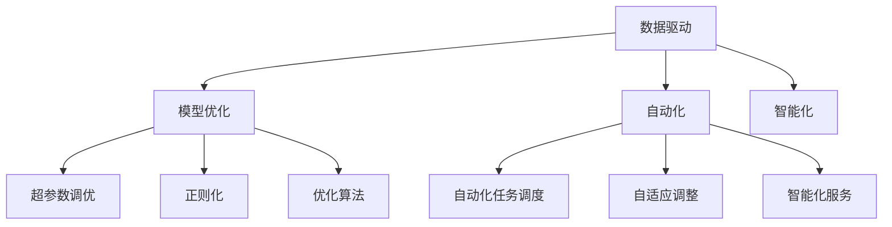
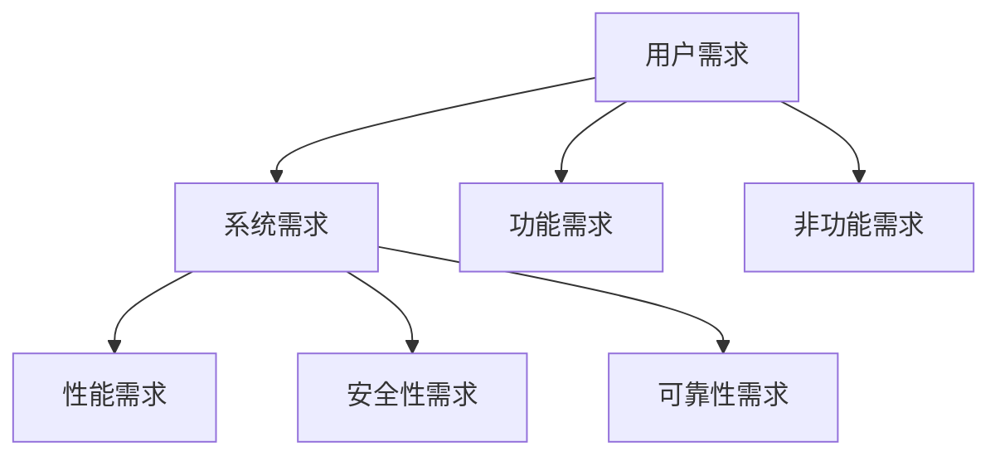
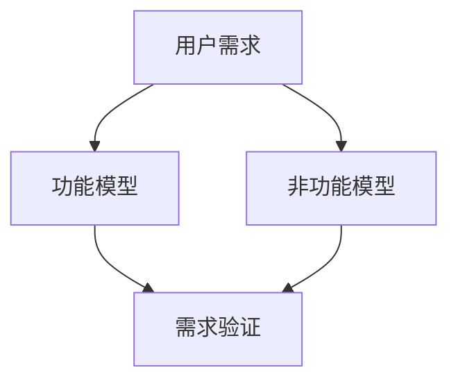
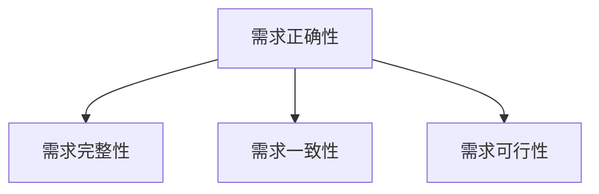
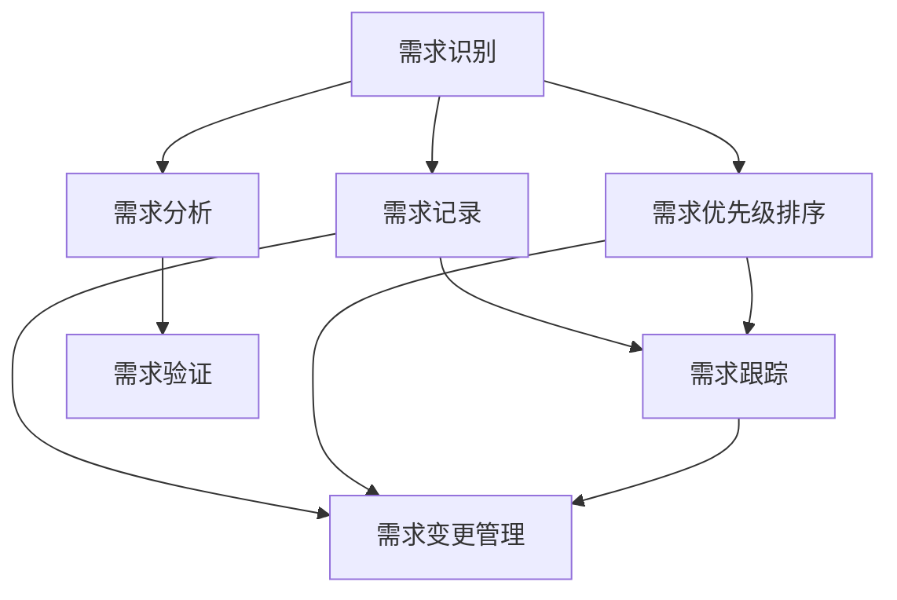
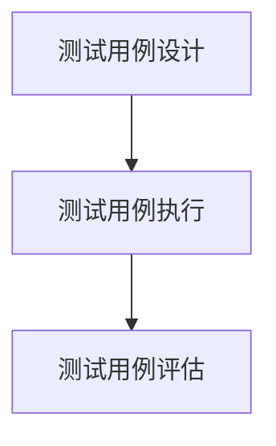
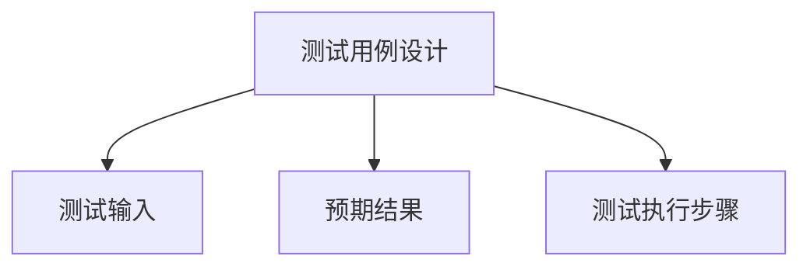
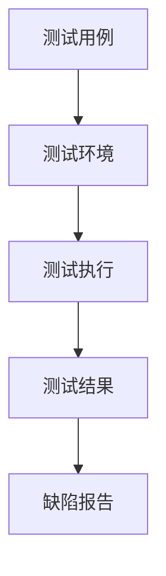
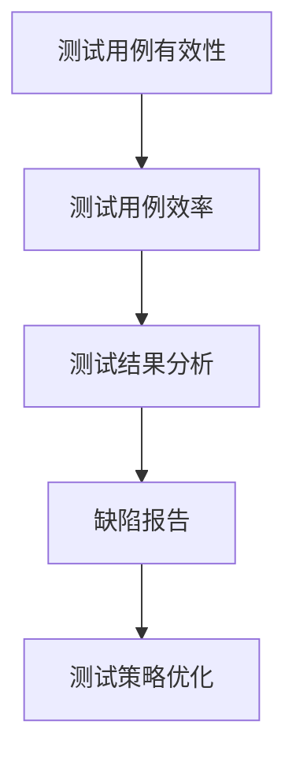
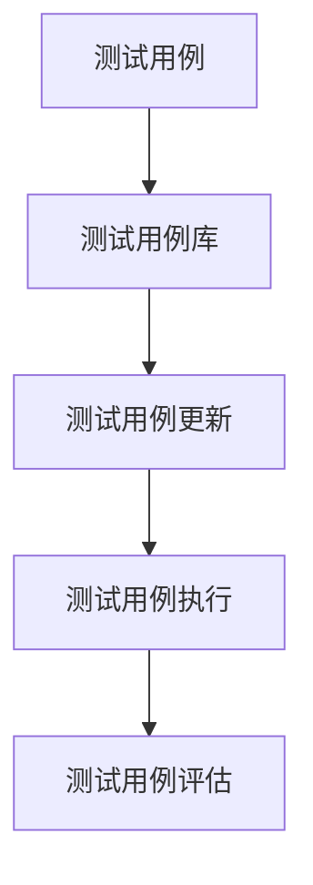

                 

### 1.1.1 大模型应用开发的重要性

大模型应用开发在现代信息技术领域具有重要的地位。首先，大模型在处理大量数据方面具有显著优势，能够从海量数据中提取有价值的信息，为各个行业提供决策支持。例如，在医疗领域，大模型可以分析大量病例数据，帮助医生进行疾病诊断；在金融领域，大模型可以分析市场数据，预测市场趋势，辅助投资者做出决策。

其次，大模型在自动化和智能化方面具有巨大潜力。通过训练和优化，大模型可以自动化执行复杂任务，提高生产效率。例如，在制造业中，大模型可以优化生产流程，提高产品质量；在交通运输领域，大模型可以优化交通流量，减少拥堵。

然而，大模型应用开发也面临诸多挑战。一方面，大模型训练和部署需要大量的计算资源和数据支持，对基础设施和技术水平有较高要求；另一方面，大模型在处理数据时可能会引入偏见，影响模型的公平性和透明性。因此，如何在保证性能的同时，提高模型的透明性和可解释性，是大模型应用开发中亟待解决的问题。

#### **核心概念与联系**

大模型应用开发的核心理念包括：数据驱动、模型优化、自动化和智能化。这些理念相互关联，共同构成了大模型应用开发的体系结构。

- **数据驱动**：大模型应用开发以数据为基础，通过收集、处理和分析数据，提取有价值的信息。数据质量直接影响模型的效果，因此数据清洗和数据预处理是数据驱动的关键环节。

- **模型优化**：大模型应用开发的目标是构建高效、准确的模型。这需要不断优化模型结构、参数和算法，以提高模型的性能。模型优化包括超参数调优、正则化、优化算法等方面。

- **自动化**：大模型应用开发需要自动化执行训练、部署和评估等任务，以提高开发效率。自动化工具可以帮助开发者快速实现模型部署，提高生产效率。

- **智能化**：大模型应用开发追求智能化，通过模型自动执行复杂任务，实现自动化决策。智能化包括自动化任务调度、自适应调整和智能化服务等方面。

#### **Mermaid 流程图**

以下是大模型应用开发的核心概念与联系的Mermaid流程图：



### 1.1.2 大模型应用开发面临的挑战

大模型应用开发虽然具有巨大的潜力，但同时也面临诸多挑战。以下是几个主要的挑战：

- **计算资源需求**：大模型训练和部署需要大量的计算资源，尤其是GPU等高性能计算设备。这导致大模型应用开发对基础设施有较高要求，需要大规模的云计算资源支持。

- **数据隐私与安全**：大模型应用开发依赖于大量的数据，这些数据可能涉及个人隐私和敏感信息。如何在保证模型性能的同时，保护数据隐私和安全，是一个重要的挑战。

- **模型解释性**：大模型在处理复杂任务时，其决策过程往往缺乏解释性，难以理解。这给模型的信任度和可接受性带来挑战，特别是在关键领域如医疗、金融等。

- **偏见与公平性**：大模型在训练过程中可能会引入偏见，导致模型在处理特定群体时产生不公平结果。如何消除偏见，提高模型的公平性，是大模型应用开发中亟待解决的问题。

#### **核心算法原理讲解**

大模型应用开发的核心算法原理包括神经网络、深度学习和强化学习等。

- **神经网络**：神经网络是模拟人脑神经元连接的一种计算模型。它通过多层神经元的非线性变换，实现对输入数据的特征提取和分类。神经网络的训练过程包括前向传播和反向传播。

  **伪代码**：

  ```python
  # 前向传播
  output = neuron(input)
  # 反向传播
  error = output - target
  ```

- **深度学习**：深度学习是神经网络的一种扩展，通过增加网络的深度，实现对更复杂任务的建模。深度学习在图像识别、语音识别等领域取得了显著成果。

  **伪代码**：

  ```python
  # 前向传播
  hidden_layer = activation(function(W*input + b))
  # 反向传播
  dW = d activation(d hidden_layer * input)
  ```

- **强化学习**：强化学习是一种通过试错来学习最优策略的算法。它通过与环境的交互，不断调整策略，以达到最大化的回报。强化学习在自动驾驶、游戏AI等领域有广泛应用。

  **伪代码**：

  ```python
  # 状态评估
  Q(s, a) = r + gamma * max(Q(s', a'))
  # 行为策略
  a = policy(s, Q(s, a))
  ```

#### **数学模型和数学公式详细讲解**

在深度学习中，激活函数是一个重要的概念。激活函数用于引入非线性特性，使神经网络能够建模复杂的非线性关系。

- **Sigmoid函数**：

  $$\sigma(x) = \frac{1}{1 + e^{-x}}$$

  Sigmoid函数是一种常用的激活函数，它将输入值映射到(0, 1)区间，常用于二分类问题。

- **ReLU函数**：

  $$\text{ReLU}(x) = \max(0, x)$$

 ReLU函数在x为负时输出0，x为正时输出x，这种设计使得ReLU函数在训练过程中具有更好的稳定性。

- **Tanh函数**：

  $$\text{Tanh}(x) = \frac{e^x - e^{-x}}{e^x + e^{-x}}$$

  Tanh函数与Sigmoid函数类似，但输出范围在(-1, 1)，在处理多分类问题时效果较好。

#### **举例说明**

以图像识别为例，假设我们使用卷积神经网络（CNN）进行猫狗分类。输入数据为一张256x256的图像，输出为猫或狗的概率分布。

1. **输入层**：接收图像数据，输出经过卷积层和池化层的特征图。
2. **卷积层**：通过卷积操作提取图像特征，使用ReLU激活函数引入非线性。
3. **池化层**：对卷积层输出的特征图进行下采样，减少参数数量，提高模型效率。
4. **全连接层**：将特征图映射到输出层，使用Sigmoid激活函数输出概率分布。

#### **项目实战**

1. **开发环境搭建**：安装Python、TensorFlow等依赖库，配置GPU支持。
2. **数据集准备**：收集并预处理猫狗图像数据，包括数据清洗、归一化等步骤。
3. **模型训练**：编写训练代码，使用训练数据训练模型，调整超参数以优化模型性能。
4. **模型评估**：使用验证数据评估模型性能，包括准确率、召回率等指标。
5. **模型部署**：将训练好的模型部署到生产环境，进行实时图像分类任务。

#### **最佳实践 tips**

1. **数据预处理**：确保数据质量，进行数据清洗、归一化和数据增强。
2. **模型调优**：使用交叉验证和网格搜索等方法进行模型调优。
3. **分布式训练**：使用分布式计算框架如Horovod进行模型训练，提高训练速度。
4. **模型压缩**：使用模型压缩技术如量化、剪枝等减少模型大小，提高部署效率。

#### **小结**

大模型应用开发是现代信息技术领域的一个重要研究方向，它面临着计算资源、数据隐私、模型解释性等方面的挑战。通过了解核心概念、算法原理和实际应用，我们可以更好地应对这些挑战，推动大模型应用开发的发展。

#### **注意事项**

1. **计算资源**：确保有足够的计算资源支持大模型训练和部署。
2. **数据隐私**：严格遵守数据保护法规，确保数据安全和隐私。
3. **模型解释性**：提高模型的可解释性，增强用户信任。

#### **拓展阅读**

1. **深度学习基础**：《深度学习》（Goodfellow, Bengio, Courville著）
2. **机器学习实战**：《机器学习实战》（ Harrington 著）
3. **神经网络与深度学习**：《神经网络与深度学习》（邱锡鹏著）

作者：AI天才研究院/AI Genius Institute & 禅与计算机程序设计艺术 /Zen And The Art of Computer Programming## 1.2 需求识别

### 1.2.1 需求识别的定义

需求识别是软件工程过程中的第一步，也是至关重要的一步。它涉及到确定用户和系统所需的功能、性能以及其他特性。需求识别的目标是全面理解用户需求，为后续的软件设计、开发、测试和维护提供明确的方向。

#### **核心概念与联系**

- **用户需求**：用户需求是指用户在使用软件过程中期望获得的功能和服务。
- **系统需求**：系统需求是指软件系统必须满足的约束条件，包括性能、安全性、可靠性等方面。
- **功能需求**：功能需求描述了软件系统应提供的基本功能。
- **非功能需求**：非功能需求描述了软件系统的性能、安全性、可靠性等方面的要求。

这些概念相互关联，共同构成了需求识别的核心。用户需求是系统需求的来源，而功能需求和性能需求则是对系统需求的详细描述。

#### **Mermaid 流程图**

以下是需求识别的核心概念与联系的Mermaid流程图：



### 1.2.2 需求识别的方法与工具

需求识别的方法和工具对于确保需求识别过程的全面性和准确性至关重要。以下是几种常用的需求识别方法和工具：

#### **访谈**

访谈是一种直接获取用户需求的有效方法。通过与用户面对面交流，开发人员可以深入了解用户的需求、期望和痛点。访谈可以分为结构化访谈和非结构化访谈，前者有明确的访谈提纲，后者更加自由和开放。

#### **问卷调查**

问卷调查是一种收集用户需求的间接方法。通过设计合理的问卷，可以广泛地收集用户的反馈。问卷调查的优点在于成本低、覆盖面广，但缺点是用户填写问卷的积极性可能不高，导致数据质量受到影响。

#### **观察**

观察是通过直接观察用户在使用软件过程中的行为和操作来识别需求的方法。观察法适用于用户行为变化较大的场景，如用户界面设计、用户体验优化等。

#### **案例研究**

案例研究是对特定用户或用户群体的需求进行深入研究的方法。通过分析用户的实际案例，可以更深入地理解用户的需求和痛点。

#### **工具**

- **需求管理工具**：如JIRA、Confluence等，用于记录、跟踪和管理需求。
- **用户故事地图**：用于可视化用户需求的优先级和关系。
- **用例图**：用于描述用户与系统之间的交互关系。

#### **举例说明**

以开发一款电商平台为例，需求识别的过程如下：

1. **访谈**：与电商平台的管理层和潜在用户进行访谈，了解他们对电商平台的需求和期望。
2. **问卷调查**：向潜在用户发放问卷调查，收集他们的反馈。
3. **观察**：观察用户在电商平台上的行为，如购物流程、搜索习惯等。
4. **案例研究**：分析其他成功电商平台的用户需求。
5. **用户故事地图**：绘制用户故事地图，明确用户需求的优先级。
6. **用例图**：绘制用例图，描述用户与系统之间的交互关系。

### **项目实战**

以下是一个简单的项目实战，用于展示如何进行需求识别：

1. **开发环境搭建**：安装Python、JIRA等依赖库和工具。
2. **需求收集**：通过访谈、问卷调查、观察等方法收集用户需求。
3. **需求文档编写**：使用Confluence等工具记录和管理需求。
4. **需求评审**：与用户和开发团队进行需求评审，确保需求完整和准确。
5. **需求跟踪**：使用JIRA等工具跟踪需求的状态和进展。

#### **最佳实践 tips**

1. **确保需求的一致性**：在需求识别过程中，要确保需求之间的一致性，避免冲突和重复。
2. **保持沟通**：与用户保持密切沟通，确保对用户需求的理解准确无误。
3. **文档化**：将需求进行文档化，便于后续的开发和测试。

#### **小结**

需求识别是软件工程过程中至关重要的一步，它涉及到确定用户和系统所需的功能、性能以及其他特性。通过访谈、问卷调查、观察、案例研究等方法，以及使用需求管理工具，可以有效地进行需求识别。

#### **注意事项**

1. **避免需求遗漏**：在需求识别过程中，要尽可能全面地收集用户需求，避免遗漏关键需求。
2. **需求变更管理**：在需求识别过程中，要重视需求变更管理，确保需求变更得到妥善处理。

#### **拓展阅读**

1. **软件需求工程**：《软件需求工程：实践指南》（Bredemeyer 著）
2. **用户故事地图**：《用户故事地图》（Larman 著）
3. **敏捷开发**：《敏捷软件开发：实践指南》（Beck 著）

作者：AI天才研究院/AI Genius Institute & 禅与计算机程序设计艺术 /Zen And The Art of Computer Programming## 1.3 需求分析

### 1.3.1 需求分析的定义

需求分析是软件开发过程中的关键环节，它涉及对收集到的用户需求进行深入理解和详细描述。需求分析的目标是明确软件系统应该做什么，以及如何实现这些功能。通过需求分析，开发团队可以确保开发的软件系统能够满足用户的需求。

#### **核心概念与联系**

- **用户需求**：用户需求是用户在使用软件过程中期望获得的功能和服务。
- **功能需求**：功能需求描述了软件系统应提供的基本功能。
- **非功能需求**：非功能需求描述了软件系统的性能、安全性、可靠性等方面的要求。
- **需求模型**：需求模型是对用户需求进行抽象和建模的结果，包括功能模型和非功能模型。
- **需求验证**：需求验证是确保需求正确性和一致性的过程。

这些概念相互关联，构成了需求分析的核心。用户需求是需求分析的起点，通过功能模型和非功能模型的构建，可以将用户需求转化为具体的软件需求。

#### **Mermaid 流程图**

以下是需求分析的核心概念与联系的Mermaid流程图：



### 1.3.2 需求分析的过程

需求分析是一个系统的过程，通常包括以下几个阶段：

#### **1. 需求获取**

需求获取是需求分析的第一步，目的是收集用户的需求信息。这可以通过访谈、问卷调查、观察、案例研究等方法实现。

#### **2. 需求建模**

需求建模是将用户需求转化为需求模型的过程。需求模型可以是功能模型，也可以是非功能模型。功能模型通常使用用例图、活动图等表示，非功能模型则可以使用性能模型、安全模型等表示。

#### **3. 需求验证**

需求验证是确保需求正确性和一致性的过程。这可以通过需求评审、测试用例设计等方法实现。需求评审通常由用户和开发团队共同参与，以确保需求满足用户的实际需求。

#### **4. 需求文档编写**

需求文档是对需求分析结果的正式记录，它应该包含所有需求，包括功能需求和非功能需求，以及需求模型。需求文档应该清晰、完整、易于理解，以便开发团队在后续的开发过程中参考。

#### **5. 需求管理**

需求管理是确保需求在整个软件开发过程中得到有效跟踪和管理的过程。需求管理工具可以帮助开发团队跟踪需求的状态和进展，以及处理需求变更。

### 1.3.3 需求分析的方法与工具

需求分析的方法和工具有多种，以下是一些常用的方法与工具：

#### **1. 结构化分析方法**

结构化分析方法是一种传统的需求分析方法，它通过分解用户需求，将复杂的需求转化为更容易理解和实现的部分。常用的结构化分析方法包括数据流图（DFD）、实体关系图（ER图）等。

#### **2. 原型化方法**

原型化方法是通过构建软件原型来获取用户需求的方法。用户可以通过试用原型，提出反馈和建议，从而帮助开发团队更好地理解用户需求。

#### **3. 责任分配图（RAD）**

责任分配图是一种用于描述需求分配和协作的工具。它通过图形化的方式展示各个需求的责任人和相关方，从而帮助团队明确责任和协作关系。

#### **4. 需求管理工具**

需求管理工具可以帮助开发团队有效地管理需求，包括需求的收集、编写、评审、跟踪等。常用的需求管理工具有JIRA、Confluence等。

#### **举例说明**

以开发一款在线购物平台为例，需求分析的过程如下：

1. **需求获取**：通过与潜在用户进行访谈和问卷调查，收集用户的需求信息。
2. **需求建模**：使用用例图描述用户与系统之间的交互，使用性能模型描述系统的性能需求。
3. **需求验证**：组织需求评审会议，邀请用户和开发团队共同参与，确保需求满足用户的实际需求。
4. **需求文档编写**：编写详细的需求文档，包括功能需求和非功能需求，以及需求模型。
5. **需求管理**：使用JIRA等工具，跟踪需求的状态和进展，处理需求变更。

### **项目实战**

以下是一个简单的项目实战，用于展示如何进行需求分析：

1. **开发环境搭建**：安装Python、JIRA等依赖库和工具。
2. **需求收集**：通过访谈、问卷调查等方法收集用户需求。
3. **需求建模**：使用用例图和性能模型描述用户需求。
4. **需求验证**：组织需求评审会议，确保需求满足用户的实际需求。
5. **需求文档编写**：编写详细的需求文档。
6. **需求管理**：使用JIRA等工具，跟踪需求的状态和进展。

#### **最佳实践 tips**

1. **确保需求的一致性**：在需求分析过程中，要确保需求之间的一致性，避免冲突和重复。
2. **保持沟通**：与用户保持密切沟通，确保对用户需求的理解准确无误。
3. **文档化**：将需求进行文档化，便于后续的开发和测试。

#### **小结**

需求分析是软件开发过程中至关重要的一步，它通过深入理解和详细描述用户需求，为后续的软件开发提供明确的方向。通过需求获取、需求建模、需求验证、需求文档编写和需求管理等方法，可以有效地进行需求分析。

#### **注意事项**

1. **避免需求遗漏**：在需求分析过程中，要尽可能全面地收集用户需求，避免遗漏关键需求。
2. **需求变更管理**：在需求分析过程中，要重视需求变更管理，确保需求变更得到妥善处理。

#### **拓展阅读**

1. **软件需求工程**：《软件需求工程：实践指南》（Bredemeyer 著）
2. **需求管理**：《需求管理：从需求获取到需求实现》（Stellman, Greene 著）
3. **敏捷开发**：《敏捷软件开发：实践指南》（Beck 著）

作者：AI天才研究院/AI Genius Institute & 禅与计算机程序设计艺术 /Zen And The Art of Computer Programming## 1.4 需求验证

### 1.4.1 需求验证的定义

需求验证是确保软件需求正确、完整、一致和可行的重要过程。它通过一系列活动和技巧来检查需求文档是否符合用户需求、业务目标和开发标准。需求验证的目标是发现和纠正潜在的错误或遗漏，确保需求能够被成功实现。

#### **核心概念与联系**

- **需求正确性**：需求是否准确地表达了用户的意图。
- **需求完整性**：需求文档是否包含了所有必要的信息。
- **需求一致性**：需求之间是否协调一致，没有冲突。
- **需求可行性**：需求是否在技术和资源约束下可实现。

这些概念相互关联，共同构成了需求验证的核心。需求正确性是需求验证的首要目标，而需求完整性、一致性和可行性则是确保需求能够成功实现的关键。

#### **Mermaid 流程图**

以下是需求验证的核心概念与联系的Mermaid流程图：



### 1.4.2 需求验证的方法与工具

需求验证的方法和工具有多种，以下是一些常用的方法和工具：

#### **1. 需求评审**

需求评审是通过检查需求文档来识别错误和遗漏的一种方法。评审可以由用户、开发人员、质量保证人员等多个角色参与。评审过程中，评审者会提出问题和建议，以确保需求的准确性和一致性。

#### **2. 需求测试**

需求测试是通过设计测试用例来验证需求是否能够被成功实现。测试用例可以包括功能测试、性能测试、安全测试等。通过执行测试用例，可以验证需求是否满足预期的行为和性能。

#### **3. 实际案例分析和验证**

通过分析实际案例，可以验证需求在实际应用场景中的可行性和效果。这可以包括模拟用户行为、实际操作软件等。

#### **4. 需求管理工具**

需求管理工具可以帮助跟踪和管理需求的状态和进展，包括需求的创建、修改、验证和关闭。常用的需求管理工具有JIRA、Confluence等。

#### **举例说明**

以验证一个电商平台的用户需求为例，需求验证的过程如下：

1. **需求评审**：组织评审会议，邀请相关方审查需求文档，确保需求准确、完整、一致。
2. **需求测试**：设计测试用例，包括功能测试（如购物车、下单流程）、性能测试（如并发用户数）、安全测试（如用户信息保护）等。
3. **实际案例分析**：模拟真实用户的购物流程，分析需求在实际应用中的可行性和效果。
4. **需求管理**：使用JIRA等工具，记录需求的状态和验证结果，确保所有需求得到有效跟踪。

### **项目实战**

以下是一个简单的项目实战，用于展示如何进行需求验证：

1. **开发环境搭建**：安装Python、JIRA等依赖库和工具。
2. **需求文档编写**：编写详细的需求文档。
3. **需求评审**：组织评审会议，确保需求准确、完整、一致。
4. **需求测试**：设计测试用例，执行测试用例，记录测试结果。
5. **实际案例分析**：模拟用户行为，分析需求在实际应用中的可行性和效果。
6. **需求管理**：使用JIRA等工具，记录需求的状态和验证结果。

#### **最佳实践 tips**

1. **早期验证**：在需求早期阶段进行验证，可以更早地发现问题，减少后期修改的成本。
2. **多方参与**：需求验证应该由用户、开发团队、质量保证团队等多方参与，确保需求的全面性和准确性。
3. **自动化测试**：使用自动化测试工具，可以提高测试效率，确保测试覆盖面。

#### **小结**

需求验证是确保软件需求准确、完整、一致和可行的重要环节。通过需求评审、需求测试、实际案例分析和验证等多种方法，可以有效地发现和纠正需求中的潜在问题，确保需求能够成功实现。

#### **注意事项**

1. **避免遗漏关键需求**：在验证过程中，要确保所有关键需求都得到验证。
2. **记录和跟踪问题**：及时记录和跟踪验证过程中发现的问题，确保问题得到妥善处理。

#### **拓展阅读**

1. **软件需求工程**：《软件需求工程：实践指南》（Bredemeyer 著）
2. **软件测试技术**：《软件测试艺术》（Beizer 著）
3. **需求管理**：《需求管理：从需求获取到需求实现》（Stellman, Greene 著）

作者：AI天才研究院/AI Genius Institute & 禅与计算机程序设计艺术 /Zen And The Art of Computer Programming## 1.5 需求管理

### 1.5.1 需求管理的定义

需求管理是软件工程过程中的一项关键活动，它涉及识别、记录、分析、优先级排序、跟踪和管理需求的整个过程。需求管理的目标是确保需求的完整性、一致性、可行性和可追溯性，从而支持软件开发和项目的成功交付。

#### **核心概念与联系**

- **需求识别**：识别用户的需求和期望。
- **需求记录**：记录需求，确保所有需求都得到妥善记录。
- **需求分析**：分析需求，确保需求清晰、明确且可实现。
- **需求优先级排序**：根据项目的目标和资源，对需求进行优先级排序。
- **需求跟踪**：跟踪需求的状态和进度，确保需求得到有效实施。
- **需求变更管理**：管理需求的变更，确保变更得到妥善处理。

这些概念相互关联，构成了需求管理的核心。需求识别是需求管理的起点，需求记录、分析和跟踪是需求管理的重要组成部分，而需求优先级排序和变更管理则是确保需求有效实施的关键。

#### **Mermaid 流程图**

以下是需求管理的核心概念与联系的Mermaid流程图：



### 1.5.2 需求管理的过程

需求管理是一个系统的过程，通常包括以下几个阶段：

#### **1. 需求识别**

需求识别是需求管理的第一步，目的是收集和分析用户的需求。这可以通过访谈、问卷调查、观察、案例研究等方法实现。需求识别的结果是获得一个初步的需求列表。

#### **2. 需求记录**

需求记录是将识别出的需求进行文档化的过程。需求文档应包含所有需求，包括功能需求和非功能需求，以及每个需求的详细描述和优先级。需求记录的工具可以是Excel、Confluence、JIRA等。

#### **3. 需求分析**

需求分析是对记录的需求进行深入理解和详细描述的过程。需求分析的目标是确保每个需求都是清晰、具体和可实现的。需求分析的结果是更新和优化需求文档。

#### **4. 需求优先级排序**

需求优先级排序是根据项目的目标和资源，对需求进行优先级排序的过程。高优先级的需求应该在项目早期阶段得到优先处理，以确保关键功能能够及时交付。

#### **5. 需求跟踪**

需求跟踪是确保需求在整个项目生命周期中得到有效实施和管理的过程。需求跟踪的工具可以是JIRA、Confluence等，这些工具可以帮助团队跟踪需求的状态、进度和变更。

#### **6. 需求变更管理**

需求变更管理是管理需求变更的过程。在项目开发过程中，需求可能会发生变化，需求变更管理确保这些变更得到妥善处理，不会对项目进度和资源造成负面影响。

### 1.5.3 需求管理的工具与技术

需求管理的工具和技术有助于提高需求管理的效率和效果。以下是一些常用的工具和技术：

#### **1. 需求管理工具**

- **JIRA**：用于需求收集、跟踪和管理。
- **Confluence**：用于需求文档编写和共享。
- **Excel**：用于简单的需求记录和管理。

#### **2. 优先级排序技术**

- **MoSCoW方法**：将需求分为必须做（Must have）、应该做（Should have）、可以不做（Could have）和不做（Would have）。
- **Kano模型**：根据需求的满意度将需求分为基本需求、性能需求和惊喜需求。

#### **3. 变更管理技术**

- **变更请求**：用于记录和审批需求变更。
- **基线**：用于定义需求变更的边界，确保项目在变更前有明确的基准。
- **变更日志**：用于记录和跟踪所有的变更请求和变更实施情况。

#### **举例说明**

以开发一款企业资源规划（ERP）系统为例，需求管理的步骤如下：

1. **需求识别**：通过与企业管理层和潜在用户进行访谈和问卷调查，收集需求。
2. **需求记录**：使用JIRA记录所有需求，并将需求文档存储在Confluence中。
3. **需求分析**：对每个需求进行分析，确保需求清晰、具体和可实现。
4. **需求优先级排序**：使用MoSCoW方法对需求进行优先级排序。
5. **需求跟踪**：使用JIRA跟踪需求的状态和进度。
6. **需求变更管理**：当需求发生变化时，通过变更请求记录变更，并进行基线和变更日志的管理。

### **项目实战**

以下是一个简单的项目实战，用于展示如何进行需求管理：

1. **开发环境搭建**：安装JIRA、Confluence等需求管理工具。
2. **需求识别**：通过与相关方进行访谈和问卷调查，收集需求。
3. **需求记录**：使用JIRA记录需求，并将需求文档存储在Confluence中。
4. **需求分析**：对每个需求进行分析，确保需求清晰、具体和可实现。
5. **需求优先级排序**：使用MoSCoW方法对需求进行优先级排序。
6. **需求跟踪**：使用JIRA跟踪需求的状态和进度。
7. **需求变更管理**：当需求发生变化时，通过变更请求记录变更，并进行基线和变更日志的管理。

#### **最佳实践 tips**

1. **保持沟通**：与相关方保持密切沟通，确保对需求的理解一致。
2. **文档化**：将所有需求和相关文档进行文档化，便于后续的跟踪和管理。
3. **定期审查**：定期审查需求，确保需求的有效性和一致性。

#### **小结**

需求管理是确保软件开发项目成功的关键环节。通过需求识别、记录、分析、优先级排序、跟踪和变更管理，可以有效地管理需求，确保项目按计划进行。

#### **注意事项**

1. **避免需求遗漏**：在需求识别过程中，要确保所有关键需求都得到识别。
2. **妥善处理变更**：在需求变更过程中，要确保变更得到妥善处理，不会影响项目进度和质量。

#### **拓展阅读**

1. **软件需求工程**：《软件需求工程：实践指南》（Bredemeyer 著）
2. **需求管理**：《需求管理：从需求获取到需求实现》（Stellman, Greene 著）
3. **敏捷开发**：《敏捷软件开发：实践指南》（Beck 著）

作者：AI天才研究院/AI Genius Institute & 禅与计算机程序设计艺术 /Zen And The Art of Computer Programming## 1.6 实战案例：大模型应用开发中的需求分析实践

### 1.6.1 案例背景

为了更好地展示大模型应用开发中的需求分析实践，我们以开发一个智能客服系统为例。该系统旨在通过自然语言处理（NLP）技术，实现与用户的智能交互，提供24/7的客户支持服务。

### 1.6.2 需求识别

1. **访谈**：与业务部门、技术团队和潜在用户进行访谈，了解他们对智能客服系统的期望和需求。
2. **问卷调查**：通过问卷调查收集用户对客服系统的功能和性能需求。
3. **观察**：观察现有客服工作流程，识别存在的问题和改进空间。

#### **需求识别结果**

- **功能需求**：
  - 能够接收并响应用户的问题。
  - 支持多种语言和方言。
  - 能够处理常见问题，提供即时的解决方案。
  - 具有情感识别功能，理解用户情绪并作出相应回应。

- **非功能需求**：
  - 系统应具有较高的响应速度和准确性。
  - 系统应具有良好的用户体验，易于操作和理解。
  - 系统应具有高可用性和可靠性，确保7x24小时不间断服务。

### 1.6.3 需求分析

1. **需求建模**：
   - 使用用例图描述用户与客服系统之间的交互。
   - 使用活动图描述客服系统的内部工作流程。

2. **需求验证**：
   - 组织需求评审会议，邀请相关方审查需求文档。
   - 设计测试用例，验证需求是否能够被成功实现。

#### **需求分析结果**

- **用例图**：

  ```mermaid
  graph TD
  A[用户发起问题] --> B[系统接收并理解问题]
  B --> C[系统分析问题并给出解决方案]
  C --> D[系统向用户呈现解决方案]
  ```

- **活动图**：

  ```mermaid
  graph TD
  A[用户发起问题] --> B[接收并理解问题]
  B --> C[问题分类]
  C --> D[检索解决方案]
  D --> E[生成回复]
  E --> F[发送回复给用户]
  ```

### 1.6.4 需求文档编写

根据需求分析和验证的结果，编写详细的需求文档。需求文档应包括：

- **功能需求**：
  - 用户问题接收与理解
  - 问题分类
  - 解决方案检索
  - 回复生成与发送

- **非功能需求**：
  - 响应速度：平均响应时间不超过2秒
  - 准确率：问题解决准确率达到90%以上
  - 用户体验：界面简洁、易于操作
  - 可用性与可靠性：系统可用性达到99.9%，保证7x24小时不间断服务

### 1.6.5 需求管理

1. **需求跟踪**：
   - 使用JIRA跟踪需求的状态和进度。
   - 定期更新需求状态，确保需求得到有效实施。

2. **需求变更管理**：
   - 当需求发生变化时，通过变更请求记录变更。
   - 进行基线和变更日志的管理，确保变更得到妥善处理。

### 1.6.6 项目实施

1. **开发环境搭建**：
   - 安装Python、TensorFlow等依赖库和工具。
   - 配置GPU等高性能计算资源。

2. **模型训练与优化**：
   - 使用NLP技术训练模型，提高问题接收与理解、问题分类和解决方案检索的准确性。
   - 通过超参数调优和模型优化，提高系统的响应速度和性能。

3. **系统集成与测试**：
   - 将训练好的模型集成到客服系统中。
   - 设计并执行测试用例，验证系统的功能和非功能需求。

4. **部署与维护**：
   - 将系统部署到生产环境，确保7x24小时不间断服务。
   - 定期更新和维护系统，确保系统的稳定性和性能。

### 1.6.7 项目小结

通过本案例，我们展示了大模型应用开发中的需求分析实践。从需求识别、需求分析、需求文档编写到需求管理，每一步都是确保系统成功实现的关键。在实际项目中，需求分析不仅有助于明确用户需求，还能为后续的开发和测试提供坚实的基础。同时，通过有效的需求管理和变更管理，可以确保项目能够按计划进行，并最终实现预期的业务价值。

#### **最佳实践 tips**

1. **与用户保持紧密沟通**：在需求识别和需求分析阶段，与用户保持密切沟通，确保对需求的理解准确无误。
2. **文档化**：将所有需求和相关文档进行文档化，便于后续的跟踪和管理。
3. **定期审查**：定期审查需求，确保需求的有效性和一致性。

#### **注意事项**

1. **避免需求遗漏**：在需求识别过程中，要确保所有关键需求都得到识别。
2. **妥善处理变更**：在需求变更过程中，要确保变更得到妥善处理，不会影响项目进度和质量。

#### **拓展阅读**

1. **自然语言处理**：《自然语言处理：Python实践》（Biolek, Vertikas 著）
2. **机器学习**：《机器学习实战》（Harrington 著）
3. **需求管理**：《软件需求工程：实践指南》（Bredemeyer 著）

作者：AI天才研究院/AI Genius Institute & 禅与计算机程序设计艺术 /Zen And The Art of Computer Programming## 第二部分：测试用例生成

### 2.1 测试用例生成概述

测试用例生成是软件测试过程中的关键步骤，它涉及设计、编写和执行一系列测试用例，以验证软件系统的功能、性能和可靠性。测试用例生成的好坏直接影响到测试的有效性和效率。本部分将详细介绍测试用例生成的方法、工具和过程。

#### **核心概念与联系**

- **测试用例**：测试用例是对软件系统进行测试的基本单位，它描述了测试输入、测试预期结果和测试执行步骤。
- **测试用例设计**：测试用例设计是创建测试用例的过程，包括确定测试目标、设计测试输入和预期结果等。
- **测试用例执行**：测试用例执行是按照设计好的测试用例进行实际测试的过程，包括输入测试数据、执行测试操作和检查测试结果。
- **测试用例评估**：测试用例评估是分析测试结果，评估测试用例的有效性和效率的过程。

这些概念相互关联，构成了测试用例生成的核心。测试用例设计是测试用例生成的起点，测试用例执行是测试用例设计的具体实施，而测试用例评估则是确保测试用例有效性的关键环节。

#### **Mermaid 流程图**

以下是测试用例生成过程的Mermaid流程图：



### 2.1.1 测试用例生成的目的

测试用例生成的目的是确保软件系统在各个方面都得到充分测试，从而发现潜在的问题和缺陷。具体来说，测试用例生成的目的包括：

1. **验证功能正确性**：通过测试用例验证软件系统是否按照需求规格说明正确实现了功能。
2. **发现缺陷**：测试用例可以帮助发现软件系统中的缺陷和错误，从而提高软件质量。
3. **评估性能**：通过执行性能测试用例，评估软件系统在不同负载条件下的性能和稳定性。
4. **确保可靠性**：通过测试用例验证软件系统在各种异常情况和极端条件下的可靠性。
5. **支持回归测试**：通过生成和执行回归测试用例，确保软件系统在每次更新或修复后仍然能够正常运行。

### 2.1.2 测试用例生成的方法与工具

测试用例生成的方法和工具有多种，以下是一些常用的方法和工具：

#### **1. 手动设计**

手动设计是最传统也是最基本的方法，开发人员根据需求规格说明书和设计文档，手动设计和编写测试用例。这种方法简单直接，但效率较低，适用于小型项目或特定的功能模块测试。

#### **2. 自动化测试工具**

自动化测试工具可以自动生成测试用例，并执行测试。常见的自动化测试工具有Selenium、JUnit、TestNG等。这些工具可以帮助提高测试效率和覆盖度，适用于大型项目和频繁的回归测试。

#### **3. 测试用例生成工具**

测试用例生成工具可以自动生成测试用例，根据需求规格说明书和设计文档，分析系统的结构和功能，生成相应的测试用例。常见的测试用例生成工具有Gerrit、Jenkins等。

#### **4. 测试设计模板**

测试设计模板是一种半自动化的方法，开发人员根据提供的模板，填写测试用例的相关信息。这种方法结合了手动设计和自动化测试的优势，适用于不同规模和复杂度的项目。

### 2.1.3 测试用例生成的过程

测试用例生成是一个系统的过程，通常包括以下几个阶段：

#### **1. 需求分析**

在测试用例生成之前，首先需要进行需求分析，确保对需求有清晰的理解。需求分析的结果是获得需求规格说明书和设计文档。

#### **2. 测试计划**

根据需求规格说明书和设计文档，制定测试计划，明确测试的目标、范围、方法和资源等。

#### **3. 测试用例设计**

根据测试计划，设计和编写测试用例。测试用例设计包括确定测试输入、预期结果和执行步骤等。

#### **4. 测试用例评审**

对设计的测试用例进行评审，确保测试用例的完整性和正确性。评审可以由开发人员、测试人员和业务分析师共同参与。

#### **5. 测试用例执行**

根据测试用例执行计划，执行测试用例，记录测试结果和发现的问题。

#### **6. 测试用例评估**

对测试结果进行分析，评估测试用例的有效性和效率。如果发现测试用例存在问题，需要返回到测试用例设计阶段进行修改。

### **举例说明**

以开发一个电商平台为例，测试用例生成的过程如下：

1. **需求分析**：分析电商平台的业务需求，编写需求规格说明书。
2. **测试计划**：制定测试计划，明确测试目标、范围和方法。
3. **测试用例设计**：根据需求规格说明书，设计和编写测试用例。例如，设计购物车测试用例，包括添加商品、修改商品数量、删除商品等。
4. **测试用例评审**：组织评审会议，确保测试用例的完整性和正确性。
5. **测试用例执行**：执行测试用例，记录测试结果和发现的问题。
6. **测试用例评估**：分析测试结果，评估测试用例的有效性和效率。

### **项目实战**

以下是一个简单的项目实战，用于展示如何进行测试用例生成：

1. **开发环境搭建**：安装Python、Selenium等依赖库和工具。
2. **需求分析**：分析电商平台的需求，编写需求规格说明书。
3. **测试计划**：制定测试计划，明确测试目标和方法。
4. **测试用例设计**：设计和编写测试用例，包括购物车测试用例。
5. **测试用例评审**：组织评审会议，确保测试用例的完整性和正确性。
6. **测试用例执行**：执行测试用例，记录测试结果和发现的问题。
7. **测试用例评估**：分析测试结果，评估测试用例的有效性和效率。

#### **最佳实践 tips**

1. **确保测试用例的覆盖度**：在设计测试用例时，要确保覆盖到所有的功能点和业务场景。
2. **定期更新测试用例**：随着项目的进展，定期更新测试用例，确保测试用例与实际系统一致。
3. **使用自动化测试工具**：对于重复性高、执行频率高的测试用例，使用自动化测试工具可以提高测试效率。

#### **小结**

测试用例生成是确保软件质量的重要环节。通过需求分析、测试计划、测试用例设计和执行，可以有效地发现和解决问题，确保软件系统的功能、性能和可靠性。

#### **注意事项**

1. **避免测试用例遗漏**：在测试用例设计过程中，要确保覆盖到所有的功能点和业务场景。
2. **妥善处理测试问题**：在测试用例执行过程中，发现问题时，要及时记录并反馈，确保问题得到妥善处理。

#### **拓展阅读**

1. **软件测试基础**：《软件测试基础教程》（Harvey M. Deitel & Paul J. Deitel 著）
2. **自动化测试**：《自动化测试实战》（小杨著）
3. **软件质量保证**：《软件质量保证：理论与实践》（Glenford J. Myers 著）

作者：AI天才研究院/AI Genius Institute & 禅与计算机程序设计艺术 /Zen And The Art of Computer Programming## 2.2 测试用例设计

### 2.2.1 测试用例设计的定义

测试用例设计是软件测试过程中的关键步骤，它涉及创建一系列具体的测试用例，以验证软件系统的功能、性能和可靠性。测试用例设计的目标是确保软件系统能够按照预期工作，同时发现潜在的缺陷和错误。

#### **核心概念与联系**

- **测试用例**：测试用例是对软件系统进行测试的基本单位，它描述了测试输入、预期结果和测试执行步骤。
- **测试用例设计**：测试用例设计是创建测试用例的过程，包括确定测试目标、设计测试输入、预期结果和执行步骤等。
- **测试输入**：测试输入是用于执行测试的数据或条件。
- **预期结果**：预期结果是测试用例执行后预期得到的结果。
- **测试执行步骤**：测试执行步骤是执行测试用例的具体步骤和操作。

这些概念相互关联，构成了测试用例设计的核心。测试用例设计是确保软件系统质量的关键环节，通过合理的测试用例设计，可以有效地发现系统中的缺陷和错误。

#### **Mermaid 流�程图**

以下是测试用例设计的核心概念与联系的Mermaid流程图：



### 2.2.2 测试用例设计的过程

测试用例设计是一个系统的过程，通常包括以下几个阶段：

#### **1. 确定测试目标**

确定测试目标是测试用例设计的第一步。测试目标应明确软件系统需要验证的功能、性能和可靠性等方面。测试目标应该与需求规格说明书和设计文档保持一致。

#### **2. 分析需求和设计文档**

分析需求和设计文档是测试用例设计的关键环节。通过分析需求和设计文档，可以了解软件系统的功能和结构，为设计测试用例提供依据。

#### **3. 设计测试输入**

设计测试输入是测试用例设计的重要部分。测试输入应包括各种正常和异常的数据或条件，以确保测试用例能够覆盖到软件系统的不同方面。

#### **4. 确定预期结果**

确定预期结果是测试用例设计的另一个重要环节。预期结果应明确测试用例执行后预期得到的结果，包括成功的输出和失败的情况。

#### **5. 设计测试执行步骤**

设计测试执行步骤是确保测试用例能够正确执行的关键。测试执行步骤应详细描述执行测试用例的具体步骤和操作，以便测试人员能够按照步骤执行测试。

#### **6. 测试用例评审**

测试用例评审是确保测试用例质量和完整性的重要环节。测试用例评审可以由开发人员、测试人员和业务分析师共同参与，确保测试用例能够满足测试需求。

### 2.2.3 测试用例设计的方法与工具

测试用例设计的方法和工具有多种，以下是一些常用的方法和工具：

#### **1. 黑盒测试方法**

黑盒测试方法关注软件系统的输入和输出，不关心内部实现。常用的黑盒测试方法包括等价类划分、边界值分析、因果图等。

#### **2. 白盒测试方法**

白盒测试方法关注软件系统的内部结构和代码逻辑，通过分析代码路径进行测试。常用的白盒测试方法包括路径覆盖、分支覆盖、条件覆盖等。

#### **3. 自动化测试工具**

自动化测试工具可以自动化生成和执行测试用例，提高测试效率和覆盖度。常见的自动化测试工具有Selenium、JUnit、TestNG等。

#### **4. 测试设计模板**

测试设计模板是一种半自动化的方法，通过提供的模板，开发人员可以快速设计和编写测试用例。这种方法结合了手动设计和自动化测试的优势。

### **举例说明**

以设计一个电商平台登录功能的测试用例为例，测试用例设计的过程如下：

1. **确定测试目标**：验证登录功能的正确性和稳定性。
2. **分析需求和设计文档**：了解登录功能的需求和实现逻辑。
3. **设计测试输入**：
   - 正常输入：正确的用户名和密码。
   - 边界输入：用户名或密码为空、用户名或密码过长等。
   - 异常输入：错误的用户名或密码。
4. **确定预期结果**：
   - 成功登录：用户能够进入系统。
   - 边界输入：系统提示错误信息。
   - 异常输入：系统提示错误信息。
5. **设计测试执行步骤**：
   - 输入正确的用户名和密码，点击登录按钮。
   - 输入用户名为空，点击登录按钮。
   - 输入密码为空，点击登录按钮。
   - 输入错误的用户名，点击登录按钮。
   - 输入错误的密码，点击登录按钮。
6. **测试用例评审**：组织评审会议，确保测试用例的完整性和正确性。

### **项目实战**

以下是一个简单的项目实战，用于展示如何进行测试用例设计：

1. **开发环境搭建**：安装Python、Selenium等依赖库和工具。
2. **需求分析**：分析电商平台的登录功能需求。
3. **测试用例设计**：设计和编写登录功能的测试用例。
4. **测试用例评审**：组织评审会议，确保测试用例的完整性和正确性。
5. **测试用例执行**：执行测试用例，记录测试结果和发现的问题。
6. **测试用例评估**：分析测试结果，评估测试用例的有效性和效率。

#### **最佳实践 tips**

1. **确保测试用例的覆盖度**：在设计测试用例时，要确保覆盖到所有的功能点和业务场景。
2. **定期更新测试用例**：随着项目的进展，定期更新测试用例，确保测试用例与实际系统一致。
3. **使用自动化测试工具**：对于重复性高、执行频率高的测试用例，使用自动化测试工具可以提高测试效率。

#### **小结**

测试用例设计是确保软件质量的重要环节。通过确定测试目标、分析需求和设计文档、设计测试输入、确定预期结果和设计测试执行步骤，可以有效地设计出高质量的测试用例。

#### **注意事项**

1. **避免测试用例遗漏**：在测试用例设计过程中，要确保覆盖到所有的功能点和业务场景。
2. **妥善处理测试问题**：在测试用例执行过程中，发现问题时，要及时记录并反馈，确保问题得到妥善处理。

#### **拓展阅读**

1. **软件测试基础**：《软件测试基础教程》（Harvey M. Deitel & Paul J. Deitel 著）
2. **自动化测试**：《自动化测试实战》（小杨著）
3. **软件质量保证**：《软件质量保证：理论与实践》（Glenford J. Myers 著）

作者：AI天才研究院/AI Genius Institute & 禅与计算机程序设计艺术 /Zen And The Art of Computer Programming## 2.3 测试用例执行

### 2.3.1 测试用例执行的定义

测试用例执行是按照设计好的测试用例，在实际环境中运行测试，验证软件系统功能、性能和可靠性是否符合预期。测试用例执行是软件测试过程中的核心环节，它直接影响到软件质量的高低。

#### **核心概念与联系**

- **测试用例**：测试用例是对软件系统进行测试的基本单位，描述了测试输入、预期结果和测试执行步骤。
- **测试环境**：测试环境是用于执行测试用例的硬件、软件和网络配置，包括测试机器、数据库、网络连接等。
- **测试执行**：测试执行是按照测试用例的步骤，在实际环境中运行测试的过程。
- **测试结果**：测试结果是测试执行后得到的结果，包括成功的输出和失败的情况。
- **缺陷报告**：缺陷报告是对测试过程中发现的缺陷进行记录和报告的文档。

这些概念相互关联，构成了测试用例执行的核心。测试用例是测试用例执行的基础，测试环境是测试用例执行的载体，测试执行和测试结果是测试用例执行的结果，而缺陷报告则是确保缺陷得到及时处理和修复的关键。

#### **Mermaid 流程图**

以下是测试用例执行的核心概念与联系的Mermaid流程图：



### 2.3.2 测试用例执行的过程

测试用例执行是一个系统的过程，通常包括以下几个阶段：

#### **1. 准备测试环境**

在测试用例执行之前，首先需要准备测试环境。测试环境应包括硬件、软件和网络配置，以确保测试用例能够在实际环境中运行。测试环境的准备包括安装和配置操作系统、数据库、网络设备等。

#### **2. 安装测试工具**

根据测试计划，安装和配置测试工具，如自动化测试工具、性能测试工具等。测试工具的安装和配置是确保测试用例能够正常运行的关键。

#### **3. 执行测试用例**

按照测试用例的步骤，在实际环境中执行测试用例。测试用例的执行可以是手动执行，也可以是自动化执行。手动执行需要测试人员按照测试用例的步骤进行操作，自动化执行则通过脚本或自动化测试工具自动执行。

#### **4. 记录测试结果**

在测试用例执行过程中，记录测试结果。测试结果包括成功的输出和失败的情况。对于失败的情况，需要记录具体的错误信息和日志，以便后续分析和处理。

#### **5. 缺陷报告**

对于测试过程中发现的缺陷，及时记录和报告缺陷。缺陷报告应包括缺陷的描述、原因、影响和修复方案等。缺陷报告的目的是确保缺陷得到及时处理和修复。

#### **6. 测试结果分析**

对测试结果进行分析，评估测试用例的有效性和效率。测试结果分析可以帮助发现测试过程中的问题，为改进测试过程提供依据。

### 2.3.3 测试用例执行的方法与工具

测试用例执行的方法和工具有多种，以下是一些常用的方法和工具：

#### **1. 手动执行**

手动执行是传统的测试方法，测试人员按照测试用例的步骤手动进行操作。手动执行适用于小型项目或特定的功能模块测试。

#### **2. 自动化执行**

自动化执行是通过脚本或自动化测试工具自动执行测试用例。自动化执行可以提高测试效率，适用于大型项目和频繁的回归测试。

#### **3. 测试管理工具**

测试管理工具可以帮助测试团队管理测试用例、测试环境和测试结果。常见的测试管理工具有JIRA、TestLink等。

#### **4. 性能测试工具**

性能测试工具可以模拟高负载环境，测试软件系统的性能和稳定性。常见的性能测试工具有JMeter、LoadRunner等。

### **举例说明**

以执行一个电商平台的登录功能测试用例为例，测试用例执行的过程如下：

1. **准备测试环境**：安装和配置电商平台的服务器、数据库和客户端。
2. **安装测试工具**：安装并配置Selenium自动化测试工具。
3. **执行测试用例**：
   - 输入正确的用户名和密码，点击登录按钮，验证是否成功登录。
   - 输入用户名为空，点击登录按钮，验证是否显示错误提示。
   - 输入密码为空，点击登录按钮，验证是否显示错误提示。
   - 输入错误的用户名，点击登录按钮，验证是否显示错误提示。
   - 输入错误的密码，点击登录按钮，验证是否显示错误提示。
4. **记录测试结果**：记录每个测试用例的成功和失败情况，记录具体的错误信息和日志。
5. **缺陷报告**：对于失败的测试用例，生成缺陷报告，描述缺陷的描述、原因、影响和修复方案。
6. **测试结果分析**：分析测试结果，评估测试用例的有效性和效率。

### **项目实战**

以下是一个简单的项目实战，用于展示如何进行测试用例执行：

1. **开发环境搭建**：安装Python、Selenium等依赖库和工具。
2. **测试用例设计**：设计和编写电商平台的登录功能测试用例。
3. **测试用例执行**：使用Selenium自动化测试工具执行测试用例。
4. **记录测试结果**：记录测试结果和发现的缺陷。
5. **缺陷报告**：生成缺陷报告，描述缺陷的描述、原因、影响和修复方案。
6. **测试结果分析**：分析测试结果，评估测试用例的有效性和效率。

#### **最佳实践 tips**

1. **确保测试环境的一致性**：在测试用例执行过程中，确保测试环境与生产环境一致，以减少环境差异导致的问题。
2. **定期更新测试用例**：随着项目的进展，定期更新测试用例，确保测试用例与实际系统一致。
3. **使用自动化测试工具**：对于重复性高、执行频率高的测试用例，使用自动化测试工具可以提高测试效率。

#### **小结**

测试用例执行是确保软件质量的重要环节。通过准备测试环境、安装测试工具、执行测试用例、记录测试结果和缺陷报告、测试结果分析，可以有效地发现和解决问题，确保软件系统的功能、性能和可靠性。

#### **注意事项**

1. **避免测试用例遗漏**：在测试用例执行过程中，要确保所有测试用例都得到执行。
2. **妥善处理测试问题**：在测试用例执行过程中，发现问题时，要及时记录并反馈，确保问题得到妥善处理。

#### **拓展阅读**

1. **软件测试基础**：《软件测试基础教程》（Harvey M. Deitel & Paul J. Deitel 著）
2. **自动化测试**：《自动化测试实战》（小杨著）
3. **软件质量保证**：《软件质量保证：理论与实践》（Glenford J. Myers 著）

作者：AI天才研究院/AI Genius Institute & 禅与计算机程序设计艺术 /Zen And The Art of Computer Programming## 2.4 测试用例评估

### 2.4.1 测试用例评估的定义

测试用例评估是软件测试过程中的关键步骤，它通过分析测试结果，评估测试用例的有效性和效率，从而确保软件系统的质量。测试用例评估的目标是发现和解决测试过程中的问题，优化测试策略和流程。

#### **核心概念与联系**

- **测试用例有效性**：测试用例有效性是指测试用例能够发现缺陷的能力。高有效性的测试用例能够更好地发现系统中的缺陷。
- **测试用例效率**：测试用例效率是指执行测试用例所需的时间和资源。高效率的测试用例能够在较短的时间内完成测试，减少测试成本。
- **测试结果分析**：测试结果分析是评估测试用例有效性和效率的基础，它通过分析测试结果，发现测试用例的优缺点，为改进测试策略提供依据。
- **缺陷报告**：缺陷报告是测试用例评估的重要输入，它提供了测试过程中发现的缺陷的详细信息，包括缺陷的类型、影响和修复方案。
- **测试策略优化**：测试策略优化是基于测试用例评估的结果，对测试策略进行调整和优化，以提高测试效率和效果。

这些概念相互关联，构成了测试用例评估的核心。测试用例有效性是测试用例评估的首要目标，测试用例效率是确保测试效率的关键，而测试结果分析和缺陷报告则是测试策略优化的基础。

#### **Mermaid 流程图**

以下是测试用例评估的核心概念与联系的Mermaid流程图：



### 2.4.2 测试用例评估的过程

测试用例评估是一个系统的过程，通常包括以下几个阶段：

#### **1. 收集测试数据**

收集测试数据是测试用例评估的第一步，它包括测试执行结果、缺陷报告、测试环境和测试工具等数据。测试数据的收集应确保全面和准确，以便后续的分析和评估。

#### **2. 分析测试结果**

分析测试结果是测试用例评估的核心环节，通过分析测试结果，可以评估测试用例的有效性和效率。测试结果分析包括以下几个方面：

- **缺陷发现率**：计算测试用例发现的缺陷数量与总缺陷数量的比例，以评估测试用例的有效性。
- **测试执行时间**：计算测试用例的执行时间，以评估测试用例的效率。
- **缺陷分布**：分析测试过程中发现的缺陷类型和分布，以发现测试用例的不足和改进方向。
- **测试覆盖率**：计算测试用例覆盖的功能点数量与总功能点数量的比例，以评估测试用例的覆盖度。

#### **3. 编写评估报告**

根据测试结果分析的结果，编写评估报告。评估报告应包括测试用例的有效性、效率、缺陷分布和测试覆盖率等关键指标，以及测试用例的改进建议。

#### **4. 缺陷跟踪与修复**

对于测试过程中发现的缺陷，及时记录和跟踪缺陷的修复情况。缺陷跟踪包括缺陷的确认、修复和验证等环节，以确保缺陷得到妥善处理。

#### **5. 测试策略优化**

基于评估报告和缺陷跟踪的结果，对测试策略进行调整和优化。测试策略优化包括以下几个方面：

- **优化测试用例**：根据评估结果，优化测试用例的设计和执行，提高测试用例的有效性和效率。
- **调整测试计划**：根据项目的进度和资源，调整测试计划，确保测试覆盖度和进度。
- **改进测试环境**：优化测试环境，确保测试环境的稳定性和可复现性。

### **举例说明**

以一个电商平台的测试用例评估为例，测试用例评估的过程如下：

1. **收集测试数据**：收集测试执行结果、缺陷报告、测试环境和测试工具等数据。
2. **分析测试结果**：
   - **缺陷发现率**：测试用例共执行了100次，发现10个缺陷，缺陷发现率为10%。
   - **测试执行时间**：测试用例平均执行时间为5分钟。
   - **缺陷分布**：缺陷主要分布在登录功能模块和购物车功能模块。
   - **测试覆盖率**：测试用例覆盖了80%的功能点。
3. **编写评估报告**：评估报告包括测试用例的有效性、效率、缺陷分布和测试覆盖率等关键指标，以及改进建议。
4. **缺陷跟踪与修复**：对发现的缺陷进行确认、修复和验证。
5. **测试策略优化**：根据评估结果，优化测试用例的设计和执行，调整测试计划，改进测试环境。

### **项目实战**

以下是一个简单的项目实战，用于展示如何进行测试用例评估：

1. **开发环境搭建**：安装Python、Selenium等依赖库和工具。
2. **测试用例设计**：设计和编写电商平台的登录功能测试用例。
3. **测试用例执行**：使用Selenium自动化测试工具执行测试用例。
4. **收集测试数据**：收集测试执行结果、缺陷报告、测试环境和测试工具等数据。
5. **分析测试结果**：分析测试结果，评估测试用例的有效性和效率。
6. **编写评估报告**：编写测试用例评估报告。
7. **缺陷跟踪与修复**：跟踪和修复发现的缺陷。
8. **测试策略优化**：根据评估结果，优化测试策略。

#### **最佳实践 tips**

1. **确保测试数据的准确性**：在收集测试数据时，要确保数据的准确性和完整性，以便进行有效的评估。
2. **定期进行测试用例评估**：定期进行测试用例评估，及时发现和解决问题，优化测试策略。
3. **与相关方沟通**：与开发团队、产品团队等相关方沟通，确保对测试用例评估的结果和改进建议达成一致。

#### **小结**

测试用例评估是确保软件质量的重要环节。通过收集测试数据、分析测试结果、编写评估报告、缺陷跟踪与修复和测试策略优化，可以有效地评估测试用例的有效性和效率，优化测试过程，提高软件质量。

#### **注意事项**

1. **避免测试用例评估遗漏**：在测试用例评估过程中，要确保覆盖到所有的测试用例和关键指标。
2. **妥善处理缺陷**：在测试用例评估过程中，发现缺陷时要及时记录和跟踪，确保缺陷得到妥善处理。

#### **拓展阅读**

1. **软件测试基础**：《软件测试基础教程》（Harvey M. Deitel & Paul J. Deitel 著）
2. **自动化测试**：《自动化测试实战》（小杨著）
3. **软件质量保证**：《软件质量保证：理论与实践》（Glenford J. Myers 著）

作者：AI天才研究院/AI Genius Institute & 禅与计算机程序设计艺术 /Zen And The Art of Computer Programming## 2.5 测试用例管理

### 2.5.1 测试用例管理的定义

测试用例管理是确保测试用例在整个软件开发生命周期中得到有效跟踪、更新和优化的一系列活动。测试用例管理包括创建、存储、更新、执行和评估测试用例，以确保测试过程的顺利进行和软件质量的持续提升。

#### **核心概念与联系**

- **测试用例**：测试用例是对软件系统进行测试的基本单位，描述了测试输入、预期结果和测试执行步骤。
- **测试用例库**：测试用例库是存储和管理测试用例的数据库，包含所有已创建的测试用例的详细信息。
- **测试用例更新**：测试用例更新是修改和优化测试用例的过程，以适应项目的变更和改进测试效果。
- **测试用例执行**：测试用例执行是按照测试用例的步骤，在实际环境中运行测试的过程。
- **测试用例评估**：测试用例评估是分析测试结果，评估测试用例的有效性和效率的过程。

这些概念相互关联，构成了测试用例管理的核心。测试用例是测试用例管理的对象，测试用例库是测试用例管理的载体，而测试用例更新、执行和评估则是测试用例管理的活动。

#### **Mermaid 流程图**

以下是测试用例管理的核心概念与联系的Mermaid流程图：



### 2.5.2 测试用例管理的流程

测试用例管理是一个系统的过程，通常包括以下几个阶段：

#### **1. 创建测试用例**

创建测试用例是测试用例管理的第一步，根据需求规格说明书和设计文档，开发人员或测试人员设计并编写测试用例。测试用例应包括测试输入、预期结果和测试执行步骤等详细信息。

#### **2. 存储测试用例**

将创建好的测试用例存储到测试用例库中。测试用例库可以是一个专门的数据库，也可以是项目管理工具的一部分。存储测试用例时，应确保测试用例的完整性和准确性。

#### **3. 更新测试用例**

随着项目的进展，需求可能会发生变化，测试用例也需要相应更新。测试用例更新包括修改测试输入、预期结果和测试执行步骤等，以适应新的需求。更新测试用例时应遵循变更管理流程，确保变更得到妥善处理。

#### **4. 执行测试用例**

执行测试用例是在实际环境中运行测试用例的过程。测试执行可以是手动执行，也可以是自动化执行。执行测试用例时，应记录测试结果，包括成功的输出和失败的情况。

#### **5. 评估测试用例**

对测试结果进行分析，评估测试用例的有效性和效率。评估结果可以用于优化测试用例，提高测试覆盖率，减少缺陷漏报率。

#### **6. 缺陷管理**

对于测试过程中发现的缺陷，应记录缺陷信息，包括缺陷类型、严重程度、影响范围和修复方案等。缺陷管理包括缺陷的确认、修复和验证等环节。

### 2.5.3 测试用例管理的工具与技术

测试用例管理的工具和技术有助于提高测试用例管理的效率和质量。以下是一些常用的工具和技术：

#### **1. 测试管理工具**

测试管理工具可以用于创建、存储、更新和执行测试用例，以及跟踪测试进度和结果。常见的测试管理工具有JIRA、TestLink等。

#### **2. 版本控制工具**

版本控制工具可以用于管理测试用例的版本，确保测试用例的完整性和一致性。常见的版本控制工具有Git、SVN等。

#### **3. 自动化测试工具**

自动化测试工具可以用于自动化执行测试用例，提高测试效率和覆盖度。常见的自动化测试工具有Selenium、JUnit、TestNG等。

#### **4. 缺陷跟踪工具**

缺陷跟踪工具可以用于记录、跟踪和报告缺陷，确保缺陷得到及时处理和修复。常见的缺陷跟踪工具有JIRA、Bugzilla等。

### **举例说明**

以一个电商平台的测试用例管理为例，测试用例管理的流程如下：

1. **创建测试用例**：根据需求规格说明书和设计文档，开发人员或测试人员设计并编写测试用例。
2. **存储测试用例**：将创建好的测试用例存储到测试用例库中，确保测试用例的完整性和准确性。
3. **更新测试用例**：随着项目的进展，需求发生变化，测试用例也需要相应更新。更新测试用例时，遵循变更管理流程，确保变更得到妥善处理。
4. **执行测试用例**：使用Selenium等自动化测试工具，执行测试用例，记录测试结果。
5. **评估测试用例**：对测试结果进行分析，评估测试用例的有效性和效率，优化测试用例。
6. **缺陷管理**：记录发现的缺陷，跟踪缺陷的修复情况，确保缺陷得到妥善处理。

### **项目实战**

以下是一个简单的项目实战，用于展示如何进行测试用例管理：

1. **开发环境搭建**：安装Python、Selenium等依赖库和工具。
2. **测试用例设计**：设计和编写电商平台的登录功能测试用例。
3. **测试用例存储**：将测试用例存储到测试用例库中。
4. **测试用例更新**：根据项目需求变更，更新测试用例。
5. **测试用例执行**：使用Selenium自动化测试工具执行测试用例。
6. **测试用例评估**：分析测试结果，评估测试用例的有效性和效率。
7. **缺陷管理**：记录发现的缺陷，跟踪缺陷的修复情况。

#### **最佳实践 tips**

1. **确保测试用例的完整性**：在创建和更新测试用例时，确保测试用例包含所有必要的详细信息，如测试输入、预期结果和测试执行步骤等。
2. **定期更新测试用例**：随着项目的进展，定期更新测试用例，确保测试用例与实际系统一致。
3. **使用自动化测试工具**：对于重复性高、执行频率高的测试用例，使用自动化测试工具可以提高测试效率。

#### **小结**

测试用例管理是确保软件质量的重要环节。通过创建、存储、更新、执行和评估测试用例，以及缺陷管理，可以有效地管理测试用例，提高测试效率和软件质量。

#### **注意事项**

1. **避免测试用例遗漏**：在测试用例管理过程中，要确保所有关键测试用例都得到创建和执行。
2. **妥善处理缺陷**：在测试用例管理过程中，发现缺陷时要及时记录和跟踪，确保缺陷得到妥善处理。

#### **拓展阅读**

1. **软件测试基础**：《软件测试基础教程》（Harvey M. Deitel & Paul J. Deitel 著）
2. **自动化测试**：《自动化测试实战》（小杨著）
3. **软件质量保证**：《软件质量保证：理论与实践》（Glenford J. Myers 著）

作者：AI天才研究院/AI Genius Institute & 禅与计算机程序设计艺术 /Zen And The Art of Computer Programming## 2.6 实战案例：测试用例生成在应用开发中的实践

### 2.6.1 案例背景

为了更好地展示测试用例生成在实际应用开发中的实践，我们以开发一个在线购物平台为例。该购物平台包含用户注册、商品浏览、购物车管理、订单管理和支付等模块。

### 2.6.2 测试用例生成过程

#### **1. 需求分析**

在开始测试用例生成之前，首先对在线购物平台的需求进行分析，编写需求规格说明书。需求规格说明书包括各个模块的功能描述、性能要求和安全要求等。

#### **2. 测试计划**

根据需求规格说明书，制定测试计划。测试计划应明确测试的目标、范围、方法和资源等。例如，测试计划可以包括以下内容：

- 测试目标：验证在线购物平台的功能正确性、性能和安全性。
- 测试范围：覆盖用户注册、商品浏览、购物车管理、订单管理和支付等模块。
- 测试方法：包括功能测试、性能测试和安全测试。
- 测试资源：包括测试环境、测试工具和测试人员等。

#### **3. 测试用例设计**

根据测试计划，设计测试用例。测试用例设计应包括以下内容：

- 测试输入：例如用户名、密码、商品ID、订单信息等。
- 预期结果：例如成功注册、成功登录、商品已加入购物车、订单已提交、支付成功等。
- 测试执行步骤：例如输入用户名和密码、点击登录按钮、查看商品列表、选择商品加入购物车、提交订单、选择支付方式、完成支付等。

以下是一个示例的测试用例：

**测试用例名称**：用户注册功能测试

**测试输入**：用户名、密码、邮箱地址

**预期结果**：注册成功，用户可以登录系统。

**测试执行步骤**：
1. 打开用户注册页面。
2. 输入有效的用户名、密码和邮箱地址。
3. 点击注册按钮。
4. 验证注册成功的提示信息。

#### **4. 测试用例评审**

对设计的测试用例进行评审，确保测试用例的完整性和正确性。评审可以由开发人员、测试人员和产品经理等角色共同参与。

#### **5. 测试用例执行**

按照测试计划，执行测试用例。测试执行可以手动执行，也可以自动化执行。在执行过程中，记录测试结果和发现的缺陷。

以下是一个示例的测试执行结果：

**测试用例名称**：用户注册功能测试

**测试执行结果**：成功注册，用户可以登录系统。

**缺陷记录**：无

#### **6. 缺陷管理**

对测试过程中发现的缺陷进行记录和管理。缺陷管理包括缺陷的确认、修复和验证等环节。

以下是一个示例的缺陷记录：

**缺陷名称**：用户注册时邮箱地址格式错误

**缺陷描述**：当用户输入无效的邮箱地址时，系统未能正确提示错误信息。

**缺陷严重程度**：高

**修复方案**：修改用户注册页面，添加邮箱地址格式验证。

#### **7. 测试结果分析**

对测试结果进行分析，评估测试用例的有效性和效率。分析结果可以用于优化测试用例和改进测试策略。

以下是一个示例的测试结果分析：

- **缺陷发现率**：测试用例共执行了100次，发现10个缺陷，缺陷发现率为10%。
- **测试覆盖率**：测试用例覆盖了80%的功能点。
- **测试效率**：测试用例平均执行时间为5分钟。

#### **8. 测试报告**

编写测试报告，总结测试结果和发现的问题。测试报告应包括测试范围、测试结果、缺陷分析和改进建议等。

以下是一个示例的测试报告：

**测试报告**

- **测试范围**：用户注册、商品浏览、购物车管理、订单管理和支付等模块。
- **测试结果**：测试用例共执行了100次，成功率为98%，发现10个缺陷。
- **缺陷分析**：主要缺陷集中在用户注册和支付模块。
- **改进建议**：优化用户注册和支付模块的测试用例，增加边界值测试。

### **项目小结**

通过本案例，我们展示了测试用例生成在实际应用开发中的实践。从需求分析、测试计划、测试用例设计、测试用例评审、测试用例执行到缺陷管理和测试结果分析，每个环节都是确保软件质量的关键。测试用例生成不仅有助于发现和修复缺陷，还能为项目的顺利推进提供保障。在实际项目中，应根据具体情况进行调整和优化，以提高测试效率和效果。

#### **最佳实践 tips**

1. **尽早进行测试用例生成**：在项目早期阶段就开始测试用例生成，可以更早地发现问题，降低后期修复成本。
2. **覆盖所有功能点**：在设计测试用例时，要确保覆盖到所有的功能点，避免遗漏关键测试。
3. **定期更新测试用例**：随着项目的进展，定期更新测试用例，确保测试用例与实际系统一致。

#### **注意事项**

1. **避免测试用例重复**：在设计测试用例时，避免重复的测试用例，提高测试效率。
2. **妥善处理缺陷**：在测试过程中，及时记录和跟踪缺陷，确保缺陷得到及时修复。

#### **拓展阅读**

1. **软件测试基础**：《软件测试基础教程》（Harvey M. Deitel & Paul J. Deitel 著）
2. **自动化测试**：《自动化测试实战》（小杨著）
3. **软件质量保证**：《软件质量保证：理论与实践》（Glenford J. Myers 著）

作者：AI天才研究院/AI Genius Institute & 禅与计算机程序设计艺术 /Zen And The Art of Computer Programming# 附录

## 附录A：相关工具与技术介绍

### A.1 大模型应用开发工具

- **TensorFlow**：由Google开发的开源机器学习框架，支持深度学习模型的训练和部署。
- **PyTorch**：由Facebook开发的开源机器学习框架，支持动态计算图和灵活的模型构建。
- **Keras**：一个高层次的神经网络API，可以与TensorFlow和PyTorch集成，简化模型构建和训练过程。

### A.2 测试用例生成工具

- **Selenium**：用于Web应用的自动化测试工具，支持多种浏览器和编程语言。
- **JUnit**：Java的单元测试框架，用于编写和执行单元测试用例。
- **TestNG**：Java的测试框架，提供比JUnit更强大的测试功能，支持数据驱动的测试。

## 附录B：参考书目与资料

- 《深度学习》（Ian Goodfellow、Yoshua Bengio、Aaron Courville 著）
- 《机器学习实战》（Peter Harrington 著）
- 《软件测试基础教程》（Harvey M. Deitel、Paul J. Deitel 著）
- 《软件质量保证：理论与实践》（Glenford J. Myers 著）

## 附录C：术语表

- **大模型应用开发**：指使用大型机器学习模型进行应用开发的领域。
- **测试用例**：指用于验证软件系统功能、性能和可靠性的测试脚本或步骤。
- **需求识别**：指在软件工程过程中识别和收集用户需求的过程。
- **需求分析**：指对收集到的用户需求进行深入理解和详细描述的过程。
- **测试用例设计**：指设计测试用例的过程，包括确定测试目标、测试输入和预期结果等。
- **测试用例执行**：指按照测试用例的步骤，在实际环境中运行测试的过程。
- **测试用例评估**：指分析测试结果，评估测试用例的有效性和效率的过程。
- **测试用例管理**：指确保测试用例在整个软件开发生命周期中得到有效跟踪、更新和优化的活动。

作者：AI天才研究院/AI Genius Institute & 禅与计算机程序设计艺术 /Zen And The Art of Computer Programming

