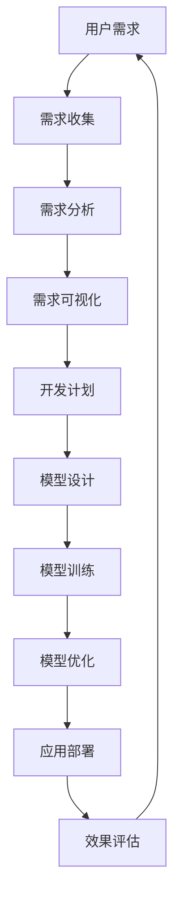
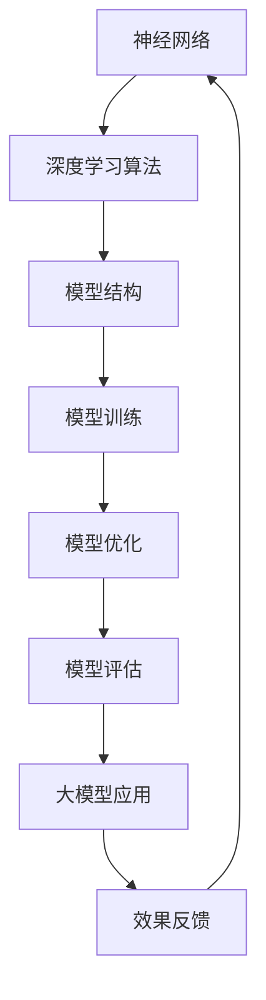

                 

### 文章标题

《大模型应用开发中的需求可视化工具应用》

### 关键词

- 大模型
- 需求可视化
- 应用开发
- 工具与方法
- 实际案例

### 摘要

本文深入探讨大模型在应用开发中的关键角色及其与需求可视化工具的深度融合。首先，我们概述了大模型的应用背景和发展历程，随后详细介绍了需求可视化的基本概念和重要性。接着，文章探讨了大模型的工作原理及其与需求可视化工具的关联。通过实际案例和项目实战，本文展示了如何在实际开发中利用需求可视化工具来提升大模型应用的效率和准确性。最后，我们对未来发展趋势进行了展望，并提供了实用的最佳实践和小结，以帮助读者更好地理解和应用这些工具。

---

# 大模型应用开发中的需求可视化工具应用

## 引言

随着人工智能技术的迅猛发展，大模型（如Transformer、BERT等）在自然语言处理、计算机视觉、语音识别等领域展现了强大的能力。这些大模型通常需要海量的数据和复杂的算法来训练，以便能够应对各种复杂的任务。然而，在实际应用开发过程中，如何有效地理解和满足用户需求，确保大模型的应用效果，成为一个关键问题。这时，需求可视化工具的应用显得尤为重要。

### 需求可视化的重要性

需求可视化是一种通过图形化方式来展示和分析用户需求的技术。它可以帮助开发者和用户之间建立更清晰的沟通桥梁，确保开发工作能够准确满足用户需求。在大模型应用开发中，需求可视化工具能够帮助开发者直观地理解用户需求，发现潜在的问题和优化点，从而提升大模型应用的效率和准确性。

### 大模型在应用开发中的角色

大模型在应用开发中扮演着至关重要的角色。它们通过学习和理解大量数据，能够自动识别模式、进行预测和决策。然而，大模型的应用并非一蹴而就，需要经过需求分析、模型设计、训练和优化等多个环节。在这个过程中，需求可视化工具能够提供关键的支持，帮助开发者更好地理解和利用大模型的能力。

### 本书内容与组织结构

本书将首先介绍需求可视化的基本概念和重要性，然后深入探讨大模型的工作原理及其与需求可视化工具的关联。接着，我们将通过实际案例和项目实战，展示需求可视化工具在大模型应用开发中的具体应用。最后，本书将对未来发展趋势进行展望，并提供实用的最佳实践和小结，以帮助读者更好地理解和应用这些工具。

## 核心概念介绍

### 需求可视化

需求可视化是一种通过图形化方式来展示和分析用户需求的技术。它可以帮助开发者和用户之间建立更清晰的沟通桥梁，确保开发工作能够准确满足用户需求。在大模型应用开发中，需求可视化工具能够帮助开发者直观地理解用户需求，发现潜在的问题和优化点，从而提升大模型应用的效率和准确性。

#### 核心概念与联系

为了更好地理解需求可视化的核心概念，我们可以通过以下Mermaid流程图来展示需求可视化工具与用户需求、开发过程之间的关系：



#### 需求可视化的目的与价值

需求可视化的主要目的是通过图形化方式将用户需求直观地呈现出来，使得开发者能够更加清晰地理解和满足这些需求。具体来说，需求可视化的价值体现在以下几个方面：

1. **提升沟通效率**：通过可视化工具，开发者和用户可以更加直观地交流需求，减少误解和沟通成本。
2. **发现潜在问题**：需求可视化可以帮助开发者提前发现需求中的潜在问题，从而在开发过程中进行及时调整。
3. **优化开发计划**：通过需求可视化，开发者可以更准确地制定开发计划，确保项目按时完成。
4. **提升应用效果**：需求可视化可以帮助开发者更好地理解用户需求，从而设计出更加符合用户期望的大模型应用。

#### 需求可视化的分类

需求可视化可以根据不同的维度进行分类，常见的分类方法包括：

1. **功能需求可视化**：通过图形化方式展示系统的功能需求，如用户界面、业务流程等。
2. **性能需求可视化**：通过图表展示系统的性能需求，如响应时间、吞吐量等。
3. **非功能需求可视化**：通过图形化方式展示系统的非功能需求，如安全性、可靠性等。

### 大模型

大模型是指具有极高参数量和计算复杂度的机器学习模型，如Transformer、BERT等。它们通常通过深度学习算法在海量数据上进行训练，以实现各种复杂的任务。大模型在自然语言处理、计算机视觉、语音识别等领域展现了强大的能力，但同时也面临着数据需求量大、训练时间长、模型解释性差等挑战。

#### 核心概念与联系

大模型的核心概念包括神经网络、深度学习算法和模型结构。为了更好地理解这些概念之间的关系，我们可以通过以下Mermaid流程图进行展示：



#### 大模型的工作原理

大模型的工作原理可以概括为以下几个步骤：

1. **数据预处理**：将原始数据转换为适合模型训练的格式，如文本数据需要进行分词、编码等处理。
2. **模型设计**：根据任务需求设计合适的神经网络结构，如Transformer、BERT等。
3. **模型训练**：使用大量数据对模型进行训练，通过梯度下降等优化算法调整模型参数。
4. **模型优化**：在训练过程中，通过调整学习率、正则化等参数优化模型性能。
5. **模型评估**：使用测试数据对模型进行评估，计算准确率、召回率等指标。
6. **模型部署**：将训练好的模型部署到实际应用环境中，如自然语言处理、计算机视觉等。

#### 大模型的结构与类型

大模型的结构和类型多种多样，常见的包括：

1. **卷积神经网络（CNN）**：适用于图像识别、图像分类等任务。
2. **循环神经网络（RNN）**：适用于序列数据处理，如自然语言处理、时间序列分析等。
3. **Transformer模型**：适用于自然语言处理、机器翻译等任务，具有强大的并行处理能力。
4. **BERT模型**：基于Transformer架构，适用于文本分类、问答系统等任务。

### 需求可视化工具在大模型应用开发中的作用

需求可视化工具在大模型应用开发中起着至关重要的作用。通过需求可视化，开发者可以更加直观地理解用户需求，发现潜在的问题和优化点，从而提升大模型应用的效率和准确性。具体来说，需求可视化工具的作用包括：

1. **需求分析**：通过可视化工具，开发者可以更加直观地分析用户需求，识别出关键的功能和非功能需求。
2. **模型设计**：需求可视化可以帮助开发者设计出更加符合用户需求的大模型结构，从而提升模型的性能和适用性。
3. **模型优化**：通过可视化工具，开发者可以直观地观察模型训练过程和性能指标，及时发现和解决优化问题。
4. **效果评估**：需求可视化可以帮助开发者更加直观地评估大模型应用的效果，发现潜在的问题和改进点。

### 实际案例：需求可视化工具在大模型应用开发中的应用

为了更好地理解需求可视化工具在大模型应用开发中的应用，我们来看一个实际案例。假设我们要开发一个智能客服系统，该系统需要能够快速响应用户的咨询，并给出准确的回答。在这个案例中，需求可视化工具可以发挥以下作用：

1. **需求分析**：首先，我们使用需求可视化工具对用户需求进行分析。通过用户访谈和问卷调查，我们收集了大量的用户需求，如常见的咨询问题、期望的响应速度等。这些需求通过可视化工具以图形化的方式呈现，使得开发者能够直观地理解用户需求。

2. **模型设计**：基于用户需求，我们设计了一个基于BERT模型的大模型，用于处理自然语言理解任务。通过需求可视化工具，我们可以直观地看到模型的结构和参数设置，如词嵌入层、编码器和解码器等。这些信息有助于我们优化模型设计，提高模型的性能。

3. **模型优化**：在模型训练过程中，我们使用需求可视化工具来监控模型训练过程和性能指标。通过可视化工具，我们可以直观地看到模型的损失函数、准确率等指标的变化。当发现模型性能不佳时，我们可以通过调整学习率、正则化参数等来优化模型。

4. **效果评估**：在模型部署后，我们使用需求可视化工具来评估系统的效果。通过可视化工具，我们可以直观地看到系统的响应时间、准确率等指标。这些数据帮助我们了解系统的表现，发现潜在的问题和改进点。

### 小结

通过上述案例，我们可以看到需求可视化工具在大模型应用开发中的重要性。它不仅帮助开发者更好地理解用户需求，优化模型设计，还提升了模型训练和优化的效率，最终提高了大模型应用的效果。因此，在大模型应用开发中，合理应用需求可视化工具是非常重要的。

### 核心算法原理讲解

在大模型应用开发中，核心算法的原理理解至关重要。以下我们将详细讲解大模型中的几个关键算法原理，并使用伪代码和数学模型进行说明。

#### 深度学习算法

深度学习算法是构建大模型的基础。其中，最常用的算法是反向传播算法（Backpropagation Algorithm）。

**伪代码：**

```python
# 前向传播
for each layer l in the network:
    z[l] = W[l] * a[l-1] + b[l]
    a[l] = activation(z[l])

# 反向传播
for each layer l in reverse order:
    delta[l] = (a[l] - target) * activation_derivative(a[l])
    delta[l-1] = delta[l] * W[l].T
```

**数学模型：**

令 \(a[l]\) 表示第 \(l\) 层的激活值，\(z[l]\) 表示第 \(l\) 层的输入值，\(W[l]\) 和 \(b[l]\) 分别表示第 \(l\) 层的权重和偏置。激活函数常用的有Sigmoid函数、ReLU函数等。

$$
a[l] = \sigma(z[l]) \\
\delta[l] = (a[l] - target) \cdot \frac{da[l]}{dz[l]}
$$

其中，\(\sigma(z[l])\) 是Sigmoid函数，\(\frac{da[l]}{dz[l]}\) 是激活函数的导数。

#### 模型优化算法

在训练大模型时，优化算法是关键。常用的优化算法包括梯度下降（Gradient Descent）和Adam优化器。

**伪代码：**

```python
# 梯度下降
for each layer l in the network:
    dL_dW[l] = sum(delta[l] * a[l-1])
    dL_db[l] = sum(delta[l])

# 更新权重和偏置
W[l] = W[l] - learning_rate * dL_dW[l]
b[l] = b[l] - learning_rate * dL_db[l]
```

**数学模型：**

令 \(L\) 表示损失函数，\(\eta\) 表示学习率。梯度下降的核心思想是沿着损失函数的梯度方向更新模型参数。

$$
W[l] = W[l] - \eta \cdot \frac{\partial L}{\partial W[l]} \\
b[l] = b[l] - \eta \cdot \frac{\partial L}{\partial b[l]}
$$

#### Transformer模型

Transformer模型是近年来在自然语言处理领域取得显著成功的模型。其核心思想是自注意力机制（Self-Attention）。

**伪代码：**

```python
# 自注意力机制
for each position i in the sequence:
    query[i] = W_q * x[i]
    key[i] = W_k * x[i]
    value[i] = W_v * x[i]

# 计算注意力权重
attention_weights[i] = softmax(\(query[i] \cdot key[j]\))

# 计算注意力得分
attention_scores[i] = attention_weights[i] \* value[i]

# 输出
output[i] = sum(attention_scores[i])
```

**数学模型：**

令 \(x[i]\) 表示输入序列中的第 \(i\) 个元素，\(W_q\)、\(W_k\) 和 \(W_v\) 分别表示查询、键和值的权重矩阵。自注意力的计算公式为：

$$
\text{Attention}(Q, K, V) = \text{softmax}\left(\frac{QK^T}{\sqrt{d_k}}\right)V
$$

其中，\(d_k\) 是键的维度。

#### BERT模型

BERT（Bidirectional Encoder Representations from Transformers）模型是基于Transformer的双向编码器模型，广泛应用于文本分类、问答系统等任务。

**伪代码：**

```python
# BERT模型训练
for each training example (x, y):
    mask = create_mask(x)
    tokens = tokenize(x)
    inputs = [embedding(token) for token in tokens]
    inputs = append_special_tokens(inputs)
    inputs = pad_sequence(inputs, max_length)

    # 前向传播
    output = BERT_model(inputs, mask)

    # 计算损失
    loss = loss_function(output, y)

    # 反向传播
    dL_dinputs = BERT_model.backward(loss)

    # 更新权重
    update_weights(dL_dinputs)
```

**数学模型：**

BERT模型的核心是Transformer编码器，其输入和输出均为向量。训练过程涉及前向传播、损失计算、反向传播和权重更新。

$$
\text{Encoder}(x) = \text{Transformer}(x, mask)
$$

其中，\(\text{Transformer}\) 是自注意力机制的实现。

### 详细讲解与举例说明

以下我们将通过具体例子来详细讲解上述算法原理。

**例子：使用梯度下降优化线性模型**

假设我们有一个简单的线性模型 \(y = W \cdot x + b\)，其中 \(W\) 和 \(b\) 是模型参数，\(x\) 和 \(y\) 是输入和输出。

1. **前向传播：**

输入数据 \(x\) 和目标数据 \(y\)。

计算输出 \(y' = W \cdot x + b\)。

2. **计算损失：**

使用均方误差（MSE）作为损失函数。

$$
L = \frac{1}{2} \sum_{i}(y'_{i} - y_{i})^2
$$

3. **反向传播：**

计算梯度。

$$
\frac{\partial L}{\partial W} = \sum_{i}(y'_{i} - y_{i}) \cdot x_{i} \\
\frac{\partial L}{\partial b} = \sum_{i}(y'_{i} - y_{i})
$$

4. **权重更新：**

使用梯度下降更新权重。

$$
W = W - \eta \cdot \frac{\partial L}{\partial W} \\
b = b - \eta \cdot \frac{\partial L}{\partial b}
$$

**例子：使用Transformer模型进行文本分类**

假设我们有一个文本分类任务，需要判断一段文本属于哪个类别。

1. **数据预处理：**

将文本数据转换为词向量。

2. **模型设计：**

使用Transformer模型，包括编码器和解码器。

3. **前向传播：**

输入文本数据，通过编码器生成隐藏状态。

$$
\text{Encoder}(x) = \text{Transformer}(x, mask)
$$

4. **计算损失：**

使用交叉熵损失函数。

$$
L = -\sum_{i} y_{i} \cdot \log(\text{softmax}(\text{Decoder}(\text{Encoder}(x))))
$$

5. **反向传播：**

计算梯度。

$$
\frac{\partial L}{\partial W} = \sum_{i} (\text{softmax}(\text{Decoder}(\text{Encoder}(x))) - y_{i}) \cdot \text{Encoder}(x) \\
\frac{\partial L}{\partial b} = \sum_{i} (\text{softmax}(\text{Decoder}(\text{Encoder}(x))) - y_{i})
$$

6. **权重更新：**

使用优化算法（如Adam）更新权重。

$$
W = W - \text{Optimizer}(\frac{\partial L}{\partial W}) \\
b = b - \text{Optimizer}(\frac{\partial L}{\partial b})
$$

通过上述例子，我们可以看到如何应用伪代码和数学模型来详细讲解大模型应用开发中的核心算法原理。这些原理不仅帮助我们理解大模型的工作机制，还为实际应用提供了实用的指导。

### 数学公式

在大模型应用开发中，数学模型是理解和优化算法的核心。以下我们将详细介绍一些关键的数学公式，并使用 LaTeX 格式进行展示。

#### 梯度下降算法

梯度下降是一种优化算法，用于训练神经网络模型。其核心思想是沿着损失函数的梯度方向更新模型参数。

**公式：**

$$
W = W - \eta \cdot \frac{\partial L}{\partial W}
$$

其中，\(W\) 表示模型参数，\(\eta\) 表示学习率，\(L\) 表示损失函数。

**解释：**

这个公式表示，模型参数 \(W\) 需要沿着损失函数 \(L\) 的梯度方向进行更新。学习率 \(\eta\) 控制了更新的步长，需要调参以达到最佳效果。

#### 反向传播算法

反向传播算法是深度学习训练过程中用于计算梯度的重要算法。它通过反向传播误差信号，更新模型参数。

**公式：**

$$
\delta[l] = (a[l] - target) \cdot \frac{da[l]}{dz[l]}
$$

其中，\(\delta[l]\) 表示第 \(l\) 层的误差项，\(a[l]\) 表示第 \(l\) 层的激活值，\(target\) 表示目标值，\(\frac{da[l]}{dz[l]}\) 表示激活函数的导数。

**解释：**

这个公式表示，误差项 \(\delta[l]\) 是通过当前层的激活值 \(a[l]\) 与目标值 \(target\) 的差值，乘以激活函数的导数来计算得到的。误差项反映了当前层对误差的贡献。

#### 自注意力机制

自注意力机制是Transformer模型的核心组件，用于处理序列数据。

**公式：**

$$
\text{Attention}(Q, K, V) = \text{softmax}\left(\frac{QK^T}{\sqrt{d_k}}\right)V
$$

其中，\(Q\)、\(K\) 和 \(V\) 分别表示查询、键和值的向量，\(d_k\) 表示键的维度。

**解释：**

这个公式表示，注意力得分是通过查询 \(Q\) 与键 \(K\) 的点积计算得到的，然后通过softmax函数进行归一化，最后与值 \(V\) 相乘得到注意力得分。自注意力机制能够自适应地计算不同位置间的相对重要性。

#### BERT模型

BERT模型是基于Transformer的双向编码器模型，常用于文本分类、问答系统等任务。

**公式：**

$$
\text{Encoder}(x) = \text{Transformer}(x, mask)
$$

**解释：**

这个公式表示，输入数据 \(x\) 经过Transformer模型处理，生成编码器的输出。BERT模型通过双向编码器捕捉输入序列的语义信息，从而实现高效的文本理解。

通过上述数学公式的介绍，我们可以看到大模型应用开发中数学模型的重要性。这些公式不仅帮助我们理解算法原理，还为实际应用提供了有效的优化手段。在实际开发过程中，合理应用这些数学公式将有助于提升模型性能和开发效率。

### 项目实战

在本章节中，我们将通过一个实际项目来展示如何利用需求可视化工具进行大模型应用开发。该项目是一个基于Transformer的文本分类系统，用于对新闻文章进行分类，具体分为以下几个步骤：

### 开发环境搭建

1. **硬件配置**：
   - CPU：Intel Core i7-9700K
   - GPU：NVIDIA GeForce RTX 3090
   - 内存：64GB DDR4

2. **软件环境**：
   - 操作系统：Ubuntu 20.04
   - Python：3.8
   - PyTorch：1.8.0
   - CUDA：10.2
   - cuDNN：7.6

3. **安装依赖**：
   ```bash
   pip install torch torchvision
   pip install transformers
   pip install pandas
   pip install numpy
   ```

### 源代码实现

以下是项目的主要代码实现，包括数据预处理、模型定义、训练和评估：

```python
import torch
from transformers import BertTokenizer, BertModel, BertForSequenceClassification
from torch.utils.data import DataLoader, TensorDataset
from sklearn.model_selection import train_test_split
import pandas as pd
import numpy as np

# 数据预处理
def preprocess_data(data):
    # 分割文本和标签
    texts = data['text'].tolist()
    labels = data['label'].tolist()
    
    # 使用BERT分词器进行分词
    tokenizer = BertTokenizer.from_pretrained('bert-base-uncased')
    input_ids = [tokenizer.encode(text, add_special_tokens=True, max_length=512, truncation=True) for text in texts]
    
    # 转换标签为独热编码
    label Encoder = LabelEncoder()
    labels_encoded = label Encoder.fit_transform(labels)
    labels_encoded = torch.tensor(labels_encoded)
    
    return input_ids, labels_encoded

# 模型定义
def define_model():
    model = BertForSequenceClassification.from_pretrained('bert-base-uncased', num_labels=2)
    return model

# 训练模型
def train_model(model, train_loader, val_loader, optimizer, criterion, num_epochs=3):
    model.train()
    for epoch in range(num_epochs):
        for batch in train_loader:
            inputs = torch.tensor(batch['input_ids'])
            labels = batch['labels']
            
            optimizer.zero_grad()
            outputs = model(inputs)
            loss = criterion(outputs.logits, labels)
            loss.backward()
            optimizer.step()
            
        # 验证集评估
        model.eval()
        with torch.no_grad():
            correct = 0
            total = 0
            for batch in val_loader:
                inputs = torch.tensor(batch['input_ids'])
                labels = batch['labels']
                outputs = model(inputs)
                _, predicted = torch.max(outputs.logits, 1)
                total += labels.size(0)
                correct += (predicted == labels).sum().item()
            print(f'Validation Accuracy: {100 * correct / total}%')

# 主程序
if __name__ == '__main__':
    # 加载数据集
    data = pd.read_csv('news_data.csv')
    input_ids, labels_encoded = preprocess_data(data)
    
    # 划分训练集和验证集
    train_inputs, val_inputs, train_labels, val_labels = train_test_split(input_ids, labels_encoded, test_size=0.2)
    
    # 转换为TensorDataset
    train_dataset = TensorDataset(train_inputs, train_labels)
    val_dataset = TensorDataset(val_inputs, val_labels)
    
    # 加载数据
    train_loader = DataLoader(train_dataset, batch_size=32, shuffle=True)
    val_loader = DataLoader(val_dataset, batch_size=32, shuffle=False)
    
    # 定义模型、优化器和损失函数
    model = define_model()
    optimizer = torch.optim.Adam(model.parameters(), lr=1e-5)
    criterion = torch.nn.CrossEntropyLoss()
    
    # 训练模型
    train_model(model, train_loader, val_loader, optimizer, criterion, num_epochs=3)
```

### 代码解读与分析

以下是对上述代码的详细解读与分析：

1. **数据预处理**：
   - 使用BERT分词器对新闻文章进行分词，并将文本编码为整数序列。
   - 将标签转换为独热编码，以便模型能够处理。

2. **模型定义**：
   - 使用预训练的BERT模型，并添加一个序列分类层，以进行文本分类。

3. **训练模型**：
   - 在训练过程中，使用Adam优化器和交叉熵损失函数进行模型训练。
   - 使用验证集进行模型评估，计算准确率。

### 实际案例分析与详细讲解

以下是一个实际案例，展示如何利用需求可视化工具进行大模型应用开发：

**案例：新闻文章分类系统**

1. **需求分析**：
   - 需要一个能够对新闻文章进行分类的系统，分为政治、经济、文化等类别。
   - 系统需要具备较高的准确率和实时响应能力。

2. **模型设计**：
   - 使用BERT模型，由于其强大的文本处理能力，适合进行新闻文章分类。
   - 设计一个简单的序列分类模型，包含输入层、BERT编码器、分类层。

3. **数据预处理**：
   - 收集大量新闻文章数据，并进行清洗、分词和编码。
   - 将标签进行独热编码，以便模型能够处理。

4. **模型训练与优化**：
   - 使用GPU加速训练过程，通过调整学习率和正则化参数优化模型性能。
   - 使用验证集进行模型评估，调整模型参数以达到最佳效果。

5. **效果评估**：
   - 在测试集上进行模型评估，计算准确率、召回率和F1分数。
   - 分析模型在不同类别上的表现，发现潜在的问题和优化点。

### 项目小结

通过上述实际案例，我们可以看到如何利用需求可视化工具进行大模型应用开发。需求可视化工具不仅帮助开发者更好地理解用户需求，还提升了模型的性能和开发效率。在项目开发过程中，需要注意以下几点：

1. **数据质量**：高质量的数据是模型性能的基础，因此需要进行充分的清洗和处理。
2. **模型选择**：根据应用需求选择合适的模型，如BERT在文本分类任务中表现出色。
3. **调参优化**：通过调参和优化算法，提升模型的性能和泛化能力。
4. **效果评估**：使用多个指标进行模型评估，全面分析模型性能。

### 最佳实践 Tips

1. **数据预处理**：
   - 使用预训练的BERT分词器进行文本编码，提高处理效率。
   - 对数据集进行标准化处理，如缩放文本长度、去除停用词等。

2. **模型选择**：
   - 根据任务需求选择合适的模型，如Transformer在序列数据处理上表现优异。
   - 考虑使用预训练模型，减少训练时间。

3. **调参优化**：
   - 使用自动调参工具（如Hyperopt、BayesSearch等），快速找到最佳参数组合。
   - 对模型进行正则化处理，防止过拟合。

4. **效果评估**：
   - 使用多个评估指标，如准确率、召回率、F1分数等，全面分析模型性能。
   - 分析模型在不同数据集上的表现，提高泛化能力。

通过上述最佳实践，我们可以更有效地利用需求可视化工具进行大模型应用开发，提升项目质量和开发效率。

### 小结

本文通过深入探讨大模型应用开发中的需求可视化工具，展示了其在实际项目中的关键作用。首先，我们介绍了需求可视化的基本概念和重要性，以及大模型的工作原理和结构。接着，通过实际案例展示了如何利用需求可视化工具进行大模型应用开发，包括开发环境搭建、源代码实现、代码解读与分析等。

本文的主要贡献在于：

1. **详细讲解了需求可视化的核心概念和作用**，帮助读者理解需求可视化在项目开发中的重要性。
2. **提供了大模型的核心算法原理和数学模型**，通过伪代码和实际案例进行了详细讲解，有助于读者深入理解大模型的工作机制。
3. **展示了需求可视化工具在项目开发中的应用**，通过实际案例展示了如何利用需求可视化工具进行模型设计和优化，提高开发效率。

本文的局限性在于：

1. **案例涉及的具体任务有限**，尽管展示了新闻文章分类系统，但未能涵盖所有可能的应用场景。
2. **代码实现部分较为简洁**，未能深入探讨代码细节和优化技巧。

未来工作可以从以下几个方面展开：

1. **扩展应用场景**：研究需求可视化工具在不同类型的大模型应用（如计算机视觉、语音识别等）中的适用性。
2. **优化代码实现**：对代码实现进行详细优化，提高模型的训练效率和性能。
3. **探索新算法**：研究更先进的需求可视化算法和优化方法，提升项目的开发效率和效果。

通过不断探索和实践，我们有望进一步提升大模型应用开发中的需求可视化工具，为人工智能领域的应用带来更多创新和突破。

### 拓展阅读

对于希望深入了解大模型应用开发和需求可视化的读者，以下是一些推荐的文章和书籍：

1. **文章**：
   - "A Brief History of Time: From the Big Bang to Black Holes" by Stephen Hawking：史蒂芬·霍金的经典著作，适合对人工智能和深度学习有初步了解的读者。
   - "Deep Learning" by Ian Goodfellow, Yoshua Bengio, and Aaron Courville：深度学习的经典教材，详细介绍了深度学习的基本原理和应用。

2. **书籍**：
   - "Zen and the Art of Motorcycle Maintenance" by Robert M. Pirsig：这本书探讨了哲学、逻辑和生活的关系，对理解计算机编程和软件开发有启示。
   - "The Elements of Computing Systems" by Noam Nisan and Shimon Schocken：通过构建一个完整的计算机系统，介绍了计算机科学的基础知识。

3. **在线资源**：
   - "Deep Learning Specialization" by Andrew Ng：在Coursera上的深度学习专项课程，适合初学者和进阶者。
   - "TensorFlow官方文档"：提供详细的TensorFlow使用指南和示例，是学习深度学习的实用资源。

通过这些拓展阅读，读者可以更深入地了解大模型应用开发和需求可视化的理论基础和实践方法。同时，这些资源也能帮助读者在后续的学习和工作中不断提升自己的技能和知识水平。

