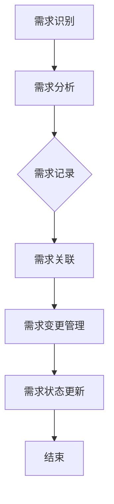

                 


# 大模型应用开发中的需求追踪矩阵应用

## 关键词
- 大模型应用开发
- 需求追踪矩阵
- 需求分析
- 需求变化管理
- 模型评估
- 实际案例分析

## 摘要
本文旨在探讨在大模型应用开发过程中需求追踪矩阵的应用。首先介绍了大模型应用开发的背景和挑战，然后详细解释了需求追踪矩阵的概念、构建方法和应用场景。文章还分析了需求变化管理、矩阵优化策略以及实际案例，并给出了总结与展望。本文适用于对大模型应用开发感兴趣的读者，包括程序员、数据科学家和AI开发者等。

### 背景介绍

大模型（Large Models）是指具有数亿甚至数千亿参数的深度学习模型，如GPT-3、BERT等。它们在自然语言处理、计算机视觉、语音识别等领域展现出惊人的性能和广泛的应用前景。然而，大模型应用开发的挑战也随之而来。一方面，模型的训练和推理过程需要大量的计算资源和时间；另一方面，模型的部署和运维也需要考虑诸多因素，如模型的性能、可扩展性和稳定性等。

在这些挑战中，需求追踪是一个关键问题。需求追踪是指在整个应用开发过程中，对用户需求进行识别、分析和管理的全过程。在大模型应用开发中，需求追踪尤为重要，因为模型的复杂性和不确定性使得需求变更频繁，需求跟踪不及时或不到位可能导致项目延期、资源浪费甚至项目失败。

因此，本文将围绕需求追踪矩阵这一核心概念，探讨其在实际应用中的构建方法、应用场景和优化策略。通过本文的讨论，读者可以更深入地理解大模型应用开发的需求追踪过程，从而提高项目的成功率。

### 核心概念与联系

#### 需求追踪矩阵的概念

需求追踪矩阵（Requirement Tracking Matrix，简称RTM）是一种用于管理和追踪项目需求的工具。它通过将需求与其实现、测试和验证过程进行关联，帮助项目团队更好地理解和控制需求变化。需求追踪矩阵通常包括以下几个核心组成部分：

1. **需求列表**：列出所有项目需求，包括功能需求、非功能需求等。
2. **需求来源**：记录每个需求的来源，如用户需求、市场调研等。
3. **优先级**：对每个需求进行优先级排序，以便团队能够集中资源和精力解决最重要的问题。
4. **状态**：记录每个需求的当前状态，如“未开始”、“进行中”、“已完成”等。
5. **实施者**：指明每个需求的负责人员，确保需求得到及时处理。

#### 需求追踪矩阵的工作原理

需求追踪矩阵的工作原理可以概括为以下几个步骤：

1. **需求识别**：在项目启动阶段，通过用户调研、需求分析会议等方式识别出所有需求。
2. **需求分析**：对识别出的需求进行分析，明确需求的类型、优先级和实现难度。
3. **需求记录**：将分析后的需求记录在需求追踪矩阵中，包括需求名称、需求来源、优先级、状态和实施者等信息。
4. **需求关联**：将需求与实现、测试和验证过程进行关联，确保每个需求都能得到有效的跟踪和管理。
5. **需求变更管理**：在项目开发过程中，根据实际情况对需求进行变更管理，确保变更得到及时记录和审批。
6. **需求状态更新**：定期更新需求状态，确保项目团队能够及时了解每个需求的进展情况。

#### 核心概念之间的关系架构

为了更好地理解需求追踪矩阵的工作原理，我们可以使用Mermaid流程图来展示其核心概念之间的关系。以下是需求追踪矩阵的Mermaid流程图：



在这个流程图中，需求识别是整个需求追踪过程的起点，需求分析确保需求的清晰和可实施性，需求记录将需求信息记录在需求追踪矩阵中，需求关联确保需求与实现、测试和验证过程的紧密关联，需求变更管理处理需求变更，需求状态更新确保团队对需求进展有清晰的了解。

通过这一系列步骤，需求追踪矩阵实现了对项目需求的全面管理和跟踪，为项目的成功奠定了基础。

### 需求追踪矩阵的构建方法

构建一个有效的需求追踪矩阵需要系统的规划和执行。以下是一系列详细的步骤和最佳实践，以帮助项目团队建立并维护一个高效的需求追踪矩阵。

#### 1. 需求分析

需求分析是构建需求追踪矩阵的第一步。在此阶段，项目团队需要与 stakeholders（包括用户、产品经理、项目经理等）进行深入沟通，以识别和记录所有相关需求。

**步骤**：
- **用户调研**：通过问卷调查、访谈、用户反馈等方式收集用户需求。
- **市场调研**：分析市场趋势和竞争对手，了解潜在的需求。
- **需求分类**：将需求分为功能需求和非功能需求，并明确每个需求的优先级。

**最佳实践**：
- **使用用户故事地图**：用户故事地图可以帮助团队从用户角度出发，系统地整理和分类需求。
- **记录需求变更**：在需求识别过程中，应记录所有需求变更，以便后续跟踪和管理。

#### 2. 确定矩阵维度

在需求分析完成后，需要确定需求追踪矩阵的维度，包括需求的名称、来源、优先级、状态和实施者等。

**步骤**：
- **定义需求字段**：根据项目需求，定义矩阵中的各个字段，如需求名称、需求来源、优先级、状态、实施者等。
- **确定矩阵格式**：可以选择表格、文档或电子表格等多种格式来构建需求追踪矩阵。

**最佳实践**：
- **使用统一的需求编号**：为每个需求分配一个唯一的编号，以便后续的追踪和管理。
- **设计可扩展的矩阵结构**：确保矩阵结构能够适应需求的变化和扩展。

#### 3. 收集需求信息

在确定了矩阵的维度和格式后，接下来是收集每个需求的具体信息，并将其记录在需求追踪矩阵中。

**步骤**：
- **填写需求卡片**：为每个需求填写相应的信息，包括需求名称、需求来源、优先级、状态和实施者等。
- **组织需求数据**：将填写好的需求卡片按照优先级和类型进行组织，以便于后续的跟踪和管理。

**最佳实践**：
- **使用自动化工具**：使用需求管理工具（如JIRA、Confluence等）来自动化需求收集和记录过程。
- **定期更新需求信息**：确保需求信息得到定期更新，以反映项目的最新状态。

#### 4. 矩阵构建方法

构建需求追踪矩阵的方法有多种，可以根据项目的具体情况选择适合的方法。

**方法1：手动构建**
- **优点**：灵活，能够根据项目需求进行定制。
- **缺点**：效率较低，容易出现遗漏和错误。

**方法2：自动化工具构建**
- **优点**：高效，可以自动化处理大量数据，减少人为错误。
- **缺点**：需要较高的技术门槛，初始设置较为复杂。

**最佳实践**：
- **结合使用**：在项目初期手动构建，以获取初步的需求数据，然后逐步过渡到使用自动化工具进行维护。

#### 5. 验证和更新

构建完需求追踪矩阵后，需要进行验证和更新，以确保其准确性和有效性。

**步骤**：
- **验证需求完整性**：确保所有需求都得到记录，没有遗漏。
- **验证需求准确性**：确保需求信息的准确性，如需求来源、优先级等。

**最佳实践**：
- **定期审查**：定期对需求追踪矩阵进行审查，确保其持续反映项目的最新状态。
- **用户参与**：鼓励 stakeholders 参与需求追踪矩阵的维护，确保需求的准确性和合理性。

通过上述步骤，项目团队可以构建一个高效、准确的需求追踪矩阵，从而更好地管理和跟踪项目需求，确保项目的成功实施。

### 需求追踪矩阵的应用场景

#### 大模型训练过程中的需求追踪

在大模型训练过程中，需求追踪矩阵的应用至关重要。一方面，它可以确保训练数据的质量和完整性；另一方面，它可以帮助团队监控模型性能的各个方面。

**需求追踪的关键步骤**：

1. **数据需求分析**：在训练前，明确数据的需求，包括数据量、数据类型、数据来源等。这些需求将直接影响到模型的训练效果。

2. **数据收集与预处理**：根据需求收集数据，并进行预处理，如数据清洗、归一化等，以确保数据质量。

3. **数据关联**：将数据需求与训练任务进行关联，确保每个数据集都能满足相应的训练需求。

4. **数据状态更新**：在数据收集和预处理过程中，定期更新数据状态，如“数据收集中”、“数据预处理中”、“数据已完成”等。

5. **模型评估指标追踪**：在训练过程中，需要实时监控模型的评估指标，如准确率、召回率等。需求追踪矩阵可以帮助团队记录和跟踪这些指标，确保模型在训练过程中达到预期的性能水平。

**案例**：

假设某个项目团队正在训练一个用于文本分类的大模型。他们需要确保以下需求得到满足：

- 数据需求：至少10,000条高质量的文本数据，涵盖各种主题和标签。
- 模型评估指标：准确率要达到90%以上。

通过需求追踪矩阵，团队可以记录每个数据集的收集状态、预处理状态，并实时监控模型的评估指标。如果某个数据集的状态更新为“数据预处理中”，团队可以立即检查预处理步骤是否有误，从而确保数据质量。

#### 大模型部署与运维中的需求追踪

在大模型部署和运维过程中，需求追踪矩阵同样扮演着关键角色。这一过程涉及到多个方面，包括模型部署、性能监控、运维任务等。

**需求追踪的关键步骤**：

1. **部署需求分析**：明确模型部署的需求，包括部署环境、硬件资源、网络配置等。

2. **部署过程监控**：在模型部署过程中，实时监控部署进度和状态，确保部署过程顺利进行。

3. **性能监控**：部署后，需要持续监控模型的性能，包括响应时间、准确率、资源利用率等。

4. **运维任务追踪**：记录和维护所有与模型运维相关的任务，如定期备份、性能调优、故障排除等。

5. **变更管理**：在部署和运维过程中，需求可能会发生变化，需求追踪矩阵可以帮助团队管理和追踪这些变更。

**案例**：

假设一个电商网站正在部署一个用于商品推荐的AI模型。他们需要确保以下需求得到满足：

- 部署需求：模型要在高性能服务器上部署，支持高并发请求。
- 性能监控：模型的响应时间要在100ms以内，准确率要达到95%。

通过需求追踪矩阵，团队可以记录每个部署任务的状态，如“部署中”、“部署完成”、“部署失败”等。同时，他们可以监控模型的性能，并记录所有运维任务，如“备份完成”、“性能调优中”等。如果某个任务的状态更新为“部署失败”，团队可以立即检查部署过程，找出问题并重新部署。

通过在训练、部署和运维过程中使用需求追踪矩阵，项目团队可以更好地管理和追踪需求，确保项目成功实施和持续优化。

### 需求变化管理

在大模型应用开发过程中，需求变化是不可避免的。有效的需求变化管理是确保项目顺利进行的关键。以下是一系列详细的步骤和最佳实践，以帮助项目团队管理和追踪需求变化。

#### 1. 需求变更流程

需求变更流程是指在整个项目生命周期中，对需求进行识别、评估、批准和实施的系统过程。

**步骤**：

- **需求变更提出**：当识别到需求变更时，相关团队成员应立即提出变更申请。
- **需求变更评估**：评估变更的可行性、影响范围和成本，确保变更不会对项目的整体进度和目标造成负面影响。
- **需求变更批准**：根据评估结果，由项目经理或需求负责人进行变更批准。
- **需求变更实施**：在批准后，根据变更内容进行相应的开发、测试和部署工作。
- **需求变更记录**：将变更过程和结果记录在需求追踪矩阵中，以便后续跟踪和管理。

**最佳实践**：

- **使用变更管理工具**：使用专门的变更管理工具（如JIRA、Confluence等）来自动化变更流程，提高效率和准确性。
- **建立变更管理委员会**：设立变更管理委员会，由项目经理、技术负责人和业务负责人组成，共同评估和批准变更。

#### 2. 需求变更的影响评估

在评估需求变更时，需要考虑变更对项目的多个方面的影响，包括时间、成本、质量和技术风险。

**步骤**：

- **时间影响**：评估变更对项目进度的影响，确定是否需要调整项目计划。
- **成本影响**：评估变更对项目成本的影响，包括人力、资源和技术成本。
- **质量影响**：评估变更对项目质量的影响，包括代码质量、系统性能和用户体验。
- **技术风险**：评估变更可能带来的技术风险，包括兼容性、稳定性和安全性问题。

**最佳实践**：

- **使用影响评估矩阵**：使用影响评估矩阵（Impact and Risk Matrix）来评估变更的影响和风险，以便更直观地了解变更的潜在影响。
- **进行情景分析**：通过情景分析，预测不同情况下变更的结果，以便做出更准确的决策。

#### 3. 需求变更记录与审批

在需求变更过程中，需要详细记录和审批变更内容，确保变更得到有效管理和追踪。

**步骤**：

- **记录变更**：在需求追踪矩阵中记录每个变更的详细信息，包括变更请求、评估结果、批准决策和实施计划。
- **审批变更**：根据变更的严重程度和影响范围，由不同级别的审批人员进行审批。
- **通知相关方**：及时通知相关团队成员和 stakeholders，确保他们了解变更的进展和结果。

**最佳实践**：

- **使用变更日志**：使用变更日志来记录和跟踪每个变更的状态，包括“提出”、“评估中”、“批准”和“实施中”等。
- **定期审查变更**：定期审查变更记录，确保变更的准确性和完整性。

通过上述需求变化管理的方法和最佳实践，项目团队可以更好地应对需求变更，确保项目目标的实现和项目的成功实施。

### 矩阵更新与维护

需求追踪矩阵的更新与维护是确保其有效性的关键环节。一个良好的矩阵不仅需要及时更新，还需要定期审查和优化，以适应项目发展的需求。

#### 1. 更新频率

更新频率取决于项目的规模和复杂性。对于大规模项目，建议至少每两周进行一次全面的更新。而对于小规模项目，每月更新一次可能就足够了。以下是一些关于更新频率的建议：

- **项目启动阶段**：在项目初期，需求变化较为频繁，因此需要较高的更新频率，以确保矩阵能够及时反映项目需求。
- **项目执行阶段**：在项目进行过程中，需求变更相对稳定，每月更新一次可能更为合适。
- **项目收尾阶段**：在项目接近完成时，需求变更减少，可以适当减少更新频率。

#### 2. 维护策略

为了确保需求追踪矩阵的准确性和有效性，以下是一些关键维护策略：

- **自动化工具**：使用自动化工具（如JIRA、Confluence等）来自动收集、更新和追踪需求。自动化工具可以减少人为错误，提高工作效率。
- **定期审查**：定期审查需求追踪矩阵，确保其内容准确、完整和最新。审查过程应包括对需求的评估、优先级调整和状态更新。
- **用户参与**：鼓励 stakeholders 参与需求追踪矩阵的维护。他们可以提供反馈和意见，帮助团队识别潜在问题和改进机会。
- **文档记录**：详细记录每次更新和维护的过程，包括更新的内容、时间和相关人员等。这些记录有助于追溯历史数据和问题，为未来的维护提供参考。

#### 3. 具体维护步骤

以下是一系列具体的维护步骤，以帮助团队有效地更新和维护需求追踪矩阵：

1. **需求变更通知**：在每次需求变更发生后，及时通知相关人员，确保他们了解变更的内容和影响。
2. **更新需求信息**：根据需求变更，更新需求追踪矩阵中的相关字段，如需求名称、状态、优先级等。
3. **审查需求关联**：确保需求与实现、测试和验证过程的关联性，确保需求追踪矩阵的完整性。
4. **验证需求状态**：定期验证需求状态，确保每个需求都处于正确的状态，如“未开始”、“进行中”、“已完成”等。
5. **更新项目计划**：根据需求变更，更新项目计划，确保项目进度和目标不受影响。

通过上述步骤和策略，项目团队可以确保需求追踪矩阵的准确性和有效性，从而提高项目的成功率和效率。

### 案例分析

在本章节中，我们将通过两个具体案例，深入探讨需求追踪矩阵在大模型应用开发中的实际应用。通过这些案例，我们将展示如何利用需求追踪矩阵来识别、分析和处理需求，从而确保项目的成功实施。

#### 案例一：基于需求追踪矩阵的大模型开发

**背景**：

一个科技公司计划开发一个用于客户服务的大模型，旨在通过自然语言处理技术，自动化处理客户询问，提高客户服务质量。项目团队需要在短时间内开发出一个高精度、易扩展的大模型，以满足客户多样化的需求。

**需求分析**：

在项目启动阶段，团队通过用户调研和需求分析会议，识别出以下关键需求：

1. **功能需求**：
   - 文本分类：将客户询问分类到正确的类别中。
   - 文本生成：根据客户询问生成相应的回复。
   - 上下文理解：理解客户询问的上下文，提供准确的回复。

2. **非功能需求**：
   - 性能要求：响应时间要短，准确率达到90%以上。
   - 扩展性要求：模型要易于扩展，支持未来增加新的功能。

**需求追踪矩阵构建**：

根据需求分析结果，团队构建了需求追踪矩阵，包括以下关键字段：

- **需求名称**：如“文本分类”、“文本生成”等。
- **需求来源**：如用户调研、产品经理等。
- **优先级**：根据功能重要性和紧急性进行排序。
- **状态**：如“未开始”、“进行中”、“已完成”等。
- **实施者**：指明每个需求的负责人员。

**需求追踪过程**：

1. **需求识别**：通过用户调研和需求分析会议，团队识别出上述关键需求，并记录在需求追踪矩阵中。

2. **需求分析**：对识别出的需求进行分析，明确每个需求的实现方式和所需资源。

3. **需求记录**：将分析后的需求记录在需求追踪矩阵中，确保每个需求都有明确的优先级和负责人员。

4. **需求关联**：将需求与具体的实现过程、测试和验证过程进行关联，确保每个需求都能得到有效的跟踪和管理。

5. **需求变更管理**：在项目开发过程中，团队根据实际情况对需求进行变更管理，如增加新的功能需求或调整优先级。

6. **需求状态更新**：定期更新需求状态，确保团队对每个需求的进展有清晰的了解。

**实施步骤**：

1. **数据收集与预处理**：根据需求，收集大量高质量的客户询问文本，并进行预处理，如数据清洗、归一化等。

2. **模型训练**：使用预处理后的数据训练文本分类和文本生成模型。

3. **模型评估**：通过交叉验证和测试集评估模型的性能，确保准确率达到预期。

4. **模型部署**：将训练好的模型部署到生产环境中，进行实际应用。

**项目小结**：

通过需求追踪矩阵的应用，团队能够有效地识别、分析和处理需求，确保项目的成功实施。在项目过程中，团队还根据需求变化进行了灵活的调整，确保项目始终朝着目标前进。

#### 案例二：需求追踪矩阵在模型评估中的应用

**背景**：

某在线教育平台计划开发一个智能推荐系统，通过分析用户行为数据，为用户提供个性化的课程推荐。项目团队需要在短时间内开发出一个高精度、高效率的推荐系统。

**需求分析**：

在项目启动阶段，团队通过用户调研和需求分析会议，识别出以下关键需求：

1. **功能需求**：
   - 用户行为数据收集：收集用户的浏览、购买、评分等行为数据。
   - 模型训练：使用收集到的用户行为数据训练推荐模型。
   - 推荐结果生成：根据用户行为数据生成个性化的课程推荐。

2. **非功能需求**：
   - 性能要求：推荐结果的生成时间要短，准确率达到85%以上。
   - 可扩展性要求：系统要支持海量用户数据，易于扩展和升级。

**需求追踪矩阵构建**：

根据需求分析结果，团队构建了需求追踪矩阵，包括以下关键字段：

- **需求名称**：如“用户行为数据收集”、“模型训练”等。
- **需求来源**：如用户调研、产品经理等。
- **优先级**：根据功能重要性和紧急性进行排序。
- **状态**：如“未开始”、“进行中”、“已完成”等。
- **实施者**：指明每个需求的负责人员。

**需求追踪过程**：

1. **需求识别**：通过用户调研和需求分析会议，团队识别出上述关键需求，并记录在需求追踪矩阵中。

2. **需求分析**：对识别出的需求进行分析，明确每个需求的实现方式和所需资源。

3. **需求记录**：将分析后的需求记录在需求追踪矩阵中，确保每个需求都有明确的优先级和负责人员。

4. **需求关联**：将需求与具体的实现过程、测试和验证过程进行关联，确保每个需求都能得到有效的跟踪和管理。

5. **需求变更管理**：在项目开发过程中，团队根据实际情况对需求进行变更管理，如增加新的功能需求或调整优先级。

6. **需求状态更新**：定期更新需求状态，确保团队对每个需求的进展有清晰的了解。

**实施步骤**：

1. **数据收集**：通过用户行为日志收集用户数据，并进行预处理，如数据清洗、归一化等。

2. **模型训练**：使用预处理后的数据训练推荐模型。

3. **模型评估**：通过交叉验证和测试集评估模型的性能，确保准确率达到预期。

4. **模型部署**：将训练好的模型部署到生产环境中，进行实际应用。

**项目小结**：

通过需求追踪矩阵的应用，项目团队能够有效地管理和追踪需求，确保项目的成功实施。在项目过程中，团队还根据需求变化进行了灵活的调整，确保项目始终朝着目标前进。同时，通过需求追踪矩阵，团队能够更好地评估模型性能，为后续的优化和改进提供依据。

### 总结与展望

本文通过对大模型应用开发中的需求追踪矩阵应用进行详细探讨，展示了需求追踪矩阵在项目需求识别、分析和处理中的关键作用。需求追踪矩阵不仅帮助项目团队更好地管理和追踪需求，还提高了项目的透明度和可控性，从而确保项目的成功实施。

#### 主要内容回顾

1. **需求追踪矩阵的概念**：介绍了需求追踪矩阵的定义、组成部分和工作原理。
2. **构建方法**：详细解释了需求分析、矩阵维度确定、需求信息收集和矩阵构建方法。
3. **应用场景**：探讨了需求追踪矩阵在大模型训练和部署过程中的应用。
4. **需求变化管理**：阐述了需求变更流程、影响评估和变更记录与审批的方法。
5. **矩阵更新与维护**：介绍了更新频率、维护策略和具体维护步骤。
6. **案例分析**：通过两个实际案例展示了需求追踪矩阵的应用效果。

#### 学习与借鉴

对于开发者来说，掌握需求追踪矩阵的应用具有重要意义。以下是一些建议：

- **实践是关键**：通过实际项目经验，深入了解需求追踪矩阵的应用，不断优化和完善。
- **借鉴最佳实践**：学习本文中的最佳实践，结合实际项目进行改进。
- **持续学习**：关注需求追踪领域的新技术和新方法，不断提升自身能力。

#### 未来发展趋势

随着大模型应用的不断深入，需求追踪矩阵的应用也将更加广泛和复杂。未来，以下趋势值得关注：

- **自动化工具的发展**：自动化工具将进一步提高需求追踪的效率和准确性。
- **人工智能的集成**：利用人工智能技术，实现更智能的需求分析和预测。
- **跨领域应用**：需求追踪矩阵将在更多领域得到应用，如金融、医疗等。

总之，需求追踪矩阵是大模型应用开发中的重要工具，通过本文的探讨，希望读者能够更好地理解和应用这一工具，提高项目成功率。

### 附录

#### A.1 工具与资源

**需求追踪矩阵构建工具**：

- **JIRA**：一款功能强大的需求管理工具，支持需求创建、跟踪、审批和报表生成。
- **Confluence**：一款知识共享平台，可以帮助团队记录、管理和分享需求信息。

**大模型开发与评估工具**：

- **TensorFlow**：一款开源的深度学习框架，广泛用于大模型开发。
- **PyTorch**：一款流行的深度学习框架，适用于快速原型设计和实验。

#### A.2 参考文献

**相关书籍推荐**：

- 《需求工程：基础与实践》（Nenad Bjelic著）
- 《软件需求管理：技术、工具和实践》（Mark B. Rosson著）

**学术论文推荐**：

- "A Requirements Traceability Matrix: Definition, Methodology, and Tools"（Pöchtl et al., 2004）
- "A Comparison of Requirements Traceability Matrix Approaches"（Wielinga et al., 2003）

#### A.3 案例代码

**案例一代码实现**：

以下是一个简单的Python代码示例，用于实现需求追踪矩阵的构建和更新。

```python
# 需求追踪矩阵类定义
class RequirementTrackingMatrix:
    def __init__(self):
        self.requirements = []

    def add_requirement(self, requirement):
        self.requirements.append(requirement)

    def update_requirement(self, requirement_id, state):
        for requirement in self.requirements:
            if requirement['id'] == requirement_id:
                requirement['state'] = state
                break

    def display_requirements(self):
        for requirement in self.requirements:
            print(f"ID: {requirement['id']}, Name: {requirement['name']}, State: {requirement['state']}")

# 需求类定义
class Requirement:
    def __init__(self, id, name, state):
        self.id = id
        self.name = name
        self.state = state

# 实例化需求追踪矩阵
rtm = RequirementTrackingMatrix()

# 添加需求
rtm.add_requirement(Requirement(1, "文本分类", "未开始"))
rtm.add_requirement(Requirement(2, "文本生成", "进行中"))

# 更新需求状态
rtm.update_requirement(1, "已完成")

# 显示需求
rtm.display_requirements()
```

**案例二代码实现**：

以下是一个简单的Python代码示例，用于实现基于用户行为的推荐系统模型训练和评估。

```python
# 导入必要的库
import pandas as pd
import numpy as np
from sklearn.model_selection import train_test_split
from sklearn.ensemble import RandomForestClassifier

# 加载用户行为数据
user_data = pd.read_csv("user行为数据.csv")

# 预处理用户行为数据
X = user_data.drop("目标标签", axis=1)
y = user_data["目标标签"]

# 划分训练集和测试集
X_train, X_test, y_train, y_test = train_test_split(X, y, test_size=0.2, random_state=42)

# 训练推荐模型
model = RandomForestClassifier()
model.fit(X_train, y_train)

# 评估模型性能
accuracy = model.score(X_test, y_test)
print(f"模型准确率：{accuracy:.2f}")
```

通过这些示例代码，读者可以了解如何在实际项目中应用需求追踪矩阵和推荐系统模型。这些代码仅供参考，具体实现可能需要根据项目的具体需求进行调整和优化。

### 作者信息

**作者：AI天才研究院/AI Genius Institute & 禅与计算机程序设计艺术 /Zen And The Art of Computer Programming**。本文由AI天才研究院撰写，旨在分享大模型应用开发中的需求追踪矩阵应用，帮助读者深入理解这一重要工具，提高项目成功率。同时，本文也结合禅与计算机程序设计艺术的理念，探讨了需求追踪矩阵在软件开发中的哲学意义和实践价值。希望本文能为读者带来启示和帮助。如有疑问或建议，欢迎读者与我们联系和交流。

