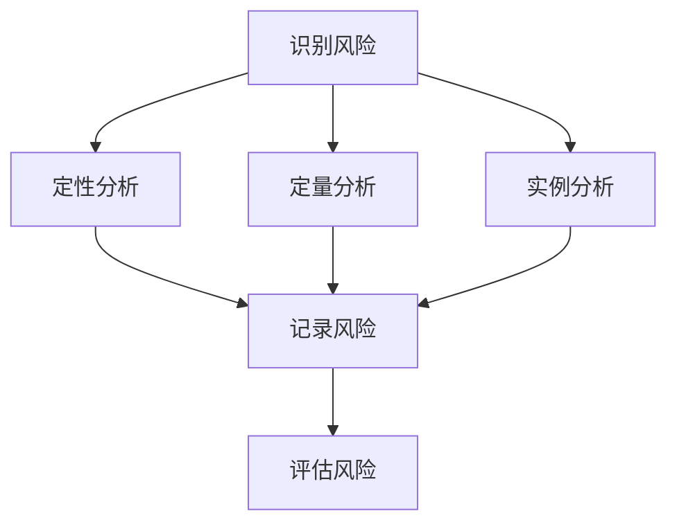
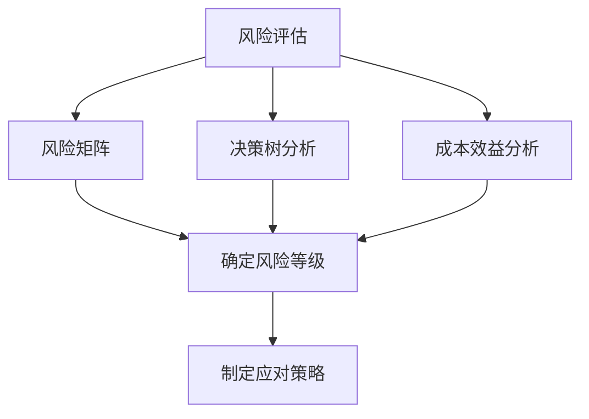
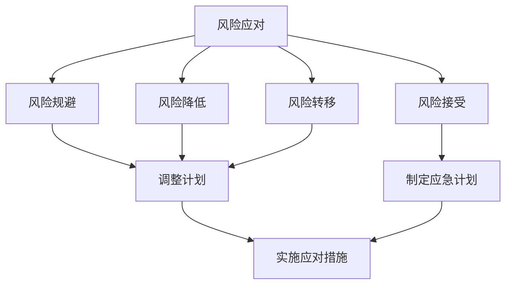

                 

### 文章标题

《大模型应用开发中的风险管理》

### 关键词

大模型，应用开发，风险管理，技术风险，法律风险，商业风险，风险评估，风险应对，法律法规，实践案例

### 摘要

本文深入探讨了在大模型应用开发过程中所面临的风险管理问题。首先，我们介绍了大模型的基本概念和应用背景，然后详细分析了技术风险、法律风险和商业风险三大类风险类型。接着，我们提出了风险管理策略，包括风险识别、风险评估和风险应对，并提供了具体的实践案例。最后，本文讨论了法律法规对风险管理的影响，并总结了未来的挑战与机遇。通过本文，读者将全面了解大模型应用开发中的风险管理，从而为实际项目提供参考和指导。

---

### 引言

#### 1.1 大模型应用开发的背景

随着深度学习技术的快速发展，大模型（如GPT-3、BERT、AlphaGo等）已经在自然语言处理、计算机视觉、游戏AI等多个领域取得了突破性进展。这些大模型具有强大的数据处理和分析能力，能够处理海量的数据，并通过自我学习和优化不断提升性能。大模型的应用不仅提高了生产效率，还为创新应用提供了无限可能。

然而，大模型的应用开发并非一帆风顺。在这个过程中，开发者面临着多种风险，如技术风险、法律风险和商业风险。技术风险包括模型性能不稳定、数据质量问题、计算资源限制等；法律风险则涉及数据隐私、知识产权和合规性问题；商业风险则包括成本控制、市场竞争和运营风险等。这些风险可能对项目的成功与否产生重大影响，因此必须进行有效的风险管理。

#### 1.2 风险管理的概念与重要性

风险管理是一种系统性的过程，旨在识别、评估、应对和管理风险，以最大限度地减少潜在损失，确保项目的顺利进行。在大模型应用开发中，风险管理尤为重要，因为：

1. **降低失败风险**：通过识别和评估潜在风险，开发者可以提前采取措施，避免项目失败。
2. **提高项目成功率**：有效的风险管理有助于确保项目按时、按质、按预算完成。
3. **减少经济损失**：及时的风险应对措施可以减少潜在的经济损失。
4. **提升团队信心**：明确的风险管理策略可以增强团队对项目的信心和动力。
5. **遵守法律法规**：通过遵守相关法律法规，企业可以避免法律纠纷和处罚。

#### 1.3 书籍结构概述

本文分为七个章节，结构如下：

- **第1章 引言**：介绍大模型应用开发的背景和风险管理的概念。
- **第2章 大模型应用开发概述**：详细描述大模型的基本概念和应用领域。
- **第3章 大模型应用开发的风险类型**：分析技术风险、法律风险和商业风险。
- **第4章 风险管理策略**：介绍风险识别、风险评估和风险应对策略。
- **第5章 风险管理实践**：提供实际案例和风险管理流程。
- **第6章 法律法规与风险管理**：讨论法律法规对风险管理的影响。
- **第7章 总结与展望**：总结全文，展望未来风险管理的发展趋势。

通过本文，读者将全面了解大模型应用开发中的风险管理，为实际项目提供参考和指导。

---

### 大模型应用开发概述

#### 2.1 大模型的基本概念

大模型（Large Model）通常指的是拥有数亿至数千亿个参数的神经网络模型。这些模型具有强大的表达能力和泛化能力，能够处理复杂的任务，如图像识别、自然语言处理和游戏AI等。大模型的训练通常需要大量的数据、计算资源和时间。

大模型的核心组成部分包括：

1. **神经网络架构**：大模型通常采用深度神经网络（DNN）或变换器（Transformer）架构，这些架构具有层次化、并行化等优点。
2. **参数**：大模型的参数数量非常庞大，这些参数决定了模型的复杂度和能力。
3. **训练数据**：大模型的训练需要大量的高质量数据，这些数据可以是文本、图像、音频等。

大模型的发展历程可以追溯到20世纪80年代，随着计算能力的提升和数据量的增加，大模型的研究和应用逐渐得到重视。近年来，随着深度学习和分布式计算技术的发展，大模型的研究和应用取得了显著的突破。

#### 2.1.1 大模型的发展历程

- **早期阶段（20世纪80年代至90年代）**：神经网络的研究逐渐兴起，但受限于计算能力和数据量，大模型的发展相对缓慢。
- **兴起阶段（2006年 - 2012年）**：Hinton等人的研究推动了深度学习的复兴，特别是深度置信网络（DBN）和深层卷积神经网络（DCNN）的应用。
- **快速发展阶段（2013年 - 至今）**：随着GPU和分布式计算技术的发展，大模型的训练速度和性能得到了大幅提升，大量的大模型如GPT-3、BERT、AlphaGo等相继出现。

#### 2.1.2 大模型的类型

大模型根据应用领域和目标任务的不同，可以分为以下几类：

1. **自然语言处理（NLP）大模型**：如GPT-3、BERT、T5等，这些模型在文本生成、机器翻译、问答系统等领域具有广泛应用。
2. **计算机视觉（CV）大模型**：如ResNet、Inception、ViT等，这些模型在图像分类、目标检测、人脸识别等领域表现出色。
3. **游戏AI大模型**：如AlphaGo、StarCraft II AI等，这些模型在游戏领域展示了超强的决策能力和适应性。
4. **其他领域的大模型**：如金融预测模型、医学诊断模型、推荐系统等，这些模型在特定领域具有广泛的应用前景。

#### 2.1.3 大模型的应用领域

大模型的应用领域非常广泛，以下是一些主要的应用领域：

1. **自然语言处理**：文本生成、机器翻译、问答系统、情感分析等。
2. **计算机视觉**：图像分类、目标检测、人脸识别、图像生成等。
3. **游戏AI**：棋类游戏、格斗游戏、策略游戏等。
4. **金融预测**：股票市场预测、风险控制、信用评估等。
5. **医学诊断**：疾病诊断、药物发现、基因分析等。
6. **推荐系统**：个性化推荐、广告投放、商品搜索等。

大模型的应用不仅提高了相关领域的生产效率，还为创新应用提供了无限可能。然而，大模型的应用也面临着多种风险，这需要通过有效的风险管理来应对。

---

### 大模型应用开发的风险类型

在大模型应用开发过程中，开发者需要面对多种风险，这些风险可能对项目的成功与否产生重大影响。以下将详细分析技术风险、法律风险和商业风险三类主要风险类型。

#### 3.1 技术风险

技术风险是指在大模型应用开发过程中，由于技术问题导致项目无法达到预期目标或出现严重问题的风险。技术风险主要包括以下几个方面：

1. **模型性能风险**：大模型的性能直接决定了应用的效果。如果模型性能不稳定，可能会导致预测误差大、任务完成度低等问题。
    - **原因**：模型参数设置不当、数据集选择不合适、训练过程不充分等。
    - **影响**：影响应用的准确性和可靠性，可能导致项目失败。

2. **数据风险**：大模型的训练和评估需要大量的数据，数据的质量和完整性对模型性能有重要影响。
    - **原因**：数据集不完整、数据存在噪声、数据标注不准确等。
    - **影响**：降低模型性能，影响应用的准确性和泛化能力。

3. **计算资源风险**：大模型的训练和推理通常需要大量的计算资源，如果计算资源不足，可能会导致训练时间过长、推理速度慢等问题。
    - **原因**：硬件设备不足、分布式计算架构设计不合理等。
    - **影响**：影响项目进度，增加成本。

4. **模型稳定性风险**：大模型在训练过程中可能会出现不稳定的情况，如梯度消失、梯度爆炸等，这可能导致模型无法收敛。
    - **原因**：模型设计不当、超参数设置不当等。
    - **影响**：影响模型性能和稳定性，可能导致项目失败。

#### 3.2 法律风险

法律风险是指在大模型应用开发过程中，由于违反相关法律法规而导致法律纠纷、处罚或其他不良后果的风险。法律风险主要包括以下几个方面：

1. **数据隐私风险**：大模型应用通常涉及大量的个人数据，如果数据隐私保护不当，可能会导致用户隐私泄露。
    - **原因**：数据收集和处理不规范、数据存储和传输不安全等。
    - **影响**：可能导致用户信任度下降、法律纠纷和罚款。

2. **合规风险**：大模型应用需要遵守相关行业的法律法规，如金融、医疗、交通等领域的合规要求。
    - **原因**：未充分了解相关法律法规、合规措施不到位等。
    - **影响**：可能导致违规操作、法律纠纷和处罚。

3. **侵权风险**：大模型应用可能侵犯他人的知识产权，如专利、商标、版权等。
    - **原因**：未充分了解相关知识产权法律、使用他人数据或技术等。
    - **影响**：可能导致侵权诉讼、赔偿和法律制裁。

#### 3.3 商业风险

商业风险是指在大模型应用开发过程中，由于市场、运营或管理问题而导致商业损失的风险。商业风险主要包括以下几个方面：

1. **成本风险**：大模型应用开发需要大量的资金投入，如果成本控制不当，可能会导致项目超支。
    - **原因**：预算不合理、成本管理不善等。
    - **影响**：可能导致资金链断裂、项目中断。

2. **市场竞争风险**：大模型应用领域竞争激烈，如果产品或服务无法在市场中脱颖而出，可能会导致市场份额下降。
    - **原因**：市场定位不准确、产品创新不足等。
    - **影响**：可能导致市场份额下降、盈利能力下降。

3. **运营风险**：大模型应用需要持续的技术支持和运维，如果运营管理不善，可能会导致系统故障、数据泄露等问题。
    - **原因**：运维人员不足、运维流程不完善等。
    - **影响**：可能导致用户体验下降、业务中断。

通过以上分析，我们可以看出，大模型应用开发过程中存在多种风险类型，这些风险可能对项目的成功产生重大影响。因此，有效的风险管理策略对于保障项目的顺利进行至关重要。

---

### 风险管理策略

风险管理策略是指在大模型应用开发过程中，通过一系列的系统化方法来识别、评估和应对风险，以最大程度地减少潜在损失和不确定性。以下将详细介绍风险管理策略的三个关键环节：风险识别、风险评估和风险应对。

#### 4.1 风险识别

风险识别是风险管理的首要步骤，旨在发现项目可能面临的各种风险。风险识别可以通过以下几种方法进行：

1. **定性分析**：通过专家访谈、头脑风暴、SWOT分析（优势、劣势、机会、威胁）等方法，识别项目潜在的风险因素。定性分析有助于理解风险的性质和程度，但缺乏量化依据。
   
2. **定量分析**：通过统计方法、历史数据、模型模拟等方法，对风险进行量化分析。定量分析可以提供更精确的风险评估，但需要大量的数据支持。

3. **实例分析**：通过分析类似项目或行业案例，总结经验教训，识别潜在风险。实例分析有助于借鉴他人的经验，但需要确保案例的相似性和适用性。

在风险识别过程中，可以使用Mermaid流程图来展示风险识别的流程和关键步骤，如图1所示。

图1 风险识别流程

#### 4.2 风险评估

风险评估是在风险识别的基础上，对已识别的风险进行评估和排序，以确定风险的重要性和优先级。风险评估可以通过以下几种方法进行：

1. **风险评估矩阵**：使用风险评估矩阵（如风险矩阵）来评估风险的概率和影响，从而确定风险等级。风险矩阵通常包括风险的概率（可能性）和影响（严重性）两个维度。

2. **决策树分析**：通过决策树分析，将风险因素与可能的后果和应对策略相连接，以评估不同决策路径的风险和收益。

3. **成本效益分析**：通过成本效益分析，比较不同风险管理策略的成本和收益，以确定最优策略。

在风险评估过程中，可以使用Mermaid流程图来展示风险评估的流程和关键步骤，如图2所示。

图2 风险评估流程

#### 4.3 风险应对

风险应对是在风险评估的基础上，制定和实施应对策略，以减轻或消除风险的影响。常见的风险应对策略包括：

1. **风险规避**：通过调整项目计划或设计方案，避免风险的直接发生。

2. **风险降低**：通过技术改进、资源优化等措施，降低风险的概率或影响。

3. **风险转移**：通过购买保险、签订合同等方式，将风险转移给第三方。

4. **风险接受**：对于无法规避或降低的风险，采取接受的态度，并制定应急计划以应对风险的发生。

在风险应对过程中，可以使用Mermaid流程图来展示风险应对的流程和关键步骤，如图3所示。

图3 风险应对流程

通过上述风险管理策略，开发者可以系统地识别、评估和应对大模型应用开发过程中的各种风险，确保项目的顺利进行和成功交付。

---

### 风险管理实践

在实际的大模型应用开发过程中，风险管理不仅需要理论指导，更需要具体的实践案例来验证其效果。以下将介绍几个实际案例，详细阐述如何在大模型应用开发中实施风险管理策略。

#### 5.1 风险管理流程

风险管理流程包括风险识别、风险评估、风险应对和风险监控等关键环节。以下是一个典型的大模型应用开发中的风险管理流程：

1. **风险识别**：通过专家访谈、历史数据分析、市场调研等方法，识别项目可能面临的风险因素。例如，在开发一个基于深度学习的医疗诊断系统时，可能识别到的风险因素包括数据隐私风险、模型性能风险和计算资源风险。

2. **风险评估**：对已识别的风险进行定量和定性评估，确定其重要性和优先级。例如，通过风险矩阵分析，将数据隐私风险划分为高风险，模型性能风险和计算资源风险划分为中风险。

3. **风险应对**：针对不同类型的风险，制定相应的应对策略。例如，对于数据隐私风险，可以采取数据加密、隐私保护算法等措施；对于模型性能风险，可以通过增加训练数据、优化模型结构等方式进行应对。

4. **风险监控**：在整个项目周期内，持续监控风险状态，并根据实际情况调整风险应对措施。例如，通过定期检查数据质量、监控模型性能指标，及时发现和解决问题。

#### 5.2 实际案例解析

以下是几个具体的大模型应用开发案例，以及如何进行风险管理。

##### 案例一：某金融企业的大模型风险管理

**背景**：某金融企业计划开发一个基于深度学习算法的智能投顾系统，为用户提供个性化的投资建议。

**风险识别**：在项目初期，通过访谈和调研，识别出以下风险因素：

- **数据隐私风险**：系统需要处理大量用户数据，存在隐私泄露的风险。
- **模型性能风险**：深度学习模型的训练和预测需要大量数据和时间，性能不稳定。
- **计算资源风险**：训练和部署模型需要大量的计算资源，资源不足可能导致项目延期。

**风险评估**：通过风险矩阵分析，确定数据隐私风险为高风险，模型性能风险和计算资源风险为中风险。

**风险应对**：

- **数据隐私风险**：采取数据加密、数据脱敏等措施，确保用户数据安全。
- **模型性能风险**：增加训练数据，优化模型结构，采用交叉验证等方法提高模型稳定性。
- **计算资源风险**：采用分布式计算技术，提高计算效率，确保资源充足。

**风险监控**：通过定期检查数据质量、监控模型性能指标，以及监控计算资源使用情况，及时发现和解决问题。

##### 案例二：某科技公司的大模型风险管理

**背景**：某科技公司计划开发一款基于深度学习的智能家居控制系统，实现对家庭设备的智能管理。

**风险识别**：在项目初期，识别出以下风险因素：

- **数据安全风险**：智能家居系统需要处理家庭设备的数据，存在数据泄露的风险。
- **模型稳定性风险**：深度学习模型在处理不同设备数据时可能不稳定。
- **市场风险**：智能家居市场竞争激烈，产品需要具有明显的优势。

**风险评估**：通过风险矩阵分析，确定数据安全风险和模型稳定性风险为高风险，市场风险为中风险。

**风险应对**：

- **数据安全风险**：采用数据加密、数据隔离等措施，确保数据安全。
- **模型稳定性风险**：通过测试和验证，确保模型在不同设备数据上的稳定性。
- **市场风险**：通过市场调研和用户反馈，优化产品功能，提高用户满意度。

**风险监控**：通过定期检查数据安全情况、监控模型性能指标，以及跟踪市场动态，及时调整风险应对措施。

##### 案例三：某电商平台的大模型风险管理

**背景**：某电商平台计划开发一款基于深度学习的智能推荐系统，提高用户的购物体验。

**风险识别**：在项目初期，识别出以下风险因素：

- **数据质量风险**：推荐系统需要大量高质量的用户和商品数据，数据质量影响模型性能。
- **算法偏见风险**：模型可能存在算法偏见，导致推荐结果不公平或误导用户。
- **计算资源风险**：推荐系统需要实时处理大量用户数据，计算资源不足可能导致延迟。

**风险评估**：通过风险矩阵分析，确定数据质量风险和算法偏见风险为高风险，计算资源风险为中风险。

**风险应对**：

- **数据质量风险**：通过数据清洗、数据标注等措施，确保数据质量。
- **算法偏见风险**：采用公平性评估和算法优化方法，减少算法偏见。
- **计算资源风险**：采用分布式计算和缓存技术，提高计算效率和响应速度。

**风险监控**：通过定期检查数据质量、监控模型偏见指标，以及监控计算资源使用情况，及时调整风险应对措施。

通过以上案例，我们可以看到，在实际的大模型应用开发中，有效的风险管理策略可以帮助企业识别、评估和应对各种风险，确保项目的顺利进行和成功交付。

---

### 法律法规与风险管理

在大模型应用开发中，法律法规对风险管理具有深远的影响。随着人工智能技术的迅速发展，各国纷纷制定了一系列法律法规来规范人工智能应用，保障数据隐私和用户权益。以下将讨论数据保护法规、知识产权法规和合规法规，并分析这些法规对风险管理的影响。

#### 6.1 法律法规概述

1. **数据保护法规**：数据保护法规旨在保护个人数据的隐私和安全。例如，欧盟的《通用数据保护条例》（GDPR）和美国加州的《消费者隐私法案》（CCPA）都是重要的数据保护法规。这些法规规定了数据收集、存储、处理和传输的过程，要求企业采取严格的数据保护措施。

2. **知识产权法规**：知识产权法规保护知识产权的持有者，包括专利、商标、版权和商业秘密。例如，美国《数字千年版权法案》（DMCA）和《专利法》都是重要的知识产权法规。这些法规规定了知识产权的使用和保护，对于大模型应用开发中的知识产权问题具有重要指导意义。

3. **合规法规**：合规法规涉及各个行业的具体要求和标准。例如，金融行业的《萨班斯-奥克斯利法案》（SOX）和医疗行业的《健康保险可携性与责任法案》（HIPAA）都是重要的合规法规。这些法规规定了企业在特定领域的合规要求，对于大模型应用开发中的行业合规问题具有重要参考价值。

#### 6.2 法律法规对风险管理的影响

1. **数据隐私风险**：数据保护法规对数据隐私风险有重要影响。在大模型应用开发中，如果数据隐私保护不当，可能会导致用户隐私泄露，从而引发法律纠纷和罚款。为了应对数据隐私风险，企业需要遵守相关法规，采取数据加密、匿名化、数据访问控制等技术手段，确保数据安全。

2. **知识产权风险**：知识产权法规对知识产权风险有重要影响。在大模型应用开发中，如果侵犯他人的知识产权，可能会导致侵权诉讼、赔偿和法律制裁。为了应对知识产权风险，企业需要充分了解相关法规，确保使用的算法、数据和模型不侵犯他人的知识产权，并采取知识产权保护措施，如专利申请、版权登记等。

3. **合规风险**：合规法规对合规风险有重要影响。在大模型应用开发中，如果未能遵守相关行业的合规要求，可能会导致违规操作、法律纠纷和处罚。为了应对合规风险，企业需要深入了解相关法规，制定合规计划和措施，确保在各个领域符合合规要求。

#### 6.3 法律法规的挑战与应对

1. **挑战**：随着人工智能技术的不断发展和应用，法律法规面临诸多挑战。首先，法规的滞后性可能导致法规无法及时适应技术发展的需求。其次，不同国家和地区的法规差异可能导致企业在全球化运营中面临合规困难。此外，法规的执行力度和监管方式也可能存在不一致，影响企业的合规操作。

2. **应对策略**：

   - **持续关注法规动态**：企业需要持续关注相关法律法规的动态，及时了解法规的变化和更新，确保合规操作。
   - **建立合规团队**：企业可以建立专门的合规团队，负责研究、解读和执行相关法规，确保在各个领域符合合规要求。
   - **制定合规计划**：企业应根据法规要求，制定详细的合规计划，包括合规流程、合规措施和合规检查等，确保合规操作的落实。
   - **采用技术手段**：企业可以利用技术手段，如数据加密、隐私保护算法等，加强数据保护和合规操作。
   - **跨地区合作**：对于跨国运营的企业，可以与当地法律顾问、行业组织等建立合作关系，共同应对法规挑战。

通过以上策略，企业可以在大模型应用开发中有效应对法律法规带来的挑战，确保合规操作，降低法律风险。

---

### 总结与展望

#### 7.1 风险管理的挑战与机遇

在大模型应用开发中，风险管理面临着诸多挑战。首先，技术风险的复杂性使得识别和评估风险变得困难，特别是在模型性能、数据质量和计算资源方面。其次，法律风险的多样性和跨国性增加了合规操作的难度，企业需要应对不同国家和地区的法律法规。最后，商业风险的不确定性使得成本控制、市场竞争和运营管理变得更为复杂。

然而，随着人工智能技术的快速发展，风险管理也面临着前所未有的机遇。首先，人工智能技术本身的发展为风险管理提供了更多的工具和方法，如数据加密、隐私保护算法等。其次，随着市场对大模型应用的接受度不断提高，企业有机会通过创新应用获取更大的市场份额。最后，政策层面的支持也为风险管理提供了良好的发展环境。

#### 7.2 未来风险管理的发展趋势

未来，风险管理在大模型应用开发中将呈现以下趋势：

1. **智能化**：随着人工智能技术的发展，风险管理工具和方法将更加智能化，能够自动识别、评估和应对风险，提高风险管理的效率和准确性。

2. **数据驱动**：风险管理将更加依赖于大数据和数据分析，通过数据驱动的方式识别潜在风险，制定和调整风险应对策略。

3. **标准化**：随着法律法规的不断完善，风险管理将逐步实现标准化，企业需要建立统一的合规标准，确保在各个领域符合法规要求。

4. **全球化**：随着跨国运营的增多，风险管理将更加注重全球视野，企业需要应对不同国家和地区的法规和市场需求。

5. **合作与共享**：风险管理将更加注重行业合作和知识共享，通过合作与交流，共同应对行业风险，提升整体风险管理水平。

#### 7.3 对企业和开发者的建议

为了应对大模型应用开发中的风险管理挑战，企业和开发者可以采取以下措施：

1. **建立完善的风险管理框架**：企业应建立一套完整的风险管理框架，包括风险识别、风险评估、风险应对和风险监控等环节，确保风险管理的系统性和有效性。

2. **加强法规合规性**：企业应深入了解相关法律法规，确保在各个领域符合法规要求，采取数据保护、知识产权保护等措施，降低法律风险。

3. **持续技术更新**：企业应持续关注人工智能技术的发展，不断更新技术工具和方法，提高模型性能和风险管理能力。

4. **加强团队培训**：企业应加强对团队的风险管理培训，提高团队对风险管理的认识和应对能力。

5. **建立应急响应机制**：企业应建立应急响应机制，应对突发风险，确保项目能够迅速调整和恢复。

通过上述措施，企业和开发者可以更好地应对大模型应用开发中的风险管理挑战，确保项目的顺利进行和成功交付。

---

### 作者信息

作者：AI天才研究院/AI Genius Institute & 禅与计算机程序设计艺术 /Zen And The Art of Computer Programming

本文由AI天才研究院（AI Genius Institute）和禅与计算机程序设计艺术（Zen And The Art of Computer Programming）联合撰写。AI天才研究院专注于人工智能领域的研究和创新，致力于推动人工智能技术的发展和应用。禅与计算机程序设计艺术则是一本经典的计算机科学著作，深刻阐述了计算机程序设计的哲学和艺术。两位作者凭借丰富的经验和深厚的理论基础，为大模型应用开发中的风险管理提供了全面而深入的见解。希望通过本文，读者能够更好地理解大模型应用开发中的风险管理，为实际项目提供有价值的参考。

