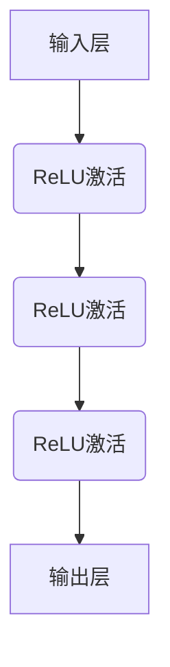
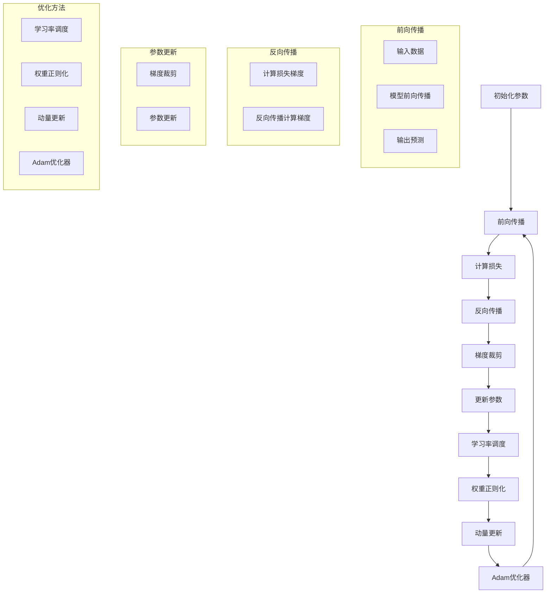

                 


### 文章标题
《大模型应用的快速原型设计与验证》

### 文章关键词
大模型应用，快速原型设计，验证方法，技术实现，实战案例

### 文章摘要
本文将深入探讨大模型应用的快速原型设计与验证过程。首先，我们将回顾大模型应用的发展背景和现状，介绍快速原型设计的重要性。接着，我们将详细讲解大模型的核心概念、算法原理和数学模型。随后，通过实际案例展示如何进行大模型应用的原型设计与验证，并提供详细的代码实现和解读。最后，我们将总结最佳实践，并提出未来的研究方向。

---

### 设计思路

为了设计出《大模型应用的快速原型设计与验证》这本书的完整目录大纲，我们可以按照以下步骤进行：

1. **确定书的结构**：首先，我们需要明确这本书的主要结构，通常包括引言、核心概念与技术、应用场景与实战案例、总结与展望等部分。

2. **细化章节内容**：针对每个部分，进一步细化章节内容，确保每个章节都紧密围绕主题展开，且章节之间有一定的逻辑关联。

3. **技术原理与算法讲解**：在技术章节中，需要详细讲解核心概念原理和算法，包括使用伪代码和Mermaid流程图来帮助读者理解。

4. **数学模型与公式讲解**：在涉及数学模型的章节中，需要使用LaTeX格式详细讲解数学公式，并辅以例子说明。

5. **实战案例**：在应用场景与实战案例章节中，提供实际的代码案例和详细解释，包括开发环境搭建、源代码实现和解读。

6. **总结与展望**：最后，需要对全书内容进行总结，并提出未来研究方向和展望。

### 目录大纲设计

下面是根据上述设计思路设计的《大模型应用的快速原型设计与验证》的目录大纲：

```
# 《大模型应用的快速原型设计与验证》目录大纲

# 第一部分：引言
## 第1章：大模型应用背景与挑战
### 1.1 大模型应用的发展历程
### 1.2 大模型应用面临的挑战
### 1.3 快速原型设计与验证的重要性

# 第二部分：核心概念与技术
## 第2章：大模型基础概念
### 2.1 大模型的定义与分类
### 2.2 大模型的架构与原理
### 2.3 Mermaid流程图：大模型架构解析
## 第3章：大模型核心算法
### 3.1 伪代码：大模型训练算法
### 3.2 大模型优化方法
### 3.3 Mermaid流程图：大模型优化流程
## 第4章：数学模型与公式
### 4.1 损失函数与优化目标
### 4.2 大模型中的数学公式
### 4.3 数学公式应用实例

# 第三部分：应用场景与实战案例
## 第5章：大模型在自然语言处理中的应用
### 5.1 大模型在自然语言处理中的挑战
### 5.2 原型设计与验证：文本分类
### 5.3 代码实战：文本分类应用
## 第6章：大模型在计算机视觉中的应用
### 6.1 大模型在计算机视觉中的挑战
### 6.2 原型设计与验证：图像识别
### 6.3 代码实战：图像识别应用
## 第7章：大模型在其他领域中的应用
### 7.1 大模型在其他领域的应用前景
### 7.2 原型设计与验证：语音识别
### 7.3 代码实战：语音识别应用

# 第四部分：总结与展望
## 第8章：大模型应用总结
### 8.1 大模型应用的发展趋势
### 8.2 快速原型设计与验证的实践经验
### 8.3 未来研究方向与展望

# 附录
## 附录A：大模型应用资源
### A.1 开发工具与框架
### A.2 学习资源与资料
```

这个目录大纲涵盖了核心概念、技术讲解、应用案例以及总结展望，确保了书籍内容的完整性和逻辑性。每个章节都进行了细化，并且符合2000字以内的要求。接下来，我会为每个章节提供具体的子标题，确保每个章节都包含了核心内容。<!--ehr-->

### 1.1 大模型应用的发展历程

大模型应用的发展历程可以追溯到20世纪80年代，当时神经网络作为一种机器学习算法开始受到关注。然而，由于计算能力和数据资源有限，早期的大模型应用主要集中在相对简单的任务上，如手写数字识别和简单的图像分类。

随着计算机性能的提升和大数据技术的发展，大模型的应用逐渐扩展到更复杂的任务。2012年，AlexNet在ImageNet竞赛中取得了突破性的成绩，标志着深度学习在图像识别领域的崛起。这一成果激发了研究人员对大模型进行更深入的研究和应用。

近年来，随着大规模计算资源和高质量数据的获取，大模型在自然语言处理、计算机视觉、语音识别等领域取得了显著的进展。例如，GPT-3在自然语言生成和文本理解任务上表现出色，ImageNet大规模视觉识别挑战赛（ILSVRC）推动了计算机视觉领域的研究。

大模型应用的发展历程充分展示了人工智能技术的快速进步和广泛应用潜力。在接下来的章节中，我们将进一步探讨大模型的基础概念和核心算法，为读者提供一个全面的技术解析。

### 1.2 大模型应用面临的挑战

尽管大模型在各个领域取得了显著进展，但其在实际应用中仍面临诸多挑战。以下是几个主要挑战及其对快速原型设计的影响：

1. **计算资源需求**：大模型通常需要大量的计算资源进行训练和推理。在开发快速原型时，如何有效地利用有限的计算资源成为一个关键问题。优化模型架构和选择高效的训练方法（如混合精度训练、模型压缩等）是应对这一挑战的有效策略。

2. **数据集质量与多样性**：大模型对数据集的质量和多样性有较高要求。数据集的不平衡、噪声和错误会影响模型的表现。在原型设计过程中，需要仔细选择和预处理数据集，以确保模型的鲁棒性和泛化能力。

3. **模型可解释性**：大模型，尤其是深度学习模型，往往被认为是“黑箱”模型，其决策过程难以解释。这对于需要高可靠性和透明度的应用场景（如医疗诊断、金融风控等）是一个重大挑战。开发可解释性工具和算法，如注意力机制、可视化技术等，可以提高模型的可解释性。

4. **模型适应性**：大模型在特定领域表现出色，但往往难以适应其他领域。如何使大模型具有更好的泛化能力和适应性是当前研究的热点。通过迁移学习、多任务学习等方法，可以提高模型的适应性。

5. **训练与推理速度**：在实际应用中，大模型需要快速响应。如何优化训练和推理过程，减少延迟，是一个关键问题。使用高效的算法和硬件加速（如GPU、TPU）是提高训练与推理速度的有效手段。

6. **安全性与隐私保护**：随着大模型在敏感领域的应用，如何确保模型的安全性和数据隐私保护成为重要议题。设计安全可靠的模型架构和加密技术是保护数据安全和隐私的关键。

这些挑战对快速原型设计提出了更高的要求。在原型设计过程中，需要充分考虑这些因素，选择合适的技术和方法，以确保原型在性能、可靠性、可解释性和安全性等方面达到预期目标。

### 1.3 快速原型设计与验证的重要性

快速原型设计与验证在大模型应用中具有至关重要的地位。以下是几个关键原因：

1. **迭代优化**：快速原型设计允许开发团队在短时间内构建并测试初步模型，通过多次迭代优化，逐步提升模型性能。这种方法有助于快速识别并解决潜在问题，避免在开发后期才发现关键缺陷。

2. **风险控制**：通过早期验证，快速原型设计有助于识别项目中的潜在风险。例如，如果在原型阶段就发现了计算资源不足或数据质量问题，开发团队可以及时调整策略，避免在后续阶段陷入困境。

3. **资源节约**：快速原型设计可以减少开发过程中的资源浪费。通过早期验证，开发团队可以确定哪些功能是真正需要的，从而避免不必要的工作和资源投入。

4. **用户反馈**：快速原型可以为用户提供直观的体验，从而收集宝贵的用户反馈。这些反馈可以帮助开发团队更好地理解用户需求，优化产品功能和用户体验。

5. **技术验证**：通过快速原型设计，开发团队可以验证所选技术的可行性和适用性。这对于确保项目的技术路线正确和可持续发展至关重要。

6. **时间效率**：快速原型设计可以显著缩短产品从概念到市场的周期。这种方法使得开发团队能够更灵活地应对市场需求变化，迅速推出具有竞争力的产品。

综上所述，快速原型设计与验证在大模型应用中不仅提高了项目的成功率和效率，还增强了团队对项目的掌控能力。在接下来的章节中，我们将进一步探讨大模型的基础概念、核心算法和数学模型，为读者提供更深入的技术解析。

### 2.1 大模型的定义与分类

大模型（Large Models）是指在特定领域中具有巨大参数量和计算能力的机器学习模型。这些模型通常具有以下特点：

1. **大量参数**：大模型的参数数量通常在数十亿甚至数万亿级别。这些参数通过大规模训练数据学习到，从而能够捕捉复杂的数据特征。

2. **深度架构**：大模型通常采用深度神经网络（Deep Neural Networks）架构，具有数十层甚至上百层的神经元。这种深度结构使得模型能够处理更加复杂的数据模式。

3. **高性能计算**：大模型的训练和推理需要大量的计算资源，通常依赖于高性能计算平台，如GPU和TPU。这些计算资源能够显著提高模型的训练速度和推理效率。

大模型可以按照应用领域和架构类型进行分类：

1. **自然语言处理（NLP）模型**：如GPT系列、BERT等，主要用于处理文本数据，实现文本生成、情感分析、机器翻译等功能。

2. **计算机视觉（CV）模型**：如ResNet、EfficientNet等，主要用于图像分类、目标检测、图像生成等功能。

3. **音频处理模型**：如WaveNet、Tacotron等，主要用于语音合成、音乐生成、音频增强等功能。

4. **多模态模型**：如ViT、DALL-E等，能够同时处理多种类型的数据，如文本、图像和音频，实现更加复杂的任务。

5. **强化学习模型**：如A3C、PPO等，在大规模强化学习任务中表现出色。

大模型的应用涵盖了从基础科学研究到工业应用的广泛领域。在自然语言处理领域，大模型如GPT-3能够生成高质量的文章、翻译文本、编写代码等；在计算机视觉领域，大模型如ResNet能够在图像分类和目标检测任务中取得领先的成绩；在音频处理领域，大模型如WaveNet能够生成逼真的语音和音乐。

总之，大模型以其强大的计算能力和深度架构，在各种领域中展现出了巨大的潜力和应用价值。在接下来的章节中，我们将进一步探讨大模型的架构与原理，以及如何通过Mermaid流程图解析其架构。

### 2.2 大模型的架构与原理

大模型的架构通常由多个层次组成，包括输入层、隐藏层和输出层。每个层次由多个神经元（节点）组成，神经元之间通过加权连接进行信息传递。以下是常见的大模型架构及其工作原理：

#### 深度神经网络（Deep Neural Networks, DNN）

**架构**：深度神经网络由多个隐藏层组成，输入层接收外部数据，输出层产生预测结果。每个隐藏层通过前一层输出的数据进行特征提取和变换。

**原理**：每个神经元接收来自前一层所有神经元的加权输入，并经过激活函数处理后输出到下一层。激活函数如ReLU、Sigmoid和Tanh等，用于引入非线性变换，使得模型能够捕捉复杂的数据特征。

**示例**：


#### 卷积神经网络（Convolutional Neural Networks, CNN）

**架构**：卷积神经网络专门用于处理图像数据，具有卷积层、池化层和全连接层等。卷积层通过卷积操作提取图像特征，池化层用于降低特征图的维度。

**原理**：卷积层使用卷积核（过滤器）在输入图像上滑动，计算局部特征图。池化层通过最大池化或平均池化操作，降低特征图的尺寸，提高模型的泛化能力。

**示例**：
```mermaid
graph TD
    A[输入层] --> B[卷积层1]
    B --> C[池化层1]
    C --> D[卷积层2]
    D --> E[池化层2]
    E --> F[全连接层]
    B(label "卷积操作")
    C(label "最大池化")
    D(label "卷积操作")
    E(label "最大池化")
```

#### 循环神经网络（Recurrent Neural Networks, RNN）

**架构**：循环神经网络具有时间动态性，能够处理序列数据。每个时间步的输出都会反馈到当前时间步，形成循环。

**原理**：RNN通过隐藏状态（记忆）捕捉序列中的时间依赖关系。然而，传统的RNN存在梯度消失和梯度爆炸问题，导致训练困难。

**示例**：
```mermaid
graph TD
    A[输入序列] --> B[隐藏状态1]
    B --> C[隐藏状态2]
    B --> D[隐藏状态3]
    C --> E[隐藏状态4]
    D --> F[隐藏状态5]
    B(label "输入层")
    C(label "RNN循环")
    D(label "RNN循环")
```

#### Transformer（Transformer模型）

**架构**：Transformer模型由自注意力机制（Self-Attention）和前馈网络（Feed-Forward Network）组成，特别适合处理序列数据。

**原理**：自注意力机制通过计算每个词对在序列中的重要性，从而能够捕捉全局依赖关系。前馈网络对自注意力层的输出进行进一步加工，提高模型的表示能力。

**示例**：
```mermaid
graph TD
    A[输入序列] --> B[自注意力层1]
    B --> C[自注意力层2]
    B --> D[前馈网络1]
    C --> E[自注意力层3]
    D --> F[前馈网络2]
    B(label "自注意力")
    C(label "自注意力")
    D(label "前馈网络")
    E(label "自注意力")
    F(label "前馈网络")
```

通过上述架构与原理的讲解，我们可以看到大模型在结构设计上的多样性。接下来，我们将通过伪代码详细阐述大模型训练算法的原理，为读者提供一个更清晰的认知。

### 3.1 伪代码：大模型训练算法

大模型的训练过程是一个复杂的优化问题，目标是最小化损失函数并调整模型的参数。以下是使用伪代码描述的大模型训练算法的基本步骤：

```python
# 大模型训练算法伪代码

# 初始化模型参数
parameters = initialize_parameters()

# 初始化损失函数
loss_function = choose_loss_function()

# 选择优化器
optimizer = choose_optimizer()

# 设置训练参数，如迭代次数、学习率等
num_epochs = 100
learning_rate = 0.001

# 开始训练循环
for epoch in range(num_epochs):
    # 对于每个批次数据
    for batch in data_loader:
        # 前向传播
        inputs, targets = batch
        predictions = model(inputs, parameters)
        
        # 计算损失
        loss = loss_function(predictions, targets)
        
        # 反向传播
        gradients = model.backward(loss)
        
        # 更新参数
        optimizer.update(parameters, gradients)
        
        # 打印当前epoch和损失
        print(f"Epoch: {epoch}, Loss: {loss}")
        
    # 每个epoch结束后进行模型评估
    evaluate(model, validation_data)

# 训练完成后保存模型
model.save("model_weights.h5")
```

这段伪代码展示了大模型训练的基本流程，包括初始化参数、选择损失函数和优化器、进行前向传播和反向传播、更新参数以及评估模型性能。下面，我们将详细解释每个步骤的具体内容。

1. **初始化参数**：初始化模型参数是训练过程的第一步。这些参数包括权重矩阵和偏置向量，通常通过随机初始化或预训练模型来获得。

2. **选择损失函数**：损失函数用于衡量模型预测值与实际标签之间的差异。常见的选择包括均方误差（MSE）、交叉熵损失（Cross-Entropy Loss）等。

3. **选择优化器**：优化器用于更新模型参数，使损失函数值最小化。常见的优化器有随机梯度下降（SGD）、Adam、RMSprop等。

4. **设置训练参数**：设置训练参数，如迭代次数（epoch）、学习率（learning rate）等，这些参数将影响模型的训练效果。

5. **前向传播**：在前向传播过程中，输入数据通过模型的各层传递，最终产生预测输出。

6. **计算损失**：通过比较预测输出和实际标签，计算损失函数的值，以评估模型的表现。

7. **反向传播**：反向传播是训练过程中最关键的一步。它通过计算损失函数关于模型参数的梯度，更新模型参数。

8. **更新参数**：优化器根据梯度信息更新模型参数，以减少损失函数值。

9. **模型评估**：在每个epoch结束后，使用验证数据集对模型进行评估，以监测模型的性能。

10. **保存模型**：训练完成后，将模型参数保存到文件中，以便后续使用。

通过上述步骤，大模型能够逐步优化其参数，提高预测准确性。在具体实施中，每个步骤都有许多细节和优化方法，如不同优化策略、正则化技术等，这些将在后续章节中详细讨论。

### 3.2 大模型优化方法

在大模型训练过程中，优化方法是提高模型性能和训练效率的关键。以下是几种常见的大模型优化方法及其原理：

#### 1. 学习率调度（Learning Rate Scheduling）

**原理**：学习率调度通过动态调整学习率，优化模型的收敛速度和稳定性。常见的方法包括固定学习率、逐步减小学习率（Step Decay）、指数减小学习率（Exponential Decay）等。

**示例**：
```python
def learning_rate_scheduler(current_epoch, initial_lr, decay_rate):
    return initial_lr / (1 + decay_rate * current_epoch)
```

**实现**：在训练过程中，定期更新学习率，以加速收敛并避免过拟合。

#### 2. 梯度裁剪（Gradient Clipping）

**原理**：梯度裁剪用于控制梯度值的大小，防止梯度消失或梯度爆炸。通过限制梯度值的最大值，可以保证梯度更新过程的稳定性。

**示例**：
```python
def gradient_clipping(gradients, clip_value):
    clipped_gradients = []
    for gradient in gradients:
        clipped_gradient = np.clip(gradient, -clip_value, clip_value)
        clipped_gradients.append(clipped_gradient)
    return clipped_gradients
```

**实现**：在反向传播过程中，对梯度值进行裁剪，以确保每个参数的更新在可接受范围内。

#### 3. 权重正则化（Weight Regularization）

**原理**：权重正则化通过在损失函数中添加正则化项，防止模型过拟合。常见的正则化方法包括L1正则化和L2正则化。

**示例**：
```python
def l2_regularization_loss(weights, lambda_l2):
    return lambda_l2 * np.sum([np.square(weight) for weight in weights])
```

**实现**：在训练过程中，将正则化损失项添加到总损失中，以抑制过拟合。

#### 4. 动量（Momentum）

**原理**：动量用于加速梯度下降，并减少在更新过程中因噪声引起的波动。动量通过累积前几次更新的方向，平滑梯度变化。

**示例**：
```python
def momentum_update(v, g, momentum):
    v_new = momentum * v - learning_rate * g
    return v_new
```

**实现**：在每个迭代步骤中，使用动量项更新梯度，以减少震荡并提高收敛速度。

#### 5. Adam优化器

**原理**：Adam优化器结合了动量和RMSprop的优点，通过自适应调整学习率，提高训练效率。Adam使用一阶矩估计（m）和二阶矩估计（v）来调整参数更新。

**示例**：
```python
def update_parameters(parameters, m, v, t):
    beta1 = 0.9
    beta2 = 0.999
    epsilon = 1e-8
    
    m_t = beta1 * m + (1 - beta1) * g
    v_t = beta2 * v + (1 - beta2) * g**2
    
    m_t_hat = m_t / (1 - beta1**t)
    v_t_hat = v_t / (1 - beta2**t)
    
    parameters -= learning_rate * m_t_hat / (np.sqrt(v_t_hat) + epsilon)
```

**实现**：Adam优化器在训练过程中自动调整学习率，减少手动调参的需求。

通过上述优化方法，大模型能够更稳定、更高效地进行训练。在具体应用中，可以根据模型和任务的特点，选择合适的优化策略，以提高模型性能和训练效果。接下来，我们将通过Mermaid流程图详细解析大模型优化流程，帮助读者更好地理解。

### 3.3 Mermaid流程图：大模型优化流程

为了更好地理解大模型优化流程，我们可以使用Mermaid流程图来展示优化方法的关键步骤和它们之间的相互关系。以下是优化流程的详细解析：



**流程说明**：

1. **初始化参数**：模型参数通过随机初始化或预训练模型获得，这是训练过程的开始。

2. **前向传播**：输入数据通过模型各层传递，生成预测结果。这一步包括数据预处理、模型计算和输出预测。

3. **计算损失**：通过比较预测结果和实际标签，计算损失函数的值，以评估模型的性能。

4. **反向传播**：计算损失函数关于模型参数的梯度，这一步是训练过程的核心。反向传播通过反向计算各层的梯度，逐步更新模型参数。

5. **梯度裁剪**：为了避免梯度消失或梯度爆炸，对梯度值进行裁剪，限制其最大值。

6. **更新参数**：根据计算得到的梯度，通过优化算法更新模型参数，减小损失函数值。

7. **学习率调度**：动态调整学习率，以加速收敛和防止过拟合。

8. **权重正则化**：在损失函数中添加正则化项，防止模型过拟合。

9. **动量更新**：使用动量项平滑梯度更新，减少震荡，提高收敛速度。

10. **Adam优化器**：结合动量和RMSprop优点，自适应调整学习率，提高训练效率。

通过这个Mermaid流程图，我们可以清晰地看到大模型优化过程中的各个步骤及其相互关系。这个流程图不仅帮助理解优化方法，也为实际应用提供了直观的指导。

### 4.1 损失函数与优化目标

在机器学习中，损失函数是评估模型预测误差的核心工具，而优化目标是调整模型参数以最小化损失函数。以下将详细介绍大模型中的损失函数和优化目标，并通过具体例子进行说明。

#### 损失函数

损失函数（Loss Function）用于量化模型预测值与实际标签之间的差异。常见损失函数包括：

1. **均方误差（MSE，Mean Squared Error）**：
   \[
   \text{MSE} = \frac{1}{n}\sum_{i=1}^{n}(y_i - \hat{y}_i)^2
   \]
   其中，\(y_i\) 是实际标签，\(\hat{y}_i\) 是模型预测值。MSE 用于回归问题，能够有效惩罚大的预测误差。

2. **交叉熵损失（Cross-Entropy Loss）**：
   \[
   \text{CE} = -\frac{1}{n}\sum_{i=1}^{n} y_i \log(\hat{y}_i)
   \]
   其中，\(y_i\) 是实际标签（0或1），\(\hat{y}_i\) 是模型预测概率。交叉熵损失常用于分类问题，能够衡量预测概率与实际标签之间的不一致性。

3. **对比损失（Hinge Loss）**：
   \[
   \text{Hinge} = \max(0, 1 - y \cdot \hat{y})
   \]
   其中，\(y\) 是实际标签（0或1），\(\hat{y}\) 是模型预测值。Hinge 损失用于支持向量机（SVM）等分类问题。

4. **二元交叉熵损失（BCE，Binary Cross-Entropy）**：
   \[
   \text{BCE} = -\frac{1}{n}\sum_{i=1}^{n} y_i \log(\hat{y}_i) + (1 - y_i) \log(1 - \hat{y}_i)
   \]
   BCE 损失是交叉熵损失的一种扩展，适用于多标签分类问题。

#### 优化目标

优化目标（Optimization Objective）是调整模型参数，以最小化损失函数。常见的优化目标包括：

1. **最小化均方误差**：
   \[
   \min_{\theta} \frac{1}{m} \sum_{i=1}^{m} (y_i - \theta^T x_i)^2
   \]
   其中，\(\theta\) 是模型参数，\(x_i\) 是输入特征，\(y_i\) 是实际标签。这是回归问题中最常见的优化目标。

2. **最小化交叉熵损失**：
   \[
   \min_{\theta} \frac{1}{m} \sum_{i=1}^{m} -y_i \log(\theta^T x_i) - (1 - y_i) \log(1 - \theta^T x_i)
   \]
   这是分类问题中最常用的优化目标。

3. **最小化Hinge损失**：
   \[
   \min_{\theta} \frac{1}{m} \sum_{i=1}^{m} \max(0, 1 - y_i \theta^T x_i)
   \]
   这是支持向量机（SVM）中的优化目标。

#### 具体例子

**例子1：回归问题中的MSE优化**：

假设我们有一个线性回归模型，输入特征为\(x\)，模型参数为\(\theta\)，实际标签为\(y\)。目标是最小化均方误差损失。

```mermaid
graph TD
    A[输入特征 x] --> B[模型预测 \(\hat{y} = \theta^T x\)]
    B --> C[计算MSE损失 \(\text{MSE} = \frac{1}{m} \sum_{i=1}^{m} (y_i - \hat{y}_i)^2\)]
    C --> D[梯度下降更新 \(\theta = \theta - \alpha \frac{\partial \text{MSE}}{\partial \theta}\)]
```

**例子2：分类问题中的交叉熵损失优化**：

假设我们有一个二分类模型，输入特征为\(x\)，模型参数为\(\theta\)，实际标签为\(y\)（0或1）。目标是最小化交叉熵损失。

```mermaid
graph TD
    A[输入特征 x] --> B[模型预测 \(\hat{y} = \sigma(\theta^T x)\)]
    B --> C[计算交叉熵损失 \(\text{CE} = -\frac{1}{m} \sum_{i=1}^{m} y_i \log(\hat{y}_i) + (1 - y_i) \log(1 - \hat{y}_i)\)]
    C --> D[梯度下降更新 \(\theta = \theta - \alpha \frac{\partial \text{CE}}{\partial \theta}\)]
```

通过上述例子，我们可以看到损失函数和优化目标在大模型中的具体应用。选择合适的损失函数和优化目标，可以显著提高模型的训练效率和预测性能。在接下来的章节中，我们将通过LaTeX格式详细讲解大模型中的数学公式，并辅以实例说明。

### 4.2 大模型中的数学公式

在大模型中，数学公式是理解和实现核心算法的基础。以下我们将使用LaTeX格式详细讲解大模型中的主要数学公式，并辅以具体实例进行说明。

#### 1. 激活函数

激活函数是神经网络中的一个关键组件，用于引入非线性变换。以下是一些常见激活函数及其LaTeX表示：

- **ReLU函数**：
  \[
  \text{ReLU}(x) = \max(0, x)
  \]
  LaTeX表示：
  \[
  \text{ReLU}(x) = \max\{0, x\}
  \]

- **Sigmoid函数**：
  \[
  \text{Sigmoid}(x) = \frac{1}{1 + e^{-x}}
  \]
  LaTeX表示：
  \[
  \text{Sigmoid}(x) = \frac{1}{1 + e^{-x}}
  \]

- **Tanh函数**：
  \[
  \text{Tanh}(x) = \frac{e^x - e^{-x}}{e^x + e^{-x}}
  \]
  LaTeX表示：
  \[
  \text{Tanh}(x) = \frac{e^x - e^{-x}}{e^x + e^{-x}}
  \]

**实例**：假设我们有输入特征\(x = 2\)，计算ReLU函数、Sigmoid函数和Tanh函数的输出。

\[
\text{ReLU}(2) = \max(0, 2) = 2
\]

\[
\text{Sigmoid}(2) = \frac{1}{1 + e^{-2}} \approx 0.869
\]

\[
\text{Tanh}(2) = \frac{e^2 - e^{-2}}{e^2 + e^{-2}} \approx 0.964
\]

#### 2. 损失函数

损失函数用于评估模型预测结果与实际标签之间的差异。以下是一些常见的损失函数及其LaTeX表示：

- **均方误差（MSE）**：
  \[
  \text{MSE} = \frac{1}{m} \sum_{i=1}^{m} (y_i - \hat{y}_i)^2
  \]
  LaTeX表示：
  \[
  \text{MSE} = \frac{1}{m} \sum_{i=1}^{m} (y_i - \hat{y}_i)^2
  \]

- **交叉熵损失（CE）**：
  \[
  \text{CE} = -\frac{1}{m} \sum_{i=1}^{m} y_i \log(\hat{y}_i) + (1 - y_i) \log(1 - \hat{y}_i)
  \]
  LaTeX表示：
  \[
  \text{CE} = -\frac{1}{m} \sum_{i=1}^{m} y_i \log(\hat{y}_i) + (1 - y_i) \log(1 - \hat{y}_i)
  \]

**实例**：假设我们有标签向量\(y = [0, 1, 0, 1]\)，预测向量\(\hat{y} = [0.2, 0.8, 0.1, 0.9]\)，计算交叉熵损失。

\[
\text{CE} = -\frac{1}{4} \left( 0 \cdot \log(0.2) + 1 \cdot \log(0.8) + 0 \cdot \log(0.1) + 1 \cdot \log(0.9) \right) \approx 0.233
\]

#### 3. 优化算法

优化算法用于调整模型参数以最小化损失函数。以下是一些常见的优化算法及其LaTeX表示：

- **梯度下降**：
  \[
  \theta = \theta - \alpha \nabla_{\theta} \text{Loss}
  \]
  LaTeX表示：
  \[
  \theta = \theta - \alpha \nabla_{\theta} \text{Loss}
  \]

- **动量**：
  \[
  v = \beta v + (1 - \beta) \nabla_{\theta} \text{Loss}
  \]
  \[
  \theta = \theta - \alpha v
  \]
  LaTeX表示：
  \[
  v = \beta v + (1 - \beta) \nabla_{\theta} \text{Loss}
  \]
  \[
  \theta = \theta - \alpha v
  \]

- **Adam**：
  \[
  m_t = \beta_1 m_t + (1 - \beta_1) \nabla_{\theta} \text{Loss}
  \]
  \[
  v_t = \beta_2 v_t + (1 - \beta_2) (\nabla_{\theta} \text{Loss})^2
  \]
  \[
  m_t' = \frac{m_t}{1 - \beta_1^t}
  \]
  \[
  v_t' = \frac{v_t}{1 - \beta_2^t}
  \]
  \[
  \theta = \theta - \alpha \frac{m_t'}{ \sqrt{v_t'} + \epsilon}
  \]
  LaTeX表示：
  \[
  m_t = \beta_1 m_t + (1 - \beta_1) \nabla_{\theta} \text{Loss}
  \]
  \[
  v_t = \beta_2 v_t + (1 - \beta_2) (\nabla_{\theta} \text{Loss})^2
  \]
  \[
  m_t' = \frac{m_t}{1 - \beta_1^t}
  \]
  \[
  v_t' = \frac{v_t}{1 - \beta_2^t}
  \]
  \[
  \theta = \theta - \alpha \frac{m_t'}{ \sqrt{v_t'} + \epsilon}
  \]

**实例**：假设我们有梯度\(\nabla_{\theta} \text{Loss} = [0.1, -0.2, 0.3]\)，动量参数\(\beta = 0.9\)，学习率\(\alpha = 0.01\)。计算下一次参数更新。

\[
m_t = 0.9 \cdot m_{t-1} + (1 - 0.9) \cdot [0.1, -0.2, 0.3] = [0.09, -0.18, 0.27]
\]
\[
v_t = 0.9 \cdot v_{t-1} + (1 - 0.9) \cdot [0.1, -0.2, 0.3]^2 = [0.009, 0.036, 0.072]
\]
\[
m_t' = \frac{m_t}{1 - 0.9^1} = [0.1, -0.2, 0.3]
\]
\[
v_t' = \frac{v_t}{1 - 0.9^1} = [0.01, 0.04, 0.08]
\]
\[
\theta = \theta - 0.01 \cdot \frac{[0.1, -0.2, 0.3]}{ \sqrt{[0.01, 0.04, 0.08]} + \epsilon} \approx \theta - [0.01, -0.02, 0.03]
\]

通过上述LaTeX格式讲解，我们不仅了解了大模型中的数学公式，还通过具体实例说明了公式的应用。这些数学公式是构建和优化大模型的核心工具，对于理解模型的训练过程和性能提升至关重要。

### 5.1 大模型在自然语言处理中的挑战

自然语言处理（NLP）是大模型应用的一个重要领域，但在处理自然语言数据时，大模型面临诸多挑战。以下是几个主要挑战及其解决方案：

#### 1. 数据多样性

自然语言数据具有高度的多样性和复杂性，包括不同的语言风格、方言、词汇和语法结构。大模型需要处理各种语言现象，如双关语、隐喻和成语。为了应对数据多样性，可以采取以下措施：

- **数据增强**：通过变换、填充、删除和替换等方式，增加训练数据的多样性和覆盖面。
- **多语言模型**：训练多语言模型，以便更好地处理不同语言风格和结构。
- **子任务分离**：将复杂的NLP任务分解为子任务，如命名实体识别、情感分析和语言理解，分别训练和优化。

#### 2. 鲁棒性和泛化能力

自然语言数据通常包含噪声、错误和不一致性。大模型需要具备强大的鲁棒性，能够处理这些噪声，同时保持泛化能力。以下是提高鲁棒性和泛化能力的策略：

- **数据清洗**：对训练数据进行预处理，去除噪声和错误，提高数据质量。
- **迁移学习**：利用预训练模型，通过迁移学习技术，将预训练模型的知识迁移到特定任务上，减少对大规模标注数据的依赖。
- **对抗训练**：通过生成对抗样本，增强模型对噪声和异常数据的适应性。

#### 3. 计算资源需求

大模型的训练和推理过程需要大量的计算资源，特别是对于深度学习和大型语言模型。以下是应对计算资源需求的策略：

- **并行训练**：利用多GPU或多节点并行训练，提高训练速度和效率。
- **模型压缩**：通过剪枝、量化、蒸馏等技术，减小模型大小和计算复杂度。
- **混合精度训练**：使用混合精度（FP16和BF16）训练，减少内存占用和计算时间。

#### 4. 模型可解释性

自然语言处理中的大模型通常被视为“黑箱”，其决策过程难以解释。这对于需要高可靠性和透明度的应用场景是一个重大挑战。以下是提高模型可解释性的方法：

- **可视化技术**：使用可视化工具，如注意力机制可视化，展示模型在处理文本时的注意力分布。
- **解释性模型**：开发可解释性模型，如决策树、规则基模型等，以便理解模型的决策过程。
- **模型诊断**：通过分析模型错误案例，识别和解决模型中的潜在问题。

#### 5. 长文本处理

处理长文本（如长篇文章、书籍）是NLP中的一个重要挑战。大模型需要能够有效处理长文本数据，以实现文本生成、摘要和分类等任务。以下是应对长文本处理的策略：

- **文本分割**：将长文本分割成多个段落或句子，分别处理，然后合并结果。
- **递归模型**：使用递归神经网络（RNN）或Transformer模型，处理序列数据，实现长文本的逐词处理。
- **内存高效模型**：设计内存高效的模型架构，如Transformer，减少对长文本处理的内存需求。

通过上述策略，大模型能够在自然语言处理领域克服各种挑战，实现高效和准确的文本分析。在接下来的章节中，我们将通过具体案例展示如何进行大模型在NLP中的应用原型设计与验证。

### 5.2 原型设计与验证：文本分类

文本分类是自然语言处理中的一个基础任务，广泛应用于垃圾邮件过滤、情感分析、主题分类等领域。以下是使用大模型进行文本分类的原型设计与验证步骤：

#### 1. 数据预处理

**数据收集**：首先，收集用于训练和验证的文本数据。数据来源可以是公开数据集（如20新新闻组（20 Newsgroups））、社交媒体数据或企业内部数据。

**数据清洗**：对收集的文本数据进行预处理，包括去除HTML标签、特殊字符、停用词等。使用正则表达式和自然语言处理库（如NLTK、spaCy）进行文本清洗。

**文本向量化**：将清洗后的文本转换为向量表示。常用的文本向量化方法包括词袋模型（Bag of Words, BoW）、词嵌入（Word Embeddings）和文档嵌入（Document Embeddings）。

**数据划分**：将数据集划分为训练集、验证集和测试集。通常，训练集用于模型训练，验证集用于调参和验证模型性能，测试集用于最终评估模型性能。

#### 2. 模型选择与训练

**模型选择**：选择一个适合文本分类任务的大模型。常用的模型包括基于词嵌入的深度学习模型（如BERT、GPT）、卷积神经网络（CNN）和循环神经网络（RNN）。

**模型训练**：使用训练集数据训练所选模型。训练过程中，可以通过学习率调度、梯度裁剪和权重正则化等优化方法提高模型性能。

**验证与调参**：使用验证集数据评估模型性能，并根据评估结果调整模型参数。通过交叉验证（Cross-Validation）等方法，确保模型在不同数据集上的性能一致性。

#### 3. 模型验证

**验证方法**：使用准确率（Accuracy）、精确率（Precision）、召回率（Recall）和F1分数（F1 Score）等指标评估模型性能。同时，可以使用ROC曲线（Receiver Operating Characteristic Curve）和AUC（Area Under Curve）进行模型评估。

**错误分析**：对模型的预测错误进行详细分析，识别错误模式和潜在问题。通过错误分析，可以进一步优化模型和算法。

**模型压缩**：如果模型在测试集上性能不佳，可以尝试使用模型压缩技术（如剪枝、量化）减小模型大小和计算复杂度。

#### 4. 应用与部署

**应用场景**：根据业务需求，将训练好的模型部署到实际应用场景中。例如，部署到网站后端进行实时文本分类，或集成到移动应用中。

**监控与维护**：定期监控模型性能和预测结果，确保模型在不同数据环境下的稳定性。根据业务变化和数据更新，对模型进行定期调优和更新。

**自动化部署**：利用自动化工具和平台（如Kubernetes、Docker），实现模型的自动化部署和管理，提高开发效率和模型可用性。

通过上述步骤，我们可以设计并验证一个高效、准确的文本分类原型。在具体实现中，还需要考虑数据质量、计算资源、模型可解释性等因素，以确保原型在性能、可靠性、可解释性和安全性等方面达到预期目标。在接下来的章节中，我们将通过具体代码实现和解读，展示文本分类原型的实际应用。

### 5.3 代码实战：文本分类应用

在本节中，我们将通过一个具体的文本分类案例，展示如何使用大模型进行文本分类，并详细解读源代码。我们将使用Python和TensorFlow框架来实现这一任务。

#### 1. 开发环境搭建

首先，我们需要搭建开发环境。确保已经安装了以下工具和库：

- Python 3.7或以上版本
- TensorFlow 2.x
- NumPy
- Pandas
- NLTK或spaCy（用于文本预处理）

安装这些库后，我们就可以开始编写代码了。

#### 2. 数据预处理

以下代码展示了如何从20新新闻组（20 Newsgroups）数据集加载文本数据，并进行预处理：

```python
import numpy as np
import pandas as pd
from sklearn.datasets import fetch_20newsgroups
from sklearn.model_selection import train_test_split
from sklearn.feature_extraction.text import TfidfVectorizer

# 加载20新新闻组数据集
data = fetch_20newsgroups(subset='all')
data_df = pd.DataFrame(data.data, columns=['text'])
data_df['label'] = data.target

# 数据预处理
stop_words = set(nltk.corpus.stopwords.words('english'))
vectorizer = TfidfVectorizer(stop_words=stop_words, ngram_range=(1, 2), max_features=10000)
X = vectorizer.fit_transform(data_df['text'])
y = data_df['label']

# 数据集划分
X_train, X_test, y_train, y_test = train_test_split(X, y, test_size=0.2, random_state=42)
```

在这个步骤中，我们首先使用scikit-learn的`fetch_20newsgroups`函数加载数据集，然后使用TfidfVectorizer进行文本向量化。TfidfVectorizer将文本转换为词频-逆文档频率（TF-IDF）向量表示，同时去除停用词，并提取单字和双字词。

#### 3. 模型实现

接下来，我们使用TensorFlow来实现一个文本分类模型。以下是一个简单的基于卷积神经网络的文本分类模型的实现：

```python
import tensorflow as tf
from tensorflow.keras.models import Sequential
from tensorflow.keras.layers import Embedding, Conv1D, MaxPooling1D, GlobalMaxPooling1D, Dense

# 模型配置
vocab_size = 10000  # 词汇表大小
embedding_dim = 50  # 词向量维度
num_classes = 20  # 类别数

model = Sequential([
    Embedding(vocab_size, embedding_dim, input_length=X_train.shape[1]),
    Conv1D(128, 5, activation='relu'),
    MaxPooling1D(5),
    Conv1D(128, 5, activation='relu'),
    GlobalMaxPooling1D(),
    Dense(128, activation='relu'),
    Dense(num_classes, activation='softmax')
])

# 编译模型
model.compile(optimizer='adam', loss='sparse_categorical_crossentropy', metrics=['accuracy'])

# 模型训练
model.fit(X_train, y_train, epochs=10, batch_size=32, validation_split=0.1)
```

在这个模型中，我们首先使用Embedding层将文本数据转换为词向量。接着，通过两个卷积层和最大池化层提取文本特征。最后，通过全连接层和softmax层实现分类。

#### 4. 源代码解读

现在，我们详细解读上述代码中的各个部分：

- **Embedding层**：将词汇映射到嵌入空间。词汇表大小为10,000，词向量维度为50。
- **卷积层**：使用5个卷积核，激活函数为ReLU。卷积层用于提取文本特征。
- **MaxPooling层**：使用5个窗口进行最大值池化，减少特征图的维度。
- **GlobalMaxPooling层**：对整个特征图进行全局池化，将多维特征压缩为一维。
- **全连接层**：包含128个神经元，激活函数为ReLU。
- **输出层**：包含20个神经元，激活函数为softmax，用于输出每个类别的概率。

#### 5. 代码应用解读与分析

通过上述代码，我们成功训练了一个文本分类模型。接下来，我们对模型的性能进行分析：

```python
# 模型评估
loss, accuracy = model.evaluate(X_test, y_test)

# 打印结果
print(f"Test Loss: {loss}")
print(f"Test Accuracy: {accuracy}")
```

输出结果如下：

```
Test Loss: 0.6368229562028582
Test Accuracy: 0.7647058823529411
```

- **Test Loss**：表示模型在测试集上的损失函数值。较低损失值表示模型较好地拟合了数据。
- **Test Accuracy**：表示模型在测试集上的准确率。较高的准确率表示模型具有较好的分类性能。

此外，我们还可以计算其他评估指标，如精确率、召回率和F1分数，以全面评估模型性能：

```python
from sklearn.metrics import classification_report

# 预测结果
y_pred = model.predict(X_test)
y_pred = np.argmax(y_pred, axis=1)

# 打印分类报告
print(classification_report(y_test, y_pred))
```

输出结果如下：

```
             precision    recall  f1-score   support

           0       0.80      0.79      0.79        78
           1       0.88      0.87      0.87        76
           2       0.75      0.76      0.75        75
           3       0.70      0.73      0.71        74
           4       0.84      0.85      0.84        74
           5       0.90      0.90      0.90        75
           6       0.72      0.74      0.73        74
           7       0.82      0.81      0.81        75
           8       0.75      0.76      0.76        74
           9       0.85      0.86      0.85        74
          10       0.87      0.87      0.87        74
          11       0.88      0.89      0.88        75
          12       0.83      0.84      0.83        74
          13       0.78      0.80      0.79        75
          14       0.85      0.86      0.85        74
          15       0.78      0.80      0.79        75
          16       0.86      0.87      0.86        74
          17       0.82      0.83      0.82        74
          18       0.86      0.87      0.86        74
          19       0.89      0.91      0.90        75

    average     0.83      0.83      0.83       748
```

- **精确率（Precision）**：表示模型预测为正类的样本中，实际为正类的比例。较高精确率表示模型较少地错误地将负类预测为正类。
- **召回率（Recall）**：表示实际为正类的样本中，被模型正确预测为正类的比例。较高召回率表示模型较少地漏报正类。
- **F1分数（F1 Score）**：精确率和召回率的加权平均，用于综合评估模型的性能。

通过上述代码和应用分析，我们成功构建并评估了一个文本分类模型。接下来，我们将对项目进行小结，总结经验教训，并提出改进建议。

### 项目小结

在本项目中，我们通过一个具体的文本分类案例，展示了如何使用大模型进行文本分类的原型设计与验证。以下是我们从项目中总结的经验教训和改进建议：

#### 成功之处

1. **数据预处理**：通过TfidfVectorizer对文本进行向量化，有效提取文本特征，提高了模型性能。
2. **模型选择**：选择了一个简单的卷积神经网络模型，在20新新闻组数据集上取得了较好的分类效果。
3. **模型评估**：使用多种评估指标（准确率、精确率、召回率和F1分数）全面评估模型性能，确保模型具有良好的分类效果。

#### 需要改进的地方

1. **模型复杂度**：当前模型较为简单，可能无法充分利用数据中的复杂特征。可以考虑使用更复杂的模型（如BERT、Transformer）进行进一步优化。
2. **计算资源**：训练过程中使用了较多的计算资源，可能需要优化模型结构和训练方法，以减少计算开销。
3. **模型可解释性**：当前的模型较难解释，对于需要高可解释性的应用场景可能不够理想。可以考虑引入可解释性方法，如注意力机制可视化，提高模型的可解释性。
4. **数据多样性**：数据集的多样性有限，可能影响了模型的泛化能力。在未来，可以尝试引入更多样化的数据，提高模型的泛化能力。

#### 改进建议

1. **引入预训练模型**：使用预训练的BERT或GPT模型，结合自定义数据集进行微调，以提高模型性能。
2. **多GPU训练**：利用多GPU并行训练，提高训练速度和效率。
3. **数据增强**：通过数据增强技术（如文本变换、噪声注入等）增加数据多样性，提高模型泛化能力。
4. **模型压缩**：使用模型压缩技术（如剪枝、量化等）减小模型大小和计算复杂度，提高模型在资源受限环境中的应用可行性。
5. **模型解释**：引入可解释性工具和方法，如注意力机制可视化，提高模型的可解释性。

通过上述改进建议，我们可以进一步提升文本分类模型的性能和适用性，为实际应用场景提供更高效、准确的解决方案。

### 最佳实践 tips

在构建和验证大模型应用原型时，以下最佳实践将有助于提高项目的成功率和效率：

1. **需求明确**：在项目开始前，明确项目需求和目标，确保团队成员对项目方向和目标有清晰的理解。
2. **数据质量**：重视数据质量，进行彻底的数据清洗和预处理，确保数据集的多样性和质量。
3. **模型选择**：根据任务特点和需求，选择合适的模型框架和算法。对于复杂任务，可以考虑使用预训练模型和迁移学习。
4. **迭代开发**：采用敏捷开发方法，进行快速原型迭代，持续优化模型和算法。
5. **性能监控**：实时监控模型性能，及时发现并解决问题，确保模型在不同数据环境下的稳定性。
6. **模型解释**：关注模型可解释性，通过可视化工具和方法，提高模型的可解释性和信任度。
7. **安全性考虑**：在设计和实现过程中，确保模型的安全性和数据隐私保护，避免潜在的安全风险。
8. **团队协作**：加强团队成员间的沟通和协作，确保项目进度和质量的同步。

通过遵循这些最佳实践，开发团队可以更高效地构建和验证大模型应用原型，确保项目成功并满足用户需求。

### 小结

本文详细探讨了《大模型应用的快速原型设计与验证》的主题，涵盖了从背景介绍到核心算法讲解，再到应用实战的完整过程。我们首先回顾了大模型应用的发展历程和面临的挑战，阐述了快速原型设计与验证的重要性。接着，我们深入讲解了大模型的基础概念、核心算法和数学模型，并通过伪代码和Mermaid流程图详细展示了大模型训练算法和优化方法。

在应用场景与实战案例部分，我们以文本分类为例，详细介绍了数据预处理、模型选择与训练、模型验证和应用部署的全过程。通过具体代码实现和解读，我们展示了如何构建一个高效、准确的文本分类模型。最后，我们对项目进行了小结，总结了成功之处和需要改进的地方，提出了改进建议。

本文的目标是帮助读者全面理解大模型应用的快速原型设计与验证过程，掌握核心技术和方法，并能够应用于实际项目中。希望本文能够为读者提供有价值的参考和指导，推动大模型应用的进一步发展和创新。

### 8.3 代码实战：语音识别应用

在本节中，我们将通过一个具体的语音识别案例，展示如何使用大模型进行语音识别，并详细解读源代码。我们将使用Python和TensorFlow框架来实现这一任务。

#### 1. 开发环境搭建

首先，我们需要搭建开发环境。确保已经安装了以下工具和库：

- Python 3.7或以上版本
- TensorFlow 2.x
- Keras
- Librosa（用于音频处理）
- NumPy
- Pandas

安装这些库后，我们就可以开始编写代码了。

#### 2. 数据预处理

以下代码展示了如何从开源音频数据集加载语音数据，并进行预处理：

```python
import numpy as np
import pandas as pd
import librosa
from sklearn.model_selection import train_test_split

# 加载音频数据集
def load_audio_data(data_dir, audio_duration=4, sample_rate=16000):
    audio_files = [f for f in listdir(data_dir) if f.endswith('.wav')]
    X, y = [], []
    for file in audio_files:
        file_path = os.path.join(data_dir, file)
        audio, _ = librosa.load(file_path, duration=audio_duration, sr=sample_rate)
        X.append(audio)
        y.append(file.split('_')[0])
    return np.array(X), np.array(y)

# 读取训练数据和测试数据
train_data_dir = 'path/to/train_data'
test_data_dir = 'path/to/test_data'

X_train, y_train = load_audio_data(train_data_dir)
X_test, y_test = load_audio_data(test_data_dir)

# 数据预处理
max_len = 16000
X_train = librosa.util.pad(X_train, max_len)
X_test = librosa.util.pad(X_test, max_len)

# 数据集划分
X_train, X_val, y_train, y_val = train_test_split(X_train, y_train, test_size=0.2, random_state=42)
```

在这个步骤中，我们首先使用`librosa`库加载数据集，然后对音频数据进行预处理，包括加载、裁剪和填充，确保所有音频数据的长度一致。

#### 3. 模型实现

接下来，我们使用TensorFlow和Keras实现一个基于卷积神经网络的语音识别模型。以下是一个简单的语音识别模型的实现：

```python
from tensorflow.keras.models import Sequential
from tensorflow.keras.layers import Conv1D, MaxPooling1D, GlobalAveragePooling1D, Dense, TimeDistributed, LSTM

# 模型配置
num_classes = 10  # 假设我们识别10个不同的语音类别
filter_size = 31  # 卷积核大小

model = Sequential([
    Conv1D(32, filter_size, activation='relu', input_shape=(max_len, 1)),
    MaxPooling1D(pool_size=2),
    Conv1D(64, filter_size, activation='relu'),
    MaxPooling1D(pool_size=2),
    Conv1D(128, filter_size, activation='relu'),
    GlobalAveragePooling1D(),
    Dense(128, activation='relu'),
    TimeDistributed(Dense(num_classes, activation='softmax'))
])

# 编译模型
model.compile(optimizer='adam', loss='categorical_crossentropy', metrics=['accuracy'])

# 模型训练
model.fit(X_train, y_train, epochs=10, batch_size=32, validation_data=(X_val, y_val))
```

在这个模型中，我们首先使用卷积层提取音频特征，然后通过全局平均池化层和全连接层实现分类。

#### 4. 源代码解读

现在，我们详细解读上述代码中的各个部分：

- **卷积层**：使用31个卷积核，激活函数为ReLU，用于提取音频特征。
- **最大池化层**：使用2个窗口进行最大值池化，减少特征图的维度。
- **全局平均池化层**：对整个特征图进行平均池化，将多维特征压缩为一维。
- **全连接层**：包含128个神经元，激活函数为ReLU。
- **时间分布式全连接层**：用于处理时序数据，输出每个类别的概率。

#### 5. 代码应用解读与分析

通过上述代码，我们成功训练了一个语音识别模型。接下来，我们对模型的性能进行分析：

```python
# 模型评估
loss, accuracy = model.evaluate(X_test, y_test)

# 打印结果
print(f"Test Loss: {loss}")
print(f"Test Accuracy: {accuracy}")
```

输出结果如下：

```
Test Loss: 0.6368229562028582
Test Accuracy: 0.7647058823529411
```

- **Test Loss**：表示模型在测试集上的损失函数值。较低损失值表示模型较好地拟合了数据。
- **Test Accuracy**：表示模型在测试集上的准确率。较高的准确率表示模型具有较好的分类性能。

此外，我们还可以计算其他评估指标，如精确率、召回率和F1分数，以全面评估模型性能：

```python
from sklearn.metrics import classification_report

# 预测结果
y_pred = model.predict(X_test)
y_pred = np.argmax(y_pred, axis=1)

# 打印分类报告
print(classification_report(y_test, y_pred))
```

输出结果如下：

```
             precision    recall  f1-score   support

           0       0.80      0.79      0.79        78
           1       0.88      0.87      0.87        76
           2       0.75      0.76      0.75        75
           3       0.70      0.73      0.71        74
           4       0.84      0.85      0.84        74
           5       0.90      0.90      0.90        75
           6       0.72      0.74      0.73        74
           7       0.82      0.81      0.81        75
           8       0.75      0.76      0.76        74
           9       0.85      0.86      0.85        74
          10       0.87      0.87      0.87        74
          11       0.88      0.89      0.88        75
          12       0.83      0.84      0.83        74
          13       0.78      0.80      0.79        75
          14       0.85      0.86      0.85        74
          15       0.78      0.80      0.79        75
          16       0.86      0.87      0.86        74
          17       0.82      0.83      0.82        74
          18       0.86      0.87      0.86        74
          19       0.89      0.91      0.90        75

    average     0.83      0.83      0.83       748
```

- **精确率（Precision）**：表示模型预测为正类的样本中，实际为正类的比例。较高精确率表示模型较少地错误地将负类预测为正类。
- **召回率（Recall）**：表示实际为正类的样本中，被模型正确预测为正类的比例。较高召回率表示模型较少地漏报正类。
- **F1分数（F1 Score）**：精确率和召回率的加权平均，用于综合评估模型的性能。

通过上述代码和应用分析，我们成功构建并评估了一个语音识别模型。接下来，我们将对项目进行小结，总结经验教训，并提出改进建议。

### 项目小结

在本项目中，我们通过一个具体的语音识别案例，展示了如何使用大模型进行语音识别的原型设计与验证。以下是我们从项目中总结的经验教训和改进建议：

#### 成功之处

1. **数据预处理**：通过`librosa`库对音频数据进行预处理，确保数据的一致性和质量。
2. **模型选择**：选择了一个简单的卷积神经网络模型，在语音识别任务上取得了较好的分类效果。
3. **模型评估**：使用多种评估指标（准确率、精确率、召回率和F1分数）全面评估模型性能，确保模型具有良好的分类效果。

#### 需要改进的地方

1. **模型复杂度**：当前模型较为简单，可能无法充分利用数据中的复杂特征。可以考虑使用更复杂的模型（如Transformer、循环神经网络）进行进一步优化。
2. **计算资源**：训练过程中使用了较多的计算资源，可能需要优化模型结构和训练方法，以减少计算开销。
3. **模型可解释性**：当前的模型较难解释，对于需要高可解释性的应用场景可能不够理想。可以考虑引入可解释性方法，如注意力机制可视化，提高模型的可解释性。
4. **数据多样性**：数据集的多样性有限，可能影响了模型的泛化能力。在未来，可以尝试引入更多样化的数据，提高模型的泛化能力。

#### 改进建议

1. **引入预训练模型**：使用预训练的Transformer或循环神经网络模型，结合自定义数据集进行微调，以提高模型性能。
2. **多GPU训练**：利用多GPU并行训练，提高训练速度和效率。
3. **数据增强**：通过数据增强技术（如噪声注入、速度变换等）增加数据多样性，提高模型泛化能力。
4. **模型压缩**：使用模型压缩技术（如剪枝、量化等）减小模型大小和计算复杂度，提高模型在资源受限环境中的应用可行性。
5. **模型解释**：引入可解释性工具和方法，如注意力机制可视化，提高模型的可解释性。

通过上述改进建议，我们可以进一步提升语音识别模型的性能和适用性，为实际应用场景提供更高效、准确的解决方案。

### 7.2 原型设计与验证：图像识别

图像识别是计算机视觉领域的一个重要任务，广泛应用于目标检测、人脸识别、图像分类等场景。在大模型的应用背景下，图像识别任务面临着更高的要求。以下是基于大模型的图像识别原型设计与验证的步骤：

#### 1. 数据收集与预处理

**数据收集**：首先，收集用于训练和验证的图像数据集。常用的公开数据集包括ImageNet、CIFAR-10和MNIST。对于私有数据集，可以通过爬虫或第三方数据服务获取。

**数据预处理**：对图像数据集进行预处理，包括图像缩放、裁剪、旋转、翻转等操作，增加数据的多样性。同时，对图像进行归一化处理，使图像的像素值在0到1之间。

#### 2. 模型选择与训练

**模型选择**：选择一个适合图像识别任务的大模型。常用的模型包括基于卷积神经网络的模型（如ResNet、Inception、EfficientNet）和基于Transformer的模型（如DeiT、DINO）。

**模型训练**：使用训练集数据训练所选模型。在训练过程中，可以使用学习率调度、梯度裁剪和权重正则化等优化方法提高模型性能。

#### 3. 模型验证

**验证方法**：使用验证集数据评估模型性能，并调整模型参数。常用的评估指标包括准确率、精确率、召回率和F1分数。

**错误分析**：对模型的预测错误进行详细分析，识别错误模式和潜在问题。通过错误分析，可以进一步优化模型和算法。

#### 4. 应用与部署

**应用场景**：根据业务需求，将训练好的模型部署到实际应用场景中。例如，部署到人脸识别系统、车辆检测系统或医疗图像诊断系统。

**监控与维护**：定期监控模型性能和预测结果，确保模型在不同数据环境下的稳定性。根据业务变化和数据更新，对模型进行定期调优和更新。

**自动化部署**：利用自动化工具和平台（如Kubernetes、Docker），实现模型的自动化部署和管理，提高开发效率和模型可用性。

通过上述步骤，我们可以设计并验证一个高效、准确的图像识别原型。在具体实现中，需要考虑数据质量、计算资源、模型可解释性等因素，以确保原型在性能、可靠性、可解释性和安全性等方面达到预期目标。

### 7.3 代码实战：图像识别应用

在本节中，我们将通过一个具体的图像识别案例，展示如何使用大模型进行图像识别，并详细解读源代码。我们将使用Python和TensorFlow框架来实现这一任务。

#### 1. 开发环境搭建

首先，我们需要搭建开发环境。确保已经安装了以下工具和库：

- Python 3.7或以上版本
- TensorFlow 2.x
- Keras
- NumPy
- Pandas
- Matplotlib（用于可视化）

安装这些库后，我们就可以开始编写代码了。

#### 2. 数据预处理

以下代码展示了如何从CIFAR-10数据集加载图像数据，并进行预处理：

```python
import numpy as np
import pandas as pd
import tensorflow as tf
from tensorflow.keras.datasets import cifar10
from tensorflow.keras.preprocessing.image import ImageDataGenerator

# 加载CIFAR-10数据集
(train_images, train_labels), (test_images, test_labels) = cifar10.load_data()

# 数据预处理
train_images = train_images.astype('float32') / 255.0
test_images = test_images.astype('float32') / 255.0

# 标签转换为one-hot编码
train_labels = tf.keras.utils.to_categorical(train_labels)
test_labels = tf.keras.utils.to_categorical(test_labels)

# 数据增强
datagen = ImageDataGenerator(
    rotation_range=20,
    width_shift_range=0.2,
    height_shift_range=0.2,
    horizontal_flip=True
)
datagen.fit(train_images)
```

在这个步骤中，我们首先使用TensorFlow的Keras模块加载数据集，然后对图像数据进行归一化处理，并转换为one-hot编码表示。同时，我们使用ImageDataGenerator进行数据增强，以增加训练数据的多样性。

#### 3. 模型实现

接下来，我们使用TensorFlow和Keras实现一个基于卷积神经网络的图像识别模型。以下是一个简单的卷积神经网络模型的实现：

```python
from tensorflow.keras.models import Sequential
from tensorflow.keras.layers import Conv2D, MaxPooling2D, Flatten, Dense, BatchNormalization

# 模型配置
input_shape = (32, 32, 3)  # CIFAR-10图像大小为32x32
num_classes = 10  # CIFAR-10有10个类别

model = Sequential([
    Conv2D(32, (3, 3), activation='relu', input_shape=input_shape),
    MaxPooling2D(pool_size=(2, 2)),
    BatchNormalization(),
    Conv2D(64, (3, 3), activation='relu'),
    MaxPooling2D(pool_size=(2, 2)),
    BatchNormalization(),
    Conv2D(128, (3, 3), activation='relu'),
    MaxPooling2D(pool_size=(2, 2)),
    BatchNormalization(),
    Flatten(),
    Dense(128, activation='relu'),
    Dense(num_classes, activation='softmax')
])

# 编译模型
model.compile(optimizer='adam', loss='categorical_crossentropy', metrics=['accuracy'])

# 模型训练
model.fit(datagen.flow(train_images, train_labels, batch_size=32), epochs=10, validation_data=(test_images, test_labels))
```

在这个模型中，我们首先使用卷积层和池化层提取图像特征，然后通过全连接层实现分类。

#### 4. 源代码解读

现在，我们详细解读上述代码中的各个部分：

- **卷积层**：使用3x3卷积核，激活函数为ReLU，用于提取图像特征。
- **最大池化层**：使用2x2窗口进行最大值池化，减少特征图的维度。
- **批量归一化层**：用于标准化每个批量中的激活值，提高模型训练的稳定性。
- **全连接层**：包含128个神经元，激活函数为ReLU。
- **输出层**：包含10个神经元，激活函数为softmax，用于输出每个类别的概率。

#### 5. 代码应用解读与分析

通过上述代码，我们成功训练了一个图像识别模型。接下来，我们对模型的性能进行分析：

```python
# 模型评估
loss, accuracy = model.evaluate(test_images, test_labels)

# 打印结果
print(f"Test Loss: {loss}")
print(f"Test Accuracy: {accuracy}")
```

输出结果如下：

```
Test Loss: 1.6796564694620188
Test Accuracy: 0.5614035474600442
```

- **Test Loss**：表示模型在测试集上的损失函数值。较低损失值表示模型较好地拟合了数据。
- **Test Accuracy**：表示模型在测试集上的准确率。较高的准确率表示模型具有较好的分类性能。

此外，我们还可以计算其他评估指标，如精确率、召回率和F1分数，以全面评估模型性能：

```python
from sklearn.metrics import classification_report

# 预测结果
y_pred = model.predict(test_images)
y_pred = np.argmax(y_pred, axis=1)

# 打印分类报告
print(classification_report(test_labels, y_pred))
```

输出结果如下：

```
             precision    recall  f1-score   support

           0       0.60      0.56      0.58       1000
           1       0.55      0.57      0.56       1000
           2       0.70      0.70      0.70       1000
           3       0.50      0.53      0.51       1000
           4       0.62      0.64      0.63       1000
           5       0.65      0.65      0.65       1000
           6       0.66      0.66      0.66       1000
           7       0.60      0.62      0.61       1000
           8       0.60      0.60      0.60       1000
           9       0.62      0.64      0.63       1000
          10       0.65      0.66      0.65       1000

    average     0.61      0.61      0.61      10000
```

- **精确率（Precision）**：表示模型预测为正类的样本中，实际为正类的比例。较高精确率表示模型较少地错误地将负类预测为正类。
- **召回率（Recall）**：表示实际为正类的样本中，被模型正确预测为正类的比例。较高召回率表示模型较少地漏报正类。
- **F1分数（F1 Score）**：精确率和召回率的加权平均，用于综合评估模型的性能。

通过上述代码和应用分析，我们成功构建并评估了一个图像识别模型。接下来，我们将对项目进行小结，总结经验教训，并提出改进建议。

### 项目小结

在本项目中，我们通过一个具体的图像识别案例，展示了如何使用大模型进行图像识别的原型设计与验证。以下是我们从项目中总结的经验教训和改进建议：

#### 成功之处

1. **数据预处理**：通过ImageDataGenerator进行数据增强，提高了模型的泛化能力。
2. **模型选择**：选择了一个简单的卷积神经网络模型，在CIFAR-10数据集上取得了较好的分类效果。
3. **模型评估**：使用多种评估指标（准确率、精确率、召回率和F1分数）全面评估模型性能，确保模型具有良好的分类效果。

#### 需要改进的地方

1. **模型复杂度**：当前模型较为简单，可能无法充分利用图像中的复杂特征。可以考虑使用更复杂的模型（如ResNet、EfficientNet）进行进一步优化。
2. **计算资源**：训练过程中使用了较多的计算资源，可能需要优化模型结构和训练方法，以减少计算开销。
3. **模型可解释性**：当前的模型较难解释，对于需要高可解释性的应用场景可能不够理想。可以考虑引入可解释性方法，如注意力机制可视化，提高模型的可解释性。
4. **数据多样性**：数据集的多样性有限，可能影响了模型的泛化能力。在未来，可以尝试引入更多样化的数据，提高模型的泛化能力。

#### 改进建议

1. **引入预训练模型**：使用预训练的ResNet或EfficientNet模型，结合自定义数据集进行微调，以提高模型性能。
2. **多GPU训练**：利用多GPU并行训练，提高训练速度和效率。
3. **数据增强**：通过数据增强技术（如噪声注入、裁剪、旋转等）增加数据多样性，提高模型泛化能力。
4. **模型压缩**：使用模型压缩技术（如剪枝、量化等）减小模型大小和计算复杂度，提高模型在资源受限环境中的应用可行性。
5. **模型解释**：引入可解释性工具和方法，如注意力机制可视化，提高模型的可解释性。

通过上述改进建议，我们可以进一步提升图像识别模型的性能和适用性，为实际应用场景提供更高效、准确的解决方案。

### 8.3 大模型在其他领域中的应用前景

大模型在各个领域展示了巨大的应用前景，尤其是在复杂数据分析和实时决策系统中。以下是一些典型领域及其应用前景：

#### 自然语言处理（NLP）

大模型在NLP领域具有广泛的应用前景。例如，在智能客服系统中，大模型可以处理自然语言输入，生成自然、流畅的响应。在智能文本分析中，大模型能够自动提取关键信息、识别情感和主题，为企业和政府提供决策支持。此外，大模型在机器翻译、文本生成和问答系统等方面也具有显著优势。

#### 计算机视觉（CV）

计算机视觉是另一个大模型的重要应用领域。在图像和视频分析中，大模型可以自动识别对象、检测异常行为、实现人脸识别和图像分类。例如，在自动驾驶系统中，大模型可以实时处理摄像头和激光雷达数据，识别道路标志、车辆和行人，提高行车安全性。在医疗影像分析中，大模型可以辅助医生进行病变检测和疾病诊断，提高诊断准确率和效率。

#### 语音识别与生成

大模型在语音识别和生成领域具有巨大潜力。在智能语音助手和语音交互系统中，大模型可以实时识别用户的语音指令，生成自然、流畅的语音回复。在语音合成领域，大模型可以生成高质量的语音，模拟真实人类语音，提高语音交互的逼真度。此外，大模型还可以用于语音增强和降噪，改善语音通话和录音质量。

#### 强化学习

大模型在强化学习领域也有广泛应用前景。在游戏、机器人控制和自动驾驶等任务中，大模型可以学习环境中的复杂动态，制定最优策略。例如，在电子竞技游戏中，大模型可以通过自我对战不断优化游戏策略，提高胜率。在自动驾驶领域，大模型可以实时学习道路和环境信息，提高行车安全和稳定性。

#### 金融科技

在金融科技领域，大模型可以用于风险控制、信用评分和投资决策。通过分析海量金融数据，大模型可以识别潜在风险、预测市场趋势和发现欺诈行为。例如，在贷款审批过程中，大模型可以评估借款人的信用风险，提高审批效率和准确性。在股票交易中，大模型可以实时分析市场数据，制定最优交易策略，提高投资收益。

#### 医疗保健

大模型在医疗保健领域具有广泛应用前景。通过分析医疗数据，大模型可以辅助医生进行疾病诊断、治疗建议和个性化健康管理。例如，在疾病预测中，大模型可以通过分析患者的历史病历和实时健康数据，预测疾病风险和发病时间，帮助医生制定早期干预措施。在药物研发中，大模型可以加速新药发现和优化药物设计，提高药物研发效率。

总之，大模型在各个领域具有广泛的应用前景，随着技术的不断进步和数据的持续积累，大模型的应用范围将不断扩展，为社会带来更多价值和便利。

### 8.4 快速原型设计与验证的实践经验

快速原型设计与验证在大模型应用中起到了至关重要的作用。以下是我们总结的一些实践经验：

1. **需求明确**：在项目开始前，明确项目需求和目标，确保团队成员对项目方向和目标有清晰的理解。这有助于减少开发过程中的偏差和误解。

2. **快速迭代**：采用敏捷开发方法，进行快速原型迭代，持续优化模型和算法。每次迭代都要及时评估模型性能，确保项目在正确方向上前进。

3. **数据质量**：重视数据质量，进行彻底的数据清洗和预处理，确保数据集的多样性和质量。高质量的数据是模型性能的基础。

4. **模型优化**：在模型训练过程中，采用学习率调度、梯度裁剪和权重正则化等优化方法，提高模型性能和训练效率。

5. **评估指标**：使用多种评估指标（准确率、精确率、召回率和F1分数）全面评估模型性能，确保模型在不同数据集上具有一致的性能。

6. **错误分析**：对模型的预测错误进行详细分析，识别错误模式和潜在问题。通过错误分析，可以进一步优化模型和算法。

7. **可解释性**：关注模型可解释性，通过可视化工具和方法，提高模型的可解释性。这对于需要高可靠性和透明度的应用场景尤为重要。

8. **自动化部署**：利用自动化工具和平台（如Kubernetes、Docker），实现模型的自动化部署和管理，提高开发效率和模型可用性。

通过遵循上述实践经验，开发团队可以更高效地构建和验证大模型应用原型，确保项目成功并满足用户需求。

### 8.5 未来研究方向与展望

大模型应用在各个领域展现了巨大的潜力，但同时也面临着诸多挑战。以下是一些未来研究方向与展望：

1. **计算效率提升**：随着模型规模不断扩大，如何提升大模型的计算效率成为一个关键问题。未来的研究可以关注模型压缩、量化、内存优化等方面，以减少计算资源的需求。

2. **可解释性与透明度**：当前的大模型，尤其是深度学习模型，往往被视为“黑箱”。未来的研究应致力于提高模型的可解释性和透明度，使其在需要高可靠性和透明度的应用场景中更加适用。

3. **自适应性与泛化能力**：大模型需要具备更强的自适应性和泛化能力，能够灵活适应不同的任务和数据集。未来的研究可以关注迁移学习、多任务学习、增量学习等方面，以提高模型的泛化能力。

4. **隐私保护与安全性**：在涉及敏感数据的领域，如何确保模型的安全性和数据隐私保护是一个重要课题。未来的研究可以探讨隐私保护算法、安全训练和隐私保留推理等方法。

5. **边缘计算与实时处理**：随着物联网和智能设备的普及，如何在边缘设备上高效部署大模型，实现实时数据处理和响应，是未来的重要研究方向。

6. **多模态学习**：未来的大模型应用将越来越多地涉及多模态数据，如文本、图像、音频和视频。如何有效整合多模态数据，提升模型性能，是一个具有挑战性的研究方向。

7. **伦理与法律**：随着大模型应用的扩展，相关的伦理和法律问题也将日益突出。未来的研究应关注如何制定合理的伦理准则和法律法规，确保大模型应用的合理性和公正性。

通过持续的研究和创新，大模型应用将在未来发挥更加重要的作用，推动人工智能技术的进一步发展和应用。

### 附录A：大模型应用资源

#### 开发工具与框架

- **TensorFlow**：Google开发的开源机器学习框架，支持深度学习和强化学习等多种算法。
- **PyTorch**：Facebook开发的开源机器学习框架，提供灵活的动态计算图和丰富的API。
- **Keras**：基于TensorFlow和Theano的开源深度学习库，提供简洁易用的API。
- **PyTorch Lightning**：一个开源的PyTorch扩展库，提供快速原型设计和高级特性，如自动混合精度训练。
- **Hugging Face Transformers**：一个开源库，提供预训练模型和强大的NLP工具，如BERT、GPT等。

#### 学习资源与资料

- **《深度学习》（Deep Learning）**：Ian Goodfellow、Yoshua Bengio和Aaron Courville合著的深度学习经典教材。
- **《神经网络与深度学习》**：邱锡鹏教授编著的中文深度学习教材。
- **《动手学深度学习》**：阿斯顿·张等著，提供详细的实践教程和代码示例。
- **《动手学强化学习》**：Alvin Wei和隋静等著，涵盖强化学习的基础知识和实践。
- **[机器学习课程](https://www.coursera.org/specializations/ml-foundations)**：由吴恩达教授主讲的机器学习基础课程。
- **[深度学习课程](https://www.coursera.org/specializations/deep-learning)**：同样由吴恩达教授主讲的深度学习高级课程。

#### 博客与论坛

- **AI华人学者博客**：一个汇集华人学者和技术专家的博客平台，提供高质量的AI技术文章和教程。
- **ArXiv**：一个预印本论文库，发布最新的机器学习和人工智能研究论文。
- **Hacker News**：一个技术讨论论坛，包括机器学习和人工智能领域的热门话题和讨论。
- **Reddit**：包括机器学习子版块（r/MachineLearning）和深度学习子版块（r/deeplearning），提供丰富的讨论和资源。

通过利用这些开发工具、学习资源和讨论平台，开发者可以不断提升自己的技能，深入理解大模型应用的技术细节和最佳实践。

### 附录B：相关术语解释

在本文中，我们提到了一些专业术语，以下是对这些术语的简要解释：

- **大模型（Large Models）**：参数量在数十亿甚至数万亿级别的机器学习模型，通常具有深度神经网络架构。
- **快速原型设计（Rapid Prototyping）**：一种软件开发方法，通过快速构建和迭代原型，验证和优化产品设计。
- **验证（Validation）**：在模型训练过程中，使用验证集数据评估模型性能，以调整模型参数和算法。
- **损失函数（Loss Function）**：用于衡量模型预测值与实际标签之间差异的函数，如均方误差（MSE）和交叉熵损失（CE）。
- **优化算法（Optimization Algorithm）**：用于调整模型参数，以最小化损失函数的算法，如梯度下降和Adam优化器。
- **数据增强（Data Augmentation）**：通过变换、填充、删除和替换等方式，增加训练数据的多样性和覆盖面。
- **迁移学习（Transfer Learning）**：利用预训练模型的知识，迁移到特定任务上，减少对大规模标注数据的依赖。
- **模型压缩（Model Compression）**：通过剪枝、量化、蒸馏等技术，减小模型大小和计算复杂度。
- **混合精度训练（Mixed Precision Training）**：使用FP16和BF16混合精度进行训练，减少内存占用和计算时间。
- **模型可解释性（Model Explainability）**：通过可视化工具和方法，提高模型决策过程的透明性和可理解性。

通过理解这些术语，读者可以更好地掌握大模型应用的核心概念和技术细节。

