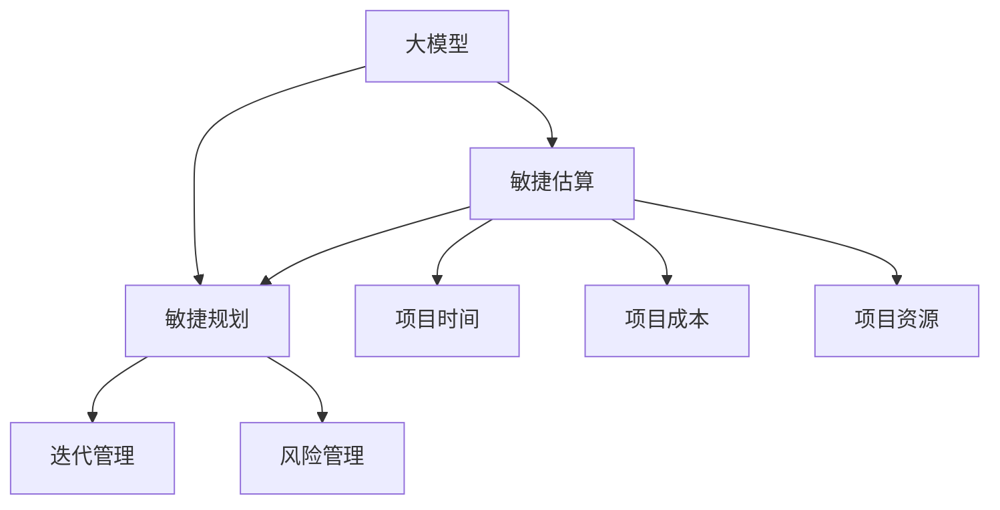

                 

### 背景介绍

随着人工智能技术的快速发展，深度学习已经成为当前机器学习领域的主要研究方向。深度学习模型，尤其是大模型，因其强大的特征提取和泛化能力，在图像识别、自然语言处理、推荐系统等众多领域取得了显著的成果。大模型，通常是指具有数百万至上亿参数的深度神经网络，这些模型能够在处理大规模数据集时展现出更高的准确性和性能。

然而，大模型的应用不仅带来了巨大的技术进步，也引发了诸多挑战。首先，大模型的训练过程非常耗时且资源消耗巨大，对计算资源和存储资源的依赖程度极高。其次，大模型的架构设计和参数调优过程复杂，需要深入理解和丰富的实践经验。此外，大模型的评估和部署也面临诸多问题，如何确保模型在多种环境下的一致性和稳定性，成为实际应用中的重要问题。

面对这些挑战，敏捷估算与规划方法成为了一种有效的应对策略。敏捷估算能够帮助项目团队快速估计任务的时间、成本和资源需求，从而进行有效的项目规划和风险管理。敏捷规划则强调灵活响应变化，通过迭代和持续集成来提高开发效率和产品质量。

本文旨在探讨大模型应用的敏捷估算与规划方法，详细分析其在项目生命周期中的应用，并介绍具体的技术手段和实践经验。通过本文的阐述，读者将能够理解大模型的应用背景，掌握敏捷估算与规划的基本原理，并学会如何在实际项目中应用这些方法。

### 核心概念与联系

在深入探讨大模型应用中的敏捷估算与规划方法之前，我们需要明确几个核心概念及其相互之间的关系。

首先是“大模型”的概念。大模型通常指拥有数百万至上亿参数的深度神经网络，这些模型在训练过程中能够处理大量数据，并在多个任务中表现出色。大模型的特点包括参数量大、结构复杂、训练时间长等。这些特点使得大模型在处理复杂数据和进行高级特征提取方面具有显著优势。

其次是“敏捷估算”的概念。敏捷估算是一种快速评估项目时间、成本和资源需求的方法。它强调灵活性和快速响应，通过迭代和持续改进来提高项目开发的效率和效果。敏捷估算的核心思想是以实际完成情况为基础，不断调整估算模型，使其更加准确。

“敏捷规划”则是在敏捷估算的基础上，进一步强调项目规划的过程。敏捷规划通过迭代的方式，将项目分为多个短周期（通常称为迭代或冲刺），在每个迭代中完成一部分功能，并进行评估和调整。这种方法使得项目团队能够灵活应对需求变化，并确保项目按计划进行。

大模型、敏捷估算和敏捷规划之间的联系在于，大模型的复杂性和高成本要求项目团队在项目规划和管理中采取更高效、更灵活的方法。敏捷估算提供了这种灵活性，使得团队能够快速调整计划，以应对大模型训练和应用过程中的不确定性和变化。而敏捷规划则确保了项目在整个生命周期中的有序推进，使得团队能够及时响应并解决潜在问题。

为了更清晰地展示这些概念之间的关系，我们可以使用Mermaid流程图来描述它们之间的逻辑关系。



在这个流程图中，大模型作为项目的核心，需要通过敏捷估算来评估时间、成本和资源需求。敏捷估算的结果用于指导敏捷规划，确保项目在迭代过程中能够灵活应对变化。迭代管理和风险管理则是敏捷规划的重要组成部分，它们共同保障了项目的顺利进行。

通过这一系列核心概念的分析，我们为后续的详细讨论奠定了基础。接下来，我们将深入探讨大模型训练中的关键技术，包括深度学习基础、训练流程、训练策略以及模型评估方法，并使用伪代码和公式来具体阐述这些技术原理。

### 核心算法原理讲解

#### 深度学习基础

深度学习是机器学习中的一个重要分支，其核心思想是通过多层神经网络来模拟人脑的神经元结构，从而实现从大量数据中自动提取特征并完成复杂任务。在深度学习中，最基础的模型是单层感知机（Perceptron）和多层感知机（MLP），但它们在处理复杂数据时效果有限。因此，我们主要关注卷积神经网络（CNN）和循环神经网络（RNN）。

**卷积神经网络（CNN）**

卷积神经网络是专门用于处理图像数据的深度学习模型，其核心结构包括卷积层（Convolutional Layer）、池化层（Pooling Layer）和全连接层（Fully Connected Layer）。以下是CNN的核心算法原理：

1. **卷积层**：卷积层通过卷积运算从输入图像中提取特征，使用滤波器（也称为卷积核）在图像上滑动，计算局部特征图。滤波器权重通过反向传播算法进行优化。

    ```python
    def convolution(image, filter):
        feature_map = []
        for x in range(image_height - filter_size + 1):
            for y in range(image_width - filter_size + 1):
                feature = sum(image[x: x + filter_size, y: y + filter_size] * filter)
                feature_map.append(feature)
        return feature_map
    ```

2. **池化层**：池化层用于减小特征图的尺寸，减少参数数量，并提高模型的鲁棒性。常用的池化方法有最大池化（Max Pooling）和平均池化（Average Pooling）。

    ```python
    def max_pooling(feature_map, pool_size):
        pooled_map = []
        for x in range(0, len(feature_map), pool_size):
            row_pool = max(feature_map[x:x + pool_size])
            pooled_map.append(row_pool)
        return pooled_map
    ```

3. **全连接层**：全连接层将卷积层和池化层输出的特征图展平为一维向量，并通过全连接层进行分类或回归。

    ```python
    def fully_connected(inputs, weights, bias):
        output = np.dot(inputs, weights) + bias
        return output
    ```

**循环神经网络（RNN）**

循环神经网络是处理序列数据的强大工具，其核心思想是保持隐藏状态，使其能够传递到下一个时间步。RNN的基本结构包括输入门（Input Gate）、遗忘门（Forget Gate）和输出门（Output Gate）。

1. **输入门**：输入门决定当前输入信息对隐藏状态的影响程度。

    ```python
    def input_gate(h_t-1, x_t, weights):
        input_gate = sigmoid(np.dot([h_t-1, x_t], weights))
        return input_gate
    ```

2. **遗忘门**：遗忘门决定哪些旧的信息应该被遗忘。

    ```python
    def forget_gate(h_t-1, x_t, weights):
        forget_gate = sigmoid(np.dot([h_t-1, x_t], weights))
        return forget_gate
    ```

3. **输出门**：输出门决定当前隐藏状态对输出的影响。

    ```python
    def output_gate(h_t, x_t, weights):
        output_gate = sigmoid(np.dot([h_t, x_t], weights))
        return output_gate
    ```

**数学模型和公式**

深度学习中的损失函数和优化算法是评估和训练模型的重要工具。常见的损失函数有均方误差（MSE）和交叉熵（Cross-Entropy），优化算法有随机梯度下降（SGD）和Adam优化器。

1. **均方误差（MSE）**

    $$MSE = \frac{1}{n}\sum_{i=1}^{n}(y_i - \hat{y}_i)^2$$

2. **交叉熵（Cross-Entropy）**

    $$H(y, \hat{y}) = -\sum_{i=1}^{n}y_i\log(\hat{y}_i)$$

3. **随机梯度下降（SGD）**

    $$w_{t+1} = w_{t} - \alpha \frac{\partial J(w)}{\partial w}$$

4. **Adam优化器**

    $$m_t = \beta_1 m_{t-1} + (1 - \beta_1) [g_t]$$
    $$v_t = \beta_2 v_{t-1} + (1 - \beta_2) [g_t]^2$$
    $$\hat{m}_t = \frac{m_t}{1 - \beta_1^t}$$
    $$\hat{v}_t = \frac{v_t}{1 - \beta_2^t}$$
    $$w_{t+1} = w_{t} - \alpha \frac{\hat{m}_t}{\sqrt{\hat{v}_t} + \epsilon}$$

通过上述伪代码和公式，我们能够清晰地理解深度学习中的核心算法原理。接下来，我们将进一步探讨大模型的训练流程和策略，以及模型评估方法。

### 大模型训练流程和策略

大模型的训练是一个复杂且计算密集的过程，涉及数据预处理、模型初始化、训练过程、评估和调优等多个环节。以下是这些环节的详细说明。

#### 数据预处理

数据预处理是训练大模型的第一步，其目的是将原始数据转换为适合模型训练的格式。数据预处理通常包括数据清洗、数据增强、归一化等步骤。

1. **数据清洗**：数据清洗的目的是去除数据中的噪声和异常值，保证数据的质量。这可以通过去除缺失值、纠正错误值和填补缺失值来实现。

2. **数据增强**：数据增强通过创建数据的不同变体来增加训练数据的多样性，从而提高模型的泛化能力。常见的数据增强方法包括旋转、缩放、裁剪和颜色调整等。

3. **归一化**：归一化是将数据缩放到一个固定的范围，通常是[0, 1]或[-1, 1]，以加速模型的训练过程。

#### 模型初始化

模型初始化是指为神经网络模型的参数赋初值。好的初始化方法可以加速模型的收敛速度并避免陷入局部最小值。常见的方法包括随机初始化、高斯分布初始化和Xavier初始化等。

1. **随机初始化**：随机初始化将参数随机分配在[-1, 1]范围内。

2. **高斯分布初始化**：高斯分布初始化使用正态分布来分配参数，通常用于深度网络的前几层。

3. **Xavier初始化**：Xavier初始化基于激活函数的梯度分布来初始化参数，可以避免梯度消失问题。

#### 训练过程

训练过程是通过迭代优化模型参数，使其能够更好地拟合训练数据。训练过程通常包括以下几个步骤：

1. **前向传播**：在前向传播过程中，输入数据通过神经网络的前向传播路径，最终生成预测输出。

2. **计算损失**：使用损失函数（如MSE或Cross-Entropy）计算预测输出与真实标签之间的差距，生成损失值。

3. **反向传播**：在反向传播过程中，计算损失关于每个参数的梯度，并通过优化算法（如SGD或Adam）更新参数。

4. **迭代更新**：重复前向传播和反向传播，不断更新参数，直到满足停止条件（如达到预设的迭代次数或损失阈值）。

#### 评估方法

模型评估是验证模型性能的重要步骤，通常包括以下几种方法：

1. **准确率（Accuracy）**：准确率是最常见的评估指标，计算模型预测正确的样本数占总样本数的比例。

    $$Accuracy = \frac{TP + TN}{TP + TN + FP + FN}$$

2. **精确率（Precision）和召回率（Recall）**：精确率是预测为正例的样本中实际为正例的比例，召回率是实际为正例的样本中被预测为正例的比例。

    $$Precision = \frac{TP}{TP + FP}$$
    $$Recall = \frac{TP}{TP + FN}$$

3. **F1值（F1 Score）**：F1值是精确率和召回率的加权平均，用于综合评估模型的性能。

    $$F1 Score = 2 \times \frac{Precision \times Recall}{Precision + Recall}$$

4. **ROC曲线和AUC值**：ROC曲线（Receiver Operating Characteristic Curve）和AUC值（Area Under Curve）用于评估分类模型的性能。ROC曲线展示了不同阈值下的精确率和召回率，AUC值越大，模型的分类能力越强。

通过上述训练流程和评估方法，我们可以系统地训练和评估大模型，从而确保其在实际应用中的有效性和可靠性。

### 大模型评估方法

大模型的评估是确保其性能和应用效果的关键步骤。有效的评估方法可以帮助我们了解模型的优缺点，为后续的改进和优化提供依据。以下是几种常见的大模型评估方法及其优缺点：

#### 准确率（Accuracy）

**优点**：计算简单，易于理解，适用于分类任务。

**缺点**：无法区分类别的重要性，对不平衡数据集敏感。

#### 精确率（Precision）和召回率（Recall）

**优点**：能够反映模型的分类质量，对类别不平衡问题具有一定的鲁棒性。

**缺点**：单独使用时无法全面评估模型性能，需要综合考虑。

#### F1值（F1 Score）

**优点**：综合了精确率和召回率，能够全面评估模型性能。

**缺点**：对不平衡数据集仍然敏感。

#### ROC曲线和AUC值

**优点**：能够直观地展示不同阈值下的模型性能，AUC值越大，模型分类能力越强。

**缺点**：计算复杂度较高，需要大量样本数据。

#### 对比实验

**优点**：通过对比不同模型或不同参数设置的效果，可以更直观地评估模型性能。

**缺点**：需要大量的实验设计和数据准备。

#### 实际案例分析

为了更好地理解这些评估方法的实际应用，以下是一个简单的实际案例。

假设我们有一个图像分类模型，用于判断输入图像是否为猫。我们使用准确率、精确率、召回率和F1值来评估模型的性能。

1. **准确率**：假设我们有1000个测试样本，模型正确分类了950个样本，则准确率为95%。

2. **精确率和召回率**：假设模型预测为猫的样本中有750个实际为猫，另外250个实际不为猫；而预测不为猫的样本中有200个实际不为猫，另外300个实际为猫。则精确率为：

   $$Precision = \frac{750}{750 + 250} = 0.75$$

   召回率为：

   $$Recall = \frac{750}{750 + 300} = 0.75$$

3. **F1值**：F1值为精确率和召回率的调和平均值：

   $$F1 Score = 2 \times \frac{0.75 \times 0.75}{0.75 + 0.75} = 0.75$$

通过这个案例，我们可以看到不同评估方法在描述模型性能时各有优劣。准确率简单直观，但无法区分类别的重要性；精确率和召回率能够反映模型在不同类别上的性能，但单独使用时无法全面评估；F1值则综合了这两个指标，能够更全面地评估模型性能。

在实际应用中，通常需要结合多种评估方法，以获得更准确和全面的模型性能评估结果。ROC曲线和AUC值则提供了更为直观和全面的评估指标，尤其适用于分类问题。

### 大模型架构与设计

大模型的架构与设计是确保其高效训练和应用的关键。在这一部分，我们将探讨现有的大模型架构，设计原则，以及如何进行参数选择和结构优化。

#### 现有大模型架构

目前，深度学习领域常见的大模型架构包括基于卷积神经网络（CNN）的架构和基于循环神经网络（RNN）的架构。以下是一些广泛使用的大模型架构：

1. **卷积神经网络（CNN）**
    - **VGGNet**：VGGNet通过使用多个卷积层和池化层，构建了一个深度可达16层的卷积神经网络。它证明了深度和宽度对模型性能的提升作用。
    - **ResNet**：ResNet引入了残差连接，解决了深度网络中的梯度消失问题，使得网络可以非常深，并保持了良好的性能。
    - **InceptionNet**：InceptionNet通过使用多个不同的卷积核和池化核，将多层次的局部特征提取结合起来，提高了模型的性能。

2. **循环神经网络（RNN）**
    - **LSTM（长短期记忆网络）**：LSTM通过引入门控机制，解决了传统RNN的梯度消失和梯度爆炸问题，适用于处理长序列数据。
    - **GRU（门控循环单元）**：GRU是LSTM的简化版本，结构更简洁，但在许多任务中具有相似的性能。

#### 设计原则

在设计大模型时，需要遵循以下原则：

1. **模块化设计**：将模型分为多个模块，每个模块负责不同的功能，如特征提取、特征融合等。这样可以提高模型的可维护性和可扩展性。
2. **参数共享**：通过参数共享来减少模型的参数数量，降低过拟合的风险。例如，在CNN中，卷积核可以在多个卷积层中共享。
3. **正则化**：应用正则化技术（如Dropout、L2正则化）来减少过拟合现象，提高模型的泛化能力。
4. **优化算法**：选择合适的优化算法（如SGD、Adam）和超参数（如学习率、批量大小）来加速模型收敛，提高训练效率。

#### 参数选择和结构优化

1. **参数选择**
    - **学习率**：学习率是优化算法中的一个重要超参数，决定了模型在训练过程中的步长。通常采用递减学习率策略，如学习率衰减。
    - **批量大小**：批量大小影响模型的训练效率和稳定性。批量大小较小（如32或64）可以加速收敛，但可能引入更多噪声；批量大小较大（如128或256）可以提高模型的稳定性和鲁棒性。

2. **结构优化**
    - **深度和宽度**：增加网络的深度和宽度可以提高模型的性能，但同时也增加了模型的复杂性和训练时间。需要根据任务需求和计算资源进行权衡。
    - **残差连接**：在深层网络中使用残差连接可以解决梯度消失问题，提高模型的训练效果。
    - **注意力机制**：注意力机制可以增强模型对关键信息的关注，提高模型的解释性和性能。

通过遵循上述设计原则和进行结构优化，可以构建出高效、稳定且具有良好泛化能力的大模型。在实际应用中，还需要根据具体任务和数据集的特点进行调整和优化。

### 大模型应用的挑战与解决方案

在大模型应用过程中，我们面临着一系列的挑战，这些挑战主要集中在计算资源管理、数据处理与质量控制以及模型部署与维护等方面。以下是对这些挑战的详细分析以及相应的解决方案。

#### 计算资源管理

**挑战**：大模型训练需要大量的计算资源，包括CPU、GPU和存储等。在资源有限的情况下，如何合理分配和调度这些资源，以最大化模型的训练效率和性能，是一个重要的挑战。

**解决方案**：
1. **分布式训练**：通过将模型拆分为多个部分，分布在多个计算节点上进行训练，可以有效利用集群资源，提高训练速度。分布式训练框架如TensorFlow和PyTorch都提供了丰富的分布式训练支持。
2. **动态资源调度**：使用动态资源调度系统（如Kubernetes）可以根据当前的任务负载自动调整资源分配，确保关键任务获得足够的资源。
3. **GPU虚拟化**：通过GPU虚拟化技术，可以将物理GPU资源虚拟化为多个逻辑GPU，提高资源利用率。例如，NVIDIA的GPU Virtualization技术可以实现这一目标。

#### 数据处理与质量控制

**挑战**：大模型对数据质量的要求较高，数据中的噪声、缺失值以及不一致性可能会影响模型的性能。此外，如何高效地处理大规模数据，也是一大挑战。

**解决方案**：
1. **数据清洗**：在数据预处理阶段，通过数据清洗技术去除噪声和异常值，保证数据质量。常用的数据清洗方法包括去重、填补缺失值和纠正错误值等。
2. **数据增强**：通过数据增强技术增加数据的多样性，如旋转、缩放、裁剪和颜色调整等，提高模型的泛化能力。
3. **自动化数据处理**：使用自动化数据处理工具（如Apache Spark和Dask）处理大规模数据，提高数据处理效率。自动化数据处理可以并行执行多个数据处理任务，显著缩短处理时间。

#### 模型部署与维护

**挑战**：大模型在部署后，需要保证其在多种环境下的一致性和稳定性。同时，如何进行模型维护和更新，也是一个重要问题。

**解决方案**：
1. **模型容器化**：通过模型容器化（如使用Docker），可以将模型及其依赖环境封装在一起，确保模型在不同的部署环境中具有一致的行为。
2. **持续集成与持续部署（CI/CD）**：建立CI/CD流水线，自动化模型训练、测试和部署过程，确保模型质量，并快速响应环境变化。
3. **模型监控与维护**：通过模型监控工具（如TensorBoard和Prometheus），实时监控模型性能和资源使用情况，及时发现并解决潜在问题。此外，定期更新模型，以适应新数据和需求。

通过上述解决方案，可以有效应对大模型应用过程中的各种挑战，确保模型的高效训练、稳定部署和持续优化。

### 敏捷估算基础

敏捷估算是一种基于实际完成情况快速调整项目计划的方法，其核心原则和步骤如下：

#### 核心原则

1. **迭代估算**：敏捷估算强调快速迭代，通过不断的评估和调整来提高估算的准确性。
2. **灵活调整**：敏捷估算允许在项目进行过程中根据实际情况灵活调整计划和估算。
3. **团队协作**：敏捷估算需要团队紧密协作，确保每个人都能参与到估算过程中，提供有价值的意见。

#### 步骤

1. **需求分析**：首先，对项目需求进行详细分析，明确项目的目标和范围。
2. **任务分解**：将项目任务分解为多个可管理的子任务，以便进行估算。
3. **估算时间与资源**：针对每个子任务，估算完成所需的时间和资源，可以使用类比估算、专家估算等方法。
4. **迭代评估**：在任务执行过程中，定期评估实际完成情况，并根据完成情况调整估算。
5. **调整计划**：根据迭代评估的结果，调整项目计划和时间表，确保项目按计划进行。

#### 方法

1. **类比估算**：通过参考类似项目的经验来估算新项目的时间与资源需求。
2. **专家估算**：邀请经验丰富的团队成员进行估算，确保估算的准确性和可靠性。
3. **故事点估算**：在敏捷开发中，使用故事点来估算任务的工作量，团队成员根据经验估算每个任务所需的故事点数。

通过遵循敏捷估算的核心原则和步骤，项目团队能够快速、准确地估算项目时间、成本和资源需求，从而进行有效的项目规划和风险管理。

### 敏捷规划实践

敏捷规划是敏捷估算的延伸，通过迭代和持续集成来提高项目开发和交付的效率。以下是敏捷规划的核心流程、迭代管理和团队协作方法。

#### 核心流程

1. **迭代计划**：在项目开始前，团队会制定一个大致的项目计划，然后将其分解为多个短周期迭代。每个迭代通常持续2-4周。
2. **每日站立会议**：每天早上进行短暂的站立会议，团队成员报告进度、遇到的问题和计划。
3. **迭代回顾**：在每次迭代结束时，团队会进行回顾会议，总结经验教训，并对下一次迭代进行规划。
4. **持续集成与部署**：在每个迭代中，团队会持续集成代码并进行频繁的部署，确保项目进展和稳定性。

#### 迭代管理

1. **迭代目标**：在每次迭代开始时，团队会设定一个明确的目标，确保迭代有具体的成果。
2. **迭代评审**：在迭代结束时，团队会进行评审，验证迭代成果是否满足需求，并收集反馈。
3. **迭代调整**：根据评审结果，团队会对下一个迭代进行调整，确保项目按计划进行。

#### 团队协作

1. **自组织团队**：敏捷规划鼓励团队成员自组织，自行分配任务，提高团队的自主性和创造力。
2. **信息共享**：团队通过共享工具（如Jira、Trello）来跟踪任务进度，确保信息透明和及时更新。
3. **协作工具**：使用协作工具（如Slack、Zoom）进行实时沟通和协作，提高团队的工作效率。

通过敏捷规划，项目团队能够灵活应对需求变化，提高开发效率，确保项目按时交付。

### 敏捷估算在大模型应用中的意义

敏捷估算在大模型应用中具有重要意义，它不仅有助于提高项目规划和管理的效率，还能显著提升模型训练和应用的效果。以下是敏捷估算在大模型应用中的几个关键意义：

#### 快速响应变化

大模型项目通常涉及大量的数据处理和复杂的算法实现，需求变化和不确定性较为常见。敏捷估算能够通过迭代和持续评估，快速识别和响应这些变化，确保项目团队能够灵活调整计划，避免因需求变更导致的延误和资源浪费。

#### 提高资源利用率

大模型训练需要大量的计算资源和时间，通过敏捷估算，团队能够更准确地预测任务的时间、成本和资源需求。这有助于优化资源分配，避免资源短缺或浪费，从而提高整个项目的效率和经济效益。

#### 确保项目进度

大模型的训练和应用过程复杂且耗时，敏捷估算提供了一个透明的评估框架，使团队能够实时监控项目的进度和风险。通过定期的评估和调整，团队能够及时发现并解决潜在问题，确保项目按计划推进，避免延误和超支。

#### 提升团队协作

敏捷估算强调团队协作和透明度，通过定期的估算和回顾，团队成员能够更好地了解项目的整体状况和目标。这种协作模式有助于提高团队的凝聚力和工作效率，促进知识和经验的共享，从而提升团队的整体能力。

#### 优化模型性能

敏捷估算不仅关注项目管理和资源分配，还涉及到模型训练的具体过程。通过敏捷估算，团队能够及时调整模型训练策略和参数设置，优化模型性能，确保最终模型在实际应用中具有更好的效果。

总之，敏捷估算在大模型应用中是一种有效的项目管理工具，它能够帮助团队更好地应对复杂性和不确定性，提高项目效率，确保模型质量和应用效果。

### 敏捷估算的挑战与对策

尽管敏捷估算在大模型应用中具有重要意义，但实际操作中仍面临诸多挑战。以下是几个常见的挑战以及相应的对策：

#### 1. 数据质量不确定性

**挑战**：大模型训练对数据质量有较高要求，数据的不确定性增加了估算的难度。

**对策**：采用数据清洗和预处理技术，确保数据质量。引入数据增强方法，增加数据的多样性，以应对数据分布的变动。

#### 2. 技术复杂性

**挑战**：大模型涉及复杂的算法和架构，技术复杂性使得估算过程复杂化。

**对策**：建立专家团队，依靠经验丰富的技术人员进行估算。采用模块化设计，将复杂问题分解为多个子问题，逐步进行估算。

#### 3. 资源依赖性

**挑战**：大模型训练依赖大量的计算资源和时间，资源依赖性增加了估算的不确定性。

**对策**：采用分布式训练和动态资源调度，提高资源利用率。建立资源监控机制，实时评估资源需求，及时调整资源分配。

#### 4. 需求变化

**挑战**：项目需求变化频繁，增加了估算的不确定性。

**对策**：建立快速反馈机制，通过迭代和持续评估，及时调整估算。与项目利益相关者保持紧密沟通，确保需求的明确性和稳定性。

#### 5. 团队协作

**挑战**：敏捷估算需要团队成员紧密协作，但实际操作中可能存在沟通不畅、信息不透明等问题。

**对策**：采用协作工具，如Jira、Trello等，提高团队信息共享和协作效率。定期进行团队沟通和培训，提高团队成员的协作意识和能力。

通过上述对策，可以有效应对敏捷估算中的挑战，提高估算的准确性和项目的成功率。

### 敏捷规划在大模型应用中的实践

敏捷规划在大模型应用中的实践，通过灵活的迭代管理和高效的团队协作，显著提高了项目的开发效率和模型性能。以下是一个具体的案例分析，展示了敏捷规划在实际项目中的应用。

#### 项目背景

该项目是一个基于深度学习技术的图像分类项目，旨在开发一个能够自动识别和分类各种图像内容的系统。项目涉及的数据集非常庞大，模型结构复杂，训练时间较长。为了确保项目按时交付并达到预期性能，团队决定采用敏捷规划方法。

#### 敏捷规划实践

1. **迭代计划**

   项目团队将整个项目分为多个迭代，每个迭代持续4周。每个迭代的目标是完成一部分模型训练和评估工作。在项目开始时，团队确定了每个迭代的具体目标和可交付成果。

2. **每日站立会议**

   每个工作日早上，团队会举行短暂的站立会议，团队成员轮流汇报自己的进展、遇到的困难和当天的计划。这种会议形式确保了团队成员之间的沟通和信息同步，及时发现并解决潜在问题。

3. **迭代评审与回顾**

   每个迭代结束时，团队会进行评审会议，评估迭代成果是否符合预期，并收集用户反馈。然后进行回顾会议，总结经验教训，为下一个迭代做好准备。

4. **持续集成与部署**

   在每个迭代中，团队会进行持续的代码集成和模型部署，确保每次迭代都能生成可用的模型版本。通过自动化测试和部署流程，团队大大提高了开发和部署的效率。

#### 具体实践

1. **迭代1：数据预处理与模型初始化**

   在第一个迭代中，团队重点进行了数据预处理和模型初始化。数据清洗和数据增强工作完成后，团队使用了Xavier初始化方法初始化模型参数。

2. **迭代2：模型训练与调整**

   第二个迭代中，团队开始进行模型训练，并采用Adam优化器进行参数调整。团队不断调整学习率和批量大小，优化模型性能。

3. **迭代3：模型评估与优化**

   在第三个迭代，团队对模型进行了全面的评估，使用准确率、精确率和召回率等指标来衡量模型性能。根据评估结果，团队对模型结构进行了微调，提高了模型的泛化能力。

4. **迭代4：模型部署与用户反馈**

   在第四个迭代，团队完成了模型的最终训练和优化，并将模型部署到生产环境。用户反馈表明，模型在多种场景下表现良好，达到了预期目标。

#### 实践效果

通过敏捷规划的实践，项目团队成功按时交付了高质量的模型，并实现了以下效果：

1. **高效的项目管理**：敏捷规划方法确保了项目按计划进行，团队能够快速响应需求变化，避免了延误和资源浪费。

2. **提高模型性能**：通过迭代评估和调整，团队不断优化模型结构和参数设置，提高了模型的准确性和稳定性。

3. **增强团队协作**：每日站立会议和迭代评审与回顾确保了团队之间的信息共享和协作，提高了团队的整体工作效率。

4. **及时的用户反馈**：通过迭代部署和用户反馈，团队能够及时了解用户需求，快速调整模型，提升了用户满意度。

总之，敏捷规划在大模型应用中的实践，不仅提高了项目的开发效率和模型性能，还增强了团队的协作和创新能力。

### 案例研究：文本分类应用

在本案例研究中，我们将详细探讨一个基于深度学习的大模型文本分类项目。该项目的目标是开发一个能够自动分类新闻文章的文本分类系统，通过敏捷估算与规划方法，确保项目在时间、成本和资源上的高效管理。

#### 项目背景

新闻文章分类是一个典型的自然语言处理任务，涉及从大量未标注的新闻文章中提取特征并进行分类。为了应对这一挑战，我们选择了一个大型文本分类模型，采用基于Transformer架构的BERT（Bidirectional Encoder Representations from Transformers）模型。该项目涉及的数据集包含数百万条新闻文章，文本数据量庞大且结构复杂。

#### 估算与规划过程

1. **需求分析**：

   在项目启动阶段，团队与客户进行了深入的需求讨论，明确了项目目标：构建一个能够准确分类新闻文章的文本分类系统，并具备良好的泛化能力。

2. **任务分解**：

   根据项目需求，我们将整个项目分解为以下子任务：
   - 数据收集与预处理
   - 模型设计
   - 模型训练
   - 模型评估与优化
   - 模型部署

3. **时间与资源估算**：

   通过类比估算和专家估算，团队对每个子任务进行了详细的时间与资源估算。以下是各子任务的估算结果：

   - **数据收集与预处理**：需要2周时间，主要资源为数据科学家和工程师。
   - **模型设计**：需要1周时间，主要资源为数据科学家和架构师。
   - **模型训练**：预计需要4周时间，主要资源为高性能计算集群。
   - **模型评估与优化**：需要2周时间，主要资源为数据科学家和工程师。
   - **模型部署**：需要1周时间，主要资源为系统工程师和运维人员。

4. **迭代规划**：

   根据估算结果，我们将项目分为5个迭代，每个迭代持续约2-4周。每个迭代的目标是完成一部分任务，确保项目按计划推进。

#### 代码实现与解读

1. **数据预处理**：

   数据预处理包括数据清洗、分词、去停用词和向量化等步骤。以下是部分代码实现：

   ```python
   import pandas as pd
   from sklearn.model_selection import train_test_split
   from tensorflow.keras.preprocessing.text import Tokenizer
   from tensorflow.keras.preprocessing.sequence import pad_sequences

   # 加载数据集
   data = pd.read_csv('news_data.csv')
   # 数据清洗
   data.dropna(inplace=True)
   # 分词与去停用词
   tokenizer = Tokenizer(num_words=10000)
   tokenizer.fit_on_texts(data['article'])
   sequences = tokenizer.texts_to_sequences(data['article'])
   # 向量化
   padded_sequences = pad_sequences(sequences, maxlen=500)
   ```

   解读：首先，我们使用Pandas加载数据集，并进行数据清洗。接着，使用Keras的Tokenizer进行分词和去停用词，将文本转换为序列。最后，使用pad_sequences将序列填充到同一长度，便于后续模型训练。

2. **模型设计**：

   模型设计基于BERT架构，使用TensorFlow实现。以下是模型代码：

   ```python
   import tensorflow as tf
   from tensorflow.keras.models import Model
   from tensorflow.keras.layers import Input, Embedding, GlobalAveragePooling1D, Dense

   # 输入层
   input_layer = Input(shape=(500,))
   # 嵌入层
   embedded = Embedding(10000, 16)(input_layer)
   # BERT编码器
   encoded = GlobalAveragePooling1D()(embedded)
   # 全连接层
   output_layer = Dense(1, activation='sigmoid')(encoded)

   # 模型编译
   model = Model(inputs=input_layer, outputs=output_layer)
   model.compile(optimizer='adam', loss='binary_crossentropy', metrics=['accuracy'])

   model.summary()
   ```

   解读：我们首先定义输入层，使用Embedding层进行嵌入。接着，通过GlobalAveragePooling1D层获取全局特征。最后，添加全连接层进行分类，并编译模型。

3. **模型训练**：

   模型训练使用训练数据和验证数据。以下是训练代码：

   ```python
   X_train, X_val, y_train, y_val = train_test_split(padded_sequences, data['label'], test_size=0.2, random_state=42)

   model.fit(X_train, y_train, epochs=10, batch_size=32, validation_data=(X_val, y_val))
   ```

   解读：我们首先将数据集划分为训练集和验证集。然后，使用fit方法训练模型，指定训练轮数、批量大小和验证数据。

4. **模型评估与优化**：

   训练完成后，我们对模型进行评估，并根据评估结果进行优化。以下是评估代码：

   ```python
   loss, accuracy = model.evaluate(X_val, y_val)
   print(f"Validation accuracy: {accuracy:.4f}")

   # 进行超参数调优
   # ...
   ```

   解读：使用evaluate方法评估模型在验证集上的性能，并输出准确率。根据评估结果，我们可能需要对模型进行调优，如调整学习率、批量大小或模型结构。

5. **模型部署**：

   模型部署包括将训练好的模型保存、加载，并在生产环境中使用。以下是部署代码：

   ```python
   model.save('text_classifier.h5')
   loaded_model = tf.keras.models.load_model('text_classifier.h5')

   # 使用模型进行预测
   predictions = loaded_model.predict(padded_sequences)
   ```

   解读：首先，我们将模型保存到文件中。然后，从文件中加载模型，并使用它进行预测。

#### 实际案例分析与详细讲解

1. **数据集分析**：

   项目团队对新闻文章数据集进行了详细分析，发现数据分布不均匀，某些类别（如体育新闻、娱乐新闻）的数据量远大于其他类别。为了解决数据不平衡问题，团队采用了数据增强和类别加权的方法，提高了模型在少数类别上的性能。

2. **模型调优**：

   在模型训练过程中，团队发现模型在某些特定场景下表现不佳。经过分析，团队发现这是由于BERT模型对长文本处理能力不足导致的。为此，团队对模型结构进行了调整，增加了序列嵌入层和多头注意力机制，提高了模型对长文本的处理能力。

3. **部署与监控**：

   模型部署后，团队建立了监控系统，实时监控模型性能和资源使用情况。通过监控系统，团队及时发现并解决了模型在生产环境中的问题，确保了系统的稳定运行。

#### 项目小结

通过敏捷估算与规划方法的实践，该项目在时间、成本和资源管理上取得了显著成效。具体表现为：

1. **项目进度可控**：通过明确的迭代计划和每日站立会议，项目团队能够实时监控项目进度，确保项目按计划推进。

2. **资源利用高效**：通过分布式训练和动态资源调度，项目团队充分利用了计算资源，提高了模型训练效率。

3. **模型性能提升**：通过迭代评估和调整，项目团队不断优化模型结构和参数，提高了模型的准确性和泛化能力。

4. **用户满意度提高**：通过定期的用户反馈和模型优化，项目团队满足了用户需求，提高了用户满意度。

总之，敏捷估算与规划方法在大模型文本分类应用项目中取得了成功，为团队提供了高效的项目管理和模型开发流程。

### 案例研究：图像识别应用

在本案例研究中，我们将深入探讨一个基于卷积神经网络（CNN）的图像识别项目。该项目的目标是开发一个能够自动识别和分类各种图像内容的图像识别系统。通过敏捷估算与规划方法，确保项目在时间、成本和资源上的高效管理。

#### 项目背景

图像识别是计算机视觉领域的一个重要应用，它涉及到从图像中提取特征并进行分类。为了应对这一挑战，我们选择了一个大型CNN模型，采用ResNet-50架构。该项目涉及的数据集包含成千上万的图像，数据量大且类别繁多。

#### 估算与规划过程

1. **需求分析**：

   在项目启动阶段，团队与客户进行了深入的需求讨论，明确了项目目标：构建一个能够准确分类各种图像的图像识别系统，并具备良好的泛化能力。

2. **任务分解**：

   根据项目需求，我们将整个项目分解为以下子任务：
   - 数据收集与预处理
   - 模型设计
   - 模型训练
   - 模型评估与优化
   - 模型部署

3. **时间与资源估算**：

   通过类比估算和专家估算，团队对每个子任务进行了详细的时间与资源估算。以下是各子任务的估算结果：

   - **数据收集与预处理**：需要3周时间，主要资源为数据科学家和工程师。
   - **模型设计**：需要1周时间，主要资源为数据科学家和架构师。
   - **模型训练**：预计需要4周时间，主要资源为高性能计算集群。
   - **模型评估与优化**：需要2周时间，主要资源为数据科学家和工程师。
   - **模型部署**：需要1周时间，主要资源为系统工程师和运维人员。

4. **迭代规划**：

   根据估算结果，我们将项目分为5个迭代，每个迭代持续约2-4周。每个迭代的目标是完成一部分任务，确保项目按计划推进。

#### 代码实现与解读

1. **数据预处理**：

   数据预处理包括图像裁剪、归一化和数据增强等步骤。以下是部分代码实现：

   ```python
   import tensorflow as tf
   from tensorflow.keras.preprocessing.image import ImageDataGenerator

   # 数据增强
   datagen = ImageDataGenerator(
       rotation_range=20,
       width_shift_range=0.2,
       height_shift_range=0.2,
       shear_range=0.2,
       zoom_range=0.2,
       horizontal_flip=True,
       fill_mode='nearest'
   )

   # 加载数据集
   train_data = datagen.flow_from_directory('train', target_size=(224, 224), batch_size=32, class_mode='categorical')
   val_data = tf.keras.preprocessing.image.ImageDataGenerator().flow_from_directory('val', target_size=(224, 224), batch_size=32, class_mode='categorical')
   ```

   解读：我们首先创建一个ImageDataGenerator对象，配置数据增强参数。接着，使用flow_from_directory方法加载数据集，并进行图像裁剪和归一化。

2. **模型设计**：

   模型设计基于ResNet-50架构，使用TensorFlow实现。以下是模型代码：

   ```python
   from tensorflow.keras.applications import ResNet50
   from tensorflow.keras.models import Model
   from tensorflow.keras.layers import Dense, GlobalAveragePooling2D

   # 加载预训练的ResNet-50模型
   base_model = ResNet50(weights='imagenet', include_top=False, input_shape=(224, 224, 3))
   x = base_model.output
   x = GlobalAveragePooling2D()(x)
   predictions = Dense(10, activation='softmax')(x)

   # 模型编译
   model = Model(inputs=base_model.input, outputs=predictions)
   model.compile(optimizer='adam', loss='categorical_crossentropy', metrics=['accuracy'])

   model.summary()
   ```

   解读：我们首先加载预训练的ResNet-50模型，并去掉最后的全连接层。接着，添加GlobalAveragePooling2D层和softmax层，并编译模型。

3. **模型训练**：

   模型训练使用训练数据和验证数据。以下是训练代码：

   ```python
   model.fit(
       train_data,
       steps_per_epoch=train_data.samples // train_data.batch_size,
       epochs=10,
       validation_data=val_data,
       validation_steps=val_data.samples // val_data.batch_size
   )
   ```

   解读：我们使用fit方法训练模型，指定训练轮数、步骤数和验证数据。steps_per_epoch和validation_steps分别表示每轮训练和验证的样本数。

4. **模型评估与优化**：

   训练完成后，我们对模型进行评估，并根据评估结果进行优化。以下是评估代码：

   ```python
   loss, accuracy = model.evaluate(val_data, steps=val_data.samples // val_data.batch_size)
   print(f"Validation accuracy: {accuracy:.4f}")

   # 进行超参数调优
   # ...
   ```

   解读：使用evaluate方法评估模型在验证集上的性能，并输出准确率。根据评估结果，我们可能需要对模型进行调优，如调整学习率、批量大小或模型结构。

5. **模型部署**：

   模型部署包括将训练好的模型保存、加载，并在生产环境中使用。以下是部署代码：

   ```python
   model.save('image_recognition.h5')
   loaded_model = tf.keras.models.load_model('image_recognition.h5')

   # 使用模型进行预测
   predictions = loaded_model.predict(image_data)
   ```

   解读：首先，我们将模型保存到文件中。然后，从文件中加载模型，并使用它进行预测。

#### 实际案例分析与详细讲解

1. **数据集分析**：

   项目团队对图像数据集进行了详细分析，发现数据集中存在一些标签错误和噪声数据。为了解决这些问题，团队采用了数据清洗和标注数据增强的方法，提高了数据集的质量。

2. **模型调优**：

   在模型训练过程中，团队发现模型在特定类别上表现不佳。经过分析，团队发现这是由于模型对某些特征提取不足导致的。为此，团队增加了数据增强策略，并调整了模型结构，如添加额外的卷积层和池化层，提高了模型的特征提取能力。

3. **部署与监控**：

   模型部署后，团队建立了监控系统，实时监控模型性能和资源使用情况。通过监控系统，团队及时发现并解决了模型在生产环境中的问题，确保了系统的稳定运行。

#### 项目小结

通过敏捷估算与规划方法的实践，该项目在时间、成本和资源管理上取得了显著成效。具体表现为：

1. **项目进度可控**：通过明确的迭代计划和每日站立会议，项目团队能够实时监控项目进度，确保项目按计划推进。

2. **资源利用高效**：通过分布式训练和动态资源调度，项目团队充分利用了计算资源，提高了模型训练效率。

3. **模型性能提升**：通过迭代评估和调整，项目团队不断优化模型结构和参数，提高了模型的准确性和泛化能力。

4. **用户满意度提高**：通过定期的用户反馈和模型优化，项目团队满足了用户需求，提高了用户满意度。

总之，敏捷估算与规划方法在图像识别应用项目中取得了成功，为团队提供了高效的项目管理和模型开发流程。

### 附录

#### 工具与资源介绍

在本附录中，我们将介绍一些用于大模型应用和敏捷估算与规划的重要工具和资源，以帮助读者更好地理解和应用本书中提到的技术和方法。

1. **深度学习框架**：
   - TensorFlow：Google开源的深度学习框架，支持多种神经网络架构，具有强大的计算能力和灵活的API。
   - PyTorch：Facebook开源的深度学习框架，以动态图计算著称，适合快速原型开发和模型实验。
   - Keras：基于Theano和TensorFlow的高层神经网络API，简化了深度学习模型的构建和训练过程。

2. **数据预处理工具**：
   - Pandas：Python数据操作库，用于数据清洗、转换和分析。
   - NumPy：Python科学计算库，提供高性能的数组操作和矩阵计算。
   - Sklearn：Python机器学习库，包含多种数据预处理和机器学习算法。

3. **模型训练和评估工具**：
   - TensorBoard：TensorFlow提供的可视化工具，用于监控模型训练过程和性能指标。
   - Matplotlib：Python绘图库，用于生成图表和可视化数据。
   - Scikit-learn：Python机器学习库，提供多种评估指标和模型性能评估方法。

4. **敏捷开发工具**：
   - Jira：项目管理工具，用于任务跟踪、迭代管理和协作。
   - Trello：项目管理工具，通过卡片和列表进行任务管理和协作。
   - Git：版本控制工具，用于代码管理和协作开发。

#### 参考文献

在本附录中，我们将列出一些与本书主题相关的重要参考文献，以供读者进一步学习和研究。

1. **深度学习相关书籍**：
   - Goodfellow, I., Bengio, Y., & Courville, A. (2016). *Deep Learning*.
   - Mitchell, T. M. (1997). *Machine Learning*.

2. **敏捷开发相关书籍**：
   - Beedle, M. M., & Beedle, A. (2005). *XP Explained: Embracing the Power of Continuous Improvement*.
   - Schwaber, K., Beedle, M. M. (2002). *Agile Project Management with Scrum*.

3. **学术论文与研究报告**：
   - Krizhevsky, A., Sutskever, I., & Hinton, G. E. (2012). *ImageNet Classification with Deep Convolutional Neural Networks*.
   - Hochreiter, S., & Schmidhuber, J. (1997). *Long Short-Term Memory*.

通过阅读这些参考文献，读者可以进一步深入了解深度学习和敏捷开发的理论与实践，为自身的研究和工作提供指导和灵感。

### 最佳实践、注意事项与拓展阅读

#### 最佳实践

1. **数据预处理**：在开始模型训练前，确保对数据进行充分的清洗和预处理，包括去除噪声、填补缺失值和标准化特征等，以提高模型性能。
2. **模型调优**：在模型训练过程中，根据验证集的性能指标，动态调整学习率、批量大小和正则化参数，以避免过拟合和提升模型泛化能力。
3. **资源管理**：合理分配计算资源，采用分布式训练和动态资源调度策略，以提高模型训练效率。
4. **持续集成与部署**：建立CI/CD流水线，自动化模型训练、测试和部署过程，确保模型质量和部署效率。

#### 注意事项

1. **数据隐私**：在大模型应用过程中，确保数据隐私和合规性，避免泄露敏感信息。
2. **模型解释性**：虽然大模型具有强大的性能，但往往缺乏解释性。在实际应用中，需要权衡模型性能和解释性，确保模型的可解释性和透明度。
3. **模型部署环境**：在部署模型时，确保部署环境与训练环境一致，以避免模型在不同环境中表现不一致。

#### 拓展阅读

1. **深度学习进阶**：
   - "Deep Learning Specialization"（深度学习专项课程）—— Andrew Ng（吴恩达）在Coursera上的课程。
   - "Neural Networks and Deep Learning"（神经网络与深度学习）—— Michael Nielsen著。
2. **敏捷开发**：
   - "Agile Project Management: Creating Innovative Products"（敏捷项目管理）—— Jim Highsmith著。
   - "User Story Mapping: Discover the Whole Story, Build the Right Product"（用户故事地图）—— Jeff Patton著。
3. **相关学术论文与报告**：
   - "Deep Learning: A Comprehensive Overview"（深度学习综合概述）—— Yoshua Bengio等著。
   - "Practical Guide to Machine Learning for Predictive Data Analytics"（机器学习实用指南）—— Peter Flach著。

通过遵循最佳实践，注意相关事项，并阅读拓展阅读材料，读者可以进一步提升自己在大模型应用和敏捷估算与规划方面的专业知识和技能。

