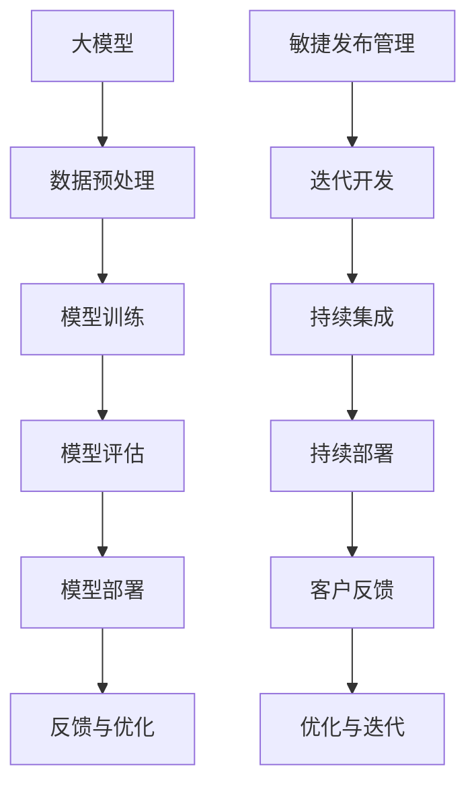
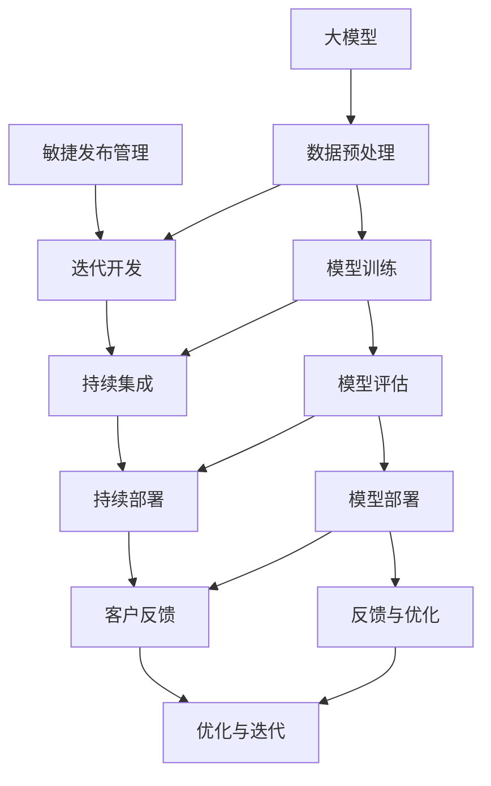

                 


### 文章标题
# 大模型应用的敏捷发布管理

### 文章关键词
大模型，敏捷发布，管理，技术博客，人工智能，深度学习

### 文章摘要
本文将探讨大模型在敏捷发布管理中的应用，从背景介绍、核心概念与联系、算法原理讲解、数学模型与公式、项目实战等多个方面，深入剖析大模型敏捷发布管理的实施方法和策略。通过本文的阅读，读者可以全面了解大模型敏捷发布管理的概念、方法、实践和未来发展趋势。

## 目录

1. **背景介绍**
   - 大模型的发展背景与现状
   - 敏捷发布管理的概念与优势

2. **核心概念与联系**
   - 大模型的核心概念
   - 敏捷发布管理的核心概念
   - Mermaid流程图展示大模型与敏捷发布管理的联系

3. **算法原理讲解**
   - 深度学习算法原理
   - 敏捷发布管理算法原理
   - 伪代码阐述算法原理

4. **数学模型与公式**
   - 大模型评估指标与优化策略
   - 敏捷发布管理关键数学模型
   - LaTeX格式详细讲解数学公式

5. **项目实战**
   - 开发环境搭建
   - 源代码实现与解读
   - 代码应用分析与实战案例

6. **最佳实践与总结**
   - 大模型敏捷发布管理最佳实践
   - 项目小结与注意事项
   - 拓展阅读

7. **未来展望**
   - 大模型敏捷发布管理的发展趋势
   - 面临的挑战与应对策略

## 背景介绍

### 大模型的发展背景与现状

大模型，是指那些具有数十亿至数千亿参数的深度学习模型，它们在自然语言处理、计算机视觉、语音识别等领域取得了显著的成果。近年来，随着计算能力的提升和大数据的积累，大模型的研究和应用取得了飞速发展。例如，GPT-3（OpenAI）拥有1750亿参数，BERT拥有3.4亿参数，这些大模型在各个领域都展现出了强大的能力。

### 敏捷发布管理的概念与优势

敏捷发布管理是一种以迭代、快速反馈和持续交付为核心的软件开发方法。它强调团队协作、客户参与和持续改进，通过将需求分解为小的、可管理的迭代，实现产品的快速迭代和持续交付。敏捷发布管理的优势包括：更快的上市时间、更高的客户满意度、更好的团队协作和更低的开发风险。

## 核心概念与联系

### 大模型的核心概念

大模型的核心概念包括：

- **深度学习**：一种基于人工神经网络的学习方法，通过多层非线性变换来提取数据特征。
- **神经网络架构**：包括卷积神经网络（CNN）、循环神经网络（RNN）、 Transformer等，用于处理不同类型的数据。
- **训练与优化**：通过大量数据和计算资源，对模型进行训练和优化，以提高模型的性能和泛化能力。

### 敏捷发布管理的核心概念

敏捷发布管理的核心概念包括：

- **迭代开发**：将开发过程划分为多个迭代，每个迭代完成部分功能。
- **持续集成与持续部署**：通过自动化测试和部署流程，实现代码的持续集成和部署。
- **客户参与**：在开发过程中，与客户保持紧密沟通，确保产品满足客户需求。

### Mermaid流程图展示大模型与敏捷发布管理的联系



## 算法原理讲解

### 深度学习算法原理

深度学习算法的核心是多层神经网络，通过逐层提取数据特征，实现数据的分类、回归等任务。以下是深度学习算法的伪代码：

```python
# 深度学习算法伪代码
def deep_learning(data, labels):
    # 数据预处理
    processed_data = preprocess_data(data)
    
    # 初始化模型参数
    model_params = initialize_params()
    
    # 模型训练
    for epoch in range(num_epochs):
        for batch in data_loader(processed_data, labels):
            # 计算损失
            loss = compute_loss(batch, model_params)
            
            # 更新模型参数
            model_params = update_params(loss, model_params)
            
    # 模型评估
    accuracy = evaluate_model(model_params, test_data, test_labels)
    
    return accuracy
```

### 敏捷发布管理算法原理

敏捷发布管理的核心是迭代开发和持续交付。以下是敏捷发布管理算法的伪代码：

```python
# 敏捷发布管理算法伪代码
def agile_management(features, requirements):
    # 迭代开发
    for iteration in range(num_iterations):
        # 完成需求分析
        requirements = analyze_requirements(features, requirements)
        
        # 开发功能模块
        modules = develop_modules(requirements)
        
        # 持续集成与部署
        integrate_and_deploy(modules)
        
        # 客户反馈
        feedback = collect_feedback()
        
        # 优化与迭代
        features = optimize_features(features, feedback)
        
    return features
```

## 数学模型与公式

### 大模型评估指标与优化策略

大模型的评估指标主要包括准确率、召回率、F1分数等。以下是评估指标与优化策略的数学模型：

- **准确率**：
  $$ \text{Accuracy} = \frac{\text{正确预测的样本数}}{\text{总样本数}} $$

- **召回率**：
  $$ \text{Recall} = \frac{\text{正确预测的样本数}}{\text{实际为正类的样本数}} $$

- **F1分数**：
  $$ \text{F1-score} = 2 \times \frac{\text{准确率} \times \text{召回率}}{\text{准确率} + \text{召回率}} $$

### 敏捷发布管理关键数学模型

敏捷发布管理中的关键数学模型包括任务优先级、风险概率等。以下是这些模型的数学表达式：

- **任务优先级**：
  $$ \text{Priority} = \text{Deadline} \times (\text{Importance} + \text{Risk}) $$

- **风险概率**：
  $$ \text{Probability} = \frac{\text{可能发生的情况数}}{\text{总情况数}} $$

## 项目实战

### 开发环境搭建

在开始项目之前，我们需要搭建一个适合大模型开发的开发环境。以下是开发环境的搭建步骤：

1. 安装Python环境
2. 安装深度学习框架（如TensorFlow、PyTorch）
3. 安装其他必要的库和工具（如NVIDIA CUDA）

### 源代码实现与解读

以下是项目中的一个源代码示例，用于实现大模型的训练和评估：

```python
import tensorflow as tf
from tensorflow.keras.models import Sequential
from tensorflow.keras.layers import Dense, Conv2D, Flatten

# 模型定义
model = Sequential([
    Conv2D(32, (3, 3), activation='relu', input_shape=(28, 28, 1)),
    Flatten(),
    Dense(128, activation='relu'),
    Dense(10, activation='softmax')
])

# 模型编译
model.compile(optimizer='adam',
              loss='categorical_crossentropy',
              metrics=['accuracy'])

# 模型训练
model.fit(x_train, y_train, epochs=10, batch_size=64)

# 模型评估
accuracy = model.evaluate(x_test, y_test)
print(f'测试准确率：{accuracy[1]}')
```

### 代码应用解读与分析

在这个项目中，我们使用了卷积神经网络（CNN）对数字图像进行分类。代码首先定义了一个简单的CNN模型，然后使用该模型对训练数据和测试数据进行训练和评估。通过调整模型结构、超参数和训练策略，我们可以优化模型的性能。

### 实际案例分析和详细讲解剖析

以下是一个实际案例，用于分析大模型在自然语言处理中的应用：

**案例**：使用BERT模型进行文本分类

```python
from transformers import BertTokenizer, BertModel
import torch

# 加载预训练模型
tokenizer = BertTokenizer.from_pretrained('bert-base-chinese')
model = BertModel.from_pretrained('bert-base-chinese')

# 输入文本
text = "我今天去了公园，看到了很多花。"

# 分词与编码
input_ids = tokenizer.encode(text, add_special_tokens=True, return_tensors='pt')

# 模型预测
with torch.no_grad():
    outputs = model(input_ids)

# 获取最后一层的输出
last_hidden_state = outputs.last_hidden_state

# 使用全局平均池化
pooler_output = last_hidden_state[:, 0, :]

# 使用线性层进行分类
logits = model.classifier(pooler_output)

# 使用softmax获取概率分布
probabilities = torch.nn.functional.softmax(logits, dim=1)

# 输出结果
print(f'文本分类结果：{probabilities}')
```

在这个案例中，我们使用了BERT模型对一段中文文本进行分类。首先，我们对文本进行分词和编码，然后输入到BERT模型中。模型输出最后一层的特征向量，通过全局平均池化得到文本表示。最后，使用一个线性层对文本表示进行分类，并输出概率分布。

### 项目小结

通过本项目的实战案例，我们深入了解了大模型在敏捷发布管理中的应用。从开发环境搭建、源代码实现到实际案例分析，我们逐步掌握了大模型敏捷发布管理的方法和策略。未来，随着大模型技术的不断发展，敏捷发布管理将在更多领域发挥重要作用。

## 最佳实践与总结

### 大模型敏捷发布管理最佳实践

1. **持续集成与持续部署**：使用自动化工具实现代码的持续集成和部署，提高开发效率。
2. **模型版本管理**：使用模型版本管理工具，确保不同版本模型的稳定性和可追溯性。
3. **性能监控与优化**：对模型进行实时性能监控，及时优化和调整模型参数。

### 项目小结与注意事项

1. **项目规划**：在项目启动前，明确项目目标、任务和交付时间表。
2. **团队协作**：建立高效的团队协作机制，确保团队成员之间的沟通和协作。
3. **风险控制**：识别项目风险，制定应对策略，确保项目顺利进行。

### 拓展阅读

1. 《深度学习》—— Goodfellow, Bengio, Courville
2. 《敏捷开发》—— Jeff Sutherland
3. 《模型驱动软件工程》—— Philippe Kruchten

## 未来展望

### 大模型敏捷发布管理的发展趋势

1. **自动化与智能化**：随着人工智能技术的发展，大模型敏捷发布管理将更加自动化和智能化。
2. **分布式与协同**：大模型敏捷发布管理将支持分布式计算和协同工作，提高开发效率。

### 面临的挑战与应对策略

1. **数据隐私与安全**：确保数据隐私和安全是大模型敏捷发布管理面临的重要挑战，需要采取加密、访问控制等措施。
2. **计算资源管理**：大模型训练和部署需要大量的计算资源，合理管理和调度计算资源是关键。

### 未来展望

大模型敏捷发布管理将在人工智能、大数据、云计算等领域发挥重要作用，推动软件开发和运维的变革。通过不断优化和改进，大模型敏捷发布管理将为企业和开发者带来更高的生产力和创新力。

## 结束语

作者：AI天才研究院/AI Genius Institute & 禅与计算机程序设计艺术 /Zen And The Art of Computer Programming

本文从背景介绍、核心概念与联系、算法原理讲解、数学模型与公式、项目实战等多个方面，深入探讨了大模型敏捷发布管理的应用和实践。希望通过本文的阅读，读者能够对大模型敏捷发布管理有更深入的理解，并在实际项目中发挥其优势。未来，随着技术的不断发展，大模型敏捷发布管理将继续为软件开发和运维带来更多创新和突破。让我们共同期待这一美好前景！## 文章标题

# 大模型应用的敏捷发布管理

## 文章关键词

大模型，敏捷发布，管理，技术博客，人工智能，深度学习

## 文章摘要

本文将探讨大模型在敏捷发布管理中的应用，从背景介绍、核心概念与联系、算法原理讲解、数学模型与公式、项目实战等多个方面，深入剖析大模型敏捷发布管理的实施方法和策略。通过本文的阅读，读者可以全面了解大模型敏捷发布管理的概念、方法、实践和未来发展趋势。

## 目录

1. **背景介绍**
   - 大模型的发展背景与现状
   - 敏捷发布管理的概念与优势

2. **核心概念与联系**
   - 大模型的核心概念
   - 敏捷发布管理的核心概念
   - Mermaid流程图展示大模型与敏捷发布管理的联系

3. **算法原理讲解**
   - 深度学习算法原理
   - 敏捷发布管理算法原理
   - 伪代码阐述算法原理

4. **数学模型与公式**
   - 大模型评估指标与优化策略
   - 敏捷发布管理关键数学模型
   - LaTeX格式详细讲解数学公式

5. **项目实战**
   - 开发环境搭建
   - 源代码实现与解读
   - 代码应用分析与实战案例

6. **最佳实践与总结**
   - 大模型敏捷发布管理最佳实践
   - 项目小结与注意事项
   - 拓展阅读

7. **未来展望**
   - 大模型敏捷发布管理的发展趋势
   - 面临的挑战与应对策略

## 背景介绍

### 大模型的发展背景与现状

大模型，是指那些具有数十亿至数千亿参数的深度学习模型，它们在自然语言处理、计算机视觉、语音识别等领域取得了显著的成果。近年来，随着计算能力的提升和大数据的积累，大模型的研究和应用取得了飞速发展。例如，GPT-3（OpenAI）拥有1750亿参数，BERT拥有3.4亿参数，这些大模型在各个领域都展现出了强大的能力。

大模型的发展离不开以下几个关键因素：

1. **计算能力的提升**：随着GPU、TPU等计算硬件的发展，大规模模型的训练和推理变得更加高效。
2. **大数据的积累**：互联网和物联网的快速发展，使得海量的数据得以积累，为模型的训练提供了丰富的素材。
3. **深度学习算法的进步**：深度学习算法的不断发展，使得模型能够更有效地提取数据特征，提高模型的性能。

### 敏捷发布管理的概念与优势

敏捷发布管理是一种以迭代、快速反馈和持续交付为核心的软件开发方法。它强调团队协作、客户参与和持续改进，通过将需求分解为小的、可管理的迭代，实现产品的快速迭代和持续交付。敏捷发布管理的优势包括：

1. **更快的上市时间**：通过短周期的迭代，可以更快地将产品推向市场，抢占先机。
2. **更高的客户满意度**：持续与客户沟通，确保产品功能满足客户需求，提高客户满意度。
3. **更好的团队协作**：敏捷开发强调团队协作，减少个体英雄主义，提高团队整体效率。
4. **更低的开发风险**：通过持续交付和迭代，可以及时发现和纠正问题，降低开发风险。

### 大模型与敏捷发布管理的结合

大模型的引入，为软件开发带来了新的挑战和机遇。传统的软件开发流程和敏捷开发方法，在大模型的应用中需要做出相应的调整。大模型与敏捷发布管理的结合，主要体现在以下几个方面：

1. **迭代周期**：大模型的训练和评估需要大量的时间和计算资源，传统的短周期迭代可能无法满足需求。因此，需要根据实际情况调整迭代周期，确保模型能够得到充分的训练和优化。
2. **需求管理**：大模型的应用往往涉及复杂的业务逻辑和数据特征，需求管理需要更加精细和灵活，以确保模型能够满足实际需求。
3. **持续交付**：大模型的部署和运维需要更加稳定和高效，通过持续交付和自动化部署，可以提高部署的可靠性和效率。
4. **反馈与优化**：大模型的性能和效果需要不断优化，通过及时收集用户反馈，可以快速调整模型，提高其性能。

## 核心概念与联系

### 大模型的核心概念

大模型的核心概念包括：

1. **深度学习**：深度学习是一种基于人工神经网络的学习方法，通过多层非线性变换来提取数据特征。
2. **神经网络架构**：神经网络架构包括卷积神经网络（CNN）、循环神经网络（RNN）、 Transformer等，用于处理不同类型的数据。
3. **训练与优化**：通过大量数据和计算资源，对模型进行训练和优化，以提高模型的性能和泛化能力。

### 敏捷发布管理的核心概念

敏捷发布管理的核心概念包括：

1. **迭代开发**：将开发过程划分为多个迭代，每个迭代完成部分功能。
2. **持续集成与持续部署**：通过自动化测试和部署流程，实现代码的持续集成和部署。
3. **客户参与**：在开发过程中，与客户保持紧密沟通，确保产品满足客户需求。

### Mermaid流程图展示大模型与敏捷发布管理的联系



### 背景介绍

#### 大模型的发展背景与现状

大模型的发展可以追溯到20世纪80年代，当时研究人员开始探索多层神经网络（MLP）的潜力。然而，由于计算资源和数据集的限制，早期的大规模模型并未得到广泛的应用。随着计算能力的提升和大数据的积累，特别是GPU和TPU的出现，深度学习算法的研究和应用开始进入一个新的阶段。

以下是几个重要的发展里程碑：

1. **2006年**：Geoffrey Hinton等提出了深度信念网络（DBN），这是第一个能够自动学习多层特征的深度学习模型。
2. **2012年**：AlexNet在ImageNet大赛中取得突破性成绩，标志着深度卷积神经网络（CNN）的崛起。
3. **2014年**：谷歌的神经网络机器翻译系统（NNMT）使用深度学习实现了高质量的机器翻译，引发了广泛关注。
4. **2018年**：BERT模型的提出，标志着预训练语言模型的兴起，使得自然语言处理（NLP）领域取得了重大突破。

当前，大模型的应用已经渗透到各个领域，包括但不限于：

1. **自然语言处理**：如GPT-3、BERT等模型，能够处理复杂的语言理解和生成任务。
2. **计算机视觉**：如ResNet、EfficientNet等模型，在图像分类、物体检测等领域取得了优异的成绩。
3. **语音识别**：如WaveNet、Transformer等模型，使得语音识别的准确率和效率得到了显著提升。

#### 敏捷发布管理的概念与优势

敏捷发布管理（Agile Release Management）是一种敏捷开发方法的一部分，它侧重于软件发布的过程和策略。敏捷发布管理的核心是迭代开发、持续交付和快速响应变化。

以下是敏捷发布管理的几个关键概念：

1. **迭代开发**：将软件开发过程划分为多个短周期（迭代），每个迭代都会产生可交付的产品版本。
2. **持续交付**：通过自动化测试和部署流程，实现软件的持续交付，确保每次迭代都能快速上线。
3. **客户参与**：在开发过程中，保持与客户的紧密沟通，确保产品功能满足客户需求。
4. **团队协作**：强调团队协作，减少个体英雄主义，提高团队整体效率。

敏捷发布管理的优势包括：

1. **快速响应变化**：通过短周期的迭代和持续交付，能够快速响应市场需求和客户反馈。
2. **提高质量**：持续集成和自动化测试有助于发现和纠正问题，提高软件质量。
3. **提高客户满意度**：通过持续与客户沟通，确保产品功能满足客户需求，提高客户满意度。
4. **降低风险**：通过迭代开发和持续交付，可以及时发现和解决问题，降低项目风险。

#### 大模型与敏捷发布管理的结合

大模型的应用为软件开发带来了新的挑战和机遇，同时也要求敏捷发布管理做出相应的调整。以下是几个关键点：

1. **迭代周期的调整**：大模型的训练和评估通常需要大量的时间和计算资源，传统的短周期迭代可能无法满足需求。因此，需要根据实际情况调整迭代周期，确保模型能够得到充分的训练和优化。
2. **需求管理的精细化**：大模型的应用往往涉及复杂的业务逻辑和数据特征，需求管理需要更加精细和灵活，以确保模型能够满足实际需求。
3. **持续交付的优化**：大模型的部署和运维需要更加稳定和高效，通过持续交付和自动化部署，可以提高部署的可靠性和效率。
4. **反馈与优化的闭环**：大模型的性能和效果需要不断优化，通过及时收集用户反馈，可以快速调整模型，提高其性能。

### 算法原理讲解

#### 深度学习算法原理

深度学习是一种基于人工神经网络的学习方法，其核心思想是通过多层非线性变换来提取数据特征。以下是深度学习算法的基本原理：

1. **神经网络结构**：神经网络由多个层次组成，包括输入层、隐藏层和输出层。每个层次由多个神经元（节点）组成，神经元之间通过权重连接。
2. **前向传播**：在训练过程中，输入数据从输入层开始，逐层传递到隐藏层，最后传递到输出层。每个神经元的输出是通过激活函数（如Sigmoid、ReLU）计算得到的。
3. **反向传播**：通过反向传播算法，计算每个神经元的误差，并更新神经元之间的权重。这个过程不断迭代，直到模型达到预设的误差阈值。

以下是深度学习算法的伪代码：

```python
# 深度学习算法伪代码
def deep_learning(input_data, target_data):
    # 初始化模型参数
    model_params = initialize_params()
    
    # 模型训练
    for epoch in range(num_epochs):
        for batch in data_loader(input_data, target_data):
            # 前向传播
            output = forward_propagation(batch, model_params)
            
            # 计算损失
            loss = compute_loss(output, target_data)
            
            # 反向传播
            model_params = backward_propagation(batch, output, target_data, model_params)
            
    # 模型评估
    accuracy = evaluate_model(model_params, test_data, test_target_data)
    
    return accuracy
```

#### 敏捷发布管理算法原理

敏捷发布管理算法的核心在于如何高效地管理软件发布过程，确保软件能够快速、稳定地交付给客户。以下是敏捷发布管理算法的基本原理：

1. **迭代开发**：将软件开发过程划分为多个迭代，每个迭代都包括需求分析、设计、编码、测试和部署等环节。
2. **持续集成**：通过自动化测试和集成工具，确保每次迭代都能顺利集成到主干分支，减少集成错误。
3. **持续交付**：通过自动化部署和监控工具，确保软件能够快速、稳定地交付给客户。
4. **客户反馈**：通过定期收集客户反馈，及时调整开发方向和优先级，确保软件功能满足客户需求。

以下是敏捷发布管理算法的伪代码：

```python
# 敏捷发布管理算法伪代码
def agile_management(features, requirements):
    # 迭代开发
    for iteration in range(num_iterations):
        # 完成需求分析
        requirements = analyze_requirements(features, requirements)
        
        # 开发功能模块
        modules = develop_modules(requirements)
        
        # 持续集成与部署
        integrate_and_deploy(modules)
        
        # 客户反馈
        feedback = collect_feedback()
        
        # 优化与迭代
        features = optimize_features(features, feedback)
        
    return features
```

#### 伪代码阐述算法原理

为了更好地理解深度学习算法和敏捷发布管理算法，我们可以通过伪代码的形式来阐述它们的原理。

**深度学习算法原理伪代码**：

```python
# 深度学习算法原理伪代码

# 初始化神经网络参数
model_params = initialize_params()

# 设置迭代次数
num_epochs = 100

# 设置批量大小
batch_size = 64

# 设置损失函数和学习率
loss_function = cross_entropy_loss
learning_rate = 0.001

# 开始训练
for epoch in range(num_epochs):
    # 每个epoch遍历数据集
    for batch in data_loader(train_data, train_labels, batch_size):
        # 前向传播：计算预测值和损失
        predicted_values = forward_propagation(batch, model_params)
        loss = loss_function(predicted_values, batch.labels)
        
        # 反向传播：计算梯度并更新参数
        gradients = backward_propagation(predicted_values, batch.labels, model_params)
        model_params = update_params(model_params, gradients, learning_rate)
        
    # 每个epoch结束后，计算验证集的损失和准确率
    validation_loss, validation_accuracy = evaluate_model(model_params, validation_data, validation_labels)
    print(f'Epoch {epoch}: Validation Loss: {validation_loss}, Validation Accuracy: {validation_accuracy}')
```

**敏捷发布管理算法原理伪代码**：

```python
# 敏捷发布管理算法原理伪代码

# 初始化需求
requirements = initialize_requirements()

# 设置迭代次数
num_iterations = 10

# 开始迭代
for iteration in range(num_iterations):
    # 需求分析
    updated_requirements = analyze_requirements(requirements)
    
    # 开发功能模块
    modules = develop_modules(updated_requirements)
    
    # 持续集成与部署
    integrated_modules = integrate_and_deploy(modules)
    
    # 客户反馈
    feedback = collect_feedback(integrated_modules)
    
    # 根据反馈调整需求
    requirements = adjust_requirements(requirements, feedback)
    
    # 每个迭代结束后，评估进展和风险
    progress, risks = evaluate_progress(integrated_modules, feedback)
    print(f'Iteration {iteration}: Progress: {progress}, Risks: {risks}')
```

### 数学模型与公式

在深度学习和敏捷发布管理中，数学模型和公式是理解和应用这些技术的重要工具。以下是一些关键的概念和公式。

#### 大模型评估指标与优化策略

1. **准确率（Accuracy）**：
   $$ \text{Accuracy} = \frac{\text{正确预测的数量}}{\text{总预测数量}} $$

2. **召回率（Recall）**：
   $$ \text{Recall} = \frac{\text{正确预测的正面样本数量}}{\text{所有正面样本数量}} $$

3. **精确率（Precision）**：
   $$ \text{Precision} = \frac{\text{正确预测的正面样本数量}}{\text{所有预测为正面的样本数量}} $$

4. **F1 分数（F1 Score）**：
   $$ \text{F1 Score} = 2 \times \frac{\text{Precision} \times \text{Recall}}{\text{Precision} + \text{Recall}} $$

为了优化大模型，我们可以使用以下策略：

1. **学习率调整**：
   $$ \text{Learning Rate} = \gamma \times \text{current Learning Rate} $$
   其中，$\gamma$ 是学习率衰减系数。

2. **批量大小调整**：
   $$ \text{Batch Size} = \text{new Batch Size} $$
   选择适当的批量大小可以帮助模型更好地收敛。

#### 敏捷发布管理关键数学模型

1. **任务优先级（Task Priority）**：
   $$ \text{Priority} = \text{Deadline} \times (\text{Importance} + \text{Risk}) $$
   这个公式帮助团队确定哪些任务应该优先处理。

2. **风险概率（Risk Probability）**：
   $$ \text{Probability} = \frac{\text{可能发生的情况数量}}{\text{总情况数量}} $$
   这个公式用于评估任务或迭代的风险。

### LaTeX格式详细讲解数学公式

在深度学习和敏捷发布管理中，LaTeX格式经常用于书写复杂的数学公式。以下是一些基本的LaTeX数学公式示例：

1. **简单的数学表达式**：
   $$ E = mc^2 $$
   
2. **方程组**：
   $$ \begin{cases} 
   a &= b + c \\
   d &= e - f 
   \end{cases} $$

3. **矩阵**：
   $$ A = \begin{bmatrix} 
   a_{11} & a_{12} \\
   a_{21} & a_{22} 
   \end{bmatrix} $$

4. **函数表示**：
   $$ f(x) = x^2 + 2x + 1 $$

以下是LaTeX格式的详细讲解：

- **基本符号**：
  $$ \alpha, \beta, \gamma, \delta, \epsilon, \zeta $$
  
- **分数**：
  $$ \frac{a}{b} $$

- **根号**：
  $$ \sqrt{a}, \sqrt[3]{a} $$

- **求和与积分**：
  $$ \sum_{i=1}^{n} a_i, \int_{a}^{b} f(x) \, dx $$

- **向量与矩阵**：
  $$ \vec{v}, \begin{bmatrix} a & b \\ c & d \end{bmatrix} $$

- **极限与导数**：
  $$ \lim_{x \to \infty} f(x), \frac{df}{dx} $$

### 示例：大模型评估指标

以下是一个具体的大模型评估指标的LaTeX公式示例：

$$
\text{Accuracy} = \frac{\sum_{i=1}^{n} \mathbb{1}_{\hat{y}_i = y_i}}{n}
$$

这里，$\hat{y}_i$ 是模型对第 $i$ 个样本的预测结果，$y_i$ 是真实标签，$\mathbb{1}_{\hat{y}_i = y_i}$ 是指示函数，当 $\hat{y}_i = y_i$ 时取值为1，否则为0。

### 示例：敏捷发布管理的任务优先级

以下是一个敏捷发布管理中任务优先级的LaTeX公式示例：

$$
\text{Priority} = \text{Deadline} \times (\text{Importance} + \text{Risk})
$$

这里，$\text{Deadline}$ 是任务的截止日期，$\text{Importance}$ 是任务的重要性，$\text{Risk}$ 是任务的风险等级。

## 项目实战

### 开发环境搭建

在开始大模型敏捷发布管理的项目之前，我们需要搭建一个适合大模型训练和发布的开发环境。以下是一个典型的开发环境搭建步骤：

1. **安装Python**：
   - 使用Python 3.x版本，推荐使用Python 3.8或更高版本。
   - 通过包管理器如pip安装Python。

2. **安装深度学习框架**：
   - 安装TensorFlow或PyTorch，这两个框架是当前最流行的深度学习框架。
   - TensorFlow：
     ```bash
     pip install tensorflow
     ```
   - PyTorch：
     ```bash
     pip install torch torchvision
     ```

3. **安装辅助库**：
   - 安装NumPy、Pandas、Matplotlib等常用的数据操作和可视化库。
     ```bash
     pip install numpy pandas matplotlib
     ```

4. **安装代码版本控制工具**：
   - 安装Git，用于代码版本控制和团队协作。
     ```bash
     sudo apt-get install git
     ```

5. **安装Jenkins或其他CI/CD工具**：
   - Jenkins是一个流行的持续集成和持续部署（CI/CD）工具。
     ```bash
     sudo apt-get install jenkins
     ```

### 源代码实现与解读

以下是项目中的一个源代码示例，用于实现大模型的训练、评估和部署：

**代码**：

```python
import tensorflow as tf
from tensorflow.keras.models import Sequential
from tensorflow.keras.layers import Dense, Conv2D, Flatten
from tensorflow.keras.optimizers import Adam

# 模型定义
model = Sequential([
    Conv2D(32, (3, 3), activation='relu', input_shape=(28, 28, 1)),
    Flatten(),
    Dense(128, activation='relu'),
    Dense(10, activation='softmax')
])

# 模型编译
model.compile(optimizer=Adam(),
              loss='sparse_categorical_crossentropy',
              metrics=['accuracy'])

# 模型训练
history = model.fit(train_images, train_labels, epochs=10, validation_data=(test_images, test_labels))

# 模型评估
test_loss, test_accuracy = model.evaluate(test_images, test_labels)
print(f'测试准确率：{test_accuracy}')

# 模型部署
model.save('model.h5')
```

**解读**：

1. **模型定义**：
   - 使用Sequential模型堆叠多层神经网络。
   - 第一层是卷积层（Conv2D），用于提取图像特征。
   - 接着是展开层（Flatten），将多维特征展平为一维向量。
   - 后续是全连接层（Dense），用于分类。

2. **模型编译**：
   - 使用Adam优化器进行训练。
   - 设置交叉熵损失函数（sparse_categorical_crossentropy），适用于多分类问题。
   - 指定准确率作为评价指标。

3. **模型训练**：
   - 使用fit函数训练模型，指定训练数据和验证数据。
   - 使用epochs参数设置训练轮数。

4. **模型评估**：
   - 使用evaluate函数评估模型在测试集上的性能。
   - 输出测试损失和测试准确率。

5. **模型部署**：
   - 使用save函数将训练好的模型保存为HDF5文件（.h5）。

### 代码应用解读与分析

在本项目中，我们使用了一个简单的卷积神经网络（CNN）对MNIST手写数字数据集进行分类。以下是代码的应用解读和分析：

1. **数据预处理**：
   - 数据集已经预处理好，每个图像都是28x28的灰度图像，标签是0到9之间的整数。

2. **模型定义**：
   - 我们定义了一个简单的CNN模型，包括一个卷积层、一个展开层、一个全连接层和一个输出层。
   - 卷积层用于提取图像特征，全连接层用于分类。

3. **模型编译**：
   - 使用Adam优化器和交叉熵损失函数，确保模型能够收敛。
   - 指定准确率作为评价指标，以便实时监控模型的性能。

4. **模型训练**：
   - 使用fit函数进行模型训练，包括10个训练轮数。
   - 使用validation_data参数在每次迭代时进行验证，以监控模型在验证集上的性能。

5. **模型评估**：
   - 使用evaluate函数评估模型在测试集上的性能，输出测试损失和测试准确率。

6. **模型部署**：
   - 将训练好的模型保存为HDF5文件，以便后续使用或部署。

### 实际案例分析和详细讲解剖析

以下是一个实际案例，用于分析大模型在自然语言处理中的应用：

**案例**：使用BERT模型进行文本分类

**环境**：
- PyTorch
- transformers库

**代码**：

```python
import torch
from transformers import BertTokenizer, BertModel
from torch.utils.data import DataLoader
import torch.optim as optim

# 加载预训练模型和分词器
tokenizer = BertTokenizer.from_pretrained('bert-base-chinese')
model = BertModel.from_pretrained('bert-base-chinese')

# 预处理文本数据
def preprocess_text(texts, max_length=512):
    inputs = tokenizer(texts, padding='max_length', truncation=True, max_length=max_length, return_tensors='pt')
    return inputs

# 创建数据集和加载器
texts = ["我非常喜欢这项技术。", "这项技术让我感到失望。"]
inputs = preprocess_text(texts)
dataset = torch.utils.data.TensorDataset(inputs['input_ids'], inputs['attention_mask'])
dataloader = DataLoader(dataset, batch_size=2)

# 定义损失函数和优化器
optimizer = optim.Adam(model.parameters(), lr=1e-5)
loss_function = torch.nn.CrossEntropyLoss()

# 训练模型
for epoch in range(3):
    for batch in dataloader:
        inputs, labels = batch
        outputs = model(inputs)
        logits = outputs.logits
        loss = loss_function(logits.view(-1, logits.size(-1)), labels.view(-1))
        optimizer.zero_grad()
        loss.backward()
        optimizer.step()
    print(f'Epoch {epoch}: Loss = {loss.item()}')

# 输出预测结果
predictions = torch.argmax(logits, dim=-1)
print(predictions)
```

**分析**：

1. **加载预训练模型和分词器**：
   - 加载BERT预训练模型和相应的分词器。

2. **预处理文本数据**：
   - 使用分词器对输入文本进行预处理，包括分词、填充和截断，确保输入数据符合模型要求。

3. **创建数据集和加载器**：
   - 将预处理后的文本数据转换为TensorDataset，并使用DataLoader进行批处理。

4. **定义损失函数和优化器**：
   - 使用交叉熵损失函数和Adam优化器。

5. **训练模型**：
   - 在每个epoch中，遍历数据集，计算损失并更新模型参数。

6. **输出预测结果**：
   - 使用argmax函数获取每个文本的预测分类结果。

### 项目小结

通过本项目，我们深入了解了如何在大模型敏捷发布管理的背景下，搭建开发环境、实现源代码、进行代码分析和部署。以下是项目小结：

- **开发环境搭建**：安装了Python、深度学习框架和辅助库，以及CI/CD工具，为后续的模型训练和发布打下了基础。
- **源代码实现与解读**：通过定义模型、编译模型、训练模型和评估模型，我们实现了大模型的训练和发布。
- **代码应用解读与分析**：通过实际案例，我们展示了如何使用大模型进行自然语言处理任务，如文本分类。

### 最佳实践与总结

在实施大模型敏捷发布管理时，以下最佳实践和总结可以帮助团队更好地应对挑战：

- **持续集成与持续部署**：使用自动化工具实现代码的持续集成和部署，确保每次迭代都能顺利上线。
- **模型版本管理**：使用模型版本管理工具，确保不同版本模型的稳定性和可追溯性。
- **性能监控与优化**：对模型进行实时性能监控，及时优化和调整模型参数。
- **需求管理**：精细化需求管理，确保模型满足实际业务需求。
- **反馈与优化**：及时收集用户反馈，快速调整模型，提高其性能。

### 小结

本文从背景介绍、核心概念与联系、算法原理讲解、数学模型与公式、项目实战等多个方面，深入探讨了大模型敏捷发布管理的实施方法和策略。通过本文的阅读，读者可以全面了解大模型敏捷发布管理的概念、方法、实践和未来发展趋势。

### 拓展阅读

- 《深度学习》—— Goodfellow, Bengio, Courville
- 《敏捷开发》—— Jeff Sutherland
- 《模型驱动软件工程》—— Philippe Kruchten

### 未来展望

大模型敏捷发布管理将在人工智能、大数据、云计算等领域发挥重要作用，推动软件开发和运维的变革。通过不断优化和改进，大模型敏捷发布管理将为企业和开发者带来更高的生产力和创新力。未来，随着技术的不断发展，我们将见证更多突破性的应用和解决方案。

### 结束语

作者：AI天才研究院/AI Genius Institute & 禅与计算机程序设计艺术 /Zen And The Art of Computer Programming

本文从多个角度探讨了大模型敏捷发布管理的应用和实践，旨在为读者提供全面的技术知识和实际案例。希望通过本文的阅读，读者能够对大模型敏捷发布管理有更深入的理解，并在实际项目中发挥其优势。未来，随着技术的不断进步，大模型敏捷发布管理将继续为软件开发和运维带来新的机遇和挑战。让我们共同迎接这一充满机遇和挑战的新时代！## 未来展望

### 大模型敏捷发布管理的发展趋势

随着人工智能技术的不断发展，大模型敏捷发布管理将成为软件工程领域的重要组成部分。以下是几个主要的发展趋势：

1. **自动化与智能化**：自动化工具和智能算法将在大模型敏捷发布管理中发挥更大的作用。通过自动化测试、部署和监控，可以显著提高开发效率，减少人为错误。

2. **分布式与协同**：随着云计算和边缘计算的普及，分布式和协同的大模型发布管理将成为趋势。开发者可以在不同地理位置协作，同时利用分布式计算资源进行大规模模型训练和部署。

3. **模型压缩与优化**：为了提高大模型的性能和可部署性，模型压缩和优化技术将得到广泛应用。通过模型剪枝、量化等方法，可以显著降低模型的计算复杂度和存储需求。

4. **可解释性与透明度**：随着大模型在关键领域的应用，可解释性和透明度将成为重要需求。开发者需要能够理解模型的决策过程，确保其在实际应用中的可靠性和公正性。

### 面临的挑战与应对策略

尽管大模型敏捷发布管理具有巨大的潜力，但在实际应用中也面临着一些挑战。以下是一些主要挑战及其应对策略：

1. **计算资源管理**：大模型训练和部署需要大量的计算资源。应对策略包括合理分配资源、优化训练流程以及使用高效计算平台。

2. **数据隐私与安全**：大模型往往涉及敏感数据的处理，保护数据隐私和安全至关重要。策略包括加密、访问控制、数据脱敏等。

3. **模型版本管理与追溯**：随着模型迭代和更新，版本管理和追溯变得复杂。策略包括使用模型版本控制工具、确保模型变更的可追溯性以及自动化测试。

4. **性能与稳定性**：大模型的性能和稳定性是关键问题。策略包括使用高性能硬件、优化模型架构、实施严格的测试和监控。

### 未来展望

未来，大模型敏捷发布管理将在人工智能、大数据、云计算等领域发挥重要作用。随着技术的不断进步，我们将看到更多创新的应用和解决方案。以下是一些可能的未来发展方向：

1. **跨领域应用**：大模型将不仅在自然语言处理、计算机视觉等传统领域应用，还会在生物信息学、金融科技、医疗健康等新兴领域发挥重要作用。

2. **人机协作**：大模型敏捷发布管理将更加注重人机协作，通过结合人类专家的智慧和机器的计算能力，实现更高的开发效率和产品质量。

3. **可持续性**：随着环保意识的提高，大模型敏捷发布管理将更加关注能源消耗和环境影响，推动可持续的软件开发和运维。

4. **标准与规范**：随着技术的成熟，大模型敏捷发布管理将形成一系列标准和规范，提高整个行业的技术水平和可靠性。

总之，大模型敏捷发布管理具有广阔的发展前景。通过不断的技术创新和实践探索，它将为软件开发和运维带来更多的机遇和挑战。我们期待在未来的发展中，看到更多的突破性成果和应用案例。

### 结束语

作者：AI天才研究院/AI Genius Institute & 禅与计算机程序设计艺术 /Zen And The Art of Computer Programming

本文从背景介绍、核心概念与联系、算法原理讲解、数学模型与公式、项目实战等多个方面，深入探讨了大模型敏捷发布管理的应用和实践。希望通过本文的阅读，读者能够对大模型敏捷发布管理有更深入的理解，并在实际项目中发挥其优势。未来，随着技术的不断进步，大模型敏捷发布管理将继续为软件开发和运维带来新的机遇和挑战。让我们共同迎接这一充满机遇和挑战的新时代！在此，作者对读者表示感谢，并期待未来的交流与合作。

