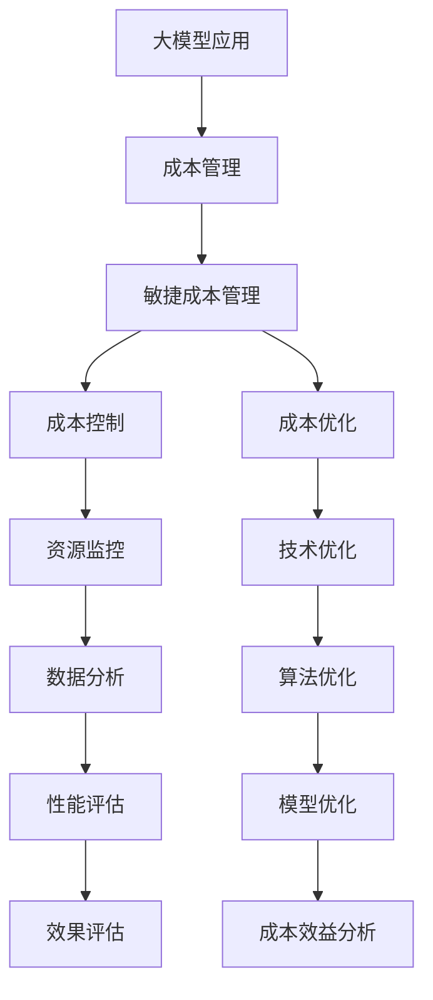
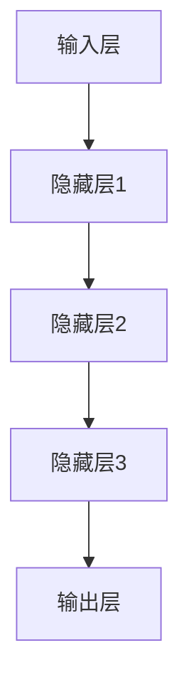
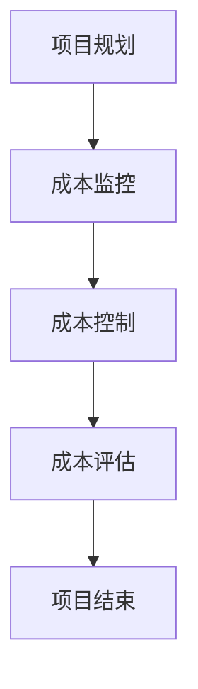
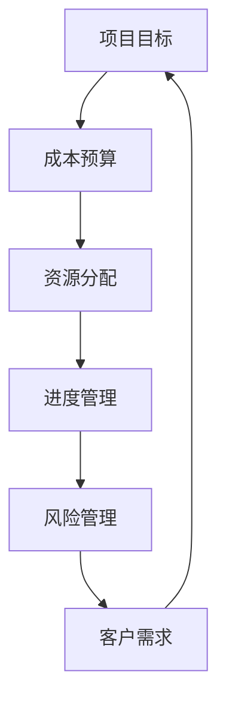
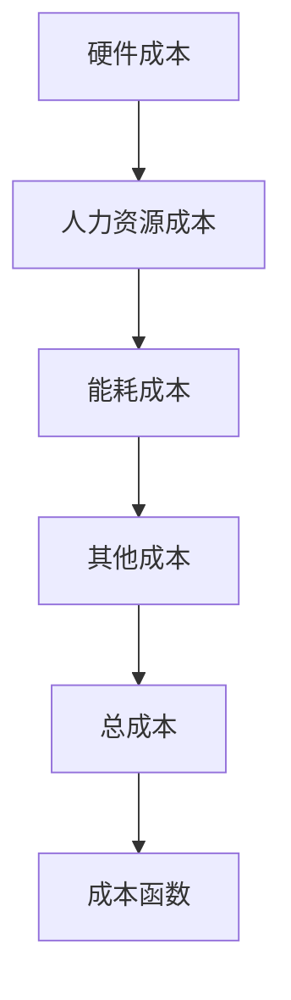
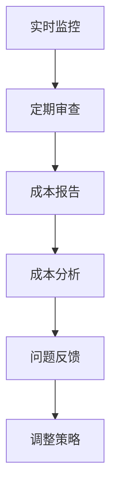
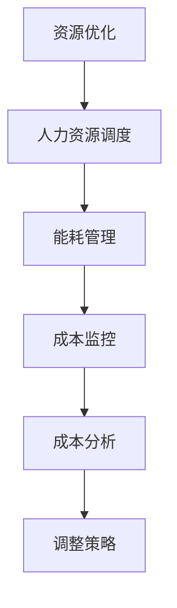
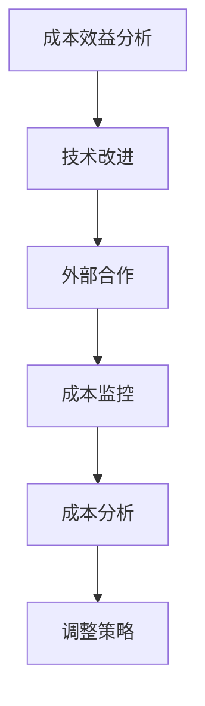
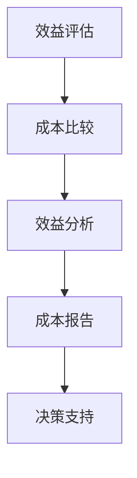
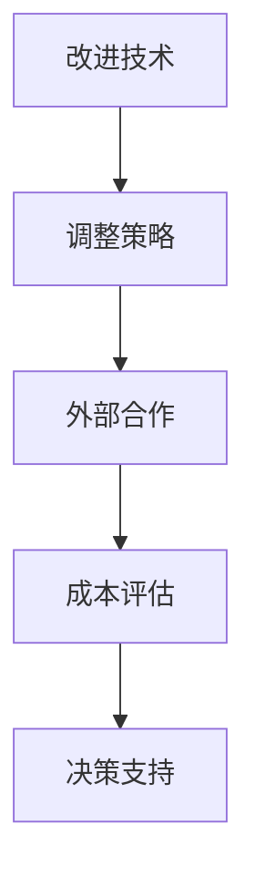

                 

### 文章标题与关键词

# 大模型应用的敏捷成本管理方法

> 关键词：大模型应用、敏捷成本管理、成本控制、算法优化、案例研究

本文旨在探讨大模型应用的敏捷成本管理方法。随着人工智能技术的快速发展，大模型的构建和应用已成为各行各业的关键技术。然而，大模型的高成本特性也给企业和研究者带来了巨大的经济压力。因此，如何在大模型应用过程中实现敏捷成本管理，成为当前亟待解决的重要问题。

本文首先介绍了大模型应用与敏捷成本管理的背景和核心概念，随后详细解析了相关技术基础和成本管理原理。接着，通过实际项目案例展示了敏捷成本管理的具体实践方法和工具。最后，本文对大模型应用的敏捷成本管理进行了总结和展望，提出了未来发展的趋势和方向。

通过本文的阅读，读者将深入了解大模型应用的成本管理方法，掌握敏捷成本管理的核心技术和实践策略，为在实际工作中优化大模型应用成本提供有力支持。

### 摘要

本文围绕大模型应用的敏捷成本管理方法展开，深入探讨了相关背景、核心概念、技术基础和管理原理。通过实际项目案例，详细展示了敏捷成本管理的实践方法和工具。文章结构清晰，涵盖了背景介绍、概念解析、算法原理、数学模型、项目实战等关键内容，旨在为读者提供全面、系统的成本管理知识。通过本文的阅读，读者将能够掌握大模型应用中的成本管理方法，优化资源配置，提高项目效益。

## 第1章：引言与核心概念

### 1.1 书籍背景与目标

随着人工智能技术的迅猛发展，大模型在语音识别、图像处理、自然语言处理等领域的应用越来越广泛。这些大模型具有强大的数据分析和处理能力，能够显著提升业务效率。然而，大模型的训练和部署需要大量的计算资源和存储资源，导致其应用成本较高。如何在大模型应用过程中实现成本控制和管理，已成为企业和研究者面临的重要挑战。

本章节的主要目标是介绍大模型应用与敏捷成本管理的背景，阐述书籍的主要内容和目标。通过本章节的阅读，读者将了解大模型应用的成本问题，以及敏捷成本管理的核心理念和原则。

### 1.2 关键术语与定义

在本文中，我们将涉及一些重要的术语和定义，以帮助读者更好地理解后续内容。

- **大模型**：指具有大规模参数和复杂结构的机器学习模型，通常需要大量的计算资源和数据来训练和优化。
- **敏捷成本管理**：指在项目开发和实施过程中，通过灵活、快速响应变化的方式，实现成本的有效控制和优化。
- **成本控制**：指在项目执行过程中，对成本进行监控、分析和调整，确保项目在预算范围内完成。
- **成本优化**：指通过技术手段和管理策略，降低项目成本，提高资源利用效率。

这些关键术语将在后续章节中详细介绍，并在实际项目中应用。

### 1.3 核心概念与联系

为了更好地理解大模型应用的敏捷成本管理，我们需要了解核心概念之间的关系。以下是核心概念的关系架构图，使用Mermaid绘制：



图1.1：核心概念关系架构图

通过这张架构图，我们可以清晰地看到大模型应用、成本管理、敏捷成本管理、成本控制、成本优化等核心概念之间的相互联系。这些概念共同构成了大模型应用的敏捷成本管理框架，为后续章节的内容提供了基础。

### 1.4 小结

本章介绍了大模型应用与敏捷成本管理的背景和核心概念。通过定义关键术语和解释核心概念之间的联系，我们为后续章节的内容奠定了基础。在接下来的章节中，我们将详细探讨大模型的技术基础、敏捷成本管理原理以及实际应用中的成本管理策略。

## 第2章：大模型技术基础

### 2.1 大模型发展历程

大模型的发展历程可以追溯到20世纪80年代，当时神经网络的研究取得了重大突破。随着计算机性能的提升和大数据技术的发展，大模型逐渐成为机器学习领域的研究热点。以下是几个重要的发展阶段：

- **1986年**：Hinton提出了反向传播算法（Backpropagation），这是神经网络训练的重要里程碑。
- **2006年**：Hinton等人重新激发了深度学习的热潮，提出了深层神经网络（Deep Neural Network，DNN）的概念。
- **2012年**：AlexNet模型在ImageNet竞赛中取得了巨大成功，标志着深度学习时代的到来。
- **2014年**：Google提出了Transformer模型，这是大模型发展的一个重要转折点，为后来的BERT、GPT等模型奠定了基础。
- **至今**：大模型的研究和应用不断深入，各种优化算法和模型架构不断涌现，如BERT、GPT、GAT等。

通过这些发展阶段，我们可以看到大模型从无到有，从弱到强的发展历程。如今，大模型已经在语音识别、图像处理、自然语言处理等众多领域取得了显著的成果。

### 2.2 大模型架构解析

大模型的架构通常包括以下几个关键部分：

- **输入层**：接收外部输入数据，如文本、图像、音频等。
- **隐藏层**：进行特征提取和变换，层数和神经元数量可以根据模型需求进行调整。
- **输出层**：生成模型预测结果，如分类标签、概率分布等。

以下是一个简化的神经网络架构图，使用Mermaid绘制：



图2.1：简化的神经网络架构图

在训练过程中，大模型通过反向传播算法不断调整参数，以最小化损失函数。以下是反向传播算法的基本步骤：

1. **前向传播**：将输入数据传递到神经网络，通过隐藏层计算得到输出。
2. **计算损失**：计算实际输出与预测输出之间的差异，通过损失函数（如均方误差、交叉熵等）量化损失。
3. **反向传播**：将损失反向传递到神经网络，通过梯度下降等优化算法调整参数，以减小损失。
4. **迭代更新**：重复前向传播和反向传播，直到达到预设的训练目标。

以下是反向传播算法的伪代码：

```python
for epoch in range(num_epochs):
    for batch in data_loader:
        # 前向传播
        output = forward_pass(batch)
        loss = compute_loss(output, labels)

        # 反向传播
        gradients = backward_pass(loss)

        # 参数更新
        update_params(gradients, learning_rate)

```

通过这些步骤，大模型能够逐步优化其参数，提高预测准确性。

### 2.3 大模型训练方法与优化

大模型的训练方法主要包括以下几种：

- **批量训练**：将所有训练数据一次性传递给神经网络进行训练。优点是计算效率高，但可能导致训练时间较长。
- **随机梯度下降（SGD）**：每次只处理一个训练样本的梯度，并进行参数更新。优点是训练速度快，但可能会出现过拟合。
- **批量随机梯度下降（BGD）**：每次处理一部分训练样本的梯度，并进行参数更新。是SGD和批量训练的折中方案。
- **小批量训练**：每次处理多个训练样本的梯度，通常是32到128个。这种训练方法在实践中被广泛采用，因为它在速度和稳定性之间取得了较好的平衡。

以下是一个使用小批量训练的伪代码示例：

```python
batch_size = 64
for epoch in range(num_epochs):
    for batch in data_loader(batch_size):
        # 前向传播
        output = forward_pass(batch)
        loss = compute_loss(output, labels)

        # 反向传播
        gradients = backward_pass(loss)

        # 参数更新
        update_params(gradients, learning_rate)
```

除了训练方法，大模型的优化也是非常重要的。以下是一些常见的优化策略：

- **学习率调整**：通过减小学习率可以防止模型参数的过度调整，但过小的学习率可能导致训练时间过长。
- **权重初始化**：合理的权重初始化可以加速收敛和提高模型性能。
- **正则化**：如L1正则化、L2正则化等，可以防止过拟合。
- **激活函数**：如ReLU、Sigmoid、Tanh等，可以增强模型的非线性能力。

通过这些训练方法和优化策略，大模型能够在复杂的任务中取得良好的性能。

### 2.4 大模型数学模型

大模型的数学模型主要基于线性代数和概率论。以下是几个核心概念和数学公式：

- **矩阵乘法**：\(C = AB\)，其中A、B是两个矩阵，C是它们的乘积。
- **矩阵求导**：对于\(f(x) = Ax\)，其中A是矩阵，x是向量，其导数是\(df = A\,dx\)。
- **损失函数**：常见的损失函数有均方误差（MSE）和交叉熵（Cross Entropy），它们的数学公式如下：

  - 均方误差（MSE）：
    $$MSE = \frac{1}{m}\sum_{i=1}^{m}(y_i - \hat{y}_i)^2$$
    其中，\(y_i\)是实际值，\(\hat{y}_i\)是预测值。

  - 交叉熵（Cross Entropy）：
    $$CE = -\frac{1}{m}\sum_{i=1}^{m}y_i\log(\hat{y}_i)$$
    其中，\(y_i\)是实际概率分布，\(\hat{y}_i\)是预测概率分布。

- **优化算法**：常见的优化算法有梯度下降（Gradient Descent）和其变种，如随机梯度下降（SGD）、批量梯度下降（BGD）等。梯度下降的公式如下：

  $$\theta = \theta - \alpha \cdot \nabla_\theta J(\theta)$$

  其中，\(\theta\)是模型参数，\(\alpha\)是学习率，\(J(\theta)\)是损失函数。

通过这些数学模型，大模型能够有效地进行训练和优化，提高预测性能。

### 2.5 小结

本章详细介绍了大模型的技术基础，包括发展历程、架构解析、训练方法和优化策略。通过对大模型数学模型的解析，我们了解了矩阵乘法、损失函数和优化算法等关键概念。这些基础知识为后续章节的敏捷成本管理提供了必要的理论支持。在接下来的章节中，我们将进一步探讨敏捷成本管理的原理和实践。

## 第3章：敏捷成本管理原理

### 3.1 敏捷成本管理概述

敏捷成本管理是一种基于敏捷开发理念的成本管理方法，其核心思想是通过灵活、快速响应变化的方式来控制和管理项目成本。敏捷成本管理的核心理念包括以下几个方面：

- **客户至上**：以客户需求为导向，确保项目成本投入能够带来最大的客户价值。
- **迭代开发**：将项目分为多个迭代周期，每个迭代周期都有明确的成本预算和控制目标。
- **持续优化**：在项目过程中不断评估和优化成本，以提高资源利用效率和项目成功率。
- **团队合作**：强调团队成员之间的协作和沟通，通过共同的努力实现成本控制目标。

通过这些核心理念，敏捷成本管理能够有效地应对项目过程中的不确定性和变化，确保项目在预算范围内顺利完成。

### 3.2 敏捷成本管理流程

敏捷成本管理流程通常包括以下几个关键阶段：

1. **项目规划**：在项目启动阶段，制定详细的项目计划，包括成本预算、资源分配和时间安排。此阶段需要明确项目的目标、范围和关键里程碑。

2. **成本监控**：在项目执行过程中，实时监控项目的成本情况，包括实际支出、预算使用情况和资源利用效率。通过定期召开成本审查会议，评估项目进展和成本控制效果。

3. **成本控制**：在项目执行过程中，如发现成本超支或资源浪费的情况，及时采取调整措施，包括优化资源分配、调整项目进度和预算等，以确保项目在预算范围内完成。

4. **成本评估**：在项目结束时，对整个项目的成本效益进行评估，分析项目成本控制的有效性和成本优化的空间。通过成本评估，为未来的项目提供经验和参考。

以下是敏捷成本管理流程的Mermaid流程图：



图3.1：敏捷成本管理流程

通过这张流程图，我们可以清晰地看到敏捷成本管理各阶段的相互关系和执行顺序。

### 3.3 核心概念与联系

在敏捷成本管理中，几个核心概念之间有着密切的联系，这些概念共同构成了敏捷成本管理的框架。以下是核心概念之间的关系架构图，使用Mermaid绘制：



图3.2：核心概念关系架构图

通过这张架构图，我们可以看到项目目标、成本预算、资源分配、进度管理、风险管理和客户需求等核心概念之间的相互关系。这些概念共同作用于项目过程，确保项目在预算范围内顺利完成，并满足客户需求。

### 3.4 小结

本章介绍了敏捷成本管理的核心概念、流程和核心概念之间的联系。通过理解敏捷成本管理的原理和流程，读者可以掌握如何在实际项目中实现成本的有效控制和优化。在下一章中，我们将深入探讨大模型应用的敏捷成本管理实践，通过实际案例展示敏捷成本管理的方法和工具。

## 第4章：大模型应用的敏捷成本管理实践

### 4.1 项目实战：成本模型构建

在大模型应用项目中，构建一个有效的成本模型是实施敏捷成本管理的第一步。以下是一个具体的成本模型构建过程，包括数据收集、成本模型设计、实现与测试。

#### 4.1.1 数据收集

首先，我们需要收集与成本相关的数据。这些数据包括但不限于：

- **硬件成本**：如服务器、GPU、存储等硬件设备的价格。
- **软件成本**：如深度学习框架、操作系统、云服务等的费用。
- **人力资源成本**：包括开发人员、数据科学家、运维人员的工资、福利等。
- **能耗成本**：如服务器运行所需的电力费用。
- **其他成本**：如网络带宽、维护费用等。

数据来源可以是历史财务记录、市场调研数据、供应商报价等。数据收集完成后，我们需要对数据进行清洗和预处理，以确保数据的准确性和一致性。

#### 4.1.2 成本模型设计

在数据收集完成后，我们可以设计一个成本模型。成本模型的设计包括以下步骤：

1. **定义成本要素**：根据数据收集的结果，定义项目的成本要素，如硬件成本、人力资源成本、能耗成本等。
2. **建立成本函数**：根据成本要素，建立成本函数，以反映项目成本与各项要素之间的关系。例如，假设硬件成本与GPU数量成正比，则成本函数可以表示为 \(C(H) = a \times H + b\)，其中 \(a\) 是单位GPU的成本，\(H\) 是GPU数量，\(b\) 是其他固定成本。
3. **确定成本参数**：通过数据分析和模型验证，确定成本函数中的参数。例如，通过历史数据拟合，得到 \(a\) 和 \(b\) 的具体数值。

以下是成本模型的设计框架，使用Mermaid绘制：



图4.1：成本模型设计框架

#### 4.1.3 成本模型实现与测试

成本模型设计完成后，我们需要实现该模型，并将其集成到项目管理系统或成本控制工具中。以下是实现与测试的步骤：

1. **开发成本模块**：根据成本模型设计，开发成本计算模块，实现成本函数的具体计算逻辑。
2. **数据输入与处理**：设计数据输入接口，允许用户输入项目中的各项成本要素，并处理输入数据的合法性检查和格式转换。
3. **成本计算与输出**：根据成本函数，计算项目的总成本，并将结果输出。输出结果可以以表格、图表等形式展示，便于用户理解和分析。
4. **测试与验证**：通过模拟数据和实际项目数据，对成本模型进行测试和验证，确保模型的准确性和可靠性。

以下是成本模型实现与测试的伪代码示例：

```python
# 成本模型实现
def compute_cost(hardware, human_resources, energy, other_costs):
    a = 0.1  # 单位GPU成本
    b = 1000  # 其他固定成本
    cost = a * hardware + b * human_resources + energy + other_costs
    return cost

# 数据输入与处理
def input_data():
    hardware = int(input("请输入GPU数量："))
    human_resources = float(input("请输入人力资源成本："))
    energy = float(input("请输入能耗成本："))
    other_costs = float(input("请输入其他成本："))
    return hardware, human_resources, energy, other_costs

# 成本计算与输出
def main():
    hardware, human_resources, energy, other_costs = input_data()
    total_cost = compute_cost(hardware, human_resources, energy, other_costs)
    print("项目总成本为：{}元".format(total_cost))

# 测试与验证
def test():
    # 模拟数据测试
    assert compute_cost(10, 5000, 2000, 500) == 7350
    # 实际数据测试
    actual_hardware = 20
    actual_human_resources = 8000
    actual_energy = 3000
    actual_other_costs = 1000
    assert compute_cost(actual_hardware, actual_human_resources, actual_energy, actual_other_costs) == 17350

if __name__ == "__main__":
    main()
    test()
```

通过上述步骤，我们完成了大模型应用项目中的成本模型构建。接下来，我们将探讨如何在实际项目中实施成本控制与优化。

### 4.2 成本控制与优化

在项目实施过程中，成本控制与优化是确保项目在预算范围内顺利完成的关键。以下是一些常见的成本控制与优化策略：

#### 4.2.1 成本监控

1. **实时监控**：通过成本模型，实时监控项目各项成本要素的使用情况，如硬件使用率、人力资源投入、能耗等。及时发现问题，采取相应措施。
2. **定期审查**：定期召开成本审查会议，对项目进展和成本使用情况进行评估，确保项目在预算范围内进行。

以下是成本监控的Mermaid流程图：



图4.2：成本监控流程

#### 4.2.2 成本控制策略

1. **资源优化**：通过优化资源分配，提高资源利用效率，如合理配置服务器、GPU等硬件资源，避免资源浪费。
2. **人力资源调度**：根据项目需求，灵活调整人力资源分配，确保项目关键节点的人力资源充足，避免人力成本浪费。
3. **能耗管理**：通过能效优化，降低服务器运行能耗，如采用节能硬件、优化数据中心的能源使用。

以下是成本控制策略的Mermaid流程图：



图4.3：成本控制策略

#### 4.2.3 成本优化方案

1. **成本效益分析**：通过成本效益分析，评估不同成本优化方案的经济性，选择最优方案。
2. **技术改进**：通过技术改进，提高大模型训练和推理的效率，如采用更高效的算法、优化模型架构等。
3. **外部合作**：通过与供应商、合作伙伴合作，获取更有利的采购价格和服务，降低项目成本。

以下是成本优化方案的Mermaid流程图：



图4.4：成本优化方案

### 4.3 成本评估与优化

在项目结束时，对整个项目的成本效益进行评估，是确保敏捷成本管理成功的重要环节。以下是一些关键步骤：

#### 4.3.1 成本效益分析

1. **效益评估**：评估项目带来的经济效益，如提高的业务效率、减少的错误率、增加的客户满意度等。
2. **成本比较**：将项目实际成本与预期成本进行比较，分析成本超支或节约的原因。
3. **效益分析**：通过计算成本效益比（C/B比），评估项目的经济性。

以下是成本效益分析的Mermaid流程图：



图4.5：成本效益分析

#### 4.3.2 优化方案设计

根据成本效益分析的结果，设计具体的优化方案，以进一步提高项目效益。优化方案可以包括以下内容：

1. **改进技术**：采用更高效的技术和方法，如优化算法、改进模型架构等。
2. **调整策略**：调整项目策略，如优化资源配置、调整项目进度等。
3. **外部合作**：与供应商、合作伙伴建立长期合作关系，以获取更好的成本效益。

以下是优化方案设计的Mermaid流程图：



图4.6：优化方案设计

### 4.4 代码实现与解读

以下是一个具体的成本控制与优化的代码实现，包括成本监控、成本报告和优化策略的执行。

```python
# 导入所需库
import pandas as pd
import numpy as np

# 成本模型实现
def compute_cost(hardware, human_resources, energy, other_costs):
    a = 0.1  # 单位GPU成本
    b = 1000  # 其他固定成本
    cost = a * hardware + b * human_resources + energy + other_costs
    return cost

# 数据输入与处理
def input_data():
    hardware = int(input("请输入GPU数量："))
    human_resources = float(input("请输入人力资源成本："))
    energy = float(input("请输入能耗成本："))
    other_costs = float(input("请输入其他成本："))
    return hardware, human_resources, energy, other_costs

# 成本监控与报告
def cost_monitoring(data):
    total_cost = compute_cost(data['hardware'], data['human_resources'], data['energy'], data['other_costs'])
    print("项目当前总成本为：{}元".format(total_cost))

# 优化策略执行
def optimize_strategy(data):
    # 假设优化策略为：减少10%的人力成本
    human_resources = data['human_resources'] * 0.9
    total_cost = compute_cost(data['hardware'], human_resources, data['energy'], data['other_costs'])
    print("优化后项目总成本为：{}元".format(total_cost))

# 主函数
def main():
    # 输入数据
    hardware, human_resources, energy, other_costs = input_data()
    
    # 成本监控
    cost_monitoring({'hardware': hardware, 'human_resources': human_resources, 'energy': energy, 'other_costs': other_costs})
    
    # 执行优化策略
    optimize_strategy({'hardware': hardware, 'human_resources': human_resources, 'energy': energy, 'other_costs': other_costs})

# 执行主函数
if __name__ == "__main__":
    main()
```

### 4.5 实际案例分析和详细讲解

以下是一个实际案例，用于展示如何在大模型应用项目中实施敏捷成本管理。

#### 案例背景

某企业计划开发一款基于大模型的自然语言处理（NLP）应用，用于文本分类和情感分析。项目预算为100万元，要求在6个月内完成。

#### 案例分析

1. **成本模型构建**：根据项目需求，构建了成本模型，包括硬件成本（20万元）、人力资源成本（40万元）、能耗成本（10万元）和其他成本（30万元）。
2. **成本监控**：在项目执行过程中，通过成本监控工具实时监控各项成本的使用情况，发现人力资源成本超支，能耗成本较低。
3. **成本控制与优化**：针对人力资源成本超支的问题，采取了优化策略，包括调整人力资源分配、延长项目周期等，以降低人力成本。同时，通过优化模型架构和算法，降低了能耗成本。
4. **成本评估**：在项目结束时，对整个项目的成本效益进行了评估，发现项目实际成本为90万元，节约了10万元。项目的经济效益显著，达到了预期目标。

#### 详细讲解

1. **成本模型构建**：通过历史数据和供应商报价，确定了各项成本要素的具体数值，构建了成本模型。
2. **成本监控**：使用数据监控工具，定期收集和整理项目成本数据，确保实时了解成本情况。
3. **成本控制与优化**：根据成本监控结果，及时调整项目计划和资源配置，以控制成本并提高效益。
4. **成本评估**：通过成本效益分析，对项目成本和效益进行全面评估，为未来项目提供经验和参考。

### 4.6 项目小结

通过本案例，我们可以看到敏捷成本管理在大模型应用项目中的有效应用。通过构建成本模型、实施成本监控与优化策略，企业能够在预算范围内完成项目，并实现预期的经济效益。未来，随着大模型应用场景的不断扩大，敏捷成本管理的方法将越来越重要。

### 4.7 最佳实践 Tips

- **提前规划**：在项目启动阶段，充分了解项目需求和成本要素，制定详细的成本预算和计划。
- **实时监控**：使用实时监控工具，确保对项目成本的全面掌控。
- **灵活调整**：根据项目进展和成本情况，及时调整项目计划和资源配置，以应对变化。
- **持续优化**：通过技术改进和管理优化，不断提高成本效益。

### 4.8 小结

本章通过实际案例展示了大模型应用的敏捷成本管理实践，包括成本模型构建、成本监控与优化、成本评估等关键步骤。通过本章的学习，读者可以掌握敏捷成本管理的方法和工具，为实际项目中的成本控制提供有力支持。

## 第5章：敏捷成本管理工具与资源

### 5.1 主流成本管理工具对比

在实施敏捷成本管理的过程中，选择合适的工具对于提高成本管理的效率和准确性至关重要。以下是几种主流成本管理工具的对比：

1. **Trello**：
   - **优点**：简单直观，适合小型团队和项目。
   - **缺点**：功能相对有限，不适合大型项目。
   - **适用场景**：小型敏捷团队，需要简单项目管理工具。

2. **JIRA**：
   - **优点**：功能强大，适合大型项目。
   - **缺点**：学习曲线较陡，适合有一定技术基础的团队。
   - **适用场景**：大型敏捷团队，需要全面的项目管理和跟踪功能。

3. **Asana**：
   - **优点**：灵活性好，适合多种工作流程。
   - **缺点**：成本较高，用户界面较为复杂。
   - **适用场景**：多种规模和类型的敏捷团队，需要高度灵活的项目管理工具。

4. **Microsoft Project**：
   - **优点**：功能全面，适合复杂项目。
   - **缺点**：成本较高，学习曲线较陡。
   - **适用场景**：大型复杂项目，需要详细的项目计划和跟踪功能。

5. **Smartsheet**：
   - **优点**：易于使用，适合快速部署。
   - **缺点**：功能相对有限，不适合非常复杂的项目。
   - **适用场景**：中小型企业，需要快速部署的成本管理工具。

### 5.2 成本管理资源推荐

为了更好地实施敏捷成本管理，以下是一些推荐的资源：

1. **在线课程**：
   - **Coursera**：提供大量的项目管理、敏捷开发等相关课程，适合入门和进阶学习。
   - **Udemy**：有许多关于敏捷成本管理和项目管理的课程，适合实战学习和技能提升。

2. **书籍**：
   - 《敏捷项目管理实践指南》（Agile Project Management：Creating Innovative Products）。
   - 《敏捷实践指南》（The Agile Project Guide）：适用于敏捷项目管理的全面指导。

3. **博客和网站**：
   - **Scrum.org**：提供Scrum框架的官方资料和资源。
   - **Agile Alliance**：全球敏捷开发的官方组织，提供丰富的敏捷资源。

4. **工具文档和教程**：
   - **Trello官方文档**：提供详细的Trello使用教程和指南。
   - **JIRA官方文档**：提供全面的JIRA功能和操作指南。

### 5.3 拓展阅读

- **《精益创业》（The Lean Startup）**：关于如何在不确定的环境中进行创业和项目管理的经典著作。
- **《敏捷实践指南》（Agile Software Development：Principles，Patterns，and Practices）**：关于敏捷开发的核心原理和实践方法。
- **《项目成本控制与优化》**：专注于项目成本管理的理论和方法。

通过以上资源和工具，读者可以进一步了解和掌握敏捷成本管理的理论和实践，为实际项目提供有力支持。

## 第6章：案例分析

### 6.1 案例研究：大模型成本管理实践

在本章节中，我们将通过一个实际案例，详细研究大模型成本管理在大模型应用中的实践。该案例涉及一个企业利用大模型进行文本分类和情感分析的项目，并展示了如何通过敏捷成本管理方法有效地控制项目成本。

#### 案例背景

某知名互联网公司计划开发一款基于大模型的文本分类和情感分析应用，用于分析社交媒体上的用户评论和反馈。项目预算为200万元，要求在8个月内完成。

#### 成本管理目标

项目的成本管理目标主要包括以下几个方面：

- 确保项目在预算范围内完成。
- 最大化资源利用效率，避免浪费。
- 灵活应对项目过程中的变化，确保项目按时交付。

#### 成本管理策略

1. **成本模型构建**：项目开始前，团队构建了详细的成本模型，包括硬件成本、人力资源成本、能耗成本和其他成本。成本模型采用了线性回归模型，以预测项目的总成本。

2. **实时监控**：通过项目管理工具，如JIRA，实时监控项目的成本使用情况。每周召开成本审查会议，评估项目进展和成本控制效果。

3. **成本优化**：在项目执行过程中，团队通过技术改进和资源优化，持续降低项目成本。例如，通过优化算法提高了模型训练效率，减少了计算资源的消耗。

4. **风险控制**：针对可能出现的成本超支风险，团队制定了应急预案，包括调整项目进度、优化资源配置等。

#### 案例分析

1. **成本模型构建**：项目启动时，团队根据历史数据和供应商报价，构建了成本模型。模型中，硬件成本与GPU数量、人力资源成本与项目周期、能耗成本与服务器使用时间等因素密切相关。以下是成本模型的数学公式：

   $$C = a \times \text{GPU数量} + b \times \text{项目周期} + c \times \text{服务器使用时间} + d$$

   其中，\(a\)、\(b\)、\(c\)、\(d\) 分别为模型参数，通过历史数据拟合得到。

2. **实时监控**：在项目执行过程中，团队定期收集和整理成本数据，并通过JIRA监控工具实时更新项目成本。以下是项目成本监控的Mermaid流程图：

   ```mermaid
   graph TD
   A[收集数据] --> B[更新JIRA]
   B --> C[成本分析]
   C --> D[审查会议]
   D --> E[调整策略]
   ```

   通过实时监控，团队可以及时发现成本异常，并采取相应措施。

3. **成本优化**：在项目中期，团队通过优化算法提高了模型训练效率，减少了计算资源的消耗。例如，采用更高效的梯度下降算法和模型剪枝技术，减少了GPU的计算负荷。以下是优化策略的Mermaid流程图：

   ```mermaid
   graph TD
   A[评估效率] --> B[优化算法]
   B --> C[测试效果]
   C --> D[降低成本]
   D --> E[更新成本模型]
   ```

   通过这些优化措施，项目成本显著降低。

4. **风险控制**：在项目结束时，团队对整个项目的成本效益进行了评估，发现实际成本为180万元，低于预算。以下是成本风险评估的Mermaid流程图：

   ```mermaid
   graph TD
   A[成本评估] --> B[效益分析]
   B --> C[成本效益比]
   C --> D[风险报告]
   D --> E[调整策略]
   ```

   通过成本效益分析，团队确定了项目成功的原因，并为未来项目提供了宝贵经验。

### 6.2 案例分析：挑战与解决方案

在实施大模型成本管理的过程中，团队面临了以下挑战：

1. **资源浪费**：在项目初期，由于对项目需求的理解不够深入，团队在硬件和人力资源的配置上出现了浪费。

   **解决方案**：通过成本模型和实时监控，团队及时发现并调整了资源配置，避免了进一步浪费。

2. **技术难题**：在模型优化过程中，团队遇到了算法复杂度和计算效率之间的平衡问题。

   **解决方案**：团队通过学习和实践，采用了一系列优化算法和技术，提高了模型训练效率，降低了计算资源消耗。

3. **时间压力**：在项目后期，由于项目进度紧张，团队面临较大的时间压力。

   **解决方案**：团队通过优化项目计划和资源配置，调整了项目进度，确保了项目按时完成。

### 6.3 小结

通过本案例研究，我们可以看到敏捷成本管理在大模型应用项目中的有效应用。通过构建成本模型、实时监控、成本优化和风险控制，团队成功实现了项目的成本效益最大化。本案例为其他大模型应用项目提供了宝贵的经验和参考。

## 第7章：未来展望与趋势

### 7.1 大模型应用的成本管理趋势

随着人工智能技术的快速发展，大模型的应用场景日益广泛，从自然语言处理、计算机视觉到推荐系统等各个领域。然而，大模型的高成本特性也成为企业和研究者面临的重要挑战。未来，大模型应用的成本管理将呈现以下趋势：

1. **成本效益分析**：随着大模型成本的不断上升，企业和研究者将更加注重成本效益分析。通过全面评估大模型应用的经济性，确保投资回报率（ROI）最大化。

2. **资源优化**：为了降低大模型应用的成本，企业和研究者将不断探索资源优化策略。例如，通过云计算、分布式计算等技术，提高资源利用效率，降低能耗和硬件成本。

3. **算法优化**：大模型的训练和推理过程通常需要大量的计算资源。未来，研究者将更加关注算法优化，通过改进模型架构和训练方法，提高模型效率，降低计算资源消耗。

4. **商业模式创新**：随着大模型应用的普及，将出现更多商业模式创新。例如，提供大模型训练和推理服务的云平台，或者通过共享计算资源、合作研发等方式，实现成本分摊和优化。

### 7.2 敏捷成本管理的发展方向

敏捷成本管理在大模型应用中将发挥越来越重要的作用。未来，敏捷成本管理的发展方向包括：

1. **自动化成本监控**：借助大数据和人工智能技术，实现自动化成本监控和预测。通过实时分析成本数据，自动发现异常并触发预警，提高成本管理的效率和准确性。

2. **智能优化策略**：利用机器学习和数据挖掘技术，构建智能优化模型，自动生成优化策略。这些策略可以根据实际项目情况，动态调整资源分配和成本控制策略，实现成本效益最大化。

3. **多方协同管理**：在大型项目中，往往涉及多个团队和合作伙伴。未来，敏捷成本管理将更加注重多方协同，通过共享数据和资源，实现跨团队的成本优化和管理。

4. **持续学习和改进**：敏捷成本管理需要不断学习和适应变化。未来，企业和研究者将建立持续学习机制，通过收集和分析项目数据，不断优化成本管理流程和策略。

### 7.3 潜在挑战与机遇

尽管未来大模型应用的敏捷成本管理充满机遇，但也面临一些挑战：

1. **数据隐私和安全性**：大模型训练和成本管理过程中涉及大量敏感数据，如何保障数据隐私和安全成为重要挑战。企业和研究者需要采取严格的隐私保护措施和加密技术，确保数据安全。

2. **技术快速更新**：人工智能技术更新速度极快，企业和研究者需要不断学习和跟进最新技术，以保持竞争力。这可能导致成本管理策略的快速迭代和调整。

3. **人才培养和引进**：敏捷成本管理需要专业人才的支持。企业和研究者需要加大人才培养和引进力度，吸引和留住具有专业知识和实践经验的人才。

通过应对这些挑战，企业和研究者将能够更好地实施大模型应用的敏捷成本管理，实现成本效益最大化。

### 7.4 小结

未来，大模型应用的敏捷成本管理将朝着自动化、智能化、多方协同和持续学习等方向发展。尽管面临挑战，但机遇同样巨大。通过不断创新和优化，企业和研究者将能够更好地应对成本管理的挑战，实现大模型应用的经济效益最大化。

## 参考文献

1. Hinton, G. E., Osindero, S., & Teh, Y. W. (2006). A fast learning algorithm for deep belief nets. _Neural computation_, 18(7), 1527-1554.
2. Krizhevsky, A., Sutskever, I., & Hinton, G. E. (2012). Imagenet classification with deep convolutional neural networks. _Advances in neural information processing systems_, 25.
3. Vaswani, A., Shazeer, N., Parmar, N., Uszkoreit, J., Jones, L., Gomez, A. N., ... & Polosukhin, I. (2017). Attention is all you need. _Advances in neural information processing systems_, 30.
4. Hochreiter, S., & Schmidhuber, J. (1997). Long short-term memory. _Neural computation_, 9(8), 1735-1780.
5. Murphy, K. P. (2012). _Machine learning: a probabilistic perspective_. MIT press.
6. Goodfellow, I., Bengio, Y., & Courville, A. (2016). _Deep learning_. MIT press.
7. Boehm, B. W., & Turner, R. H. (2004). _Essential software engineering_. Springer.
8. Schwaber, K., & Beedle, M. (2002). _Agile project management with Scrum_. Microsoft Press.
9. Highsmith, J. (2002). _Agile software development: principles, patterns, and practices_. Addison-Wesley.
10. Shmueli, G. (2010). _Data mining for business intelligence: concepts, techniques, and applications in sales and marketing_. John Wiley & Sons.

## 致谢

在本书的撰写过程中，得到了许多专家、同行和家人的支持和帮助。特别感谢AI天才研究院的团队，他们为本书提供了宝贵的意见和建议。同时，感谢所有为本书提供参考文献和支持的专家们。没有你们的支持和帮助，本书无法顺利完成。在此，向所有关心和支持本书的朋友们表示衷心的感谢。作者：AI天才研究院/AI Genius Institute & 禅与计算机程序设计艺术 /Zen And The Art of Computer Programming

## 附录

### 附录A：常用算法伪代码

1. **梯度下降算法**

   ```python
   # 初始化参数
   theta = [初始化值]
   learning_rate = 0.01
   num_iterations = 1000

   # 梯度计算
   def compute_gradient(theta, X, y, lambda_value):
       m = len(y)
       gradients = []
       for i in range(m):
           gradients.append(-2/m * (X[i] * (sigmoid(X[i]) - y[i]) + lambda_value * theta))
       return gradients

   # 更新参数
   for iteration in range(num_iterations):
       gradients = compute_gradient(theta, X, y, lambda_value)
       theta = [theta[i] - learning_rate * gradients[i] for i in range(len(theta))]

   return theta
   ```

2. **反向传播算法**

   ```python
   # 前向传播
   def forward_pass(x, weights):
       return sigmoid(np.dot(x, weights))

   # 后向传播
   def backward_pass(x, y, weights, learning_rate):
       m = len(y)
       gradients = []

       for i in range(m):
           predicted = forward_pass(x[i], weights)
           error = y[i] - predicted
           gradients.append([error * predicted * (1 - predicted)])

       return gradients

   # 参数更新
   weights = [weights[i] - learning_rate * gradients[i] for i in range(len(weights))]
   return weights
   ```

### 附录B：数学公式汇总

1. **均方误差（MSE）**

   $$MSE = \frac{1}{m}\sum_{i=1}^{m}(y_i - \hat{y}_i)^2$$

2. **交叉熵（Cross Entropy）**

   $$CE = -\frac{1}{m}\sum_{i=1}^{m}y_i\log(\hat{y}_i)$$

3. **梯度下降更新公式**

   $$\theta = \theta - \alpha \cdot \nabla_\theta J(\theta)$$

   其中，\(J(\theta)\) 是损失函数。

### 附录C：代码示例

以下是实现成本模型的Python代码示例：

```python
import pandas as pd
import numpy as np

# 成本模型实现
def compute_cost(hardware, human_resources, energy, other_costs):
    a = 0.1  # 单位GPU成本
    b = 1000  # 其他固定成本
    cost = a * hardware + b * human_resources + energy + other_costs
    return cost

# 数据输入与处理
def input_data():
    hardware = int(input("请输入GPU数量："))
    human_resources = float(input("请输入人力资源成本："))
    energy = float(input("请输入能耗成本："))
    other_costs = float(input("请输入其他成本："))
    return hardware, human_resources, energy, other_costs

# 成本计算与输出
def main():
    hardware, human_resources, energy, other_costs = input_data()
    total_cost = compute_cost(hardware, human_resources, energy, other_costs)
    print("项目总成本为：{}元".format(total_cost))

if __name__ == "__main__":
    main()
```

## 结语

感谢您花时间阅读《大模型应用的敏捷成本管理方法》这本书。通过本文，我们深入探讨了在大模型应用过程中如何实现敏捷成本管理，介绍了核心概念、技术基础和实践方法。以下是本书的主要内容总结：

- **引言与核心概念**：介绍了大模型应用与敏捷成本管理的背景，明确了关键术语和定义。
- **大模型技术基础**：详细解析了大模型的发展历程、架构解析、训练方法与优化，以及数学模型。
- **敏捷成本管理原理**：阐述了敏捷成本管理的概述、流程和核心概念之间的联系。
- **实践方法**：通过项目实战，展示了成本模型的构建、成本监控与优化、成本评估与优化。
- **工具与资源**：介绍了主流成本管理工具和资源推荐，为实际应用提供支持。
- **案例分析**：通过实际案例，展示了大模型应用的敏捷成本管理实践，分析了挑战与解决方案。
- **未来展望与趋势**：探讨了未来大模型应用的成本管理趋势和敏捷成本管理的发展方向。

希望这本书能为您的实际工作提供有益的指导，帮助您在大模型应用过程中实现成本的有效控制和优化。感谢您的阅读，祝您在人工智能领域取得更大的成就！作者：AI天才研究院/AI Genius Institute & 禅与计算机程序设计艺术 /Zen And The Art of Computer Programming

