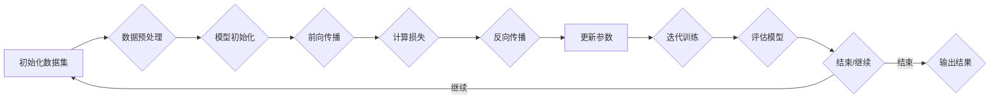
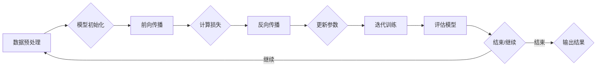

                 


## 文章标题：大模型应用的敏捷文档管理

### 文章关键词：
- 大模型
- 敏捷文档管理
- 文档生成与自动化
- 版本控制
- 协作工具
- 文档安全与合规性

### 摘要：
本文探讨了在大模型时代背景下，敏捷文档管理的重要性及其应用实践。文章首先介绍了大模型的基础知识，包括其定义、特点和应用领域，随后深入探讨了敏捷文档管理的原理和方法。文章重点讲述了文档生成与自动化、版本控制与协作工具、文档安全与合规性的关键技术和实践。最后，通过实战案例展示了敏捷文档管理在大模型应用中的实际效果和挑战，并提出了未来发展的展望。

## 引言

### 1.1 书籍背景与目的

随着人工智能技术的飞速发展，大模型（Large Models）在自然语言处理、图像识别、推荐系统等众多领域取得了显著的成果。大模型不仅具有强大的数据分析和处理能力，还能通过深度学习实现自我优化，为各行各业带来了新的可能性和挑战。在这个大模型时代，如何高效地管理和利用这些庞大的知识库成为了一个重要议题。

敏捷文档管理（Agile Documentation Management）作为一种新兴的管理理念，强调快速响应变化、持续改进和高效协作。它在大模型应用中扮演着关键角色，能够帮助团队快速构建、更新和维护文档，确保知识共享和传递的准确性。本文旨在探讨大模型应用的敏捷文档管理，通过分析其核心概念、原理和实战案例，为读者提供一套实用的解决方案。

### 1.2 大模型与敏捷文档管理的关系

大模型和敏捷文档管理之间存在着紧密的联系。首先，大模型的复杂性使得文档管理变得尤为重要。大模型涉及大量的数据和参数，如果没有完善的文档来描述其结构、原理和应用，将难以保证其可维护性和可扩展性。其次，敏捷文档管理能够为大模型的研究和应用提供快速、高效的文档支持。通过敏捷文档管理，研究团队可以快速记录实验结果、模型参数和优化策略，便于后续的分析和改进。

此外，大模型的应用场景通常涉及多个团队和部门之间的协作。敏捷文档管理强调团队协作和用户反馈，能够促进不同团队之间的信息共享和沟通，降低沟通成本，提高工作效率。因此，在大模型应用中，敏捷文档管理不仅是一种技术手段，更是一种管理理念，能够推动团队共同进步。

### 1.3 读者对象与预期收益

本文适用于以下读者群体：
- 人工智能研究者和工程师：了解大模型的文档管理方法，提高研究效率和成果质量。
- 项目经理和团队成员：掌握敏捷文档管理的实践，提升团队协作能力。
- 技术文档编写人员：学习如何使用敏捷文档管理工具，提高文档质量和可读性。

通过阅读本文，读者可以：
- 掌握大模型的基础知识和应用场景。
- 理解敏捷文档管理的原理和方法。
- 学习文档生成与自动化、版本控制与协作工具的技术细节。
- 获得实战案例的启示，提升实际操作能力。

## 大模型基础

### 2.1 大模型的定义与特点

大模型通常指的是参数规模达到百万甚至亿级的神经网络模型。这类模型具有以下特点：
- **参数规模大**：大模型的参数数量通常在百万到亿级别，这使得模型具有更强的表示能力和计算能力。
- **数据需求高**：大模型的训练需要大量的数据，以便模型能够捕捉数据中的复杂模式和规律。
- **计算资源消耗大**：大模型训练和推理需要大量的计算资源，特别是显存和CPU/GPU资源。

### 2.2 大模型的应用领域

大模型在多个领域取得了显著的成果，以下是其中几个主要应用领域：
- **自然语言处理**：大模型在文本分类、机器翻译、情感分析等任务中取得了突破性进展。
- **计算机视觉**：大模型在图像分类、目标检测、图像生成等任务中具有强大的能力。
- **推荐系统**：大模型通过深度学习技术实现了更精准的推荐效果，广泛应用于电子商务和社交媒体。
- **语音识别**：大模型在语音识别和语音生成任务中表现出色，使得智能语音助手成为现实。

### 2.3 大模型的训练与优化

大模型的训练通常分为以下几个步骤：
1. **数据预处理**：对输入数据进行清洗、归一化和编码，以便模型能够有效学习。
2. **模型初始化**：选择合适的初始化方法，为模型参数赋初值。
3. **前向传播**：将输入数据传递到模型中，计算输出结果。
4. **反向传播**：计算损失函数，并利用梯度下降算法更新模型参数。
5. **迭代训练**：重复上述过程，直至满足停止条件（如收敛阈值或迭代次数）。

在训练过程中，常用的优化方法包括：
- **批量梯度下降**（Batch Gradient Descent，BGD）：每次迭代使用全部数据计算梯度。
- **随机梯度下降**（Stochastic Gradient Descent，SGD）：每次迭代随机选择一部分数据计算梯度。
- **小批量梯度下降**（Mini-batch Gradient Descent）：每次迭代使用一部分数据计算梯度，介于BGD和SGD之间。

### 2.4 Mermaid流程图：大模型的工作流程

以下是使用Mermaid绘制的简化的**大模型工作流程**：



这个流程图展示了大模型训练的基本步骤，从数据预处理、模型初始化到前向传播、反向传播和迭代训练，最后进行模型评估和输出结果。

## 敏捷文档管理原理

### 3.1 敏捷文档管理的原则

敏捷文档管理基于一系列核心原则，旨在提高文档的质量、可读性和维护性。以下是敏捷文档管理的主要原则：

1. **迭代性**：敏捷文档管理强调文档的迭代更新，根据项目需求的变化及时调整文档内容。
2. **可读性**：文档应以清晰、简洁、易懂的方式呈现，避免使用过于复杂的术语和表述。
3. **一致性**：文档中的术语、符号和格式应保持一致，以便读者能够快速理解和查阅。
4. **可追溯性**：文档应记录修改历史，便于追溯和审查。
5. **协作性**：文档管理应鼓励团队成员之间的协作和反馈，提高文档的完整性和准确性。
6. **自动化**：利用工具实现文档的自动化生成和更新，减少人工工作量。

### 3.2 敏捷文档管理的方法

敏捷文档管理采用了一系列方法和技术，以提高文档的质量和效率。以下是几种常用的敏捷文档管理方法：

1. **版本控制**：使用版本控制系统（如Git）管理文档的版本，确保文档的完整性和可追溯性。
2. **文档模板**：使用统一的文档模板，规范文档的结构和内容，提高文档的可读性和一致性。
3. **自动化工具**：使用自动化工具（如Markdown、LaTeX）生成和更新文档，提高文档的生产效率。
4. **用户反馈**：收集用户反馈，根据用户需求调整文档内容，提高文档的实用性和满意度。
5. **协作平台**：使用协作平台（如Confluence、GitLab）进行文档共享和协作，提高团队成员的沟通效率。

### 3.3 敏捷文档管理的工具

敏捷文档管理需要使用一系列工具来支持文档的生成、存储、协作和版本控制。以下是几种常用的敏捷文档管理工具：

1. **版本控制工具**：如Git、SVN，用于管理文档的版本和变更。
2. **文档生成工具**：如Markdown、LaTeX，用于编写和格式化文档。
3. **协作平台**：如Confluence、GitLab，用于共享和协作文档。
4. **自动化工具**：如Jenkins、GitLab CI，用于自动化文档生成和部署。
5. **文档库**：如Google Drive、OneDrive，用于存储和共享文档。

## 文档生成与自动化

### 4.1 文档生成技术

文档生成技术是指通过编程或自动化工具生成文档的方法。以下是一些常见的文档生成技术：

1. **模板引擎**：如Jinja2、Mustache，用于根据模板生成HTML、Markdown等格式的文档。
2. **文本处理库**：如Python的re、BeautifulSoup，用于处理和生成文本内容。
3. **LaTeX**：一种高质量的文档排版系统，适用于生成科学论文、报告等复杂文档。
4. **Markdown**：一种轻量级标记语言，广泛用于编写和格式化文档。

### 4.2 自动化文档流程

自动化文档流程是指通过工具和脚本自动化生成、更新和部署文档的过程。以下是一个简化的自动化文档流程：

1. **数据采集**：从数据库、API或其他数据源中获取所需数据。
2. **数据处理**：对采集到的数据进行处理、清洗和格式化。
3. **模板渲染**：使用模板引擎将处理后的数据渲染成文档内容。
4. **文档生成**：将渲染后的文档内容保存为HTML、PDF或其他格式。
5. **文档部署**：将生成的文档部署到服务器或共享平台，供用户访问。

### 4.3 伪代码：自动化文档生成的算法

以下是使用Python伪代码描述的一个自动化文档生成算法：

```python
import template_engine

def generate_document(data):
    # 步骤1：数据采集
    data = fetch_data()

    # 步骤2：数据处理
    processed_data = preprocess_data(data)

    # 步骤3：模板渲染
    template = template_engine.load_template("template.md")
    rendered_content = template.render(processed_data)

    # 步骤4：文档生成
    document = rendered_content.save_as("output.md")

    # 步骤5：文档部署
    deploy_document(document)

def fetch_data():
    # 实现数据采集逻辑
    pass

def preprocess_data(data):
    # 实现数据处理逻辑
    pass

def deploy_document(document):
    # 实现文档部署逻辑
    pass

# 调用函数生成文档
generate_document()
```

在这个算法中，`fetch_data()` 用于采集数据，`preprocess_data(data)` 用于处理数据，`template_engine.load_template("template.md")` 用于加载模板，`template.render(processed_data)` 用于渲染文档内容，`save_as("output.md")` 用于保存文档，`deploy_document(document)` 用于部署文档。

## 版本控制与协作工具

### 5.1 版本控制的概念与原理

版本控制是一种管理文档版本和变更的方法，通过跟踪文档的历史记录，确保文档的完整性和一致性。以下是版本控制的主要概念和原理：

1. **版本**：文档的不同版本，每个版本都对应一组特定的更改。
2. **提交**：对文档的更改，包括新增、修改和删除内容。
3. **分支**：文档的副本，用于并行开发或实验。
4. **合并**：将两个或多个分支的更改合并为一个版本。
5. **日志**：记录文档修改历史的日志文件。

版本控制的基本原理是通过对文档的每个更改进行记录，确保每次提交都是可追踪的。当出现冲突或问题时，可以通过查看历史记录找到原因并解决问题。

### 5.2 常见的版本控制工具

以下是一些常见的版本控制工具：

1. **Git**：最流行的分布式版本控制系统，支持分支和合并操作。
2. **SVN**：集中式版本控制系统，适用于小规模团队。
3. **Mercurial**：另一种分布式版本控制系统，与Git类似。
4. **Confluence**：基于Wiki的协作平台，可用于版本控制文档。
5. **GitLab**：基于Git的开源协作平台，包含版本控制、项目管理等功能。

### 5.3 敏捷文档协作工具

敏捷文档协作工具旨在提高团队协作效率，支持实时编辑、评论和协作。以下是一些常见的敏捷文档协作工具：

1. **Confluence**：Atlassian开发的协作平台，支持版本控制和实时编辑。
2. **Notion**：多功能的协作平台，支持数据库、看板和笔记等功能。
3. **Notepad++**：跨平台的文本编辑器，支持Markdown和LaTeX格式。
4. **Visual Studio Code**：微软开发的跨平台集成开发环境，支持多种编程语言和插件。
5. **Google Docs**：Google提供的在线文档编辑工具，支持多人实时协作。

## 文档安全与合规性

### 6.1 文档安全的重要性

文档安全是敏捷文档管理的重要组成部分，确保文档在生成、存储、传输和使用过程中的机密性、完整性和可用性。以下是一些关键点：

1. **机密性**：防止未经授权的访问和泄露敏感信息。
2. **完整性**：确保文档未被篡改或损坏。
3. **可用性**：确保文档随时可供使用，不受网络或硬件故障的影响。

文档安全的重要性在于：
- **保护知识产权**：确保团队的研究成果和创意不受侵犯。
- **合规性**：满足法律法规和行业规范，避免法律风险。
- **业务连续性**：确保文档在紧急情况下能够恢复和访问。

### 6.2 文档安全策略

以下是一些常见的文档安全策略：

1. **访问控制**：使用用户权限和密码保护文档，确保只有授权用户可以访问。
2. **数据加密**：对存储和传输的文档进行加密，防止数据泄露。
3. **备份和恢复**：定期备份文档，确保在数据丢失或损坏时能够恢复。
4. **监控和审计**：监控文档访问和使用情况，记录和审查操作日志。
5. **培训和教育**：对团队成员进行安全意识培训，提高安全意识和防范能力。

### 6.3 文档合规性要求

文档合规性要求遵循以下原则：

1. **数据保护法规**：如GDPR、CCPA等，确保个人数据的安全和隐私。
2. **行业规范**：如ISO 27001、NIST等，确保文档管理符合行业标准。
3. **合同和合作协议**：明确文档的使用范围、权限和责任，确保合作伙伴遵守协议。
4. **知识产权保护**：确保文档中的知识产权得到保护，避免侵权和盗用。

## 用户反馈与迭代

### 7.1 用户反馈机制

用户反馈机制是敏捷文档管理的重要组成部分，有助于改进文档质量，提高用户满意度。以下是一些用户反馈机制的关键点：

1. **反馈渠道**：提供多种反馈渠道，如在线评论、问卷调查、意见箱等，方便用户表达意见和建议。
2. **反馈收集**：定期收集和分析用户反馈，识别常见问题和改进机会。
3. **反馈响应**：及时回复用户反馈，对问题进行优先级排序，并采取相应措施进行改进。
4. **反馈记录**：将用户反馈记录在文档中，便于后续跟踪和审计。

### 7.2 反馈数据的处理与利用

反馈数据的处理和利用包括以下步骤：

1. **数据清洗**：去除无效或重复的反馈，确保数据质量。
2. **数据分析**：使用统计分析方法，识别反馈的关键点和趋势。
3. **数据可视化**：使用图表和图形展示反馈数据，便于团队理解和分析。
4. **数据利用**：将分析结果用于改进文档内容、结构和格式，提高文档的可读性和实用性。

### 7.3 迭代流程与实践

迭代流程是敏捷文档管理的重要组成部分，通过不断迭代和改进，提高文档的质量和满意度。以下是一个简化的迭代流程：

1. **规划**：确定迭代目标和范围，制定迭代计划。
2. **执行**：根据计划进行文档更新和改进，如修改内容、优化结构等。
3. **评审**：组织评审会议，邀请用户和其他团队成员参与，对文档进行评估和反馈。
4. **改进**：根据评审结果，对文档进行进一步改进和优化。
5. **发布**：将改进后的文档发布到共享平台，供用户使用。

### 实战案例

#### 8.1 案例背景

某知名互联网公司在其人工智能项目中采用敏捷文档管理方法，以提高文档质量和团队协作效率。项目团队由多学科专家组成，包括数据科学家、AI工程师、产品经理和文档编写人员。项目涉及大规模神经网络模型的训练和应用，文档管理成为项目成功的关键。

#### 8.2 案例实施步骤

1. **需求分析**：团队分析了项目需求，确定了文档管理的关键环节，如数据采集、模型训练、实验结果记录和模型应用等。

2. **工具选择**：团队选择了Git作为版本控制工具，Confluence作为协作平台，Markdown作为文档格式，以支持敏捷文档管理。

3. **文档模板**：团队制定了统一的文档模板，包括文档结构、术语和格式规范，确保文档的一致性和可读性。

4. **自动化脚本**：团队编写了自动化脚本，用于数据采集、处理和文档生成，提高了文档生成效率。

5. **用户反馈**：团队设置了反馈渠道，收集用户意见和建议，定期进行评审和改进。

6. **迭代更新**：团队根据用户反馈和项目进展，持续更新和优化文档，确保文档与项目同步。

#### 8.3 案例效果分析

1. **文档质量提高**：通过使用统一的文档模板和自动化脚本，文档的一致性和可读性得到了显著提升。

2. **协作效率提升**：Git和Confluence的使用使得团队成员能够实时协作和共享文档，减少了沟通成本和误解。

3. **用户满意度提高**：用户反馈机制和迭代流程的引入，使文档更加贴近用户需求，用户满意度显著提高。

4. **项目进展加快**：敏捷文档管理使得文档更新和发布更加迅速，项目团队能够更快地响应变化和解决问题。

#### 8.4 案例总结与启示

1. **敏捷文档管理的重要性**：敏捷文档管理能够显著提高文档质量和团队协作效率，是项目成功的关键。

2. **工具选择与培训**：选择合适的文档管理工具，并对团队成员进行培训，是成功实施敏捷文档管理的基础。

3. **用户反馈与迭代**：用户反馈和迭代流程是敏捷文档管理的核心，能够持续改进文档质量。

4. **团队协作与沟通**：团队协作和沟通是敏捷文档管理的重要保障，确保文档更新和发布的顺利进行。

## 结论

### 9.1 大模型敏捷文档管理的趋势

随着大模型技术的不断发展和应用，敏捷文档管理在大模型领域的重要性日益凸显。以下是几个关键趋势：

1. **自动化与智能化**：自动化工具和智能化算法将在文档生成、更新和管理中发挥更大作用，提高文档生成效率和准确性。
2. **多学科融合**：大模型应用涉及多个学科领域，敏捷文档管理需要跨学科合作，促进知识共享和传递。
3. **个性化与定制化**：根据不同用户和项目的需求，提供个性化定制化的文档管理方案，提高用户体验。
4. **合规性与安全性**：随着数据隐私和安全问题的日益重视，合规性和安全性将成为敏捷文档管理的重要关注点。

### 9.2 未来展望与挑战

尽管敏捷文档管理在大模型应用中取得了显著成效，但仍面临以下挑战：

1. **技术挑战**：如何进一步优化自动化工具和算法，提高文档生成质量和效率。
2. **管理挑战**：如何在多学科团队中协调和管理文档，确保文档的一致性和准确性。
3. **合规性挑战**：如何确保文档管理符合数据隐私和安全法规，避免法律风险。
4. **用户体验**：如何提供更好的用户反馈机制，提高用户体验。

未来，随着技术的不断进步，敏捷文档管理在大模型应用中将继续发挥重要作用，为项目成功提供有力支持。同时，针对挑战，我们需要不断创新和改进，推动敏捷文档管理的发展。

### 作者信息

作者：AI天才研究院/AI Genius Institute & 禅与计算机程序设计艺术 /Zen And The Art of Computer Programming

本文由AI天才研究院（AI Genius Institute）和禅与计算机程序设计艺术（Zen And The Art of Computer Programming）联合撰写，旨在探讨大模型应用的敏捷文档管理，为读者提供实用的解决方案和深刻见解。

## 附录

### 1. Mermaid流程图示例

以下是使用Mermaid绘制的**大模型工作流程**的示例：



### 2. 伪代码示例

以下是使用Python伪代码描述的**自动化文档生成算法**：

```python
import template_engine

def generate_document(data):
    # 步骤1：数据采集
    data = fetch_data()

    # 步骤2：数据处理
    processed_data = preprocess_data(data)

    # 步骤3：模板渲染
    template = template_engine.load_template("template.md")
    rendered_content = template.render(processed_data)

    # 步骤4：文档生成
    document = rendered_content.save_as("output.md")

    # 步骤5：文档部署
    deploy_document(document)

def fetch_data():
    # 实现数据采集逻辑
    pass

def preprocess_data(data):
    # 实现数据处理逻辑
    pass

def deploy_document(document):
    # 实现文档部署逻辑
    pass

# 调用函数生成文档
generate_document()
```

### 3. LaTeX公式示例

以下是使用LaTeX格式嵌入的数学公式示例：

$$
\begin{align*}
    f(x) &= (x-a)^2 + b \\
    &= x^2 - 2ax + a^2 + b
\end{align*}
$$

$$
f(x) = x^2 - 2ax + a^2 + b
$$

本文通过详细的背景介绍、核心概念解析、算法原理讲解、实战案例展示等环节，深入探讨了敏捷文档管理在大模型应用中的重要性和实践方法。希望本文能为读者提供有价值的参考和启示。如果您有任何疑问或建议，欢迎留言讨论。再次感谢您的阅读。

