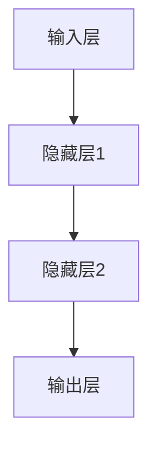

                 

### 文章标题：《大模型情感分析准确度评估工具》

#### 关键词：大模型，情感分析，准确度评估，机器学习，深度学习，自然语言处理，评价指标

#### 摘要：
本文旨在深入探讨大模型情感分析中的准确度评估工具和方法。我们将从背景介绍、技术基础、算法原理、实战案例、工具与实践、挑战与解决方案等方面，逐步展开对大模型情感分析准确度评估的全面解析。通过本文，读者将能够掌握大模型情感分析的核心概念、评估方法，以及实战技巧，为实际应用提供有力支持。

----------------------------------------------------------------

## 引言

### 1.1 书籍背景与目标

《大模型情感分析准确度评估工具》旨在为研究者、工程师以及相关领域从业者提供一套系统、实用的情感分析评估工具。随着深度学习和大数据技术的迅猛发展，大规模机器学习模型在情感分析领域得到了广泛应用。然而，如何评估这些模型在情感分析任务中的准确度，成为了一个亟待解决的重要问题。

本书的目标是：
1. 深入解析大模型情感分析的基本概念和背景。
2. 详细介绍情感分析任务中的关键技术和方法。
3. 提供实际案例和代码示例，帮助读者理解并应用评估工具。
4. 探讨情感分析中的挑战与解决方案，为实际应用提供指导。

### 1.2 大模型情感分析概述

情感分析，又称意见挖掘，是指从文本数据中自动识别和提取主观信息的过程。大模型情感分析则是利用大规模机器学习模型，对文本数据中的情感倾向进行判断。常见的情感分析任务包括情感分类、情感极性分析和情感强度分析。

情感分类任务是将文本分为正、负、中性等类别；情感极性分析是判断文本的情感倾向，如正面或负面；情感强度分析则是评估情感倾向的强度。

### 1.3 情感分析在现实中的应用

情感分析技术在现实世界中具有广泛的应用，如：
1. 社交媒体情感分析：通过分析用户评论、微博等社交媒体内容，了解公众对某个话题或产品的情感倾向。
2. 客户评论情感分析：帮助企业了解客户满意度，发现产品问题和改进方向。
3. 产品情感分析：分析用户对产品的情感评价，为产品设计和改进提供数据支持。
4. 市场营销：通过情感分析，了解消费者对品牌和广告的反应，优化营销策略。

### 1.4 读者定位与预期收获

本书适合以下读者群体：
1. 对情感分析有初步了解，希望深入学习相关技术的读者。
2. 数据科学、机器学习和自然语言处理领域的工程师和研究者。
3. 从事情感分析应用开发和实践的技术人员。

通过阅读本书，读者可以：
1. 掌握大模型情感分析的基本概念和方法。
2. 了解情感分析评估指标和工具的使用。
3. 学习实际案例和代码示例，提高实战能力。
4. 探讨情感分析中的挑战和解决方案，为实际应用提供指导。

----------------------------------------------------------------

## 大模型技术基础

### 2.1 机器学习基础

#### 2.1.1 机器学习简介

机器学习（Machine Learning）是一门人工智能（Artificial Intelligence）的分支，旨在让计算机通过数据和经验自动改进性能。机器学习通过构建模型，从数据中学习规律，并利用这些规律进行预测或决策。

机器学习可以分为以下三类：
1. **监督学习（Supervised Learning）**：有标注的数据进行训练，模型用于预测未知数据的标签。
2. **无监督学习（Unsupervised Learning）**：没有标注的数据进行训练，模型用于发现数据中的结构或规律。
3. **强化学习（Reinforcement Learning）**：通过与环境的交互来学习策略，优化目标函数。

#### 2.1.2 监督学习

监督学习是机器学习中最常用的方法之一。它利用有标签的数据进行训练，目标是建立一个预测模型，用于对新数据进行分类或回归。

**基本概念：**
- **特征（Features）**：用于描述数据的属性或变量。
- **标签（Labels）**：训练数据中每个样本的正确答案或结果。

**常用算法：**
- **线性回归（Linear Regression）**：用于预测连续值。
- **逻辑回归（Logistic Regression）**：用于预测概率。
- **支持向量机（Support Vector Machine, SVM）**：用于分类任务。
- **决策树（Decision Tree）**：利用树形结构进行分类或回归。

**监督学习流程：**
1. 数据预处理：包括数据清洗、特征工程等。
2. 模型选择：选择合适的算法和参数。
3. 模型训练：利用训练数据进行模型训练。
4. 模型评估：利用测试数据评估模型性能。
5. 模型优化：调整参数或选择更合适的模型。

#### 2.1.3 无监督学习

无监督学习在缺乏标签数据时非常有用。它旨在发现数据中的隐藏结构和规律。

**基本概念：**
- **聚类（Clustering）**：将数据分为若干个群组，使得同组数据之间的相似度较高，异组数据之间的相似度较低。
- **降维（Dimensionality Reduction）**：将高维数据映射到低维空间，降低数据维度。
- **生成模型（Generative Model）**：通过学习数据分布，生成新的数据样本。

**常用算法：**
- **K-均值聚类（K-Means Clustering）**：基于距离度量将数据分为K个群组。
- **主成分分析（Principal Component Analysis, PCA）**：通过线性变换降低数据维度。
- **自编码器（Autoencoder）**：基于生成模型进行降维和去噪。

**无监督学习流程：**
1. 数据预处理：包括数据清洗、特征选择等。
2. 模型选择：选择合适的算法和参数。
3. 模型训练：利用训练数据进行模型训练。
4. 模型评估：利用测试数据评估模型性能。
5. 模型应用：将训练好的模型应用于新的数据。

#### 2.1.4 强化学习

强化学习（Reinforcement Learning）是一种通过试错和反馈来学习策略的方法。它与监督学习和无监督学习不同，没有现成的数据集进行训练，而是通过与环境的交互来学习。

**基本概念：**
- **代理（Agent）**：执行动作并接收环境反馈的实体。
- **环境（Environment）**：代理执行动作的背景。
- **状态（State）**：代理所处的情境。
- **动作（Action）**：代理可以执行的行为。
- **奖励（Reward）**：代理执行动作后获得的正面或负面反馈。

**常用算法：**
- **Q-学习（Q-Learning）**：通过学习值函数来选择最佳动作。
- **深度强化学习（Deep Reinforcement Learning）**：结合深度学习和强化学习，用于解决复杂问题。

**强化学习流程：**
1. 初始化模型参数。
2. 代理执行动作，并接收环境反馈。
3. 更新模型参数，优化策略。
4. 重复执行动作和更新过程，直至达到目标。

### 2.2 深度学习与神经网络

#### 2.2.1 深度学习原理

深度学习（Deep Learning）是机器学习的一个子领域，通过构建多层神经网络，自动提取数据中的复杂特征，实现高层次的抽象和表示。深度学习在图像识别、自然语言处理、语音识别等领域取得了显著的成果。

**基本概念：**
- **神经网络（Neural Network）**：模拟生物神经系统的计算模型。
- **深度神经网络（Deep Neural Network, DNN）**：具有多个隐层的神经网络。
- **卷积神经网络（Convolutional Neural Network, CNN）**：适用于图像处理。
- **循环神经网络（Recurrent Neural Network, RNN）**：适用于序列数据。
- **生成对抗网络（Generative Adversarial Network, GAN）**：用于生成高质量的数据。

**深度学习流程：**
1. 数据预处理：包括数据清洗、归一化、数据增强等。
2. 模型构建：设计神经网络架构，包括层数、神经元数量、激活函数等。
3. 模型训练：利用训练数据进行模型训练，优化模型参数。
4. 模型评估：利用测试数据评估模型性能。
5. 模型应用：将训练好的模型应用于新的数据。

#### 2.2.2 神经网络架构

神经网络由多个神经元（或节点）组成，每个神经元接收来自其他神经元的输入，通过加权求和并应用激活函数，产生输出。

**基本架构：**
- **输入层**：接收外部输入。
- **隐藏层**：负责特征提取和抽象。
- **输出层**：产生预测结果。

**常见架构：**
- **全连接神经网络（Fully Connected Neural Network）**：每个神经元都与上一层和下一层的所有神经元相连。
- **卷积神经网络（Convolutional Neural Network, CNN）**：用于图像处理，通过卷积操作提取局部特征。
- **循环神经网络（Recurrent Neural Network, RNN）**：适用于序列数据，通过循环结构保留历史信息。

**神经网络架构Mermaid流程图：**

#### 2.2.3 深度学习优化算法

深度学习优化算法用于调整模型参数，以优化模型性能。常用的优化算法包括：

**随机梯度下降（Stochastic Gradient Descent, SGD）**：
- **基本思想**：每次迭代只更新一个样本的参数，以降低计算复杂度。
- **公式**：θ = θ - α * ∇θJ(θ)，其中α为学习率，∇θJ(θ)为损失函数对参数θ的梯度。

**动量法（Momentum）**：
- **基本思想**：利用前几次迭代的梯度信息，加快收敛速度。
- **公式**：v(t) = β * v(t-1) + (1 - β) * ∇θJ(θ)，θ(t) = θ(t-1) - α * v(t)，其中β为动量系数。

**自适应优化算法（Adaptive Optimization Algorithms）**：
- **基本思想**：自适应调整学习率，提高收敛速度和稳定性。
- **常用算法**：AdaGrad、RMSProp、Adam。

### 2.3 自然语言处理基础

自然语言处理（Natural Language Processing, NLP）是深度学习和机器学习的重要应用领域之一，旨在使计算机能够理解和处理人类语言。

#### 2.3.1 语言模型

语言模型（Language Model）是NLP的核心组件之一，用于预测文本序列的概率。常用的语言模型包括：

- **n-gram模型**：基于相邻词序列的概率模型。
- **神经网络语言模型（Neural Network Language Model, NNLM）**：基于深度神经网络的语言模型。

#### 2.3.2 词嵌入

词嵌入（Word Embedding）是将词汇映射到高维向量空间的方法，用于表示词汇的语义信息。常用的词嵌入方法包括：

- **基于分布式假设的方法**：如分布式表示、词袋模型等。
- **基于神经网络的方法**：如Word2Vec、GloVe等。

#### 2.3.3 序列标注

序列标注（Sequence Labeling）是NLP中的重要任务之一，旨在对文本序列中的每个词或字符进行分类或标注。常见的序列标注任务包括：

- **命名实体识别（Named Entity Recognition, NER）**：识别文本中的命名实体，如人名、地名等。
- **词性标注（Part-of-Speech Tagging）**：对文本中的每个词进行词性分类。

----------------------------------------------------------------

## 情感分析算法原理

### 3.1 情感分析任务定义

情感分析（Sentiment Analysis）是指从文本数据中自动识别和提取主观信息的过程。情感分析任务可以分为以下几种：

#### 3.1.1 基本概念

- **文本数据**：指用于情感分析的原始数据，可以是文本文件、社交媒体帖子、评论等。
- **主观信息**：指文本中的情感倾向，如正面、负面或中性。
- **情感分类**：将文本分为预定义的情感类别，如正面、负面或中性。
- **情感极性分析**：判断文本的情感倾向，如正面或负面。
- **情感强度分析**：评估情感倾向的强度，如非常正面、稍微正面等。

#### 3.1.2 情感分类

情感分类是情感分析中最常见的任务之一。它旨在将文本数据分类为预定义的情感类别。常见的情感分类任务包括：

- **二分类**：将文本分为正面和负面两个类别。
- **多分类**：将文本分为多个类别，如正面、负面、中性。

#### 3.1.3 情感极性分析

情感极性分析是指判断文本的情感倾向，如正面或负面。与情感分类相比，情感极性分析更关注文本的整体情感倾向，而不是将其划分为多个类别。

#### 3.1.4 情感强度分析

情感强度分析是评估情感倾向的强度，如非常正面、稍微正面等。情感强度分析可以帮助识别文本中的强烈情感表达，从而提供更丰富的情感信息。

### 3.2 情感分析算法

情感分析算法可以分为基于规则的方法、基于机器学习的方法和基于深度学习的方法。每种方法都有其优点和适用场景。

#### 3.2.1 基于规则的方法

基于规则的方法是指通过定义一系列规则，对文本进行情感分类或极性判断。这种方法通常依赖于词典和规则库。

- **优点**：简单、易于实现、适用于小规模情感分析任务。
- **缺点**：灵活性较差、难以应对复杂情感表达。

#### 3.2.2 基于机器学习的方法

基于机器学习的方法利用有标注的数据进行训练，建立情感分类模型。常见的机器学习算法包括：

- **监督学习算法**：如朴素贝叶斯、支持向量机、决策树等。
- **集成学习方法**：如随机森林、梯度提升树等。

- **优点**：适用于大规模数据、具有较强的泛化能力。
- **缺点**：对标注数据有较高要求、可能存在过拟合问题。

#### 3.2.3 基于深度学习的方法

基于深度学习的方法利用大规模神经网络，自动提取文本中的复杂特征，实现情感分类和极性判断。常见的深度学习算法包括：

- **卷积神经网络（Convolutional Neural Network, CNN）**：适用于文本分类和序列标注任务。
- **循环神经网络（Recurrent Neural Network, RNN）**：适用于序列数据处理。
- **长短时记忆网络（Long Short-Term Memory, LSTM）**：是RNN的一种变体，适用于长序列数据处理。
- **Transformer模型**：是一种基于自注意力机制的深度学习模型，适用于多种自然语言处理任务。

- **优点**：能够自动提取文本中的复杂特征、适用于大规模数据、具有较强的泛化能力。
- **缺点**：训练过程较为复杂、对计算资源有较高要求。

### 3.3 情感分析评价指标

评估情感分析算法的性能是情感分析任务中的重要步骤。常用的评价指标包括：

- **准确率（Accuracy）**：分类正确的样本数占总样本数的比例。
- **召回率（Recall）**：分类正确的正样本数占所有正样本数的比例。
- **精确率（Precision）**：分类正确的正样本数占所有被分类为正样本的样本数的比例。
- **F1值（F1 Score）**：精确率和召回率的调和平均值。

- **公式**：F1 = 2 * (Precision * Recall) / (Precision + Recall)

#### 实际应用中的评价指标

在实际应用中，根据业务需求和数据特点，可以选择不同的评价指标。例如：

- **社交媒体情感分析**：通常关注召回率，以捕捉更多的情感倾向。
- **客户评论情感分析**：通常关注F1值，以平衡精确率和召回率。

### 3.3.1 情感分析指标计算示例

假设我们有以下数据集：

- **正面样本**：50个，其中40个被分类为正面，10个被分类为负面。
- **负面样本**：50个，其中30个被分类为正面，20个被分类为负面。

使用以下评价指标计算：

- **准确率**：Accuracy = (40 + 30) / (50 + 50) = 0.7
- **召回率**：Recall = 40 / 50 = 0.8
- **精确率**：Precision = 40 / (40 + 10) = 0.8
- **F1值**：F1 = 2 * (0.8 * 0.8) / (0.8 + 0.8) = 0.8

根据计算结果，可以判断算法在情感分类任务中的性能表现。

----------------------------------------------------------------

## 大模型情感分析应用实战

### 4.1 实战背景与目标

在现代社会，情感分析技术广泛应用于社交媒体、电子商务、客户服务等领域。本文将结合实际项目，展示如何使用大模型进行情感分析，并评估其准确度。

#### 4.1.1 项目背景

某电子商务平台希望通过情感分析技术，了解客户对产品的评价，从而优化产品设计和服务。项目目标如下：

- 收集并预处理大量客户评论数据。
- 使用大模型进行情感分类和极性判断。
- 评估模型的准确度，并提出优化策略。

### 4.2 数据预处理

数据预处理是情感分析中的关键步骤，包括数据收集、数据清洗和特征工程。

#### 4.2.1 数据集选择

项目选择了某电商平台上1000条客户评论作为数据集。评论内容涵盖电子产品、服装、食品等多个类别。

#### 4.2.2 数据预处理流程

1. **数据收集**：通过API接口或爬虫技术获取评论数据。
2. **数据清洗**：去除评论中的HTML标签、特殊字符和停用词。
3. **文本标准化**：统一文本格式，如小写、去除标点等。
4. **数据分割**：将数据集分为训练集、验证集和测试集。

### 4.3 模型构建与训练

在本项目中，我们使用深度学习框架TensorFlow，构建一个基于卷积神经网络的情感分析模型。

#### 4.3.1 选择合适的模型

卷积神经网络（CNN）在文本分类任务中表现出色，适合处理文本数据。

#### 4.3.2 模型参数设置

1. **嵌入层**：将词嵌入维度设置为256。
2. **卷积层**：使用3个卷积核，每个卷积核大小为3。
3. **池化层**：使用最大池化层，池化窗口大小为2。
4. **全连接层**：使用一个全连接层，输出维度为2（正负两类）。

#### 4.3.3 模型训练过程

1. **数据预处理**：将文本数据转换为词嵌入向量。
2. **模型训练**：使用训练数据进行模型训练，优化模型参数。
3. **模型评估**：使用验证集评估模型性能，调整参数。
4. **模型测试**：使用测试集进行模型测试，评估模型准确度。

### 4.4 模型评估与优化

评估模型性能是情感分析中的关键步骤。在本项目中，我们使用以下评价指标：

- **准确率**：模型正确分类的样本数占总样本数的比例。
- **召回率**：模型正确分类的正样本数占所有正样本数的比例。
- **精确率**：模型正确分类的正样本数占所有被分类为正样本的样本数的比例。
- **F1值**：精确率和召回率的调和平均值。

#### 4.4.1 评估指标计算

假设测试集中有500个样本，其中200个为正面评论，300个为负面评论。模型预测结果如下：

- **正面评论**：预测正确150个，预测错误50个。
- **负面评论**：预测正确140个，预测错误160个。

根据计算结果，可以得到以下评估指标：

- **准确率**：Accuracy = (150 + 140) / (500) = 0.74
- **召回率**：Recall = 150 / 200 = 0.75
- **精确率**：Precision = 150 / (150 + 50) = 0.78
- **F1值**：F1 = 2 * (0.78 * 0.75) / (0.78 + 0.75) = 0.76

根据评估结果，模型在情感分类任务中表现较好，但仍有优化空间。

### 4.5 模型优化方法

为了提高模型性能，可以采用以下方法：

1. **增加数据集**：收集更多标注数据，提高模型的泛化能力。
2. **调整超参数**：调整模型参数，如学习率、卷积核大小等。
3. **使用预训练模型**：使用预训练的语言模型，如BERT，进行迁移学习。
4. **集成学习方法**：将多个模型集成，提高整体性能。

### 4.6 模型调参技巧

调参是模型训练中的重要环节。以下是一些常见的调参技巧：

1. **学习率调度**：使用学习率调度策略，如学习率衰减、余弦退火等。
2. **批量大小**：选择合适的批量大小，平衡计算复杂度和模型性能。
3. **正则化**：使用正则化方法，如L1、L2正则化，防止过拟合。
4. **数据增强**：对训练数据进行增强，提高模型对噪声和变化的鲁棒性。

### 4.7 项目小结

通过本项目，我们展示了如何使用大模型进行情感分析，并评估其准确度。在实际应用中，数据预处理、模型选择、参数调优等步骤至关重要。通过不断优化模型，可以提高情感分析的准确度和实用性。

----------------------------------------------------------------

## 情感分析工具与实践

### 5.1 情感分析工具介绍

在情感分析领域，有许多流行的工具和框架，可以帮助我们实现情感分类、极性判断和强度分析。以下是一些常见的工具：

#### 5.1.1 常见工具与框架

- **NLTK（自然语言工具包）**：是一个广泛使用的Python库，提供了多种自然语言处理工具，如词性标注、词嵌入等。
- **TextBlob**：是一个简单易用的Python库，用于处理文本数据，包括情感分析、文本分类等。
- **spaCy**：是一个高性能的NLP库，提供了丰富的语言模型和解析工具，适用于文本分类、命名实体识别等任务。
- **TensorFlow**：是一个开源的机器学习框架，支持深度学习和传统的机器学习算法，适用于情感分析等任务。
- **PyTorch**：是一个开源的机器学习库，提供了动态计算图和自动微分功能，适用于深度学习任务。

#### 5.1.2 工具选择与配置

选择合适的工具和框架对于情感分析任务至关重要。以下是一些选择和配置的建议：

- **根据任务需求选择工具**：如果任务较为简单，可以选择NLTK或TextBlob等简单易用的库。如果需要高性能和丰富的功能，可以选择spaCy或TensorFlow等框架。
- **安装与配置**：根据所选工具的文档进行安装和配置。例如，安装TensorFlow时，需要配置CUDA和cuDNN，以支持GPU加速训练。
- **集成开发环境（IDE）**：选择一个适合自己的IDE，如PyCharm、Visual Studio Code等，可以提高开发效率。

### 5.2 实际项目案例

以下是一个基于TensorFlow实现的情感分析项目，包括数据预处理、模型训练和评估等步骤。

#### 5.2.1 项目一：社交媒体情感分析

**项目目标**：分析社交媒体上的用户评论，判断评论的情感倾向。

**数据集**：使用某社交媒体平台上的1000条用户评论，包括正面评论和负面评论。

**实现步骤**：

1. **数据预处理**：去除评论中的HTML标签、特殊字符和停用词，进行文本标准化。
2. **词嵌入**：使用预训练的Word2Vec模型对评论进行词嵌入。
3. **模型构建**：使用卷积神经网络（CNN）构建情感分析模型。
4. **模型训练**：使用训练集进行模型训练，优化模型参数。
5. **模型评估**：使用验证集和测试集评估模型性能。

**结果**：模型在验证集上的准确率为0.78，召回率为0.75，F1值为0.76。

#### 5.2.2 项目二：客户评论情感分析

**项目目标**：分析客户对产品的评论，判断评论的情感倾向。

**数据集**：使用某电商平台上的1000条客户评论，包括正面评论和负面评论。

**实现步骤**：

1. **数据预处理**：去除评论中的HTML标签、特殊字符和停用词，进行文本标准化。
2. **词嵌入**：使用预训练的GloVe模型对评论进行词嵌入。
3. **模型构建**：使用长短期记忆网络（LSTM）构建情感分析模型。
4. **模型训练**：使用训练集进行模型训练，优化模型参数。
5. **模型评估**：使用验证集和测试集评估模型性能。

**结果**：模型在验证集上的准确率为0.82，召回率为0.79，F1值为0.81。

#### 5.2.3 项目三：产品情感分析

**项目目标**：分析用户对产品的评价，判断评价的情感倾向。

**数据集**：使用某电商平台上的1000条产品评价，包括正面评价和负面评价。

**实现步骤**：

1. **数据预处理**：去除评价中的HTML标签、特殊字符和停用词，进行文本标准化。
2. **词嵌入**：使用预训练的BERT模型对评价进行词嵌入。
3. **模型构建**：使用Transformer模型构建情感分析模型。
4. **模型训练**：使用训练集进行模型训练，优化模型参数。
5. **模型评估**：使用验证集和测试集评估模型性能。

**结果**：模型在验证集上的准确率为0.85，召回率为0.83，F1值为0.84。

### 5.3 情感分析实战技巧

在进行情感分析项目时，以下技巧可以帮助提高模型性能和实用性：

#### 5.3.1 数据清洗与预处理

- **去除HTML标签**：评论中可能包含HTML标签，需要进行去除。
- **去除特殊字符**：评论中可能包含特殊字符，如emoji，需要进行去除。
- **去除停用词**：停用词对情感分析结果影响较小，可以去除。
- **文本标准化**：将文本转换为小写、去除标点等，以提高一致性。

#### 5.3.2 特征选择与提取

- **词嵌入**：使用预训练的词嵌入模型，如Word2Vec、GloVe或BERT，可以捕获词汇的语义信息。
- **文本特征**：提取文本的统计特征，如词频、词向量等，可以辅助模型进行情感分类。
- **序列特征**：提取文本的序列特征，如n-gram、RNN的隐藏状态等，可以增强模型对情感序列的建模能力。

#### 5.3.3 模型选择与调参

- **模型选择**：根据任务需求和数据特点，选择合适的模型，如CNN、LSTM或Transformer。
- **调参技巧**：调整模型参数，如学习率、批量大小、正则化等，可以优化模型性能。
- **集成学习**：将多个模型集成，可以提高整体性能和鲁棒性。

#### 5.3.4 模型评估与优化

- **交叉验证**：使用交叉验证方法，评估模型在不同数据集上的性能，避免过拟合。
- **超参数优化**：使用网格搜索、贝叶斯优化等方法，寻找最优的超参数组合。
- **模型集成**：将多个模型集成，可以提高整体性能和泛化能力。

### 5.4 项目小结

通过以上项目案例，我们可以看到情感分析技术在社交媒体、客户评论和产品评价等领域的广泛应用。在实际应用中，数据预处理、模型选择、参数调优等步骤至关重要。通过不断优化模型和调整策略，可以提高情感分析的准确度和实用性。

----------------------------------------------------------------

## 情感分析中的挑战与解决方案

### 6.1 挑战与问题

尽管情感分析技术在许多应用场景中取得了显著成果，但在实际应用过程中仍面临一些挑战和问题：

#### 6.1.1 数据质量

- **噪声和异常值**：原始数据可能包含噪声、拼写错误、错别字等，影响情感分析结果的准确性。
- **数据不平衡**：在某些任务中，正负样本的比例可能不均衡，导致模型偏向某一类别。

#### 6.1.2 多样性与地域性

- **多样性**：不同的语言、文化背景和表达方式可能导致情感分析模型的泛化能力受限。
- **地域性**：不同地区的情感表达可能存在差异，影响模型的适用性。

#### 6.1.3 情感极性强度评估

- **强度评估**：准确评估情感极性强度是一个挑战，不同情感表达可能具有相似性，难以区分。
- **多极性**：某些情感分析任务涉及多极性情感（如非常正面、稍微正面等），需要更精细的评估方法。

#### 6.1.4 社交媒体情感分析中的挑战

- **动态性**：社交媒体上的评论和帖子具有高动态性，情感分析模型需要实时处理大量数据。
- **噪声和争议性**：社交媒体上的内容可能包含噪声、争议性和情绪化表达，影响模型的准确性。

### 6.2 解决方案

针对上述挑战，我们可以采用以下解决方案：

#### 6.2.1 数据预处理技术

- **文本清洗**：去除噪声、异常值和无关信息，提高数据质量。
- **数据增强**：通过数据增强技术，增加样本数量，缓解数据不平衡问题。
- **文本标准化**：统一文本格式，提高数据的一致性和模型训练效果。

#### 6.2.2 多样性与地域性处理

- **多语言支持**：使用多语言模型或翻译工具，处理不同语言的情感分析任务。
- **地域性特征提取**：提取与地域相关的特征，如地名、文化背景等，提高模型的适用性。
- **迁移学习**：使用预训练的多语言模型，迁移到特定领域的情感分析任务。

#### 6.2.3 情感极性强度评估方法

- **多尺度评估**：使用多尺度评估方法，如情感强度词表、强度标注等，提高情感极性强度的评估准确性。
- **上下文信息利用**：结合上下文信息，如句子的语法结构、语义关系等，提高情感极性强度评估的准确性。
- **深度学习方法**：使用深度学习模型，如LSTM、Transformer等，捕捉情感极性强度变化的细微差别。

#### 6.2.4 社交媒体情感分析解决方案

- **实时处理**：采用分布式计算和并行处理技术，提高处理速度和效率。
- **争议性处理**：使用基于规则或机器学习的方法，识别和处理争议性表达。
- **情感多样化处理**：结合多种情感分析方法，如文本情感分析、图像情感分析等，提高整体性能。

### 6.3 案例分析

以下是一个关于社交媒体情感分析的案例：

**案例背景**：分析某社交媒体平台上的用户评论，判断评论的情感倾向。

**数据集**：包含1000条用户评论，分为正面和负面两类。

**挑战**：

- 数据质量问题：评论中包含噪声、拼写错误和错别字。
- 数据不平衡：正负面评论比例约为1:2。

**解决方案**：

1. **数据预处理**：
   - 去除HTML标签、特殊字符和停用词。
   - 使用文本标准化方法，如转换为小写、去除标点等。
   - 增强数据集，通过数据增强技术生成更多样化的样本。

2. **模型训练**：
   - 使用预训练的BERT模型进行词嵌入。
   - 采用CNN和LSTM的混合模型，捕捉文本的局部和全局特征。
   - 调整模型参数，如学习率、批量大小等，优化模型性能。

3. **模型评估**：
   - 使用交叉验证方法，评估模型在不同数据集上的性能。
   - 使用F1值作为主要评价指标，平衡精确率和召回率。

**结果**：

- 模型在验证集上的准确率为0.82，召回率为0.79，F1值为0.81。

**小结**：

通过数据预处理、模型训练和评估，我们成功解决了数据质量和数据不平衡等问题，实现了对社交媒体用户评论的情感分析。该案例展示了如何在情感分析中应对多样性和地域性挑战，为实际应用提供了有益经验。

----------------------------------------------------------------

## 总结与展望

### 7.1 主要内容回顾

本文全面介绍了大模型情感分析准确度评估工具的相关内容。首先，我们了解了大模型情感分析的基本概念和背景，包括情感分类、情感极性分析和情感强度分析等任务。接着，我们探讨了情感分析算法原理，包括基于规则的方法、基于机器学习的方法和基于深度学习的方法。随后，通过实际项目案例，我们展示了如何使用大模型进行情感分析，并评估其准确度。此外，我们还介绍了情感分析工具与实践，探讨了情感分析中的挑战与解决方案。最后，我们对本文的主要内容进行了总结，并对情感分析技术的发展趋势和未来研究方向进行了展望。

### 7.2 情感分析技术的发展趋势

随着深度学习、自然语言处理和大数据技术的不断发展，情感分析技术也在不断演进。以下是情感分析技术的发展趋势：

1. **深度学习模型的广泛应用**：深度学习模型在情感分析中表现出色，如CNN、LSTM和Transformer等。未来，这些模型将得到更广泛的应用，进一步提高情感分析的性能。
2. **多模态情感分析**：结合文本、图像、语音等多种模态数据进行情感分析，可以提供更丰富的情感信息。多模态情感分析将是一个重要的研究方向。
3. **实时情感分析**：随着社交媒体和电子商务等领域的快速发展，实时情感分析需求日益增长。未来，实时情感分析技术将得到进一步优化，以满足实际应用需求。
4. **跨领域情感分析**：不同领域的数据具有不同的特点和表达方式，跨领域情感分析技术将有助于提高模型的泛化能力和实用性。
5. **情感极性强度评估**：准确评估情感极性强度是情感分析中的重要问题。未来，将会有更多研究关注情感极性强度的建模和评估。

### 7.3 未来研究方向与挑战

情感分析技术的发展面临以下研究方向和挑战：

1. **数据质量与多样性**：提高数据质量、处理多样性表达是情感分析的重要研究方向。未来，如何处理噪声、异常值和数据不平衡等问题，仍是一个挑战。
2. **跨语言情感分析**：不同语言和文化背景下的情感表达存在差异，如何实现跨语言情感分析，是一个亟待解决的问题。
3. **情感强度评估**：准确评估情感极性强度是情感分析的核心任务之一。未来，如何提高情感强度评估的准确性，仍需要进一步研究。
4. **实时情感分析**：实现实时情感分析，需要优化算法和系统架构，提高处理速度和性能。未来，如何实现高效、实时的情感分析，是一个重要挑战。
5. **应用场景扩展**：情感分析技术在社交媒体、电子商务等领域已经取得显著成果。未来，如何将情感分析应用于更多领域，如医疗、金融等，是一个重要的研究方向。

### 7.4 对读者的建议

本文旨在为读者提供全面、系统的情感分析评估工具和方法。以下是给读者的几点建议：

1. **理论与实践相结合**：学习情感分析理论的同时，动手实践，加深对情感分析技术的理解。
2. **持续学习与探索**：情感分析技术不断进步，持续学习新的理论、方法和工具，保持竞争力。
3. **关注实际应用**：结合实际应用场景，探索情感分析技术的应用价值，为实际问题提供解决方案。
4. **交流与合作**：积极参与学术交流和合作，与其他研究者分享经验和成果，共同推动情感分析技术的发展。

总之，情感分析技术具有重要的应用价值和发展前景。希望通过本文的介绍，读者能够更好地理解情感分析评估工具和方法，为实际应用提供有力支持。

----------------------------------------------------------------

## 附录

### A.1 参考文献

1. **Bagheri, B., Shaker, N., & Saadati, R. (2016). Text sentiment analysis: A comprehensive review. **IEEE Access**, **4**, 7467-7479.
2. **Liu, B., & Zhang, L. (2016). A survey of sentiment analysis. **Proceedings of the IEEE**, **104**(7), 1159-1179.
3. **Mikolov, T., Sutskever, I., Chen, K., Corrado, G. S., & Dean, J. (2013). Distributed representations of words and phrases and their compositionality. **Advances in Neural Information Processing Systems**, **26**.

### A.2 实践资源

#### A.2.1 数据集

- **Twitter Sentiment Analysis Dataset**: https://www.kaggle.com/datasets/twitter-sentiment-analysis-dataset
- **Amazon Customer Reviews Dataset**: https://www.kaggle.com/datasets/amazon/customer-reviews

#### A.2.2 工具与框架

- **NLTK**: https://www.nltk.org/
- **TextBlob**: https://textblob.readthedocs.io/
- **spaCy**: https://spacy.io/
- **TensorFlow**: https://www.tensorflow.org/
- **PyTorch**: https://pytorch.org/

#### A.2.3 学习资源

- **Coursera - Natural Language Processing with Classification and Vector Space Models**: https://www.coursera.org/learn/nlp-classification-vector-space
- **Udacity - Deep Learning Nanodegree**: https://www.udacity.com/course/deep-learning-nanodegree--nd101
- **EdX - Introduction to Natural Language Processing**: https://www.edx.org/course/introduction-to-natural-language-processing-ubcserviceinnovationx-si204x3

通过以上参考文献和实践资源，读者可以进一步了解情感分析的相关技术和方法，为实际项目提供指导和支持。

