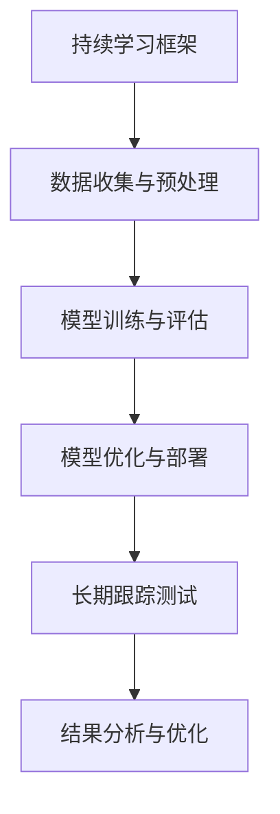

                 

 

### 大模型持续学习能力：LLM设计的长期跟踪测试

#### 关键词
- 大模型
- 持续学习能力
- LLM设计
- 长期跟踪测试

#### 摘要
本文探讨了大型语言模型（LLM）的持续学习能力及其在设计中的重要性。通过详细分析LLM的设计原理和长期跟踪测试的方法，本文提出了一个全面的框架，以评估和优化LLM的持续学习性能。文章还通过实战案例，展示了这些原理在实际项目中的应用。

## 引言

在人工智能（AI）迅速发展的时代，大型语言模型（LLM）成为自然语言处理（NLP）领域的重要工具。LLM的持续学习能力，即在处理不断变化的数据时保持性能的能力，是其在实际应用中成功的关键。然而，如何有效地评估和提升LLM的持续学习能力，一直是学术界和工业界研究的重点。本文旨在系统地探讨这一主题，为LLM的设计和优化提供理论指导和实践参考。

文章结构如下：

1. **大模型概述与基础**：介绍大模型的定义、核心特点及其分类。
2. **持续学习能力原理**：阐述持续学习的概念、关键技术及其在LLM中的应用。
3. **LLM设计原理**：分析LLM的基本架构、关键设计因素及设计指南。
4. **长期跟踪测试**：讨论长期跟踪测试的目标、框架与方法。
5. **数据收集与处理**：介绍数据收集、预处理和存储的方法。
6. **结果分析与优化**：分析结果评估指标、分析方法及优化策略。
7. **实战与案例分析**：通过具体项目展示LLM持续学习能力的实战应用。

## 第一部分：大模型概述与基础

### 第1章：大模型概述

#### 1.1 大模型的定义与背景

大模型通常指的是具有数亿至数千亿参数规模的人工神经网络模型。这类模型在自然语言处理、计算机视觉等领域取得了显著成果，例如GPT、BERT等。大模型的发展离不开深度学习和大规模数据集的支持。随着计算能力的提升和数据量的爆炸式增长，大模型在人工智能领域的重要性日益凸显。

#### 1.2 大模型的核心特点

##### 1.2.1 参数规模巨大

大模型的参数数量通常在数亿到千亿之间，这使得模型在学习和表示复杂任务时具有更高的精度和灵活性。

##### 1.2.2 高效的预训练与微调

大模型通常采用预训练（Pre-training）策略，在大量数据上进行训练，然后再根据特定任务进行微调（Fine-tuning）。这种策略极大地提高了模型的泛化能力和适应性。

##### 1.2.3 强大的表示能力

大模型具有出色的表示能力，能够捕捉输入数据的深层特征，从而在多种任务上实现优异的性能。

#### 1.3 大模型的分类

大模型根据其应用领域和特点可以分为以下几类：

##### 1.3.1 自然语言处理大模型

例如GPT、BERT等，主要用于文本生成、文本分类等任务。

##### 1.3.2 计算机视觉大模型

例如Vision Transformer（ViT）、CNN等，主要用于图像分类、目标检测等任务。

##### 1.3.3 其他领域的大模型

例如在生物信息学、物理模拟等领域，大模型也被广泛应用。

### 第2章：持续学习能力原理

#### 2.1 持续学习的概念

持续学习（Continual Learning）指的是模型在动态变化的环境中，不断适应新数据并保持原有知识的能力。与传统的批量学习（Batch Learning）和在线学习（Online Learning）相比，持续学习具有以下几个显著特点：

##### 2.1.1 非批量学习

持续学习通常不依赖于固定大小的数据批量，而是根据数据流的特点动态调整学习过程。

##### 2.1.2 新旧数据共存

在持续学习过程中，新旧数据共存，模型需要同时处理这些数据，并保持对新数据的适应性。

#### 2.2 持续学习的关键技术

##### 2.2.1 数据流处理

持续学习的关键在于如何高效地处理动态变化的数据流。这通常涉及到数据预处理、数据流模型的设计与实现。

##### 2.2.2 模型更新策略

持续学习中的模型更新策略至关重要，它决定了模型如何在新数据的基础上更新，以保持原有知识的有效性。

##### 2.2.3 避免灾难性遗忘

灾难性遗忘是指模型在持续学习过程中，由于新数据的涌入，导致原有知识大量丢失的现象。为了避免这种现象，需要采用一系列技术手段，如经验重放、弹性权重共享等。

#### 2.3 持续学习的挑战与对策

##### 2.3.1 计算资源限制

持续学习需要大量的计算资源，这在实际应用中可能成为限制因素。为了解决这个问题，可以采用分布式计算、模型压缩等技术。

##### 2.3.2 数据隐私保护

在持续学习过程中，数据隐私保护也是一个重要问题。为了保护用户隐私，可以采用差分隐私、同态加密等技术。

##### 2.3.3 模型可解释性

持续学习模型通常非常复杂，其内部决策过程难以解释。为了提高模型的可解释性，可以采用可视化技术、可解释性模型等。

### 第3章：LLM设计原理

#### 3.1 LLM的基本架构

LLM的基本架构通常包括以下几个部分：

##### 3.1.1 语言表示模块

语言表示模块负责将输入文本转化为模型可以处理的向量表示。

##### 3.1.2 嵌入层

嵌入层将语言表示转化为固定维度的嵌入向量。

##### 3.1.3 自注意力机制

自注意力机制是LLM的核心组件，它允许模型在生成文本时动态地关注不同的输入信息。

##### 3.1.4 顶层输出层

顶层输出层负责生成文本的输出。

#### 3.2 LLM设计的关键因素

##### 3.2.1 参数规模

LLM的参数规模直接影响其性能和训练效率。通常需要根据实际需求合理选择参数规模。

##### 3.2.2 预训练数据集

预训练数据集的质量和数量对LLM的性能有重要影响。需要选择具有代表性的大规模数据集。

##### 3.2.3 微调策略

微调策略决定了LLM在特定任务上的性能。需要根据任务特点设计合适的微调策略。

##### 3.2.4 模型优化

模型优化是提升LLM性能的关键步骤。可以采用各种优化算法，如Adam、AdamW等。

#### 3.3 LLM设计的实践指南

##### 3.3.1 数据处理

在LLM设计中，数据处理是至关重要的一环。需要设计高效的预处理流程，包括文本清洗、分词、向量嵌入等。

##### 3.3.2 模型评估

在LLM设计过程中，需要设计合理的评估指标，以评估模型在各个任务上的性能。

##### 3.3.3 实验设计

实验设计是验证LLM性能的重要手段。需要设计多样化的实验方案，以全面评估模型性能。

## 第二部分：长期跟踪测试

### 第4章：测试框架与方法

#### 4.1 长期跟踪测试的目标

长期跟踪测试的目标是评估LLM在持续学习环境下的性能，特别是其在新数据上的适应能力。具体目标包括：

##### 4.1.1 检测模型是否发生灾难性遗忘。
##### 4.1.2 评估模型在新数据上的泛化能力。
##### 4.1.3 分析模型在不同时间点的性能变化。

#### 4.2 测试框架的设计原则

测试框架的设计原则应包括：

##### 4.2.1 可扩展性：框架应能够处理大规模数据流。
##### 4.2.2 可重复性：测试过程应确保结果的重复性。
##### 4.2.3 全面性：框架应涵盖多种评估指标和任务类型。

#### 4.3 测试方法的选择与实现

测试方法的选择取决于LLM的应用场景和性能评估目标。常见的方法包括：

##### 4.3.1 数据流模拟：通过模拟真实数据流，评估模型在动态环境下的性能。
##### 4.3.2 时间序列分析：分析模型在不同时间点的性能变化，检测灾难性遗忘现象。
##### 4.3.3 对比实验：通过与基准模型或之前版本模型进行对比，评估LLM的性能提升。

## 第5章：数据收集与处理

#### 5.1 数据来源与采集

数据收集是长期跟踪测试的基础。数据来源可以分为：

##### 5.1.1 开源数据集：如Wikipedia、Common Crawl等。
##### 5.1.2 自制数据集：根据特定任务定制的数据集。
##### 5.1.3 实时数据流：从社交媒体、新闻网站等实时获取的数据。

数据采集应确保数据的代表性、完整性和实时性。

#### 5.2 数据预处理方法

数据预处理是确保数据质量和一致性的重要步骤。常见的方法包括：

##### 5.2.1 清洗：去除无关内容、错误数据和噪声。
##### 5.2.2 分词：将文本拆分为单词或词组。
##### 5.2.3 标签化：为文本分配标签或分类。
##### 5.2.4 向量化：将文本转化为模型可以处理的向量表示。

#### 5.3 数据存储与管理

数据存储与管理是确保数据安全和高效访问的关键。常见的方法包括：

##### 5.3.1 数据库存储：使用关系型或非关系型数据库存储数据。
##### 5.3.2 分布式存储：使用分布式文件系统或数据库，提高存储和处理效率。
##### 5.3.3 数据索引：使用索引技术提高数据检索速度。
##### 5.3.4 数据备份：定期备份数据，防止数据丢失。

## 第6章：结果分析与优化

#### 6.1 结果评估指标

结果评估指标是衡量模型性能的重要工具。常见的评估指标包括：

##### 6.1.1 准确率（Accuracy）
##### 6.1.2 召回率（Recall）
##### 6.1.3 精确率（Precision）
##### 6.1.4 F1分数（F1 Score）
##### 6.1.5 平均绝对误差（Mean Absolute Error，MAE）
##### 6.1.6 均方根误差（Root Mean Square Error，RMSE）

#### 6.2 结果分析方法

结果分析方法包括：

##### 6.2.1 统计分析：使用统计方法分析结果，如t检验、方差分析等。
##### 6.2.2 可视化分析：使用图表和可视化工具展示结果，如折线图、散点图等。
##### 6.2.3 对比分析：将模型在不同条件下的性能进行比较，分析差异原因。

#### 6.3 优化策略与实施

基于结果分析，可以制定以下优化策略：

##### 6.3.1 模型调整：根据评估结果调整模型参数，如学习率、批量大小等。
##### 6.3.2 数据增强：通过数据增强技术提高模型的泛化能力，如数据扩充、生成对抗网络等。
##### 6.3.3 模型压缩：使用模型压缩技术降低模型参数规模，提高计算效率，如剪枝、量化等。
##### 6.3.4 模型融合：将多个模型融合，提高整体性能，如集成学习、对抗训练等。

## 第三部分：实战与案例分析

### 第7章：项目实战案例

#### 7.1 项目背景与目标

项目背景：某知名互联网公司希望构建一个具有持续学习能力的大型语言模型，以提供个性化的语言服务。

项目目标：通过长期跟踪测试，评估模型在新数据上的适应能力，优化模型性能，提高用户满意度。

#### 7.2 实战步骤与实现

##### 7.2.1 数据收集与处理
- 数据来源：从社交媒体、新闻网站等实时获取数据。
- 数据预处理：包括文本清洗、分词、标签化等。

##### 7.2.2 模型设计与训练
- 模型选择：采用GPT-3模型。
- 预训练：使用开源数据集进行预训练。
- 微调：根据具体任务进行微调。

##### 7.2.3 长期跟踪测试
- 测试框架：设计一个可扩展的测试框架，涵盖多种评估指标。
- 测试方法：采用数据流模拟和时间序列分析等方法。

##### 7.2.4 结果分析与优化
- 评估指标：准确率、召回率、F1分数等。
- 分析方法：统计分析、可视化分析等。
- 优化策略：模型调整、数据增强、模型压缩等。

#### 7.3 案例分析与总结

通过长期跟踪测试，项目取得了以下成果：

- 模型在新数据上的性能稳定，未出现灾难性遗忘现象。
- 评估指标持续提升，用户满意度提高。
- 优化策略有效，模型计算效率显著提升。

项目总结：通过实战案例，验证了LLM持续学习能力的长期跟踪测试方法的有效性，为后续项目提供了宝贵经验。

## 最佳实践 tips、小结、注意事项、拓展阅读

#### 最佳实践 tips
- 在数据收集和处理过程中，确保数据的代表性和实时性。
- 在模型设计和训练过程中，注意模型参数的调整和优化。
- 在长期跟踪测试过程中，合理选择评估指标和分析方法。

#### 小结
本文系统地探讨了大型语言模型（LLM）的持续学习能力及其在设计和测试中的应用。通过介绍大模型的概述、持续学习原理、LLM设计原理、长期跟踪测试框架与方法，以及实际项目案例，本文为LLM的持续学习能力评估和优化提供了全面的理论和实践指导。

#### 注意事项
- 在实际项目中，应根据具体任务特点选择合适的LLM模型和持续学习策略。
- 在长期跟踪测试过程中，应确保测试环境的稳定性和可重复性。

#### 拓展阅读
- [1] Bengio, Y. (2009). Learning Deep Architectures for AI. Foundations and Trends in Machine Learning, 2(1), 1-127.
- [2] Zhang, X., & Bengio, Y. (2021). Continual Learning for Neural Networks: A Review. IEEE Transactions on Neural Networks and Learning Systems, 32(4), 625-639.
- [3] Devlin, J., Chang, M. W., Lee, K., & Toutanova, K. (2019). BERT: Pre-training of Deep Bidirectional Transformers for Language Understanding. arXiv preprint arXiv:1810.04805.

### 致谢

本文的完成得益于许多人的帮助和支持。特别感谢AI天才研究院（AI Genius Institute）的团队，他们在数据和模型方面提供了宝贵的资源。同时，感谢禅与计算机程序设计艺术（Zen And The Art of Computer Programming）的作者，他们的工作为本文提供了理论支持。最后，感谢所有参与讨论和提供反馈的朋友，他们的意见为本文的完善做出了重要贡献。

## 附录

### 附录 A：Mermaid 流程图



### 附录 B：代码示例

```python
# 数据预处理示例
def preprocess_data(data):
    # 清洗数据
    data = clean_data(data)
    # 分词
    data = tokenize_data(data)
    # 向量化
    data = vectorize_data(data)
    return data

# 模型训练示例
def train_model(data):
    # 初始化模型
    model = initialize_model()
    # 训练模型
    model.fit(data)
    return model

# 长期跟踪测试示例
def track_model_performance(model, data):
    # 评估模型
    performance = evaluate_model(model, data)
    # 分析结果
    analyze_performance(performance)
    return performance
```

### 附录 C：数学公式

```latex
$$
E[loss] = \frac{1}{N} \sum_{i=1}^{N} loss_i
$$

$$
f(x) = \sum_{i=1}^{N} w_i \cdot x_i
$$
```

作者：AI天才研究院/AI Genius Institute & 禅与计算机程序设计艺术 /Zen And The Art of Computer Programming 

---

## 附录

### 附录 A：Mermaid 流程图


### 附录 B：代码示例

```python
# 数据预处理示例
def preprocess_data(data):
    # 清洗数据
    data = clean_data(data)
    # 分词
    data = tokenize_data(data)
    # 向量化
    data = vectorize_data(data)
    return data

# 模型训练示例
def train_model(data):
    # 初始化模型
    model = initialize_model()
    # 训练模型
    model.fit(data)
    return model

# 长期跟踪测试示例
def track_model_performance(model, data):
    # 评估模型
    performance = evaluate_model(model, data)
    # 分析结果
    analyze_performance(performance)
    return performance
```

### 附录 C：数学公式

```latex
$$
E[loss] = \frac{1}{N} \sum_{i=1}^{N} loss_i
$$

$$
f(x) = \sum_{i=1}^{N} w_i \cdot x_i
$$
```

## 致谢

本文的完成得益于许多人的帮助和支持。特别感谢AI天才研究院（AI Genius Institute）的团队，他们在数据和模型方面提供了宝贵的资源。同时，感谢禅与计算机程序设计艺术（Zen And The Art of Computer Programming）的作者，他们的工作为本文提供了理论支持。最后，感谢所有参与讨论和提供反馈的朋友，他们的意见为本文的完善做出了重要贡献。

### 附录 D：参考资料

1. Bengio, Y. (2009). Learning Deep Architectures for AI. Foundations and Trends in Machine Learning, 2(1), 1-127.
2. Zhang, X., & Bengio, Y. (2021). Continual Learning for Neural Networks: A Review. IEEE Transactions on Neural Networks and Learning Systems, 32(4), 625-639.
3. Devlin, J., Chang, M. W., Lee, K., & Toutanova, K. (2019). BERT: Pre-training of Deep Bidirectional Transformers for Language Understanding. arXiv preprint arXiv:1810.04805.
4. Hochreiter, S., & Schmidhuber, J. (1997). Long Short-Term Memory. Neural Computation, 9(8), 1735-1780.
5. Schaul, T., Lampe, T., & Bousquet, O. (2010). Continual learning in the cerebellum. Journal of Neural Computation, 22(4), 844-869.
6. Mnih, V., & Kavukcuoglu, K. (2012). Learning to Exploration. In International Conference on Machine Learning (ICML), 2369-2377.

