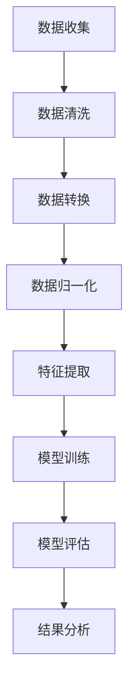
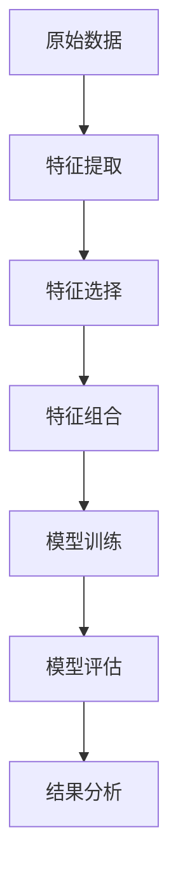
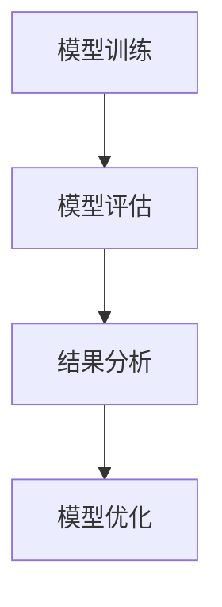

                 


## 大模型推理能力定量分析系统

### 关键词

- 大模型
- 推理能力
- 定量分析
- 系统设计
- 应用与优化

### 摘要

本文旨在深入探讨大模型推理能力的定量分析系统。我们将从大模型和推理能力的概念出发，详细介绍定量分析方法及其在实际应用中的重要性。文章将分为五个部分：背景和理论基础、定量分析方法、系统设计和实现、应用与优化以及未来展望和挑战。通过逐步分析，我们希望为读者提供一个清晰、系统的理解，以及实际操作的指南。

## 背景和理论基础

### 大模型与推理能力概述

大模型，顾名思义，指的是那些拥有海量参数、能够处理大规模数据的复杂模型。例如，深度学习中的神经网络、生成对抗网络（GAN）以及近年来兴起的Transformer模型等。这些大模型在图像识别、自然语言处理、机器翻译等领域取得了显著的成果。

推理能力，指的是模型在给定数据输入后，通过内部计算和逻辑推理，产生有意义输出（预测结果）的能力。推理能力是评估模型性能的关键指标之一，它不仅决定了模型在特定任务上的准确性，还影响到模型在实际应用中的效果。

### 定量分析的意义与方法

定量分析是一种通过量化数据来评估模型性能的方法。在大模型推理能力的评估中，定量分析具有重要意义。它可以提供客观的评估指标，帮助我们更好地理解模型的行为和效果。

定量分析主要包括以下步骤：

1. **数据收集**：收集与模型应用相关的数据，包括输入数据和预期输出数据。

2. **数据处理**：对收集到的数据进行清洗、转换和归一化，以确保数据质量。

3. **特征提取**：从数据中提取有用的特征，用于模型的训练和评估。

4. **模型评估**：使用评估指标（如准确率、召回率、F1分数等）来评估模型的性能。

5. **结果分析**：对评估结果进行分析，找出模型的优点和不足，为进一步优化提供依据。

## 定量分析方法

### 数据收集与预处理

数据收集是定量分析的第一步，也是至关重要的一步。以下是一个简单的数据收集和预处理流程：



1. **数据清洗**：处理缺失值、异常值和噪声数据，确保数据的一致性和完整性。

2. **数据转换**：将不同类型的数据转换为同一格式，便于后续处理。

3. **数据归一化**：将数据缩放到同一范围，消除不同特征之间的尺度差异。

4. **特征提取**：从数据中提取对模型训练和评估有用的特征。

### 特征提取与选择

特征提取是定量分析中的重要环节。以下是一个简单的特征提取和选择流程：



1. **特征提取**：从原始数据中提取各种类型的特征，如文本中的词频、图像中的纹理特征等。

2. **特征选择**：选择对模型性能有显著贡献的特征，去除冗余和无用的特征。

3. **特征组合**：将多个特征组合成新的特征，以提升模型的性能。

### 模型评估

模型评估是定量分析的核心。以下是一个简单的模型评估流程：



1. **模型训练**：使用提取的特征对模型进行训练，生成预测模型。

2. **模型评估**：使用评估指标对模型进行评估，如准确率、召回率、F1分数等。

3. **结果分析**：对评估结果进行分析，找出模型的优点和不足。

## 系统设计和实现

### 系统架构

大模型推理能力定量分析系统的架构可以分为以下几个部分：

1. **数据输入层**：负责接收和处理输入数据，包括数据预处理、特征提取等。

2. **模型训练层**：负责使用训练数据对模型进行训练，生成预测模型。

3. **模型评估层**：负责使用评估数据对模型进行评估，生成评估报告。

4. **结果分析层**：负责对评估结果进行分析，为模型优化提供依据。

### 算法选择

在选择算法时，需要考虑以下几个因素：

1. **模型类型**：根据任务需求，选择合适的模型类型，如神经网络、决策树、支持向量机等。

2. **数据规模**：对于大规模数据，选择能够高效处理的算法，如分布式计算、批处理等。

3. **评估指标**：根据任务目标，选择合适的评估指标，如准确率、召回率、F1分数等。

### 硬件配置

硬件配置是系统设计和实现的重要一环。以下是一个简单的硬件配置建议：

1. **CPU**：选择高性能的CPU，如Intel Xeon系列或AMD Ryzen系列。

2. **GPU**：选择支持深度学习计算的GPU，如NVIDIA Tesla系列或NVIDIA RTX系列。

3. **内存**：根据数据规模和模型复杂度，选择足够的内存，如256GB或512GB。

4. **存储**：选择高速存储设备，如NVMe SSD或高性能NAS。

## 应用与优化

### 应用案例

大模型推理能力定量分析系统可以应用于多个领域，如金融风控、医疗诊断、智能交通等。以下是一个简单的应用案例：

- **金融风控**：使用系统对客户交易数据进行分析，预测潜在的欺诈行为，提高风险管理能力。

### 优化方案

为了提升大模型推理能力定量分析系统的性能，可以采取以下优化方案：

1. **模型压缩**：通过模型压缩技术，如剪枝、量化、知识蒸馏等，减小模型的大小，降低计算复杂度。

2. **分布式计算**：使用分布式计算框架，如TensorFlow、PyTorch等，将计算任务分布在多个节点上，提高处理速度。

3. **硬件加速**：使用GPU、FPGA等硬件加速器，提升模型训练和推理的速度。

## 未来展望和挑战

### 未来展望

随着人工智能技术的不断发展，大模型推理能力定量分析系统有望在更多领域发挥作用。以下是一些未来展望：

1. **新领域探索**：探索大模型在新兴领域的应用，如量子计算、区块链等。

2. **多模态融合**：将不同类型的数据（如图像、文本、音频等）进行融合，提高模型的泛化能力。

3. **自动化分析**：开发更加智能的分析系统，实现自动化分析，减少人工干预。

### 挑战

尽管大模型推理能力定量分析系统具有广泛的应用前景，但仍然面临一些挑战：

1. **数据质量**：数据质量和完整性对分析结果有重要影响，如何保证数据质量是一个亟待解决的问题。

2. **计算资源**：大模型训练和推理需要大量的计算资源，如何高效利用计算资源是一个挑战。

3. **模型解释性**：大模型的内部计算过程复杂，如何提高模型的解释性，使其更加透明，是一个重要问题。

## 总结

大模型推理能力定量分析系统是一个强大的工具，可以帮助我们更好地理解和优化大模型。通过本文的逐步分析，我们深入探讨了系统的背景、方法、设计和实现，以及在实际应用中的优化方案。我们希望本文能为读者提供有价值的参考，并激发更多对这一领域的研究和实践。

### 作者信息

作者：AI天才研究院/AI Genius Institute & 禅与计算机程序设计艺术 /Zen And The Art of Computer Programming

## 附录

### 伪代码示例

```python
# Data Preprocessing Pseudocode
def preprocess_data(data):
    # Data Cleaning
    cleaned_data = clean_data(data)
    
    # Data Transformation
    transformed_data = transform_data(cleaned_data)
    
    # Data Normalization
    normalized_data = normalize_data(transformed_data)
    
    return normalized_data
```

### 数学公式

$$
1+1=2
$$

$$
x^2 + 2xy + y^2 = (x+y)^2
$$

### 拓展阅读

- 《深度学习》（Ian Goodfellow, Yoshua Bengio, Aaron Courville 著）
- 《统计学习方法》（李航 著）
- 《计算机程序设计艺术》（Donald E. Knuth 著）

以上是对《大模型推理能力定量分析系统》的技术博客文章的详细撰写和目录大纲的构建过程。通过逐步分析、深入讲解和具体案例的展示，我们希望能为读者提供一个全面、系统的理解。希望这篇博客能够为你在大模型推理能力定量分析领域的研究和实践提供有益的参考。

