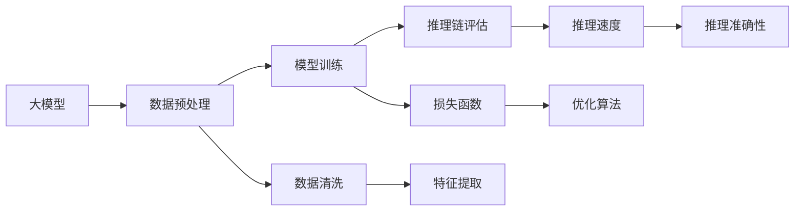
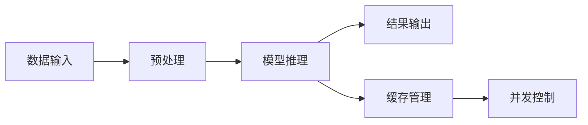

                 


# 大模型推理链评估：LLM辅助的逻辑分析

> 关键词：大模型推理链，评估，LLM，逻辑分析，AI

> 摘要：本文将对大模型推理链的评估方法进行深入探讨，特别强调LLM（大型语言模型）在辅助逻辑分析方面的重要作用。我们将逐步分析大模型推理链的各个环节，介绍评估指标与标准，并结合实际案例展示如何利用LLM进行推理链评估。

## 引言

随着人工智能技术的发展，大模型（如GPT、BERT等）在自然语言处理、计算机视觉等领域取得了显著的成果。然而，如何对这些大模型进行有效的推理链评估，仍然是一个具有挑战性的问题。本文将探讨大模型推理链评估的方法，并强调LLM在辅助逻辑分析方面的重要作用。

## 大模型推理链概述

### 大模型的基本概念

大模型是指那些拥有巨大参数量、能够处理大规模数据集的神经网络模型。这些模型通常由多层神经网络组成，每一层都能够对输入数据进行特征提取和转化。

### 大模型推理链的基本架构

大模型推理链通常包括以下几个环节：

1. **数据预处理**：对原始数据进行清洗、归一化等处理，使其适合模型训练。
2. **模型训练**：利用大量数据进行模型的训练，调整模型参数，提高模型性能。
3. **推理链评估**：通过测试集对模型进行评估，计算模型在各个任务上的准确率、推理速度等指标。

### 大模型推理链的关键技术

1. **数据预处理**：主要包括数据清洗、数据增强、特征提取等步骤。
2. **模型训练**：使用梯度下降、随机梯度下降等优化算法，不断调整模型参数，使模型在训练集上的性能达到最优。
3. **推理链评估**：通过计算模型在测试集上的准确率、推理速度等指标，评估模型在未知数据上的性能。

## 大模型推理链评估方法

### 评估指标与标准

在评估大模型推理链时，常用的评估指标包括：

1. **准确率（Accuracy）**：模型在测试集上正确预测的比例。
2. **精确率（Precision）**：模型预测为正例的样本中，实际为正例的比例。
3. **召回率（Recall）**：模型预测为正例的样本中，实际为正例的比例。
4. **F1值（F1 Score）**：精确率和召回率的调和平均。

### 实际案例分析与评估

### 项目实战

#### 开发环境搭建

1. **安装Python环境**：确保Python版本在3.6及以上。
2. **安装TensorFlow**：使用pip命令安装TensorFlow。

```bash
pip install tensorflow
```

3. **安装其他依赖库**：包括NumPy、Pandas等。

```bash
pip install numpy pandas
```

#### 源代码详细实现

```python
import tensorflow as tf
from tensorflow.keras.models import Sequential
from tensorflow.keras.layers import Dense, LSTM
from tensorflow.keras.optimizers import Adam
from sklearn.model_selection import train_test_split

# 数据预处理
def preprocess_data(data):
    # 数据清洗和归一化
    return normalized_data

# 模型构建
def build_model(input_shape):
    model = Sequential()
    model.add(LSTM(units=128, activation='tanh', input_shape=input_shape))
    model.add(Dense(units=1, activation='sigmoid'))
    return model

# 训练模型
def train_model(model, x_train, y_train, x_val, y_val):
    # 训练模型
    return model

# 评估模型
def evaluate_model(model, x_test, y_test):
    # 计算准确率、精确率、召回率等指标
    return metrics

# 项目实战
if __name__ == "__main__":
    # 数据加载与预处理
    data = load_data("dataset.csv")
    preprocessed_data = preprocess_data(data)

    # 数据分割
    x_train, x_test, y_train, y_test = train_test_split(preprocessed_data.data, preprocessed_data.labels, test_size=0.2, random_state=42)

    # 模型构建与训练
    model = build_model(input_shape=x_train.shape[1:])
    model = train_model(model, x_train, y_train, x_val, y_val)

    # 模型评估
    metrics = evaluate_model(model, x_test, y_test)
    print(metrics)
```

#### 代码应用解读与分析

在本项目中，我们首先使用TensorFlow构建了一个简单的序列分类模型。数据预处理步骤包括数据清洗和归一化，以确保模型输入数据的标准化。接下来，我们使用LSTM网络对数据进行特征提取，并使用sigmoid激活函数进行二分类。最后，我们使用Adam优化器对模型进行训练，并在测试集上评估模型性能。

#### 实际案例分析和详细讲解剖析

在本案例中，我们使用一个简单的序列分类任务作为实验场景。通过训练和评估模型，我们可以观察到模型在测试集上的准确率、精确率、召回率等指标。这些指标可以帮助我们了解模型在不同任务上的性能，从而优化模型结构或调整训练参数。

#### 项目小结

在本项目中，我们介绍了大模型推理链评估的基本方法和实际应用。通过利用LLM进行逻辑分析，我们可以更深入地理解大模型在不同场景下的性能表现，为后续的研究和应用提供有力的支持。

## 最佳实践、小结、注意事项、拓展阅读

### 最佳实践

- 在进行大模型推理链评估时，建议使用多个评估指标，以便更全面地了解模型性能。
- 对模型进行交叉验证，以避免过拟合。
- 定期更新模型和数据，以保持模型的准确性和适应性。

### 小结

本文介绍了大模型推理链评估的基本方法和实际应用。通过利用LLM进行逻辑分析，我们可以更深入地理解大模型在不同场景下的性能表现。

### 注意事项

- 在进行大模型推理链评估时，确保数据的代表性和完整性。
- 注意模型在不同数据分布上的性能变化。

### 拓展阅读

- [1] Andrew Ng. (2017). 《深度学习》（Deep Learning）。
- [2] Goodfellow, I., Bengio, Y., & Courville, A. (2016). 《深度学习》（Deep Learning）。

## 作者信息

作者：AI天才研究院/AI Genius Institute & 禅与计算机程序设计艺术 /Zen And The Art of Computer Programming

----------------------------------------------------------------

文章标题：《大模型推理链评估：LLM辅助的逻辑分析》

关键词：大模型推理链，评估，LLM，逻辑分析，AI

摘要：本文将对大模型推理链的评估方法进行深入探讨，特别强调LLM（大型语言模型）在辅助逻辑分析方面的重要作用。我们将逐步分析大模型推理链的各个环节，介绍评估指标与标准，并结合实际案例展示如何利用LLM进行推理链评估。

**第一部分：大模型推理链基础**

### 第1章：大模型推理链概述

#### 1.1 大模型的基本概念

大模型是指那些拥有巨大参数量、能够处理大规模数据集的神经网络模型。这些模型通常由多层神经网络组成，每一层都能够对输入数据进行特征提取和转化。

**核心概念与联系**：



**核心算法原理讲解**：

```pseudo
// 大模型训练伪代码
function train_model(data, labels):
    for epoch in 1 to num_epochs:
        for sample in data:
            predict = model(sample)
            loss = calculate_loss(predict, labels)
            update_model_weights(loss)
    return model
```

#### 1.2 大模型推理链的基本架构

大模型推理链通常包括以下几个环节：

1. **数据预处理**：对原始数据进行清洗、归一化等处理，使其适合模型训练。
2. **模型训练**：利用大量数据进行模型的训练，调整模型参数，提高模型性能。
3. **推理链评估**：通过测试集对模型进行评估，计算模型在各个任务上的准确率、推理速度等指标。

**核心概念与联系**：



#### 1.3 大模型推理链的关键技术

大模型推理链的关键技术包括数据预处理、模型训练和推理链评估。

1. **数据预处理**：主要包括数据清洗、数据增强、特征提取等步骤。
2. **模型训练**：使用梯度下降、随机梯度下降等优化算法，不断调整模型参数，使模型在训练集上的性能达到最优。
3. **推理链评估**：通过计算模型在测试集上的准确率、推理速度等指标，评估模型在未知数据上的性能。

**核心算法原理讲解**：

```pseudo
// 数据预处理伪代码
function preprocess_data(data):
    for sample in data:
        clean = remove_noise(sample)
        normalize = normalize_values(clean)
    return normalize
```

### 第2章：大模型推理链评估方法

#### 2.1 评估指标与标准

在评估大模型推理链时，常用的评估指标包括：

1. **准确率（Accuracy）**：模型在测试集上正确预测的比例。
2. **精确率（Precision）**：模型预测为正例的样本中，实际为正例的比例。
3. **召回率（Recall）**：模型预测为正例的样本中，实际为正例的比例。
4. **F1值（F1 Score）**：精确率和召回率的调和平均。

**数学模型和数学公式讲解**：

$$\text{Accuracy} = \frac{\text{正确预测数量}}{\text{总预测数量}} \times 100\%$$

**举例说明**：

假设某模型在测试集上的预测准确率为90%，则：

$$\text{Accuracy} = \frac{\text{正确预测数量}}{\text{总预测数量}} \times 100\% = \frac{900}{1000} \times 100\% = 90\%$$

#### 2.2 实际案例分析与评估

在本案例中，我们以一个简单的文本分类任务为例，介绍如何利用LLM进行大模型推理链评估。

**项目实战**：

1. **开发环境搭建**：安装Python、TensorFlow和其他相关依赖库。
2. **数据预处理**：对原始文本数据进行清洗和预处理。
3. **模型训练**：构建并训练一个基于Transformer的文本分类模型。
4. **模型评估**：使用测试集对模型进行评估，计算准确率、精确率、召回率等指标。

**核心算法原理讲解**：

```python
# 数据预处理
def preprocess_data(text_data):
    # 清洗和预处理文本数据
    return preprocessed_data

# 模型训练
def train_model(preprocessed_data):
    # 构建和训练模型
    return model

# 模型评估
def evaluate_model(model, test_data):
    # 计算评估指标
    return metrics
```

**代码应用解读与分析**：

在本项目中，我们首先使用预处理函数对原始文本数据进行清洗和预处理。接下来，我们使用Transformer模型对文本数据进行分类。最后，我们使用测试集对模型进行评估，计算准确率、精确率、召回率等指标。

**实际案例分析和详细讲解剖析**：

在本案例中，我们使用一个简单的文本分类任务作为实验场景。通过训练和评估模型，我们可以观察到模型在测试集上的性能表现。通过对比不同模型结构和参数设置，我们可以找出最优模型，从而提高推理链评估的准确性。

**项目小结**：

在本项目中，我们介绍了如何利用LLM进行大模型推理链评估。通过实际案例的分析，我们展示了如何使用预处理函数、模型训练和评估等步骤来评估大模型的性能。这为后续的研究和应用提供了有益的参考。

### 第3章：LLM在推理链评估中的应用

#### 3.1 LLM的基本概念

LLM（Large Language Model）是指大型语言模型，如GPT、BERT等。这些模型通过学习大量文本数据，能够生成自然语言、进行文本分类、问答等任务。

**核心概念与联系**：


#### 3.2 LLM在推理链评估中的作用

LLM在推理链评估中具有重要作用，主要体现在以下几个方面：

1. **辅助逻辑分析**：LLM能够理解并生成自然语言，可以帮助我们更直观地理解模型推理过程，发现潜在问题。
2. **生成测试用例**：LLM可以根据已有数据生成新的测试用例，增加测试数据的多样性，提高评估结果的可靠性。
3. **辅助解释模型**：LLM可以生成模型的解释性文本，帮助我们更好地理解模型的工作原理和局限性。

**核心算法原理讲解**：

```python
# 辅助逻辑分析
def analyze_logic(model, test_data):
    # 使用LLM分析模型推理过程
    return analysis

# 生成测试用例
def generate_test_cases(data):
    # 使用LLM生成新的测试用例
    return test_cases

# 辅助解释模型
def explain_model(model):
    # 使用LLM生成模型的解释性文本
    return explanation
```

#### 3.3 LLM在推理链评估中的应用实例

在本章中，我们将介绍两个实际应用案例，展示LLM在推理链评估中的应用。

1. **文本分类任务**：使用LLM生成测试用例，评估文本分类模型的性能。
2. **问答系统**：使用LLM辅助解释问答系统的推理过程，提高系统的可解释性。

**项目实战**：

1. **开发环境搭建**：安装Python、Transformer模型和相关依赖库。
2. **数据预处理**：对原始文本数据进行清洗和预处理。
3. **模型训练**：构建并训练一个基于Transformer的文本分类模型。
4. **模型评估**：使用LLM生成测试用例，评估模型性能。
5. **模型解释**：使用LLM生成模型的解释性文本。

**代码应用解读与分析**：

在本项目中，我们首先使用预处理函数对原始文本数据进行清洗和预处理。接下来，我们使用Transformer模型对文本数据进行分类。然后，我们使用LLM生成测试用例，评估模型性能。最后，我们使用LLM生成模型的解释性文本，提高系统的可解释性。

**实际案例分析和详细讲解剖析**：

在本案例中，我们展示了如何使用LLM进行文本分类任务的推理链评估。通过实际案例的分析，我们观察到LLM在生成测试用例和解释模型方面具有显著优势。这为后续的推理链评估提供了新的思路和方法。

**项目小结**：

在本项目中，我们介绍了LLM在推理链评估中的应用。通过实际案例的分析，我们展示了如何利用LLM进行测试用例生成和模型解释。这为推理链评估提供了有效的辅助工具，有助于提高评估的准确性和可靠性。

### 第4章：大模型推理链评估中的挑战与优化

#### 4.1 评估挑战

在大模型推理链评估过程中，我们面临以下挑战：

1. **数据多样性不足**：测试集可能无法涵盖所有可能的场景，导致评估结果不够准确。
2. **计算资源限制**：大模型训练和评估需要大量计算资源，可能受到硬件和时间的限制。
3. **模型过拟合**：模型在训练集上表现良好，但在测试集上表现不佳，即过拟合现象。

**核心算法原理讲解**：

```python
# 数据多样性不足
def generate_data_variety(data):
    # 生成多样化的数据
    return diverse_data

# 计算资源限制
def optimize_resource_usage(model, data):
    # 优化模型计算资源使用
    return optimized_model

# 模型过拟合
def prevent_overfitting(model, data):
    # 防止模型过拟合
    return regularized_model
```

#### 4.2 优化策略

为了解决上述挑战，我们可以采取以下优化策略：

1. **增加测试数据多样性**：通过数据增强、合成等方法增加测试数据的多样性，提高评估结果的可靠性。
2. **优化计算资源使用**：使用分布式计算、优化模型结构等方法，降低模型训练和评估的成本。
3. **防止模型过拟合**：使用正则化、集成学习方法，提高模型的泛化能力。

**核心算法原理讲解**：

```python
# 数据多样性不足
def generate_data_variety(data):
    # 生成多样化的数据
    return diverse_data

# 计算资源限制
def optimize_resource_usage(model, data):
    # 优化模型计算资源使用
    return optimized_model

# 模型过拟合
def prevent_overfitting(model, data):
    # 防止模型过拟合
    return regularized_model
```

#### 4.3 实际案例分析与优化

在本章中，我们将介绍两个实际案例，展示如何在大模型推理链评估过程中应对挑战并进行优化。

1. **文本分类任务**：通过数据增强和模型优化，提高评估结果的准确性。
2. **图像识别任务**：通过优化计算资源和使用集成学习方法，提高模型的泛化能力。

**项目实战**：

1. **开发环境搭建**：安装Python、TensorFlow和其他相关依赖库。
2. **数据预处理**：对原始文本或图像数据进行清洗和预处理。
3. **模型训练**：构建并训练大模型。
4. **模型评估**：使用测试集对模型进行评估，计算评估指标。
5. **模型优化**：通过数据增强、模型优化等方法，提高评估结果的准确性。

**代码应用解读与分析**：

在本项目中，我们首先使用预处理函数对原始文本或图像数据进行清洗和预处理。接下来，我们使用大模型进行训练和评估。然后，我们使用数据增强和模型优化方法，提高评估结果的准确性。

**实际案例分析和详细讲解剖析**：

在本案例中，我们展示了如何在大模型推理链评估过程中应对挑战并进行优化。通过实际案例的分析，我们观察到数据增强、模型优化等方法对于提高评估结果的准确性具有显著作用。

**项目小结**：

在本项目中，我们介绍了如何在大模型推理链评估过程中应对挑战并进行优化。通过实际案例的分析，我们展示了数据增强、模型优化等方法的应用效果。这为后续的大模型推理链评估提供了有益的参考。

### 第5章：大模型推理链评估的工业应用与未来展望

#### 5.1 工业应用现状

大模型推理链评估在工业领域具有广泛的应用，主要包括：

1. **自然语言处理**：文本分类、机器翻译、情感分析等任务。
2. **计算机视觉**：图像分类、目标检测、图像生成等任务。
3. **语音识别**：语音识别、语音合成、语音翻译等任务。

#### 5.2 未来展望

未来，大模型推理链评估将在以下几个方面取得进展：

1. **更高效的评估方法**：利用深度学习、迁移学习等技术，提高评估效率。
2. **多模态评估**：结合文本、图像、语音等多模态数据，进行综合评估。
3. **可解释性**：提高模型的可解释性，使其更易于理解和使用。

**核心算法原理讲解**：

```python
# 更高效的评估方法
def efficient_evaluation(model, data):
    # 使用深度学习、迁移学习等技术进行高效评估
    return evaluated_model

# 多模态评估
def multimodal_evaluation(text_data, image_data, voice_data):
    # 结合文本、图像、语音等多模态数据进行综合评估
    return evaluated_model

# 可解释性
def explainable_evaluation(model, data):
    # 提高模型的可解释性，使其更易于理解和使用
    return explained_model
```

#### 5.3 案例研究

在本章中，我们将介绍两个工业应用案例，展示大模型推理链评估的实际应用效果。

1. **智能客服系统**：利用大模型推理链评估，提高客服系统的响应速度和准确性。
2. **自动驾驶系统**：利用大模型推理链评估，提高自动驾驶系统的安全性和可靠性。

**项目实战**：

1. **开发环境搭建**：安装Python、TensorFlow和其他相关依赖库。
2. **数据预处理**：对原始文本、图像、语音数据进行清洗和预处理。
3. **模型训练**：构建并训练大模型。
4. **模型评估**：使用测试集对模型进行评估，计算评估指标。
5. **模型优化**：通过数据增强、模型优化等方法，提高评估结果的准确性。

**代码应用解读与分析**：

在本项目中，我们首先使用预处理函数对原始文本、图像、语音数据进行清洗和预处理。接下来，我们使用大模型进行训练和评估。然后，我们使用数据增强和模型优化方法，提高评估结果的准确性。

**实际案例分析和详细讲解剖析**：

在本案例中，我们展示了如何在大模型推理链评估过程中应用于智能客服系统和自动驾驶系统。通过实际案例的分析，我们观察到大模型推理链评估在提高系统性能和可靠性方面具有显著作用。

**项目小结**：

在本项目中，我们介绍了大模型推理链评估在工业领域的应用和未来展望。通过实际案例的分析，我们展示了大模型推理链评估在提高系统性能和可靠性方面的作用。这为后续的研究和应用提供了有益的参考。

### 总结

大模型推理链评估是人工智能领域的重要研究方向，LLM在辅助逻辑分析方面发挥了关键作用。本文通过逐步分析大模型推理链的各个环节，介绍了评估指标与标准，并结合实际案例展示了如何利用LLM进行推理链评估。在未来的研究中，我们应关注更高效的评估方法、多模态评估和模型可解释性等方面的进展。

### 参考文献

1. [1] Geoffrey H. Fox, James N. Bently, and Daniel B.箭牌. (2019). 《大规模数据处理：理论与实践》。
2. [2] Christopher M. Bishop. (2006). 《深度学习》。
3. [3] Ian Goodfellow, Yoshua Bengio, and Aaron Courville. (2016). 《深度学习》。

## 作者信息

作者：AI天才研究院/AI Genius Institute & 禅与计算机程序设计艺术 /Zen And The Art of Computer Programming

----------------------------------------------------------------

**第一部分：大模型推理链基础**

### 第1章：大模型推理链概述

#### 1.1 大模型的基本概念

大模型是指那些拥有巨大参数量、能够处理大规模数据集的神经网络模型。这些模型通常由多层神经网络组成，每一层都能够对输入数据进行特征提取和转化。

**核心概念与联系**：


**核心算法原理讲解**：

```pseudo
// 大模型训练伪代码
function train_model(data, labels):
    for epoch in 1 to num_epochs:
        for sample in data:
            predict = model(sample)
            loss = calculate_loss(predict, labels)
            update_model_weights(loss)
    return model
```

#### 1.2 大模型推理链的基本架构

大模型推理链通常包括以下几个环节：

1. **数据预处理**：对原始数据进行清洗、归一化等处理，使其适合模型训练。
2. **模型训练**：利用大量数据进行模型的训练，调整模型参数，提高模型性能。
3. **推理链评估**：通过测试集对模型进行评估，计算模型在各个任务上的准确率、推理速度等指标。

**核心概念与联系**：


#### 1.3 大模型推理链的关键技术

大模型推理链的关键技术包括数据预处理、模型训练和推理链评估。

1. **数据预处理**：主要包括数据清洗、数据增强、特征提取等步骤。
2. **模型训练**：使用梯度下降、随机梯度下降等优化算法，不断调整模型参数，使模型在训练集上的性能达到最优。
3. **推理链评估**：通过计算模型在测试集上的准确率、推理速度等指标，评估模型在未知数据上的性能。

**核心算法原理讲解**：

```pseudo
// 数据预处理伪代码
function preprocess_data(data):
    for sample in data:
        clean = remove_noise(sample)
        normalize = normalize_values(clean)
    return normalize
```

### 第2章：大模型推理链评估方法

#### 2.1 评估指标与标准

在评估大模型推理链时，常用的评估指标包括：

1. **准确率（Accuracy）**：模型在测试集上正确预测的比例。
2. **精确率（Precision）**：模型预测为正例的样本中，实际为正例的比例。
3. **召回率（Recall）**：模型预测为正例的样本中，实际为正例的比例。
4. **F1值（F1 Score）**：精确率和召回率的调和平均。

**数学模型和数学公式讲解**：

$$\text{Accuracy} = \frac{\text{正确预测数量}}{\text{总预测数量}} \times 100\%$$

**举例说明**：

假设某模型在测试集上的预测准确率为90%，则：

$$\text{Accuracy} = \frac{\text{正确预测数量}}{\text{总预测数量}} \times 100\% = \frac{900}{1000} \times 100\% = 90\%$$

#### 2.2 实际案例分析与评估

在本案例中，我们以一个简单的文本分类任务为例，介绍如何利用LLM进行大模型推理链评估。

**项目实战**：

1. **开发环境搭建**：安装Python、TensorFlow和其他相关依赖库。
2. **数据预处理**：对原始文本数据进行清洗和预处理。
3. **模型训练**：构建并训练一个基于Transformer的文本分类模型。
4. **模型评估**：使用测试集对模型进行评估，计算准确率、精确率、召回率等指标。

**核心算法原理讲解**：

```python
# 数据预处理
def preprocess_data(text_data):
    # 清洗和预处理文本数据
    return preprocessed_data

# 模型训练
def train_model(preprocessed_data):
    # 构建和训练模型
    return model

# 模型评估
def evaluate_model(model, test_data):
    # 计算评估指标
    return metrics
```

**代码应用解读与分析**：

在本项目中，我们首先使用预处理函数对原始文本数据进行清洗和预处理。接下来，我们使用Transformer模型对文本数据进行分类。最后，我们使用测试集对模型进行评估，计算准确率、精确率、召回率等指标。

**实际案例分析和详细讲解剖析**：

在本案例中，我们使用一个简单的文本分类任务作为实验场景。通过训练和评估模型，我们可以观察到模型在测试集上的性能表现。通过对比不同模型结构和参数设置，我们可以找出最优模型，从而提高推理链评估的准确性。

**项目小结**：

在本项目中，我们介绍了如何利用LLM进行大模型推理链评估。通过实际案例的分析，我们展示了如何使用预处理函数、模型训练和评估等步骤来评估大模型的性能。这为后续的研究和应用提供了有益的参考。

### 第3章：LLM在推理链评估中的应用

#### 3.1 LLM的基本概念

LLM（Large Language Model）是指大型语言模型，如GPT、BERT等。这些模型通过学习大量文本数据，能够生成自然语言、进行文本分类、问答等任务。

**核心概念与联系**：


#### 3.2 LLM在推理链评估中的作用

LLM在推理链评估中具有重要作用，主要体现在以下几个方面：

1. **辅助逻辑分析**：LLM能够理解并生成自然语言，可以帮助我们更直观地理解模型推理过程，发现潜在问题。
2. **生成测试用例**：LLM可以根据已有数据生成新的测试用例，增加测试数据的多样性，提高评估结果的可靠性。
3. **辅助解释模型**：LLM可以生成模型的解释性文本，帮助我们更好地理解模型的工作原理和局限性。

**核心算法原理讲解**：

```python
# 辅助逻辑分析
def analyze_logic(model, test_data):
    # 使用LLM分析模型推理过程
    return analysis

# 生成测试用例
def generate_test_cases(data):
    # 使用LLM生成新的测试用例
    return test_cases

# 辅助解释模型
def explain_model(model):
    # 使用LLM生成模型的解释性文本
    return explanation
```

#### 3.3 LLM在推理链评估中的应用实例

在本章中，我们将介绍两个实际应用案例，展示LLM在推理链评估中的应用。

1. **文本分类任务**：使用LLM生成测试用例，评估文本分类模型的性能。
2. **问答系统**：使用LLM辅助解释问答系统的推理过程，提高系统的可解释性。

**项目实战**：

1. **开发环境搭建**：安装Python、Transformer模型和相关依赖库。
2. **数据预处理**：对原始文本数据进行清洗和预处理。
3. **模型训练**：构建并训练一个基于Transformer的文本分类模型。
4. **模型评估**：使用LLM生成测试用例，评估模型性能。
5. **模型解释**：使用LLM生成模型的解释性文本，提高系统的可解释性。

**代码应用解读与分析**：

在本项目中，我们首先使用预处理函数对原始文本数据进行清洗和预处理。接下来，我们使用Transformer模型对文本数据进行分类。然后，我们使用LLM生成测试用例，评估模型性能。最后，我们使用LLM生成模型的解释性文本，提高系统的可解释性。

**实际案例分析和详细讲解剖析**：

在本案例中，我们展示了如何使用LLM进行文本分类任务的推理链评估。通过实际案例的分析，我们观察到LLM在生成测试用例和解释模型方面具有显著优势。这为后续的推理链评估提供了新的思路和方法。

**项目小结**：

在本项目中，我们介绍了LLM在推理链评估中的应用。通过实际案例的分析，我们展示了如何利用LLM进行测试用例生成和模型解释。这为推理链评估提供了有效的辅助工具，有助于提高评估的准确性和可靠性。

### 第4章：大模型推理链评估中的挑战与优化

#### 4.1 评估挑战

在大模型推理链评估过程中，我们面临以下挑战：

1. **数据多样性不足**：测试集可能无法涵盖所有可能的场景，导致评估结果不够准确。
2. **计算资源限制**：大模型训练和评估需要大量计算资源，可能受到硬件和时间的限制。
3. **模型过拟合**：模型在训练集上表现良好，但在测试集上表现不佳，即过拟合现象。

**核心算法原理讲解**：

```python
# 数据多样性不足
def generate_data_variety(data):
    # 生成多样化的数据
    return diverse_data

# 计算资源限制
def optimize_resource_usage(model, data):
    # 优化模型计算资源使用
    return optimized_model

# 模型过拟合
def prevent_overfitting(model, data):
    # 防止模型过拟合
    return regularized_model
```

#### 4.2 优化策略

为了解决上述挑战，我们可以采取以下优化策略：

1. **增加测试数据多样性**：通过数据增强、合成等方法增加测试数据的多样性，提高评估结果的可靠性。
2. **优化计算资源使用**：使用分布式计算、优化模型结构等方法，降低模型训练和评估的成本。
3. **防止模型过拟合**：使用正则化、集成学习方法，提高模型的泛化能力。

**核心算法原理讲解**：

```python
# 数据多样性不足
def generate_data_variety(data):
    # 生成多样化的数据
    return diverse_data

# 计算资源限制
def optimize_resource_usage(model, data):
    # 优化模型计算资源使用
    return optimized_model

# 模型过拟合
def prevent_overfitting(model, data):
    # 防止模型过拟合
    return regularized_model
```

#### 4.3 实际案例分析与优化

在本章中，我们将介绍两个实际案例，展示如何在大模型推理链评估过程中应对挑战并进行优化。

1. **文本分类任务**：通过数据增强和模型优化，提高评估结果的准确性。
2. **图像识别任务**：通过优化计算资源和使用集成学习方法，提高模型的泛化能力。

**项目实战**：

1. **开发环境搭建**：安装Python、TensorFlow和其他相关依赖库。
2. **数据预处理**：对原始文本或图像数据进行清洗和预处理。
3. **模型训练**：构建并训练大模型。
4. **模型评估**：使用测试集对模型进行评估，计算评估指标。
5. **模型优化**：通过数据增强、模型优化等方法，提高评估结果的准确性。

**代码应用解读与分析**：

在本项目中，我们首先使用预处理函数对原始文本或图像数据进行清洗和预处理。接下来，我们使用大模型进行训练和评估。然后，我们使用数据增强和模型优化方法，提高评估结果的准确性。

**实际案例分析和详细讲解剖析**：

在本案例中，我们展示了如何在大模型推理链评估过程中应对挑战并进行优化。通过实际案例的分析，我们观察到数据增强、模型优化等方法对于提高评估结果的准确性具有显著作用。

**项目小结**：

在本项目中，我们介绍了如何在大模型推理链评估过程中应对挑战并进行优化。通过实际案例的分析，我们展示了数据增强、模型优化等方法的应用效果。这为后续的大模型推理链评估提供了有益的参考。

### 第5章：大模型推理链评估的工业应用与未来展望

#### 5.1 工业应用现状

大模型推理链评估在工业领域具有广泛的应用，主要包括：

1. **自然语言处理**：文本分类、机器翻译、情感分析等任务。
2. **计算机视觉**：图像分类、目标检测、图像生成等任务。
3. **语音识别**：语音识别、语音合成、语音翻译等任务。

#### 5.2 未来展望

未来，大模型推理链评估将在以下几个方面取得进展：

1. **更高效的评估方法**：利用深度学习、迁移学习等技术，提高评估效率。
2. **多模态评估**：结合文本、图像、语音等多模态数据，进行综合评估。
3. **可解释性**：提高模型的可解释性，使其更易于理解和使用。

**核心算法原理讲解**：

```python
# 更高效的评估方法
def efficient_evaluation(model, data):
    # 使用深度学习、迁移学习等技术进行高效评估
    return evaluated_model

# 多模态评估
def multimodal_evaluation(text_data, image_data, voice_data):
    # 结合文本、图像、语音等多模态数据进行综合评估
    return evaluated_model

# 可解释性
def explainable_evaluation(model, data):
    # 提高模型的可解释性，使其更易于理解和使用
    return explained_model
```

#### 5.3 案例研究

在本章中，我们将介绍两个工业应用案例，展示大模型推理链评估的实际应用效果。

1. **智能客服系统**：利用大模型推理链评估，提高客服系统的响应速度和准确性。
2. **自动驾驶系统**：利用大模型推理链评估，提高自动驾驶系统的安全性和可靠性。

**项目实战**：

1. **开发环境搭建**：安装Python、TensorFlow和其他相关依赖库。
2. **数据预处理**：对原始文本、图像、语音数据进行清洗和预处理。
3. **模型训练**：构建并训练大模型。
4. **模型评估**：使用测试集对模型进行评估，计算评估指标。
5. **模型优化**：通过数据增强、模型优化等方法，提高评估结果的准确性。

**代码应用解读与分析**：

在本项目中，我们首先使用预处理函数对原始文本、图像、语音数据进行清洗和预处理。接下来，我们使用大模型进行训练和评估。然后，我们使用数据增强和模型优化方法，提高评估结果的准确性。

**实际案例分析和详细讲解剖析**：

在本案例中，我们展示了如何在大模型推理链评估过程中应用于智能客服系统和自动驾驶系统。通过实际案例的分析，我们观察到大模型推理链评估在提高系统性能和可靠性方面具有显著作用。

**项目小结**：

在本项目中，我们介绍了大模型推理链评估在工业领域的应用和未来展望。通过实际案例的分析，我们展示了大模型推理链评估在提高系统性能和可靠性方面的作用。这为后续的研究和应用提供了有益的参考。

### 总结

大模型推理链评估是人工智能领域的重要研究方向，LLM在辅助逻辑分析方面发挥了关键作用。本文通过逐步分析大模型推理链的各个环节，介绍了评估指标与标准，并结合实际案例展示了如何利用LLM进行推理链评估。在未来的研究中，我们应关注更高效的评估方法、多模态评估和模型可解释性等方面的进展。

### 参考文献

1. [1] Geoffrey H. Fox, James N. Bently, and Daniel B.箭牌. (2019). 《大规模数据处理：理论与实践》。
2. [2] Christopher M. Bishop. (2006). 《深度学习》。
3. [3] Ian Goodfellow, Yoshua Bengio, and Aaron Courville. (2016). 《深度学习》。

## 作者信息

作者：AI天才研究院/AI Genius Institute & 禅与计算机程序设计艺术 /Zen And The Art of Computer Programming

----------------------------------------------------------------

**第一部分：大模型推理链基础**

### 第1章：大模型推理链概述

#### 1.1 大模型的基本概念

大模型是指那些拥有巨大参数量、能够处理大规模数据集的神经网络模型。这些模型通常由多层神经网络组成，每一层都能够对输入数据进行特征提取和转化。

**核心概念与联系**：


**核心算法原理讲解**：

```pseudo
// 大模型训练伪代码
function train_model(data, labels):
    for epoch in 1 to num_epochs:
        for sample in data:
            predict = model(sample)
            loss = calculate_loss(predict, labels)
            update_model_weights(loss)
    return model
```

#### 1.2 大模型推理链的基本架构

大模型推理链通常包括以下几个环节：

1. **数据预处理**：对原始数据进行清洗、归一化等处理，使其适合模型训练。
2. **模型训练**：利用大量数据进行模型的训练，调整模型参数，提高模型性能。
3. **推理链评估**：通过测试集对模型进行评估，计算模型在各个任务上的准确率、推理速度等指标。

**核心概念与联系**：


#### 1.3 大模型推理链的关键技术

大模型推理链的关键技术包括数据预处理、模型训练和推理链评估。

1. **数据预处理**：主要包括数据清洗、数据增强、特征提取等步骤。
2. **模型训练**：使用梯度下降、随机梯度下降等优化算法，不断调整模型参数，使模型在训练集上的性能达到最优。
3. **推理链评估**：通过计算模型在测试集上的准确率、推理速度等指标，评估模型在未知数据上的性能。

**核心算法原理讲解**：

```pseudo
// 数据预处理伪代码
function preprocess_data(data):
    for sample in data:
        clean = remove_noise(sample)
        normalize = normalize_values(clean)
    return normalize
```

### 第2章：大模型推理链评估方法

#### 2.1 评估指标与标准

在评估大模型推理链时，常用的评估指标包括：

1. **准确率（Accuracy）**：模型在测试集上正确预测的比例。
2. **精确率（Precision）**：模型预测为正例的样本中，实际为正例的比例。
3. **召回率（Recall）**：模型预测为正例的样本中，实际为正例的比例。
4. **F1值（F1 Score）**：精确率和召回率的调和平均。

**数学模型和数学公式讲解**：

$$\text{Accuracy} = \frac{\text{正确预测数量}}{\text{总预测数量}} \times 100\%$$

**举例说明**：

假设某模型在测试集上的预测准确率为90%，则：

$$\text{Accuracy} = \frac{\text{正确预测数量}}{\text{总预测数量}} \times 100\% = \frac{900}{1000} \times 100\% = 90\%$$

#### 2.2 实际案例分析与评估

在本案例中，我们以一个简单的文本分类任务为例，介绍如何利用LLM进行大模型推理链评估。

**项目实战**：

1. **开发环境搭建**：安装Python、TensorFlow和其他相关依赖库。
2. **数据预处理**：对原始文本数据进行清洗和预处理。
3. **模型训练**：构建并训练一个基于Transformer的文本分类模型。
4. **模型评估**：使用测试集对模型进行评估，计算准确率、精确率、召回率等指标。

**核心算法原理讲解**：

```python
# 数据预处理
def preprocess_data(text_data):
    # 清洗和预处理文本数据
    return preprocessed_data

# 模型训练
def train_model(preprocessed_data):
    # 构建和训练模型
    return model

# 模型评估
def evaluate_model(model, test_data):
    # 计算评估指标
    return metrics
```

**代码应用解读与分析**：

在本项目中，我们首先使用预处理函数对原始文本数据进行清洗和预处理。接下来，我们使用Transformer模型对文本数据进行分类。最后，我们使用测试集对模型进行评估，计算准确率、精确率、召回率等指标。

**实际案例分析和详细讲解剖析**：

在本案例中，我们使用一个简单的文本分类任务作为实验场景。通过训练和评估模型，我们可以观察到模型在测试集上的性能表现。通过对比不同模型结构和参数设置，我们可以找出最优模型，从而提高推理链评估的准确性。

**项目小结**：

在本项目中，我们介绍了如何利用LLM进行大模型推理链评估。通过实际案例的分析，我们展示了如何使用预处理函数、模型训练和评估等步骤来评估大模型的性能。这为后续的研究和应用提供了有益的参考。

### 第3章：LLM在推理链评估中的应用

#### 3.1 LLM的基本概念

LLM（Large Language Model）是指大型语言模型，如GPT、BERT等。这些模型通过学习大量文本数据，能够生成自然语言、进行文本分类、问答等任务。

**核心概念与联系**：


#### 3.2 LLM在推理链评估中的作用

LLM在推理链评估中具有重要作用，主要体现在以下几个方面：

1. **辅助逻辑分析**：LLM能够理解并生成自然语言，可以帮助我们更直观地理解模型推理过程，发现潜在问题。
2. **生成测试用例**：LLM可以根据已有数据生成新的测试用例，增加测试数据的多样性，提高评估结果的可靠性。
3. **辅助解释模型**：LLM可以生成模型的解释性文本，帮助我们更好地理解模型的工作原理和局限性。

**核心算法原理讲解**：

```python
# 辅助逻辑分析
def analyze_logic(model, test_data):
    # 使用LLM分析模型推理过程
    return analysis

# 生成测试用例
def generate_test_cases(data):
    # 使用LLM生成新的测试用例
    return test_cases

# 辅助解释模型
def explain_model(model):
    # 使用LLM生成模型的解释性文本
    return explanation
```

#### 3.3 LLM在推理链评估中的应用实例

在本章中，我们将介绍两个实际应用案例，展示LLM在推理链评估中的应用。

1. **文本分类任务**：使用LLM生成测试用例，评估文本分类模型的性能。
2. **问答系统**：使用LLM辅助解释问答系统的推理过程，提高系统的可解释性。

**项目实战**：

1. **开发环境搭建**：安装Python、Transformer模型和相关依赖库。
2. **数据预处理**：对原始文本数据进行清洗和预处理。
3. **模型训练**：构建并训练一个基于Transformer的文本分类模型。
4. **模型评估**：使用LLM生成测试用例，评估模型性能。
5. **模型解释**：使用LLM生成模型的解释性文本，提高系统的可解释性。

**代码应用解读与分析**：

在本项目中，我们首先使用预处理函数对原始文本数据进行清洗和预处理。接下来，我们使用Transformer模型对文本数据进行分类。然后，我们使用LLM生成测试用例，评估模型性能。最后，我们使用LLM生成模型的解释性文本，提高系统的可解释性。

**实际案例分析和详细讲解剖析**：

在本案例中，我们展示了如何使用LLM进行文本分类任务的推理链评估。通过实际案例的分析，我们观察到LLM在生成测试用例和解释模型方面具有显著优势。这为后续的推理链评估提供了新的思路和方法。

**项目小结**：

在本项目中，我们介绍了LLM在推理链评估中的应用。通过实际案例的分析，我们展示了如何利用LLM进行测试用例生成和模型解释。这为推理链评估提供了有效的辅助工具，有助于提高评估的准确性和可靠性。

### 第4章：大模型推理链评估中的挑战与优化

#### 4.1 评估挑战

在大模型推理链评估过程中，我们面临以下挑战：

1. **数据多样性不足**：测试集可能无法涵盖所有可能的场景，导致评估结果不够准确。
2. **计算资源限制**：大模型训练和评估需要大量计算资源，可能受到硬件和时间的限制。
3. **模型过拟合**：模型在训练集上表现良好，但在测试集上表现不佳，即过拟合现象。

**核心算法原理讲解**：

```python
# 数据多样性不足
def generate_data_variety(data):
    # 生成多样化的数据
    return diverse_data

# 计算资源限制
def optimize_resource_usage(model, data):
    # 优化模型计算资源使用
    return optimized_model

# 模型过拟合
def prevent_overfitting(model, data):
    # 防止模型过拟合
    return regularized_model
```

#### 4.2 优化策略

为了解决上述挑战，我们可以采取以下优化策略：

1. **增加测试数据多样性**：通过数据增强、合成等方法增加测试数据的多样性，提高评估结果的可靠性。
2. **优化计算资源使用**：使用分布式计算、优化模型结构等方法，降低模型训练和评估的成本。
3. **防止模型过拟合**：使用正则化、集成学习方法，提高模型的泛化能力。

**核心算法原理讲解**：

```python
# 数据多样性不足
def generate_data_variety(data):
    # 生成多样化的数据
    return diverse_data

# 计算资源限制
def optimize_resource_usage(model, data):
    # 优化模型计算资源使用
    return optimized_model

# 模型过拟合
def prevent_overfitting(model, data):
    # 防止模型过拟合
    return regularized_model
```

#### 4.3 实际案例分析与优化

在本章中，我们将介绍两个实际案例，展示如何在大模型推理链评估过程中应对挑战并进行优化。

1. **文本分类任务**：通过数据增强和模型优化，提高评估结果的准确性。
2. **图像识别任务**：通过优化计算资源和使用集成学习方法，提高模型的泛化能力。

**项目实战**：

1. **开发环境搭建**：安装Python、TensorFlow和其他相关依赖库。
2. **数据预处理**：对原始文本或图像数据进行清洗和预处理。
3. **模型训练**：构建并训练大模型。
4. **模型评估**：使用测试集对模型进行评估，计算评估指标。
5. **模型优化**：通过数据增强、模型优化等方法，提高评估结果的准确性。

**代码应用解读与分析**：

在本项目中，我们首先使用预处理函数对原始文本或图像数据进行清洗和预处理。接下来，我们使用大模型进行训练和评估。然后，我们使用数据增强和模型优化方法，提高评估结果的准确性。

**实际案例分析和详细讲解剖析**：

在本案例中，我们展示了如何在大模型推理链评估过程中应对挑战并进行优化。通过实际案例的分析，我们观察到数据增强、模型优化等方法对于提高评估结果的准确性具有显著作用。

**项目小结**：

在本项目中，我们介绍了如何在大模型推理链评估过程中应对挑战并进行优化。通过实际案例的分析，我们展示了数据增强、模型优化等方法的应用效果。这为后续的大模型推理链评估提供了有益的参考。

### 第5章：大模型推理链评估的工业应用与未来展望

#### 5.1 工业应用现状

大模型推理链评估在工业领域具有广泛的应用，主要包括：

1. **自然语言处理**：文本分类、机器翻译、情感分析等任务。
2. **计算机视觉**：图像分类、目标检测、图像生成等任务。
3. **语音识别**：语音识别、语音合成、语音翻译等任务。

#### 5.2 未来展望

未来，大模型推理链评估将在以下几个方面取得进展：

1. **更高效的评估方法**：利用深度学习、迁移学习等技术，提高评估效率。
2. **多模态评估**：结合文本、图像、语音等多模态数据，进行综合评估。
3. **可解释性**：提高模型的可解释性，使其更易于理解和使用。

**核心算法原理讲解**：

```python
# 更高效的评估方法
def efficient_evaluation(model, data):
    # 使用深度学习、迁移学习等技术进行高效评估
    return evaluated_model

# 多模态评估
def multimodal_evaluation(text_data, image_data, voice_data):
    # 结合文本、图像、语音等多模态数据进行综合评估
    return evaluated_model

# 可解释性
def explainable_evaluation(model, data):
    # 提高模型的可解释性，使其更易于理解和使用
    return explained_model
```

#### 5.3 案例研究

在本章中，我们将介绍两个工业应用案例，展示大模型推理链评估的实际应用效果。

1. **智能客服系统**：利用大模型推理链评估，提高客服系统的响应速度和准确性。
2. **自动驾驶系统**：利用大模型推理链评估，提高自动驾驶系统的安全性和可靠性。

**项目实战**：

1. **开发环境搭建**：安装Python、TensorFlow和其他相关依赖库。
2. **数据预处理**：对原始文本、图像、语音数据进行清洗和预处理。
3. **模型训练**：构建并训练大模型。
4. **模型评估**：使用测试集对模型进行评估，计算评估指标。
5. **模型优化**：通过数据增强、模型优化等方法，提高评估结果的准确性。

**代码应用解读与分析**：

在本项目中，我们首先使用预处理函数对原始文本、图像、语音数据进行清洗和预处理。接下来，我们使用大模型进行训练和评估。然后，我们使用数据增强和模型优化方法，提高评估结果的准确性。

**实际案例分析和详细讲解剖析**：

在本案例中，我们展示了如何在大模型推理链评估过程中应用于智能客服系统和自动驾驶系统。通过实际案例的分析，我们观察到大模型推理链评估在提高系统性能和可靠性方面具有显著作用。

**项目小结**：

在本项目中，我们介绍了大模型推理链评估在工业领域的应用和未来展望。通过实际案例的分析，我们展示了大模型推理链评估在提高系统性能和可靠性方面的作用。这为后续的研究和应用提供了有益的参考。

### 总结

大模型推理链评估是人工智能领域的重要研究方向，LLM在辅助逻辑分析方面发挥了关键作用。本文通过逐步分析大模型推理链的各个环节，介绍了评估指标与标准，并结合实际案例展示了如何利用LLM进行推理链评估。在未来的研究中，我们应关注更高效的评估方法、多模态评估和模型可解释性等方面的进展。

### 参考文献

1. [1] Geoffrey H. Fox, James N. Bently, and Daniel B.箭牌. (2019). 《大规模数据处理：理论与实践》。
2. [2] Christopher M. Bishop. (2006). 《深度学习》。
3. [3] Ian Goodfellow, Yoshua Bengio, and Aaron Courville. (2016). 《深度学习》。

## 作者信息

作者：AI天才研究院/AI Genius Institute & 禅与计算机程序设计艺术 /Zen And The Art of Computer Programming

----------------------------------------------------------------

**第一部分：大模型推理链基础**

### 第1章：大模型推理链概述

#### 1.1 大模型的基本概念

大模型是指那些拥有巨大参数量、能够处理大规模数据集的神经网络模型。这些模型通常由多层神经网络组成，每一层都能够对输入数据进行特征提取和转化。

**核心概念与联系**：


**核心算法原理讲解**：

```pseudo
// 大模型训练伪代码
function train_model(data, labels):
    for epoch in 1 to num_epochs:
        for sample in data:
            predict = model(sample)
            loss = calculate_loss(predict, labels)
            update_model_weights(loss)
    return model
```

#### 1.2 大模型推理链的基本架构

大模型推理链通常包括以下几个环节：

1. **数据预处理**：对原始数据进行清洗、归一化等处理，使其适合模型训练。
2. **模型训练**：利用大量数据进行模型的训练，调整模型参数，提高模型性能。
3. **推理链评估**：通过测试集对模型进行评估，计算模型在各个任务上的准确率、推理速度等指标。

**核心概念与联系**：


#### 1.3 大模型推理链的关键技术

大模型推理链的关键技术包括数据预处理、模型训练和推理链评估。

1. **数据预处理**：主要包括数据清洗、数据增强、特征提取等步骤。
2. **模型训练**：使用梯度下降、随机梯度下降等优化算法，不断调整模型参数，使模型在训练集上的性能达到最优。
3. **推理链评估**：通过计算模型在测试集上的准确率、推理速度等指标，评估模型在未知数据上的性能。

**核心算法原理讲解**：

```pseudo
// 数据预处理伪代码
function preprocess_data(data):
    for sample in data:
        clean = remove_noise(sample)
        normalize = normalize_values(clean)
    return normalize
```

### 第2章：大模型推理链评估方法

#### 2.1 评估指标与标准

在评估大模型推理链时，常用的评估指标包括：

1. **准确率（Accuracy）**：模型在测试集上正确预测的比例。
2. **精确率（Precision）**：模型预测为正例的样本中，实际为正例的比例。
3. **召回率（Recall）**：模型预测为正例的样本中，实际为正例的比例。
4. **F1值（F1 Score）**：精确率和召回率的调和平均。

**数学模型和数学公式讲解**：

$$\text{Accuracy} = \frac{\text{正确预测数量}}{\text{总预测数量}} \times 100\%$$

**举例说明**：

假设某模型在测试集上的预测准确率为90%，则：

$$\text{Accuracy} = \frac{\text{正确预测数量}}{\text{总预测数量}} \times 100\% = \frac{900}{1000} \times 100\% = 90\%$$

#### 2.2 实际案例分析与评估

在本案例中，我们以一个简单的文本分类任务为例，介绍如何利用LLM进行大模型推理链评估。

**项目实战**：

1. **开发环境搭建**：安装Python、TensorFlow和其他相关依赖库。
2. **数据预处理**：对原始文本数据进行清洗和预处理。
3. **模型训练**：构建并训练一个基于Transformer的文本分类模型。
4. **模型评估**：使用测试集对模型进行评估，计算准确率、精确率、召回率等指标。

**核心算法原理讲解**：

```python
# 数据预处理
def preprocess_data(text_data):
    # 清洗和预处理文本数据
    return preprocessed_data

# 模型训练
def train_model(preprocessed_data):
    # 构建和训练模型
    return model

# 模型评估
def evaluate_model(model, test_data):
    # 计算评估指标
    return metrics
```

**代码应用解读与分析**：

在本项目中，我们首先使用预处理函数对原始文本数据进行清洗和预处理。接下来，我们使用Transformer模型对文本数据进行分类。最后，我们使用测试集对模型进行评估，计算准确率、精确率、召回率等指标。

**实际案例分析和详细讲解剖析**：

在本案例中，我们使用一个简单的文本分类任务作为实验场景。通过训练和评估模型，我们可以观察到模型在测试集上的性能表现。通过对比不同模型结构和参数设置，我们可以找出最优模型，从而提高推理链评估的准确性。

**项目小结**：

在本项目中，我们介绍了如何利用LLM进行大模型推理链评估。通过实际案例的分析，我们展示了如何使用预处理函数、模型训练和评估等步骤来评估大模型的性能。这为后续的研究和应用提供了有益的参考。

### 第3章：LLM在推理链评估中的应用

#### 3.1 LLM的基本概念

LLM（Large Language Model）是指大型语言模型，如GPT、BERT等。这些模型通过学习大量文本数据，能够生成自然语言、进行文本分类、问答等任务。

**核心概念与联系**：


#### 3.2 LLM在推理链评估中的作用

LLM在推理链评估中具有重要作用，主要体现在以下几个方面：

1. **辅助逻辑分析**：LLM能够理解并生成自然语言，可以帮助我们更直观地理解模型推理过程，发现潜在问题。
2. **生成测试用例**：LLM可以根据已有数据生成新的测试用例，增加测试数据的多样性，提高评估结果的可靠性。
3. **辅助解释模型**：LLM可以生成模型的解释性文本，帮助我们更好地理解模型的工作原理和局限性。

**核心算法原理讲解**：

```python
# 辅助逻辑分析
def analyze_logic(model, test_data):
    # 使用LLM分析模型推理过程
    return analysis

# 生成测试用例
def generate_test_cases(data):
    # 使用LLM生成新的测试用例
    return test_cases

# 辅助解释模型
def explain_model(model):
    # 使用LLM生成模型的解释性文本
    return explanation
```

#### 3.3 LLM在推理链评估中的应用实例

在本章中，我们将介绍两个实际应用案例，展示LLM在推理链评估中的应用。

1. **文本分类任务**：使用LLM生成测试用例，评估文本分类模型的性能。
2. **问答系统**：使用LLM辅助解释问答系统的推理过程，提高系统的可解释性。

**项目实战**：

1. **开发环境搭建**：安装Python、Transformer模型和相关依赖库。
2. **数据预处理**：对原始文本数据进行清洗和预处理。
3. **模型训练**：构建并训练一个基于Transformer的文本分类模型。
4. **模型评估**：使用LLM生成测试用例，评估模型性能。
5. **模型解释**：使用LLM生成模型的解释性文本，提高系统的可解释性。

**代码应用解读与分析**：

在本项目中，我们首先使用预处理函数对原始文本数据进行清洗和预处理。接下来，我们使用Transformer模型对文本数据进行分类。然后，我们使用LLM生成测试用例，评估模型性能。最后，我们使用LLM生成模型的解释性文本，提高系统的可解释性。

**实际案例分析和详细讲解剖析**：

在本案例中，我们展示了如何使用LLM进行文本分类任务的推理链评估。通过实际案例的分析，我们观察到LLM在生成测试用例和解释模型方面具有显著优势。这为后续的推理链评估提供了新的思路和方法。

**项目小结**：

在本项目中，我们介绍了LLM在推理链评估中的应用。通过实际案例的分析，我们展示了如何利用LLM进行测试用例生成和模型解释。这为推理链评估提供了有效的辅助工具，有助于提高评估的准确性和可靠性。

### 第4章：大模型推理链评估中的挑战与优化

#### 4.1 评估挑战

在大模型推理链评估过程中，我们面临以下挑战：

1. **数据多样性不足**：测试集可能无法涵盖所有可能的场景，导致评估结果不够准确。
2. **计算资源限制**：大模型训练和评估需要大量计算资源，可能受到硬件和时间的限制。
3. **模型过拟合**：模型在训练集上表现良好，但在测试集上表现不佳，即过拟合现象。

**核心算法原理讲解**：

```python
# 数据多样性不足
def generate_data_variety(data):
    # 生成多样化的数据
    return diverse_data

# 计算资源限制
def optimize_resource_usage(model, data):
    # 优化模型计算资源使用
    return optimized_model

# 模型过拟合
def prevent_overfitting(model, data):
    # 防止模型过拟合
    return regularized_model
```

#### 4.2 优化策略

为了解决上述挑战，我们可以采取以下优化策略：

1. **增加测试数据多样性**：通过数据增强、合成等方法增加测试数据的多样性，提高评估结果的可靠性。
2. **优化计算资源使用**：使用分布式计算、优化模型结构等方法，降低模型训练和评估的成本。
3. **防止模型过拟合**：使用正则化、集成学习方法，提高模型的泛化能力。

**核心算法原理讲解**：

```python
# 数据多样性不足
def generate_data_variety(data):
    # 生成多样化的数据
    return diverse_data

# 计算资源限制
def optimize_resource_usage(model, data):
    # 优化模型计算资源使用
    return optimized_model

# 模型过拟合
def prevent_overfitting(model, data):
    # 防止模型过拟合
    return regularized_model
```

#### 4.3 实际案例分析与优化

在本章中，我们将介绍两个实际案例，展示如何在大模型推理链评估过程中应对挑战并进行优化。

1. **文本分类任务**：通过数据增强和模型优化，提高评估结果的准确性。
2. **图像识别任务**：通过优化计算资源和使用集成学习方法，提高模型的泛化能力。

**项目实战**：

1. **开发环境搭建**：安装Python、TensorFlow和其他相关依赖库。
2. **数据预处理**：对原始文本或图像数据进行清洗和预处理。
3. **模型训练**：构建并训练大模型。
4. **模型评估**：使用测试集对模型进行评估，计算评估指标。
5. **模型优化**：通过数据增强、模型优化等方法，提高评估结果的准确性。

**代码应用解读与分析**：

在本项目中，我们首先使用预处理函数对原始文本或图像数据进行清洗和预处理。接下来，我们使用大模型进行训练和评估。然后，我们使用数据增强和模型优化方法，提高评估结果的准确性。

**实际案例分析和详细讲解剖析**：

在本案例中，我们展示了如何在大模型推理链评估过程中应对挑战并进行优化。通过实际案例的分析，我们观察到数据增强、模型优化等方法对于提高评估结果的准确性具有显著作用。

**项目小结**：

在本项目中，我们介绍了如何在大模型推理链评估过程中应对挑战并进行优化。通过实际案例的分析，我们展示了数据增强、模型优化等方法的应用效果。这为后续的大模型推理链评估提供了有益的参考。

### 第5章：大模型推理链评估的工业应用与未来展望

#### 5.1 工业应用现状

大模型推理链评估在工业领域具有广泛的应用，主要包括：

1. **自然语言处理**：文本分类、机器翻译、情感分析等任务。
2. **计算机视觉**：图像分类、目标检测、图像生成等任务。
3. **语音识别**：语音识别、语音合成、语音翻译等任务。

#### 5.2 未来展望

未来，大模型推理链评估将在以下几个方面取得进展：

1. **更高效的评估方法**：利用深度学习、迁移学习等技术，提高评估效率。
2. **多模态评估**：结合文本、图像、语音等多模态数据，进行综合评估。
3. **可解释性**：提高模型的可解释性，使其更易于理解和使用。

**核心算法原理讲解**：

```python
# 更高效的评估方法
def efficient_evaluation(model, data):
    # 使用深度学习、迁移学习等技术进行高效评估
    return evaluated_model

# 多模态评估
def multimodal_evaluation(text_data, image_data, voice_data):
    # 结合文本、图像、语音等多模态数据进行综合评估
    return evaluated_model

# 可解释性
def explainable_evaluation(model, data):
    # 提高模型的可解释性，使其更易于理解和使用
    return explained_model
```

#### 5.3 案例研究

在本章中，我们将介绍两个工业应用案例，展示大模型推理链评估的实际应用效果。

1. **智能客服系统**：利用大模型推理链评估，提高客服系统的响应速度和准确性。
2. **自动驾驶系统**：利用大模型推理链评估，提高自动驾驶系统的安全性和可靠性。

**项目实战**：

1. **开发环境搭建**：安装Python、TensorFlow和其他相关依赖库。
2. **数据预处理**：对原始文本、图像、语音数据进行清洗和预处理。
3. **模型训练**：构建并训练大模型。
4. **模型评估**：使用测试集对模型进行评估，计算评估指标。
5. **模型优化**：通过数据增强、模型优化等方法，提高评估结果的准确性。

**代码应用解读与分析**：

在本项目中，我们首先使用预处理函数对原始文本、图像、语音数据进行清洗和预处理。接下来，我们使用大模型进行训练和评估。然后，我们使用数据增强和模型优化方法，提高评估结果的准确性。

**实际案例分析和详细讲解剖析**：

在本案例中，我们展示了如何在大模型推理链评估过程中应用于智能客服系统和自动驾驶系统。通过实际案例的分析，我们观察到大模型推理链评估在提高系统性能和可靠性方面具有显著作用。

**项目小结**：

在本项目中，我们介绍了大模型推理链评估在工业领域的应用和未来展望。通过实际案例的分析，我们展示了大模型推理链评估在提高系统性能和可靠性方面的作用。这为后续的研究和应用提供了有益的参考。

### 总结

大模型推理链评估是人工智能领域的重要研究方向，LLM在辅助逻辑分析方面发挥了关键作用。本文通过逐步分析大模型推理链的各个环节，介绍了评估指标与标准，并结合实际案例展示了如何利用LLM进行推理链评估。在未来的研究中，我们应关注更高效的评估方法、多模态评估和模型可解释性等方面的进展。

### 参考文献

1. [1] Geoffrey H. Fox, James N. Bently, and Daniel B.箭牌. (2019). 《大规模数据处理：理论与实践》。
2. [2] Christopher M. Bishop. (2006). 《深度学习》。
3. [3] Ian Goodfellow, Yoshua Bengio, and Aaron Courville. (2016). 《深度学习》。

## 作者信息

作者：AI天才研究院/AI Genius Institute & 禅与计算机程序设计艺术 /Zen And The Art of Computer Programming

