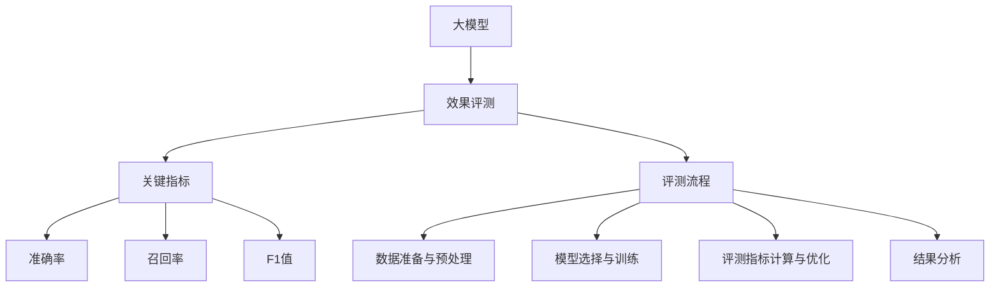

                 

### 文章标题

# 大模型效果评测：从人工到自动化的演进

## 关键词
- 大模型效果评测
- 人工评测
- 自动化评测
- 模型评估指标
- 评测流程
- 评测工具

## 摘要
本文探讨了从人工评测到自动化评测在大模型效果评测中的演进过程。首先介绍了大模型的发展背景与挑战，接着详细分析了大模型效果评测的核心概念、关键指标以及评测流程。随后，深入探讨了人工评测与自动化评测的优势与局限性，并介绍了各自的方法与实践。文章最后讨论了两者结合的必要性及未来发展趋势，指出了面临的挑战与机遇。

---

### 引言

大模型（Large Models）在现代人工智能研究中扮演着至关重要的角色。随着深度学习技术的快速发展，大模型的应用场景不断扩大，从自然语言处理（NLP）、计算机视觉（CV）到推荐系统（RS）等各个领域都取得了显著的成果。然而，大模型的效果评测（Model Evaluation）却面临着一系列挑战。

#### 大模型的发展与挑战

大模型通常具有以下特点：

1. **规模巨大**：包含数亿甚至数十亿的参数。
2. **计算复杂度高**：训练和推理过程需要大量的计算资源。
3. **泛化能力强**：能够处理复杂和多样化的任务。

这些特点带来了以下挑战：

1. **训练难度大**：需要大量高质量的数据和计算资源。
2. **调优复杂**：参数和超参数的选择对模型性能有显著影响。
3. **效果评测困难**：如何全面、准确地评估大模型的效果成为一个难题。

#### 评测在大模型研究中的作用

大模型效果评测不仅是为了验证模型的性能，更是为了指导模型的优化和改进。有效的评测方法可以帮助研究者：

1. **识别模型优势**：发现模型在不同任务上的表现差异。
2. **指导模型改进**：通过评测结果指导参数调整和算法优化。
3. **保证模型安全**：评估模型在特定应用场景下的鲁棒性和可靠性。

#### 人工评测与自动化评测的区别

传统上，大模型的效果评测主要依赖于人工评测。人工评测具有以下特点：

1. **全面性**：能从多个角度评估模型性能，如精度、速度、用户满意度等。
2. **灵活性**：可以根据实际需求调整评测内容和标准。

然而，人工评测也存在着局限性：

1. **主观性**：不同评估者可能得出不同的结论。
2. **效率低**：耗时且成本高。

相比之下，自动化评测具有以下优势：

1. **客观性**：基于数据驱动，结果更客观。
2. **效率高**：能够快速、大规模地评估多个模型。

但是，自动化评测也有其不足之处，如可能忽略一些非数值化的评价指标。

### 文章结构

本文将按照以下结构展开：

1. **核心概念与联系**：介绍大模型的基本概念及其效果评测的关键指标。
2. **评测原理**：探讨大模型效果评测的理论基础和数学模型。
3. **人工评测**：分析人工评测的优势、局限性及方法。
4. **自动化评测**：介绍自动化评测的概念、步骤和工具。
5. **结合实践**：讨论人工评测与自动化评测的结合及其应用案例。
6. **未来发展趋势**：展望大模型效果评测的发展趋势和面临的挑战。

---

接下来，我们将深入探讨大模型效果评测的核心概念与联系。

---

### 核心概念与联系

要全面理解大模型效果评测，我们首先需要明确几个核心概念：大模型、效果评测、关键指标和评测流程。

#### 大模型的基本概念

大模型（Large Models）通常指的是具有数亿到数十亿参数的深度学习模型。这些模型在训练过程中需要大量的数据和计算资源，但其强大的计算能力和广泛的适用性使得它们在多个领域表现出色。

大模型的特点可以概括为：

1. **规模巨大**：参数数量多，模型复杂度高。
2. **计算复杂度高**：训练和推理过程需要大量的计算资源。
3. **泛化能力强**：能够处理复杂和多样化的任务。

#### 大模型效果评测的关键指标

大模型效果评测的核心指标包括准确率、召回率、F1值等。这些指标能够从不同角度评估模型的性能，帮助我们全面了解模型的优劣。

1. **准确率（Accuracy）**：模型预测正确的样本数占总样本数的比例。准确率是最直观的评估指标，但可能无法充分反映模型在特定任务上的性能。

2. **召回率（Recall）**：模型预测正确的正样本数占总正样本数的比例。召回率强调模型对正样本的识别能力，但在误报率较低的情况下可能不高。

3. **F1值（F1 Score）**：准确率和召回率的调和平均值。F1值综合考虑了模型的准确率和召回率，是评估二分类问题的重要指标。

此外，还有一些其他常用指标，如精度（Precision）、精确率（Precision）和 ROC-AUC 曲线等，它们在不同场景下具有不同的应用价值。

#### 大模型效果评测流程

大模型效果评测的流程通常包括以下步骤：

1. **数据准备与预处理**：收集和整理相关数据，并进行预处理，如数据清洗、归一化等。

2. **模型选择与训练**：选择合适的模型架构，并使用训练数据进行模型训练。

3. **评测指标计算与优化**：使用测试数据计算各项评测指标，并根据评测结果调整模型参数，以优化模型性能。

4. **结果分析**：综合分析评测结果，评估模型在不同任务和场景下的性能。

#### 核心概念与联系架构

为了更清晰地展示这些核心概念之间的关系，我们可以使用 Mermaid 流程图来描述：

这个 Mermaid 流程图展示了大模型效果评测的核心概念及其相互关系，有助于读者全面理解评测过程。

#### 总结

通过明确大模型的基本概念、效果评测的关键指标和评测流程，我们可以为后续的详细讨论奠定基础。在接下来的章节中，我们将进一步探讨大模型效果评测的理论基础和数学模型。

---

在理解了大模型效果评测的核心概念后，我们将深入探讨其理论基础和数学模型。

---

### 大模型效果评测原理

大模型效果评测不仅需要明确核心概念和指标，还需要深入理解其理论基础和数学模型。这不仅有助于我们更好地设计评测方法，还能提高评测的准确性和可靠性。

#### 评测原理概述

大模型效果评测的核心目标是评估模型在实际任务中的性能，以便对其进行优化和改进。为了实现这一目标，我们需要从以下几个方面入手：

1. **评估方法**：确定如何测量模型的性能。
2. **误差分析**：分析模型预测结果与真实结果之间的差异。
3. **优化策略**：根据评测结果调整模型参数，以提升模型性能。

这些方面共同构成了大模型效果评测的原理框架。

#### 模型评估方法

模型评估方法主要包括以下几种：

1. **准确率（Accuracy）**：准确率是最常用的评估指标，它计算模型预测正确的样本数占总样本数的比例。公式如下：

   $$\text{Accuracy} = \frac{\text{预测正确的样本数}}{\text{总样本数}}$$

2. **召回率（Recall）**：召回率计算模型预测正确的正样本数占总正样本数的比例。公式如下：

   $$\text{Recall} = \frac{\text{预测正确的正样本数}}{\text{总正样本数}}$$

3. **精确率（Precision）**：精确率计算模型预测正确的正样本数与预测为正样本的总数之比。公式如下：

   $$\text{Precision} = \frac{\text{预测正确的正样本数}}{\text{预测为正样本的总数}}$$

4. **F1值（F1 Score）**：F1值是精确率和召回率的调和平均值，它能够综合反映模型的性能。公式如下：

   $$\text{F1 Score} = 2 \times \frac{\text{Precision} \times \text{Recall}}{\text{Precision} + \text{Recall}}$$

这些评估方法在不同场景下具有不同的应用价值，需要根据具体任务需求进行选择。

#### 误差分析

误差分析是评估模型性能的重要环节。我们需要分析模型预测结果与真实结果之间的差异，以便找出模型可能存在的问题。

1. **预测误差**：预测误差是模型预测值与真实值之间的差距。它可以通过以下公式计算：

   $$\text{Prediction Error} = \text{Predicted Value} - \text{True Value}$$

2. **分类误差**：在分类任务中，分类误差是指模型预测错误的样本数占总样本数的比例。公式如下：

   $$\text{Classification Error} = \frac{\text{预测错误的样本数}}{\text{总样本数}}$$

3. **回归误差**：在回归任务中，回归误差是指模型预测值与真实值之间的均方误差（Mean Squared Error，MSE）。公式如下：

   $$\text{Regression Error} = \frac{1}{n} \sum_{i=1}^{n} (\text{Predicted Value}_i - \text{True Value}_i)^2$$

通过误差分析，我们可以识别模型在特定任务上的弱点，从而有针对性地进行优化。

#### 损失函数

在深度学习中，损失函数（Loss Function）是评估模型性能的重要工具。它用于衡量模型预测值与真实值之间的差距，并指导模型优化。

1. **均方误差（MSE）**：MSE是回归任务中最常用的损失函数，它计算预测值与真实值之间平方差的均值。公式如下：

   $$\text{MSE} = \frac{1}{n} \sum_{i=1}^{n} (\text{Predicted Value}_i - \text{True Value}_i)^2$$

2. **交叉熵（Cross-Entropy）**：交叉熵是分类任务中最常用的损失函数，它计算预测概率分布与真实概率分布之间的差异。公式如下：

   $$\text{Cross-Entropy} = -\sum_{i=1}^{n} y_i \log(p_i)$$

其中，$y_i$是真实标签，$p_i$是模型预测的概率。

#### 优化算法

优化算法用于调整模型参数，以最小化损失函数。常见的优化算法包括：

1. **随机梯度下降（SGD）**：SGD是一种基于梯度信息的优化算法，它通过随机选择样本更新模型参数。公式如下：

   $$\theta = \theta - \alpha \nabla_{\theta} J(\theta)$$

其中，$\theta$是模型参数，$\alpha$是学习率，$J(\theta)$是损失函数。

2. **Adam optimizer**：Adam是SGD的改进版本，它结合了动量法和自适应学习率调整。公式如下：

   $$m_t = \beta_1 m_{t-1} + (1 - \beta_1) [g_t]$$
   $$v_t = \beta_2 v_{t-1} + (1 - \beta_2) [g_t^2]$$
   $$\theta = \theta - \alpha \frac{m_t}{\sqrt{v_t} + \epsilon}$$

其中，$m_t$和$v_t$分别是动量和方差，$\beta_1$和$\beta_2$是动量系数，$\alpha$是学习率，$\epsilon$是平滑常数。

#### 模型选择策略

在效果评测中，选择合适的模型至关重要。以下是一些常用的模型选择策略：

1. **交叉验证（Cross-Validation）**：交叉验证是一种评估模型性能的方法，它通过将数据集划分为多个子集，在每个子集上训练和评估模型，以获得更稳定的性能评估。

2. **网格搜索（Grid Search）**：网格搜索是一种参数调优方法，它通过遍历所有可能的参数组合，找到最优参数组合。

3. **贝叶斯优化（Bayesian Optimization）**：贝叶斯优化是一种基于概率模型的参数调优方法，它通过不断调整参数，使模型性能逐步提升。

通过上述方法，我们可以选择出在特定任务上表现最佳的模型，从而提高效果评测的准确性和可靠性。

#### 总结

通过深入探讨大模型效果评测的原理，我们了解了评估方法、误差分析、损失函数和优化算法等方面的关键概念。这些原理为我们提供了理论基础，使我们能够更好地设计和实施效果评测方法。在接下来的章节中，我们将进一步探讨人工评测的具体方法和实践。

---

在了解了大模型效果评测的基本原理后，接下来我们将详细讨论人工评测的方法和实践。

---

### 人工评测

人工评测在大模型效果评测中扮演着重要的角色，尽管其存在一些局限性，但在特定场景下仍具有不可替代的优势。

#### 人工评测的优势与局限性

**优势：**

1. **全面性**：人工评测可以从多个维度评估模型性能，如准确性、速度、用户体验等。这种方法可以捕捉到自动化评测难以量化的方面，提供更全面的评估。
2. **灵活性**：人工评测可以根据具体需求和任务调整评估指标和标准，适应不同的评测场景。
3. **辅助优化**：人工评测结果可以为模型优化提供有价值的反馈，帮助研究者识别模型存在的问题并进行针对性改进。

**局限性：**

1. **主观性**：不同评估者可能对同一模型有不同的评估结果，这可能导致评估结果的不一致和偏差。
2. **效率低**：人工评测通常需要大量时间和人力资源，特别是在大规模评测中，效率较低。
3. **成本高**：人工评测的成本较高，特别是在需要大量评估者参与的情况下。

#### 人工评测的方法与实践

**1. 评测流程：**

人工评测的流程通常包括以下几个步骤：

1. **数据准备与预处理**：准备用于评测的数据集，并进行预处理，如数据清洗、归一化等。
2. **模型部署与验证**：将模型部署到评测环境中，并使用验证集对模型进行初步验证，确保其正常工作。
3. **评测指标确定**：根据具体任务和需求，确定评估模型性能的指标，如准确率、召回率、F1值等。
4. **评估过程**：评估者根据评估指标对模型进行评估，记录评估结果。
5. **结果分析**：分析评估结果，识别模型的优势和不足，提出改进建议。

**2. 评测指标：**

人工评测常用的指标包括准确率、召回率、F1值等。这些指标可以帮助评估者在多个维度上评价模型性能。

- **准确率（Accuracy）**：计算模型预测正确的样本数占总样本数的比例。公式如下：

  $$\text{Accuracy} = \frac{\text{预测正确的样本数}}{\text{总样本数}}$$

- **召回率（Recall）**：计算模型预测正确的正样本数占总正样本数的比例。公式如下：

  $$\text{Recall} = \frac{\text{预测正确的正样本数}}{\text{总正样本数}}$$

- **F1值（F1 Score）**：F1值是精确率和召回率的调和平均值，它综合考虑了模型的准确率和召回率。公式如下：

  $$\text{F1 Score} = 2 \times \frac{\text{Precision} \times \text{Recall}}{\text{Precision} + \text{Recall}}$$

**3. 实践案例：**

以下是一个关于人工评测在大模型效果评测中应用的案例：

**案例：文本分类任务中的模型评估**

- **任务背景**：在文本分类任务中，我们需要评估一个文本分类模型在不同类别上的性能。
- **评测指标**：我们选择了准确率、召回率、F1值作为评测指标。
- **评测过程**：首先，我们准备了三个数据集：训练集、验证集和测试集。然后，我们使用验证集对模型进行初步验证，确保其正常工作。接着，我们使用测试集对模型进行评估，记录各项指标。最后，分析评估结果，提出改进建议。

通过这个案例，我们可以看到人工评测在文本分类任务中的具体应用。评估者可以根据评估结果调整模型参数，优化模型性能。

#### 总结

人工评测在大模型效果评测中具有不可替代的优势，但其局限性也不容忽视。通过合理地应用人工评测方法，我们可以全面、准确地评估模型性能，为模型优化提供有价值的信息。在接下来的章节中，我们将进一步探讨自动化评测的方法与实践。

---

在讨论了人工评测的方法与实践后，接下来我们将深入探讨自动化评测的概念、步骤和工具。

---

### 自动化评测

自动化评测在大模型效果评测中扮演着越来越重要的角色。与人工评测相比，自动化评测具有更高的效率、更低的成本和更高的可扩展性。在本节中，我们将详细探讨自动化评测的概念、实现步骤和常用工具。

#### 自动化评测的概念

自动化评测（Automated Evaluation）是指利用计算机程序自动评估模型性能的方法。这种方法通过预先定义的评测指标和算法，对模型进行快速、大规模的评估，从而提高了评测的效率和准确性。

自动化评测的核心特点包括：

1. **客观性**：自动化评测基于数据驱动，结果更客观，减少了主观因素的影响。
2. **效率高**：自动化评测可以处理大规模数据，速度快，大大提高了评测的效率。
3. **可扩展性**：自动化评测可以轻松扩展到多个模型和任务，适用范围广泛。

#### 自动化评测的实现步骤

自动化评测通常包括以下几个步骤：

1. **数据准备与预处理**：收集和整理相关数据，并进行预处理，如数据清洗、归一化等，以确保数据的质量和一致性。
2. **评测指标定义**：根据具体任务需求，定义相应的评测指标，如准确率、召回率、F1值等。
3. **评估模型选择**：选择合适的评估模型，可以是现有的预训练模型，也可以是自定义训练的模型。
4. **模型部署与训练**：将评估模型部署到评测环境中，并使用训练数据进行训练。
5. **评测指标计算**：使用测试数据计算各项评测指标，生成评估报告。
6. **结果分析**：分析评估结果，识别模型的优势和不足，为模型优化提供依据。

#### 常用工具

在自动化评测中，常用的工具包括以下几种：

1. **Scikit-learn**：Scikit-learn是一个强大的机器学习库，它提供了丰富的评估指标和模型评估工具，方便用户进行自动化评测。
2. **TensorFlow**：TensorFlow是Google开发的开源机器学习库，它支持深度学习模型的训练和评估，非常适合自动化评测。
3. **PyTorch**：PyTorch是另一个流行的机器学习库，它提供了灵活的动态计算图，适合快速原型设计和自动化评测。
4. **MLflow**：MLflow是一个开源平台，用于管理机器学习项目的生命周期，包括模型训练、评估和部署，非常适合自动化评测。

#### 自动化评测的优势

自动化评测具有以下优势：

1. **高效性**：自动化评测可以快速处理大量数据，节省了评估时间。
2. **准确性**：基于数据驱动的评估方法，结果更准确，减少了人为误差。
3. **可扩展性**：自动化评测可以轻松扩展到多个模型和任务，提高了评测的覆盖面。

#### 自动化评测的局限性

尽管自动化评测具有诸多优势，但也有一些局限性：

1. **精度限制**：自动化评测可能无法捕捉到某些非数值化的评价指标，如用户体验。
2. **适用范围**：自动化评测在某些复杂任务上可能表现不佳，需要结合其他评估方法。

#### 自动化评测与人工评测的结合

在实际应用中，自动化评测和人工评测往往需要结合使用。自动化评测可以快速、大规模地评估模型性能，提供初步的评估结果；而人工评测则可以深入分析模型的表现，发现自动化评测无法捕捉的问题。两者结合可以提供更全面、准确的评估结果。

#### 总结

自动化评测在大模型效果评测中发挥着重要作用，通过使用自动化评测工具和方法，我们可以高效、准确地评估模型性能。在接下来的章节中，我们将进一步探讨如何将自动化评测与人工评测相结合，以实现更全面的效果评测。

---

在讨论了自动化评测的概念和实现步骤后，接下来我们将详细分析自动化评测的性能评估指标。

---

### 自动化评测的性能评估

自动化评测的性能评估是确保模型评估结果准确性和可靠性的关键环节。为了全面评估自动化评测的性能，我们需要关注以下几个方面：准确性、效率、可扩展性以及与人工评测的对比。

#### 准确性

准确性是自动化评测的首要评估指标，它衡量的是自动化评测方法对模型性能的识别程度。常见的准确性指标包括：

1. **准确率（Accuracy）**：准确率计算的是模型预测正确的样本数占总样本数的比例。其计算公式为：

   $$\text{Accuracy} = \frac{\text{预测正确的样本数}}{\text{总样本数}}$$

   准确率高意味着模型在预测时能够正确识别出大多数样本。

2. **召回率（Recall）**：召回率计算的是模型预测正确的正样本数占总正样本数的比例。其计算公式为：

   $$\text{Recall} = \frac{\text{预测正确的正样本数}}{\text{总正样本数}}$$

   召回率高意味着模型在识别正样本时能够较少地漏报。

3. **精确率（Precision）**：精确率计算的是模型预测正确的正样本数与预测为正样本的总数之比。其计算公式为：

   $$\text{Precision} = \frac{\text{预测正确的正样本数}}{\text{预测为正样本的总数}}$$

   精确率高意味着模型在预测正样本时错误地标记为负样本的概率较低。

4. **F1值（F1 Score）**：F1值是精确率和召回率的调和平均值，能够综合反映模型的性能。其计算公式为：

   $$\text{F1 Score} = 2 \times \frac{\text{Precision} \times \text{Recall}}{\text{Precision} + \text{Recall}}$$

   F1值越高，表示模型的性能越好。

#### 效率

效率是自动化评测的另一重要评估指标，它衡量的是评测方法在处理数据时的速度和资源消耗。以下是一些衡量效率的指标：

1. **评估时间**：评估时间是指从模型部署到生成评估结果所需的时间。评估时间短意味着评测方法快速高效。

2. **计算资源消耗**：计算资源消耗包括CPU、GPU等硬件资源的利用情况。低计算资源消耗意味着评测方法能够高效利用现有资源。

3. **并发处理能力**：并发处理能力是指评测方法能够同时处理多个模型的评估。高并发处理能力意味着评测方法在大规模评测时表现优异。

#### 可扩展性

可扩展性是自动化评测的一个重要特点，它衡量的是评测方法在大规模数据集和多种任务场景下的适用性。以下是一些衡量可扩展性的指标：

1. **数据集大小适应性**：评测方法需要能够适应不同大小的数据集，从小型数据集到大型数据集都能保持高效的评估性能。

2. **任务多样性适应性**：评测方法需要能够适应不同类型的任务，如分类、回归、聚类等，确保在不同任务下都能准确评估模型性能。

3. **模型多样性适应性**：评测方法需要能够适应不同类型的模型，如深度学习模型、传统机器学习模型等，确保能够全面评估各种模型的性能。

#### 与人工评测的对比

自动化评测和人工评测各有优劣，结合使用可以发挥各自的优势。以下是对两者的对比：

1. **准确性**：自动化评测在处理大量数据和重复性任务时具有更高的准确性，而人工评测在处理复杂、非标准化的任务时可能更准确。

2. **效率**：自动化评测在处理大规模数据和重复性任务时具有更高的效率，而人工评测在处理小规模数据或复杂任务时可能更快。

3. **灵活性**：自动化评测的评估指标和方法通常是固定的，而人工评测可以根据具体需求灵活调整。

4. **成本**：自动化评测的成本较低，特别是随着自动化工具的普及，成本更低；人工评测的成本较高，特别是在需要大量评估者参与的情况下。

#### 总结

自动化评测的性能评估涉及多个方面，包括准确性、效率、可扩展性以及与人工评测的对比。通过综合考虑这些指标，我们可以全面评估自动化评测的性能，并优化评估方法，提高评测的准确性和可靠性。在接下来的章节中，我们将进一步探讨如何将自动化评测与人工评测结合使用，实现更全面的效果评测。

---

在讨论了自动化评测的性能评估后，接下来我们将深入探讨如何将自动化评测与人工评测相结合，以实现更全面的效果评测。

---

### 自动化评测与人工评测的结合

在效果评测过程中，自动化评测和人工评测各有优势。自动化评测能够快速、大规模地处理数据，提供初步的评估结果；人工评测则能够深入分析模型的表现，发现自动化评测可能遗漏的问题。将两者结合，可以充分发挥各自的优势，实现更全面、准确的评估。

#### 互补关系

**1. 提高准确性：**
自动化评测可以在大规模数据集上快速提供初步评估结果，而人工评测则可以在关键任务上提供更细致的评估。两者结合，可以在不同层面上提高评估的准确性。

**2. 增强灵活性：**
自动化评测的评估指标和方法通常是固定的，而人工评测可以根据具体需求灵活调整。这种灵活性使得人工评测能够应对复杂和多样化的评估场景。

**3. 降低成本：**
自动化评测能够提高评估效率，减少评估时间，从而降低评估成本。人工评测虽然成本较高，但在关键任务上仍具有不可替代的作用。通过合理分配资源，可以在保证评估质量的同时降低总成本。

#### 应用场景

**1. 大规模数据集：**
在处理大规模数据集时，自动化评测能够高效地完成初步评估，快速识别模型的性能。人工评测则可以在重点领域，如特定类别或样本，进行深入分析。

**2. 复杂任务：**
在处理复杂任务时，自动化评测可能无法全面捕捉所有关键信息。人工评测可以在此基础上，提供更详细、更全面的评估结果，帮助识别模型的问题。

**3. 多元化场景：**
在不同应用场景中，自动化评测和人工评测可以根据具体需求，灵活组合使用。例如，在开发阶段，自动化评测可以快速评估模型的性能；在生产环境中，人工评测可以确保模型的稳定性和可靠性。

#### 结合方法

**1. 分阶段评估：**
首先，使用自动化评测对模型进行初步评估，获取整体性能指标；然后，人工评测对关键任务或特定领域进行深入分析，提供更详细的评估结果。

**2. 多指标综合评估：**
结合多种评估指标，如准确率、召回率、F1值等，使用自动化评测计算初步结果，人工评测则在关键指标上提供专业判断，确保评估结果的全面性和准确性。

**3. 动态调整：**
在评估过程中，根据实际情况动态调整评估方法和指标，确保评估结果能够真实反映模型性能。例如，在模型优化过程中，可以实时调整评估指标，以指导模型改进。

#### 实践案例

**案例一：自然语言处理中的模型评估**

在自然语言处理（NLP）中，自动化评测可以快速评估模型的文本分类性能，如准确率、召回率和F1值。人工评测则可以深入分析模型在特定领域或特定类别的表现，识别潜在问题。通过结合自动化评测和人工评测，可以更全面地评估模型的性能，指导模型优化。

**案例二：计算机视觉中的模型评估**

在计算机视觉（CV）中，自动化评测可以评估模型的图像分类、目标检测等任务。人工评测则可以检查模型的鲁棒性，如对遮挡、光照变化的适应性。通过结合自动化评测和人工评测，可以更准确地评估模型的性能，提高模型的应用价值。

#### 总结

自动化评测与人工评测的结合，可以充分发挥各自的优势，实现更全面、准确的模型效果评测。在具体应用中，需要根据任务需求和评估目标，灵活选择和组合评估方法，以提高评估效果。通过合理结合自动化评测和人工评测，我们可以更好地指导模型优化，推动人工智能技术的发展。

---

在探讨了自动化评测与人工评测的结合后，接下来我们将分析大模型效果评测的未来发展趋势。

---

### 大模型效果评测的未来发展趋势

随着深度学习和大数据技术的快速发展，大模型效果评测正经历着从传统方法到现代化技术的转变。未来的发展趋势将主要集中在新技术引入、评测方法创新以及自动化评测与人工评测的深度融合等方面。

#### 新技术引入

**1. 强化学习（Reinforcement Learning）**：强化学习在大模型效果评测中具有巨大潜力，可以通过与深度学习模型的结合，实现更高效、更准确的模型评估。强化学习能够模拟真实应用环境，通过不断交互和反馈，优化模型性能。

**2. 自适应评测（Adaptive Evaluation）**：自适应评测可以根据评估过程中的实时反馈，动态调整评测策略和指标，从而更准确地反映模型在不同任务和场景下的性能。这种技术可以大幅提高评测效率，降低评估成本。

**3. 多模态融合（Multimodal Fusion）**：多模态融合技术可以将不同类型的传感器数据（如文本、图像、音频等）进行整合，从而提供更全面、更细致的模型评估。这种技术在大模型效果评测中的应用将越来越广泛。

#### 评测方法创新

**1. 个性化评测（Personalized Evaluation）**：个性化评测可以根据用户的特定需求，定制化的评估模型性能。这种方法能够更好地满足不同用户群体的需求，提供更精准的评估结果。

**2. 鲁棒性评估（Robustness Evaluation）**：鲁棒性评估旨在评估模型在不同噪声和干扰条件下的性能，以确保模型在实际应用中的稳定性和可靠性。这种评测方法对于提升模型的安全性和实用性具有重要意义。

**3. 可解释性评估（Explainability Evaluation）**：随着大模型的复杂度增加，如何确保模型的决策过程透明和可解释成为关键问题。可解释性评估可以通过可视化、推理等方法，揭示模型内部的决策机制，提高模型的信任度和应用价值。

#### 自动化评测与人工评测的深度融合

**1. 融合评估框架（Integrated Evaluation Framework）**：未来的大模型效果评测将构建一个融合自动化评测和人工评测的评估框架，通过自动化评测快速提供初步结果，人工评测进行深入分析，实现评估的全面性和准确性。

**2. 评估模型自动化（Automated Evaluation Models）**：利用机器学习技术，开发自动化评估模型，可以自动识别和调整评估指标，提高评估效率。这些自动化评估模型可以通过不断的训练和优化，逐步提升评估的准确性和可靠性。

**3. 跨领域协作（Cross-Domain Collaboration）**：不同领域的研究者和工程师将进行更多的合作，共同开发适用于不同场景的评估方法和技术。这种跨领域协作将推动大模型效果评测技术的不断进步。

#### 挑战与机遇

尽管大模型效果评测的未来发展前景广阔，但仍然面临着一系列挑战：

**1. 数据质量和多样性**：高质量、多样化的数据是评估模型性能的基础。然而，在实际应用中，数据质量和多样性常常受到限制，这需要开发新的数据增强和生成技术。

**2. 资源消耗**：大模型效果评测通常需要大量的计算资源和时间，如何优化评测流程，降低资源消耗，是一个重要的挑战。

**3. 评估标准的统一性**：不同任务和场景下，评估标准可能存在差异，如何建立统一的评估标准，确保评估结果的公平性和可比性，是一个亟待解决的问题。

**4. 伦理和法律问题**：随着大模型的应用范围不断扩大，如何确保评估过程的透明性、公正性和伦理合规，是未来需要重点关注的问题。

然而，这些挑战也伴随着巨大的机遇：

**1. 技术创新**：随着新技术的不断引入，大模型效果评测技术将迎来新的创新和发展，为人工智能领域带来更多突破。

**2. 应用扩展**：随着评测技术的不断进步，大模型将能够应用于更多领域和场景，推动人工智能技术的发展和应用。

**3. 产业合作**：不同领域的企业和研究机构将开展更多的合作，共同推动大模型效果评测技术的发展，实现产业协同创新。

#### 总结

大模型效果评测的未来发展趋势将集中在新技术引入、评测方法创新以及自动化评测与人工评测的深度融合等方面。通过克服面临的挑战，抓住机遇，我们可以期待大模型效果评测技术的不断进步，为人工智能领域带来更多突破和机遇。

---

在讨论了大模型效果评测的未来发展趋势后，接下来我们将总结本文的主要观点，并提出一些最佳实践和注意事项。

---

### 结论

本文系统地探讨了从人工评测到自动化评测的大模型效果评测演进。我们首先介绍了大模型的发展背景和挑战，分析了大模型效果评测的核心概念、关键指标和评测流程。接着，我们深入探讨了人工评测和自动化评测的优势、局限以及具体的方法和实践。通过结合两者的优势，我们提出了一系列最佳实践，并展望了未来发展趋势。

#### 最佳实践

1. **合理选择评估方法**：根据任务需求和评估目标，合理选择人工评测或自动化评测，或两者结合。
2. **数据质量保障**：确保评估数据的质量和多样性，通过数据清洗、增强和生成技术提升数据质量。
3. **评估指标多样化**：结合多种评估指标，从不同角度全面评估模型性能。
4. **持续优化评测流程**：通过不断优化评测流程，提高评测效率和准确性。
5. **融合技术与实践**：积极引入新技术和方法，推动评测技术的不断创新和应用。

#### 注意事项

1. **避免过度依赖自动化评测**：尽管自动化评测具有高效性和客观性，但可能无法捕捉到所有关键信息。因此，在关键任务上仍需结合人工评测。
2. **确保评估标准统一**：建立统一的评估标准，确保评估结果的公平性和可比性。
3. **关注伦理和法律问题**：在评估过程中，关注数据隐私和伦理问题，确保评估过程的合法性和合规性。
4. **持续学习和优化**：随着技术的不断进步，持续学习和优化评估方法，以适应新的应用场景和需求。

#### 拓展阅读

- **《深度学习》**：Goodfellow, I., Bengio, Y., & Courville, A. (2016). *Deep Learning*.
- **《机器学习年度回顾2019》**：Li, Y., & Zhang, C. (2019). *Annual Review of Machine Learning*.
- **《自然语言处理综论》**：Jurafsky, D., & Martin, J. H. (2019). *Speech and Language Processing*.

通过本文的探讨，我们期待读者能够对大模型效果评测有更深入的理解，并在实际应用中不断探索和实践，推动人工智能技术的发展。

---

### 作者信息

作者：AI天才研究院/AI Genius Institute & 禅与计算机程序设计艺术 /Zen And The Art of Computer Programming

---

通过这篇文章，我们希望能够帮助读者深入了解大模型效果评测，从人工到自动化的演进过程，以及如何在实际应用中更好地使用这些方法。感谢您的阅读，期待与您在人工智能领域共同探索更多前沿技术。

