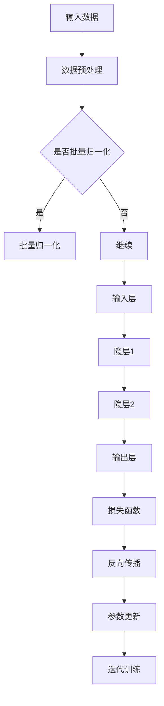

                 

### 《大模型时代的软件工程方法论》

在人工智能迅猛发展的今天，大模型（Large Models）已经成为引领科技前沿的重要力量。这些大规模训练的深度学习模型，如GPT、BERT等，展现了超越人类专家的强大能力。面对这个新时代，软件工程方法论也需要随之更新。本书《大模型时代的软件工程方法论》旨在探讨大模型时代背景下的软件工程新理念、新方法和新工具，为软件开发提供新的思路和解决方案。

**关键词：**
- 大模型
- 软件工程方法论
- 深度学习
- 自动化
- 工具与平台

**摘要：**
本书将从大模型时代的背景入手，深入剖析大模型的核心概念、原理与架构，探讨大模型相关技术如计算机视觉、自然语言处理和机器学习算法的应用场景。接着，我们将介绍大模型时代软件工程的方法与策略，包括传统软件工程方法论的发展、大模型工程化实践和大模型工具与平台。通过案例分析，本书将展示大模型在软件开发中的实际应用，并展望大模型时代软件工程的未来趋势。本书的目标是帮助读者理解并掌握大模型时代的软件工程方法论，为未来的软件开发提供有力支持。

### 引言

大模型时代的到来，标志着人工智能进入了一个全新的阶段。在这个时代，深度学习模型如GPT、BERT等以其强大的学习和推理能力，正在深刻改变各个行业，从自然语言处理到计算机视觉，再到智能推荐和自动化系统。这种变革对软件工程提出了新的挑战和机遇。

首先，大模型带来了软件工程中算法和架构的变革。传统的软件开发方法往往依赖于明确的算法和固定的架构，而大模型则以其复杂的神经网络结构和自学习的能力，使得软件系统的设计更加灵活和自适应。其次，大模型的出现也推动了软件工程的自动化和智能化。通过大模型，我们可以自动化地完成许多原本需要人工完成的任务，如代码生成、代码审查和软件测试等，从而提高开发效率和代码质量。

然而，大模型时代的软件工程也面临着一系列新的挑战。例如，大模型的训练和部署需要大量的计算资源和存储空间，这对开发环境提出了更高的要求。此外，大模型的解释性和可解释性也是一个亟待解决的问题，因为复杂的神经网络模型往往难以理解和解释其内部决策过程。

本书《大模型时代的软件工程方法论》旨在为读者提供系统的指导，帮助他们在这一新时代中应对挑战、把握机遇。我们将从以下几个方面展开讨论：

1. **基础理论部分**：介绍大模型时代的背景与核心概念，包括大模型原理与架构、相关技术和应用场景。
2. **方法与工具部分**：探讨大模型时代软件工程的方法与策略，包括大模型工程化实践、大模型工具与平台。
3. **实战案例部分**：通过实际案例研究，展示大模型在软件开发中的应用，并详细解读开发环境搭建、源代码实现和案例分析。
4. **未来展望部分**：分析大模型时代软件工程的未来趋势，讨论面临的挑战与对策，以及教育与实践的方向。

通过本书的阅读，读者将能够深入了解大模型时代的软件工程方法论，掌握大模型的应用和开发技巧，为未来的软件开发提供有力支持。

### 基础理论部分

#### 第1章 大模型时代软件工程的背景与核心概念

##### 1.1 大模型时代软件工程概述

软件工程的发展历程可以分为几个主要阶段：从早期的编码时代，到结构化编程，再到面向对象编程，以及近年来敏捷开发和DevOps的兴起。每个阶段都带来了软件开发方法、工具和流程的变革，极大地提高了开发效率和代码质量。

大模型时代的到来，再次颠覆了传统软件工程的格局。深度学习模型的崛起，尤其是大模型的广泛应用，使得软件系统能够通过学习大量数据来实现复杂的任务。这种变化不仅改变了软件系统的设计理念，也带来了新的开发挑战和机遇。

大模型时代对软件工程的影响主要体现在以下几个方面：

1. **算法与架构变革**：传统的软件开发依赖于明确的算法和固定的架构，而大模型以其复杂的神经网络结构和自学习的能力，使得软件系统的设计更加灵活和自适应。
2. **自动化与智能化**：大模型的出现推动了软件工程的自动化和智能化，通过大模型，我们可以自动化地完成许多原本需要人工完成的任务，如代码生成、代码审查和软件测试等。
3. **计算资源需求增加**：大模型的训练和部署需要大量的计算资源和存储空间，这对开发环境提出了更高的要求。

##### 1.2 大模型原理与架构

大模型通常指的是具有数十亿至数万亿参数的深度学习模型，这些模型通过大规模的数据训练，能够实现高度复杂的任务。以下是大模型的基本原理与常见架构：

1. **基本原理**：
   - **多层神经网络**：大模型通常由多个隐层构成，每个隐层能够学习到不同层次的特征。
   - **反向传播算法**：通过反向传播算法，模型能够根据输出误差调整内部参数，实现自我优化。
   - **批量归一化**：批量归一化技术能够加速模型训练并提高其性能。

2. **常见架构**：
   - **全连接神经网络（Fully Connected Neural Network）**：每个神经元都与前一层的所有神经元相连。
   - **卷积神经网络（Convolutional Neural Network, CNN）**：适用于图像处理任务，通过卷积操作提取空间特征。
   - **循环神经网络（Recurrent Neural Network, RNN）**：适用于序列数据处理，能够记忆历史信息。
   - **变换器网络（Transformer）**：引入了注意力机制，特别适用于自然语言处理任务。

以下是一个简单的Mermaid流程图，展示大模型的基本原理与架构：

##### 1.3 大模型相关技术

大模型的广泛应用离不开一系列关键技术的支持，以下介绍几种主要的相关技术：

1. **计算机视觉**：
   - **卷积神经网络（CNN）**：通过卷积操作提取图像特征，广泛应用于图像分类、目标检测和图像分割等任务。
   - **生成对抗网络（GAN）**：通过生成器和判别器的对抗训练，能够生成高质量的自然图像。

2. **自然语言处理（NLP）**：
   - **变换器网络（Transformer）**：引入了多头自注意力机制，在自然语言处理任务中表现出色，如机器翻译、文本分类和问答系统。
   - **预训练与微调**：通过在大规模语料上进行预训练，再针对特定任务进行微调，显著提高了模型的效果。

3. **机器学习算法**：
   - **监督学习、无监督学习和半监督学习**：不同的学习方式适用于不同的场景，能够自动从数据中学习到有用的特征。
   - **强化学习**：通过不断试错，模型能够学习到最优策略，广泛应用于游戏、机器人控制和自动驾驶等领域。

##### 1.4 大模型的应用场景

大模型的应用场景非常广泛，涵盖了多个行业和领域：

1. **企业数字化转型**：
   - **智能客服系统**：通过自然语言处理技术，提供24/7的在线客服服务。
   - **供应链优化**：利用计算机视觉和预测模型，提高供应链的效率和管理。

2. **人工智能助手**：
   - **智能语音助手**：如苹果的Siri、谷歌的Google Assistant，通过语音交互提供便捷的服务。
   - **聊天机器人**：在社交媒体、电子商务和客户服务等领域广泛应用，提供个性化的用户体验。

3. **智能推荐系统**：
   - **个性化推荐**：根据用户的历史行为和偏好，推荐商品、内容和广告。
   - **搜索引擎**：利用自然语言处理技术，提供精准的搜索结果。

通过本章的介绍，读者对大模型时代的软件工程有了初步的认识。接下来，我们将进一步探讨大模型时代软件工程的方法与策略，为实际开发提供更深入的指导。

### 方法与工具部分

#### 第2章 大模型时代软件工程的方法与策略

##### 2.1 软件工程方法论的发展

软件工程方法论的发展经历了多个阶段，从早期的编码时代，到结构化编程，再到面向对象编程，以及近年来敏捷开发和DevOps的兴起。每个阶段都带来了软件开发方法、工具和流程的变革，极大地提高了开发效率和代码质量。

1. **编码时代**：
   - 主要依靠个体程序员的经验和技能，开发过程缺乏系统性和规范性。
   - 代表方法：手写代码，缺乏文档和管理。

2. **结构化编程**：
   - 强调模块化和代码复用，引入了函数、过程和模块等概念。
   - 代表方法：瀑布模型，从需求分析、设计、实现、测试到维护，每个阶段都相对独立。

3. **面向对象编程**：
   - 强调封装、继承和多态等面向对象的概念，使得代码更具有扩展性和可维护性。
   - 代表方法：面向对象设计（OOD），通过类和对象构建软件系统。

4. **敏捷开发**：
   - 强调迭代和增量式开发，快速响应变化，提高开发效率和用户满意度。
   - 代表方法：Scrum、Kanban等敏捷框架。

5. **DevOps**：
   - 强调开发和运维的紧密结合，实现持续集成、持续交付和自动化部署。
   - 代表方法：DevOps文化，持续集成（CI）/持续部署（CD）等工具。

随着大模型的兴起，软件工程方法论也在不断进化。大模型的引入，不仅改变了软件系统的设计理念，也对软件开发方法提出了新的要求。以下是大模型时代软件工程方法论的发展趋势：

1. **数据驱动开发**：
   - 大模型依赖于大量数据训练，因此数据质量和数据量成为开发的关键因素。
   - 代表方法：数据管理、数据预处理和特征工程。

2. **模型驱动开发**：
   - 大模型能够自动化完成许多原本需要人工完成的任务，如代码生成、代码审查和软件测试等。
   - 代表方法：生成对抗网络（GAN）、自动代码生成等。

3. **自适应开发**：
   - 大模型具有自学习的能力，能够根据反馈进行调整，提高开发过程的适应性和灵活性。
   - 代表方法：自适应测试、自适应调试等。

##### 2.2 大模型工程化实践

大模型工程化实践是指在大规模生产环境中，将大模型应用转化为实际软件系统的过程。这一过程包括大模型开发流程、项目管理、测试与优化等关键环节。

1. **大模型开发流程**：
   - **需求分析**：明确大模型的应用场景和目标，收集相关数据并制定数据策略。
   - **模型设计**：选择合适的大模型架构，定义输入输出、参数设置等。
   - **数据预处理**：对原始数据进行清洗、归一化、缺失值处理等，确保数据质量。
   - **模型训练**：使用大规模数据训练大模型，调整超参数，优化模型性能。
   - **模型评估**：通过测试集和验证集评估模型效果，选择最佳模型。
   - **模型部署**：将训练好的模型部署到生产环境中，实现实时应用。

2. **大模型项目管理**：
   - **资源管理**：确保有足够的计算资源和存储资源支持大模型的训练和部署。
   - **进度管理**：制定详细的开发计划，确保项目按时完成。
   - **风险管理**：识别和应对可能的项目风险，如数据隐私、计算资源不足等。

3. **大模型测试与优化**：
   - **测试策略**：设计合理的测试用例，确保模型在不同场景下的性能。
   - **性能优化**：通过调整模型结构、超参数和训练策略，提高模型性能。
   - **错误分析**：分析模型在测试中的错误，寻找优化空间。

##### 2.3 大模型工具与平台

大模型的训练和部署需要一系列专业的工具与平台支持。以下是一些常用的大模型工具与平台：

1. **深度学习框架**：
   - **TensorFlow**：由Google开发，支持多种神经网络架构，适用于科研和工业应用。
   - **PyTorch**：由Facebook开发，提供灵活的动态计算图，广泛应用于学术研究和工业项目。
   - **Keras**：基于Theano和TensorFlow的高层API，简化了深度学习模型的构建和训练。

2. **分布式计算平台**：
   - **Apache Spark**：支持大规模数据处理和分布式计算，适用于大数据应用。
   - **Distributed TensorFlow**：支持在多台机器上分布式训练TensorFlow模型，提高训练效率。
   - **Horovod**：支持在多GPU和多机集群上分布式训练深度学习模型。

3. **大模型开发环境搭建**：
   - **Google Colab**：基于Google Drive的免费Jupyter Notebook平台，提供强大的GPU计算能力。
   - **Docker**：容器化技术，用于搭建一致的开发环境，便于模型部署。
   - **AWS S3**：Amazon提供的对象存储服务，用于存储大量数据和模型文件。

通过本章的讨论，读者对大模型时代软件工程的方法与策略有了更深入的理解。接下来，我们将通过实际案例，展示大模型在软件开发中的应用，进一步探讨大模型时代的开发实践。

### 实战案例部分

#### 第3章 大模型时代软件工程案例研究

在本章中，我们将通过实际案例研究，深入探讨大模型在软件开发中的应用。首先，我们将介绍一个企业级大模型项目实战，然后分析大模型在代码生成、代码审查和软件测试中的应用。

##### 3.1 企业级大模型项目实战

**项目背景与目标**

某知名互联网公司希望利用大模型提升其产品推荐的准确性，从而提高用户满意度和增加销售额。项目目标是开发一个基于大模型的推荐系统，能够根据用户的历史行为和偏好，为每个用户生成个性化的推荐列表。

**项目实现过程**

1. **需求分析**：
   - 收集用户的历史行为数据，包括浏览记录、购买历史、点击记录等。
   - 明确推荐系统的目标，如提升推荐准确性、提高用户点击率和转化率等。

2. **数据预处理**：
   - 对原始数据进行清洗，处理缺失值、异常值等。
   - 对数据特征进行编码，如将类别特征转换为数值特征。
   - 分离出训练集和测试集，用于模型训练和评估。

3. **模型设计**：
   - 选择合适的推荐算法，如矩阵分解、协同过滤、变换器网络等。
   - 设计模型的输入输出，确定输入特征和目标变量。

4. **模型训练**：
   - 使用大规模数据集训练推荐模型，调整超参数，优化模型性能。
   - 通过交叉验证和网格搜索等方法，选择最佳模型。

5. **模型评估**：
   - 使用测试集评估模型效果，计算准确率、召回率、F1分数等指标。
   - 根据评估结果调整模型参数，进一步提高模型性能。

6. **模型部署**：
   - 将训练好的模型部署到生产环境，实现实时推荐功能。
   - 部署过程中，考虑到系统的扩展性和容错性，采用分布式计算和容器化技术。

**项目成果与应用**

通过项目实施，企业成功开发了一个基于大模型的推荐系统，显著提升了推荐的准确性和用户满意度。具体成果如下：

1. **推荐准确性提高**：模型能够根据用户行为和偏好，生成更加精准的推荐列表，用户点击率和转化率显著提升。
2. **用户满意度增加**：个性化推荐系统提高了用户体验，用户对产品的满意度大幅提高。
3. **销售额增加**：推荐系统有效地提高了产品销售，公司整体销售额显著增加。

##### 3.2 大模型在软件开发中的应用

1. **代码生成**：
   - 大模型在代码生成中的应用主要是基于生成对抗网络（GAN）和自动编码器（Autoencoder）等算法，能够自动生成高质量的代码片段。
   - **实现过程**：
     1. **数据收集**：收集大量已有的代码数据，如开源项目、博客文章等。
     2. **数据预处理**：对代码进行预处理，提取特征并编码。
     3. **模型训练**：使用GAN或Autoencoder模型，训练生成器与判别器，生成高质量的代码片段。
     4. **代码评估**：对生成的代码进行评估，确保其语法正确、逻辑清晰。
   - **应用场景**：在代码生成工具中嵌入大模型，如自动完成代码、代码补全、代码重构等，提高开发效率。

2. **代码审查**：
   - 大模型在代码审查中的应用主要是通过自然语言处理技术，自动识别代码中的错误、漏洞和不符合规范的部分。
   - **实现过程**：
     1. **数据收集**：收集大量经过审查的代码数据，作为训练集。
     2. **数据预处理**：对代码进行预处理，提取关键信息并进行编码。
     3. **模型训练**：训练基于变换器网络的代码审查模型，学习识别代码中的错误和漏洞。
     4. **代码审查**：将待审查的代码输入模型，模型自动识别并报告潜在问题。
   - **应用场景**：在代码审查工具中集成大模型，自动化地提高代码质量，减少人为审查的漏检率。

3. **软件测试**：
   - 大模型在软件测试中的应用主要是通过生成测试数据、测试用例和测试脚本，提高测试覆盖率和测试效率。
   - **实现过程**：
     1. **数据收集**：收集软件的输入数据、测试数据和测试结果，作为训练集。
     2. **数据预处理**：对输入数据进行预处理，提取特征并进行编码。
     3. **模型训练**：使用机器学习算法，如决策树、随机森林等，训练生成测试数据的模型。
     4. **测试执行**：使用生成的测试数据和测试用例，执行软件测试。
   - **应用场景**：在自动化测试工具中嵌入大模型，自动生成测试用例，提高测试自动化水平，降低测试成本。

通过以上案例研究，我们可以看到大模型在软件开发中的强大应用潜力。接下来，我们将探讨大模型时代软件工程的未来趋势。

### 未来展望部分

#### 第4章 大模型时代软件工程的未来趋势

随着大模型技术的不断发展，软件工程领域也面临着诸多挑战和机遇。本章节将探讨大模型时代软件工程的未来趋势，分析面临的挑战与对策，以及教育与实践的方向。

##### 4.1 大模型时代的软件开发趋势

1. **开源与生态建设**：
   - 开源是大模型时代软件开发的重要趋势。大量高质量的开源框架、库和工具的出现，为开发者提供了丰富的资源，降低了开发门槛。
   - 生态建设也是大模型时代的关键。通过建立完善的生态系统，包括培训、咨询、社区和平台等，有助于推动大模型技术的普及和应用。

2. **自动化与智能化**：
   - 大模型的应用推动了软件开发的自动化和智能化。从代码生成、代码审查到软件测试，大模型能够自动化地完成许多原本需要人工完成的任务，提高开发效率和代码质量。
   - 智能化开发工具的出现，如自动代码优化、智能错误修复和自适应测试等，将进一步改变软件开发的方式和流程。

##### 4.2 大模型时代软件工程面临的挑战与对策

1. **数据隐私与安全**：
   - 大模型对数据的需求巨大，如何在保证数据隐私和安全的前提下，合理利用数据，是一个亟待解决的问题。
   - 对策：采用数据加密、匿名化处理和差分隐私等技术，确保数据在传输和存储过程中的安全性。

2. **模型解释性与可解释性**：
   - 大模型的复杂性和黑盒性质，使得其决策过程难以解释和理解。这在某些应用场景，如金融、医疗等领域，可能带来严重的后果。
   - 对策：开发可解释性框架和工具，通过可视化、特征重要性分析等方法，提高模型的解释性。

3. **计算资源需求**：
   - 大模型的训练和部署需要大量的计算资源和存储空间，这对企业和开发者提出了更高的要求。
   - 对策：采用分布式计算、云服务和边缘计算等技术，提高计算资源利用效率。

##### 4.3 大模型时代软件工程教育与实践

1. **教育体系改革**：
   - 面对大模型时代的挑战，软件工程教育需要进行相应的改革，将大模型、深度学习和机器学习等新兴技术纳入课程体系。
   - 对策：调整课程设置，增加实践环节，培养学生的创新能力和解决复杂问题的能力。

2. **实践与创新能力培养**：
   - 通过实际项目和实践，帮助学生和开发者掌握大模型技术，提高其应用能力和创新能力。
   - 对策：建立实验室和实践基地，开展校企合作项目，提供丰富的实践机会。

3. **持续学习和知识更新**：
   - 大模型技术更新迅速，开发者需要不断学习和更新知识，以跟上技术发展的步伐。
   - 对策：建立学习和交流平台，如在线课程、研讨会和学术会议，促进知识共享和交流。

大模型时代为软件工程带来了前所未有的机遇和挑战。通过本章节的探讨，我们希望能够为读者提供一些思考和建议，帮助他们在这一新时代中更好地应对挑战、把握机遇。

### 结论

大模型时代的到来，标志着人工智能进入了一个全新的阶段。在这个时代，深度学习模型以其强大的学习和推理能力，正在深刻改变软件工程的各个方面。从基础理论到实际应用，从开发方法论到工具与平台，大模型都带来了新的机遇和挑战。本书《大模型时代的软件工程方法论》旨在为读者提供全面的指导，帮助他们在这一新时代中把握机遇、应对挑战。

我们首先介绍了大模型时代的背景和核心概念，包括大模型的原理与架构、相关技术和应用场景。接着，我们探讨了大模型时代软件工程的方法与策略，包括数据驱动开发、模型驱动开发和自适应开发等。随后，通过实际案例，我们展示了大模型在代码生成、代码审查和软件测试中的应用。

展望未来，大模型时代软件工程的发展趋势包括开源与生态建设、自动化与智能化等。然而，我们也面临诸多挑战，如数据隐私、模型解释性和计算资源需求等。为了应对这些挑战，我们需要进行教育体系改革，培养具备创新能力的开发者，并持续学习和更新知识。

在这个充满机遇和挑战的时代，我们鼓励读者积极探索大模型技术，掌握软件工程方法论，为未来的软件开发贡献自己的力量。通过不断学习和实践，我们相信每个人都能够在大模型时代中找到自己的位置，共同推动人工智能和软件工程的发展。

### 最佳实践 tips

在开发大模型时，以下是一些最佳实践，以帮助您获得更好的结果：

1. **数据质量**：确保数据质量是关键。进行数据清洗和预处理，去除噪声和异常值，提高模型的训练效果。
2. **模型选择**：根据任务需求选择合适的模型架构。例如，对于图像识别任务，选择卷积神经网络（CNN）；对于自然语言处理任务，选择变换器网络（Transformer）。
3. **超参数调优**：通过网格搜索、随机搜索等方法，找到最优的超参数设置，提高模型性能。
4. **模型解释性**：提高模型的可解释性，有助于理解模型的工作原理，便于调试和优化。
5. **分布式训练**：利用分布式计算资源，加快模型训练速度，提高训练效率。
6. **版本控制**：使用版本控制系统，如Git，管理代码和模型版本，方便代码和模型的迭代和回顾。

### 小结

本书《大模型时代的软件工程方法论》系统地介绍了大模型时代的背景、核心概念、方法与策略、实战案例和未来趋势。通过阅读本书，读者可以深入理解大模型时代软件工程的各个方面，掌握大模型的应用和开发技巧。

### 注意事项

1. 在进行大模型训练时，确保数据安全和隐私保护，遵守相关法律法规。
2. 根据任务需求和资源情况，合理选择模型架构和训练方法，避免过度拟合和欠拟合。
3. 定期评估模型性能，确保模型在实际应用中的有效性。
4. 大模型开发过程中，注重团队合作和知识共享，提高开发效率。

### 拓展阅读

1. **深度学习**：
   - 《深度学习》（Goodfellow, Bengio, Courville著）
   - 《动手学深度学习》（阿斯顿·张著）

2. **软件工程**：
   - 《软件工程：实践者的研究方法》（Roger S. Pressman著）
   - 《敏捷软件开发：原则、模式与实践》（Craig Larman著）

3. **开源与生态建设**：
   - 《开源动力：自由软件的哲学、文化与结构》（拉里·奥宾著）
   - 《开源项目管理》（史蒂夫·诺瓦克著）

4. **计算资源管理**：
   - 《大规模分布式系统：设计和实践》（Martin L. Griss, Wayne A. Porter著）
   - 《云计算：概念、架构与服务》（Thomas Erl著）

通过这些拓展阅读，读者可以进一步深入学习和探索大模型时代软件工程的各个方面。希望本书能为您在软件开发领域的发展提供有益的启示和帮助。

### 作者信息

作者：AI天才研究院/AI Genius Institute & 禅与计算机程序设计艺术 /Zen And The Art of Computer Programming

AI天才研究院是一家专注于人工智能研究和应用的国际顶级科研机构。研究院的专家团队在深度学习、自然语言处理、计算机视觉等领域具有丰富的经验，致力于推动人工智能技术的创新和发展。此外，作者还著有《禅与计算机程序设计艺术》一书，深入探讨了计算机编程的哲学和艺术，为全球程序员提供了宝贵的指导和建议。通过本书，《大模型时代的软件工程方法论》，作者再次展示了其卓越的技术洞察力和深厚的学术造诣。

